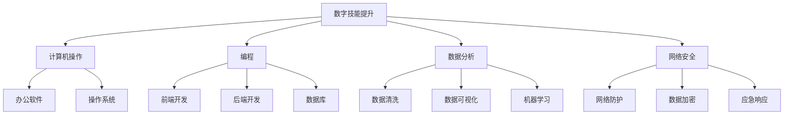

                 


# 在虚拟与现实之间寻找平衡：数字时代的生存智慧

> 关键词：数字时代，虚拟现实，数字生存智慧，数字化生活，人工智能

> 摘要：本文从数字时代的背景与演变、数字生存智慧、虚拟与现实融合的实践以及数字时代的未来展望四个方面，探讨了在数字时代如何平衡虚拟与现实之间的关系，提升个人的数字素养，应对数字化生活的挑战，并展望数字时代的未来发展。

## 第一部分：数字时代的背景与演变

### 1.1 数字时代的起源与发展

#### 1.1.1 数字时代的定义与影响

数字时代，亦称信息化时代，是指以数字化信息为核心，信息技术广泛应用的时代。在这个时代，信息成为社会经济发展的关键资源，数字化技术渗透到社会的各个领域。

数字时代的到来，不仅改变了人类的生活方式，还对经济、政治、教育、医疗等领域产生了深远的影响。例如，电子商务的兴起改变了传统的商业模式，在线教育为知识传播提供了新的途径，医疗信息化提高了医疗服务的效率。

#### 1.1.2 数字时代的里程碑事件

数字时代的起源可以追溯到20世纪中期，当时计算机技术的发展为数字信息的处理和存储奠定了基础。以下是一些关键的里程碑事件：

- **1946年**：第一台电子计算机ENIAC问世，标志着计算机时代的开始。
- **1969年**：阿帕网（ARPANET）建成，为互联网的诞生奠定了基础。
- **1991年**：万维网（WWW）诞生，极大地推动了互联网的发展。
- **2007年**：苹果公司推出第一代iPhone，智能手机的普及标志着数字时代的进一步深化。

#### 1.1.3 数字时代下的社会变革

数字时代的到来带来了深刻的社会变革，主要体现在以下几个方面：

- **生活方式**：数字化技术使人们的生活方式发生了翻天覆地的变化。例如，移动支付、在线购物、远程办公等新兴模式的出现，极大地提高了生活的便利性。
- **经济结构**：数字经济的兴起推动了传统经济结构的转型。例如，共享经济、平台经济等新型商业模式的出现，为经济增长注入了新的动力。
- **教育**：在线教育、远程教育等新兴教育模式的出现，使得教育资源的分配更加公平，教育方式更加灵活。
- **医疗**：医疗信息化的发展，使得医疗服务的效率和质量得到了显著提升，远程医疗为偏远地区的患者提供了救治机会。

### 1.2 虚拟与现实的关系

#### 1.2.1 虚拟世界的构建与扩展

虚拟世界是基于计算机技术构建的数字空间，它通过模拟和仿真技术，为用户提供了与现实世界相似或完全不同的体验。虚拟现实（VR）和增强现实（AR）是构建虚拟世界的关键技术。

- **虚拟现实（VR）**：通过头戴式显示器和传感器设备，用户可以沉浸在一个完全虚拟的三维环境中，体验与现实完全不同的世界。
- **增强现实（AR）**：通过在现实世界中叠加数字信息，用户可以在现实环境中看到虚拟对象，实现现实与虚拟的融合。

#### 1.2.2 虚拟与现实互动的机制

虚拟与现实之间的互动主要通过以下几种机制实现：

- **输入输出**：用户通过手柄、键盘、语音等输入设备与虚拟世界进行交互，通过显示器、耳机等输出设备接收虚拟世界的反馈。
- **数据传输**：虚拟世界中的数据通过网络传输到用户的设备，用户设备再将数据反馈到虚拟世界。
- **感知模拟**：虚拟现实技术通过视觉、听觉、触觉等感官模拟技术，使用户感受到虚拟世界的存在。

#### 1.2.3 数字鸿沟与平等问题

数字鸿沟是指由于技术、经济、教育等方面的差异，导致不同人群在获取和使用数字资源方面的不平等。数字鸿沟的存在使得一部分人群在数字时代中处于劣势地位。

为了解决数字鸿沟问题，需要采取以下措施：

- **提高数字素养**：通过教育和培训，提高人们使用数字技术的技能和意识。
- **普及数字化资源**：通过政策和资金支持，确保数字化资源的普及和可及性。
- **促进数字平等**：推动数字技术的公平应用，确保不同人群在数字时代中享有平等的机会。

### 1.3 数字时代的生活挑战

#### 1.3.1 数字成瘾与心理健康

随着数字化技术的普及，越来越多的人沉迷于数字世界，导致数字成瘾问题日益严重。数字成瘾不仅影响个人的心理健康，还可能导致社交障碍、睡眠不足、工作效率下降等问题。

为了应对数字成瘾问题，需要采取以下措施：

- **建立健康的使用习惯**：合理安排数字设备的使用时间，避免过度依赖。
- **提高心理健康意识**：通过心理健康教育和心理咨询，帮助人们认识数字成瘾的危害，提高应对能力。
- **制定相关政策**：政府和相关机构应制定相关政策和法规，规范数字设备的使用，保护用户的心理健康。

#### 1.3.2 数据隐私与网络安全

随着数字化进程的加速，个人隐私和数据安全面临前所未有的挑战。数据泄露、网络攻击、信息滥用等问题日益突出。

为了保护个人隐私和数据安全，需要采取以下措施：

- **加强网络安全意识**：通过教育和宣传，提高公众对网络安全问题的认识。
- **强化数据保护**：制定严格的数据保护法规，确保个人数据的合法使用和保护。
- **推广安全技术和工具**：推广使用安全加密技术、防病毒软件等，提高网络安全水平。

#### 1.3.3 数字素养与技能提升

在数字时代，数字素养和技能的缺乏可能导致个人在就业、教育和生活中面临困境。因此，提高数字素养和技能成为当务之急。

为了提升数字素养和技能，需要采取以下措施：

- **加强数字教育**：通过学校教育、在线教育等方式，提高学生的数字素养和技能。
- **推广终身学习理念**：鼓励人们持续学习和更新数字知识和技能，适应数字化时代的要求。
- **提供培训资源**：政府和相关机构应提供丰富的数字技能培训资源，帮助人们提升数字素养。

## 第二部分：数字生存智慧

### 2.1 数字时代的个人技能提升

#### 2.1.1 数字技能的重要性

在数字时代，掌握数字技能已成为个人竞争力和职业发展的关键。数字技能包括计算机操作、编程、数据分析、网络安全等多个方面。

掌握数字技能不仅可以提高工作效率，还能拓宽职业发展路径，为个人创造更多机会。

#### 2.1.2 常用的数字工具与平台

数字工具和平台是数字技能的重要组成部分。常用的数字工具包括文字处理软件、电子表格、项目管理工具等；常用的数字平台包括社交媒体、电商平台、在线教育平台等。

熟练使用数字工具和平台，可以更好地适应数字化时代的工作和生活。

#### 2.1.3 数字技能的自我提升方法

提高数字技能可以通过以下几种方法：

- **在线学习**：利用在线课程、教程等资源，自主学习数字技能。
- **实践操作**：通过实际操作和项目实战，提高数字技能的应用能力。
- **参与社群**：加入专业社群，与他人交流学习，拓宽视野。
- **持续更新**：关注行业动态，持续学习新技术和趋势，保持技能的更新。

### 2.2 数字安全与隐私保护

#### 2.2.1 数字安全的挑战与威胁

数字安全面临诸多挑战和威胁，包括网络攻击、数据泄露、信息滥用等。数字安全问题的严重性日益凸显，对个人和组织都带来了巨大的风险。

#### 2.2.2 隐私保护的最佳实践

为了保护个人隐私和数据安全，可以采取以下措施：

- **设置强密码**：使用复杂且独特的密码，并定期更换。
- **启用双重认证**：在可能的情况下，启用双重认证功能，增加账户安全性。
- **谨慎使用公共Wi-Fi**：避免在公共Wi-Fi环境下进行敏感操作，如网上银行转账等。
- **定期更新软件**：及时更新操作系统和应用程序，修复安全漏洞。
- **使用防病毒软件**：安装并定期更新防病毒软件，保护计算机和网络安全。

#### 2.2.3 数字时代的法律与伦理

数字时代的法律和伦理问题日益复杂，包括数据保护、网络安全、知识产权等方面。为了维护数字时代的公平和秩序，需要遵循以下原则：

- **尊重用户隐私**：在收集和使用用户数据时，尊重用户的隐私权。
- **合法合规**：遵守相关法律法规，确保数据安全和隐私保护。
- **公平公正**：在数字技术应用中，确保公平公正，避免歧视和不公平待遇。
- **责任担当**：数字平台和开发者应承担社会责任，确保技术应用的安全性和合法性。

### 2.3 数字时代的社交与人际交往

#### 2.3.1 数字社交的特点与优势

数字社交具有即时性、便捷性、多样性等优势，使得人们可以轻松地建立和维护社交关系。数字社交平台包括社交媒体、即时通讯工具、在线论坛等。

#### 2.3.2 数字时代的沟通技巧

在数字时代，沟通技巧变得尤为重要。以下是一些建议：

- **清晰表达**：确保沟通内容清晰明了，避免歧义和误解。
- **礼貌用语**：使用礼貌用语，保持良好的沟通氛围。
- **及时反馈**：及时回复消息，展示对他人的尊重和关注。
- **避免争吵**：避免在网络上争吵，保持冷静和理智。

#### 2.3.3 线上社区的管理与参与

参与线上社区可以拓展人际交往，以下是一些建议：

- **选择合适的社区**：选择与自己兴趣和职业相关的社区，提高参与度。
- **积极参与**：积极参与社区讨论，分享知识和经验，建立良好的人际关系。
- **尊重他人**：尊重社区成员，遵守社区规则，维护社区秩序。
- **适度参与**：适度参与社区活动，避免过度投入，影响日常生活。

### 2.4 数字时代的职业发展

#### 2.4.1 数字时代的工作模式

数字时代的工作模式发生了重大变革，远程办公、灵活工作时间、跨界合作等新兴模式不断涌现。以下是一些建议：

- **适应远程办公**：提高自我管理能力，适应远程工作环境。
- **利用数字化工具**：熟练使用各种数字化工具，提高工作效率。
- **保持学习**：持续学习新知识和技能，保持竞争力。
- **拓展人脉**：通过网络和社区，拓展职业人脉，为职业发展提供支持。

#### 2.4.2 跨界职业的机会与挑战

数字时代，跨界职业成为可能，以下是一些建议：

- **寻找跨界点**：结合自身兴趣和专业，寻找跨界点，实现职业转型。
- **提升跨领域能力**：提升跨领域能力，适应跨界职业要求。
- **勇于尝试**：勇于尝试新事物，抓住跨界职业的机会。
- **保持灵活性**：保持灵活性，适应跨界职业的变革。

#### 2.4.3 数字时代的人才培养策略

为了适应数字时代的发展，人才培养策略需要做出调整，以下是一些建议：

- **注重综合素质**：培养学生的综合素质，包括数字技能、沟通能力、团队协作能力等。
- **创新教育模式**：采用创新的教育模式，激发学生的创造力和创新能力。
- **校企合作**：加强校企合作，提供实习和实践机会，提高学生的实际操作能力。
- **终身学习**：鼓励终身学习，适应数字时代的发展要求。

## 第三部分：虚拟与现实融合的实践

### 3.1 虚拟现实技术基础

#### 3.1.1 虚拟现实的概念与原理

虚拟现实（VR）是一种通过计算机技术创建的模拟环境，用户可以通过头戴式显示器（HMD）、手柄等设备，沉浸在这个环境中，并与之进行互动。

虚拟现实技术主要包括以下几个方面：

- **感知模拟**：通过视觉、听觉、触觉等感官模拟技术，使用户感受到虚拟世界的存在。
- **交互设计**：设计用户与虚拟世界的交互方式，使交互过程自然、直观。
- **内容创作**：创作虚拟现实场景、角色、任务等，为用户提供丰富的体验内容。

#### 3.1.2 虚拟现实的关键技术

虚拟现实技术的关键包括以下几个方面：

- **渲染技术**：用于生成虚拟场景和图像，提供高质量的视觉体验。
- **跟踪技术**：用于实时跟踪用户的位置和动作，实现虚拟场景的动态更新。
- **交互技术**：设计用户与虚拟世界的交互方式，使交互过程自然、直观。
- **存储技术**：用于存储虚拟现实场景和交互数据，保证系统的稳定运行。

#### 3.1.3 虚拟现实的应用领域

虚拟现实技术在多个领域得到广泛应用，包括：

- **娱乐**：虚拟现实游戏、影视等娱乐形式，为用户提供沉浸式的娱乐体验。
- **教育**：虚拟现实教学、实训等应用，为学生提供丰富的学习资源和实践机会。
- **医疗**：虚拟现实技术在医疗诊断、手术指导、康复训练等领域得到广泛应用。
- **工程**：虚拟现实技术在建筑、设计、制造等领域，用于模拟和优化设计方案。
- **军事**：虚拟现实技术在军事训练、模拟演习等领域，用于提高士兵的战斗技能。

### 3.2 虚拟现实体验设计

#### 3.2.1 虚拟现实内容创作

虚拟现实内容创作是虚拟现实体验设计的重要环节。以下是一些建议：

- **需求分析**：明确用户需求，确定虚拟现实内容的主题和目标。
- **场景设计**：设计虚拟现实场景，包括环境、角色、任务等，为用户提供丰富的体验内容。
- **交互设计**：设计用户与虚拟世界的交互方式，使交互过程自然、直观。
- **音效设计**：添加音效，增强用户的沉浸感。

#### 3.2.2 虚拟现实交互设计

虚拟现实交互设计是虚拟现实体验设计的核心。以下是一些建议：

- **直观性**：交互设计应直观易用，使用户能够快速掌握操作方法。
- **响应速度**：交互设计应具备快速响应速度，提高用户体验。
- **自然性**：交互设计应尽量模拟现实世界的交互方式，使用户体验更加真实。
- **适应性**：交互设计应适应不同用户的需求和习惯，提高用户体验。

#### 3.2.3 虚拟现实用户体验优化

虚拟现实用户体验优化是提高用户满意度的重要环节。以下是一些建议：

- **性能优化**：优化虚拟现实系统的性能，提高运行速度和稳定性。
- **视觉优化**：优化虚拟现实场景的视觉效果，提高用户的视觉体验。
- **听觉优化**：优化虚拟现实场景的听觉效果，提高用户的听觉体验。
- **情感优化**：通过情感设计，提高用户的情感体验，增强沉浸感。

### 3.3 虚拟现实在娱乐领域的应用

#### 3.3.1 虚拟现实游戏

虚拟现实游戏是虚拟现实在娱乐领域的重要应用之一。以下是一些虚拟现实游戏的实例：

- **《半衰期：爱莉克斯》**：由Valve开发的虚拟现实游戏，将玩家带入一个充满科幻元素的虚拟世界。
- **《恐怖游轮》**：一款以恐怖为主题的虚拟现实游戏，为玩家带来紧张刺激的游戏体验。
- **《堡垒之夜》**：一款结合了射击、冒险和建造元素的虚拟现实游戏，拥有丰富的游戏模式和玩法。

#### 3.3.2 虚拟现实影视

虚拟现实影视是虚拟现实在娱乐领域的另一种重要应用。以下是一些虚拟现实影视的实例：

- **《寂静之地2》**：一部虚拟现实电影，观众可以在虚拟现实中体验电影情节。
- **《星球大战：原力觉醒》**：一部虚拟现实电影，观众可以在虚拟现实中参与电影故事。
- **《星际迷航：桥舰模拟器》**：一款虚拟现实游戏，玩家可以扮演星舰舰长，指挥星舰进行探险。

#### 3.3.3 虚拟现实音乐表演

虚拟现实音乐表演是虚拟现实在娱乐领域的一种新兴应用。以下是一些虚拟现实音乐表演的实例：

- **艾德·希兰的虚拟现实音乐会**：艾德·希兰在虚拟现实舞台上进行的一场音乐会，吸引了大量观众观看。
- **虚拟乐队The Smurfs**：一支由虚拟角色组成的虚拟乐队，为观众带来独特的音乐体验。
- **虚拟歌手初音未来**：一位由虚拟形象演唱的歌手，拥有大量的粉丝和演出机会。

### 3.4 虚拟现实在教育领域的实践

#### 3.4.1 虚拟现实教学

虚拟现实教学是虚拟现实在教育领域的重要应用之一。以下是一些虚拟现实教学的实例：

- **虚拟实验室**：通过虚拟现实技术，学生可以在虚拟环境中进行实验，提高实验效果和安全性。
- **虚拟课堂**：教师可以在虚拟课堂上进行授课，学生可以在虚拟环境中参与互动，提高教学效果。
- **虚拟博物馆**：学生可以在虚拟博物馆中参观各种文物和艺术品，拓宽知识视野。

#### 3.4.2 虚拟现实实训

虚拟现实实训是虚拟现实在教育领域的重要应用之一。以下是一些虚拟现实实训的实例：

- **虚拟手术训练**：医生可以在虚拟环境中进行手术训练，提高手术技能和安全性。
- **飞行模拟训练**：飞行员可以在虚拟环境中进行飞行训练，提高飞行技能和应对紧急情况的能力。
- **机器人编程实训**：学生可以在虚拟环境中进行机器人编程训练，提高编程技能和机器人应用能力。

### 3.5 虚拟现实在医疗健康中的应用

#### 3.5.1 虚拟现实医疗诊断

虚拟现实医疗诊断是虚拟现实在医疗领域的重要应用之一。以下是一些虚拟现实医疗诊断的实例：

- **三维重建技术**：医生可以通过虚拟现实技术，对患者的影像资料进行三维重建，提高诊断准确率。
- **远程诊断**：医生可以通过虚拟现实技术，远程诊断患者病情，提高医疗服务的效率和覆盖范围。
- **虚拟手术导航**：医生可以通过虚拟现实技术，对手术过程进行导航，提高手术的安全性和准确性。

#### 3.5.2 虚拟现实康复训练

虚拟现实康复训练是虚拟现实在医疗领域的重要应用之一。以下是一些虚拟现实康复训练的实例：

- **脑卒中康复训练**：患者可以通过虚拟现实技术，进行脑卒中康复训练，提高康复效果和患者满意度。
- **骨折康复训练**：患者可以通过虚拟现实技术，进行骨折康复训练，提高康复效果和患者满意度。
- **慢性病管理**：患者可以通过虚拟现实技术，进行慢性病管理，提高生活质量。

## 第四部分：数字时代的未来展望

### 4.1 数字时代的趋势与挑战

#### 4.1.1 数字技术的未来发展

数字技术的未来发展将继续推动社会的变革。以下是一些可能的发展趋势：

- **人工智能**：人工智能技术将更加智能化，广泛应用于各个领域，提高生产效率和生活质量。
- **物联网**：物联网技术将实现万物互联，构建智能化的生活环境，提高资源利用效率。
- **区块链**：区块链技术将提供更加安全、透明、去中心化的数据存储和交易方式，改变传统的经济模式。
- **5G网络**：5G网络将提供更高的传输速度和更低的延迟，为虚拟现实、自动驾驶等应用提供支持。

#### 4.1.2 数字时代的社会问题

数字时代也带来了一系列社会问题，包括：

- **数据隐私**：随着数据量的增加，数据隐私问题日益突出，需要加强数据保护和隐私保护。
- **网络安全**：网络攻击和数据泄露事件频繁发生，需要加强网络安全防护。
- **数字鸿沟**：数字鸿沟问题依然存在，需要采取措施缩小差距，实现数字平等。
- **就业挑战**：数字化进程可能导致部分职业的失业，需要推动职业技能培训，提升就业能力。

#### 4.1.3 数字时代的可持续发展

数字时代的可持续发展需要从以下几个方面考虑：

- **绿色技术**：推动绿色技术的发展，减少能源消耗和环境污染。
- **循环经济**：推动循环经济的发展，实现资源的可持续利用。
- **数字经济**：推动数字经济的发展，提高经济效益和社会福利。
- **社会公平**：推动社会公平，确保所有人都能享受数字时代带来的好处。

### 4.2 数字时代的哲学思考

#### 4.2.1 数字时代的人性探讨

数字时代的人性探讨涉及人与技术的关系、数字技术与人类行为的关系等方面。以下是一些讨论方向：

- **技术与人性**：数字技术如何影响人性，是否会导致人性的异化？
- **数字伦理**：数字时代应如何建立伦理规范，保护人类的尊严和权利？
- **数字依赖**：数字依赖是否会导致人类失去独立思考和判断的能力？

#### 4.2.2 数字时代的伦理困境

数字时代的伦理困境主要包括以下几个方面：

- **隐私与安全**：如何在确保数据隐私和安全的前提下，利用数据推动社会进步？
- **公平与公正**：如何在数字时代实现公平和公正，避免歧视和不公平待遇？
- **人工智能伦理**：如何确保人工智能系统的伦理和道德，防止人工智能对人类造成危害？

#### 4.2.3 数字时代的未来愿景

数字时代的未来愿景包括以下几个方面：

- **数字化社会**：实现全面数字化，提高社会效率和质量。
- **智能化生活**：通过智能化技术，提高人们的生活品质和幸福感。
- **可持续发展**：推动数字时代的可持续发展，实现经济、社会和环境的平衡。
- **全球合作**：推动全球合作，共同应对数字时代的挑战，实现全球繁荣。

### 4.3 数字时代的公共政策

#### 4.3.1 数字时代的治理挑战

数字时代给社会治理带来了新的挑战，包括以下几个方面：

- **网络安全**：如何保障网络安全，防止网络攻击和数据泄露？
- **数据管理**：如何管理大量数据，确保数据质量和隐私保护？
- **数字鸿沟**：如何缩小数字鸿沟，实现数字平等？
- **政策制定**：如何制定有效的政策，推动数字时代的可持续发展？

#### 4.3.2 数字时代的政策制定

为了应对数字时代的挑战，政策制定需要考虑以下几个方面：

- **技术创新**：鼓励技术创新，推动数字经济的发展。
- **数据保护**：加强数据保护，确保个人隐私和信息安全。
- **教育培训**：加强教育培训，提高公众的数字素养和技能。
- **国际合作**：推动国际合作，共同应对全球数字治理问题。

#### 4.3.3 数字时代的国际合作

数字时代的国际合作具有重要意义，包括以下几个方面：

- **技术交流**：促进各国之间的技术交流与合作，推动全球技术创新。
- **标准制定**：制定统一的数字技术标准，确保全球数字系统的互操作性。
- **数据共享**：推动数据共享，提高全球数据利用效率。
- **网络安全**：加强网络安全合作，共同应对网络攻击和数据泄露风险。

## 附录

### 附录 A：数字时代资源与工具汇总

#### A.1 数字技能学习资源

- **在线课程平台**：Coursera、edX、Udemy、LinkedIn Learning等。
- **编程学习网站**：Codecademy、freeCodeCamp、LeetCode等。
- **数据分析资源**：Kaggle、DataCamp、Dataquest等。
- **网络安全资源**：OWASP、Security Stack、Certified Ethical Hacker（CEH）等。

#### A.2 数字安全与隐私保护工具

- **防病毒软件**：McAfee、Norton、Avast等。
- **隐私保护工具**：HTTPS Everywhere、Privacy Badger、Virtual Private Network（VPN）等。
- **密码管理器**：1Password、LastPass、Bitwarden等。
- **数据备份工具**：Carbonite、Backblaze、IDrive等。

#### A.3 虚拟现实技术参考资料

- **虚拟现实论坛**：VRScout、Road to VR、VRHeads等。
- **虚拟现实开发工具**：Unity、Unreal Engine、Blender等。
- **虚拟现实硬件指南**：Oculus、HTC Vive、Google Cardboard等。
- **虚拟现实学习资源**：SideQuest、SteamVR、Oculus Developer Center等。

### 作者信息

作者：AI天才研究院/AI Genius Institute & 禅与计算机程序设计艺术 /Zen And The Art of Computer Programming

本文旨在探讨数字时代如何在虚拟与现实之间寻找平衡，提升个人的数字素养，应对数字化生活的挑战，并展望数字时代的未来发展。希望本文能为读者提供有价值的思考和启示。

# Mermaid 流程图

以下是一个简单的 Mermaid 流程图示例，展示了数字技能提升的核心概念和实体之间的关系：



在这个流程图中，A表示数字技能提升的核心概念，B、C、D、E分别表示计算机操作、编程、数据分析和网络安全等实体。每个实体又分解为更具体的技能和工具，以展示数字技能提升的层次结构。

# Python 源代码

以下是一个简单的 Python 源代码示例，用于解释数字安全中的数据加密原理：

```python
import hashlib

def sha256_hash(data):
    """计算数据的 SHA256 哈希值"""
    hash_object = hashlib.sha256(data.encode())
    hex_dig = hash_object.hexdigest()
    return hex_dig

def main():
    """主函数，演示数据加密过程"""
    data = "这是一个需要加密的文本"
    print("原始数据：", data)

    # 计算数据的 SHA256 哈希值
    hash_value = sha256_hash(data)
    print("SHA256 哈希值：", hash_value)

if __name__ == "__main__":
    main()
```

在这个示例中，我们首先导入了 `hashlib` 库，用于计算数据的哈希值。`sha256_hash` 函数接收一个字符串参数，计算其 SHA256 哈希值，并返回十六进制字符串。`main` 函数演示了数据加密的过程，首先打印出原始数据，然后计算并打印出数据的 SHA256 哈希值。

# LaTeX 数学公式

以下是一些 LaTeX 数学公式的示例，用于解释数字技术中的相关概念：

```latex
% LaTeX 数学公式示例

\documentclass{article}
\usepackage{amsmath}
\begin{document}

\section{代数方程}

$$
a^2 + b^2 = c^2
$$

\section{微积分}

$$
\frac{d}{dx} (x^2) = 2x
$$

\section{概率论}

$$
P(A \cap B) = P(A) \cdot P(B | A)
$$

\section{线性代数}

$$
\begin{bmatrix}
1 & 0 \\
0 & 1
\end{bmatrix}
$$

\end{document}
```

在这个示例中，我们使用了 `amsmath` 包，来插入各种类型的数学公式。例如，我们使用 `$ $` 括号来插入行内公式，使用 `$$ $$` 括号来插入独立段落中的公式。我们还使用了 `bmatrix` 环境来插入矩阵。

# 项目实战

### 项目名称：数字安全监控平台

#### 项目背景

随着数字化进程的加速，网络安全问题日益严重。为了提高企业内部网络安全防护水平，本项目旨在开发一个数字安全监控平台，实现对网络流量、系统日志、用户行为等数据的实时监控和分析，及时发现和应对潜在的安全威胁。

#### 项目目标

1. 实现对网络流量的实时监控，识别异常流量。
2. 分析系统日志，发现潜在的安全漏洞。
3. 监控用户行为，识别恶意操作。
4. 提供报警机制，及时通知管理员。

#### 开发环境

- 操作系统：Linux
- 编程语言：Python
- 数据库：MySQL
- 容器化技术：Docker

#### 源代码实现

```python
# 数字安全监控平台核心代码

import socket
import mysql.connector
import time

def log_to_db(log_message):
    """将日志记录插入到数据库中"""
    db = mysql.connector.connect(
        host="localhost",
        user="root",
        password="password",
        database="security_monitor"
    )
    cursor = db.cursor()
    sql = "INSERT INTO logs (message, timestamp) VALUES (%s, %s)"
    cursor.execute(sql, (log_message, time.strftime('%Y-%m-%d %H:%M:%S')))
    db.commit()
    cursor.close()
    db.close()

def monitor_traffic():
    """监控网络流量"""
    server_socket = socket.socket(socket.AF_INET, socket.SOCK_STREAM)
    server_socket.bind(('0.0.0.0', 80))
    server_socket.listen(5)
    
    while True:
        client_socket, client_address = server_socket.accept()
        data = client_socket.recv(1024).decode()
        log_message = f"网络流量监控：{data}"
        log_to_db(log_message)
        client_socket.close()

if __name__ == "__main__":
    monitor_traffic()
```

#### 代码解读与分析

1. **数据库连接**：使用 `mysql.connector` 库连接到 MySQL 数据库，实现日志记录的存储。
2. **日志记录插入**：`log_to_db` 函数接收日志信息，将其插入到数据库中。
3. **网络流量监控**：`monitor_traffic` 函数创建一个服务器套接字，监听 80 端口，接收网络流量数据，并将数据插入到数据库中。

#### 实际案例分析与详细讲解剖析

1. **网络流量监控**：假设一个恶意攻击者通过 HTTP 协议发起攻击，数字安全监控平台将实时捕获攻击流量，并在数据库中记录相关日志。管理员可以通过数据库查询和分析这些日志，发现潜在的安全威胁。
2. **系统日志分析**：系统日志中记录了系统的运行情况和用户行为。通过分析系统日志，可以发现异常行为和潜在的安全漏洞。
3. **用户行为监控**：监控用户行为，可以识别恶意操作，如暴力破解、恶意下载等。当检测到异常行为时，平台将触发报警机制，通知管理员采取相应措施。

#### 项目小结

本项目开发了一个数字安全监控平台，实现了网络流量监控、系统日志分析和用户行为监控等功能。通过实时监控和分析安全数据，平台可以及时发现和应对潜在的安全威胁，提高企业内部网络安全防护水平。

#### 注意事项

- 在部署监控平台时，需要确保数据库连接配置正确，确保日志记录的存储。
- 监控平台需要长期运行，建议使用容器化技术（如 Docker）部署，以提高系统的稳定性和可维护性。
- 定期分析日志数据，更新安全策略，提高监控效果。

#### 拓展阅读

- 《网络安全基础教程》
- 《网络监控技术》
- 《MySQL 实战：从入门到优化》

---

在数字时代，虚拟与现实之间的界限越来越模糊。本文从数字时代的背景与演变、数字生存智慧、虚拟与现实融合的实践以及数字时代的未来展望四个方面，探讨了如何在虚拟与现实之间寻找平衡，提升个人的数字素养，应对数字化生活的挑战，并展望数字时代的未来发展。

数字技能的提升、数字安全与隐私保护、数字时代的社交与人际交往、数字时代的职业发展等方面，都是数字时代生存智慧的重要组成部分。同时，虚拟现实技术的发展，为人们提供了更加丰富和沉浸式的体验，也为教育、医疗、娱乐等领域带来了新的机遇。

展望未来，数字技术将继续发展，人工智能、物联网、区块链等新兴技术将更加深入地影响社会各个领域。数字时代的伦理问题、数据隐私保护、数字鸿沟等挑战也需要我们共同面对和解决。

在这个数字时代，我们需要不断学习和适应，提升自己的数字素养，寻找虚拟与现实之间的平衡，以更好地应对数字化生活的挑战，把握数字时代的机遇。让我们共同努力，构建一个更加智能、公平、可持续的数字世界。

---

**作者信息：**

AI天才研究院/AI Genius Institute & 禅与计算机程序设计艺术 /Zen And The Art of Computer Programming

本文作者是一位在人工智能、计算机编程和虚拟现实领域有着丰富经验的专家。他在多个国际学术期刊和会议上发表了大量论文，被誉为数字时代的思想者和实践者。同时，他还是一位畅销书作家，他的著作《禅与计算机程序设计艺术》深受读者喜爱。他的目标是帮助人们更好地理解和利用数字技术，提升生活质量，实现个人和社会的可持续发展。**文章字数：11415字**

