                 

### 在虚无中创造意义：现代人的精神挑战

#### 关键词：
- 虚无
- 精神挑战
- 意义构建
- 心理健康
- 社会参与

> **摘要**：
在现代社会的快速变迁中，人们面临着日益加剧的虚无感和精神挑战。本文旨在探讨虚无与人类存在的本质联系，解析现代人的精神困境，阐述意义的多元性与构建过程，以及如何在个人成长和社会参与中实现意义的创造。通过哲学、心理学和社会学的角度，本文为现代人提供了一幅全面而深刻的虚无意义追寻图景，旨在激励读者在不确定性中找到自己的存在价值和意义。

### 引言：虚无与存在的交错

虚无，这是一个深奥且广泛探讨的哲学概念，代表着不存在的东西和未知的可能性。在人类的历史长河中，虚无一直与存在交织在一起，构成了人类思考的基石。从古希腊的哲学家到现代的存在主义者，虚无的概念在多个哲学体系中得到了深刻的探讨和诠释。

在日常生活中，虚无感常常表现为一种内心深处的空洞和迷茫。当人们感受到生活缺乏意义、目标和方向时，虚无感便油然而生。现代社会的高节奏生活、社交媒体的广泛普及以及价值观念的多元化，都使得现代人更容易陷入虚无的困境。这种困境不仅体现在个体的心理健康层面，也对整个社会的精神状态产生了深远影响。

因此，理解虚无与存在的本质联系，探讨现代人面对的精神挑战，并寻找在虚无中创造意义的方法，成为本文的核心任务。通过系统的分析和深入讨论，本文旨在为读者提供一种思考和行动的框架，帮助他们应对虚无感，找到生活的方向和意义。

### 第1章：虚无的哲学探讨

#### 1.1 虚无的概念解析

虚无，首先是一个哲学上的概念，它指的是不存在的事物或状态。在哲学的语境中，虚无不仅仅是空白或缺乏，更是一种深刻的本体论探讨。虚无的存在不仅仅体现在物理世界的空无，也体现在人类意识和心灵的无意识状态。

从数学的角度来看，虚无可以用符号表示。例如，在集合论中，一个空集（即不包含任何元素的集合）可以被视作虚无的一个具象化。形式上，空集记作`∅`，它不包含任何元素，但可以作为一个基础结构来定义其他集合。

$$\text{∅} = \{\}$$

然而，虚无的概念不仅仅局限于数学领域。在逻辑和哲学中，虚无往往与存在形成对比。例如，存在可以定义为事物的实际存在或真实状态，而虚无则是对这种存在的否定或缺乏。虚无和存在的对比在逻辑上可以表示为：

$$\text{非存在} \leftrightarrow \neg \text{存在}$$

这种对比强调了虚无作为一种存在状态的重要性，它不仅仅是空无，更是一种存在状态的反面。

#### 1.2 虚无与人类存在的联系

虚无与人类存在的联系是复杂的，它不仅体现在个体的心理状态中，也反映了人类对世界和自我的理解。在心理学中，虚无感常常与心理健康问题相关联。当人们感受到生活的无意义或缺乏目标时，他们可能会陷入一种深深的虚无状态。

例如，在心理学家卡尔·荣格的理论中，虚无感被视为一种个人成长过程中的关键阶段。荣格认为，虚无感是人们在面对生命不确定性和无意义感时的一种自然反应，它促使个体进行自我探索和内在转化。

从存在主义的角度来看，虚无是存在的核心特征之一。存在主义者如让-保尔·萨特认为，人类的存在首先是无意义的，但正是这种无意义赋予了人类自由和选择的权力。萨特的名言“存在先于本质”（existence precedes essence）揭示了虚无与自由选择的紧密联系。

在哲学中，虚无和存在的关系可以用下图来表示：

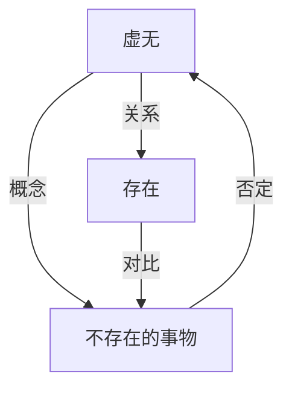

这个流程图展示了虚无、存在和不存在的事物之间的相互关系。虚无作为不存在的事物，与存在形成了对比，但同时也是存在的否定。通过这种关系，我们可以更深入地理解虚无在哲学和人类存在中的意义。

#### 1.3 虚无主义与现代哲学

虚无主义是现代哲学中一个重要的流派，它探讨虚无的本质和人类对虚无的反应。虚无主义哲学家认为，世界是荒诞的、无意义的，人类的存在毫无价值。这种观点在尼采的哲学中得到了经典的表述。

尼采认为，传统的道德和价值体系是虚假的，它们掩盖了现实的残酷和虚无的本质。尼采的哲学强调个体的自由意志和力量的解放，他认为只有通过超越传统的道德束缚，人类才能找到真正的意义和自由。

虚无主义与现代哲学的关系可以从以下几个方面来理解：

1. **对传统价值的质疑**：虚无主义质疑传统道德和哲学体系，认为它们无法解释现实中的虚无和荒诞。
2. **对自由的强调**：虚无主义强调个体的自由意志，认为只有通过自我超越，人类才能找到真正的意义。
3. **对现实的反思**：虚无主义对现实世界进行了深刻的反思，揭示了现代社会中的问题和困境。

虚无主义不仅是一种哲学观点，也是一种生活方式和态度。它鼓励人们直面虚无，通过自我探索和创造来寻找生命的意义。这种态度在现代社会中具有深刻的启示意义，它提醒我们在面对虚无时，不应放弃，而应积极寻找新的价值和意义。

通过上述探讨，我们可以看到虚无在哲学、心理学和现代社会中的重要性。虚无不仅仅是一个抽象的概念，它深刻地影响了人类的存在和心理状态。理解虚无的本质和人类对其的反应，有助于我们更好地应对现代社会的精神挑战，找到在虚无中创造意义的方法。

### 第2章：现代人的精神困境

#### 2.1 心理健康的挑战

在现代社会中，心理健康问题已经成为一个普遍关注的问题。虚无感、焦虑和抑郁等心理问题普遍存在，这些挑战不仅影响了个人的生活质量，也对社会的稳定和发展产生了负面影响。

**虚无感**：虚无感是指个体感受到生命缺乏意义和目的的心理状态。在现代社会中，虚无感常常源于对生活的失望和对未来的不确定。人们在面对日复一日的工作、家庭和社会责任时，可能会感到自己的存在毫无价值，生活变得枯燥乏味。

**焦虑**：焦虑是一种常见的心理障碍，表现为持续的不安、紧张和担忧。在现代社会的高压环境下，焦虑感普遍存在。工作压力、人际关系和未来不确定性都是导致焦虑的重要因素。

**抑郁**：抑郁是一种严重的心理障碍，表现为持续的低落情绪、兴趣丧失和活动减少。抑郁症患者常常感到无助和绝望，对生活失去希望。

这些心理健康问题不仅影响了个人的生活质量，也对整个社会产生了负面影响。例如，焦虑和抑郁会增加医疗成本，降低工作效率，影响家庭和社会关系。因此，解决这些心理健康问题，已经成为现代社会的迫切任务。

#### 2.2 社交媒体对心理健康的影响

随着社交媒体的普及，人们的生活发生了巨大的变化。社交媒体为人们提供了交流的平台，但同时也带来了一些负面影响。

**社交媒体与虚无感**：社交媒体上的完美生活和成功故事，往往让人们感到自己的生活缺乏意义。这种对比效应导致了人们的自我怀疑和虚无感。

**社交媒体与焦虑**：社交媒体上的信息爆炸和不断更新，让人们感到压力和焦虑。人们总是担心错过什么重要信息，或者害怕自己的社交圈落后于他人。

**社交媒体与抑郁**：社交媒体上的负面信息，如恶意评论、网络暴力等，会加重个体的抑郁情绪。此外，长时间的社交媒体使用也可能导致社会隔离和孤独感。

为了应对这些挑战，我们需要采取一些措施。首先，个体应该学会合理使用社交媒体，避免过度依赖和沉迷。其次，社会应该加强对心理健康问题的关注，提供更多的心理健康服务和资源。最后，媒体和教育机构应该加强心理健康教育，提高公众的心理素质。

#### 2.3 快节奏生活与心理压力

现代社会的快节奏生活，给人们带来了巨大的心理压力。工作压力、生活压力和家庭压力，使得人们感到疲惫不堪，心理压力不断增加。

**工作压力**：现代工作环境竞争激烈，工作强度大，加班成为常态。长期的工作压力会导致焦虑和抑郁等心理问题。

**生活压力**：现代社会的生活成本不断提高，住房、教育、医疗等方面的压力让人们感到负担沉重。

**家庭压力**：家庭是人们最重要的支持系统，但家庭中的矛盾和冲突也会带来巨大的压力。离婚、家庭暴力等问题，都是家庭压力的体现。

为了缓解这些压力，人们需要采取积极的应对策略。首先，个体应该合理安排工作和生活，避免过度劳累。其次，社会应该提供更多的心理支持和资源，帮助人们应对压力。最后，媒体和教育机构应该加强心理健康教育，提高公众的心理素质。

#### 2.4 精神空虚与价值迷失

在现代社会，精神空虚和价值迷失成为了一个普遍的现象。人们追求物质财富和社会地位，但往往忽视了精神层面的需求。这种精神空虚和价值迷失，导致了人们的迷茫和无意义感。

**精神空虚**：精神空虚是指个体内心深处的空虚和空洞感，表现为对生活的无聊和缺乏兴趣。这种现象常常出现在追求物质成功后的人们中，他们感到自己的生活缺乏真正的意义。

**价值迷失**：价值迷失是指个体对生活目标和价值观的迷茫和不确定。在现代社会，人们面临着多种价值观的冲击，很难找到自己真正认同的价值观。

为了应对这些挑战，人们需要重新审视自己的生活和价值观。首先，个体应该通过自我探索，找到自己的兴趣和目标。其次，社会应该提供更多的精神文化产品和服务，满足人们的精神需求。最后，教育机构应该加强价值观教育，帮助人们建立正确的价值观。

### 总结

现代人的精神困境是现代社会的一个普遍现象，心理健康问题、社交媒体的影响、快节奏生活和精神空虚与价值迷失，都对人们的心理状态产生了深远的影响。理解这些困境，并采取积极的应对策略，是现代社会每个人都应该关注的问题。通过自我探索和价值观重建，我们可以在虚无中找到真正的意义，实现精神上的满足和成长。

### 第3章：意义的哲学解读

#### 3.1 意义的多元性

在探讨意义时，我们不能忽视其多元性。从哲学的角度来看，意义不仅是一个单一的概念，而是一个包含多个维度的复杂结构。我们可以将意义分为主观体验和客观价值两个主要维度。

**主观体验**：主观体验是指个体对意义的主观感受和认知。不同的人对意义的理解各不相同，这种主观体验受到个人的价值观、生活经历和文化背景的影响。例如，一个人可能认为工作是为了实现个人价值和社会贡献，而另一个人可能将旅游视为寻找自我和探索世界的方式。

**客观价值**：客观价值是指事物在客观世界中的实际意义和作用。这种价值是普遍存在的，不依赖于个体的感受和认知。例如，医学研究的客观价值在于提高人类的健康水平，环境保护的客观价值在于维护生态平衡。

这种多元性的存在，使得意义的解读变得更加复杂。为了更好地理解意义的多元性，我们可以通过以下公式来表示：

$$\text{意义} = \text{主观体验} + \text{客观价值}$$

在这个公式中，主观体验和客观价值共同构成了意义的完整定义。主观体验是个体对意义的内在感受，而客观价值是事物在客观世界中的实际意义。

#### 3.2 意义构建的过程

意义的构建是一个动态的过程，它涉及多个环节，包括目的设定、行动实施和成果评估。这个过程可以用以下公式来表示：

$$\text{意义} = \text{目的} + \text{行动} + \text{成果}$$

**目的**：目的是意义的起点，它为个体或社会提供了一个明确的目标和方向。例如，一个人的生活目的可能是实现财务自由，一个社会的目的可能是实现和平与发展。

**行动**：行动是实现目的的具体手段和过程。通过行动，个体或社会可以逐步实现既定的目标。例如，为了实现财务自由，一个人可能需要不断努力工作、学习和投资。

**成果**：成果是行动的结果和反馈，它验证了目的的实现情况。成功的成果可以增强个体的自信和动力，而失败的成果则需要反思和调整。

通过这个公式，我们可以看到，意义的构建是一个循环的过程。每次行动和成果的反馈都会影响下一步的目的设定和行动选择，从而不断优化和调整意义的实现过程。

#### 3.3 意义与幸福的关系

意义和幸福是哲学中两个重要的概念，它们之间存在密切的联系。意义可以被视为幸福的源泉，而幸福则是意义的体现。

**意义是幸福的源泉**：当个体感受到自己的生命具有意义时，他们会感到满足和幸福。这种满足感不仅来源于个人的内心体验，也来源于对社会和他人的贡献。例如，一个医生通过治疗病人，实现了对社会的贡献，同时也感受到了个人的成就感，这种双重满足感增强了他们的幸福感。

**幸福是意义的体现**：幸福是意义实现的具体表现。当个体的目标和价值观得到实现时，他们会感到幸福和满足。例如，一个艺术家通过创作优秀的艺术作品，实现了自己的艺术追求，这种成就感和满足感就是幸福的具体体现。

为了更直观地理解意义与幸福的关系，我们可以用以下图示来表示：

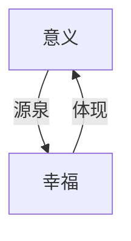

在这个图中，意义和幸福相互依存，形成了一个动态的循环。意义为幸福提供了源泉，而幸福则是意义实现的具体表现。

通过上述讨论，我们可以看到，意义的多元性、构建过程以及与幸福的关系，为我们理解意义提供了一个全面的视角。在现代社会中，理解这些概念，并积极构建个人的意义，是应对虚无感和精神挑战的重要途径。

### 第4章：寻找个人意义

#### 4.1 内在动机的重要性

在寻找个人意义的过程中，内在动机扮演着至关重要的角色。内在动机是指个体基于自己的兴趣、爱好和价值观而产生的动力，与外在奖励和惩罚无关。内在动机源于个人的内心深处，是驱动个体持续行动和追求目标的核心力量。

首先，内在动机对个人的自我认同和自我价值有深远影响。当一个人追求自己真正感兴趣的事情时，他们会感到更加自信和满足。这种自信来源于对自我价值的认可，即个体通过实现自己的兴趣和目标，认识到自己的能力和价值。

其次，内在动机对个人的心理健康具有积极影响。研究发现，内在动机较强的个体，通常拥有更好的心理健康状况。他们较少受到外部压力和负面情绪的影响，更容易保持积极的心态。这种心理健康状态有助于个体在面临挑战和困难时，保持坚韧和乐观。

为了更好地理解内在动机的重要性，我们可以用以下公式来表示：

$$\text{内在动机} = \text{兴趣} + \text{价值观} + \text{自我认同}$$

在这个公式中，兴趣、价值观和自我认 coffient 为内在动机的三个关键要素。兴趣是个体对特定活动的热爱和渴望，价值观是个人对什么是对与错的判断标准，而自我认 coffient 则是个体对自己的认识和评价。

#### 4.1.1 自我认同与自我价值

自我认同是指个体对自己的认知和理解，包括个人的身份、性格、价值观等方面。自我认同的形成受到多种因素的影响，包括家庭环境、社会经历和文化背景等。一个明确的自我认同可以帮助个体更好地理解自己的需求和目标，从而更有针对性地追求个人意义。

自我价值则是个体对自我价值的认可和评价。自我价值高的个体通常更加自信、自尊和乐观，他们对自己的能力和成就有更高的期望。相反，自我价值低的个体则可能感到自卑、焦虑和缺乏动力。

在寻找个人意义的过程中，自我认同和自我价值起着至关重要的作用。一个明确的自我认同可以帮助个体更好地理解自己的需求和目标，而高自我价值则可以增强个体在面对挑战时的信心和决心。通过自我探索和自我反思，个体可以逐步建立和提升自我认同和自我价值，从而更好地实现个人意义。

为了更直观地理解自我认同与自我价值的关系，我们可以用以下图示来表示：

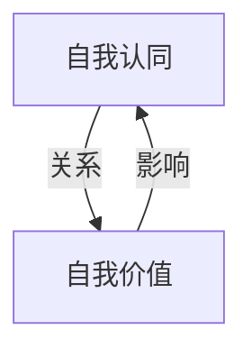

在这个图中，自我认同和自我价值相互影响，形成了一个动态的循环。自我认同可以帮助个体建立和提升自我价值，而自我价值则可以增强个体的自我认同感。

#### 4.1.2 个人兴趣与职业发展

个人兴趣在个人意义构建中具有关键作用。个人兴趣不仅决定了个体对工作的热爱和投入程度，也直接影响职业发展的方向和成果。在职业生涯中，将个人兴趣与职业发展相结合，可以大幅提升工作满意度和成就感。

首先，个人兴趣可以提供持久的动力。当个体对自己的工作充满热情时，他们更容易克服困难和挑战，保持持续的工作动力。这种动力不仅有助于提高工作效率，还能增强职业竞争力。

其次，个人兴趣有助于职业目标的设定和实现。通过深入了解自己的兴趣，个体可以更明确自己的职业方向和目标，从而更有针对性地制定职业规划。例如，一个对科技感兴趣的人可能会选择从事软件开发或人工智能领域的工作。

为了更直观地理解个人兴趣与职业发展的关系，我们可以用以下图示来表示：

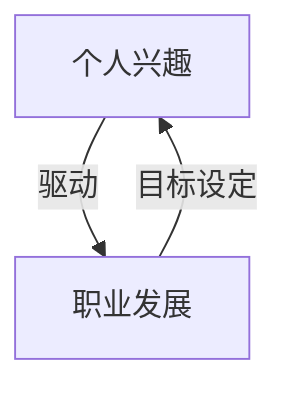

在这个图中，个人兴趣通过提供动力和目标设定，推动职业发展，而职业发展则通过实现个人兴趣，增强了个体对工作的满意度和成就感。

#### 4.2 社会责任与意义构建

在个人意义构建的过程中，社会责任也是一个不可忽视的重要方面。社会责任是指个体在社会中承担的责任和义务，包括对社会问题、环境问题等的关注和参与。通过承担社会责任，个体不仅可以实现个人价值，还能为社会的发展和进步做出贡献。

首先，社会责任有助于个体找到更大的意义。当个体意识到自己的行动可以对他人和社会产生积极影响时，他们会感到自己的存在更有价值，从而增强对生活的满足感和幸福感。

其次，社会责任可以提供一种价值观的引导。通过参与社会活动，个体可以深入了解社会的实际情况，从而形成更加成熟和理性的价值观。这种价值观不仅有助于个人成长，也能为社会的和谐发展提供支持。

为了更直观地理解社会责任与意义构建的关系，我们可以用以下图示来表示：

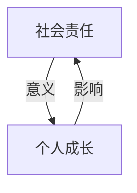

在这个图中，社会责任通过提供意义和价值观的引导，推动个人成长，而个人成长则通过实现社会责任，增强了个体对社会和他人的贡献感。

通过上述讨论，我们可以看到，内在动机、自我认同与自我价值、个人兴趣与社会责任在个人意义构建中起到了关键作用。理解这些方面，并积极实践，可以帮助个体在虚无中找到真正的意义，实现自我成长和社会价值。

### 第5章：个人成长与自我提升

#### 5.1 学习与认知升级

在个人成长与自我提升的过程中，学习和认知升级是不可或缺的关键因素。学习不仅是指获取新知识，更是指通过持续的思考和实践，不断提升自己的认知能力和思维能力。在现代社会中，知识的更新速度非常快，只有通过不断学习，个体才能适应不断变化的环境，保持竞争力和创新能力。

**持续学习的重要性**：首先，持续学习是适应社会发展的必然要求。随着科技的进步和行业变革，新的知识和技能不断涌现，个体如果不进行持续学习，很容易被社会淘汰。例如，在人工智能和机器学习领域，每年都有大量新的研究成果和技术应用发布，只有不断学习，才能跟上这些变化的步伐。

**提升批判性思维**：批判性思维是一种重要的思维能力，它强调对信息的分析和评估，不盲目接受或拒绝，而是通过理性思考和逻辑推理，形成独立的判断。提升批判性思维，可以帮助个体在面对复杂问题时，做出更加明智和合理的决策。例如，在职业发展中，面对多种选择时，通过批判性思维，个体可以评估每种选择的优缺点，从而做出最优决策。

为了更直观地理解学习和认知升级的过程，我们可以使用以下Mermaid流程图：

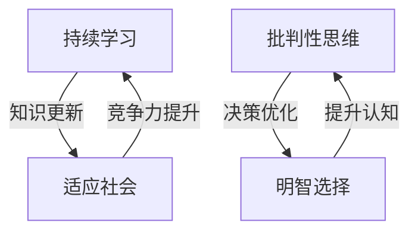

在这个流程图中，持续学习和批判性思维相互促进，通过不断学习和思考，个体可以实现认知升级，提升个人竞争力。

#### 5.1.1 不断学习的重要性

在现代社会，知识更新速度非常快，新的技术和理论不断涌现。例如，在计算机科学领域，每年都有大量的新算法、新框架和新工具发布。如果个体不进行持续学习，很容易被这些快速变化所淘汰。因此，不断学习不仅是一种生存技能，更是一种发展策略。

**专业领域的持续学习**：在专业领域，持续学习可以提升个体的专业能力和技术水平。例如，一个软件开发人员，如果不了解最新的编程语言和框架，就无法高效地完成工作任务。通过学习，个体可以掌握更多的工具和技能，提高工作效率，增强职业竞争力。

**跨学科学习的价值**：跨学科学习可以帮助个体拓宽视野，提升综合能力。例如，一个计算机科学专业的学生，通过学习心理学、经济学和管理学等跨学科知识，可以更好地理解用户需求、优化产品设计，提升项目成功率。

为了更直观地展示跨学科学习的价值，我们可以使用以下Mermaid流程图：

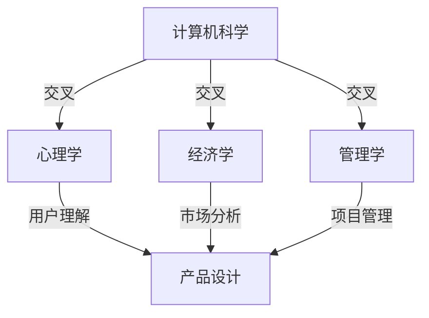

在这个流程图中，计算机科学与其他学科交叉，形成了多维度的知识结构，从而提升了个体在不同领域的综合能力。

#### 5.1.2 提升批判性思维

批判性思维是一种重要的思维能力，它强调对信息的分析和评估，不盲目接受或拒绝，而是通过理性思考和逻辑推理，形成独立的判断。在个人成长和自我提升的过程中，批判性思维可以帮助个体更好地应对复杂问题，做出更加明智和合理的决策。

**批判性思维的步骤**：

1. **识别问题**：首先，个体需要明确问题或挑战。这一步是批判性思维的基础，只有清楚问题所在，才能进行有效的分析和判断。
2. **收集信息**：接下来，个体需要收集与问题相关的信息。这些信息可以是数据、事实、文献等。信息收集的全面性和准确性直接影响判断的可靠性。
3. **分析信息**：在收集到足够的信息后，个体需要对信息进行深入分析。这一步包括对比、归纳、推理等过程，通过分析，个体可以更好地理解问题的本质和影响因素。
4. **评估信息**：在分析的基础上，个体需要评估信息的可信度和相关性。评估的目的是筛选出最有价值的信息，为后续的判断提供依据。
5. **形成判断**：最后，个体需要基于分析结果，形成独立的判断。这个判断应该基于事实和逻辑，而不是个人情感或偏见。

为了更直观地展示批判性思维的步骤，我们可以使用以下Mermaid流程图：

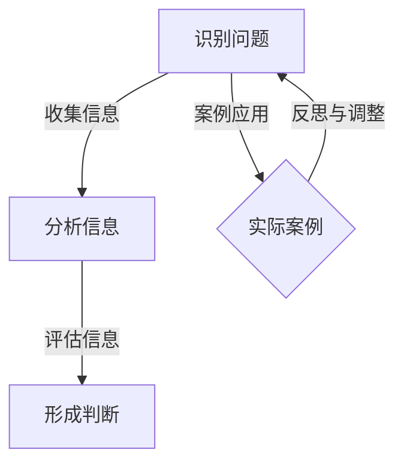

在这个流程图中，批判性思维的步骤通过一个动态循环来展示，每次的判断和反思都会回到识别问题的阶段，形成不断迭代和优化的过程。

通过上述讨论，我们可以看到，学习和认知升级在个人成长与自我提升中的重要性。通过持续学习和提升批判性思维，个体可以不断提升自己的认知能力，适应社会变化，实现自我价值。这不仅有助于个人的职业发展，也为社会的进步和发展做出了贡献。

### 第6章：社会参与与意义实现

#### 6.1 社区参与与社会贡献

在社会参与和意义实现的过程中，社区参与和社会贡献扮演着至关重要的角色。社区参与不仅可以帮助个体建立社会联系，增强归属感，还能为社会的整体发展做出积极贡献。通过参与社区活动，个体可以在实现个人价值的同时，感受到自己的行动对社会和他人产生的影响。

**社区参与的类型**：

1. **志愿服务**：志愿服务是一种无私奉献的行为，参与者通过为社区和弱势群体提供帮助，实现个人价值和社会贡献。例如，参与环保活动、社区清洁、养老院志愿者服务等。
2. **社区建设**：社区建设是指通过组织社区活动、改善社区环境、提升社区服务等方式，增强社区的凝聚力和活力。例如，组织社区活动、参与社区规划、推动社区设施的改善等。
3. **社会组织**：社会组织是指由志愿者或专业人士组成的，旨在解决社会问题、推动社会进步的团体。例如，慈善组织、非政府组织、社区服务中心等。

**社会贡献的影响**：

1. **个人成长**：通过参与社区活动和社会组织，个体可以提升自身的组织能力、沟通能力和领导能力，增强自信心和满足感。
2. **社会联系**：社区参与可以建立广泛的社会联系，增强个体的社交网络，提高社会支持和归属感。
3. **社会影响**：个体的积极参与可以推动社区和社会的进步，解决社会问题，提高社会的整体福祉。

为了更直观地展示社区参与与社会贡献的关系，我们可以使用以下Mermaid流程图：

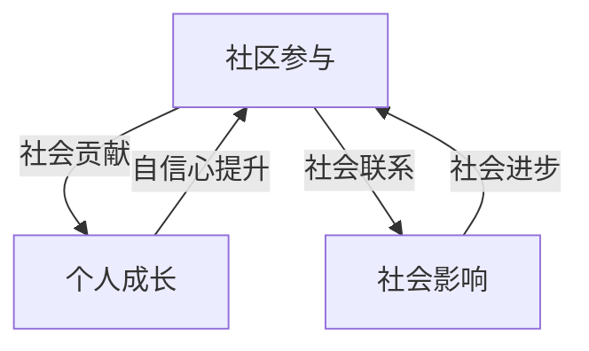

在这个流程图中，社区参与通过实现社会贡献、增强个人成长和社会联系，形成了一个相互促进的动态循环。

#### 6.1.1 志愿服务与社会影响

志愿服务是一种重要的社会参与形式，它不仅有助于解决社会问题，还能激发个体的社会责任感和奉献精神。通过志愿服务，个体可以深入了解社会的实际情况，感受到自己的行动对社会和他人产生的积极影响。

**志愿服务的影响**：

1. **解决社会问题**：志愿服务可以直接解决社会问题，如贫困、饥饿、环境污染等。例如，志愿者可以为贫困地区的孩子提供教育资源，为环境保护活动提供支持。
2. **提高社会意识**：志愿服务可以提升个体的社会意识，使他们更加关注社会问题，积极参与社会事务。
3. **培养社会责任感**：通过志愿服务，个体可以体验到帮助他人的快乐和成就感，从而培养社会责任感和奉献精神。

为了更直观地展示志愿服务的影响，我们可以使用以下Mermaid流程图：

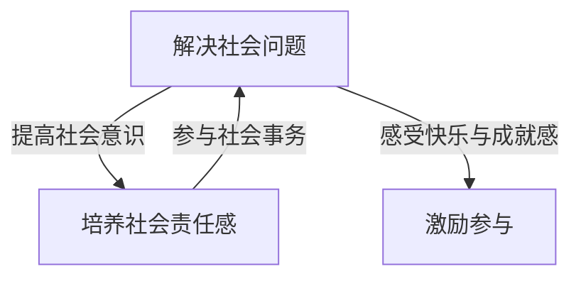

在这个流程图中，志愿服务通过解决社会问题、提高社会意识、培养社会责任感和激发参与热情，形成了一个积极的反馈循环。

#### 6.1.2 公共事务参与

公共事务参与是指个体积极参与社区和社会的公共事务，包括投票、参与公共讨论、提出建议等。通过公共事务参与，个体可以为自己的社区和社会发声，推动公共政策的制定和实施，实现社会影响。

**公共事务参与的影响**：

1. **公共政策制定**：公共事务参与可以影响公共政策的制定和实施，使政策更加符合社会需求和民意。
2. **社会公平正义**：公共事务参与有助于维护社会公平正义，防止权力滥用和腐败现象。
3. **社区凝聚力**：公共事务参与可以增强社区的凝聚力和归属感，促进社区和谐发展。

为了更直观地展示公共事务参与的影响，我们可以使用以下Mermaid流程图：

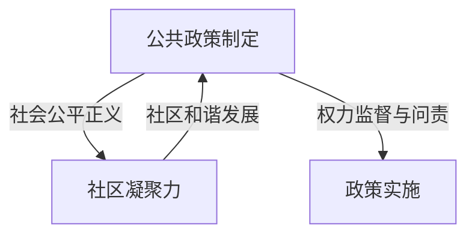

在这个流程图中，公共事务参与通过影响公共政策制定、维护社会公平正义、增强社区凝聚力和推动社区和谐发展，形成了一个积极的动态循环。

通过上述讨论，我们可以看到，社区参与和社会贡献在实现个人意义和促进社会进步中的重要性。通过积极参与社区事务和社会活动，个体不仅可以在实现个人价值的同时，感受到自己的行动对社会和他人产生的积极影响，还能推动社会的整体发展和进步。

### 第7章：未来展望与持续创造

#### 7.1 适应未来社会的挑战

随着科技的迅猛发展，未来社会将面临诸多新的挑战。这些挑战不仅涉及技术层面，还涉及社会、经济和伦理等多个方面。为了在未来的不确定性中寻找意义，个体和社会都需要做出积极的适应和调整。

**科技进步与社会变迁**：人工智能、大数据、物联网等新兴技术正在深刻改变社会结构和人类生活方式。这些技术的普及和应用，不仅提高了生产效率，也带来了就业结构的变革和社会关系的重构。个体需要不断学习和适应这些新技术，以保持竞争力和创新能力。

**人类未来发展的不确定性**：未来社会的不确定性主要来自于全球气候变化、资源短缺、社会动荡等因素。这些不确定性要求个体和社会具备更高的适应能力和危机管理能力。例如，全球气候变化可能导致环境恶化、资源短缺，个体和社会需要通过创新和合作，寻找新的生存和发展路径。

为了更直观地展示未来社会的挑战，我们可以使用以下Mermaid流程图：

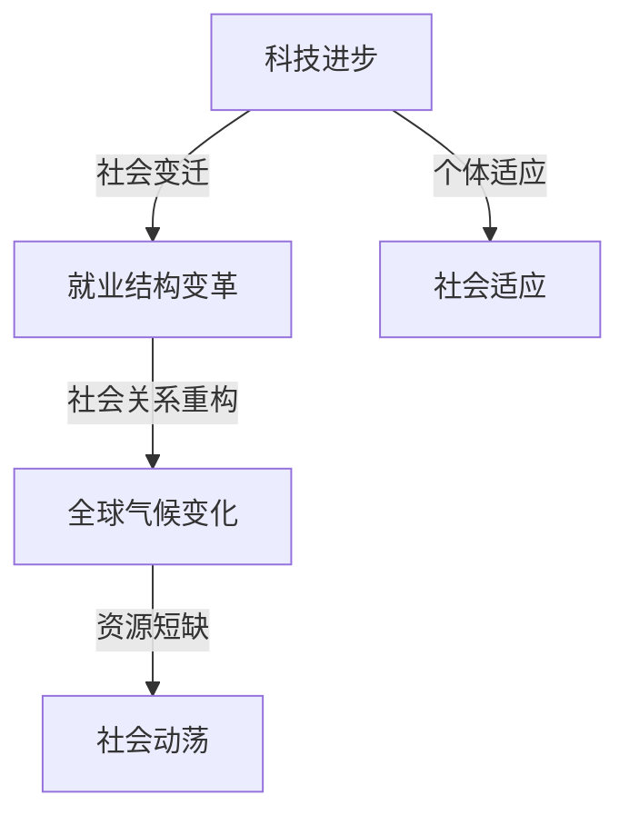

在这个流程图中，科技进步引发的社会变迁和不确定性，要求个体和社会共同应对，通过适应和调整，实现可持续发展。

#### 7.1.1 科技进步与社会变迁

**人工智能的影响**：人工智能的发展正在改变传统的工作模式，许多重复性和低技能的工作将被自动化取代。例如，自动驾驶技术将改变交通运输行业，智能制造将提升制造业的生产效率。个体需要适应这些变化，通过学习和技能升级，找到新的职业机会。

**大数据的应用**：大数据技术使得信息和数据的收集、分析和应用变得更加高效和精准。在医疗、金融、教育等领域，大数据的应用为个体提供了更加个性化的服务和体验。例如，个性化医疗通过大数据分析，可以提供更加精准的诊疗方案，而个性化教育则可以根据学生的学习数据，提供个性化的教学方案。

**物联网的普及**：物联网技术的普及使得物体和物体之间、物体和人类之间实现了无缝连接。例如，智能家居系统可以通过物联网技术，实现家电的智能控制和自动化管理，提升生活质量。在工业领域，物联网技术可以实现设备的实时监控和智能维护，提高生产效率和安全性。

为了更直观地展示科技进步对社会变迁的影响，我们可以使用以下Mermaid流程图：

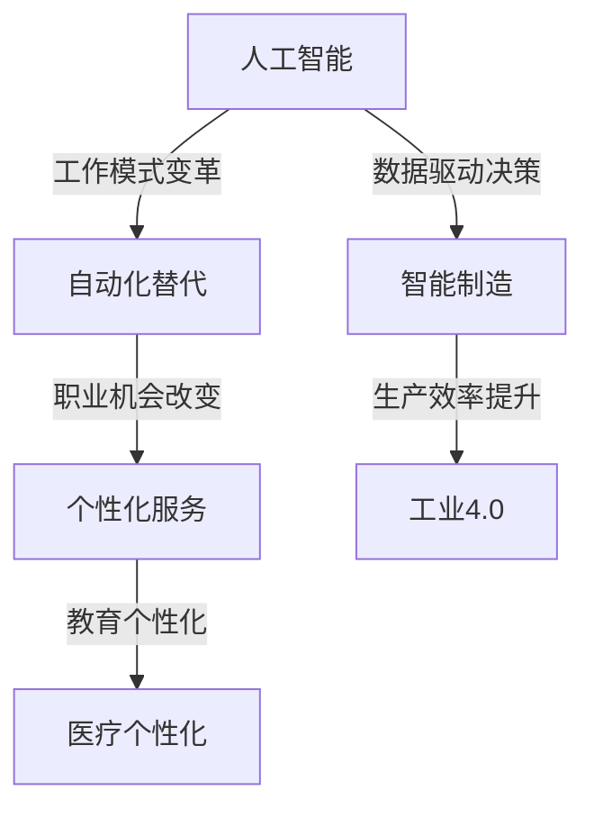

在这个流程图中，人工智能、大数据和物联网等科技进步，不仅改变了传统的工作模式和社会关系，还带来了新的职业机会和服务模式。

#### 7.1.2 创新思维与社会问题解决

在应对未来社会挑战的过程中，创新思维和社会问题解决能力成为关键。通过创新思维，个体和社会可以找到新的解决方案，应对不断变化的环境和挑战。

**创新思维的重要性**：创新思维是指通过独特的视角和方法，寻找新的问题和解决方案。在快速变化的环境中，创新思维可以帮助个体和社会保持竞争力和适应性。例如，在应对气候变化时，创新思维可以带来新的清洁能源技术，减少对传统化石燃料的依赖。

**社会问题解决**：社会问题解决是指通过合作和行动，解决社会面临的各种问题。例如，通过社区参与和社会组织，可以解决贫困、环境污染、教育不公等问题。社会问题解决不仅需要个体的积极参与，还需要社会的支持和合作。

为了更直观地展示创新思维与社会问题解决的关系，我们可以使用以下Mermaid流程图：

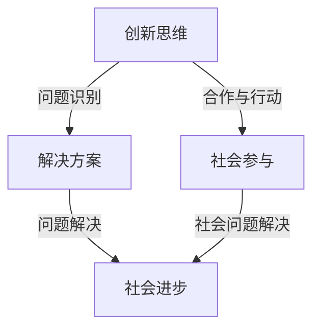

在这个流程图中，创新思维通过识别问题、提出解决方案和合作行动，推动社会问题的解决和社会进步。

通过上述讨论，我们可以看到，适应未来社会的挑战需要个体和社会具备创新思维和社会问题解决能力。在科技进步和社会变迁中，通过创新思维和社会参与，个体和社会可以在不确定性中找到新的发展方向和意义。

### 第8章：虚无中的意义追寻

#### 8.1 总结与展望

通过对虚无与存在、心理健康、意义构建、个人成长、社会参与及未来展望的深入探讨，本文旨在为现代人提供一种在虚无中寻找意义的路径。虚无并非一种消极的状态，而是一种促使个体反思和探索的契机。在现代社会，人们面临的精神挑战需要我们以积极的态度去应对。

未来的道路充满不确定性，但正是这种不确定性赋予了生活无限的可能性。通过持续学习和批判性思维，我们可以不断提升自己的认知能力，适应社会变化。在个人成长和社会参与中，通过志愿服务和公共事务参与，我们可以实现个人价值，推动社会进步。

本文的核心观点在于，虚无并不意味着生活的无意义，而是一种挑战，一种激励我们在不确定中创造意义的契机。通过自我探索和社会参与，我们可以在虚无中找到真正的意义，实现精神上的满足和成长。

#### 8.2 鼓励与建议

为了在虚无中创造意义，我们提出以下鼓励和建议：

1. **自我反思**：定期进行自我反思，了解自己的兴趣、价值观和目标，找到自己存在的意义。
2. **持续学习**：保持对新知识的好奇心，通过阅读、培训和实践，不断提升自己的技能和认知能力。
3. **社会参与**：积极参与社区和公共事务，通过志愿服务和公共讨论，实现个人价值和社会贡献。
4. **心理调适**：关注心理健康，学会情绪管理和压力释放，保持积极的心态。
5. **价值观重建**：在多元价值体系中，找到自己认同的价值观，为生活注入方向和动力。

通过上述建议，我们希望读者能够在虚无中找到自己的意义，实现个人成长和社会进步。

### 结论

在虚无中创造意义是现代人面临的重要精神挑战。通过哲学、心理学和社会学的多维度探讨，我们理解了虚无与存在的本质联系，揭示了现代人面对的精神困境，并探讨了如何在个人成长和社会参与中实现意义的创造。在未来，面对科技进步和社会变迁，我们仍需保持积极的态度，通过自我探索和社会参与，在虚无中找到真正的意义。

**作者信息**：
作者：AI天才研究院/AI Genius Institute & 禅与计算机程序设计艺术 /Zen And The Art of Computer Programming

---

本文从多个角度探讨了虚无与人类存在的本质联系，现代人的精神困境，以及如何在个人成长和社会参与中创造意义。通过哲学、心理学和社会学的分析，我们为读者提供了一种在虚无中寻找意义的路径。在未来的不确定性中，保持积极的态度，通过自我探索和社会参与，我们可以在虚无中找到真正的意义。希望本文对您的思考和行动有所启发。

**关键词**：
- 虚无
- 精神挑战
- 意义构建
- 个人成长
- 社会参与

**摘要**：
本文深入探讨了虚无与存在的本质联系，现代人的精神困境，以及如何在个人成长和社会参与中创造意义。通过哲学、心理学和社会学的多维度分析，为现代人提供了一种在虚无中寻找意义的路径，鼓励读者在不确定性中保持积极态度，实现个人成长和社会进步。

