                 

### 在虚无中创造：艺术与生活的意义探索

在无尽的宇宙中，虚无似乎是无边界的空白，而生命的存在则是一种奇迹般的创造。艺术，作为人类精神世界的表达，正是在这虚无之中，通过独特的创造力，赋予世界以意义。本文将以逻辑清晰、结构紧凑的方式，探讨艺术与生活的意义探索，从多个维度揭示艺术在虚无中创造的力量。

#### 关键词
- 艺术与虚无
- 创造力
- 生活意义
- 哲学思考

#### 摘要
本文旨在探讨艺术如何在虚无中创造意义，分析艺术与生活的密切联系，以及艺术在当代社会中的独特价值。通过哲学思考、历史背景和实际案例的深入剖析，本文揭示出艺术在人类精神世界中的重要性，并对未来的艺术与生活融合进行展望。

#### 目录
1. **艺术的本质与创造**  
    1.1 艺术的概念与定义  
    1.2 艺术的历史与发展  
    1.3 艺术与生活的联系  
    1.4 艺术中的虚无元素  
    1.5 艺术创造的内在驱动  
    1.6 艺术创造的技巧与方法  
    1.7 艺术创造与社会意义

2. **生活的意义与探索**  
    2.1 生活的本质与意义  
    2.2 生活的困境与挑战  
    2.3 生活的意义探索  
    2.4 生活的艺术化  
    2.5 生活的创造性实践  
    2.6 艺术与生活的相互影响

3. **虚无与创造的融合**  
    3.1 虚无与创造的哲学思考  
    3.2 艺术在虚无中的创造性表达  
    3.3 生活中的虚无体验与创造  
    3.4 艺术与生活的融合实践  
    3.5 艺术与生活的意义重构

4. **案例研究**  
    4.1 艺术家与艺术作品分析  
    4.2 艺术与生活结合的实践案例  
    4.3 创造性思考在艺术与生活中的应用  
    4.4 艺术与生活意义的探索与反思

5. **总结与展望**  
    5.1 艺术与生活的意义探索总结  
    5.2 创造性的未来展望  
    5.3 艺术与生活的持续探索

### 第一部分：艺术的本质与创造

#### 1.1 艺术的概念与定义

艺术是一种复杂且多层面的现象，它既具有审美价值，又蕴含着深刻的哲学思考。艺术不仅仅是美的表达，更是一种创造性的活动，它通过视觉、听觉、触觉等多种感官形式，传达人类对世界和自我的理解。

在哲学上，艺术与虚无有着密切的联系。虚无作为一种存在状态，体现了无限的可能性和空白，而艺术则通过创造性的表达，赋予了虚无以意义。从这个角度来看，艺术是一种在虚无中寻找和创造意义的过程。

#### 1.2 艺术的历史与发展

艺术的历史可以追溯到史前时期，当时的人类通过壁画和雕刻来表达对自然和神的崇拜。随着时间的推移，艺术的形式和内容不断演变，从古代的雕塑和绘画，到现代的装置艺术和数字艺术，每一种形式都在探索人类存在的本质和生活的意义。

在当代，艺术已经成为一种重要的文化表达方式，它不仅反映了社会的变革和进步，也挑战了传统的审美观念和哲学思考。艺术家们通过创新和实验，不断拓展艺术的边界，使艺术成为人类精神世界的一部分。

#### 1.3 艺术与生活的联系

艺术与生活密不可分，它们相互影响、相互塑造。艺术反映了生活的多样性和复杂性，而生活则为艺术提供了丰富的创作素材。通过艺术，人们可以更深刻地理解生活，体验生命的意义。

在日常生活中，艺术不仅是一种娱乐和审美活动，更是一种思考和生活的方式。艺术作品可以激发人们的创造力，帮助他们更好地面对生活的挑战。同时，艺术也是一种表达情感和思想的方式，它可以帮助人们释放内心的压力，找到生活的意义。

#### 1.4 艺术中的虚无元素

在艺术中，虚无是一个重要的主题。虚无不仅体现在艺术作品的形式上，也体现在艺术家的创作过程中。虚无作为一种存在状态，象征着无限的可能性和空白，艺术家们通过创造性的表达，赋予虚无以意义。

例如，现代艺术家安迪·沃霍尔的《金宝罐头》系列，通过重复和复制的方式，消解了物体原有的意义，使观众对物品的认知陷入虚无的状态。同时，沃霍尔的《名人》系列，通过将名人头像复制成印刷品，消解了名人的神圣光环，揭示了名人与普通人之间的虚无差异。

#### 1.5 艺术创造的内在驱动

艺术创造的内在驱动源于人类对生命意义的探索和对世界的好奇。艺术家们通过创作，试图回答生命的意义、人类存在的价值和虚无的本质等问题。艺术创作是一种探索和发现的过程，它使艺术家在虚无中寻找意义，赋予世界以独特的视角。

例如，著名艺术家达芬奇在其画作《蒙娜丽莎》中，通过对人物微笑的细致描绘，揭示了人类内心深处的喜悦和痛苦。这幅画作不仅展示了达芬奇高超的艺术技巧，更体现了他对生命和人类的深刻理解。

#### 1.6 艺术创造的技巧与方法

艺术创造不仅需要艺术家具备深厚的艺术功底和审美能力，还需要他们掌握一定的技巧和方法。艺术创作的技巧和方法因艺术形式的不同而有所差异，但总体上，艺术创作需要遵循以下原则：

1. **观察与思考**：艺术家需要通过观察生活，发现美和意义，并在思考中形成创作灵感。
2. **实验与创新**：艺术家需要通过实验和探索，不断尝试新的艺术形式和表达方式。
3. **表达与传递**：艺术家需要通过艺术作品，将自己的思想和情感传递给观众，引发共鸣。

#### 1.7 艺术创造与社会意义

艺术创造不仅对艺术家个人具有重要意义，也对整个社会产生深远的影响。艺术作为一种文化表达方式，它反映了社会的价值观和审美观念，推动了社会的发展和进步。

同时，艺术创造也为社会带来了精神财富。艺术作品不仅丰富了人们的精神世界，提高了人们的审美水平，还激发了人们的创造力和创新能力。通过艺术，人们可以更深入地思考人生和世界，找到生活的意义。

### 第二部分：生活的意义与探索

#### 2.1 生活的本质与意义

生活是一种复杂的过程，它包含了喜悦、痛苦、挑战和成长。生活的本质在于人类对生命意义的探索和追求。每个人都有自己的生活目标和价值观，这些目标和价值观决定了他们对生活的态度和方式。

生活的意义是一个深奥的哲学问题，不同的人有不同的答案。对于一些人来说，生活的意义在于追求幸福和满足，对于另一些人来说，生活的意义在于贡献和成就。无论答案如何，生活的意义在于每个人对生命本身的探索和理解。

#### 2.2 生活的困境与挑战

生活中充满了各种各样的困境和挑战。这些困境和挑战可能来自于外部环境，也可能来自于内心深处。例如，工作压力、人际关系、健康问题等，都可能给生活带来困扰和痛苦。

面对困境和挑战，人们需要具备坚强的意志和乐观的心态。通过积极面对困境和挑战，人们可以找到生活的意义，提升自己的生活质量。

#### 2.3 生活的意义探索

生活的意义探索是一个长期的过程，它需要人们不断地思考和实践。通过阅读、旅行、艺术创作等方式，人们可以更深入地了解自己和世界，找到生活的意义。

例如，通过阅读，人们可以了解不同的文化和思想，拓宽自己的视野。通过旅行，人们可以体验不同的生活方式和风景，丰富自己的生活体验。通过艺术创作，人们可以表达自己的情感和思想，提升自己的审美能力。

#### 2.4 生活的艺术化

生活的艺术化是一种将生活过程转化为艺术创作的方式。通过将日常生活融入艺术元素，人们可以使生活更加有趣和有意义。

例如，在家中布置艺术品，可以使家居环境更加美观和温馨。在日常生活中，通过摄影、绘画等方式记录生活，可以使生活变得更加有意义和丰富。

#### 2.5 生活的创造性实践

创造性实践是生活中的一种重要方式，它可以帮助人们发现生活的美好和意义。创造性实践不仅包括艺术创作，还包括创新思维和实践活动。

例如，通过学习新的技能和知识，人们可以提升自己的能力和素质。通过参加志愿者活动，人们可以帮助他人，同时也可以提升自己的生活品质。

#### 2.6 艺术与生活的相互影响

艺术与生活相互影响、相互塑造。艺术可以影响生活，使生活变得更加美好和有意义。同时，生活也可以影响艺术，为艺术创作提供丰富的素材和灵感。

例如，艺术家可以通过观察和体验生活，创作出反映生活本质和意义的艺术作品。而生活的艺术化，也可以使艺术作品更加贴近生活，提升人们的审美体验。

### 第三部分：虚无与创造的融合

#### 3.1 虚无与创造的哲学思考

虚无与创造是哲学思考中的重要主题。虚无象征着无限的可能性和空白，而创造则是在虚无中寻找和赋予意义的过程。哲学上的虚无与创造思考，对艺术和生活具有重要意义。

例如，存在主义哲学认为，虚无是人类存在的本质，而人类的自由和选择则是在虚无中创造意义的方式。通过自由选择，人们可以赋予虚无以意义，实现自我的价值和生命的意义。

#### 3.2 艺术在虚无中的创造性表达

艺术在虚无中的创造性表达是艺术家对世界和自我的深刻理解。通过艺术创作，艺术家可以在虚无中寻找和表达意义，赋予世界以独特的视角。

例如，现代艺术家达米恩·赫斯特的《一万小时的爱情》系列，通过将普通物品与复杂的材料相结合，创造出了独特的艺术作品。这些作品在虚无中寻找意义，传达了艺术家对生命和爱的深刻理解。

#### 3.3 生活中的虚无体验与创造

生活中的虚无体验与创造是每个人都会经历的过程。在日常生活中，人们可能会感受到虚无的存在，这种虚无感可以激发人们的创造力和想象力。

例如，在工作和生活中，人们可能会遇到困境和挑战，这时虚无感可能会促使人们寻找新的解决方案，从而实现创造性的突破。

#### 3.4 艺术与生活的融合实践

艺术与生活的融合实践是一种将艺术融入日常生活的方式。通过艺术化生活，人们可以使生活更加有趣和有意义。

例如，在家中布置艺术品，可以使家居环境更加美观和温馨。在日常生活中，通过摄影、绘画等方式记录生活，可以使生活变得更加有意义和丰富。

#### 3.5 艺术与生活的意义重构

艺术与生活的意义重构是一种通过艺术重新审视和定义生活的过程。通过艺术，人们可以重新发现生活的美好和意义，提升自己的生活品质。

例如，通过参观艺术展览、阅读艺术书籍等方式，人们可以更深入地了解艺术，从而重新审视和定义自己的生活。通过艺术创作，人们可以表达自己的情感和思想，实现自我价值的提升。

### 第四部分：案例研究

#### 4.1 艺术家与艺术作品分析

艺术家与艺术作品分析是对艺术家及其作品进行深入研究和理解的过程。通过分析艺术家的生平、艺术风格和代表作品，我们可以更好地理解艺术与生活的关系。

例如，荷兰画家文森特·梵高的《星夜》是一幅具有代表性的作品。这幅画作展现了梵高对自然的深刻理解和热爱，同时也反映了他在生活中的困境和痛苦。通过《星夜》，我们可以看到梵高如何将艺术融入生活，表达自己的情感和思想。

#### 4.2 艺术与生活结合的实践案例

艺术与生活结合的实践案例是艺术家将艺术理念融入日常生活的具体表现。通过这些案例，我们可以看到艺术如何影响和改变生活。

例如，日本艺术家草间弥生的《南瓜》系列作品，将艺术融入生活，使生活变得更加有趣和富有创意。草间弥生通过创作南瓜艺术品，将自己的艺术理念传递给观众，同时也在生活中寻找和创造意义。

#### 4.3 创造性思考在艺术与生活中的应用

创造性思考在艺术与生活中的应用是一种通过创新和实验，使生活更加有意义和丰富的方式。通过创造性思考，人们可以在艺术和生活之间找到新的联系和表达方式。

例如，美国艺术家詹姆斯·特瑞尔通过创作光艺术作品，使观众在自然环境中体验到光与空间的互动。他的作品不仅展示了创造性思考在艺术创作中的应用，也启示了人们在生活中如何运用创造性思维，发现和创造美。

#### 4.4 艺术与生活意义的探索与反思

艺术与生活意义的探索与反思是对艺术与生活关系的深入思考。通过反思和探索，我们可以更深刻地理解艺术与生活的关系，找到生活的意义。

例如，通过阅读哲学家尼采的作品，我们可以思考艺术与生活的意义。尼采的哲学思想强调个体自由和创造力的重要性，他认为艺术是生命的一种表达方式，通过艺术，人们可以找到生命的意义和自由。

### 第五部分：总结与展望

#### 5.1 艺术与生活的意义探索总结

通过本文的探讨，我们可以看到艺术与生活的意义探索是一个复杂而深刻的过程。艺术在虚无中创造意义，反映了人类对生命和世界的深刻理解。同时，生活也为艺术提供了丰富的创作素材和灵感。艺术与生活相互影响、相互塑造，共同构成了人类精神世界的一部分。

#### 5.2 创造性的未来展望

在未来的艺术与生活中，创造性将继续发挥重要作用。随着科技的发展和人类对未知世界的探索，艺术形式将更加多样，生活也将更加有趣和有意义。通过创造性思考和实践，人们可以不断发现和创造美，赋予虚无以意义。

#### 5.3 艺术与生活的持续探索

艺术与生活的探索是一个持续的过程。随着人类对世界的认知不断深化，艺术与生活的关系也将不断演变。通过持续探索，我们可以更深入地理解艺术与生活的意义，找到生活的真正价值。

### 附录

#### 附录 A：艺术与生活的创造性实践资源

- **书籍推荐**：《艺术的故事》、《生活的艺术》、《创意思考》
- **在线资源**：艺术博物馆网站（如大都会艺术博物馆）、艺术教育平台（如Art for Kids Hub）、生活技能提升网站（如Lifehacker）

#### 附录 B：推荐阅读与参考文献

- **书籍**：
  - 费孝通，《乡土中国》
  - 尼采，《查拉图斯特拉如是说》
  - 海德格尔，《存在与时间》
- **文章**：
  - 克里斯托弗·拉斯基，《艺术的意义》
  - 马克斯·韦伯，《艺术社会学》
  - 罗伯特·舒勒，《艺术与生活的桥梁》

#### 附录 C：艺术与生活意义探索的 Mermaid 流程图

```mermaid
graph TB
A[艺术与生活的意义探索] --> B[艺术的本质与创造]
B --> C[艺术的概念与定义]
B --> D[艺术的历史与发展]
B --> E[艺术与生活的联系]
B --> F[艺术中的虚无元素]
B --> G[艺术创造的内在驱动]
B --> H[艺术创造的技巧与方法]
B --> I[艺术创造与社会意义]

A --> J[生活的意义与探索]
J --> K[生活的本质与意义]
J --> L[生活的困境与挑战]
J --> M[生活的意义探索]
J --> N[生活的艺术化]
J --> O[生活的创造性实践]
J --> P[艺术与生活的相互影响]

A --> Q[虚无与创造的融合]
Q --> R[虚无与创造的哲学思考]
Q --> S[艺术在虚无中的创造性表达]
Q --> T[生活中的虚无体验与创造]
Q --> U[艺术与生活的融合实践]
Q --> V[艺术与生活的意义重构]

A --> W[案例研究]
W --> X[艺术家与艺术作品分析]
W --> Y[艺术与生活结合的实践案例]
W --> Z[创造性思考在艺术与生活中的应用]
W --> AA[艺术与生活意义的探索与反思]

A --> BB[总结与展望]
BB --> CC[艺术与生活的意义探索总结]
BB --> DD[创造性的未来展望]
BB --> EE[艺术与生活的持续探索]

```

### 结语

在虚无中创造，是艺术与生活的共同追求。通过本文的探讨，我们不仅深入了解了艺术与生活的关系，也看到了创造力的独特力量。在未来的日子里，让我们继续在虚无中探索，创造属于自己的意义和美好。作者：AI天才研究院/AI Genius Institute & 禅与计算机程序设计艺术 /Zen And The Art of Computer Programming。

