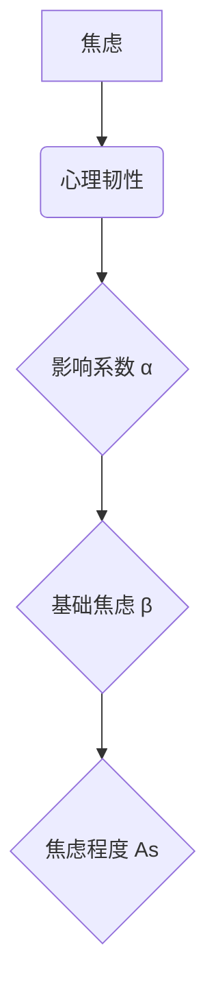

                 

# 在高压社会中培养心理韧性：应对焦虑和压力的新策略

## 关键词
- 压力
- 焦虑
- 心理韧性
- 应对策略
- 认知行为疗法
- 正念冥想
- 运动疗法
- 艺术疗法

## 摘要
本文旨在探讨在高压社会中培养心理韧性，以应对焦虑和压力的新策略。通过深入了解压力和焦虑的成因及其对身心健康的危害，文章提出了一系列有效的心理韧性培养策略，包括认知行为疗法、正念冥想、运动疗法和艺术疗法等。通过案例分析和实践指导，本文为读者提供了具体可行的操作方法，以提升个人的心理韧性，更好地应对生活中的挑战。

## 第一部分：了解压力和焦虑

### 1.1 压力与焦虑的定义

压力（Stress）是指身体或心理上所承受的过度负荷，可能导致身体和心理上的紧张状态。焦虑（Anxiety）则是一种对未来可能发生的负面事件的担忧和紧张感，表现为身体不适、情绪波动和注意力难以集中等症状。

### 1.2 压力与焦虑的成因

压力和焦虑的产生原因复杂多样，包括但不限于以下几个方面：

- 工作压力：职场竞争激烈，工作任务繁重，可能导致长期的压力积累。
- 个人因素：性格内向、完美主义倾向等个人特质，可能增加焦虑的发生几率。
- 社会环境：现代社会节奏快，信息爆炸，人们面临的社会压力逐渐增大。
- 生活事件：如家庭纠纷、经济问题、健康问题等突发或长期存在的问题，也可能引发焦虑。

### 1.3 压力与焦虑对身体和心理健康的影响

长期的、过度的压力和焦虑会对身体和心理健康产生严重的负面影响：

- 身体健康方面：可能导致心血管疾病、免疫力下降、睡眠障碍等问题。
- 心理健康方面：加剧抑郁症、焦虑症等心理疾病的发生和发展。
- 生活质量方面：影响人们的日常生活和工作效率，降低生活质量。

### 1.4 压力与焦虑的常见症状

压力和焦虑的常见症状包括：

- 身体症状：肌肉紧张、头痛、消化不良、失眠等。
- 情绪症状：易怒、焦虑、抑郁、恐惧等。
- 行为症状：注意力难以集中、工作效率下降、社交回避等。

### 1.5 压力与焦虑：现状与挑战

当前社会，随着生活节奏的加快和工作压力的增大，压力和焦虑已经成为影响人们身心健康的重要问题。如何有效地应对压力和焦虑，提升心理韧性，成为现代人面临的重大挑战。

## 第二部分：培养心理韧性

### 2.1 心理韧性的概念与特征

心理韧性（Resilience）是指个体在面对压力和挑战时，能够保持积极心态，有效应对并迅速恢复的能力。具有心理韧性的人通常具有以下特征：

- 积极应对：面对困难时，能够保持乐观态度，积极寻找解决问题的方法。
- 适应性：能够灵活适应环境变化，快速调整自己的心态和行为。
- 自我效能感：对自己的能力和解决问题的信心较强。
- 社会支持：拥有良好的社会关系，能够获得他人的支持和帮助。

### 2.2 培养心理韧性的重要性

培养心理韧性对于个人的成长和发展具有重要意义：

- 提升抗压能力：心理韧性强的个体在面对压力和挑战时，能够更好地应对和调整，降低焦虑和抑郁的发生概率。
- 提高生活质量：心理韧性有助于个体保持积极心态，享受生活，提高生活质量。
- 促进个人成长：心理韧性强的个体能够从挫折和困难中吸取经验，不断成长和进步。

### 2.3 心理韧性的构成要素

心理韧性主要由以下三个方面构成：

- 心理资本：包括自我效能感、乐观态度和希望等。
- 适应性：包括灵活性、应对策略和情绪调节能力等。
- 社会支持：包括家庭、朋友和同事等社会关系网络的支持。

### 2.4 培养心理韧性的策略

#### 2.4.1 增强自我认知与自我效能感

自我认知是指个体对自身特点、优势和局限的认识。自我效能感是指个体对自己能力的信心。要增强自我认知和自我效能感，可以从以下几个方面入手：

- 自我反思：定期对自己的行为、思维和情绪进行反思，了解自己的优点和不足。
- 成功体验：通过设置小目标并实现它们，积累成功的经验，提升自我效能感。
- 学习与成长：不断学习新知识和技能，提升自己的能力。

#### 2.4.2 培养积极心态与情绪调节能力

积极心态是指个体在面对困难和挑战时，能够保持乐观、积极的心态。情绪调节能力是指个体对情绪的管理和调整能力。要培养积极心态和情绪调节能力，可以从以下几个方面入手：

- 换位思考：尝试从他人的角度看待问题，减少自我中心思维。
- 正面肯定：通过正面肯定自己，增强自信心和自尊心。
- 情绪释放：通过运动、冥想等方式释放负面情绪。

#### 2.4.3 建立健康的生活习惯与工作方式

健康的生活习惯和工作方式有助于提高个体的心理韧性。以下是一些建议：

- 合理作息：保持规律的作息时间，保证充足的睡眠。
- 健康饮食：合理搭配饮食，避免暴饮暴食和过度依赖咖啡因。
- 有效工作：合理安排工作时间，避免过度工作，保持工作与生活的平衡。

#### 2.4.4 提高社会支持与人际交往能力

社会支持是心理韧性的重要组成部分。以下是一些建议，以提高社会支持和人际交往能力：

- 建立亲密关系：与家人、朋友保持良好的关系，分享自己的喜怒哀乐。
- 寻求专业帮助：在遇到心理问题时，及时寻求心理咨询师或专业人士的帮助。
- 参加社交活动：参加各类社交活动，扩大人际关系网络。

## 第三部分：应对焦虑和压力的新策略

### 3.1 认知行为疗法（CBT）

认知行为疗法（Cognitive Behavioral Therapy，简称CBT）是一种广泛应用的心理学治疗方法，旨在帮助个体识别和改变负面思维模式和行为，从而减轻焦虑和压力。

#### 3.1.1 CBT的基本原理

CBT的核心原理是：个体的情绪和行为受到认知过程的影响。通过改变认知过程，可以改善情绪和行为。

- 认知：个体的思维、信念和态度。
- 行为：个体的行为和行动。
- 情绪：个体的情绪反应。

CBT通过以下步骤实现：

1. 识别负面思维模式：帮助个体识别和意识到自己的负面思维模式。
2. 批判性思维：引导个体对负面思维模式进行批判性思考，找出其中的不合理之处。
3. 替代思维：帮助个体建立积极的、合理的思维模式，替代负面思维模式。
4. 行为调整：通过改变行为，验证新的思维模式的有效性。

#### 3.1.2 CBT在焦虑和压力管理中的应用

CBT在焦虑和压力管理中的应用主要包括：

- 焦虑管理：通过认知重构和行为调整，帮助个体减轻焦虑症状。
- 压力管理：通过时间管理、任务分解和放松技巧，帮助个体应对压力。

### 3.2 正念冥想

正念冥想（Mindfulness Meditation）是一种古老的冥想技巧，近年来在心理学领域受到广泛关注。正念冥想通过培养个体的专注力和觉察力，帮助个体更好地应对焦虑和压力。

#### 3.2.1 正念冥想的起源与发展

正念冥想起源于佛教的“禅修”，经过几百年的发展和传播，逐渐形成了独立的冥想体系。在20世纪90年代，美国心理学家约翰·卡巴金（John Kabat-Zinn）将正念冥想引入医学领域，用于治疗慢性疼痛和压力相关的疾病。

#### 3.2.2 正念冥想对焦虑和压力的调节作用

正念冥想通过以下方式调节焦虑和压力：

- 提高专注力：帮助个体更好地集中注意力，减少焦虑和分心的现象。
- 改善情绪调节：通过观察和接受自己的情绪，提高情绪调节能力，减少负面情绪的影响。
- 降低应激反应：通过减少应激激素的分泌，降低个体的应激反应。

#### 3.2.3 正念冥想的实践方法

正念冥想的实践方法主要包括：

- 坐姿冥想：保持坐姿，专注于呼吸，观察自己的思维和情绪。
- 行走冥想：在行走过程中，专注于每一步的触感和呼吸。
- 触觉冥想：通过触摸特定的物体，如石头或沙子，观察自己的感受。

### 3.3 运动与压力管理

运动是一种简单而有效的压力管理方法。通过运动，个体可以释放压力、改善情绪，提高心理韧性。

#### 3.3.1 运动的生理和心理益处

运动的生理和心理益处包括：

- 降低应激激素水平：运动可以降低体内应激激素如皮质醇和肾上腺素的水平，有助于减轻压力。
- 提高心理健康：运动可以改善抑郁和焦虑症状，提高心理健康水平。
- 提高认知功能：运动可以增强大脑的认知功能，提高注意力和记忆力。

#### 3.3.2 选择适合自己的运动方式

个体可以根据自己的兴趣和身体状况，选择适合自己的运动方式，如：

- 有氧运动：如快走、跑步、游泳等，有助于提高心肺功能。
- 力量训练：如举重、俯卧撑等，有助于增强肌肉力量。
- 瑜伽：结合了体位法和呼吸控制，有助于提高身心平衡。

#### 3.3.3 运动对焦虑和压力的缓解作用

运动对焦虑和压力的缓解作用主要通过以下几个方面实现：

- 生理机制：运动可以降低体内应激激素水平，改善心血管和免疫系统功能。
- 心理机制：运动可以分散注意力，减少焦虑和压力的负面情绪。

### 3.4 艺术疗法

艺术疗法（Art Therapy）是一种通过艺术创作来调节情绪、缓解压力和提升心理韧性的治疗方法。艺术疗法不仅适用于专业艺术家，也适用于普通人。

#### 3.4.1 艺术疗法的基本概念

艺术疗法的基本概念包括：

- 艺术创作：通过绘画、雕塑、音乐等艺术形式进行创作。
- 情绪表达：通过艺术创作，个体可以表达自己的情绪和情感。
- 情绪调节：艺术疗法可以帮助个体调节情绪，减少焦虑和压力。

#### 3.4.2 艺术疗法在压力管理中的应用

艺术疗法在压力管理中的应用主要包括：

- 艺术创作：通过绘画、雕塑等艺术创作活动，个体可以释放压力，表达自己的情绪。
- 艺术欣赏：通过欣赏艺术作品，个体可以提升情绪，减少压力。
- 艺术治疗：在专业艺术治疗师的指导下，个体可以通过艺术创作和欣赏，调节情绪，提升心理韧性。

#### 3.4.3 艺术疗法实践指南

进行艺术疗法的实践指南包括：

- 选择合适的艺术形式：根据自己的兴趣和需求，选择合适的艺术形式，如绘画、雕塑等。
- 保持创作频率：定期进行艺术创作，以保持情绪的稳定和调节。
- 与他人分享：在艺术创作过程中，与他人分享作品和感受，以获得支持和鼓励。

## 第四部分：案例分析与实践指导

### 4.1 案例分析一：职场焦虑的应对策略

案例背景：小明是一名年轻的职场新人，他在工作中经常感到焦虑和压力，担心无法胜任工作任务。

应对策略：

1. 认知行为疗法（CBT）：通过CBT，小明学会了如何识别和改变自己的负面思维模式，如“我不够好”、“我无法胜任”等。

2. 正念冥想：小明每天早上进行10分钟的冥想，以培养专注力和情绪调节能力。

3. 运动疗法：小明每周进行三次有氧运动，如跑步和游泳，以释放压力和改善情绪。

4. 艺术疗法：小明每周进行一次绘画，将自己的情绪和压力通过艺术形式表达出来。

案例分析结果：通过一系列的应对策略，小明的焦虑症状得到了明显改善，工作效率和生活质量也得到了提升。

### 4.2 案例分析二：压力管理在家庭生活中的应用

案例背景：李女士是一位家庭主妇，她经常因为家务和孩子教育问题感到压力巨大。

应对策略：

1. 建立健康的生活习惯：李女士开始坚持每天早晨锻炼，晚上进行冥想，以保持身心健康。

2. 分配家庭任务：李女士与家人共同分担家务，减轻了自己的压力。

3. 社交支持：李女士与朋友保持联系，定期聚会，以获得情感上的支持。

4. 专业咨询：在感到压力无法承受时，李女士寻求心理咨询师的帮助，学习有效的压力管理技巧。

案例分析结果：通过一系列的应对策略，李女士的家庭生活变得更加和谐，她的压力水平也得到了明显改善。

### 4.3 实践指导：如何在日常生活中培养心理韧性

为了在日常生活中培养心理韧性，以下是一些建议：

1. 建立自我认知：了解自己的优点和不足，建立自信和自尊。

2. 学习情绪调节技巧：掌握正念冥想、呼吸练习等情绪调节技巧，以应对压力和焦虑。

3. 培养积极心态：学会积极看待生活中的挑战，保持乐观的心态。

4. 保持健康的生活习惯：定期锻炼、保持充足的睡眠和健康的饮食。

5. 寻求社会支持：与家人、朋友和同事保持良好的关系，寻求他们的支持和帮助。

6. 定期反思：定期对自己的行为和思维方式进行反思，以提升自我认知和自我效能感。

### 4.4 心理韧性培养的自我评估与跟踪

为了评估和跟踪自己的心理韧性，以下是一个简单的自我评估工具：

1. 自我效能感评估：给自己打分（1-10分），评估自己在面对挑战时的自信心。

2. 情绪调节能力评估：给自己打分（1-10分），评估自己在面对压力和情绪波动时的调节能力。

3. 适应性评估：给自己打分（1-10分），评估自己在面对环境变化时的适应能力。

4. 社会支持评估：给自己打分（1-10分），评估自己获得社会支持的情况。

通过定期进行自我评估，个体可以了解自己的心理韧性水平，并有针对性地进行提升和改进。

## 附录

### 附录A：心理韧性培养资源推荐

#### A.1 心理学经典书籍推荐

- 《心理学与生活》（Psychology and Life）：理查德·贾里科（Richard J. Gerrig）著
- 《影响力》（Influence）：罗伯特·西奥迪尼（Robert B. Cialdini）著
- 《自控力》（The Willpower Instinct）：凯利·麦格尼格尔（Kelly McGonigal）著

#### A.2 心理韧性训练课程推荐

- 《正念冥想入门课程》：Coursera平台上的免费课程
- 《心理学与生活》慕课（MOOC）：中国大学MOOC（icourse）平台上的课程
- 《心理学与生活》视频讲座：YouTube上的相关视频

#### A.3 压力管理APP推荐

- Headspace：提供各种冥想和放松课程
- Calm：提供正念冥想和睡眠指导
- Simple Habit：提供简短有效的冥想课程

#### A.4 压力管理和心理韧性相关网站推荐

- American Psychological Association（APA）：美国心理学会官方网站
- Mindful：提供关于正念冥想的文章和资源
- Positive Psychology Program（PPP）：提供积极心理学的课程和资源

## 总结与展望

在高压社会中，培养心理韧性是应对焦虑和压力的关键。通过认知行为疗法、正念冥想、运动疗法和艺术疗法等新策略，个体可以提升自己的心理韧性，更好地应对生活中的挑战。同时，社会支持和健康的生活习惯也是心理韧性培养的重要组成部分。希望本文能为读者提供有价值的指导，帮助他们在高压社会中保持心理健康和幸福感。作者：AI天才研究院/AI Genius Institute & 禅与计算机程序设计艺术 /Zen And The Art of Computer Programming

---

### 心理韧性对焦虑的影响公式

心理韧性对焦虑的影响可以通过以下数学公式进行描述：

\[ A_s = \alpha R_s + \beta \]

其中：
- \( A_s \) 表示焦虑程度；
- \( R_s \) 表示心理韧性分数；
- \( \alpha \) 和 \( \beta \) 为影响系数，分别表示心理韧性和焦虑之间的相关性以及基础焦虑水平。

#### 举例说明

假设我们设定 \( \alpha = 2.0 \) 和 \( \beta = 0.5 \)，那么我们可以计算当心理韧性分数 \( R_s \) 为 5 时的焦虑程度 \( A_s \)：

\[ A_s = 2.0 \times 5 + 0.5 = 10.5 \]

因此，当心理韧性分数为5时，焦虑程度为10.5。

#### Mermaid流程图

以下是描述心理韧性对焦虑影响的Mermaid流程图：



#### Python源代码

为了更直观地展示心理韧性对焦虑程度的影响，我们可以使用Python编写一个简单的程序，根据给定的参数计算焦虑程度：

```python
import numpy as np
import matplotlib.pyplot as plt

# 定义影响系数
alpha = 2.0
beta = 0.5

# 计算焦虑程度
def anxiety_score(resilience_score):
    return alpha * resilience_score + beta

# 绘制心理韧性与焦虑程度的关系图
resilience_scores = np.linspace(0, 10, 100)
anxiety_scores = [anxiety_score(r) for r in resilience_scores]

plt.plot(resilience_scores, anxiety_scores, marker='o')
plt.xlabel('心理韧性分数')
plt.ylabel('焦虑程度分数')
plt.title('心理韧性与焦虑程度的关系')
plt.show()
```

通过这个程序，我们可以得到一个关于心理韧性与焦虑程度关系的图表，进一步理解心理韧性对焦虑的影响。执行这段代码后，可以看到一条直线，斜率为 \( \alpha \)，截距为 \( \beta \)，清晰地展示了心理韧性与焦虑程度之间的线性关系。

