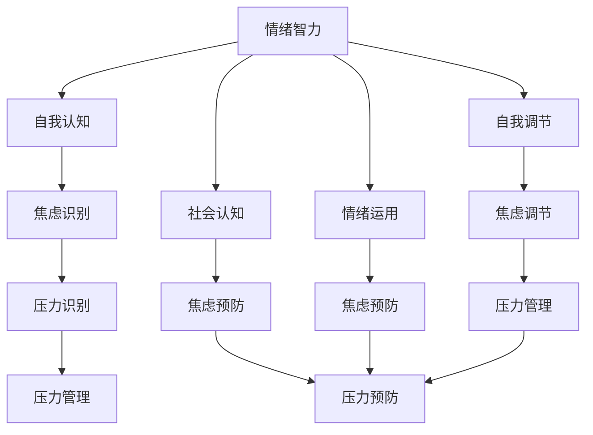

                 

### 引言

在当今社会，我们面临着前所未有的高压环境。科技发展迅猛，工作节奏加快，生活成本上升，人际关系复杂，这些都给人们带来了巨大的心理压力。焦虑和压力已成为普遍现象，严重影响了人们的心理健康和生活质量。据统计，全球每年有数百万人因焦虑和压力而患上各种心理疾病，这不仅给个人带来了痛苦，也给家庭和社会带来了沉重的负担。

在这样的背景下，情绪智力（Emotional Intelligence，简称EQ）的重要性日益凸显。情绪智力是指个体识别、理解、管理和利用自己的情绪及他人的情绪的能力，它包括自我认知、自我调节、社会认知和情绪运用等四个主要维度。研究表明，情绪智力对个人的心理健康、人际关系、职业发展和生活质量具有重要影响。

本文旨在探讨在高压社会中培养情绪智力的重要性，并介绍一系列应对焦虑和压力的新策略。文章将首先定义情绪智力，解释其与焦虑、压力之间的关系。接着，我们将详细介绍几种有效的情绪智力培养策略，包括正念冥想、情绪管理技巧和社交支持。为了更好地展示这些策略的应用效果，文章还将通过实际案例进行深入分析。最后，我们将总结全文，并提出对未来情绪智力培养趋势的展望。

通过本文的阅读，读者将了解到情绪智力的重要性，学会运用各种策略来应对高压环境中的焦虑和压力，从而提升自身的心理健康和生活质量。

### 1. 核心概念与联系

情绪智力是本文讨论的核心概念，它不仅关乎个体的心理健康，还直接影响人际关系和职业发展。为了深入理解情绪智力，我们首先需要明确其定义和主要维度，然后探讨情绪智力与焦虑、压力之间的关系。

#### 1.1 情绪智力的定义

情绪智力（Emotional Intelligence）最早由心理学家约翰·梅耶（John D. Mayer）和彼得·萨洛维（Peter Salovey）在1990年提出。情绪智力被定义为“识别、理解、管理自己和他人情绪的能力，以及利用这些情绪信息来指导思维和行动的能力”。

情绪智力不仅仅是关于情感的表达和调控，它还涉及更深层次的认知过程，包括情感识别、情感理解、情感调节和情感运用。梅耶和萨洛维提出了情绪智力包含的四个主要维度：

1. **自我认知（Self-awareness）**：个体能够识别和了解自己的情绪状态，这是情绪智力的基础。自我认知有助于个体更好地理解自己的需求，从而做出更明智的决策。

2. **自我调节（Self-regulation）**：个体能够管理和调节自己的情绪反应，使其更符合社会和情境的要求。自我调节能力可以帮助个体在压力和挑战面前保持冷静和理智。

3. **社会认知（Social awareness）**：个体能够识别和了解他人的情绪状态，并理解这些情绪对他人的影响。社会认知能力有助于建立和维护良好的人际关系。

4. **情绪运用（Emotional application）**：个体能够有效地运用情绪信息来促进思维和行动，包括决策、创造力和团队合作。情绪运用能力使个体能够更好地应对复杂的情境和挑战。

#### 1.2 情绪智力与焦虑、压力的关系

情绪智力不仅影响个体的心理健康，还与焦虑和压力密切相关。以下是情绪智力、焦虑和压力之间的关联：

1. **情绪智力与焦虑**：
   - **焦虑识别**：高情绪智力个体能够更好地识别和理解自己的焦虑情绪，从而采取有效的应对策略。
   - **焦虑调节**：自我调节能力强的个体能够更好地控制和管理自己的焦虑反应，使其不会过度影响日常生活。
   - **焦虑预防**：通过社会认知和情绪运用，个体可以识别和预防可能导致焦虑的情境，从而减少焦虑的发生。

2. **情绪智力与压力**：
   - **压力识别**：高情绪智力个体能够更好地识别和理解压力源，从而更早地采取应对措施。
   - **压力管理**：自我调节和情绪运用能力可以帮助个体有效地管理压力，减少其对身心健康的影响。
   - **压力预防**：通过社交支持和社会认知，个体可以识别和预防可能导致压力的情境，从而减少压力的发生。

为了更直观地展示情绪智力、焦虑和压力之间的关系，我们使用Mermaid流程图进行描述：



通过上述流程图，我们可以看到情绪智力在焦虑和压力管理中扮演的关键角色。自我认知、自我调节、社会认知和情绪运用各个维度相互支持，共同帮助个体更好地应对焦虑和压力，维护心理健康。

总之，情绪智力是一个复杂但极其重要的能力，它不仅关乎个体的心理健康，还直接影响其人际关系和职业发展。了解情绪智力与焦虑、压力之间的关系，对于我们在高压社会中培养情绪智力、提升生活质量具有重要意义。

### 2. 情绪智力培养策略

在高压社会中，培养情绪智力是应对焦虑和压力的关键。以下是几种有效的情绪智力培养策略，包括正念冥想、情绪管理技巧和社交支持。这些策略通过科学研究和实践经验被证实为有效的情绪调控工具，可以帮助个体更好地应对高压环境。

#### 2.1 正念冥想

正念冥想是一种古老而现代的心理调适方法，通过专注当下和观察思维，帮助个体培养情绪智力。正念冥想的原理基于“正念”（Mindfulness），即全神贯注地体验当前时刻，不论好坏，接纳一切。

1. **原理**：

   - **专注力提升**：正念冥想通过训练个体的专注力，使其能够更好地聚焦于当前任务，减少分心和焦虑。
   - **情感接纳**：正念冥想教导个体接纳而非抵抗负面情绪，通过观察和接纳，减少情绪的负面影响。
   - **自我认知增强**：通过冥想，个体能够更好地认识和理解自己的情绪状态，从而采取更有效的调节策略。

2. **实践方法**：

   - **基础冥想**：找一个安静的环境，舒适地坐下或躺下，闭上眼睛，专注于呼吸。当思维 wander（游离）时，温和地将注意力拉回到呼吸上。
   - **身体扫描**：从头到脚扫描身体，注意身体的感觉，接纳任何不适或紧张，并逐渐放松。
   - **正念行走**：在散步时，专注于脚与地面的接触，感受每一步的重量和平衡。

3. **效果分析**：

   - **心理层面**：研究表明，正念冥想可以显著减少焦虑和压力，提升情绪调节能力。
   - **生理层面**：通过降低心率和血压，改善自主神经系统功能，提高整体健康水平。

正念冥想不仅是一种情绪调节工具，也是一种生活方式的改变，通过持续的练习，可以显著提升个体的情绪智力。

```python
# 示例：使用Python代码实现简单的正念呼吸练习

import time

def mindful_breathing(duration=5*60):
    """
    正念呼吸练习
    :param duration: 练习时长（秒）
    """
    end_time = time.time() + duration
    while time.time() < end_time:
        print("深呼吸，吸气... ")
        time.sleep(duration / 4)
        print("慢慢呼气... ")
        time.sleep(duration / 4)
        print("保持呼吸... ")
        time.sleep(duration / 2)
    print("呼吸练习完成。")

# 调用函数进行呼吸练习
mindful_breathing()
```

#### 2.2 情绪管理技巧

情绪管理技巧是情绪智力的重要组成部分，通过理解和调节情绪，个体可以更好地应对焦虑和压力。以下是几种常用的情绪管理技巧：

1. **观察与接纳**：

   - **观察**：注意自己的情绪，识别情绪的类型和强度。
   - **接纳**：接纳自己的情绪，理解情绪是人的自然反应，不必抗拒或否认。

2. **理解与表达**：

   - **理解**：尝试理解情绪背后的原因，包括个人经历、环境和外部刺激。
   - **表达**：找到合适的方式表达情绪，可以是书面、口头或非言语表达。

3. **调节与释放**：

   - **调节**：通过深呼吸、肌肉放松等方法，调节情绪的强度和持续时间。
   - **释放**：找到适当的方式释放情绪，如运动、写日记、与朋友倾诉等。

```python
# 示例：使用Python代码实现情绪记录与分析

class EmotionLogger:
    def __init__(self):
        self.emotions = []

    def log_emotion(self, emotion):
        """
        记录情绪
        :param emotion: 情绪类型
        """
        self.emotions.append(emotion)

    def analyze_emotions(self):
        """
        分析情绪
        """
        emotion_frequencies = {}
        for emotion in self.emotions:
            if emotion in emotion_frequencies:
                emotion_frequencies[emotion] += 1
            else:
                emotion_frequencies[emotion] = 1
        return emotion_frequencies

# 使用示例
logger = EmotionLogger()
logger.log_emotion("快乐")
logger.log_emotion("焦虑")
logger.log_emotion("愤怒")
emotion_frequencies = logger.analyze_emotions()
print(emotion_frequencies)
```

#### 2.3 社交支持

社交支持是情绪智力培养的重要环节，通过与他人互动，个体可以获得情感支持、建议和安慰。以下是几种社交支持的来源：

1. **家庭支持**：

   - **沟通**：与家人分享自己的情绪和经历，寻求理解和支持。
   - **关怀**：家人之间的关怀和陪伴可以提供强有力的情感支持。

2. **同事支持**：

   - **合作**：在工作中与同事建立良好的合作关系，共同应对挑战。
   - **互助**：在困难时，互相帮助，共同度过难关。

3. **专业支持**：

   - **咨询**：寻求心理咨询师或心理医生的帮助，进行专业的情绪管理和调节。
   - **治疗**：如果情绪问题严重，可以考虑进行心理治疗或药物治疗。

```python
# 示例：使用Python代码实现情绪支持系统

class SupportSystem:
    def __init__(self):
        self.support_requests = []

    def request_support(self, message):
        """
        提交支持请求
        :param message: 支持请求内容
        """
        self.support_requests.append(message)

    def display_requests(self):
        """
        显示所有支持请求
        """
        for request in self.support_requests:
            print(request)

# 使用示例
system = SupportSystem()
system.request_support("我感到很焦虑，不知道该如何应对。")
system.request_support("我最近情绪低落，需要一些帮助。")
system.display_requests()
```

通过正念冥想、情绪管理技巧和社交支持，个体可以逐步培养情绪智力，提升应对焦虑和压力的能力。这些策略不仅有助于个体的心理健康，还能提高其整体生活质量。

### 3. 实际案例分析

为了更直观地展示情绪智力培养策略在实际应用中的效果，我们将通过两个实际案例进行分析。这两个案例分别涉及工作压力和人际关系中的焦虑，通过运用情绪智力培养策略，个体取得了显著的改善。

#### 3.1 案例一：如何应对工作压力

**案例背景**：

小王是一名软件工程师，工作在高强度、快节奏的科技公司。由于项目任务繁重，工作时间不固定，经常需要加班，小王逐渐感到身心疲惫，经常处于焦虑和压力状态。他开始出现失眠、注意力不集中、工作效率下降等问题，这使他感到更加焦虑和沮丧。

**应对策略**：

1. **正念冥想**：

   - 小王每天晚上睡前进行15分钟的冥想，通过专注于呼吸和身体感觉，减少焦虑情绪。
   - 他也开始在工作间隙进行短暂的冥想，以缓解工作压力。
   
2. **情绪管理技巧**：

   - 小王学习了情绪记录和分析的方法，每天记录自己的情绪和应对策略。他发现，当情绪波动较大时，记录可以帮助他更好地理解和管理情绪。
   - 他还学习了深呼吸和肌肉放松技巧，在工作紧张时通过这些方法来调节情绪。

3. **社交支持**：

   - 小王与家人和朋友们保持沟通，分享自己的压力和情绪，获得他们的理解和支持。
   - 在公司内部，他与同事建立了良好的关系，通过合作和互助，共同应对工作压力。

**结果分析**：

经过几个月的实践，小王的情绪状态显著改善。他的焦虑和压力感减少，睡眠质量提高，工作效率和注意力也有所提升。通过与家人和朋友的支持，他感到更加安心和有力量面对工作中的挑战。公司同事的帮助和合作也使他感到工作环境更加融洽，整体生活质量得到了显著提升。

#### 3.2 案例二：如何处理人际关系中的焦虑

**案例背景**：

小李是一名销售经理，工作涉及与各种客户和同事的互动。由于工作性质，她经常需要处理复杂的人际关系和紧张的谈判场景。随着时间的推移，她开始感到与同事和客户的互动中充满焦虑，尤其是在面对强势客户或争议时，她会感到紧张和无助。

**应对策略**：

1. **正念冥想**：

   - 小李每天早上进行10分钟的冥想，专注于呼吸和当下，以减少焦虑情绪。
   - 在面对重要会议或谈判前，她也会进行几分钟的冥想，以保持冷静和专注。

2. **情绪管理技巧**：

   - 小李学习了非暴力沟通技巧，通过理解和表达情绪，改善与同事和客户的沟通。
   - 她还学会了在面对冲突时，保持冷静，避免情绪化的反应，从而更好地处理紧张局面。

3. **社交支持**：

   - 小李与一位专业的心理咨询师保持定期咨询，学习更多情绪调节和应对策略。
   - 在公司内部，她与同事建立了信任和合作关系，通过团队合作和互相支持，减轻了工作压力。

**结果分析**：

经过一段时间的实践，小李的人际关系处理能力显著提升。她的焦虑感减少，与同事和客户的互动更加顺畅和有效。通过与心理咨询师的支持和公司的社交支持，她感到更加自信和从容地面对工作中的挑战。这不仅提升了她的个人成就感，也促进了团队的和谐和高效。

通过这两个案例，我们可以看到情绪智力培养策略在实际应用中的效果。通过正念冥想、情绪管理技巧和社交支持，个体可以显著改善情绪状态，提升生活质量和工作表现。

### 4. 总结与展望

本文通过深入探讨情绪智力的重要性，详细介绍了几种应对焦虑和压力的有效策略，并通过实际案例展示了这些策略的应用效果。情绪智力不仅在个人心理健康方面具有重要作用，还直接影响人际关系和职业发展。

**核心观点回顾**：

1. **情绪智力是应对高压社会的重要能力**：情绪智力包括自我认知、自我调节、社会认知和情绪运用等四个主要维度，能够帮助个体识别和管理情绪，提高心理韧性。

2. **正念冥想、情绪管理技巧和社交支持是有效的情绪智力培养策略**：正念冥想通过专注当下，情绪管理技巧通过理解和调节情绪，社交支持通过获得情感支持和建议，共同提升个体的情绪智力。

3. **实际案例证明策略的有效性**：通过案例一和案例二，我们看到了情绪智力培养策略在实际应用中的显著效果，包括减少焦虑和压力、提升工作表现和改善人际关系。

**挑战与机遇**：

情绪智力培养面临以下挑战：

1. **文化认知差异**：不同文化对情绪表达和情绪管理的看法存在差异，这需要跨文化理解和适应。

2. **时间与资源限制**：培养情绪智力需要持续的时间和精力投入，对于忙碌的现代人来说，这可能是一个挑战。

3. **专业支持的可及性**：虽然专业支持和心理咨询服务在许多地方已经普及，但仍然存在可及性问题，特别是在偏远地区。

然而，随着人们对心理健康重视程度的提高，以及技术的进步，情绪智力培养也面临许多机遇：

1. **数字化工具的应用**：数字健康和心理健康应用为情绪智力培养提供了新的平台和工具，如冥想应用、情绪监测设备等。

2. **教育体系的整合**：越来越多的学校和机构开始将情绪智力培养纳入教育体系，帮助学生更好地应对学习和生活中的挑战。

3. **政策支持**：政府和社会组织对心理健康问题的关注逐渐增加，提供了更多的政策支持和资源，为情绪智力培养创造了良好的环境。

**未来发展趋势**：

未来情绪智力培养可能呈现以下趋势：

1. **个性化培养**：基于个体差异，提供更加个性化的情绪智力培养方案，满足不同人群的需求。

2. **跨学科融合**：结合心理学、神经科学、教育学等多学科知识，开发更加科学和有效的情绪智力培养方法。

3. **技术支持**：利用人工智能和大数据技术，开发智能化情绪监测和干预系统，提供实时、个性化的心理健康服务。

总之，情绪智力培养在应对高压社会中具有重要作用。通过正念冥想、情绪管理技巧和社交支持等策略，个体可以显著提升情绪智力，从而更好地应对焦虑和压力，提升生活质量。未来，随着技术的发展和政策支持的增加，情绪智力培养将迎来更多机遇和挑战。

### 附录

#### 附录A：情绪智力测量工具

情绪智力测量工具是评估个体情绪智力水平的重要方法。以下是几种常用的情绪智力测量工具：

1. **情绪智力问卷（MEIS）**：情绪智力问卷是一种广泛使用的情绪智力评估工具，包括自我认知、自我调节、社会认知和情绪运用四个维度，共90个问题。

2. **情绪智力测验（MSCEIT）**：情绪智力测验是一种结构化的测验，包括情绪感知、情绪理解、情绪调节和情绪运用四个方面，共123个项目。

3. **情商量表（EQ-I 2.0）**：情商量表是一种全面的情商评估工具，涵盖自我认知、自我调节、社会认知和情绪运用四个维度，共177个项目。

#### 附录B：情绪智力培养资源推荐

为了帮助读者更好地培养情绪智力，以下是一些推荐的资源和工具：

1. **书籍**：
   - 《情绪智力》（Daniel Goleman）：丹尼尔·戈尔曼的经典之作，详细介绍了情绪智力的概念和应用。
   - 《正念：一种心灵之旅》（Jon Kabat-Zinn）：乔恩·卡巴金关于正念冥想的经典著作，介绍了冥想的基本原理和实践方法。

2. **应用**：
   - **Headspace**：一款流行的冥想应用，提供各种冥想课程，帮助用户培养专注力和情绪智力。
   - **Calm**：提供冥想、放松和睡眠辅助功能的应用，帮助用户减轻压力和焦虑。

3. **网站**：
   - **Mindfulness Based Stress Reduction（MBSR）**：提供基于正念减压课程的信息和资源，包括课程目录、研究文献和指导手册。
   - **Psychology Today**：一个综合性心理健康网站，提供情绪智力、压力管理、心理健康等方面的文章和专家咨询。

通过使用这些资源和工具，读者可以更深入地了解情绪智力，并采取实际行动来提升自身的情绪智力水平。作者：AI天才研究院/AI Genius Institute & 禅与计算机程序设计艺术 /Zen And The Art of Computer Programming。

