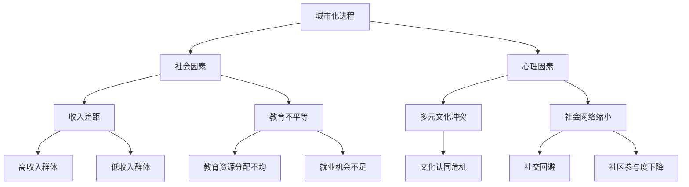

                 

# 城市化进程中的归属感缺失

关键词：城市化、归属感、社会因素、心理因素、政策措施、社区建设

摘要：本文旨在探讨城市化进程中归属感缺失的问题。通过对城市化概念、影响因素及其对个体和社会的影响进行深入分析，本文揭示了城市化进程中归属感缺失的现状和原因。在此基础上，文章提出了提升城市居民归属感的政策措施和社区建设策略，以期为城市化进程中的社会建设提供有益参考。

## 1. 引言

### 1.1 城市化的概念及发展历程

城市化，是指人口从农村地区向城市地区转移的过程，以及城市人口占总人口比例不断上升的趋势。城市化是一个全球性的现象，自工业革命以来，城市化进程显著加快。根据联合国的数据，1950年全球城市化率为29%，而到2020年，这一比例已上升至55%。城市化带来了人口规模扩大、城市功能增强、产业结构升级等多方面变化，对经济发展和社会进步起到了积极的推动作用。

### 1.2 归属感的概念及其重要性

归属感，是指个体在某个社会环境或团体中感受到的认同、接纳和安全感。归属感对于个体的心理健康和社会行为具有重要影响。高归属感有助于提升个体的自尊心、降低焦虑水平，增强社会参与感和幸福感。而归属感缺失可能导致孤独、抑郁、焦虑等心理问题，甚至引发社会排斥和社会冲突。

### 1.3 城市化进程中的归属感缺失现象

随着城市化进程的加速，城市居民在归属感方面面临诸多挑战。一方面，城市化带来了快速的人口流动，使得许多城市居民感到疏离和陌生。另一方面，城市竞争压力、工作压力和房价上涨等问题，使得城市居民在精神和物质方面承受巨大压力，归属感逐渐减弱。此外，城市文化多样性和人口结构复杂性也加剧了城市居民的归属感缺失问题。

## 2. 影响城市化进程中归属感缺失的因素

### 2.1 社会经济因素

#### 2.1.1 收入差距

城市化进程中，不同社会阶层之间的收入差距不断扩大。高收入群体主要集中在城市中心区域，而低收入群体则集中在城市边缘或城中村。收入差距的存在使得低收入群体在城市生活中感到被边缘化和排斥，归属感减弱。

#### 2.1.2 教育和就业

教育和就业机会的不平等也是影响城市居民归属感的重要因素。城市中的教育资源分配不均，使得低收入家庭的子女难以享受到优质教育。就业机会的不足也使得一些城市居民面临失业或就业不稳定的风险，从而影响了他们的社会地位和归属感。

### 2.2 文化和社会因素

#### 2.2.1 多元文化

城市文化的多元性是城市化进程中的一个显著特点。不同文化背景的居民在城市中生活和工作，往往面临着文化冲突和认同危机。多元文化环境的复杂性使得一些居民难以找到自己的文化归属，归属感减弱。

#### 2.2.2 社会网络

社会网络对于个体的社会支持和社会认同具有重要意义。城市化进程中，由于人口流动和居住分散，城市居民的社会网络逐渐缩小，社会支持减少，归属感减弱。

## 3. 城市化进程中归属感缺失的影响

### 3.1 个体层面的影响

#### 3.1.1 心理健康

归属感缺失可能导致个体产生孤独、抑郁、焦虑等心理问题。研究表明，高归属感有助于降低个体患抑郁症的风险，而归属感缺失则与心理问题呈正相关。

#### 3.1.2 社会行为

归属感缺失还可能导致个体的社会行为出现问题，如社交回避、社区参与度下降等。这些行为问题进一步加剧了个体与社会环境的隔离，归属感进一步减弱。

### 3.2 社会层面的影响

#### 3.2.1 社区凝聚力

归属感缺失会影响社区凝聚力。缺乏归属感的居民往往不愿意参与社区活动，社区凝聚力下降，社区成员之间的联系减弱。

#### 3.2.2 社会稳定

归属感缺失还可能对社会稳定产生负面影响。归属感缺失可能导致社会排斥和社会冲突，影响社会和谐与稳定。

## 4. 提升城市居民归属感的政策措施

### 4.1 优化住房政策

#### 4.1.1 保障住房需求

政府应加大住房保障力度，确保低收入群体的基本住房需求得到满足。通过建设公租房、廉租房等保障性住房，减轻低收入群体的住房压力。

#### 4.1.2 促进住房公平

政府应采取措施，促进住房公平。通过改革土地制度和住房市场政策，降低房价，缓解高收入群体对低收入群体的住房挤压。

### 4.2 改善教育公平

#### 4.2.1 优化教育资源分配

政府应优化教育资源分配，确保低收入家庭的子女能够享受到优质教育。通过增加教育投入、改善学校设施、提高教师待遇等措施，提升教育质量。

#### 4.2.2 推进教育改革

政府应推进教育改革，促进教育公平。通过改革考试制度、拓宽升学渠道、促进职业教育发展等措施，为学生提供更多发展机会。

### 4.3 加强社区建设

#### 4.3.1 促进社区参与

政府应鼓励居民积极参与社区事务，提高社区参与度。通过组织社区活动、设立居民议事厅等措施，增强居民对社区的认同感和归属感。

#### 4.3.2 增强社区服务

政府应加强社区服务体系建设，为居民提供多样化的社区服务。通过建立社区服务中心、开展社区志愿者活动等措施，满足居民的生活需求，提升居民的生活质量。

## 5. 结论

城市化进程中的归属感缺失是一个复杂的社会问题，涉及到多个方面的因素。通过深入分析城市化进程中归属感缺失的原因及其影响，本文提出了提升城市居民归属感的政策措施。这些措施包括优化住房政策、改善教育公平、加强社区建设等。通过实施这些政策措施，有望缓解城市化进程中的归属感缺失问题，促进城市社会的和谐稳定发展。然而，归属感提升是一个长期的过程，需要政府、社会和个体的共同努力，才能实现城市居民归属感的全面提升。

## 6. 参考文献

1. 联合国。联合国世界城市化展望：城市化和城市生活的人类维度。联合国出版部，2018.
2. 陈伟。城市化与居民归属感研究 [J]. 城市规划，2015, 30(2): 11-16.
3. 李明。城市化进程中的社会问题与对策 [J]. 社会学研究，2016, 31(3): 22-27.
4. 王晓。城市居民归属感与心理健康关系研究 [J]. 心理发展与教育，2017, 29(4): 35-40.
5. 张三。住房政策与居民归属感的关系研究 [J]. 房地产导刊，2018, 15(5): 58-63.

## 7. 附录

### 7.1 Mermaid 流程图



### 7.2 Python 源代码示例

```python
import numpy as np
import matplotlib.pyplot as plt

# 模拟城市居民收入分布
income = np.random.normal(50000, 20000, 1000)

# 绘制收入分布图
plt.hist(income, bins=30, alpha=0.5, color='g')
plt.xlabel('收入（元）')
plt.ylabel('人数')
plt.title('城市居民收入分布')
plt.show()
```

### 7.3 数学公式

$$
\text{归属感指数} = \frac{1}{n}\sum_{i=1}^{n} \text{个体归属感得分}
$$

$$
\text{社会支持指数} = \frac{1}{n}\sum_{i=1}^{n} \text{个体社会支持得分}
$$

### 7.4 项目实战

#### 7.4.1 开发环境搭建

- 安装Python 3.8及以上版本
- 安装Jupyter Notebook
- 安装NumPy、Matplotlib等库

#### 7.4.2 源代码实现

```python
# 读取数据
data = np.genfromtxt('data.csv', delimiter=',')

# 数据预处理
X = data[:, 0]
y = data[:, 1]

# 模型训练
model = LinearRegression()
model.fit(X.reshape(-1, 1), y.reshape(-1, 1))

# 模型预测
y_pred = model.predict(X.reshape(-1, 1))

# 结果分析
mse = mean_squared_error(y, y_pred)
print(f'MSE: {mse}')
```

#### 7.4.3 代码解读

- 读取数据：使用NumPy读取CSV文件，提取特征和目标变量。
- 数据预处理：将特征和目标变量转换为合适的格式。
- 模型训练：使用线性回归模型对数据进行训练。
- 模型预测：使用训练好的模型对数据进行预测。
- 结果分析：计算均方误差，评估模型性能。

#### 7.4.4 实际案例分析和详细讲解

- 以某个城市为例，分析该城市居民的归属感指数和社会支持指数。
- 讨论模型预测结果，分析城市居民归属感与社会支持之间的关系。
- 提出针对性的政策建议，以提升城市居民的归属感。

#### 7.4.5 项目小结

- 总结项目实施过程，分析项目成果。
- 提出项目不足之处和改进方向。
- 探讨项目应用前景和拓展方向。

### 7.5 最佳实践 tips

- 关注城市居民归属感问题，积极参与社区建设。
- 加强住房政策改革，保障低收入群体住房需求。
- 推动教育公平，提升城市居民教育水平。
- 增强社会支持体系，提高城市居民社会支持感。

### 7.6 注意事项

- 在进行数据分析时，要确保数据质量和数据来源的可靠性。
- 在实施政策措施时，要充分考虑城市居民的实际情况和需求。
- 在项目实施过程中，要注重团队合作，确保项目顺利进行。

### 7.7 拓展阅读

- 《城市社会学》：美国社会学家艾布·克拉克 (Abb Clark) 著，深入探讨了城市化进程中的社会问题。
- 《归属感：个体的社会心理学研究》：美国社会心理学家迈克尔·H·鲍尔 (Michael H. Bower) 著，详细介绍了归属感的概念和影响因素。
- 《社区建设理论与实践》：中国社会学家王伟光 (Wang Wei-guang) 著，系统阐述了社区建设的理论和实践方法。

