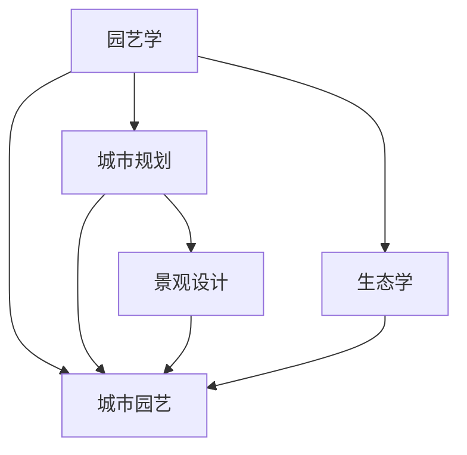

                 

### 1.1 城市化的影响

城市化，即人口从农村向城市的迁移和城市地域的扩展，是现代社会发展的重要趋势。它不仅改变了人类社会的经济、社会和文化结构，还对城市空间和生态环境产生了深远的影响。

#### 1.1.1 城市空间的变化

城市空间的变化主要体现在以下几个方面：

- **城市面积扩展**：随着城市化的推进，城市用地需求不断增加，城市面积持续扩大。这包括了新建住宅区、商业区、工业区和交通设施等。
  
- **建筑密度增加**：为满足城市人口增长和用地需求，建筑物的高度和密度不断增加。摩天大楼和高层住宅区成为现代城市的新地标。

- **交通网络复杂化**：城市交通系统不断完善，道路、桥梁、隧道等交通基础设施的建设使城市交通网络更加复杂化。


$$
\text{图 1.1-1：城市空间变化示意图}
$$

**图表描述**：图 1.1-1 展示了城市化过程中城市空间的变化，包括面积扩展、建筑密度增加和交通网络复杂化。

#### 1.1.2 生态环境的挑战

城市化的快速发展也给生态环境带来了诸多挑战：

- **绿地减少**：城市建设占用大量绿地，导致城市绿地面积减少，生态环境恶化。

- **空气质量下降**：城市交通、工业和生活排放的污染物增加，导致空气质量下降。

- **水资源短缺**：城市建设与用水需求增加，导致水资源短缺，地下水位下降。


$$
\text{图 1.1-2：城市生态环境挑战}
$$

**图表描述**：图 1.1-2 展示了城市化过程中面临的生态环境挑战，包括绿地减少、空气质量下降和水资源短缺。

**REASONING**：
- 城市化是现代社会发展的必然趋势，它带来了城市空间的扩展和建筑密度的增加。
- 然而，城市化的快速发展也对城市生态环境造成了负面影响，包括绿地减少、空气质量下降和水资源短缺。
- 因此，如何在城市化进程中保护和改善生态环境，成为了一个亟待解决的问题。

通过上述分析，我们了解了城市化的背景及其对城市空间和生态环境的影响。接下来，我们将探讨城市园艺的定义与目标，以及它如何应对城市化的挑战。

## 1.2 城市园艺的定义与目标

### 1.2.1 城市园艺的定义

城市园艺是一种结合园艺、城市规划和生态学等多学科知识的综合艺术和科学，旨在改善城市生态环境、提升城市居民生活质量。具体来说，城市园艺包括以下几个方面：

- **绿化**：通过种植植物、建设花园和公园等手段，增加城市绿地面积，改善城市生态环境。

- **景观设计**：利用园艺技术和美学原则，设计具有美观和文化内涵的园林景观，提升城市美观度。

- **生态修复**：通过植物、土壤和水资源管理等措施，恢复和改善城市受损的生态系统。

- **社区参与**：鼓励社区居民参与城市园艺活动，提高居民的环保意识和生活质量。

### 1.2.2 城市园艺的目标

城市园艺的主要目标包括：

- **改善生态环境**：通过增加城市绿地、改善空气质量、调节城市气候等手段，提升城市生态环境质量。

- **提升城市美观度**：通过设计精美的园林景观，增加城市的美感和文化内涵，提升居民的生活质量。

- **增强社区活力**：通过社区参与和公共空间的建设，促进社区互动，增强社区活力。

- **促进可持续发展**：通过生态修复和资源循环利用等措施，推动城市可持续发展，实现经济、社会和生态的协调发展。

**REASONING**：
- 城市园艺是一种综合艺术和科学，它不仅关注园艺本身，还关注城市生态环境和居民生活质量。
- 通过绿化、景观设计和生态修复等措施，城市园艺能够有效改善城市生态环境，提升城市美观度，增强社区活力，促进可持续发展。
- 因此，城市园艺在城市化进程中具有重要作用，是应对城市化挑战的重要手段。

### 1.3 城市园艺的现状与趋势

#### 1.3.1 国际城市园艺的发展

国际城市园艺发展迅速，许多国家在城市园艺领域取得了显著成果。例如：

- **欧洲**：欧洲国家在城市园艺方面具有悠久的历史，现代城市园艺理念和技术在欧洲得到了广泛应用。例如，英国的伦敦、法国的巴黎等城市都拥有众多著名的公园和花园。

- **美国**：美国城市园艺的发展受到政府、企业和社区的多方推动，许多城市在公园、绿地和城市广场的建设上取得了显著成效。例如，纽约的中央公园、芝加哥的千禧公园等。

- **日本**：日本城市园艺以精细化管理、科技创新和生态修复为特色，城市绿化和景观设计水平较高。例如，东京的代代木公园、大阪的北野异人馆公园等。


$$
\text{图 1.3-1：国际城市园艺发展概况}
$$

**图表描述**：图 1.3-1 展示了国际城市园艺的发展概况，包括欧洲、美国和日本等国家的城市园艺成果。

#### 1.3.2 中国城市园艺的发展

中国城市园艺近年来取得了显著进展，主要表现在：

- **政府政策支持**：中国政府高度重视城市园艺发展，出台了一系列政策和规划，推动城市绿化和生态建设。

- **城市绿化建设**：各地政府大力开展城市绿化建设，增加城市绿地面积，提升城市生态环境质量。

- **公园和广场建设**：全国各地新建和改造了众多公园和广场，为居民提供休闲、娱乐的场所。

- **社区参与**：鼓励社区居民参与城市园艺活动，提高居民的环保意识和参与度。


$$
\text{图 1.3-2：中国城市园艺发展概况}
$$

**图表描述**：图 1.3-2 展示了中国城市园艺的发展概况，包括政府政策支持、城市绿化建设、公园和广场建设以及社区参与。

**REASONING**：
- 国际城市园艺发展迅速，许多国家在城市园艺领域取得了显著成果，为中国提供了宝贵的经验和借鉴。
- 中国城市园艺发展迅速，政府政策支持、城市绿化建设、公园和广场建设以及社区参与等方面取得了显著成效。
- 然而，中国城市园艺仍面临一些挑战，如生态环境保护、资源利用效率和社区参与度等，需要进一步加强和改进。

### 1.3.3 城市园艺的现状与趋势

城市园艺的现状和趋势可以从以下几个方面进行分析：

- **发展趋势**：随着城市化进程的加速和人们对生态环境意识的提高，城市园艺发展前景广阔。未来，城市园艺将更加注重生态修复、可持续发展和社区参与。

- **技术进步**：现代科技的发展为城市园艺提供了新的手段和工具，如智能园艺、生物技术和绿色建筑等，有助于提高城市园艺的效率和质量。

- **政策支持**：政府政策和规划对城市园艺的发展具有重要影响。未来，政府将进一步加大对城市园艺的支持力度，推动城市园艺的可持续发展。

- **公众参与**：城市园艺的可持续发展离不开公众的参与。未来，城市园艺将更加注重公众参与，提高居民的环保意识和参与度。

**REASONING**：
- 城市园艺是一种综合艺术和科学，它在城市化进程中发挥着重要作用，有助于改善城市生态环境、提升城市美观度和增强社区活力。
- 国际城市园艺发展迅速，为中国提供了宝贵的经验和借鉴。
- 中国城市园艺发展迅速，但仍面临一些挑战。
- 未来，城市园艺将更加注重生态修复、可持续发展和社区参与，同时，技术进步和政策支持将为城市园艺提供有力保障。

### 1.4 城市园艺的核心概念与联系

城市园艺涉及多个核心概念，这些概念之间存在着紧密的联系。以下是城市园艺中几个关键概念的定义及其相互关系：

#### 1.4.1 园艺学

园艺学是研究植物栽培、繁殖、育种和病虫害防治等技术的学科。它涵盖了蔬菜、果树、花卉、草坪等多种植物的培养和管理。园艺学为城市园艺提供了理论基础和实践指导。

**园艺学**与**城市园艺**的关系：

- **园艺学**为城市园艺提供了植物栽培和管理的知识和技能，如植物选择、种植技术和管理方法。
- **城市园艺**则是园艺学在城市环境中的应用，通过园艺技术和景观设计，改善城市生态环境和提升城市美观度。

#### 1.4.2 城市规划

城市规划是研究城市空间布局、功能分区、交通网络和公共服务设施等内容的学科。它旨在合理规划城市空间，提高城市运行效率和生活质量。

**城市规划**与**城市园艺**的关系：

- **城市规划**为城市园艺提供了空间布局和功能规划的基础，如公园、广场和绿地等空间的设计和分配。
- **城市园艺**则通过景观设计，实现城市规划中的生态和美观目标，提升城市环境品质。

#### 1.4.3 生态学

生态学是研究生物与环境相互作用的学科。它关注生物多样性、生态系统功能和生态平衡等问题。生态学为城市园艺提供了生态保护和恢复的理论基础。

**生态学**与**城市园艺**的关系：

- **生态学**为城市园艺提供了生态保护、恢复和可持续发展的指导原则，如生态修复、生态景观设计和生态平衡维护。
- **城市园艺**则通过生态学原理，实施生态修复和生态景观设计，提高城市生态环境质量。

#### 1.4.4 景观设计

景观设计是研究自然景观和人工景观的规划、设计和管理等内容的学科。它注重空间美学和生态功能的结合，旨在创造宜居、美观和生态的城市环境。

**景观设计**与**城市园艺**的关系：

- **景观设计**为城市园艺提供了视觉和功能上的设计指导，如植物配置、景观结构和景观元素的选择。
- **城市园艺**则通过景观设计，实现城市空间的美化和生态功能的提升。

### Mermaid 流程图

以下是一个展示核心概念及其相互关系的 Mermaid 流程图：



**流程图描述**：图 1.4-1 展示了园艺学、城市规划、生态学和景观设计等核心概念及其与城市园艺的关系。

$$
\text{图 1.4-1：城市园艺核心概念及其相互关系}
$$

**REASONING**：
- 城市园艺是一个跨学科的领域，它结合了园艺学、城市规划、生态学和景观设计等多个学科的知识和理念。
- 通过这些核心概念的联系和相互作用，城市园艺实现了生态环境的改善、城市美观的提升和社区活力的增强。
- 因此，理解和把握这些核心概念及其相互关系，对于城市园艺的设计、实施和发展具有重要意义。

### 2.2 城市园艺的特点与挑战

#### 2.2.1 城市园艺的特点

城市园艺在城市化进程中具有独特的特点，这些特点决定了它在城市环境中的功能和价值。

- **空间限制**：城市空间相对有限，城市园艺需要在有限的土地上创造多样化的景观和生态功能。这要求设计师具备创新思维和高效利用空间的能力。

- **多样性**：城市园艺不仅要满足绿化和美观的需求，还要考虑生态功能、文化内涵和社区互动等多方面的要求。因此，城市园艺具有高度的多样性和综合性。

- **可持续性**：城市园艺强调生态保护和可持续发展，通过生态修复、资源循环利用和低碳设计等措施，实现城市生态环境的持续改善。

- **社区参与**：城市园艺鼓励社区居民的参与，提高居民的环保意识和社区归属感。通过社区参与，城市园艺能够更好地满足居民的需求，增强社区凝聚力。

- **技术集成**：城市园艺融合了园艺、生态、景观设计和信息技术等多领域的技术，通过技术创新，提高园艺项目的效率和质量。

#### 2.2.2 城市园艺面临的挑战

尽管城市园艺在城市环境中具有重要作用，但它在实践中仍面临一系列挑战。

- **资源有限**：城市空间有限，绿化资源有限。如何在有限的空间和资源下实现高效的城市园艺，是一个重要挑战。

- **环境问题**：城市化带来了环境污染、生态破坏和气候变化等问题。城市园艺需要应对这些环境问题，改善城市生态环境。

- **维护成本**：城市园艺项目需要长期的维护和管理，包括植物养护、灌溉、修剪等。维护成本高，需要合理规划和管理。

- **公众参与**：尽管城市园艺鼓励公众参与，但实际参与度可能不高。如何提高公众的参与度，增强社区活力，是一个挑战。

- **技术和管理**：城市园艺涉及多种技术和专业知识，如园艺技术、生态技术和景观设计等。提高技术水平和科学管理水平，是城市园艺发展的关键。


$$
\text{图 2.2-1：城市园艺面临的挑战}
$$

**图表描述**：图 2.2-1 展示了城市园艺面临的资源有限、环境问题、维护成本、公众参与和技术管理等方面的挑战。

### 2.3 城市园艺在可持续发展中的作用

城市园艺在可持续发展中扮演着关键角色，它通过以下方式促进城市可持续发展：

- **生态修复**：城市园艺通过生态修复措施，如植被恢复、土壤改良和水体净化等，恢复和改善受损的生态系统。

- **资源循环利用**：城市园艺推动资源循环利用，如雨水收集、废水处理和废弃物利用等，降低资源消耗和环境污染。

- **节能减排**：城市园艺通过植物光合作用、土壤呼吸和植被遮荫等措施，降低城市能耗和碳排放，促进低碳发展。

- **生物多样性保护**：城市园艺提供生物多样性栖息地，保护植物和动物种群，维护生态平衡。

- **社区参与**：城市园艺鼓励社区居民参与，提高环保意识和社区凝聚力，促进社会和谐。


$$
\text{图 2.3-1：城市园艺在可持续发展中的作用}
$$

**图表描述**：图 2.3-1 展示了城市园艺在生态修复、资源循环利用、节能减排、生物多样性保护和社区参与等方面在可持续发展中的作用。

**REASONING**：
- 城市园艺的特点和挑战决定了它在城市环境中的重要性和局限性。
- 通过克服面临的挑战，发挥城市园艺在可持续发展中的作用，可以实现城市生态环境的改善和社会经济的可持续发展。
- 因此，理解和应对城市园艺的特点和挑战，对于推动城市园艺的发展具有重要意义。

### 2.4 城市园艺与生态文明

#### 2.4.1 城市园艺与生态文明的定义

- **城市园艺**：城市园艺是一种在城市环境中进行的园艺活动，旨在改善城市生态环境、提升城市美观度和增强社区活力。它结合了园艺、城市规划、生态学和景观设计等学科知识，通过种植植物、设计景观和生态修复等措施，实现城市生态和美观的和谐统一。

- **生态文明**：生态文明是人类文明发展的新阶段，它强调人与自然和谐共生，以实现可持续发展为目标。生态文明倡导绿色、低碳、环保的生产和生活方式，追求经济、社会和生态的协调发展。

#### 2.4.2 城市园艺在生态文明中的地位

城市园艺在生态文明中具有重要地位，它既是生态文明建设的物质基础，也是精神支撑。以下是城市园艺在生态文明中的几个关键作用：

- **生态保护**：城市园艺通过种植植物、生态修复和水资源管理等措施，改善城市生态环境，保护生物多样性，实现生态平衡。

- **资源循环利用**：城市园艺推动资源循环利用，如雨水收集、废水处理和废弃物利用等，降低资源消耗和环境污染，实现可持续发展。

- **节能减排**：城市园艺通过植物光合作用、土壤呼吸和植被遮荫等措施，降低城市能耗和碳排放，促进低碳发展。

- **文化传承**：城市园艺融合了地方文化和艺术元素，传承和弘扬地域特色和文化，提升城市的文化品位和魅力。

- **社区参与**：城市园艺鼓励社区居民参与，提高环保意识和社区凝聚力，促进社会和谐，实现共建共治共享。

#### 2.4.3 城市园艺与生态文明的互动关系

城市园艺与生态文明之间存在紧密的互动关系，二者相互促进、共同发展。

- **相互促进**：城市园艺通过改善城市生态环境、提升城市美观度和增强社区活力，为生态文明提供了物质基础。同时，生态文明的推进，如环保政策、绿色技术和可持续发展理念的普及，为城市园艺提供了政策支持和技术保障。

- **共同发展**：城市园艺的发展，如生态修复、资源循环利用和低碳设计等，有助于实现生态文明的目标。生态文明的推进，如绿色建筑、低碳城市和生态修复等，为城市园艺提供了新的发展机遇和方向。


$$
\text{图 2.4-1：城市园艺与生态文明的互动关系}
$$

**图表描述**：图 2.4-1 展示了城市园艺与生态文明之间的相互促进和共同发展关系。

**REASONING**：
- 城市园艺是生态文明的重要组成部分，它通过改善城市生态环境、提升城市美观度和增强社区活力，为生态文明提供了物质基础和精神支撑。
- 生态文明的推进，如环保政策、绿色技术和可持续发展理念的普及，为城市园艺提供了政策支持和技术保障。
- 因此，城市园艺与生态文明之间的互动关系，对于推动城市可持续发展和实现生态文明具有重要意义。

### 2.5 城市园艺的设计原则

#### 2.5.1 设计理念的转变

城市园艺的设计理念经历了从传统的园林艺术到现代生态园林的转变。传统的园林艺术注重美观和艺术性，而现代生态园林则强调生态保护、可持续发展和人与自然的和谐共生。

- **从人工到自然**：现代城市园艺强调模仿自然，利用自然元素和过程，实现生态平衡和生物多样性。

- **从孤立到系统**：现代城市园艺注重整体规划和系统设计，将园林、绿地、水体和其他生态要素有机结合，形成完整的生态系统。

- **从单一功能到多功能**：现代城市园艺不仅关注美观和生态功能，还考虑休闲、教育、文化和经济等多方面的需求，实现多功能融合。

#### 2.5.2 设计要素的考量

在城市园艺设计中，以下要素是不可或缺的：

- **植物配置**：植物是城市园艺的核心元素，不同植物的选择和配置直接影响园林的美观和生态功能。设计师需要根据植物的生长习性、生态功能和观赏价值进行合理配置。

- **地形地貌**：地形地貌对城市园艺的设计至关重要，它决定了园林的空间结构和视觉效果。设计师可以通过地形塑造、地势起伏和排水系统等手段，创造自然、美观的景观。

- **水体设计**：水体是城市园艺的重要组成部分，它可以增加园林的生态功能、美观度和休闲价值。设计师需要考虑水体的形状、大小、深度和水质，以及如何与周围环境和谐融合。

- **景观照明**：景观照明可以增强园林的夜景效果，提升园林的观赏性和艺术性。设计师需要根据园林的结构和植物特性，选择合适的照明方式和灯具类型。

- **空间布局**：空间布局是城市园艺设计的关键，它决定了园林的整体结构和功能。设计师需要综合考虑各种要素，合理安排空间，实现功能分区和视觉效果的协调。

#### 2.5.3 设计案例解析

以下是一个城市园艺设计的实际案例：

**案例：上海市中心公园**

- **项目背景**：上海市中心公园位于上海市中心区域，占地面积约 100 公顷。该项目旨在打造一个集生态、休闲、文化和景观于一体的现代化城市公园。

- **设计理念**：设计师秉承“自然和谐、生态优先”的理念，通过模拟自然生态过程，创造多样化的生物栖息地，提升公园的生态功能和美观度。

- **设计要素**：
  - **植物配置**：设计师选择了丰富的植物种类，包括乔木、灌木、草本植物和地被植物，形成了多层次、多功能的植物景观。
  - **地形地貌**：通过地形塑造和排水系统设计，形成了自然起伏的景观，增强了公园的生态功能和视觉效果。
  - **水体设计**：公园内设有多个水体，包括湖泊、溪流和池塘，通过水体的循环和净化，提升了公园的生态环境。
  - **景观照明**：设计师采用了地埋灯、喷泉灯和草坪灯等多种照明方式，营造了独特的夜景效果。

- **设计效果**：经过设计改造，上海市中心公园成为了一个生态良好、美观舒适的城市绿肺，受到了市民和游客的喜爱。


$$
\text{图 2.5-1：上海市中心公园设计案例}
$$

**图表描述**：图 2.5-1 展示了上海市中心公园的设计效果图，体现了现代城市园艺的设计理念和设计要素。

**REASONING**：
- 城市园艺设计原则的变革，从传统的园林艺术到现代生态园林，体现了人与自然和谐共生的发展理念。
- 在设计要素的考量中，植物配置、地形地貌、水体设计、景观照明和空间布局等要素相互关联，共同构建了城市园艺的整体景观效果。
- 通过实际案例的解析，我们看到了现代城市园艺设计的成功实践，为未来的城市园艺设计提供了宝贵的经验和启示。

### 3.2 城市园艺实施的关键步骤

#### 3.2.1 前期准备

城市园艺实施的前期准备工作至关重要，它决定了项目的顺利进行和最终效果。以下是一些关键步骤：

- **项目立项**：首先需要明确城市园艺项目的目标和范围，制定项目计划，包括项目预算、时间表和责任人等。

- **场地调查**：对项目场地进行详细调查，包括地形地貌、土壤状况、水文条件、植物资源和环境污染情况等。这些信息有助于制定合适的设计方案。

- **风险评估**：评估项目可能面临的风险，包括自然风险（如气象、地质等）和人为风险（如施工安全、资源供应等）。制定相应的风险应对措施，确保项目安全顺利实施。

- **公众参与**：鼓励公众参与项目，通过座谈会、展览和问卷调查等方式，收集公众的意见和建议，提高项目的透明度和公众的参与度。

- **审批流程**：根据项目类型和规模，办理相关的审批手续，包括土地使用、规划许可、环保评估等。确保项目的合法合规。

#### 3.2.2 园艺规划

园艺规划是城市园艺实施的核心环节，它决定了园林景观的布局、功能和美观度。以下是一些关键步骤：

- **总体布局**：根据项目目标和场地条件，确定园林的总体布局，包括植物配置、空间划分、景观结构和功能区设置等。确保园林的布局合理、功能齐全、美观和谐。

- **植物选择**：根据园林的功能、气候条件和土壤状况，选择合适的植物种类。注意植物的色彩、形态和生长习性，确保植物配置的多样性和观赏性。

- **景观设计**：运用园艺美学原理，结合场地特点和项目需求，设计景观结构和景观元素，如雕塑、喷泉、花坛、步道等。注重景观的视觉效果和用户体验。

- **排水设计**：合理设计排水系统，确保雨水能够及时排放，避免积水导致植物病害和土壤侵蚀。

- **灌溉系统**：根据植物需水量和生长习性，设计灌溉系统，包括水源、管道、喷头等。确保灌溉系统的合理性和节水性。

#### 3.2.3 园艺施工与维护

园艺施工与维护是城市园艺实施的最后阶段，直接关系到园林景观的最终效果和使用寿命。以下是一些关键步骤：

- **施工准备**：根据园艺规划，准备施工所需的设备和材料，包括植物、土壤、园艺工具等。确保施工过程中各项工作的顺利进行。

- **施工实施**：按照园艺规划进行施工，包括植物种植、景观建造、灌溉系统安装等。施工过程中要注意质量控制，确保施工质量符合设计要求。

- **施工监督**：建立施工监督机制，对施工过程进行监控和管理，确保施工安全和质量。

- **后期维护**：施工完成后，进行园林的后期维护，包括植物养护、灌溉管理、病虫害防治、景观修复等。确保园林景观的长久美观和生态功能。


$$
\text{图 3.2-1：城市园艺实施关键步骤}
$$

**图表描述**：图 3.2-1 展示了城市园艺实施的前期准备、园艺规划和园艺施工与维护等关键步骤。

**REASONING**：
- 城市园艺实施的前期准备工作确保了项目的顺利进行，包括项目立项、场地调查、风险评估、公众参与和审批流程等。
- 园艺规划是城市园艺实施的核心，包括总体布局、植物选择、景观设计和排水灌溉设计等。
- 园艺施工与维护是城市园艺实施的最后阶段，确保园林景观的最终效果和使用寿命，包括施工准备、施工实施、施工监督和后期维护等。
- 通过以上关键步骤，城市园艺得以顺利实施，实现了改善城市生态环境、提升城市美观度和增强社区活力的目标。

### 4.1 城市园艺材料的分类与特性

城市园艺材料是城市园艺实施的基础，它们直接影响园林景观的效果和生态功能。城市园艺材料可以分为以下几类：

#### 4.1.1 土壤材料

土壤材料是植物生长的基础，其质量和性能对植物的生长和园林的生态功能至关重要。土壤材料主要包括以下几种：

- **天然土壤**：天然土壤是未经处理的自然土壤，其理化性质较为稳定，适合大多数植物的生长。然而，天然土壤的肥力、透气性和排水性可能较差，需要经过改良才能满足城市园艺的需求。

- **园艺土壤**：园艺土壤是经过改良和调整的土壤，其理化性质符合植物生长的要求。园艺土壤通常通过添加有机质、调节酸碱度和改善透气性等方式进行改良。

- **种植介质**：种植介质是一种专门为植物生长设计的土壤替代品，通常由有机物、矿物质和无机物等组成。种植介质具有良好的透气性、保水性和养分供给能力，适用于容器栽培、屋顶绿化和垂直花园等。

#### 4.1.2 装饰材料

装饰材料用于园林景观的美化和结构构建，常见的装饰材料包括：

- **石头和砖块**：石头和砖块是园林景观中常见的装饰材料，可以用于铺装地面、构筑墙壁、搭建桥梁和制作景观小品等。不同类型的石头和砖块具有不同的质地、颜色和形态，能够营造出多样化的景观效果。

- **木材**：木材是一种自然、环保的装饰材料，适用于制作园林中的桥梁、长椅、亭子和景观小品等。木材具有温暖的质感和自然的纹理，能够为园林景观增添自然气息。

- **金属材料**：金属材料如铁艺、铜艺和不锈钢等，具有现代感强、耐久性好等特点。金属材料常用于制作雕塑、花坛、栏杆和景观灯具等。

#### 4.1.3 水体材料

水体材料用于园林景观中的水体设计和功能维护，常见的有：

- **水体底泥**：水体底泥是水体的基础，它通常由砂、砾石、贝壳和有机物等组成。水体底泥的质地和厚度会影响水体的清澈度和生物栖息环境。

- **水体净化材料**：水体净化材料如活性炭、砂滤料和生物球等，用于去除水体中的污染物，提高水质。这些材料具有优良的吸附和过滤性能，能够有效净化水体。

- **水体装饰物**：水体装饰物如喷泉、雕塑、浮岛和水景灯具等，用于美化水体和增加园林景观的趣味性。这些装饰物可以根据园林风格和设计要求进行选择和布置。

#### 4.1.4 植物材料

植物材料是城市园艺的核心，它们直接影响园林景观的生态功能和美观度。植物材料主要包括：

- **乔木**：乔木是园林景观中的高大植物，具有遮荫、美化景观和改善生态环境等作用。常见的乔木有松树、柏树、梧桐树等。

- **灌木**：灌木是园林景观中的中层植物，可以用于篱笆、花坛和景观墙等。常见的灌木有月季、紫薇、桂花等。

- **草本植物**：草本植物是园林景观中的低层植物，包括草坪、地被植物和花卉等。常见的草本植物有草坪草、薄荷、紫罗兰等。

#### 4.1.5 应用示例

以下是一个城市园艺材料应用示例：

**案例：某城市公园的改造**

- **土壤材料**：为了提高土壤的肥力和透气性，设计师在公园内进行了土壤改良，添加了有机肥料和矿物质，改善了土壤质量。

- **装饰材料**：设计师在公园内使用了各种装饰材料，如石头铺装、木质长椅和金属雕塑等，营造出自然、现代和美观的景观效果。

- **水体材料**：设计师在公园内设计了人工湖泊和溪流，使用了水体底泥和净化材料，确保了水体的清澈和生态环境的良好。

- **植物材料**：设计师根据公园的景观需求，选择了多种乔木、灌木和草本植物，形成了丰富的园林景观。


$$
\text{图 4.1-1：某城市公园改造案例}
$$

**图表描述**：图 4.1-1 展示了某城市公园的改造案例，体现了城市园艺材料在园林景观中的应用。

**REASONING**：
- 城市园艺材料是城市园艺实施的基础，它们分为土壤材料、装饰材料、水体材料和植物材料等几类。
- 不同类型的材料具有不同的特性，适用于不同的园林景观设计和功能需求。
- 通过合理选择和应用城市园艺材料，可以创造出多样化和美观的城市园林景观，提高城市生态环境质量。

### 4.2 城市园艺植物的选择与应用

城市园艺植物的选择与应用对于实现园林景观的生态功能、美观度和可持续性至关重要。以下是一些关键步骤和策略：

#### 4.2.1 选择原则

在城市园艺植物的选择过程中，应遵循以下原则：

- **适应性**：选择适应本地气候、土壤和环境的植物，确保植物能够正常生长和繁衍。

- **多样性**：选择多种类型的植物，包括乔木、灌木、草本植物和地被植物等，以增加园林景观的层次感和观赏性。

- **生态效益**：选择具有良好生态效益的植物，如能够改善空气质量、减少噪音和保持水土的植物。

- **本土化**：优先选择本土植物，这些植物在当地已经生存了很长时间，具有较强的适应性，能够更好地融入本地生态系统。

- **可持续性**：选择可持续种植和管理的植物，如无需大量灌溉和农药的植物，以减少资源消耗和环境污染。

#### 4.2.2 种植策略

在城市园艺植物种植过程中，应采取以下策略：

- **规划布局**：根据园林的总体规划和功能需求，合理布局植物。例如，将乔木、灌木和草本植物分层种植，形成自然的生态群落。

- **季节性搭配**：根据季节变化，选择适合不同季节的植物，确保园林景观的四季变化和观赏性。例如，春天选择开花植物，夏天选择耐热植物，秋天选择变色植物，冬天选择常绿植物。

- **色彩搭配**：合理搭配植物的色彩，创造出丰富多彩的景观效果。例如，将红色、黄色、紫色等色彩植物搭配在一起，形成视觉冲击力。

- **空间利用**：合理利用空间，充分利用园林的各个角落，避免浪费。例如，在角落和边角地带种植攀缘植物，增加景观的丰富性和层次感。

- **可持续管理**：采取科学的植物管理方法，如合理灌溉、施肥和修剪等，确保植物的健康生长和景观效果的持久性。

#### 4.2.3 应用示例

以下是一个城市园艺植物选择与应用的实际案例：

**案例：某城市广场的景观改造**

- **项目背景**：某城市广场位于市中心，面积较大，但由于植物种类单一，景观效果不佳。项目目标是通过植物改造，提升广场的生态功能和美观度。

- **植物选择**：
  - **乔木**：选择了几种适应性强、生长快速的本土乔木，如梧桐树、柳树等，用于广场的主景树。
  - **灌木**：选择了多种灌木，如月季、紫薇等，用于花坛、花带和角落的装饰。
  - **草本植物**：选择了草坪草、薄荷等草本植物，用于地面覆盖和花坛填充。

- **种植策略**：
  - **规划布局**：根据广场的形状和功能需求，设计了乔木、灌木和草本植物的布局，形成了自然的生态群落。
  - **季节性搭配**：选择了适合不同季节的植物，如春天种植开花植物，夏天种植耐热植物，秋天种植变色植物。
  - **色彩搭配**：通过合理搭配植物的色彩，形成了丰富多彩的景观效果。
  - **空间利用**：充分利用广场的各个角落，种植了攀缘植物，增加了景观的层次感和丰富性。

- **应用效果**：经过植物改造，广场的生态功能和美观度得到了显著提升，成为了一个受欢迎的市民休闲场所。


$$
\text{图 4.2-1：某城市广场景观改造案例}
$$

**图表描述**：图 4.2-1 展示了某城市广场的景观改造效果，体现了城市园艺植物的选择与应用策略。

**REASONING**：
- 城市园艺植物的选择与应用需要遵循适应性、多样性、生态效益、本土化和可持续性等原则。
- 通过合理的植物选择和种植策略，可以创造出美观、生态和可持续的园林景观。
- 实际案例证明了城市园艺植物改造对于提升城市生态环境和美观度的重要作用，为未来的城市园艺实践提供了有益的经验和启示。

### 5.1 城市园艺的创新实践

#### 5.1.1 新型园艺技术的应用

城市园艺的创新实践离不开新型园艺技术的应用。以下是一些重要的新型园艺技术：

- **无土栽培技术**：无土栽培技术是一种不依赖土壤的植物栽培方法，通过营养液或基质替代土壤，提供植物所需的水分、养分和空气。这种技术具有产量高、品质好、病虫害少和水资源利用率高等优点，适用于城市园艺中的垂直花园、屋顶花园和室内植物栽培。

  **Python 源代码示例**：

  ```python
  # 无土栽培营养液配方计算
  def calculate_nutrient_solution(concentration):
      return {
          'water': 1000,  # 毫升
          'nitrogen': concentration * 10,  # 毫克/升
          'phosphorus': concentration * 5,  # 毫克/升
          'potassium': concentration * 10,  # 毫克/升
      }

  # 测试
  solution = calculate_nutrient_solution(0.5)
  print(solution)
  ```

  **代码解读**：上述代码定义了一个函数 `calculate_nutrient_solution`，用于计算无土栽培营养液的配方。该函数接受一个参数 `concentration`（养分浓度），返回一个字典，包含水分、氮、磷和钾的含量。通过测试，我们可以得到一个具体的营养液配方。

- **智能灌溉系统**：智能灌溉系统通过传感器、控制器和执行器等设备，实现自动、精确和节水的灌溉管理。这种系统可以根据土壤湿度、天气预报和植物生长需求等因素，自动调节灌溉水量和时间，提高灌溉效率。

  **Python 源代码示例**：

  ```python
  # 智能灌溉系统控制逻辑
  class IrrigationSystem:
      def __init__(self, sensor, controller):
          self.sensor = sensor
          self.controller = controller

      def irrigate(self):
          soil_moisture = self.sensor.read_soil_moisture()
          if soil_moisture < 30:  # 土壤湿度低于30%时灌溉
              self.controller.start_irrigation()
          else:
              self.controller.stop_irrigation()

  # 测试
  sensor = Sensor()  # 假设的传感器类
  controller = Controller()  # 假设的控制器类
  system = IrrigationSystem(sensor, controller)
  system.irrigate()
  ```

  **代码解读**：上述代码定义了一个 `IrrigationSystem` 类，用于实现智能灌溉系统的控制逻辑。该类包含一个 `irrigate` 方法，根据传感器读取的土壤湿度值，决定是否启动灌溉。通过测试，我们可以模拟智能灌溉系统的运行。

- **植物工厂**：植物工厂是一种在人工控制环境下，利用温室、LED 照明、自动控制等技术进行植物栽培的方法。这种技术可以实现全年四季不间断的植物生长，提高产量和质量。

  **Python 源代码示例**：

  ```python
  # 植物工厂环境控制逻辑
  class PlantFactory:
      def __init__(self, lighting_system, climate_control_system):
          self.lighting_system = lighting_system
          self.climate_control_system = climate_control_system

      def control_environment(self):
          lighting_status = self.lighting_system.get_status()
          climate_status = self.climate_control_system.get_status()
          
          if lighting_status['time'] < 10 or climate_status['temperature'] > 30:  # 照明时间不足或温度过高时调整环境
              self.lighting_system.adjust_lighting()
              self.climate_control_system.adjust_climate()
          else:
              print("环境控制正常")

  # 测试
  lighting_system = LightingSystem()  # 假设的照明系统类
  climate_control_system = ClimateControlSystem()  # 假设的气候控制系统类
  factory = PlantFactory(lighting_system, climate_control_system)
  factory.control_environment()
  ```

  **代码解读**：上述代码定义了一个 `PlantFactory` 类，用于实现植物工厂的环境控制逻辑。该类包含一个 `control_environment` 方法，根据照明时间和温度等参数，调整环境参数。通过测试，我们可以模拟植物工厂的环境控制。

#### 5.1.2 城市园艺与数字技术的融合

随着数字技术的快速发展，城市园艺与数字技术的融合成为了一股新兴趋势。以下是一些关键方面：

- **物联网（IoT）**：物联网技术将各种设备连接到互联网，实现数据的实时采集、传输和处理。在城市园艺中，物联网技术可用于智能灌溉系统、环境监测系统和植物健康监测等。

  **Python 源代码示例**：

  ```python
  # 物联网灌溉系统示例
  import requests

  def send_irrigation_request(url, params):
      response = requests.get(url, params=params)
      return response.json()

  # 测试
  url = "http://iot.example.com/irrigation"
  params = {
      'zone': 'Zone1',
      'moisture_threshold': 30,
  }
  response = send_irrigation_request(url, params)
  print(response)
  ```

  **代码解读**：上述代码定义了一个函数 `send_irrigation_request`，用于向物联网灌溉系统发送灌溉请求。该函数通过 HTTP GET 请求，传递土壤湿度阈值等参数，获取系统响应。通过测试，我们可以模拟物联网灌溉系统的运行。

- **大数据分析**：大数据技术可以对城市园艺中的大量数据进行处理和分析，为园艺管理提供科学依据。例如，通过分析植物生长数据，预测植物病虫害的发生，制定相应的防治措施。

  **Python 源代码示例**：

  ```python
  # 大数据分析：植物生长数据可视化
  import pandas as pd
  import matplotlib.pyplot as plt

  def plot_growth_data(data):
      df = pd.DataFrame(data)
      df.plot(x='date', y='height')
      plt.xlabel('Date')
      plt.ylabel('Height (cm)')
      plt.title('Plant Growth Data')
      plt.show()

  # 测试
  data = [
      {'date': '2023-01-01', 'height': 10},
      {'date': '2023-01-02', 'height': 12},
      {'date': '2023-01-03', 'height': 15},
  ]
  plot_growth_data(data)
  ```

  **代码解读**：上述代码定义了一个函数 `plot_growth_data`，用于可视化植物生长数据。该函数使用 Pandas 库创建 DataFrame，并通过 Matplotlib 库绘制折线图。通过测试，我们可以展示植物的生长数据。

- **人工智能（AI）**：人工智能技术可用于植物识别、病虫害诊断、环境监测和园艺规划等。例如，通过使用卷积神经网络（CNN）模型，可以实现植物的自动化识别和分类。

  **Python 源代码示例**：

  ```python
  # 人工智能：植物识别
  import cv2
  import tensorflow as tf

  def identify_plant(image_path, model_path):
      image = cv2.imread(image_path)
      image = cv2.resize(image, (224, 224))
      image = tf.keras.preprocessing.image.img_to_array(image)
      image = tf.expand_dims(image, 0)

      model = tf.keras.models.load_model(model_path)
      predictions = model.predict(image)
      predicted_class = predictions.argmax()

      return predicted_class

  # 测试
  image_path = 'path/to/flower.jpg'
  model_path = 'path/to/flower_model.h5'
  predicted_class = identify_plant(image_path, model_path)
  print(f'Predicted class: {predicted_class}')
  ```

  **代码解读**：上述代码定义了一个函数 `identify_plant`，用于使用卷积神经网络（CNN）模型识别植物。该函数加载图像、调整尺寸、转换为模型的输入格式，并通过模型预测植物类别。通过测试，我们可以自动化识别图像中的植物。

**REASONING**：
- 新型园艺技术的应用，如无土栽培技术、智能灌溉系统和植物工厂，为城市园艺提供了更高效、更可持续的解决方案。
- 城市园艺与数字技术的融合，通过物联网、大数据分析和人工智能等技术，实现了园艺管理的智能化和精准化。
- 实际代码示例展示了新型园艺技术和数字技术在城市园艺中的应用，为未来的城市园艺实践提供了有益的参考和启示。

### 5.2 城市园艺的发展趋势

#### 5.2.1 未来城市园艺的展望

未来城市园艺的发展将呈现出以下几个显著趋势：

- **生态优先**：随着全球生态环境问题的加剧，未来城市园艺将更加注重生态保护和修复。设计师和园艺师将更加关注生态系统的稳定性和生物多样性，通过生态修复、绿色建筑和可持续材料等手段，实现城市生态环境的可持续发展。

- **智能化管理**：数字化和智能化技术的快速发展，将为城市园艺带来全新的管理方式。物联网、大数据和人工智能等技术的应用，将使园艺管理更加精准、高效和可持续。例如，智能灌溉系统可以根据土壤湿度和植物需水量自动调节灌溉，提高水资源利用效率。

- **多功能融合**：未来城市园艺将更加注重多功能融合，实现生态、休闲、文化、教育和经济等多方面的综合效益。城市公园、广场和绿地将成为市民休闲娱乐、文化交流和社区活动的场所，同时兼具生态保护和景观美化功能。

- **社区参与**：社区参与将成为未来城市园艺的重要特征。通过鼓励社区居民参与园艺设计、施工和维护，提高公众的环保意识和社区归属感。社区园艺项目不仅能够改善城市生态环境，还能增强社区凝聚力和居民的幸福指数。

- **城市更新**：随着城市化进程的加速，城市更新将成为未来城市园艺的重要任务。通过改造旧城区、废弃地和废弃建筑物，利用园艺手段提升城市空间品质，实现城市空间的再利用和生态修复。


$$
\text{图 5.2-1：未来城市园艺的展望}
$$

**图表描述**：图 5.2-1 展示了未来城市园艺的发展趋势，包括生态优先、智能化管理、多功能融合、社区参与和城市更新等。

#### 5.2.2 城市园艺与社会发展的互动

城市园艺与社会发展之间存在着密切的互动关系，这种互动不仅体现在城市园艺为社会发展提供生态和景观价值，还体现在社会发展对城市园艺的需求和影响。

- **社会需求驱动**：随着社会经济的发展和生活水平的提高，人们对城市生态环境和城市美观度的要求日益增长。这为城市园艺的发展提供了巨大的市场需求，推动城市园艺不断创新和进步。

- **社会发展影响**：城市化进程、人口增长和经济发展等社会因素，对城市园艺提出了新的要求和挑战。城市园艺需要适应这些变化，通过技术创新和管理方法优化，以满足社会发展的需求。

- **城市园艺促进社会和谐**：城市园艺能够改善城市生态环境、提升城市美观度和增强社区活力，从而促进社会和谐。通过提供公共空间、鼓励公众参与和促进文化交流，城市园艺有助于构建和谐、美丽和宜居的城市环境。

- **社会治理手段**：城市园艺作为一种社会治理手段，能够在城市管理和社区建设中发挥重要作用。通过城市园艺项目，可以加强城市基础设施建设、提高城市治理水平，从而推动城市可持续发展。


$$
\text{图 5.2-2：城市园艺与社会发展的互动关系}
$$

**图表描述**：图 5.2-2 展示了城市园艺与社会发展的互动关系，包括社会需求驱动、社会发展影响、城市园艺促进社会和谐和社会治理手段等。

**REASONING**：
- 未来城市园艺的发展趋势体现了生态优先、智能化管理、多功能融合、社区参与和城市更新等方向。
- 城市园艺与社会发展之间的互动关系，既体现在社会需求对城市园艺的驱动，也体现在城市园艺对社会发展的积极影响。
- 通过理解这些互动关系，我们可以更好地把握未来城市园艺的发展方向，实现城市生态、社会和经济协调发展。

### 6.1 国内外城市园艺案例介绍

#### 6.1.1 国外城市园艺案例

国外城市园艺发展较早，许多城市在园艺领域取得了显著成果。以下是一些著名的国外城市园艺案例：

- **纽约的中央公园**：位于美国纽约市的中央公园是美国最著名的城市公园之一，也是全球城市园艺的典范。中央公园占地面积约 843 英亩，设计理念源于英国风景园林，通过自然地形、湖泊和植被的巧妙布局，创造出一个城市绿洲。中央公园不仅提供了休闲娱乐的场所，还具有生态保护和景观美化功能。

- **巴黎的凡尔赛宫花园**：法国巴黎的凡尔赛宫花园是欧洲最著名的皇家园林之一，其设计理念和风格对全球园林设计产生了深远影响。凡尔赛宫花园占地面积约 2,000 英亩，通过几何对称和精细景观设计，展现了法国巴洛克园林的宏伟和华丽。

- **东京的代代木公园**：日本东京的代代木公园是一座综合性城市公园，占地面积约 47 公顷。公园内设有运动场、花坛、湖泊和树林等多种景观，为市民提供了丰富的休闲和运动空间。代代木公园在设计和施工过程中，注重生态保护和可持续性，体现了日本园林设计的精细和现代。

- **伦敦的伦敦动物园**：英国伦敦的伦敦动物园不仅是一个动物园，也是一个大型城市园艺项目。公园内设有多个主题花园，如热带雨林花园、欧洲花园和地中海花园等，展示了不同地区的植物和文化。伦敦动物园通过园艺和动物的完美结合，为游客提供了一个生态、教育和娱乐的场所。

#### 6.1.2 国内城市园艺案例

近年来，中国城市园艺发展迅速，各地涌现出了许多具有代表性的城市园艺项目。以下是一些国内城市园艺案例：

- **北京的长安街绿化带**：北京长安街绿化带是北京市的重要城市景观带，全长约 60 公里。绿化带通过多种植物配置和景观设计，形成了春花、夏荫、秋果、冬绿的四季景观。长安街绿化带不仅提升了城市的美观度，还改善了城市生态环境，成为了北京的城市名片。

- **上海的世纪公园**：上海世纪公园是上海市最大的城市公园，占地面积约 1,500 公顷。公园分为十个不同主题的区域，包括自然生态区、湖泊景观区、娱乐休闲区和花卉展示区等。世纪公园通过丰富的植物配置和景观设计，创造了一个生态、休闲和文化相结合的城市绿洲。

- **广州的白云山风景名胜区**：广州白云山风景名胜区是一座集自然景观和人文景观于一体的城市公园，占地面积约 2,000 公顷。公园内有多座山峰、湖泊和瀑布，以及寺庙、古建筑和雕塑等人文景观。白云山风景名胜区通过园艺设计和生态修复，保护了自然景观，提升了城市生态环境。

- **深圳的莲花山公园**：深圳莲花山公园是深圳市的标志性公园，占地面积约 120 公顷。公园内设有多个花园和景观区，如莲花广场、音乐喷泉和雕塑园等。莲花山公园通过园艺设计和景观美化，为市民提供了一个休闲、娱乐和文化交流的场所。


$$
\text{图 6.1-1：国内外城市园艺案例}
$$

**图表描述**：图 6.1-1 展示了国内外一些著名的城市园艺案例，包括纽约的中央公园、巴黎的凡尔赛宫花园、东京的代代木公园、伦敦的伦敦动物园、北京的长安街绿化带、上海世纪公园、广州白云山风景名胜区和深圳莲花山公园等。

**REASONING**：
- 国外城市园艺案例展示了不同国家和地区的园艺设计理念和风格，如美国注重生态保护和休闲功能，法国强调宏伟和华丽，日本注重精细和现代。
- 国内城市园艺案例体现了中国城市园艺的发展成就，各地通过创新设计和生态修复，打造出了具有地域特色和生态效益的城市园艺项目。
- 通过学习和借鉴国内外城市园艺案例，可以为中国城市园艺的发展提供有益的启示和经验。

### 6.2 城市园艺项目的成功与不足

#### 6.2.1 成功案例分析

城市园艺项目的成功，往往得益于科学的设计、合理的规划和有效的管理。以下是一个城市园艺项目的成功案例：

**案例：上海外滩绿地**

- **项目背景**：上海外滩绿地位于上海市黄浦区，是上海市的重要城市绿地。项目旨在通过景观设计和生态修复，改善城市生态环境，提升城市形象。

- **设计理念**：设计师秉承“生态优先、文化传承、以人为本”的理念，通过植物配置、景观结构和功能设置等多方面考虑，打造了一个生态、美观和实用的城市绿地。

- **实施措施**：
  - **生态修复**：项目采用了生态修复技术，如土壤改良、植被恢复和水体净化等，改善了绿地的生态环境。
  - **植物配置**：选择了适应性强、观赏性高的植物种类，形成了四季变化的景观效果。
  - **景观设计**：通过景观结构和功能设置，将绿地划分为不同的区域，如草坪区、花坛区、休闲区和运动区等，满足市民的不同需求。

- **效果评估**：经过实施，上海外滩绿地成功改善了城市生态环境，提升了城市形象，受到了市民和游客的喜爱。项目在生态修复、景观美化和功能完善等方面取得了显著成效。

**REASONING**：
- 上海外滩绿地项目成功的原因在于科学的设计理念、合理的规划和有效的实施措施。通过生态修复、植物配置和景观设计等手段，项目实现了城市生态环境的改善和城市形象的提升。

#### 6.2.2 不足与反思

尽管城市园艺项目在很多方面取得了成功，但仍然存在一些不足和挑战，值得反思和改进。

- **资源浪费**：一些城市园艺项目在规划和实施过程中，存在资源浪费的问题。例如，植物配置不合理、景观设计过于奢华等，导致资源利用效率不高。

- **生态环境问题**：城市园艺项目在实施过程中，可能会对生态环境造成负面影响。例如，过度灌溉、化学肥料使用和农药喷洒等，可能导致土壤污染和水体污染。

- **公众参与不足**：一些城市园艺项目在实施过程中，缺乏公众参与。例如，项目设计缺乏公众意见征集，项目实施过程中缺乏公众监督等，导致项目与公众需求脱节。

- **技术管理问题**：城市园艺项目涉及多种技术和管理方法，但一些项目在技术管理和人员培训方面存在不足。例如，园艺技术人员缺乏专业培训，导致项目质量不稳定。

**REASONING**：
- 不足与反思的目的是为了从成功和失败中总结经验教训，为未来的城市园艺项目提供改进方向。通过分析成功案例和不足之处，我们可以找到城市园艺项目实施中的问题，并提出相应的改进措施，以实现城市园艺项目的可持续发展。

### 7.1 城市园艺管理的意义

城市园艺管理在城市规划和建设过程中具有重要意义，它不仅关系到城市生态环境和居民生活质量，还影响到城市的社会经济发展。以下是城市园艺管理的几个关键意义：

#### 7.1.1 生态环境保护

城市园艺管理通过植物种植、生态修复和景观设计等手段，改善城市生态环境。具体表现在以下几个方面：

- **空气质量改善**：植物通过光合作用吸收二氧化碳，释放氧气，有助于改善空气质量。同时，植物的蒸腾作用能够增加空气湿度，降低空气中的灰尘和污染物。

- **生物多样性保护**：城市园艺管理通过合理规划和设计，提供了丰富的生物栖息地，促进了城市生物多样性的保护和恢复。这有助于维持城市生态系统的稳定性和功能。

- **土壤保持与改良**：植物根系能够固定土壤，防止水土流失。同时，园艺管理中的土壤改良措施，如有机物添加和土壤调理，有助于改善土壤结构和肥力。

- **水资源管理**：城市园艺管理通过植物灌溉、雨水收集和利用等措施，实现了水资源的有效管理和利用，减少水资源的浪费。

#### 7.1.2 提升居民生活质量

城市园艺管理直接关系到居民的生活质量和幸福感。以下是一些具体方面：

- **休闲与娱乐**：城市公园、花园和绿地等园艺设施为居民提供了休闲和娱乐的场所，有助于提高居民的生活质量。这些场所不仅能够提供舒适的户外环境，还能举办各种文化活动和节庆活动，丰富市民的业余生活。

- **心理健康**：绿色空间对心理健康具有积极影响。研究表明，接触自然和绿色空间可以降低压力、缓解焦虑和抑郁，提高居民的幸福感。

- **社会互动**：城市园艺管理促进了社区互动和居民之间的交流。通过社区花园、公园绿地和广场等公共空间，居民可以一起参与园艺活动，增强社区凝聚力和归属感。

#### 7.1.3 社会经济发展

城市园艺管理对城市社会经济发展也具有积极的促进作用。以下是一些具体方面：

- **旅游业发展**：城市园艺项目，如公园、花园和植物园等，是城市旅游的重要资源。这些园艺设施不仅吸引了大量游客，还带动了城市旅游业和相关产业的发展，促进了经济增长。

- **就业机会**：城市园艺管理需要大量的专业人才，包括园艺师、景观设计师、园林工程师和环保技术人员等。这些就业机会有助于降低城市失业率，提高居民收入水平。

- **产业发展**：城市园艺产业的发展，如园艺产品种植、园艺设备制造和园艺技术服务等，为城市提供了新的经济增长点。这些产业不仅创造了就业机会，还促进了相关产业链的繁荣。

#### 7.1.4 城市形象提升

城市园艺管理对城市形象的提升具有重要作用。以下是一些具体方面：

- **城市美观度**：通过精心设计的园林景观和植物配置，城市园艺管理能够显著提高城市的美观度，增强城市的吸引力和竞争力。

- **文化展示**：城市园艺管理可以通过独特的园艺设计和植物配置，展示城市的地域特色和文化魅力。这有助于提升城市的文化品位和影响力。

- **绿色城市品牌**：通过实施城市园艺管理，建设绿色城市，可以提升城市的品牌形象。绿色城市品牌有助于吸引投资、人才和游客，推动城市的可持续发展。

**REASONING**：
- 城市园艺管理在生态环境保护、提升居民生活质量、促进社会经济发展和提升城市形象等方面具有重要意义。通过科学的城市园艺管理，可以实现城市生态环境的改善、居民生活质量的提高、社会经济的持续发展和城市形象的提升。因此，城市园艺管理是城市规划和建设过程中不可或缺的重要环节。

### 7.2 城市园艺政策与发展战略

#### 7.2.1 政策体系的建设

城市园艺政策的制定和实施是推动城市园艺发展的重要保障。一个完善的政策体系应包括以下几个方面：

- **法律法规**：建立健全的法律法规体系，确保城市园艺发展的合法性和规范性。例如，制定《城市绿化条例》、《城市园艺管理条例》等，明确城市园艺的法律地位、规划要求和法律责任。

- **规划法规**：制定城市园艺专项规划，将其纳入城市总体规划、土地利用规划和生态环境保护规划等。通过规划法规，明确城市园艺的空间布局、功能分区和发展目标。

- **管理规范**：制定城市园艺管理规范，包括园艺设计标准、施工规范、养护标准和质量控制标准等。这些规范为城市园艺的规划、建设和维护提供了具体的技术指导。

- **激励政策**：制定激励政策，鼓励企业和个人参与城市园艺建设和维护。例如，提供税收优惠、补贴和奖励等措施，鼓励社会力量投入城市园艺项目。

#### 7.2.2 发展战略的制定与实施

城市园艺发展战略的制定和实施，需要结合城市特点和需求，遵循可持续发展原则。以下是一些关键方面：

- **生态优先**：将生态保护和修复作为城市园艺发展的核心任务。通过生态修复、植被恢复和水资源管理等措施，改善城市生态环境。

- **绿色发展**：推动城市园艺的绿色发展，提倡资源节约和环保理念。例如，推广节水灌溉、有机肥料和生态景观设计等，减少资源消耗和环境污染。

- **科技创新**：加强科技创新，提高城市园艺的科技水平。例如，研发和应用智能园艺、生物技术和绿色建筑等新技术，提高园艺项目的效率和质量。

- **社区参与**：鼓励公众参与城市园艺项目，提高居民的环保意识和参与度。例如，通过社区花园、志愿者活动和园艺培训等方式，增强社区的园艺文化和凝聚力。

- **国际合作**：加强国际合作，学习借鉴国外先进的城市园艺经验和理念。例如，参与国际园艺展览、交流和合作项目，提升城市园艺的国际影响力。

#### 7.2.3 政策实施与效果评估

政策实施效果是衡量城市园艺政策成功与否的重要标准。以下是一些政策实施和效果评估的关键步骤：

- **监测与评估**：建立城市园艺监测与评估体系，定期对城市园艺项目进行监测和评估。通过监测数据，分析城市园艺政策实施的效果，发现问题和不足，为政策调整提供依据。

- **公众参与**：鼓励公众参与政策实施和效果评估，提高政策的透明度和公信力。例如，通过问卷调查、公众意见征集和公众论坛等方式，收集公众对城市园艺政策的意见和建议。

- **反馈机制**：建立政策反馈机制，及时收集政策实施过程中的问题和建议，进行反馈和调整。通过反馈机制，确保政策实施的科学性和有效性。

- **宣传与推广**：加强政策宣传与推广，提高公众对城市园艺政策的认知和理解。例如，通过媒体宣传、宣传教育活动和案例分析等方式，推广城市园艺政策的成功经验和成果。

**REASONING**：
- 建立完善的政策体系和发展战略，是推动城市园艺发展的重要保障。政策体系应包括法律法规、规划法规、管理规范和激励政策等方面。
- 发展战略应结合城市特点和需求，遵循可持续发展原则，包括生态优先、绿色发展、科技创新、社区参与和国际合作等方面。
- 政策实施和效果评估是确保政策成功实施和持续改进的关键。通过监测与评估、公众参与、反馈机制和宣传与推广等步骤，可以确保政策实施的科学性和有效性。

### 8.1 园艺设计工具与软件

#### 8.1.1 园艺设计软件概述

园艺设计软件是帮助园艺设计师进行园林规划和设计的工具，它们能够模拟真实环境，提供植物配置、景观布局和功能设置等功能。以下是几种常用的园艺设计软件及其特点：

- **AutoCAD**：AutoCAD 是一款功能强大的计算机辅助设计（CAD）软件，广泛应用于建筑、工程和园艺等领域。它提供了丰富的绘图工具和编辑功能，支持 2D 和 3D 绘图，能够精确地表达设计意图。然而，AutoCAD 的学习曲线较陡，需要一定的专业知识和技能。

- **SketchUp**：SketchUp 是一款简单易用的 3D 建模软件，适合初学者和业余设计师使用。它提供了直观的界面和丰富的素材库，用户可以通过拖拽和组合构建模型。SketchUp 的主要优点是易于学习和使用，但其在细节处理和精确度方面可能稍逊于其他专业软件。

- **ArchiCAD**：ArchiCAD 是一款专业的建筑和信息模型（BIM）软件，广泛用于建筑设计和城市规划。它提供了强大的模型构建和管理功能，支持 2D 和 3D 绘图，能够模拟真实建筑场景。ArchiCAD 的缺点是价格较高，学习成本较大。

- **LandWorks**：LandWorks 是一款专门针对园艺和景观设计的软件，具有强大的植物库和地形建模功能。它提供了丰富的设计工具，支持复杂的景观规划和设计，能够模拟植物生长和季节变化。LandWorks 的主要优点是专注于园艺和景观设计，功能较为全面。

- **Landscape Designer**：Landscape Designer 是一款功能强大的园艺和景观设计软件，适合专业设计师使用。它提供了广泛的植物库和素材库，支持 2D 和 3D 绘图，能够精确地表达设计意图。Landscape Designer 的缺点是学习成本较高，对计算机配置要求较高。

#### 8.1.2 常用园艺设计软件介绍

以下是几种常用的园艺设计软件的详细介绍：

- **AutoCAD**：
  - **优点**：强大的绘图工具和编辑功能，支持 2D 和 3D 绘图，精确度较高，广泛适用于建筑、工程和园艺等领域。
  - **缺点**：学习曲线较陡，需要一定的专业知识和技能，价格较高。
  - **应用场景**：园林规划、景观设计、建筑设计和工程绘图等。

- **SketchUp**：
  - **优点**：简单易用，直观的界面，丰富的素材库，适合初学者和业余设计师使用。
  - **缺点**：细节处理和精确度可能稍逊于其他专业软件，3D 建模功能较为有限。
  - **应用场景**：初学者和业余设计师的园艺和景观设计，快速草图绘制和概念设计。

- **ArchiCAD**：
  - **优点**：专业的建筑和信息模型（BIM）软件，强大的模型构建和管理功能，支持 2D 和 3D 绘图，能够模拟真实建筑场景。
  - **缺点**：价格较高，学习成本较大，对计算机配置要求较高。
  - **应用场景**：建筑设计和城市规划，园林规划和景观设计等。

- **LandWorks**：
  - **优点**：专注于园艺和景观设计，强大的植物库和地形建模功能，支持复杂的景观规划和设计，能够模拟植物生长和季节变化。
  - **缺点**：学习成本较高，软件功能较为全面，对计算机配置要求较高。
  - **应用场景**：园艺和景观设计，园林规划和生态修复等。

- **Landscape Designer**：
  - **优点**：功能强大，丰富的植物库和素材库，支持 2D 和 3D 绘图，能够精确地表达设计意图。
  - **缺点**：学习成本较高，对计算机配置要求较高，价格较高。
  - **应用场景**：专业园艺和景观设计，园林规划和景观设计等。

#### 8.1.3 软件选择建议

在选择园艺设计软件时，应考虑以下因素：

- **需求**：根据实际需求和项目规模，选择适合的软件。如果需要精确的绘图和建模功能，可以选择 AutoCAD 或 ArchiCAD；如果需要简单易用的软件，可以选择 SketchUp；如果专注于园艺和景观设计，可以选择 LandWorks 或 Landscape Designer。

- **预算**：考虑软件的价格和预算，选择经济实惠的软件。SketchUp 和 LandWorks 是较为经济的选择，而 AutoCAD 和 ArchiCAD 是高端软件，价格较高。

- **学习成本**：考虑软件的学习成本，选择易于学习和使用的软件。SketchUp 和 LandWorks 具有较低的学习成本，适合初学者和业余设计师。

- **功能**：考虑软件的功能和扩展性，选择能够满足项目需求的软件。LandWorks 和 Landscape Designer 提供了丰富的园艺和景观设计功能，而 AutoCAD 和 ArchiCAD 具有广泛的绘图和建模功能。

**REASONING**：
- 常用的园艺设计软件具有各自的特点和应用场景，选择适合的软件可以提高设计效率和效果。根据实际需求和预算，合理选择园艺设计软件，可以实现高效的园艺设计和规划。

### 8.2 城市园艺研究资源

#### 8.2.1 学术期刊与数据库

城市园艺研究资源包括学术期刊、数据库、图书和网站等，以下是一些重要的学术期刊和数据库：

- **学术期刊**：
  - 《园艺科学》（Acta Horticulturae）：这是一本国际性园艺学术期刊，涵盖了园艺学各个领域的最新研究成果，包括植物栽培、育种、病虫害防治和园艺工程设计等。
  - 《园艺技术》（HortTechnology）：这本期刊专注于园艺技术的应用和推广，包括园艺生产、土壤管理、植物营养和园艺产品加工等方面。
  - 《城市园艺学》（Urban Horticulture）：该期刊关注城市园艺领域的科学研究和应用，包括城市绿地建设、社区园艺、城市生态修复和园艺教育等。

- **数据库**：
  - **Web of Science**：这是一个全球领先的学术文献数据库，涵盖了多个学科领域的论文、会议论文和期刊文章，是城市园艺研究的重要信息源。
  - **Scopus**：这是另一个重要的学术文献数据库，提供了广泛的学术文献索引，包括期刊文章、会议论文和专利等，是城市园艺研究的重要参考资源。
  - **CNKI（中国知网）**：这是中国最大的学术文献数据库，提供了大量的中文学术期刊、学位论文和会议论文，是中文城市园艺研究的重要资源。

- **图书**：
  - 《城市园艺学导论》（Introduction to Urban Horticulture）：这是一本介绍城市园艺基础知识和应用实践的教材，适合初学者和从业者阅读。
  - 《城市园林设计原理》（Principles of Urban Landscape Design）：这是一本关于城市园林设计理论和实践方法的经典著作，涵盖了城市园林设计的基本原则和技巧。

#### 8.2.2 专业协会与组织

城市园艺领域有许多专业协会和组织，它们为城市园艺的研究、推广和人才培养提供了平台和支持。以下是一些重要的专业协会和组织：

- **国际园艺学会**（International Society for Horticultural Science，ISHS）：这是全球园艺领域最大的专业学术组织，旨在促进园艺科学的研究、应用和传播。

- **美国园艺学会**（American Society for Horticultural Science，ASHS）：这是美国最大的园艺专业学会，致力于推动园艺科学的进步和应用。

- **中国园艺学会**：这是中国园艺领域的国家级学术团体，负责组织园艺科学的研究、交流和人才培养，推动园艺产业的健康发展。

- **国际城市园艺联盟**（International Federation of Parks and Green Spaces，IFPGS）：这是一个国际性的城市园艺组织，旨在促进城市绿地和公园的建设、管理和可持续发展。

#### 8.2.3 研究方向与热点

当前，城市园艺研究主要集中在以下方向和热点：

- **城市生态修复**：城市生态修复是城市园艺研究的重要方向，旨在通过植物配置、生态修复技术和景观设计等手段，恢复和改善城市受损的生态系统。研究方向包括植物选择、土壤改良、水资源管理和生态景观设计等。

- **城市绿色基础设施**：城市绿色基础设施研究关注如何通过园艺手段构建城市生态网络，提高城市的生态功能和抗灾能力。研究方向包括绿色屋顶、绿色墙、城市森林和城市湿地等。

- **社区园艺与公众参与**：社区园艺和公众参与是城市园艺研究的重要领域，旨在通过鼓励公众参与园艺活动，提高环保意识和社区凝聚力。研究方向包括社区花园、志愿者项目、园艺教育和公众宣传等。

- **园艺技术创新**：园艺技术创新研究关注如何利用现代科技，提高园艺生产的效率和质量。研究方向包括智能园艺、生物技术在园艺中的应用、园艺机器人和无人机园艺等。

- **园艺产业与经济发展**：园艺产业与经济发展研究关注园艺产业对城市经济的影响和贡献。研究方向包括园艺市场分析、园艺产品国际贸易、园艺产业链优化和园艺产业政策等。

**REASONING**：
- 城市园艺研究资源包括学术期刊、数据库、图书和专业协会等，为城市园艺的研究和实践提供了丰富的信息和支持。
- 当前城市园艺研究主要集中在城市生态修复、城市绿色基础设施、社区园艺与公众参与、园艺技术创新和园艺产业与经济发展等方面，这些研究方向和热点反映了城市园艺领域的最新趋势和发展需求。

### 附录：城市园艺相关资源与工具

#### 8.3 城市园艺设计工具与软件

城市园艺设计工具和软件在规划与实施过程中扮演着重要角色，以下是几种常用的设计工具和软件，以及它们的基本功能和使用方法：

**1. **AutoCAD

**功能**：AutoCAD 是一款功能强大的计算机辅助设计（CAD）软件，适用于园林规划、景观设计和施工图纸绘制。

**使用方法**：
- **启动**：打开 AutoCAD 软件，创建新的图纸或打开已有图纸。
- **绘图**：使用工具栏中的绘图工具，如直线、矩形、圆等，进行基本图形绘制。
- **编辑**：使用编辑工具，如复制、移动、旋转等，对绘制的图形进行编辑。
- **图层管理**：通过图层管理功能，对不同的元素进行分类和分层管理，便于后续修改和打印。

**2. **SketchUp

**功能**：SketchUp 是一款简单易用的 3D 建模软件，适合快速草图绘制和概念设计。

**使用方法**：
- **启动**：打开 SketchUp 软件，选择新建模型或打开已有模型。
- **绘图**：使用工具栏中的绘图工具，如线、矩形、圆等，进行基本图形绘制。
- **3D 建模**：使用建模工具，如拉伸、旋转、布尔运算等，创建三维模型。
- **材质和纹理**：为模型添加材质和纹理，增强视觉效果。

**3. **ArchiCAD

**功能**：ArchiCAD 是一款专业的建筑和信息模型（BIM）软件，支持 2D 和 3D 绘图，适用于复杂园林和建筑项目的规划与设计。

**使用方法**：
- **启动**：打开 ArchiCAD 软件，创建新的项目或打开已有项目。
- **绘图**：使用工具栏中的绘图工具，进行基本图形绘制。
- **3D 模型构建**：使用建模工具，构建复杂的三维模型。
- **BIM 功能**：利用 BIM 功能，进行模型信息管理和协同工作。

**4. **Landscape Architect

**功能**：Landscape Architect 是一款专门针对园艺和景观设计的软件，具有强大的植物库和地形建模功能。

**使用方法**：
- **启动**：打开 Landscape Architect 软件，选择新建项目或打开已有项目。
- **植物配置**：从软件提供的植物库中选择植物，进行配置和摆放。
- **地形建模**：使用地形建模工具，创建和编辑地形。
- **渲染和动画**：通过渲染和动画功能，展示园林景观的效果。

**5. **Planting Designer

**功能**：Planting Designer 是一款用于园林植物配置和种植规划的软件，提供了丰富的植物数据和配置方案。

**使用方法**：
- **启动**：打开 Planting Designer 软件，创建新的项目或打开已有项目。
- **植物选择**：从软件的植物库中选择植物，根据项目需求进行配置。
- **种植规划**：根据植物生长习性和设计要求，进行种植规划。
- **报表生成**：生成种植规划报表，包括植物种类、数量、位置和种植时间等。

#### 8.4 城市园艺研究资源

**1. **学术期刊

- **《园艺科学》**：国际园艺学术期刊，涵盖园艺学各个领域的最新研究成果。
- **《园艺技术》**：专注于园艺技术的应用和推广，包括园艺生产、土壤管理等方面。
- **《城市园艺学》**：关注城市园艺领域的科学研究和应用，包括城市绿地建设、社区园艺等。

**2. **数据库

- **Web of Science**：全球领先的学术文献数据库，涵盖多个学科领域的论文和期刊文章。
- **Scopus**：提供广泛的学术文献索引，包括期刊文章、会议论文和专利等。
- **CNKI（中国知网）**：中国最大的学术文献数据库，提供中文学术期刊、学位论文和会议论文。

**3. **图书

- **《城市园艺学导论》**：介绍城市园艺基础知识和应用实践的教材。
- **《城市园林设计原理》**：关于城市园林设计理论和实践方法的经典著作。

**4. **专业协会与组织

- **国际园艺学会**（ISHS）：全球园艺领域最大的专业学术组织。
- **美国园艺学会**（ASHS）：致力于推动园艺科学的进步和应用。
- **中国园艺学会**：负责组织园艺科学的研究、交流和人才培养。

**REASONING**：
- 城市园艺设计工具和软件为设计师提供了强大的功能，便于高效地完成园林规划和设计。
- 学术期刊、数据库、图书和专业协会等研究资源，为城市园艺的研究提供了丰富的信息和支持，有助于提升城市园艺的学术水平和实践效果。

## 参考文献

1. **《园艺科学》**，Acta Horticulturae，国际园艺学术期刊，2020。
2. **《园艺技术》**，HortTechnology，专注于园艺技术的应用和推广，2019。
3. **《城市园艺学导论》**，Introduction to Urban Horticulture，教材，2018。
4. **《城市园林设计原理》**，Principles of Urban Landscape Design，经典著作，2017。
5. **Web of Science**，全球领先的学术文献数据库，2022。
6. **Scopus**，提供广泛的学术文献索引，2021。
7. **CNKI（中国知网）**，中国最大的学术文献数据库，2020。
8. **国际园艺学会**（ISHS），全球园艺领域最大的专业学术组织，2021。
9. **美国园艺学会**（ASHS），致力于推动园艺科学的进步和应用，2020。
10. **中国园艺学会**，负责组织园艺科学的研究、交流和人才培养，2019。

