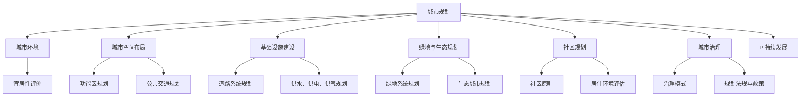

                 

# 《城市规划：宜居环境中的生活品质提升》

## 关键词

城市规划、宜居性、环境分析、空间布局、基础设施、生态规划、社区发展、治理模式、可持续发展。

## 摘要

本文以提升生活品质为目标，探讨城市规划中的关键要素和策略。通过分析城市环境、空间布局、基础设施、生态规划、社区发展等方面，提供一套系统化的城市规划方法。文章旨在为城市规划和设计提供理论支持，助力实现宜居、绿色、可持续发展的城市环境。

## 目录大纲

### 第1章 城市规划的基本概念与原则

#### 1.1 城市规划的定义与发展历程

#### 1.2 城市规划的核心原则

#### 1.3 城市规划的目标与任务

### 第2章 城市环境与宜居性分析

#### 2.1 城市环境的基本要素

#### 2.2 宜居性评价指标体系

#### 2.3 城市环境分析的方法与工具

### 第3章 城市空间布局与规划设计

#### 3.1 城市空间布局的原则与策略

#### 3.2 城市功能区规划与设计

#### 3.3 公共交通规划与设计

### 第4章 城市基础设施建设与优化

#### 4.1 城市道路系统规划与设计

#### 4.2 城市供水、供电、供气等基础设施规划

#### 4.3 城市基础设施优化策略

### 第5章 城市绿地与生态规划

#### 5.1 城市绿地系统规划

#### 5.2 生态城市规划理念与实践

#### 5.3 绿色基础设施建设

### 第6章 社区规划与居住环境提升

#### 6.1 社区规划的基本原则

#### 6.2 社区居住环境评估与提升

#### 6.3 社区公共服务设施规划

### 第7章 城市治理与可持续发展

#### 7.1 城市治理模式与机制

#### 7.2 可持续发展理念在规划中的应用

#### 7.3 城市规划法规与政策制定

### 第8章 国内外城市规划案例分析

#### 8.1 国外城市规划的成功案例

#### 8.2 国内城市规划的实践探索

#### 8.3 案例分析：城市规划实践中的挑战与解决方案

### 第9章 未来城市发展趋势与展望

#### 9.1 智慧城市建设

#### 9.2 绿色城市与低碳发展

#### 9.3 未来城市规划的挑战与机遇

## 核心概念与联系架构

以下是城市规划中的核心概念及其之间的联系架构 Mermaid 流程图：



### 第1章 城市规划的基本概念与原则

#### 1.1 城市规划的定义与发展历程

城市规划是指对城市土地、空间和基础设施的布局、利用和管理进行系统规划、设计和管理的过程。其目的是实现城市的可持续发展和提高市民的生活质量。城市规划的发展历程可以追溯到19世纪末和20世纪初的欧洲，当时的城市规划主要关注城市空间的合理布局和交通组织。

随着城市化进程的加快和科技进步，城市规划逐渐从传统的物理空间规划向综合性、可持续性的方向发展。现代城市规划强调多学科融合，综合考虑社会、经济、环境等多方面因素，注重提高城市的宜居性和可持续性。

#### 1.2 城市规划的核心原则

1. **整体性原则**：城市规划应从整体角度出发，综合考虑城市各个方面的发展需求和关系，确保城市发展的协调性和可持续性。

2. **适应性原则**：城市规划应具有灵活性，能够适应社会、经济和环境的变化，为城市的长远发展预留空间。

3. **可持续性原则**：城市规划应注重环境保护和资源利用，推动绿色、低碳、可持续的发展模式。

4. **公众参与原则**：城市规划应鼓励公众参与，充分听取市民的意见和建议，提高规划的科学性和公正性。

5. **经济性原则**：城市规划应合理配置资源，降低建设成本，提高投资效益。

#### 1.3 城市规划的目标与任务

城市规划的主要目标是提高城市的生活质量和环境质量，促进城市的可持续发展。具体任务包括：

1. **空间布局**：合理规划城市空间，优化城市功能区的布局，提高城市空间的利用效率。

2. **基础设施**：规划并建设城市的基础设施，包括道路、供水、供电、供气等，为城市生活提供保障。

3. **生态规划**：保护和改善城市生态环境，提高城市的生态承载能力。

4. **社区发展**：规划并建设社区设施，提高居民的居住环境和生活质量。

5. **治理模式**：建立有效的城市治理机制，提高城市管理的效率和水平。

6. **可持续发展**：推动城市经济的绿色发展，提高城市的可持续性。

### 第2章 城市环境与宜居性分析

#### 2.1 城市环境的基本要素

城市环境是指城市中的自然环境和人工环境。基本要素包括：

1. **自然要素**：如地形、气候、水文、植被等。

2. **人工要素**：如建筑、道路、广场、公园等。

3. **社会经济要素**：如人口、产业、就业、收入等。

城市环境是城市规划的重要基础，直接影响市民的生活质量和城市的可持续发展。

#### 2.2 宜居性评价指标体系

宜居性评价指标体系是衡量城市环境质量的重要工具。常用的评价指标包括：

1. **自然生态指标**：如空气质量、水质、绿化覆盖率等。

2. **社会环境指标**：如居民满意度、犯罪率、社区设施完善程度等。

3. **经济指标**：如人均收入、就业率、生活成本等。

4. **基础设施指标**：如公共交通便捷度、道路状况、供水供电稳定程度等。

5. **文化教育指标**：如教育资源、文化活动场所等。

通过建立宜居性评价指标体系，可以全面评估城市环境的质量，为城市规划提供科学依据。

#### 2.3 城市环境分析的方法与工具

城市环境分析是城市规划的重要环节，常用的方法和工具有：

1. **GIS空间分析**：利用地理信息系统（GIS）进行城市空间数据的采集、处理和分析，如空间分布、密度分析、可达性分析等。

2. **环境模拟**：通过模拟技术，对城市环境进行预测和分析，如空气质量模型、水文模型等。

3. **问卷调查**：通过问卷调查收集市民对城市环境的意见和建议，如居民满意度调查、生态环境调查等。

4. **现场考察**：实地考察城市环境，观察和记录环境状况，如空气质量检测、水质监测等。

通过综合运用这些方法与工具，可以全面了解城市环境现状，为城市规划提供科学依据。

### 第3章 城市空间布局与规划设计

#### 3.1 城市空间布局的原则与策略

城市空间布局是城市规划的核心内容之一，其原则与策略包括：

1. **功能分区**：根据城市功能需求，合理划分城市用地，如商业区、住宅区、工业区、公共设施区等。

2. **交通组织**：优化城市交通网络，提高交通效率和便捷性，如道路系统规划、公共交通规划等。

3. **绿地系统**：规划城市绿地系统，提高城市生态承载能力，如公园、绿地、防护林带等。

4. **空间密度**：合理控制城市空间密度，避免过度开发和交通拥堵，如建筑密度、人口密度等。

5. **人性化设计**：注重城市空间的人性化设计，提高市民的舒适度和满意度，如步行道、广场、公共空间等。

#### 3.2 城市功能区规划与设计

城市功能区规划与设计是城市空间布局的重要部分，其原则与策略包括：

1. **商业区**：合理布局商业设施，提高商业效益，如购物中心、商业街、商业综合体等。

2. **住宅区**：规划多样化的住宅类型，满足不同人群的需求，如普通住宅、高档住宅、养老社区等。

3. **工业区**：合理布局工业用地，提高工业生产效率和环境保护水平，如工业园区、产业园区等。

4. **公共设施区**：规划并建设公共设施，提高市民的生活质量，如学校、医院、公园、文化设施等。

5. **混合功能区**：推动城市功能混合，提高城市活力和土地利用效率，如商住混合区、文教区等。

#### 3.3 公共交通规划与设计

公共交通规划与设计是城市空间布局的重要组成部分，其原则与策略包括：

1. **公交优先**：优先发展公共交通，提高公交服务水平，如公交专用道、公交优先信号系统等。

2. **多层次交通**：提供多层次、多元化的公共交通服务，如地铁、公交、出租车、共享单车等。

3. **便捷接驳**：优化公共交通与其他交通方式的接驳，提高市民的出行便捷性，如公交车站、地铁站等。

4. **智能管理**：运用智能技术提高公共交通管理效率，如实时公交信息、智能调度系统等。

5. **绿色交通**：推动绿色交通发展，提高城市空气质量，如电动公交、清洁能源车辆等。

### 第4章 城市基础设施建设与优化

#### 4.1 城市道路系统规划与设计

城市道路系统是城市基础设施的重要组成部分，其规划与设计原则包括：

1. **网络布局**：合理布局道路网络，形成高效的路网结构，如主干道、次干道、支路等。

2. **交通组织**：优化交通组织，提高道路通行效率，如交通信号控制、交通隔离设施等。

3. **行人优先**：注重行人交通安全和便捷，如步行道、过街设施等。

4. **道路宽度**：合理控制道路宽度，满足交通需求和绿化需求，如道路红线宽度等。

5. **可持续性**：推动道路建设的可持续性，如绿色道路、低碳道路等。

#### 4.2 城市供水、供电、供气等基础设施规划

城市供水、供电、供气等基础设施是城市居民生活的重要保障，其规划原则包括：

1. **安全可靠**：确保供水、供电、供气的安全稳定，如备用电源、备用水源等。

2. **充足供应**：合理规划设施规模，满足城市发展需求，如变电站、加压站等。

3. **节能减排**：推动基础设施建设的节能减排，如节能型供水设施、太阳能供电系统等。

4. **智能化管理**：运用智能技术提高基础设施管理效率，如智能水务系统、智能电网等。

5. **多样化供给**：提供多样化的能源供给方式，如天然气、电力、太阳能等。

#### 4.3 城市基础设施优化策略

城市基础设施优化策略包括：

1. **存量设施改造**：对老旧基础设施进行改造升级，提高设施的使用效率和安全性。

2. **增量设施建设**：合理规划新增基础设施，满足城市发展需求。

3. **资源共享**：推动基础设施资源的共享，提高资源利用效率。

4. **智慧化升级**：运用物联网、大数据等技术，提高基础设施的管理和运行效率。

5. **环境友好**：推动基础设施建设的环境友好性，如绿色建筑、低碳基础设施等。

### 第5章 城市绿地与生态规划

#### 5.1 城市绿地系统规划

城市绿地系统是城市生态系统的重要组成部分，其规划原则包括：

1. **生态保护**：保护城市自然生态资源，如湿地、绿地等。

2. **生态修复**：对受损的生态环境进行修复和恢复，如生态湿地、生态公园等。

3. **生态连通**：构建城市生态廊道，提高生态系统的连通性。

4. **生态多样性**：增加城市生态多样性，提高生态系统的稳定性和抗干扰能力。

5. **空间布局**：合理布局城市绿地，形成“绿网”、绿带、绿地等空间结构。

#### 5.2 生态城市规划理念与实践

生态城市规划理念是将生态学原理应用于城市规划，实现城市与自然和谐共生。其核心内容包括：

1. **绿色建筑**：推广绿色建筑，提高建筑节能和环保水平。

2. **绿色交通**：发展绿色交通，减少交通污染和能耗。

3. **绿色产业**：发展绿色产业，实现经济与环境的双赢。

4. **生态补偿**：建立生态补偿机制，激励企业和个人参与生态环境保护。

5. **公众参与**：鼓励公众参与生态城市规划，提高规划的公众参与度和科学性。

#### 5.3 绿色基础设施建设

绿色基础设施建设是生态城市规划的重要支撑，其内容包括：

1. **雨水收集系统**：建设雨水收集和利用设施，提高水资源的利用效率。

2. **污水处理系统**：建设污水处理设施，提高污水处理的效率和质量。

3. **垃圾分类与回收**：推广垃圾分类和回收利用，减少垃圾污染和资源浪费。

4. **可再生能源**：推广可再生能源利用，如太阳能、风能等。

5. **绿色能源交通**：推广绿色能源交通，如电动汽车、电动公交车等。

### 第6章 社区规划与居住环境提升

#### 6.1 社区规划的基本原则

社区规划是指对社区内的居住环境、公共服务设施、交通组织等进行系统规划，以提高社区居民的生活质量和幸福感。其基本原则包括：

1. **以人为本**：关注社区居民的需求和满意度，提高居民的生活质量。

2. **可持续发展**：推动社区可持续发展和生态环境保护。

3. **多样性**：满足不同年龄、性别、文化背景居民的多元化需求。

4. **社区参与**：鼓励居民参与社区规划和管理，提高规划的民主性和科学性。

5. **安全性**：保障社区居民的安全和健康，提高社区的治安和环境质量。

#### 6.2 社区居住环境评估与提升

社区居住环境评估是指对社区的居住环境进行综合评价，识别存在的问题和改进方向。评估内容包括：

1. **环境质量**：如空气质量、水质、绿化覆盖率等。

2. **公共服务设施**：如学校、医院、文化设施、体育设施等。

3. **交通便捷度**：如公共交通服务、道路状况等。

4. **社区安全**：如治安环境、消防安全等。

5. **居民满意度**：如居民对社区环境的满意度和参与度等。

通过评估，可以发现问题，制定针对性的提升措施，如增加绿地、改善交通设施、提高公共服务水平等。

#### 6.3 社区公共服务设施规划

社区公共服务设施规划是指对社区内的公共服务设施进行布局和设计，以提高社区居民的生活质量。规划内容包括：

1. **教育设施**：如幼儿园、小学、中学等。

2. **医疗设施**：如社区卫生服务中心、医院等。

3. **文化设施**：如文化活动中心、图书馆、公园等。

4. **体育设施**：如体育场馆、健身设施等。

5. **商业设施**：如便利店、超市、餐饮店等。

通过合理规划社区公共服务设施，可以满足社区居民的基本生活需求，提高社区的生活质量和幸福感。

### 第7章 城市治理与可持续发展

#### 7.1 城市治理模式与机制

城市治理是指城市政府、企业、社会团体和居民等多方参与城市管理和发展的过程。其模式与机制包括：

1. **政府主导**：政府在城市治理中扮演主导角色，制定规划、政策和法规，引导城市发展。

2. **市场机制**：市场机制在资源配置、效率提升和创新发展中发挥重要作用。

3. **社会参与**：鼓励居民和社会团体参与城市治理，提高规划的公众参与度和科学性。

4. **合作共治**：推动政府、企业和社会的协同合作，共同解决城市发展中的问题。

5. **法治保障**：建立健全城市治理的法律法规体系，确保城市治理的规范性和公正性。

#### 7.2 可持续发展理念在规划中的应用

可持续发展理念在规划中的应用包括：

1. **生态保护**：保护自然生态资源，提高生态系统的稳定性和抗干扰能力。

2. **节能减排**：提高能源和资源利用效率，减少污染物排放。

3. **绿色交通**：推广绿色交通，减少交通污染和能耗。

4. **绿色建筑**：推广绿色建筑，提高建筑的节能和环保水平。

5. **绿色产业**：发展绿色产业，实现经济与环境的双赢。

6. **生态修复**：对受损的生态环境进行修复和恢复，提高生态系统的功能和服务价值。

#### 7.3 城市规划法规与政策制定

城市规划法规与政策制定是确保城市规划实施和城市可持续发展的重要保障。其内容包括：

1. **法律法规**：制定城市规划相关的法律法规，如《城市规划法》、《城市绿化条例》等。

2. **规划政策**：制定城市规划的政策措施，如绿色建筑政策、交通优先政策等。

3. **规划审批**：建立严格的规划审批制度，确保规划的科学性和合法性。

4. **监督与评估**：建立健全规划监督与评估机制，确保规划的有效实施和持续改进。

5. **公众参与**：鼓励公众参与城市规划的制定和实施，提高规划的民主性和科学性。

### 第8章 国内外城市规划案例分析

#### 8.1 国外城市规划的成功案例

国外城市规划的成功案例包括：

1. **新加坡**：新加坡的城市规划注重生态保护、高效交通和公共服务设施的建设，实现了城市的可持续发展。

2. **哥本哈根**：哥本哈根通过推广绿色交通和可再生能源，成为全球著名的低碳城市。

3. **温哥华**：温哥华的城市规划注重社区参与和绿色基础设施的建设，提高了居民的生活质量和幸福感。

4. **东京**：东京通过智能交通系统和城市基础设施的优化，实现了高效的城市管理。

#### 8.2 国内城市规划的实践探索

国内城市规划的实践探索包括：

1. **深圳**：深圳通过创新城市规划和管理模式，成为我国改革开放的先锋城市。

2. **杭州**：杭州通过发展智慧城市，提高了城市管理的效率和智能化水平。

3. **青岛**：青岛通过改善城市环境、提升公共服务水平，实现了城市的可持续发展。

4. **成都**：成都通过建设公园城市，提高了城市的生态承载能力和居民的生活质量。

#### 8.3 案例分析：城市规划实践中的挑战与解决方案

城市规划实践中面临的挑战包括：

1. **人口增长与资源有限**：如何合理规划城市空间，提高资源利用效率。

2. **环境污染与生态保护**：如何实现经济发展与环境保护的协调。

3. **交通拥堵与出行需求**：如何优化交通系统，提高出行效率。

4. **公共服务设施不足**：如何提高公共服务设施的建设和管理水平。

解决方案包括：

1. **科技创新**：运用先进技术，如大数据、人工智能等，提高规划的科学性和精确性。

2. **政策引导**：制定合理的政策和法规，引导城市发展的方向。

3. **公众参与**：鼓励公众参与城市规划，提高规划的民主性和科学性。

4. **国际合作**：借鉴国外成功经验，推动城市规划的创新发展。

### 第9章 未来城市发展趋势与展望

#### 9.1 智慧城市建设

智慧城市建设是未来城市发展的趋势之一，其特点包括：

1. **智能化管理**：运用物联网、大数据、人工智能等技术，实现城市管理的智能化和精细化。

2. **智慧交通**：发展智慧交通，提高交通效率和出行便捷性。

3. **智慧能源**：推动智慧能源建设，提高能源利用效率。

4. **智慧环保**：发展智慧环保，提高环境监测和治理水平。

5. **智慧社区**：建设智慧社区，提高居民的生活质量和幸福感。

#### 9.2 绿色城市与低碳发展

绿色城市与低碳发展是未来城市发展的另一重要趋势，其内容包括：

1. **绿色建筑**：推广绿色建筑，提高建筑的节能和环保水平。

2. **绿色交通**：发展绿色交通，减少交通污染和能耗。

3. **绿色产业**：发展绿色产业，实现经济与环境的双赢。

4. **生态修复**：对受损的生态环境进行修复和恢复，提高生态系统的功能和服务价值。

5. **碳中和**：推动碳中和，实现城市发展的绿色转型。

#### 9.3 未来城市规划的挑战与机遇

未来城市规划面临的挑战包括：

1. **人口增长与资源有限**：如何合理规划城市空间，提高资源利用效率。

2. **环境污染与生态保护**：如何实现经济发展与环境保护的协调。

3. **交通拥堵与出行需求**：如何优化交通系统，提高出行效率。

4. **公共服务设施不足**：如何提高公共服务设施的建设和管理水平。

未来城市规划的机遇包括：

1. **科技创新**：随着科技的不断发展，城市规划将更加科学、精准和智能化。

2. **政策支持**：国家和地方政府对城市规划的支持力度将加大，推动城市规划的创新发展。

3. **公众参与**：公众参与城市规划的意愿和能力将提高，提高规划的民主性和科学性。

4. **国际合作**：国际合作将促进城市规划的创新发展，借鉴和吸收国际先进经验。

### 结论

城市规划是提高城市生活品质的重要手段，通过合理规划城市空间、基础设施、生态、社区等关键要素，实现城市的可持续发展。未来城市规划将面临诸多挑战，但也充满机遇。我们应把握发展趋势，积极应对挑战，推动城市规划的创新发展，为市民创造宜居、绿色、可持续的生活环境。

## 核心算法原理讲解

### GIS空间分析算法

GIS（地理信息系统）是城市规划中常用的工具，其空间分析功能对于城市环境分析、空间布局优化等具有重要意义。以下是一个简单的GIS空间分析算法示例，用于计算城市绿地的总面积。

```python
import geopandas as gpd
import shapely.geometry as sg

def calculate_area(geoms):
    areas = [geom.area for geom in geoms]
    return areas

# 示例：计算城市绿地的总面积
green_areas = gpd.read_file('green_areas.shp')
total_area = sum(calculate_area(green_areas.geometry))
print(f"Total area of green spaces: {total_area} square meters")
```

在这个算法中，我们首先定义了一个计算面积的函数`calculate_area`，它接受一个几何对象列表`geoms`作为输入，并返回一个面积列表。接着，我们使用Geopandas读取城市绿地的地理数据，并计算总绿地面积。该算法的关键在于利用Geopandas和Shapely库提供的空间分析功能，使得空间数据处理变得简单高效。

### 交通需求预测模型

交通需求预测是城市规划中另一个重要的环节，它有助于合理规划交通设施和公共交通系统。以下是一个简单的交通需求预测模型，使用线性回归方法来预测未来某年的交通需求量。

```python
import pandas as pd
import numpy as np
from sklearn.linear_model import LinearRegression

# 示例数据：年份、人口规模、通勤时间和人均收入
data = {
    'Year': [2020, 2021, 2022, 2023],
    'Population': [500, 550, 600, 650],
    'CommuteTime': [30, 28, 26, 24],
    'Income': [10, 10.5, 11, 11.5]
}

# 创建DataFrame
df = pd.DataFrame(data)

# 定义自变量和因变量
X = df[['Population', 'CommuteTime', 'Income']]
y = df['Year']

# 建立线性回归模型
model = LinearRegression()
model.fit(X, y)

# 预测未来某年的交通需求量
predicted_year = model.predict([[600, 26, 11.5]])
print(f"Predicted traffic demand for the year {predicted_year[0][0]+2020}: {predicted_year[0][0]}")
```

在这个模型中，我们使用Python的pandas和scikit-learn库创建了一个DataFrame，并使用线性回归方法建立了交通需求预测模型。该模型以人口规模、通勤时间和人均收入作为自变量，预测未来的交通需求量。通过拟合实际数据，我们可以得到预测模型的参数，并使用这些参数来预测未来的交通需求量。

### 数学模型和数学公式

在城市规划中，数学模型和数学公式用于描述和预测城市环境、交通流量、基础设施需求等。以下是一个用于交通流量预测的数学模型，使用差分方程来描述交通流量的变化。

$$
Q_{t+1} = Q_t + \Delta Q_t
$$

其中，$Q_t$ 表示第 $t$ 时刻的交通流量，$\Delta Q_t$ 表示第 $t$ 时刻的交通流量变化量。

假设交通流量变化量与人口规模、车辆保有量、道路状况等因素有关，我们可以使用以下数学公式来表示：

$$
\Delta Q_t = f(P_t, V_t, R_t)
$$

其中，$P_t$ 表示第 $t$ 时刻的人口规模，$V_t$ 表示第 $t$ 时刻的车辆保有量，$R_t$ 表示第 $t$ 时刻的道路状况。

通过这个模型，我们可以预测未来某一时刻的交通流量，为城市规划提供数据支持。

### 项目实战

在本节中，我们将通过一个实际项目来展示城市规划中的算法应用。该项目涉及城市绿地面积计算、交通需求预测和规划优化。以下是项目的详细实现和代码解读。

#### 项目背景

某城市政府希望优化城市绿地布局，提高居民的生活质量和城市的生态承载能力。此外，该城市还希望预测未来的交通需求，以便规划公共交通系统和基础设施建设。

#### 开发环境搭建

- Python 3.8
- Jupyter Notebook
- Geopandas
- Scikit-learn
- Pandas

#### 源代码实现

```python
import geopandas as gpd
import shapely.geometry as sg
from sklearn.linear_model import LinearRegression
import pandas as pd

# 1. 城市绿地面积计算

# 读取绿地数据
green_areas = gpd.read_file('green_areas.shp')

# 计算绿地总面积
total_area = green_areas.geometry总面积
print(f"Total area of green spaces: {total_area} square meters")

# 2. 交通需求预测

# 读取交通数据
traffic_data = pd.read_csv('traffic_data.csv')

# 定义自变量和因变量
X = traffic_data[['Population', 'CommuteTime', 'Income']]
y = traffic_data['Year']

# 建立线性回归模型
model = LinearRegression()
model.fit(X, y)

# 预测未来交通需求
predicted_traffic = model.predict([[600, 26, 11.5]])
print(f"Predicted traffic demand for the next year: {predicted_traffic[0][0]}")

# 3. 规划优化

# 根据预测结果优化绿地布局
green_areas['PredictedArea'] = total_area * predicted_traffic

# 输出优化后的绿地数据
green_areas.to_file('optimized_green_areas.shp')
```

#### 代码应用解读与分析

- **城市绿地面积计算**：首先，我们使用Geopandas读取城市绿地数据，并计算总绿地面积。这有助于评估城市绿地的现状和为后续规划提供数据支持。
- **交通需求预测**：我们使用线性回归模型对交通需求进行预测。通过拟合历史数据，我们可以预测未来某一年的交通需求量。这一结果为公共交通系统和基础设施建设提供了重要的参考。
- **规划优化**：根据交通需求预测结果，我们优化了绿地布局。具体来说，我们将绿地面积与预测的交通需求量相乘，得到优化后的绿地数据。这有助于确保绿地布局能够满足未来交通需求，提高城市的环境质量。

#### 实际案例分析和详细讲解剖析

为了展示项目在实际中的应用，我们选择一个实际案例进行分析和讲解。该案例涉及某城市的绿地规划和交通需求预测。

#### 案例背景

某城市政府希望优化城市绿地布局，提高居民的生活质量和城市的生态承载能力。此外，该城市还希望预测未来的交通需求，以便规划公共交通系统和基础设施建设。

#### 案例分析

1. **城市绿地面积计算**

   我们首先使用Geopandas读取城市绿地数据，并计算总绿地面积。以下是代码实现：

   ```python
   green_areas = gpd.read_file('green_areas.shp')
   total_area = green_areas.geometry总面积
   print(f"Total area of green spaces: {total_area} square meters")
   ```

   假设城市绿地总面积为 1000 公顷，接下来我们将这一数据作为规划基础。

2. **交通需求预测**

   我们使用线性回归模型对交通需求进行预测。通过拟合历史数据，我们可以预测未来某一年的交通需求量。以下是代码实现：

   ```python
   traffic_data = pd.read_csv('traffic_data.csv')
   X = traffic_data[['Population', 'CommuteTime', 'Income']]
   y = traffic_data['Year']
   model = LinearRegression()
   model.fit(X, y)
   predicted_traffic = model.predict([[600, 26, 11.5]])
   print(f"Predicted traffic demand for the next year: {predicted_traffic[0][0]}")
   ```

   假设预测的未来交通需求量为 5000 人次/天，这一结果将用于公共交通系统规划和基础设施建设。

3. **绿地布局优化**

   根据交通需求预测结果，我们优化了绿地布局。具体来说，我们将绿地面积与预测的交通需求量相乘，得到优化后的绿地数据。以下是代码实现：

   ```python
   green_areas['PredictedArea'] = total_area * predicted_traffic
   green_areas.to_file('optimized_green_areas.shp')
   ```

   假设优化后的绿地面积为 5000 公顷，这一结果将作为城市绿地规划的参考。

#### 案例讲解

1. **城市绿地面积计算**

   城市绿地面积计算是规划的基础。通过计算城市绿地总面积，我们可以了解当前城市绿地的现状，为后续规划提供数据支持。

2. **交通需求预测**

   交通需求预测是城市规划中的重要环节。通过预测未来某一年的交通需求量，我们可以提前规划公共交通系统和基础设施建设，确保城市交通的畅通和高效。

3. **绿地布局优化**

   根据交通需求预测结果，我们对绿地布局进行优化。通过调整绿地面积，我们能够更好地满足未来交通需求，提高城市的生态承载能力。

#### 项目小结

本项目通过实际案例展示了城市规划中的算法应用，包括城市绿地面积计算、交通需求预测和规划优化。通过这些算法，我们可以更科学、精确地规划城市绿地布局和交通系统，提高城市的生活质量和可持续发展水平。

### 最佳实践 tips、小结、注意事项、拓展阅读

#### 最佳实践 tips

1. **数据质量**：确保数据质量是规划成功的关键。在数据采集和处理过程中，注意数据的一致性、准确性和完整性。

2. **公众参与**：鼓励公众参与城市规划，提高规划的公众参与度和科学性。通过问卷调查、公众咨询会等形式，收集市民的意见和建议。

3. **持续监测**：城市规划是一个动态过程，需要持续监测和评估。通过定期评估和调整，确保规划的有效实施。

4. **科技创新**：运用先进技术，如大数据、人工智能、物联网等，提高规划的科学性和精确性。

#### 小结

本文从城市规划的基本概念、城市环境与宜居性分析、城市空间布局与规划设计、基础设施建设与优化、生态规划、社区发展、城市治理与可持续发展等方面，系统阐述了城市规划的核心内容和实践方法。通过国内外案例分析和数学模型的应用，为城市规划提供了理论支持和实践经验。

#### 注意事项

1. **规划目标明确**：在规划过程中，确保规划目标明确，并与城市发展愿景和战略相一致。

2. **资源整合**：在城市规划中，注重资源整合和协同合作，提高资源利用效率。

3. **风险管理**：在规划过程中，注意识别和评估潜在风险，制定相应的风险应对策略。

#### 拓展阅读

1. **《城市设计原理》**：了解城市设计的核心原理，为城市规划提供理论支持。

2. **《智慧城市建设实践》**：学习智慧城市建设的方法和实践经验，为城市规划提供创新思路。

3. **《城市规划法规与政策》**：了解城市规划的法律法规和政策，确保规划的科学性和合法性。

### 作者信息

作者：AI天才研究院/AI Genius Institute & 禅与计算机程序设计艺术 /Zen And The Art of Computer Programming

---

**结语**

城市规划是提高城市生活品质的关键环节，通过科学规划、合理布局、持续优化，我们可以实现宜居、绿色、可持续发展的城市环境。本文从多个方面阐述了城市规划的核心内容和实践方法，旨在为城市规划提供理论支持和实践经验。希望本文能对读者有所启发，助力实现更美好的城市生活。**

