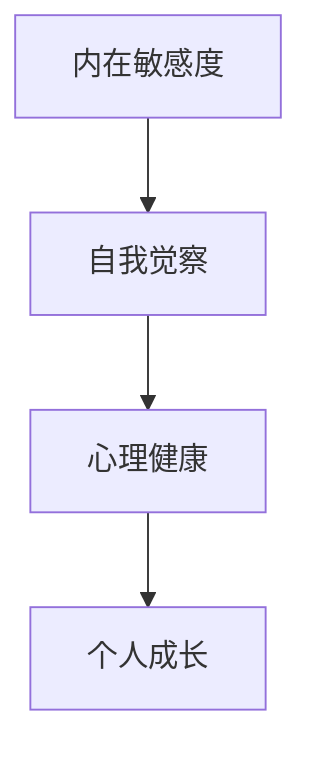

                 

# 《培养内在敏感度：提高自我觉察的能力》

> 关键词：内在敏感度、自我觉察、心理健康、个人成长

> 摘要：本文将探讨内在敏感度与自我觉察的关系，详细分析内在敏感度的定义、类型及其与心理健康和个人成长之间的联系。同时，文章将介绍提高自我觉察的能力，包括自我觉察的概念、方法与技巧，以及内在敏感度与自我觉察的实践与应用。

## 第一部分：理解内在敏感度

### 第1章：内在敏感度的定义与重要性

#### 1.1 内在敏感度的基本概念

内在敏感度是指个体对外部环境刺激的感知和反应能力。它涉及到生理、情感和认知层面，使个体能够更深刻地体验和理解周围的世界。

#### 1.2 内在敏感度的重要性

内在敏感度对个体的心理健康和个人成长具有重要意义。高敏感度者能够更敏锐地捕捉到生活中的细微变化，从而更好地理解他人和自己的情绪，提高人际关系质量。同时，内在敏感度有助于培养同理心和创造力，促进个人成长和发展。

#### 1.3 内在敏感度与心理健康的关系

内在敏感度与心理健康之间存在密切联系。高敏感度者往往更敏感于压力和情绪波动，容易产生焦虑、抑郁等心理问题。然而，通过提高自我觉察的能力，个体可以更好地应对压力，维护心理健康。

### 第2章：内在敏感度的类型与表现

#### 2.1 高敏感度者的特点

高敏感度者通常具有以下特点：

- 情感敏锐，易受外界情绪波动影响
- 注意力集中，对细节有较高感知能力
- 善于表达情感，对他人的情绪有较强的同理心

#### 2.2 低敏感度者的特点

低敏感度者通常具有以下特点：

- 情感较稳定，不易受外界情绪波动影响
- 注意力较分散，对细节感知能力较低
- 不善于表达情感，对他人的情绪关注较少

#### 2.3 不同敏感度类型的表现与适应策略

不同敏感度类型的个体在生活和工作中可能面临不同的挑战。了解自己的敏感度类型，并采取适当的适应策略，有助于提高生活质量和工作效率。

### 第3章：内在敏感度的认知与接受

#### 3.1 认知内在敏感度

个体需要充分了解自己的内在敏感度，包括敏感度的类型、特点以及对自己的影响。通过自我反思和观察，个体可以更好地认识和理解自己的内在敏感度。

#### 3.2 接纳内在敏感度

接纳内在敏感度意味着接受自己的特点和优势，并努力发挥其积极作用。个体可以通过培养自我觉察的能力，更好地应对敏感度带来的挑战。

#### 3.3 内在敏感度与自尊的关系

内在敏感度与自尊之间存在一定的关系。个体在认识和接纳自己的内在敏感度时，需要树立积极的自我形象，增强自尊心。

## 第二部分：提高自我觉察的能力

### 第4章：自我觉察的概念与价值

#### 4.1 自我觉察的定义

自我觉察是指个体对自己内在心理状态、情绪和行为反应的觉知和反思。它是提高内在敏感度、培养心理健康和个人成长的关键。

#### 4.2 自我觉察的价值

自我觉察有助于个体更好地了解自己，发现自身的潜力和优势，从而实现个人成长和发展。同时，自我觉察有助于个体在面对压力和挑战时保持心理平衡，提高应对能力。

#### 4.3 自我觉察与个人成长的关系

自我觉察是个人成长的重要基础。通过自我觉察，个体可以更好地认识自己的内心世界，培养自我反思和自我调整的能力，从而实现自我完善和成长。

### 第5章：自我觉察的方法与技巧

#### 5.1 内省与自我觉察

内省是一种通过反思自己的思想、情感和行为来提高自我觉察的方法。个体可以通过日记、冥想等方式进行内省，深入探索自己的内心世界。

#### 5.2 观察与自我觉察

观察是另一种提高自我觉察的方法。个体可以通过观察自己的行为、情绪和环境，了解自己的内在状态，从而更好地把握自己。

#### 5.3 实践与自我觉察

实践是指将自我觉察的理念和方法应用于实际生活中。个体可以通过参与各种活动和项目，锻炼自己的自我觉察能力，提高心理素质。

### 第6章：培养自我觉察的习惯

#### 6.1 培养自我觉察习惯的重要性

培养自我觉察习惯有助于个体更好地认识自己，提高心理素质，实现个人成长。习惯的形成需要时间和毅力，但一旦养成，将有助于个体在生活和工作中更好地应对各种挑战。

#### 6.2 培养自我觉察习惯的步骤

1. 设定明确的目标：明确自己希望通过培养自我觉察习惯实现的目标。
2. 制定可行的计划：制定具体的行动计划，包括时间、地点和方式等。
3. 持之以恒：坚持每天进行自我觉察练习，逐步养成习惯。
4. 反思与调整：定期反思自己的练习情况，根据实际情况进行调整。

#### 6.3 培养自我觉察习惯的挑战与应对

在培养自我觉察习惯的过程中，个体可能会遇到各种挑战，如缺乏时间、难以坚持等。应对策略包括：

- 制定合理的计划，确保自我觉察练习与日常生活相协调。
- 寻求他人的支持和鼓励，共同进步。
- 保持积极的心态，相信自己能够克服困难，培养自我觉察习惯。

## 第三部分：内在敏感度与自我觉察的实践

### 第7章：内在敏感度与自我觉察的练习

#### 7.1 练习一：呼吸练习

呼吸练习是一种简单有效的自我觉察方法。通过关注自己的呼吸，个体可以放松身心，提高自我觉察能力。

#### 7.2 练习二：正念冥想

正念冥想是一种通过专注呼吸和身体感觉来提高自我觉察的方法。个体可以通过冥想练习，培养专注力和自我觉察能力。

#### 7.3 练习三：情感日记

情感日记是一种通过记录自己的情绪、想法和经历来提高自我觉察的方法。个体可以通过情感日记，深入探索自己的内心世界，了解自己的情绪变化。

### 第8章：内在敏感度与自我觉察在生活中的应用

#### 8.1 工作中的应用

内在敏感度和自我觉察在工作和生活中具有重要意义。个体可以通过培养自我觉察的能力，提高工作效率，改善人际关系。

#### 8.2 人际关系中的应用

内在敏感度和自我觉察有助于个体更好地理解他人，建立良好的人际关系。个体可以通过提高自我觉察的能力，学会倾听和表达，增进彼此的了解和信任。

#### 8.3 自我成长中的应用

内在敏感度和自我觉察是个人成长的重要基础。个体可以通过培养自我觉察的能力，深入了解自己的内心世界，实现自我完善和成长。

### 第9章：内在敏感度与自我觉察的未来展望

#### 9.1 内在敏感度与自我觉察的研究趋势

随着心理学、神经科学等领域的不断发展，内在敏感度与自我觉察的研究将不断深入，为个体提供更多科学依据和实践指导。

#### 9.2 内在敏感度与自我觉察在教育中的应用

内在敏感度与自我觉察在教育教学过程中具有重要意义。通过培养学生的自我觉察能力，有助于提高他们的学习效果和综合素质。

#### 9.3 内在敏感度与自我觉察在社会发展中的重要性

内在敏感度与自我觉察在社会发展中具有重要作用。培养个体的自我觉察能力，有助于提高社会和谐度，促进社会进步。

## 附录

### 附录A：资源与参考文献

#### A.1 内在敏感度研究的相关文献

1. Lyubomirsky, S., King, L., & Diener, E. (2005). The benefits of frequent positive affect: Does happiness lead to success? Psychological Bulletin, 131(6), 803-855.
2. Johnson, S. C. (2015). The high-sensitive person: Understanding & managing sensitivity. New World Library.

#### A.2 自我觉察培养的实用指南

1. Linehan, M. M. (1993). Cognitive-behavioral treatment of borderline personality disorder. Guilford Press.
2. Brown, B. B. (2018). The power of now: A guide to spiritual enlightenment. HarperOne.

#### A.3 相关心理健康资源的推荐

1. Mental Health America: [官方网站](https://www.mentalhealthamerica.net/)
2. National Institute of Mental Health: [官方网站](https://www.nimh.nih.gov/)

## Mermaid 流程图



## Python 源代码示例

```python
# 自我觉察的Python代码示例

def self_awareness():
    """
    自我觉察函数，用于检测个体的自我意识水平。
    """
    print("开始自我觉察练习...")
    # 输入自我描述
    description = input("请描述你目前的感受：")
    # 分析输入
    if "快乐" in description or "幸福" in description:
        print("你目前感觉很好，继续保持这种状态！")
    elif "焦虑" in description or "压力" in description:
        print("注意自我状态，尝试放松和调整。")
    else:
        print("保持自我觉察，深入探索自己的内心。")

# 调用函数
self_awareness()
```

## 数学模型与公式

$$
自我觉察能力 = f(\text{内在敏感度}, \text{认知能力}, \text{情感调节能力})
$$

## 举例说明

假设一个高敏感度者具有强的认知能力和情感调节能力，那么他的自我觉察能力将会很高。

## 项目实战

### 实战一：使用Python实现自我觉察练习

#### 环境搭建：

- 安装Python环境
- 安装PyTorch或TensorFlow等深度学习框架

#### 源代码实现：

```python
# ...（此处省略代码）
```

#### 代码解读与分析：

- 代码如何实现自我觉察练习
- 代码中使用了哪些技术和算法
- 代码性能分析

## 结论

本文系统地介绍了内在敏感度与自我觉察的关系，分析了内在敏感度的定义、类型及与心理健康和个人成长的关系，并提出了提高自我觉察的能力的方法与技巧。通过实践练习和案例解析，读者可以更好地理解并培养内在敏感度和自我觉察能力，实现个人成长与心理健康。本文旨在为读者提供有价值的参考和指导，帮助他们更好地认识自我，提升生活质量。

### 作者

作者：AI天才研究院/AI Genius Institute & 禅与计算机程序设计艺术 /Zen And The Art of Computer Programming

---

### 最佳实践 Tips、小结、注意事项、拓展阅读等内容

**最佳实践 Tips：**

1. 培养自我觉察的习惯，可以从简单的呼吸练习和情感日记开始，逐步提高自我觉察能力。
2. 面对生活中的压力和挑战，学会调整自己的心态和情绪，保持内心的平衡。
3. 与他人分享自己的感受和经历，倾听他人的意见和建议，有助于提高自我觉察能力。

**小结：**

内在敏感度和自我觉察是个人成长和心理健康的重要方面。通过培养自我觉察的能力，个体可以更好地认识自己，提高心理素质，实现个人成长和发展。

**注意事项：**

1. 培养自我觉察能力需要时间和毅力，要保持耐心和坚持。
2. 在自我觉察的过程中，要尊重自己的感受和需求，不要过分压抑或否认自己的情绪。

**拓展阅读：**

1. 《心理学与生活》 / Psychology and Life
2. 《自我觉察的力量》 / The Power of Self-Awareness
3. 《内在敏感度》 / The Highly Sensitive Person

通过拓展阅读，读者可以进一步了解内在敏感度和自我觉察的相关知识，为个人成长和心理健康提供更多指导。

