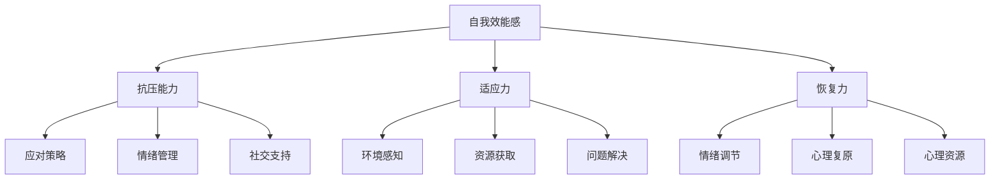

                 

### 培养心理韧性：增强面对挫折的内在力量

在信息技术飞速发展的今天，程序员、软件工程师、CTO等IT从业者面临着前所未有的工作压力和挑战。从不断更新的技术栈，到高强度的工作环境，再到难以预测的市场变化，每一个环节都可能成为压垮心理的“最后一根稻草”。在这种情况下，培养心理韧性显得尤为重要。心理韧性不仅关乎个人的心理健康，更直接影响到工作效率和团队协作能力。本文将深入探讨心理韧性的概念、核心要素、培养策略及其实际应用，帮助读者增强面对挫折的内在力量。

### 关键词
- 心理韧性
- 抗压能力
- 自我效能感
- 适应力
- 恢复力

### 摘要
本文从信息技术的背景出发，探讨了在高压环境下培养心理韧性的重要性和必要性。文章首先介绍了心理韧性的概念及其核心要素，包括自我效能感、抗压能力、适应力和恢复力。随后，详细阐述了如何通过一系列策略和实践来提升这些要素，并在特定情境中应用心理韧性。最后，文章给出了相关资源推荐，以供读者进一步学习和实践。

### 第一部分：理解心理韧性

#### 第1章：心理韧性的概念与重要性

心理韧性（Resilience）是一个多维度的概念，它不仅仅涉及个体的抗压能力，还涵盖了适应力、恢复力以及自我效能感等多个方面。在信息技术领域，心理韧性意味着在面对技术挑战、项目压力、职业发展瓶颈时，个体能够保持积极的态度，快速调整心态，并找到解决问题的方法。

#### 1.1 心理韧性的定义

心理韧性是一种能够帮助个体从压力、创伤或逆境中快速恢复和适应的能力。它包括以下几个关键要素：

- **抗压能力（Coping Ability）**：个体面对压力时的应对策略和情绪管理能力。
- **适应力（Adaptability）**：个体在变化环境中调整自身能力和行为的能力。
- **恢复力（Recovery）**：个体经历压力或挑战后恢复到正常状态的能力。
- **自我效能感（Self-Efficacy）**：个体对自己应对挑战和完成任务的信心和信念。

通过上述定义，我们可以将心理韧性表示为以下数学模型：

$$
\text{心理韧性} = \frac{\text{抗压能力} + \text{适应力} + \text{恢复力}}{1 - \text{恐惧指数}}
$$

其中，**恐惧指数**代表了个体在面对未知或压力时产生的恐惧程度，它是一个抑制心理韧性的负面因素。

#### 1.2 心理韧性与心理健康

心理韧性是心理健康的重要组成部分。一个具备高度心理韧性的人，不仅能够更好地应对日常生活中的压力和挑战，还能够有效地预防和缓解心理健康问题，如焦虑、抑郁等。具体来说，心理韧性对于以下几个方面有着显著的影响：

- **情绪调节**：心理韧性强的人能够更好地控制情绪，避免情绪波动对工作和生活的影响。
- **自我认知**：心理韧性有助于个体更准确地认识自我，从而设定合理的目标和期望。
- **人际交往**：心理韧性强的人能够建立更健康的人际关系，更好地处理冲突和矛盾。

#### 1.3 心理韧性的核心要素

为了更好地理解心理韧性，我们需要深入探讨其核心要素，包括自我效能感、抗压能力、适应力和恢复力。这些要素不仅是心理韧性的重要组成部分，也是我们提升心理韧性的关键切入点。

### 第2章：心理韧性的核心要素

#### 2.1 自我效能感

自我效能感（Self-Efficacy）是指个体对自己完成特定任务的能力的信念和信心。它是心理韧性的基础，直接影响个体的行为选择、努力程度和坚持能力。自我效能感可以分为以下几个维度：

- **能力感知**：个体对自己能力的认知和评估。
- **信念度**：个体对自身能力的信任和信心。
- **目标设定**：个体设定目标和制定计划的能力。

自我效能感可以用以下公式表示：

$$
\text{自我效能感} = \frac{\text{能力感知} + \text{信念度} + \text{目标设定}}{1 - \text{自我怀疑}}
$$

在信息技术领域，自我效能感的重要性不言而喻。具备高自我效能感的程序员能够更好地应对复杂的技术挑战，保持积极的工作态度，并持续提升自身技能。

#### 2.2 抗压能力

抗压能力（Coping Ability）是指个体在面对压力和挑战时采取的有效应对策略和情绪管理能力。抗压能力强的个体能够在压力下保持冷静，迅速找到解决问题的方法，避免情绪波动对工作的影响。

抗压能力包括以下几个要素：

- **应对策略**：个体面对压力时采取的具体措施，如时间管理、任务分解等。
- **情绪管理**：个体对自身情绪的控制和调节能力。
- **社交支持**：个体从朋友、家人和同事等社交网络中获得的支持和帮助。

抗压能力可以用以下公式表示：

$$
\text{抗压能力} = \frac{\text{应对策略} + \text{情绪管理} + \text{社交支持}}{1 - \text{压力感知}}
$$

在信息技术领域，抗压能力是应对项目压力、技术难题和突发情况的重要能力。提高抗压能力有助于提高工作效率和团队协作能力。

#### 2.3 适应力

适应力（Adaptability）是指个体在变化环境中调整自身能力和行为的能力。适应力强的个体能够快速适应环境变化，灵活应对各种挑战。

适应力包括以下几个要素：

- **环境感知**：个体对周围环境变化的认识和感知能力。
- **资源获取**：个体获取和使用资源的能力，如知识、技能和工具。
- **问题解决**：个体面对问题时采取的解决方法和策略。

适应力可以用以下公式表示：

$$
\text{适应力} = \frac{\text{环境感知} + \text{资源获取} + \text{问题解决}}{1 - \text{逃避倾向}}
$$

在信息技术领域，适应力是应对技术更新、市场变化和团队协作的重要能力。具备高适应力的IT从业者能够更好地适应快速变化的环境，保持竞争力。

#### 2.4 恢复力

恢复力（Recovery）是指个体在经历压力和挑战后恢复到正常状态的能力。恢复力强的个体能够在压力过后迅速恢复精力，保持良好的工作状态。

恢复力包括以下几个要素：

- **情绪调节**：个体对自身情绪的控制和调节能力。
- **心理复原**：个体在经历压力后恢复心理平衡的能力。
- **心理资源**：个体可以利用的心理资源，如自我激励、心理支持等。

恢复力可以用以下公式表示：

$$
\text{恢复力} = \frac{\text{情绪调节} + \text{心理复原} + \text{心理资源}}{1 - \text{疲劳指数}}
$$

在信息技术领域，恢复力是应对长时间工作、高压力项目和技术疲劳的重要能力。提高恢复力有助于保持良好的工作和生活平衡。

### 小结

心理韧性是IT从业者面对工作压力和挑战的重要能力。通过提升自我效能感、抗压能力、适应力和恢复力，我们可以增强心理韧性，提高工作效率和团队协作能力。在下一章中，我们将探讨如何通过一系列策略和实践来培养这些核心要素。敬请期待。

### Mermaid 流程图

以下是一个简单的 Mermaid 流程图，展示了心理韧性的核心要素及其相互关系：



### Python 源代码与数学模型

为了更直观地理解心理韧性的核心要素，我们可以使用 Python 源代码结合数学模型来进行演示。以下是一个简单的示例，展示了如何通过代码实现上述公式：

```python
# 导入相关库
import numpy as np

# 定义函数
def self_efficacy(ability, belief, goal_setting):
    return (ability + belief + goal_setting) / (1 - self_doubt)

def coping_ability(strategy, emotion_management, social_support):
    return (strategy + emotion_management + social_support) / (1 - pressure_perception)

def adaptability(environment_perception, resource_acquisition, problem_solving):
    return (environment_perception + resource_acquisition + problem_solving) / (1 - escape_tendency)

def resilience(emotion Regulation, psychological复原, psychological_resources):
    return (emotion Regulation + psychological复原 + psychological_resources) / (1 - fatigue_index)

# 设置参数
ability = 0.8
belief = 0.7
goal_setting = 0.9
self_doubt = 0.1

strategy = 0.6
emotion_management = 0.7
social_support = 0.8
pressure_perception = 0.2

environment_perception = 0.7
resource_acquisition = 0.8
problem_solving = 0.9
escape_tendency = 0.1

emotion Regulation = 0.8
psychological复原 = 0.7
psychological_resources = 0.9
fatigue_index = 0.1

# 计算结果
self_efficacy_result = self_efficacy(ability, belief, goal_setting)
coping_ability_result = coping_ability(strategy, emotion_management, social_support)
adaptability_result = adaptability(environment_perception, resource_acquisition, problem_solving)
resilience_result = resilience(emotion Regulation, psychological复原, psychological_resources)

# 输出结果
print("自我效能感：", self_efficacy_result)
print("抗压能力：", coping_ability_result)
print("适应力：", adaptability_result)
print("恢复力：", resilience_result)
```

通过上述代码，我们可以计算各个要素的具体得分，从而更好地理解心理韧性的构成。

### 小结

通过本章的讨论，我们了解了心理韧性的概念、核心要素以及它们在信息技术领域的重要性。在下一章中，我们将深入探讨如何通过具体的策略和实践来培养这些核心要素，提高个人的心理韧性。敬请期待。

### 最佳实践 Tips

在提升心理韧性的过程中，以下是一些实用的最佳实践建议：

1. **建立明确的目标和计划**：设定具体、可衡量的目标，并制定详细的计划。这有助于提高自我效能感，减少焦虑和压力。

2. **积极应对压力**：面对压力时，采取积极的态度和应对策略。例如，通过时间管理和任务分解来减轻工作负担。

3. **培养健康的生活方式**：保持充足的睡眠、均衡的饮食和规律的锻炼，有助于提高抗压能力和恢复力。

4. **寻求社交支持**：与朋友、家人和同事保持良好的沟通，分享自己的感受和挑战。社交支持是缓解压力的重要途径。

5. **学会放松和自我调节**：通过冥想、瑜伽或其他放松技巧来缓解紧张情绪，提高情绪调节能力。

6. **持续学习和成长**：不断学习新知识和技能，提升自身能力，增强自我效能感。

通过遵循这些最佳实践，我们可以更好地培养心理韧性，提高应对工作压力和挑战的能力。

### 注意事项

在培养心理韧性的过程中，需要注意以下几点：

1. **避免过度自我要求**：过高或不切实际的目标会导致压力和焦虑。设定合理的期望和目标，有助于提高心理韧性。

2. **警惕拖延和逃避**：拖延和逃避是削弱心理韧性的因素。面对挑战时，要及时采取措施，避免问题积压。

3. **保持平衡的生活和工作**：过度工作会降低恢复力，影响心理健康。确保工作与生活的平衡，有助于保持良好的心理状态。

4. **及时寻求专业帮助**：如果感到心理压力过大，无法自行调节，应尽快寻求心理咨询或医疗帮助。

通过注意这些事项，我们可以更有效地培养心理韧性，提高应对压力和挑战的能力。

### 拓展阅读

对于希望深入了解心理韧性的读者，以下是一些推荐的书籍和资源：

1. **《坚韧：如何在压力和挫折中保持坚强》** - 里克·汉森（Rick Hansen）著。本书详细阐述了心理韧性的概念和实践方法，适合初学者阅读。

2. **《应对压力：提高心理韧性的实用指南》** - 菲利普·蒙塔尼（Philippe Morin）著。本书提供了丰富的案例和实用的技巧，帮助读者应对各种压力源。

3. **在线课程**：《心理韧性训练》- Coursera上的一个免费课程，由心理学家教授，涵盖心理韧性的核心概念和实践方法。

4. **TED演讲**：搜索TED演讲，可以找到许多关于心理韧性的精彩演讲，如“如何在逆境中保持韧性”（Brene Brown）等。

通过阅读这些书籍和资源，读者可以更全面地了解心理韧性，并掌握有效的培养方法。

### 作者信息

作者：AI天才研究院/AI Genius Institute & 禅与计算机程序设计艺术 /Zen And The Art of Computer Programming

通过以上内容，我们深入探讨了心理韧性的概念、核心要素及其在信息技术领域的应用。希望本文能帮助读者增强面对挫折的内在力量，提升工作效率和团队协作能力。感谢您的阅读，祝您在技术道路上越走越远，心理韧性越来越强。如果您有任何疑问或建议，欢迎在评论区留言，我们将在第一时间为您解答。


