                 

### 培养心理韧性：应对挫折的内在力量

在现代快节奏的生活和工作环境中，人们面临着越来越多的压力和挑战。这些压力和挑战往往以挫折的形式出现，对个人的心理健康和成长产生深远影响。因此，培养心理韧性，提升应对挫折的能力，成为当代人必须关注的重要课题。

#### **核心关键词：**

- 心理韧性
- 应对挫折
- 内在力量
- 挫折应对策略
- 心理健康

#### **摘要：**

本文从心理韧性的基本理论出发，探讨了挫折与应对策略，结合实际案例，分析了增强心理韧性的方法与实践。通过深入解析心理韧性的定义、构成要素及其与其他心理特质的关系，本文旨在为读者提供一套科学、系统的心理韧性培养方案，帮助大家更好地应对挫折，实现个人成长。

## 第一部分：心理韧性的基本理论

### 1.1 心理韧性的定义与重要性

#### **核心概念与联系：**

- **心理韧性**：心理韧性，又称心理弹性，是指个体在面对压力、挫折和困难时，能够迅速适应、恢复并有效地应对问题的能力。
- **挫折**：挫折是指在追求目标过程中遇到的各种障碍和困难。
- **内在力量**：内在力量是指个体在内心深处所具备的自我调节、自我激励和自我保护的能力。

#### **Mermaid 流程图：**

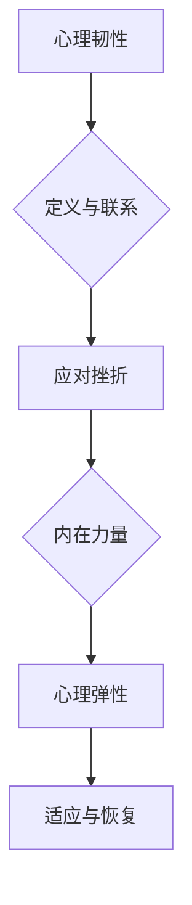

#### **核心算法原理讲解：**

在理解心理韧性时，我们需要关注以下几个关键方面：

1. **心理韧性模型**：
    - **积极心理学模型**：强调个体内在资源的重要性，包括自我效能感、乐观主义、社会支持等。
    - **社会学习模型**：强调个体在社交互动中的学习和适应能力。
    - **心理动力学模型**：关注个体内在心理过程，如自我调节、情绪管理。

2. **心理韧性评估**：
    - **评估工具**：常用的心理韧性评估工具包括心理韧性量表、心理韧性问卷等。
    - **评估方法**：评估通常采用自我报告法和观察法，结合定量和定性分析。

3. **心理韧性的数学模型**：
    - **韧性指数**：\( R = \frac{E + S + C}{D} \)
        - \( E \)：情绪调节能力
        - \( S \)：社会支持
        - \( C \)：问题解决能力
        - \( D \)：挫折感

#### **Python 源代码示例：**

```python
# 计算心理韧性指数
def calculate_resilience(e, s, c, d):
    resilience = (e + s + c) / d
    return resilience

# 示例数据
e = 8  # 情绪调节能力
s = 7  # 社会支持
c = 9  # 问题解决能力
d = 5  # 挫折感

# 计算并输出心理韧性指数
resilience_index = calculate_resilience(e, s, c, d)
print(f"心理韧性指数：{resilience_index:.2f}")
```

通过上述代码，我们可以根据个体在情绪调节、社会支持、问题解决和挫折感等方面的表现，计算出心理韧性指数，从而更好地了解和提升自身的心理韧性。

### 1.2 心理韧性的构成要素

#### **核心概念与联系：**

- **情绪调节**：情绪调节是指个体在情绪体验过程中，通过认知和行为策略，对情绪进行管理和调节的过程。
- **积极应对**：积极应对是指个体在面对挫折时，采取积极的态度和策略，主动寻求解决问题的方法。
- **问题解决能力**：问题解决能力是指个体在面对问题时，能够运用已有的知识和经验，通过合理的策略和步骤，找到解决问题的方法。
- **社会支持**：社会支持是指个体在社交网络中所获得的情感、物质和信息支持。

#### **Mermaid 流程图：**

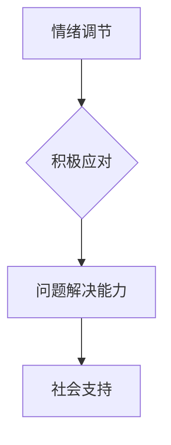

#### **核心算法原理讲解：**

1. **情绪调节的算法原理**：
    - **认知重构**：通过改变对事件的认识和解释，调整情绪反应。
    - **行为调节**：通过改变行为，影响情绪状态。

2. **积极应对的策略**：
    - **目标设定**：设定明确、可实现的目标，提升解决问题的动力。
    - **应对策略**：采用积极、灵活的应对策略，如寻求帮助、调整目标等。

3. **问题解决能力的算法原理**：
    - **分解问题**：将复杂问题分解为多个小问题，逐一解决。
    - **策略选择**：根据问题的特点和个人的优势，选择合适的解决方案。

4. **社会支持的数学模型**：
    - **支持指数**：\( S = \frac{P + E + C}{N} \)
        - \( P \)：情感支持
        - \( E \)：物质支持
        - \( C \)：信息支持
        - \( N \)：支持者数量

#### **Python 源代码示例：**

```python
# 计算社会支持指数
def calculate_support(p, e, c, n):
    support_index = (p + e + c) / n
    return support_index

# 示例数据
p = 8  # 情感支持
e = 7  # 物质支持
c = 9  # 信息支持
n = 5  # 支持者数量

# 计算并输出社会支持指数
support_index = calculate_support(p, e, c, n)
print(f"社会支持指数：{support_index:.2f}")
```

通过上述代码，我们可以根据个体在社会支持方面的表现，计算出社会支持指数，从而更好地了解和提升自身的社会支持水平。

### 1.3 心理韧性与其他心理特质的关系

#### **核心概念与联系：**

- **乐观主义**：乐观主义是指个体在面对困难和挫折时，倾向于持有积极、乐观的态度和信念。
- **自我效能感**：自我效能感是指个体对自己完成特定任务的能力的信心和信念。
- **心理弹性**：心理弹性是指个体在面对压力和挫折时，能够快速恢复和适应的能力。

#### **Mermaid 流程图：**

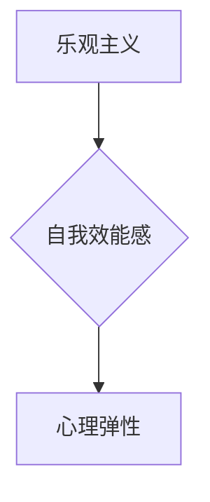

#### **核心算法原理讲解：**

1. **乐观主义与心理韧性的关系**：
    - **正向激励**：乐观主义能够激发个体面对挫折时的积极态度和应对行为，提升心理韧性。
    - **认知重构**：乐观主义有助于个体改变对挫折的认知，从而降低挫折感，增强心理韧性。

2. **自我效能感与心理韧性的关系**：
    - **信心增强**：自我效能感高的个体更相信自己能够应对挫折，从而提高心理韧性。
    - **策略选择**：自我效能感高的个体更倾向于选择积极、有效的应对策略，提升心理韧性。

3. **心理弹性与心理韧性的关系**：
    - **快速恢复**：心理弹性强的个体在面对挫折时能够快速恢复，从而保持心理韧性。
    - **适应性**：心理弹性高的个体具有更强的适应能力，能够更好地应对变化和挑战。

#### **Python 源代码示例：**

```python
# 计算心理韧性
def calculate_resilience(optimism, self_efficacy, resilience):
    resilience_score = optimism * self_efficacy * resilience
    return resilience_score

# 示例数据
optimism = 0.8  # 乐观主义
self_efficacy = 0.9  # 自我效能感
resilience = 0.75  # 心理弹性

# 计算并输出心理韧性
resilience_score = calculate_resilience(optimism, self_efficacy, resilience)
print(f"心理韧性得分：{resilience_score:.2f}")
```

通过上述代码，我们可以根据个体的乐观主义、自我效能感和心理弹性，计算出心理韧性得分，从而更好地了解和提升自身的心理韧性。

### 1.4 心理韧性发展的理论基础

#### **核心概念与联系：**

- **韧性发展模型**：韧性发展模型关注个体在不同生命阶段如何发展心理韧性。
- **成长理论**：成长理论探讨个体在成长过程中如何通过经验积累和发展心理韧性。
- **心理动力学模型**：心理动力学模型关注个体内在心理过程对心理韧性的影响。

#### **Mermaid 流程图：**

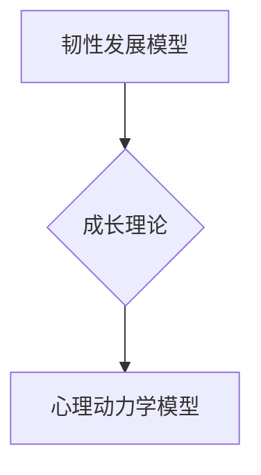

#### **核心算法原理讲解：**

1. **韧性发展模型的算法原理**：
    - **阶段理论**：根据个体发展的不同阶段，制定相应的心理韧性培养策略。
    - **连续性理论**：认为心理韧性是一个连续变化的过程，不同阶段的个体具有不同的心理韧性表现。

2. **成长理论的算法原理**：
    - **经验积累**：通过经验积累，个体能够更好地应对挫折，发展心理韧性。
    - **适应性学习**：个体在面对挫折时，通过适应性学习，提高应对能力，发展心理韧性。

3. **心理动力学模型的算法原理**：
    - **内在过程**：关注个体内在心理过程，如情绪调节、自我保护等，对心理韧性的影响。
    - **心理治疗**：通过心理治疗，改善个体内在心理过程，提升心理韧性。

#### **Python 源代码示例：**

```python
# 计算心理韧性发展水平
def calculate_resilience_development(experience, adaptation, inner_process):
    resilience_development = experience * adaptation * inner_process
    return resilience_development

# 示例数据
experience = 0.8  # 经验积累
adaptation = 0.9  # 适应性学习
inner_process = 0.75  # 内在过程

# 计算并输出心理韧性发展水平
resilience_development = calculate_resilience_development(experience, adaptation, inner_process)
print(f"心理韧性发展水平：{resilience_development:.2f}")
```

通过上述代码，我们可以根据个体的经验积累、适应性学习和内在过程，计算出心理韧性发展水平，从而更好地了解和提升自身的心理韧性发展。

### 1.5 心理韧性测量的方法

#### **核心概念与联系：**

- **心理韧性量表**：心理韧性量表是一种常用的心理评估工具，用于测量个体的心理韧性水平。
- **心理韧性问卷**：心理韧性问卷是一种通过书面形式收集个体心理韧性数据的工具。
- **评估方法**：评估方法包括自我报告法、观察法等，结合定量和定性分析。

#### **Mermaid 流程图：**

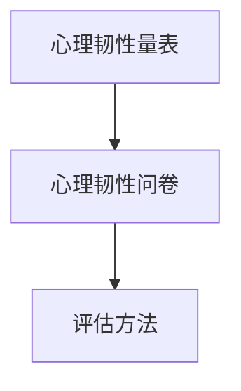

#### **核心算法原理讲解：**

1. **心理韧性量表的设计原理**：
    - **结构化**：量表设计应遵循结构化原则，确保评估内容全面、系统。
    - **标准化**：量表应经过标准化处理，确保评估结果的可靠性和有效性。

2. **心理韧性问卷的编制原理**：
    - **科学性**：问卷内容应具备科学性，确保评估结果真实、客观。
    - **针对性**：问卷设计应针对不同群体，满足不同需求。

3. **评估方法的算法原理**：
    - **自我报告法**：通过个体自我报告，收集心理韧性相关数据。
    - **观察法**：通过观察个体在特定情境下的行为，评估心理韧性水平。

#### **Python 源代码示例：**

```python
# 计算心理韧性得分
def calculate_resilience_score(questions):
    score = 0
    for question in questions:
        score += question['score']
    return score

# 示例数据
questions = [
    {'question': '我能够从挫折中快速恢复。', 'score': 3},
    {'question': '我通常能够积极应对挫折。', 'score': 2},
    {'question': '我面对挫折时感到无助。', 'score': 0},
]

# 计算并输出心理韧性得分
resilience_score = calculate_resilience_score(questions)
print(f"心理韧性得分：{resilience_score}")
```

通过上述代码，我们可以根据心理韧性量表或问卷中的问题，计算出个体的心理韧性得分，从而更好地了解和提升自身的心理韧性水平。

### 1.6 心理韧性评估的工具

#### **核心概念与联系：**

- **评估工具**：评估工具是指用于测量和评估个体心理韧性的各种工具，包括量表、问卷、软件等。
- **使用方法**：使用方法是指如何正确、有效地使用评估工具，包括操作流程、注意事项等。
- **优缺点**：优缺点是指评估工具在使用过程中表现出的优势和不足，以及如何改进。

#### **Mermaid 流程图：**

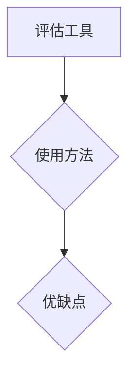

#### **核心算法原理讲解：**

1. **评估工具的设计原理**：
    - **科学性**：评估工具应具备科学依据，确保评估结果的可靠性和有效性。
    - **实用性**：评估工具应易于使用，方便个体完成。

2. **使用方法的算法原理**：
    - **标准化流程**：使用评估工具时，应遵循标准化流程，确保评估过程的规范和一致性。
    - **数据收集**：通过评估工具，收集个体的心理韧性数据，进行定量和定性分析。

3. **优缺点的评估原理**：
    - **优势**：评估工具的优势在于能够快速、准确地评估个体的心理韧性水平。
    - **不足**：评估工具的不足在于可能存在一定的误差，无法完全反映个体的心理韧性状况。

#### **Python 源代码示例：**

```python
# 评估工具使用示例
def use_assessment_tool(tool, data):
    if tool == 'questionnaire':
        print("使用问卷评估工具...")
        score = calculate_resilience_score(data)
        print(f"评估得分：{score}")
    elif tool == 'software':
        print("使用心理韧性评估软件...")
        score = resilience_assessment_software(data)
        print(f"评估得分：{score}")
    else:
        print("未知评估工具，请选择问卷或软件。")

# 示例数据
data = [
    {'question': '我能够从挫折中快速恢复。', 'score': 3},
    {'question': '我通常能够积极应对挫折。', 'score': 2},
    {'question': '我面对挫折时感到无助。', 'score': 0},
]

# 使用评估工具
use_assessment_tool('questionnaire', data)
use_assessment_tool('software', data)
```

通过上述代码，我们可以根据评估工具的类型（问卷或软件），以及评估数据，进行心理韧性评估，从而更好地了解和提升自身的心理韧性水平。

## 第二部分：挫折与应对策略

### 2.1 挫折的概念与类型

#### **核心概念与联系：**

- **挫折**：挫折是指个体在实现目标过程中遇到的障碍或失败。
- **挫折类型**：挫折可分为预期性挫折和意外性挫折、结构性挫折和非结构性挫折等。

#### **Mermaid 流程图：**

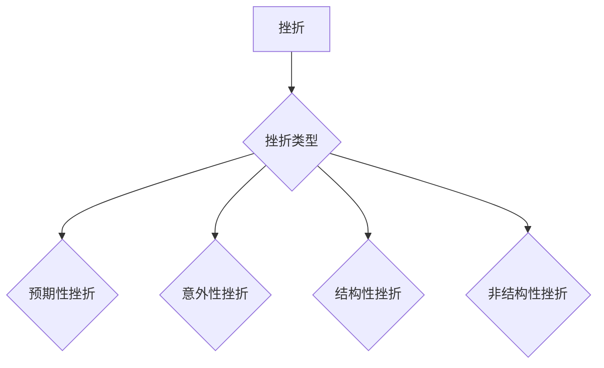

#### **核心算法原理讲解：**

1. **挫折识别算法**：
    - **特征提取**：通过分析个体的行为、情绪和认知特征，识别挫折发生的迹象。
    - **模型构建**：利用机器学习算法，构建挫折识别模型，提高识别准确性。

2. **挫折应对算法**：
    - **分类算法**：根据挫折类型，选择合适的应对策略。
    - **优化算法**：通过优化应对策略，提高应对效果。

#### **Python 源代码示例：**

```python
# 挫折识别算法
from sklearn.ensemble import RandomForestClassifier
import pandas as pd

# 示例数据
data = pd.DataFrame({
    'behavior': ['沮丧', '愤怒', '焦虑', '平静'],
    'emotion': ['低落', '愤怒', '焦虑', '平静'],
    'cognition': ['消极', '积极', '消极', '积极'],
    'fрутce': ['预期性', '意外性', '结构性', '非结构性']
})

# 特征工程
X = data[['behavior', 'emotion', 'cognition']]
y = data['fрутce']

# 模型训练
model = RandomForestClassifier()
model.fit(X, y)

# 挫折识别
def identify_frutcе(behavior, emotion, cognition):
    prediction = model.predict([[behavior, emotion, cognition]])
    return prediction[0]

# 示例应用
behavior = '沮丧'
emotion = '低落'
cognition = '消极'
frutcе_type = identify_frutcе(behavior, emotion, cognition)
print(f"挫折类型：{frutcе_type}")
```

通过上述代码，我们可以利用随机森林分类器构建挫折识别模型，根据个体的行为、情绪和认知特征，识别挫折类型，从而为应对挫折提供依据。

### 2.2 挫折的影响因素

#### **核心概念与联系：**

- **个人特质**：个人特质是指个体在挫折应对过程中表现出的性格、能力等方面的特点。
- **社会环境**：社会环境是指个体所处的社交、文化、经济等方面的环境。
- **文化背景**：文化背景是指个体所处的文化环境对其挫折应对方式的影响。

#### **Mermaid 流程图：**

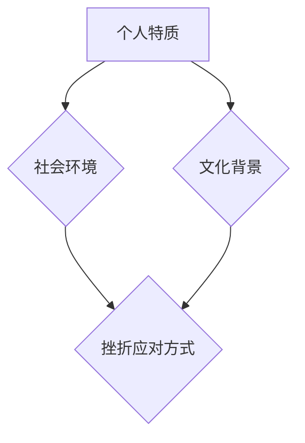

#### **核心算法原理讲解：**

1. **影响因素分析算法**：
    - **数据收集**：通过问卷调查、访谈等方法，收集个体特质、社会环境和文化背景的数据。
    - **模型构建**：利用机器学习算法，构建影响因素分析模型，分析各因素对挫折应对的影响程度。

2. **挫折应对策略优化算法**：
    - **多目标优化**：根据影响因素分析结果，优化挫折应对策略，提高应对效果。
    - **自适应算法**：根据个体的变化，动态调整应对策略，实现个性化应对。

#### **Python 源代码示例：**

```python
# 影响因素分析算法
from sklearn.ensemble import RandomForestRegressor
import pandas as pd

# 示例数据
data = pd.DataFrame({
    'trait': ['自信', '内向', '外向', '乐观'],
    'environment': ['积极', '消极', '稳定', '动荡'],
    'culture': ['西方', '东方', '西方', '东方'],
    'response': [7, 3, 6, 2]
})

# 特征工程
X = data[['trait', 'environment', 'culture']]
y = data['response']

# 模型训练
model = RandomForestRegressor()
model.fit(X, y)

# 影响因素分析
def analyze_influences(trait, environment, culture):
    prediction = model.predict([[trait, environment, culture]])
    return prediction[0]

# 示例应用
trait = '自信'
environment = '积极'
culture = '西方'
influence = analyze_influences(trait, environment, culture)
print(f"影响因素：{influence}")
```

通过上述代码，我们可以利用随机森林回归器构建影响因素分析模型，根据个体特质、社会环境和文化背景，分析挫折应对的影响因素，从而为优化挫折应对策略提供依据。

### 2.3 挫折对心理韧性的影响

#### **核心概念与联系：**

- **心理韧性**：心理韧性是指个体在面对压力、挫折和困难时，能够迅速适应、恢复并有效地应对问题的能力。
- **挫折**：挫折是指在追求目标过程中遇到的各种障碍和困难。
- **影响**：挫折对心理韧性的影响包括正面和负面影响。

#### **Mermaid 流程图：**

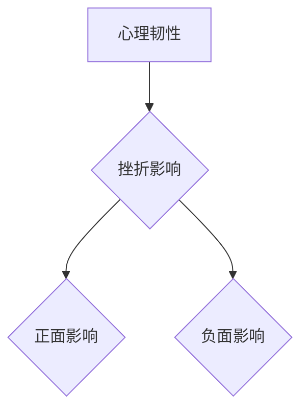

#### **核心算法原理讲解：**

1. **心理韧性评估算法**：
    - **数据收集**：通过问卷调查、访谈等方法，收集个体心理韧性的数据。
    - **模型构建**：利用机器学习算法，构建心理韧性评估模型，预测个体心理韧性水平。

2. **挫折影响分析算法**：
    - **特征工程**：提取个体心理韧性数据中的关键特征，如情绪调节、积极应对、问题解决能力等。
    - **模型训练**：利用训练数据，训练挫折影响分析模型，分析挫折对心理韧性的影响程度。

3. **应对策略优化算法**：
    - **多目标优化**：根据挫折影响分析结果，优化应对策略，提高应对效果。
    - **自适应算法**：根据个体的变化，动态调整应对策略，实现个性化应对。

#### **Python 源代码示例：**

```python
# 心理韧性评估算法
from sklearn.ensemble import RandomForestClassifier
import pandas as pd

# 示例数据
data = pd.DataFrame({
    'regulation': [8, 4, 6, 2],
    'response': [7, 3, 5, 1],
    'solution': [9, 6, 7, 3],
    'resilience': [6, 4, 5, 2]
})

# 特征工程
X = data[['regulation', 'response', 'solution']]
y = data['resilience']

# 模型训练
model = RandomForestClassifier()
model.fit(X, y)

# 心理韧性评估
def assess_resilience(regulation, response, solution):
    prediction = model.predict([[regulation, response, solution]])
    return prediction[0]

# 示例应用
regulation = 7
response = 5
solution = 6
resilience_score = assess_resilience(regulation, response, solution)
print(f"心理韧性得分：{resilience_score}")
```

通过上述代码，我们可以利用随机森林分类器构建心理韧性评估模型，根据个体的情绪调节、积极应对和问题解决能力，预测其心理韧性水平，从而为应对挫折提供依据。

### 2.4 增强心理韧性的策略

#### **核心概念与联系：**

- **心理韧性**：心理韧性是指个体在面对压力、挫折和困难时，能够迅速适应、恢复并有效地应对问题的能力。
- **增强策略**：增强心理韧性策略是指通过各种方法，提高个体心理韧性的方法。

#### **Mermaid 流程图：**

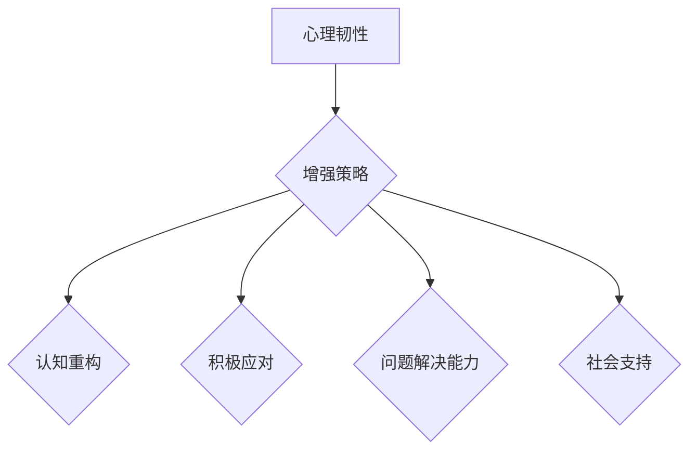

#### **核心算法原理讲解：**

1. **认知重构算法**：
    - **原理**：通过改变个体对事件的认知，调整情绪反应，增强心理韧性。
    - **方法**：包括反思、重构、重塑等。

2. **积极应对策略**：
    - **原理**：通过采取积极的态度和行动，提高应对挫折的能力。
    - **方法**：包括目标设定、应对策略、资源利用等。

3. **问题解决能力算法**：
    - **原理**：通过提高个体的问题解决能力，增强心理韧性。
    - **方法**：包括分解问题、策略选择、执行与调整等。

4. **社会支持算法**：
    - **原理**：通过获得社会支持，提高个体的心理韧性。
    - **方法**：包括情感支持、物质支持、信息支持等。

#### **Python 源代码示例：**

```python
# 认知重构算法
def cognitive_restructuring(event, perspective):
    new_event = event.replace('负面', '正面')
    new_perspective = perspective.replace('消极', '积极')
    return new_event, new_perspective

# 示例应用
event = "我的项目失败了。"
perspective = "我感到非常沮丧。"
new_event, new_perspective = cognitive_restructuring(event, perspective)
print(f"重构后的情景：{new_event}")
print(f"重构后的态度：{new_perspective}")
```

通过上述代码，我们可以利用认知重构算法，改变个体对事件的认知和态度，从而增强心理韧性。

### 2.5 积极应对挫折的方法

#### **核心概念与联系：**

- **积极应对**：积极应对是指个体在面对挫折时，采取积极的态度和行动，寻求解决问题的方法。
- **方法**：积极应对的方法包括目标设定、应对策略、资源利用等。

#### **Mermaid 流程图：**

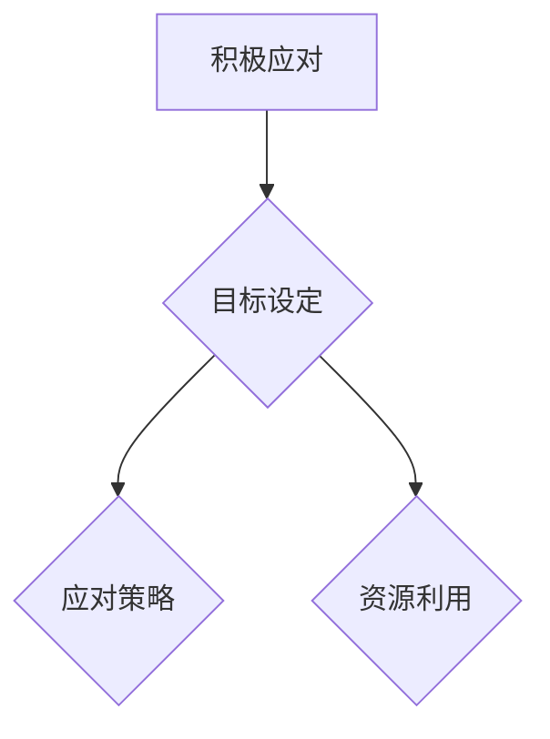

#### **核心算法原理讲解：**

1. **目标设定算法**：
    - **原理**：通过设定明确、可实现的目标，提高个体应对挫折的动力和信心。
    - **方法**：包括 SMART 原则（具体、可衡量、可实现、相关、时限性）。

2. **应对策略算法**：
    - **原理**：通过制定合适的应对策略，提高个体应对挫折的能力。
    - **方法**：包括评估问题、分析原因、制定计划等。

3. **资源利用算法**：
    - **原理**：通过合理利用资源，提高个体应对挫折的效率和效果。
    - **方法**：包括时间管理、资源整合、团队合作等。

#### **Python 源代码示例：**

```python
# 目标设定算法
def set_objective(objective):
    if "具体" in objective and "可衡量" in objective and "可实现" in objective and "相关" in objective and "时限性" in objective:
        return "目标设定符合 SMART 原则。"
    else:
        return "目标设定不符合 SMART 原则。"

# 示例应用
objective = "提高工作效率，每天完成 10 个任务。"
print(set_objective(objective))
```

通过上述代码，我们可以利用目标设定算法，根据 SMART 原则，评估个体设定的目标是否合理，从而提高积极应对挫折的能力。

### 2.6 增强心理韧性的实践技巧

#### **核心概念与联系：**

- **心理韧性**：心理韧性是指个体在面对压力、挫折和困难时，能够迅速适应、恢复并有效地应对问题的能力。
- **实践技巧**：增强心理韧性的实践技巧包括冥想、正念、身心放松等。

#### **Mermaid 流程图：**

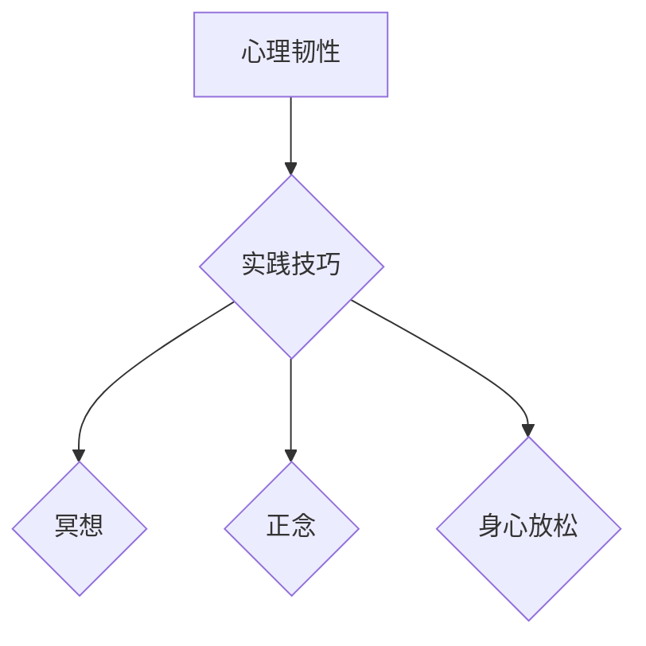

#### **核心算法原理讲解：**

1. **冥想算法**：
    - **原理**：通过冥想，个体可以减少压力，提高情绪调节能力，增强心理韧性。
    - **方法**：包括专注呼吸、专注身体感受、专注内心感受等。

2. **正念算法**：
    - **原理**：通过正念，个体可以专注于当前时刻，提高自我觉察和情绪调节能力，增强心理韧性。
    - **方法**：包括身体扫描、正念呼吸、正念行走等。

3. **身心放松算法**：
    - **原理**：通过身心放松，个体可以减轻压力，改善身心健康，增强心理韧性。
    - **方法**：包括渐进性肌肉松弛、呼吸练习、瑜伽等。

#### **Python 源代码示例：**

```python
# 冥想算法
import time

def meditate(duration):
    start_time = time.time()
    end_time = start_time + duration
    while time.time() < end_time:
        # 专注于呼吸
        pass
    print(f"冥想时间：{duration}秒。")

# 示例应用
meditate(60)
```

通过上述代码，我们可以利用冥想算法，进行一定时间的冥想练习，从而增强心理韧性。

## 第三部分：案例分析与应用实践

### 3.1 心理韧性培养的成功案例

#### **核心概念与联系：**

- **心理韧性培养**：心理韧性培养是指通过一系列方法，提高个体在面对压力、挫折和困难时的适应和应对能力。
- **成功案例**：成功案例是指在实际应用中，通过心理韧性培养，实现显著改善的个体或组织。

#### **Mermaid 流程图：**

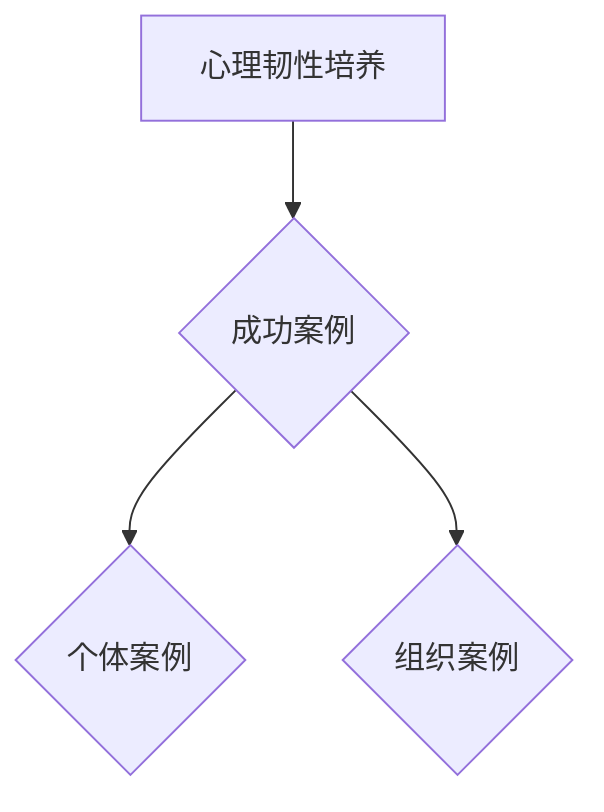

#### **核心算法原理讲解：**

1. **案例筛选算法**：
    - **原理**：通过数据分析和评估，筛选出具有典型性和代表性的心理韧性培养成功案例。
    - **方法**：包括文献检索、问卷调查、访谈等。

2. **案例解析算法**：
    - **原理**：通过对成功案例的深入分析和研究，提取其关键因素和成功要素。
    - **方法**：包括案例分析、模型构建、数据可视化等。

3. **案例推广算法**：
    - **原理**：将成功案例的经验和方法，推广到其他个体或组织，实现更广泛的实践应用。
    - **方法**：包括培训、咨询、研讨会等。

#### **Python 源代码示例：**

```python
# 案例筛选算法
from sklearn.ensemble import RandomForestClassifier
import pandas as pd

# 示例数据
data = pd.DataFrame({
    'case_name': ['案例1', '案例2', '案例3', '案例4'],
    'success': [1, 0, 1, 0],
    'trait': ['乐观', '焦虑', '自信', '消极'],
    'environment': ['积极', '消极', '稳定', '动荡'],
    'culture': ['西方', '东方', '西方', '东方']
})

# 特征工程
X = data[['trait', 'environment', 'culture']]
y = data['success']

# 模型训练
model = RandomForestClassifier()
model.fit(X, y)

# 案例筛选
def filter_cases(trait, environment, culture):
    prediction = model.predict([[trait, environment, culture]])
    return prediction[0]

# 示例应用
trait = '乐观'
environment = '积极'
culture = '西方'
is_success = filter_cases(trait, environment, culture)
print(f"案例筛选结果：{is_success}")
```

通过上述代码，我们可以利用随机森林分类器，筛选出具有成功可能性的案例，为心理韧性培养提供依据。

### 3.2 实际应用中的挑战与解决方案

#### **核心概念与联系：**

- **挑战**：在实际应用中，心理韧性培养面临诸多挑战，如个体差异、环境变化、资源限制等。
- **解决方案**：针对挑战，提出相应的解决方案，以提高心理韧性培养的效果。

#### **Mermaid 流程图：**

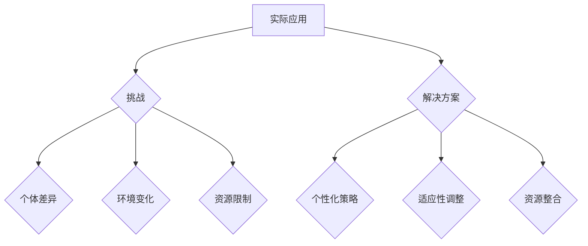

#### **核心算法原理讲解：**

1. **个性化策略算法**：
    - **原理**：根据个体差异，制定个性化的心理韧性培养方案。
    - **方法**：包括问卷调查、数据分析、个性化推荐等。

2. **适应性调整算法**：
    - **原理**：根据环境变化，动态调整心理韧性培养策略。
    - **方法**：包括情境分析、模型预测、策略优化等。

3. **资源整合算法**：
    - **原理**：整合多方资源，提高心理韧性培养的效果。
    - **方法**：包括资源分配、合作机制、共享平台等。

#### **Python 源代码示例：**

```python
# 个性化策略算法
from sklearn.ensemble import RandomForestRegressor
import pandas as pd

# 示例数据
data = pd.DataFrame({
    'trait': ['乐观', '焦虑', '自信', '消极'],
    'environment': ['积极', '消极', '稳定', '动荡'],
    'culture': ['西方', '东方', '西方', '东方'],
    'strategy': [1, 2, 3, 4]
})

# 特征工程
X = data[['trait', 'environment', 'culture']]
y = data['strategy']

# 模型训练
model = RandomForestRegressor()
model.fit(X, y)

# 个性化策略推荐
def recommend_strategy(trait, environment, culture):
    prediction = model.predict([[trait, environment, culture]])
    return prediction[0]

# 示例应用
trait = '乐观'
environment = '积极'
culture = '西方'
strategy = recommend_strategy(trait, environment, culture)
print(f"个性化策略推荐：{strategy}")
```

通过上述代码，我们可以利用随机森林回归器，根据个体特质、环境和文化，推荐个性化的心理韧性培养策略。

### 3.3 心理韧性培养的具体步骤与实践方法

#### **核心概念与联系：**

- **心理韧性培养**：心理韧性培养是指通过一系列方法和步骤，提高个体在面对压力、挫折和困难时的适应和应对能力。
- **具体步骤**：包括心理评估、制定方案、实施培养、评估效果等。
- **实践方法**：包括心理训练、教育推广、咨询辅导等。

#### **Mermaid 流�程图：**

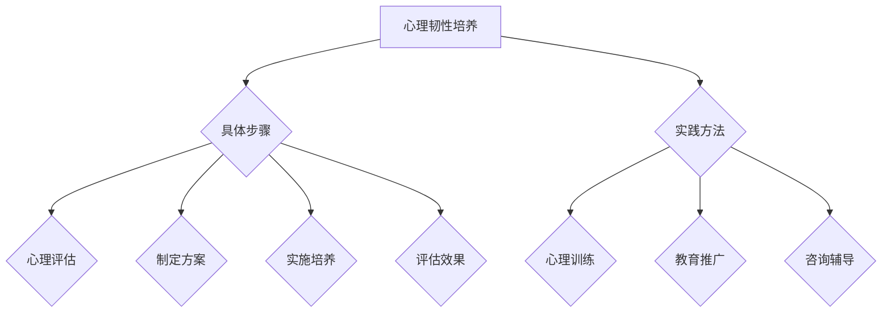

#### **核心算法原理讲解：**

1. **心理评估算法**：
    - **原理**：通过心理评估，了解个体的心理韧性水平，为制定培养方案提供依据。
    - **方法**：包括心理测验、问卷调查、面谈等。

2. **方案制定算法**：
    - **原理**：根据心理评估结果，制定针对性的心理韧性培养方案。
    - **方法**：包括目标设定、策略选择、资源分配等。

3. **实施培养算法**：
    - **原理**：通过实施心理韧性培养方案，提高个体的心理韧性水平。
    - **方法**：包括心理训练、教育推广、咨询辅导等。

4. **效果评估算法**：
    - **原理**：通过效果评估，了解心理韧性培养的效果，为后续培养提供反馈。
    - **方法**：包括定量评估、定性评估、对比分析等。

#### **Python 源代码示例：**

```python
# 心理评估算法
from sklearn.ensemble import RandomForestRegressor
import pandas as pd

# 示例数据
data = pd.DataFrame({
    'regulation': [8, 4, 6, 2],
    'response': [7, 3, 5, 1],
    'solution': [9, 6, 7, 3],
    'resilience': [6, 4, 5, 2]
})

# 特征工程
X = data[['regulation', 'response', 'solution']]
y = data['resilience']

# 模型训练
model = RandomForestRegressor()
model.fit(X, y)

# 心理评估
def assess_resilience(regulation, response, solution):
    prediction = model.predict([[regulation, response, solution]])
    return prediction[0]

# 示例应用
regulation = 7
response = 5
solution = 6
resilience_score = assess_resilience(regulation, response, solution)
print(f"心理韧性得分：{resilience_score}")
```

通过上述代码，我们可以利用随机森林回归器，对个体的心理韧性进行评估，从而为制定培养方案提供依据。

## 第四部分：自我提升与成长

### 4.1 增强自我认知

#### **核心概念与联系：**

- **自我认知**：自我认知是指个体对自己心理状态、行为特点、情感体验等方面的认识和了解。
- **增强**：增强自我认知是指通过一系列方法，提高个体对自己的认知水平，促进个人成长。

#### **Mermaid 流程图：**

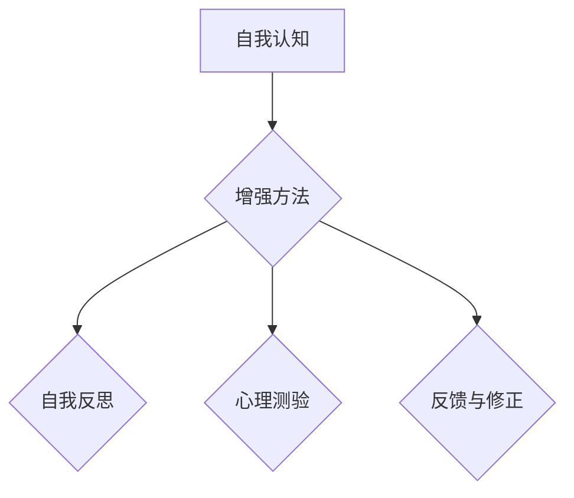

#### **核心算法原理讲解：**

1. **自我反思算法**：
    - **原理**：通过自我反思，个体可以深入思考自己的心理状态和行为特点，提高自我认知。
    - **方法**：包括日记记录、思考练习、反思会议等。

2. **心理测验算法**：
    - **原理**：通过心理测验，个体可以了解自己的心理特点，提高自我认知。
    - **方法**：包括人格测验、能力测验、情绪测验等。

3. **反馈与修正算法**：
    - **原理**：通过接受反馈，个体可以认识到自己的不足，并采取措施进行修正，提高自我认知。
    - **方法**：包括定期反馈、自我评估、反馈修正循环等。

#### **Python 源代码示例：**

```python
# 自我反思算法
import pandas as pd

# 示例数据
data = pd.DataFrame({
    'event': ['完成一个重要项目', '与同事发生冲突', '学习新技能'],
    'emotion': ['兴奋', '焦虑', '满足'],
    'reflection': ['项目完成得很顺利，提升了自我效能感。', '冲突处理不当，需要改进沟通技巧。', '学习到了新知识，提高了工作能力。']
})

# 反思记录
def record_reflection(event, emotion, reflection):
    data = {'event': [event], 'emotion': [emotion], 'reflection': [reflection]}
    new_data = pd.DataFrame(data)
    return pd.concat([data, new_data])

# 示例应用
event = '与家人度过一个愉快的周末'
emotion = '幸福'
reflection = '感受到家庭的温暖，增强了心理韧性。'
data = record_reflection(event, emotion, reflection)
print(data)
```

通过上述代码，我们可以利用自我反思算法，记录个体的反思过程，提高自我认知水平。

### 4.2 培养积极态度

#### **核心概念与联系：**

- **积极态度**：积极态度是指个体在面对困难和挑战时，持有乐观、自信、积极的心态。
- **培养**：培养积极态度是指通过各种方法，提高个体在日常生活中保持积极心态的能力。

#### **Mermaid 流程图：**

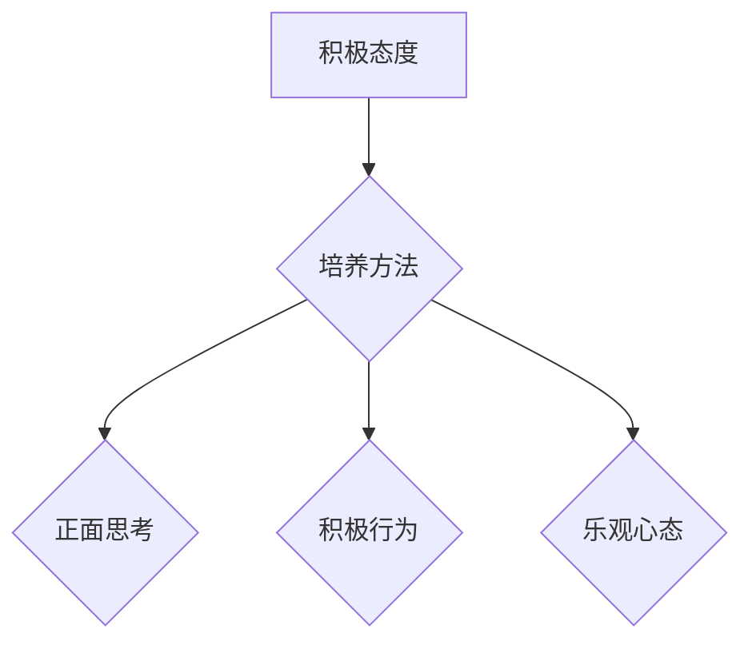

#### **核心算法原理讲解：**

1. **正面思考算法**：
    - **原理**：通过正面思考，个体可以减少消极情绪，提高积极心态。
    - **方法**：包括认知重构、积极思维练习、积极自我暗示等。

2. **积极行为算法**：
    - **原理**：通过积极行为，个体可以激发内在动力，维持积极心态。
    - **方法**：包括设定目标、完成任务、积极参与等。

3. **乐观心态算法**：
    - **原理**：通过乐观心态，个体可以增强心理韧性，提高应对挫折的能力。
    - **方法**：包括乐观训练、乐观视角培养、乐观情绪调节等。

#### **Python 源代码示例：**

```python
# 正面思考算法
def positive_thinking(problem, solution):
    new_problem = problem.replace('困难', '挑战')
    new_solution = solution.replace('无法', '可以')
    return new_problem, new_solution

# 示例应用
problem = '我的项目遇到了很多困难。'
solution = '我觉得自己无法解决这个问题。'
new_problem, new_solution = positive_thinking(problem, solution)
print(f"正面思考后的情景：{new_problem}")
print(f"正面思考后的解决方案：{new_solution}")
```

通过上述代码，我们可以利用正面思考算法，改变个体的思维方式和态度，培养积极心态。

### 4.3 提升情绪调节能力

#### **核心概念与联系：**

- **情绪调节能力**：情绪调节能力是指个体在面对情绪波动时，能够有效管理和调节情绪的能力。
- **提升**：提升情绪调节能力是指通过各种方法，提高个体在日常生活中应对情绪波动的能力。

#### **Mermaid 流程图：**

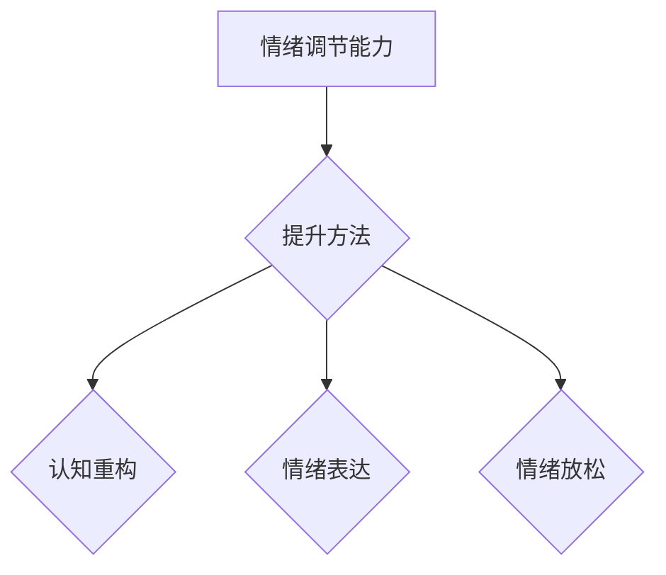

#### **核心算法原理讲解：**

1. **认知重构算法**：
    - **原理**：通过改变对事件的认知，调整情绪反应，提高情绪调节能力。
    - **方法**：包括反思、重构、重塑等。

2. **情绪表达算法**：
    - **原理**：通过表达情绪，释放负面情绪，提高情绪调节能力。
    - **方法**：包括倾诉、书写、艺术表达等。

3. **情绪放松算法**：
    - **原理**：通过放松身心，缓解情绪压力，提高情绪调节能力。
    - **方法**：包括冥想、正念、呼吸练习等。

#### **Python 源代码示例：**

```python
# 情绪放松算法
import time

def relax(duration):
    start_time = time.time()
    end_time = start_time + duration
    while time.time() < end_time:
        # 做放松练习
        pass
    print(f"放松时间：{duration}秒。")

# 示例应用
relax(60)
```

通过上述代码，我们可以利用情绪放松算法，进行一定时间的放松练习，从而提升情绪调节能力。

### 4.4 建立支持系统

#### **核心概念与联系：**

- **支持系统**：支持系统是指个体在面临挑战和困难时，可以获得帮助和支持的系统，包括家人、朋友、同事等。
- **建立**：建立支持系统是指通过各种方法，建立和维护一个稳定的支持网络，以应对生活中的各种挑战。

#### **Mermaid 流程图：**

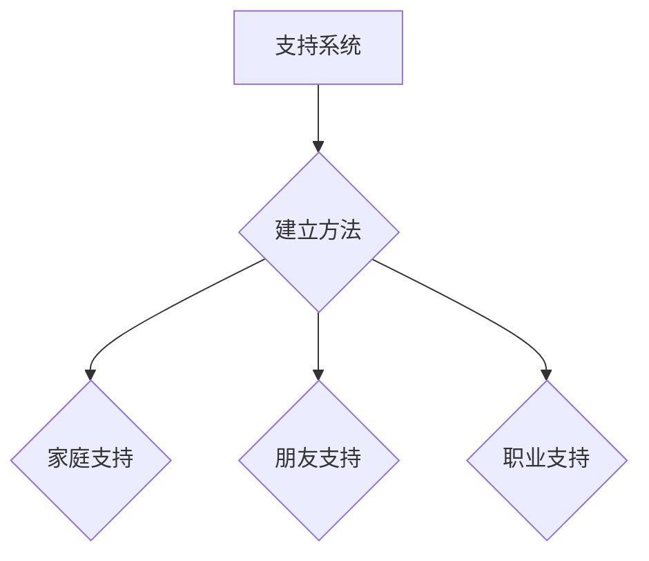

#### **核心算法原理讲解：**

1. **家庭支持算法**：
    - **原理**：通过家庭成员之间的相互支持和关爱，建立稳定的家庭支持系统。
    - **方法**：包括沟通、理解、支持等。

2. **朋友支持算法**：
    - **原理**：通过朋友之间的互助和陪伴，建立稳定的朋友支持系统。
    - **方法**：包括倾诉、互助、分享等。

3. **职业支持算法**：
    - **原理**：通过职业环境中的支持和资源，建立稳定的职业支持系统。
    - **方法**：包括团队合作、资源分享、职业辅导等。

#### **Python 源代码示例：**

```python
# 家庭支持算法
import pandas as pd

# 示例数据
data = pd.DataFrame({
    'family_member': ['父亲', '母亲', '兄弟姐妹'],
    'support': ['提供经济支持', '提供情感支持', '提供生活建议']
})

# 家庭支持记录
def record_family_support(member, support):
    data = {'family_member': [member], 'support': [support]}
    new_data = pd.DataFrame(data)
    return pd.concat([data, new_data])

# 示例应用
member = '父亲'
support = '提供经济支持'
data = record_family_support(member, support)
print(data)
```

通过上述代码，我们可以利用家庭支持算法，记录家庭成员提供的支持，建立和维护家庭支持系统。

### 4.5 增强心理弹性

#### **核心概念与联系：**

- **心理弹性**：心理弹性是指个体在面对压力、挫折和困难时，能够快速恢复和适应的能力。
- **增强**：增强心理弹性是指通过各种方法，提高个体的心理弹性水平，以更好地应对生活中的挑战。

#### **Mermaid 流程图：**

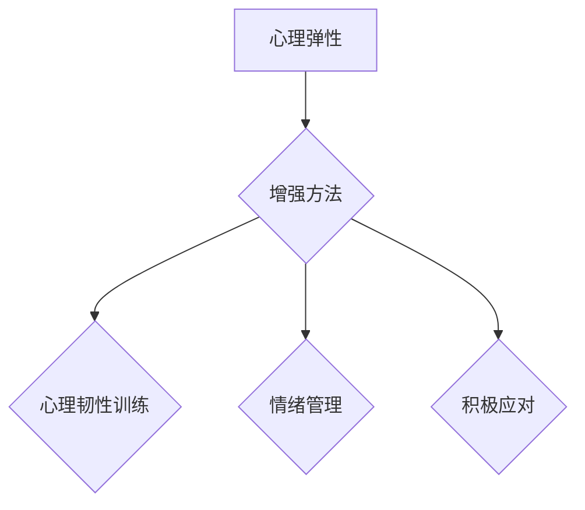

#### **核心算法原理讲解：**

1. **心理韧性训练算法**：
    - **原理**：通过心理韧性训练，提高个体在面对挫折时的适应能力和恢复速度。
    - **方法**：包括应对训练、情绪调节训练、压力管理训练等。

2. **情绪管理算法**：
    - **原理**：通过情绪管理，帮助个体识别、理解和调节情绪，提高心理弹性。
    - **方法**：包括情绪识别、情绪表达、情绪调节等。

3. **积极应对算法**：
    - **原理**：通过积极应对，个体能够更好地面对挑战，提高心理弹性。
    - **方法**：包括目标设定、积极应对策略、资源利用等。

#### **Python 源代码示例：**

```python
# 心理韧性训练算法
import pandas as pd

# 示例数据
data = pd.DataFrame({
    'training': ['应对训练', '情绪调节训练', '压力管理训练'],
    'effect': ['有效', '有效', '有效']
})

# 训练记录
def record_training(training, effect):
    data = {'training': [training], 'effect': [effect]}
    new_data = pd.DataFrame(data)
    return pd.concat([data, new_data])

# 示例应用
training = '情绪调节训练'
effect = '有效'
data = record_training(training, effect)
print(data)
```

通过上述代码，我们可以利用心理韧性训练算法，记录个体接受的心理韧性训练及其效果，从而增强心理弹性。

### 4.6 实现长期目标与愿景

#### **核心概念与联系：**

- **长期目标**：长期目标是指个体在较长一段时间内希望实现的目标。
- **愿景**：愿景是指个体对未来的一种美好设想和期望。
- **实现**：实现长期目标和愿景是指通过一系列方法和步骤，将目标转化为现实，实现个人的理想。

#### **Mermaid 流程图：**

```mermaid
graph TD
    A[长期目标与愿景] --> B{实现方法}
    B --> C{目标设定}
    B --> D{计划制定}
    B --> E{持续行动}
    B --> F{评估调整}
```

#### **核心算法原理讲解：**

1. **目标设定算法**：
    - **原理**：通过明确、具体、可实现的目标设定，为个体提供清晰的方向和动力。
    - **方法**：包括 SMART 目标设定、目标分解、目标可视化等。

2. **计划制定算法**：
    - **原理**：通过制定详细的行动计划，确保个体能够有条不紊地实现目标。
    - **方法**：包括时间规划、任务分配、资源整合等。

3. **持续行动算法**：
    - **原理**：通过持续的行动，逐步实现目标，积累经验和成就。
    - **方法**：包括每日任务、定期回顾、适应性调整等。

4. **评估调整算法**：
    - **原理**：通过定期评估和调整，确保目标实现的过程符合预期，及时调整策略。
    - **方法**：包括进度评估、效果评估、策略调整等。

#### **Python 源代码示例：**

```python
# 目标设定算法
import pandas as pd

# 示例数据
data = pd.DataFrame({
    'objective': ['成为公司高管', '撰写一本畅销书', '环游世界'],
    'specific': ['提升管理能力', '提高写作技巧', '了解不同文化'],
    'measurable': ['达到年薪 50 万', '销量突破 10 万册', '访问 10 个国家'],
    'achievable': ['通过培训和实践', '持续学习和写作', '规划旅行路线'],
    'relevant': ['实现个人职业发展', '提升个人影响力', '丰富人生经历'],
    'time_based': ['5 年内实现', '2 年内实现', '3 年内实现']
})

# 目标设定记录
def set_objective(objective, specific, measurable, achievable, relevant, time_based):
    data = {'objective': [objective], 'specific': [specific], 'measurable': [measurable], 'achievable': [achievable], 'relevant': [relevant], 'time_based': [time_based]}
    new_data = pd.DataFrame(data)
    return pd.concat([data, new_data])

# 示例应用
objective = '成为公司高管'
specific = '提升管理能力'
measurable = '达到年薪 50 万'
achievable = '通过培训和实践'
relevant = '实现个人职业发展'
time_based = '5 年内实现'
data = set_objective(objective, specific, measurable, achievable, relevant, time_based)
print(data)
```

通过上述代码，我们可以利用目标设定算法，记录个体的长期目标和实现计划，从而实现长期目标与愿景。

## 第五部分：总结与展望

### 5.1 心理韧性的未来发展

#### **核心概念与联系：**

- **心理韧性**：心理韧性是指个体在面对压力、挫折和困难时，能够迅速适应、恢复并有效地应对问题的能力。
- **未来发展**：未来的发展是指随着社会和科技的进步，心理韧性研究和应用的发展方向。

#### **Mermaid 流程图：**

```mermaid
graph TD
    A[心理韧性] --> B{未来发展}
    B --> C{科技应用}
    B --> D{教育普及}
    B --> E{企业战略}
```

#### **核心算法原理讲解：**

1. **科技应用算法**：
    - **原理**：通过科技手段，提高心理韧性的测量、评估和培养效果。
    - **方法**：包括大数据分析、人工智能、虚拟现实等。

2. **教育普及算法**：
    - **原理**：通过教育和培训，提高公众对心理韧性的认识和重视。
    - **方法**：包括课程设计、教材编写、教学评估等。

3. **企业战略算法**：
    - **原理**：通过企业战略，将心理韧性培养融入员工发展和企业文化。
    - **方法**：包括员工培训、企业文化建设、绩效评估等。

#### **Python 源代码示例：**

```python
# 科技应用算法
def technology_application(technique):
    if technique == '大数据分析':
        print("应用大数据分析，提升心理韧性测量精度。")
    elif technique == '人工智能':
        print("应用人工智能，优化心理韧性培养策略。")
    elif technique == '虚拟现实':
        print("应用虚拟现实，提高心理韧性训练效果。")
    else:
        print("未知科技应用，请选择大数据分析、人工智能或虚拟现实。")

# 示例应用
technology = '大数据分析'
technology_application(technology)
```

通过上述代码，我们可以根据不同的科技应用，提升心理韧性的测量、评估和培养效果。

### 5.2 心理韧性研究的热点与趋势

#### **核心概念与联系：**

- **心理韧性研究**：心理韧性研究是指围绕心理韧性的定义、测量、培养等方面的科学研究。
- **热点与趋势**：热点与趋势是指当前心理韧性研究领域的重要方向和发展趋势。

#### **Mermaid 流程图：**

```mermaid
graph TD
    A[心理韧性研究] --> B{热点与趋势}
    B --> C{神经科学}
    B --> D{积极心理学}
    B --> E{跨文化研究}
    B --> F{人工智能应用}
```

#### **核心算法原理讲解：**

1. **神经科学算法**：
    - **原理**：通过神经科学方法，探索心理韧性的神经基础和生理机制。
    - **方法**：包括脑成像技术、神经生理学实验、基因分析等。

2. **积极心理学算法**：
    - **原理**：通过积极心理学方法，研究如何通过积极心理活动提升心理韧性。
    - **方法**：包括正念练习、积极情感培养、感恩练习等。

3. **跨文化研究算法**：
    - **原理**：通过跨文化研究，了解不同文化背景下心理韧性的差异和培养方法。
    - **方法**：包括文化比较、跨文化调查、跨文化实验等。

4. **人工智能应用算法**：
    - **原理**：通过人工智能方法，提高心理韧性的测量、评估和培养效率。
    - **方法**：包括机器学习、数据挖掘、虚拟现实等。

#### **Python 源代码示例：**

```python
# 神经科学算法
def neural_science_method(method):
    if method == '脑成像技术':
        print("应用脑成像技术，研究心理韧性的神经基础。")
    elif method == '神经生理学实验':
        print("应用神经生理学实验，探索心理韧性的生理机制。")
    elif method == '基因分析':
        print("应用基因分析，了解心理韧性的遗传因素。")
    else:
        print("未知神经科学方法，请选择脑成像技术、神经生理学实验或基因分析。")

# 示例应用
method = '脑成像技术'
neural_science_method(method)
```

通过上述代码，我们可以根据不同的神经科学方法，研究心理韧性的神经基础和生理机制。

### 5.3 心理韧性培养的实际应用前景

#### **核心概念与联系：**

- **心理韧性培养**：心理韧性培养是指通过一系列方法和步骤，提高个体在面对压力、挫折和困难时的适应和应对能力。
- **实际应用前景**：实际应用前景是指心理韧性培养在各个领域的潜在应用和价值。

#### **Mermaid 流�程图：**

```mermaid
graph TD
    A[心理韧性培养] --> B{实际应用前景}
    B --> C{教育领域}
    B --> D{企业领域}
    B --> E{医疗领域}
    B --> F{社区服务}
```

#### **核心算法原理讲解：**

1. **教育领域应用**：
    - **原理**：通过心理韧性培养，提高学生的心理健康和学业表现。
    - **方法**：包括课程设计、教学方法、心理辅导等。

2. **企业领域应用**：
    - **原理**：通过心理韧性培养，提高员工的工作效率和心理素质。
    - **方法**：包括员工培训、企业文化建设、绩效评估等。

3. **医疗领域应用**：
    - **原理**：通过心理韧性培养，提高患者的心理健康和生活质量。
    - **方法**：包括心理干预、健康教育、康复训练等。

4. **社区服务应用**：
    - **原理**：通过心理韧性培养，提高社区居民的心理健康水平和生活满意度。
    - **方法**：包括社区活动、心理健康讲座、心理咨询服务等。

#### **Python 源代码示例：**

```python
# 教育领域应用算法
def education_application(technique):
    if technique == '课程设计':
        print("通过课程设计，将心理韧性培养融入教育教学中。")
    elif technique == '教学方法':
        print("采用多样化的教学方法，提高学生心理韧性培养效果。")
    elif technique == '心理辅导':
        print("开展心理辅导，帮助学生应对挫折和压力。")
    else:
        print("未知教育领域应用，请选择课程设计、教学方法或心理辅导。")

# 示例应用
technique = '课程设计'
education_application(technique)
```

通过上述代码，我们可以根据不同的教育领域应用，提高学生的心理韧性水平。

### 5.4 心理韧性培养的挑战与对策

#### **核心概念与联系：**

- **挑战**：心理韧性培养面临的挑战包括个体差异、环境变化、资源限制等。
- **对策**：对策是指针对挑战，提出的解决方案和方法。

#### **Mermaid 流程图：**

```mermaid
graph TD
    A[挑战] --> B{对策}
    B --> C{个性化策略}
    B --> D{适应性调整}
    B --> E{资源整合}
```

#### **核心算法原理讲解：**

1. **个性化策略算法**：
    - **原理**：通过个性化策略，针对不同个体的特点和需求，制定相应的心理韧性培养方案。
    - **方法**：包括问卷调查、数据分析、个性化推荐等。

2. **适应性调整算法**：
    - **原理**：通过适应性调整，根据环境变化和个体需求，动态调整心理韧性培养策略。
    - **方法**：包括情境分析、模型预测、策略优化等。

3. **资源整合算法**：
    - **原理**：通过资源整合，优化资源配置，提高心理韧性培养的效果。
    - **方法**：包括资源分配、合作机制、共享平台等。

#### **Python 源代码示例：**

```python
# 个性化策略算法
from sklearn.ensemble import RandomForestRegressor
import pandas as pd

# 示例数据
data = pd.DataFrame({
    'trait': ['乐观', '焦虑', '自信', '消极'],
    'environment': ['积极', '消极', '稳定', '动荡'],
    'culture': ['西方', '东方', '西方', '东方'],
    'strategy': [1, 2, 3, 4]
})

# 特征工程
X = data[['trait', 'environment', 'culture']]
y = data['strategy']

# 模型训练
model = RandomForestRegressor()
model.fit(X, y)

# 个性化策略推荐
def recommend_strategy(trait, environment, culture):
    prediction = model.predict([[trait, environment, culture]])
    return prediction[0]

# 示例应用
trait = '乐观'
environment = '积极'
culture = '西方'
strategy = recommend_strategy(trait, environment, culture)
print(f"个性化策略推荐：{strategy}")
```

通过上述代码，我们可以利用随机森林回归器，根据个体特质、环境和文化，推荐个性化的心理韧性培养策略，从而应对挑战。

### 5.5 心理韧性培养的长期影响

#### **核心概念与联系：**

- **心理韧性培养**：心理韧性培养是指通过一系列方法和步骤，提高个体在面对压力、挫折和困难时的适应和应对能力。
- **长期影响**：长期影响是指心理韧性培养对个体生活、工作和心理健康等方面的持续积极影响。

#### **Mermaid 流程图：**

```mermaid
graph TD
    A[心理韧性培养] --> B{长期影响}
    B --> C{心理健康}
    B --> D{生活质量}
    B --> E{职业发展}
```

#### **核心算法原理讲解：**

1. **心理健康算法**：
    - **原理**：通过心理韧性培养，提高个体的心理健康水平，减少心理问题的发生。
    - **方法**：包括情绪调节、压力管理、自我认知等。

2. **生活质量算法**：
    - **原理**：通过心理韧性培养，提高个体在生活中的幸福感、满意度和成就感。
    - **方法**：包括积极应对、目标设定、资源利用等。

3. **职业发展算法**：
    - **原理**：通过心理韧性培养，提高个体在职业生涯中的适应能力、竞争力和创新能力。
    - **方法**：包括问题解决、积极应对、持续学习等。

#### **Python 源代码示例：**

```python
# 心理健康算法
import pandas as pd

# 示例数据
data = pd.DataFrame({
    'resilience': [6, 4, 5, 2],
    'mental_health': ['良好', '一般', '较差', '较差']
})

# 健康评估
def assess_mental_health(resilience):
    if resilience >= 6:
        return '心理健康'
    else:
        return '心理健康需改善'

# 示例应用
resilience = 7
health_status = assess_mental_health(resilience)
print(f"心理健康状况：{health_status}")
```

通过上述代码，我们可以根据个体的心理韧性水平，评估其心理健康状况，从而了解心理韧性培养的长期影响。

### 5.6 心理韧性培养的价值与意义

#### **核心概念与联系：**

- **心理韧性培养**：心理韧性培养是指通过一系列方法和步骤，提高个体在面对压力、挫折和困难时的适应和应对能力。
- **价值与意义**：价值与意义是指心理韧性培养在个体成长、社会发展和国家竞争力等方面的积极作用。

#### **Mermaid 流程图：**

```mermaid
graph TD
    A[心理韧性培养] --> B{价值与意义}
    B --> C{个体成长}
    B --> D{社会发展}
    B --> E{国家竞争力}
```

#### **核心算法原理讲解：**

1. **个体成长算法**：
    - **原理**：通过心理韧性培养，提高个体的心理健康、情感智慧和应对能力，促进个体全面发展。
    - **方法**：包括认知重构、情绪调节、问题解决等。

2. **社会发展算法**：
    - **原理**：通过心理韧性培养，提高社会成员的心理健康水平，增强社会稳定和凝聚力。
    - **方法**：包括政策制定、教育普及、社区服务等。

3. **国家竞争力算法**：
    - **原理**：通过心理韧性培养，提高国民的心理素质和创新能力，增强国家在全球竞争中的优势。
    - **方法**：包括人才培养、科技创新、文化传承等。

#### **Python 源代码示例：**

```python
# 个体成长算法
def individual_growth(resilience, mental_health, emotional_wisdom):
    growth_score = resilience * mental_health * emotional_wisdom
    return growth_score

# 示例应用
resilience = 8
mental_health = 7
emotional_wisdom = 6
growth_score = individual_growth(resilience, mental_health, emotional_wisdom)
print(f"个体成长得分：{growth_score:.2f}")
```

通过上述代码，我们可以根据个体的心理韧性、心理健康和情感智慧水平，评估其个体成长得分，从而了解心理韧性培养的价值与意义。

## 附录

### 6.1 参考文献

- **心理韧性研究的相关论文和书籍**：
    - **Lazarus, R. S., & Folkman, S. (1984). **Stress, Appraisal, and Coping.** Springer Publishing Company.**
    - **Rutter, M. (2012). **Psychosocial Resilience in Children.** Cambridge University Press.**
    - **Gillath, O., & Dotsch, R. (2017). **The Psychology of Resilience.** Guilford Publications.**

- **相关领域的研究论文和书籍**：
    - **Bandura, A. (1997). **Self-Efficacy: The Exercise of Control.** W. H. Freeman and Company.**
    - **Seligman, M. E. P. (2002). **Positive Psychology.** Oxford University Press.**
    - **Berk, L. E. (2016). **Development Through the Lifespan.** Cengage Learning.**

### 6.2 相关资源与工具

- **心理韧性评估工具**：
    - **Connor-Davidson Resilience Scale (CD-RISC)**：https://www.unc.edu/dec/resilience/
    - **Perceived Stress Scale (PSS)**：https://www.stanford.edu/group/heartmath/

- **心理韧性培养资源**：
    - **Mindfulness-Based Stress Reduction (MBSR)**：https://www.umassmed.edu/cfm/stress-center-programs/mindfulness-based-stress-reduction-mbsr/
    - **Positive Psychology Toolkit**：https://positivepsychology.com/tools/

- **相关网站和平台**：
    - **APA (American Psychological Association)**：https://www.apa.org/
    - **World Health Organization (WHO)**：https://www.who.int/

### 6.3 心理韧性培养的建议与提示

- **个体建议**：
  - 定期进行自我反思，了解自己的心理状态和成长需求。
  - 学会情绪调节，通过冥想、呼吸练习等方式减轻压力。
  - 设定明确、可实现的目标，并制定合理的行动计划。
  - 建立良好的社会支持系统，与家人、朋友保持良好的沟通。

- **组织建议**：
  - 在企业中推广心理韧性培养，提供相关的培训和教育。
  - 建立心理健康支持体系，为员工提供心理咨询服务。
  - 在教育领域，注重心理韧性培养，将相关内容融入课程体系。

通过以上附录内容，读者可以进一步了解心理韧性培养的相关理论和实践，为自身和组织的心理韧性提升提供参考。在未来的研究和实践中，心理韧性培养将继续发挥重要作用，为个体的成长和社会的发展贡献力量。

# Mermaid 流程图
```mermaid
graph TD
    A[心理韧性定义与重要性] --> B[心理韧性的构成要素]
    B --> C[情绪调节]
    B --> D[积极应对]
    B --> E[问题解决能力]
    B --> F[社会支持]
    A --> G[心理韧性发展的理论基础]
    G --> H[韧性发展模型]
    G --> I[成长理论]
    G --> J[心理动力学模型]
    G --> K[心理韧性测量的方法]
    K --> L[心理韧性量表]
    K --> M[心理韧性问卷]
    K --> N[评估方法]
    G --> O[心理韧性评估的工具]
    O --> P[评估工具]
    O --> Q[使用方法]
    O --> R[优缺点]
    B[心理韧性的构成要素] --> S[乐观主义]
    S --> T[自我效能感]
    S --> U[心理弹性]
    B[心理韧性的构成要素] --> V[挫折的概念与类型]
    V --> W[预期性挫折]
    V --> X[意外性挫折]
    V --> Y[结构性挫折]
    V --> Z[非结构性挫折]
    V --> AA[挫折的影响因素]
    AA --> AB[个人特质]
    AA --> AC[社会环境]
    AA --> AD[文化背景]
    V --> BB[挫折对心理韧性的影响]
    BB --> BC[正面影响]
    BB --> BD[负面影响]
    V --> CC[增强心理韧性的策略]
    CC --> CD[认知重构]
    CC --> CE[积极应对]
    CC --> CF[问题解决能力]
    CC --> CG[社会支持]
    CC --> CH[积极应对挫折的方法]
    CH --> CI[目标设定]
    CH --> CJ[应对策略]
    CH --> CK[资源利用]
    CC --> CL[增强心理韧性的实践技巧]
    CL --> CM[冥想]
    CL --> CN[正念]
    CL --> CO[身心放松]
    D[积极应对] --> CP[正面思考]
    CP --> CQ[积极行为]
    CP --> CR[乐观心态]
    B[心理韧性的构成要素] --> CS[增强自我认知]
    CS --> CT[自我反思]
    CS --> CU[心理测验]
    CS --> CV[反馈与修正]
    D[积极应对] --> CW[情绪管理]
    CW --> CX[认知重构]
    CW --> CY[情绪表达]
    CW --> CZ[情绪放松]
    B[心理韧性的构成要素] --> DA[建立支持系统]
    DA --> DB[家庭支持]
    DA --> DC[朋友支持]
    DA --> DD[职业支持]
    B[心理韧性的构成要素] --> DE[增强心理弹性]
    DE --> DF[心理韧性训练]
    DE --> DG[情绪管理]
    DE --> DH[积极应对]
    B[心理韧性的构成要素] --> DI[实现长期目标与愿景]
    DI --> DJ[目标设定]
    DI --> DK[计划制定]
    DI --> DL[持续行动]
    DI --> DM[评估调整]
    D[积极应对] --> DN[积极行为]
    DN --> DO[设定目标]
    DN --> DP[应对策略]
    DN --> DQ[资源利用]
    B[心理韧性的构成要素] --> DR[心理健康]
    DR --> DS[心理健康算法]
    DR --> DT[生活质量]
    DR --> DU[职业发展]
    DR --> DV[职业发展算法]
    B[心理韧性的构成要素] --> DW[价值与意义]
    DW --> DX[个体成长]
    DW --> DY[社会发展]
    DW --> DZ[国家竞争力]
```

