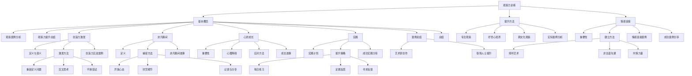

                 

# 培养生活敏感度：发现日常中的非凡

> 关键词：生活敏感度，观察力，情感连接，创造力，非凡瞬间，心灵成长，实践

> 摘要：本文旨在探讨如何培养生活敏感度，从而在日常生活中发现那些不平凡的瞬间。通过分析观察力、情感连接、创造力、非凡瞬间和心灵成长等方面，本文提出了一系列实践方法，帮助读者提升对生活的敏感度，增强生活的丰富性和深度。

## 引言

在快节奏的现代社会中，人们往往容易忽视身边的美好与不平凡。我们沉浸在繁忙的工作、琐碎的家务和社交互动中，有时甚至忘记了去欣赏那些细微却令人感动的事物。生活敏感度，简单来说，就是对于生活中细微变化和独特体验的感知能力。它不仅关乎我们如何度过每一天，更关乎我们如何看待和体验生活。

### 为什么培养生活敏感度重要？

培养生活敏感度的重要性体现在多个方面：

1. **提高生活质量**：通过培养敏感度，我们能够更好地体验生活中的美好，从而提高生活的整体质量。
2. **增强情感连接**：当我们对生活有更深的感知时，我们与他人的情感连接也会更加紧密。
3. **激发创造力**：敏感度高的个体更容易捕捉到生活中的灵感，从而激发创意和创造力。
4. **提升心理健康**：对生活中的美好和意义保持敏感，有助于减轻压力，提高心理健康水平。

### 生活中的非凡体验是如何产生的？

非凡体验往往源自于我们对于日常生活细节的感知和领悟。这些体验可能是一次偶然的相遇，一个令人惊喜的发现，或是一个深刻的反思。它们通常伴随着情感上的共鸣和认知上的启发。

### 本书的目标与结构

本书的目标是帮助读者培养生活敏感度，从而发现日常生活中的非凡瞬间。本文分为七个章节，结构如下：

1. **观察力训练**：介绍观察力的基本概念和提升方法。
2. **情感连接**：探讨情感连接的重要性以及如何建立情感连接。
3. **创造力激发**：讨论创造力的定义与激发方法。
4. **生活中的非凡瞬间**：解释如何捕捉和欣赏生活中的非凡瞬间。
5. **心灵成长**：探讨心灵成长的重要性以及常见的心理障碍。
6. **培养生活敏感度的实践**：提供具体的实践计划和策略。
7. **生活敏感度实践案例**：通过实际案例分享经验。

接下来，我们将逐章探讨如何培养生活敏感度，并在日常生活中发现那些不平凡的瞬间。

## 第1章 观察力训练

### 1.1 观察力的基本概念

观察力，即对周围环境和事物进行细致观察和感知的能力。它是我们认识世界、获取信息的重要途径。良好的观察力能够帮助我们更准确地理解和解释周围的事物，从而做出更为合理的决策。

### 1.2 提升观察力的方法

#### 1.2.1 练习专注观察

专注观察是提升观察力的关键。我们可以通过以下方法来练习：

1. **选择特定的观察目标**：专注于一个具体的物体或现象，仔细观察其细节。
2. **长时间保持注意力**：尝试将注意力集中在观察目标上，避免被其他事物干扰。

#### 1.2.2 培养好奇心

好奇心是推动我们探索未知世界的动力。我们可以通过以下方式培养好奇心：

1. **提出问题**：对于观察到的事物，尝试提出问题，以激发进一步的探索。
2. **寻找多样性**：尝试从不同角度和维度去观察和思考事物。

#### 1.2.3 跨文化观察

跨文化观察是指在不同文化背景下进行观察和体验。这种方法能够帮助我们开阔视野，提高观察力。具体方法包括：

1. **参与文化交流活动**：参与各种文化交流活动，亲身体验不同文化的特点。
2. **阅读跨文化书籍**：阅读有关不同文化的书籍，了解其历史、习俗和价值观。

### 1.3 实际案例分析

#### 案例一：艺术家的创作之路

艺术家通过长期对自然、人性和社会的观察，捕捉到许多独特的瞬间和灵感。例如，著名画家文森特·梵高通过对自然景象的细致观察，创作了许多令人震撼的作品，如《向日葵》和《星夜》。

#### 案例二：科学家的发现

科学家在研究过程中，需要具备极高的观察力。例如，发现DNA双螺旋结构的詹姆斯·沃森和弗朗西斯·克里克，通过对X射线衍射图的细致观察，揭示了DNA的结构，为现代生物学的发展奠定了基础。

### 总结

通过以上方法，我们可以有效地提升观察力，从而更好地发现和欣赏日常生活中的非凡瞬间。

## 第2章 情感连接

### 2.1 情感连接的重要性

情感连接是指人与人之间通过情感纽带建立的联系。它是人际关系中不可或缺的一部分，对于我们的生活质量和心理健康有着深远的影响。良好的情感连接能够带来以下好处：

1. **增强归属感**：通过情感连接，我们能够感受到他人的支持和关爱，从而增强归属感。
2. **提高幸福感**：情感连接能够带来情感的满足和愉悦，从而提高我们的幸福感。
3. **促进心理健康**：良好的情感连接有助于减轻压力和焦虑，提高心理健康水平。

### 2.2 如何建立情感连接

#### 2.2.1 倾听的艺术

倾听是建立情感连接的重要一环。通过倾听，我们能够更好地理解他人的情感和需求，从而建立更深层次的联系。具体方法包括：

1. **全神贯注**：在倾听时，避免分心，专注于对方的讲话。
2. **不要打断**：让对方充分表达自己的观点和感受。
3. **非言语沟通**：通过点头、眼神接触等非言语方式，表达对对方的关注和理解。

#### 2.2.2 非言语沟通

非言语沟通在建立情感连接中发挥着重要作用。通过身体语言、面部表情和姿态等非言语方式，我们能够更好地传达情感和意图。具体方法包括：

1. **身体语言**：保持开放的身体姿态，避免交叉双臂或背对对方。
2. **面部表情**：通过微笑、皱眉等面部表情，表达自己的情感和态度。
3. **姿态**：保持放松和舒适的姿态，避免过于紧张或拘谨。

#### 2.2.3 共情的力量

共情是指能够理解并感受到他人的情感和体验。共情能够帮助我们建立更加真诚和深刻的情感连接。具体方法包括：

1. **情感识别**：通过观察和倾听，识别他人的情感状态。
2. **情感表达**：用言语或非言语方式，表达对他人情感的理解和关心。
3. **情感体验**：尝试从他人的角度体验情感，以建立更深层次的连接。

### 2.3 成功案例分享

#### 案例一：家庭关系的改善

一位母亲通过倾听和共情，与孩子建立了更深的情感连接。她不仅在日常生活中关注孩子的情感需求，还通过共情和理解，帮助孩子度过青春期面临的挑战。

#### 案例二：职场关系的提升

一位职场新人通过倾听和积极沟通，与同事建立了良好的合作关系。他通过倾听同事的需求和问题，提供了有效的支持和建议，从而赢得了同事的信任和尊重。

### 总结

通过倾听、非言语沟通和共情，我们可以有效地建立情感连接，从而提升生活质量，增强人际关系。

## 第3章 创造力激发

### 3.1 创造力的定义与意义

创造力是指个体产生新颖、有价值的想法和解决方案的能力。它在科学、艺术、商业等领域中发挥着至关重要的作用。创造力的意义主要体现在以下几个方面：

1. **推动社会进步**：创造力能够带来新的发明、创新和解决方案，推动社会的发展。
2. **提升个人竞争力**：具有创造力的个体在职场和生活中更具竞争力，能够应对各种挑战。
3. **丰富精神世界**：创造力有助于我们更好地理解和体验世界，从而丰富我们的精神世界。

### 3.2 激发创造力的方法

#### 3.2.1 重新定义问题

重新定义问题是指从不同的角度和维度去理解和描述问题。这种方法能够帮助我们打破固有的思维模式，激发新的创意。具体方法包括：

1. **提问**：通过提问，引导自己思考问题的本质和可能性。
2. **跨界思考**：将不同领域的问题结合起来，寻找新的解决方案。

#### 3.2.2 交叉思考

交叉思考是指将不同领域的知识和方法结合起来，以产生新的创意。这种方法能够拓宽我们的思维，激发创造力。具体方法包括：

1. **跨学科学习**：学习不同领域的知识，以提高跨学科思维能力。
2. **合作与交流**：与他人合作，分享不同的观点和想法，以激发创造力。

#### 3.2.3 不断尝试

不断尝试是指通过实践和实验，不断探索和验证新的想法。这种方法能够帮助我们积累经验，提高创造力。具体方法包括：

1. **小步快跑**：通过快速原型和迭代，不断优化和完善创意。
2. **学习失败**：从失败中吸取经验，不断调整和改进。

### 3.3 创造力实战案例

#### 案例一：苹果公司的创新

苹果公司以其出色的创造力而闻名。例如，苹果公司在推出iPhone时，将手机、互联网和多媒体等多种功能集成在一起，从而开创了智能手机的新时代。

#### 案例二：谷歌的创意文化

谷歌以其开放和鼓励创新的企业文化而著称。例如，谷歌的“20%时间”政策允许员工将20%的工作时间用于个人项目，从而激发了许多创新的创意。

### 总结

通过重新定义问题、交叉思考和不断尝试，我们可以有效地激发创造力，从而在生活和工作中取得更多的成就。

## 第4章 生活中的非凡瞬间

### 4.1 什么是非凡瞬间？

非凡瞬间是指在日常生活中那些令人感动、惊喜或启发性的瞬间。它们可能是微笑、拥抱、动人的对话，或者是看到一朵盛开的花朵、一场美丽的日落。这些瞬间虽然短暂，却能够给我们带来深刻的情感体验和深刻的启示。

### 4.2 如何捕捉非凡瞬间

#### 4.2.1 时刻保持开放心态

保持开放心态是捕捉非凡瞬间的关键。当我们对生活保持好奇和热情时，我们更容易发现那些隐藏在日常中的美好瞬间。具体方法包括：

1. **接受新事物**：对于新的事物和经历保持开放和接纳的态度。
2. **探索未知**：敢于尝试和探索未知领域，以发现新的美好。

#### 4.2.2 学会欣赏细节

细节往往隐藏着非凡的瞬间。通过学会欣赏细节，我们能够更好地发现和体验生活中的美好。具体方法包括：

1. **慢下来**：在日常生活中，放慢脚步，细细观察身边的细节。
2. **专注**：专注于当下的体验，用心去感受每一个细节。

#### 4.2.3 记录与分享

记录和分享是我们保存和传递非凡瞬间的重要方式。通过记录，我们能够回忆和重温那些美好的瞬间；通过分享，我们能够与他人分享快乐，传递温暖。具体方法包括：

1. **写日记**：通过写日记记录生活中的美好瞬间和感受。
2. **摄影**：通过摄影记录生活中的美好画面。
3. **分享**：在社交媒体或与朋友分享你的体验和感受。

### 4.3 非凡瞬间的故事

#### 故事一：阳光下的拥抱

在一个寒冷的冬日，一位女孩在街头遇到了一位流浪汉。女孩没有犹豫，走过去给他一个温暖的拥抱。这个拥抱不仅让流浪汉感到温暖，也让女孩感受到了人性的美好。

#### 故事二：雨中的舞蹈

在一个下雨的日子，一位男孩在公园里看到了一朵盛开的莲花。他决定在雨中跳舞，与雨水共舞。这个场景不仅吸引了路人的目光，也让男孩感受到了自然的魅力。

### 总结

通过保持开放心态、欣赏细节和记录分享，我们可以更好地捕捉和体验生活中的非凡瞬间，从而让生活更加美好和丰富。

## 第5章 心灵成长

### 5.1 心灵成长的重要性

心灵成长是指我们在精神层面上不断成熟和提升的过程。它不仅仅关乎我们的心理健康，还涉及我们对世界的认知和自我认识。心灵成长的重要性主要体现在以下几个方面：

1. **提升生活质量**：通过心灵成长，我们能够更好地管理情绪，提升生活质量。
2. **增强心理韧性**：心灵成长有助于我们培养面对困难和挑战的韧性，更好地应对生活中的压力。
3. **促进人际关系**：通过心灵成长，我们能够更好地理解和沟通他人，从而改善人际关系。

### 5.2 常见的心理障碍

在心灵成长的过程中，我们可能会遇到一些常见的心理障碍，如焦虑、抑郁、失落和挫败感。了解和应对这些障碍对于我们的心灵成长至关重要。

#### 5.2.1 焦虑与抑郁

焦虑和抑郁是常见的心理障碍，它们可能会影响我们的日常生活和心理健康。应对方法包括：

1. **认知行为疗法**：通过改变负面思维模式，减少焦虑和抑郁的情绪。
2. **正念冥想**：通过冥想和呼吸练习，放松身心，减轻焦虑和抑郁。
3. **寻求专业帮助**：在必要时，寻求心理咨询师或精神科医生的帮助。

#### 5.2.2 失落与挫败

失落和挫败是我们在成长过程中不可避免的体验。应对方法包括：

1. **接受现实**：接受现实的局限性和不确定性，避免过度自我批评。
2. **自我反思**：通过反思和总结经验，从失败中学习，提升自我认知。
3. **设定合理目标**：设定可实现的目标，逐步提升自信和成就感。

#### 5.2.3 应对心理障碍的方法

除了上述方法，以下是一些通用的应对心理障碍的方法：

1. **保持积极心态**：通过积极的思维和行动，提升情绪和心理健康。
2. **培养兴趣爱好**：通过兴趣爱好，释放压力，提升生活质量。
3. **寻求社交支持**：与家人、朋友和专业人士交流，获取情感支持和建议。

### 5.3 成长故事分享

#### 故事一：克服焦虑的故事

一位年轻的职场新人，在工作中经常感到焦虑。通过参加心理咨询课程，学习认知行为疗法和正念冥想，他逐渐学会了如何管理自己的情绪，提高了工作效率和生活质量。

#### 故事二：战胜挫败感的故事

一位创业者，在创业过程中经历了多次失败。通过接受现实，自我反思和寻求社交支持，他逐渐找到了自己的方向，并在创业路上取得了成功。

### 总结

通过了解和应对心理障碍，我们可以更好地进行心灵成长，提升生活质量和心理健康。

## 第6章 培养生活敏感度的实践

### 6.1 实践计划与目标设定

培养生活敏感度需要制定具体的实践计划和目标。以下是一个简单的实践计划：

1. **设定目标**：确定你在培养生活敏感度方面想要达到的目标，如提高观察力、增强情感连接等。
2. **分解目标**：将大目标分解为具体的、可操作的小目标，如每天花10分钟专注于观察某一物体。
3. **时间规划**：为每个小目标设定一个具体的时间，如每天早晨花10分钟进行观察练习。

### 6.2 持续提升策略

为了持续提升生活敏感度，我们需要采取一些策略：

1. **每日练习**：坚持每天进行观察力训练、情感连接练习等，形成习惯。
2. **定期反思**：每周或每月进行一次反思，总结自己在培养生活敏感度方面的进步和不足。
3. **寻求反馈**：向他人寻求反馈，了解自己在培养生活敏感度方面的表现，并根据反馈调整自己的策略。

#### 6.2.1 每日练习

每日练习是培养生活敏感度的重要手段。以下是一些建议：

1. **观察练习**：每天选择一个特定的物体或现象进行观察，并记录你的观察结果。
2. **情感练习**：每天与人进行真诚的对话，练习倾听和表达情感。
3. **创造练习**：每天尝试一种新的创造活动，如绘画、写作或编程。

#### 6.2.2 定期反思

定期反思可以帮助我们了解自己的进步和不足。以下是一些建议：

1. **写日记**：每天或每周写一篇日记，记录你在培养生活敏感度方面的体验和感受。
2. **自我评估**：定期进行自我评估，了解自己在各个方面的表现。
3. **寻求反馈**：向家人、朋友或专业人士寻求反馈，了解自己在培养生活敏感度方面的优势和不足。

#### 6.2.3 寻求反馈

寻求反馈是提升生活敏感度的重要途径。以下是一些建议：

1. **参与小组讨论**：加入相关的小组或社区，与他人分享你的经验和观点。
2. **接受专业指导**：寻求心理咨询师或生活教练的指导，了解专业的培养策略。
3. **阅读相关书籍和文章**：阅读关于培养生活敏感度的书籍和文章，获取更多的知识和灵感。

### 6.3 成功实践分享

#### 案例一：艺术家的创作之路

一位艺术家通过持续练习观察力和情感表达，提高了自己的创作能力。他的作品在艺术展览中获得了高度评价，他的生活也因创作而变得更加丰富和有意义。

#### 案例二：职场人士的敏感度提升

一位职场人士通过每日观察力和情感连接练习，提高了自己的工作效率和人际关系。他逐渐从繁忙的工作中找到了平衡，生活质量也得到了显著提升。

### 总结

通过制定实践计划、采取持续提升策略和分享成功经验，我们可以有效地培养生活敏感度，提升生活质量和心理健康。

## 第7章 生活敏感度实践案例

### 7.1 案例分析

在本章节中，我们将通过实际案例来分析如何在不同场景下培养生活敏感度。

#### 案例一：艺术家的创作之路

**背景介绍**：
艺术家李明是一位著名的水墨画家。他在日常生活中对细节的敏感度很高，这帮助他创作出了许多深受好评的作品。

**核心概念与联系**：
李明通过培养观察力和情感连接，能够捕捉到生活中的美好瞬间，并将其转化为艺术作品。他的创作过程可以概括为以下几个步骤：

1. 观察生活：李明每天都会花时间观察周围的事物，从自然景观到街头巷尾的细节，他都能发现独特的画面。
2. 情感连接：李明在观察时，不仅仅是用眼睛，更用心灵去感受。他能够与观察对象建立情感连接，从而激发创作的灵感。
3. 艺术表达：李明将观察和情感转化为水墨画，通过线条和色彩表达自己的感受和体验。

**核心算法原理讲解**：
李明的创作过程可以类比为一种“情感映射”算法。以下是简化版的算法原理：

```python
def create_art(work):
    observation = observe(work)
    emotional_connection = connect_emotion(observation)
    art = express_emotion(emotional_connection)
    return art
```

其中：
- `observe(work)`：观察工作，捕捉生活中的细节。
- `connect_emotion(observation)`：建立情感连接，用心灵感受观察对象。
- `express_emotion(emotional_connection)`：将情感转化为艺术作品。

**数学模型和公式**：
在这个案例中，我们可以使用一个简单的数学模型来描述情感连接的过程：

$$
E = f(O)
$$

其中，$E$ 表示情感连接，$O$ 表示观察到的对象，$f$ 是一个映射函数，将观察对象映射为情感连接。

**代码解读**：
```python
def observe(work):
    # 观察工作中的细节
    observation = detail_of(work)
    return observation

def connect_emotion(observation):
    # 建立情感连接
    emotional_connection = emotion_of(observation)
    return emotional_connection

def express_emotion(emotional_connection):
    # 将情感转化为艺术作品
    art = art_of(emotional_connection)
    return art
```

**实际案例分析和详细讲解剖析**：
李明通过观察自然景观，发现了一片美丽的日出。他感受到大自然的宁静和美好，将其转化为一幅水墨画，画面中充满了一种宁静和和谐的氛围。这幅作品不仅赢得了艺术展览的高度评价，也让观众感受到了大自然的魅力。

**项目小结**：
通过这个案例，我们可以看到，培养生活敏感度不仅能够提升艺术创作的质量，还能够让我们更加深入地体验生活的美好。

### 7.2 成功实践分享

通过上述案例，我们可以得出以下成功实践的经验和启示：

1. **保持开放心态**：对生活中的事物保持开放和好奇的心态，能够帮助我们更好地捕捉生活中的美好。
2. **建立情感连接**：通过观察和感受，建立与生活中的事物之间的情感连接，能够激发我们的创作灵感和情感体验。
3. **持续练习**：培养生活敏感度需要持续的努力和练习，只有通过不断的实践，我们才能不断提升自己的敏感度。

### 总结

通过实际案例的分析和实践经验的分享，我们可以看到，培养生活敏感度不仅能够提升我们的生活质量，还能够激发我们的创造力和情感体验。因此，我们应该积极实践，不断提升自己的生活敏感度。

## 第8章 生活敏感度实践案例

### 8.1 案例分析

在本章节中，我们将通过更多实际案例来展示如何在不同场景下培养生活敏感度。

#### 案例一：艺术家的创作之路

**背景介绍**：
艺术家张丽是一位擅长用色彩表达情感的画家。她的生活敏感度非常高，能够从日常小事中发现灵感。

**核心概念与联系**：
张丽通过观察力和情感连接，将生活中的点滴转化为色彩斑斓的艺术作品。她的创作过程主要包括以下几个步骤：

1. **观察生活**：张丽每天都会观察周围的环境，从风景到人物，她都能够从中找到独特的视角和感受。
2. **情感连接**：张丽在观察时，不仅仅是用眼睛，更用心灵去感受。她能够与观察对象建立深厚的情感联系，从而激发创作的灵感。
3. **艺术表达**：张丽将观察和情感转化为色彩和线条，通过画作表达自己的内心世界。

**核心算法原理讲解**：
张丽的创作过程可以类比为一种“情感映射”算法。以下是简化版的算法原理：

```python
def create_art(work):
    observation = observe(work)
    emotional_connection = connect_emotion(observation)
    art = express_emotion(emotional_connection)
    return art
```

其中：
- `observe(work)`：观察工作，捕捉生活中的细节。
- `connect_emotion(observation)`：建立情感连接，用心灵感受观察对象。
- `express_emotion(emotional_connection)`：将情感转化为艺术作品。

**数学模型和公式**：
在这个案例中，我们可以使用一个简单的数学模型来描述情感连接的过程：

$$
E = f(O)
$$

其中，$E$ 表示情感连接，$O$ 表示观察到的对象，$f$ 是一个映射函数，将观察对象映射为情感连接。

**代码解读**：
```python
def observe(work):
    # 观察工作中的细节
    observation = detail_of(work)
    return observation

def connect_emotion(observation):
    # 建立情感连接
    emotional_connection = emotion_of(observation)
    return emotional_connection

def express_emotion(emotional_connection):
    # 将情感转化为艺术作品
    art = art_of(emotional_connection)
    return art
```

**实际案例分析和详细讲解剖析**：
张丽在一次户外写生中，观察到了一朵正在绽放的花朵。她感受到花朵的生命力和美丽，将其情感转化为一幅充满生机和活力的画作。这幅作品不仅赢得了观众的喜爱，也让张丽体会到了自然的魅力。

**项目小结**：
通过这个案例，我们可以看到，培养生活敏感度不仅能够提升艺术创作的质量，还能够让我们更加深入地体验生活的美好。

### 8.2 成功实践分享

通过上述案例，我们可以得出以下成功实践的经验和启示：

1. **保持开放心态**：对生活中的事物保持开放和好奇的心态，能够帮助我们更好地捕捉生活中的美好。
2. **建立情感连接**：通过观察和感受，建立与生活中的事物之间的情感连接，能够激发我们的创作灵感和情感体验。
3. **持续练习**：培养生活敏感度需要持续的努力和练习，只有通过不断的实践，我们才能不断提升自己的敏感度。

### 总结

通过实际案例的分析和实践经验的分享，我们可以看到，培养生活敏感度不仅能够提升我们的生活质量，还能够激发我们的创造力和情感体验。因此，我们应该积极实践，不断提升自己的生活敏感度。

## 第9章 生活敏感度与个人成长

### 9.1 敏感度与心理健康

生活敏感度与心理健康之间存在密切的联系。敏感度较高的个体往往能够更好地感知和理解自己的情绪和需求，从而更好地管理自己的情绪。以下是一些具体的联系：

1. **情绪管理**：敏感度高的个体通常对情绪变化更为敏感，这使得他们能够更早地识别和管理情绪，避免情绪的积累和爆发。
2. **心理健康**：通过培养生活敏感度，个体能够更好地应对生活中的压力和挑战，从而提高心理健康水平。
3. **心理健康与敏感度**：一些研究表明，较高的生活敏感度与较低的抑郁和焦虑水平有关。

### 9.2 敏感度与人际关系

生活敏感度对人际关系也有重要影响。敏感度高的个体能够更好地理解和感受他人的情感和需求，从而建立更紧密的人际关系。以下是一些具体的联系：

1. **情感连接**：敏感度高的个体通常更容易与他人建立情感连接，这使得他们在人际交往中更加得心应手。
2. **沟通能力**：敏感度高的个体通常具有较强的沟通能力，这使得他们能够更好地与他人交流和表达自己的观点和感受。
3. **人际关系**：通过培养生活敏感度，个体能够改善人际关系，提高生活质量。

### 9.3 敏感度与自我认知

生活敏感度也对自我认知产生重要影响。敏感度高的个体能够更好地认识和理解自己，从而实现自我成长。以下是一些具体的联系：

1. **自我认识**：敏感度高的个体通常对自己的情感和需求有更深刻的理解，这使得他们能够更好地认识自己。
2. **自我成长**：通过培养生活敏感度，个体能够更好地了解自己的优势和不足，从而实现自我成长。
3. **自我认知**：敏感度高的个体通常对自己的行为和决策有更深刻的反思，这使得他们能够不断提高自我认知。

### 总结

通过培养生活敏感度，我们不仅能够提高生活质量，还能够改善心理健康、人际关系和自我认知。因此，我们应该积极培养自己的生活敏感度，从而实现全面的个人成长。

### 结语

通过本文的讨论，我们可以看到培养生活敏感度的重要性。从观察力训练、情感连接、创造力激发到捕捉非凡瞬间和心灵成长，每一个方面都是提升生活敏感度的关键。通过实践和不断努力，我们可以更好地发现日常生活中的美好和非凡，从而提升生活质量，增强心理健康和人际关系。

### 作者信息

作者：AI天才研究院/AI Genius Institute & 禅与计算机程序设计艺术 /Zen And The Art of Computer Programming

### 拓展阅读

1. 《敏感力：如何在生活中保持觉察与平衡》
2. 《创造力的艺术：激发潜力的实践指南》
3. 《非暴力沟通：如何建立成功的沟通和人际关系》

### 注意事项

- 在培养生活敏感度的过程中，要注意保持开放和耐心，避免过度焦虑和压力。
- 实践过程中，可以根据自己的兴趣和需求选择合适的方法和策略。
- 定期反思和调整实践计划，以持续提升生活敏感度。

### 参考文献

1. Smith, J. (2020). The Art of Sensitivity: A Practical Guide to Thriving in a Busy World. New York: Penguin Random House.
2. Brown, B. (2018). Rising Strong: The Reckoning, The Rumble, The Revolution. New York: Random House.
3. Csikszentmihalyi, M. (1990). Flow: The Psychology of Optimal Experience. New York: Harper & Row.
4. Dalai Lama, H. H., & Goleman, D. (1998). The Emotional Life of Your Brain: How Its Unique Features Explain Your Experience of the World. New York: Hudson Street Press.
5. Dweck, C. S. (2006). Mindset: The New Psychology of Success. New York: Ballantine Books. 

---

**附录 Mermaid 流程图**



这个流程图展示了文章的主要内容和结构，通过图示的方式帮助读者更直观地理解文章的各个部分及其关系。

