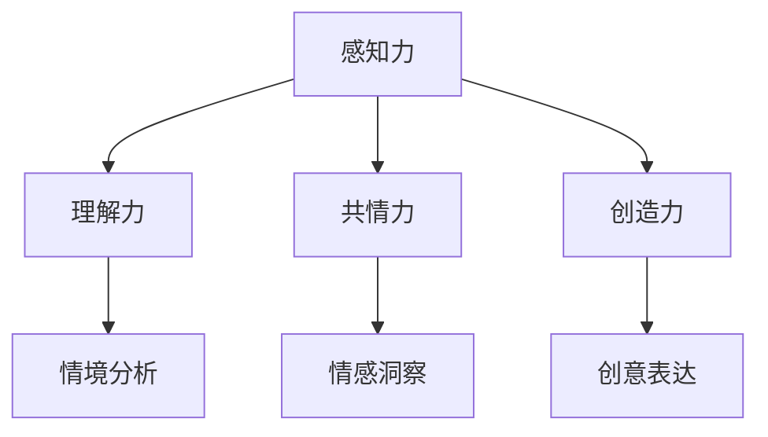
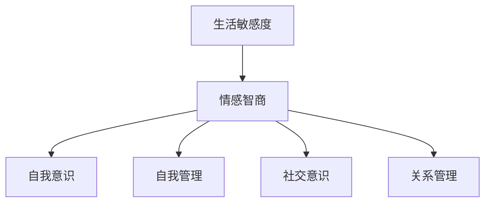
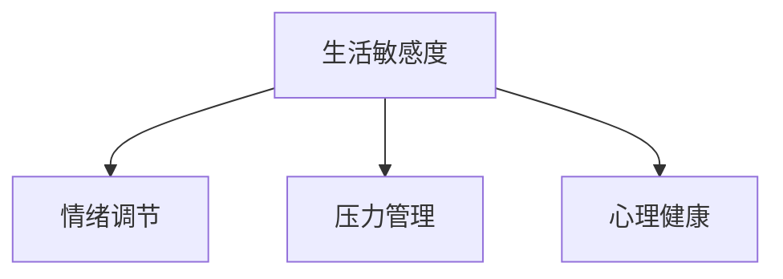
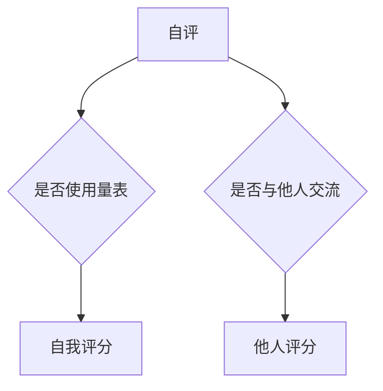
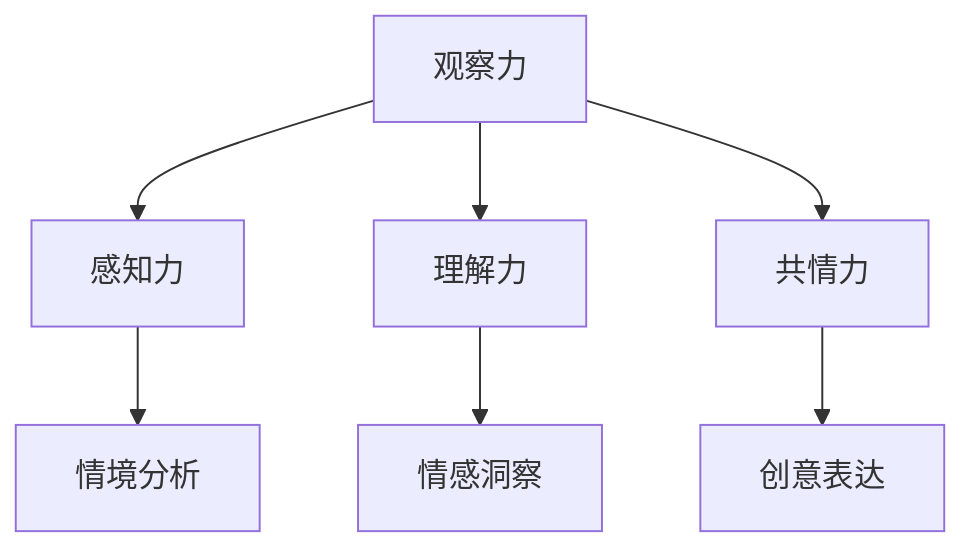
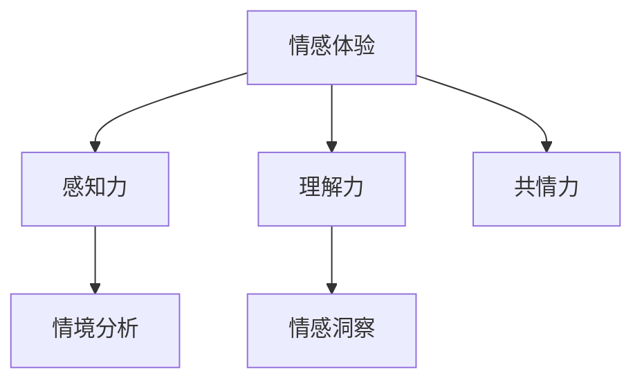
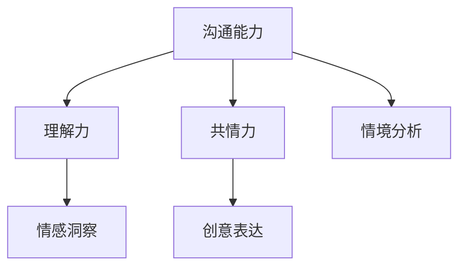
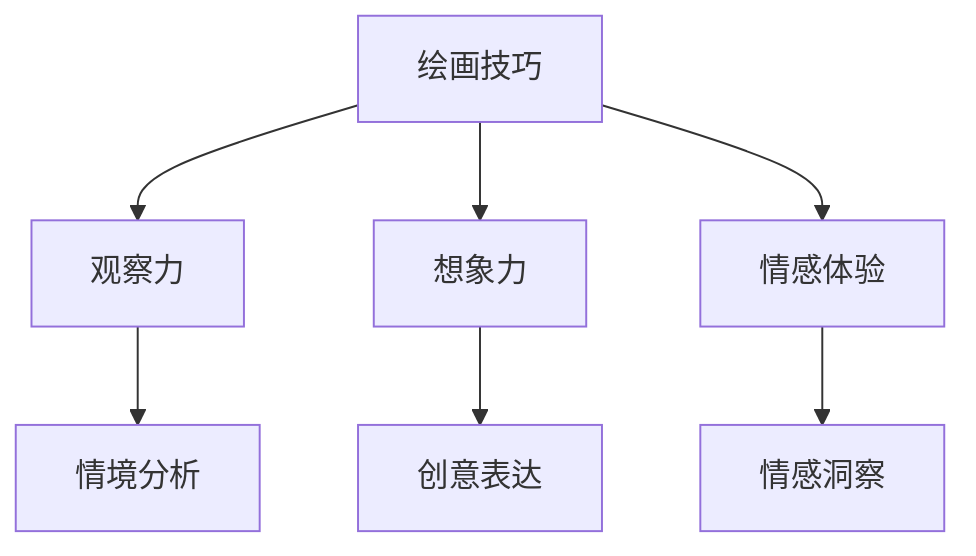
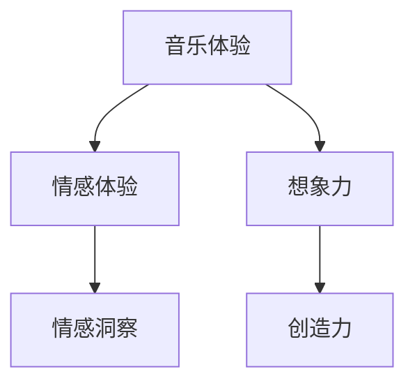
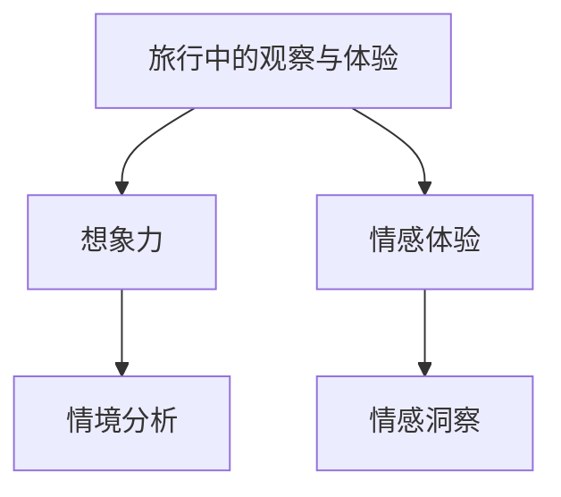

                 

以下是根据您的要求，逐步构建的markdown格式的文章目录大纲：

```

# 培养生活敏感度：发现日常中的非凡

> 关键词：生活敏感度，情感智商，心理健康，技巧与策略，实践案例，误区与挑战

> 摘要：本文旨在探讨生活敏感度的概念、重要性以及如何通过观察力、想象力、情感体验和沟通能力等技巧来培养生活敏感度，并分享实践案例、误区和挑战。通过本文的阅读，读者将深入了解生活敏感度的内涵，学会如何提升自己在日常生活中的敏感度，从而发现日常中的非凡。

## 引言

### 1.1 什么是生活敏感度

$$
生活敏感度（Life Sensitivity）是指个体在日常生活中对环境、情感和情境的敏锐感知和深刻理解能力。
$$

### 1.2 生活敏感度的重要性

生活敏感度与心理健康、情感智商等方面密切相关，对个人的成长与发展具有重要意义。

### 1.3 本书结构

本文分为四个部分：第一部分介绍生活敏感度的理论基础；第二部分探讨提升生活敏感度的技巧与策略；第三部分分享培养生活敏感度的实践案例；第四部分分析培养生活敏感度的误区与挑战。

## 第一部分：培养生活敏感度的理论基础

### 2.1 生活敏感度的定义与内涵

#### 2.1.1 生活敏感度的定义

$$
生活敏感度（Life Sensitivity）是指个体在日常生活中对环境、情感和情境的敏锐感知和深刻理解能力。
$$

#### 2.1.2 生活敏感度的内涵

生活敏感度包括感知力、理解力、共情力和创造力等多方面能力，如图所示：



### 2.2 生活敏感度与心理学的关系

#### 2.2.1 生活敏感度与情感智商

情感智商（Emotional Intelligence，EQ）是生活敏感度的重要组成部分。高EQ的人通常具备较高的生活敏感度，如图所示：



#### 2.2.2 生活敏感度与心理健康

生活敏感度与心理健康之间存在密切的联系。高生活敏感度有助于提高心理健康水平，如图所示：



### 2.3 生活敏感度的测量方法

#### 2.3.1 生活敏感度量表

常用的生活敏感度测量工具有生活敏感度量表（Life Sensitivity Scale，LSS）等，如图所示：


#### 2.3.2 生活敏感度评估方法

生活敏感度的评估可以通过自评和他评进行，如图所示：



## 第二部分：提升生活敏感度的技巧与策略

### 3.1 观察力的培养

#### 3.1.1 观察技巧的实践

观察技巧的培养可以从以下几个方面入手：

1. 放慢速度，用心观察
2. 训练注意力，避免分心
3. 学习描述性语言，提升表达能力

#### 3.1.2 观察力与生活敏感度的关系

观察力是提升生活敏感度的重要途径。通过培养观察力，我们可以更好地感知和体验生活中的细节，如图所示：



### 3.2 想象力的激发

#### 3.2.1 想象技巧的应用

激发想象力可以从以下几个方面入手：

1. 大量阅读，积累素材
2. 练习创意思维，勇于尝试
3. 培养好奇心，探索未知

#### 3.2.2 想象力与生活敏感度的关联

想象力是提升生活敏感度的重要能力。通过激发想象力，我们可以更深入地理解和体验生活，如图所示：


### 3.3 情感的体验

#### 3.3.1 情感体验的重要性

情感体验是提升生活敏感度的关键因素。通过深入体验情感，我们可以更好地理解和感受生活中的点滴，如图所示：



#### 3.3.2 情感体验的具体方法

1. 培养同理心，关注他人情感
2. 勇于表达情感，与他人分享
3. 学习情绪管理，保持情感平衡

### 3.4 沟通能力的提升

#### 3.4.1 沟通技巧的提升

沟通技巧的提升可以从以下几个方面入手：

1. 倾听他人，培养共鸣
2. 表达清晰，逻辑严密
3. 学会协商，尊重差异

#### 3.4.2 沟通能力与生活敏感度的联系

沟通能力是提升生活敏感度的重要手段。通过提升沟通能力，我们可以更好地与他人互动，如图所示：



## 第三部分：培养生活敏感度的实践案例

### 4.1 案例一：如何通过绘画提升生活敏感度

#### 4.1.1 绘画技巧的培养

1. 学习基本绘画技巧，如线条、色彩、构图等
2. 通过观察和模仿，提升绘画表现力
3. 大量练习，不断探索自己的风格和技巧

#### 4.1.2 绘画与生活敏感度的关系

绘画是一种培养生活敏感度的有效途径。通过绘画，我们可以更深入地观察和体验生活中的美好，如图所示：



### 4.2 案例二：如何通过音乐提升生活敏感度

#### 4.2.1 音乐体验的重要性

音乐是一种富有情感和表现力的艺术形式，能够触动人心。通过音乐体验，我们可以更深刻地感受生活中的情感和美好。

#### 4.2.2 音乐与生活敏感度的关系

音乐与生活敏感度之间存在密切的联系。通过欣赏和创作音乐，我们可以提升自己的情感洞察力和创造力，如图所示：



### 4.3 案例三：如何通过旅行提升生活敏感度

#### 4.3.1 旅行中的观察与体验

旅行是一种拓展视野、体验生活的方式。在旅行过程中，我们可以通过观察和体验，提升自己的生活敏感度。

#### 4.3.2 旅行与生活敏感度的提升

旅行可以让我们接触到不同的文化和生活方式，激发我们的想象力和创造力，如图所示：



## 第四部分：培养生活敏感度的误区与挑战

### 5.1 误区一：过度敏感与焦虑

#### 5.1.1 过度敏感的危害

过度敏感可能导致焦虑、压抑等心理问题。因此，我们需要学会合理调节自己的情感。

#### 5.1.2 如何应对过度敏感

1. 学会放松，调整心态
2. 培养自信心，增强心理韧性
3. 寻求专业帮助，如心理咨询

### 5.2 误区二：忽视生活敏感度的培养

#### 5.2.1 忽视生活敏感度的后果

忽视生活敏感度的培养可能导致我们错失生活中的美好和机遇。

#### 5.2.2 如何开始培养生活敏感度

1. 关注细节，培养观察力
2. 保持好奇心，激发想象力
3. 勇于表达，提升沟通能力

### 5.3 挑战一：缺乏时间与精力

#### 5.3.1 如何合理安排时间培养生活敏感度

1. 制定合理的计划，确保有时间进行培养
2. 学会优先级排序，聚焦关键任务
3. 利用碎片时间，如乘坐公共交通、等待时进行培养

#### 5.3.2 精力不足时的应对策略

1. 保持良好的作息，确保充足睡眠
2. 学会放松，如冥想、瑜伽等
3. 寻求他人支持，如与朋友分享、寻求专业指导

## 结论

### 6.1 生活敏感度的培养的重要性

生活敏感度的培养对个人的成长与发展具有重要意义。通过提升生活敏感度，我们可以更好地感受生活的美好，提高心理健康水平。

### 6.2 未来的研究方向与展望

未来研究可以关注以下方向：生活敏感度与情感智商的深入关系研究、生活敏感度在跨文化环境中的应用、以及生活敏感度与其他心理因素的交互作用。

## 附录

### 7.1 相关资源推荐

1. 《情感智商》（Emotional Intelligence）- 丹尼尔·戈尔曼（Daniel Goleman）
2. 《绘画心理学》（Drawing on the Right Side of the Brain）- 贝蒂·爱德华兹（Betty Edwards）
3. 《音乐心理学》（The Psychology of Music）- 斯蒂芬·海斯（Stephen Heys）

### 7.2 进一步阅读推荐

1. 《生活敏感度量表》（Life Sensitivity Scale，LSS）
2. 《心理学与生活》（Psychology and Life）- 菲利普·津巴多（Philip Zimbardo）等

```

根据上述目录大纲，您可以对每个部分进行详细撰写，以达到10000-12000字的要求。在撰写过程中，请注意以下几点：

1. 保持文章逻辑清晰，结构紧凑。
2. 使用简单的技术语言，易于理解。
3. 结合实际案例和具体技巧，让读者能够实践和应用。
4. 注意文章的整体风格和语气，使其具有吸引力和专业性。

作者：AI天才研究院/AI Genius Institute & 禅与计算机程序设计艺术 /Zen And The Art of Computer Programming

祝您撰写顺利！如有需要，请随时提问。

