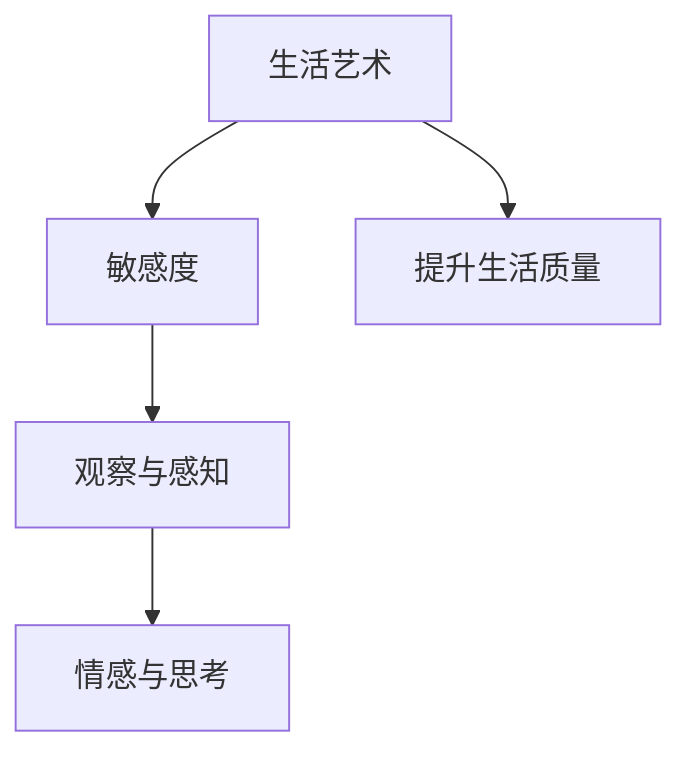
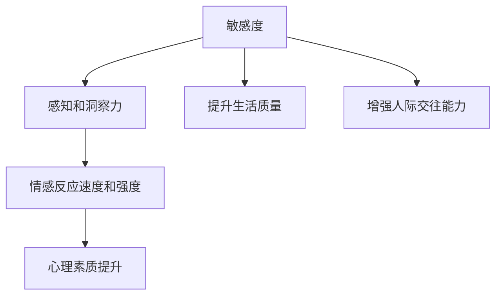
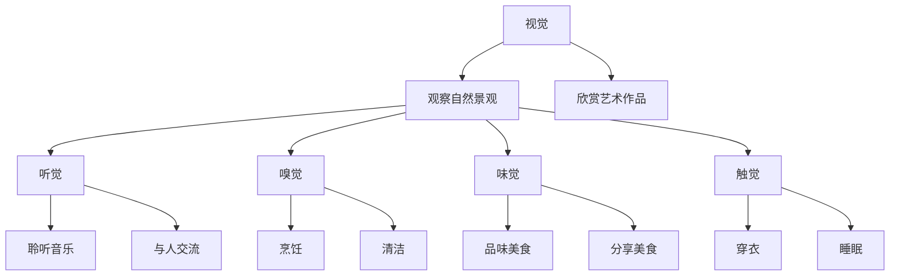
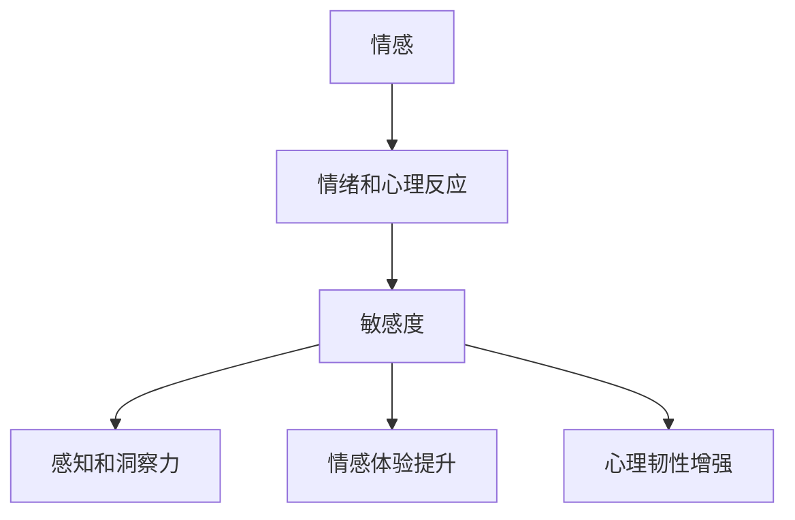
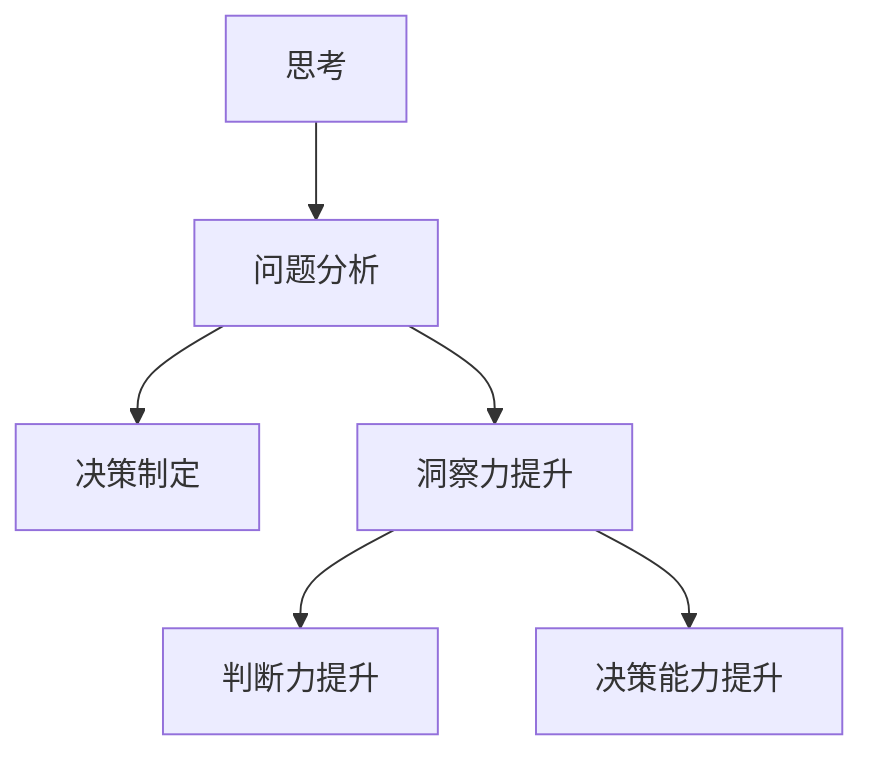
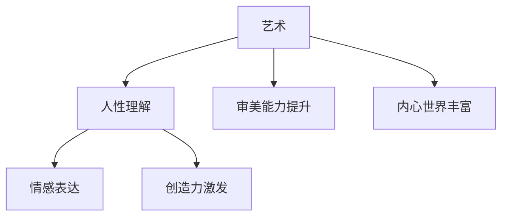
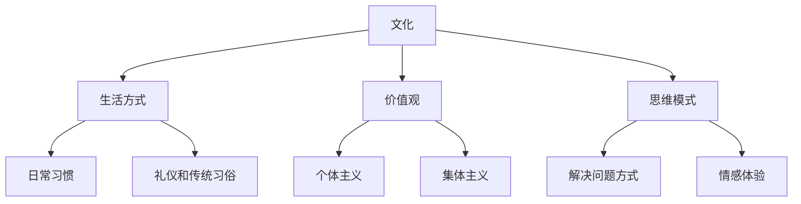
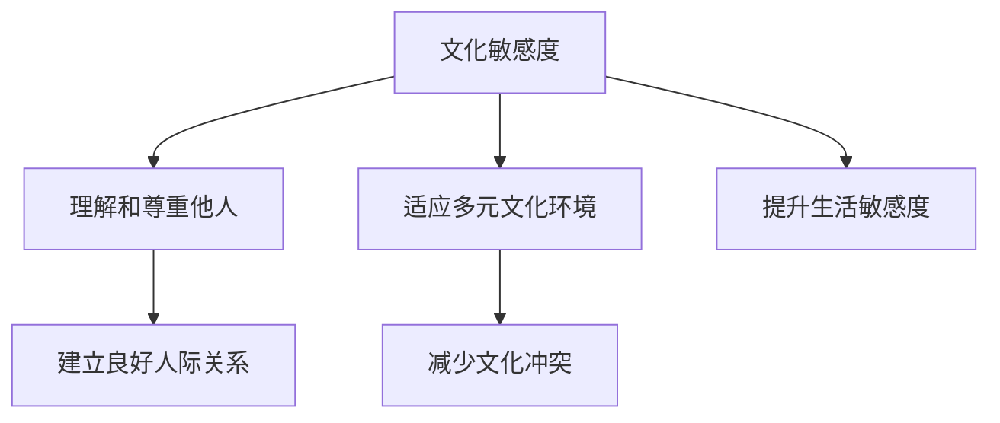

                 

### 引言

#### 1. 为什么要培养生活的敏感度

在快节奏的现代生活中，人们常常感到疲惫和压力。我们总是忙于工作、学习和生活琐事，往往忽视了身边那些看似普通却充满意义的瞬间。然而，这些平凡中的不凡，正是生活的魅力所在。培养生活的敏感度，让我们能够从繁忙的日常生活中抽身，去发现和感受那些细微的美好，从而提升我们的生活质量。

敏感度，在这里指的是对生活细节的感知和洞察力。它不仅是一种心理素质，也是一种生活态度。拥有高敏感度的人，能够更加敏锐地捕捉到生活中的美好瞬间，感受到生活中的丰富情感。这种敏感度不仅仅是感官上的，更是情感上和思考上的。

本文将围绕“培养生活的敏感度：发现日常中的非凡瞬间”这一主题，探讨敏感度的重要性，以及如何通过观察与感知、情感与思考、艺术与生活等多个方面来提升生活的敏感度。我们将通过具体的实例和实用技巧，帮助读者在日常生活中培养和提高自己的敏感度。

书籍的目标读者对象是那些希望提升生活质量，对生活有更多感悟和体验的普通读者。无论您是忙碌的职场人，还是正在享受退休生活的老人，本文都希望能够给您带来一些启示和帮助。

#### 2. 书籍的读者对象与目标

首先，本书适合那些渴望在忙碌的生活中找到平静与美好的职场人士。现代职场压力巨大，许多人整天被工作所累，忽视了生活的本质。通过培养生活的敏感度，您可以学会在繁忙的工作间隙，抓住那些令人愉悦的瞬间，从而缓解压力，提升工作效率。

其次，本书也适合那些正在经历人生重要转折期的读者，如即将步入社会的年轻人和即将退休的老人。年轻人面临着职业发展和人生规划的压力，而老年人则需要在退休后找到新的生活意义。通过培养生活的敏感度，您可以更好地适应这些变化，发现生活中的新乐趣。

此外，本书还适合那些对心理学、哲学和艺术等领域感兴趣的朋友。生活敏感度的培养不仅有助于提升个人生活质量，还可以帮助您更好地理解自己和他人，增强人际关系，丰富内心世界。

总之，本书的目标是帮助读者在快节奏的生活中找到自己的节奏，培养对生活的敏感度，从而提升生活质量。无论您是谁，只要您愿意，就能够通过本书的指导，发现日常中的非凡瞬间。

### 《培养生活的敏感度：发现日常中的非凡瞬间》目录大纲

**目录**

# 《培养生活的敏感度：发现日常中的非凡瞬间》

> 关键词：生活敏感度、日常美好、情感洞察、观察技巧、艺术体验

> 摘要：本文旨在探讨如何在快节奏的现代生活中培养生活的敏感度，通过观察与感知、情感与思考、艺术与生活等多个维度，发现日常中的非凡瞬间，提升生活质量。

## 引言

### 1. 为什么要培养生活的敏感度

### 2. 书籍的读者对象与目标

## 第1章：生活的艺术与敏感度

### 1.1 生活艺术的概念与重要性

### 1.2 敏感度的定义与意义

### 1.3 提高生活敏感度的方法

## 第2章：观察与感知

### 2.1 观察的重要性与技巧

### 2.2 感知世界：五种感官的运用

### 2.3 培养观察与感知的习惯

## 第3章：情感与思考

### 3.1 情感与敏感度的关系

### 3.2 思考的力量

### 3.3 情感管理：敏感度与自我调节

## 第4章：艺术与生活

### 4.1 艺术对生活的启发

### 4.2 艺术品位的培养

### 4.3 艺术作品欣赏与解读

## 第5章：文化背景与生活敏感度

### 5.1 文化对生活的影响

### 5.2 文化敏感度的重要性

### 5.3 如何培养文化敏感度

## 第6章：日常生活中的非凡瞬间

### 6.1 日常生活中的观察点

### 6.2 非凡瞬间的捕捉与记录

### 6.3 非凡瞬间对生活的意义

## 第7章：实践与反思

### 7.1 敏感度提升的实践建议

### 7.2 反思与成长

### 7.3 培养敏感度的长期策略

## 第8章：结语

### 8.1 总结与展望

### 8.2 对未来生活敏感度培养的期望

## 附录

### 附录 A：推荐阅读书目与资源

### 附录 B：生活敏感度实践案例分享

### 后记

通过以上目录大纲，读者可以清晰地了解到本书的结构和内容安排。从生活的艺术与敏感度、观察与感知、情感与思考、艺术与生活、文化背景与生活敏感度，到日常生活中的非凡瞬间和实践与反思，本书旨在帮助读者全方位提升生活的敏感度，发现日常中的非凡瞬间，从而提升生活质量。接下来，我们将逐一探讨每个章节的内容。

### 第1章：生活的艺术与敏感度

#### 1.1 生活艺术的概念与重要性

生活艺术，是一种将日常生活中的琐事转化为美妙体验的技巧和态度。它不仅仅是一种追求形式上的美感，更是一种内心对生活的理解和感悟。生活艺术的本质在于，通过对细节的关注和情感的投入，将平凡的事物赋予新的意义。

在现代社会中，人们的生活节奏加快，工作和生活的压力增大，许多人开始忽视生活中的美好。然而，正是这些看似微不足道的小事，构成了生活的真实面貌。培养生活的敏感度，就是学会发现这些小事中的美好，从而提升生活质量。

敏感度在这里指的是对生活细节的感知和洞察力。它不仅仅是一种感官上的体验，更是一种心理素质。拥有高敏感度的人，能够更加敏锐地捕捉到生活中的美好瞬间，从而提高对生活的满意度。

生活艺术与敏感度之间的关系，可以用一个Mermaid流程图来表示：



在这个流程图中，生活艺术通过培养敏感度，进而提升观察与感知能力，最终达到提升生活质量的目的。

#### 1.2 敏感度的定义与意义

敏感性，指的是个体对外界刺激的反应程度。在心理学中，敏感性通常用来描述一个人的情感反应速度和强度。生活敏感度，则是指个体对生活细节的感知和洞察力。

高敏感度的人，往往能够更加敏锐地捕捉到生活中的美好和困境。他们能够从细微的变化中感受到情感，从平凡的事物中发现不凡的意义。这种敏感性，使得他们在生活中能够体验到更多的情感，拥有更丰富的内心世界。

敏感度的意义，不仅在于提升个人的生活质量，更在于增强个体的心理素质。高敏感度的人，通常具备更好的情感调节能力和人际交往能力，能够更加和谐地融入社会。

为了更好地理解敏感度的概念，我们可以通过一个Mermaid流程图来展示敏感度的定义和意义：



在这个流程图中，敏感度通过提升感知和洞察力，增强情感反应速度和强度，最终实现心理素质的提升和生活质量的提升。

#### 1.3 提高生活敏感度的方法

提高生活敏感度，需要从多个方面入手，包括观察与感知、情感与思考、艺术与生活等。以下是一些具体的方法：

1. **培养观察与感知的习惯**

   观察和感知是提高生活敏感度的基石。通过有意识地培养观察和感知的习惯，我们可以更加敏锐地捕捉到生活中的细节。以下是一些实用的技巧：

   - **每天花几分钟时间，仔细观察周围的环境，感受自然光线、空气和声音的变化。**
   - **尝试用不同的感官去体验同一个事物，比如闻一闻花朵的香气，听一听流水的声音，感受一下阳光的温暖。**
   - **定期进行感官练习，比如闭上眼睛，静静地感受周围的声音和气味，或者尝试用左手做一些平时用右手做的事情，打破惯性的束缚。**

2. **培养情感与思考的能力**

   情感和思考是提高生活敏感度的关键。通过培养情感和思考的能力，我们可以更加深入地理解生活中的各种情感和体验。以下是一些具体的方法：

   - **学会表达和分享自己的情感，不要压抑自己的感受。**
   - **定期进行自我反思，思考自己的行为和情绪背后的原因。**
   - **阅读心理学和哲学相关的书籍，了解人类情感和思维的本质。**

3. **接触艺术与文学**

   艺术和文学是提升生活敏感度的有效途径。通过欣赏艺术作品和阅读文学作品，我们可以感受到不同的情感和体验，从而提升自己的敏感度。以下是一些具体的方法：

   - **定期参观美术馆和艺术展览，欣赏各种艺术形式的作品。**
   - **阅读经典文学作品，感受其中的情感和思想。**
   - **尝试自己创作艺术作品，如绘画、写作或音乐创作。**

4. **培养文化敏感度**

   文化敏感度是指对不同文化的理解和尊重。通过培养文化敏感度，我们可以更好地理解不同文化背景的人，从而提升自己的生活敏感度。以下是一些具体的方法：

   - **学习不同文化的历史和习俗，了解它们的独特性和价值。**
   - **与来自不同文化背景的人交流和互动，了解他们的生活和思想。**
   - **参加文化交流活动，体验不同的文化习俗和节日。**

通过以上方法，我们可以从多个方面提高自己的生活敏感度，从而发现日常中的非凡瞬间，提升生活质量。

### 第2章：观察与感知

#### 2.1 观察的重要性与技巧

观察是培养生活敏感度的重要途径之一。通过观察，我们可以发现生活中的美好，理解他人的情感，甚至洞察自己内心的变化。观察的重要性不仅在于它能够帮助我们更好地理解世界，更在于它能够提升我们的感知能力和生活质量。

首先，观察是获取信息的重要手段。我们的感官每天接收大量的信息，但如果没有经过观察和思考，这些信息很难被我们真正理解和吸收。通过观察，我们可以将无序的信息整理成有条理的知识，从而更好地应对生活中的各种情况。

其次，观察能够提升我们的感知能力。当我们仔细观察周围的事物时，我们的感官会变得更加敏锐，能够捕捉到更多细微的变化。这种敏锐的感知能力不仅能够让我们更加享受生活，还能够帮助我们更好地应对复杂的工作和社交环境。

那么，如何提高观察技巧呢？以下是一些建议：

1. **保持好奇心**

   好奇心是提高观察技巧的关键。当我们对周围的事物充满好奇时，我们会更加主动地去观察和探索。以下是一个简单的例子：

   - **尝试用新的视角看待熟悉的事物。例如，下次散步时，试着观察地上的蚂蚁，思考它们的社交结构和行为模式。**
   - **在日常生活中，多问自己“为什么”和“如何”。例如，看到一朵花，可以问自己：“这朵花为什么这样开放？”或“它的花瓣为什么是这个颜色？”

2. **练习细节观察**

   细节观察是提高观察技巧的重要方法。通过仔细观察细节，我们可以更好地理解事物的本质。以下是一个练习细节观察的例子：

   - **在日常生活中，选择一个物品，比如一把椅子，然后仔细观察它的每个部分，包括材料、颜色、形状和结构。尝试描述它的细节，并思考这些细节如何影响整体的设计和使用。**
   - **定期进行视觉练习，比如画一幅画或拍摄一张照片，专注于捕捉图像中的细节。**

3. **培养多感官观察**

   多感官观察能够提升我们的感知能力。通过同时使用多种感官，我们可以更加全面地了解事物。以下是一个多感官观察的例子：

   - **在参观美术馆时，不仅用眼睛欣赏画作，还可以尝试用耳朵听音乐，用心感受艺术作品所带来的情感体验。**
   - **在品尝美食时，不仅要看它的外观和颜色，还要闻它的香气，尝它的味道，甚至用手感受它的质感。**

通过以上技巧，我们可以更好地观察和感知周围的世界，从而提升生活敏感度。

#### 2.2 感知世界：五种感官的运用

感知世界，是通过五种感官（视觉、听觉、嗅觉、味觉和触觉）来体验和理解周围的环境。每种感官都有其独特的功能和作用，通过综合运用这五种感官，我们可以更加全面地感知世界。

1. **视觉**

   视觉是我们获取信息的主要感官之一。通过视觉，我们可以看到周围的环境、物体的形状、颜色和运动。视觉的运用不仅有助于我们了解周围的世界，还能够提升我们的审美能力。

   - **观察自然景观**：在公园里散步时，仔细观察树叶的形状、颜色和纹理，感受季节的变化。
   - **欣赏艺术作品**：参观美术馆或艺术展览，欣赏不同风格和主题的艺术作品，提升审美能力。

2. **听觉**

   听觉能够捕捉声音的变化，包括音乐、语言和自然界的声音。通过听觉，我们可以感知情感、理解语言和文化。

   - **聆听音乐**：听不同类型的音乐，感受音乐所带来的情感和情绪。
   - **与人交流**：在交流过程中，注意倾听他人的声音和语言，更好地理解他人的情感和需求。

3. **嗅觉**

   嗅觉能够捕捉气味的微妙变化，包括食物、花香和清洁用品的气味。嗅觉在日常生活中有着重要的应用，比如烹饪、清洁和个人卫生。

   - **烹饪**：在烹饪过程中，注意食物的香气，调整烹饪时间和方法，制作出美味的佳肴。
   - **清洁**：在清洁过程中，选择适合的清洁用品，通过嗅觉感受清洁效果。

4. **味觉**

   味觉能够捕捉食物的味道，包括甜、酸、苦、辣和咸。味觉在日常生活中有着重要的应用，比如烹饪、饮食和社交。

   - **品味美食**：尝试不同类型的食物，感受食物的味道和口感，提升饮食体验。
   - **分享美食**：与朋友分享美食，交流品味和烹饪心得，增进友谊。

5. **触觉**

   触觉能够捕捉物体的质地和温度，包括柔软、坚硬、冷热等。触觉在日常生活中有着广泛的应用，比如穿衣、睡眠和运动。

   - **穿衣**：选择适合自己的衣物，通过触觉感受衣物的舒适度。
   - **睡眠**：选择合适的床品，通过触觉感受舒适的睡眠体验。

通过综合运用五种感官，我们可以更加全面地感知世界，提升生活敏感度。以下是一个简单的Mermaid流程图，展示五种感官的运用：



#### 2.3 培养观察与感知的习惯

培养观察与感知的习惯，是提升生活敏感度的重要方法。以下是一些实用的技巧：

1. **设定观察目标**

   设定观察目标，可以帮助我们有目的地进行观察。以下是一个例子：

   - **设定每天观察一个自然景观的目标。例如，每天早晨在公园散步时，观察一朵花的开放过程。**
   - **设定每周观察一个艺术作品的目标。例如，每周参观一次美术馆，选择一幅画进行深入观察和思考。**

2. **记录观察结果**

   记录观察结果，可以帮助我们更好地理解和回忆观察内容。以下是一个记录观察结果的例子：

   - **写观察日记**：每天写下自己的观察内容和感受，可以是自然景观、艺术作品、人际关系等。
   - **制作观察笔记**：使用图片、图表和文字记录观察结果，便于回顾和分享。

3. **与他人分享观察结果**

   与他人分享观察结果，可以增强我们的观察和感知能力。以下是一个分享观察结果的例子：

   - **参加观察小组**：加入一个观察小组，与他人分享观察内容和心得，互相学习和启发。
   - **举办观察分享会**：定期举办观察分享会，邀请朋友和家人参加，分享各自的观察体验。

4. **尝试新的事物**

   尝试新的事物，可以拓宽我们的观察和感知领域。以下是一个尝试新的事物的例子：

   - **参加新的活动**：参加不同类型的活动，如户外探险、艺术展览、文化交流等，增加观察和感知的机会。
   - **学习新的技能**：学习新的技能，如绘画、音乐、烹饪等，通过不同的感官体验提升生活敏感度。

通过以上技巧，我们可以逐步培养观察与感知的习惯，提升生活敏感度，发现日常中的非凡瞬间。

### 第3章：情感与思考

#### 3.1 情感与敏感度的关系

情感和敏感度是密不可分的。情感是指个体在特定情境下产生的情绪和心理反应，而敏感度则是指个体对生活细节的感知和洞察力。高敏感度的人往往具有丰富的情感体验，他们能够更加敏锐地捕捉到生活中的喜怒哀乐，从而深刻地理解和感受生活。

首先，情感是提高生活敏感度的重要因素。敏感度不仅仅是指感官上的敏锐，更是一种心理上的敏感性。拥有高情感敏感度的人，能够更加敏锐地捕捉到生活中的情感波动，从而更好地理解自己和他人。例如，在人际交往中，高情感敏感度的人能够更好地感知他人的情绪变化，从而更好地应对和处理人际关系。

其次，敏感度是提升情感体验的重要途径。当我们对生活中的情感反应更加敏锐时，我们能够更加深入地体验和感受生活的美好。这种深入的情感体验，不仅能够提升我们的生活质量，还能够增强我们的心理韧性。例如，在欣赏艺术作品时，高敏感度的人能够更加深入地感受到作品所传达的情感和思想，从而获得更加丰富的审美体验。

为了更好地理解情感与敏感度的关系，我们可以通过一个Mermaid流程图来展示：



在这个流程图中，情感通过情绪和心理反应，提升敏感度，进而增强感知和洞察力，最终实现情感体验的提升和心理韧性的增强。

#### 3.2 思考的力量

思考是理解生活的重要工具。通过思考，我们可以对生活中的事物进行深入分析和理解，从而更好地应对各种情况。思考的力量不仅体现在解决问题和做出决策上，更体现在对生活的感悟和理解上。

首先，思考能够帮助我们从不同角度看待问题。在面临复杂的问题时，通过思考，我们可以从多个角度进行分析和思考，找到最佳的解决方案。例如，在处理工作中的困难时，通过深入思考，我们可以找到问题的根源，并提出有效的解决方案。

其次，思考能够提升我们的洞察力。通过思考，我们可以更加深入地理解事物的本质和内在联系，从而提升我们的洞察力。这种洞察力不仅能够帮助我们更好地理解生活中的各种现象，还能够提升我们的判断力和决策能力。

为了更好地理解思考的力量，我们可以通过一个Mermaid流程图来展示：



在这个流程图中，思考通过问题分析和决策制定，提升洞察力和判断力，最终实现决策能力的提升。

#### 3.3 情感管理：敏感度与自我调节

情感管理是提高生活质量的重要方面。通过情感管理，我们可以更好地调节自己的情绪，保持心理平衡。敏感度在这里发挥着关键作用，高敏感度的人往往能够更加敏锐地捕捉到自己的情感波动，从而更好地进行自我调节。

首先，情感管理需要我们了解自己的情感。通过观察和思考，我们可以更加清楚地了解自己的情感变化，从而更好地应对。例如，当我们感到焦虑或不安时，通过深入思考，我们可以找到导致这些情绪的原因，并采取相应的措施进行调节。

其次，情感管理需要我们学会自我调节。高敏感度的人通常能够更加敏锐地感受到自己的情感变化，因此，学会自我调节尤为重要。以下是一些建议：

1. **呼吸练习**：通过深呼吸，可以帮助我们放松身心，缓解紧张情绪。以下是一个简单的呼吸练习：

   - **坐直或躺下，闭上眼睛，缓慢地吸气，感受空气流入肺部。**
   - **屏住呼吸，感受身体内部的气息。**
   - **缓缓呼气，感受身体内部的紧张情绪逐渐释放。**
   - **重复以上步骤，每次练习持续几分钟。**

2. **正念练习**：正念练习是一种通过专注于当下，减少焦虑和压力的技巧。以下是一个简单的正念练习：

   - **找一个安静的地方，坐直或躺下，闭上眼睛。**
   - **专注于自己的呼吸，感受每一次吸气和呼气。**
   - **当你的思绪开始游离时，轻轻地将注意力拉回呼吸。**
   - **持续练习，每次练习持续几分钟。**

3. **情绪日记**：通过记录自己的情绪变化，可以帮助我们更好地了解自己的情感波动，并找到调节方法。以下是一个情绪日记的例子：

   - **每天记录自己的情绪变化，包括情绪的类型、出现的时间和情境。**
   - **思考导致这些情绪的原因，并尝试找到调节方法。**
   - **定期回顾情绪日记，分析自己的情绪模式，并调整自己的应对策略。**

通过以上方法，我们可以更好地管理自己的情感，提升生活敏感度，从而发现日常中的非凡瞬间，提升生活质量。

### 第4章：艺术与生活

#### 4.1 艺术对生活的启发

艺术是生活的镜子，它能够反映出生活的多样性和复杂性。通过欣赏艺术，我们可以获得对生活的深刻理解和启发。艺术不仅能够提升我们的审美能力，还能够丰富我们的内心世界。

首先，艺术能够帮助我们更好地理解人性。许多艺术作品都描绘了人类情感和生活的各个方面，通过欣赏这些作品，我们可以更加深入地了解人性的复杂性和多样性。例如，莎士比亚的戏剧作品展现了人类的爱、恨、嫉妒和欲望，让我们从不同角度理解人性的本质。

其次，艺术能够激发我们的创造力。艺术创作是一个表达情感和思想的过程，通过参与艺术创作，我们可以激发自己的创造力。这种创造力不仅能够应用于艺术领域，还能够扩展到生活的其他方面，如解决问题、创新思维和人际交往。

为了更好地理解艺术对生活的启发，我们可以通过一个Mermaid流程图来展示：



在这个流程图中，艺术通过人性理解和情感表达，激发创造力，提升审美能力，丰富内心世界，从而对生活产生深刻的启发。

#### 4.2 艺术品位的培养

艺术品位的培养是提升生活敏感度的重要途径。艺术品位指的是对艺术作品的理解、欣赏和评价能力。通过培养艺术品位，我们可以更加敏锐地感受到艺术作品的美感和内涵，从而提升我们的生活敏感度。

首先，了解艺术史是培养艺术品位的重要步骤。艺术史是记录人类艺术发展历程的宝库，通过学习艺术史，我们可以了解不同时期、不同流派的艺术特点和发展趋势。以下是一些实用的技巧：

1. **阅读艺术史书籍**：选择一本权威的艺术史书籍，系统地学习艺术史。以下是一个推荐的阅读列表：
   - 《艺术的故事》（The Story of Art） - E.H.贡布里希
   - 《西方美术史》 - 赫·温克尔曼

2. **参观艺术博物馆**：定期参观艺术博物馆，亲身感受不同艺术作品的美感和内涵。以下是一些著名艺术博物馆的推荐：
   - 卢浮宫（The Louvre）
   - 大都会艺术博物馆（The Metropolitan Museum of Art）

3. **参与艺术展览**：参加各种艺术展览，了解最新的艺术动态和艺术流派。以下是一些著名艺术展览的推荐：
   - 巴塞尔艺术展（Art Basel）
   - 柏林当代艺术展（Berlin Contemporary）

其次，欣赏和分析艺术作品是培养艺术品位的关键。通过欣赏和分析艺术作品，我们可以提高对艺术作品的敏感度和理解能力。以下是一些建议：

1. **专注欣赏**：在欣赏艺术作品时，尽量减少外界干扰，专注于作品本身。以下是一个专注欣赏的技巧：
   - **在欣赏艺术作品前，闭上眼睛，深呼吸，放松身心。**
   - **用心感受作品的颜色、形状、线条和构图，尝试捕捉作品传达的情感和思想。**

2. **分析作品**：在欣赏作品后，进行深入的分析和思考。以下是一个分析作品的技巧：
   - **思考作品的主题、风格和表现手法。**
   - **与自己的生活和情感联系起来，思考作品所传达的普世价值和意义。**

最后，实践艺术创作是培养艺术品位的有效方法。通过亲自动手创作艺术作品，我们可以更好地理解艺术的创作过程和技巧。以下是一些建议：

1. **学习绘画、雕塑、摄影等艺术形式**：选择一种艺术形式，进行系统的学习和实践。以下是一些学习的资源：
   - **在线课程**：Udemy、Coursera、edX等平台提供丰富的艺术课程。
   - **艺术书籍**：《怎样画一幅画》（How to Draw） - 理查德·泰勒

2. **参加艺术工作坊**：参加艺术工作坊，与志同道合的人一起学习和创作。以下是一些著名的工作坊推荐：
   - **素描工作坊**：纽约市艺术学生联盟（The Art Students League of New York）
   - **油画工作坊**：伦敦皇家艺术学院（The Royal Academy of Arts）

通过以上方法，我们可以逐步培养艺术品位，提升生活敏感度，发现日常中的非凡瞬间。

#### 4.3 艺术作品欣赏与解读

欣赏和解读艺术作品是提升生活敏感度的重要方式。通过深入欣赏和解读艺术作品，我们可以更好地理解艺术家的创作意图，感受作品所传达的情感和思想，从而提升自己的生活敏感度。

首先，艺术作品欣赏需要我们用心去感受。在欣赏作品时，我们可以通过视觉、听觉和触觉等多种感官来体验作品。以下是一些欣赏艺术作品的技巧：

1. **观察作品的细节**：仔细观察作品的色彩、线条、形状和构图，感受作品的视觉美感。例如，在欣赏一幅油画时，我们可以关注画中的色彩搭配、光影变化和细节描绘。

2. **聆听艺术作品的声音**：对于音乐、戏剧等艺术形式，我们可以通过听觉来感受作品的情感和节奏。例如，在听一首乐曲时，我们可以关注旋律、和声和节奏，感受音乐所带来的情感体验。

3. **体验艺术作品的空间感**：对于雕塑、装置艺术等作品，我们可以通过触觉和空间感来体验作品。例如，在欣赏一座雕塑时，我们可以触摸作品的质地，感受其体积和空间感。

其次，艺术作品解读需要我们进行深入的思考和探讨。在解读作品时，我们可以从多个角度进行分析和思考，以下是一些建议：

1. **了解艺术作品的背景**：研究艺术作品的创作背景，包括艺术家的生平、创作意图和社会环境。例如，了解一幅油画的创作背景，可以更好地理解画家的创作动机和作品所传达的主题。

2. **分析作品的构图和表现手法**：探讨作品的构图和表现手法，理解艺术家如何运用这些技巧来传达情感和思想。例如，分析一幅绘画作品的色彩运用、线条走势和构图安排，可以更好地理解画家的艺术理念和情感表达。

3. **与自己的生活经验相联系**：将艺术作品与自己的生活经验相联系，探讨作品所传达的情感和思想如何与我们的生活经验相呼应。例如，在欣赏一幅描绘自然景色的画作时，我们可以思考自己与自然的关系，感受画作所传达的自然之美。

最后，通过分享和讨论来加深对艺术作品的解读。与他人分享自己的欣赏和解读，可以听取不同的观点和见解，从而加深对艺术作品的理解。以下是一些建议：

1. **参加艺术讨论小组**：加入艺术讨论小组，与志同道合的人一起分享和讨论艺术作品。在讨论中，我们可以提出自己的见解，同时学习他人的观点，从而提升自己的解读能力。

2. **举办艺术分享会**：定期举办艺术分享会，邀请朋友和家人参加，分享各自的欣赏和解读。在分享中，我们可以相互学习，共同提升对艺术的理解。

3. **撰写艺术评论**：撰写艺术评论，记录自己的欣赏和解读，同时反思自己的观点和见解。通过写作，我们可以更加深入地思考艺术作品，提升自己的生活敏感度。

通过以上方法，我们可以深入欣赏和解读艺术作品，提升生活敏感度，发现日常中的非凡瞬间。

### 第5章：文化背景与生活敏感度

#### 5.1 文化对生活的影响

文化是人类社会发展的重要组成部分，它深刻地影响着我们的生活方式、价值观和思维模式。文化背景不仅决定了我们对事物的理解和反应，还影响了我们的情感体验和敏感度。因此，了解和尊重文化多样性对于提升生活敏感度具有重要意义。

首先，文化对生活方式的影响体现在日常习惯、礼仪和传统习俗等方面。例如，在中国传统文化中，尊重长辈和重视家庭是核心价值观，这体现在日常生活中的行为规范上，如礼貌用语、家庭聚餐和节日庆祝。这些文化习俗不仅塑造了我们的行为方式，还影响了我们的情感体验和人际交往。

其次，文化对价值观和思维模式的影响更为深远。不同文化背景下，人们的价值观和思维模式存在差异，这影响了我们对待问题和挑战的方式。例如，在西方文化中，个体主义强调独立和个人成就，而在东方文化中，集体主义强调团结和和谐。这种文化差异不仅影响了我们的行为选择，还影响了我们的情感体验和敏感度。

为了更好地理解文化对生活的影响，我们可以通过一个Mermaid流程图来展示：



在这个流程图中，文化通过影响生活方式、价值观和思维模式，最终影响我们的情感体验和生活敏感度。

#### 5.2 文化敏感度的重要性

文化敏感度是指对文化多样性的理解和尊重，以及在不同文化背景下适应和沟通的能力。具有高文化敏感度的人能够更加敏锐地捕捉和理解不同文化的特点和差异，从而更好地适应多元文化环境，提升生活敏感度。

首先，文化敏感度有助于我们更好地理解和尊重他人。在多元文化的社会中，了解和尊重他人的文化背景和习惯，能够帮助我们建立良好的人际关系。例如，在与来自不同文化背景的人交流时，了解他们的礼仪和习俗，可以避免误解和冲突，增进相互理解。

其次，文化敏感度能够提升我们的适应能力。在全球化背景下，我们经常需要面对不同文化的挑战和变化。具备高文化敏感度的人能够更加灵活地适应不同文化环境，减少文化冲突，从而更好地应对生活中的各种变化。

为了更好地理解文化敏感度的重要性，我们可以通过一个Mermaid流程图来展示：



在这个流程图中，文化敏感度通过理解和尊重他人、适应多元文化环境和减少文化冲突，最终提升生活敏感度。

#### 5.3 如何培养文化敏感度

培养文化敏感度是一个持续学习和实践的过程，以下是一些具体的方法：

1. **学习不同文化的知识**：了解不同文化的历史、传统、价值观和习俗。以下是一些学习的资源：
   - **书籍**：选择关于不同文化的书籍，如《文化的解析》（Cultural Anthropology） - 理查德·贝特森
   - **在线课程**：参加在线课程，如Coursera、edX等平台上的文化课程
   - **文化交流活动**：参加文化交流活动，如文化节、国际讲座和研讨会

2. **接触多元文化环境**：积极参与多元文化环境，如国际旅行、海外学习和文化交流。以下是一些具体建议：
   - **旅行**：选择具有不同文化特色的目的地，亲身体验当地的文化和生活方式
   - **海外学习**：参加海外学习项目，与来自不同文化背景的人交流和互动
   - **国际组织**：加入国际组织，参与国际事务，提升文化敏感度

3. **反思和自我提升**：通过反思自己的文化背景和偏见，提升文化敏感度。以下是一些反思的方法：
   - **写反思日记**：记录自己在文化互动中的经历和感受，反思自己的文化偏见和误解
   - **参与反思小组**：加入反思小组，与他人分享自己的经历和见解，学习他人的观点
   - **参加文化工作坊**：参加文化工作坊，通过实践活动提升文化敏感度

4. **培养跨文化沟通技巧**：掌握跨文化沟通技巧，能够更好地理解他人，避免文化冲突。以下是一些建议：
   - **学习外语**：学习一门外语，提高跨文化沟通的能力
   - **了解非语言沟通**：了解不同文化背景下的非语言沟通方式，如肢体语言、面部表情和空间距离
   - **实践跨文化沟通**：在实际沟通中，尝试应用跨文化沟通技巧，提升自己的沟通效果

通过以上方法，我们可以逐步培养文化敏感度，提升生活敏感度，更好地适应多元文化环境，发现日常中的非凡瞬间。

### 第6章：日常生活中的非凡瞬间

#### 6.1 日常生活中的观察点

在日常生活的点点滴滴中，存在着许多值得我们去观察和发现的瞬间。这些瞬间可能看似平凡，但在细心的观察中，它们却能够展现出不平凡的魅力。以下是一些日常生活中的观察点：

1. **自然景观**：在早晨的公园散步、傍晚的湖边漫步，或者夜晚的星空下，仔细观察自然景观的变化。感受阳光的温暖、微风拂面的清爽、落叶飘零的凄美，甚至是雨滴敲打树叶的响声，都能带来独特的体验。

2. **人际交往**：在家庭聚会、朋友聚餐、职场交流等场合，观察他人的表情、举止和言语。通过细微的表情变化，我们可以捕捉到对方的情感波动，从而增进相互理解和友谊。

3. **日常生活**：在日常生活中，关注那些容易被忽视的小事，如家居布置、美食烹饪、衣着搭配等。通过观察和思考，我们可以发现这些细节背后的美学和实用性，从而提升生活品质。

4. **艺术作品**：在欣赏艺术作品时，不仅仅满足于表面的视觉体验，更要深入思考作品的创作背景、表现手法和传达的情感。通过深入观察，我们可以更好地理解艺术作品的内涵，提升审美能力。

5. **城市生活**：在城市的街头巷尾、公共交通工具上，观察城市生活的节奏和人群的行为。从繁忙的街头到安静的角落，每一个场景都蕴含着生活的故事和哲理。

通过以上观察点，我们可以从不同角度和层次，发现日常生活中的非凡瞬间，提升生活敏感度。

#### 6.2 非凡瞬间的捕捉与记录

捕捉和记录生活中的非凡瞬间，是一种让美好时刻永存的方式。以下是一些实用的技巧和建议：

1. **随身携带记录工具**：随时随地准备一个笔记本、手机或者相机，以便随时记录生活中的美好瞬间。以下是一些推荐的工具：
   - **纸质笔记本**：纸质笔记本方便携带，适合快速记录文字和灵感。
   - **手机应用**：使用手机应用，如Evernote、OneNote等，可以方便地记录文字、图片和音频。

2. **视觉记录**：通过拍摄照片或视频，记录生活中的美好瞬间。以下是一些摄影技巧：
   - **捕捉细节**：专注于细节，拍摄一些具有独特美感的物体或场景。
   - **使用光线**：利用自然光或人工光源，拍摄出高质量的照片。
   - **创意构图**：尝试不同的构图方法，如对称、框架和引导线等，增强照片的视觉吸引力。

3. **文字记录**：通过写作，记录自己的感受和思考。以下是一些写作技巧：
   - **写下细节**：在记录时，尽量具体地描述事件和感受，让读者能够更好地理解。
   - **情感表达**：通过文字表达自己的情感，让读者能够感受到你当时的情绪。
   - **反思与总结**：在记录后，进行反思和总结，思考这次经历对自己的意义和启示。

4. **多媒体记录**：结合文字、图片和音频等多媒体形式，记录生活中的非凡瞬间。以下是一个简单的多媒体记录示例：

   ```
   日期：2023年10月15日
   地点：公园
   感受：今天早晨在公园散步时，看到一束阳光透过树叶的缝隙，洒在地面上，形成一片斑驳的光影。那一刻，我感受到了自然的神奇和宁静的力量。

   配图：一张早晨阳光下的公园照片
   配音：自己的朗读音频，讲述当时的感受和经历
   ```

通过以上方法，我们可以有效地捕捉和记录生活中的非凡瞬间，让美好时刻永存。

#### 6.3 非凡瞬间对生活的意义

非凡瞬间对我们的生活具有重要意义，它们不仅丰富了我们的情感体验，还提升了我们的生活质量。以下是一些具体的意义：

1. **情感体验**：非凡瞬间能够给我们带来深刻的情感体验，让我们感受到生活中的美好和意义。例如，与家人共度的温馨时刻、与朋友分享的欢乐瞬间，都能让我们感受到爱与关怀，从而提升幸福感。

2. **生活启示**：非凡瞬间常常能够给我们带来启示和反思。通过回忆这些瞬间，我们可以反思自己的行为和选择，从而更好地认识自己，提升自我成长。

3. **心理韧性**：非凡瞬间能够增强我们的心理韧性，让我们在面对生活中的困难和挑战时，更加坚强和勇敢。例如，经历一次意外的惊喜或挫折后的成长，都会提升我们的心理韧性。

4. **生活质量**：通过捕捉和记录这些非凡瞬间，我们可以不断提升自己的生活品质。无论是通过视觉记录、文字记录还是多媒体记录，这些美好时刻都会成为我们生活中宝贵的财富，让我们的生活更加丰富多彩。

总之，非凡瞬间对我们的生活具有重要意义，它们丰富了我们的情感体验，提供了生活启示，增强了心理韧性，提升了生活质量。通过培养生活的敏感度，我们能够更加敏锐地捕捉这些瞬间，从而让生活变得更加美好。

### 第7章：实践与反思

#### 7.1 敏感度提升的实践建议

提升生活敏感度是一个长期而持续的过程，需要我们付诸实际行动，并且不断反思和调整。以下是一些具体的实践建议，帮助您在日常生活中培养和提高敏感度：

1. **设定观察目标**：每天或每周设定一个具体的观察目标，例如观察自然景观、人际交往或日常生活中的细节。这样可以帮助我们有意识地关注生活中的美好瞬间，从而提升观察和感知能力。

2. **定期进行感官练习**：定期进行感官练习，如闭上眼睛聆听周围的声音、用手触摸不同的物体、品尝不同的食物等。通过这些练习，我们可以提高感官的敏锐度，从而更加敏锐地捕捉生活中的细节。

3. **记录观察日记**：坚持记录观察日记，记录下每天观察到的美好瞬间、感悟和思考。这不仅可以帮助我们回顾和反思，还可以激发我们的创造力，从而提升生活敏感度。

4. **培养情感表达能力**：学会表达自己的情感，无论是通过文字、绘画还是音乐。通过表达情感，我们可以更加深入地理解自己和他人的情感，从而提升情感敏感度。

5. **参与艺术活动**：积极参与各种艺术活动，如参观艺术展览、参加音乐演奏会或艺术工作坊。通过接触艺术，我们可以感受到不同情感和思想的碰撞，从而丰富内心世界，提升敏感度。

6. **多读书和看电影**：阅读和观看不同类型的书籍和电影，可以帮助我们了解不同文化背景和人生经历，从而拓宽视野，提升敏感度。

7. **定期进行反思**：定期进行反思，思考自己在生活中遇到的困难和挑战，以及自己的情感变化和应对策略。通过反思，我们可以更好地认识自己，找到提升敏感度的方法。

通过以上实践建议，我们可以逐步培养和提高生活敏感度，发现日常中的非凡瞬间，从而提升生活质量。

#### 7.2 反思与成长

反思与成长是提升生活敏感度的重要环节。通过反思，我们可以回顾自己在生活中的经历和表现，识别自己的不足，并找到改进的方法。以下是一些关于反思与成长的具体方法：

1. **自我评估**：定期进行自我评估，了解自己在敏感度方面的表现。可以制定一个评估表，包括观察力、情感表达能力和情感调节能力等方面，对照评估，找出自己的优点和需要改进的地方。

2. **设置目标**：根据自我评估的结果，设定具体、可实现的提升目标。例如，每天观察一个自然景观，或每周阅读一本关于情感和心理学的书籍。目标要具体、明确，以便于跟踪和评估。

3. **行动规划**：制定详细的行动规划，明确如何实现目标。例如，如果目标是每天观察自然景观，可以计划每天早晨在公园散步，或每天晚上观察星空。行动规划要切实可行，确保能够持之以恒。

4. **记录进步**：在实施行动规划的过程中，记录自己的进步和收获。可以通过写日记、记录观察日记或制作图表等方式，记录自己的成长过程。这样不仅能够激励自己，还可以在回顾时看到自己的进步。

5. **寻求反馈**：向朋友、家人或专业人士寻求反馈，了解他们在敏感度方面的看法和建议。他人的反馈可以帮助我们更全面地认识自己，找到提升敏感度的方法。

6. **定期反思**：定期反思自己的行动和表现，思考哪些方法有效，哪些需要改进。通过反思，我们可以不断调整自己的策略，找到最适合自己的提升敏感度的方式。

7. **持续学习**：通过阅读书籍、参加培训课程或与他人交流，不断学习新的知识和技能。持续学习可以帮助我们拓宽视野，提升敏感度。

通过以上方法，我们可以不断反思和成长，提升生活敏感度，从而更好地发现日常中的非凡瞬间，提升生活质量。

#### 7.3 培养敏感度的长期策略

培养敏感度是一个长期的过程，需要我们制定有效的策略，并持之以恒地执行。以下是一些关于培养敏感度的长期策略：

1. **建立日常习惯**：将提升敏感度融入日常生活，形成固定的习惯。例如，每天早晨进行感官练习，或每天晚上记录观察日记。通过建立日常习惯，我们可以逐步提高生活的敏感度。

2. **持续学习和反思**：定期阅读相关书籍、参加培训课程或研讨会，持续学习新的知识和技能。通过反思自己的行为和表现，不断调整和改进，提升敏感度。

3. **设定长期目标**：设定明确、可实现的长期目标，如提升观察力、情感表达能力和情感调节能力等。通过制定详细的行动计划，逐步实现目标。

4. **保持好奇心**：培养好奇心，对生活中的小事保持关注和探索。通过不断提问和思考，我们可以提升对生活的理解和敏感度。

5. **多参与艺术活动**：积极参与各种艺术活动，如参观艺术展览、参加音乐演奏会或艺术创作。通过接触艺术，我们可以丰富内心世界，提升情感敏感度。

6. **培养情感表达能力**：学会表达自己的情感，无论是通过文字、绘画还是音乐。通过表达情感，我们可以更好地理解和调节自己的情绪，从而提升敏感度。

7. **寻求外部反馈**：向朋友、家人或专业人士寻求反馈，了解自己在敏感度方面的表现和不足。通过外部反馈，我们可以更全面地认识自己，找到提升敏感度的方法。

通过以上长期策略，我们可以持续培养和提高生活敏感度，发现日常中的非凡瞬间，从而提升生活质量。

### 第8章：结语

#### 8.1 总结与展望

通过本文的探讨，我们深入了解了培养生活敏感度的重要性及其方法。从观察与感知、情感与思考、艺术与生活、文化背景等多个维度，我们发现，敏感度不仅能够提升我们的生活质量，还能够丰富我们的内心世界。通过培养生活的敏感度，我们能够更加敏锐地捕捉日常中的非凡瞬间，从而提升生活的满意度。

展望未来，随着社会的发展和科技的进步，我们的生活节奏将进一步加快，压力也将不断增大。然而，正是这些挑战，激励我们更加努力地培养生活的敏感度。通过敏锐的观察和深刻的思考，我们能够更好地应对生活中的各种挑战，找到属于自己的生活节奏和平衡。

#### 8.2 对未来生活敏感度培养的期望

对未来生活敏感度的培养，我们有着以下期望：

1. **社会环境优化**：希望社会能够提供更多的资源和机会，帮助人们培养生活的敏感度。例如，学校教育中可以增加相关课程，企业和组织可以提供相关培训和研讨会。

2. **文化氛围营造**：希望社会能够营造一个更加包容和多元的文化氛围，鼓励人们欣赏和尊重不同的文化和艺术形式。通过文化交流，我们可以拓宽视野，提升生活的敏感度。

3. **个人自主性增强**：希望每个人能够更加主动地培养生活的敏感度，通过阅读、观察、思考和参与艺术活动，不断提升自己的敏感度和生活质量。

4. **持续学习与反思**：希望人们能够保持持续学习的态度，不断反思自己的生活和行为。通过学习新的知识和技能，我们可以更好地适应变化，提升生活敏感度。

总之，培养生活的敏感度是一项长期而重要的任务。通过不断地学习和实践，我们能够更好地发现日常中的非凡瞬间，提升生活质量，迎接更加美好的未来。

### 附录

#### 附录 A：推荐阅读书目与资源

为了帮助读者进一步了解生活敏感度的培养，以下是一些推荐的阅读书目和资源：

**书籍推荐：**

1. 《情感智慧：如何理解自己，理解他人》（Emotional Intelligence: Why It Can Matter More Than IQ）- 丹尼尔·戈尔曼（Daniel Goleman）
2. 《如何阅读一本书》（How to Read a Book）- 莫提默·J. 艾德勒（Mortimer J. Adler）
3. 《艺术的故事》（The Story of Art）- E.H.贡布里希（E.H. Gombrich）
4. 《人类简史》（Sapiens: A Brief History of Humankind）- 尤瓦尔·赫拉利（Yuval Noah Harari）

**在线课程推荐：**

1. Coursera上的《心理学与生活》课程
2. edX上的《文化心理学》课程
3. Udemy上的《情感智慧：提升你的情商》课程

**网站与博客推荐：**

1. www.mindfulness.org
2. www.psychologytoday.com
3. www.youngminds.co.uk

通过阅读这些书籍、参加在线课程和使用相关资源，读者可以更好地理解生活敏感度的培养方法和实践技巧。

#### 附录 B：生活敏感度实践案例分享

以下是一些生活敏感度实践案例，供读者参考：

**案例1：自然观察日记**

李明是一位上班族，他决定每天在早晨的公园散步时，记录下自己的观察日记。从树叶的形状、花朵的颜色，到鸟儿的歌声，李明逐渐发现自然景观中的美好。几个月后，他的日记本里记录了丰富的自然观察，这不仅提升了他的观察力，还让他的生活更加丰富多彩。

**案例2：艺术作品欣赏**

张莉是一名艺术爱好者，她定期参观美术馆和艺术展览。每次参观后，张莉都会写下一篇艺术评论，分析作品的构图、色彩和表现手法。通过这种深入的欣赏和解读，张莉不仅提升了艺术品位，还培养了敏锐的感知力。

**案例3：情感记录**

王强是一名心理咨询师，他鼓励自己每天记录情感日记。通过记录每天的情绪波动和情感体验，王强更好地理解了自己的情感，也学会了如何管理和调节自己的情绪。这种情感记录的方式，帮助他在面对生活中的挑战时，更加从容和冷静。

通过这些实践案例，我们可以看到，培养生活敏感度不仅需要理论知识的支持，更需要付诸实践。通过具体的行动和持续的练习，我们可以逐步提升生活的敏感度，发现日常中的非凡瞬间。

