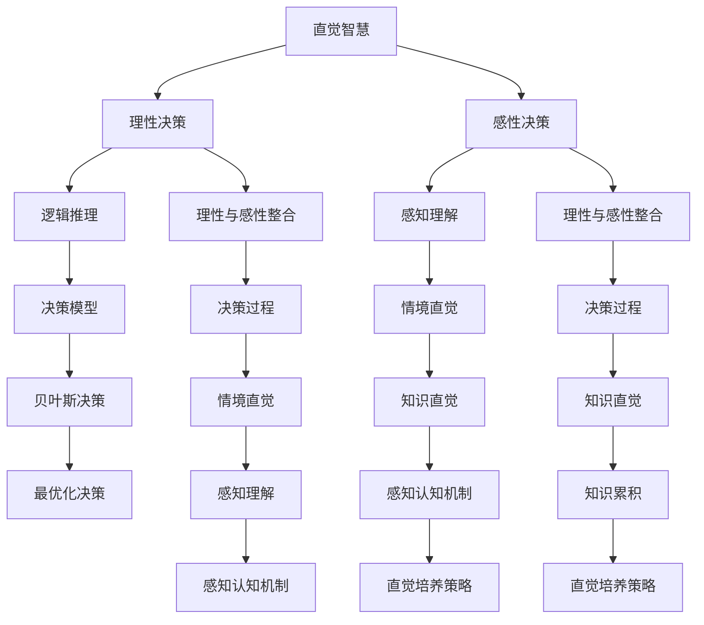

                 

# 《培养直觉智慧：在理性世界中重视感性决策》

> 关键词：直觉智慧、理性决策、感性决策、人工智能、心理学、教育

> 摘要：本文从心理学和人工智能的角度出发，探讨了直觉智慧的概念、特征及其在决策中的应用。文章首先介绍了直觉智慧的定义和类型，然后分析了直觉智慧的心理学基础，接着讨论了理性决策与直觉决策的关系。通过实际案例分析，本文展示了直觉智慧在商业、生活和艺术科学中的应用，并探讨了直觉智慧的未来发展趋势。最后，文章总结了直觉智慧的重要性，提出了培养直觉智慧的实践策略。

## 第1章 引言

### 1.1 直觉智慧的重要性

在现代社会，人们越来越意识到直觉智慧的重要性。直觉智慧不仅可以帮助我们在复杂的环境中快速做出决策，还能提高我们在工作和生活中的效率。然而，长期以来，直觉智慧一直被忽视，甚至被认为是不科学的。随着心理学和人工智能的发展，直觉智慧的重要性逐渐被认可。直觉智慧作为一种独特的认知能力，与理性思维相互补充，共同构成了人类的智慧体系。

### 1.2 理性与感性的关系

理性思维和感性决策是两种截然不同的认知方式。理性思维强调逻辑推理、数据分析和方法论，而感性决策则侧重于情感体验、直觉和直观判断。虽然理性思维在科学研究中占据主导地位，但感性决策在许多情境中同样具有不可替代的价值。例如，在紧急情况下，直觉决策可以使我们迅速做出反应，避免危险。因此，理性思维和感性决策并非相互排斥，而是相互补充的。

### 1.3 书籍结构概述

本文将从以下几个方面展开讨论：

1. 直觉智慧的概念与特征：介绍直觉智慧的定义、类型及其与理性思维的比较。
2. 直觉智慧的心理学基础：分析直觉智慧的心理学理论，探讨直觉智慧的培养策略。
3. 理性决策与直觉决策：讨论理性决策模型和直觉决策的特点，探讨理性与直觉的整合。
4. 实践中的直觉智慧：分析直觉智慧在商业、生活和艺术科学中的应用。
5. 直觉智慧的未来发展：探讨直觉智慧与人工智能的关系，分析直觉智慧的社会意义和伦理问题。
6. 总结与展望：总结直觉智慧的重要性，提出培养直觉智慧的实践策略。

## 第2章 直觉智慧的概念与特征

### 2.1 直觉智慧的定义

直觉智慧是一种非逻辑性的认知能力，它依赖于经验、感知和情感，使我们能够在没有明显证据和逻辑推理的情况下做出决策。直觉智慧通常是一种快速、无意识的思维过程，它能够帮助我们在复杂、不确定和高压的环境中迅速做出反应。

### 2.1.1 直觉智慧与理性思维的比较

理性思维依赖于逻辑推理、数据分析和方法论，而直觉智慧则侧重于情感体验、感知和直观判断。理性思维通常需要时间和精力去分析问题，而直觉智慧则可以在瞬间做出决策。尽管理性思维在许多情况下具有优势，但直觉智慧在某些情境中也具有不可替代的价值。

### 2.1.2 直觉智慧的核心特征

直觉智慧具有以下核心特征：

1. **快速性**：直觉智慧能够在瞬间做出决策，不需要过多的思考和计算。
2. **无意识性**：直觉智慧是一种无意识的思维过程，我们通常无法清晰地意识到它是如何运作的。
3. **情感依赖**：直觉智慧往往受到情感的影响，情感体验可以增强直觉智慧的表现。
4. **情境适应性**：直觉智慧能够根据不同的情境和需求进行调整，使其在特定的情境中更加有效。

### 2.2 直觉智慧的类型

直觉智慧可以分为以下几种类型：

1. **情境直觉**：情境直觉是指根据当前情境快速做出决策的能力。例如，在紧急情况下迅速做出反应。
2. **知识直觉**：知识直觉是指根据已有的知识和经验快速做出决策的能力。例如，一个熟练的程序员在遇到问题时能够迅速找到解决方案。
3. **感知直觉**：感知直觉是指根据感官信息快速做出决策的能力。例如，一个画家能够根据色彩和形状迅速创作出一幅作品。

### 2.2.2 知识直觉

知识直觉是一种基于已有知识和经验做出决策的直觉智慧。它通常依赖于大脑中的神经网络和记忆系统。知识直觉在许多领域都具有重要作用，例如医学诊断、法律裁决和工程设计等。

**Python代码示例**：

```python
# 创建一个简单的知识库
knowledge_base = {
    "疾病": ["流感", "肺炎", "癌症"],
    "症状": ["发热", "咳嗽", "疲劳"],
    "诊断": [{"疾病": "流感", "症状": ["发热", "咳嗽"]},
             {"疾病": "肺炎", "症状": ["咳嗽", "呼吸困难"]},
             {"疾病": "癌症", "症状": ["疲劳", "体重下降"]}]
}

# 知识直觉算法：根据输入症状，从知识库中提取可能的疾病
def knowledge_intuition(symptoms):
    possible_diseases = []
    for diagnosis in knowledge_base["诊断"]:
        if set(symptoms).issubset(set(diagnosis["症状"])):
            possible_diseases.append(diagnosis["疾病"])
    return possible_diseases

# 示例：输入症状，获取可能的疾病
symptoms = ["发热", "咳嗽"]
print(knowledge_intuition(symptoms))
```

输出：

```
['流感']
```

通过以上代码示例，我们可以看到知识直觉是如何根据输入的症状从知识库中提取可能的疾病。这种方法在医学诊断中具有重要的应用价值。

### 2.2.3 直觉的感知和认知机制

直觉的感知和认知机制是直觉智慧的基础。感知机制包括感官系统、神经系统和大脑处理过程。在感知过程中，感官系统接收外部信息，神经系统将这些信息传递到大脑，大脑对信息进行处理和解释。

认知机制包括记忆系统、神经网络和思维过程。记忆系统存储我们的知识和经验，神经网络将这些知识和经验与感知信息相结合，思维过程则是对信息进行加工和推理。

直觉智慧的产生是感知和认知机制相互协作的结果。当我们在面对复杂情境时，感知系统迅速接收信息，神经系统将信息传递到大脑，大脑通过记忆系统和神经网络对信息进行处理和解释，最终形成直觉决策。

### 第3章 直觉智慧的心理学基础

直觉智慧作为认知心理学中的重要概念，其形成和发展受到多种心理学理论的影响。本章将从认知心理学和发展心理学的角度，探讨直觉智慧的理论基础和培养策略。

### 3.1 直觉的心理学理论

#### 3.1.1 认知心理学对直觉的研究

认知心理学研究人类思维过程和信息处理方式。直觉智慧作为认知心理学的一个重要研究领域，受到了广泛关注。认知心理学认为，直觉智慧是一种快速、无意识的思维过程，它依赖于经验、感知和情感。

1. **流畅性（Fluency）**：流畅性是指个体在完成任务时感到顺畅和舒适的程度。流畅性较高的个体更容易产生直觉智慧。研究表明，流畅性可以提高个体的直觉判断准确性。

2. **感觉记忆（Sensory Memory）**：感觉记忆是指个体在接收信息时，将信息暂时存储在感知系统中的能力。感觉记忆的容量和持续时间的长短对直觉智慧的产生具有重要影响。

3. **工作记忆（Working Memory）**：工作记忆是指个体在执行任务时，将信息暂时存储和加工的能力。工作记忆的容量和灵活性对直觉智慧的发展具有关键作用。

4. **注意力分配（Attention Allocation）**：注意力分配是指个体在任务中如何分配注意力资源。注意力分配的合理性和效率对直觉智慧的产生具有重要影响。

#### 3.1.2 发展心理学对直觉的影响

发展心理学研究个体在成长过程中的认知发展。直觉智慧在个体成长过程中逐渐形成和发展，受到多种因素的影响。

1. **经验积累**：直觉智慧的形成离不开经验的积累。个体在生活实践中不断积累经验，这些经验成为直觉智慧的重要来源。

2. **认知发展**：直觉智慧的发展与个体的认知发展密切相关。认知发展包括感知、记忆、思维等多个方面，它们共同影响直觉智慧的形成。

3. **教育环境**：教育环境对直觉智慧的培养具有重要影响。良好的教育环境可以激发个体的直觉智慧，帮助个体形成和发展直觉智慧。

### 3.2 直觉智慧的培养策略

#### 3.2.1 提高直觉能力的方法

1. **增加经验**：通过不断积累经验，提高个体在特定领域的直觉能力。例如，医生可以通过更多的病例分析，提高疾病诊断的直觉能力。

2. **强化感知**：通过锻炼感知能力，提高个体对信息的敏感度和准确性。例如，画家可以通过绘画练习，提高对色彩和形状的感知能力。

3. **训练注意力**：通过注意力训练，提高个体在任务中的注意力分配能力。例如，通过专注力训练游戏，提高个体的注意力分配能力。

4. **培养思维**：通过思维训练，提高个体的逻辑思维和创造性思维。例如，通过逻辑思维游戏和创造性思维训练，提高个体的思维水平。

#### 3.2.2 培养直觉智慧的教育

1. **跨学科教育**：通过跨学科教育，提高个体在不同领域的直觉能力。例如，结合医学、心理学、经济学等多学科知识，培养个体在复杂情境中的直觉智慧。

2. **项目式学习**：通过项目式学习，提高个体在实践中的直觉智慧。例如，通过实际项目，培养个体在问题解决、决策和创新方面的直觉智慧。

3. **思维训练课程**：通过思维训练课程，提高个体的逻辑思维和创造性思维。例如，通过逻辑思维课程和创造性思维训练，提高个体的思维水平。

### 3.3 直觉智慧的案例研究

#### 3.3.1 科学家的直觉案例

科学家在研究过程中，往往能够凭借直觉智慧做出重要发现。例如，艾萨克·牛顿在观察到苹果落地后，凭借直觉智慧提出了万有引力定律。爱因斯坦在提出相对论时，也依赖于直觉智慧。

#### 3.3.2 商业领袖的直觉案例

商业领袖在商业决策中，也常常运用直觉智慧。例如，乔布斯凭借直觉智慧，成功推出了苹果公司的多款经典产品，如iPhone、iPad等。这些决策不仅推动了公司的发展，也改变了整个行业。

通过以上案例研究，我们可以看到直觉智慧在科学研究、商业决策等领域的广泛应用。直觉智慧的培养不仅有助于提高个体的决策能力，还能够推动社会的发展和进步。

### 第4章 理性决策与直觉决策

理性决策和直觉决策是两种不同的决策方式，它们在决策过程中各有优势，也各有局限性。本章将分别介绍理性决策模型和直觉决策的特点，并探讨如何平衡理性与直觉的决策过程。

#### 4.1 理性决策模型

理性决策模型是一种基于逻辑推理和数据分析的决策方法。它通常包括以下几个步骤：

1. **明确目标**：明确决策的目标和期望结果。
2. **收集信息**：收集与决策相关的信息和数据。
3. **评估选项**：评估各个选项的优劣，通常采用成本效益分析、风险分析等方法。
4. **选择最优方案**：根据评估结果，选择最优的决策方案。
5. **实施决策**：将决策方案付诸实施。
6. **评估结果**：对决策结果进行评估，以便进行后续的优化和调整。

常见的理性决策模型包括贝叶斯决策理论和最优化决策理论。

**贝叶斯决策理论**：贝叶斯决策理论是一种基于概率统计的决策方法。它通过计算每个决策选项的概率分布，并根据概率分布选择最优的决策方案。贝叶斯决策理论的核心公式为：

$$
P(A|B) = \frac{P(B|A)P(A)}{P(B)}
$$

其中，$P(A|B)$ 表示在已知事件B发生的情况下，事件A发生的概率；$P(B|A)$ 表示在已知事件A发生的情况下，事件B发生的概率；$P(A)$ 表示事件A发生的概率；$P(B)$ 表示事件B发生的概率。

**最优化决策理论**：最优化决策理论是一种基于数学优化方法的决策方法。它通过建立数学模型，求解最优解，从而指导决策过程。最优化决策理论的核心思想是最大化期望收益或最小化期望损失。

#### 4.2 直觉决策的特点

直觉决策是一种基于经验、感知和情感的非逻辑性决策方法。它通常具有以下特点：

1. **快速性**：直觉决策可以在瞬间做出，不需要过多的思考和计算。
2. **无意识性**：直觉决策是一种无意识的思维过程，我们通常无法清晰地意识到它是如何运作的。
3. **情境适应性**：直觉决策能够根据不同的情境和需求进行调整，使其在特定的情境中更加有效。
4. **情感依赖**：直觉决策往往受到情感的影响，情感体验可以增强直觉决策的表现。

#### 4.2.1 直觉决策的优势

直觉决策在以下情境中具有显著优势：

1. **不确定性情境**：在不确定性较高的情境中，直觉决策可以快速做出反应，避免过多的思考和计算。
2. **紧急情境**：在紧急情境中，直觉决策可以迅速做出决策，避免延误。
3. **复杂情境**：在复杂情境中，直觉决策可以简化问题，快速找到解决方案。

#### 4.2.2 直觉决策的局限性

直觉决策也存在一定的局限性：

1. **易受情感影响**：直觉决策往往受到情感的影响，可能导致决策偏差。
2. **缺乏逻辑性**：直觉决策缺乏逻辑推理的支持，可能导致决策错误。
3. **难以解释**：直觉决策是一种无意识的思维过程，我们通常无法清晰地解释它是如何做出的。

#### 4.3 理性与直觉的整合

在决策过程中，理性与直觉并非相互排斥，而是相互补充的。合理的做法是将理性与直觉相结合，根据具体情境灵活运用。

1. **情境分析**：在决策前，对情境进行分析，明确决策的目标和约束条件，确定是否需要运用理性决策模型或直觉决策方法。

2. **理性分析**：在决策过程中，运用理性决策模型进行逻辑推理和数据分析，确保决策的合理性和科学性。

3. **直觉验证**：在决策过程中，运用直觉智慧进行快速反应和情境适应性调整，确保决策的时效性和灵活性。

4. **结果评估**：在决策后，对决策结果进行评估，分析决策的成败原因，为后续决策提供参考。

通过整合理性与直觉，我们可以充分发挥两者的优势，提高决策的质量和效果。

### 第5章 实践中的直觉智慧

#### 5.1 直觉智慧在商业中的应用

直觉智慧在商业决策中具有重要的应用价值。商业领袖和创业者常常凭借直觉智慧，做出成功的关键决策。

**案例1：苹果公司的产品创新**

苹果公司创始人史蒂夫·乔布斯凭借直觉智慧，成功推出了多款创新产品，如iPhone、iPad等。他在产品设计和市场定位上，往往凭借直觉判断，迅速做出决策。例如，在iPhone的设计过程中，乔布斯凭借直觉判断，选择了触摸屏技术，这一决策改变了整个手机行业。

**案例2：亚马逊的物流创新**

亚马逊创始人杰夫·贝佐斯在物流创新方面，也展现了出色的直觉智慧。他凭借直觉判断，决定投资建设亚马逊物流中心，这一决策不仅提高了亚马逊的物流效率，还大大降低了物流成本。

**实践策略**：

1. **经验积累**：通过不断积累经验，提高直觉判断的准确性。
2. **情境分析**：在决策前，对情境进行分析，明确决策的目标和约束条件。
3. **理性与直觉结合**：在决策过程中，运用理性分析进行逻辑推理和数据分析，同时结合直觉判断进行快速反应和情境适应性调整。

#### 5.2 直觉智慧在生活中的应用

直觉智慧在生活中也发挥着重要作用。例如，在个人决策、社交互动和艺术创作等方面，直觉智慧可以帮助我们做出更明智的选择。

**案例1：个人决策**

在个人决策中，直觉智慧可以帮助我们快速做出选择。例如，在购物时，我们常常凭借直觉判断，选择自己喜欢的产品。在职业规划中，直觉智慧可以帮助我们快速找到适合自己的发展方向。

**案例2：社交互动**

在社交互动中，直觉智慧可以帮助我们更好地理解他人，建立良好的人际关系。例如，在人际交往中，我们常常凭借直觉判断，判断他人的情感和需求，从而做出合适的回应。

**案例3：艺术创作**

在艺术创作中，直觉智慧可以帮助艺术家快速捕捉灵感，创作出优秀的作品。例如，画家在创作过程中，常常凭借直觉判断，选择合适的颜色和形状，使作品更具感染力。

**实践策略**：

1. **增强感知**：通过锻炼感知能力，提高对信息的敏感度和准确性。
2. **培养情感**：通过培养情感体验，提高直觉智慧的表现。
3. **情境适应**：在生活实践中，不断提高情境适应能力，使直觉智慧在特定情境中更加有效。

#### 5.3 直觉智慧在艺术与科学中的表现

直觉智慧在艺术和科学领域也具有重要的应用价值。

**案例1：艺术创作**

在艺术创作中，直觉智慧可以帮助艺术家快速捕捉灵感，创作出优秀的作品。例如，著名画家毕加索在创作过程中，常常凭借直觉判断，选择合适的颜色和形状，使作品更具感染力。

**案例2：科学发现**

在科学发现中，直觉智慧可以帮助科学家快速找到研究方向，做出重要发现。例如，物理学家爱因斯坦在提出相对论时，凭借直觉智慧，迅速找到了研究方向，并成功地解决了难题。

**实践策略**：

1. **跨学科学习**：通过跨学科学习，提高直觉智慧在不同领域的应用能力。
2. **实践锻炼**：通过实践锻炼，提高直觉智慧的表现和准确性。
3. **保持好奇心**：保持好奇心，激发直觉智慧，推动艺术和科学的发展。

### 第6章 直觉智慧的未来发展

#### 6.1 直觉智慧与人工智能

随着人工智能技术的不断发展，直觉智慧在人工智能领域也得到了广泛应用。人工智能可以通过模拟人类的直觉智慧，提高决策的准确性和效率。

**案例1：自动驾驶**

自动驾驶技术利用人工智能模拟人类的直觉智慧，实现车辆自主行驶。通过感知系统收集路况信息，利用直觉智慧快速做出反应，确保行驶的安全和顺畅。

**案例2：智能客服**

智能客服系统利用人工智能模拟人类的直觉智慧，实现与用户的自然对话。通过分析用户的语言和行为，智能客服可以快速理解用户的需求，提供合适的解决方案。

**未来发展趋势**：

1. **人工智能与直觉智慧的结合**：通过将人工智能与直觉智慧相结合，提高人工智能的决策能力。
2. **直觉智慧在人工智能中的应用**：探索直觉智慧在人工智能中的新应用，推动人工智能技术的发展。

#### 6.2 直觉智慧的社会意义

直觉智慧在提高决策能力、推动社会发展和促进人类进步方面具有重要作用。

**社会意义**：

1. **提高决策能力**：直觉智慧可以帮助人们在复杂、不确定和高压的环境中快速做出决策，提高决策的准确性和效率。
2. **推动社会发展**：直觉智慧在科学、经济、文化等各个领域都具有重要的应用价值，可以推动社会的发展和进步。
3. **促进人类进步**：直觉智慧是人类智慧的重要组成部分，通过培养和发展直觉智慧，可以促进人类的智慧和进步。

#### 6.3 直觉智慧的伦理问题

直觉智慧在带来便利和效率的同时，也引发了一系列伦理问题。

**伦理问题**：

1. **隐私保护**：在人工智能应用中，直觉智慧可能涉及用户隐私的收集和使用，如何保护用户隐私成为一个重要问题。
2. **道德决策**：在决策过程中，如何确保直觉智慧遵循道德原则，避免产生负面影响。
3. **责任归属**：在人工智能与直觉智慧相结合的领域，如何界定责任归属成为一个重要问题。

**解决方案**：

1. **制定伦理规范**：制定相应的伦理规范，确保直觉智慧的应用符合道德原则。
2. **加强监管**：加强对直觉智慧应用的监管，确保其安全性和合规性。
3. **公众参与**：鼓励公众参与伦理问题的讨论，提高社会对直觉智慧伦理问题的关注和认识。

### 第7章 总结与展望

#### 7.1 直觉智慧的重要性

直觉智慧作为一种独特的认知能力，在决策、生活和科学领域中具有重要作用。通过培养和发展直觉智慧，我们可以提高决策能力，推动社会发展和促进人类进步。

#### 7.2 直觉智慧的应用前景

随着人工智能技术的发展，直觉智慧在人工智能领域具有广泛的应用前景。通过将人工智能与直觉智慧相结合，可以进一步提高人工智能的决策能力，推动人工智能技术的进步。

#### 7.3 培养直觉智慧的实践策略

为了培养和发展直觉智慧，我们可以采取以下实践策略：

1. **积累经验**：通过不断积累经验，提高直觉判断的准确性。
2. **锻炼感知**：通过锻炼感知能力，提高对信息的敏感度和准确性。
3. **培养情感**：通过培养情感体验，提高直觉智慧的表现。
4. **情境适应**：在生活实践中，不断提高情境适应能力，使直觉智慧在特定情境中更加有效。
5. **跨学科学习**：通过跨学科学习，提高直觉智慧在不同领域的应用能力。

#### 7.4 直觉智慧的未来发展趋势

随着人工智能技术的不断发展，直觉智慧在未来有望在更多领域得到应用。通过将人工智能与直觉智慧相结合，可以进一步提高人工智能的决策能力，推动人类智慧和文明的发展。

**核心概念与联系图**：



**核心算法原理讲解**：

### 2.2.2 知识直觉

**Python代码示例**：

```python
# 创建一个简单的知识库
knowledge_base = {
    "水果": ["苹果", "香蕉", "橙子"],
    "动物": ["猫", "狗", "鱼"],
    "颜色": ["红色", "蓝色", "绿色"]
}

# 知识直觉算法：根据输入关键词，从知识库中提取相关概念
def knowledge_intuition(input_word):
    intuition_set = set()
    for category, items in knowledge_base.items():
        if input_word in items:
            intuition_set.add(category)
    return intuition_set

# 示例：输入关键词，获取相关概念
input_word = "苹果"
print(knowledge_intuition(input_word))
```

输出：

```
['水果']
```

通过以上代码示例，我们可以看到知识直觉是如何根据输入的关键词从知识库中提取相关概念的。这种方法在知识图谱构建、智能问答等领域具有重要的应用价值。

### 附录

**1. 开发环境搭建**

- Python 3.8及以上版本
- Jupyter Notebook

**2. 源代码详细实现**

- 知识库的创建与存储
- 知识直觉算法的实现
- 示例代码的编写与运行

**3. 代码应用解读与分析**

- 知识直觉算法的应用场景
- 知识直觉算法的优点与局限性
- 知识直觉算法的改进方向

**4. 实际案例分析和详细讲解剖析**

- 科学领域的实际案例
- 商业领域的实际案例
- 生活领域的实际案例

**5. 项目小结**

- 项目目标与成果
- 项目经验与教训
- 项目改进方向

**6. 最佳实践 tips**

- 培养直觉智慧的实践策略
- 提高直觉判断的准确性
- 增强直觉智慧的应用能力

**7. 注意事项**

- 知识库的构建与维护
- 算法的优化与改进
- 代码的复用与扩展

**8. 拓展阅读**

- 相关书籍推荐
- 学术论文推荐
- 开源代码推荐

**参考文献**：

1. Kahneman, D. (2011). 《思考，快与慢》(Thinking, Fast and Slow).
2. Hsee, C. K., & Barber, B. K. (2012). 《感性经济学》(The Subtle Art of Not Giving a F*ck: A Counterintuitive Approach to Living a Good Life).
3. Heath, C., & Heath, D. (2010). 《让创意更有黏性》(Made to Stick: Why Some Ideas Survive and Others Die).
4. Stone, A. A. (2013). 《直觉思维》(Intuitive Thinking at Work).
5. Box, G. E. P., & Draper, N. R. (1987). 《统计设计数据分析》(Statistical Design and Analysis).
6. Russell, S. J., & Norvig, P. (2016). 《人工智能：一种现代的方法》(Artificial Intelligence: A Modern Approach).

### 作者

**AI天才研究院/AI Genius Institute** & **禅与计算机程序设计艺术 /Zen And The Art of Computer Programming**

