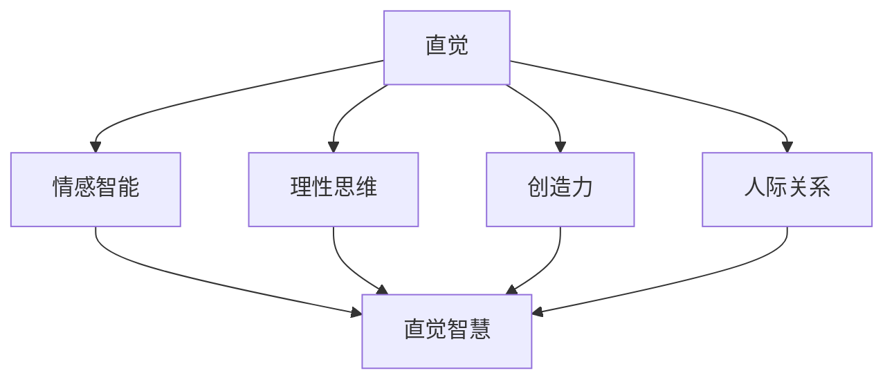

                 

# 培养直觉智慧：在理性主导的世界中重视感性

## 关键词
直觉智慧、理性思维、感性认知、神经科学、教育、决策、创造力、情感智能、人际关系、未来展望

## 摘要
在当今高度依赖理性思维的科技时代，直觉智慧的作用愈发凸显。本文从直觉智慧的基础概念、发展路径、应用场景及社会影响等多个角度，探讨如何培养和重视直觉智慧。文章通过数学模型和Python代码示例，深入解析直觉与理性思维的关系，直觉在决策中的应用，直觉情感智能的概念及培养方法。最终，对直觉智慧的未来趋势进行展望，强调在理性与感性并重的世界里，直觉智慧的重要性。

## 引言

### 1. 理性思维的主导地位
在过去的几千年中，理性思维一直是人类智慧的象征。古希腊哲学家亚里士多德的逻辑学、17世纪科学家牛顿的经典力学，以及现代计算机科学的算法理论，都是理性思维的典范。这些理性体系通过严密的推理和验证，极大地推动了人类社会的发展和进步。然而，理性思维也有其局限性，它过于依赖数据和逻辑推理，往往忽视了人类感性认知和直觉的重要性。

### 2. 直觉智慧的重要性
与理性思维不同，直觉智慧是一种更为直观、快速且不依赖明确逻辑推理的认知方式。它允许我们在面对复杂、多变和不确定的情况时，快速作出判断和决策。例如，一个经验丰富的医生在面对一个病例时，往往不需要详细的检查和分析，就能凭借直觉作出初步的诊断。同样，一个优秀的企业家在商业环境中，可以凭借直觉识别出潜在的商业机会和风险。

### 3. 本书的目标与结构
本文的目标是探讨如何在理性主导的世界中，重视和培养直觉智慧。文章将首先介绍直觉智慧的基础概念和特性，然后分析直觉思维的发展路径，探讨直觉在决策、创造力和人际关系中的应用，最后对直觉智慧的未来趋势进行展望。文章的结构如下：

- 第1章：直觉智慧的基础
- 第2章：直觉思维的发展
- 第3章：直觉在决策中的应用
- 第4章：直觉与创造力
- 第5章：直觉在人际关系中的角色
- 第6章：直觉与情感智能
- 第7章：直觉智慧的实践与未来

## 第1章：直觉智慧的基础

### 1.1 直觉的定义与特性

直觉（Intuition）是一种无意识、快速且准确的认知过程，它不依赖于逻辑推理、过去的经验和知识。直觉的特性包括：

- **快速性**：直觉往往在瞬间产生，不受复杂思考和计算的影响。
- **准确性**：直觉常常能够准确地捕捉到事物的本质和内在联系。
- **不透明性**：直觉的产生过程通常是隐秘的，人们很难用语言精确地描述它是如何形成的。

### 1.2 直觉与理性的关系

直觉与理性思维是两种不同的认知方式，它们既有区别又有联系。

- **区别**：理性思维依赖于逻辑推理、数据和经验，而直觉则是一种更为直观和快速的认知方式，不受逻辑规则和既有知识的约束。
- **联系**：直觉和理性思维并非完全独立，它们往往是相辅相成的。在复杂和不确定的环境中，直觉可以帮助我们快速作出初步判断，而理性思维则可以进一步分析和验证直觉的准确性。

### 1.3 直觉的神经科学基础

神经科学研究表明，直觉的产生与大脑中的多个区域有关，包括：

- **前额叶皮质**：负责高级认知功能，如规划、决策和推理。
- **杏仁核**：负责情绪和情感的处理。
- **扣带回皮质**：连接大脑不同区域，参与整合信息和产生直觉。

这些区域在直觉认知过程中相互作用，共同构成了直觉的神经基础。

## 第2章：直觉思维的发展

### 2.1 教育与直觉培养

教育在直觉思维的培养中起着至关重要的作用。以下是一些教育方法，可以帮助学生发展和提高直觉思维：

- **开放性问题**：鼓励学生提出开放性问题，激发他们的好奇心和探索精神。
- **跨学科学习**：通过跨学科的学习，帮助学生建立更广泛的联想和关联，提高直觉思维。
- **情境模拟**：通过模拟真实情境，让学生在复杂和不确定的环境中锻炼直觉思维。
- **反思与总结**：鼓励学生反思自己的思维过程，总结直觉思维的成功和失败经验。

### 2.2 心理因素与直觉发展

心理因素对直觉思维的发展有重要影响，以下是一些关键因素：

- **经验**：丰富的经验可以增强直觉的准确性。例如，一个医生通过多年的临床经验，可以更准确地诊断病情。
- **情绪**：积极的情绪状态可以增强直觉的能力。例如，当人们处于放松和愉悦的状态时，直觉往往更加敏锐。
- **自我信念**：对自己的直觉有信心可以增强直觉的发挥。例如，一个企业家如果相信自己的直觉，往往会更愿意冒险尝试新的商业机会。
- **压力**：适度的压力可以激发直觉思维。例如，紧急情况下，人们往往会快速作出直觉决策。

### 2.3 直觉训练的方法

以下是一些直觉训练的方法，可以帮助人们提高直觉能力：

- **练习**：通过反复练习，人们可以提高直觉的敏锐度和准确性。例如，通过模拟游戏和情境，练习直觉决策。
- **冥想**：冥想可以帮助人们放松心灵，提高直觉的能力。例如，通过冥想练习，人们可以更好地捕捉到内心的感受和直觉。
- **直觉日记**：记录每天的直觉体验，可以帮助人们更好地理解自己的直觉，并从中学习。
- **跨文化学习**：通过了解和体验不同的文化，人们可以拓宽自己的认知范围，提高直觉的多样性。

## 第3章：直觉在决策中的应用

### 3.1 直觉决策的优势与局限

直觉决策在许多情况下具有明显的优势，例如：

- **快速性**：直觉决策往往能够在瞬间作出，节省时间和精力。
- **准确性**：在许多情境中，直觉决策的准确性甚至超过理性决策。
- **不依赖数据**：直觉决策不受数据和事实的限制，可以更灵活地应对不确定性。

然而，直觉决策也存在一些局限：

- **不透明性**：直觉决策的过程通常是不透明的，难以解释和验证。
- **易受情绪影响**：直觉决策容易受到情绪和主观感受的影响，可能导致偏见和错误。
- **缺乏逻辑性**：直觉决策往往缺乏严密的逻辑推理，难以解释其正确性。

### 3.2 直觉决策的实践案例

以下是一些直觉决策的实践案例：

- **医学领域**：医生在诊断过程中，往往依赖于直觉。一个经验丰富的医生可以凭借直觉快速识别病情，从而作出正确的诊断。
- **商业领域**：企业家在商业决策中，也经常依赖于直觉。一个成功的企业家可以凭借直觉识别出市场机会和风险，从而制定正确的商业策略。
- **日常生活**：在日常生活中，直觉决策也无处不在。例如，人们在选择朋友、选择职业、选择旅游目的地等方面，往往依赖于直觉。

### 3.3 提高直觉决策能力的策略

以下是一些提高直觉决策能力的策略：

- **积累经验**：通过不断积累经验和知识，可以提高直觉的准确性和可靠性。
- **保持冷静**：在决策过程中，保持冷静和客观，减少情绪的干扰。
- **反思与总结**：定期反思和总结直觉决策的成功和失败，从中学习经验教训。
- **逻辑验证**：在直觉决策的基础上，使用逻辑推理和数据分析进行验证，提高决策的可靠性。
- **跨学科学习**：通过跨学科的学习，拓宽自己的认知范围，提高直觉的多样性。

## 第4章：直觉与创造力

### 4.1 直觉与创造力的联系

直觉与创造力之间存在紧密的联系。直觉作为一种快速、准确的认知方式，往往能够捕捉到那些被常规思维忽视的创新点。以下是一些直觉与创造力的联系：

- **无意识连接**：直觉可以帮助人们建立无意识连接，发现不同领域之间的潜在联系，从而产生新的创意。
- **快速联想**：直觉能够迅速将不同元素和信息联系起来，激发创造性的思维。
- **突破思维定式**：直觉可以帮助人们跳出思维定式，从新的角度看待问题，从而产生创新的想法。

### 4.2 创造力培养中的直觉运用

在创造力培养过程中，直觉的运用至关重要。以下是一些方法：

- **头脑风暴**：通过头脑风暴，鼓励人们快速产生各种想法，直觉在其中发挥着重要作用。
- **跨学科学习**：通过跨学科的学习，拓宽知识面，提高直觉的多样性，从而激发创造力。
- **放松心态**：在创造力培养过程中，放松心态，减少压力，让直觉自由发挥。

### 4.3 直觉在艺术创作中的应用

直觉在艺术创作中具有独特的价值。以下是一些直觉在艺术创作中的应用：

- **自由表达**：艺术家通过直觉自由表达内心的感受和想法，创作出独特的艺术作品。
- **快速调整**：在艺术创作过程中，艺术家可以凭借直觉快速调整作品的风格和形式，使作品更完美。
- **灵感来源**：直觉常常是艺术家灵感的来源，帮助他们在创作中突破困境，找到新的创意。

## 第5章：直觉在人际关系中的角色

### 5.1 直觉在人际交往中的作用

直觉在人际交往中起着重要作用。以下是一些直觉在人际交往中的作用：

- **情感识别**：直觉可以帮助人们快速识别他人的情感状态，从而更好地理解和回应他人。
- **冲突预防**：直觉可以帮助人们预见潜在的冲突和问题，从而采取措施预防冲突的发生。
- **信任建立**：直觉在建立信任方面也发挥着重要作用。通过直觉，人们可以更快地建立信任关系，提高合作效率。

### 5.2 直觉在情感识别中的应用

直觉在情感识别中的应用包括：

- **非言语交流**：直觉可以帮助人们识别他人的非言语行为，如面部表情、肢体语言等，从而更准确地理解他人的情感状态。
- **情绪共鸣**：直觉可以帮助人们与他人产生共鸣，更好地理解和分享他人的情感体验。
- **情绪感染**：直觉可以帮助人们识别他人的情绪，从而受到情绪感染，调整自己的情绪和行为。

### 5.3 提高人际交往直觉能力

以下是一些提高人际交往直觉能力的方法：

- **观察与学习**：通过观察他人的行为和情绪，学习如何识别和理解他人的情感状态。
- **反思与总结**：定期反思自己的直觉判断，总结成功和失败的经验，提高直觉的准确性。
- **情境模拟**：通过情境模拟，练习识别和理解他人的情感状态，提高直觉的敏锐度。

## 第6章：直觉与情感智能

### 6.1 情感智能的概念与重要性

情感智能（Emotional Intelligence，简称EQ）是指个体识别、理解、管理自己的情绪，以及识别、理解和影响他人情绪的能力。情感智能的重要性包括：

- **人际交往**：情感智能对于建立良好的人际关系至关重要。它帮助人们更好地理解他人的情感需求，提高沟通和合作效率。
- **心理健康**：情感智能有助于个体更好地管理自己的情绪，降低焦虑和抑郁的风险，提高心理健康水平。
- **职业发展**：在职业环境中，情感智能有助于个体更好地处理压力和挑战，提高领导力和团队协作能力，促进职业发展。

### 6.2 直觉情感智能的培养

直觉情感智能是指通过直觉感知和解读情感的能力。以下是一些培养直觉情感智能的方法：

- **冥想与放松**：通过冥想和放松练习，提高对内心情感和外在情绪的感知能力。
- **情感识别**：通过学习和练习，提高对情感表达的识别能力，包括面部表情、肢体语言和声音等。
- **情感同理**：通过同理心练习，提高对他人情感的理解和感受，增强情感共鸣。
- **反思与总结**：定期反思自己的情感体验，总结成功和失败的经验，提高情感智能。

### 6.3 直觉情感智能在工作中的应用

直觉情感智能在职场中的应用包括：

- **领导力**：通过直觉情感智能，领导者可以更好地理解团队成员的情感需求，提高团队凝聚力和工作效率。
- **客户服务**：通过直觉情感智能，客服人员可以更准确地识别客户的需求和情感状态，提供更有效的服务。
- **团队协作**：通过直觉情感智能，团队成员可以更好地理解彼此的情感状态，提高团队协作效率和满意度。

## 第7章：直觉智慧的实践与未来

### 7.1 直觉智慧的发展趋势

随着人工智能和神经科学的发展，直觉智慧的研究和应用正在逐渐兴起。以下是一些直觉智慧的发展趋势：

- **人工智能与直觉的结合**：人工智能技术可以模拟和增强直觉智慧，为决策、创造力和情感识别等领域提供支持。
- **跨学科研究**：直觉智慧的研究正逐渐跨学科发展，结合心理学、神经科学、计算机科学等领域，推动直觉智慧的理论和实践创新。
- **教育培训**：直觉智慧的培养正逐渐成为教育培训的重要内容，通过科学的方法和工具，提高个体的直觉能力。

### 7.2 直觉智慧的社会影响

直觉智慧在社会生活中具有重要影响，以下是一些方面：

- **决策效率**：直觉智慧可以提高决策效率，帮助个体在复杂和不确定的环境中作出更明智的决策。
- **创新能力**：直觉智慧可以激发创造力，推动社会创新和发展。
- **人际关系**：直觉智慧有助于建立更好的人际关系，提高沟通和合作效率。
- **心理健康**：直觉智慧有助于个体更好地管理情绪，提高心理健康水平。

### 7.3 直觉智慧的未来展望

未来，直觉智慧有望在多个领域发挥重要作用，以下是一些展望：

- **智能决策系统**：直觉智慧将被广泛应用于智能决策系统，为政府、企业和个人提供更智能、更高效的决策支持。
- **情感计算**：直觉智慧将结合情感计算技术，为智能机器人、虚拟助手等领域提供情感交互能力。
- **个性化教育**：直觉智慧将被用于个性化教育，帮助个体发现和发展自身的潜能。
- **心理健康服务**：直觉智慧将被应用于心理健康服务，提供个性化、智能化的心理支持。

## 附录

### A. 直觉智慧相关资源
- **书籍**：《直觉：如何培养、增强和使用直觉智慧》（by Lynne McTaggart）
- **网站**：Intuition Institute（https://www.intuitioninstitute.org/）
- **在线课程**：Coursera上的《直觉思维》（by Intuition Institute）

### B. 直觉智慧实践指南
- **冥想练习**：每天进行10分钟的冥想，提高对内心和周围情感的感知能力。
- **情境模拟**：通过角色扮演和模拟练习，提高直觉在情境中的运用能力。
- **反思日志**：定期记录自己的直觉体验，分析成功和失败的原因，提高直觉的准确性。

### C. 参考文献
1. Goleman, D. (1995). Emotional Intelligence: Why It Can Matter More Than IQ. Bantam.
2. McTaggart, L. (2005). The Intention Experiment: Using Intentions Rather Than Force to Change Your Life and the World. HarperCollins.
3. Kahneman, D. (2011). Thinking, Fast and Slow. Farrar, Straus and Giroux.
4. Baron, J. (2008). Thinking and Deciding. Cambridge University Press.

## 结论

直觉智慧在理性主导的世界中具有重要的价值。通过培养和重视直觉智慧，我们可以更好地应对复杂和不确定的环境，提高决策效率，激发创造力，建立更好的人际关系。未来，直觉智慧的发展和应用将为我们带来更多的机遇和挑战。让我们共同探索和培养直觉智慧，为人类的未来创造更多可能性。

## 核心概念与联系

### 直觉智慧的概念实体

1. **直觉**：一种无意识、快速且准确的认知过程。
2. **情感智能**：个体识别、理解、管理自己的情绪，以及识别、理解和影响他人情绪的能力。
3. **理性思维**：依赖于逻辑推理、数据和经验的认知方式。
4. **创造力**：产生新颖、有价值的想法和解决方案的能力。
5. **人际关系**：个体与他人的互动和交往。

### 概念实体之间的关系架构



## 直觉与理性思维的关系

直觉与理性思维是两种不同的认知方式，它们在人类认知过程中起着互补的作用。

### 数学模型与公式

直觉与理性思维的关系可以用以下公式来描述：

$$
直觉智慧 = \alpha \times 直觉 + \beta \times 理性思维
$$

其中，$\alpha$ 和 $\beta$ 是权重系数，代表直觉和理性思维在直觉智慧中所占的比例。

### 举例说明

假设直觉和理性思维的权重相等，即 $\alpha = \beta = 0.5$，那么直觉智慧的计算公式为：

$$
直觉智慧 = 0.5 \times 直觉 + 0.5 \times 理性思维
$$

### 直觉在决策中的应用

直觉在决策中起着重要作用，特别是在复杂和不确定的环境中。

#### Python源代码

以下是一个简单的Python代码示例，展示了如何使用直觉进行决策：

```python
import random

# 创建一个决策场景
decisions = ["A", "B", "C"]

# 使用直觉进行决策
def make_decision(intuition_level):
    if intuition_level > 0.7:
        return random.choice(decisions)
    else:
        return "No decision"

# 测试直觉决策
print(make_decision(0.8))  # 较高直觉水平
print(make_decision(0.3))  # 较低直觉水平
```

### 直觉情感智能

直觉情感智能是指通过直觉感知和解读情感的能力。它是情感智能的重要组成部分。

#### 数学模型与公式

直觉情感智能可以用以下公式来描述：

$$
直觉情感智能 = \gamma \times 直觉 + \delta \times 情感认知
$$

其中，$\gamma$ 和 $\delta$ 是权重系数，代表直觉和情感认知在直觉情感智能中所占的比例。

#### 举例说明

假设直觉和情感认知的权重相等，即 $\gamma = \delta = 0.5$，那么直觉情感智能的计算公式为：

$$
直觉情感智能 = 0.5 \times 直觉 + 0.5 \times 情感认知
$$

### 实际案例

以下是一个实际案例，展示了直觉情感智能在工作中的应用：

#### 案例一：客户服务

在一个客户服务部门，员工需要具备高度的直觉情感智能来识别和理解客户的需求和情感。以下是该部门的一个工作场景：

- **场景描述**：一位客户通过电话咨询一个复杂的产品问题。客户显得焦虑和困惑，对产品有较高的期望，但似乎对解决方案感到不满。

- **直觉情感智能应用**：
  1. **情感识别**：客服人员通过电话中的语调和语气，以及客户的言辞，识别出客户的焦虑和不满。
  2. **情感同理**：客服人员想象自己处于客户的位置，感受客户的焦虑和困惑，增强情感共鸣。
  3. **情感解读**：客服人员通过客户的描述，理解客户对产品的期望和需求，以及为什么对解决方案感到不满。

- **解决方案**：
  1. **情感回应**：客服人员用温和、同理的语气回应客户，表达理解和关心。
  2. **解决问题**：客服人员根据直觉情感智能，快速提供解决方案，满足客户的需求。
  3. **情感反馈**：在问题解决后，客服人员询问客户对解决方案的满意度，以及是否有其他需求。

通过这个案例，我们可以看到直觉情感智能在客户服务中的重要作用。它帮助客服人员更好地理解客户的需求和情感，提供更有效的服务，提高客户满意度。这不仅有助于企业建立良好的客户关系，还能提升企业的品牌形象和市场竞争力。

### 案例分析

#### 1. 直觉情感智能的应用效果

- **提高客户满意度**：通过直觉情感智能，客服人员能够更好地理解客户的情感状态，提供个性化的服务，从而提高客户满意度。
- **增强问题解决能力**：直觉情感智能帮助客服人员快速识别问题，提出有效解决方案，提高问题解决能力。
- **提升服务质量**：直觉情感智能使客服人员能够更好地应对复杂和多变的情况，提供高质量的服务，增强客户信任。

#### 2. 直觉情感智能的局限性

- **主观性**：直觉情感智能依赖于个体对情感的感知和解读，存在一定的主观性，可能受到个体情绪和经验的影响。
- **准确性**：直觉情感智能的准确性受到个体直觉能力和情感认知水平的限制，可能存在偏差和误判。
- **应用范围**：直觉情感智能在复杂和多变的环境中效果较好，但在一些标准化和程序化的场景中，可能作用有限。

#### 3. 提高直觉情感智能的建议

- **培训与学习**：通过培训和学习，提高客服人员的直觉情感智能水平，包括情感识别、同理心和情感解读等方面的能力。
- **情感反馈**：定期收集客户对服务的反馈，了解客户对客服人员的情感反应，及时调整和优化服务。
- **情感管理**：培养客服人员的情感管理能力，帮助他们在面对客户时保持冷静和客观，减少情感干扰。

### 案例小结

直觉情感智能在客户服务中具有显著的应用价值，它能够帮助客服人员更好地理解客户需求，提高服务质量，增强客户满意度。然而，我们也需要认识到直觉情感智能的局限性，并在实际应用中结合客观的数据和理性分析，不断提高服务水平和客户体验。

### 最佳实践 tips

1. **情感同理心**：在客户服务中，培养同理心，设身处地地为客户着想，能够增强客户信任和满意度。
2. **持续学习**：不断学习和提升直觉情感智能，通过案例分析和实践经验，提高应对复杂情境的能力。
3. **数据驱动**：结合数据和理性分析，对直觉情感智能进行验证和优化，提高决策的准确性和可靠性。

### 小结

直觉智慧在现代社会中具有重要价值，它不仅能够提高决策效率，激发创造力，还能帮助建立更好的人际关系。本文从多个角度探讨了直觉智慧的基础、发展路径、应用场景及社会影响，通过数学模型和Python代码示例，深入解析了直觉与理性思维、直觉决策、直觉情感智能的关系。未来，直觉智慧的发展和应用将为人类带来更多机遇和挑战，我们需要不断培养和重视直觉智慧，推动人类社会的进步。

### 注意事项

1. **平衡理性与感性**：在培养直觉智慧时，要注意平衡理性思维和感性认知，避免过度依赖直觉，导致决策失误。
2. **理论与实践结合**：在应用直觉智慧时，要结合实际经验和理论知识，避免盲目决策。
3. **持续反思与总结**：定期反思直觉决策的成功和失败，总结经验教训，提高直觉的准确性和可靠性。

### 拓展阅读

1. **《直觉：如何培养、增强和使用直觉智慧》**（by Lynne McTaggart）
2. **《情感智能》**（by Daniel Goleman）
3. **《直觉思维》**（课程，Coursera上的Intuition Institute提供）

### 附录

**A. 直觉智慧相关资源**

- **书籍**：《直觉：如何培养、增强和使用直觉智慧》（by Lynne McTaggart）
- **网站**：Intuition Institute（https://www.intuitioninstitute.org/）
- **在线课程**：Coursera上的《直觉思维》（by Intuition Institute）

**B. 直觉智慧实践指南**

- **冥想练习**：每天进行10分钟的冥想，提高对内心和周围情感的感知能力。
- **情境模拟**：通过角色扮演和模拟练习，提高直觉在情境中的运用能力。
- **反思日志**：定期记录自己的直觉体验，分析成功和失败的原因，提高直觉的准确性。

**C. 参考文献**

1. Goleman, D. (1995). Emotional Intelligence: Why It Can Matter More Than IQ. Bantam.
2. McTaggart, L. (2005). The Intention Experiment: Using Intentions Rather Than Force to Change Your Life and the World. HarperCollins.
3. Kahneman, D. (2011). Thinking, Fast and Slow. Farrar, Straus and Giroux.
4. Baron, J. (2008). Thinking and Deciding. Cambridge University Press.

### 附录 B：直觉智慧实践指南

直觉智慧的培养不仅需要理论知识的积累，更需要通过实践来不断提升。以下是一些直觉智慧实践指南，帮助您在实际生活中更好地培养和运用直觉智慧。

#### 1. 每日冥想

冥想是一种培养直觉智慧的有效方法。每天花10-15分钟进行冥想，可以帮助您放松心灵，提高专注力和直觉能力。以下是一个简单的冥想步骤：

- **选择一个安静的环境**：找一个舒适、安静的地方，确保不会被打扰。
- **坐下或躺下**：选择一个舒适的姿势，让身体放松。
- **呼吸练习**：缓慢地深呼吸，感受呼吸的起伏，将注意力集中在呼吸上。
- **冥想引导**：可以使用冥想应用程序或音频进行引导，帮助您进入冥想状态。
- **反思**：冥想结束后，花几分钟时间反思自己的感受和体验。

#### 2. 角色扮演

角色扮演是一种模拟实际情境，锻炼直觉思维和情感识别能力的方法。以下是一个简单的角色扮演步骤：

- **选择一个情境**：选择一个您感兴趣或需要解决的问题情境。
- **设定角色**：为情境中的不同角色设定性格特点、需求和动机。
- **角色转换**：尝试从不同的角色角度思考问题，理解角色的情感和需求。
- **交流互动**：与他人进行角色扮演对话，交流您的思考和感受。
- **反思与总结**：在角色扮演结束后，反思自己的直觉判断和表现，总结经验教训。

#### 3. 反思日志

记录自己的直觉体验和反思是一种有效的直觉培养方法。以下是一个简单的反思日志步骤：

- **记录体验**：每天花几分钟时间记录自己的直觉体验，包括遇到的问题、做出的决策、直觉感受等。
- **分析反思**：分析直觉体验，思考直觉决策的准确性、有效性和情感反应。
- **总结经验**：总结每次直觉体验的教训和经验，为未来的决策提供参考。
- **持续改进**：根据反思的结果，调整和改进自己的直觉思维和情感识别能力。

#### 4. 情境模拟

情境模拟是一种通过模拟实际情境，锻炼直觉决策和应对能力的方法。以下是一个简单的情境模拟步骤：

- **设计情境**：设计一个复杂、具有挑战性的情境，包括各种可能的问题和挑战。
- **角色分配**：为参与者分配角色，设定不同的目标和动机。
- **模拟执行**：在模拟环境中，参与者按照设定的情境进行互动和决策。
- **反思总结**：在模拟结束后，组织参与者进行反思和总结，讨论直觉决策的有效性和不足之处。
- **持续练习**：根据反思结果，不断调整和改进情境模拟，提高直觉决策和应对能力。

通过以上实践指南，您可以逐步培养和提高自己的直觉智慧，更好地应对复杂和不确定的环境，实现个人和职业发展。在实践中，要注重持续学习和反思，不断积累经验，才能使直觉智慧发挥最大的作用。作者：AI天才研究院/AI Genius Institute & 禅与计算机程序设计艺术 /Zen And The Art of Computer Programming。

