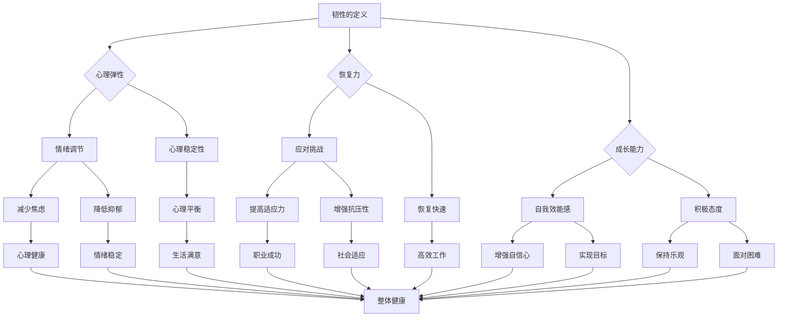

                 

### 《培养面对挫折的韧性：增强内在力量》

关键词：挫折、韧性、内在力量、心理调适、情绪管理、目标设定

摘要：本文旨在探讨如何在信息技术领域培养面对挫折的韧性，增强内在力量。文章首先介绍了挫折的普遍性和韧性的重要性，随后详细阐述了挫折的定义与分类、韧性的概念与特征。接着，文章从心理调适、情绪管理、自我认知提升等方面提出了增强内在力量的方法，并介绍了正念练习与冥想、自我激励与目标设定、建立支持网络等策略。最后，通过案例分析、应对策略和韧性持续培养等方面，提供了实际操作指南，帮助读者在实践中增强韧性，更好地面对挫折。

---

### 第一部分：挫折与韧性概述

#### 引言

在信息技术领域，工程师和开发者常常面临复杂的技术挑战和压力。这些挑战和压力往往来源于项目的不确定性、技术难题的解决、性能优化等。挫折是每位工程师在职业生涯中不可避免的一部分。它可能是项目失败、代码bug、技术竞赛失利，甚至是职业发展的瓶颈。然而，挫折并非全是坏事。适当的挫折可以帮助工程师们更快地成长，提高解决问题的能力。韧性，即面对挫折时的适应能力和恢复力，是工程师们能否在技术领域中持续发展的关键因素。

本文旨在为信息技术领域的从业者提供一套系统的韧性培养方法。通过了解挫折的普遍性，认识韧性的重要性，掌握增强内在力量的方法，以及实际操作中的应对策略，读者可以更好地应对挫折，提高自身在技术领域的竞争力。

#### 挫折的普遍性

在信息技术领域，挫折是普遍存在的。无论是新技术的学习，还是项目的开发，都充满了不确定性。例如：

1. **新技术学习**：随着技术的发展，工程师们需要不断学习新的编程语言、框架、工具等。然而，学习过程往往充满挑战，特别是对于一些复杂的技术概念。
   
2. **项目开发**：项目开发过程中，可能会遇到技术难题、需求变更、团队协作等问题。这些问题的解决需要时间和智慧，有时候甚至会带来压力和挫败感。

3. **职业发展**：在职业发展的道路上，工程师们可能会遇到晋升瓶颈、薪资谈判不顺等问题。这些挫折不仅会影响职业发展，还会对个人自信心产生负面影响。

因此，了解挫折的普遍性，有助于工程师们正确看待挫折，将其视为成长和发展的契机。

#### 韧性的重要性

韧性（Resilience）是指个体在面对压力、挑战和逆境时的适应能力和恢复力。在信息技术领域，韧性尤为重要。以下是一些原因：

1. **解决问题的能力**：拥有韧性的工程师在面对问题时，能够保持冷静，从失败中学习，不断尝试，最终找到解决方案。

2. **团队协作**：韧性的工程师能够更好地应对团队中的冲突和挑战，保持积极的态度，促进团队的合作与发展。

3. **职业发展**：韧性的工程师在职业生涯中能够更好地应对挫折和压力，保持持续的学习和进步，从而实现职业目标。

4. **心理健康**：韧性有助于工程师保持心理健康，减少因挫折带来的负面情绪，如焦虑、抑郁等。

总之，韧性是信息技术领域从业者必备的品质。通过本文的介绍，读者可以了解到如何通过培养内在力量，提高韧性，从而在职业生涯中更加成功。

#### 本书目的与结构

本文的目标是帮助信息技术领域的从业者培养面对挫折的韧性，增强内在力量。文章的结构分为四个部分：

1. **第一部分：挫折与韧性概述**：介绍挫折的普遍性和韧性的重要性，帮助读者建立对韧性的初步认识。

2. **第二部分：内在力量的培养**：详细探讨如何通过心理调适、情绪管理、自我认知提升等方法，增强内在力量。

3. **第三部分：面对挫折的韧性实践**：通过案例分析、应对策略和韧性持续培养等方面，提供实际操作指南。

4. **第四部分：总结与展望**：总结本文的主要观点，展望韧性在信息技术领域的未来。

通过本文的阅读和实践，读者可以更好地理解挫折与韧性的关系，掌握增强内在力量的技巧，从而在职业生涯中更加从容地面对挫折。

### 2. 挫折的定义与分类

#### 2.1 挫折的定义

挫折是指个体在实现目标过程中，遭遇的阻碍或失败。这些阻碍或失败可能来源于外部环境，如项目需求变更、技术难题等，也可能来源于个体内部，如心理压力、情绪困扰等。

从心理学角度来看，挫折通常包括以下几个方面：

1. **目标受阻**：个体在追求某一目标时，遇到了难以克服的障碍，导致目标难以实现。
   
2. **自我评价降低**：挫折可能导致个体对自己的能力和价值产生怀疑，降低自我评价。

3. **情绪困扰**：挫折往往伴随着负面情绪，如焦虑、沮丧、愤怒等。

4. **行为改变**：挫折可能引起个体的行为改变，如逃避、放弃、攻击等。

#### 2.2 挫折的类型

挫折可以分为多种类型，根据其产生的原因和表现形式，可以将其分为以下几类：

1. **预期性挫折**：预期性挫折是指在个体追求目标之前，就已经预料到可能会遇到的困难和失败。例如，在学习一项新技术时，个体可能已经知道这是一个复杂的过程，可能会遇到很多问题。

2. **意外性挫折**：意外性挫折是指个体在追求目标的过程中，突然遭遇的不可预见的困难和失败。例如，在项目开发过程中，突然发现了一个严重的bug，导致项目进展受阻。

3. **情境性挫折**：情境性挫折是指由于外部环境的变化，导致的挫折。例如，市场需求的变化、竞争对手的崛起等。

4. **自我引发的挫折**：自我引发的挫折是指个体由于自己的行为或决策，导致的挫折。例如，个体在项目中犯了一个严重的错误，导致项目失败。

#### 2.3 挫折的影响

挫折对个体的影响是复杂而多样的，可以从以下几个方面来考虑：

1. **心理影响**：挫折可能导致个体出现负面情绪，如焦虑、沮丧、愤怒等。长期处于挫折状态，可能会对个体的心理健康产生负面影响。

2. **行为影响**：挫折可能会影响个体的行为，如降低工作效率、逃避问题、放弃目标等。在某些情况下，挫折也可能激发个体的积极性，促使个体更加努力地解决问题。

3. **认知影响**：挫折可能会改变个体的认知结构，如对自我能力的评价、对环境的认识等。挫折可能会使个体更加谦虚、谨慎，也可能会使个体更加悲观、自责。

4. **社会影响**：挫折对个体的社会关系也有一定影响。挫折可能会使个体与他人的关系紧张，也可能会使个体更加依赖他人。

总之，挫折是信息技术领域从业者不可避免的一部分。了解挫折的定义与分类，有助于个体更好地应对挫折，提高韧性。

### 3. 韧性的概念与特征

#### 3.1 韧性的定义

韧性（Resilience）是指个体在面对压力、挑战和逆境时，能够适应、恢复和成长的能力。在信息技术领域，韧性尤为重要，因为它不仅关系到个人的职业发展，还影响到团队的合作和项目的成功。

从心理学角度来看，韧性可以定义为一种心理状态，它包括以下几个方面：

1. **适应能力**：韧性强的个体能够更好地适应环境的变化和挑战，能够灵活调整自己的行为和策略，以应对新的情况。

2. **恢复力**：韧性强的个体在遭遇挫折后，能够更快地恢复心理状态，重新投入到工作和生活中。

3. **成长能力**：韧性强的个体能够从挫折中学习和成长，不断提升自己的能力和智慧。

#### 3.2 韧性的特征

韧性具有以下几个主要特征：

1. **心理弹性**：韧性强的个体具有较强的心理弹性，能够应对各种压力和挑战，保持心理稳定。

2. **情绪稳定性**：韧性强的个体在面对挫折时，能够保持情绪的稳定性，不易产生过度的负面情绪。

3. **自我效能感**：韧性强的个体具有较高的自我效能感，相信自己能够应对挑战，实现目标。

4. **积极态度**：韧性强的个体在面对挫折时，能够保持积极的态度，将挫折视为成长的机会。

5. **适应能力**：韧性强的个体具有较强的适应能力，能够快速适应环境的变化和挑战。

6. **恢复力**：韧性强的个体在遭遇挫折后，能够迅速恢复，重新投入到工作和生活中。

7. **学习与成长**：韧性强的个体能够从挫折中学习和成长，不断提升自己的能力和智慧。

总之，韧性是信息技术领域从业者必备的品质。了解韧性的概念与特征，有助于个体更好地培养韧性，提高在面对挫折时的适应能力和恢复力。

### 3.3 韧性与心理健康

韧性不仅对个人的职业发展至关重要，还对心理健康产生深远的影响。以下是韧性对心理健康的一些积极影响：

1. **降低压力水平**：韧性强的个体能够更好地应对压力，减少因压力导致的身体和心理问题。

2. **提升情绪调节能力**：韧性强的个体在面对负面情绪时，能够更好地调节情绪，减少焦虑、抑郁等情绪问题。

3. **增强心理稳定性**：韧性强的个体在面对挑战和逆境时，能够保持心理的稳定性，减少因情绪波动导致的心理问题。

4. **促进心理成长**：韧性强的个体能够从挫折中学习和成长，不断提升自我认知和心理成熟度。

5. **改善人际关系**：韧性强的个体能够更好地与他人沟通和合作，改善人际关系，减少因人际冲突导致的心理问题。

6. **提升生活满意度**：韧性强的个体在面对生活挑战时，能够保持积极的生活态度，提升生活满意度。

总之，韧性是维护心理健康的关键因素。通过培养韧性，个体不仅可以更好地应对职业挑战，还能提升心理健康水平，享受更加幸福和满足的生活。

### 第二部分：内在力量的培养

#### 4. 增强内在力量的方法

在信息技术领域，培养内在力量是提升韧性的关键。以下几种方法可以帮助工程师们增强内在力量：

#### 4.1 心理调适技巧

心理调适技巧是增强内在力量的重要手段。以下是一些常用的心理调适技巧：

1. **正念冥想**：正念冥想是一种通过专注呼吸和身体感受，达到心理放松和情绪调节的技巧。通过定期进行正念冥想，工程师们可以减轻工作压力，提高心理韧性。

2. **情绪日记**：记录自己的情绪变化和感受，有助于工程师们更好地理解自己的情绪，找到情绪波动的根源，并采取相应的调节措施。

3. **积极心理训练**：通过积极心理训练，如自我暗示、正面思维等，工程师们可以培养积极的心态，提高面对挫折的勇气和信心。

4. **时间管理**：合理规划时间，确保工作和休息的平衡，有助于工程师们减轻心理压力，提高工作效率。

#### 4.2 情绪管理策略

情绪管理是增强内在力量的重要一环。以下是一些情绪管理策略：

1. **情绪宣泄**：找到合适的方式宣泄情绪，如与朋友倾诉、进行体育锻炼等。这有助于释放压力，避免情绪积累导致的心理问题。

2. **认知重构**：通过认知重构，即改变对事件的认知评价，工程师们可以减少因负面事件引发的消极情绪。例如，将“这次失败是因为我不够努力”重构为“这次失败给了我一个学习的机会”。

3. **放松训练**：通过深呼吸、渐进性肌肉松弛等放松训练，工程师们可以缓解紧张和焦虑，提高心理韧性。

4. **情绪调节技巧**：学习一些情绪调节技巧，如积极心理训练、认知重构等，可以帮助工程师们更好地管理情绪。

#### 4.3 自我认知提升

自我认知提升是增强内在力量的基础。以下是一些自我认知提升的方法：

1. **自我反思**：定期进行自我反思，评估自己的行为和决策，有助于工程师们了解自己的优点和不足，找到改进的方向。

2. **反馈与改进**：主动寻求他人的反馈，并结合自我反思，找出问题并进行改进。这有助于工程师们提升自我认知，增强内在力量。

3. **知识学习**：不断学习新的知识和技能，拓宽自己的认知范围，有助于工程师们提升自我认知，增强自信心。

4. **心理健康咨询**：在遇到心理问题时，及时寻求心理健康咨询，可以帮助工程师们更好地理解自己，提升内在力量。

通过以上方法，工程师们可以逐步增强内在力量，提高韧性，更好地应对职业挑战。

### 5. 正念练习与冥想

正念练习和冥想是增强内在力量和韧性的有效方法。以下将详细介绍正念的基本概念、练习方法以及冥想对韧性的影响。

#### 5.1 正念的基本概念

正念（Mindfulness）是一种专注于当前时刻、接受而不评判的心理状态。它起源于佛教的冥想实践，但已经被广泛地应用于心理学、医学和商界等领域。正念的核心在于培养对当前经验的全面觉察，包括身体感受、情绪和思维。

正念练习的几个关键要素包括：

1. **专注力**：通过专注于呼吸、身体感受或特定物体，提高注意力集中能力。
   
2. **接受性**：接受当前的感受和体验，而不是试图改变它们，这有助于减少内心的抵触和焦虑。
   
3. **无评判**：不对自己的体验进行评判，避免产生积极的或消极的情绪反应。

#### 5.2 正念练习方法

正念练习可以通过以下几种方法进行：

1. **呼吸冥想**：这是一种最常见的正念练习方法。通过专注于呼吸，可以减少焦虑，提高专注力。具体步骤如下：
   - 找一个安静的环境，采取舒适的坐姿。
   - 将注意力集中在呼吸上，感受每次呼吸的进出。
   - 如果注意力偏离，温和地将它引回到呼吸上。

2. **身体扫描**：通过逐个扫描身体的各个部分，提升对身体感受的觉察。具体步骤如下：
   - 从头部开始，慢慢扫描到脚部，专注于每个部位的感受。
   - 注意任何不适或紧张的地方，并尝试放松这些部位。

3. **正念行走**：通过专注于脚步与地面的接触，提升对身体的觉知。具体步骤如下：
   - 在一个安静的环境中慢慢走动。
   - 注意每一步的抬起和放下，感受脚与地面的接触。

4. **正念饮食**：通过缓慢地品尝每一口食物，提升对食物的觉知，减少进食时的分心。具体步骤如下：
   - 准备一份食物，专注于它的颜色、气味和口感。
   - 用较慢的速度进食，感受食物在口中的变化。

#### 5.3 冥想对韧性的影响

冥想作为一种正念练习，对增强韧性有显著作用。以下是冥想对韧性的几个主要影响：

1. **情绪调节**：冥想有助于减少焦虑和抑郁等负面情绪，提升情绪调节能力。通过定期冥想，个体能够更好地处理压力和挫折，提高韧性。

2. **注意力提升**：冥想训练有助于提高注意力集中能力，使个体在面临复杂任务时能够更好地集中精力，提高工作效率。

3. **自我认知**：冥想可以增强个体对自身情绪和思维的觉知，有助于自我反省和认知重构，从而提高内在力量。

4. **压力管理**：冥想有助于降低长期的压力水平，减少因压力导致的身体和心理问题，提升整体健康。

5. **心理韧性**：通过冥想，个体能够培养出更强的心理韧性，在面对挫折和逆境时能够保持冷静和乐观，快速恢复。

总之，正念练习和冥想是培养内在力量和韧性的有效方法。通过定期实践，信息技术领域的从业者可以提升心理韧性，更好地应对职业挑战。

### 6. 自我激励与目标设定

自我激励与目标设定是增强内在力量的重要组成部分，它们不仅能提高个人的工作效率，还能帮助个体在挫折面前保持积极态度。以下将详细探讨自我激励的重要性、目标设定的原则以及实现目标的策略。

#### 6.1 自我激励的重要性

自我激励是指个体通过内在动力和信念，主动追求目标、克服困难的过程。在信息技术领域，自我激励具有以下几个方面的作用：

1. **提高工作效率**：自我激励使个体能够保持高度的专注力和动力，从而提高工作效率，减少拖延现象。

2. **增强适应能力**：自我激励帮助个体在面对挫折和困难时保持积极态度，提高适应变化和挑战的能力。

3. **促进持续学习**：自我激励激发个体对知识和技能的渴望，推动个体不断学习新知识，提升自身能力。

4. **提升成就感**：通过自我激励，个体能够更好地实现目标，从而获得成就感和满足感，增强自信心。

5. **增强团队合作**：自我激励的个体能够更好地与他人合作，共同应对挑战，提高团队的整体绩效。

#### 6.2 目标设定的原则

设定明确、可实现的目标是自我激励的重要一环。以下是一些目标设定的原则：

1. **SMART原则**：目标应具体（Specific）、可衡量（Measurable）、可达成（Achievable）、相关（Relevant）和有时限（Time-bound）。例如，“在三个月内掌握Python编程语言”就是一个符合SMART原则的目标。

2. **小步前进**：将大目标分解为若干个小目标，逐步实现。这种方法有助于保持动力的持续性，同时也能带来更多的成就感。

3. **灵活性**：目标设定时应考虑到不确定性，留有一定的灵活性，以便在遇到困难时进行调整。

4. **有挑战性**：目标应具有一定的挑战性，以激发个体的内在动力和潜能。

5. **个人兴趣**：目标应与个人的兴趣和价值观相符合，这样个体才会更有动力去实现它。

#### 6.3 目标实现的策略

为了有效地实现目标，以下是一些策略：

1. **制定详细的计划**：为实现目标，需要制定详细的行动计划，包括具体的任务、时间表和资源分配。

2. **分解任务**：将大任务分解为小任务，明确每个任务的步骤和完成时间。

3. **定期回顾和调整**：定期回顾目标的进展情况，并根据实际情况进行调整。

4. **建立激励机制**：设定奖励机制，如在实现某个小目标后给予自己一些奖励，以保持持续的动力。

5. **寻求支持**：在实现目标的过程中，寻求家人、朋友或同事的支持和鼓励，有助于克服困难，保持动力。

6. **保持积极心态**：在面对挫折时，保持积极的心态，相信自己的能力，积极寻找解决问题的方法。

通过自我激励和目标设定，信息技术领域的从业者可以更有效地面对挫折，提高内在力量，实现职业和个人目标。

### 7. 建立支持网络

#### 7.1 社交支持的作用

建立支持网络对于增强内在力量至关重要。社交支持不仅能够提供情感上的慰藉，还能在面临挫折时给予实际的帮助。以下是一些社交支持的作用：

1. **情感支持**：社交支持网络可以帮助个体缓解负面情绪，如焦虑、沮丧等。当个体遇到困难时，朋友和家人的鼓励和支持能够极大地减轻心理压力。

2. **信息支持**：在信息技术领域，建立支持网络有助于获取最新的技术信息、行业动态和职业机会。这种信息支持可以帮助个体保持竞争力，更好地应对职业挑战。

3. **资源支持**：社交网络可以提供各种资源，如技术工具、学习资料和职业指导等。这些资源能够帮助个体更快地解决问题，提高工作效率。

4. **职业发展**：通过社交网络，个体可以获得职业建议、职业机会和职业晋升的帮助。这些支持有助于个体在职业发展中取得更好的成绩。

5. **社会认同**：社交网络可以提供社会认同，增强个体的自信心和自尊心。这种认同感能够激励个体在面临挫折时保持积极态度。

#### 7.2 寻找合适的支持者

为了建立有效的支持网络，需要寻找合适的支持者。以下是一些建议：

1. **共同兴趣**：寻找具有相同兴趣和目标的人，这样更容易建立深厚的关系。例如，可以参加技术社区、编程小组或行业会议，与志同道合的人交流。

2. **多样性和互补性**：支持网络应该具备多样性和互补性，包括不同背景、经验和技能的人。这样可以在面临不同问题时获得多角度的见解和建议。

3. **信任和尊重**：建立信任和尊重是维护支持网络的关键。通过真诚地倾听和尊重他人的观点，可以建立长久的合作关系。

4. **持续沟通**：定期与支持者保持沟通，分享自己的经历和感受，同时倾听他们的故事和建议。这样可以保持关系的活力，增强互帮互助的效果。

#### 7.3 支持网络的建立与维护

建立和维护支持网络需要一定的策略和努力。以下是一些建议：

1. **主动参与**：积极参与社交活动，如技术会议、行业研讨会和在线社区。这样可以扩大社交圈，增加结识新朋友的机会。

2. **主动求助**：在需要帮助时，不要害怕寻求他人的支持。通过明确地表达自己的需求，可以得到他人的帮助和指导。

3. **回馈他人**：在他人需要帮助时，主动提供帮助和支持。这样不仅可以建立深厚的友谊，还能增强自己的社交网络。

4. **定期交流**：通过邮件、电话或社交媒体与支持者保持联系，分享彼此的进展和挑战。这样可以保持关系的活力，增强彼此的支持。

5. **感谢与赞赏**：对给予帮助和支持的人表示感激和赞赏。这种正面的反馈可以增强彼此的信任和关系。

通过建立和支持网络，信息技术领域的从业者可以获得更多的情感、信息和资源支持，从而增强内在力量，更好地应对职业挑战。

### 8. 案例研究：成功克服挫折的故事

#### 8.1 故事一：从失败中重新崛起

李明是一名软件工程师，他在一家知名互联网公司工作。一次，公司接到了一个重要项目，负责开发一款新的移动应用。这个项目对公司的战略发展至关重要，因此团队压力非常大。

然而，在项目开发过程中，李明负责的核心模块出现了严重的问题。经过多次调试，问题依然未能解决。这导致整个项目进度严重滞后，团队成员情绪低落，项目面临失败的风险。

面对这种情况，李明没有选择逃避或放弃。他首先进行了深刻的自我反思，找出了问题出现的原因。然后，他开始积极寻找解决方案，不仅请教了其他团队成员，还查阅了大量相关资料。

在经历了数周的艰苦努力后，李明终于找到了解决问题的方法。他重新设计了模块的架构，并成功解决了问题。这个关键时刻的成功，不仅挽救了项目，还赢得了团队成员的尊重和信任。

通过这次经历，李明学会了如何从失败中吸取教训，重新崛起。他深刻体会到，面对挫折，坚韧和勇气是取得成功的关键。

#### 8.2 故事二：逆境中的成长

张丽是一名年轻的软件工程师，她刚刚进入一家初创公司。公司正处于快速发展的阶段，团队成员都非常年轻，缺乏经验。一次，公司接到了一个重要的客户项目，需要在短时间内完成。

然而，项目刚启动不久，张丽就遇到了一个巨大的技术难题。她负责的模块无法正常运行，导致整个项目进度严重滞后。张丽感到非常沮丧，甚至开始怀疑自己的能力。

然而，她并没有放弃。她开始主动寻找解决方案，与团队成员和客户进行多次沟通，尝试从不同角度解决问题。在经过几周的艰苦努力后，张丽终于找到了问题的根源，并成功解决了这个难题。

这次经历让张丽深刻认识到，逆境是成长的机会。在面对挫折时，只要不放弃，就一定能够找到解决问题的方法。这次成功不仅提升了她的技术能力，还增强了她的自信心。

#### 8.3 故事三：韧性带来的转变

王强是一名资深软件工程师，他在一家大型科技公司工作多年。一次，公司接到了一个极具挑战性的项目，需要在短时间内开发一款高度复杂的新系统。这个项目对公司的未来发展至关重要，因此公司投入了大量的资源和人力。

然而，项目进行到一半时，王强发现他们面临了一个巨大的技术难题。这个问题涉及到多个模块的协作，需要极高的技术水平和经验。王强和他的团队在尝试了多种方法后，仍然无法解决问题。

面对这种情况，王强感到非常焦虑，但他没有选择放弃。他决定带领团队进行彻底的反思，找出问题出现的根本原因。他们重新设计了系统的架构，并引入了一些新的技术方法。在经过数月的艰苦努力后，他们终于成功地解决了这个问题。

这次经历不仅让王强和他的团队解决了技术难题，还极大地提升了他们的团队合作能力和韧性。王强深刻体会到，韧性是面对挫折时的关键品质，它能够帮助团队克服困难，实现目标。

### 9. 应对挫折的策略

在信息技术领域，工程师和开发者常常面临各种挑战和压力。面对挫折，有效的应对策略能够帮助从业者保持冷静、找到解决问题的方法，从而顺利度过困难时期。以下是一些应对挫折的策略：

#### 9.1 应对挫折的心理准备

1. **接受挫折的普遍性**：首先，要认识到挫折是职业生涯中不可避免的一部分。接受这一点有助于减少因挫折带来的心理压力。

2. **建立积极的自我认知**：在遇到挫折时，保持对自己的信心和积极的自我评价。认识到每个人都会遇到困难，关键是如何面对和克服。

3. **培养适应能力**：在面对挫折时，要学会灵活调整自己的心态和行为，适应环境的变化。这种适应能力有助于更好地应对挑战。

4. **建立心理支持系统**：寻找家人、朋友或同事的支持，与他们分享自己的困扰和压力。心理支持有助于缓解负面情绪，提高应对挫折的能力。

#### 9.2 制定应对计划

1. **问题识别**：首先，明确问题所在。通过详细分析问题的原因和影响，找到问题的根源。

2. **目标设定**：设定明确的短期和长期目标。短期目标有助于解决问题，长期目标有助于保持对未来的信心。

3. **资源调配**：评估所需资源，包括时间、人力、技术等。合理调配资源，确保问题能够得到有效解决。

4. **行动方案**：制定具体的行动方案，包括每个步骤的执行时间和责任人。确保行动方案具有可操作性和可行性。

5. **风险评估**：评估可能出现的风险和挑战，制定相应的应对措施。这有助于在问题出现时迅速反应，减少损失。

#### 9.3 执行与调整

1. **严格执行**：按照制定的计划执行，确保每个步骤都能按时完成。

2. **监控进展**：定期检查问题的进展情况，及时发现并解决问题。

3. **及时调整**：根据实际情况，及时调整计划和行动方案。灵活应对变化，保持目标的实现。

4. **总结反思**：在问题解决后，进行总结和反思。分析成功和失败的原因，为未来的应对提供经验。

通过以上策略，信息技术领域的从业者可以更有效地应对挫折，保持冷静和信心，从而在职业生涯中取得更大的成功。

### 10. 韧性的持续培养

#### 10.1 韧性的自我评估

培养韧性是一个持续的过程，定期进行自我评估是关键。以下是一些自我评估的方法：

1. **情绪记录**：每天记录自己的情绪变化，分析哪些因素导致了负面情绪，并思考如何改进。

2. **应对策略回顾**：回顾自己面对挫折时采取的应对策略，评估这些策略的有效性，并寻找改进的方法。

3. **目标达成情况**：定期评估设定的目标是否达成，分析成功和失败的原因，调整策略以实现更好的结果。

4. **反馈与建议**：寻求家人、朋友或同事的反馈，了解自己在面对挫折时的表现，并根据他们的建议进行改进。

#### 10.2 韧性的日常培养

日常生活中的小习惯和练习可以逐步增强韧性。以下是一些建议：

1. **正念练习**：每天花几分钟时间进行正念冥想，专注于呼吸和当下的感受，有助于提高心理韧性。

2. **情绪管理**：学习情绪管理技巧，如深呼吸、渐进性肌肉放松等，帮助自己更好地调节情绪。

3. **积极心理训练**：通过积极的自我暗示和正面思维，培养乐观的心态，提高应对挫折的能力。

4. **时间管理**：合理规划时间，确保工作和休息的平衡，减少因过度工作导致的压力。

5. **社交活动**：积极参与社交活动，与他人交流和分享，增强社交支持网络，提高心理韧性。

#### 10.3 韧性的长远规划

为了在长期内保持韧性，需要制定长远规划。以下是一些建议：

1. **职业发展计划**：明确自己的职业目标，制定实现这些目标的长期计划，包括学习新技能、晋升路径等。

2. **心理健康维护**：定期进行心理健康检查，寻求专业心理咨询，确保心理健康。

3. **持续学习**：不断学习新知识和技能，保持对行业的敏锐洞察力，提高应对变化和挑战的能力。

4. **生活平衡**：注重生活平衡，确保工作、家庭和个人兴趣的和谐发展，避免因过度工作导致的身心疲惫。

5. **长期规划**：将韧性的培养纳入个人和职业发展规划，定期评估和调整，确保长期目标的实现。

通过持续的自我评估、日常培养和长远规划，信息技术领域的从业者可以逐步增强韧性，更好地应对职业生涯中的各种挑战。

### 第四部分：总结与展望

#### 11. 韧性的价值与意义

韧性是信息技术领域从业者必备的品质，它不仅关系到个人的职业发展，还对团队协作、项目成功以及心理健康产生深远影响。以下是一些关键观点：

1. **职业发展的基石**：韧性帮助工程师们在面对挫折时保持冷静和信心，从而更快地成长和晋升。

2. **团队协作的关键**：韧性强的团队成员能够更好地应对冲突和挑战，促进团队的合作和发展。

3. **项目成功的保障**：韧性有助于团队在面临技术难题和压力时，保持高效的工作状态，提高项目成功率。

4. **心理健康的影响**：韧性有助于工程师们减少因挫折导致的负面情绪，提升心理健康水平。

#### 11.1 韧性对个人发展的作用

韧性对个人发展具有以下几个方面的作用：

1. **增强适应能力**：韧性强的个体能够更好地适应环境的变化和挑战，提高工作效率。

2. **促进持续学习**：韧性帮助个体从挫折中学习和成长，不断提升自身的知识和技能。

3. **提高自我效能感**：韧性强的个体相信自己能够应对各种挑战，从而提高自我效能感，增强自信心。

4. **改善职业发展**：韧性有助于个体在职业生涯中保持积极的态度，实现更高的职业目标。

#### 11.2 韧性对社会的影响

韧性不仅对个人发展有积极影响，对社会也具有重要意义：

1. **促进社会和谐**：韧性帮助人们更好地应对生活中的挑战，减少社会冲突，促进社会和谐。

2. **提高社会生产力**：韧性强的社会成员能够更高效地应对各种挑战，提高社会整体的生产力和创新能力。

3. **推动社会进步**：韧性是社会进步的重要驱动力，它能够帮助社会成员在面对变革和挑战时保持积极的态度，推动社会的持续发展。

#### 11.3 韧性的未来展望

随着信息技术的不断发展和应用，韧性将在未来扮演更加重要的角色：

1. **技术挑战的应对**：随着技术的复杂性和不确定性增加，韧性将成为工程师们应对技术挑战的重要品质。

2. **人工智能的融合**：人工智能技术的应用将提高工作复杂性和压力，韧性将在人工智能时代发挥更大的作用。

3. **心理健康的重要性**：随着人们对心理健康重视程度的提高，韧性将成为提升心理健康水平的重要途径。

4. **终身学习的趋势**：在终身学习的时代，韧性将帮助个体更好地适应不断变化的学习和工作环境。

总之，韧性是信息技术领域从业者不可或缺的品质。通过培养韧性，个体可以更好地应对职业挑战，提高心理健康水平，为个人的发展和社会的进步做出贡献。

### 12. 结语

#### 12.1 本书要点回顾

本文围绕“培养面对挫折的韧性：增强内在力量”这一主题，系统性地介绍了挫折的普遍性、韧性的重要性、内在力量的培养方法、面对挫折的韧性实践以及韧性的持续培养。以下是本文的主要要点回顾：

1. **挫折的普遍性**：在信息技术领域，挫折是不可避免的，它源于项目的不确定性、技术难题等。
   
2. **韧性的重要性**：韧性是面对挫折时的适应能力和恢复力，对个人职业发展和心理健康至关重要。

3. **内在力量的培养**：通过心理调适、情绪管理、自我认知提升等方法，可以增强内在力量，提高韧性。

4. **韧性实践**：通过案例分析、应对策略和韧性持续培养等方面，提供实际操作指南，帮助读者在日常生活中增强韧性。

5. **持续培养**：通过自我评估、日常培养和长远规划，确保韧性的长期发展。

#### 12.2 对读者的启示

本文旨在为信息技术领域的从业者提供一套系统的韧性培养方法。以下是对读者的几点启示：

1. **正确看待挫折**：挫折是成长的机会，不要将其视为失败，而是要从中学习和成长。

2. **培养内在力量**：通过心理调适、情绪管理和自我认知提升等方法，逐步增强内在力量。

3. **实践韧性策略**：将本文介绍的方法应用到日常生活中，持续培养韧性。

4. **建立支持网络**：与家人、朋友和同事保持良好关系，建立强大的社交支持网络。

5. **持续自我提升**：定期进行自我评估和反思，持续提升自身能力和韧性。

#### 12.3 韧性的持续实践

韧性是一种需要持续培养和锻炼的品质。以下是一些建议，帮助读者在日常生活中持续实践韧性：

1. **每日正念冥想**：每天花几分钟时间进行正念冥想，专注于呼吸和当下的感受。

2. **情绪记录**：每天记录情绪变化，分析情绪的触发因素，学会情绪管理。

3. **积极心态**：保持积极的心态，通过正面思维和自我暗示，增强自信心。

4. **目标设定**：设定明确的短期和长期目标，制定实现目标的计划，并严格执行。

5. **社交活动**：积极参与社交活动，与他人交流和分享，增强社交支持网络。

通过持续实践韧性，信息技术领域的从业者可以更好地应对职业挑战，实现个人的职业和心理健康目标。

### 附录

#### 附录 A：进一步阅读资源

为了帮助读者深入了解韧性和心理健康的主题，本文提供了一些进一步阅读的资源：

1. **经典著作**：
   - **《韧性：如何在压力中成长与焕发》（"Resilience: How to Navigate Life's Curves with Grace" by Eric H. Lumia, M.D.）**：这本书详细介绍了韧性的概念和培养方法。
   - **《正念：生活中的练习与反思》（"Mindfulness: An Eight-Week Plan for Finding Peace in a Frantic World" by Mark Williams, John Teasdale, and Zindel V. Segal）**：这本书提供了实用的正念练习方法，帮助读者提高心理韧性。

2. **最新研究**：
   - **《韧性心理学：理论、研究与实践》（"Resilience Psychology: Theory, Research, and Practice" by Albert J. Mills, M. D.）**：这本书汇总了最新的韧性心理学研究成果，涵盖了理论、研究和实际应用。
   - **《情绪韧性：如何战胜压力、焦虑和抑郁》（"Emotional Resilience: A Step-by-Step Guide to Developing Inner Strength and Overcoming Life's Challenges" by Leslie S. Diamond）**：这本书提供了针对情绪韧性的具体策略和技巧。

3. **网络资源**：
   - **Coursera**：提供了多个关于心理韧性和正念的在线课程，包括《正念冥想基础》、《情绪调节与心理健康》等。
   - **Mindfulness App**：提供了一系列正念冥想练习，帮助用户在日常生活中实践正念。

通过这些资源，读者可以进一步深入学习和实践韧性，提升自身的心理素质。

#### 附录 B：韧性与心理健康的关系研究 Mermaid 流程图

以下是一个关于韧性与心理健康关系的Mermaid流程图：



该流程图展示了韧性（包括心理弹性、恢复力和成长能力）与心理健康（情绪调节、心理稳定性、心理平衡）以及职业成功、社会适应和整体健康之间的复杂关系。通过这种视觉化的展示，读者可以更直观地理解韧性对心理健康的全面影响。

#### 附录 C：Python代码示例

为了帮助读者更好地理解内在力量的培养方法，以下是一个简单的Python代码示例，用于实现情绪管理的算法。

```python
import random

def positive_thought_generator():
    """生成积极的自我暗示"""
    positive_thoughts = [
        "我能够克服任何困难。",
        "每个挑战都是成长的机会。",
        "我值得拥有成功和幸福。",
        "我的能力让我能够应对所有挑战。",
        "每一天都是新的开始，我会做得更好。"
    ]
    return random.choice(positive_thoughts)

def emotional_management_strategy():
    """情绪管理策略实现"""
    print("开始情绪管理练习...")
    for _ in range(5):
        print(positive_thought_generator())
        time.sleep(2)
    print("情绪管理练习完成。")

def meditation_practice():
    """冥想练习代码示例"""
    print("开始正念冥想练习...")
    for _ in range(5):
        print("专注于呼吸...")
        time.sleep(5)
    print("冥想练习完成。")

# 调用情绪管理策略和冥想练习
emotional_management_strategy()
meditation_practice()
```

该代码示例包含两个部分：情绪管理策略和冥想练习。情绪管理策略通过生成积极的自我暗示来帮助用户调节情绪，而冥想练习则提供了一个简单的正念冥想练习流程。读者可以通过运行这段代码，亲身体验情绪管理和冥想对内在力量的培养作用。

### 附录 D：最佳实践 Tips、小结、注意事项、拓展阅读

#### 最佳实践 Tips

1. **定期冥想**：每天花几分钟时间进行冥想，有助于提高心理韧性。
2. **积极心态**：在面对挫折时，保持积极的心态，有助于更快地恢复。
3. **设定明确目标**：使用SMART原则（具体、可衡量、可达成、相关、有时限）设定目标，提高实现目标的几率。
4. **寻求支持**：遇到困难时，及时寻求家人、朋友或专业人士的支持。

#### 小结

本文系统地介绍了韧性在信息技术领域的重要性，包括挫折的普遍性、韧性的定义与特征、内在力量的培养方法、韧性实践策略以及持续培养的方法。通过学习本文，读者可以更好地理解韧性，掌握培养内在力量的技巧，从而在面对挫折时更加从容不迫。

#### 注意事项

1. **心理健康**：韧性培养过程中，要注意心理健康，避免过度压力和焦虑。
2. **灵活调整**：在实现目标过程中，要根据实际情况灵活调整策略。
3. **持续实践**：韧性培养需要长期坚持，不能一蹴而就。

#### 拓展阅读

- **《积极心理学：应用与实践》**：介绍积极心理学的理论和应用方法，对提升韧性有很大帮助。
- **《高效能人士的七个习惯》**：详细阐述了个人成长和职业发展的策略，有助于提高内在力量。
- **《情绪智力》**：探讨情绪智力的重要性，提供情绪管理的实用技巧。

通过拓展阅读，读者可以进一步深入了解韧性培养的相关知识，提升自身能力和素质。

