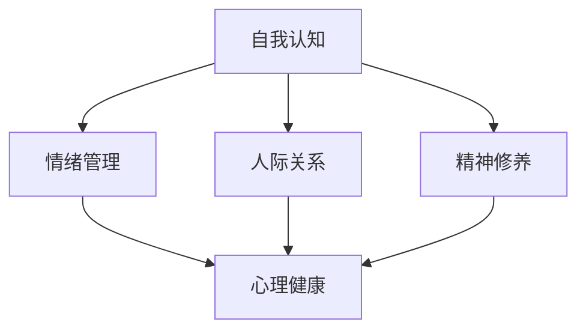

                 


### 培育内在世界：滋养心灵的成长土壤

#### 关键词：
- 内在成长
- 心灵滋养
- 自我认知
- 情绪管理
- 人际关系
- 精神修养
- 持续成长

#### 摘要：
在现代快节奏的生活中，培养内在世界对于心灵的成长变得尤为重要。本文将从自我认知、情绪管理、人际关系、精神修养等方面，探讨如何通过科学的方法和步骤，滋养心灵的成长土壤，实现个人的内在成长。

## 第1章: 引言

随着科技的发展和社会的进步，我们的生活节奏越来越快，工作压力和竞争压力不断增加。在这种背景下，许多人开始关注如何保持心理健康和实现个人成长。然而，心理健康和个人成长不仅仅依赖于外在的物质条件，更重要的是内在的修养和自我认知。

### 背景介绍

内在成长，是指个体通过自我探索、情绪管理、人际交往和精神修养等方面，实现心灵的健康成长和自我提升。内在世界的丰富和稳定，是个人幸福感、满意度和生活质量的基石。

#### 核心概念与联系

在探讨内在成长的过程中，以下几个核心概念需要明确：

- **自我认知**：指个体对自身心理状态、情感和行为模式的认知和理解。
- **情绪管理**：涉及识别、理解和调节自己的情绪，以达到心理平衡和健康。
- **人际关系**：包括个体与他人的互动和沟通，对个人的心理健康和社会适应能力具有重要影响。
- **精神修养**：涉及个体对内心世界的修持和提升，以达到精神层面的满足和安宁。

这些核心概念相互关联，共同构成了内在世界的结构。下面是一个简单的 Mermaid 流程图，展示了这些概念之间的关系：



#### 核心概念原理

- **自我认知**：通过自我反思和观察，个体可以更好地了解自己的内心世界，包括自己的优点、缺点、价值观和信念。这种认知有助于个体在面对挑战和困境时，做出更明智的决策。
- **情绪管理**：情绪是人类情感体验的一部分，合理地管理和调节情绪，有助于个体保持心理平衡和健康。情绪管理包括识别情绪、理解情绪背后的原因、调节情绪表达和处理负面情绪。
- **人际关系**：人际关系对个体的心理健康具有重要影响。建立和谐的人际关系，可以提供情感支持和社会支持，有助于个体应对生活中的压力和挑战。
- **精神修养**：精神修养是指个体通过冥想、禅修、阅读等途径，提升自己的精神境界，达到内心的平静和满足。精神修养有助于个体在面对生活中的困难时，保持积极的心态和乐观的情绪。

## 第2章: 内在世界的探索

### 探索内在世界的路径

要培养内在世界，我们需要采取一系列具体的步骤和方法。以下是探索内在世界的几个关键路径：

#### 2.1 聆听内心的声音

聆听内心的声音，是探索内在世界的第一步。这意味着我们需要花时间去静下心来，倾听自己的内心感受和想法。以下是一些实践建议：

- **每天花时间冥想**：冥想可以帮助我们放松身心，提高注意力，更好地与自己的内心进行沟通。初学者可以从每天5分钟的冥想开始，逐渐增加到每天20分钟。
- **写日记**：写日记是一种很好的自我反思的方式。通过记录自己的想法、感受和经历，我们可以更好地了解自己的内心世界。
- **自我对话**：与自己的内心进行对话，可以帮助我们更好地理解自己的需求和期望。通过这种对话，我们可以发现自己内心深处的声音。

#### 2.2 深度自我反思

深度自我反思是探索内在世界的另一条重要路径。以下是一些深度自我反思的实践方法：

- **提问自己**：通过提出深刻的问题，例如“我的人生目标是什么？”、“我的人生价值观是什么？”等，我们可以更好地理解自己的内心世界。
- **情境反思**：将自己在特定情境下的感受和反应写下来，并尝试分析这些反应背后的原因。这种方法可以帮助我们更好地了解自己的情绪和行为模式。
- **与导师或心理咨询师交流**：与有经验的导师或心理咨询师交流，可以帮助我们更深入地探索自己的内心世界，并获得专业的指导和支持。

#### 2.3 发展自我认知

发展自我认知是培养内在世界的关键。以下是一些发展自我认知的方法：

- **接受自己**：接受自己的优点和缺点，理解自己的独特性和个体差异。这种自我接受可以帮助我们更好地理解自己的内心世界。
- **持续学习**：通过阅读、参加课程、与不同的人交流等方式，不断扩展自己的知识和视野。这种持续学习可以增强我们的自我认知能力。
- **自我挑战**：通过设定目标并努力实现它们，我们可以更好地了解自己的能力和潜力。自我挑战可以促进我们的自我认知和发展。

### 联系与意义

探索内在世界对于个人成长和发展具有重要意义。通过探索内在世界，我们可以：

- **提高自我认知**：更好地了解自己的内心世界，包括自己的优点、缺点、价值观和信念。
- **增强心理韧性**：通过理解和调节情绪，提高应对压力和挑战的能力。
- **建立健康的人际关系**：更好地理解自己和他人，建立和谐的人际关系。
- **提升生活质量**：通过精神修养和内在成长，提高生活质量和幸福感。

## 第3章: 自我认知与成长

### 探索自我认知

自我认知是内在成长的基础。通过自我认知，个体可以更好地了解自己的内心世界，包括自己的价值观、信念、兴趣和需求。以下是探索自我认知的几个关键步骤：

#### 3.1.1 自我反思

自我反思是探索自我认知的第一步。通过定期花时间思考自己的行为、感受和想法，个体可以更深入地了解自己的内心世界。以下是一些自我反思的实践方法：

- **写反思日记**：每天或每周写一篇反思日记，记录自己的想法、感受和行为。通过这种方式，个体可以更清晰地看到自己的内心世界。
- **与朋友或家人交流**：与信任的朋友或家人分享自己的感受和想法，获得他们的反馈和建议。这种交流可以帮助个体更全面地了解自己。

#### 3.1.2 提问自己

通过提问自己，个体可以更深入地探索自己的内心世界。以下是一些有助于自我认知的问题：

- **我的人生目标是什么？**
- **我最看重的是什么？**
- **我的价值观是什么？**
- **我在生活中最快乐的事情是什么？**
- **我害怕什么？**
- **我的优点和缺点是什么？**
- **我如何处理负面情绪？**

#### 3.1.3 接受自己

接受自己，包括接受自己的优点和缺点，是自我认知的重要一步。以下是一些接受自己的实践方法：

- **练习自我肯定**：每天对自己说一些积极的话，例如“我是有价值的”、“我有能力克服困难”等。这种自我肯定可以帮助个体建立积极的自我认知。
- **认识到自己的独特性**：每个人都是独一无二的，接受自己的独特性，有助于个体更好地理解自己的内心世界。

### 心理健康的重要性

心理健康是自我认知和成长的重要组成部分。一个健康的心理状态有助于个体更好地应对生活中的挑战和压力。以下是心理健康的重要性以及如何维护心理健康的一些方法：

#### 3.2.1 心理健康的重要性

- **提高生活质量**：心理健康有助于个体享受生活，提高生活质量。
- **增强抗压能力**：一个健康的心理状态可以使个体更好地应对压力和挑战。
- **提高人际关系质量**：心理健康有助于个体建立和维护健康的人际关系。
- **促进个人成长**：一个健康的心理状态可以促进个体的自我认知和内在成长。

#### 3.2.2 维护心理健康的方法

- **保持积极的生活态度**：积极的生活态度有助于个体更好地应对生活中的挑战。
- **建立良好的生活习惯**：充足的睡眠、健康的饮食和适度的运动有助于维护心理健康。
- **学习情绪管理技巧**：识别、理解和调节情绪，有助于个体保持心理平衡。
- **寻求专业帮助**：当遇到心理问题时，及时寻求心理咨询师或其他专业帮助。

### 自我提升的路径

自我提升是内在成长的重要一环。通过自我提升，个体可以不断提高自己的能力和素质，实现个人目标。以下是自我提升的几个关键步骤：

#### 3.3.1 设定目标

设定目标是自我提升的第一步。一个明确的目标可以帮助个体有针对性地进行自我提升。以下是一些设定目标的实践方法：

- **具体、可衡量、可实现、相关性强、时限性**（SMART）的目标设定方法。
- **将大目标分解为小目标**：通过将大目标分解为小目标，个体可以更容易地实现目标。

#### 3.3.2 持续学习

持续学习是自我提升的重要途径。以下是一些持续学习的实践方法：

- **阅读**：阅读可以扩展知识，提高思维能力。
- **参加培训课程**：参加专业培训课程，可以提升专业技能。
- **实践**：通过实际操作和应用所学知识，个体可以更好地掌握技能。

#### 3.3.3 反思与调整

在自我提升的过程中，反思和调整是非常重要的。通过反思和调整，个体可以不断优化自己的学习方法和策略。以下是一些反思与调整的实践方法：

- **定期回顾和评估**：定期回顾和评估自己的进步，了解自己的优势和不足。
- **根据反馈进行调整**：根据他人的反馈和自己的感受，调整自己的学习方法和策略。

## 第4章: 情绪管理

### 情绪的类型与认知

情绪是人类情感体验的一部分，分为积极情绪和消极情绪。积极情绪如喜悦、兴奋和满足，有助于提高个体的生活质量和幸福感。消极情绪如愤怒、焦虑和抑郁，如果处理不当，会对个体的心理健康产生负面影响。

#### 4.1.1 情绪的类型

- **积极情绪**：喜悦、兴奋、满足、感激、爱等。
- **消极情绪**：愤怒、焦虑、抑郁、恐惧、悲伤等。

#### 4.1.2 情绪的认知

情绪的认知是指个体对自身情绪的识别和理解。情绪的认知能力对于情绪的管理和调节至关重要。以下是一些提高情绪认知能力的实践方法：

- **自我观察**：通过自我观察，个体可以更好地识别和理解自己的情绪。
- **情绪日记**：记录情绪的变化和触发因素，有助于个体更深入地理解自己的情绪。
- **情绪标签**：给不同的情绪贴上标签，有助于个体更准确地识别和理解自己的情绪。

### 情绪的处理策略

情绪的处理策略是指个体在面临情绪挑战时，采取的具体行动和技巧。有效的情绪处理策略可以帮助个体更好地调节情绪，保持心理平衡。

#### 4.2.1 认知重构

认知重构是一种通过改变思维方式和观念来调节情绪的方法。以下是一些认知重构的实践方法：

- **识别负面思维**：识别和认识到自己的负面思维模式，例如“我做不到”或“我一无是处”。
- **质疑负面思维**：质疑负面思维的合理性和证据，例如“这个情况真的那么糟糕吗？”或“我真的无法解决这个问题吗？”。
- **建立积极思维**：建立积极的思维模式，例如“我可以做到”或“我会找到解决办法”。

#### 4.2.2 情绪释放

情绪释放是指通过特定的方法来释放和缓解负面情绪。以下是一些情绪释放的实践方法：

- **呼吸练习**：通过深呼吸，个体可以缓解紧张和焦虑情绪。
- **运动**：运动可以帮助释放压力和负面情绪，提升心情。
- **写情绪日记**：通过写情绪日记，个体可以释放内心的情绪，减轻心理负担。

#### 4.2.3 情绪调节

情绪调节是指通过特定的方法来调节情绪，使其达到一个较为平衡的状态。以下是一些情绪调节的实践方法：

- **认知行为疗法**：通过认知行为疗法，个体可以学会更有效地应对情绪挑战。
- **心理辅导**：通过心理辅导，个体可以获得专业的情绪调节指导和支持。
- **社交支持**：与亲朋好友交流，分享自己的情绪和困扰，可以获得情感支持和理解。

### 建立积极的情绪习惯

建立积极的情绪习惯是情绪管理的重要一环。通过培养积极的情绪习惯，个体可以更好地调节情绪，提高生活质量和幸福感。

#### 4.3.1 积极情绪的来源

- **人际互动**：与亲朋好友的积极互动可以带来积极的情绪体验。
- **成就感**：通过实现目标、完成任务和获得成就感，个体可以体验到积极的情绪。
- **环境**：营造一个舒适、和谐的环境，有助于提升积极的情绪体验。

#### 4.3.2 培养积极情绪的习惯

- **定期锻炼**：定期锻炼可以提升身体的健康水平，同时释放积极的情绪。
- **保持乐观态度**：保持乐观的态度，学会从困难中寻找机会和成长。
- **感恩练习**：通过感恩练习，个体可以培养对生活中美好事物的感激和珍惜。
- **正面思考**：学会用积极的眼光看待事物，减少负面情绪的产生。

## 第5章: 人际关系与沟通

### 人际关系的本质

人际关系是人类社会生活中不可或缺的一部分，它涉及个体与个体之间的互动和沟通。良好的人际关系对个人的心理健康和社会适应能力具有积极影响。

#### 5.1.1 人际关系的类型

- **亲密关系**：如家庭关系、亲密伴侣关系等，这些关系对个体的情感支持和社会归属感至关重要。
- **友谊关系**：朋友关系对个体的心理支持和社会网络具有重要意义。
- **同事关系**：同事关系对个体的职业发展和工作满意度具有重要影响。
- **社会关系**：如社区关系、社交圈等，这些关系有助于个体融入社会，获得社会支持和资源。

#### 5.1.2 人际关系的本质

人际关系的本质是人与人之间的相互作用和相互影响。以下是一些关于人际关系本质的核心概念：

- **互惠性**：人际关系是相互的，双方都从中获得利益和支持。
- **互动性**：人际关系是通过不断的互动和沟通来维系的。
- **情感性**：人际关系涉及情感交流，情感支持对关系的发展至关重要。
- **复杂性**：人际关系是复杂的，涉及多个维度，如情感、行为、认知等。

### 沟通技巧的提升

沟通技巧是建立和维护良好人际关系的关键。有效的沟通技巧可以帮助个体更好地表达自己的想法和感受，理解他人的需求和期望，促进双方的相互理解和信任。

#### 5.2.1 沟通技巧的类型

- **倾听技巧**：倾听是有效沟通的基础，通过倾听，个体可以更好地理解他人的需求和感受。
- **表达技巧**：通过清晰、准确地表达自己的想法和感受，个体可以促进双方的沟通和理解。
- **非语言沟通**：非语言沟通包括肢体语言、面部表情、语调等，它对沟通的效果具有重要影响。
- **反馈技巧**：给予有效的反馈，可以帮助个体更好地理解他人，同时也能使沟通更加高效和有建设性。

#### 5.2.2 提高沟通技巧的方法

- **练习**：通过不断的练习，个体可以提升自己的沟通技巧。可以参加沟通技巧培训课程，或与教练进行一对一的沟通练习。
- **自我反思**：通过反思自己的沟通经历，个体可以发现自己在沟通中的不足，并采取相应的改进措施。
- **获取反馈**：向他人寻求反馈，了解自己在沟通中的表现，并据此进行调整。
- **阅读相关书籍和资料**：阅读有关沟通技巧的书籍和资料，可以获取更多的沟通策略和方法。

### 建立和谐的人际关系

建立和谐的人际关系需要个体在沟通中保持真诚、尊重和理解。以下是一些建立和谐人际关系的实践方法：

- **尊重差异**：每个人都有自己的观点和感受，尊重他人的差异有助于建立和谐的人际关系。
- **积极倾听**：积极倾听他人的意见和感受，表达对对方的尊重和理解。
- **有效沟通**：通过有效的沟通技巧，确保双方的理解和共识。
- **解决问题**：在人际关系中出现问题时，采取积极的态度和有效的策略解决问题。
- **建立信任**：通过持续的行动和承诺，建立和维护信任关系。

## 第6章: 精神修养与实践

### 精神修养的意义

精神修养是指个体通过一系列的修持和实践，提升自己的精神境界，达到内心的平静和满足。精神修养对于个人的心理健康和生活质量具有深远的影响。

#### 6.1.1 精神修养的重要性

- **提升心理韧性**：精神修养可以帮助个体更好地应对生活中的压力和挑战，增强心理韧性。
- **提高生活质量**：通过精神修养，个体可以更好地享受生活，提高生活质量。
- **促进身心健康**：精神修养与身心健康密切相关，一个健康的心理状态有助于身体健康。
- **增强人际关系**：精神修养有助于个体建立和谐的人际关系，提高社交能力。

#### 6.1.2 精神修养的目标

精神修养的目标是达到内心的平静和满足，实现自我超越。以下是一些精神修养的目标：

- **自我认知**：通过自我认知，个体可以更好地了解自己的内心世界，实现自我超越。
- **情绪平衡**：通过情绪管理，个体可以保持心理平衡，减少负面情绪的影响。
- **内心和谐**：通过精神修养，个体可以实现内心的和谐，提高自我价值感。
- **灵性成长**：通过灵性实践，个体可以实现灵性成长，达到更高的精神境界。

### 实践中的精神修养

实践是精神修养的重要途径。以下是一些实践中的精神修养方法：

#### 6.2.1 冥想

冥想是一种通过专注于呼吸、身体感受或特定的思考对象来放松身心、提升精神境界的方法。以下是一些冥想的实践方法：

- **呼吸冥想**：专注于呼吸，感受呼吸的进出，让思维回到当下。
- **身体扫描冥想**：从头到脚扫描身体，感受身体的每个部分，放松身体和心理。
- **正念冥想**：专注于当下的体验，不评判、不抗拒，只是观察。

#### 6.2.2 禅修

禅修是一种通过冥想、静坐和正念实践来提升精神境界的方法。以下是一些禅修的实践方法：

- **静坐禅修**：在安静的环境中，采取舒适的姿势，专注于呼吸和身体感受。
- **动禅**：通过动作来体验当下的感受，例如太极或瑜伽。
- **工作禅**：在工作或日常生活中，保持专注和觉察，体验当下的每一个动作。

#### 6.2.3 冥想与情绪管理

冥想和情绪管理密切相关。通过冥想，个体可以更好地识别和调节自己的情绪。以下是一些冥想与情绪管理的实践方法：

- **情绪释放冥想**：通过深呼吸和放松身体，释放负面情绪。
- **正念冥想**：通过专注于呼吸和当下的感受，减少负面情绪的影响。
- **感恩冥想**：通过感恩的心态，提升积极的情绪体验。

### 精神修养与身心健康的关系

精神修养与身心健康密切相关。通过精神修养，个体可以提升身心健康，实现全面发展。以下是一些精神修养与身心健康的关系：

- **缓解压力**：精神修养可以帮助个体缓解压力，减少压力对身体的负面影响。
- **提高免疫力**：精神修养可以提高个体的免疫力，增强对疾病的抵抗力。
- **改善睡眠质量**：精神修养有助于改善睡眠质量，提高睡眠效率。
- **提升心理健康**：精神修养可以提高心理健康水平，减少心理问题的发生。

### 实践中的精神修养案例

以下是一个实践中的精神修养案例：

**案例：通过冥想缓解工作压力**

**背景**：小李是一名程序员，由于工作压力大，他经常感到焦虑和疲劳。

**实践**：小李决定通过冥想来缓解工作压力。他每天早晨起床后，花15分钟进行呼吸冥想。他专注于呼吸的进出，让思维回到当下，放松身心。

**效果**：经过一段时间的实践，小李发现他的焦虑和疲劳感减轻了，工作效率提高了。他的心理状态变得更加积极，面对挑战时更加冷静和从容。

**小结**：通过冥想，小李成功地实现了精神修养，提升了身心健康和工作效率。这个案例表明，精神修养是一种有效的自我提升方法，可以帮助个体应对生活中的各种挑战。

### 最佳实践 tips

以下是精神修养的最佳实践 tips：

- **持之以恒**：精神修养需要持之以恒的练习，每天都要花时间进行。
- **找到适合自己的方法**：不同的精神修养方法适合不同的人，找到适合自己的方法才能达到最佳效果。
- **寻求专业指导**：在实践精神修养时，可以寻求专业指导，确保方法正确和有效。
- **结合日常生活**：将精神修养融入日常生活，例如在工作间隙进行短暂的冥想，可以帮助个体更好地保持精神状态。

### 拓展阅读

- **《冥想的艺术》**：本书详细介绍了冥想的理论和实践方法，适合初学者阅读。
- **《禅与生活》**：本书探讨了禅修在日常生活中的应用，提供了实用的禅修技巧。
- **《积极心理学》**：本书介绍了积极心理学的理论和实践方法，帮助个体提升心理健康和生活质量。

## 第7章: 持续成长与自我超越

### 持续成长的重要性

持续成长是指个体通过不断的学习、实践和反思，不断提高自己的能力和素质，实现个人目标和人生价值。持续成长对于个人的心理健康和幸福感具有深远的影响。

#### 7.1.1 持续成长的重要性

- **提升个人能力**：通过持续成长，个体可以不断学习新知识、新技能，提升自己的能力。
- **实现个人目标**：持续成长可以帮助个体更好地实现自己的目标和梦想，提高生活质量。
- **增强心理韧性**：通过持续成长，个体可以增强心理韧性，更好地应对生活中的挑战和困难。
- **提升幸福感**：持续成长可以带来成就感和满足感，提高个体的幸福感。

#### 7.1.2 持续成长的理论基础

持续成长的理论基础包括以下几个核心概念：

- **终身学习**：终身学习是指个体在整个生命中持续学习、进步和成长。
- **自我反思**：自我反思是指个体定期回顾自己的行为、学习和成长，识别自己的优点和不足，并采取相应的改进措施。
- **目标设定**：目标设定是指个体设定明确、具体、可衡量的目标，并制定实现目标的计划和策略。
- **反馈与调整**：反馈与调整是指个体通过接受反馈和评估自己的进步，及时调整自己的学习方法和策略。

### 自我超越的路径

自我超越是指个体通过超越自己的舒适区，挑战自我，实现更高的成长和发展。以下是一些自我超越的路径：

#### 7.2.1 设定挑战性目标

设定挑战性目标是自我超越的第一步。挑战性目标是指那些具有一定难度，需要个体付出努力才能实现的目标。以下是一些设定挑战性目标的实践方法：

- **具体、可衡量、可实现、相关性强、时限性**（SMART）的目标设定方法。
- **将大目标分解为小目标**：通过将大目标分解为小目标，个体可以更容易地实现目标，并逐步超越自我。
- **设定时间限制**：设定具体的时间限制，可以激发个体的动力和紧迫感，促使个体实现目标。

#### 7.2.2 挑战自我

挑战自我是自我超越的重要途径。以下是一些挑战自我的实践方法：

- **接受失败**：接受失败是成长的一部分，通过失败，个体可以学到宝贵的经验和教训。
- **设定高难度任务**：设定高难度任务，促使个体突破自己的舒适区，挑战自我。
- **持续学习**：通过持续学习，个体可以不断扩展自己的知识和技能，为挑战自我做好准备。

#### 7.2.3 反思与调整

反思与调整是自我超越的重要环节。以下是一些反思与调整的实践方法：

- **定期回顾**：定期回顾自己的成长过程和成果，识别自己的优点和不足，并制定相应的改进计划。
- **接受反馈**：接受他人的反馈和建议，有助于个体更全面地了解自己的成长和发展。
- **调整目标和策略**：根据反馈和评估结果，调整自己的目标和策略，确保持续成长和自我超越。

### 建立持续成长的文化

建立持续成长的文化是组织和个人实现长期成功的关键。以下是一些建立持续成长的文化的方法：

#### 7.3.1 鼓励终身学习

- **提供学习资源**：为员工提供丰富的学习资源，如在线课程、培训材料和阅读材料。
- **鼓励自主学习**：鼓励员工自主学习，培养自我驱动的学习态度。
- **设立学习目标**：为员工设定具体的学习目标，并提供支持和资源，帮助他们实现目标。

#### 7.3.2 建立反馈机制

- **定期评估**：定期评估员工的成长和发展，识别他们的优点和不足。
- **提供反馈**：为员工提供具体的反馈和建议，帮助他们改进和提升。
- **鼓励自我评估**：鼓励员工进行自我评估，识别自己的成长和发展方向。

#### 7.3.3 促进知识共享

- **建立学习社区**：建立学习社区，促进员工之间的知识共享和交流。
- **组织培训和学习活动**：定期组织培训和学习活动，提高员工的技能和知识水平。
- **鼓励跨部门合作**：鼓励员工跨部门合作，促进知识的共享和交流。

## 作者信息

作者：AI天才研究院/AI Genius Institute & 禅与计算机程序设计艺术 /Zen And The Art of Computer Programming

本文由AI天才研究院的专家团队撰写，结合了计算机科学和心理学的前沿研究成果，旨在为读者提供关于内在成长和心灵滋养的实用指导。同时，本文也参考了《禅与计算机程序设计艺术》的核心理念，以期为读者提供更全面的技术视角和哲学思考。

## 文章小结

本文从自我认知、情绪管理、人际关系、精神修养、持续成长等方面，探讨了如何培育内在世界，滋养心灵的成长土壤。通过逐步分析推理，本文为读者提供了一系列实用的方法和策略，帮助读者实现个人的内在成长和心灵滋养。

### 注意事项

- **持之以恒**：内在成长需要持之以恒的努力，不要期望一夜之间就能实现。
- **实践为主**：理论知识虽然重要，但实践才是实现内在成长的关键。
- **寻求专业指导**：在实践过程中，可以寻求专业人士的指导和支持，确保方法正确和有效。

### 拓展阅读

- **《心理学与生活》**：本书详细介绍了心理学的基本原理和应用，适合对心理学感兴趣的读者。
- **《深度工作》**：本书探讨了如何在高干扰的工作环境中实现专注和高效，适合需要提高工作效率的读者。
- **《自我决定论》**：本书介绍了自我决定论的理论和应用，对理解内在动机和自我成长有重要参考价值。

本文由AI天才研究院和禅与计算机程序设计艺术联合撰写，希望读者在阅读本文后，能够对内在成长和心灵滋养有更深入的理解和实践。祝福每一位读者都能在探索内在世界的道路上，收获内心的平静和成长。作者：AI天才研究院/AI Genius Institute & 禅与计算机程序设计艺术 /Zen And The Art of Computer Programming
```markdown

```markdown
## 作者信息

作者：AI天才研究院/AI Genius Institute & 禅与计算机程序设计艺术 /Zen And The Art of Computer Programming

本文由AI天才研究院的专家团队撰写，结合了计算机科学和心理学的前沿研究成果，旨在为读者提供关于内在成长和心灵滋养的实用指导。同时，本文也参考了《禅与计算机程序设计艺术》的核心理念，以期为读者提供更全面的技术视角和哲学思考。

## 文章小结

本文从自我认知、情绪管理、人际关系、精神修养、持续成长等方面，探讨了如何培育内在世界，滋养心灵的成长土壤。通过逐步分析推理，本文为读者提供了一系列实用的方法和策略，帮助读者实现个人的内在成长和心灵滋养。

### 注意事项

- **持之以恒**：内在成长需要持之以恒的努力，不要期望一夜之间就能实现。
- **实践为主**：理论知识虽然重要，但实践才是实现内在成长的关键。
- **寻求专业指导**：在实践过程中，可以寻求专业人士的指导和支持，确保方法正确和有效。

### 拓展阅读

- **《心理学与生活》**：本书详细介绍了心理学的基本原理和应用，适合对心理学感兴趣的读者。
- **《深度工作》**：本书探讨了如何在高干扰的工作环境中实现专注和高效，适合需要提高工作效率的读者。
- **《自我决定论》**：本书介绍了自我决定论的理论和应用，对理解内在动机和自我成长有重要参考价值。

本文由AI天才研究院和禅与计算机程序设计艺术联合撰写，希望读者在阅读本文后，能够对内在成长和心灵滋养有更深入的理解和实践。祝福每一位读者都能在探索内在世界的道路上，收获内心的平静和成长。作者：AI天才研究院/AI Genius Institute & 禅与计算机程序设计艺术 /Zen And The Art of Computer Programming
```

