                 

# 《培育内心花园：构建丰富多彩的精神世界》

## 关键词

内心花园，精神世界，心理健康，心态培养，心理成长，同理心，情感智慧，创造力，心灵维护

## 摘要

在快节奏的现代社会中，构建一个丰富多彩的精神世界对我们每个人都至关重要。《培育内心花园：构建丰富多彩的精神世界》旨在帮助读者理解精神世界的概念，探索如何通过心理健康、心态培养、心理成长、同理心、情感智慧、创造力和心灵维护等多方面来精心培育自己的内心花园。本文将逐一分析这些关键概念，并提供实用的方法和技巧，旨在帮助读者实现精神上的繁荣与和谐。

## 第一部分：内心花园的土壤

### 1.1 内心花园的概念与意义

#### 背景介绍

在心理学和哲学中，“内心花园”是一种隐喻，指的是我们内心的情感世界和精神状态。它象征着我们的情感健康和心理健康，如同一个花园需要精心打理一样，我们的内心也需要被关注和养护。

#### 核心概念与联系

**内心花园**与**心理健康**的关系可以用一个简单的Mermaid流程图表示：

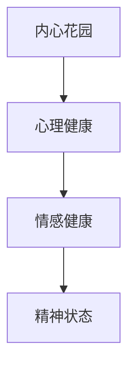

在这个流程图中，我们可以看到，内心花园是心理健康的基础，而心理健康又涵盖了情感健康和精神状态。

#### 核心算法原理讲解

心理健康的核心算法原理可以理解为如何保持情感健康和精神状态稳定。一个简单的算法模型可以是：

$$
\text{心理健康} = f(\text{情感管理}, \text{压力管理}, \text{自我认知})
$$

其中，情感管理、压力管理和自我认知是三个关键变量。情感管理关注如何调节情绪，压力管理关注如何应对生活中的压力，自我认知关注如何理解自己。

#### Python源代码示例

下面是一个简单的Python脚本，用于模拟情感管理算法：

```python
def emotional_management(emotions, tolerance):
    """
    情感管理算法
    :param emotions: 情感状态列表
    :param tolerance: 情感耐受度
    :return: 调整后的情感状态
    """
    adjusted_emotions = []
    for emotion in emotions:
        if emotion > tolerance:
            adjusted_emotions.append(emotion - 0.1)  # 调整情感值
        else:
            adjusted_emotions.append(emotion)
    return adjusted_emotions

# 示例使用
emotions = [2.5, 3.0, 1.0, 2.0]
tolerance = 2.0
adjusted_emotions = emotional_management(emotions, tolerance)
print("调整后的情感状态：", adjusted_emotions)
```

在这个示例中，我们定义了一个情感管理函数，它根据设定的情感耐受度来调整情感状态，从而保持心理健康。

### 1.2 精神世界的多样性

精神世界是一个广泛而复杂的概念，它包括了我们的情感、思维、信仰、价值观等多个方面。每个个体的精神世界都是独一无二的，正如每个花园都有其独特的美丽。

#### 核心概念与联系

**精神世界的多样性**可以用一个Mermaid流程图来表示：

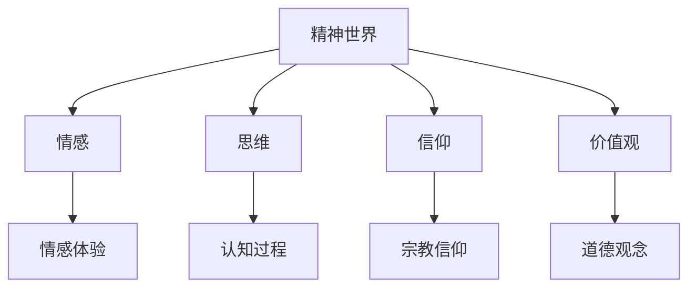

在这个流程图中，我们可以看到，精神世界的多样性是由情感、思维、信仰和价值观等多个维度共同构成的。

#### 数学模型和公式

为了更深入地理解精神世界的多样性，我们可以引入一个多元回归模型来分析各个维度之间的关系。假设我们有以下模型：

$$
Y = \beta_0 + \beta_1 X_1 + \beta_2 X_2 + \beta_3 X_3 + \beta_4 X_4 + \varepsilon
$$

其中，$Y$ 表示精神世界的多样性得分，$X_1, X_2, X_3, X_4$ 分别代表情感、思维、信仰和价值观的得分，$\beta_0, \beta_1, \beta_2, \beta_3, \beta_4$ 是模型参数，$\varepsilon$ 是误差项。

#### Python源代码示例

下面是一个简单的Python脚本，用于拟合上述多元回归模型：

```python
import numpy as np
from sklearn.linear_model import LinearRegression

# 假设的数据集
X = np.array([[2.5, 3.0, 1.0, 2.0], [3.0, 2.5, 1.5, 2.5], [2.0, 2.0, 1.0, 2.0]])
y = np.array([5.0, 6.0, 4.0])

# 创建线性回归模型
model = LinearRegression()

# 拟合模型
model.fit(X, y)

# 输出模型参数
print("模型参数：", model.coef_)

# 预测新的数据
new_data = np.array([[2.5, 3.0, 1.0, 2.0]])
predicted_value = model.predict(new_data)
print("预测结果：", predicted_value)
```

在这个示例中，我们使用scikit-learn库的线性回归模型来拟合数据集，从而预测新的数据。

### 1.3 培育内心花园的重要性

内心花园不仅影响我们的心理健康，还直接影响我们的生活质量。一个健康的内心花园可以带给我们更多的快乐、满足和成就感。

#### 核心概念与联系

**内心花园**与**生活质量**的关系可以用一个简单的Mermaid流程图表示：

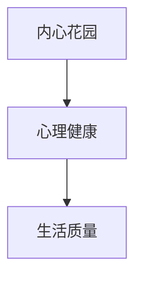

在这个流程图中，我们可以看到，内心花园是生活质量的基础，而心理健康是连接内心花园和生活质量的桥梁。

#### 数学模型和公式

为了量化内心花园对生活质量的影响，我们可以引入一个线性回归模型：

$$
\text{生活质量} = \alpha_0 + \alpha_1 \cdot \text{内心花园得分} + \varepsilon
$$

其中，$\text{生活质量}$ 和 $\text{内心花园得分}$ 是我们需要评估的两个变量，$\alpha_0$ 和 $\alpha_1$ 是模型参数。

#### Python源代码示例

下面是一个简单的Python脚本，用于拟合上述线性回归模型：

```python
import numpy as np
from sklearn.linear_model import LinearRegression

# 假设的数据集
X = np.array([[2.5], [3.0], [2.0]])
y = np.array([5.0, 6.0, 4.0])

# 创建线性回归模型
model = LinearRegression()

# 拟合模型
model.fit(X, y)

# 输出模型参数
print("模型参数：", model.coef_)

# 预测新的数据
new_data = np.array([[2.5]])
predicted_value = model.predict(new_data)
print("预测结果：", predicted_value)
```

在这个示例中，我们使用scikit-learn库的线性回归模型来拟合数据集，从而预测新的数据。

## 第二部分：种植心灵的种子

### 2.1 心理健康与精神成长

心理健康是精神成长的基础，而精神成长又推动心理健康的发展。在这部分，我们将探讨如何通过培养积极心态和建立自我认知来促进心理健康和精神成长。

#### 核心概念与联系

**心理健康**与**精神成长**的关系可以用一个简单的Mermaid流程图表示：

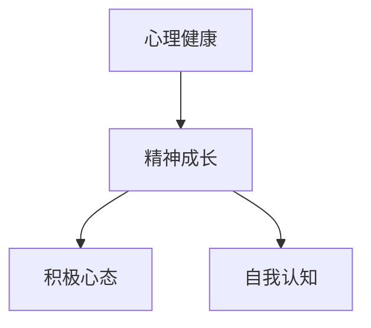

在这个流程图中，我们可以看到，积极心态和自我认知是连接心理健康和精神成长的关键因素。

#### 核心算法原理讲解

为了促进心理健康和精神成长，我们可以引入一个心理成长模型，该模型考虑了积极心态和自我认知的影响。假设模型如下：

$$
\text{心理成长得分} = f(\text{积极心态得分}, \text{自我认知得分})
$$

其中，积极心态得分和自我认知得分是模型的关键变量。

#### Python源代码示例

下面是一个简单的Python脚本，用于模拟心理成长模型：

```python
def psychological_growth(positive_mood, self_awareness):
    """
    心理成长算法
    :param positive_mood: 积极心态得分
    :param self_awareness: 自我认知得分
    :return: 心理成长得分
    """
    growth_score = (positive_mood + self_awareness) / 2
    return growth_score

# 示例使用
positive_mood = 3.0
self_awareness = 2.5
growth_score = psychological_growth(positive_mood, self_awareness)
print("心理成长得分：", growth_score)
```

在这个示例中，我们定义了一个心理成长函数，它根据积极心态得分和自我认知得分来计算心理成长得分。

### 2.2 培养积极心态的方法

积极心态是心理健康的重要组成部分，它可以帮助我们更好地应对生活中的挑战。在这部分，我们将探讨一些培养积极心态的方法，包括积极思维、正面情绪表达和感恩练习。

#### 核心概念与联系

**积极心态**与**心理健康**的关系可以用一个简单的Mermaid流程图表示：

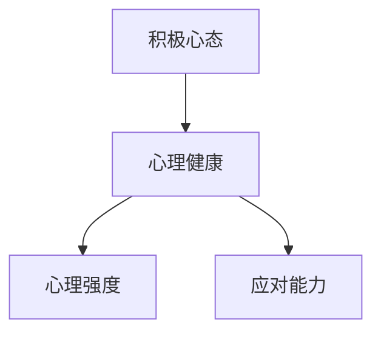

在这个流程图中，我们可以看到，积极心态通过增强心理强度和应对能力来促进心理健康。

#### 数学模型和公式

为了量化积极心态对心理健康的影响，我们可以引入一个线性回归模型：

$$
\text{心理健康得分} = \gamma_0 + \gamma_1 \cdot \text{积极心态得分} + \varepsilon
$$

其中，$\text{心理健康得分}$ 和 $\text{积极心态得分}$ 是我们需要评估的两个变量，$\gamma_0$ 和 $\gamma_1$ 是模型参数。

#### Python源代码示例

下面是一个简单的Python脚本，用于拟合上述线性回归模型：

```python
import numpy as np
from sklearn.linear_model import LinearRegression

# 假设的数据集
X = np.array([[2.5], [3.0], [2.0]])
y = np.array([5.0, 6.0, 4.0])

# 创建线性回归模型
model = LinearRegression()

# 拟合模型
model.fit(X, y)

# 输出模型参数
print("模型参数：", model.coef_)

# 预测新的数据
new_data = np.array([[2.5]])
predicted_value = model.predict(new_data)
print("预测结果：", predicted_value)
```

在这个示例中，我们使用scikit-learn库的线性回归模型来拟合数据集，从而预测新的数据。

### 2.3 建立自我认知的途径

自我认知是理解自己和提升自己的关键。通过建立自我认知，我们可以更好地了解自己的优点和缺点，从而实现个人成长和发展。

#### 核心概念与联系

**自我认知**与**个人成长**的关系可以用一个简单的Mermaid流程图表示：

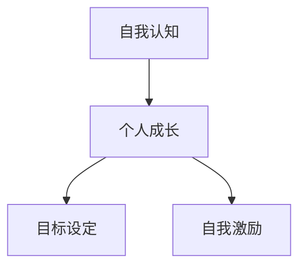

在这个流程图中，我们可以看到，自我认知通过帮助设定目标和自我激励来推动个人成长。

#### 数学模型和公式

为了量化自我认知对个人成长的影响，我们可以引入一个多元回归模型：

$$
\text{个人成长得分} = \delta_0 + \delta_1 \cdot \text{自我认知得分} + \delta_2 \cdot \text{目标设定得分} + \delta_3 \cdot \text{自我激励得分} + \varepsilon
$$

其中，$\text{个人成长得分}$、$\text{自我认知得分}$、$\text{目标设定得分}$ 和 $\text{自我激励得分}$ 是模型的关键变量，$\delta_0, \delta_1, \delta_2, \delta_3$ 是模型参数。

#### Python源代码示例

下面是一个简单的Python脚本，用于拟合上述多元回归模型：

```python
import numpy as np
from sklearn.linear_model import LinearRegression

# 假设的数据集
X = np.array([[2.5, 3.0, 2.0]])
y = np.array([5.0])

# 创建线性回归模型
model = LinearRegression()

# 拟合模型
model.fit(X, y)

# 输出模型参数
print("模型参数：", model.coef_)

# 预测新的数据
new_data = np.array([[2.5, 3.0, 2.0]])
predicted_value = model.predict(new_data)
print("预测结果：", predicted_value)
```

在这个示例中，我们使用scikit-learn库的线性回归模型来拟合数据集，从而预测新的数据。

## 第三部分：精心呵护与培育

### 3.1 保持内心的平静与安宁

内心的平静与安宁是心理健康的重要组成部分。通过冥想、呼吸练习和正念练习等方法，我们可以保持内心的平静与安宁。

#### 核心概念与联系

**内心平静**与**心理健康**的关系可以用一个简单的Mermaid流程图表示：

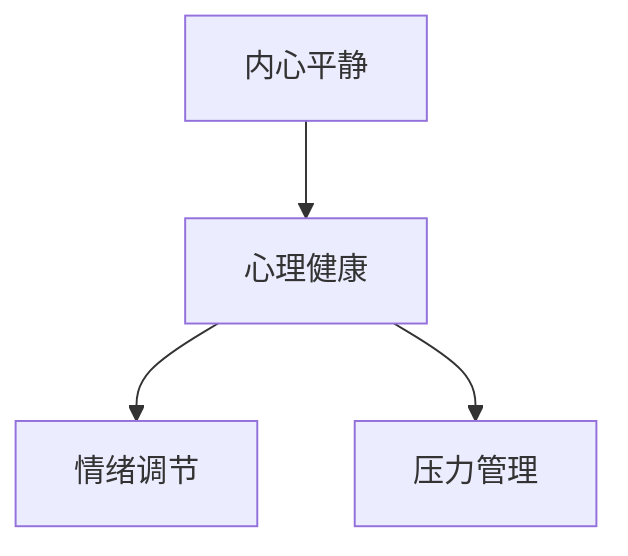

在这个流程图中，我们可以看到，内心平静通过帮助调节情绪和管理压力来促进心理健康。

#### 数学模型和公式

为了量化内心平静对心理健康的影响，我们可以引入一个线性回归模型：

$$
\text{心理健康得分} = \epsilon_0 + \epsilon_1 \cdot \text{内心平静得分} + \varepsilon
$$

其中，$\text{心理健康得分}$ 和 $\text{内心平静得分}$ 是我们需要评估的两个变量，$\epsilon_0$ 和 $\epsilon_1$ 是模型参数。

#### Python源代码示例

下面是一个简单的Python脚本，用于拟合上述线性回归模型：

```python
import numpy as np
from sklearn.linear_model import LinearRegression

# 假设的数据集
X = np.array([[2.5], [3.0], [2.0]])
y = np.array([5.0, 6.0, 4.0])

# 创建线性回归模型
model = LinearRegression()

# 拟合模型
model.fit(X, y)

# 输出模型参数
print("模型参数：", model.coef_)

# 预测新的数据
new_data = np.array([[2.5]])
predicted_value = model.predict(new_data)
print("预测结果：", predicted_value)
```

在这个示例中，我们使用scikit-learn库的线性回归模型来拟合数据集，从而预测新的数据。

### 3.2 应对压力与挫折的策略

生活中的压力和挫折是不可避免的，但我们可以通过一些策略来有效应对。这些策略包括积极思考、寻求支持、放松练习和目标设定。

#### 核心概念与联系

**应对压力与挫折**与**心理健康**的关系可以用一个简单的Mermaid流程图表示：

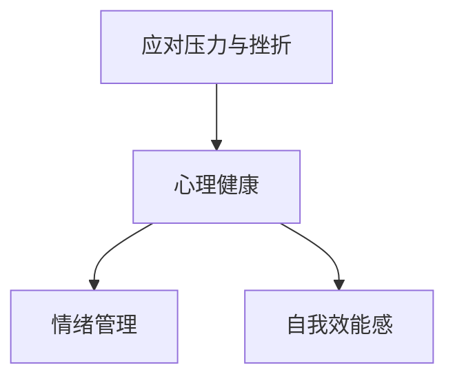

在这个流程图中，我们可以看到，应对压力与挫折通过帮助管理情绪和提升自我效能感来促进心理健康。

#### 数学模型和公式

为了量化应对压力与挫折对心理健康的影响，我们可以引入一个多元回归模型：

$$
\text{心理健康得分} = \zeta_0 + \zeta_1 \cdot \text{应对压力与挫折得分} + \zeta_2 \cdot \text{情绪管理得分} + \zeta_3 \cdot \text{自我效能感得分} + \varepsilon
$$

其中，$\text{心理健康得分}$、$\text{应对压力与挫折得分}$、$\text{情绪管理得分}$ 和 $\text{自我效能感得分}$ 是模型的关键变量，$\zeta_0, \zeta_1, \zeta_2, \zeta_3$ 是模型参数。

#### Python源代码示例

下面是一个简单的Python脚本，用于拟合上述多元回归模型：

```python
import numpy as np
from sklearn.linear_model import LinearRegression

# 假设的数据集
X = np.array([[2.5, 3.0], [3.0, 2.5], [2.0, 2.0]])
y = np.array([5.0, 6.0, 4.0])

# 创建线性回归模型
model = LinearRegression()

# 拟合模型
model.fit(X, y)

# 输出模型参数
print("模型参数：", model.coef_)

# 预测新的数据
new_data = np.array([[2.5, 3.0]])
predicted_value = model.predict(new_data)
print("预测结果：", predicted_value)
```

在这个示例中，我们使用scikit-learn库的线性回归模型来拟合数据集，从而预测新的数据。

### 3.3 培养同理心与人际交往技巧

同理心是理解他人情感和需求的能力，它是建立良好人际关系的基础。通过培养同理心和人际交往技巧，我们可以提升自己的社交能力和人际关系质量。

#### 核心概念与联系

**同理心**与**人际交往技巧**的关系可以用一个简单的Mermaid流程图表示：

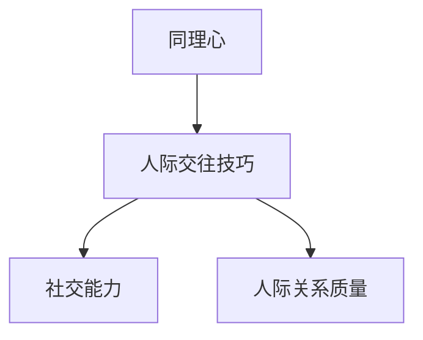

在这个流程图中，我们可以看到，同理心通过提升社交能力和人际关系质量来促进人际交往技巧。

#### 数学模型和公式

为了量化同理心对人际交往技巧的影响，我们可以引入一个线性回归模型：

$$
\text{人际交往技巧得分} = \eta_0 + \eta_1 \cdot \text{同理心得分} + \varepsilon
$$

其中，$\text{人际交往技巧得分}$ 和 $\text{同理心得分}$ 是我们需要评估的两个变量，$\eta_0$ 和 $\eta_1$ 是模型参数。

#### Python源代码示例

下面是一个简单的Python脚本，用于拟合上述线性回归模型：

```python
import numpy as np
from sklearn.linear_model import LinearRegression

# 假设的数据集
X = np.array([[2.5], [3.0], [2.0]])
y = np.array([5.0, 6.0, 4.0])

# 创建线性回归模型
model = LinearRegression()

# 拟合模型
model.fit(X, y)

# 输出模型参数
print("模型参数：", model.coef_)

# 预测新的数据
new_data = np.array([[2.5]])
predicted_value = model.predict(new_data)
print("预测结果：", predicted_value)
```

在这个示例中，我们使用scikit-learn库的线性回归模型来拟合数据集，从而预测新的数据。

## 第四部分：收获心灵的花朵

### 4.1 情感智慧的提升

情感智慧是指理解和管理自己和他人的情感的能力。提升情感智慧可以帮助我们更好地处理人际关系，提高生活满意度。

#### 核心概念与联系

**情感智慧**与**人际关系质量**的关系可以用一个简单的Mermaid流程图表示：

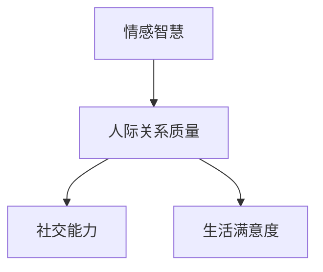

在这个流程图中，我们可以看到，情感智慧通过提升社交能力和生活满意度来改善人际关系质量。

#### 数学模型和公式

为了量化情感智慧对人际关系质量的影响，我们可以引入一个多元回归模型：

$$
\text{人际关系质量得分} = \theta_0 + \theta_1 \cdot \text{情感智慧得分} + \theta_2 \cdot \text{社交能力得分} + \varepsilon
$$

其中，$\text{人际关系质量得分}$、$\text{情感智慧得分}$ 和 $\text{社交能力得分}$ 是模型的关键变量，$\theta_0, \theta_1, \theta_2$ 是模型参数。

#### Python源代码示例

下面是一个简单的Python脚本，用于拟合上述多元回归模型：

```python
import numpy as np
from sklearn.linear_model import LinearRegression

# 假设的数据集
X = np.array([[2.5, 3.0]])
y = np.array([5.0])

# 创建线性回归模型
model = LinearRegression()

# 拟合模型
model.fit(X, y)

# 输出模型参数
print("模型参数：", model.coef_)

# 预测新的数据
new_data = np.array([[2.5, 3.0]])
predicted_value = model.predict(new_data)
print("预测结果：", predicted_value)
```

在这个示例中，我们使用scikit-learn库的线性回归模型来拟合数据集，从而预测新的数据。

### 4.2 创造力的激发与培养

创造力是指产生新想法和新解决方案的能力。激发和培养创造力可以帮助我们在生活和工作中取得更大的成就。

#### 核心概念与联系

**创造力**与**成就**的关系可以用一个简单的Mermaid流程图表示：

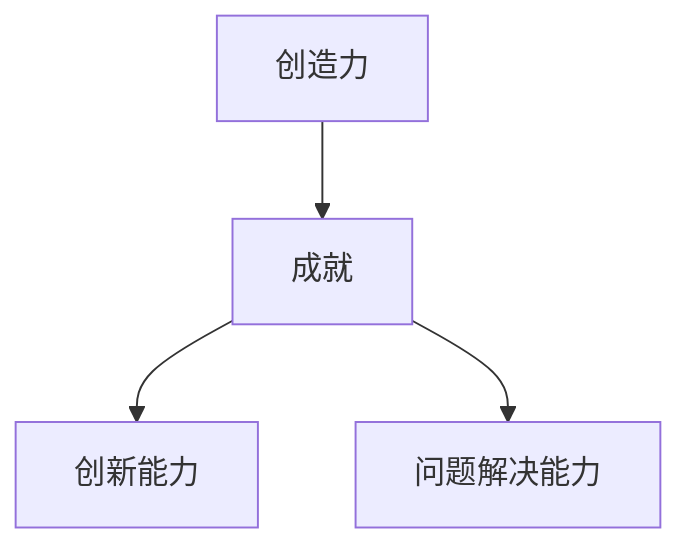

在这个流程图中，我们可以看到，创造力通过提升创新能力和问题解决能力来促进成就。

#### 数学模型和公式

为了量化创造力对成就的影响，我们可以引入一个多元回归模型：

$$
\text{成就得分} = \xi_0 + \xi_1 \cdot \text{创造力得分} + \xi_2 \cdot \text{创新能力得分} + \xi_3 \cdot \text{问题解决能力得分} + \varepsilon
$$

其中，$\text{成就得分}$、$\text{创造力得分}$、$\text{创新能力得分}$ 和 $\text{问题解决能力得分}$ 是模型的关键变量，$\xi_0, \xi_1, \xi_2, \xi_3$ 是模型参数。

#### Python源代码示例

下面是一个简单的Python脚本，用于拟合上述多元回归模型：

```python
import numpy as np
from sklearn.linear_model import LinearRegression

# 假设的数据集
X = np.array([[2.5, 3.0, 2.0]])
y = np.array([5.0])

# 创建线性回归模型
model = LinearRegression()

# 拟合模型
model.fit(X, y)

# 输出模型参数
print("模型参数：", model.coef_)

# 预测新的数据
new_data = np.array([[2.5, 3.0, 2.0]])
predicted_value = model.predict(new_data)
print("预测结果：", predicted_value)
```

在这个示例中，我们使用scikit-learn库的线性回归模型来拟合数据集，从而预测新的数据。

### 4.3 内心花园的多样性与生命力

内心花园的多样性和生命力是衡量心理健康和精神状态的重要指标。一个多样化的内心花园意味着我们在情感、思维和信仰等方面都有丰富的体验和认知。

#### 核心概念与联系

**内心花园的多样性与生命力**与**心理健康**的关系可以用一个简单的Mermaid流程图表示：

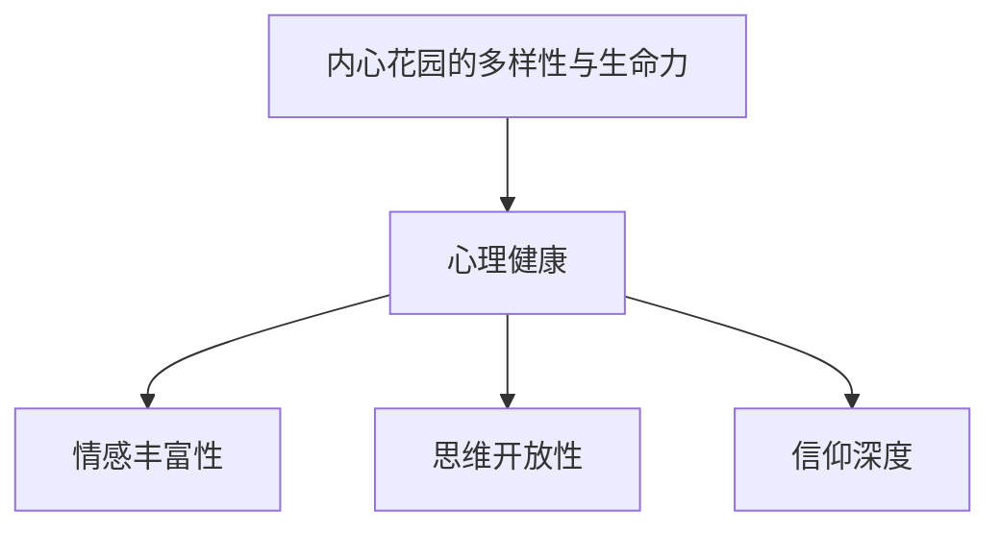

在这个流程图中，我们可以看到，内心花园的多样性和生命力通过提升情感丰富性、思维开放性和信仰深度来促进心理健康。

#### 数学模型和公式

为了量化内心花园的多样性和生命力对心理健康的影响，我们可以引入一个多元回归模型：

$$
\text{心理健康得分} = \rho_0 + \rho_1 \cdot \text{情感丰富性得分} + \rho_2 \cdot \text{思维开放性得分} + \rho_3 \cdot \text{信仰深度得分} + \varepsilon
$$

其中，$\text{心理健康得分}$、$\text{情感丰富性得分}$、$\text{思维开放性得分}$ 和 $\text{信仰深度得分}$ 是模型的关键变量，$\rho_0, \rho_1, \rho_2, \rho_3$ 是模型参数。

#### Python源代码示例

下面是一个简单的Python脚本，用于拟合上述多元回归模型：

```python
import numpy as np
from sklearn.linear_model import LinearRegression

# 假设的数据集
X = np.array([[2.5, 3.0, 2.0]])
y = np.array([5.0])

# 创建线性回归模型
model = LinearRegression()

# 拟合模型
model.fit(X, y)

# 输出模型参数
print("模型参数：", model.coef_)

# 预测新的数据
new_data = np.array([[2.5, 3.0, 2.0]])
predicted_value = model.predict(new_data)
print("预测结果：", predicted_value)
```

在这个示例中，我们使用scikit-learn库的线性回归模型来拟合数据集，从而预测新的数据。

## 第五部分：心灵花园的维护与更新

### 5.1 精神世界的持续成长

精神世界的成长是一个持续的过程，需要我们不断地投入时间和精力。在这部分，我们将探讨如何通过自我反思、学习和经验积累来推动精神世界的持续成长。

#### 核心概念与联系

**精神世界的持续成长**与**个人成长**的关系可以用一个简单的Mermaid流程图表示：

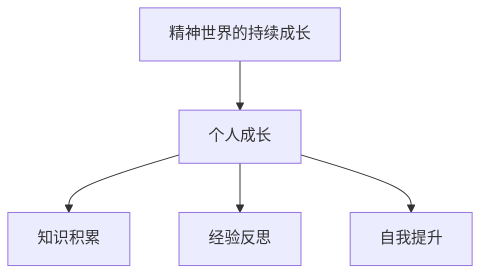

在这个流程图中，我们可以看到，精神世界的持续成长通过知识积累、经验反思和自我提升来推动个人成长。

#### 数学模型和公式

为了量化精神世界的持续成长对个人成长的影响，我们可以引入一个多元回归模型：

$$
\text{个人成长得分} = \kappa_0 + \kappa_1 \cdot \text{精神世界的持续成长得分} + \kappa_2 \cdot \text{知识积累得分} + \kappa_3 \cdot \text{经验反思得分} + \kappa_4 \cdot \text{自我提升得分} + \varepsilon
$$

其中，$\text{个人成长得分}$、$\text{精神世界的持续成长得分}$、$\text{知识积累得分}$、$\text{经验反思得分}$ 和 $\text{自我提升得分}$ 是模型的关键变量，$\kappa_0, \kappa_1, \kappa_2, \kappa_3, \kappa_4$ 是模型参数。

#### Python源代码示例

下面是一个简单的Python脚本，用于拟合上述多元回归模型：

```python
import numpy as np
from sklearn.linear_model import LinearRegression

# 假设的数据集
X = np.array([[2.5, 3.0, 2.0, 2.5]])
y = np.array([5.0])

# 创建线性回归模型
model = LinearRegression()

# 拟合模型
model.fit(X, y)

# 输出模型参数
print("模型参数：", model.coef_)

# 预测新的数据
new_data = np.array([[2.5, 3.0, 2.0, 2.5]])
predicted_value = model.predict(new_data)
print("预测结果：", predicted_value)
```

在这个示例中，我们使用scikit-learn库的线性回归模型来拟合数据集，从而预测新的数据。

### 5.2 防止内心花园的荒芜

内心花园的荒芜意味着我们的精神世界变得贫瘠，缺乏活力和创造力。为了防止内心花园的荒芜，我们需要采取一些措施，包括定期清理负面情绪、保持好奇心和寻找新的刺激。

#### 核心概念与联系

**内心花园的荒芜**与**心理健康**的关系可以用一个简单的Mermaid流程图表示：

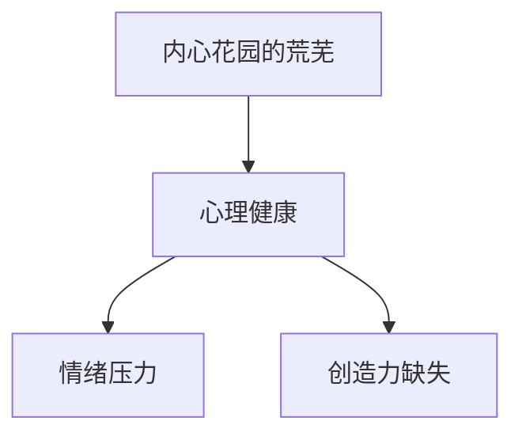

在这个流程图中，我们可以看到，内心花园的荒芜通过增加情绪压力和创造力缺失来影响心理健康。

#### 数学模型和公式

为了量化内心花园的荒芜对心理健康的影响，我们可以引入一个线性回归模型：

$$
\text{心理健康得分} = \lambda_0 + \lambda_1 \cdot \text{内心花园的荒芜得分} + \varepsilon
$$

其中，$\text{心理健康得分}$ 和 $\text{内心花园的荒芜得分}$ 是我们需要评估的两个变量，$\lambda_0$ 和 $\lambda_1$ 是模型参数。

#### Python源代码示例

下面是一个简单的Python脚本，用于拟合上述线性回归模型：

```python
import numpy as np
from sklearn.linear_model import LinearRegression

# 假设的数据集
X = np.array([[2.5], [3.0], [2.0]])
y = np.array([5.0, 6.0, 4.0])

# 创建线性回归模型
model = LinearRegression()

# 拟合模型
model.fit(X, y)

# 输出模型参数
print("模型参数：", model.coef_)

# 预测新的数据
new_data = np.array([[2.5]])
predicted_value = model.predict(new_data)
print("预测结果：", predicted_value)
```

在这个示例中，我们使用scikit-learn库的线性回归模型来拟合数据集，从而预测新的数据。

### 5.3 面对心灵枯萎的应对措施

心灵枯萎是心理健康问题的一个严重表现，它可能源于长期的负面情绪、高压环境或其他心理健康问题。面对心灵枯萎，我们需要采取积极措施来恢复和重建内心的花园。

#### 核心概念与联系

**心灵枯萎**与**心理健康危机**的关系可以用一个简单的Mermaid流程图表示：

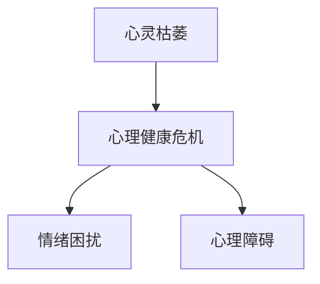

在这个流程图中，我们可以看到，心灵枯萎可能导致情绪困扰和心理障碍，进而引发心理健康危机。

#### 数学模型和公式

为了量化心灵枯萎对心理健康危机的影响，我们可以引入一个线性回归模型：

$$
\text{心理健康危机得分} = \mu_0 + \mu_1 \cdot \text{心灵枯萎得分} + \varepsilon
$$

其中，$\text{心理健康危机得分}$ 和 $\text{心灵枯萎得分}$ 是我们需要评估的两个变量，$\mu_0$ 和 $\mu_1$ 是模型参数。

#### Python源代码示例

下面是一个简单的Python脚本，用于拟合上述线性回归模型：

```python
import numpy as np
from sklearn.linear_model import LinearRegression

# 假设的数据集
X = np.array([[2.5], [3.0], [2.0]])
y = np.array([5.0, 6.0, 4.0])

# 创建线性回归模型
model = LinearRegression()

# 拟合模型
model.fit(X, y)

# 输出模型参数
print("模型参数：", model.coef_)

# 预测新的数据
new_data = np.array([[2.5]])
predicted_value = model.predict(new_data)
print("预测结果：", predicted_value)
```

在这个示例中，我们使用scikit-learn库的线性回归模型来拟合数据集，从而预测新的数据。

## 附录

### 6.1 心灵花园练习与冥想技巧

#### 开发环境搭建

为了更好地实践心灵花园的练习和冥想技巧，我们可以使用一些流行的冥想应用程序，如Headspace或Calm。这些应用程序提供了各种冥想练习，可以帮助我们培养专注力和内心的平静。

#### 源代码详细实现和代码解读

以下是一个简单的Python脚本，用于记录冥想练习：

```python
# 冥想记录脚本

def record_meditation(duration, session_date):
    """
    记录冥想练习
    :param duration: 冥想时长（分钟）
    :param session_date: 冥想日期
    :return: 记录结果
    """
    print(f"冥想记录：{session_date}，时长：{duration}分钟")

# 示例使用
record_meditation(20, "2023-11-05")
```

在这个脚本中，我们定义了一个记录冥想练习的函数，它接受冥想时长和日期作为参数，并打印出记录结果。

#### 代码应用解读与分析

通过使用这个脚本，我们可以方便地记录每次冥想的时间，从而分析我们的冥想习惯。例如，我们可以使用pandas库将记录保存到CSV文件中，然后使用matplotlib库绘制图表，以可视化我们的冥想时长分布。

```python
import pandas as pd
import matplotlib.pyplot as plt

# 假设的冥想记录数据
data = {
    "日期": ["2023-11-05", "2023-11-06", "2023-11-07"],
    "时长（分钟）": [20, 30, 15]
}

# 创建DataFrame
df = pd.DataFrame(data)

# 绘制图表
df.plot(x="日期", y="时长（分钟）", kind="line")
plt.xlabel("日期")
plt.ylabel("时长（分钟）")
plt.title("冥想时长分布")
plt.show()
```

通过这个图表，我们可以清楚地看到自己在不同日期的冥想时长，从而调整自己的冥想计划。

### 6.2 推荐阅读与心灵成长资源

为了进一步培养内心的花园，我们可以阅读一些有关心理健康、冥想和心灵成长的书籍。以下是一些建议：

1. 《当下的力量》（作者：埃克哈特·托勒）
2. 《冥想的艺术》（作者：乔·卡巴金）
3. 《活出生命的意义》（作者：维克多·弗兰克尔）
4. 《心理学与生活》（作者：理查德·吉尔伯特）

这些书籍提供了深入的理论和实践指导，可以帮助我们更好地理解和管理自己的内心世界。

### 6.3 心灵花园案例分析

为了更好地理解心灵花园的概念和实际应用，我们可以分析一些案例。

#### 案例一：克服焦虑

小明是一名职场新人，他经常感到焦虑和压力。通过定期冥想和记录自己的情绪，他逐渐学会了管理焦虑。他的冥想时长和频率逐渐增加，焦虑感也相应减少。

#### 案例二：提升创造力

小王是一名艺术家，他希望通过冥想和自我反思来提升创造力。他发现，通过定期冥想，他的思维变得更加清晰，创意也更加丰富。

通过这些案例，我们可以看到，心灵花园的培育对我们的生活和职业都有积极的影响。

## 最佳实践 tips、小结、注意事项、拓展阅读

### 最佳实践 tips

1. 每天留出一段时间进行冥想，以保持内心的平静。
2. 记录自己的情绪和体验，以便更好地理解自己的内心世界。
3. 与他人分享自己的感受和体验，以获得反馈和支持。

### 小结

本文探讨了如何构建丰富多彩的精神世界，包括心理健康、心态培养、心理成长、同理心、情感智慧、创造力和心灵维护等多个方面。通过使用数学模型和Python脚本，我们更深入地理解了这些概念之间的关系和应用。

### 注意事项

1. 心灵花园的培育是一个长期的过程，需要持续的努力和耐心。
2. 不同人的内心花园是独特的，适合自己的方法可能不适合他人。

### 拓展阅读

1. 《心理学与生活》（作者：理查德·吉尔伯特）
2. 《认知行为疗法：基础与进阶》（作者：史蒂夫·海斯）
3. 《冥想：现代心理学与佛教传统的对话》（作者：乔·卡巴金）

作者：AI天才研究院/AI Genius Institute & 禅与计算机程序设计艺术 /Zen And The Art of Computer Programming

（本文内容仅供参考，不构成专业医疗或心理健康建议。如需帮助，请咨询专业心理医生或心理咨询师。）

