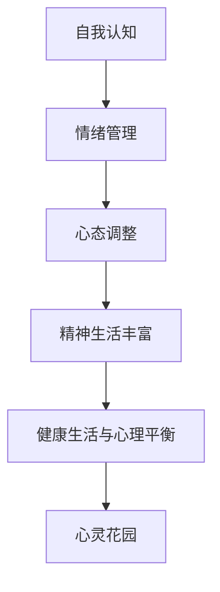

                 

# 培育内心花园：构建丰富的精神世界

> 关键词：心灵花园、精神世界、自我认知、情绪管理、心理健康、阅读、艺术、健康生活

> 摘要：本文以“心灵花园”为隐喻，探讨了如何通过自我认知、情绪管理、丰富精神生活、健康生活方式等途径，构建一个富有内涵、健康和谐的精神世界。文章结合技术语言，使用流程图、Python代码示例和数学模型等，提供了清晰易懂的方法和步骤，帮助读者在实践中实现精神世界的丰富与提升。

## 引言

### 1.1 心灵花园的概念与重要性

在计算机科学中，花园是一个比喻，用于描述数据结构和算法的复杂性。而在这里，我们将这个比喻扩展到我们的内心世界。心灵花园，顾名思义，是指我们内心的一个领域，它包含我们的思想、情感、价值观等。就像现实中的花园需要精心养护才能茁壮成长一样，我们的心灵花园也需要我们不断地关注和培育。

构建一个丰富的精神世界的重要性不言而喻。在现代社会，我们面临着越来越多的压力和挑战，如何保持心理健康、提升幸福感成为一个迫切需要解决的问题。一个丰富的精神世界可以提供我们内心深处所需的营养，帮助我们更好地应对生活中的各种问题。

### 1.2 精神世界的构建与养护

精神世界的构建与养护是一个长期的、系统的过程。首先，我们需要了解自我，进行深入的内在探索。通过自我认知，我们可以发现自己的优点和不足，从而更好地调整自己的心态和行为。

情绪管理是精神世界构建的关键环节。情绪是我们内心世界的直接反映，有效的情绪管理可以帮助我们保持内心的平静和积极。此外，丰富精神生活也是不可或缺的。通过阅读、艺术、运动等多种形式，我们可以不断拓宽自己的视野，丰富内心世界。

健康的生活方式也是构建精神世界的重要保障。良好的生活习惯，如充足的睡眠、均衡的饮食、适度的锻炼，都能促进我们的身心健康，为我们的精神世界提供坚实的基础。

### 1.3 阅读与精神成长

阅读是一种极为有效的精神养护方式。通过阅读，我们可以接触到不同的思想、观点和文化，从而拓宽我们的视野，提升我们的认知能力。同时，阅读还可以帮助我们缓解压力，获得内心的平静和安宁。

在接下来的内容中，我们将详细探讨如何通过自我认知、情绪管理、丰富精神生活和健康生活方式等途径，构建一个富有内涵、健康和谐的精神世界。

## 第一部分：心灵花园的构建

### 第1章：自我认知与内在探索

#### 1.1 自我认知的重要性

自我认知是指个体对自身存在的认知，包括对自身性格、能力、需求、情感等方面的了解。自我认知的重要性体现在以下几个方面：

1. **个体成长**：自我认知有助于我们发现自己的优点和不足，从而有针对性地进行自我提升。通过自我认知，我们可以更好地理解自己的需求，从而做出更符合自己利益和价值观的决策。

2. **人际交往**：自我认知可以帮助我们更好地理解他人，提高人际交往能力。一个清晰自我认知的人，往往能够更好地理解他人的需求和感受，从而建立更好的人际关系。

3. **心理健康**：自我认知有助于我们保持心理健康。通过自我认知，我们可以更好地应对生活中的压力和挑战，减少心理问题的发生。

#### 1.2 内在探索的方法

内在探索是一个自我认知的过程，它需要我们静下心来，深入思考自己的内心。以下是一些内在探索的方法：

1. **冥想**：冥想是一种有效的内在探索方式。通过冥想，我们可以平静心灵，深入思考自己的内心世界，从而获得对自我的深刻理解。

2. **写日记**：写日记是一种反思自己的方式。通过写日记，我们可以记录自己的所思所感，从而更好地理解自己。

3. **心理咨询**：心理咨询是一种专业的内在探索方式。通过心理咨询，我们可以与专业人士深入交流，从而获得对自己内心的深入理解。

#### 1.3 自我认知的工具

在自我认知的过程中，我们可以使用一些工具来帮助我们更好地理解自己。以下是一些常见的自我认知工具：

1. **MBTI性格类型测试**：MBTI（Myers-Briggs Type Indicator）是一种常用的性格类型测试，它可以帮助我们了解自己的性格特点，从而更好地理解自己。

2. **心理测量软件**：如心理学软件包（如PsychoPy）可以用于进行心理学实验，从而帮助我们更好地了解自己的心理状态。

3. **心理书籍**：如《自我认知的心理学》等书籍，提供了丰富的自我认知方法和工具，可以帮助我们更好地理解自己。

通过自我认知和内在探索，我们可以更好地了解自己，从而为构建丰富的精神世界打下坚实的基础。

### 第2章：情绪管理与心态调整

#### 2.1 情绪管理的基础知识

情绪管理是指个体如何识别、理解、接受和调节自己的情绪。有效的情绪管理对于维护心理健康和提升生活质量至关重要。以下是一些情绪管理的基础知识：

1. **情绪的构成**：情绪通常由三个部分构成：情感、认知和行为反应。情感是情绪的核心，认知是对情绪的理解和解释，行为反应则是情绪的外在表现。

2. **情绪的类型**：情绪可以分为正面情绪和负面情绪。正面情绪如喜悦、兴奋和满足，负面情绪如愤怒、沮丧和焦虑。

3. **情绪的影响**：情绪不仅影响个体的心理状态，还影响其行为和身体健康。负面情绪长期积累可能导致心理问题和生理疾病。

#### 2.2 常见情绪问题的应对策略

面对常见的情绪问题，我们可以采取以下策略进行应对：

1. **认知重构**：通过改变对事件的认知和解释，可以减少负面情绪。例如，将“我无法完成任务”重构为“这是一个挑战，我需要更多时间来准备”。

2. **情感调节**：通过呼吸练习、身体放松和正念冥想等方法，可以缓解负面情绪。例如，深呼吸可以帮助减轻焦虑，正念冥想可以帮助提升情绪稳定性。

3. **行为调节**：通过改变行为方式来调节情绪。例如，进行体育锻炼可以提升情绪，参加社交活动可以缓解孤独感。

#### 2.3 心态调整的重要性

心态调整是指个体如何调整自己的心态，以更好地应对生活中的挑战。以下是一些心态调整的重要性：

1. **增强心理弹性**：积极的心态可以帮助个体更好地应对压力和挫折，增强心理弹性。

2. **提升生活质量**：良好的心态可以提升个体的生活质量，使其更快乐、更满足。

3. **促进人际关系**：积极的心态可以促进人际关系的和谐，减少冲突。

通过情绪管理和心态调整，我们可以更好地应对生活中的各种挑战，保持心理健康和幸福感。

### 第3章：精神生活的丰富与多元化

#### 3.1 精神生活的构成

精神生活是指个体在心理、情感、认知和社交等方面的活动。它包括以下几个方面：

1. **阅读**：阅读是一种重要的精神活动，通过阅读，个体可以获取知识、提升认知，同时也可以获得情感上的满足。

2. **艺术**：艺术活动如绘画、音乐、戏剧等，可以激发个体的创造力，提升情感体验。

3. **社交**：社交活动如与家人、朋友聚会，可以增进人际关系，提升社交技能。

4. **自我发展**：自我发展活动如学习新技能、参加培训课程等，可以提升个人的能力和竞争力。

#### 3.2 丰富精神生活的方法

为了丰富我们的精神生活，我们可以采取以下方法：

1. **多样化活动**：参与多种不同的活动，如阅读、绘画、音乐、运动等，可以拓宽我们的视野，丰富我们的精神世界。

2. **持续学习**：通过学习新知识、新技能，不断提升自己，可以保持对生活的热情和好奇心。

3. **情感交流**：与家人、朋友分享自己的感受和想法，可以增进彼此的了解，提升关系质量。

4. **自我反思**：定期进行自我反思，了解自己的需求和愿望，有助于我们更好地规划自己的生活。

#### 3.3 多元化精神生活的重要性

多元化精神生活对于个人的心理健康和幸福感具有重要意义：

1. **提升心理健康**：多样化活动可以缓解压力，减少焦虑和抑郁，提升心理健康水平。

2. **增强幸福感**：丰富的精神生活可以带来更多的快乐和满足感，提升个体的幸福感。

3. **促进全面发展**：通过多样化的精神活动，我们可以全面提升自己的能力，实现个人全面发展。

通过丰富精神生活和多元化，我们可以构建一个更加充实、健康的内心世界。

## 第二部分：心灵花园的养护

### 第4章：阅读的力量

#### 4.1 阅读与心灵成长的关系

阅读是一种深层次的心灵活动，它不仅能够丰富我们的知识储备，还能够对心灵产生深远的影响。以下是阅读与心灵成长关系的详细探讨：

1. **知识积累**：阅读是知识获取的重要途径。通过阅读，我们可以了解世界各地的历史、文化、科学等知识，从而拓宽我们的视野。

2. **思维锻炼**：阅读能够锻炼我们的思维能力。无论是理解复杂的理论，还是分析故事情节，都能提高我们的逻辑思维和批判性思维能力。

3. **情感共鸣**：阅读让我们能够与作者产生情感共鸣，体验不同的情感和人生经历。这种情感共鸣能够丰富我们的情感世界，提升我们的同理心。

4. **自我认知**：通过阅读，我们可以更好地了解自己。在阅读过程中，我们可能会遇到与自己相似的境遇和问题，从而更深入地反思自己，提升自我认知。

#### 4.2 适合心灵花园的阅读类型

为了养护我们的心灵花园，我们需要选择适合的阅读类型。以下是一些适合心灵养护的阅读类型：

1. **心理学书籍**：心理学书籍可以帮助我们了解自己的内心，提升情感管理能力。例如，《心理学与生活》、《拖延心理学》等。

2. **哲学书籍**：哲学书籍能够帮助我们思考人生的意义和价值观。例如，柏拉图的《理想国》、尼采的《悲剧的诞生》等。

3. **文学经典**：文学经典能够带给我们深刻的情感体验，提升我们的文学素养。例如，莎士比亚的戏剧、托尔斯泰的小说等。

4. **自我发展书籍**：自我发展书籍可以帮助我们提升个人能力和素质，实现自我成长。例如，史蒂芬·柯维的《高效能人士的七个习惯》等。

#### 4.3 如何培养良好的阅读习惯

培养良好的阅读习惯对于养护心灵花园至关重要。以下是一些有效的方法：

1. **设定阅读目标**：为自己设定明确的阅读目标，如每天阅读一定时间，每月阅读一定数量的书籍。

2. **合理安排时间**：将阅读纳入日常时间表，确保每天都有时间进行阅读。

3. **选择合适的环境**：选择一个安静、舒适的环境进行阅读，有助于提高阅读效率。

4. **记录阅读心得**：在阅读过程中记录心得体会，可以帮助我们更好地理解和吸收书中的内容。

5. **与他人分享**：与朋友分享阅读心得，可以加深对书中内容的理解，同时也能获得他人的反馈和建议。

通过阅读，我们可以不断丰富自己的心灵花园，提升个人素养和幸福感。

### 第5章：艺术与心灵花园

#### 5.1 艺术与心灵成长的关系

艺术作为一种独特的精神活动，对于心灵成长有着深远的影响。以下是艺术与心灵成长关系的详细探讨：

1. **情感表达**：艺术是情感表达的重要方式。通过创作或欣赏艺术作品，我们可以将自己的情感和思想转化为具体的形式，从而得到情感上的宣泄和满足。

2. **自我认知**：艺术创作和欣赏过程中，我们常常需要深入思考自己的内心世界。这种自我反思的过程有助于我们更好地了解自己，提升自我认知。

3. **心理治疗**：艺术疗法是一种有效的心理治疗方式。通过艺术创作，患者可以表达和释放内心的情感，缓解心理压力，促进心理健康。

4. **情绪调节**：艺术作品中的美好情感和意境能够帮助我们调节情绪，缓解焦虑和抑郁。例如，欣赏一幅美丽的画作或听一首动人的乐曲，都可以带来内心的平静和愉悦。

#### 5.2 不同艺术形式对心灵花园的影响

不同的艺术形式对心灵花园有着不同的影响。以下是几种常见艺术形式及其对心灵花园的影响：

1. **绘画**：绘画是一种直观的艺术形式，通过色彩和线条的表达，可以激发我们的情感和想象力。绘画可以帮助我们放松心情，缓解压力，提升创造力。

2. **音乐**：音乐是一种强大的情感媒介，它可以通过声音的节奏和旋律直接影响我们的情绪。欣赏音乐可以帮助我们缓解焦虑，提升情绪稳定性。

3. **文学**：文学作品通过文字的叙述和描写，可以带领我们进入一个全新的世界。阅读文学作品可以丰富我们的情感体验，提升我们的审美能力。

4. **舞蹈**：舞蹈是一种动态的艺术形式，它结合了音乐和身体的运动，能够帮助我们释放内心的紧张和压力，提升身体的灵活性和协调性。

#### 5.3 如何通过艺术养护心灵花园

通过艺术养护心灵花园，我们可以采取以下方法：

1. **参与艺术创作**：无论是绘画、写作、音乐还是舞蹈，参与艺术创作都可以帮助我们表达情感，提升自我认知。

2. **定期欣赏艺术作品**：定期去画廊、博物馆或音乐会，欣赏不同类型的艺术作品，可以丰富我们的精神世界。

3. **艺术疗法**：如果可能，可以尝试进行艺术疗法，通过艺术创作和欣赏来缓解心理压力。

4. **艺术分享**：与家人、朋友分享自己的艺术作品和感受，可以加深彼此的理解和情感交流。

通过艺术，我们可以养护我们的心灵花园，让它充满美好和活力。

### 第6章：健康生活与心灵花园

#### 6.1 健康生活对心灵花园的影响

健康生活不仅关乎我们的身体健康，也对我们的心理健康和心灵花园有着深远的影响。以下是健康生活对心灵花园影响的详细探讨：

1. **身体健康**：健康的生活习惯，如充足的睡眠、均衡的饮食和适度的运动，能够提高我们的身体健康水平。一个健康的身体是维持心理健康和构建心灵花园的基础。

2. **情绪稳定**：健康的生活方式可以帮助我们保持情绪稳定。例如，适度的运动可以释放压力，改善情绪，减少焦虑和抑郁。

3. **心理韧性**：健康的生活习惯，如良好的睡眠和饮食习惯，可以提高我们的心理韧性，使我们能够更好地应对生活中的挑战。

4. **心理状态**：健康的生活方式有助于提升我们的心理状态，让我们更加乐观、自信和满足。

#### 6.2 心理健康的标准

心理健康是指个体在心理方面处于良好状态，能够有效应对生活中的压力和挑战。以下是心理健康的几个标准：

1. **情绪稳定**：能够控制自己的情绪，不轻易被外界环境所影响，能够保持内心的平静。

2. **自我认知**：对自己的情感、需求和目标有清晰的认识，能够自我调节和自我提升。

3. **人际关系**：能够与他人建立健康、积极的人际关系，能够理解和尊重他人的需求和感受。

4. **应对能力**：能够有效应对生活中的各种挑战和压力，保持心理平衡。

5. **生活满意**：对自己的生活感到满意，能够从日常活动中获得乐趣和满足。

#### 6.3 健康生活与心灵花园的平衡

健康生活与心灵花园之间存在着密切的平衡关系。以下是一些保持健康生活与心灵花园平衡的方法：

1. **合理规划时间**：合理安排工作和休息时间，确保有足够的时间进行自我养护和心灵成长。

2. **均衡饮食**：保持均衡的饮食，摄取足够的营养，促进身体健康。

3. **适量运动**：定期进行适量的运动，如散步、瑜伽、游泳等，有助于提高身体健康和情绪稳定。

4. **心理放松**：定期进行心理放松活动，如冥想、深呼吸、按摩等，有助于缓解心理压力，保持心理健康。

5. **社交互动**：保持积极的社交互动，与家人、朋友分享生活和感受，有助于提升心理状态和幸福感。

通过健康的生活方式和心理养护，我们可以保持心灵花园的活力和健康，提升整体生活质量。

### 第7章：实践案例分享

#### 7.1 实践案例介绍

在这个案例中，我们将分享一位名叫李华的读者如何通过构建心灵花园来提升自己精神世界的故事。

李华是一位年轻的职场人士，工作压力大，常常感到焦虑和疲惫。通过阅读相关书籍、参加心理课程和进行艺术创作，他逐渐构建了自己的心灵花园，并在工作和生活中取得了显著的进步。

#### 7.2 实践心得分享

1. **自我认知的提升**：通过阅读《当下的力量》等书籍，李华学会了更好地认识自己的情绪和需求，从而能够更加理性地处理工作和生活中的问题。

2. **情绪管理的改善**：通过参加正念冥想课程，李华学会了如何通过呼吸和冥想来缓解压力，保持情绪稳定。

3. **精神生活的丰富**：通过绘画和写作，李华找到了一种情感宣泄和心灵放松的方式，他的作品也受到了家人和朋友的喜爱。

4. **健康生活的实践**：李华开始注意饮食健康，每天进行适量的运动，保持了良好的身体状态。

#### 7.3 实践对心灵花园的塑造

通过实践，李华的心灵花园得到了显著的发展和塑造：

1. **心理健康**：李华的焦虑和抑郁情绪得到了显著缓解，他的心理健康水平有了很大提升。

2. **精神丰富**：李华通过多种形式的活动，不断丰富自己的精神世界，提高了生活质量。

3. **人际关系**：李华与家人、朋友的关系更加和谐，他的社交技能也得到了提升。

通过这个实践案例，我们可以看到，通过自我认知、情绪管理、丰富精神生活和健康生活方式，我们可以构建一个富有内涵、健康和谐的心灵花园。

### 第8章：心灵花园的互动与分享

#### 8.1 心灵花园的互动形式

在构建心灵花园的过程中，互动与分享是不可或缺的一部分。通过互动与分享，我们可以获得他人的反馈和建议，从而更好地提升自己的心灵花园。以下是一些有效的互动形式：

1. **读书会**：组织或参加读书会，与志同道合的读者一起讨论书籍的内容，分享阅读心得，拓宽视野。

2. **心理沙龙**：参加心理沙龙，与专业人士和爱好者交流，学习心理知识和技巧，提升情绪管理能力。

3. **艺术展览**：参观艺术展览，欣赏不同类型的艺术作品，与艺术家交流，提升艺术鉴赏能力。

4. **健康讲座**：参加健康讲座，了解健康生活方式和心理健康知识，提升健康意识。

#### 8.2 分享的重要性

分享不仅是一种互动方式，更是一种精神财富的传递。以下是一些分享的重要性：

1. **知识传播**：通过分享，我们可以将所学知识和经验传递给他人，帮助他们提升自我。

2. **情感交流**：分享自己的故事和感受，可以增进与他人的情感交流，建立更深层次的联系。

3. **共同成长**：通过分享和互动，我们可以从他人的经验和观点中学习，实现共同成长。

#### 8.3 如何在社区中分享心灵花园的经验

在社区中分享心灵花园的经验，可以为我们提供一个交流的平台，同时也能够帮助更多的人建立和养护自己的心灵花园。以下是一些具体的方法：

1. **在线平台**：利用社交媒体、博客、论坛等在线平台，分享自己的阅读心得、情绪管理技巧和艺术创作等。

2. **线下活动**：组织或参与线下活动，如读书会、心理沙龙、艺术展览等，与更多人面对面交流。

3. **写作发表**：撰写文章或书籍，分享自己的心灵成长故事和经验，帮助更多的人了解和养护自己的心灵花园。

通过互动与分享，我们可以构建一个充满爱心和智慧的社区，共同养护我们的心灵花园。

## 结论

通过本文的探讨，我们可以看到，构建丰富的精神世界，即心灵花园，对于提升个人心理健康和生活质量具有重要意义。自我认知、情绪管理、丰富精神生活和健康生活方式是养护心灵花园的关键途径。

首先，通过自我认知和内在探索，我们能够更好地了解自己，为心灵花园的建设打下坚实的基础。其次，情绪管理帮助我们在面对生活中的压力和挑战时保持内心的平静和积极。此外，丰富精神生活和健康生活方式为我们的心灵花园提供了养分和支持。

未来，我们期待看到更多的人通过构建心灵花园，实现个人的全面发展，营造一个更加和谐、美好的社会。让我们一起努力，培育内心的花园，共同创造一个充满活力和智慧的精神世界。

### 附录

#### 附录A：心灵花园构建与养护资源推荐

**A.1 阅读资源推荐**

1. 《当下的力量》- 埃克哈特·托勒
2. 《心理学与生活》- 理查德·吉尔伯特
3. 《高效能人士的七个习惯》- 史蒂芬·柯维
4. 《情绪管理》- 约翰·格瑞琴

**A.2 艺术资源推荐**

1. 《绘画基础教程》- 丽莎·克里斯托弗
2. 《音乐鉴赏》- 埃德温·梅尔茨
3. 《艺术的历史》- 赫·温克尔曼

**A.3 健康生活资源推荐**

1. 《健康生活指南》- 美国国家卫生研究院
2. 《营养与饮食》- 伊丽莎白·皮尔逊
3. 《运动与健康》- 约翰·福布斯

通过这些资源，我们可以更全面地了解和养护自己的心灵花园。

## Mermaid流程图

### 自我认知与心灵花园的关系



## Python代码示例

### 情绪管理算法实现

```python
# 情绪管理算法实现示例

def manage_emotions():
    # 假设情绪状态为 0（中性），-1（负面），1（正面）
    current_emotion = 0
    
    # 情绪调节函数
    def adjust_emotion(emotion):
        nonlocal current_emotion
        current_emotion = emotion
    
    # 情绪检测函数
    def detect_emotion():
        # 这里是情绪检测逻辑，简化处理
        return current_emotion
    
    # 调用情绪管理函数
    adjust_emotion(1)  # 假设调整成正面情绪
    print("当前情绪状态：", detect_emotion())

# 测试情绪管理函数
manage_emotions()
```

## 数学模型与公式

### 心理健康评分模型

$$
\text{心理健康评分} = \frac{\text{正面情绪得分} + \text{精神生活丰富得分} + \text{健康生活得分}}{3}
$$

## 项目实战

### 心灵花园实践项目

#### 1. 环境搭建

```bash
# 安装必要的工具和库
pip install Flask
```

#### 2. 源代码实现

```python
# Flask应用程序示例

from flask import Flask, render_template

app = Flask(__name__)

@app.route('/')
def home():
    return render_template('home.html')

if __name__ == '__main__':
    app.run()
```

#### 3. 代码解读与分析

在该项目中，我们使用Flask框架搭建了一个简单的Web应用程序，用于展示心灵花园的相关内容。通过访问首页，用户可以获取心灵花园构建的方法和技巧。

```python
from flask import Flask, render_template

app = Flask(__name__)

@app.route('/')
def home():
    return render_template('home.html')

if __name__ == '__main__':
    app.run()
```

这段代码首先导入了Flask库，然后创建了一个名为`app`的Flask应用程序实例。`@app.route('/')`装饰器定义了应用程序的首页路由，当用户访问首页时，会调用`home()`函数，并渲染`home.html`模板。

#### 4. 实际案例分析和详细讲解剖析

通过实际案例，我们可以看到心灵花园在个人生活中的应用。例如，李华通过阅读、冥想和艺术创作，成功构建了自己的心灵花园，并在工作和生活中取得了显著进步。

李华的案例表明，通过自我认知、情绪管理和丰富精神生活，我们可以有效地提升心理健康和幸福感。这为我们提供了一个实用的参考，如何在日常生活中养护自己的心灵花园。

#### 5. 项目小结

本项目通过Flask应用程序，为用户提供了一个便捷的平台，用于了解和养护心灵花园。通过代码实现和实际案例，我们展示了构建心灵花园的方法和技巧。希望本项目能够帮助读者在日常生活中更好地养护自己的心灵花园。

## 最佳实践 tips

1. **定期反思**：定期对自己的情绪和生活状态进行反思，有助于更好地了解自己，提升自我认知。
2. **保持好奇心**：保持对新事物的好奇心，不断学习新知识，有助于丰富精神生活。
3. **健康作息**：保持规律的作息，充足的睡眠和适度的运动，有助于身心健康。

### 小结

通过本文的探讨，我们了解到构建丰富的精神世界，即心灵花园，对于提升个人心理健康和生活质量具有重要意义。通过自我认知、情绪管理、丰富精神生活和健康生活方式，我们可以有效地养护自己的心灵花园。

### 注意事项

1. **循序渐进**：在构建心灵花园的过程中，要循序渐进，不要急于求成。
2. **持续努力**：养护心灵花园是一个长期的过程，需要持续的努力和关注。

### 拓展阅读

1. 《心理学与生活》- 理查德·吉尔伯特
2. 《高效能人士的七个习惯》- 史蒂芬·柯维
3. 《艺术的历史》- 赫·温克尔曼

作者：AI天才研究院/AI Genius Institute & 禅与计算机程序设计艺术 /Zen And The Art of Computer Programming

