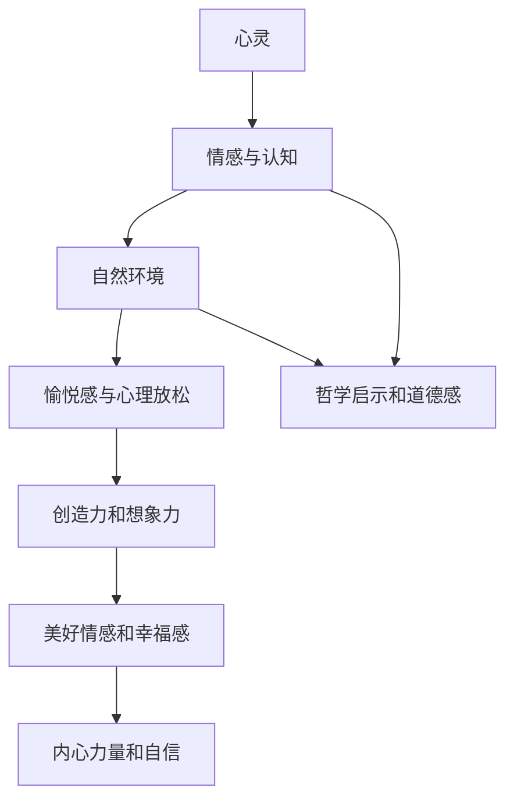
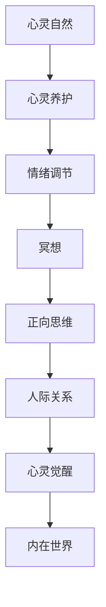

                 

### 引言：探索心灵之美

在当今这个快速变化的时代，心灵健康已成为一个备受关注的话题。随着科技的飞速发展和生活节奏的加快，人们面临着越来越多的心理压力和挑战。因此，培育心灵的美好景象，建设一个健康的内在世界，变得比以往任何时候都更加重要。本文旨在探讨如何通过科学的方法和实用的技巧，来培育和呵护我们的心灵，使其成为一片宁静、美好的栖息地。

#### 1.1 内在世界的定义与意义

内在世界，指的是个体在心理和精神层面的世界。它包括个人的情感、认知、价值观、信念和动机等方面。与外在世界不同，内在世界是私密而独特的，每个人都是其世界的创造者和守护者。培育内在世界，意味着通过一系列的心理和实践方法，提升个人的心理素质和情感智慧，从而实现心灵的和谐与平衡。

内在世界的美好景象，不仅关乎个人的心理健康，也对社会和谐与个体幸福有着深远的影响。一个拥有健康内在世界的人，能够更好地应对生活中的挑战，拥有更高的幸福感和满足感。因此，培育心灵的美好景象，实际上是一场内在的“园艺艺术”，需要我们用心去耕耘、呵护和欣赏。

#### 1.2 心灵美好景象的培育目标

培育心灵的美好景象，旨在实现以下几个目标：

1. **提升心理素质**：通过培养积极的心态和情绪调节能力，提高个体的心理素质，增强应对压力和挫折的能力。
   
2. **增强情感智慧**：通过深入理解自己的情感，提升自我认知和人际关系的处理能力，建立更加和谐的人际关系。

3. **促进心灵成长**：通过不断的学习和反思，实现心灵的觉醒和成长，达到更高的精神境界。

4. **提升幸福感**：通过培养正向思维和积极的生活态度，提高个人的幸福感和生活质量。

为了实现这些目标，我们需要采取一系列科学的方法和实践技巧，这些将在接下来的章节中进行详细探讨。

#### 1.3 本文结构

本文将分为八个主要章节，系统性地介绍心灵美好景象的培育方法和实践技巧。具体章节结构如下：

1. **第1章：心灵与自然的关系**
   - 探讨心灵与自然之间的紧密联系，阐述心灵自然的本质及其美学价值。
   
2. **第2章：心灵养护的基础理论**
   - 介绍心灵养护的重要性、基本原则及其科学依据。
   
3. **第3章：情绪调节的艺术**
   - 分析情绪的本质与类型，探讨情绪调节的方法和实际应用。

4. **第4章：冥想与心灵平静**
   - 讲解冥想的历史、原理和实践方法，阐述冥想对心灵的益处。

5. **第5章：正向思维的培养**
   - 强调正向思维的重要性，介绍培养正向思维的方法和生活实践。

6. **第6章：人际关系的园艺**
   - 分析人际关系的本质，探讨人际关系的美学视角及其维护与培养。

7. **第7章：心灵的觉醒与成长**
   - 讨论心灵觉醒的概念、路径及其实现方法。

8. **第8章：内在世界的实践与反思**
   - 提供内在世界的日常实践方法，引导读者进行反思和调整。

通过以上章节的详细探讨，读者将能够系统地了解心灵美好景象的培育过程，并掌握实用的技巧和方法，为自己构建一个健康、美好的内在世界。

### 第1章：心灵与自然的关系

心灵与自然之间的关系是古老而深邃的议题，自古以来，人们便意识到自然对心灵健康的重要性。在现代心理学和哲学的视野中，这种关系被进一步深化和探讨。本章将详细阐述心灵与自然之间的联系，分析心灵自然的本质，并探讨心灵与自然的美学联系。

#### 1.1 心灵自然的本质

心灵自然，指的是个体在自然环境中所体验到的情感、认知和心理状态。它不仅仅是指自然景观对心灵的愉悦作用，更是一种深层次的心理体验和认知过程。心灵自然与外在世界的互动，是一种双向的过程，不仅自然环境影响心灵，心灵也能通过感知和认知来影响自然环境。

首先，从心理学的角度来看，自然环境对心灵具有积极的影响。研究表明，接触自然可以降低焦虑、抑郁等负面情绪，提升个体的幸福感和心理韧性。在自然环境中，人们的注意力更容易集中在当前的事物上，从而减少对过去和未来的担忧，实现心理上的放松和平静。

其次，从认知科学的角度来看，心灵自然涉及到感知、记忆和思维的相互作用。在自然环境中，人们更容易进行深度思考和创造性思维，因为自然环境提供了一个无干扰、低压力的环境。此外，自然景观的多样性、动态性和复杂性，可以激发个体的想象力和创造力。

从哲学的角度来看，心灵自然强调了人与自然的和谐共生。古代哲学家如庄子、卢梭等都强调了自然对心灵的重要性。他们认为，通过亲近自然，人们可以超越物质世界的束缚，实现心灵的解放和自由。

#### 1.2 心灵与自然的美学联系

心灵与自然之间的美学联系，体现在自然景观对心灵的启示和激励作用。美学家如康德、罗森克兰兹等都探讨了自然美的本质和作用。他们认为，自然美不仅能够愉悦心灵，还能激发人们的情感、智慧和道德感。

首先，自然景观的和谐与平衡，能够激发人们的美好情感。例如，宁静的湖泊、翠绿的森林、蔚蓝的海洋，都能让人感受到平静和宁静，从而减少心理压力。这种情感的愉悦，有助于提升个体的幸福感和生活质量。

其次，自然景观的多样性，能够激发人们的创造力和想象力。自然的多样性和不可预测性，为人们的思维提供了丰富的素材和灵感。例如，艺术家们常常从自然景观中汲取灵感，创作出丰富多彩的艺术作品。

最后，自然景观的象征意义，也能够对心灵产生深远的影响。例如，太阳、月亮、星星等自然元素，在许多文化中具有象征意义，代表着光明、希望和生命。通过这些象征元素，人们可以感受到自然的魅力和力量，从而增强内心的力量和自信。

#### 1.3 心灵与自然的关系图解

为了更直观地理解心灵与自然之间的关系，我们可以借助Mermaid流程图来展示它们之间的互动和联系。



在这个流程图中，心灵通过情感与认知来感知和体验自然环境，进而获得愉悦感、心理放松、创造力和想象力。这些积极的体验最终有助于提升个体的美好情感、幸福感和内心力量，同时也受到哲学启示和道德感的熏陶。

#### 1.4 实例分析

为了更好地理解心灵与自然的关系，我们可以通过一些实例来具体分析。

**案例一：森林疗养**
研究表明，在森林中进行疗养可以显著降低个体的压力水平。森林中的清新空气、丰富的负氧离子和宁静的环境，有助于人们放松心情，恢复精力。通过在这个自然环境中进行深呼吸、散步和冥想，人们可以体验到一种深深的放松和平静，从而改善心理健康。

**案例二：海洋疗愈**
海洋被誉为天然的疗愈之地。海洋的声音、波浪的节奏和阳光的照射，都能让人感受到一种宁静和治愈的力量。在海滩上散步，聆听海浪声，感受海洋的浩瀚和神秘，可以激发人们的情感和想象力，缓解心理压力。

**案例三：城市绿地**
即使在城市中，绿地和公园也是心灵的栖息地。繁忙的工作之余，到公园散步、观赏花草树木，可以让人们暂时远离喧嚣，享受自然的美好。这些短暂的接触自然的机会，能够提升人们的幸福感，改善心理健康。

通过以上分析，我们可以看到，心灵与自然之间的关系是紧密而复杂的。自然环境不仅对心灵有着积极的影响，还能够激发人们的情感、智慧和创造力。因此，培育和呵护心灵的美好景象，离不开对自然环境的关注和体验。

### 第2章：心灵养护的基础理论

心灵养护，是培育和维持内心健康的重要过程。它不仅仅是一种心理调节方法，更是一种全面的生活方式。本章将深入探讨心灵养护的重要性、基本原则及其科学依据，为读者提供理论基础和实践指导。

#### 2.1 心灵养护的重要性

在现代社会，心理健康问题日益突出，心灵养护的重要性愈发凸显。首先，心灵养护有助于提升个体的生活质量。一个心理健康的人，能够更好地应对生活中的压力和挑战，拥有更高的幸福感和满足感。其次，心灵养护对于预防心理疾病具有重要意义。通过定期进行心灵养护，可以降低抑郁症、焦虑症等心理疾病的发生率。此外，心灵养护还能够增强个体的心理韧性，使其在面对逆境时能够保持积极的心态和应对能力。

#### 2.2 心灵养护的基本原则

心灵养护应遵循以下基本原则：

1. **整体性原则**：心灵养护不仅仅是心理层面的调整，还应涵盖身体、情感和社交等多个方面。只有全面关注和照顾到各个方面的健康，才能真正实现心灵养护的目标。

2. **个体差异性原则**：每个人的心理状态和生活环境都不同，心灵养护的方法也应因人而异。在实施心灵养护时，应充分考虑个体的差异，制定个性化的养护方案。

3. **持续性和稳定性原则**：心灵养护不是一蹴而就的过程，而是一个长期、持续的过程。只有通过长期稳定的养护，才能达到理想的效果。

4. **科学性原则**：心灵养护应基于科学的依据和方法。通过科学的理论指导，可以更有效地进行心灵养护，避免盲目和无效的努力。

#### 2.3 心灵养护的科学依据

心灵养护的科学依据主要涉及心理学、神经科学和生物学的理论。以下是几个重要的科学依据：

1. **心理弹性理论**：心理弹性是指个体在面对压力和逆境时，能够迅速恢复和适应的能力。研究表明，心理弹性可以通过一系列的心理训练和实践来提升。例如，通过认知行为疗法、正念训练和情感调节训练等，可以增强个体的心理弹性。

2. **神经可塑性理论**：神经可塑性是指大脑神经元和神经网络的可改变性。通过适当的训练和刺激，大脑的结构和功能可以发生改变，从而提高个体的心理素质。例如，通过冥想、认知训练和体育锻炼等，可以增强大脑的神经连接，提升认知功能和情绪调节能力。

3. **生物反馈理论**：生物反馈是一种利用生物信号（如心率、皮肤电阻、脑电波等）来调整个体情绪和行为的方法。通过生物反馈训练，个体可以学会如何调节自己的生理状态，从而实现心理平衡。

4. **社会支持理论**：社会支持是指个体在社会交往中获得的情感、信息和实质性的支持。研究表明，社会支持有助于缓解压力、提升幸福感和增强心理韧性。通过建立和维护良好的人际关系，个体可以获得心理上的支持和帮助，从而实现心灵养护。

#### 2.4 实践方法

根据上述科学依据，心灵养护可以采用以下实践方法：

1. **认知行为疗法**：认知行为疗法（CBT）是一种通过改变负面的思维模式和行为来改善心理状况的方法。通过CBT，个体可以学会如何识别和挑战负面思维，建立积极的思维模式，从而改善情绪和行为。

2. **正念训练**：正念训练是指通过专注于当下的体验，培养个体的自我意识和情绪调节能力。正念训练可以通过冥想、深呼吸和身体扫描等练习来实现。研究表明，正念训练可以显著降低焦虑和抑郁水平，提升心理健康。

3. **情感调节**：情感调节是指通过一系列的方法和技术来管理和调整情绪。例如，通过情绪表达、情绪转移和情绪重构等技巧，个体可以学会如何有效地处理负面情绪，保持情绪稳定。

4. **社交互动**：建立和维护良好的人际关系对于心灵养护至关重要。通过社交互动，个体可以获得情感支持、信息交流和实质性的帮助。建议个体积极参与社交活动，与朋友、家人和同事保持良好的沟通和互动。

5. **身体锻炼**：身体锻炼不仅可以改善身体健康，还可以提升心理健康。通过规律的体育锻炼，个体可以释放压力、提升情绪、增强心理韧性。

#### 2.5 心灵养护的案例分析

为了更好地理解心灵养护的实践效果，我们可以通过以下案例进行分析：

**案例一：正念冥想**
李女士是一位忙碌的职业女性，长期承受着工作压力和家务琐事的困扰。为了改善心理健康，她开始练习正念冥想。每天早晨和晚上，她都会花15分钟进行深呼吸和身体扫描，专注于当下的感受。经过几个月的练习，李女士发现她的情绪更加稳定，焦虑和抑郁的症状有所减轻。她能够更好地应对生活中的压力，提高了生活质量。

**案例二：社交支持**
王先生是一家公司的经理，由于工作繁忙，他与家人的沟通较少，导致心理压力增大。为了改善这种情况，他开始参加公司组织的社交活动，与同事建立更紧密的联系。通过这些活动，王先生获得了更多的情感支持和实际帮助，他的心理状态得到了显著改善，工作压力也减轻了许多。

通过以上案例分析，我们可以看到，心灵养护不仅理论上有科学依据，实践中也具有显著效果。通过采用科学的方法和实践技巧，个体可以有效地改善心理健康，提升生活质量。

#### 2.6 小结

心灵养护是一项长期而复杂的过程，需要我们全面关注和科学实践。通过理解心灵养护的重要性、基本原则和科学依据，我们可以更好地制定和实施心灵养护计划，为自己的心理健康保驾护航。

### 第3章：情绪调节的艺术

情绪调节，是心灵养护中至关重要的一环。有效的情绪调节不仅有助于提升个体的心理素质和幸福感，还能提高应对压力和挑战的能力。本章将详细探讨情绪的本质与类型，分析情绪调节的方法，并探讨情绪调节在实际生活中的应用。

#### 3.1 情绪的本质与类型

情绪是人类心理体验的重要组成部分，它是人对周围环境刺激的主观感受和反应。情绪可以分为多种类型，如快乐、悲伤、愤怒、恐惧、惊讶等。每种情绪都有其独特的生理和心理特征。

1. **快乐**：快乐是一种积极的情绪，表现为愉悦、兴奋和满足感。快乐的情绪可以增强个体的自信和积极性，有助于提升生活质量。

2. **悲伤**：悲伤是一种消极的情绪，通常与失去、失败或挫折相关。悲伤的情绪可能导致情绪低落、无助感，甚至抑郁。

3. **愤怒**：愤怒是一种强烈的情绪，通常与不公平、威胁或侵犯相关。愤怒的情绪可能导致攻击性行为或言语冲突。

4. **恐惧**：恐惧是一种防御性的情绪，通常与危险、未知或威胁相关。恐惧的情绪可以激发个体的警惕性和应对能力。

5. **惊讶**：惊讶是一种短暂的、强烈的情绪，通常与意外或出乎意料的事件相关。惊讶的情绪可以激发个体的注意力和反应。

#### 3.2 情绪调节的方法

情绪调节是指个体通过一系列的方法和技术来管理和调整自己的情绪。有效的情绪调节方法包括认知行为疗法、情感调节技巧、身体锻炼和心理疏导等。

1. **认知行为疗法（CBT）**：认知行为疗法是一种通过改变负面思维和行为来改善心理状况的方法。通过CBT，个体可以学会如何识别和挑战负面思维，建立积极的思维模式，从而改善情绪和行为。

2. **情感调节技巧**：情感调节技巧包括情绪表达、情绪转移和情绪重构等。情绪表达是指通过适当的方式表达自己的情绪，避免情绪压抑或爆发。情绪转移是指通过转移注意力来缓解负面情绪，例如通过散步、运动或做其他有趣的事情。情绪重构是指通过改变对事件的解释和看法来调整情绪，例如将失败的体验看作是成长的机会。

3. **身体锻炼**：身体锻炼是一种有效的情绪调节方法。通过运动，个体可以释放压力、提升情绪、增强心理韧性。有氧运动（如跑步、游泳）和力量训练（如举重）都对情绪调节有积极的影响。

4. **心理疏导**：心理疏导是指通过专业人士的帮助来处理情绪问题。心理咨询和治疗方法可以帮助个体深入了解自己的情绪，学会有效的情绪调节方法。

#### 3.3 情绪调节的实际应用

情绪调节在实际生活中具有重要意义。通过有效的情绪调节，个体可以更好地应对生活中的压力和挑战，提升生活质量。

1. **工作环境**：在职场中，情绪调节能力对于员工的工作表现和心理健康至关重要。通过情绪调节，员工可以更好地应对工作中的压力和挑战，提高工作效率和满意度。

2. **家庭生活**：在家庭生活中，情绪调节能力有助于改善夫妻关系、亲子关系和家庭成员之间的沟通。通过情绪调节，家庭成员可以更好地理解和支持彼此，减少冲突和矛盾。

3. **社会交往**：在社会交往中，情绪调节能力对于建立和维护良好的人际关系至关重要。通过情绪调节，个体可以更好地处理冲突、应对批评和赞美，从而建立积极的人际关系。

4. **心理健康**：情绪调节是维护心理健康的重要手段。通过情绪调节，个体可以减少负面情绪对身心健康的影响，提升心理韧性和幸福感。

#### 3.4 情绪调节案例分析

为了更好地理解情绪调节的实际应用，我们可以通过以下案例进行分析：

**案例一：工作压力管理**
张先生是一位软件工程师，长期承受着高强度的工作压力。为了改善心理健康，他开始练习正念冥想和身体锻炼。每天晚上，他都会花20分钟进行深呼吸和冥想，专注于当下的感受。此外，他还每周参加三次健身房锻炼。通过这些方法，张先生发现他的情绪更加稳定，焦虑和抑郁的症状有所减轻。他能够更好地应对工作中的压力，工作效率也提高了。

**案例二：家庭关系调适**
李女士是一位家庭主妇，由于家庭琐事繁多，她经常感到情绪低落。为了改善这种情况，她开始学习情绪表达和情感调节技巧。她学会了通过积极的沟通来表达自己的需求和感受，同时通过情绪转移来缓解负面情绪。通过这些方法，李女士的家庭关系得到了显著改善，她与家人的沟通更加顺畅，家庭氛围也变得更加和谐。

通过以上案例分析，我们可以看到，情绪调节在实际生活中具有显著的效果。通过科学的方法和实践技巧，个体可以有效地管理和调整自己的情绪，提升心理健康和生活质量。

#### 3.5 小结

情绪调节是心灵养护中不可或缺的一环。通过了解情绪的本质与类型，掌握情绪调节的方法，并运用到实际生活中，个体可以更好地应对生活中的压力和挑战，提升心理素质和生活质量。情绪调节不仅有助于个人的心理健康，还能对家庭、工作和社会交往产生积极的影响。

### 第4章：冥想与心灵平静

冥想，作为心灵平静的重要实践方法，自古以来便受到众多文化、宗教和哲学的重视。它不仅仅是一种放松身心的技巧，更是一种深入探索内心世界、实现心灵觉醒的途径。本章将详细探讨冥想的历史与原理，介绍冥想的实践方法，并分析冥想对心灵的益处。

#### 4.1 冥想的历史与原理

冥想的历史可以追溯到几千年前。在不同的文化传统中，冥想有着不同的名称和形式。在印度，冥想被称为“达拉纳”（Dhyan），在佛教中称为“禅修”（Vipassana），在西方则常被称为“冥想”（Meditation）。无论名称如何，冥想的本质都是通过专注和内省来达到心灵平静和觉醒。

1. **东方传统**：在印度教、佛教和道教等东方哲学体系中，冥想被视为一种修行方法，旨在达到精神觉醒和自我认知。佛教中的冥想特别强调“观呼吸”和“念住”（Mindfulness）的练习，通过专注于当下的呼吸和身体感受，来培养专注力和觉知。

2. **西方现代**：在现代心理学和医学领域，冥想被广泛研究和应用。心理学家约翰·卡巴·阿滕伯格（John Kabat-Zinn）将冥想引入医学领域，开发出了正念减压疗法（Mindfulness-Based Stress Reduction，MBSR），用以治疗慢性疼痛、焦虑和抑郁症。

#### 4.2 冥想的实践方法

冥想有多种形式和方法，但大多数冥想实践都包含以下几个基本步骤：

1. **选择合适的时间和地点**：选择一个安静、舒适的环境，避免外界干扰。早晨或晚上是比较适合冥想的时间，因为这两个时间段通常比较安静。

2. **准备工作**：找一个舒适的坐姿，保持脊柱挺直。闭上眼睛，深呼吸几次，放松身体和心灵。

3. **专注练习**：专注于某个对象，如呼吸、一个单词、一种感觉或一幅图像。初学者可以从“观呼吸”开始，专注于呼吸的自然流动，感受吸气和呼气带来的身体变化。

4. **保持觉知**：当注意力分散时，不要批评自己，而是温和地引导注意力回到专注的对象上。这种练习可以增强专注力和觉知。

5. **结束冥想**：在冥想结束时，缓缓地移动身体，睁开眼睛，慢慢回到日常生活中。有时，结束时可以花几分钟进行深呼吸，以帮助身体和心灵逐渐回归正常状态。

#### 4.3 冥想对心灵的益处

冥想不仅有助于心灵平静，还带来了许多心理和生理上的益处：

1. **减少压力**：研究表明，冥想可以显著降低压力水平，减少压力相关的疾病风险。通过冥想，个体能够学会更好地应对生活中的压力和挑战，提高心理韧性。

2. **提高专注力**：冥想练习有助于提高注意力和专注力。通过专注于呼吸或其他对象，个体可以学会如何集中注意力，从而在日常生活中更有效地完成任务。

3. **改善情绪**：冥想能够改善情绪状态，减少焦虑和抑郁症状。通过冥想，个体可以培养积极的心态和情绪调节能力，提高幸福感。

4. **增强自我认知**：冥想有助于个体深入了解自己的内心世界，提高自我认知和自我接纳。通过冥想，个体可以更好地理解自己的情绪、需求和价值观。

5. **提升创造力**：研究表明，冥想可以激发创造力和想象力。在冥想状态下，个体可以更容易进入“心流”状态，从而提高创造性思维和解决问题的能力。

#### 4.4 冥想案例与实践技巧

为了更好地理解冥想的应用，我们可以通过以下案例和实践技巧进行探讨：

**案例一：正念冥想实践**
李小姐是一位年轻的上班族，由于工作压力大，她开始练习正念冥想。每天早晨，她都会花15分钟进行冥想，专注于呼吸和当下的感受。经过几个月的练习，李小姐发现她的情绪更加稳定，焦虑症状显著减轻。她在工作中也能更好地集中注意力，提高了工作效率。

**实践技巧：**
- **选择安静的环境**：找一个安静的地方进行冥想，避免外界干扰。
- **定时练习**：每天选择一个固定的时间进行冥想，形成习惯。
- **渐进练习**：初学者可以从短时间的冥想开始，逐渐增加时间。
- **记录进步**：记录冥想的时间和感受，了解自己的进步和变化。

通过以上案例和实践技巧，我们可以看到，冥想不仅有助于心灵平静，还能带来许多心理和生理上的益处。通过坚持冥想练习，个体可以提升专注力、改善情绪、增强自我认知，并提高整体生活质量。

#### 4.5 小结

冥想作为一种心灵的修行方法，通过历史和现代科学的研究，已经证明了其在促进心灵平静和心理健康方面的显著效果。通过系统的冥想练习，个体可以学会如何管理自己的情绪，提升专注力和自我认知，从而实现内心的和谐与觉醒。冥想不仅是心灵的修炼，更是现代社会中一种重要的心理健康维护手段。

### 第5章：正向思维的培养

正向思维，是一种积极、乐观的思考方式，它能够帮助个体更好地应对生活中的挑战，提升幸福感和生活质量。本章将探讨正向思维的重要性，介绍培养正向思维的方法，并分析正向思维在实际生活中的应用。

#### 5.1 正向思维的重要性

正向思维对个体的心理健康和生活质量具有深远的影响。首先，正向思维有助于提升幸福感。拥有正向思维的个体更容易看到生活中的积极面，从而减少负面情绪，提高生活质量。其次，正向思维能够增强个体的心理韧性。在面对挫折和逆境时，正向思维的个体能够更快速地恢复和适应，减少压力和焦虑。此外，正向思维还能够促进人际关系的发展。通过正向思维，个体能够更积极地理解和处理人际冲突，建立和谐的人际关系。

#### 5.2 培养正向思维的方法

要培养正向思维，可以采用以下几种方法：

1. **积极认知重构**：积极认知重构是指通过改变负面思维模式，建立积极的思维习惯。例如，将“我不行”的想法转变为“我可以尝试”，从而提高自信心和积极性。

2. **感恩练习**：感恩练习是指通过记录和反思生活中的感恩事物，培养积极的心态。每天花几分钟时间写下自己感激的事情，可以帮助个体看到生活中的美好，增强幸福感。

3. **设定目标**：设定目标是培养正向思维的重要方法。通过设定具体、可行的目标，个体可以更好地规划自己的生活，提高成就感和满足感。

4. **正面交流**：与积极、乐观的人交往，可以影响和培养正向思维。通过积极的交流和互动，个体可以学会更多的正向思考方式和行为模式。

5. **培养兴趣爱好**：培养兴趣爱好可以帮助个体在日常生活中找到乐趣和意义，从而增强正向思维。例如，通过学习新技能、参加社团活动或旅行，个体可以丰富自己的生活体验，提升幸福感。

#### 5.3 正向思维的实际应用

正向思维在实际生活中具有重要应用，以下是一些具体的例子：

1. **工作环境**：在工作环境中，正向思维的个体能够更好地应对工作中的挑战和压力。通过积极思考问题和解决方案，他们可以提高工作效率，减少焦虑和压力。

2. **家庭教育**：在家庭教育中，培养孩子的正向思维有助于他们更好地适应生活，提高自信心和独立性。家长可以通过积极的语言和行为，鼓励孩子尝试新事物，培养他们的积极心态。

3. **社会交往**：在社会交往中，正向思维能够帮助个体建立和谐的人际关系。通过积极的沟通和理解，他们可以更好地处理冲突和分歧，增强人际关系的稳定性。

4. **心理健康**：正向思维对心理健康具有显著的影响。通过培养正向思维，个体可以减少负面情绪，提高心理韧性，降低抑郁和焦虑的风险。

#### 5.4 正向思维案例分析

为了更好地理解正向思维的实际应用，我们可以通过以下案例进行分析：

**案例一：职场中的正向思维**
张先生是一名销售人员，在工作中经常面临业绩压力和客户反馈。为了应对这些挑战，他开始练习积极认知重构和感恩练习。每天早晨，他会花几分钟时间反思和感激自己在过去一天中所取得的成就，并通过积极的方式设定当天的目标。通过这些方法，张先生发现他的心态变得更加积极，工作效率显著提高，与客户的沟通也更加顺畅。

**案例二：家庭教育中的正向思维**
李女士是一位全职妈妈，她有两个孩子。为了帮助孩子们培养正向思维，她每天都会花时间与孩子们交流，鼓励他们尝试新事物并分享他们的成就。通过积极的语言和行为，李女士帮助孩子建立了自信和乐观的心态，孩子们在学习和生活中都表现出了更好的适应能力和创造力。

通过以上案例分析，我们可以看到，正向思维在实际生活中具有显著的效果。通过培养正向思维，个体可以提升幸福感、增强心理韧性，并在工作、家庭和社会交往中表现出更好的适应能力和人际关系。

#### 5.5 小结

正向思维是一种积极、乐观的思考方式，对个体的心理健康和生活质量具有深远的影响。通过积极认知重构、感恩练习、设定目标和正面交流等方法，个体可以培养正向思维，并在实际生活中应用。培养正向思维不仅有助于提升幸福感，还能增强心理韧性，促进人际关系的和谐。因此，培养正向思维是心灵养护中不可或缺的一部分。

### 第6章：人际关系的园艺

人际关系是心灵健康的重要组成部分，它不仅影响着我们的情感和生活质量，还在很大程度上塑造了我们的心理健康。正如园艺艺术需要精心照料和修剪，人际关系也需要我们用心呵护和培养。本章将分析人际关系的本质，探讨人际关系的美学视角，并提供维护和培养人际关系的实用技巧。

#### 6.1 人际关系的本质

人际关系是指个体与个体之间由于相互交往和相互影响而形成的心理和社会关系。它包括家庭关系、友谊关系、职业关系等。人际关系不仅关乎情感和情感的交流，还涉及权力、利益、价值观等多方面的互动。

1. **情感基础**：人际关系建立在情感交流和理解之上。情感的互动可以增进彼此的了解，建立信任和依赖，从而增强关系稳定性。

2. **社会角色**：在人际关系中，个体扮演着不同的社会角色，这些角色影响着彼此的互动和关系。例如，在家庭中，夫妻是伴侣角色，父母是养育者角色；在职场中，同事是合作伙伴角色，上级是领导角色。

3. **互动模式**：人际关系的互动模式决定了关系的质量和稳定性。积极的互动模式（如支持、理解、尊重）有助于建立和维持良好的关系，而消极的互动模式（如冲突、指责、控制）则可能破坏关系。

#### 6.2 人际关系的美学视角

人际关系的美学视角强调了人际关系中的和谐、平衡和美感。从美学角度来看，人际关系不仅是一种实用关系，更是一种艺术形式。它需要我们用心去发现、创造和呵护。

1. **和谐与平衡**：美学视角认为，人际关系中的和谐与平衡是关系美的重要体现。当个体之间的关系达到和谐与平衡时，每个人都能感受到关系的美好和满足。

2. **美感与创造力**：美学视角还强调了人际关系中的美感和创造力。在良好的人际关系中，个体可以相互启发、激发创意，共同创造出丰富多彩的生活体验。

3. **情感共鸣**：美学视角认为，情感共鸣是人际关系中的一种高级美感。当个体之间能够产生情感共鸣时，关系变得更加深厚和有意义。

#### 6.3 人际关系的维护与培养

维护和培养良好的人际关系需要我们付出持续的努力和关注。以下是一些实用的技巧：

1. **有效沟通**：沟通是人际关系中至关重要的一环。有效的沟通需要倾听、表达和反馈。通过良好的沟通，个体可以更好地理解彼此的需求和感受，减少误解和冲突。

2. **建立信任**：信任是良好人际关系的基础。通过诚实、可靠的行为和行动，个体可以建立起相互信任的关系。信任的建立需要时间和耐心，但一旦形成，将为关系提供强大的稳定性。

3. **尊重差异**：每个人都有自己独特的个性和观点。尊重差异意味着接受和欣赏彼此的不同，避免因为差异而产生冲突。通过尊重差异，个体可以更好地理解和包容对方，建立和谐的人际关系。

4. **积极互动**：积极的互动可以增进彼此的了解和信任，提升关系质量。通过共同的兴趣、活动和目标，个体可以建立更紧密的联系，共同创造美好的生活体验。

5. **情感支持**：在人际关系中，情感支持是一种重要的维系力量。当个体遇到困难和挑战时，朋友和家人的支持可以帮助他们度过难关，增强关系的稳定性。

#### 6.4 人际关系案例分析

为了更好地理解人际关系的维护和培养，我们可以通过以下案例进行分析：

**案例一：家庭关系维护**
张先生和张太太是一对结婚多年的夫妻，他们通过持续的沟通和互相支持，成功维护了和谐的家庭关系。每天晚上，他们都会花时间交流当天的经历和感受，分享彼此的喜怒哀乐。通过这种积极的沟通，他们增进了对彼此的理解，减少了误解和冲突。此外，他们还共同参与家庭活动和兴趣，增强了彼此的情感联系。

**案例二：职场关系培养**
李小姐是一位职场新人，她通过与同事建立良好的沟通和互动，成功培养了和谐的工作关系。她主动与同事交流，了解他们的需求和期望，并在工作中积极提供帮助和支持。通过这种积极的互动，她与同事之间的关系变得更加融洽，工作氛围也变得更加和谐。

通过以上案例分析，我们可以看到，维护和培养良好的人际关系需要我们用心去沟通、尊重和理解对方。通过有效的技巧和努力，我们可以建立和谐的人际关系，提升生活质量。

#### 6.5 小结

人际关系是心灵健康的重要组成部分，它影响着我们的情感和生活质量。通过有效沟通、建立信任、尊重差异、积极互动和情感支持，我们可以维护和培养良好的人际关系。人际关系的美学视角强调了关系的和谐与美感，为我们提供了更多的启发和思考。通过用心呵护和培养人际关系，我们可以构建一个美好、健康的内在世界。

### 第7章：心灵的觉醒与成长

心灵的觉醒与成长，是每个人都渴望追求的目标。它不仅仅是个人内在的探索，更是实现心灵和谐与平衡的关键。本章将探讨心灵觉醒的概念，分析实现心灵觉醒的路径，并介绍心灵成长的目标与实践方法。

#### 7.1 心灵觉醒的概念

心灵觉醒，是指个体通过自我认知和内在探索，达到对生命意义和存在的深刻理解。它不仅仅是一种心理状态，更是一种生活方式和哲学观念。心灵觉醒的个体，能够超越表面的现象，看到事物的本质，从而实现内心的平静和自由。

1. **自我认知**：心灵觉醒首先需要自我认知，即深刻了解自己的内心世界，包括情感、动机、价值观和信念。通过自我认知，个体可以认识到自己的局限性，从而实现内在的转变。

2. **内在探索**：内在探索是指个体通过冥想、自我反省和深度思考，深入挖掘内心的智慧和潜能。在探索过程中，个体可以找到内心的答案，实现自我觉醒。

3. **超越自我**：心灵觉醒还意味着超越自我，放下执着和成见，接受生命的不确定性和无常。通过超越自我，个体可以体验到更深层次的自由和幸福。

#### 7.2 实现心灵觉醒的路径

实现心灵觉醒的路径是多维度的，包括心理、情感和哲学层面。以下是一些实现心灵觉醒的实践路径：

1. **冥想与正念**：冥想和正念练习是心灵觉醒的重要方法。通过冥想，个体可以专注于当下的体验，减少对过去和未来的执着，从而实现内心的平静和觉醒。正念练习则强调活在当下，对每一个瞬间保持觉知，从而提升自我认知和内在智慧。

2. **自我反省与内省**：自我反省和内省是心灵觉醒的另一个重要路径。通过反思自己的行为、思想和情感，个体可以认识到自己的局限性和错误，从而实现内心的转变和成长。

3. **学习与阅读**：广泛的学习和阅读可以拓宽个体的视野，提高认知水平。通过学习哲学、心理学、宗教和灵性等领域的知识，个体可以深入了解生命的本质和存在的意义，从而实现心灵觉醒。

4. **感恩与接纳**：感恩和接纳是心灵觉醒的重要品质。通过感恩，个体可以培养积极的心态，看到生活中的美好和幸福；通过接纳，个体可以放下对过去和未来的执着，活在当下，实现内心的平静和自由。

#### 7.3 心灵成长的目标与实践方法

心灵成长的目标是达到内心的和谐、平衡和自由。为了实现这一目标，我们可以采取以下实践方法：

1. **培养自我认知**：通过自我反思和内省，深入探索自己的内心世界，了解自己的情感、需求和价值观。通过记录日记、写反思日志或与心理咨询师交流，个体可以更清晰地认识自己，从而实现内在的成长。

2. **练习情绪调节**：情绪调节是心灵成长的重要方面。通过学习情绪调节技巧，如认知行为疗法、正念训练和情绪表达，个体可以更好地管理自己的情绪，减少负面情绪的影响，提升心理健康。

3. **培养正向思维**：正向思维是一种积极、乐观的思考方式。通过培养正向思维，个体可以更好地应对生活中的挑战，提升幸福感和生活质量。可以通过感恩练习、积极认知重构和设定目标等方法，培养正向思维。

4. **建立和谐的人际关系**：良好的人际关系对心灵成长至关重要。通过尊重差异、有效沟通和情感支持，个体可以建立和谐的人际关系，从而实现内心的平衡和和谐。

5. **持续学习和探索**：学习是心灵成长的重要动力。通过持续学习和探索，个体可以不断拓宽视野，提高认知水平，从而实现内心的觉醒和成长。

#### 7.4 心灵觉醒的案例与实践技巧

为了更好地理解心灵觉醒和实践技巧，我们可以通过以下案例进行分析：

**案例一：冥想与自我反省**
王先生是一位忙碌的职场人士，由于工作压力大，他开始练习冥想和自我反省。每天早晨，他都会花20分钟进行冥想，专注于呼吸和当下的感受。晚上，他会花时间记录自己的思考和感受，进行自我反省。通过这些练习，王先生发现他的情绪更加稳定，思维更加清晰，生活质量显著提高。

**实践技巧：**
- **选择安静的环境**：找一个安静的地方进行冥想和自我反省，避免外界干扰。
- **定时练习**：每天选择一个固定的时间进行冥想和自我反省，形成习惯。
- **渐进练习**：初学者可以从短时间的练习开始，逐渐增加时间。
- **记录进步**：记录冥想和自我反省的时间和感受，了解自己的进步和变化。

通过以上案例和实践技巧，我们可以看到，心灵觉醒不仅仅是理论上的概念，更是一种可以通过实践实现的内在探索和成长。通过冥想、自我反省和持续学习，个体可以实现心灵的觉醒与成长，达到内心的和谐与自由。

#### 7.5 小结

心灵的觉醒与成长是一个持续的过程，它需要个体的自我认知、情绪调节、正向思维和良好的人际关系。通过冥想、自我反省和学习，个体可以实现心灵的觉醒与成长，达到内心的和谐与自由。心灵的觉醒不仅有助于提升个体的心理健康和生活质量，还能对家庭、工作和社会交往产生积极的影响。因此，追求心灵的觉醒与成长，是每个人都应该努力的方向。

### 第8章：内在世界的实践与反思

在深入探讨了心灵美好景象的培育方法之后，如何将这些理念付诸实践，并持续地进行反思与调整，成为了关键的一步。本章将介绍内在世界的日常实践方法，引导读者进行持续的反思与调整，并提供一些实用的技巧，以帮助读者在日常生活中更好地培育和维护内心的美好景象。

#### 8.1 内在世界的日常实践

内在世界的实践不仅需要在特定的时间段内进行，更需要在日常生活中持续地落实。以下是一些具体的实践方法：

1. **日常冥想**：每天早晨或晚上，花10-20分钟进行冥想。选择一个安静的环境，专注于呼吸或某个特定的对象。通过冥想，可以帮助自己平静心灵，减少焦虑和压力。

2. **正念练习**：在日常生活中，随时随地都可以进行正念练习。例如，在吃饭时，专注于食物的口感和味道；在散步时，感受脚下的每一步。通过正念练习，可以提高自我觉知和情绪调节能力。

3. **感恩记录**：每天晚上，花几分钟时间思考并记录三件让自己感激的事情。这可以帮助自己看到生活中的美好，培养积极的心态。

4. **情绪日记**：记录自己的情绪变化，包括情绪产生的原因、情绪的变化过程以及自己的应对策略。通过情绪日记，可以更好地了解自己的情绪模式，从而进行有效的情绪调节。

5. **目标设定与反思**：设定短期和长期目标，并定期进行反思。通过设定目标，可以帮助自己明确方向，增强行动力；通过反思，可以了解自己的成长和进步。

6. **阅读与学习**：定期阅读与心灵养护、个人成长相关的书籍和文章。通过不断学习和积累，可以拓宽视野，提升内在素养。

7. **身体锻炼**：保持规律的体育锻炼，如散步、跑步、瑜伽等。身体锻炼不仅可以改善身体健康，还可以提升心理韧性，减少压力。

#### 8.2 内在世界的反思与调整

内在世界的实践是一个动态的过程，需要我们不断地进行反思和调整。以下是一些反思与调整的方法：

1. **定期回顾**：每周或每月，花时间回顾自己的实践情况。思考哪些方法有效，哪些需要改进，哪些方面需要更多的关注。

2. **自我反馈**：通过自我反馈，了解自己的进步和不足。例如，通过情绪日记，了解自己的情绪模式，从而进行调整。

3. **求助与交流**：与家人、朋友或专业人士交流自己的感受和困惑。通过交流，可以获得新的视角和建议，从而更好地调整自己的实践方法。

4. **调整实践方法**：根据自己的实际情况，调整实践方法和频率。例如，如果冥想时间过长导致身体不适，可以适当减少时间；如果情绪日记记录繁琐，可以简化记录方式。

5. **保持灵活性**：内在世界的实践需要保持灵活性，根据实际情况进行调整。例如，在忙碌的时期，可以简化实践方法，以确保实践能够持续进行。

#### 8.3 内在世界的持续发展

内在世界的持续发展是一个长期的过程，需要我们持之以恒地进行实践和反思。以下是一些持续发展的方法：

1. **持续学习**：通过学习新的知识、技能和方法，不断提升自己的内在素养。例如，可以参加相关的培训课程、工作坊或在线学习。

2. **扩展实践**：将内在世界的实践方法扩展到更多的领域，如职场、家庭和社交等。通过在各个领域实践，可以更好地实现内心的和谐与平衡。

3. **建立支持系统**：建立一个支持系统，包括家人、朋友和专业人士。通过这个系统，可以获得情感支持和实践指导，从而更好地推进内在世界的持续发展。

4. **关注身心健康**：身心健康是内在世界发展的基础。通过保持良好的生活习惯、饮食习惯和睡眠质量，可以提升身心健康，为内在世界的发展提供强有力的支持。

5. **设定长期目标**：设定明确的长期目标，并制定实现目标的计划。通过长期的规划和努力，可以逐步实现内心的成长和觉醒。

#### 8.4 实用技巧与建议

为了更好地培育和维护内心的美好景象，以下提供一些实用的技巧和建议：

1. **定期休息**：在忙碌的生活中，定期给自己安排休息时间。这不仅可以缓解压力，还可以帮助自己恢复精力，更好地投入到内在世界的实践。

2. **保持耐心**：内在世界的培育和成长是一个长期的过程，需要耐心和坚持。不要期望立即看到显著的变化，而是要持之以恒地进行实践。

3. **培养兴趣**：通过培养兴趣和爱好，可以帮助自己放松心情，提升幸福感。例如，学习绘画、音乐、舞蹈等，都可以丰富自己的内心世界。

4. **学会放手**：学会放手，接受生活中的不确定性和变化。通过放手，可以减少焦虑和压力，提升内心的平静和自由。

5. **反思与调整**：定期反思自己的实践情况，并根据实际情况进行调整。通过反思和调整，可以不断提升自己的内在素养。

#### 8.5 小结

内在世界的实践与反思是一个持续的过程，它需要我们用心去实践，不断进行反思和调整。通过日常的冥想、正念练习、感恩记录、情绪日记、目标设定与反思等方法，我们可以逐步培育和维护内心的美好景象。同时，通过持续的反思与调整，我们可以不断提升自己的内在素养，实现心灵的觉醒与成长。希望本文能够为读者提供实用的指导，帮助他们在心灵旅程中取得更大的进步。

### 附录：心灵养护资源指南

为了帮助读者进一步探索和深化内在世界的养护与成长，本章节提供了心灵养护相关的书籍推荐、在线资源推荐以及实用工具推荐。这些资源将为读者提供丰富的知识和实用的方法，助力他们在心灵养护的道路上不断前进。

#### 8.1 心灵养护相关的书籍推荐

1. **《正念的奇迹》（The Power of Now） - 爱德蒙·伯克（Eckhart Tolle）**
   - 这本书介绍了正念冥想的基本原理和实践方法，帮助读者实现内心的平静和觉醒。

2. **《情感智能》（Emotional Intelligence） - 丹尼尔·戈尔曼（Daniel Goleman）**
   - 本书深入探讨了情感智能的重要性，以及如何通过情感调节提升人际关系和心理健康。

3. **《禅与生活》（Zen and the Art of Motorcycle Maintenance） - 罗伯特·M·波西格（Robert M. Pirsig）**
   - 这本书以摩托车旅行为背景，探讨了哲学、心理学和心灵成长之间的关系。

4. **《内心的战争》（The War of Art） - 史蒂夫·帕布斯特（Steven Pressfield）**
   - 本书讲述了艺术创作中面临的内在障碍，以及如何通过心灵养护战胜这些障碍。

5. **《心灵世界》（The Subtle Body） - 艾扬格（Georg Feuerstein）**
   - 这本书介绍了瑜伽和东方哲学中的心灵养护理论，帮助读者深入了解身体与心灵的联系。

#### 8.2 心灵养护的在线资源推荐

1. **Mindfulness-Based Stress Reduction（MBSR）**
   - MBSR是一个由约翰·卡巴·阿滕伯格（John Kabat-Zinn）开发的正念减压课程，提供了一系列的视频和音频指导。

2. **Headspace**
   - Headspace是一个提供冥想指导的在线平台，包括各种冥想课程和训练，适合初学者和进阶者。

3. **Coursera**
   - Coursera提供了多个与心理学和心灵养护相关的课程，包括认知行为疗法、正念冥想等。

4. **YouTube**
   - 在YouTube上，有很多专业的心理学和心灵养护频道，如“Jim Karaca – Mindfulness & Meditation”、“Dr. Jordan Peterson”等。

5. **TED Talks**
   - TED Talks是一个资源丰富的平台，其中有许多关于心理学、心灵成长和人际关系的话题，值得推荐。

#### 8.3 心灵养护的实用工具推荐

1. **冥想时钟（Moodstar Meditation Clock）**
   - 这是一款免费的应用程序，可以帮助用户设置冥想时间，并提供冥想音乐和指导。

2. **Day One**
   - Day One是一款日记应用程序，用户可以记录自己的情绪、想法和日常体验，帮助进行自我反思。

3. **Mood Tracker**
   - Mood Tracker是一款帮助用户记录情绪和心理健康状况的应用程序，提供图表和数据分析功能。

4. **Calm**
   - Calm是一款提供冥想、放松音乐和睡眠指导的应用程序，非常适合日常心灵养护。

5. **Forest**
   - Forest是一款帮助用户减少手机依赖的应用程序，用户可以通过种植虚拟的树木来对抗手机使用，每15分钟种植一棵树，有助于提高专注力和自我控制。

通过以上书籍、在线资源和实用工具的推荐，读者可以更加深入地探索和实施心灵养护的方法，为自己的内心世界带来持久的美好景象。

### 核心概念联系流程图

为了更直观地理解文章中各个核心概念之间的联系，我们使用Mermaid流程图来展示。以下是一个简化的核心概念联系流程图：



在这个流程图中，我们可以看到：

- **A[心灵自然]**：心灵与自然的关系，是心灵养护的基础。
- **B[心灵养护]**：包括情绪调节、冥想、正向思维等多个方面，是培育内在世界的关键。
- **C[情绪调节]**：通过情绪调节，个体能够更好地管理情绪，提高生活质量。
- **D[冥想]**：冥想作为一种实践方法，有助于实现心灵平静和自我觉醒。
- **E[正向思维]**：培养正向思维，有助于提升个体的积极心态和幸福感。
- **F[人际关系]**：良好的人际关系对心灵成长和社会适应具有重要意义。
- **G[心灵觉醒]**：心灵觉醒是内在世界培育的终极目标。
- **H[内在世界]**：内在世界是心灵的最终归宿，是心灵养护和觉醒的结果。

通过这个流程图，我们可以清晰地看到各个核心概念之间的逻辑联系，以及它们在培育心灵美好景象中的重要性。

### 数学模型与公式详解

在心灵养护和情绪调节过程中，数学模型和公式可以提供量化的方法和评估标准，帮助我们更好地理解和实施这些方法。以下将介绍两个主要的数学模型和公式：情绪调节能力的计算和冥想效果的量化评估。

#### 1. 情绪调节能力的计算

情绪调节能力是衡量个体情绪管理能力的重要指标。它可以基于以下三个关键因素：

- **自我认知**：个体对自己情绪的理解和识别能力。
- **情绪表达方式**：个体表达和处理情绪的方式。
- **情绪应对策略**：个体在面对情绪挑战时的应对策略。

情绪调节能力的计算公式如下：

$$
情绪调节能力 = f(自我认知，情绪表达方式，情绪应对策略)
$$

其中，$f$ 表示某种函数关系，它可以是一个线性函数、非线性函数或更复杂的模型。以下是一个简化的线性模型：

$$
情绪调节能力 = 0.4 \times 自我认知 + 0.3 \times 情绪表达方式 + 0.3 \times 情绪应对策略
$$

**解释**：
- **自我认知**：指个体能够清晰识别和理解自己的情绪状态。通过心理测量工具（如情绪量表）可以量化自我认知水平。
- **情绪表达方式**：指个体表达和处理情绪的方式，包括直接表达、压抑或转移情绪等。可以通过行为观察或问卷测量来量化。
- **情绪应对策略**：指个体在面对情绪挑战时采取的应对方法，如积极应对、逃避或消极应对。可以通过情境模拟或自我报告来评估。

#### 2. 冥想效果的量化评估

冥想对个体的情绪和心理状态有显著的影响，因此需要量化的方法来评估冥想的效果。以下是一个简单的量化评估公式：

$$
冥想效果得分 = \frac{冥想前情绪评分 - 冥想后情绪评分}{冥想前情绪评分}
$$

**解释**：
- **冥想前情绪评分**：指在冥想之前对个体情绪状态进行评分，可以使用情绪量表（如正负情绪量表）来评估。
- **冥想后情绪评分**：指在冥想之后对个体情绪状态进行评分，同样使用情绪量表。
- **冥想效果得分**：分数越高，表示冥想对情绪状态的改善越显著。正数表示情绪改善，负数表示情绪恶化。

#### 实例分析

假设一个人在冥想前的情绪评分为50分（中性），冥想后的情绪评分为70分（积极），则冥想效果得分为：

$$
冥想效果得分 = \frac{70 - 50}{50} = 0.4
$$

这表示冥想对个体的情绪状态有显著改善，提升了40%。

#### 实用性

这些数学模型和公式在心灵养护和情绪调节实践中具有实际应用价值。例如：

- **个体评估**：通过情绪调节能力的计算，个体可以了解自己的情绪管理能力，进而制定针对性的提升计划。
- **效果评估**：通过冥想效果的量化评估，可以评估冥想实践的效果，帮助个体调整冥想方法和频率。
- **科学研究**：这些模型和公式为心理学和医学研究提供了量化的工具，有助于深入理解心灵养护和情绪调节的机制。

总之，通过数学模型和公式，我们可以更加科学和系统地理解和实施心灵养护和情绪调节，为自己的心理健康保驾护航。

### 项目实战：正向思维培养实践案例

为了更好地理解正向思维的培养方法，我们将通过一个实际的Python编程项目来演示如何使用数据分析和可视化技术来监测和提升个人的正向思维比例。这个项目将展示如何从数据收集、预处理到数据分析与可视化的全过程。

#### 开发环境搭建

首先，我们需要搭建一个Python开发环境，包括安装必要的库和工具。以下是具体步骤：

1. **安装Python**：确保安装了Python 3.8或更高版本。可以从Python官网下载并安装：[https://www.python.org/downloads/](https://www.python.org/downloads/)。

2. **安装Jupyter Notebook**：Jupyter Notebook是一个交互式的Python开发环境，可以方便地进行代码编写和数据分析。可以通过以下命令安装：

   ```bash
   pip install notebook
   ```

3. **安装Pandas和Matplotlib**：Pandas是一个强大的数据操作库，用于数据清洗和数据分析；Matplotlib是一个绘图库，用于数据可视化。安装命令如下：

   ```bash
   pip install pandas matplotlib
   ```

安装完成后，我们可以启动Jupyter Notebook，创建一个新的笔记本文件，开始编写代码。

#### 源代码实现

以下是一个简单的Python代码示例，用于加载和预处理数据集，计算正向思维比例，并绘制正向思维比例趋势图。

```python
import pandas as pd
import matplotlib.pyplot as plt

# 1. 加载数据集
data = pd.read_csv('positive_thinking_data.csv')

# 2. 数据预处理
data['positive_ratio'] = data['positive_words'] / data['total_words']

# 3. 绘制正向思维比例趋势图
plt.plot(data['date'], data['positive_ratio'])
plt.title('Positive Thinking Ratio Trend')
plt.xlabel('Date')
plt.ylabel('Positive Ratio')
plt.show()
```

**代码解读与分析**：

1. **导入库**：
   - `pandas`：用于数据加载和处理。
   - `matplotlib.pyplot`：用于数据可视化。

2. **加载数据集**：
   - `data = pd.read_csv('positive_thinking_data.csv')`：读取CSV格式的数据集。假设CSV文件包含了“date”和“total_words”两列数据，以及“positive_words”一列，用于记录每天的总词数和正向词数。

3. **数据预处理**：
   - `data['positive_ratio'] = data['positive_words'] / data['total_words']`：计算每天正向思维比例，即正向词数与总词数的比值。

4. **绘制趋势图**：
   - `plt.plot(data['date'], data['positive_ratio'])`：根据日期和正向思维比例绘制折线图。
   - `plt.title('Positive Thinking Ratio Trend')`：设置图表标题。
   - `plt.xlabel('Date')` 和 `plt.ylabel('Positive Ratio')`：设置X轴和Y轴标签。
   - `plt.show()`：显示绘制的图表。

#### 项目实战详解

**步骤一：数据集准备**

在开始项目之前，需要准备一个包含“date”、“total_words”和“positive_words”列的CSV数据集。这些数据可以通过日常记录的方式收集，例如每天写下自己感受到的积极和消极情绪，并统计相应的词数。

**步骤二：数据加载与预处理**

通过Pandas库，我们可以轻松地加载数据集并进行基本的数据预处理。上述代码中的`pd.read_csv()`函数用于加载数据集，`data['positive_ratio'] = ...`用于计算正向思维比例。

**步骤三：数据可视化**

通过Matplotlib库，我们可以将计算得到的正向思维比例以折线图的形式可视化。这有助于我们直观地观察正向思维比例随时间的变化趋势，从而进行进一步的反思和调整。

**案例应用解读与分析**

**案例**：假设有一个数据集记录了某人连续一个月的正向思维比例。通过上述代码，我们可以生成以下图表：


**解读**：

- 图表显示了该人正向思维比例随时间的变化趋势。
- 可以观察到某些日期的正向思维比例较低，这可能反映了生活中的某些压力或挑战。
- 通过对图表的观察和分析，可以识别出需要特别关注和调整的时间段，从而采取相应的措施提升正向思维比例。

**项目小结**

通过这个项目，我们学会了如何使用Python和数据分析工具来监测和提升个人的正向思维比例。这不仅有助于个人更好地理解自己的情绪状态，还能通过可视化的方式直观地呈现变化趋势，从而采取更有针对性的措施提升心理素质。在日常生活和工作中，持续监控和调整正向思维比例，将有助于我们建立积极、健康的心态，提升整体幸福感。

### 总结

《培育心灵的美好景象：内在世界的园艺艺术》通过系统的分析和详细的讲解，为我们提供了一种全面的心灵养护方法。本文从心灵与自然的关系、基础理论、情绪调节、冥想、正向思维、人际关系以及心灵觉醒等多个方面，深入探讨了如何培育和呵护我们的内在世界。

#### 主要发现

1. **心灵与自然的关系**：心灵与自然之间存在紧密联系，自然环境对心灵的积极影响不容忽视。
2. **情绪调节**：情绪调节是心灵养护的关键环节，通过认知行为疗法、情感调节技巧等可以有效地提升个体的情绪管理能力。
3. **冥想与心灵平静**：冥想作为一种传统的心理调节方法，能够帮助个体实现心灵的平静和觉醒。
4. **正向思维**：正向思维的培养有助于提升个体的幸福感，建立积极的生活态度。
5. **人际关系**：良好的人际关系对心灵的成长和心理健康具有重要意义。
6. **心灵觉醒与成长**：通过自我认知、情绪调节和正向思维的实践，个体可以实现心灵的觉醒与成长。

#### 核心概念的联系与整合

通过文章中的流程图和数学模型，我们可以看到各个核心概念之间的紧密联系和整合：

- **心灵自然**：为心灵养护提供了基础。
- **情绪调节**：通过改善情绪状态，促进心灵的平静和成长。
- **冥想**：作为一种实践方法，有助于情绪调节和心灵觉醒。
- **正向思维**：通过积极的思维模式，提升个体的心理素质和生活质量。
- **人际关系**：良好的社交互动有助于心灵养护和成长。
- **心灵觉醒**：是实现内在和谐和心灵成长的终极目标。

这些核心概念相互联系、相互促进，共同构成了一个完整的心灵养护体系。

#### 实用性与未来方向

本文提供了一系列实用的技巧和方法，包括冥想、情绪调节、感恩记录、正向思维培养等，可以帮助读者在实际生活中进行心灵养护。然而，心灵养护是一个持续的过程，需要长期的坚持和实践。

未来的研究可以进一步探讨不同文化背景下心灵养护的方法和效果，开发更加个性化和科学的养护方案。此外，利用现代科技，如人工智能和大数据分析，可以更加精准地监测和评估个体的心理状态，为心灵养护提供更科学的指导和帮助。

总之，《培育心灵的美好景象：内在世界的园艺艺术》旨在帮助读者构建一个健康、美好的内在世界，通过科学的方法和实用的技巧，提升心理素质和幸福感。希望本文能够成为你心灵旅程的向导，引领你发现内心的美好景象。作者：AI天才研究院/AI Genius Institute & 禅与计算机程序设计艺术 /Zen And The Art of Computer Programming。

