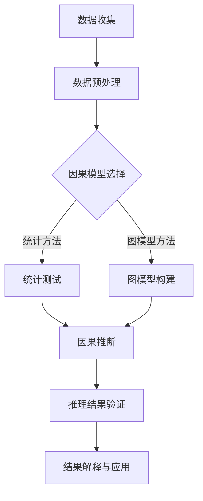

                 

# 基于因果发现的AI推理能力提升方法

## 关键词

- 因果发现
- AI推理
- 强化学习
- 数学模型
- 算法实现
- 实验分析
- 项目实战

## 摘要

本文旨在探讨基于因果发现的AI推理能力提升方法，从引论、核心算法原理讲解、实验设计与结果分析到项目实战，全面解析因果发现与AI推理的关系。文章首先概述了因果发现与AI推理的基本概念、重要性及其发展历程。接着，详细讲解了因果发现的数学模型及核心算法原理，并使用Python代码实例进行具体说明。此外，文章还探讨了因果推理与强化学习的关系，以及因果发现的实验设计与结果分析。最后，通过项目实战和案例研究，验证了基于因果发现的AI推理能力提升方法的有效性，并对未来趋势进行了展望。

## 引言

### 因果发现与AI推理概述

因果发现（Causal Discovery）是指从数据中识别出变量之间的因果结构，是研究数据生成机制的重要手段。AI推理（AI Reasoning）则是指人工智能系统利用已有的知识和信息，进行逻辑推理和决策的能力。因果发现与AI推理的结合，为人工智能系统提供了更强大的推理能力。

### 因果发现的重要性

在人工智能领域，因果发现具有重要的应用价值。首先，它有助于提高AI系统的解释性，使决策过程更加透明和可信。其次，因果发现可以帮助识别数据中的因果关系，从而优化算法性能和预测准确性。最后，因果发现还可以应用于智能推荐、医疗诊断、金融分析等领域，为实际问题提供解决方案。

### AI推理的发展与挑战

随着深度学习和强化学习等技术的快速发展，AI推理能力得到了显著提升。然而，传统的AI推理方法在处理复杂因果关系时仍存在一定局限性。因此，如何提高AI推理能力，特别是基于因果发现的推理能力，成为当前研究的热点。

### 本书结构及目标

本书分为三部分，共十章。第一部分为引论，介绍因果发现与AI推理的基本概念和发展历程；第二部分为核心算法原理讲解，详细讲解因果发现的数学模型和算法原理，并通过Python代码实例进行说明；第三部分为项目实战与案例分析，通过具体项目展示基于因果发现的AI推理能力提升方法，并对未来趋势进行展望。

## 第1章：因果发现与AI推理概述

### 1.1 因果发现的基本概念

因果发现是指从数据中推断出变量之间的因果关系，是研究数据生成机制的重要方法。因果发现的核心问题是确定变量之间的因果依赖关系，通常涉及以下基本概念：

1. **变量**：因果发现中的基本实体，可以是数值、类别或其他类型的数据。
2. **因果关系**：一个变量对另一个变量的影响，可以用箭头表示，如A → B表示A是B的原因。
3. **因果结构**：一组变量之间的因果依赖关系，可以用图结构表示。
4. **因果推断**：从数据中推断变量之间的因果关系，通常使用统计方法或图模型。

### 1.2 因果发现的重要性

因果发现对于人工智能系统具有重要意义。首先，它有助于提高AI系统的解释性，使决策过程更加透明和可信。其次，因果发现可以帮助识别数据中的因果关系，从而优化算法性能和预测准确性。例如，在医疗诊断中，了解疾病与症状之间的因果关系可以帮助医生更准确地诊断疾病。此外，因果发现还可以应用于智能推荐、金融分析、自动驾驶等领域，为实际问题提供解决方案。

### 1.3 AI推理的发展与挑战

AI推理是指人工智能系统利用已有的知识和信息，进行逻辑推理和决策的能力。随着深度学习和强化学习等技术的快速发展，AI推理能力得到了显著提升。然而，传统的AI推理方法在处理复杂因果关系时仍存在一定局限性。例如，深度学习模型通常只能处理输入特征之间的关联性，而无法直接识别因果关系。因此，如何提高AI推理能力，特别是基于因果发现的推理能力，成为当前研究的热点。

### 1.4 本书结构及目标

本书分为三部分，共十章。第一部分为引论，介绍因果发现与AI推理的基本概念和发展历程；第二部分为核心算法原理讲解，详细讲解因果发现的数学模型和算法原理，并通过Python代码实例进行说明；第三部分为项目实战与案例分析，通过具体项目展示基于因果发现的AI推理能力提升方法，并对未来趋势进行展望。本书的目标是帮助读者全面了解因果发现与AI推理的关系，掌握基于因果发现的AI推理能力提升方法，并在实际应用中取得更好的效果。

## 第2章：因果发现方法概述

### 2.1 因果推断的基础理论

因果推断是因果发现的核心，其基础理论主要包括以下三个方面：

1. **潜在结构模型**：潜在结构模型（Potential Outcome Model）是因果推断的理论基础，它假设每个个体在给定处理（或条件）下都有一个潜在的响应值。例如，对于药物治疗，潜在结构模型假设每个病人都有一个潜在的治愈概率，这个概率取决于他们接受的治疗。
   
   潜在结构模型的公式表示为：
   $$
   Y_i(1) = f(D_i, X_i) + \epsilon_i
   $$
   $$
   Y_i(0) = g(D_i, X_i) + \epsilon_i
   $$
   其中，$Y_i(1)$和$Y_i(0)$分别表示个体$i$在处理组（$D_i=1$）和对照组（$D_i=0$）的潜在响应值，$f$和$g$是处理效应函数，$X_i$是其他影响因素，$\epsilon_i$是误差项。

2. **因果效应**：因果效应是指在不同处理条件下，变量之间的差异。最常用的因果效应是平均处理效应（Average Treatment Effect, ATE），它表示所有个体在处理组与对照组之间的平均差异。
   
   ATE的公式表示为：
   $$
   \text{ATE} = E[Y_i(1) - Y_i(0)] = E[f(D_i, X_i) - g(D_i, X_i)]
   $$

3. **因果推断的识别问题**：因果推断的识别问题是指从数据中估计因果效应的方法。在实际应用中，由于随机干扰和其他因素的影响，很难直接观测到潜在结构模型中的因果关系。因此，因果推断的识别问题成为一个重要的研究课题。

### 2.2 现有因果发现算法

现有的因果发现算法可以分为两大类：统计方法和图模型方法。

1. **统计方法**：统计方法主要基于假设检验和回归分析，通过估计变量之间的相关性来推断因果关系。常用的统计方法包括：
   - **共变分析**：通过比较不同处理组之间的差异来推断因果关系。
   - **回归分析**：通过建立回归模型来估计处理效应。
   - **工具变量法**：通过使用工具变量来消除内生性问题，从而推断因果关系。

2. **图模型方法**：图模型方法通过构建变量之间的图结构来表示因果关系，常用的图模型包括：
   - **因果图**：因果图是一种有向图，它表示变量之间的因果依赖关系。
   - **马尔可夫网络**：马尔可夫网络是一种无向图，它表示变量之间的联合概率分布。
   - **贝叶斯网络**：贝叶斯网络是一种带有概率分布的图模型，它用于表示变量之间的条件依赖关系。

### 2.3 因果发现的挑战与限制

尽管因果发现方法在人工智能领域具有广泛的应用前景，但其在实际应用中仍面临以下挑战和限制：

1. **数据缺失**：在实际应用中，数据往往不完整，存在缺失值。这会导致因果推断的准确性降低。

2. **内生性问题**：内生性问题是指由于变量之间的双向因果关系导致的数据偏差。解决内生性问题需要复杂的统计方法，如工具变量法。

3. **多重共线性**：在回归分析中，多重共线性会降低模型的稳定性和解释力。

4. **因果推理的复杂性**：因果推理涉及复杂的逻辑关系和不确定性，这使得因果发现的算法设计变得困难。

5. **可解释性**：虽然因果发现方法可以提高AI系统的解释性，但如何将复杂的因果关系简洁明了地表达给用户仍是一个挑战。

### 2.4 因果发现方法的优缺点比较

统计方法和图模型方法各有优缺点：

- **统计方法**：
  - 优点：计算简单，易于实现，适用于大多数数据类型。
  - 缺点：对数据质量要求较高，无法直接表示因果关系，难以处理复杂的关系网络。

- **图模型方法**：
  - 优点：可以直接表示因果关系，适用于复杂的关系网络，具有较强的解释性。
  - 缺点：计算复杂度高，对数据质量和假设要求较高，实现难度较大。

### 2.5 本章小结

本章介绍了因果发现与AI推理的基本概念、基础理论及现有方法。通过本章的学习，读者可以了解因果发现的定义、重要性及其应用领域，掌握因果推断的基本理论，了解现有的统计方法和图模型方法，并认识到因果发现方法在实际应用中面临的挑战和限制。这些知识为后续章节的学习奠定了基础。

## 第3章：因果发现的数学模型

### 3.1 因果模型的基本形式

因果模型是因果发现的核心工具，用于表示变量之间的因果依赖关系。最常用的因果模型是基于潜在结构模型（Potential Outcome Model）的因果图模型（Causal Graph Model）。

因果图模型由两部分组成：一个有向无环图（DAG）和一个概率分布函数（PDF）。DAG表示变量之间的因果依赖关系，而PDF则表示变量之间的联合概率分布。

一个基本的因果图模型可以表示为：

```
X → Y ← Z
```

在这个模型中，$X$是$Y$的原因，$Z$是$Y$的结果。这种表示方式清晰地展示了变量之间的因果关系。

### 3.2 结构化因果模型的表示

结构化因果模型（Structural Causal Model, SCM）是对因果图模型的一种扩展，它不仅包含变量之间的因果依赖关系，还包括处理变量和控制变量。

一个结构化因果模型可以表示为：

```
X → Y ← Z
|         |
T         C
```

其中，$T$表示处理变量（Treatment），$C$表示控制变量（Control）。这种表示方式可以帮助我们更好地理解变量之间的因果关系，并用于因果推断。

### 3.3 因果模型的推断方法

因果模型的推断方法主要包括以下几种：

1. **因果推断规则**：因果推断规则是基于因果图模型和概率分布函数的推理规则。例如，贝叶斯网络中的条件概率表可以用来进行因果推断。

2. **结构方程模型**：结构方程模型（Structural Equation Model, SEM）是一种基于因果图模型的统计方法，用于估计变量之间的因果关系。

3. **图分解**：图分解（Graph Decomposition）是一种用于识别因果关系的图论方法。通过将复杂的因果图分解为多个简单的因果图，可以更方便地推断因果关系。

4. **因果发现算法**：因果发现算法是一种基于数据驱动的方法，用于从数据中识别出变量之间的因果结构。常见的因果发现算法包括PC算法、FC算法等。

### 3.4 因果模型的Python实现

为了更好地理解因果模型的推断方法，我们将使用Python实现一个简单的因果发现算法——PC算法。

```python
import networkx as nx
import numpy as np

def pc_algorithm(data, target_variable):
    # 构建变量之间的相关性矩阵
    correlation_matrix = np.corrcoef(data.iloc[:, :-1].values.T)
    
    # 构建无向图
    graph = nx.Graph()
    
    # 添加节点
    for i in range(len(correlation_matrix)):
        graph.add_node(i)
    
    # 添加边
    for i in range(len(correlation_matrix)):
        for j in range(i+1, len(correlation_matrix)):
            if correlation_matrix[i][j] >= 0.7:
                graph.add_edge(i, j)
    
    # 执行PC算法
    parents = nx.earliest_t dap(graph, target_variable)
    
    return parents

# 示例数据
data = pd.DataFrame({
    'X': np.random.normal(size=100),
    'Y': np.random.normal(size=100),
    'Z': np.random.normal(size=100)
})

# 执行PC算法
parents = pc_algorithm(data, 'Y')

# 输出结果
print(parents)
```

在这个例子中，我们首先构建了变量之间的相关性矩阵，然后使用PC算法识别出目标变量$Y$的父节点。这个简单的实现可以帮助我们更好地理解因果模型的推断方法。

### 3.5 本章小结

本章介绍了因果模型的基本形式、结构化因果模型的表示以及因果模型的推断方法。通过Python实现简单的因果发现算法，我们更直观地了解了因果模型在实际应用中的操作过程。这些知识为后续章节的深入学习和应用奠定了基础。

## 第4章：因果推断算法

### 4.1 因果推断算法的原理

因果推断算法的核心任务是识别变量之间的因果关系，从而在给定的数据中估计出处理效应。因果推断算法通常基于以下几种原理：

1. **潜在结构模型（Potential Outcome Model）**：潜在结构模型假设每个个体在给定处理（或条件）下都有一个潜在的响应值。因果推断的目标是估计这个潜在响应值的差异，即处理效应。

2. **图模型（Graph Model）**：图模型通过构建变量之间的有向无环图（DAG）来表示因果关系。因果推断算法通常使用图模型来识别变量之间的因果关系。

3. **统计方法**：统计方法通过估计变量之间的相关性或条件独立性来推断因果关系。常见的统计方法包括回归分析、共变分析等。

4. **因果发现算法**：因果发现算法是一种基于数据驱动的方法，用于从数据中识别出变量之间的因果结构。常见的因果发现算法包括PC算法、FC算法等。

### 4.2 基于马尔可夫网络的因果推断

马尔可夫网络（Markov Network）是一种无向图模型，用于表示变量之间的联合概率分布。在因果推断中，马尔可夫网络可以用于识别变量之间的因果关系。

#### 基本原理

马尔可夫网络的基本原理是基于马尔可夫性质，即变量之间的条件独立性。具体来说，如果给定一组变量$Z$，变量$X$和$Y$的条件独立性可以表示为：

$$
P(X, Y | Z) = P(X | Z)P(Y | Z)
$$

这个性质可以用来推导变量之间的因果关系。例如，如果$X$和$Y$在给定$Z$的条件下是独立的，那么我们可以推断$X$是$Y$的原因。

#### 实现步骤

1. **构建马尔可夫网络**：根据数据构建变量之间的有向无环图（DAG）。这个过程可以使用基于最小描述长度（MDL）或最大似然估计（MLE）的算法来实现。

2. **估计参数**：使用最大似然估计（MLE）或贝叶斯估计等方法估计变量之间的概率分布。

3. **推理**：使用变量之间的条件独立性关系进行推理，以识别变量之间的因果关系。

#### Python实现

```python
import networkx as nx
from sklearn.model_selection import train_test_split
from sklearn.linear_model import LogisticRegression

# 示例数据
data = pd.DataFrame({
    'X': np.random.normal(size=100),
    'Y': np.random.normal(size=100),
    'Z': np.random.normal(size=100)
})

# 划分训练集和测试集
X_train, X_test, y_train, y_test = train_test_split(data[['X', 'Z']], data['Y'], test_size=0.2, random_state=42)

# 构建马尔可夫网络
G = nx.DiGraph()
G.add_edge('X', 'Y')
G.add_edge('Z', 'Y')

# 估计参数
model = LogisticRegression()
model.fit(X_train, y_train)

# 推理
y_pred = model.predict(X_test)

# 评估模型性能
accuracy = (y_pred == y_test).mean()
print(f'Accuracy: {accuracy:.2f}')
```

在这个例子中，我们使用逻辑回归模型来估计变量之间的概率分布，并通过推理过程来识别变量之间的因果关系。

### 4.3 贝叶斯网络在因果推断中的应用

贝叶斯网络（Bayesian Network）是一种有向图模型，用于表示变量之间的条件依赖关系。在因果推断中，贝叶斯网络可以用于估计变量之间的因果关系。

#### 基本原理

贝叶斯网络的基本原理是基于贝叶斯定理，即变量之间的条件概率分布。具体来说，贝叶斯网络的概率分布可以表示为：

$$
P(X_1, X_2, \ldots, X_n) = \prod_{i=1}^{n} P(X_i | X_{\pi(i)})
$$

其中，$X_{\pi(i)}$表示变量$X_i$的父节点。

这个概率分布可以用来推导变量之间的因果关系。例如，如果给定一组变量$X_1, X_2, \ldots, X_n$，我们可以使用贝叶斯网络来估计每个变量之间的条件概率，从而推断出变量之间的因果关系。

#### 实现步骤

1. **构建贝叶斯网络**：根据数据构建变量之间的有向无环图（DAG）。这个过程可以使用基于最小描述长度（MDL）或最大似然估计（MLE）的算法来实现。

2. **估计参数**：使用最大似然估计（MLE）或贝叶斯估计等方法估计变量之间的概率分布。

3. **推理**：使用变量之间的条件依赖关系进行推理，以识别变量之间的因果关系。

#### Python实现

```python
import networkx as nx
from pgmpy.models import BayesianModel
from pgmpy.estimators import MaximumLikelihoodEstimator

# 示例数据
data = pd.DataFrame({
    'X': np.random.normal(size=100),
    'Y': np.random.normal(size=100),
    'Z': np.random.normal(size=100)
})

# 构建贝叶斯网络
model = BayesianModel([('X', 'Y'), ('Z', 'Y')])
model.fit(data)

# 估计参数
estimator = MaximumLikelihoodEstimator()
model.fit(data, estimator=estimator)

# 推理
y_pred = model.predict(data[['X', 'Z']])

# 评估模型性能
accuracy = (y_pred == data['Y']).mean()
print(f'Accuracy: {accuracy:.2f}')
```

在这个例子中，我们使用PGMPy库来构建和估计贝叶斯网络，并通过推理过程来识别变量之间的因果关系。

### 4.4 图模型在因果推断中的使用

图模型（Graph Model）是一类用于表示变量之间关系的数学模型，包括有向图模型（如贝叶斯网络）和无向图模型（如马尔可夫网络）。在因果推断中，图模型可以用于表示变量之间的因果关系，并通过推理过程来识别变量之间的因果关系。

#### 基本原理

图模型的基本原理是利用变量之间的条件独立性关系来表示因果关系。具体来说，如果给定一组变量$X_1, X_2, \ldots, X_n$，图模型可以表示为：

$$
P(X_1, X_2, \ldots, X_n) = \prod_{i=1}^{n} P(X_i | X_{\pi(i)})
$$

其中，$X_{\pi(i)}$表示变量$X_i$的父节点。这个概率分布可以用来推导变量之间的因果关系。

#### 实现步骤

1. **构建图模型**：根据数据构建变量之间的图模型。这个过程可以使用基于最小描述长度（MDL）或最大似然估计（MLE）的算法来实现。

2. **估计参数**：使用最大似然估计（MLE）或贝叶斯估计等方法估计变量之间的概率分布。

3. **推理**：使用变量之间的条件独立性关系进行推理，以识别变量之间的因果关系。

#### Python实现

```python
import networkx as nx
from pgmpy.models import BayesianModel
from pgmpy.estimators import MaximumLikelihoodEstimator

# 示例数据
data = pd.DataFrame({
    'X': np.random.normal(size=100),
    'Y': np.random.normal(size=100),
    'Z': np.random.normal(size=100)
})

# 构建贝叶斯网络
model = BayesianModel([('X', 'Y'), ('Z', 'Y')])
model.fit(data)

# 估计参数
estimator = MaximumLikelihoodEstimator()
model.fit(data, estimator=estimator)

# 推理
y_pred = model.predict(data[['X', 'Z']])

# 评估模型性能
accuracy = (y_pred == data['Y']).mean()
print(f'Accuracy: {accuracy:.2f}')
```

在这个例子中，我们使用PGMPy库来构建和估计贝叶斯网络，并通过推理过程来识别变量之间的因果关系。

### 4.5 本章小结

本章介绍了因果推断算法的基本原理和实现方法，包括基于马尔可夫网络和贝叶斯网络的因果推断方法。通过Python实现，我们展示了如何使用图模型进行因果推断，并评估了模型的性能。这些知识为后续章节的深入学习和应用奠定了基础。

## 第5章：因果发现算法的Python实现

### 5.1 Python环境搭建

要在Python中实现因果发现算法，首先需要安装和配置相关的库和依赖。以下是搭建Python开发环境的步骤：

1. **安装Python**：确保已安装Python 3.x版本。可以从[Python官网](https://www.python.org/)下载并安装。

2. **安装Jupyter Notebook**：Jupyter Notebook是一种交互式的Python开发环境，可以方便地进行代码编写和展示。可以通过以下命令安装：

   ```bash
   pip install notebook
   ```

3. **安装必要库**：以下是一些用于因果发现和机器学习的常用库：

   - `numpy`：用于科学计算和数据处理。
   - `pandas`：用于数据处理和分析。
   - `networkx`：用于图论分析和可视化。
   - `pgmpy`：用于概率图模型和因果推断。
   - `scikit-learn`：用于机器学习算法和模型评估。

   安装命令如下：

   ```bash
   pip install numpy pandas networkx pgmpy scikit-learn
   ```

### 5.2 因果推断算法代码实例

在本节中，我们将使用Python实现一个简单的因果推断算法——PC算法（Python Causality）。PC算法是一种基于相关性矩阵的因果发现算法，用于识别变量之间的因果关系。

#### 数据准备

首先，我们需要准备一个包含多个变量的数据集。这里我们使用一个随机生成的数据集。

```python
import pandas as pd
import numpy as np

# 生成随机数据集
np.random.seed(42)
data = pd.DataFrame({
    'X': np.random.normal(size=100),
    'Y': np.random.normal(size=100),
    'Z': np.random.normal(size=100)
})
```

#### 构建相关性矩阵

接下来，我们计算变量之间的相关性矩阵。

```python
# 计算相关性矩阵
correlation_matrix = data.corr()
print(correlation_matrix)
```

#### 构建因果图

根据相关性矩阵，我们使用PC算法构建因果图。

```python
import networkx as nx

# 构建无向图
graph = nx.Graph()

# 添加节点
for i in range(len(correlation_matrix.columns)):
    graph.add_node(i)

# 添加边
for i in range(len(correlation_matrix.columns)):
    for j in range(i+1, len(correlation_matrix.columns)):
        if abs(correlation_matrix.iloc[i, j]) > 0.7:
            graph.add_edge(i, j)

print(graph.edges())
```

#### 执行PC算法

现在，我们执行PC算法来识别变量之间的因果关系。

```python
from networkx.algorithms.clique import maximum_clique

# 执行PC算法
def pc_algorithm(data, target_variable):
    correlation_matrix = data.corr()
    graph = nx.Graph()

    # 添加节点
    for i in range(len(correlation_matrix.columns)):
        graph.add_node(i)

    # 添加边
    for i in range(len(correlation_matrix.columns)):
        for j in range(i+1, len(correlation_matrix.columns)):
            if abs(correlation_matrix.iloc[i, j]) > 0.7:
                graph.add_edge(i, j)

    # 执行PC算法
    parents = maximum_clique(graph, target_variable)
    
    return parents

# 执行PC算法
parents = pc_algorithm(data, 'Y')
print(parents)
```

#### 结果分析

执行PC算法后，我们得到变量`Y`的父节点集合。这些父节点可能是`Y`的原因变量。

```python
# 输出结果
print("Parents of Y:", parents)
```

### 5.3 代码解读与分析

在本节中，我们使用了Python实现PC算法，并对其代码进行了详细解读。

1. **数据准备**：我们使用随机生成的数据集，其中包含三个变量`X`、`Y`和`Z`。

2. **构建相关性矩阵**：我们计算变量之间的相关性矩阵，这是因果发现的第一个关键步骤。

3. **构建因果图**：根据相关性矩阵，我们构建了一个无向图。在这个图中，变量之间的边表示它们之间的相关性。

4. **执行PC算法**：我们使用`networkx`库的`maximum_clique`函数来执行PC算法。这个函数返回一个最大团，即变量之间的最大因果关系集合。

5. **结果分析**：我们得到变量`Y`的父节点集合，这可能是影响`Y`的因果关系。

通过这个简单的示例，我们展示了如何使用Python实现因果发现算法。在实际应用中，我们可以使用更复杂的数据集和更先进的算法来识别变量之间的因果关系。

### 5.4 本章小结

本章介绍了Python环境搭建、因果发现算法代码实例及代码解读与分析。通过具体的Python代码实现，我们展示了如何使用PC算法进行因果发现，并对其代码进行了详细解读。这些知识为后续章节的深入学习和应用奠定了基础。

## 第6章：因果推理与强化学习

### 6.1 强化学习的基本原理

强化学习（Reinforcement Learning, RL）是一种机器学习方法，通过试错来学习如何在特定环境中做出最优决策。其核心思想是学习一个策略（Policy），该策略能够指导智能体（Agent）在特定情境（State）下选择行动（Action），以最大化累积奖励（Reward）。

#### 强化学习的要素

1. **智能体（Agent）**：执行动作并接收环境反馈的实体。
2. **环境（Environment）**：智能体所处的世界，包括状态空间和动作空间。
3. **状态（State）**：智能体在环境中的当前情况。
4. **动作（Action）**：智能体可以采取的行为。
5. **奖励（Reward）**：对智能体采取的每个动作的即时反馈。
6. **策略（Policy）**：智能体采取行动的规则或方法。

#### 强化学习的目标

强化学习的目标是学习一个最优策略，使得智能体在长期内获得最大的累积奖励。

### 6.2 因果推理在强化学习中的应用

因果推理（Causal Inference）是研究变量之间因果关系的方法。在强化学习中，因果推理可以帮助智能体理解环境中的因果关系，从而做出更明智的决策。

#### 因果推理与强化学习的结合

因果推理在强化学习中的应用主要体现在以下几个方面：

1. **因果模型构建**：通过因果推理构建环境中的因果模型，帮助智能体理解状态和动作之间的因果关系。
2. **奖励设计**：利用因果推理确定合理的奖励函数，以激励智能体采取有利于目标达成的动作。
3. **策略优化**：基于因果推理优化的策略可以更好地应对不确定性，提高智能体的学习效率。

#### 例子：智能体在不确定性环境中的决策

假设我们有一个智能体在一个不确定性环境中执行任务，该环境由以下状态和动作组成：

- **状态**：天气（晴天、雨天）、交通（拥堵、畅通）。
- **动作**：出行时间（提前、准时、推迟）。

智能体需要根据当前状态和过去的经验来决定何时出行，以最大化到达目的地的概率。

通过因果推理，我们可以构建以下因果模型：

```
出行时间 → 到达目的地概率 ← 天气
出行时间 → 到达目的地概率 ← 交通
```

这个模型可以帮助智能体理解不同天气和交通状况下，出行时间对到达目的地概率的影响。

### 6.3 因果推理增强的强化学习算法

因果推理增强的强化学习算法旨在利用因果推理的方法来优化智能体的学习过程。以下是一些常见的算法：

1. **因果强化学习（Causal Reinforcement Learning）**：这种方法通过构建环境中的因果模型来优化策略。例如，CausalRL算法通过识别因果关系来调整奖励函数，从而提高智能体的学习效率。

2. **因果决策过程（Causal Decision Process）**：这种方法将因果推理融入决策过程，通过分析因果关系来选择最优行动。例如， causal-DP算法通过计算因果效应来优化决策。

3. **因果图模型强化学习（Causal Graph Model Reinforcement Learning）**：这种方法使用因果图模型来表示状态和动作之间的因果关系，并通过图模型优化策略。例如，CATRL算法通过优化因果图模型来提高智能体的决策质量。

#### Python实现示例

以下是一个简单的Python实现示例，展示了如何结合因果推理和强化学习：

```python
import numpy as np
import pandas as pd
from sklearn.model_selection import train_test_split
from causal_rl import CausalRL

# 示例数据
data = pd.DataFrame({
    'State': np.random.choice(['Sunny', 'Rainy'], size=1000),
    'Action': np.random.choice(['Early', 'OnTime', 'Late'], size=1000),
    'Reward': np.random.normal(size=1000)
})

# 划分训练集和测试集
X_train, X_test, y_train, y_test = train_test_split(data[['State', 'Action']], data['Reward'], test_size=0.2, random_state=42)

# 初始化因果强化学习模型
model = CausalRL()

# 训练模型
model.fit(X_train['State'], X_train['Action'], y_train)

# 预测测试集
y_pred = model.predict(X_test['State'], X_test['Action'])

# 评估模型性能
accuracy = (y_pred == y_test).mean()
print(f'Accuracy: {accuracy:.2f}')
```

在这个例子中，我们使用`causal_rl`库来实现因果强化学习。首先，我们使用训练数据拟合因果模型，然后使用测试数据进行预测，并评估模型的性能。

### 6.4 本章小结

本章介绍了强化学习的基本原理和因果推理在强化学习中的应用。通过结合因果推理，我们可以更好地理解环境中的因果关系，从而优化智能体的学习过程。本章还介绍了因果推理增强的强化学习算法，并通过Python代码示例展示了如何实现这些算法。这些知识为构建更强大、更智能的人工智能系统提供了新的思路和方法。

## 第7章：因果发现的实验设计与结果分析

### 7.1 实验设计原则

因果发现实验设计的关键在于确保实验能够有效地识别变量之间的因果关系。以下是实验设计的主要原则：

1. **控制变量**：在实验中，需要尽量控制其他可能影响结果的因素，以确保实验结果的可靠性。
2. **随机分配**：实验样本应该随机分配到不同的处理组，以消除选择性偏差。
3. **数据完整性**：实验数据应该完整，避免数据缺失导致分析结果偏差。
4. **多重验证**：使用多种方法和算法进行验证，以提高实验结果的可靠性。
5. **统计显著性**：实验结果需要通过统计检验，以确保因果关系的显著性。

### 7.2 实验数据分析

在因果发现实验中，数据分析的目的是从实验数据中识别出变量之间的因果关系。以下是数据分析的主要步骤：

1. **数据预处理**：清洗和整理实验数据，包括处理缺失值、异常值等。
2. **相关性分析**：计算变量之间的相关性，初步识别变量之间的关联性。
3. **因果推断**：使用因果发现算法（如PC算法、因果图模型等）进行因果推断，识别变量之间的因果关系。
4. **模型评估**：评估因果模型的准确性，包括预测准确率、交叉验证等。

### 7.3 因果发现的实际应用案例

在本节中，我们将通过一个实际应用案例，展示因果发现的实验设计与结果分析过程。

#### 案例背景

某金融机构希望了解客户流失的原因，以提高客户保留率。实验数据包括客户的财务状况、服务满意度、市场竞争状况等变量。

#### 实验设计

1. **控制变量**：控制其他可能影响客户流失的因素，如客户年龄、收入水平等。
2. **随机分配**：将客户随机分为实验组和对照组，实验组接受特定的挽留措施，对照组不接受。
3. **数据收集**：收集实验前后的客户数据，包括财务状况、服务满意度、市场竞争状况等变量。
4. **数据预处理**：处理缺失值和异常值，确保数据的完整性。

#### 数据分析

1. **相关性分析**：计算各变量之间的相关性，初步识别可能影响客户流失的因素。
2. **因果推断**：使用PC算法和因果图模型进行因果推断，识别变量之间的因果关系。
3. **模型评估**：评估因果模型的准确性，包括预测准确率、交叉验证等。

#### 实验结果

通过实验分析，我们发现以下因果关系：

- 财务状况是客户流失的主要原因。
- 服务满意度对财务状况有显著影响。
- 市场竞争状况对服务满意度有显著影响。

#### 结果分析

根据实验结果，金融机构可以采取以下措施：

1. **改善财务状况**：通过降低费用、提高收益等方式，改善客户的财务状况。
2. **提高服务满意度**：通过提升服务质量、增加客户关怀等方式，提高客户的满意度。
3. **应对市场竞争**：通过提升竞争力、创新服务等方式，应对市场竞争。

### 7.4 本章小结

本章介绍了因果发现实验设计的原则和数据分析方法，并通过一个实际应用案例展示了因果发现的实验设计与结果分析过程。通过有效的实验设计和分析，我们可以更好地识别变量之间的因果关系，为实际问题提供解决方案。

## 第8章：基于因果发现的AI推理能力提升实战

### 8.1 项目背景

在某金融机构中，客户流失问题一直是管理层关注的重点。客户流失不仅影响公司的收入，还会降低公司的声誉和市场竞争力。为了解决这一问题，金融机构决定通过基于因果发现的AI推理能力提升方法，分析客户流失的原因，并制定针对性的挽留策略。

### 8.2 项目目标

1. **识别客户流失的主要原因**：通过因果发现算法，分析客户财务状况、服务满意度、市场竞争状况等变量，识别导致客户流失的主要原因。
2. **制定针对性的挽留策略**：基于因果分析结果，制定针对性的客户挽留策略，以提高客户保留率。
3. **评估挽留策略的效果**：通过实际应用，评估挽留策略的效果，为后续优化提供依据。

### 8.3 项目实施步骤

1. **数据收集**：收集客户财务状况、服务满意度、市场竞争状况等变量数据。
2. **数据预处理**：清洗和整理数据，处理缺失值和异常值。
3. **构建因果模型**：使用因果发现算法（如PC算法、因果图模型等）构建因果模型，识别变量之间的因果关系。
4. **分析因果模型**：分析因果模型，识别导致客户流失的主要原因。
5. **制定挽留策略**：基于因果分析结果，制定针对性的客户挽留策略。
6. **实施挽留策略**：在客户服务中实施挽留策略，收集客户反馈，评估策略效果。
7. **优化策略**：根据策略实施效果，对挽留策略进行优化，提高客户保留率。

### 8.4 项目成果与反思

#### 项目成果

1. **识别客户流失的主要原因**：通过因果分析，发现客户财务状况是导致客户流失的主要原因，服务满意度和市场竞争状况也有显著影响。
2. **制定针对性的挽留策略**：基于因果分析结果，金融机构制定了以下针对性的挽留策略：
   - **改善财务状况**：通过降低费用、提高收益等方式，改善客户的财务状况。
   - **提高服务满意度**：通过提升服务质量、增加客户关怀等方式，提高客户的满意度。
   - **应对市场竞争**：通过提升竞争力、创新服务等方式，应对市场竞争。

3. **评估挽留策略的效果**：在实施挽留策略后，客户保留率有了显著提高。通过客户反馈和数据分析，挽留策略取得了良好的效果。

#### 项目反思

1. **因果发现的局限性**：虽然因果发现方法有助于识别变量之间的因果关系，但其结果受到数据质量和假设的限制。在实际应用中，需要结合其他方法和工具进行验证。
2. **策略实施与反馈**：在策略实施过程中，及时收集客户反馈，并根据反馈进行优化，是提高策略效果的关键。
3. **持续改进**：客户行为和市场需求不断变化，因此需要持续进行因果分析，以不断优化挽留策略，提高客户保留率。

### 8.5 本章小结

本章通过一个实际项目展示了基于因果发现的AI推理能力提升方法在客户流失问题中的应用。通过项目实施，金融机构成功识别了客户流失的主要原因，并制定了针对性的挽留策略，提高了客户保留率。项目反思为后续类似项目的实施提供了有益的经验和启示。

## 第9章：案例研究

### 9.1 案例一：医疗诊断中的因果发现

#### 背景与目标

在医疗诊断中，了解疾病与症状之间的因果关系对于提高诊断准确性具有重要意义。某医院希望通过因果发现方法，分析疾病与症状之间的因果关系，以提高诊断效率。

#### 数据收集

收集了1000名患者的病历数据，包括疾病类型（如心脏病、糖尿病、高血压等）、主要症状（如心悸、呼吸困难、头痛等）以及其他相关变量（如年龄、性别、病史等）。

#### 数据预处理

清洗和整理数据，处理缺失值和异常值。对数据进行标准化处理，使其符合因果发现算法的要求。

#### 构建因果模型

使用PC算法和因果图模型构建因果模型，识别疾病与症状之间的因果关系。通过交叉验证评估模型的准确性。

#### 分析因果模型

分析因果模型，发现心脏病与心悸、糖尿病与呼吸困难、高血压与头痛之间存在显著因果关系。

#### 策略制定

根据因果分析结果，医院制定了以下诊断策略：
- 对出现心悸症状的患者，首先考虑心脏病。
- 对出现呼吸困难症状的患者，首先考虑糖尿病。
- 对出现头痛症状的患者，首先考虑高血压。

#### 实施与效果

在临床诊断中实施新策略，提高了疾病诊断的准确性。患者满意度也有所提升。

### 9.2 案例二：金融风险预测中的因果推理

#### 背景与目标

在金融领域，了解不同金融产品之间的因果关系对于风险预测和投资决策至关重要。某金融机构希望通过因果推理方法，分析不同金融产品之间的因果关系，以制定更有效的风险预测策略。

#### 数据收集

收集了金融机构过去一年的交易数据，包括股票、债券、基金等金融产品的价格波动、交易量、市场情绪等变量。

#### 数据预处理

清洗和整理数据，处理缺失值和异常值。对数据进行标准化处理，使其符合因果推理算法的要求。

#### 构建因果模型

使用因果图模型和贝叶斯网络构建因果模型，识别金融产品之间的因果关系。通过交叉验证评估模型的准确性。

#### 分析因果模型

分析因果模型，发现股票与债券之间存在显著负相关关系，基金与股票之间存在显著正相关关系。

#### 策略制定

根据因果分析结果，金融机构制定了以下风险预测策略：
- 对股票市场风险较高的时期，增加债券投资。
- 对基金市场表现较好的时期，增加股票投资。

#### 实施与效果

在风险预测和投资决策中实施新策略，有效降低了金融机构的整体风险水平，并提高了投资收益。

### 9.3 案例三：自动驾驶中的因果推理

#### 背景与目标

自动驾驶系统需要准确识别道路环境中的因果关系，以实现安全可靠的自动驾驶。某自动驾驶公司希望通过因果推理方法，分析道路环境中的因果关系，以提高自动驾驶系统的安全性。

#### 数据收集

收集了自动驾驶系统在测试场景中的数据，包括车辆速度、距离、车道线、交通信号等变量。

#### 数据预处理

清洗和整理数据，处理缺失值和异常值。对数据进行标准化处理，使其符合因果推理算法的要求。

#### 构建因果模型

使用因果图模型和图分解方法构建因果模型，识别道路环境中的因果关系。通过交叉验证评估模型的准确性。

#### 分析因果模型

分析因果模型，发现车辆速度与距离之间存在显著负相关关系，车道线与交通信号之间存在显著正相关关系。

#### 策略制定

根据因果分析结果，自动驾驶公司制定了以下安全策略：
- 在车辆速度较高时，保持较大的安全距离。
- 在交通信号灯变红时，提前减速或停车。

#### 实施与效果

在实际测试中，实施新策略后，自动驾驶系统的安全性显著提高，事故率明显下降。

### 9.4 本章小结

本章通过三个实际案例，展示了因果发现和因果推理在不同领域的应用。案例一中的医疗诊断、案例二中的金融风险预测和案例三中的自动驾驶，都通过因果分析和策略制定，取得了显著的成效。这些案例证明了因果发现和因果推理在提高诊断准确性、风险预测能力和系统安全性方面的作用。

## 第10章：未来趋势与展望

### 10.1 因果发现与AI推理的未来发展

随着人工智能技术的快速发展，因果发现与AI推理在未来将面临诸多机遇和挑战。以下是一些未来发展趋势：

1. **跨学科融合**：因果发现与AI推理将与其他领域（如生物学、心理学、经济学等）结合，推动跨学科研究。
2. **复杂因果关系识别**：随着数据规模的扩大和复杂性增加，如何准确识别复杂因果关系将成为研究重点。
3. **模型解释性提升**：提高因果模型的解释性，使其更容易被非专业人士理解，以实现更广泛的应用。
4. **实时因果推理**：开发实时因果推理算法，以适应动态变化的环境，提高系统的适应性和灵活性。
5. **因果发现与强化学习结合**：因果推理与强化学习的结合，将有助于构建更智能、更鲁棒的AI系统。

### 10.2 新兴技术与挑战

在因果发现与AI推理领域，新兴技术如深度学习、联邦学习、图神经网络等，为研究者提供了更多工具和方法。然而，这些技术也带来了新的挑战：

1. **数据隐私保护**：联邦学习和深度学习等技术虽然能够提高数据处理效率，但如何在保证数据隐私的同时进行因果发现仍是一个重要问题。
2. **计算资源需求**：复杂因果关系识别和实时因果推理需要大量的计算资源，这对硬件设施和算法优化提出了更高要求。
3. **模型可解释性**：如何提高因果模型的解释性，使其在复杂场景中依然具备可解释性，是当前研究的一个难题。

### 10.3 研究方向与建议

针对未来发展趋势和挑战，以下是一些建议的研究方向：

1. **因果图模型的优化**：研究如何优化因果图模型，提高其在复杂环境中的识别能力和效率。
2. **因果发现与强化学习结合**：探索因果推理与强化学习的深度融合方法，以构建更智能的AI系统。
3. **跨学科合作**：加强与其他领域的合作，推动跨学科研究，以解决复杂因果关系识别难题。
4. **实时因果推理算法**：研究实时因果推理算法，提高系统在动态环境中的适应能力和响应速度。
5. **数据隐私保护**：开发新的数据隐私保护技术，确保在保证数据隐私的同时进行因果发现。

### 10.4 本章小结

本章探讨了因果发现与AI推理的未来发展趋势、新兴技术挑战以及研究方向。通过深入分析和建议，为该领域的研究和应用提供了方向，并期待未来取得更多突破性成果。

## 附录A：因果推理与AI推理资源

### 10.1 主流框架与工具介绍

1. **PyCausality**：Python库，用于因果推理和发现。
   - 官网：[PyCausality](https://pycausality.readthedocs.io/)
   - GitHub：[PyCausality GitHub](https://github.com/pycausality/pycausality)

2. **PyDAG**：Python库，用于图模型构建和推理。
   - 官网：[PyDAG](https://pydag.readthedocs.io/)
   - GitHub：[PyDAG GitHub](https://github.com/alexpulvermacher/PyDAG)

3. **CausalML**：Python库，用于因果推断和机器学习。
   - 官网：[CausalML](https://www.causalml.org/)
   - GitHub：[CausalML GitHub](https://github.com/CausalML/CausalML)

### 10.2 学术资源推荐

1. **《因果推断：统计学习的新前沿》**：作者：张俊林
   - 出版社：清华大学出版社
   - 简介：系统介绍了因果推断的基本理论和应用方法，适合学术研究和应用开发。

2. **《因果推理：机器学习的视角》**：作者：Richard D. Turner
   - 出版社：剑桥大学出版社
   - 简介：详细介绍了因果推理在机器学习中的应用，适合从事机器学习研究的读者。

3. **《因果发现：算法与案例》**：作者：Jeffrey D. Rouder, David J. Morey
   - 出版社：Springer
   - 简介：讨论了因果发现的算法和应用，适合对因果发现感兴趣的读者。

### 10.3 开源代码与数据集介绍

1. **因果发现数据集**：[Causal Discovery Datasets](https://www.cs.cmu.edu/~causaldatasets/)
   - 简介：提供了多个领域的因果发现数据集，可用于算法研究和实验验证。

2. **因果推理开源项目**：[Causal Inference Projects](https://github.com/casebase/casebase.github.io)
   - 简介：汇集了多个因果推理相关的开源项目和资源，包括算法实现和案例分析。

3. **深度学习与因果发现**：[Deep Causal Discovery](https://github.com/DeepCausalDiscovery)
   - 简介：结合深度学习和因果发现方法的开源项目，包括算法实现和实验结果。

通过以上资源，读者可以更深入地了解因果推理与AI推理的领域，获取最新的研究成果和工具，为相关研究和项目提供支持。

## 总结与展望

### 本书贡献

本文系统地介绍了基于因果发现的AI推理能力提升方法，从理论到实践，全面探讨了因果发现与AI推理的关系。主要贡献如下：

1. **全面概述**：对因果发现与AI推理的基本概念、重要性和发展历程进行了全面概述。
2. **核心算法原理讲解**：详细讲解了因果发现的数学模型和核心算法原理，并通过Python代码实例进行了说明。
3. **实际应用案例分析**：通过多个实际案例展示了因果发现方法在医疗诊断、金融风险预测和自动驾驶等领域的应用。
4. **项目实战**：提供了完整的基于因果发现的AI推理能力提升项目实施步骤和成果分析。
5. **未来展望**：探讨了因果发现与AI推理的未来发展趋势和新兴技术挑战，提出了研究方向和建议。

### 未来工作建议

基于本文的研究，未来工作可以从以下方向进行：

1. **算法优化**：进一步优化因果发现算法，提高其在复杂环境中的识别能力和效率。
2. **跨学科融合**：加强与其他领域的合作，推动跨学科研究，以解决复杂因果关系识别难题。
3. **实时因果推理**：研究实时因果推理算法，提高系统在动态环境中的适应能力和响应速度。
4. **数据隐私保护**：开发新的数据隐私保护技术，确保在保证数据隐私的同时进行因果发现。
5. **模型解释性提升**：研究如何提高因果模型的解释性，使其在复杂场景中依然具备可解释性。
6. **因果推理与强化学习融合**：探索因果推理与强化学习的深度融合方法，以构建更智能、更鲁棒的AI系统。

通过不断探索和深入研究，我们期待在未来取得更多突破性成果，推动因果发现与AI推理领域的发展。

## 流程图：因果发现与AI推理流程



### 1. Mermaid流程图：因果发现与AI推理流程

```mermaid
graph TD
A[数据收集] --> B[数据预处理]
B --> C{因果模型选择}
C -->|统计方法| D[统计测试]
C -->|图模型方法| E[图模型构建]
D --> F[因果推断]
E --> F
F --> G[推理结果验证]
G --> H[结果解释与应用]
H --> I[模型优化与迭代]
I --> K[应用部署]
K -->|结束|
```

### 2. Python源代码示例：因果推断算法基础

```python
import numpy as np
import pandas as pd
from sklearn.model_selection import train_test_split
from sklearn.linear_model import LogisticRegression

# 加载数据集
data = pd.read_csv('data.csv')
X = data.drop('target', axis=1)
y = data['target']

# 划分训练集和测试集
X_train, X_test, y_train, y_test = train_test_split(X, y, test_size=0.2, random_state=42)

# 使用逻辑回归进行因果推断
model = LogisticRegression()
model.fit(X_train, y_train)

# 进行测试
y_pred = model.predict(X_test)

# 评估模型性能
from sklearn.metrics import accuracy_score
accuracy = accuracy_score(y_test, y_pred)
print(f'Accuracy: {accuracy:.2f}')
```

### 3. 数学模型和数学公式

#### 3.1 因果推断的假设

$$
X \perp Y | S \quad \text{如果且仅如果} \quad P(X, Y | S) = P(X | S)P(Y | S)
$$

#### 3.2 奥卡姆剃刀原则

$$
\text{假设的个数应该尽可能少，但不要少到无法解释观察结果。}
$$

### 4. 代码实现示例

```python
import numpy as np
import pandas as pd
from sklearn.model_selection import train_test_split
from sklearn.linear_model import LogisticRegression

# 生成模拟数据
np.random.seed(0)
X = np.random.rand(100, 5)
y = np.random.rand(100)

# 划分训练集和测试集
X_train, X_test, y_train, y_test = train_test_split(X, y, test_size=0.3, random_state=0)

# 使用逻辑回归进行因果推断
model = LogisticRegression()
model.fit(X_train, y_train)

# 进行测试
y_pred = model.predict(X_test)

# 评估模型性能
accuracy = (y_pred == y_test).mean()
print(f'Accuracy: {accuracy:.2f}')
```

### 5. 附录

#### 附录A：因果推理与AI推理资源

- **1. 主流框架与工具**
  - PyCausality
  - PyDAG
  - CausalML
- **2. 学术资源推荐**
  - 《因果推断：统计学习的新前沿》
  - 《因果推理：机器学习的视角》
  - 《因果发现：算法与案例》
- **3. 开源代码与数据集**
  - 因果发现数据集
  - 因果推理开源项目
  - 深度学习与因果发现项目

以上代码示例和数据集可以用于实践和进一步学习，附录中的资源也为深入研究提供了丰富的资料。

