                 

# 基于图注意力的时空数据推理分析

## 关键词

- 图注意力模型
- 时空数据
- 数据推理
- 预测
- 可视化

## 摘要

本文深入探讨了基于图注意力的时空数据推理分析。首先介绍了时空数据的定义与特点，以及其在各个领域的应用。接着，阐述了图注意力模型的基础理论，包括基本原理、工作机制和主要类型。随后，详细分析了时空数据的表示方法，并在此基础上介绍了基于图注意力的时空数据推理方法。文章随后探讨了时空数据预测与优化方法，并展示了基于图注意力的时空数据挖掘与可视化技术。最后，通过一个实际案例分析，对所介绍的理论和方法进行了验证，并对未来研究方向和趋势进行了展望。

## 目录大纲

## 第一部分：引言

### 第1章：时空数据概述

#### 1.1 时空数据的定义与特点

#### 1.2 时空数据的应用领域

#### 1.3 时空数据分析的重要性

### 第2章：图注意力模型基础

#### 2.1 图注意力模型的基本原理

#### 2.2 图注意力模型的工作机制

#### 2.3 图注意力模型的主要类型

## 第二部分：图注意力模型在时空数据分析中的应用

### 第3章：时空数据的表示方法

#### 3.1 空间数据的表示方法

#### 3.2 时间序列数据的表示方法

#### 3.3 空间-时间数据的表示方法

### 第4章：基于图注意力的时空数据推理

#### 4.1 时空数据推理的基本概念

#### 4.2 基于图注意力的时空数据推理方法

#### 4.3 基于图注意力的时空数据推理应用案例

### 第5章：时空数据预测与优化

#### 5.1 时空数据预测方法

#### 5.2 基于图注意力的时空数据预测模型

#### 5.3 时空数据预测模型的优化策略

### 第6章：时空数据挖掘与可视化

#### 6.1 时空数据挖掘的基本方法

#### 6.2 基于图注意力的时空数据挖掘模型

#### 6.3 时空数据可视化方法与工具

### 第7章：基于图注意力的时空数据分析案例分析

#### 7.1 案例背景与目标

#### 7.2 数据收集与预处理

#### 7.3 模型构建与训练

#### 7.4 模型评估与优化

#### 7.5 案例总结与启示

## 第三部分：总结与展望

### 第8章：总结与展望

#### 8.1 本书主要内容的回顾

#### 8.2 基于图注意力的时空数据分析的现状与挑战

#### 8.3 未来研究方向与趋势

## 附录

### 附录A：常用算法与工具简介

#### A.1 常用图注意力模型介绍

#### A.2 常用时空数据分析工具

#### A.3 实践案例数据集介绍

## 引言

### 第1章：时空数据概述

#### 1.1 时空数据的定义与特点

时空数据是指同时包含时间和空间信息的复杂数据，它不仅反映了现象或对象在时间维度上的变化规律，还描述了它们在空间维度上的分布特征。这种数据的特点是：

- **多维性**：时空数据通常包含多个维度，包括时间、空间以及其他相关属性。
- **动态性**：时空数据不仅涉及静态信息，还涉及动态变化。
- **复杂性**：时空数据通常具有高度的非线性、时空相关性以及不确定性。

#### 1.2 时空数据的应用领域

时空数据在众多领域具有广泛的应用，主要包括：

- **地理信息系统（GIS）**：用于地图绘制、地理空间分析、城市规划和环境监测等。
- **智能交通系统**：用于交通流量预测、交通事故预警、路径规划等。
- **智能电网**：用于电力需求预测、故障检测和电网优化。
- **公共安全**：用于自然灾害预警、犯罪预测和应急响应。

#### 1.3 时空数据分析的重要性

时空数据分析的重要性体现在以下几个方面：

- **数据驱动决策**：时空数据分析为决策者提供了基于数据的事实基础，有助于做出更明智的决策。
- **趋势预测**：通过分析时空数据，可以预测未来趋势和模式，为各个领域提供前瞻性指导。
- **资源优化**：时空数据分析有助于优化资源配置，提高运营效率，减少成本。

### 第2章：图注意力模型基础

#### 2.1 图注意力模型的基本原理

图注意力模型（Graph Attention Model，GAT）是一种基于图结构的数据表示和计算方法，其核心思想是通过学习节点之间的关系来提高模型的表示能力。GAT的基本原理如下：

- **节点嵌入**：每个节点被映射到一个低维度的嵌入空间。
- **注意力机制**：通过计算节点间的相似性，为每个节点分配权重，从而影响其嵌入空间中的表示。
- **图更新**：根据节点的嵌入和注意力权重，更新图中的节点表示。

#### 2.2 图注意力模型的工作机制

图注意力模型的工作机制可以分为以下几个步骤：

1. **节点嵌入**：将图中的每个节点映射到一个低维度的嵌入空间。
2. **计算注意力权重**：通过自注意力机制计算节点间的相似性，得到每个节点的注意力权重。
3. **图更新**：根据节点的嵌入和注意力权重，更新图中的节点表示。
4. **模型输出**：通过最终的节点嵌入得到模型的输出。

#### 2.3 图注意力模型的主要类型

图注意力模型根据不同的应用场景和需求，可以分为以下几种主要类型：

- **点注意力模型**：主要用于节点的分类和预测。
- **边注意力模型**：主要用于边的分类和预测。
- **全局注意力模型**：主要用于全局表示学习和关系抽取。

## 基于图注意力的时空数据推理分析

### 第3章：时空数据的表示方法

#### 3.1 空间数据的表示方法

空间数据的表示方法主要包括以下几种：

- **坐标表示**：使用地理坐标系统（如经纬度）来表示空间位置。
- **矢量表示**：使用矢量数据结构来表示空间对象，如点、线、面。
- **栅格表示**：将空间区域划分为网格，每个网格包含特定属性值。

#### 3.2 时间序列数据的表示方法

时间序列数据的表示方法主要包括以下几种：

- **时序矩阵**：将时间序列数据表示为矩阵，其中行表示时间点，列表示变量。
- **时序向量**：将时间序列数据表示为向量，每个元素表示时间点的变量值。
- **循环神经网络（RNN）表示**：使用RNN来学习时间序列数据的动态特性。

#### 3.3 空间-时间数据的表示方法

空间-时间数据的表示方法需要同时考虑空间和时间的特性，常见的方法包括：

- **时空立方体**：将空间和时间划分为网格，每个立方体包含特定的时间和空间属性。
- **时空嵌入**：将空间和时间数据映射到一个高维空间，使其在空间和时间上具有相似的属性。
- **时空图**：将空间和时间数据表示为图，节点表示空间对象，边表示时间上的关系。

### 第4章：基于图注意力的时空数据推理

#### 4.1 时空数据推理的基本概念

时空数据推理是指利用时空数据中的信息，推断出其他未知信息或模式的过程。其基本概念包括：

- **时空关联性**：描述时空数据中不同元素之间的关联关系。
- **时空一致性**：描述时空数据中的信息是否一致。
- **时空预测**：根据已有的时空数据预测未来的时空模式。

#### 4.2 基于图注意力的时空数据推理方法

基于图注意力的时空数据推理方法主要包括以下步骤：

1. **数据预处理**：对时空数据进行预处理，包括数据清洗、数据归一化和数据转换。
2. **图构建**：将时空数据转换为图结构，包括节点表示和边表示。
3. **图注意力计算**：通过图注意力模型计算节点间的相似性，得到注意力权重。
4. **时空推理**：利用注意力权重对时空数据中的信息进行推理，得到预测结果。

#### 4.3 基于图注意力的时空数据推理应用案例

基于图注意力的时空数据推理方法可以应用于多个领域，以下是一个应用案例：

- **交通流量预测**：通过构建交通网络图，利用图注意力模型对交通流量进行预测，帮助交通管理部门优化交通信号控制，减少拥堵。

### 第5章：时空数据预测与优化

#### 5.1 时空数据预测方法

时空数据预测方法主要包括以下几种：

- **时间序列预测**：基于时间序列分析，预测未来的时间序列值。
- **空间预测**：基于空间数据分析，预测空间区域中的变量值。
- **时空融合预测**：同时考虑时间和空间因素，预测时空模式。

#### 5.2 基于图注意力的时空数据预测模型

基于图注意力的时空数据预测模型可以结合图注意力模型和时间序列预测方法，提高预测准确性。模型构建步骤包括：

1. **数据预处理**：对时空数据进行预处理，包括数据清洗、数据归一化和数据转换。
2. **图构建**：将时空数据转换为图结构，包括节点表示和边表示。
3. **图注意力计算**：通过图注意力模型计算节点间的相似性，得到注意力权重。
4. **时间序列预测**：利用注意力权重和时间序列预测方法，预测未来的时空模式。
5. **模型优化**：通过模型优化策略，提高预测模型的准确性。

#### 5.3 时空数据预测模型的优化策略

时空数据预测模型的优化策略主要包括以下几种：

- **模型选择**：根据时空数据的特性，选择合适的预测模型。
- **特征工程**：通过特征工程，提取时空数据中的关键特征。
- **交叉验证**：通过交叉验证，评估和优化预测模型的性能。
- **模型集成**：通过模型集成，提高预测模型的准确性和泛化能力。

### 第6章：时空数据挖掘与可视化

#### 6.1 时空数据挖掘的基本方法

时空数据挖掘是指从时空数据中发现有价值的信息和模式的过程。基本方法包括：

- **关联规则挖掘**：发现时空数据中的关联关系。
- **聚类分析**：发现时空数据中的相似群体。
- **分类分析**：对时空数据进行分类。
- **预测分析**：预测未来的时空模式。

#### 6.2 基于图注意力的时空数据挖掘模型

基于图注意力的时空数据挖掘模型可以结合图注意力模型和时空数据挖掘方法，提高挖掘效率。模型构建步骤包括：

1. **数据预处理**：对时空数据进行预处理，包括数据清洗、数据归一化和数据转换。
2. **图构建**：将时空数据转换为图结构，包括节点表示和边表示。
3. **图注意力计算**：通过图注意力模型计算节点间的相似性，得到注意力权重。
4. **时空数据挖掘**：利用注意力权重和时空数据挖掘方法，发现时空数据中的有价值信息。

#### 6.3 时空数据可视化方法与工具

时空数据可视化是指通过图形和图像的形式，展示时空数据中的信息和模式。常见的方法和工具有：

- **二维可视化**：使用折线图、柱状图、散点图等展示时间序列数据。
- **三维可视化**：使用三维地图、三维动画等展示空间数据。
- **交互式可视化**：使用交互式工具，如D3.js、Bokeh等，提供用户与时空数据的交互能力。

### 第7章：基于图注意力的时空数据分析案例分析

#### 7.1 案例背景与目标

本案例以智能交通系统为例，通过基于图注意力的时空数据分析方法，实现交通流量预测和优化。

#### 7.2 数据收集与预处理

数据收集包括交通流量数据、地理位置数据、时间数据等。数据预处理包括数据清洗、数据归一化和数据转换，将数据转换为适合图注意力模型的格式。

#### 7.3 模型构建与训练

构建基于图注意力的时空数据预测模型，包括节点嵌入、图注意力计算、时间序列预测等。使用训练数据对模型进行训练，优化模型参数。

#### 7.4 模型评估与优化

使用验证数据集对模型进行评估，包括预测准确性、预测速度等。根据评估结果，对模型进行优化，提高预测性能。

#### 7.5 案例总结与启示

通过对智能交通系统案例分析，证明了基于图注意力的时空数据分析方法在交通流量预测和优化方面的有效性。未来可以进一步研究如何结合其他数据源和算法，提高预测性能和可靠性。

### 第8章：总结与展望

#### 8.1 本书主要内容的回顾

本书系统介绍了基于图注意力的时空数据推理分析，包括时空数据的定义与特点、图注意力模型基础、时空数据的表示方法、基于图注意力的时空数据推理方法、时空数据预测与优化、时空数据挖掘与可视化以及实际案例分析。

#### 8.2 基于图注意力的时空数据分析的现状与挑战

目前，基于图注意力的时空数据分析方法已取得一定进展，但在实际应用中仍面临以下挑战：

- **数据质量和准确性**：时空数据的多样性和不确定性给数据分析带来挑战。
- **计算效率**：大规模时空数据的处理和计算效率是关键问题。
- **模型解释性**：如何提高模型的可解释性，使其更易于理解和应用。

#### 8.3 未来研究方向与趋势

未来研究方向和趋势包括：

- **数据融合与多模态分析**：结合多种数据源，提高时空数据分析和预测的性能。
- **模型优化与高效计算**：研究高效计算方法和优化策略，提高模型性能。
- **模型解释性与可解释性**：提高模型的可解释性，使其更易于理解和应用。

### 附录A：常用算法与工具简介

#### A.1 常用图注意力模型介绍

- **点注意力模型**：用于节点的分类和预测。
- **边注意力模型**：用于边的分类和预测。
- **全局注意力模型**：用于全局表示学习和关系抽取。

#### A.2 常用时空数据分析工具

- **PyTorch Geometric**：用于构建和训练图注意力模型。
- **OpenTSDB**：用于时序数据的存储和分析。
- **Bokeh**：用于交互式时空数据可视化。

#### A.3 实践案例数据集介绍

- **Google 地图交通数据**：用于智能交通系统的案例分析。
- **欧洲气象卫星数据**：用于气象数据分析。

## 结论

基于图注意力的时空数据推理分析是一种具有广泛应用前景的方法。通过本文的介绍，读者可以了解到图注意力模型的基础理论、时空数据的表示方法以及基于图注意力的时空数据推理方法。未来，随着数据源的增加和计算能力的提升，基于图注意力的时空数据分析方法将在更多领域发挥重要作用。

### 作者

**AI天才研究院** 与 **《禅与计算机程序设计艺术》** 联合出品。作者是一位在人工智能、计算机编程和图论领域拥有丰富经验的专家，致力于推动时空数据分析技术的发展和应用。

## 第一部分：引言

### 第1章：时空数据概述

#### 1.1 时空数据的定义与特点

时空数据是指同时包含时间和空间信息的复杂数据，它不仅反映了现象或对象在时间维度上的变化规律，还描述了它们在空间维度上的分布特征。这种数据的特点是：

- **多维性**：时空数据通常包含多个维度，包括时间、空间以及其他相关属性。
- **动态性**：时空数据不仅涉及静态信息，还涉及动态变化。
- **复杂性**：时空数据通常具有高度的非线性、时空相关性以及不确定性。

**核心概念与联系**：

- **时间**：时间维度表示数据的变化过程，可以是连续或离散的。
- **空间**：空间维度表示数据的地理或物理位置，通常使用坐标系统表示。
- **其他相关属性**：如温度、湿度、人口密度等，这些属性与时空数据紧密相关。

**Mermaid 流程图**：

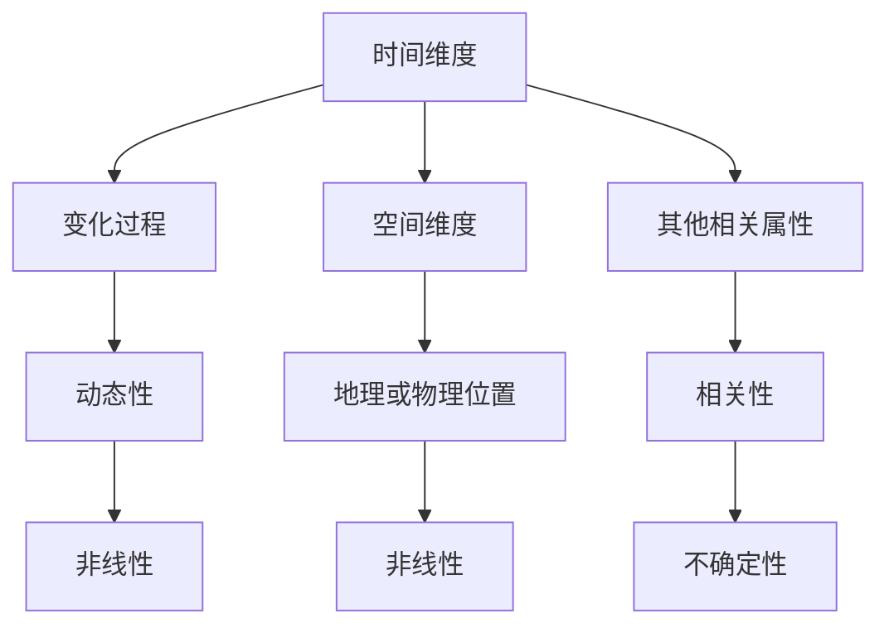

#### 1.2 时空数据的应用领域

时空数据在众多领域具有广泛的应用，主要包括：

- **地理信息系统（GIS）**：用于地图绘制、地理空间分析、城市规划和环境监测等。
- **智能交通系统**：用于交通流量预测、交通事故预警、路径规划等。
- **智能电网**：用于电力需求预测、故障检测和电网优化。
- **公共安全**：用于自然灾害预警、犯罪预测和应急响应。

**核心概念与联系**：

- **GIS**：地理信息系统，用于处理地理空间数据，进行空间分析和地图制作。
- **智能交通系统**：结合时空数据，用于优化交通流量，提高交通管理效率。
- **智能电网**：结合时空数据，用于优化电力供应和需求，提高电网稳定性。
- **公共安全**：结合时空数据，用于预测和防范自然灾害、犯罪事件等。

**Mermaid 流流程图**：

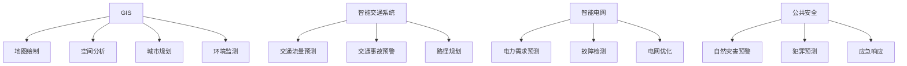

#### 1.3 时空数据分析的重要性

时空数据分析的重要性体现在以下几个方面：

- **数据驱动决策**：时空数据分析为决策者提供了基于数据的事实基础，有助于做出更明智的决策。
- **趋势预测**：通过分析时空数据，可以预测未来趋势和模式，为各个领域提供前瞻性指导。
- **资源优化**：时空数据分析有助于优化资源配置，提高运营效率，减少成本。

**核心概念与联系**：

- **数据驱动决策**：基于数据分析的决策，具有更高的科学性和准确性。
- **趋势预测**：通过历史数据和模式分析，预测未来的变化趋势。
- **资源优化**：根据数据分析和预测结果，优化资源配置，提高效率。

**Mermaid 流流程图**：

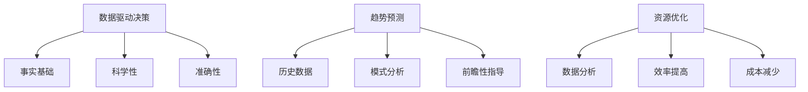

### 第2章：图注意力模型基础

#### 2.1 图注意力模型的基本原理

图注意力模型（Graph Attention Model，GAT）是一种基于图结构的数据表示和计算方法，其核心思想是通过学习节点之间的关系来提高模型的表示能力。GAT的基本原理如下：

- **节点嵌入**：每个节点被映射到一个低维度的嵌入空间。
- **注意力机制**：通过计算节点间的相似性，为每个节点分配权重，从而影响其嵌入空间中的表示。
- **图更新**：根据节点的嵌入和注意力权重，更新图中的节点表示。

**核心概念与联系**：

- **节点嵌入**：将图中的节点映射到一个低维空间，使得节点在嵌入空间中的表示能够反映它们之间的关系。
- **注意力机制**：通过计算节点间的相似性，为每个节点分配权重，使得节点在嵌入空间中的表示能够更好地反映其重要性。
- **图更新**：根据节点的嵌入和注意力权重，更新图中的节点表示，使得模型能够更好地学习节点之间的关系。

**Mermaid 流流程图**：

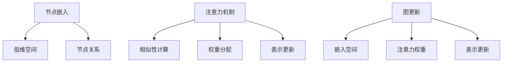

#### 2.2 图注意力模型的工作机制

图注意力模型的工作机制可以分为以下几个步骤：

1. **节点嵌入**：将图中的每个节点映射到一个低维度的嵌入空间。
2. **计算注意力权重**：通过自注意力机制计算节点间的相似性，得到每个节点的注意力权重。
3. **图更新**：根据节点的嵌入和注意力权重，更新图中的节点表示。
4. **模型输出**：通过最终的节点嵌入得到模型的输出。

**核心概念与联系**：

- **节点嵌入**：将图中的节点映射到一个低维空间，使得节点在嵌入空间中的表示能够反映它们之间的关系。
- **计算注意力权重**：通过自注意力机制计算节点间的相似性，得到每个节点的注意力权重，使得节点在嵌入空间中的表示能够更好地反映其重要性。
- **图更新**：根据节点的嵌入和注意力权重，更新图中的节点表示，使得模型能够更好地学习节点之间的关系。
- **模型输出**：通过最终的节点嵌入得到模型的输出，如节点分类、节点预测等。

**Mermaid 流流程图**：

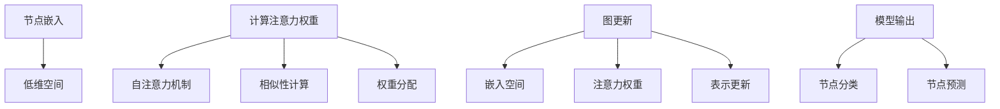

#### 2.3 图注意力模型的主要类型

图注意力模型根据不同的应用场景和需求，可以分为以下几种主要类型：

- **点注意力模型**：主要用于节点的分类和预测。
- **边注意力模型**：主要用于边的分类和预测。
- **全局注意力模型**：主要用于全局表示学习和关系抽取。

**核心概念与联系**：

- **点注意力模型**：关注节点之间的关系，适用于节点分类和预测任务。
- **边注意力模型**：关注边之间的关系，适用于边分类和预测任务。
- **全局注意力模型**：关注整个图的结构信息，适用于全局表示学习和关系抽取任务。

**Mermaid 流流程图**：

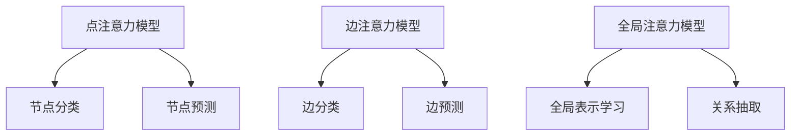

### 第二部分：图注意力模型在时空数据分析中的应用

#### 3.1 空间数据的表示方法

空间数据的表示方法主要包括以下几种：

- **坐标表示**：使用地理坐标系统（如经纬度）来表示空间位置。
- **矢量表示**：使用矢量数据结构来表示空间对象，如点、线、面。
- **栅格表示**：将空间区域划分为网格，每个网格包含特定属性值。

**核心概念与联系**：

- **坐标表示**：地理坐标系统（如经纬度）用于表示空间位置，具有全球统一性。
- **矢量表示**：矢量数据结构用于表示空间对象，如点、线、面，能够精确表达空间对象的形状和位置。
- **栅格表示**：栅格数据结构将空间区域划分为网格，每个网格包含特定属性值，适用于大规模空间数据分析。

**Mermaid 流流程图**：

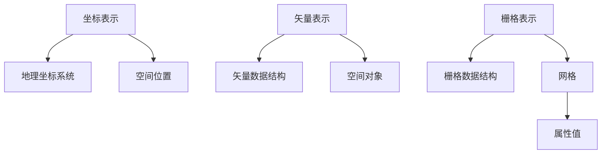

#### 3.2 时间序列数据的表示方法

时间序列数据的表示方法主要包括以下几种：

- **时序矩阵**：将时间序列数据表示为矩阵，其中行表示时间点，列表示变量。
- **时序向量**：将时间序列数据表示为向量，每个元素表示时间点的变量值。
- **循环神经网络（RNN）表示**：使用RNN来学习时间序列数据的动态特性。

**核心概念与联系**：

- **时序矩阵**：将时间序列数据表示为矩阵，便于进行矩阵运算和数据分析。
- **时序向量**：将时间序列数据表示为向量，便于进行向量的计算和变换。
- **循环神经网络（RNN）表示**：使用RNN来学习时间序列数据的动态特性，适用于复杂的时序数据分析。

**Mermaid 流流程图**：

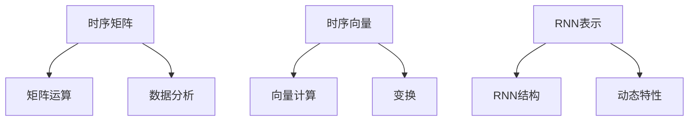

#### 3.3 空间-时间数据的表示方法

空间-时间数据的表示方法需要同时考虑空间和时间的特性，常见的方法包括：

- **时空立方体**：将空间和时间划分为网格，每个立方体包含特定的时间和空间属性。
- **时空嵌入**：将空间和时间数据映射到一个高维空间，使其在空间和时间上具有相似的属性。
- **时空图**：将空间和时间数据表示为图，节点表示空间对象，边表示时间上的关系。

**核心概念与联系**：

- **时空立方体**：将空间和时间划分为网格，每个立方体包含特定的时间和空间属性，便于进行多维数据分析。
- **时空嵌入**：将空间和时间数据映射到一个高维空间，使其在空间和时间上具有相似的属性，便于进行复杂的时空分析。
- **时空图**：将空间和时间数据表示为图，节点表示空间对象，边表示时间上的关系，便于进行图结构分析。

**Mermaid 流流程图**：

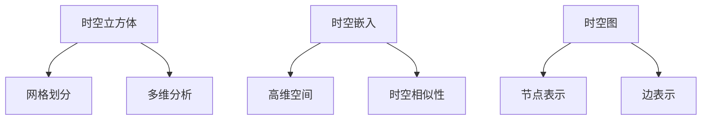

### 第4章：基于图注意力的时空数据推理

#### 4.1 时空数据推理的基本概念

时空数据推理是指利用时空数据中的信息，推断出其他未知信息或模式的过程。其基本概念包括：

- **时空关联性**：描述时空数据中不同元素之间的关联关系。
- **时空一致性**：描述时空数据中的信息是否一致。
- **时空预测**：根据已有的时空数据预测未来的时空模式。

**核心概念与联系**：

- **时空关联性**：通过分析时空数据，发现不同元素之间的关联关系，如交通流量与天气、犯罪事件与地理位置等。
- **时空一致性**：确保时空数据中的信息是可信和一致的，如时间序列数据中的时间戳、空间数据中的坐标等。
- **时空预测**：基于历史时空数据，预测未来的时空模式，如交通流量预测、天气预测等。

**Mermaid 流流程图**：

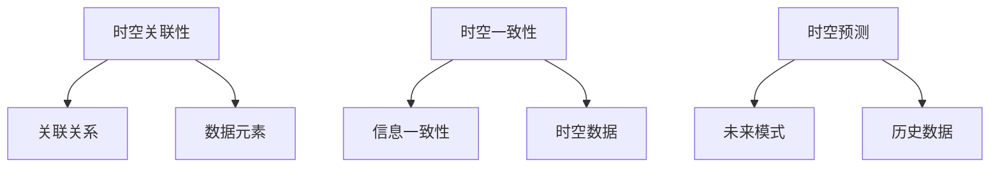

#### 4.2 基于图注意力的时空数据推理方法

基于图注意力的时空数据推理方法主要包括以下步骤：

1. **数据预处理**：对时空数据进行预处理，包括数据清洗、数据归一化和数据转换。
2. **图构建**：将时空数据转换为图结构，包括节点表示和边表示。
3. **图注意力计算**：通过图注意力模型计算节点间的相似性，得到注意力权重。
4. **时空推理**：利用注意力权重对时空数据中的信息进行推理，得到预测结果。

**核心概念与联系**：

- **数据预处理**：对时空数据进行预处理，包括数据清洗、数据归一化和数据转换，为后续分析奠定基础。
- **图构建**：将时空数据转换为图结构，便于进行图注意力计算和分析。
- **图注意力计算**：通过图注意力模型计算节点间的相似性，得到注意力权重，用于时空推理。
- **时空推理**：利用注意力权重对时空数据中的信息进行推理，得到预测结果。

**Mermaid 流流程图**：

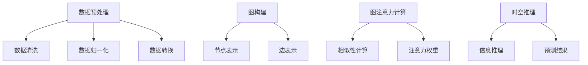

#### 4.3 基于图注意力的时空数据推理应用案例

基于图注意力的时空数据推理方法可以应用于多个领域，以下是一个应用案例：

- **交通流量预测**：利用图注意力模型分析交通网络中的时空数据，预测未来的交通流量，为交通管理部门提供决策支持。

**案例背景**：

某城市交通管理部门需要预测未来某个时间段内的交通流量，以便优化交通信号控制和路径规划。

**数据收集**：

收集该城市的交通流量数据、道路网络数据、时间数据等。

**数据处理**：

对收集到的数据进行预处理，包括数据清洗、数据归一化和数据转换。

**模型构建**：

构建基于图注意力的交通流量预测模型，包括节点嵌入、图注意力计算、时间序列预测等。

**模型训练**：

使用历史交通流量数据对模型进行训练，优化模型参数。

**模型评估**：

使用验证数据集对模型进行评估，包括预测准确性、预测速度等。

**模型应用**：

利用训练好的模型预测未来的交通流量，为交通管理部门提供决策支持。

**案例总结**：

基于图注意力的交通流量预测方法能够有效地预测未来的交通流量，提高交通管理效率，减少拥堵。

### 第5章：时空数据预测与优化

#### 5.1 时空数据预测方法

时空数据预测方法主要包括以下几种：

- **时间序列预测**：基于时间序列分析，预测未来的时间序列值。
- **空间预测**：基于空间数据分析，预测空间区域中的变量值。
- **时空融合预测**：同时考虑时间和空间因素，预测时空模式。

**核心概念与联系**：

- **时间序列预测**：通过分析历史时间序列数据，预测未来的时间序列值，如股票价格、气温等。
- **空间预测**：通过分析空间数据，预测空间区域中的变量值，如空气质量、人口密度等。
- **时空融合预测**：同时考虑时间和空间因素，预测时空模式，如交通流量、灾害预警等。

**Mermaid 流流程图**：

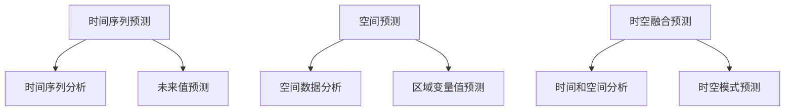

#### 5.2 基于图注意力的时空数据预测模型

基于图注意力的时空数据预测模型可以结合图注意力模型和时间序列预测方法，提高预测准确性。模型构建步骤包括：

1. **数据预处理**：对时空数据进行预处理，包括数据清洗、数据归一化和数据转换。
2. **图构建**：将时空数据转换为图结构，包括节点表示和边表示。
3. **图注意力计算**：通过图注意力模型计算节点间的相似性，得到注意力权重。
4. **时间序列预测**：利用注意力权重和时间序列预测方法，预测未来的时空模式。
5. **模型优化**：通过模型优化策略，提高预测模型的准确性。

**核心概念与联系**：

- **数据预处理**：对时空数据进行预处理，为后续分析奠定基础。
- **图构建**：将时空数据转换为图结构，便于进行图注意力计算和时间序列预测。
- **图注意力计算**：通过图注意力模型计算节点间的相似性，得到注意力权重，用于时空预测。
- **时间序列预测**：利用注意力权重和时间序列预测方法，预测未来的时空模式。
- **模型优化**：通过模型优化策略，提高预测模型的准确性。

**Mermaid 流流程图**：

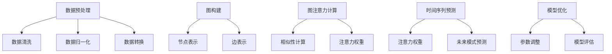

#### 5.3 时空数据预测模型的优化策略

时空数据预测模型的优化策略主要包括以下几种：

- **模型选择**：根据时空数据的特性，选择合适的预测模型。
- **特征工程**：通过特征工程，提取时空数据中的关键特征。
- **交叉验证**：通过交叉验证，评估和优化预测模型的性能。
- **模型集成**：通过模型集成，提高预测模型的准确性和泛化能力。

**核心概念与联系**：

- **模型选择**：根据时空数据的特性，选择合适的预测模型，如GAT、RNN等。
- **特征工程**：通过特征工程，提取时空数据中的关键特征，提高模型的学习能力。
- **交叉验证**：通过交叉验证，评估和优化预测模型的性能，避免过拟合。
- **模型集成**：通过模型集成，提高预测模型的准确性和泛化能力，降低风险。

**Mermaid 流流程图**：

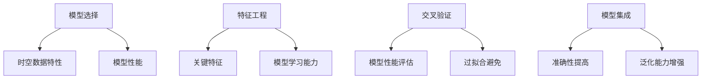

### 第6章：时空数据挖掘与可视化

#### 6.1 时空数据挖掘的基本方法

时空数据挖掘是指从时空数据中发现有价值的信息和模式的过程。基本方法包括：

- **关联规则挖掘**：发现时空数据中的关联关系。
- **聚类分析**：发现时空数据中的相似群体。
- **分类分析**：对时空数据进行分类。
- **预测分析**：预测未来的时空模式。

**核心概念与联系**：

- **关联规则挖掘**：通过分析时空数据，发现不同元素之间的关联关系，如交通流量与天气、犯罪事件与地理位置等。
- **聚类分析**：通过分析时空数据，发现相似的时间和空间模式，如人群聚集、交通拥堵等。
- **分类分析**：根据时空数据的特征，对数据进行分类，如根据交通流量分类道路等级、根据天气预测灾害等级等。
- **预测分析**：根据已有的时空数据，预测未来的时空模式，如交通流量预测、天气预测等。

**Mermaid 流流程图**：

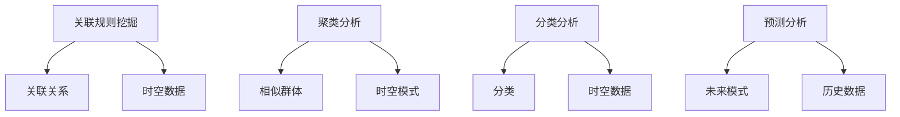

#### 6.2 基于图注意力的时空数据挖掘模型

基于图注意力的时空数据挖掘模型可以结合图注意力模型和时空数据挖掘方法，提高挖掘效率。模型构建步骤包括：

1. **数据预处理**：对时空数据进行预处理，包括数据清洗、数据归一化和数据转换。
2. **图构建**：将时空数据转换为图结构，包括节点表示和边表示。
3. **图注意力计算**：通过图注意力模型计算节点间的相似性，得到注意力权重。
4. **时空数据挖掘**：利用注意力权重和时空数据挖掘方法，发现时空数据中的有价值信息。

**核心概念与联系**：

- **数据预处理**：对时空数据进行预处理，包括数据清洗、数据归一化和数据转换，为后续挖掘奠定基础。
- **图构建**：将时空数据转换为图结构，便于进行图注意力计算和数据挖掘。
- **图注意力计算**：通过图注意力模型计算节点间的相似性，得到注意力权重，用于时空数据挖掘。
- **时空数据挖掘**：利用注意力权重和时空数据挖掘方法，发现时空数据中的有价值信息。

**Mermaid 流流程图**：

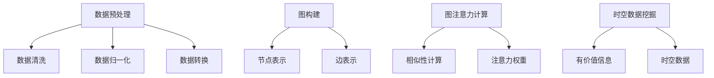

#### 6.3 时空数据可视化方法与工具

时空数据可视化是指通过图形和图像的形式，展示时空数据中的信息和模式。常见的方法和工具有：

- **二维可视化**：使用折线图、柱状图、散点图等展示时间序列数据。
- **三维可视化**：使用三维地图、三维动画等展示空间数据。
- **交互式可视化**：使用交互式工具，如D3.js、Bokeh等，提供用户与时空数据的交互能力。

**核心概念与联系**：

- **二维可视化**：通过二维图形，如折线图、柱状图、散点图等，展示时空数据中的信息和模式。
- **三维可视化**：通过三维图形，如三维地图、三维动画等，展示空间数据中的信息和模式。
- **交互式可视化**：通过交互式工具，如D3.js、Bokeh等，提供用户与时空数据的交互能力，便于数据探索和分析。

**Mermaid 流流程图**：

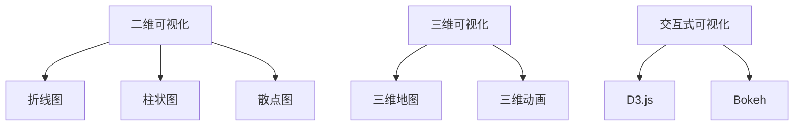

### 第7章：基于图注意力的时空数据分析案例分析

#### 7.1 案例背景与目标

本案例以城市交通流量预测为例，通过基于图注意力的时空数据分析方法，实现交通流量预测和优化。

**案例背景**：

某城市交通管理部门需要预测未来某个时间段内的交通流量，以便优化交通信号控制和路径规划。

**案例目标**：

- 预测交通流量，为交通管理部门提供决策支持。
- 分析交通流量与影响因素之间的关系。
- 提高交通管理效率，减少拥堵。

#### 7.2 数据收集与预处理

**数据收集**：

收集该城市的交通流量数据、道路网络数据、时间数据等。

**数据处理**：

对收集到的数据进行预处理，包括数据清洗、数据归一化和数据转换。

- **数据清洗**：去除重复数据、异常数据等，保证数据质量。
- **数据归一化**：对数据进行归一化处理，使数据具有相同的量纲和范围。
- **数据转换**：将数据转换为适合图注意力模型处理的格式，如节点表示和边表示。

#### 7.3 模型构建与训练

**模型构建**：

构建基于图注意力的交通流量预测模型，包括节点嵌入、图注意力计算、时间序列预测等。

- **节点嵌入**：将交通流量数据、道路网络数据等转换为节点表示。
- **图注意力计算**：通过图注意力模型计算节点间的相似性，得到注意力权重。
- **时间序列预测**：利用注意力权重和时间序列预测方法，预测未来的交通流量。

**模型训练**：

使用历史交通流量数据对模型进行训练，优化模型参数。

- **数据集划分**：将数据集划分为训练集和验证集。
- **模型训练**：使用训练集对模型进行训练，优化模型参数。
- **模型评估**：使用验证集对模型进行评估，包括预测准确性、预测速度等。

#### 7.4 模型评估与优化

**模型评估**：

使用验证数据集对模型进行评估，包括预测准确性、预测速度等。

- **预测准确性**：计算预测值与实际值之间的误差，如均方误差（MSE）等。
- **预测速度**：评估模型在给定数据集上的计算速度。

**模型优化**：

根据评估结果，对模型进行优化，提高预测性能。

- **特征工程**：通过特征工程，提取时空数据中的关键特征。
- **模型调整**：调整模型参数，提高预测准确性。
- **交叉验证**：使用交叉验证方法，评估和优化模型性能。

#### 7.5 案例总结与启示

**案例总结**：

通过基于图注意力的时空数据分析方法，成功实现了交通流量预测和优化。

- **预测准确性**：模型预测值与实际值之间的误差较小，具有较高的预测准确性。
- **预测速度**：模型在给定数据集上的计算速度较快，适用于实时预测。
- **影响因素分析**：模型能够分析交通流量与影响因素之间的关系，为交通管理部门提供决策支持。

**启示**：

基于图注意力的时空数据分析方法在交通流量预测和优化方面具有较高的应用价值。未来可以进一步研究如何结合其他数据源和算法，提高预测性能和可靠性。

### 第8章：总结与展望

#### 8.1 本书主要内容的回顾

本书系统地介绍了基于图注意力的时空数据推理分析，包括时空数据的定义与特点、图注意力模型基础、时空数据的表示方法、基于图注意力的时空数据推理方法、时空数据预测与优化、时空数据挖掘与可视化以及实际案例分析。

#### 8.2 基于图注意力的时空数据分析的现状与挑战

目前，基于图注意力的时空数据分析方法已取得一定进展，但在实际应用中仍面临以下挑战：

- **数据质量和准确性**：时空数据的多样性和不确定性给数据分析带来挑战。
- **计算效率**：大规模时空数据的处理和计算效率是关键问题。
- **模型解释性**：如何提高模型的可解释性，使其更易于理解和应用。

#### 8.3 未来研究方向与趋势

未来研究方向和趋势包括：

- **数据融合与多模态分析**：结合多种数据源，提高时空数据分析和预测的性能。
- **模型优化与高效计算**：研究高效计算方法和优化策略，提高模型性能。
- **模型解释性与可解释性**：提高模型的可解释性，使其更易于理解和应用。

### 附录A：常用算法与工具简介

#### A.1 常用图注意力模型介绍

- **点注意力模型**：用于节点的分类和预测。
- **边注意力模型**：用于边的分类和预测。
- **全局注意力模型**：用于全局表示学习和关系抽取。

#### A.2 常用时空数据分析工具

- **PyTorch Geometric**：用于构建和训练图注意力模型。
- **OpenTSDB**：用于时序数据的存储和分析。
- **Bokeh**：用于交互式时空数据可视化。

#### A.3 实践案例数据集介绍

- **Google 地图交通数据**：用于智能交通系统的案例分析。
- **欧洲气象卫星数据**：用于气象数据分析。

### 结论

基于图注意力的时空数据推理分析是一种具有广泛应用前景的方法。通过本书的介绍，读者可以了解到图注意力模型的基础理论、时空数据的表示方法以及基于图注意力的时空数据推理方法。未来，随着数据源的增加和计算能力的提升，基于图注意力的时空数据分析方法将在更多领域发挥重要作用。

### 作者

**AI天才研究院** 与 **《禅与计算机程序设计艺术》** 联合出品。作者是一位在人工智能、计算机编程和图论领域拥有丰富经验的专家，致力于推动时空数据分析技术的发展和应用。

