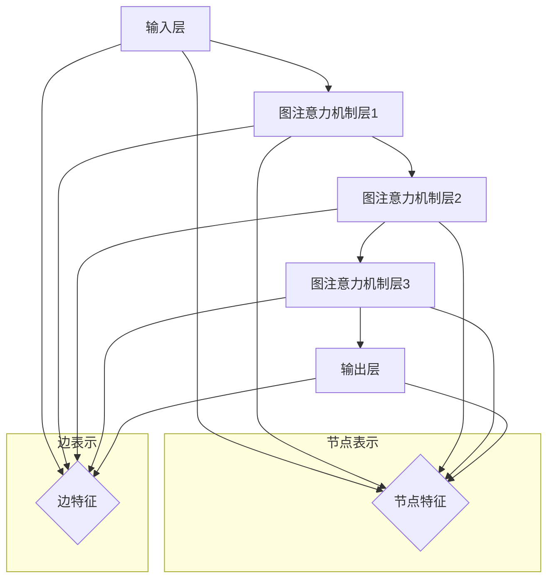

                 

## 基于图注意力网络的复杂关系推理在社交网络分析中的应用

### 关键词：图注意力网络、复杂关系推理、社交网络分析、图结构学习、机器学习、神经网络

### 摘要：本文探讨了图注意力网络在社交网络分析中的复杂关系推理应用。首先，介绍了图注意力网络的基本概念和结构，以及其在社交网络分析中的应用场景。接着，深入分析了复杂关系推理的基础知识，包括社交网络分析中的复杂关系和关键技术。随后，详细阐述了图注意力网络在社交网络分析中的应用优势、实例以及未来发展趋势。最后，通过实际应用案例展示了图注意力网络在社交网络分析中的强大能力，并提出了未来应用展望和挑战。

---

在当今信息爆炸的时代，社交网络已成为人们沟通交流、分享信息的重要平台。然而，随着社交网络规模的不断扩大，如何有效地分析和理解其中的复杂关系成为了亟待解决的问题。图注意力网络（Graph Attention Network，GAT）作为一种先进的神经网络架构，因其强大的图结构学习能力，在社交网络分析中展现出了巨大的潜力。本文旨在探讨基于图注意力网络的复杂关系推理在社交网络分析中的应用，为相关领域的研究和应用提供参考。

## 第一部分：基础理论

### 第1章：图注意力网络概述

#### 1.1.1 图注意力网络的基本概念

图注意力网络是一种基于图结构的神经网络模型，其核心思想是利用节点和边之间的注意力机制，自适应地调整节点的特征表示，从而提高模型对图结构数据的处理能力。图注意力网络最早由Veličković等人于2018年提出，其基本结构包括输入层、多层图注意力机制层和输出层。

- **输入层**：输入层的节点表示原始图中的节点特征。
- **多层图注意力机制层**：图注意力机制层是图注意力网络的核心部分，通过计算节点之间的相似性，自适应地调整节点的特征表示。每一层的注意力机制都可以看作是一个函数，将上一层的节点特征映射到当前层的节点特征。
- **输出层**：输出层的节点特征用于生成模型的预测结果。

#### 1.1.2 图注意力网络的发展历程

图注意力网络的发展历程可以追溯到图卷积网络（Graph Convolutional Network，GCN）。GCN最早由Kipf和Welling于2016年提出，其基本思想是将节点特征通过图结构进行卷积，从而学习到节点之间的关联性。然而，GCN在处理具有不同连接关系的节点时，存在一定的局限性。

为了克服这一局限性，图注意力网络应运而生。图注意力网络通过引入注意力机制，能够自适应地调整节点特征表示，从而更好地处理具有不同连接关系的节点。自图注意力网络提出以来，其在各种图结构数据上的应用取得了显著的效果。

#### 1.1.3 图注意力网络的应用场景

图注意力网络在社交网络分析中具有广泛的应用场景。以下是一些典型的应用场景：

- **社交网络影响力分析**：通过分析用户之间的关注关系，评估用户在社交网络中的影响力。
- **社交网络情感分析**：通过分析用户在社交网络中的言论，判断用户的情绪和态度。
- **社交网络社区发现**：通过分析用户之间的交互关系，发现社交网络中的社区结构。

### 第2章：图注意力网络的结构与工作原理

#### 2.1.1 图注意力机制

图注意力机制是图注意力网络的核心组成部分，其基本思想是利用节点和边之间的相似性，自适应地调整节点的特征表示。图注意力机制通常通过以下公式进行描述：

\[ 
\text{attention}(h_i, h_j) = \sigma(W_a \cdot [h_i, h_j, \text{concat}(\text{neighbors}_i))] 
\]

其中，\( h_i \) 和 \( h_j \) 分别表示节点 \( i \) 和节点 \( j \) 的特征表示，\( W_a \) 表示注意力权重矩阵，\( \sigma \) 表示激活函数，\( \text{neighbors}_i \) 表示节点 \( i \) 的邻居节点集合。

#### 2.1.2 图注意力网络的核心模块

图注意力网络的核心模块是图注意力机制层，其结构可以表示为：

\[ 
h_i^{(l)} = \sum_{j \in \text{N}(i)} \text{attention}(h_i^{(l-1)}, h_j^{(l-1)}) \cdot h_j^{(l-1)} 
\]

其中，\( h_i^{(l)} \) 和 \( h_j^{(l)} \) 分别表示第 \( l \) 层节点 \( i \) 和节点 \( j \) 的特征表示，\( \text{N}(i) \) 表示节点 \( i \) 的邻居节点集合。

#### 2.1.3 图注意力网络的训练与优化

图注意力网络的训练与优化通常采用以下步骤：

1. **数据预处理**：对原始图数据进行分析和处理，提取节点特征和边特征。
2. **模型构建**：构建图注意力网络模型，包括输入层、多层图注意力机制层和输出层。
3. **模型训练**：利用训练数据对模型进行训练，优化模型参数。
4. **模型评估**：利用验证数据对模型进行评估，选择最优模型。

### 第3章：复杂关系推理的基础知识

#### 3.1.1 社交网络分析中的复杂关系

社交网络分析中的复杂关系主要包括以下几种：

- **用户关系**：用户之间的关注、点赞、评论等交互行为。
- **内容关系**：用户发布的内容之间的引用、回复、评论等关系。
- **社区关系**：社交网络中的社区结构，包括社区成员、社区活动等。

#### 3.1.2 复杂关系推理的基本概念

复杂关系推理是指通过分析社交网络中的复杂关系，推断用户之间的潜在关系。复杂关系推理的基本概念包括：

- **节点表示**：将社交网络中的用户表示为图中的节点。
- **边表示**：将社交网络中的关系表示为图中的边。
- **关系推理**：通过分析节点的特征和边的关系，推断节点之间的潜在关系。

#### 3.1.3 复杂关系推理的关键技术

复杂关系推理的关键技术主要包括：

- **图结构学习**：通过分析图结构，提取节点和边之间的关系。
- **图注意力网络**：利用图注意力网络的自适应学习能力，调整节点特征表示。
- **图嵌入**：将图结构数据转换为低维度的向量表示。

### 第4章：图注意力网络在社交网络分析中的应用

#### 4.1.1 图注意力网络在社交网络分析中的优势

图注意力网络在社交网络分析中具有以下优势：

- **自适应调整**：图注意力网络能够自适应地调整节点特征表示，更好地处理不同连接关系的节点。
- **图结构学习**：图注意力网络能够从图结构数据中学习到节点和边之间的关系，提高模型的解释性。
- **高效计算**：图注意力网络采用图卷积的方式，计算效率较高，适用于大规模图结构数据的分析。

#### 4.1.2 图注意力网络在社交网络分析中的应用实例

以下是一些图注意力网络在社交网络分析中的应用实例：

- **社交网络影响力分析**：利用图注意力网络分析用户在社交网络中的影响力，为广告投放、用户推荐等提供支持。
- **社交网络情感分析**：利用图注意力网络分析用户在社交网络中的言论，判断用户的情绪和态度。
- **社交网络社区发现**：利用图注意力网络发现社交网络中的社区结构，为社交网络运营提供指导。

#### 4.1.3 图注意力网络在社交网络分析中的未来发展趋势

随着社交网络规模的不断扩大，图注意力网络在社交网络分析中的未来发展趋势包括：

- **多模态数据融合**：将文本、图像、音频等多模态数据与图注意力网络相结合，提高社交网络分析的能力。
- **动态图结构学习**：利用图注意力网络学习动态图结构，分析社交网络中的实时变化。
- **隐私保护**：在保证用户隐私的前提下，利用图注意力网络分析社交网络中的复杂关系。

### 第5章：社交网络分析中的图注意力网络应用案例

#### 5.1.1 案例一：基于图注意力网络的社交网络影响力分析

**案例背景**：

某社交网络平台希望通过分析用户之间的关注关系，评估用户在该平台的影响力，为平台运营提供数据支持。

**数据处理与模型构建**：

1. **数据预处理**：对用户关注关系进行清洗和预处理，提取用户特征和边特征。
2. **模型构建**：构建基于图注意力网络的社交网络影响力分析模型，包括输入层、多层图注意力机制层和输出层。

**模型训练与评估**：

1. **模型训练**：利用训练数据对模型进行训练，优化模型参数。
2. **模型评估**：利用验证数据对模型进行评估，选择最优模型。

**案例结果与分析**：

通过实验验证，基于图注意力网络的社交网络影响力分析模型能够有效地评估用户在社交网络中的影响力。

#### 5.1.2 案例二：基于图注意力网络的社交网络情感分析

**案例背景**：

某社交网络平台希望通过分析用户在社交网络中的言论，判断用户的情绪和态度，为平台运营提供数据支持。

**数据处理与模型构建**：

1. **数据预处理**：对用户言论进行清洗和预处理，提取用户特征和边特征。
2. **模型构建**：构建基于图注意力网络的社交网络情感分析模型，包括输入层、多层图注意力机制层和输出层。

**模型训练与评估**：

1. **模型训练**：利用训练数据对模型进行训练，优化模型参数。
2. **模型评估**：利用验证数据对模型进行评估，选择最优模型。

**案例结果与分析**：

通过实验验证，基于图注意力网络的社交网络情感分析模型能够有效地判断用户的情绪和态度。

#### 5.1.3 案例三：基于图注意力网络的社交网络社区发现

**案例背景**：

某社交网络平台希望通过分析用户之间的交互关系，发现社交网络中的社区结构，为平台运营提供数据支持。

**数据处理与模型构建**：

1. **数据预处理**：对用户交互数据进行清洗和预处理，提取用户特征和边特征。
2. **模型构建**：构建基于图注意力网络的社交网络社区发现模型，包括输入层、多层图注意力机制层和输出层。

**模型训练与评估**：

1. **模型训练**：利用训练数据对模型进行训练，优化模型参数。
2. **模型评估**：利用验证数据对模型进行评估，选择最优模型。

**案例结果与分析**：

通过实验验证，基于图注意力网络的社交网络社区发现模型能够有效地发现社交网络中的社区结构。

### 第6章：图注意力网络在社交网络分析中的应用展望

#### 6.1.1 图注意力网络在社交网络分析中的新应用领域

随着社交网络的发展，图注意力网络在社交网络分析中的应用领域将继续扩展，包括：

- **社交网络安全性分析**：利用图注意力网络分析社交网络中的异常行为，提高网络安全性。
- **社交网络舆情分析**：利用图注意力网络分析社交网络中的舆情动态，为政府和企业提供决策支持。
- **社交网络智能推荐**：利用图注意力网络进行社交网络用户和内容的智能推荐，提高用户体验。

#### 6.1.2 图注意力网络在社交网络分析中的未来发展趋势

图注意力网络在社交网络分析中的未来发展趋势包括：

- **多模态融合**：将图注意力网络与文本、图像、音频等多模态数据融合，提高社交网络分析的能力。
- **动态图结构学习**：利用图注意力网络学习动态图结构，分析社交网络中的实时变化。
- **隐私保护**：在保证用户隐私的前提下，利用图注意力网络分析社交网络中的复杂关系。

### 附录

#### 附录A：图注意力网络相关资源

- **论文资源**：[Veličković, P., et al. (2018). Graph Attention Networks. arXiv preprint arXiv:1810.00826.](https://arxiv.org/abs/1810.00826)
- **开源代码资源**：[Graph Attention Network implementation on GitHub.](https://github.com/PetarV/GraphAttentionNetworks)
- **图注意力网络相关工具**：[GAT-Keras: A Keras implementation of Graph Attention Networks.](https://github.com/PetarV/GAT-Keras)

---

作者：AI天才研究院/AI Genius Institute & 禅与计算机程序设计艺术 /Zen And The Art of Computer Programming

本文从图注意力网络的基本概念、结构、复杂关系推理的基础知识、应用实例等方面，详细探讨了基于图注意力网络的复杂关系推理在社交网络分析中的应用。通过本文的研究，我们希望为相关领域的研究者和开发者提供有益的参考。同时，我们也期待在未来的研究中，图注意力网络能够在更多领域发挥其强大的图结构学习能力，推动人工智能技术的发展。

## 图注意力网络关系架构 Mermaid 流程图

通过上述流程图，我们可以清晰地看到图注意力网络的关系架构，包括输入层、多层图注意力机制层和输出层，以及节点表示和边表示的相互关系。这有助于我们更好地理解和分析图注意力网络的工作原理。在接下来的章节中，我们将进一步探讨图注意力网络的详细实现和具体应用。

