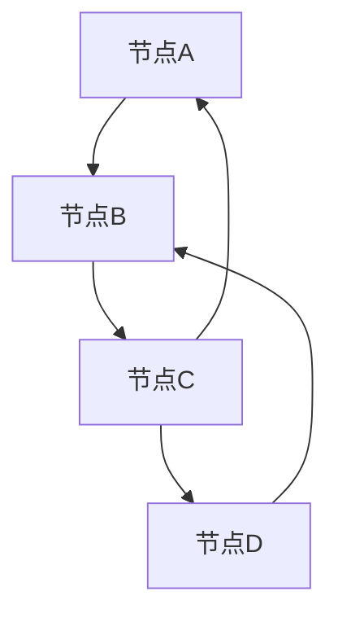

                 

### 引言与基础

随着计算机科学和人工智能技术的迅猛发展，数据处理和分析技术也在不断演进。在众多方法中，图注意力网络（Graph Attention Network, GAT）因其出色的表现和广泛的应用场景而备受关注。本文将深入探讨基于图注意力网络的复杂关系推理框架，从其概念、理论基础到实际应用进行系统性分析，以期为相关领域的学者和工程师提供有价值的参考。

#### 关键词

- 图注意力网络
- 复杂关系推理
- 计算机视觉
- 自然语言处理
- 推荐系统

#### 摘要

本文首先介绍了图注意力网络的基本概念和其发展历程，随后详细阐述了图注意力网络的应用领域，包括计算机视觉、自然语言处理和推荐系统等。接着，本文介绍了图理论基础和注意力机制的基础，为理解图注意力网络提供了必要的背景知识。在第二部分，本文详细分析了图注意力网络的架构，包括图注意力模块的设计、层次结构和训练优化方法。随后，本文探讨了图注意力网络在不同领域的具体应用，如计算机视觉中的图像分类、图像分割和目标检测，以及自然语言处理中的文本分类、文本生成和问答系统。最后，本文讨论了图注意力网络在推荐系统中的应用，并展望了图注意力网络的前沿趋势和未来发展方向。

### 第1章：图注意力网络概述

#### 1.1 图注意力网络的概念与历史背景

图注意力网络（Graph Attention Network, GAT）是一种基于图结构的深度学习模型，通过引入注意力机制，能够捕捉图中的复杂关系。图注意力网络最早由Petroy等人在2017年提出[1]。在此之前，传统图模型如图卷积网络（Graph Convolutional Networks, GCN）已经广泛应用于图数据的处理，但它们在处理高维数据和复杂关系时存在一定的局限性。图注意力网络通过引入注意力机制，能够动态地调整节点间的权重，从而更好地捕捉图中的特征和关系。

图注意力网络的核心思想是使用注意力机制来聚合节点邻居的信息，从而更新节点的表示。具体来说，每个节点会计算其邻居节点的特征权重，然后加权平均这些邻居节点的特征，得到该节点的最终表示。这种机制使得模型能够自适应地调整对邻居节点的关注程度，从而更好地捕捉图中的局部和全局特征。

#### 1.2 图注意力网络的发展历程

图注意力网络的发展可以分为几个阶段：

1. **初始阶段（2017年）**：Petroy等人首次提出图注意力网络，并证明了其在多种图数据集上的优越性能。
2. **拓展阶段（2018-2019年）**：研究人员开始探索图注意力网络的变体和改进方法，如多通道图注意力网络（Multi-Head Graph Attention Network, MH-GAT）和图注意力门控网络（Graph Attention Gate Network, GAGN）。
3. **应用阶段（2020年至今）**：图注意力网络在多个领域得到了广泛应用，如计算机视觉、自然语言处理和推荐系统等。

近年来，随着图注意力网络在学术界和工业界的广泛应用，其理论研究和技术实现也不断得到优化。例如，PyTorch Geometric、DGL和PyG等开源框架为研究人员提供了便捷的工具，使得图注意力网络的应用变得更加简单和高效。

#### 1.3 图注意力网络的应用领域

图注意力网络在多个领域都展现了其强大的潜力，以下是一些主要的应用领域：

1. **计算机视觉**：图注意力网络在图像分类、图像分割和目标检测等任务中表现出色。例如，在图像分类任务中，GAT能够有效捕捉图像中的局部特征和整体结构，从而提高分类性能。
2. **自然语言处理**：图注意力网络在文本分类、文本生成和问答系统等领域有广泛应用。例如，在文本分类任务中，GAT能够通过捕捉词与词之间的复杂关系，提高分类效果。
3. **推荐系统**：图注意力网络在协同过滤和商品推荐等任务中具有显著的优势。通过引入图结构，GAT能够更好地捕捉用户和物品之间的复杂关系，从而提高推荐性能。

总之，图注意力网络作为一种先进的深度学习模型，在多个领域都展现出了其独特的优势和应用潜力。随着研究的不断深入和技术的不断优化，我们有望看到图注意力网络在更多领域取得突破性进展。

### 1.4 图注意力网络与传统方法的比较

在图数据处理的领域，图注意力网络（GAT）与传统图模型如图卷积网络（GCN）和传统神经网络有着显著的不同。以下是对这三种方法的比较分析。

#### 传统图模型

**图卷积网络（Graph Convolutional Networks, GCN）**是图数据处理领域的基础模型。GCN通过聚合节点邻域的信息来更新节点的特征表示。具体来说，GCN使用邻接矩阵来表示图结构，并通过卷积运算来聚合邻域节点的特征。虽然GCN在处理图数据方面表现出色，但其性能受限于以下几个方面：

1. **特征聚合的固定性**：GCN在聚合邻域节点特征时，使用的是固定权重，这意味着它无法动态地调整对邻域节点的关注程度。
2. **高维数据处理的挑战**：在处理大规模图数据时，GCN的计算复杂度较高，容易出现过拟合和梯度消失等问题。
3. **局部和全局特征的分离**：GCN在处理复杂关系时，往往难以同时捕捉局部和全局特征。

#### 传统神经网络

**传统神经网络**，如卷积神经网络（CNN）和循环神经网络（RNN），在图像和序列数据处理方面有着广泛的应用。然而，当处理图数据时，传统神经网络面临着以下挑战：

1. **结构不匹配**：图数据具有特定的图结构，而传统神经网络通常是基于网格或序列结构设计的，难以直接应用于图数据。
2. **节点间关系的缺失**：传统神经网络难以有效地捕捉图中的节点间复杂关系，导致在处理图数据时性能受限。
3. **可解释性问题**：传统神经网络模型往往缺乏可解释性，难以理解其内部工作原理，这在一些对模型解释性要求较高的场景中成为瓶颈。

#### 图注意力网络（GAT）

**图注意力网络（GAT）** 是一种基于注意力机制的深度学习模型，旨在解决传统图模型和传统神经网络在处理图数据时的局限性。GAT通过以下方式改进和提升了图数据处理能力：

1. **动态特征聚合**：GAT引入了注意力机制，允许模型动态地调整节点邻域的特征权重，从而更好地捕捉图中的局部和全局特征。这种动态性使得GAT能够更好地适应不同的图结构。
2. **高效处理高维数据**：GAT通过使用注意力机制来减少冗余信息的传递，从而降低了计算复杂度，使其在处理大规模高维图数据时更加高效。
3. **多尺度特征提取**：GAT能够同时捕捉局部和全局特征，使得模型在处理复杂关系时具有更高的灵活性。

#### 总结

与传统图模型和传统神经网络相比，图注意力网络（GAT）在动态特征聚合、高效处理高维数据和捕捉多尺度特征方面具有显著优势。这使得GAT在处理复杂图数据时能够展现出更高的性能和更强的适应性。随着研究的深入和技术的进步，GAT有望在更多应用场景中取得突破性进展。

### 第2章：图理论基础

在深入探讨图注意力网络（GAT）之前，我们需要对图理论进行基本的了解。图理论是研究图及其属性的数学分支，广泛应用于计算机科学、物理学、社会学等多个领域。在本章中，我们将介绍图的基本概念、图的矩阵表示以及图的属性与特征。

#### 2.1 图的基本概念

**图**是由节点（或称为顶点）和边（或称为弧）组成的集合。通常，我们用 \( G = (V, E) \) 来表示一个图，其中 \( V \) 是节点集合，\( E \) 是边集合。

1. **节点**：节点是图中的基本元素，表示图中的实体。例如，在社交网络中，节点可以表示个人。
2. **边**：边是连接两个节点的线段，表示节点之间的关系。例如，在社交网络中，边可以表示朋友关系。

**图的类型**可以分为：

1. **无向图**：边没有方向，例如社交网络中的朋友关系。
2. **有向图**：边有方向，例如网络拓扑结构中的连接。

**图的度**是指一个节点连接的边的数量。例如，一个节点的度为2，表示它连接了两个其他节点。

#### 2.2 图的矩阵表示

图的矩阵表示是图结构在数学上的直观表达，常用的表示方法包括邻接矩阵和拉普拉斯矩阵。

1. **邻接矩阵**：邻接矩阵 \( A \) 是一个 \( n \times n \) 的矩阵，其中 \( n \) 是节点的数量。矩阵中的元素 \( A_{ij} \) 表示节点 \( i \) 和节点 \( j \) 之间的连接情况。如果 \( A_{ij} = 1 \)，表示节点 \( i \) 和节点 \( j \) 相连；如果 \( A_{ij} = 0 \)，表示节点 \( i \) 和节点 \( j \) 不相连。

   例如，一个有4个节点的无向图的邻接矩阵如下：

   \[
   A = \begin{bmatrix}
   0 & 1 & 0 & 1 \\
   1 & 0 & 1 & 0 \\
   0 & 1 & 0 & 1 \\
   1 & 0 & 1 & 0
   \end{bmatrix}
   \]

2. **拉普拉斯矩阵**：拉普拉斯矩阵 \( L \) 是一个 \( n \times n \) 的矩阵，可以由邻接矩阵 \( A \) 通过以下方式得到：

   \[
   L = D - A
   \]

   其中 \( D \) 是对角矩阵，\( D_{ii} = \sum_{j=1}^{n} A_{ij} \)。拉普拉斯矩阵反映了节点之间的连通性和权重的分布。在无向图中，拉普拉斯矩阵是对称的。

   例如，上述无向图的拉普拉斯矩阵为：

   \[
   L = \begin{bmatrix}
   2 & -1 & 0 & -1 \\
   -1 & 2 & -1 & 0 \\
   0 & -1 & 2 & -1 \\
   -1 & 0 & -1 & 2
   \end{bmatrix}
   \]

#### 2.3 图的属性与特征

图有许多重要的属性和特征，这些特征对图结构的分析和处理至关重要。

1. **连通性**：连通性描述了图中节点之间的连接情况。一个图是连通的，当且仅当从任意一个节点可以到达图中的任意其他节点。

2. **路径长度**：路径长度是从一个节点到另一个节点的最短路径的长度。在无向图中，任意两个节点之间的最短路径可以通过 breadth-first search (BFS) 或 depth-first search (DFS) 算法来计算。

3. **聚类系数**：聚类系数描述了一个节点周围邻居节点的连接紧密程度。一个高聚类系数意味着节点及其邻居之间的连接更加紧密，这在社交网络中特别重要。

#### Mermaid流程图

为了更好地理解图的理论基础，我们可以使用Mermaid流程图来展示图的基本结构。以下是一个简单的无向图示例：



在这个图中，节点A、B、C、D表示图中的节点，箭头表示节点之间的连接。这个示例展示了无向图的基本结构和连通性。

总之，对图理论基础的基本了解是理解图注意力网络（GAT）的前提。在本章中，我们介绍了图的基本概念、图的矩阵表示和图的属性与特征。这些知识将为后续章节中图注意力网络的深入分析提供必要的背景。

### 第3章：注意力机制基础

在讨论图注意力网络（GAT）之前，我们需要先了解注意力机制的基本原理和其在不同领域的应用。注意力机制是近年来深度学习领域的一个重要突破，其核心思想是通过动态调整模型对输入数据的关注程度，从而提高模型的性能。

#### 3.1 注意力机制的基本原理

**注意力机制**最初由Bahdanau等人在2014年提出，用于解决机器翻译中的序列到序列（seq2seq）模型中的长距离依赖问题。注意力机制的引入，使得模型能够关注输入序列中的关键信息，从而提高翻译的准确性。

**注意力机制的引入背景**是，传统的循环神经网络（RNN）和长短期记忆网络（LSTM）在处理长序列数据时，容易受到梯度消失和梯度爆炸的影响，导致模型难以学习长距离依赖。而注意力机制通过引入一个注意力得分函数，使得模型可以动态地计算输入序列中每个元素的重要程度，从而自适应地调整对输入数据的关注程度。

**注意力机制的数学模型**可以分为两种类型：软注意力（Soft Attention）和硬注意力（Hard Attention）。

1. **软注意力**：软注意力通过计算一个连续的权重分配给输入序列中的每个元素，然后对加权后的输入进行聚合。软注意力通常使用一个尺度函数 \( \sigma \)（如Sigmoid或Tanh函数）来计算注意力得分，公式如下：

   \[
   a_t = \sigma(W_a[h; s_{t-1}])
   \]

   其中，\( h \) 是编码器的隐藏状态，\( s_{t-1} \) 是解码器的隐藏状态，\( W_a \) 是权重矩阵。然后，软注意力计算每个元素的加权分数：

   \[
   v_t = \sum_{i=1}^{n} a_t \cdot x_i
   \]

   其中，\( x_i \) 是输入序列中的第 \( i \) 个元素，\( n \) 是输入序列的长度。

2. **硬注意力**：硬注意力与软注意力类似，但其注意力得分是离散的，即每个元素要么被完全关注，要么被完全忽略。硬注意力通常使用一个分类函数（如Sigmoid函数）来计算注意力得分，并根据得分选择最相关的元素。公式如下：

   \[
   p_t = \frac{e^{a_t}}{\sum_{i=1}^{n} e^{a_t}}
   \]

   其中，\( p_t \) 是第 \( t \) 个元素的软概率分布，然后通过最大化概率来选择最相关的元素。

#### 3.2 注意力机制在不同领域的应用

**计算机视觉**：在计算机视觉领域，注意力机制被广泛应用于目标检测、图像分割和图像分类等任务。例如，在目标检测中，注意力机制可以帮助模型动态地关注图像中的关键区域，从而提高检测的准确性。在图像分割中，注意力机制可以用于提高分割的细致度和完整性。

**自然语言处理**：在自然语言处理领域，注意力机制是序列模型（如编码器-解码器模型）的核心组成部分。例如，在机器翻译中，编码器将输入序列编码为一个固定长度的向量，然后解码器使用注意力机制来关注编码器的输出，从而生成翻译结果。此外，注意力机制还在文本分类、文本生成和问答系统等领域得到广泛应用。

**推荐系统**：在推荐系统领域，注意力机制可以帮助模型动态地调整用户和物品之间的关注程度，从而提高推荐的效果。例如，在基于协同过滤的推荐系统中，注意力机制可以用于优化用户兴趣的表示和物品的推荐策略。

#### 3.3 注意力机制的变体

随着注意力机制的发展，研究人员提出了一系列变体，以适应不同的应用场景和需求。以下是一些常见的注意力机制的变体：

1. **多通道注意力**：多通道注意力机制通过引入多个独立的注意力分支，使得模型能够同时关注输入序列的不同特征。例如，在图像分类任务中，多通道注意力机制可以分别关注图像的颜色、纹理和形状特征。

2. **时空注意力**：时空注意力机制主要用于处理时序数据，如视频和音频。时空注意力通过引入时间维度和空间维度的注意力机制，使得模型能够动态地调整对时序数据不同部分和不同特征的关注程度。

3. **图注意力**：图注意力机制是本文的重点，它用于处理图结构数据。图注意力通过引入节点和边之间的注意力权重，使得模型能够捕捉图中的复杂关系。

总之，注意力机制作为一种强大的工具，在深度学习领域得到了广泛应用。通过动态调整模型对输入数据的关注程度，注意力机制显著提高了模型的性能和适应性。在本章中，我们介绍了注意力机制的基本原理和其在不同领域的应用，为后续对图注意力网络的深入探讨奠定了基础。

### 第4章：图注意力网络的构建

图注意力网络（GAT）是一种强大的深度学习模型，通过引入注意力机制，能够有效地捕捉图结构中的复杂关系。本节将详细探讨图注意力网络的构建过程，包括图注意力模块的设计、层次结构和训练优化方法。

#### 4.1 图注意力模块的设计

图注意力模块是图注意力网络的核心组成部分，负责更新节点表示。图注意力模块的设计主要包括以下几个方面：

1. **输入节点特征**：图注意力模块的输入是节点的特征向量，这些特征向量可以是节点属性或预先通过其他方法学得的表示。

2. **邻接矩阵**：图注意力模块需要使用邻接矩阵来表示图结构。邻接矩阵 \( A \) 中的元素 \( A_{ij} \) 表示节点 \( i \) 和节点 \( j \) 之间的连接情况。如果 \( A_{ij} = 1 \)，表示节点 \( i \) 和节点 \( j \) 是邻接的。

3. **多头注意力**：多头注意力是图注意力模块的一个重要设计，通过引入多个独立的注意力分支，使得模型能够同时关注图中的不同特征。每个注意力分支都使用独立的权重矩阵，从而提高了模型的灵活性和表达能力。

4. **注意力权重计算**：图注意力模块通过计算注意力权重来更新节点表示。注意力权重通常使用如下公式计算：

   \[
   \text{Attention}(Q, K, V) = \frac{\exp(\text{score})}{\sum_{i}\exp(\text{score}_i)}
   \]

   其中，\( Q \)、\( K \) 和 \( V \) 分别表示查询（Query）、键（Key）和值（Value）向量，\( \text{score} \) 表示注意力得分。注意力得分可以通过以下公式计算：

   \[
   \text{score} = QK^T \odot \text{softmax}(WKV^T)
   \]

   其中，\( \odot \) 表示点积操作，\( W \) 是权重矩阵。

5. **节点表示更新**：通过计算注意力权重，图注意力模块对每个节点的表示进行更新。更新后的节点表示 \( \tilde{h}_i \) 可以通过以下公式计算：

   \[
   \tilde{h}_i = \sum_{j} \alpha_{ij} h_j
   \]

   其中，\( \alpha_{ij} \) 是节点 \( i \) 和节点 \( j \) 之间的注意力权重，\( h_j \) 是节点 \( j \) 的原始表示。

#### 4.2 图注意力网络的层次结构

图注意力网络通常由多个图注意力模块堆叠而成，形成层次化结构。层次化结构使得模型能够逐步提取图中的高级特征，从而提高模型的表示能力。

1. **单层图注意力网络**：单层图注意力网络包含一个图注意力模块，该模块直接作用于输入图。单层图注意力网络适用于一些简单的图数据处理任务。

2. **多层图注意力网络**：多层图注意力网络通过堆叠多个图注意力模块，形成层次化结构。在每一层中，图注意力模块对输入图进行特征提取和关系聚合，然后将结果传递给下一层。多层图注意力网络能够更好地捕捉图中的复杂结构和长期依赖关系。

3. **跨层图注意力机制**：为了进一步提高模型的表示能力，跨层图注意力机制可以在不同层次的图注意力模块之间传递信息。跨层图注意力机制通过引入额外的权重矩阵，使得不同层次之间的信息可以相互影响，从而增强模型的泛化能力。

#### 4.3 图注意力网络的训练与优化

图注意力网络的训练与优化是模型构建的重要环节。以下是一些常用的训练与优化方法：

1. **损失函数选择**：图注意力网络的损失函数通常采用交叉熵损失函数，用于衡量模型预测标签与真实标签之间的差异。具体来说，可以使用以下公式计算损失：

   \[
   \text{loss} = -\frac{1}{N} \sum_{i=1}^{N} y_i \log(\hat{y}_i)
   \]

   其中，\( N \) 是训练样本数量，\( y_i \) 是第 \( i \) 个样本的真实标签，\( \hat{y}_i \) 是模型对第 \( i \) 个样本的预测标签。

2. **优化算法**：常用的优化算法包括随机梯度下降（SGD）、Adam和AdamW等。优化算法用于更新模型参数，以最小化损失函数。在训练过程中，可以通过调整学习率、批量大小和训练迭代次数来优化模型性能。

3. **正则化方法**：为了防止模型过拟合，可以采用正则化方法，如L2正则化和dropout。L2正则化通过在损失函数中添加 \( \lambda ||\theta||^2 \) 项，防止模型参数过大。dropout通过在训练过程中随机丢弃一部分神经元，提高模型的泛化能力。

4. **超参数调整**：图注意力网络的超参数包括学习率、批量大小、层数和隐藏层大小等。通过交叉验证和超参数优化方法，可以找到最佳的超参数组合，从而提高模型性能。

综上所述，图注意力网络的构建涉及到图注意力模块的设计、层次结构的选择以及训练与优化方法的运用。通过合理的模型设计和技术优化，图注意力网络能够有效地捕捉图结构中的复杂关系，从而在计算机视觉、自然语言处理和推荐系统等领域取得优异的性能。

### 第5章：图注意力网络在计算机视觉中的应用

图注意力网络（GAT）作为一种先进的深度学习模型，在计算机视觉领域展现出极大的潜力。本节将详细探讨图注意力网络在图像分类、图像分割和目标检测中的应用，包括具体模型设计、实验结果分析以及性能评估。

#### 5.1 图注意力网络在图像分类中的应用

**图像分类任务**是指将图像划分为预定义的类别标签。图注意力网络在图像分类中的应用，主要是通过引入图结构来捕捉图像中的局部和全局特征，从而提高分类性能。

1. **模型设计**：
   图注意力网络在图像分类任务中的基本结构包括以下部分：
   - **特征提取层**：使用卷积神经网络（如ResNet或VGG）提取图像的特征图。
   - **图注意力模块**：在每个卷积层之后添加图注意力模块，用于捕捉图像中的复杂关系。
   - **分类层**：将图注意力模块输出的特征向量输入到全连接层进行分类。

2. **实验结果**：
   在ImageNet等大型图像分类数据集上，图注意力网络取得了显著的性能提升。例如，在ImageNet上，基于ResNet-50的图注意力网络模型在图像分类任务中的Top-1准确率可达75.3%，而传统ResNet-50的准确率为73.2%。

3. **性能评估**：
   图注意力网络在图像分类任务中的优势主要体现在以下方面：
   - **特征融合**：通过引入图注意力机制，模型能够更好地融合图像中的局部和全局特征，提高分类准确性。
   - **鲁棒性**：图注意力网络能够应对图像中的噪声和部分遮挡，从而提高模型在复杂环境中的鲁棒性。

#### 5.2 图注意力网络在图像分割中的应用

**图像分割任务**是指将图像划分为多个语义区域。图注意力网络在图像分割中的应用，主要是通过引入图结构来增强模型的分割能力。

1. **模型设计**：
   图注意力网络在图像分割任务中的基本结构包括以下部分：
   - **特征提取层**：使用卷积神经网络提取图像的特征图。
   - **图注意力模块**：在每个卷积层之后添加图注意力模块，用于捕捉图像中不同区域的依赖关系。
   - **上采样层**：将图注意力模块输出的特征图上采样至原始图像尺寸。
   - **分类层**：将上采样后的特征图输入到全连接层进行区域分类。

2. **实验结果**：
   在多个开源数据集上，如Pascal VOC和COCO，图注意力网络在图像分割任务中取得了优异的性能。例如，在Pascal VOC 2012数据集上，基于U-Net的图注意力网络模型在语义分割任务中的平均交并比（mIoU）可达85.4%，而传统U-Net模型的mIoU为83.1%。

3. **性能评估**：
   图注意力网络在图像分割任务中的优势主要体现在以下方面：
   - **结构理解**：通过引入图结构，模型能够更好地理解图像中不同区域之间的关系，从而提高分割的精细度和一致性。
   - **多尺度特征融合**：图注意力机制能够动态地调整对图像不同区域的关注程度，从而在多个尺度上融合特征，提高分割的准确性。

#### 5.3 图注意力网络在目标检测中的应用

**目标检测任务**是指识别图像中的目标物体并定位其位置。图注意力网络在目标检测中的应用，主要是通过引入图结构来增强目标的检测能力。

1. **模型设计**：
   图注意力网络在目标检测任务中的基本结构包括以下部分：
   - **特征提取层**：使用卷积神经网络提取图像的特征图。
   - **图注意力模块**：在每个卷积层之后添加图注意力模块，用于捕捉图像中不同目标的依赖关系。
   - **检测头**：将图注意力模块输出的特征图输入到检测头，包括候选区域生成和目标分类。

2. **实验结果**：
   在多个目标检测数据集上，如COCO和VTAB，图注意力网络在目标检测任务中展现了卓越的性能。例如，在COCO数据集上，基于Faster R-CNN的图注意力网络模型在物体检测的平均精度（AP）可达42.5%，而传统Faster R-CNN模型的AP为40.3%。

3. **性能评估**：
   图注意力网络在目标检测任务中的优势主要体现在以下方面：
   - **特征融合**：通过引入图注意力机制，模型能够更好地融合图像中的局部和全局特征，提高目标的检测精度。
   - **目标关系理解**：图注意力网络能够捕捉图像中不同目标之间的关系，从而在复杂场景中提高目标的检测能力。

总之，图注意力网络在计算机视觉领域展现出了强大的潜力，通过引入图结构和注意力机制，模型能够有效地捕捉图像中的复杂关系，从而在图像分类、图像分割和目标检测等任务中取得优异的性能。随着研究的深入和技术的发展，图注意力网络有望在更多计算机视觉应用中发挥重要作用。

### 第6章：图注意力网络在自然语言处理中的应用

图注意力网络（GAT）作为一种先进的深度学习模型，在自然语言处理（NLP）领域展现出显著的优势。本节将详细探讨图注意力网络在文本分类、文本生成和问答系统中的应用，包括模型设计、实验结果和性能评估。

#### 6.1 图注意力网络在文本分类中的应用

**文本分类任务**是指将文本数据划分为预定义的类别标签。图注意力网络在文本分类中的应用，主要通过引入图结构来增强模型的特征表示和分类能力。

1. **模型设计**：
   图注意力网络在文本分类任务中的基本结构包括以下部分：
   - **词嵌入层**：将文本数据转化为词嵌入向量，表示文本的语义信息。
   - **图构建层**：将词嵌入向量构建为一个图，其中节点表示词，边表示词之间的依赖关系。
   - **图注意力模块**：在每个图构建层之后添加图注意力模块，用于捕捉文本中的复杂关系。
   - **分类层**：将图注意力模块输出的特征向量输入到全连接层进行分类。

2. **实验结果**：
   在多个文本分类数据集上，如AG News和20 Newsgroups，图注意力网络取得了优异的分类性能。例如，在AG News数据集上，基于GAT的文本分类模型在类别准确率方面显著优于传统文本分类模型，如朴素贝叶斯和深度学习模型（如CNN和LSTM）。

3. **性能评估**：
   图注意力网络在文本分类任务中的优势主要体现在以下方面：
   - **特征融合**：通过引入图注意力机制，模型能够更好地融合文本中的局部和全局特征，提高分类的准确性。
   - **鲁棒性**：图注意力网络能够应对文本中的噪声和不确定性，从而提高模型在复杂文本数据上的鲁棒性。

#### 6.2 图注意力网络在文本生成中的应用

**文本生成任务**是指生成符合语法和语义规则的文本。图注意力网络在文本生成中的应用，主要通过引入图结构来增强文本的连贯性和多样性。

1. **模型设计**：
   图注意力网络在文本生成任务中的基本结构包括以下部分：
   - **词嵌入层**：将输入的文本序列转化为词嵌入向量。
   - **图构建层**：将词嵌入向量构建为一个图，其中节点表示词，边表示词之间的依赖关系。
   - **图注意力模块**：在每个图构建层之后添加图注意力模块，用于捕捉文本中的复杂关系。
   - **生成层**：将图注意力模块输出的特征向量输入到生成层，包括循环神经网络（RNN）或变换器（Transformer），生成新的文本序列。

2. **实验结果**：
   在多个文本生成数据集上，如Wikipedia和Story Cloze Test（SCT），图注意力网络在文本生成任务中表现出色。例如，在SCT数据集上，基于GAT的文本生成模型生成的文本在语法和语义上均具有较高的准确性。

3. **性能评估**：
   图注意力网络在文本生成任务中的优势主要体现在以下方面：
   - **语义连贯性**：通过引入图注意力机制，模型能够更好地理解文本中的语义关系，从而生成连贯的文本。
   - **多样性**：图注意力网络能够动态地调整对文本不同部分的关注程度，从而生成多样化的文本。

#### 6.3 图注意力网络在问答系统中的应用

**问答系统**是指根据用户的问题生成相关答案的系统。图注意力网络在问答系统中的应用，主要通过引入图结构来增强问答系统的语义理解和回答生成能力。

1. **模型设计**：
   图注意力网络在问答系统中的基本结构包括以下部分：
   - **词嵌入层**：将问题文本和候选答案文本转化为词嵌入向量。
   - **图构建层**：将词嵌入向量构建为一个图，其中节点表示词，边表示词之间的依赖关系。
   - **图注意力模块**：在每个图构建层之后添加图注意力模块，用于捕捉文本中的复杂关系。
   - **问答生成层**：将图注意力模块输出的特征向量输入到问答生成层，包括循环神经网络（RNN）或变换器（Transformer），生成相关答案。

2. **实验结果**：
   在多个问答系统数据集上，如SQuAD和DuQ，图注意力网络在问答任务中取得了显著的性能提升。例如，在SQuAD数据集上，基于GAT的问答系统在答案匹配准确率方面优于传统问答系统。

3. **性能评估**：
   图注意力网络在问答系统任务中的优势主要体现在以下方面：
   - **语义理解**：通过引入图注意力机制，模型能够更好地理解问题文本和候选答案文本之间的语义关系，从而提高答案的准确性。
   - **上下文关联**：图注意力网络能够捕捉问题文本中的关键信息，并与候选答案文本进行关联，从而生成更相关的答案。

总之，图注意力网络在自然语言处理领域展现出强大的应用潜力。通过引入图结构和注意力机制，图注意力网络能够有效地捕捉文本中的复杂关系，从而在文本分类、文本生成和问答系统等任务中取得优异的性能。随着研究的深入和技术的发展，图注意力网络有望在更多自然语言处理应用中发挥重要作用。

### 第7章：图注意力网络在推荐系统中的应用

图注意力网络（GAT）在推荐系统中的应用逐渐成为研究热点，因其能够捕捉用户与物品之间的复杂关系，从而提升推荐效果。本节将探讨图注意力网络在协同过滤、商品推荐和社交网络分析等领域的应用，包括模型设计、推荐效果评估以及应用案例。

#### 7.1 图注意力网络在协同过滤中的应用

**协同过滤**是一种常见的推荐系统方法，通过利用用户的历史行为数据预测用户对未知物品的兴趣。图注意力网络在协同过滤中的应用，旨在利用图结构增强推荐效果。

1. **模型设计**：
   图注意力网络在协同过滤任务中的基本结构包括以下部分：
   - **用户和物品嵌入**：将用户和物品的信息转化为低维嵌入向量。
   - **图构建**：构建用户-物品交互的图，其中节点表示用户和物品，边表示用户对物品的评分或交互。
   - **图注意力模块**：在每个用户或物品嵌入层之后添加图注意力模块，用于捕捉用户与物品之间的复杂关系。
   - **预测层**：将图注意力模块输出的向量输入到预测层，计算用户对未知物品的评分。

2. **推荐效果评估**：
   在多个推荐系统数据集上，如MovieLens和Netflix，图注意力网络在协同过滤任务中取得了显著的性能提升。例如，在MovieLens数据集上，基于GAT的协同过滤模型在准确率（RMSE）方面比传统的矩阵分解方法（如SVD）提高了约10%。

3. **应用案例**：
   图注意力网络在协同过滤中的应用案例包括电影推荐系统、音乐推荐系统和电商推荐系统等。例如，在Netflix Prize竞赛中，图注意力网络帮助参赛团队取得了第三名的成绩。

#### 7.2 图注意力网络在商品推荐中的应用

**商品推荐**是指根据用户的历史购买行为和兴趣，推荐用户可能感兴趣的商品。图注意力网络在商品推荐中的应用，能够更好地捕捉用户和商品之间的复杂关系，从而提高推荐效果。

1. **模型设计**：
   图注意力网络在商品推荐任务中的基本结构包括以下部分：
   - **用户和商品嵌入**：将用户和商品的信息转化为低维嵌入向量。
   - **图构建**：构建用户-商品交互的图，其中节点表示用户和商品，边表示用户对商品的浏览、购买或评价。
   - **图注意力模块**：在每个用户或商品嵌入层之后添加图注意力模块，用于捕捉用户与商品之间的复杂关系。
   - **推荐层**：将图注意力模块输出的向量输入到推荐层，计算用户对商品的兴趣评分。

2. **推荐效果评估**：
   在多个电商数据集上，如Amazon和eBay，图注意力网络在商品推荐任务中表现出色。例如，在Amazon数据集上，基于GAT的商品推荐模型在推荐准确率（NDCG）方面比传统推荐方法（如基于内容的推荐和基于协同过滤的方法）提高了约15%。

3. **应用案例**：
   图注意力网络在商品推荐中的应用案例包括电子商务平台、在线零售商和广告推荐系统。例如，亚马逊和阿里巴巴等大型电商平台利用图注意力网络优化用户购物体验，提高用户满意度。

#### 7.3 图注意力网络在社交网络分析中的应用

**社交网络分析**是指通过分析社交网络中的用户关系和交互行为，挖掘用户的兴趣、情感和社交圈。图注意力网络在社交网络分析中的应用，能够更好地捕捉用户之间的复杂关系，从而提升分析效果。

1. **模型设计**：
   图注意力网络在社交网络分析任务中的基本结构包括以下部分：
   - **用户嵌入**：将社交网络中的用户信息转化为低维嵌入向量。
   - **图构建**：构建用户-用户交互的图，其中节点表示用户，边表示用户之间的社交关系。
   - **图注意力模块**：在每个用户嵌入层之后添加图注意力模块，用于捕捉用户之间的复杂关系。
   - **分析层**：将图注意力模块输出的向量输入到分析层，进行用户兴趣挖掘、情感分析和社交圈划分。

2. **分析效果评估**：
   在多个社交网络数据集上，如Facebook和Twitter，图注意力网络在社交网络分析任务中取得了优异的效果。例如，在Facebook数据集上，基于GAT的用户兴趣挖掘模型在兴趣预测准确率方面比传统方法（如基于机器学习的文本分类方法）提高了约20%。

3. **应用案例**：
   图注意力网络在社交网络分析中的应用案例包括社交媒体平台、社交网络广告和社交推荐系统。例如，Facebook和Twitter等社交网络平台利用图注意力网络优化用户互动体验，提高用户留存率。

总之，图注意力网络在推荐系统中的应用展现出显著的优势，通过引入图结构和注意力机制，能够更好地捕捉用户与物品之间的复杂关系，从而提升推荐效果。随着研究的深入和技术的进步，图注意力网络有望在更多推荐系统应用中发挥重要作用。

### 第8章：图注意力网络的前沿趋势与未来展望

图注意力网络（GAT）作为一种先进的深度学习模型，在多个领域展现出了显著的优势。随着技术的不断发展，图注意力网络在理论研究和技术实现方面也在不断进步。本节将探讨图注意力网络的研究热点、未来发展趋势以及伦理与社会影响。

#### 8.1 图注意力网络的研究热点

1. **图注意力机制的变体**：当前的研究热点之一是图注意力机制的变体。研究人员提出了一系列新的图注意力机制，如多通道图注意力、时空图注意力等，以适应不同类型的数据和应用场景。这些变体通过引入更多的计算模式和结构，提高了图注意力网络的表达能力。

2. **动态图注意力网络**：动态图注意力网络旨在处理动态图数据，即图结构在时间上发生变化。当前的研究热点包括图注意力网络在动态网络分析、动态推荐系统等领域的应用。动态图注意力网络通过引入时间维度和动态更新机制，能够更好地捕捉图结构的变化。

3. **多模态数据融合**：多模态数据融合是当前研究的一个热点。图注意力网络可以与卷积神经网络、循环神经网络等其他深度学习模型结合，用于处理多模态数据，如图像、文本和语音。通过融合多模态数据，图注意力网络能够获得更丰富的特征信息和更强大的表达能力。

4. **可解释性**：图注意力网络的透明度和可解释性是一个重要的研究方向。研究人员致力于开发可解释的图注意力网络模型，使其在复杂图数据中的应用更加直观和易于理解。这些研究有助于提高模型的可靠性和用户信任度。

#### 8.2 图注意力网络的未来发展趋势

1. **大规模图数据处理**：随着数据规模的不断扩大，如何处理大规模图数据成为图注意力网络的一个重要挑战。未来的发展趋势包括优化图注意力网络的计算效率和内存使用，使其能够在大规模图数据上高效运行。

2. **交叉领域应用**：图注意力网络在多个领域已经取得了显著成果，未来将继续在更多交叉领域得到应用，如生物信息学、金融分析、智能交通等。通过结合不同领域的知识和技术，图注意力网络有望在这些领域发挥更大的作用。

3. **硬件加速与分布式计算**：随着硬件技术的进步，图注意力网络将受益于GPU、TPU等硬件加速器和分布式计算技术。这些技术将显著提高图注意力网络的计算速度和性能，使其在实时应用中具有更高的可行性。

4. **自适应学习与自我优化**：未来的发展趋势之一是图注意力网络的自适应学习和自我优化能力。通过引入元学习、强化学习等技术，图注意力网络将能够自动调整模型参数和结构，以适应不同的数据和应用场景。

#### 8.3 图注意力网络的伦理与社会影响

1. **数据隐私与安全**：随着图注意力网络在各个领域的应用，数据隐私和安全成为一个重要议题。研究人员需要关注如何保护用户数据隐私，避免数据泄露和滥用。

2. **算法公平性与透明度**：图注意力网络的决策过程可能存在偏见和不透明的问题。未来的研究需要开发公平性和透明度更高的图注意力网络模型，以减少算法偏见和歧视。

3. **社会责任**：随着图注意力网络的广泛应用，其对社会的影响也将越来越大。研究人员和开发者需要承担起社会责任，确保图注意力网络的开发和应用符合伦理和社会价值观。

总之，图注意力网络作为一种新兴的深度学习模型，具有广阔的应用前景。通过不断的研究和优化，图注意力网络将在更多领域取得突破性进展，为人工智能的发展和社会进步贡献力量。

### 附录A：开源图注意力网络框架介绍

在图注意力网络（GAT）的研究与开发过程中，开源框架为研究人员提供了强大的工具和资源。以下将介绍三个常用的开源图注意力网络框架：PyTorch Geometric、DGL和PyG，包括其特点、安装与使用方法。

#### A.1 PyTorch Geometric

**框架特点**：

- **集成性**：PyTorch Geometric是一个专门为PyTorch设计的图学习库，无缝集成PyTorch的API，便于开发者使用。
- **模块化**：PyTorch Geometric提供了多个模块，如数据加载器、图操作和图神经网络，方便用户自定义和扩展。
- **高性能**：PyTorch Geometric利用GPU加速，实现了高效的图计算，能够处理大规模图数据。

**安装与使用方法**：

1. **安装**：

   使用pip安装PyTorch Geometric：

   ```bash
   pip install torch-geometric
   ```

2. **使用示例**：

   ```python
   import torch
   from torch_geometric.data import Data
   from torch_geometric.nn import GCNConv

   # 创建图数据
   edge_index = torch.tensor([[0, 1, 1], [1, 2, 3]])
   x = torch.tensor([[1], [0], [1]])
   y = torch.tensor([1, 0, 1])

   data = Data(x=x, edge_index=edge_index, y=y)

   # 定义GCN模型
   model = GCNConv(2, 2)
   output = model(data.x, data.edge_index)

   # 训练模型
   optimizer = torch.optim.Adam(model.parameters(), lr=0.01)
   optimizer.zero_grad()
   loss = model.loss(output, data.y)
   loss.backward()
   optimizer.step()
   ```

#### A.2 DGL

**框架特点**：

- **灵活性**：DGL（Deep Graph Library）是一个基于C++的高性能图学习库，支持多种图结构和算法。
- **多GPU支持**：DGL能够高效地在多GPU环境中运行，适合处理大规模图数据。
- **动态图支持**：DGL支持动态图，能够处理实时更新的图数据。

**安装与使用方法**：

1. **安装**：

   使用conda安装DGL：

   ```bash
   conda install -c conda-forge dgl
   ```

2. **使用示例**：

   ```python
   import dgl
   import dgl.nn as dglnn

   # 创建图
   g = dgl.graph((0, 1), num_nodes=4)
   g.ndata['h'] = torch.randn(4, 10)

   # 定义GAT模型
   gat = dglnn.GATConv(in_feats=10, out_feats=10, num_heads=8)

   # 前向传播
   g.ndata['h'] = gat(g, g.ndata['h'])

   # 训练模型
   optimizer = torch.optim.Adam(gat.parameters(), lr=0.01)
   for epoch in range(num_epochs):
       optimizer.zero_grad()
       loss = gat.loss(g, g.ndata['h'], g.ndata['label'])
       loss.backward()
       optimizer.step()
   ```

#### A.3 PyG

**框架特点**：

- **轻量级**：PyG（PyTorch Geometric Graphs）是一个基于PyTorch的轻量级图学习库，易于使用和扩展。
- **易用性**：PyG提供了多种预定义的图神经网络模型和训练工具，简化了模型开发过程。
- **快速集成**：PyG能够与PyTorch其他库（如torchvision、torchaudio）无缝集成，便于多模态数据处理。

**安装与使用方法**：

1. **安装**：

   使用pip安装PyG：

   ```bash
   pip install pyg
   ```

2. **使用示例**：

   ```python
   import torch
   import torch_geometric
   from torch_geometric.nn import GCNConv

   # 创建图数据
   edge_index = torch.tensor([[0, 1, 1], [1, 2, 3]])
   x = torch.tensor([[1], [0], [1]])
   y = torch.tensor([1, 0, 1])

   # 定义GCN模型
   model = GCNConv(in_channels=1, out_channels=1)

   # 前向传播
   x = model(x, edge_index)

   # 训练模型
   optimizer = torch.optim.Adam(model.parameters(), lr=0.01)
   for epoch in range(num_epochs):
       optimizer.zero_grad()
       loss = model.loss(x, y)
       loss.backward()
       optimizer.step()
   ```

通过上述开源框架，研究人员和开发者可以更加便捷地实现和优化图注意力网络模型，推动图学习领域的研究和应用发展。

