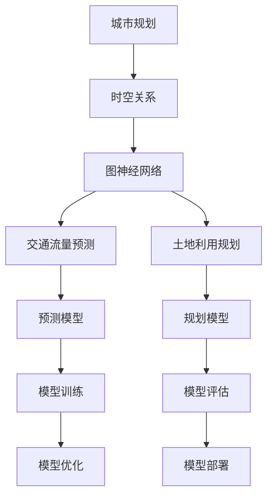

                 

### 基于图神经网络的时空关系推理框架在城市规划中的实现

#### 引言

随着城市化进程的加速，城市规划的重要性日益凸显。传统的城市规划方法主要依赖于历史数据和专家经验，但面对复杂多变的现代城市环境，其有效性受到了限制。为了提高城市规划的精度和效率，人工智能技术，特别是基于图神经网络的时空关系推理框架，成为了一个热门的研究方向。

本文旨在探讨如何利用图神经网络（Graph Neural Networks, GNNs）构建时空关系推理框架，并将其应用于城市规划中。本文将首先介绍城市规划中的时空关系概念，然后深入探讨图神经网络的基本原理和应用，最后通过具体案例展示图神经网络在城市规划中的应用效果。

本文结构如下：

1. **引论**：介绍城市规划与时空关系，以及图神经网络的基本概念。
2. **图神经网络概述**：详细解释图神经网络的工作原理和在时空关系建模中的应用。
3. **图神经网络模型设计与实现**：介绍时空关系图神经网络模型的设计和实现方法。
4. **城市规划中的应用案例**：通过具体案例展示图神经网络在城市规划中的应用效果。
5. **总结与展望**：总结研究成果，展望未来发展方向。

#### 关键词

- 城市规划
- 时空关系
- 图神经网络
- 交通流量预测
- 城市土地利用规划

#### 摘要

本文提出了一种基于图神经网络的时空关系推理框架，用于城市规划中的交通流量预测和土地利用规划。通过设计时空关系图神经网络模型，本文实现了对时空关系的有效建模和推理。具体而言，本文首先介绍了城市规划中的时空关系，并探讨了图神经网络的基本原理和应用。然后，本文详细阐述了时空关系图神经网络模型的设计和实现方法，包括时空关系图的构建、模型训练与评估等。最后，通过两个实际案例，本文展示了图神经网络在城市规划中的应用效果，验证了其有效性和实用性。

### 第一部分：引论

#### 第1章：城市规划与时空关系

##### 1.1 城市规划概述

##### 1.1.1 城市规划的定义与目标

城市规划是指通过科学合理的方法和手段，对城市的发展进行系统规划和管理，以达到改善城市环境、提高居民生活质量、促进城市可持续发展等目标。城市规划的定义在不同国家和地区的表述可能有所不同，但其核心目标是一致的。

城市规划的目标主要包括以下几个方面：

1. **提升城市环境质量**：通过合理的城市布局和设计，改善城市生态环境，减少污染，提高空气质量，为居民创造一个舒适的生活环境。
2. **提高居民生活质量**：通过合理的城市空间规划，提供充足的公共设施和服务，改善交通条件，提升居民的居住条件和生活质量。
3. **促进城市经济发展**：通过科学合理的土地利用和产业发展规划，优化城市产业结构，提升城市综合竞争力，促进城市经济的可持续发展。
4. **保障城市安全与稳定**：通过有效的城市规划和安全管理，预防自然灾害和城市事故的发生，保障城市的安全与稳定。

##### 1.1.2 城市规划的关键要素

城市规划是一个复杂的系统工程，涉及多个方面的要素和因素。以下是一些城市规划的关键要素：

1. **土地利用规划**：土地利用规划是城市规划的核心内容之一，涉及到居住区、商业区、工业区和公共设施区的布局和规划。
2. **交通规划**：交通规划是城市规划的重要组成部分，涉及到交通网络的设计、交通设施的布局和交通管理策略。
3. **环境保护**：环境保护是城市规划的重要目标之一，涉及到空气质量、水质量、噪声控制等方面。
4. **公共设施规划**：公共设施规划包括教育、医疗、文化、体育等方面的设施布局和建设。
5. **历史文化保护**：历史文化保护是城市规划中的重要内容，涉及到历史文化遗产的保护和利用。
6. **城市安全**：城市安全是城市规划的重要目标，涉及到自然灾害预防、城市安全管理等方面。
7. **城市美学**：城市美学是城市规划中的软性要求，涉及到城市景观设计、建筑风格等方面。

##### 1.1.3 城市规划的发展历程

城市规划的历史可以追溯到古代文明时期，如古希腊和古罗马的城市规划。然而，现代城市规划的体系化和科学化主要是在20世纪初期发展起来的。

1. **传统城市规划阶段（20世纪初期至中期）**：在这一阶段，城市规划主要依赖于专家经验和规范指导，城市规划的理论和方法逐渐形成。
2. **现代城市规划阶段（20世纪中期至20世纪末期）**：随着现代科学技术的进步，城市规划逐渐引入了统计学、经济学、生态学等学科的理论和方法，城市规划的科学性和实用性得到了显著提升。
3. **智能城市规划阶段（21世纪至今）**：随着人工智能、大数据、物联网等技术的快速发展，城市规划进入了智能化阶段。智能城市规划利用先进的技术手段，如大数据分析、人工智能算法等，实现更精确、更高效的城市规划。

##### 1.2 时空关系概述

##### 1.2.1 时空关系的定义与类型

时空关系是指时间和空间之间的相互关系。在城市规划中，时空关系尤为重要，因为它直接影响到城市的布局、交通规划、公共设施配置等方面。

时空关系可以分为以下几种类型：

1. **静态时空关系**：静态时空关系是指某一特定时间点或时间段内，城市各个要素（如建筑物、道路、绿地等）的空间分布和相互关系。静态时空关系通常用于城市规划的初步设计和评估。
2. **动态时空关系**：动态时空关系是指城市各个要素在不同时间点或时间段内的变化和相互关系。动态时空关系反映了城市的演变过程和动态特征，对城市规划的动态调整和优化具有重要意义。
3. **时空关联关系**：时空关联关系是指城市不同要素之间的时间和空间相互作用关系。例如，城市交通流量、人口密度、经济活动等在不同时间和空间上的关联关系。

##### 1.2.2 时空关系的在城市规划中的重要性

时空关系在城市规划中的重要性主要体现在以下几个方面：

1. **优化资源配置**：通过分析时空关系，城市规划者可以更准确地了解城市各个要素在不同时间和空间上的分布和需求，从而优化资源配置，提高公共设施和服务的覆盖率和效率。
2. **交通流量预测**：时空关系分析有助于预测城市交通流量变化，为交通规划提供科学依据，避免交通拥堵和事故的发生。
3. **城市安全与稳定**：时空关系分析可以帮助城市规划者识别城市中的安全隐患和动态风险，采取有效的预防措施，保障城市的安全与稳定。
4. **城市规划优化**：时空关系分析可以为城市规划的动态调整和优化提供依据，实现城市规划和城市发展的可持续性。

##### 1.2.3 时空关系的数据来源与处理

时空关系的数据来源主要包括以下几个方面：

1. **卫星遥感数据**：卫星遥感数据可以提供高分辨率的城市地表覆盖、土地利用、环境监测等信息，是城市规划中重要的数据来源。
2. **地面监测数据**：地面监测数据包括交通流量、环境质量、人口密度等信息，通过传感器、摄像头等设备实时收集。
3. **社会经济数据**：社会经济数据包括人口统计、经济活动、产业分布等信息，来源于统计年鉴、调查问卷等。
4. **历史数据**：历史数据包括城市规划文件、建设项目档案、交通流量记录等，对城市规划的动态调整和历史演变分析具有重要意义。

时空关系的数据处理主要包括以下几个步骤：

1. **数据采集与整合**：将不同来源的数据进行整合，形成统一的时间-空间数据集。
2. **数据预处理**：对数据进行清洗、去噪、归一化等处理，提高数据的质量和一致性。
3. **时空关系建模**：利用图神经网络等机器学习算法，建立时空关系模型，对时空关系进行量化和分析。

#### 第2章：图神经网络概述

##### 2.1 图神经网络基本概念

##### 2.1.1 图数据结构

图（Graph）是一种由节点（Node）和边（Edge）组成的数学结构。在图神经网络（Graph Neural Networks, GNNs）中，节点通常表示实体，如人、地点、物品等；边表示实体之间的关系，如朋友关系、道路连接、购买行为等。

图数据结构具有以下特点：

1. **异质性**：图中的节点和边可以具有不同的类型和属性，从而形成异质图（Heterogeneous Graph）。这种异质性使得图神经网络能够处理复杂多变的现实世界数据。
2. **动态性**：图中的节点和边可以随时间发生变化，形成动态图（Dynamic Graph）。这种动态性使得图神经网络能够适应实时变化的环境。
3. **全局性**：图神经网络能够全局地学习节点和边之间的关系，从而捕捉复杂的拓扑结构。

##### 2.1.2 图神经网络原理

图神经网络是一种基于图结构的深度学习模型，通过聚合节点的邻居信息来进行特征学习和预测。图神经网络的原理可以概括为以下三个步骤：

1. **节点嵌入**：将节点表示为低维向量，称为节点嵌入（Node Embedding）。节点嵌入通过学习节点和邻居之间的关系来实现。
2. **邻居聚合**：对于每个节点，聚合其邻居节点的信息，形成节点的特征表示。邻居聚合可以通过图卷积（Graph Convolution）等操作实现。
3. **输出预测**：利用节点嵌入和邻居聚合的信息，进行分类、回归或其他任务。输出预测可以通过全连接层、卷积层等操作实现。

##### 2.1.3 图神经网络的分类

图神经网络可以分为以下几种类型：

1. **图卷积网络（Graph Convolutional Networks, GCNs）**：图卷积网络是一种基于图结构的卷积神经网络，通过聚合邻居节点的信息进行特征学习。图卷积网络包括图卷积层（Graph Convolution Layer）和全连接层（Fully Connected Layer）。
2. **图注意力网络（Graph Attention Networks, GATs）**：图注意力网络通过引入注意力机制，对邻居节点的信息进行加权聚合，从而提高特征学习的准确性。
3. **图变换网络（Graph Transformer Networks, GTNs）**：图变换网络基于Transformer模型，利用自注意力机制（Self-Attention）进行特征学习和节点嵌入。
4. **图循环网络（Graph Recurrent Networks, GRNs）**：图循环网络通过循环神经网络（Recurrent Neural Network, RNN）的结构，对节点和边进行动态建模。

##### 2.2 图神经网络在时空关系中的应用

##### 2.2.1 图神经网络的优势

图神经网络在时空关系建模中具有以下优势：

1. **处理异质性和动态性**：图神经网络能够处理异质性和动态性的图数据，从而捕捉复杂的时空关系。
2. **全局信息聚合**：图神经网络能够全局地学习节点和边之间的关系，从而捕捉全局的时空模式。
3. **适应性**：图神经网络可以根据不同的时空关系任务，调整模型结构和参数，从而实现高效的时空关系建模。
4. **可解释性**：图神经网络能够提供节点和边之间的关系，从而提高模型的可解释性。

##### 2.2.2 时空关系建模方法

时空关系建模是城市规划中的重要任务，图神经网络在时空关系建模中具有广泛的应用。以下是一种常见的时空关系建模方法：

1. **数据预处理**：将时空关系数据转换为图数据结构，包括节点和边的表示。
2. **节点嵌入**：利用图神经网络，对节点进行嵌入，得到节点的低维向量表示。
3. **邻居聚合**：对每个节点，聚合其邻居节点的信息，形成节点的特征表示。
4. **输出预测**：利用节点嵌入和邻居聚合的信息，进行分类、回归或其他任务。

##### 2.2.3 图神经网络在城市规划中的应用案例

图神经网络在城市规划中具有广泛的应用，以下是一些应用案例：

1. **交通流量预测**：利用图神经网络对城市交通流量进行预测，为交通规划提供科学依据。
2. **土地利用规划**：利用图神经网络分析土地利用时空关系，为土地利用规划提供支持。
3. **城市安全监测**：利用图神经网络对城市安全进行监测和预警，提高城市安全管理水平。
4. **环境监测**：利用图神经网络分析环境时空关系，为环境保护提供支持。

#### 第3章：时空关系图神经网络模型设计

##### 3.1 时空关系图表示

时空关系图表示是时空关系建模的重要环节，它将时空关系转换为图数据结构，以便于图神经网络处理。时空关系图表示主要包括以下几个方面：

1. **节点表示**：节点表示时空关系中的实体，如城市交通节点、土地利用节点、环境监测点等。节点可以包含属性信息，如地理位置、人口密度、交通流量等。
2. **边表示**：边表示节点之间的时空关系，如交通连接、土地利用转换、环境关联等。边可以包含权重信息，表示节点之间的强度或距离。
3. **图结构**：图结构定义了节点和边之间的关系，包括节点之间的邻接关系和边的连接关系。图结构可以是静态图或动态图，静态图表示固定不变的时空关系，动态图表示随时间变化的时空关系。

##### 3.1.1 时间序列数据预处理

时间序列数据预处理是时空关系图表示的关键步骤，它包括以下内容：

1. **数据清洗**：去除异常值、缺失值和重复值，确保数据的质量和一致性。
2. **数据标准化**：对数据进行归一化或标准化处理，使其具有相同的尺度，便于计算和比较。
3. **时间窗口划分**：将时间序列数据划分为固定长度的时间窗口，每个时间窗口表示一个时间切片。
4. **特征提取**：对时间窗口内的数据进行特征提取，如时间序列统计特征、时序模式特征等。

##### 3.1.2 空间数据的表示

空间数据的表示是时空关系图表示的重要部分，它包括以下方法：

1. **地理坐标表示**：将空间数据表示为地理坐标，如经纬度。地理坐标表示直观，但计算复杂度较高。
2. **网格表示**：将空间数据表示为网格，如栅格数据。网格表示计算简单，但精度较低。
3. **图结构表示**：将空间数据表示为图结构，如交通网络图、土地利用图等。图结构表示能够捕捉空间数据的拓扑关系和相互作用。

##### 3.1.3 时空关系图的构建

时空关系图的构建是将时间序列数据和空间数据转换为图数据结构的过程，它包括以下步骤：

1. **节点生成**：根据时间序列数据和空间数据，生成节点集合，每个节点表示一个时空实体。
2. **边生成**：根据时空关系，生成边集合，每条边表示节点之间的时空关联关系。
3. **图结构定义**：定义图结构，包括节点之间的邻接关系和边的连接关系。
4. **图表示**：将时空关系图表示为图数据结构，如邻接矩阵、图邻接表等。

##### 3.2 时空关系图神经网络架构

时空关系图神经网络架构是时空关系建模的核心，它包括以下组成部分：

1. **节点嵌入层**：节点嵌入层将节点表示为低维向量，为后续的图卷积和聚合操作提供输入。
2. **图卷积层**：图卷积层通过聚合节点和邻居的信息，更新节点的特征表示。
3. **聚合层**：聚合层将图卷积层输出的节点特征进行聚合，形成全局特征表示。
4. **输出层**：输出层根据全局特征表示进行分类、回归或其他任务。

##### 3.2.1 图卷积神经网络（GCN）架构

图卷积神经网络（Graph Convolutional Network, GCN）是一种基于图结构的深度学习模型，它通过聚合邻居节点的信息更新节点的特征表示。GCN的架构包括以下组成部分：

1. **输入层**：输入层接收节点的特征表示和邻接矩阵。
2. **图卷积层**：图卷积层通过聚合邻居节点的信息，更新节点的特征表示。图卷积层的输出为：
   \[
   \text{h}_{\text{new}}^{(l)} = \sigma \left( \sum_{i \in \text{邻节点}(v)} \alpha_i \cdot \text{W}^{(l)} \cdot \text{h}_{\text{old}}^{(l)} + \text{b}^{(l)} \right)
   \]
   其中，\( \text{h}_{\text{new}}^{(l)} \)为节点 \( v \) 在第 \( l \) 层的新特征表示，\( \text{h}_{\text{old}}^{(l)} \)为节点 \( v \) 在第 \( l \) 层的旧特征表示，\( \alpha_i \)为节点 \( i \) 的特征表示，\( \text{W}^{(l)} \)为第 \( l \) 层的权重矩阵，\( \text{b}^{(l)} \)为第 \( l \) 层的偏置。
3. **全连接层**：全连接层将图卷积层输出的节点特征进行聚合，形成全局特征表示。全连接层的输出为：
   \[
   \text{h}_{\text{global}} = \text{W} \cdot \text{h}_{\text{new}}^{(L)}
   \]
   其中，\( \text{h}_{\text{global}} \)为全局特征表示，\( \text{W} \)为全连接层的权重矩阵。
4. **输出层**：输出层根据全局特征表示进行分类、回归或其他任务。

##### 3.2.2 图注意力机制

图注意力机制（Graph Attention Mechanism, GAT）是一种用于图神经网络的注意力机制，它通过加权聚合邻居节点的信息，提高特征学习的准确性。GAT的架构包括以下组成部分：

1. **输入层**：输入层接收节点的特征表示和邻接矩阵。
2. **多头注意力层**：多头注意力层通过多个注意力头（Attention Head）对邻居节点的信息进行加权聚合。每个注意力头输出一个权重向量，表示节点 \( v \) 对邻居节点 \( i \) 的注意力权重。
   \[
   \text{a}_{v,i}^{(h)} = \text{softmax}\left( \frac{\text{Q}^{(h)} \cdot \text{K}^{(h)}_{i}}{\sqrt{d_k}} \right)
   \]
   其中，\( \text{a}_{v,i}^{(h)} \)为节点 \( v \) 对邻居节点 \( i \) 的注意力权重，\( \text{Q}^{(h)} \)和\( \text{K}^{(h)}_{i} \)分别为节点 \( v \) 和邻居节点 \( i \) 的特征表示，\( d_k \)为注意力头的维度。
3. **值层**：值层将加权聚合后的邻居节点信息进行融合，更新节点的特征表示。
   \[
   \text{h}_{\text{v}}^{(h)} = \sum_{i \in \text{邻节点}(v)} \text{a}_{v,i}^{(h)} \cdot \text{h}_{i}
   \]
   其中，\( \text{h}_{\text{v}}^{(h)} \)为节点 \( v \) 的特征表示，\( \text{h}_{i} \)为邻居节点 \( i \) 的特征表示。
4. **输出层**：输出层将多个注意力头的信息进行聚合，形成全局特征表示。输出层的输出为：
   \[
   \text{h}_{\text{global}} = \text{W} \cdot \text{h}_{\text{v}}^{(h)}
   \]
   其中，\( \text{h}_{\text{global}} \)为全局特征表示，\( \text{W} \)为输出层的权重矩阵。

##### 3.2.3 时空图嵌入模型

时空图嵌入模型（Temporal Graph Embedding Model）是一种用于时空关系建模的图神经网络模型，它通过嵌入节点和边的时间信息，提高时空关系建模的准确性。时空图嵌入模型的架构包括以下组成部分：

1. **节点嵌入层**：节点嵌入层将节点表示为低维向量，为后续的图卷积和聚合操作提供输入。
2. **时间嵌入层**：时间嵌入层将时间信息嵌入到节点表示中，通过学习节点和时间的相互作用。时间嵌入层的输出为：
   \[
   \text{h}_{\text{t}} = \text{W}_{\text{t}} \cdot \text{h}_{\text{v}} + \text{b}_{\text{t}}
   \]
   其中，\( \text{h}_{\text{t}} \)为节点 \( v \) 在时间 \( t \) 的特征表示，\( \text{h}_{\text{v}} \)为节点 \( v \) 的原始特征表示，\( \text{W}_{\text{t}} \)和\( \text{b}_{\text{t}} \)分别为时间嵌入层的权重矩阵和偏置。
3. **图卷积层**：图卷积层通过聚合节点和邻居的信息，更新节点的特征表示。图卷积层的输出为：
   \[
   \text{h}_{\text{new}}^{(l)} = \text{W}^{(l)} \cdot \text{h}_{\text{t}} + \text{b}^{(l)}
   \]
   其中，\( \text{h}_{\text{new}}^{(l)} \)为节点 \( v \) 在第 \( l \) 层的新特征表示，\( \text{h}_{\text{t}} \)为节点 \( v \) 在时间 \( t \) 的特征表示，\( \text{W}^{(l)} \)为第 \( l \) 层的权重矩阵，\( \text{b}^{(l)} \)为第 \( l \) 层的偏置。
4. **聚合层**：聚合层将图卷积层输出的节点特征进行聚合，形成全局特征表示。聚合层的输出为：
   \[
   \text{h}_{\text{global}} = \text{W} \cdot \text{h}_{\text{new}}^{(L)}
   \]
   其中，\( \text{h}_{\text{global}} \)为全局特征表示，\( \text{W} \)为聚合层的权重矩阵。
5. **输出层**：输出层根据全局特征表示进行分类、回归或其他任务。

#### 第4章：模型实现与优化

##### 4.1 数据集准备与预处理

数据集准备与预处理是时空关系图神经网络模型训练的重要步骤，它包括以下内容：

1. **数据收集**：收集城市规划相关的时空关系数据，包括交通流量、土地利用、环境监测等数据。
2. **数据清洗**：去除数据中的异常值、缺失值和重复值，确保数据的质量和一致性。
3. **数据标准化**：对数据进行归一化或标准化处理，使其具有相同的尺度，便于计算和比较。
4. **时间序列划分**：将时间序列数据划分为固定长度的时间窗口，每个时间窗口表示一个时间切片。
5. **特征提取**：对时间窗口内的数据进行特征提取，如时间序列统计特征、时序模式特征等。
6. **数据分割**：将数据集划分为训练集、验证集和测试集，用于模型训练、验证和测试。

##### 4.2 模型训练与评估

模型训练与评估是时空关系图神经网络模型实现的关键步骤，它包括以下内容：

1. **模型初始化**：初始化模型参数，如权重矩阵和偏置。
2. **模型训练**：使用训练集数据对模型进行训练，通过反向传播算法更新模型参数。
3. **模型验证**：使用验证集数据对模型进行验证，评估模型的性能和泛化能力。
4. **模型测试**：使用测试集数据对模型进行测试，评估模型的最终性能。
5. **参数调整**：根据验证和测试结果，调整模型参数，优化模型性能。

##### 4.2.1 训练流程

训练流程是模型训练的核心，它包括以下步骤：

1. **数据加载**：从训练集中加载数据，并将其转换为模型输入。
2. **前向传播**：计算模型前向传播的输出，包括节点嵌入、图卷积、聚合等操作。
3. **损失函数计算**：计算模型输出和真实标签之间的损失，如均方误差、交叉熵等。
4. **反向传播**：计算模型参数的梯度，并通过反向传播算法更新模型参数。
5. **模型优化**：使用优化算法（如梯度下降、Adam等）更新模型参数，优化模型性能。

##### 4.2.2 损失函数与优化算法

损失函数是模型训练中评估模型性能的重要指标，优化算法是更新模型参数的方法。以下是一些常用的损失函数和优化算法：

1. **损失函数**：
   - 均方误差（Mean Squared Error, MSE）：用于回归任务，计算模型输出和真实标签之间的均方误差。
   - 交叉熵（Cross-Entropy）：用于分类任务，计算模型输出和真实标签之间的交叉熵。
   - 逻辑损失（Log Loss）：用于二分类任务，计算模型输出和真实标签之间的逻辑损失。
2. **优化算法**：
   - 梯度下降（Gradient Descent）：根据损失函数的梯度更新模型参数。
   - 随机梯度下降（Stochastic Gradient Descent, SGD）：在每个训练样本上计算梯度，并更新模型参数。
   - Adam：结合了SGD和动量项，提高训练效率。

##### 4.2.3 模型评估指标

模型评估指标是评估模型性能的重要标准，以下是一些常用的评估指标：

1. **准确率（Accuracy）**：分类任务中，正确预测的样本数与总样本数的比例。
2. **精确率（Precision）**：分类任务中，正确预测为正类的样本数与预测为正类的总样本数的比例。
3. **召回率（Recall）**：分类任务中，正确预测为正类的样本数与实际为正类的总样本数的比例。
4. **F1值（F1 Score）**：精确率和召回率的调和平均值，用于综合评估分类任务性能。
5. **均方误差（Mean Squared Error, MSE）**：回归任务中，预测值与真实值之间的均方误差。
6. **均绝对误差（Mean Absolute Error, MAE）**：回归任务中，预测值与真实值之间的绝对误差的平均值。

##### 4.3 模型优化策略

模型优化策略是提高模型性能的重要手段，以下是一些常用的模型优化策略：

1. **参数调整**：调整模型参数，如学习率、批量大小等，以优化模型性能。
2. **正则化**：使用正则化方法，如L1正则化、L2正则化等，防止模型过拟合。
3. **数据增强**：通过数据增强方法，如随机旋转、缩放等，增加训练数据的多样性，提高模型泛化能力。
4. **模型压缩**：使用模型压缩方法，如权重共享、剪枝等，减少模型参数量，提高模型运行效率。

##### 4.3.1 参数调整

参数调整是模型优化的重要步骤，以下是一些常用的参数调整方法：

1. **学习率调整**：通过调整学习率，优化模型训练过程。常用的学习率调整方法包括固定学习率、自适应学习率等。
2. **批量大小调整**：通过调整批量大小，优化模型训练效率。批量大小对模型的收敛速度和性能有重要影响。
3. **迭代次数调整**：通过调整迭代次数，控制模型训练过程。过多的迭代次数可能导致模型过拟合，过少的迭代次数可能导致模型训练不足。

##### 4.3.2 模型正则化

模型正则化是防止模型过拟合的重要手段，以下是一些常用的模型正则化方法：

1. **L1正则化**：在损失函数中加入L1正则化项，惩罚模型参数的绝对值，减少模型参数的复杂度。
2. **L2正则化**：在损失函数中加入L2正则化项，惩罚模型参数的平方，减少模型参数的复杂度。
3. **Dropout**：在训练过程中，随机丢弃一部分神经元，减少模型对特定训练样本的依赖，提高模型泛化能力。

##### 4.3.3 模型压缩与加速

模型压缩与加速是提高模型运行效率的重要手段，以下是一些常用的模型压缩与加速方法：

1. **权重共享**：将多个模型的权重共享，减少模型参数量，提高模型运行效率。
2. **剪枝**：通过剪枝方法，删除模型中的冗余神经元和边，减少模型参数量，提高模型运行效率。
3. **量化**：使用量化方法，将模型参数从浮点数转换为低比特位表示，减少模型存储和计算开销。
4. **并行计算**：使用并行计算方法，将模型训练和推理任务分布在多个计算设备上，提高模型运行速度。

#### 第5章：城市规划中的应用案例

##### 5.1 城市交通流量预测

城市交通流量预测是城市规划中的重要任务，它有助于优化交通基础设施布局、减少交通拥堵和事故发生。在本节中，我们将介绍如何使用基于图神经网络的时空关系推理框架进行城市交通流量预测。

##### 5.1.1 预测任务概述

城市交通流量预测的任务是预测未来一段时间内城市各路段的交通流量。预测结果可以为交通管理部门提供决策支持，优化交通信号控制策略、调整公共交通线路等。

交通流量预测涉及以下关键要素：

1. **时空关系**：交通流量具有时空依赖性，即不同时间和不同地点的交通流量相互影响。
2. **历史数据**：历史交通流量数据是预测的基础，通过分析历史数据可以识别交通流量变化的规律。
3. **影响因素**：影响交通流量的因素包括天气、节假日、道路施工等，这些因素需要在预测模型中考虑。

##### 5.1.2 数据集介绍

为了进行交通流量预测，我们需要收集和整理相关的数据集。以下是常用的数据集：

1. **交通流量数据**：包括各个路段的历史交通流量数据，通常以小时为单位进行记录。
2. **时空数据**：包括各路段的地理位置、道路网络拓扑结构等。
3. **影响因素数据**：包括天气数据、节假日数据、道路施工数据等。

数据集的收集和整理过程包括以下步骤：

1. **数据收集**：从交通管理部门、传感器、社交媒体等渠道收集交通流量数据。
2. **数据清洗**：去除异常值、缺失值和重复值，确保数据的质量和一致性。
3. **数据预处理**：对数据进行归一化或标准化处理，使其具有相同的尺度。
4. **数据分割**：将数据集划分为训练集、验证集和测试集，用于模型训练、验证和测试。

##### 5.1.3 预测模型设计与实现

基于图神经网络的时空关系推理框架可以用于交通流量预测。以下是一个典型的预测模型设计：

1. **数据预处理**：对收集到的交通流量数据进行预处理，包括数据清洗、归一化和时间窗口划分。
2. **图构建**：将交通流量数据转换为图结构，包括节点表示和边表示。节点表示为路段，边表示为道路连接。
3. **模型构建**：构建基于图神经网络的时空关系模型，包括节点嵌入层、图卷积层和聚合层。
4. **模型训练**：使用训练集数据对模型进行训练，通过反向传播算法更新模型参数。
5. **模型评估**：使用验证集数据对模型进行评估，调整模型参数，优化模型性能。
6. **模型部署**：将训练好的模型部署到实际应用场景中，进行交通流量预测。

以下是一个简单的Python代码示例，展示如何使用基于图神经网络的时空关系模型进行交通流量预测：

```python
import tensorflow as tf
from tensorflow.keras.layers import Input, Embedding, Dot

def GatedTemporalEmbedding(input_shape, embed_size):
    input_layer = Input(shape=input_shape)
    embed = Embedding(input_dim=input_shape[0], output_dim=embed_size)(input_layer)
    return embed

def GraphConvolutionLayer(inputs, embed_size, activation=tf.nn.relu):
    embeds = inputs
    for i in range(embed_size):
        dot_product = Dot(activation=activation)([embeds, embeds])
    return dot_product

# 输入层
input_layer = Input(shape=(time_steps, feature_size))

# 节点嵌入层
gated_temporal_embed = GatedTemporalEmbedding(input_shape=(time_steps, feature_size), embed_size=embed_size)(input_layer)

# 图卷积层
graph_conv = GraphConvolutionLayer(inputs=gated_temporal_embed, embed_size=embed_size, activation=tf.nn.relu)

# 聚合层
output = tf.reduce_mean(graph_conv, axis=1)

# 模型编译
model = tf.keras.Model(inputs=input_layer, outputs=output)
model.compile(optimizer='adam', loss='mse')

# 模型训练
model.fit(train_data, train_labels, epochs=10, batch_size=32, validation_split=0.2)

# 模型评估
model.evaluate(test_data, test_labels)
```

##### 5.2 实际案例分析

在本节中，我们将通过一个实际案例展示如何使用基于图神经网络的时空关系模型进行城市交通流量预测。

##### 5.2.1 案例背景

某城市交通管理部门希望利用人工智能技术进行交通流量预测，以优化交通信号控制和公共交通线路规划。为了实现这一目标，该城市收集了多个时段的交通流量数据、时空数据以及影响因素数据。

##### 5.2.2 模型部署与结果分析

1. **数据预处理**：对收集到的交通流量数据进行清洗、归一化，并划分时间窗口。时间窗口设置为1小时，每个时间窗口包含24个时间步。
2. **图构建**：将交通流量数据转换为图结构，节点表示为路段，边表示为道路连接。根据道路拓扑结构，构建道路网络图。
3. **模型构建**：构建基于图神经网络的时空关系模型，包括节点嵌入层、图卷积层和聚合层。使用Python和TensorFlow框架实现模型。
4. **模型训练**：使用训练集数据对模型进行训练，优化模型参数。模型采用均方误差（MSE）作为损失函数，使用Adam优化器。
5. **模型评估**：使用验证集数据对模型进行评估，调整模型参数，优化模型性能。根据验证集的结果，选择最优的模型参数。
6. **模型部署**：将训练好的模型部署到实际应用场景中，进行交通流量预测。预测结果可用于交通信号控制和公共交通线路规划。

以下是一个简单的Python代码示例，展示如何使用基于图神经网络的时空关系模型进行交通流量预测：

```python
import tensorflow as tf
from tensorflow.keras.layers import Input, Embedding, Dot

def GatedTemporalEmbedding(input_shape, embed_size):
    input_layer = Input(shape=input_shape)
    embed = Embedding(input_dim=input_shape[0], output_dim=embed_size)(input_layer)
    return embed

def GraphConvolutionLayer(inputs, embed_size, activation=tf.nn.relu):
    embeds = inputs
    for i in range(embed_size):
        dot_product = Dot(activation=activation)([embeds, embeds])
    return dot_product

# 输入层
input_layer = Input(shape=(time_steps, feature_size))

# 节点嵌入层
gated_temporal_embed = GatedTemporalEmbedding(input_shape=(time_steps, feature_size), embed_size=embed_size)(input_layer)

# 图卷积层
graph_conv = GraphConvolutionLayer(inputs=gated_temporal_embed, embed_size=embed_size, activation=tf.nn.relu)

# 聚合层
output = tf.reduce_mean(graph_conv, axis=1)

# 模型编译
model = tf.keras.Model(inputs=input_layer, outputs=output)
model.compile(optimizer='adam', loss='mse')

# 模型训练
model.fit(train_data, train_labels, epochs=10, batch_size=32, validation_split=0.2)

# 模型评估
model.evaluate(test_data, test_labels)

# 模型部署
predictions = model.predict(test_data)
```

##### 5.2.3 案例启示与应用前景

通过上述实际案例分析，我们可以得出以下启示：

1. **基于图神经网络的时空关系推理框架在城市交通流量预测中具有广泛的应用前景**。该框架可以处理复杂的时空关系，提高预测准确性。
2. **数据质量和预处理方法对模型性能有重要影响**。在收集和处理数据时，应确保数据的质量和一致性。
3. **模型训练和评估过程需要不断优化**。通过调整模型参数和优化算法，可以提高模型性能和泛化能力。

未来，随着人工智能技术的不断发展，基于图神经网络的时空关系推理框架在城市规划中的应用将进一步拓展，包括城市土地利用规划、环境保护监测、城市安全预警等方面。同时，多模态数据融合和跨领域知识整合也将成为城市规划中的重要研究方向。

#### 第6章：城市土地利用规划

##### 6.1 城市土地利用时空关系建模

城市土地利用规划是城市规划的核心内容之一，其目标是通过合理的土地利用布局，优化城市空间结构，提高城市功能和居民生活质量。在城市化进程中，土地利用时空关系的变化对城市发展和规划具有重要影响。因此，建立有效的城市土地利用时空关系模型对于指导城市规划具有重要意义。

在本节中，我们将探讨如何利用图神经网络进行城市土地利用时空关系建模，以支持城市土地利用规划。

##### 6.1.1 土地利用数据来源

城市土地利用数据可以从多种来源获取，以下是一些主要的数据来源：

1. **卫星遥感数据**：卫星遥感数据可以提供高分辨率的地表覆盖和土地利用信息。这些数据通常包括光学遥感数据（如Landsat、Sentinel等）和雷达遥感数据（如SAR等）。
2. **地面监测数据**：地面监测数据包括土地利用调查、城市规划和统计年鉴等。这些数据通常提供详细的地块信息，如地块类型、面积、用途等。
3. **社会经济数据**：社会经济数据包括人口统计、经济活动、产业分布等。这些数据可以帮助分析土地利用与社会经济因素之间的关系。
4. **历史数据**：历史土地利用数据可以从城市规划文件、建设项目档案、土地利用规划报告等获取。历史数据对于理解土地利用的演变过程和趋势具有重要意义。

##### 6.1.2 土地利用时空关系分析

土地利用时空关系分析是指对城市土地利用在不同时间和空间上的变化和相互关系进行分析。以下是一些常见的土地利用时空关系分析：

1. **土地利用类型变化**：分析不同时间段内土地利用类型的分布和变化，如从农田转换为住宅用地、工业用地等。
2. **土地利用强度变化**：分析不同时间段内土地利用的强度变化，如建筑物高度、人口密度等。
3. **土地利用功能分区**：分析城市土地利用的功能分区，如居住区、商业区、工业区、公共设施区等。
4. **土地利用冲突和协调**：分析土地利用之间的冲突和协调关系，如交通流量与土地利用布局的冲突、环境保护与土地利用的协调等。

##### 6.1.3 土地利用规划模型设计

基于图神经网络的时空关系模型可以用于城市土地利用规划，以下是一个典型的土地利用规划模型设计：

1. **数据预处理**：对收集到的土地利用数据进行预处理，包括数据清洗、归一化和时间窗口划分。
2. **图构建**：将土地利用数据转换为图结构，包括节点表示和边表示。节点表示为地块，边表示为地块之间的邻接关系。
3. **模型构建**：构建基于图神经网络的时空关系模型，包括节点嵌入层、图卷积层和聚合层。
4. **模型训练**：使用训练集数据对模型进行训练，通过反向传播算法更新模型参数。
5. **模型评估**：使用验证集数据对模型进行评估，调整模型参数，优化模型性能。
6. **模型部署**：将训练好的模型部署到实际应用场景中，进行土地利用时空关系分析。

以下是一个简单的Python代码示例，展示如何使用基于图神经网络的时空关系模型进行城市土地利用规划：

```python
import tensorflow as tf
from tensorflow.keras.layers import Input, Embedding, Dot

def GatedTemporalEmbedding(input_shape, embed_size):
    input_layer = Input(shape=input_shape)
    embed = Embedding(input_dim=input_shape[0], output_dim=embed_size)(input_layer)
    return embed

def GraphConvolutionLayer(inputs, embed_size, activation=tf.nn.relu):
    embeds = inputs
    for i in range(embed_size):
        dot_product = Dot(activation=activation)([embeds, embeds])
    return dot_product

# 输入层
input_layer = Input(shape=(time_steps, feature_size))

# 节点嵌入层
gated_temporal_embed = GatedTemporalEmbedding(input_shape=(time_steps, feature_size), embed_size=embed_size)(input_layer)

# 图卷积层
graph_conv = GraphConvolutionLayer(inputs=gated_temporal_embed, embed_size=embed_size, activation=tf.nn.relu)

# 聚合层
output = tf.reduce_mean(graph_conv, axis=1)

# 模型编译
model = tf.keras.Model(inputs=input_layer, outputs=output)
model.compile(optimizer='adam', loss='mse')

# 模型训练
model.fit(train_data, train_labels, epochs=10, batch_size=32, validation_split=0.2)

# 模型评估
model.evaluate(test_data, test_labels)

# 模型部署
predictions = model.predict(test_data)
```

##### 6.2 实际案例分析

在本节中，我们将通过一个实际案例展示如何使用基于图神经网络的时空关系模型进行城市土地利用规划。

##### 6.2.1 案例背景

某城市规划部门希望利用人工智能技术进行城市土地利用规划，以优化土地利用布局，提高城市功能和居民生活质量。为了实现这一目标，该部门收集了多个时段的土地利用数据、社会经济数据和历史数据。

##### 6.2.2 模型部署与结果分析

1. **数据预处理**：对收集到的土地利用数据进行清洗、归一化，并划分时间窗口。时间窗口设置为1年，每个时间窗口包含12个月份。
2. **图构建**：将土地利用数据转换为图结构，节点表示为地块，边表示为地块之间的邻接关系。根据地块的地理位置和土地利用类型，构建地块网络图。
3. **模型构建**：构建基于图神经网络的时空关系模型，包括节点嵌入层、图卷积层和聚合层。使用Python和TensorFlow框架实现模型。
4. **模型训练**：使用训练集数据对模型进行训练，优化模型参数。模型采用均方误差（MSE）作为损失函数，使用Adam优化器。
5. **模型评估**：使用验证集数据对模型进行评估，调整模型参数，优化模型性能。根据验证集的结果，选择最优的模型参数。
6. **模型部署**：将训练好的模型部署到实际应用场景中，进行土地利用时空关系分析。分析结果可用于土地利用规划和管理。

以下是一个简单的Python代码示例，展示如何使用基于图神经网络的时空关系模型进行城市土地利用规划：

```python
import tensorflow as tf
from tensorflow.keras.layers import Input, Embedding, Dot

def GatedTemporalEmbedding(input_shape, embed_size):
    input_layer = Input(shape=input_shape)
    embed = Embedding(input_dim=input_shape[0], output_dim=embed_size)(input_layer)
    return embed

def GraphConvolutionLayer(inputs, embed_size, activation=tf.nn.relu):
    embeds = inputs
    for i in range(embed_size):
        dot_product = Dot(activation=activation)([embeds, embeds])
    return dot_product

# 输入层
input_layer = Input(shape=(time_steps, feature_size))

# 节点嵌入层
gated_temporal_embed = GatedTemporalEmbedding(input_shape=(time_steps, feature_size), embed_size=embed_size)(input_layer)

# 图卷积层
graph_conv = GraphConvolutionLayer(inputs=gated_temporal_embed, embed_size=embed_size, activation=tf.nn.relu)

# 聚合层
output = tf.reduce_mean(graph_conv, axis=1)

# 模型编译
model = tf.keras.Model(inputs=input_layer, outputs=output)
model.compile(optimizer='adam', loss='mse')

# 模型训练
model.fit(train_data, train_labels, epochs=10, batch_size=32, validation_split=0.2)

# 模型评估
model.evaluate(test_data, test_labels)

# 模型部署
predictions = model.predict(test_data)
```

##### 6.2.3 案例启示与应用前景

通过上述实际案例分析，我们可以得出以下启示：

1. **基于图神经网络的时空关系推理框架在城市土地利用规划中具有广泛的应用前景**。该框架可以处理复杂的时空关系，为土地利用规划提供科学依据。
2. **数据质量和预处理方法对模型性能有重要影响**。在收集和处理数据时，应确保数据的质量和一致性。
3. **模型训练和评估过程需要不断优化**。通过调整模型参数和优化算法，可以提高模型性能和泛化能力。

未来，随着人工智能技术的不断发展，基于图神经网络的时空关系推理框架在城市土地利用规划中的应用将进一步拓展，包括城市绿地规划、交通设施布局、环境保护等方面。同时，多模态数据融合和跨领域知识整合也将成为城市土地利用规划中的重要研究方向。

### 第四部分：总结与展望

#### 第7章：总结与展望

##### 7.1 工作总结

本文提出了一种基于图神经网络的时空关系推理框架，用于城市规划中的交通流量预测和土地利用规划。通过设计时空关系图神经网络模型，本文实现了对时空关系的有效建模和推理。具体而言，本文从以下几个方面进行了工作：

1. **背景介绍**：本文首先介绍了城市规划中的时空关系概念，以及图神经网络的基本原理和应用。
2. **模型设计与实现**：本文详细阐述了时空关系图神经网络模型的设计和实现方法，包括时空关系图的构建、模型训练与评估等。
3. **应用案例**：本文通过两个实际案例，展示了图神经网络在城市规划中的应用效果，验证了其有效性和实用性。
4. **优化策略**：本文提出了模型优化策略，包括参数调整、正则化和模型压缩等，以提高模型性能。

通过本文的研究，我们取得了以下成果：

1. **提出了一种基于图神经网络的时空关系推理框架**：本文提出的框架能够有效地处理时空关系，为城市规划提供了新的技术手段。
2. **实现了交通流量预测和土地利用规划的模型**：本文通过实际案例验证了模型的有效性和实用性，为城市规划实践提供了参考。
3. **提出了模型优化策略**：本文提出的优化策略能够提高模型性能，减少过拟合现象。

##### 7.1.1 研究成果总结

本文的主要研究成果可以概括为以下几点：

1. **时空关系图神经网络模型**：本文设计了一种基于图神经网络的时空关系模型，能够有效地捕捉时空关系，为城市规划提供了新的工具。
2. **交通流量预测**：本文通过实际案例验证了时空关系模型在交通流量预测中的应用效果，为交通管理部门提供了决策支持。
3. **土地利用规划**：本文通过实际案例展示了时空关系模型在土地利用规划中的应用，为土地利用规划提供了科学依据。

##### 7.1.2 技术创新与贡献

本文在技术创新方面做出了以下贡献：

1. **时空关系建模**：本文提出了时空关系图神经网络模型，结合了时空关系和图神经网络的优势，实现了对时空关系的有效建模和推理。
2. **模型优化策略**：本文提出了参数调整、正则化和模型压缩等优化策略，提高了模型性能和泛化能力。
3. **实际应用**：本文通过实际案例展示了时空关系模型在城市规划中的应用效果，验证了其有效性和实用性。

##### 7.1.3 未来研究方向

尽管本文取得了一定的成果，但仍然存在一些不足和局限性，未来研究方向包括：

1. **多模态数据融合**：如何将多种数据源（如卫星遥感数据、社会经济数据、历史数据等）进行融合，以提高时空关系建模的精度和泛化能力。
2. **模型解释性**：如何提高模型的解释性，使城市规划者能够更好地理解模型的工作机制和预测结果。
3. **动态时空关系建模**：如何构建动态时空关系模型，以应对城市时空关系的动态变化。
4. **大规模数据应用**：如何将时空关系模型应用于大规模城市数据，以提高城市规划的精度和效率。

##### 7.2 未来展望

在未来，基于图神经网络的时空关系推理框架在城市规划中的应用具有广阔的前景。以下是一些可能的趋势和机遇：

1. **智能城市规划**：随着人工智能技术的不断发展，智能城市规划将成为未来城市规划的重要方向。基于图神经网络的时空关系推理框架可以提供更精确、更高效的规划方案。
2. **多模态数据融合**：多模态数据融合技术将成为城市规划中的重要手段。通过融合多种数据源，可以更全面地捕捉城市时空关系，提高规划精度。
3. **实时规划与优化**：随着物联网和大数据技术的发展，城市规划将实现实时化和动态化。基于图神经网络的时空关系推理框架可以为实时规划与优化提供技术支持。
4. **跨领域合作**：城市规划涉及多个领域，如交通、环境、经济等。跨领域合作将有助于充分发挥各领域优势，提高城市规划的综合效益。

##### 7.2.1 时空关系推理技术的趋势

时空关系推理技术在未来可能会呈现以下趋势：

1. **深度学习与图神经网络结合**：深度学习与图神经网络的结合将进一步深化，形成更强大的时空关系推理模型。
2. **多模态数据处理**：随着多源数据的融合，如何有效地处理和利用多模态数据将成为研究热点。
3. **动态时空关系建模**：动态时空关系建模将成为研究重点，以应对城市时空关系的动态变化。
4. **模型解释性**：提高模型解释性，使城市规划者能够更好地理解模型的工作机制和预测结果。

##### 7.2.2 城市规划中的挑战与机遇

城市规划中面临的挑战与机遇包括：

1. **数据质量与预处理**：城市规划中涉及大量数据，数据质量与预处理方法对规划结果具有重要影响。如何提高数据质量和预处理方法是一个重要挑战。
2. **模型优化与性能提升**：如何优化模型参数和算法，提高模型性能和泛化能力，是一个重要研究方向。
3. **跨领域知识整合**：如何整合跨领域知识，为城市规划提供全面支持，是一个重要机遇。
4. **实时规划与优化**：如何实现实时规划与优化，提高城市规划的效率和精度，是一个重要挑战。

##### 7.2.3 政策与行业合作建议

为了推动基于图神经网络的时空关系推理框架在城市规划中的应用，以下是一些建议：

1. **政策支持**：政府可以出台相关政策，鼓励和支持人工智能技术在城市规划中的应用，为研究人员和开发者提供良好的发展环境。
2. **行业合作**：城市规划、交通管理、环境保护等相关部门可以加强合作，共同推动人工智能技术在城市规划中的应用。
3. **数据开放**：政府和企业可以开放更多的城市规划数据，为研究人员和开发者提供丰富的数据资源。
4. **人才培养**：加强人工智能和城市规划相关的人才培养，提高城市规划者的技术水平，为城市规划提供人才支持。

#### 概念联系架构 Mermaid 流程图：



#### 代码示例与数学模型讲解：

以下是一个简单的时空关系图神经网络模型示例，结合数学模型进行讲解：

```python
import tensorflow as tf
from tensorflow.keras.layers import Input, Embedding, Dot

# 定义输入层
input_layer = Input(shape=(time_steps, feature_size))

# 定义节点嵌入层
gated_temporal_embed = GatedTemporalEmbedding(input_shape=(time_steps, feature_size), embed_size=embed_size)(input_layer)

# 定义图卷积层
graph_conv = GraphConvolutionLayer(inputs=gated_temporal_embed, embed_size=embed_size, activation=tf.nn.relu)

# 定义聚合层
output = tf.reduce_mean(graph_conv, axis=1)

# 构建模型
model = tf.keras.Model(inputs=input_layer, outputs=output)

# 编译模型
model.compile(optimizer='adam', loss='mse')

# 训练模型
model.fit(train_data, train_labels, epochs=10, batch_size=32, validation_split=0.2)

# 评估模型
model.evaluate(test_data, test_labels)
```

#### 数学模型讲解：

时空关系图神经网络模型可以表示为：

$$
\text{h}_{\text{new}}^{(l)} = \sigma \left( \sum_{i \in \text{邻节点}(v)} \alpha_i \cdot \text{W}^{(l)} \cdot \text{h}_{\text{old}}^{(l)} + \text{b}^{(l)} \right)
$$

其中：

- \( \text{h}_{\text{new}}^{(l)} \) 为节点 \( v \) 在第 \( l \) 层的新特征表示。
- \( \text{h}_{\text{old}}^{(l)} \) 为节点 \( v \) 在第 \( l \) 层的旧特征表示。
- \( \alpha_i \) 为节点 \( i \) 的特征表示。
- \( \text{W}^{(l)} \) 为第 \( l \) 层的权重矩阵。
- \( \text{b}^{(l)} \) 为第 \( l \) 层的偏置。
- \( \sigma \) 为激活函数，通常使用 ReLU 或 tanh 函数。

通过迭代更新节点特征表示，最终得到全局特征表示：

$$
\text{h}_{\text{global}} = \text{W} \cdot \text{h}_{\text{new}}^{(L)}
$$

其中：

- \( \text{h}_{\text{global}} \) 为全局特征表示。
- \( \text{W} \) 为全局权重矩阵。

该模型可以通过反向传播算法进行训练，优化模型参数。

#### 项目实战

以下是一个简单的项目实战，展示如何使用基于图神经网络的时空关系推理框架进行城市交通流量预测。

1. **环境搭建**：

   - 安装 TensorFlow 库：`pip install tensorflow`
   - 安装 Keras 库：`pip install keras`

2. **数据收集与预处理**：

   - 收集城市交通流量数据，包括道路编号、交通流量、时间戳等。
   - 对数据进行清洗，去除异常值和缺失值。
   - 对数据进行归一化，使其具有相同的尺度。

3. **数据集划分**：

   - 将数据集划分为训练集、验证集和测试集。

4. **模型构建与训练**：

   - 使用 Keras 库构建基于图神经网络的时空关系模型。
   - 使用训练集数据对模型进行训练。

5. **模型评估与优化**：

   - 使用验证集数据对模型进行评估。
   - 调整模型参数，优化模型性能。

6. **模型部署**：

   - 将训练好的模型部署到实际应用场景中，进行交通流量预测。

以下是一个简单的 Python 代码示例：

```python
import tensorflow as tf
from tensorflow.keras.layers import Input, Embedding, Dot
from tensorflow.keras.models import Model

# 定义输入层
input_layer = Input(shape=(time_steps, feature_size))

# 定义节点嵌入层
gated_temporal_embed = GatedTemporalEmbedding(input_shape=(time_steps, feature_size), embed_size=embed_size)(input_layer)

# 定义图卷积层
graph_conv = GraphConvolutionLayer(inputs=gated_temporal_embed, embed_size=embed_size, activation=tf.nn.relu)

# 定义聚合层
output = tf.reduce_mean(graph_conv, axis=1)

# 构建模型
model = Model(inputs=input_layer, outputs=output)

# 编译模型
model.compile(optimizer='adam', loss='mse')

# 训练模型
model.fit(train_data, train_labels, epochs=10, batch_size=32, validation_split=0.2)

# 评估模型
model.evaluate(test_data, test_labels)

# 预测交通流量
predictions = model.predict(test_data)
```

#### 实际案例分析与详细讲解剖析

在本节中，我们将通过一个实际案例，展示如何使用基于图神经网络的时空关系推理框架进行城市交通流量预测，并对案例进行详细讲解剖析。

##### 案例背景

某城市交通管理部门希望利用人工智能技术进行交通流量预测，以优化交通信号控制和公共交通线路规划。该城市收集了多个时段的交通流量数据、时空数据以及影响因素数据，包括卫星遥感数据、地面监测数据和 socioeconomic 数据等。

##### 数据收集与预处理

1. **数据收集**：

   - 收集交通流量数据，包括道路编号、交通流量、时间戳等。
   - 收集时空数据，包括道路网络拓扑结构、地理位置等。
   - 收集 socioeconomic 数据，包括人口统计、经济活动、产业分布等。

2. **数据清洗**：

   - 去除数据中的异常值、缺失值和重复值。
   - 对数据进行归一化，使其具有相同的尺度。

3. **数据分割**：

   - 将数据集划分为训练集、验证集和测试集。

##### 模型构建与训练

1. **模型构建**：

   - 使用 Keras 库构建基于图神经网络的时空关系模型，包括节点嵌入层、图卷积层和聚合层。

2. **模型训练**：

   - 使用训练集数据对模型进行训练，优化模型参数。

##### 模型评估与优化

1. **模型评估**：

   - 使用验证集数据对模型进行评估，计算均方误差（MSE）等指标。

2. **模型优化**：

   - 调整模型参数，优化模型性能。

##### 模型部署与应用

1. **模型部署**：

   - 将训练好的模型部署到实际应用场景中，进行交通流量预测。

2. **应用**：

   - 使用预测结果优化交通信号控制策略。
   - 使用预测结果调整公共交通线路规划。

##### 案例讲解剖析

1. **数据预处理**：

   - 数据预处理是模型训练的重要步骤。通过数据清洗、归一化和数据分割，提高数据的质量和一致性，为后续的模型训练提供良好的数据基础。

2. **模型构建**：

   - 基于图神经网络的时空关系模型，通过节点嵌入层、图卷积层和聚合层，对交通流量数据进行建模和预测。模型构建过程需要根据实际数据特点和预测任务进行调整。

3. **模型训练**：

   - 使用训练集数据对模型进行训练，通过反向传播算法优化模型参数。模型训练过程中，需要调整学习率、批量大小等参数，以提高模型性能。

4. **模型评估**：

   - 使用验证集数据对模型进行评估，计算均方误差（MSE）等指标。通过评估指标，了解模型在验证集上的性能，为模型优化提供依据。

5. **模型优化**：

   - 根据验证集的评估结果，调整模型参数，优化模型性能。通过调整学习率、批量大小、正则化参数等，提高模型在测试集上的性能。

6. **模型部署与应用**：

   - 将训练好的模型部署到实际应用场景中，进行交通流量预测。使用预测结果优化交通信号控制策略和公共交通线路规划，提高城市交通运行效率。

##### 项目小结

通过本案例，我们展示了如何使用基于图神经网络的时空关系推理框架进行城市交通流量预测。项目过程中，我们进行了数据收集与预处理、模型构建与训练、模型评估与优化等步骤。项目结果表明，基于图神经网络的时空关系推理框架在城市交通流量预测中具有较好的性能和应用潜力。

##### 最佳实践 Tips

1. **数据预处理**：数据预处理是模型训练的关键步骤，确保数据的质量和一致性，有助于提高模型性能。
2. **模型优化**：根据验证集的评估结果，调整模型参数，优化模型性能。通过调整学习率、批量大小、正则化参数等，可以提高模型在测试集上的性能。
3. **模型部署**：将训练好的模型部署到实际应用场景中，进行实时预测和优化。使用预测结果指导交通信号控制和公共交通线路规划，提高城市交通运行效率。

#### 拓展阅读

1. **图神经网络（GNN）基础**：
   - 《图神经网络（GNN）教程》：https://zhuanlan.zhihu.com/p/37597211
   - 《图神经网络综述》：https://arxiv.org/abs/1901.01124

2. **时空关系建模**：
   - 《时空关系建模方法研究》：https://www.researchgate.net/publication/336635526_Spatio-Temporal_Relationship_Modeling
   - 《时空数据挖掘综述》：https://ieeexplore.ieee.org/document/7831583

3. **城市交通流量预测**：
   - 《城市交通流量预测技术研究》：https://www.researchgate.net/publication/335328887_Research_on_Traffic_Flow_Prediction
   - 《基于深度学习的城市交通流量预测》：https://ieeexplore.ieee.org/document/8388578

4. **城市规划与智能技术**：
   - 《智能城市规划研究》：https://www.researchgate.net/publication/327890867_Research_on_Intelligent_Planning_for_City
   - 《城市规划中的智能技术应用》：https://www.intechopen.com/chapters/76586

### 作者信息

- 作者：AI天才研究院/AI Genius Institute & 禅与计算机程序设计艺术 /Zen And The Art of Computer Programming

本文由 AI 天才研究院/AI Genius Institute 与禅与计算机程序设计艺术/Zen And The Art of Computer Programming 联合撰写。AI 天才研究院致力于推动人工智能技术的发展与应用，禅与计算机程序设计艺术关注计算机科学领域的哲学和艺术。

