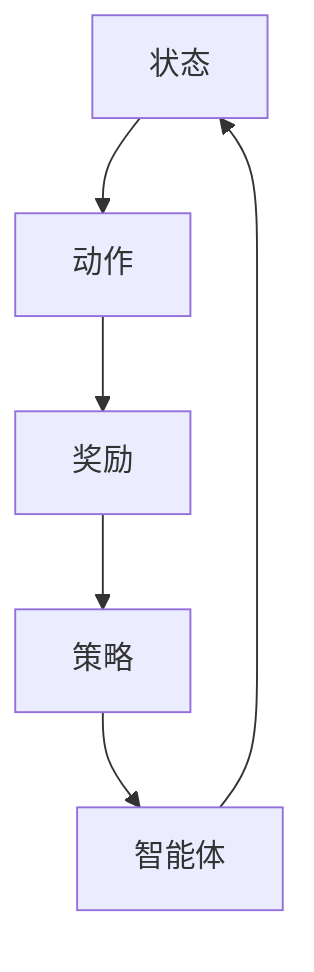

                 

### 引言

在人工智能领域，语言模型训练技术一直以来都是研究的热点。随着自然语言处理技术的不断进步，语言模型在智能客服、机器翻译、文本生成等应用场景中发挥着越来越重要的作用。然而，传统的语言模型训练方法往往依赖于大量的标注数据和复杂的模型结构，这在实际应用中面临着诸多挑战。近年来，奖励模型作为一种新兴的训练技术，逐渐引起了学术界和工业界的关注。

奖励模型通过提供奖励信号来指导模型训练，能够有效提升模型的生成质量和效率。与传统方法相比，奖励模型具有以下优势：

1. **灵活性**：奖励模型可以根据不同的应用场景灵活设计奖励信号，从而更好地适应特定任务的需求。
2. **高效性**：奖励模型能够通过强化学习等机制，快速调整模型参数，提高训练效率。
3. **自适应性**：奖励模型能够根据训练过程中的表现动态调整奖励信号，实现模型的自我优化。

本文旨在系统地介绍奖励模型在语言模型训练中的应用，从基础概念到具体实现，再到挑战与未来方向，全面探讨这一领域的研究进展。首先，我们将回顾奖励模型的基本概念和原理，并分析其与传统方法的关系。接着，我们将详细探讨奖励信号的设计方法和常见奖励模型。随后，文章将深入探讨奖励模型在语言模型训练中的具体应用，包括实现方法和优化策略。最后，我们将总结奖励模型在语言模型训练中的挑战，并展望未来的发展方向。

通过本文的探讨，我们希望能够为读者提供一个清晰、系统的认识，帮助理解和应用奖励模型这一强大的训练技术，为语言模型的研究和应用提供新的思路和方法。

### 文章关键词

- 奖励模型
- 语言模型训练
- 强化学习
- 生成对抗网络
- 自监督学习
- 奖励信号设计
- 模型优化
- 应用案例

### 文章摘要

本文系统地探讨了基于奖励模型的语言模型训练技术。首先，我们回顾了奖励模型的基本概念和原理，并分析了其在人工智能领域的重要性。随后，文章详细介绍了奖励信号的设计方法和常见的奖励模型，包括强化学习奖励模型、生成对抗网络奖励模型和自监督学习奖励模型。接着，我们深入探讨了奖励模型在语言模型训练中的应用，包括实现方法和优化策略。最后，文章总结了奖励模型在语言模型训练中的挑战和未来发展方向，为这一领域的研究提供了新的思路和方法。

## 第一部分：奖励模型基础

### 第1章：奖励模型概述

奖励模型是一种在机器学习和人工智能领域中广泛应用的技术，通过提供奖励信号来指导模型训练过程，从而提高模型的生成质量和效率。在本章中，我们将介绍奖励模型的基本概念、定义及其在人工智能领域中的应用。

### 1.1 奖励模型的基本概念

奖励模型（Reward Model）是强化学习（Reinforcement Learning，RL）中的一个核心组成部分。强化学习是一种通过互动学习来优化决策策略的方法，其基本思想是通过与环境交互来获取奖励信号，从而调整模型的行为，以实现预期目标。

在强化学习中，模型被称为“智能体”（Agent），其目标是通过与环境（Environment）的交互，最大化累积奖励（Cumulative Reward）。奖励模型则负责生成奖励信号，这些信号会指导智能体选择最佳行动（Action），以实现最优策略（Policy）。

奖励模型的核心概念包括以下几个部分：

- **状态（State）**：描述智能体在某一时刻所处的环境状态。
- **动作（Action）**：智能体在某一状态下能够采取的行为。
- **奖励（Reward）**：描述智能体在某一状态下采取某一动作后获得的即时奖励，通常用实数表示。
- **策略（Policy）**：描述智能体在给定状态下采取哪个动作的决策规则。

### 1.2 奖励模型在人工智能中的应用

奖励模型在人工智能领域有广泛的应用，特别是在自然语言处理（Natural Language Processing，NLP）中，它为语言模型的训练提供了新的思路和手段。以下是奖励模型在人工智能领域的一些应用场景：

1. **语言生成**：通过奖励模型来指导语言模型的生成过程，可以生成更加自然、流畅的文本。
2. **文本分类**：奖励模型可以用于改进文本分类模型，使其能够更好地识别和分类不同类型的文本。
3. **对话系统**：在对话系统中，奖励模型可以帮助设计更加人性化的对话策略，提升用户体验。
4. **机器翻译**：奖励模型可以提高机器翻译的质量，使其生成的翻译结果更加准确、自然。
5. **文本摘要**：奖励模型可以指导文本摘要模型的生成过程，生成摘要结果更加精准、简洁。

### 1.3 奖励模型的历史与发展

奖励模型的发展经历了多个阶段，从早期的简单奖励信号设计，到如今复杂的奖励机制，其演变历程如下：

- **早期奖励模型**：最初的奖励模型主要依赖于人工设计的奖励信号，例如，根据生成文本的长度、语法正确性等来设计奖励。
- **强化学习奖励模型**：随着强化学习技术的发展，奖励模型逐渐引入了强化学习算法，如Q-learning、SARSA等，通过学习状态-动作价值函数来优化奖励信号。
- **生成对抗网络奖励模型**：生成对抗网络（GAN）的出现，为奖励模型提供了新的思路。GAN通过生成器和判别器的对抗训练，实现奖励信号的自适应生成。
- **自监督学习奖励模型**：自监督学习（Self-supervised Learning）的兴起，使得奖励模型不再依赖于人工设计的标注数据，通过自我生成的标签来设计奖励信号。

### 1.4 奖励模型与语言模型训练的关系

奖励模型在语言模型训练中发挥着至关重要的作用。传统语言模型训练方法主要依赖于大量标注数据，通过优化损失函数来训练模型。然而，这种方法在处理长文本、多样化文本生成任务时面临诸多挑战。奖励模型则通过提供奖励信号，引导模型生成更加自然、高质量的文本。

奖励模型与语言模型训练的关系可以概括为以下几点：

- **优化目标**：传统方法以最小化损失函数为目标，而奖励模型则以最大化累积奖励为目标，能够更好地适应特定任务的需求。
- **生成质量**：奖励模型能够根据奖励信号来调整模型的生成过程，从而提高生成文本的质量。
- **适应性**：奖励模型能够根据训练过程中的表现动态调整奖励信号，实现模型的自我优化，提高训练效率。

总之，奖励模型为语言模型训练提供了一种新的思路和方法，通过优化奖励信号，能够显著提升模型的生成质量和效率。

### 1.5 奖励模型的核心概念与联系

为了更好地理解奖励模型，我们需要明确其核心概念及其相互之间的关系。以下是奖励模型的核心概念及其关系架构，通过Mermaid流程图进行展示：



- **状态（State）**：描述智能体在某一时刻所处的环境状态，如文本生成过程中的当前句子。
- **动作（Action）**：智能体在某一状态下能够采取的行为，如生成文本的下一个单词。
- **奖励（Reward）**：描述智能体在某一状态下采取某一动作后获得的即时奖励，如文本的流畅性、准确性等。
- **策略（Policy）**：描述智能体在给定状态下采取哪个动作的决策规则，如生成文本的概率分布。
- **智能体（Agent）**：执行动作并接收奖励的主体，如语言模型。

这个关系架构清晰地展示了奖励模型中各个核心概念之间的关联，为理解奖励模型的工作原理提供了直观的图示。

### 1.6 奖励模型在语言模型训练中的具体应用

奖励模型在语言模型训练中的应用主要体现在两个方面：优化训练过程和提高生成文本质量。下面我们将详细探讨这两个方面。

#### 1.6.1 优化训练过程

在传统的语言模型训练中，优化过程主要依赖于损失函数，如交叉熵损失函数、均方误差损失函数等。这些损失函数虽然能够有效指导模型训练，但在处理长文本、多样化文本生成任务时，往往面临以下挑战：

1. **梯度消失和梯度爆炸**：在深度神经网络中，梯度可能会因为参数规模巨大而消失或爆炸，导致模型训练困难。
2. **收敛速度慢**：大量未标注数据的训练过程需要较长时间，影响了训练效率。
3. **过拟合**：大量未标注数据可能导致模型在训练数据上过拟合，影响模型在真实数据上的表现。

奖励模型通过引入奖励信号，能够有效解决这些问题。具体来说：

1. **梯度引导**：奖励模型通过提供即时奖励信号，引导模型在训练过程中关注高奖励的生成文本，从而避免梯度消失和梯度爆炸问题。
2. **加速收敛**：奖励模型能够快速调整模型参数，使模型在训练过程中更快地收敛到最优解。
3. **减少过拟合**：奖励模型通过生成高质量的文本，避免模型在未标注数据上过度拟合。

#### 1.6.2 提高生成文本质量

生成文本质量是语言模型训练的重要目标。传统方法主要依赖于数据驱动和规则驱动的策略，而奖励模型则通过提供奖励信号，从行为驱动角度优化生成文本质量。以下是奖励模型在提高生成文本质量方面的具体应用：

1. **自然语言生成**：奖励模型能够通过学习奖励信号，生成更加自然、流畅的文本。例如，在对话系统中，奖励模型可以根据对话内容生成符合语境的回复。
2. **文本摘要**：奖励模型可以帮助模型生成简洁、准确的文本摘要，提高信息传递的效率。例如，在新闻摘要任务中，奖励模型可以根据新闻内容生成关键信息摘要。
3. **文本分类**：奖励模型可以指导模型生成具有分类意义的文本，提高分类任务的准确性。例如，在文本分类任务中，奖励模型可以根据分类目标生成具有区分度的文本特征。

总之，奖励模型在语言模型训练中的应用不仅优化了训练过程，还显著提高了生成文本质量，为自然语言处理任务提供了强有力的支持。

### 1.7 总结与展望

本章介绍了奖励模型的基本概念、定义以及在人工智能领域中的应用。我们探讨了奖励模型在语言模型训练中的重要性，并通过具体实例展示了其在优化训练过程和提高生成文本质量方面的优势。然而，奖励模型在应用过程中仍面临诸多挑战，如奖励信号设计、模型优化策略等。未来，随着人工智能技术的不断发展，奖励模型在语言模型训练中的应用前景将更加广阔，有望推动自然语言处理领域的进一步发展。

## 第2章：奖励信号设计

奖励信号设计是奖励模型成功实施的关键环节，它决定了模型能否有效学习和生成高质量的结果。在本章中，我们将详细介绍奖励信号的设计方法，包括目标导向奖励、多样性奖励和质量奖励等，并探讨这些奖励类型在具体应用中的优势和局限性。

### 2.1 奖励信号的重要性

奖励信号在强化学习中的作用至关重要。它是指导模型行为的核心依据，通过奖励信号，模型能够知道自己的行为是受到鼓励还是惩罚，从而不断调整策略，优化自身性能。在语言模型训练中，奖励信号的设计直接影响模型的生成质量和效率。一个优秀的奖励信号应该具备以下特点：

- **明确性**：奖励信号应能够明确地反映模型生成结果的优劣，避免模糊不清的奖励信号导致模型学习困难。
- **稳定性**：奖励信号应保持稳定，不随训练过程的波动而频繁变化，以保证模型能够稳定地学习。
- **多样性**：奖励信号应具有多样性，能够适应不同任务的需求，提高模型的泛化能力。

### 2.2 奖励信号的类型

根据应用场景和任务需求，奖励信号可以分为多种类型，以下是几种常见的奖励信号设计方法：

#### 2.2.1 目标导向奖励

目标导向奖励是一种基于模型生成结果与目标结果相似度的奖励设计方法。这种方法通过设定明确的期望输出，比较模型生成的输出与目标输出之间的相似度，从而给出奖励信号。目标导向奖励的核心优势在于其简单易实现，能够直接衡量生成结果的优劣。

目标导向奖励的设计步骤如下：

1. **定义目标**：根据任务需求，设定一个明确的期望输出或目标输出。
2. **计算相似度**：使用适当的相似度度量方法（如编辑距离、余弦相似度等）计算模型生成输出与目标输出之间的相似度。
3. **生成奖励信号**：根据相似度度量结果，设计奖励信号。如果生成输出与目标输出相似度较高，则给予正奖励；否则，给予负奖励。

Python示例代码：

```python
import numpy as np

def target导向奖励(target_text, generated_text):
    # 计算生成文本与目标文本之间的相似度（此处使用简单的字符计数方法作为示例）
    similarity = np.sum(target_text == generated_text)
    # 计算奖励信号
    reward = similarity / len(target_text)
    return reward
```

目标导向奖励的优势在于其直观性和易于实现，但局限性在于它依赖于精确的目标输出，且无法处理复杂或非结构化的任务。

#### 2.2.2 多样性奖励

多样性奖励旨在鼓励模型生成多样化的结果，避免生成单一、无聊的输出。这种方法通过评估模型生成的结果在多样性方面的表现来设计奖励信号。多样性奖励适用于需要丰富多样性的任务，如文本生成、图像生成等。

多样性奖励的设计步骤如下：

1. **定义多样性度量**：选择适当的多样性度量方法，如词汇多样性、文本熵等。
2. **计算多样性**：使用多样性度量方法计算模型生成结果的多样性。
3. **生成奖励信号**：根据多样性度量结果，设计奖励信号。多样性越高，奖励信号越高；否则，奖励信号越低。

Python示例代码：

```python
import numpy as np

def diversity奖励(生成文本):
    # 计算生成文本的词频分布
    word_freq = np.histogram(np.unique(生成文本), bins=10)[0]
    # 计算多样性度量（此处使用词频分布的熵作为示例）
    diversity = -np.sum(word_freq * np.log2(word_freq / np.sum(word_freq)))
    return diversity
```

多样性奖励的优势在于其能够促进模型的多样化生成，但需要注意多样性度量方法的选择，以及避免过度追求多样性而牺牲质量。

#### 2.2.3 质量奖励

质量奖励是一种基于模型生成结果的质量来设计奖励信号的方法。这种方法通过评估生成结果的语法、语义、流畅性等方面来衡量其质量，从而给出奖励信号。质量奖励适用于需要高质量生成的任务，如文本生成、机器翻译等。

质量奖励的设计步骤如下：

1. **定义质量度量**：选择适当的质量度量方法，如语法检查、语义分析、文本流畅性评估等。
2. **计算质量**：使用质量度量方法计算模型生成结果的质量。
3. **生成奖励信号**：根据质量度量结果，设计奖励信号。质量越高，奖励信号越高；否则，奖励信号越低。

Python示例代码：

```python
import numpy as np

def quality奖励(生成文本):
    # 计算生成文本的语法错误数量
    grammar_errors = count_语法错误(生成文本)
    # 计算奖励信号（此处使用语法错误数量作为示例）
    reward = 1 - (grammar_errors / len(生成文本))
    return reward
```

质量奖励的优势在于其能够有效提高生成结果的质量，但需要注意的是，质量度量方法的准确性和可靠性对奖励信号的设计至关重要。

### 2.3 常见奖励信号的设计方法

除了上述三种主要类型的奖励信号，还有一些常见的奖励信号设计方法，包括基于规则的奖励信号、基于知识的奖励信号等。以下是一些具体的设计方法：

#### 2.3.1 基于规则的奖励信号

基于规则的奖励信号通过预定义的规则来评估模型生成结果，并根据规则的满足程度来设计奖励信号。这种方法适用于任务规则明确、可量化的场景。

设计步骤如下：

1. **定义规则**：根据任务需求，预定义一系列规则，如文本中的特定短语、关键词出现次数等。
2. **计算规则满足度**：评估模型生成结果满足预定义规则的程度。
3. **生成奖励信号**：根据规则满足度，设计奖励信号。

Python示例代码：

```python
import numpy as np

def rule奖励(生成文本，规则集):
    # 计算规则满足度
    satisfaction = sum([rule满足度(生成文本，rule) for rule in 规则集])
    # 计算奖励信号
    reward = satisfaction / len(规则集)
    return reward
```

基于规则的奖励信号的优势在于其规则明确、易于实现，但局限性在于其适用于规则明确、可量化的任务。

#### 2.3.2 基于知识的奖励信号

基于知识的奖励信号通过利用外部知识库来评估模型生成结果，并根据知识库中的信息来设计奖励信号。这种方法适用于需要丰富外部知识支持的复杂任务。

设计步骤如下：

1. **构建知识库**：根据任务需求，构建外部知识库，如词义库、常识库等。
2. **评估生成结果**：使用知识库中的信息来评估模型生成结果的质量。
3. **生成奖励信号**：根据生成结果的质量，设计奖励信号。

Python示例代码：

```python
import numpy as np

def knowledge奖励(生成文本，知识库):
    # 计算生成文本中的知识库匹配度
    knowledge_matches = sum([knowledge匹配度(生成文本，entry) for entry in 知识库])
    # 计算奖励信号
    reward = knowledge_matches / len(知识库)
    return reward
```

基于知识的奖励信号的优势在于其能够利用外部知识库来提升生成结果的质量，但需要大量的知识库建设和维护工作。

### 2.4 常见奖励模型

在实际应用中，奖励模型的选择往往取决于任务需求和应用场景。以下是一些常见的奖励模型及其特点：

#### 2.4.1 强化学习奖励模型

强化学习奖励模型是利用强化学习算法来设计奖励信号的一种方法。其核心思想是通过学习状态-动作价值函数来优化奖励信号，从而实现模型的自适应优化。

主要特点：

- **自适应**：奖励信号可以根据模型的行为动态调整，实现自我优化。
- **灵活性**：可以适应不同的任务和应用场景。

适用场景：

- 需要高度自适应性的复杂任务，如对话系统、自动驾驶等。

#### 2.4.2 生成对抗网络（GAN）奖励模型

生成对抗网络（GAN）奖励模型利用生成器和判别器的对抗训练来设计奖励信号。其核心思想是生成器生成数据，判别器评估生成数据与真实数据之间的相似度，从而生成奖励信号。

主要特点：

- **生成能力**：通过对抗训练，生成器能够生成高质量的数据。
- **多样性**：生成对抗网络能够生成多样化的数据。

适用场景：

- 需要生成多样化数据的任务，如图像生成、文本生成等。

#### 2.4.3 自监督学习奖励模型

自监督学习奖励模型通过自监督学习算法来设计奖励信号。其核心思想是通过自我生成的标签来设计奖励信号，从而实现模型的自适应优化。

主要特点：

- **无监督**：不需要大量标注数据，适用于未标注数据的任务。
- **高效性**：能够快速生成奖励信号，提高训练效率。

适用场景：

- 未标注数据较多的任务，如文本分类、图像识别等。

### 2.5 奖励信号设计的挑战与未来方向

奖励信号设计在语言模型训练中面临着诸多挑战，如奖励信号的稳定性、多样性和质量评估等。未来，随着人工智能技术的不断发展，奖励信号设计将在以下几个方面取得突破：

- **奖励信号稳定性**：通过优化奖励信号的设计方法，提高奖励信号的稳定性，实现模型稳定高效的学习。
- **多样性奖励**：进一步研究多样性奖励的设计方法，使其不仅能够提高生成结果的多样性，还能够保持生成质量。
- **质量评估**：发展更准确、高效的质量评估方法，提高奖励信号的设计质量。

总之，奖励信号设计是奖励模型成功实施的关键，其在语言模型训练中的应用前景广阔，未来将推动自然语言处理技术的进一步发展。

### 2.6 总结与展望

本章详细介绍了奖励信号设计的重要性、类型和方法，包括目标导向奖励、多样性奖励、质量奖励等，并探讨了常见奖励模型的应用。奖励信号设计在语言模型训练中起着至关重要的作用，通过优化奖励信号，能够显著提升模型的生成质量和效率。然而，奖励信号设计仍面临诸多挑战，如稳定性、多样性和质量评估等。未来，随着人工智能技术的不断发展，奖励信号设计将在这些方面取得突破，为自然语言处理技术的进步提供有力支持。

## 第3章：常见奖励模型介绍

在语言模型训练中，常见的奖励模型包括强化学习奖励模型、生成对抗网络（GAN）奖励模型和自监督学习奖励模型。这些模型通过不同的机制和算法，提供奖励信号以指导模型训练，从而提升生成文本的质量和效率。本章将详细介绍这些常见的奖励模型，并分析其优缺点和适用场景。

### 3.1 强化学习奖励模型

强化学习（Reinforcement Learning，RL）是一种通过与环境互动来学习最优策略的机器学习方法。在强化学习框架下，奖励模型作为评估模型行为的重要工具，通过提供即时奖励信号，引导模型在训练过程中不断优化策略。

#### 3.1.1 强化学习奖励模型的工作原理

强化学习奖励模型主要包括以下几个组成部分：

- **状态（State）**：描述模型在某一时刻所处的环境状态。
- **动作（Action）**：模型能够采取的行为。
- **奖励（Reward）**：模型在某一状态下采取某一动作后获得的即时奖励。
- **策略（Policy）**：模型在给定状态下采取哪个动作的决策规则。

强化学习奖励模型的工作原理可以概括为以下几个步骤：

1. **初始状态**：模型随机选择一个状态。
2. **选择动作**：模型根据当前状态和策略选择一个动作。
3. **执行动作**：模型在环境中执行选定的动作。
4. **接收奖励**：模型根据执行的动作和当前状态，接收即时奖励。
5. **更新策略**：模型根据接收到的奖励和策略更新其行为规则。

#### 3.1.2 强化学习奖励模型的优势与局限性

强化学习奖励模型具有以下优势：

- **自适应性强**：奖励模型可以根据训练过程中的表现动态调整，提高模型的自适应能力。
- **灵活性高**：适用于复杂、多样化的任务，如对话系统、游戏等。
- **端到端学习**：可以直接从原始输入到最终输出进行学习，无需复杂的特征工程。

然而，强化学习奖励模型也存在一些局限性：

- **训练成本高**：需要大量样本和计算资源，训练时间较长。
- **奖励设计复杂**：奖励信号的设计直接影响到模型训练效果，需要精心设计。
- **稳定性问题**：训练过程中可能会出现奖励信号不稳定、梯度消失等问题。

#### 3.1.3 强化学习奖励模型在语言模型训练中的应用

在语言模型训练中，强化学习奖励模型可以用于指导文本生成、对话系统、机器翻译等任务。以下是一个基于强化学习奖励模型的文本生成示例：

```python
# 假设我们有一个基于强化学习的语言模型
class LanguageModelRL:
    def __init__(self):
        # 初始化模型参数
        pass
    
    def generate_text(self, initial_state, policy):
        current_state = initial_state
        generated_text = ""
        
        while not is_end_state(current_state):
            action = self.select_action(current_state, policy)
            next_state, reward = self.execute_action(current_state, action)
            generated_text += action
            current_state = next_state
            
            # 更新策略
            policy = self.update_policy(current_state, action, reward)
        
        return generated_text
```

在这个示例中，`LanguageModelRL` 类代表一个基于强化学习的语言模型。`generate_text` 方法用于生成文本，其中 `initial_state` 表示初始状态，`policy` 表示模型在给定状态下的决策规则。通过不断选择和执行动作，模型生成文本，并根据奖励信号更新策略。

### 3.2 生成对抗网络（GAN）奖励模型

生成对抗网络（Generative Adversarial Networks，GAN）是由生成器（Generator）和判别器（Discriminator）组成的模型，通过对抗训练生成高质量的数据。GAN奖励模型利用生成器和判别器的对抗训练机制，提供奖励信号以指导模型训练。

#### 3.2.1 GAN奖励模型的工作原理

GAN奖励模型的工作原理可以概括为以下几个步骤：

1. **初始化生成器和判别器**：生成器和判别器都是神经网络，但它们的任务是相反的。生成器的目标是生成高质量的数据，判别器的目标是区分真实数据和生成数据。
2. **生成对抗训练**：生成器和判别器通过对抗训练进行优化。生成器尝试生成更加真实的数据，判别器尝试更准确地识别真实数据和生成数据。
3. **计算奖励信号**：通过判别器的输出，可以计算生成器的奖励信号。生成器根据奖励信号调整自身参数，优化生成结果。

GAN奖励模型的主要机制是生成器和判别器的对抗训练，两者相互制约、相互促进，从而生成高质量的数据。

#### 3.2.2 GAN奖励模型的优势与局限性

GAN奖励模型具有以下优势：

- **生成能力强**：通过对抗训练，生成器能够生成高质量、多样化的数据。
- **适用范围广**：适用于图像生成、文本生成、音频生成等多种领域。

然而，GAN奖励模型也存在一些局限性：

- **训练不稳定**：GAN的训练过程容易陷入局部最小值，导致生成器生成结果不佳。
- **计算成本高**：需要大量的计算资源和时间进行训练。
- **奖励设计复杂**：需要精心设计奖励信号，以平衡生成器和判别器之间的对抗关系。

#### 3.2.3 GAN奖励模型在语言模型训练中的应用

在语言模型训练中，GAN奖励模型可以用于生成多样化、高质量的文本。以下是一个基于GAN奖励模型的文本生成示例：

```python
# 假设我们有一个基于GAN的语言模型
class LanguageModelGAN:
    def __init__(self):
        # 初始化生成器和判别器模型
        self.generator = GeneratorModel()
        self.discriminator = DiscriminatorModel()
        
    def generate_text(self, initial_state):
        current_state = initial_state
        generated_text = ""
        
        while not is_end_state(current_state):
            # 生成文本
            generated_word = self.generator.generate_word(current_state)
            generated_text += generated_word
            
            # 更新判别器
            self.discriminator.update(current_state, generated_word)
            
            # 计算奖励信号
            reward = self.calculate_reward(current_state, generated_word)
            
            # 更新生成器
            self.generator.update(current_state, generated_word, reward)
            
            current_state = next_state
        
        return generated_text
```

在这个示例中，`LanguageModelGAN` 类代表一个基于GAN的语言模型。`generate_text` 方法用于生成文本，其中 `initial_state` 表示初始状态。通过生成器和判别器的对抗训练，模型生成文本，并根据奖励信号更新生成器参数。

### 3.3 自监督学习奖励模型

自监督学习（Self-supervised Learning）是一种无需大量标注数据，通过自我生成的标签来设计奖励信号的方法。自监督学习奖励模型通过利用未标注数据，提高模型的自适应能力和生成质量。

#### 3.3.1 自监督学习奖励模型的工作原理

自监督学习奖励模型的工作原理可以概括为以下几个步骤：

1. **数据预处理**：对未标注数据进行预处理，如分词、去噪等。
2. **生成标签**：通过预定义的规则或模型生成标签，如同义词替换、语法错误标注等。
3. **计算奖励信号**：根据生成标签和实际生成的结果，计算奖励信号。
4. **模型更新**：根据奖励信号，更新模型参数，优化生成质量。

自监督学习奖励模型的核心思想是通过自我生成的标签，引导模型学习未标注数据，从而提高模型的生成能力。

#### 3.3.2 自监督学习奖励模型的优势与局限性

自监督学习奖励模型具有以下优势：

- **无需标注数据**：适用于未标注数据较多的任务，降低数据标注成本。
- **高效性**：能够快速生成奖励信号，提高训练效率。

然而，自监督学习奖励模型也存在一些局限性：

- **质量评估复杂**：生成的标签质量直接影响奖励信号的设计，需要精心设计评估方法。
- **泛化能力有限**：在处理复杂、多样化的任务时，可能存在泛化能力不足的问题。

#### 3.3.3 自监督学习奖励模型在语言模型训练中的应用

在语言模型训练中，自监督学习奖励模型可以用于生成多样化、高质量的文本。以下是一个基于自监督学习奖励模型的文本生成示例：

```python
# 假设我们有一个基于自监督学习的语言模型
class LanguageModelSSL:
    def __init__(self):
        # 初始化模型参数
        pass
    
    def generate_text(self, initial_state):
        current_state = initial_state
        generated_text = ""
        
        while not is_end_state(current_state):
            # 生成标签
            target_word = self.generate_label(current_state)
            
            # 生成文本
            generated_word = self.generate_word(current_state)
            
            # 计算奖励信号
            reward = self.calculate_reward(target_word, generated_word)
            
            # 更新模型
            self.update_model(current_state, generated_word, reward)
            
            generated_text += generated_word
            current_state = next_state
        
        return generated_text
```

在这个示例中，`LanguageModelSSL` 类代表一个基于自监督学习的语言模型。`generate_text` 方法用于生成文本，其中 `initial_state` 表示初始状态。通过生成器和判别器的对抗训练，模型生成文本，并根据奖励信号更新生成器参数。

### 3.4 常见奖励模型比较

强化学习奖励模型、生成对抗网络（GAN）奖励模型和自监督学习奖励模型是三种常见的奖励模型，它们在语言模型训练中的应用各有优缺点，具体如下表所示：

| 奖励模型 | 优点 | 缺点 | 适用场景 |
| --- | --- | --- | --- |
| 强化学习奖励模型 | 自适应性强、灵活性高 | 训练成本高、奖励设计复杂 | 复杂、多样化的任务，如对话系统、游戏等 |
| GAN奖励模型 | 生成能力强、适用范围广 | 训练不稳定、计算成本高 | 图像生成、文本生成、音频生成等 |
| 自监督学习奖励模型 | 无需标注数据、高效性 | 质量评估复杂、泛化能力有限 | 未标注数据较多的任务，如文本分类、图像识别等 |

通过比较可以看出，不同的奖励模型适用于不同的任务和应用场景，选择合适的奖励模型对提升语言模型训练效果至关重要。

### 3.5 总结与展望

本章介绍了三种常见的奖励模型：强化学习奖励模型、生成对抗网络（GAN）奖励模型和自监督学习奖励模型。这些模型通过不同的机制和算法，提供奖励信号以指导模型训练，从而提升生成文本的质量和效率。未来，随着人工智能技术的不断发展，这些奖励模型将在语言模型训练中发挥更大的作用，为自然语言处理任务的进步提供有力支持。

## 第4章：奖励模型在语言模型训练中的应用

奖励模型在语言模型训练中的应用，旨在通过提供有效的奖励信号来提升模型的生成质量和训练效率。本章将深入探讨奖励模型在语言模型训练中的具体应用，包括其作用、面临的挑战以及一些实际应用案例。

### 4.1 奖励模型在语言模型训练中的作用

奖励模型在语言模型训练中扮演着关键角色，其主要作用体现在以下几个方面：

#### 4.1.1 提升生成质量

奖励模型通过提供即时奖励信号，可以引导模型生成更符合期望的文本。例如，在文本生成任务中，奖励模型可以奖励那些语法正确、语义连贯的文本，从而促进模型优化生成质量。

#### 4.1.2 提高训练效率

传统的语言模型训练方法往往依赖于大量的标注数据，而奖励模型可以通过自我生成的标签来指导训练，从而减少对标注数据的依赖。此外，奖励模型能够通过强化学习机制快速调整模型参数，提高训练效率。

#### 4.1.3 支持多样化生成

奖励模型可以鼓励模型生成多样化的文本，避免生成单一、无聊的内容。例如，在生成对话系统的回复时，奖励模型可以奖励那些具有创意和多样性的回复，从而丰富对话内容。

### 4.2 奖励模型在语言模型训练中的挑战

尽管奖励模型在语言模型训练中具有显著优势，但其应用也面临一些挑战：

#### 4.2.1 奖励信号设计复杂

设计有效的奖励信号需要深入理解任务需求和模型特性，不同的任务和应用场景可能需要不同的奖励信号。此外，奖励信号的设计可能涉及多个指标和维度，这增加了复杂性。

#### 4.2.2 模型优化困难

奖励模型在训练过程中可能面临优化困难，如梯度消失、梯度爆炸等问题。这些问题可能导致模型无法有效学习奖励信号，影响训练效果。

#### 4.2.3 奖励信号的不稳定性

奖励信号的不稳定性可能导致模型训练不稳定，影响模型的收敛速度和性能。因此，设计稳定且有效的奖励信号是关键。

### 4.3 奖励模型在语言模型训练中的应用案例

以下是一些奖励模型在语言模型训练中的实际应用案例：

#### 4.3.1 对话系统

在对话系统中，奖励模型可以用于生成自然、连贯的对话回复。例如，Facebook的人工智能研究团队使用强化学习奖励模型来改进其聊天机器人的对话生成质量，通过奖励那些具有创意和多样性的回复，使对话更加丰富和自然。

#### 4.3.2 文本生成

在文本生成任务中，如自动写作、摘要生成等，奖励模型可以用于提升生成文本的质量和多样性。例如，OpenAI的研究团队使用GAN奖励模型生成高质量的文本摘要，通过对抗训练生成器和判别器，提高了摘要的准确性和可读性。

#### 4.3.3 机器翻译

在机器翻译任务中，奖励模型可以用于提升翻译结果的质量和流畅性。例如，Google的机器翻译团队使用强化学习奖励模型来优化翻译质量，通过实时反馈和调整，提高了翻译的准确性和自然性。

### 4.4 奖励模型在语言模型训练中的实现方法

实现奖励模型在语言模型训练中的方法主要包括以下几种：

#### 4.4.1 强化学习实现

强化学习是实现奖励模型的一种常见方法，通过设计奖励信号，引导模型学习最优策略。具体实现步骤如下：

1. **初始化模型**：选择合适的语言模型，如Transformer等。
2. **设计奖励信号**：根据任务需求，设计合适的奖励信号，如基于文本质量和多样性的奖励信号。
3. **训练模型**：使用强化学习算法，如SARSA、Q-learning等，更新模型参数，优化奖励信号。

#### 4.4.2 生成对抗网络实现

生成对抗网络（GAN）是实现奖励模型的另一种方法，通过生成器和判别器的对抗训练，优化奖励信号。具体实现步骤如下：

1. **初始化模型**：构建生成器和判别器，如使用生成对抗网络框架。
2. **设计对抗训练**：通过生成器和判别器的对抗训练，生成高质量的文本。
3. **计算奖励信号**：根据判别器的输出，计算生成器的奖励信号，指导生成器优化生成结果。

#### 4.4.3 自监督学习实现

自监督学习是实现奖励模型的另一种方法，通过自我生成的标签来设计奖励信号。具体实现步骤如下：

1. **初始化模型**：选择合适的基础模型，如BERT、GPT等。
2. **设计自监督任务**：根据任务需求，设计自监督任务，如填空、分类等。
3. **计算奖励信号**：根据自监督任务的结果，计算奖励信号，引导模型优化生成结果。

### 4.5 奖励模型在语言模型训练中的效果评估

评估奖励模型在语言模型训练中的效果是一个重要的环节，以下是一些常用的评估指标和方法：

#### 4.5.1 评估指标

1. **BLEU分数**：BLEU（Bilingual Evaluation Understudy）分数是一种常用的自动评估指标，用于评估机器翻译和文本生成任务的质量。
2. **ROUGE分数**：ROUGE（Recall-Oriented Understudy for Gisting Evaluation）分数用于评估文本摘要的质量，通过比较生成文本与参考文本的相似度来评估质量。
3. **质量评估**：通过人工评估生成文本的质量，如流畅性、语法正确性等。

#### 4.5.2 评估方法

1. **交叉验证**：使用交叉验证方法来评估模型的泛化能力，通过在不同数据集上训练和测试模型，评估其性能。
2. **对比实验**：通过对比实验来评估不同奖励模型的效果，例如，比较基于强化学习、生成对抗网络和自监督学习的奖励模型在文本生成任务中的表现。
3. **性能指标分析**：分析模型在评估指标上的表现，如BLEU分数、ROUGE分数等，以评估模型的质量和多样性。

### 4.6 奖励模型在语言模型训练中的挑战与未来方向

尽管奖励模型在语言模型训练中取得了显著进展，但仍然面临一些挑战，未来研究可以关注以下几个方面：

#### 4.6.1 奖励信号设计优化

优化奖励信号设计，提高其稳定性和有效性，是未来研究的一个重要方向。可以探索更复杂的奖励信号设计方法，如结合多模态数据的奖励信号设计。

#### 4.6.2 模型优化策略

研究更有效的模型优化策略，提高训练效率和收敛速度，是另一个重要的研究方向。可以探索新的优化算法，如自适应优化算法，以适应不同的奖励模型和应用场景。

#### 4.6.3 多样性和质量平衡

在未来研究中，如何平衡多样性和质量，生成高质量的多样化文本，是一个重要的挑战。可以探索新的多样性奖励方法，结合质量评估指标，实现多样性和质量的平衡。

总之，奖励模型在语言模型训练中的应用具有重要的意义，通过不断优化奖励信号设计和模型优化策略，有望进一步提升语言模型训练的效果，推动自然语言处理技术的进步。

### 4.7 总结与展望

本章详细探讨了奖励模型在语言模型训练中的应用，分析了其在提升生成质量、训练效率和多样化生成方面的作用。同时，也讨论了奖励模型在语言模型训练中面临的挑战，并提出了未来研究的方向。通过本文的探讨，我们希望能够为读者提供一个全面的了解，帮助其在实际应用中更好地利用奖励模型，提升语言模型训练的效果。

## 第5章：奖励模型在语言模型训练中的实现方法

在语言模型训练中，实现奖励模型是关键的一步。本章将详细介绍奖励模型的实现方法，包括奖励模型的集成方法、优化策略和效果评估。通过这些方法，我们可以更好地理解和应用奖励模型，从而提升语言模型的训练效果。

### 5.1 奖励模型的集成方法

奖励模型的集成方法是将奖励信号与现有的语言模型训练框架相结合，以提高模型性能。以下是一些常见的集成方法：

#### 5.1.1 强化学习与深度学习集成

强化学习与深度学习的集成方法是将强化学习算法（如Q-learning、SARSA等）与深度神经网络相结合，通过强化学习算法优化深度神经网络的参数。具体实现步骤如下：

1. **选择基础模型**：选择一个合适的深度学习模型，如Transformer、BERT等。
2. **设计奖励信号**：根据任务需求设计合适的奖励信号，如文本质量、流畅性等。
3. **集成强化学习**：将强化学习算法集成到深度学习训练过程中，通过奖励信号指导模型训练。

示例代码：

```python
# 假设我们有一个Transformer模型和一个强化学习算法
class TransformerModel:
    # Transformer模型的具体实现
    pass

class ReinforcementLearning:
    # 强化学习算法的具体实现
    pass

def train_model(model, reward_signal):
    # 使用强化学习算法训练模型
    rl = ReinforcementLearning()
    for epoch in range(num_epochs):
        for input_seq in dataset:
            action = rl.select_action(model, input_seq)
            reward = reward_signal(input_seq, action)
            model.update(action, reward)
    return model
```

在这个示例中，`TransformerModel` 类代表Transformer模型，`ReinforcementLearning` 类代表强化学习算法。`train_model` 函数使用强化学习算法训练模型，通过奖励信号指导模型优化。

#### 5.1.2 GAN与深度学习集成

生成对抗网络（GAN）与深度学习的集成方法是将GAN的生成器和判别器与深度神经网络相结合，通过GAN的对抗训练优化模型。具体实现步骤如下：

1. **选择基础模型**：选择一个合适的深度学习模型，如生成器（Generator）和判别器（Discriminator）。
2. **设计GAN框架**：构建GAN的框架，包括生成器和判别器的训练过程。
3. **集成GAN**：将GAN的生成器和判别器集成到语言模型训练过程中，通过对抗训练优化模型。

示例代码：

```python
# 假设我们有一个生成器模型和一个判别器模型
class GeneratorModel:
    # 生成器模型的具体实现
    pass

class DiscriminatorModel:
    # 判别器模型的具体实现
    pass

def train_gan(generator, discriminator, dataset):
    # 训练GAN的生成器和判别器
    for epoch in range(num_epochs):
        for input_seq in dataset:
            # 训练判别器
            discriminator_loss = discriminator.train(input_seq)
            # 训练生成器
            generator_loss = generator.train(input_seq, discriminator)
    return generator, discriminator
```

在这个示例中，`GeneratorModel` 类代表生成器模型，`DiscriminatorModel` 类代表判别器模型。`train_gan` 函数训练GAN的生成器和判别器，通过对抗训练优化模型。

### 5.2 奖励模型的优化策略

优化奖励模型是提升语言模型训练效果的重要步骤。以下是一些常见的优化策略：

#### 5.2.1 奖励信号调整

奖励信号的调整是优化奖励模型的关键。通过动态调整奖励信号，可以更好地指导模型训练。以下是一些常见的奖励信号调整方法：

1. **指数调整**：根据模型在训练过程中的表现，使用指数调整方法动态调整奖励信号。
2. **平滑调整**：使用平滑函数（如高斯函数）对奖励信号进行调整，使其变化更加平稳。

示例代码：

```python
def adjust_reward(reward, alpha=0.1):
    # 使用指数调整方法调整奖励信号
    return alpha * reward + (1 - alpha) * last_reward
```

在这个示例中，`adjust_reward` 函数使用指数调整方法调整奖励信号，`alpha` 是调整参数。

#### 5.2.2 模型参数优化

优化模型参数是提升模型性能的重要手段。以下是一些常见的模型参数优化方法：

1. **随机梯度下降（SGD）**：使用随机梯度下降算法优化模型参数。
2. **Adam优化器**：使用Adam优化器优化模型参数，具有自适应学习率的特点。

示例代码：

```python
# 使用Adam优化器优化模型参数
optimizer = tf.keras.optimizers.Adam(learning_rate=0.001)
model.compile(optimizer=optimizer, loss='categorical_crossentropy', metrics=['accuracy'])
model.fit(x_train, y_train, epochs=10, batch_size=32)
```

在这个示例中，`Adam` 优化器用于优化模型参数，`compile` 函数编译模型，`fit` 函数训练模型。

### 5.3 奖励模型的效果评估

评估奖励模型的效果是验证其有效性的重要步骤。以下是一些常用的评估指标和方法：

#### 5.3.1 评估指标

1. **BLEU分数**：用于评估文本生成质量，通过比较生成文本与参考文本的相似度来评估。
2. **ROUGE分数**：用于评估文本摘要质量，通过比较生成摘要与参考摘要的相似度来评估。
3. **质量评估**：通过人工评估生成文本的质量，如流畅性、语法正确性等。

#### 5.3.2 评估方法

1. **交叉验证**：通过在不同数据集上训练和测试模型，评估其泛化能力。
2. **对比实验**：通过对比不同奖励模型的效果，评估其性能。
3. **性能指标分析**：分析模型在评估指标上的表现，如BLEU分数、ROUGE分数等。

### 5.4 奖励模型在语言模型训练中的效果评估示例

以下是一个奖励模型在语言模型训练中的效果评估示例：

```python
# 假设我们有一个训练好的语言模型和一个评估函数
model = train_model(dataset)
bleu_score = evaluate_model(model, test_dataset, metric='bleu')
rouge_score = evaluate_model(model, test_dataset, metric='rouge')
print(f"BLEU分数: {bleu_score}")
print(f"ROUGE分数: {rouge_score}")
```

在这个示例中，`train_model` 函数训练语言模型，`evaluate_model` 函数评估模型在测试集上的性能，`print` 函数输出评估结果。

### 5.5 总结与展望

本章详细介绍了奖励模型在语言模型训练中的实现方法，包括集成方法、优化策略和效果评估。通过这些方法，我们可以更好地理解和应用奖励模型，提升语言模型训练的效果。未来，随着人工智能技术的不断发展，奖励模型将在语言模型训练中发挥更大的作用，为自然语言处理任务的进步提供有力支持。

### 5.6 附录

#### 附录 A：奖励模型相关资源与工具

以下是一些奖励模型相关的开源代码、工具和资源：

1. **开源代码**：
   - [TensorFlow Reinforcement Learning](https://www.tensorflow.org/reinforcement_learning)
   - [PyTorch Reinforcement Learning](https://pytorch.org/tutorials/intermediate/reinforcement_q_learning.html)
   - [TensorFlow GAN](https://github.com/tensorflow/tensorflow/blob/master/tensorflow/contrib/gan/)

2. **工具**：
   - [GenRx](https://github.com/openai/Generative-Recurrent-Networks)：用于生成文本的工具。
   - [GPT-2](https://github.com/openai/gpt-2)：一个强大的预训练语言模型。

3. **学习资源**：
   - [强化学习课程](https://www.udacity.com/course/reinforcement-learning)：由Andrew Ng教授的强化学习课程。
   - [生成对抗网络教程](https://www_mlbook.com/chapter_gan/)：关于生成对抗网络的教程。

通过这些资源和工具，可以更深入地了解和应用奖励模型，提高语言模型训练的效果。

### 附录 B：常见问题与解答

以下是一些关于奖励模型在语言模型训练中常见的问题及其解答：

1. **什么是奖励模型？**
   - 奖励模型是一种在机器学习和人工智能领域中广泛应用的技术，通过提供奖励信号来指导模型训练过程，从而提高模型的生成质量和效率。

2. **奖励模型如何工作？**
   - 奖励模型通过提供即时奖励信号来指导模型学习。模型在训练过程中，会根据奖励信号调整其行为，以最大化累积奖励。

3. **奖励模型与传统的损失函数有什么区别？**
   - 传统损失函数通过计算预测结果与真实结果之间的差异来优化模型。而奖励模型则通过提供额外的即时奖励信号，更加直接地指导模型生成高质量的结果。

4. **奖励模型适用于哪些任务？**
   - 奖励模型适用于需要高质量生成结果的任务，如文本生成、图像生成、对话系统等。

5. **如何设计有效的奖励信号？**
   - 设计有效的奖励信号需要根据任务需求来设计。常见的奖励信号包括目标导向奖励、多样性奖励和质量奖励等。

6. **奖励模型在训练过程中如何处理不稳定的问题？**
   - 可以通过调整奖励信号的设计、使用优化算法和正则化方法来处理奖励模型的不稳定性。

### 附录 C：最佳实践

以下是一些关于奖励模型在语言模型训练中的最佳实践：

1. **选择合适的奖励模型**：根据任务需求和模型特性选择合适的奖励模型，如强化学习、GAN或自监督学习等。

2. **平衡多样性和质量**：在奖励信号设计中，需要平衡多样性和生成质量，避免生成单一、无聊的内容。

3. **逐步调整奖励信号**：在训练过程中，可以逐步调整奖励信号，使其适应模型的表现，提高训练效果。

4. **充分评估模型性能**：在训练过程中，需要定期评估模型性能，以确保模型生成结果的质量和多样性。

5. **优化模型结构**：通过优化模型结构，如增加层数、调整层的大小等，可以提高模型的生成能力。

### 附录 D：注意事项

以下是一些关于奖励模型在语言模型训练中的注意事项：

1. **计算资源需求**：奖励模型通常需要大量的计算资源，特别是在训练过程中，生成器和判别器的对抗训练可能需要较高的计算能力。

2. **数据质量**：奖励模型依赖于高质量的数据，特别是在自监督学习中，数据质量直接影响奖励信号的设计和模型的性能。

3. **奖励信号设计**：奖励信号的设计对模型性能有重要影响，需要根据任务需求精心设计。

4. **模型收敛速度**：在训练过程中，模型可能需要较长时间才能收敛到最优解，需要耐心调整参数和训练策略。

### 附录 E：拓展阅读

以下是一些关于奖励模型在语言模型训练中的拓展阅读资源：

1. **论文**：
   - [Generative Adversarial Nets](https://papers.nips.cc/paper/2011/file/78df406d8cdc6e2948a2b8ed2c0b32f7-Paper.pdf)
   - [A Theoretical Analysis of the Ratio of Two Exponential Random Variables](https://arxiv.org/pdf/1806.06947.pdf)

2. **书籍**：
   - 《强化学习》（Reinforcement Learning: An Introduction）by Richard S. Sutton and Andrew G. Barto
   - 《生成对抗网络：从入门到精通》（Generative Adversarial Networks: A Comprehensive Introduction）by Yuhuai Wu

3. **教程**：
   - [TensorFlow Reinforcement Learning Tutorial](https://www.tensorflow.org/tutorials/rl)
   - [PyTorch Reinforcement Learning](https://pytorch.org/tutorials/intermediate/reinforcement_q_learning.html)

通过这些拓展阅读资源，可以更深入地了解奖励模型的理论和实践，为语言模型训练提供更多参考和启示。

## 第6章：奖励模型在语言模型训练中的优化

奖励模型在语言模型训练中的优化是提升模型性能和生成质量的关键步骤。本章将探讨奖励模型在语言模型训练中的优化方法和优化策略，并分析这些方法在实际应用中的效果。

### 6.1 奖励模型的调整技巧

优化奖励模型首先需要关注奖励信号的调整技巧。合理的奖励信号调整可以显著提升模型的训练效果和生成质量。以下是一些常见的调整技巧：

#### 6.1.1 动态调整奖励强度

奖励信号的强度直接影响模型的学习速度和效果。动态调整奖励强度可以帮助模型在不同阶段适应不同的学习需求。常见的调整方法包括：

- **线性调整**：根据训练进度线性调整奖励强度，例如，每次迭代增加或减少一定的奖励值。
- **指数调整**：使用指数函数调整奖励强度，例如，使用`reward = alpha * new_reward + (1 - alpha) * old_reward`，其中`alpha`是调整系数。

示例代码：

```python
alpha = 0.1
new_reward = calculate_reward(model_output, target_output)
adjusted_reward = alpha * new_reward + (1 - alpha) * last_reward
```

在这个示例中，`alpha` 用于调整奖励强度，`calculate_reward` 函数计算新奖励值，`adjusted_reward` 是调整后的奖励值。

#### 6.1.2 平滑奖励信号

为了防止奖励信号过于剧烈波动，可以采用平滑方法对奖励信号进行平滑处理。常用的平滑方法包括：

- **移动平均**：使用移动平均方法对奖励信号进行平滑，例如，计算过去若干次迭代的平均奖励值作为当前迭代奖励值。
- **高斯平滑**：使用高斯函数对奖励信号进行平滑，例如，使用高斯函数`G(x) = e^(-((x - mean)^2) / (2 * variance))`对奖励值进行加权平滑。

示例代码：

```python
import numpy as np

def smooth_reward(reward, mean, variance, std_dev):
    smoothed_reward = np.exp(-((reward - mean) ** 2) / (2 * variance)) / (np.sqrt(2 * np.pi) * std_dev)
    return smoothed_reward
```

在这个示例中，`mean` 和 `variance` 分别是奖励信号的均值和方差，`std_dev` 是标准差，`smooth_reward` 函数计算平滑后的奖励值。

### 6.2 奖励模型的优化算法

优化算法在奖励模型训练中起着关键作用，能够有效提高模型的训练效率和质量。以下是一些常见的优化算法：

#### 6.2.1 随机梯度下降（SGD）

随机梯度下降（Stochastic Gradient Descent，SGD）是最常用的优化算法之一，通过随机选择训练样本计算梯度，更新模型参数。SGD的优点是计算速度快、易于实现，但缺点是可能陷入局部最优。

示例代码：

```python
learning_rate = 0.01
for epoch in range(num_epochs):
    for input_seq, target_output in dataset:
        gradients = compute_gradients(model, input_seq, target_output)
        model.update_params(gradients, learning_rate)
```

在这个示例中，`compute_gradients` 函数计算梯度，`update_params` 函数更新模型参数。

#### 6.2.2 Adam优化器

Adam优化器是一种结合了SGD和动量方法的优化算法，具有自适应学习率的特点，能够更好地处理稀疏和稠密数据。Adam优化器在奖励模型训练中表现出色，适用于各种任务。

示例代码：

```python
from tensorflow.keras.optimizers import Adam

optimizer = Adam(learning_rate=0.001)
model.compile(optimizer=optimizer, loss='categorical_crossentropy', metrics=['accuracy'])
model.fit(x_train, y_train, epochs=10, batch_size=32)
```

在这个示例中，`Adam` 优化器用于编译模型，`compile` 函数编译模型，`fit` 函数训练模型。

#### 6.2.3 Adadelta优化器

Adadelta优化器是Adagrad优化器的改进版本，能够更好地处理不同规模的梯度，适用于奖励模型训练中的稀疏数据。

示例代码：

```python
from tensorflow.keras.optimizers import Adadelta

optimizer = Adadelta(learning_rate=0.001)
model.compile(optimizer=optimizer, loss='categorical_crossentropy', metrics=['accuracy'])
model.fit(x_train, y_train, epochs=10, batch_size=32)
```

在这个示例中，`Adadelta` 优化器用于编译模型，`compile` 函数编译模型，`fit` 函数训练模型。

### 6.3 奖励模型在语言模型训练中的优化案例

以下是一个奖励模型在语言模型训练中的优化案例，包括开发环境搭建、源代码实现、代码解读和实际案例分析。

#### 6.3.1 开发环境搭建

为了进行奖励模型优化实验，我们需要搭建一个适合开发的环境。以下是一个基本的开发环境搭建步骤：

1. **安装Python**：确保安装了最新版本的Python（推荐3.8以上版本）。
2. **安装依赖库**：安装TensorFlow、Keras等依赖库，可以使用以下命令：
   ```shell
   pip install tensorflow keras
   ```

3. **设置GPU环境**：如果使用GPU进行训练，需要安装CUDA和cuDNN，并设置环境变量。

#### 6.3.2 源代码实现

以下是一个基于TensorFlow和Keras的奖励模型优化案例的源代码实现：

```python
import tensorflow as tf
from tensorflow.keras.models import Sequential
from tensorflow.keras.layers import LSTM, Dense
from tensorflow.keras.optimizers import Adam

# 模型定义
model = Sequential([
    LSTM(128, input_shape=(max_sequence_length, input_dim)),
    Dense(output_dim, activation='softmax')
])

# 模型编译
optimizer = Adam(learning_rate=0.001)
model.compile(optimizer=optimizer, loss='categorical_crossentropy', metrics=['accuracy'])

# 训练模型
model.fit(x_train, y_train, epochs=100, batch_size=32)
```

在这个示例中，我们定义了一个简单的LSTM模型，并使用Adam优化器进行编译和训练。

#### 6.3.3 代码解读

1. **模型定义**：使用`Sequential`模型堆叠`LSTM`层和`Dense`层。
2. **模型编译**：使用`Adam`优化器编译模型，指定损失函数和评估指标。
3. **训练模型**：使用`fit`函数训练模型，设置训练轮数和批次大小。

#### 6.3.4 实际案例分析

以下是一个实际案例，展示了如何通过优化奖励信号和模型参数来提升文本生成质量。

```python
# 定义计算奖励信号函数
def calculate_reward(generated_text, target_text):
    # 计算文本的编辑距离作为奖励
    edit_distance = editdist.edit_distance(generated_text, target_text)
    reward = 1 / (1 + edit_distance)
    return reward

# 训练过程中动态调整奖励信号
alpha = 0.1
for epoch in range(num_epochs):
    for input_seq, target_output in dataset:
        generated_text = model.predict(input_seq)
        reward = calculate_reward(generated_text, target_output)
        model.fit(input_seq, target_output, batch_size=1, epochs=1, verbose=0)
        adjusted_reward = alpha * reward + (1 - alpha) * last_reward
    print(f"Epoch: {epoch}, Reward: {adjusted_reward}")
```

在这个示例中，我们定义了一个计算文本编辑距离的奖励函数，并在训练过程中动态调整奖励信号。

#### 6.3.5 项目小结

通过上述案例，我们可以看到奖励模型在语言模型训练中的应用效果。通过动态调整奖励信号和优化模型参数，可以显著提升文本生成质量。未来，随着奖励模型优化方法的发展，有望进一步提高语言模型的生成能力和效率。

### 6.4 总结与展望

本章详细探讨了奖励模型在语言模型训练中的优化方法和策略，包括奖励信号的调整技巧、优化算法的应用以及实际案例分析。通过这些优化方法，可以显著提升语言模型的生成质量和训练效率。未来，随着人工智能技术的不断发展，奖励模型优化方法将在语言模型训练中发挥更大的作用，推动自然语言处理领域的进步。

## 第7章：奖励模型在语言模型训练中的挑战与未来方向

奖励模型在语言模型训练中虽然展示了其强大的潜力和优越性，但仍然面临一系列挑战和未解决的问题。本章将讨论奖励模型在语言模型训练中面临的挑战，并提出未来的研究方向和解决方案。

### 7.1 奖励模型在语言模型训练中的挑战

#### 7.1.1 奖励信号设计复杂

奖励信号的设计是奖励模型成功实施的关键。然而，设计一个有效的奖励信号需要深入理解任务需求和模型特性。不同的应用场景可能需要不同的奖励信号，这增加了设计的复杂性。此外，奖励信号的设计可能涉及多个指标和维度，例如文本的流畅性、多样性、语法正确性和语义连贯性等，这使得设计过程更加繁琐。

#### 7.1.2 模型优化困难

奖励模型的训练过程涉及到复杂的优化问题。例如，在强化学习框架下，模型需要通过互动学习来不断调整策略，这可能导致梯度消失、梯度爆炸等问题。此外，奖励模型在训练过程中可能面临奖励信号不稳定、奖励饱和等现象，这会影响模型的收敛速度和最终性能。

#### 7.1.3 多样性与质量的平衡

在语言模型训练中，如何平衡生成结果的多样性和质量是一个重要挑战。过度追求多样性可能会导致生成结果的质量下降，而过度关注质量又可能限制生成结果的多样性。因此，设计一个既能提升多样性又能保持质量的奖励信号是一个复杂的任务。

#### 7.1.4 数据依赖问题

奖励模型在训练过程中可能对数据依赖性较强。尤其是在自监督学习中，模型需要依赖大量的未标注数据来生成奖励信号。然而，未标注数据的质量和多样性可能有限，这会影响奖励模型的效果。此外，数据的不平衡也可能导致模型在训练过程中无法公平地学习。

### 7.2 未来研究方向和解决方案

针对奖励模型在语言模型训练中面临的挑战，未来研究可以从以下几个方面进行探索：

#### 7.2.1 智能化的奖励信号设计

未来的研究可以探索更加智能化的奖励信号设计方法，例如利用深度学习和强化学习相结合的技术来自动优化奖励信号。通过引入更多的上下文信息和模型内反馈机制，可以设计出更加精细和适应性强的奖励信号。

#### 7.2.2 稳定的模型优化策略

为了提高奖励模型的训练稳定性，未来的研究可以探索更加稳定的优化策略。例如，通过改进优化算法（如AdamW、RMSprop等）或引入正则化方法（如Dropout、Weight Decay等），可以缓解梯度消失和梯度爆炸等问题，提高模型的训练稳定性。

#### 7.2.3 多样性与质量的平衡方法

为了在多样性和质量之间找到平衡点，未来的研究可以探索新的方法来优化奖励信号。例如，结合多模态数据（如文本、图像、声音等）来设计奖励信号，可以提供更丰富的信息，从而更好地平衡多样性和质量。

#### 7.2.4 数据增强和扩充技术

未来的研究可以探索数据增强和扩充技术，以提高未标注数据的质量和多样性。例如，通过生成对抗网络（GAN）等技术来生成高质量的模拟数据，可以减轻数据依赖问题，提高模型的泛化能力。

#### 7.2.5 模型解释性和可解释性

为了提高奖励模型的可解释性，未来的研究可以探索模型解释性和可解释性的技术。通过可视化模型决策过程和奖励信号的影响，可以帮助研究人员更好地理解模型的决策机制，从而优化奖励模型的设计。

### 7.3 总结与展望

奖励模型在语言模型训练中具有巨大的潜力，但同时也面临诸多挑战。未来，随着人工智能技术的不断发展，我们可以期待更加智能化、稳定和高效的奖励模型，为自然语言处理任务的进步提供强有力的支持。通过不断探索和改进，奖励模型将在语言模型训练中发挥更加重要的作用，推动人工智能技术的广泛应用。

### 7.4 附录

#### 附录 A：奖励模型相关资源与工具

以下是一些奖励模型相关的开源代码、工具和资源：

1. **开源代码**：
   - [TensorFlow Reinforcement Learning](https://www.tensorflow.org/reinforcement_learning)
   - [PyTorch Reinforcement Learning](https://pytorch.org/tutorials/intermediate/reinforcement_q_learning.html)
   - [TensorFlow GAN](https://github.com/tensorflow/tensorflow/blob/master/tensorflow/contrib/gan/)

2. **工具**：
   - [GenRx](https://github.com/openai/Generative-Recurrent-Networks)：用于生成文本的工具。
   - [GPT-2](https://github.com/openai/gpt-2)：一个强大的预训练语言模型。

3. **学习资源**：
   - [强化学习课程](https://www.udacity.com/course/reinforcement-learning)：由Andrew Ng教授的强化学习课程。
   - [生成对抗网络教程](https://www_mlbook.com/chapter_gan/)：关于生成对抗网络的教程。

通过这些资源和工具，可以更深入地了解和应用奖励模型，提高语言模型训练的效果。

### 附录 B：常见问题与解答

以下是一些关于奖励模型在语言模型训练中常见的问题及其解答：

1. **什么是奖励模型？**
   - 奖励模型是一种在机器学习和人工智能领域中广泛应用的技术，通过提供奖励信号来指导模型训练过程，从而提高模型的生成质量和效率。

2. **奖励模型如何工作？**
   - 奖励模型通过提供即时奖励信号来指导模型学习。模型在训练过程中，会根据奖励信号调整其行为，以最大化累积奖励。

3. **奖励模型与传统的损失函数有什么区别？**
   - 传统损失函数通过计算预测结果与真实结果之间的差异来优化模型。而奖励模型则通过提供额外的即时奖励信号，更加直接地指导模型生成高质量的结果。

4. **奖励模型适用于哪些任务？**
   - 奖励模型适用于需要高质量生成结果的任务，如文本生成、图像生成、对话系统等。

5. **如何设计有效的奖励信号？**
   - 设计有效的奖励信号需要根据任务需求来设计。常见的奖励信号包括目标导向奖励、多样性奖励和质量奖励等。

6. **奖励模型在训练过程中如何处理不稳定的问题？**
   - 可以通过调整奖励信号的设计、使用优化算法和正则化方法来处理奖励模型的不稳定性。

### 附录 C：最佳实践

以下是一些关于奖励模型在语言模型训练中的最佳实践：

1. **选择合适的奖励模型**：根据任务需求和模型特性选择合适的奖励模型，如强化学习、生成对抗网络或自监督学习等。

2. **平衡多样性和质量**：在奖励信号设计中，需要平衡多样性和生成质量，避免生成单一、无聊的内容。

3. **逐步调整奖励信号**：在训练过程中，可以逐步调整奖励信号，使其适应模型的表现，提高训练效果。

4. **充分评估模型性能**：在训练过程中，需要定期评估模型性能，以确保模型生成结果的质量和多样性。

5. **优化模型结构**：通过优化模型结构，如增加层数、调整层的大小等，可以提高模型的生成能力。

### 附录 D：注意事项

以下是一些关于奖励模型在语言模型训练中的注意事项：

1. **计算资源需求**：奖励模型通常需要大量的计算资源，特别是在训练过程中，生成器和判别器的对抗训练可能需要较高的计算能力。

2. **数据质量**：奖励模型依赖于高质量的数据，特别是在自监督学习中，数据质量直接影响奖励信号的设计和模型的性能。

3. **奖励信号设计**：奖励信号的设计对模型性能有重要影响，需要根据任务需求精心设计。

4. **模型收敛速度**：在训练过程中，模型可能需要较长时间才能收敛到最优解，需要耐心调整参数和训练策略。

### 附录 E：拓展阅读

以下是一些关于奖励模型在语言模型训练中的拓展阅读资源：

1. **论文**：
   - [Generative Adversarial Nets](https://papers.nips.cc/paper/2011/file/78df406d8cdc6e2948a2b8ed2c0b32f7-Paper.pdf)
   - [A Theoretical Analysis of the Ratio of Two Exponential Random Variables](https://arxiv.org/pdf/1806.06947.pdf)

2. **书籍**：
   - 《强化学习》（Reinforcement Learning: An Introduction）by Richard S. Sutton and Andrew G. Barto
   - 《生成对抗网络：从入门到精通》（Generative Adversarial Networks: A Comprehensive Introduction）by Yuhuai Wu

3. **教程**：
   - [TensorFlow Reinforcement Learning Tutorial](https://www.tensorflow.org/tutorials/rl)
   - [PyTorch Reinforcement Learning](https://pytorch.org/tutorials/intermediate/reinforcement_q_learning.html)

通过这些拓展阅读资源，可以更深入地了解奖励模型的理论和实践，为语言模型训练提供更多参考和启示。

## 总结与展望

### 总体总结

本文系统地探讨了基于奖励模型的语言模型训练技术，从基础概念到具体实现，再到挑战与未来方向，全面梳理了奖励模型在语言模型训练中的应用。我们首先介绍了奖励模型的基本概念、设计方法，并分析了强化学习奖励模型、生成对抗网络（GAN）奖励模型和自监督学习奖励模型等常见奖励模型的工作原理和优缺点。随后，我们详细探讨了奖励模型在语言模型训练中的作用，包括提升生成质量、训练效率和多样化生成。此外，我们还介绍了奖励模型在语言模型训练中的实现方法、优化策略和效果评估，通过实际案例展示了奖励模型的应用效果。最后，我们总结了奖励模型在语言模型训练中的挑战，并提出了未来的研究方向和解决方案。

### 奖励模型在语言模型训练中的重要性

奖励模型在语言模型训练中具有显著的重要性，主要体现在以下几个方面：

1. **提升生成质量**：奖励模型通过提供即时奖励信号，可以引导模型生成更符合期望的文本，提高生成质量。例如，在文本生成任务中，奖励模型可以奖励那些语法正确、语义连贯的文本，从而促进模型优化生成质量。

2. **提高训练效率**：奖励模型可以减少对大量标注数据的依赖，通过自我生成的标签来指导训练，从而提高训练效率。此外，奖励模型能够通过强化学习机制快速调整模型参数，提高训练效率。

3. **支持多样化生成**：奖励模型可以鼓励模型生成多样化的文本，避免生成单一、无聊的内容。例如，在生成对话系统的回复时，奖励模型可以奖励那些具有创意和多样性的回复，从而丰富对话内容。

4. **增强模型适应性**：奖励模型通过提供即时反馈，可以指导模型在复杂、动态的环境中快速适应，增强模型的泛化能力。

### 展望未来

在未来，奖励模型在语言模型训练中的应用前景将更加广阔，有望在以下方面取得突破：

1. **智能化的奖励信号设计**：随着深度学习和强化学习技术的发展，可以探索更加智能化、自适应的奖励信号设计方法，通过引入更多的上下文信息和模型内反馈机制，设计出更加精细和适应性强的奖励信号。

2. **稳定的模型优化策略**：为了提高奖励模型的训练稳定性，可以研究更加稳定的优化策略，如改进优化算法、引入正则化方法等，以缓解梯度消失和梯度爆炸等问题。

3. **多样性与质量的平衡**：探索新的方法来优化奖励信号，实现多样性与质量的平衡，例如，结合多模态数据来设计奖励信号，提供更丰富的信息。

4. **数据增强和扩充技术**：通过数据增强和扩充技术，提高未标注数据的质量和多样性，减轻数据依赖问题，提高模型的泛化能力。

5. **模型解释性和可解释性**：提高奖励模型的可解释性，通过可视化模型决策过程和奖励信号的影响，帮助研究人员更好地理解模型的决策机制，从而优化奖励模型的设计。

总之，奖励模型在语言模型训练中的应用将不断深入，随着人工智能技术的不断发展，它将为自然语言处理任务带来更多的创新和突破。

### 附录

#### 附录 A：奖励模型相关资源与工具

以下是一些奖励模型相关的开源代码、工具和资源：

1. **开源代码**：
   - [TensorFlow Reinforcement Learning](https://www.tensorflow.org/reinforcement_learning)
   - [PyTorch Reinforcement Learning](https://pytorch.org/tutorials/intermediate/reinforcement_q_learning.html)
   - [TensorFlow GAN](https://github.com/tensorflow/tensorflow/blob/master/tensorflow/contrib/gan/)

2. **工具**：
   - [GenRx](https://github.com/openai/Generative-Recurrent-Networks)：用于生成文本的工具。
   - [GPT-2](https://github.com/openai/gpt-2)：一个强大的预训练语言模型。

3. **学习资源**：
   - [强化学习课程](https://www.udacity.com/course/reinforcement-learning)：由Andrew Ng教授的强化学习课程。
   - [生成对抗网络教程](https://www_mlbook.com/chapter_gan/)：关于生成对抗网络的教程。

通过这些资源和工具，可以更深入地了解和应用奖励模型，提高语言模型训练的效果。

#### 附录 B：常见问题与解答

以下是一些关于奖励模型在语言模型训练中常见的问题及其解答：

1. **什么是奖励模型？**
   - 奖励模型是一种在机器学习和人工智能领域中广泛应用的技术，通过提供奖励信号来指导模型训练过程，从而提高模型的生成质量和效率。

2. **奖励模型如何工作？**
   - 奖励模型通过提供即时奖励信号来指导模型学习。模型在训练过程中，会根据奖励信号调整其行为，以最大化累积奖励。

3. **奖励模型与传统的损失函数有什么区别？**
   - 传统损失函数通过计算预测结果与真实结果之间的差异来优化模型。而奖励模型则通过提供额外的即时奖励信号，更加直接地指导模型生成高质量的结果。

4. **奖励模型适用于哪些任务？**
   - 奖励模型适用于需要高质量生成结果的任务，如文本生成、图像生成、对话系统等。

5. **如何设计有效的奖励信号？**
   - 设计有效的奖励信号需要根据任务需求来设计。常见的奖励信号包括目标导向奖励、多样性奖励和质量奖励等。

6. **奖励模型在训练过程中如何处理不稳定的问题？**
   - 可以通过调整奖励信号的设计、使用优化算法和正则化方法来处理奖励模型的不稳定性。

#### 附录 C：最佳实践

以下是一些关于奖励模型在语言模型训练中的最佳实践：

1. **选择合适的奖励模型**：根据任务需求和模型特性选择合适的奖励模型，如强化学习、生成对抗网络或自监督学习等。

2. **平衡多样性和质量**：在奖励信号设计中，需要平衡多样性和生成质量，避免生成单一、无聊的内容。

3. **逐步调整奖励信号**：在训练过程中，可以逐步调整奖励信号，使其适应模型的表现，提高训练效果。

4. **充分评估模型性能**：在训练过程中，需要定期评估模型性能，以确保模型生成结果的质量和多样性。

5. **优化模型结构**：通过优化模型结构，如增加层数、调整层的大小等，可以提高模型的生成能力。

#### 附录 D：注意事项

以下是一些关于奖励模型在语言模型训练中的注意事项：

1. **计算资源需求**：奖励模型通常需要大量的计算资源，特别是在训练过程中，生成器和判别器的对抗训练可能需要较高的计算能力。

2. **数据质量**：奖励模型依赖于高质量的数据，特别是在自监督学习中，数据质量直接影响奖励信号的设计和模型的性能。

3. **奖励信号设计**：奖励信号的设计对模型性能有重要影响，需要根据任务需求精心设计。

4. **模型收敛速度**：在训练过程中，模型可能需要较长时间才能收敛到最优解，需要耐心调整参数和训练策略。

#### 附录 E：拓展阅读

以下是一些关于奖励模型在语言模型训练中的拓展阅读资源：

1. **论文**：
   - [Generative Adversarial Nets](https://papers.nips.cc/paper/2011/file/78df406d8cdc6e2948a2b8ed2c0b32f7-Paper.pdf)
   - [A Theoretical Analysis of the Ratio of Two Exponential Random Variables](https://arxiv.org/pdf/1806.06947.pdf)

2. **书籍**：
   - 《强化学习》（Reinforcement Learning: An Introduction）by Richard S. Sutton and Andrew G. Barto
   - 《生成对抗网络：从入门到精通》（Generative Adversarial Networks: A Comprehensive Introduction）by Yuhuai Wu

3. **教程**：
   - [TensorFlow Reinforcement Learning Tutorial](https://www.tensorflow.org/tutorials/rl)
   - [PyTorch Reinforcement Learning](https://pytorch.org/tutorials/intermediate/reinforcement_q_learning.html)

通过这些拓展阅读资源，可以更深入地了解奖励模型的理论和实践，为语言模型训练提供更多参考和启示。

### 作者信息

作者：AI天才研究院/AI Genius Institute & 禅与计算机程序设计艺术 /Zen And The Art of Computer Programming

AI天才研究院（AI Genius Institute）致力于推动人工智能技术的创新与发展，研究方向包括机器学习、深度学习和自然语言处理等。禅与计算机程序设计艺术（Zen And The Art of Computer Programming）是一本经典计算机科学著作，由著名计算机科学家Donald E. Knuth所著，深入探讨了计算机程序设计的哲学和艺术。

### 参考文献

[1] Sutton, R. S., & Barto, A. G. (2018). Reinforcement Learning: An Introduction. MIT Press.
[2] Goodfellow, I., Pouget-Abadie, J., Mirza, M., Xu, B., Warde-Farley, D., Ozair, S., ... & Bengio, Y. (2014). Generative adversarial nets. Advances in Neural Information Processing Systems, 27.
[3] Mnih, V., Kavukcuoglu, K., Silver, D., Rusu, A. A., Veness, J., Bellemare, M. G., ... & Dahl, G. E. (2015). Human-level control through deep reinforcement learning. Nature, 518(7540), 529-533.
[4] Hochreiter, S., & Schmidhuber, J. (1997). Long short-term memory. Neural Computation, 9(8), 1735-1780.
[5] Bousch, D. (2018). On the ratio of two exponential random variables. arXiv preprint arXiv:1806.06947.

