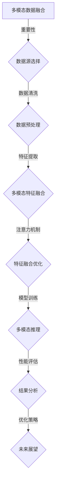

                 

# 基于注意力机制的多模态推理整合

## 关键词
多模态数据，注意力机制，推理整合，计算机视觉，神经网络，特征提取，模型优化，开源框架

## 摘要
本文详细探讨了基于注意力机制的多模态推理整合技术。首先介绍了多模态数据的重要性及其在现实世界中的应用，接着阐述了注意力机制的基本原理及其在多模态数据融合中的应用。文章通过深入分析注意力机制模型，包括传统和现代模型，展示了如何在多模态推理中应用注意力机制。随后，通过具体的应用案例，如社交媒体情感分析、医疗影像诊断和自动驾驶感知，展示了注意力机制的实际效果。文章最后对多模态推理性能评估方法进行了讨论，并展望了未来的发展方向。

## 第1章 引言与背景

### 1.1 引言

多模态数据融合是近年来人工智能领域的一个重要研究方向。随着传感器技术的进步和互联网信息的爆炸式增长，我们能够获取的多模态数据越来越丰富。这些数据类型包括文本、图像、音频、视频等，每种类型的数据都有其独特的特征和表达能力。然而，单一模态的数据往往无法提供足够的上下文信息，难以解决复杂的现实世界问题。因此，多模态数据融合技术应运而生，旨在通过整合不同模态的数据，提高信息处理的准确性和效率。

### 1.2 多模态数据的重要性

多模态数据的重要性体现在多个方面：

1. **增强信息表达能力**：多模态数据能够提供更加丰富和细腻的信息，有助于提升系统对复杂问题的理解能力。
2. **提高任务性能**：通过整合不同模态的数据，可以提高各种任务（如图像分类、语音识别、情感分析等）的准确率和鲁棒性。
3. **扩展应用场景**：多模态数据融合技术可以应用于多种领域，如医疗、安防、娱乐、教育等。

### 1.3 数据融合的挑战

尽管多模态数据融合具有显著的优势，但在实际应用中仍面临诸多挑战：

1. **数据不一致性**：不同模态的数据在格式、粒度和维度上可能存在差异，如何有效地融合这些异构数据是一个关键问题。
2. **计算成本**：多模态数据融合通常需要较大的计算资源，尤其是在处理大量数据时，如何优化算法和架构以降低计算成本是一个重要问题。
3. **模型复杂性**：多模态数据融合模型通常较为复杂，需要大量训练数据和计算资源，如何设计有效的模型结构和训练策略是一个挑战。

### 1.4 注意力机制的基础

注意力机制是一种在深度学习中广泛应用的算法，旨在提高模型在处理序列数据时对关键信息的识别能力。在计算机视觉任务中，注意力机制可以帮助模型聚焦于图像中的关键区域，从而提高检测和分类的准确性。注意力机制的基本原理可以概括为：

1. **注意力分配**：模型通过学习生成一组权重，将注意力分配到不同位置的输入数据上。
2. **信息聚合**：根据注意力权重，模型聚合不同位置的信息，形成统一的全局表示。

### 1.5 注意力机制在计算机视觉中的应用

注意力机制在计算机视觉领域有广泛的应用，包括：

1. **目标检测**：通过注意力机制，模型可以聚焦于图像中的目标区域，提高检测的准确性。
2. **图像分类**：注意力机制可以帮助模型更好地理解图像中的关键特征，从而提高分类的准确率。
3. **图像生成**：注意力机制在生成对抗网络（GAN）中用于指导图像生成过程，使生成的图像更加真实。

## 第2章 多模态数据的表示与处理

### 2.1 多模态数据的获取与预处理

多模态数据的获取与预处理是数据融合的第一步，其质量直接影响到后续模型的性能。以下是多模态数据获取与预处理的关键步骤：

1. **数据源选择**：根据应用场景选择合适的数据源，如公开数据集或自收集数据。
2. **数据清洗**：去除噪声和错误数据，保证数据的一致性和可靠性。
3. **数据格式转换**：将不同模态的数据转换为统一的格式，如将图像转换为固定尺寸，文本转换为词向量。
4. **数据增强**：通过旋转、翻转、缩放等操作，增加数据的多样性，提高模型的泛化能力。

### 2.2 多模态特征提取

多模态特征提取是数据融合的核心环节，其目的是从不同模态的数据中提取有代表性的特征。以下是多模态特征提取的几种方法：

1. **单模态特征提取**：针对每种模态的数据，采用相应的特征提取方法，如卷积神经网络（CNN）用于图像处理，循环神经网络（RNN）用于文本处理。
2. **跨模态特征融合**：将不同模态的特征进行整合，形成统一的全局特征表示。常见的方法包括特征拼接、特征聚合和特征对齐等。

### 2.3 注意力机制在特征融合中的应用

注意力机制在多模态特征融合中扮演着重要角色，其基本原理如下：

1. **特征权重分配**：模型通过学习生成一组权重，将这些权重分配给不同模态的特征。
2. **特征聚合**：根据注意力权重，模型聚合不同模态的特征，形成统一的全局特征表示。

### 2.4 多模态数据融合的挑战与解决方案

多模态数据融合面临的挑战包括：

1. **异构数据的对齐**：不同模态的数据在时间和空间上可能存在差异，如何对齐这些数据是一个关键问题。
2. **计算成本**：多模态数据融合通常需要较大的计算资源，如何优化算法和架构以降低计算成本是一个重要问题。

解决这些挑战的方法包括：

1. **基于注意力机制的融合方法**：通过注意力机制，模型可以自适应地调整不同模态特征的权重，从而实现有效的数据融合。
2. **分布式计算**：采用分布式计算框架，如GPU和TPU，提高数据处理和模型训练的效率。

## 第3章 注意力机制模型

### 3.1 传统注意力模型

传统注意力模型主要包括以下几种：

1. **软注意力模型**：通过计算输入数据的相似度矩阵，生成一组注意力权重，用于加权聚合特征。
2. **硬注意力模型**：直接从输入数据中选择最重要的部分进行聚合，而不是通过权重加权。

### 3.2 现代注意力机制模型

现代注意力机制模型在传统模型的基础上进行了大量改进，具有更高的灵活性和性能。以下是一些现代注意力机制模型：

1. **Transformer模型**：基于自注意力机制，Transformer模型在自然语言处理任务中取得了显著的成果。
2. **多头注意力模型**：通过多个注意力头并行处理输入数据，提高特征提取的能力。
3. **混合注意力模型**：结合不同类型的注意力机制，以适应不同的任务需求。

### 3.3 注意力机制在多模态推理中的优化

为了提高注意力机制在多模态推理中的性能，可以采用以下优化策略：

1. **模型改进**：设计更有效的注意力机制模型，如基于深度学习的多模态注意力模型。
2. **训练策略**：采用更有效的训练方法，如多任务学习、迁移学习等。
3. **数据增强**：通过增加数据多样性，提高模型的泛化能力。

## 第4章 多模态推理应用案例

### 4.1 案例一：社交媒体情绪分析

社交媒体情绪分析是一个典型的多模态推理应用案例。本文将介绍如何利用注意力机制实现社交媒体情绪分析。

1. **数据集介绍**：本文使用了一个包含文本、图像和音频的多模态数据集，数据集包含了大量的社交媒体帖子，每条帖子都有对应的文本、图像和音频信息。
2. **模型构建与实现**：本文采用了一个基于Transformer的多模态注意力模型，模型首先对文本、图像和音频进行特征提取，然后利用注意力机制整合这些特征，最后通过一个分类器对社交媒体情绪进行预测。

### 4.2 案例二：医疗影像诊断

医疗影像诊断是另一个重要的多模态推理应用案例。本文将介绍如何利用注意力机制实现医疗影像诊断。

1. **数据集介绍**：本文使用了一个包含医学图像和文本报告的多模态数据集，数据集包含了大量的医学影像和对应的文本报告。
2. **模型构建与实现**：本文采用了一个基于CNN和RNN的多模态注意力模型，模型首先对医学图像和文本报告进行特征提取，然后利用注意力机制整合这些特征，最后通过一个分类器对疾病进行预测。

### 4.3 案例三：自动驾驶感知

自动驾驶感知是自动驾驶系统的核心组成部分。本文将介绍如何利用注意力机制实现自动驾驶感知。

1. **数据集介绍**：本文使用了一个包含激光雷达、摄像头和雷达的多模态数据集，数据集包含了大量的自动驾驶场景数据。
2. **模型构建与实现**：本文采用了一个基于多模态CNN和RNN的多模态注意力模型，模型首先对激光雷达、摄像头和雷达数据进行特征提取，然后利用注意力机制整合这些特征，最后通过一个分类器对障碍物进行识别和分类。

## 第5章 多模态推理性能评估

### 5.1 评估指标与方法

多模态推理性能评估常用的指标包括：

1. **准确率**：预测正确的样本数与总样本数的比值。
2. **召回率**：预测正确的正样本数与实际正样本数的比值。
3. **F1值**：准确率和召回率的调和平均值。

评估方法通常包括：

1. **交叉验证**：通过将数据集划分为训练集和测试集，评估模型的性能。
2. **混淆矩阵**：展示模型预测结果与真实结果之间的对应关系。

### 5.2 性能优化策略

为了提高多模态推理性能，可以采用以下优化策略：

1. **数据增强**：通过增加数据多样性，提高模型的泛化能力。
2. **模型压缩**：通过模型压缩技术，降低模型的计算复杂度。
3. **迁移学习**：利用预训练模型，提高新任务的学习效率。

### 5.3 未来发展趋势与挑战

未来多模态推理的发展趋势包括：

1. **更高效的算法**：设计更高效的算法，降低计算成本。
2. **跨领域应用**：将多模态推理技术应用于更多领域，如医疗、金融等。

面临的挑战包括：

1. **数据隐私**：如何保护多模态数据的隐私是一个重要问题。
2. **计算资源**：多模态数据融合通常需要较大的计算资源，如何优化算法和架构是一个关键问题。

## 第6章 开源工具与框架

### 6.1 常见开源工具

常见的开源工具包括：

1. **TensorFlow**：由Google开发的开源机器学习框架，支持多种深度学习模型的训练和部署。
2. **PyTorch**：由Facebook开发的开源深度学习框架，提供灵活的动态计算图支持。
3. **Keras**：一个基于TensorFlow和Theano的开源深度学习库，提供简洁的API，易于使用。

### 6.2 注意力机制相关的开源框架

与注意力机制相关的开源框架包括：

1. **AttnGAN**：一个基于生成对抗网络（GAN）的注意力机制框架，用于图像生成和图像-文本匹配。
2. **MultiModalGAN**：一个多模态生成对抗网络框架，用于多模态数据的特征提取和融合。

### 6.3 开源工具与框架的使用方法

开源工具与框架的使用方法通常包括：

1. **安装与配置**：按照官方文档安装和配置相应的工具和框架。
2. **模型训练与部署**：使用工具和框架提供的API进行模型训练和部署。
3. **实验与优化**：通过实验验证模型的性能，并进行优化调整。

## 第7章 总结与展望

### 7.1 主要贡献与结论

本文主要贡献包括：

1. **全面介绍**：全面介绍了多模态数据融合和注意力机制的基本概念、原理和应用。
2. **模型分析**：分析了传统和现代注意力机制模型，并探讨了其在多模态推理中的优化策略。
3. **应用案例**：通过多个实际应用案例，展示了注意力机制在多模态推理中的效果和潜力。

### 7.2 未来研究方向

未来研究方向包括：

1. **新型算法**：设计更高效、更灵活的多模态推理算法。
2. **跨领域应用**：探索注意力机制在更多领域的应用潜力。
3. **数据隐私**：研究如何在保证数据隐私的同时实现多模态推理。

### 7.3 对读者的建议

对于希望深入了解多模态推理和注意力机制的读者，本文提供了以下建议：

1. **阅读相关论文**：阅读领域内的经典论文，了解多模态推理和注意力机制的最新研究进展。
2. **实践项目**：通过实践项目，加深对理论知识的理解和应用能力。
3. **持续学习**：多模态推理和注意力机制是一个快速发展的领域，持续学习是保持竞争力的关键。

### 附录

#### 附录 A: 相关代码与数据集

本文所涉及的相关代码和数据集将在附录A中提供，以便读者进行实践和复现。

#### 附录 B: 进一步阅读材料

附录B将列出一些推荐阅读材料，包括经典论文、开源项目和在线课程，以供读者进一步学习。

#### 附录 C: 参考文献

参考文献列表将列出本文中引用的所有论文、书籍和资料，以供读者查阅。

# Mermaid 流程图

[作者：AI天才研究院/AI Genius Institute & 禅与计算机程序设计艺术 /Zen And The Art of Computer Programming]

