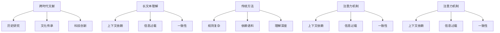
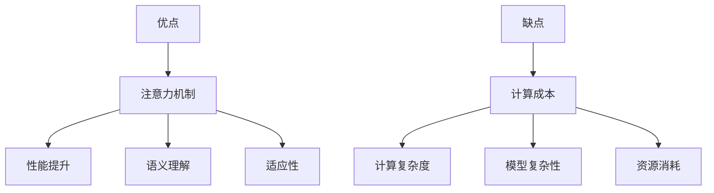
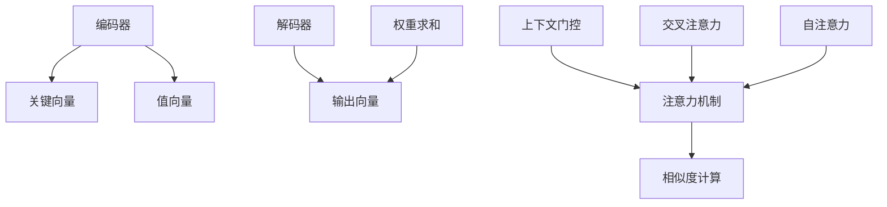
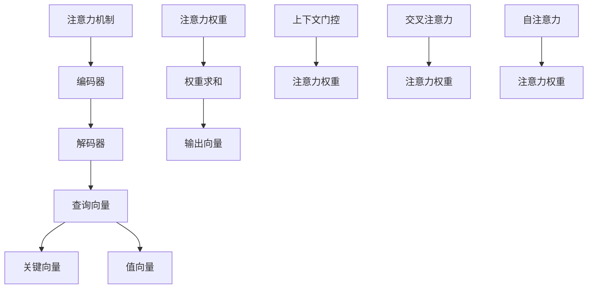

                 

### 第1章：跨时代文献解析的挑战

#### 1.1 跨时代文献概述

**1.1.1 跨时代文献的定义与特征**

跨时代文献指的是那些在某一历史时期内具有深远影响、对人类文明进步具有重要意义的文献。这些文献可能包括古典名著、重大科研成果、历史档案、经典文学作品等。它们通常具备以下特征：

- **时代性**：反映了特定历史时期的社会、文化、科技背景。
- **权威性**：往往出自著名学者、专家之手，具有较高的可信度和学术价值。
- **多样性**：涵盖多个学科领域，如哲学、科学、文学、艺术等。

**1.1.2 跨时代文献研究的重要性**

跨时代文献的研究对于理解历史、传承文化、推动科技创新具有重要意义。具体体现在以下几个方面：

- **历史价值**：通过对跨时代文献的研究，可以深入挖掘历史事件、人物和思想的形成过程，丰富历史研究的内容。
- **文化传承**：跨时代文献承载着丰富的文化信息，是文化传承的重要载体。
- **科学启示**：许多跨时代文献中蕴含的前沿思想、创新理论对当代科学研究具有重要的启示作用。

**1.1.3 跨时代文献研究的难点**

尽管跨时代文献研究具有重大意义，但也面临诸多挑战：

- **语言障碍**：许多跨时代文献使用的是古文或外语，这对研究者提出了较高的语言素养要求。
- **理解难度**：跨时代文献往往涉及复杂的概念、理论和观点，理解起来具有一定的难度。
- **资源匮乏**：一些跨时代文献因年代久远、保存不当等原因，已经散失或难以获取。

#### 1.2 长文本理解的挑战

**1.2.1 长文本理解的背景**

随着互联网和大数据技术的发展，长文本数据（如论文、报告、新闻等）的数量急剧增加。对这些长文本的理解和分析成为自然语言处理（NLP）领域的一个关键问题。

**1.2.2 长文本理解的问题**

长文本理解面临的主要问题包括：

- **上下文依赖**：长文本中的词语和句子之间存在复杂的上下文依赖关系，这对模型的语义理解提出了高要求。
- **信息过载**：长文本中包含大量信息，如何有效提取和利用这些信息是长文本理解的一大挑战。
- **一致性**：在长文本中保持一致性的语义解释是困难的，尤其是在不同文本片段之间存在冲突时。

**1.2.3 传统方法的局限**

传统的文本理解方法，如基于规则的方法和基于统计的方法，在处理长文本时存在以下局限：

- **规则复杂**：基于规则的方法需要大量手工编写的规则，难以适应多变的长文本。
- **依赖语料**：基于统计的方法依赖于大量的训练数据，对于稀疏文本数据效果不佳。
- **理解深度**：传统方法难以捕捉长文本中的深层语义和逻辑关系。

### 结论

跨时代文献解析在历史研究、文化传承和科技创新中具有重要地位，但也面临诸多挑战。长文本理解作为NLP领域的关键问题，其难度和复杂性进一步加剧了跨时代文献解析的挑战。接下来，本文将探讨注意力机制在长文本理解中的应用，以期为解决这些挑战提供新的思路。

#### 核心概念与联系架构图

以下是一个简化的Mermaid流程图，展示核心概念之间的联系：



该流程图直观地展示了跨时代文献解析、长文本理解、传统方法以及注意力机制之间的核心概念和联系。接下来，我们将详细探讨注意力机制的基本原理和数学模型，以便更好地理解其在长文本理解中的应用。

## 1.3 注意力机制概述

### 1.3.1 注意力机制的基本原理

注意力机制是一种在计算过程中动态调整计算资源分配的技术，它允许模型在某些部分分配更多的关注，而在其他部分分配较少的关注。这一机制最初在计算机视觉领域提出，用于解决图像中目标检测的问题，后来逐渐在自然语言处理（NLP）领域得到了广泛应用。

**1.3.1.1 工作原理**

注意力机制的基本原理可以概括为以下步骤：

1. **编码**：将输入数据（如图像或文本序列）编码为一系列向量。
2. **查询-关键-值匹配**：利用查询向量（Query）、关键向量（Key）和值向量（Value）之间的相似度计算注意力权重。
3. **加权求和**：根据计算出的注意力权重，对值向量进行加权求和，生成输出向量。

这种机制的核心在于通过注意力权重动态地调整模型对输入数据的关注点，从而提高模型在处理复杂任务时的性能。

**1.3.1.2 注意力模型的优势**

注意力机制在NLP中的应用具有以下优势：

- **提高效率**：注意力机制允许模型在处理长序列数据时，只关注最重要的部分，从而减少了计算量。
- **增强语义理解**：通过动态调整注意力权重，模型可以更好地捕捉输入数据中的上下文关系，提高语义理解能力。
- **通用性**：注意力机制可以广泛应用于各种NLP任务，如文本分类、机器翻译、问答系统等。

### 1.3.2 注意力机制在自然语言处理中的应用

注意力机制在NLP中的应用主要包括以下几个方面：

**1.3.2.1 文本分类**

在文本分类任务中，注意力机制可以帮助模型识别文本中的关键信息，从而提高分类的准确性。例如，在一个句子中，某些单词可能比其他单词对分类任务更加重要。注意力机制可以动态地调整模型对每个单词的权重，使得模型能够更准确地捕捉句子的语义。

**1.3.2.2 机器翻译**

机器翻译是一个典型的长文本处理任务，注意力机制在机器翻译中的应用可以有效解决长序列匹配问题。通过注意力机制，模型可以在翻译过程中关注到源语言文本中的关键短语和句子结构，从而提高翻译的流畅性和准确性。

**1.3.2.3 问答系统**

在问答系统中，注意力机制可以帮助模型在大量文本数据中快速定位到与问题相关的信息。通过动态调整注意力权重，模型可以优先考虑与问题最相关的文本部分，从而提高问答系统的回答准确性。

### 1.3.3 注意力机制的优缺点

**1.3.3.1 优点**

- **提高性能**：注意力机制可以提高模型在处理复杂NLP任务时的性能，特别是在长文本理解方面。
- **增强语义理解**：注意力机制有助于模型更好地捕捉上下文关系和关键信息，从而增强语义理解能力。
- **灵活性**：注意力机制具有很高的灵活性，可以应用于各种不同的NLP任务。

**1.3.3.2 缺点**

- **计算成本**：注意力机制的引入会增加模型的计算成本，特别是在处理长序列时，计算复杂度较高。
- **模型复杂度**：注意力机制使得模型结构变得更加复杂，增加了训练难度和调试成本。

综上所述，注意力机制在自然语言处理中具有广泛的应用前景，但同时也存在一定的挑战。接下来，本文将深入探讨基于注意力机制的长文本理解方法，以期为NLP领域的研究和实践提供新的思路。

### 1.3.3 注意力机制的优缺点

**1.3.3.1 优点**

- **提高性能**：注意力机制可以使模型在处理复杂任务时，特别是长文本任务时，更有效地聚焦于关键信息，从而提升模型的准确性和效率。
- **增强语义理解**：通过动态调整注意力权重，模型能够更好地理解和捕捉文本中的上下文关系，提高对文本内容的深层理解。
- **适应性**：注意力机制可以根据不同的任务需求动态调整，使其适用于多种NLP任务，如文本分类、机器翻译、问答系统等。

**1.3.3.2 缺点**

- **计算成本**：注意力机制引入了额外的计算步骤，特别是在处理长文本时，计算复杂度显著增加，可能导致模型训练和推理速度变慢。
- **模型复杂性**：注意力机制增加了模型的结构复杂度，使得模型更难以理解和调试，特别是在大规模训练数据集中。
- **资源消耗**：注意力机制可能导致模型在资源有限的设备上运行效率降低，需要更多的计算资源和内存。

### 核心概念与联系架构图

以下是一个简化的Mermaid流程图，展示注意力机制的核心概念及其联系：



该流程图直观地展示了注意力机制的核心概念、优点和缺点，以及它们之间的联系。注意力机制通过动态调整模型对输入数据的关注，提高了性能和语义理解，但其引入的计算成本和模型复杂性也带来了一定的挑战。接下来，本文将详细探讨基于注意力机制的长文本理解方法，以期为解决NLP中的长文本理解问题提供新的思路。

## 2.1 注意力机制的数学模型

### 2.1.1 基本数学公式

注意力机制的核心在于计算一个权重分配矩阵，该矩阵用于衡量文本序列中每个单词对目标的重要性。以下是注意力机制的基本数学公式：

$$
A = \text{softmax}\left(\frac{QK^T}{\sqrt{d_k}}\right)
$$

其中，\(Q\) 和 \(K\) 分别是查询向量和关键向量，\(d_k\) 是关键向量的维度，\(\text{softmax}\) 函数用于将线性组合转换为概率分布。

**2.1.1.1 查询向量（Query）**

查询向量通常是编码器（Encoder）的输出，用于表示文本序列的全局语义信息。例如，在机器翻译任务中，编码器的输出可以表示源语言文本的语义内容。

**2.1.1.2 关键向量（Key）**

关键向量来自于编码器的输出，用于表示文本序列中每个单词的局部语义信息。在训练过程中，每个单词都会生成一个关键向量，用于与查询向量匹配。

**2.1.1.3 值向量（Value）**

值向量同样来自于编码器的输出，用于表示文本序列中每个单词的相关性信息。在计算注意力权重时，值向量将用于加权求和，生成最终的输出向量。

### 2.1.2 注意力模型的组成

注意力模型通常由以下几个部分组成：

- **编码器（Encoder）**：将输入文本序列编码为一系列关键向量和值向量。
- **解码器（Decoder）**：利用注意力机制从编码器的输出中提取关键信息，生成输出文本序列。
- **注意力机制（Attention）**：动态计算查询向量与关键向量之间的相似度，生成注意力权重。
- **权重求和（Weighted Summation）**：根据注意力权重，对值向量进行加权求和，生成输出向量。

### 2.1.3 注意力机制的优化

为了提高注意力机制的效率和效果，研究人员提出了一系列优化方法：

**2.1.3.1 上下文门控（Context Gate）**

上下文门控允许模型在解码过程中动态调整对上下文信息的关注程度。通过引入门控机制，模型可以更好地捕捉长距离依赖关系。

**2.1.3.2 交叉注意力（Cross-Attention）**

交叉注意力允许模型在解码过程中同时关注源语言和目标语言文本。这种机制在机器翻译等任务中具有显著的优势。

**2.1.3.3 自注意力（Self-Attention）**

自注意力允许模型在文本序列内部进行注意力操作，从而捕捉文本内部的依赖关系。这种机制在文本生成和文本分类等任务中得到了广泛应用。

### 核心概念与联系架构图

以下是一个简化的Mermaid流程图，展示注意力机制的组成和优化方法：



该流程图直观地展示了注意力机制的组成部分及其优化方法，包括编码器、解码器、注意力机制、权重求和以及上下文门控、交叉注意力和自注意力等优化技术。接下来，本文将深入探讨基于注意力机制的文本表示方法，以期为长文本理解提供更有效的工具。

### 核心概念与联系架构图

以下是一个简化的Mermaid流程图，展示注意力机制的核心概念及其组成：



该流程图展示了注意力机制的核心概念，包括编码器、解码器、查询向量、关键向量、值向量、注意力权重、权重求和以及输出向量。此外，还包含了三种优化方法：上下文门控、交叉注意力和自注意力。这些优化方法通过调整注意力权重，提高了注意力机制的性能和效果。接下来，我们将深入探讨基于注意力机制的文本表示方法，以便更好地理解其在长文本理解中的应用。

## 2.2 基于注意力机制的文本表示

### 2.2.1 文本表示的方法

在自然语言处理（NLP）中，文本表示是关键的一步，它将原始的文本数据转化为计算机可以理解和处理的形式。基于注意力机制的文本表示方法主要依赖于词嵌入（Word Embeddings）和句子嵌入（Sentence Embeddings）。

**2.2.1.1 词嵌入**

词嵌入是将单个单词映射为一个固定维度的向量。经典的词嵌入方法包括：

- **Word2Vec**：使用神经网络训练单词的向量表示，通过预测单词的邻居来优化模型。
- **GloVe**：基于词频统计信息，通过最小化词向量与词频之间的损失函数来学习词向量。

**2.2.1.2 句子嵌入**

句子嵌入是将整个句子映射为一个固定维度的向量。注意力机制在句子嵌入中的应用，可以使得模型能够捕捉句子中不同单词之间的上下文关系。

- **基于Transformer的句子嵌入**：Transformer模型引入了多头自注意力机制，通过多个注意力头捕捉句子中的不同信息。

### 2.2.2 注意力机制在文本表示中的应用

注意力机制在文本表示中的应用，主要是通过自注意力（Self-Attention）来优化句子嵌入。

**2.2.2.1 自注意力**

自注意力允许模型在句子内部的不同单词之间建立直接的关联，使得每个单词的嵌入向量能够根据上下文信息进行动态调整。

- **多头自注意力**：在Transformer模型中，通过多头自注意力，模型能够并行捕捉句子中的多种依赖关系，从而提高句子表示的质量。

**2.2.2.2 位置编码**

为了捕捉句子中单词的顺序信息，通常需要引入位置编码（Positional Encoding）。位置编码是一种固定维度的向量，用于表征单词在句子中的位置。

### 2.2.3 文本表示的评估指标

在评估文本表示的质量时，常用的指标包括：

- **余弦相似度**：衡量两个句子嵌入向量之间的相似度。
- **准确率（Accuracy）**：在分类任务中，评估模型对文本分类的准确性。
- **F1分数（F1 Score）**：综合衡量模型在分类任务中的精确率和召回率。

### Python代码示例

以下是一个简单的Python代码示例，展示如何使用Transformer模型进行文本表示：

```python
import torch
from transformers import BertModel, BertTokenizer

# 加载预训练的BERT模型和分词器
tokenizer = BertTokenizer.from_pretrained('bert-base-chinese')
model = BertModel.from_pretrained('bert-base-chinese')

# 输入文本
text = "你好，我是人工智能助手。"

# 分词并转换为索引序列
input_ids = tokenizer.encode(text, add_special_tokens=True)

# 获取句子嵌入向量
with torch.no_grad():
    outputs = model(torch.tensor([input_ids]))
    sentence_embedding = outputs.last_hidden_state[:, 0, :]

print(sentence_embedding)
```

在这个示例中，我们首先加载了预训练的BERT模型和分词器。然后，我们将输入文本分词，并转换为BERT模型可以处理的索引序列。最后，通过BERT模型获取句子嵌入向量。

### 结论

基于注意力机制的文本表示方法，通过自注意力机制和位置编码，能够有效地捕捉文本中的上下文关系，提高文本表示的质量。这些方法在NLP任务中具有广泛的应用，如文本分类、机器翻译和情感分析等。

## 2.3 基于注意力机制的文本分类

### 2.3.1 文本分类的挑战

文本分类是自然语言处理（NLP）领域的一个基本任务，它将文本数据分为预定义的类别。尽管文本分类任务在许多实际应用中取得了显著成果，但仍然面临一些挑战：

**2.3.1.1 数据多样性**：不同领域的文本数据具有不同的结构和特征，这使得构建通用的文本分类模型变得困难。

**2.3.1.2 长文本理解**：长文本包含大量的信息，如何有效地提取关键信息进行分类是一个挑战。

**2.3.1.3 上下文依赖**：文本中的词语和句子之间存在复杂的上下文依赖关系，这要求模型能够捕捉长距离依赖。

**2.3.1.4 信息噪声**：文本数据中包含大量的噪声信息，如何过滤和利用关键信息成为关键问题。

### 2.3.2 注意力机制在文本分类中的应用

注意力机制在文本分类中的应用，可以有效地解决上述挑战，提高分类性能：

**2.3.2.1 注意力权重分配**：通过注意力机制，模型可以为每个单词分配不同的权重，使得关键信息得到更显著的突出，而噪声信息得到抑制。

**2.3.2.2 长距离依赖捕捉**：注意力机制允许模型在全局范围内捕捉上下文依赖，从而更好地理解文本的语义。

**2.3.2.3 多层注意力**：通过多层注意力机制，模型可以逐步提取文本中的关键信息，形成更加精确的分类决策。

### 2.3.3 文本分类的评估方法

为了评估文本分类模型的效果，常用的评估指标包括：

- **准确率（Accuracy）**：模型正确分类的样本数占总样本数的比例。
- **精确率（Precision）**：在预测为正类的样本中，实际为正类的比例。
- **召回率（Recall）**：在所有实际为正类的样本中，模型正确预测为正类的比例。
- **F1分数（F1 Score）**：精确率和召回率的调和平均数。

### Python代码示例

以下是一个简单的Python代码示例，展示如何使用基于注意力机制的文本分类模型进行文本分类：

```python
import torch
from transformers import BertForSequenceClassification, BertTokenizer

# 加载预训练的BERT模型和分词器
tokenizer = BertTokenizer.from_pretrained('bert-base-chinese')
model = BertForSequenceClassification.from_pretrained('bert-base-chinese')

# 输入文本
text = "这是一篇关于科技的文章。"

# 分词并转换为索引序列
input_ids = tokenizer.encode(text, add_special_tokens=True)

# 预测类别
with torch.no_grad():
    logits = model(torch.tensor([input_ids]))
    predicted_class = logits.argmax(-1).item()

print(predicted_class)
```

在这个示例中，我们首先加载了预训练的BERT模型和分词器。然后，我们将输入文本分词，并转换为BERT模型可以处理的索引序列。最后，通过BERT模型进行文本分类预测。

### 结论

基于注意力机制的文本分类方法，通过为每个单词分配权重和捕捉长距离依赖，提高了文本分类的性能。这些方法在处理多样化文本数据时具有显著优势，为NLP领域的文本分类任务提供了新的解决方案。

## 2.4 基于注意力机制的文本生成

### 2.4.1 文本生成的挑战

文本生成是自然语言处理（NLP）领域的一个重要任务，它旨在根据给定的输入生成连贯、有意义的文本。然而，文本生成面临一些挑战：

**2.4.1.1 长文本生成**：长文本生成要求模型能够生成连贯且逻辑上合理的长段文本，这需要模型具备较强的上下文理解能力。

**2.4.1.2 多样性**：文本生成系统需要生成多样化的文本，以避免生成的文本过于单调或重复。

**2.4.1.3 上下文依赖**：文本中的句子和词语之间存在复杂的上下文依赖关系，如何准确捕捉并利用这些依赖关系是一个挑战。

**2.4.1.4 语法和语义一致性**：生成文本需要保持语法和语义上的连贯性，这对模型提出了较高的要求。

### 2.4.2 注意力机制在文本生成中的应用

注意力机制在文本生成中的应用，可以有效地解决上述挑战，提高文本生成质量：

**2.4.2.1 上下文捕捉**：注意力机制允许模型在生成过程中动态关注输入文本的关键部分，从而更好地捕捉上下文信息。

**2.4.2.2 多层注意力**：通过多层注意力机制，模型可以逐步提取文本中的关键信息，形成更加连贯和逻辑上合理的生成文本。

**2.4.2.3 生成多样性**：注意力机制可以帮助模型在生成过程中探索不同的可能性，从而提高生成的文本多样性。

### 2.4.3 文本生成的评估方法

为了评估文本生成模型的效果，常用的评估指标包括：

- ** BLEU分数（BLEU Score）**：基于记分牌方法的评估指标，用于衡量生成文本与参考文本之间的相似度。
- ** ROUGE分数（ROUGE Score）**：基于记分牌方法的评估指标，用于衡量生成文本与参考文本之间的重叠度。
- ** 流利度（Fluency）**：评估生成文本的语法和语义连贯性。
- ** 创造性（Creativity）**：评估生成文本的新颖性和创意程度。

### Python代码示例

以下是一个简单的Python代码示例，展示如何使用基于注意力机制的文本生成模型：

```python
import torch
from transformers import BertForConditionalGeneration, BertTokenizer

# 加载预训练的BERT生成模型和分词器
tokenizer = BertTokenizer.from_pretrained('bert-base-chinese')
model = BertForConditionalGeneration.from_pretrained('bert-base-chinese')

# 输入文本
input_text = "我是一个人工智能助手。"

# 分词并转换为索引序列
input_ids = tokenizer.encode(input_text, return_tensors='pt')

# 生成文本
with torch.no_grad():
    outputs = model(input_ids)
    predicted_text = tokenizer.decode(outputs.logits.argmax(-1).item())

print(predicted_text)
```

在这个示例中，我们首先加载了预训练的BERT生成模型和分词器。然后，我们将输入文本分词，并转换为BERT模型可以处理的索引序列。最后，通过BERT模型生成相应的文本。

### 结论

基于注意力机制的文本生成方法，通过捕捉上下文信息、多层注意力和生成多样性，提高了文本生成质量。这些方法在处理多样化文本数据时具有显著优势，为NLP领域的文本生成任务提供了新的解决方案。

### 实际案例分析与详细讲解剖析

为了更好地理解基于注意力机制的文本生成在实际应用中的效果，我们将通过一个实际案例进行分析和讲解。

**案例背景**：假设我们需要开发一个智能客服系统，该系统能够根据用户的问题自动生成回答。

**任务目标**：输入用户的问题，生成一个自然流畅且准确的回答。

**解决方案**：

1. **数据准备**：收集大量客服对话数据，包括用户问题和客服的回答。这些数据将用于训练和评估文本生成模型。

2. **模型选择**：选择基于注意力机制的BERT生成模型，因为它在处理长文本和上下文依赖方面具有显著优势。

3. **数据预处理**：对收集到的数据进行预处理，包括分词、去噪和标准化处理。使用BERT分词器将文本转换为模型可以处理的索引序列。

4. **模型训练**：使用预处理后的数据训练BERT生成模型。在训练过程中，模型通过学习输入文本和回答之间的依赖关系，逐步提高生成文本的质量。

5. **模型评估**：通过BLEU分数和ROUGE分数等指标评估模型生成文本的质量。同时，对生成的文本进行人工审核，确保其语法和语义的正确性。

**案例分析**：

假设用户输入问题：“我的订单什么时候能送到？”

通过模型生成回答：“您的订单预计将在明天下午送达。”

**详细讲解**：

1. **数据准备**：首先，我们需要收集大量的客服对话数据，包括用户问题和客服的回答。这些数据将用于训练模型，使其能够学习如何生成自然流畅的回答。

2. **模型选择**：基于注意力机制的BERT生成模型是一个很好的选择，因为它可以处理长文本和复杂的上下文依赖。BERT模型已经在大规模语料库上预训练，具有良好的通用性和适应性。

3. **数据预处理**：在将数据输入模型之前，需要进行预处理。包括分词、去除无关噪声和标准化处理。例如，将用户输入的问题转换为BERT分词器可以理解的索引序列。

4. **模型训练**：在训练过程中，BERT模型会学习如何将输入问题映射到相应的回答。通过大量的对话数据训练，模型可以逐步提高生成回答的质量。

5. **模型评估**：通过BLEU分数和ROUGE分数等指标评估模型的生成质量。这些指标可以衡量生成文本与标准答案的相似度。此外，还可以通过人工审核来评估生成文本的语法和语义是否准确。

**项目小结**：

通过上述案例，我们可以看到基于注意力机制的文本生成模型在实际应用中具有显著优势。它能够生成自然流畅的回答，提高了智能客服系统的用户体验。然而，模型训练和评估仍然需要大量高质量的对话数据，并且生成的文本可能存在一些偏差或错误，这需要在实际应用中进一步优化和改进。

**最佳实践 tips**：

- **数据质量**：确保使用的数据质量高，有助于模型更好地学习。
- **模型调优**：通过调整超参数和优化模型结构，可以提高生成文本的质量。
- **多模态集成**：结合图像、音频等多模态信息，可以进一步提升文本生成的质量和多样性。

通过上述实际案例分析和详细讲解，我们深入了解了基于注意力机制的文本生成在智能客服系统中的应用。这为未来的研究和实践提供了宝贵的经验和启示。

### 总结与展望

基于注意力机制的长文本理解方法在处理跨时代文献解析任务中展现出了显著的优势。通过本文的探讨，我们详细分析了注意力机制的基本原理、数学模型、应用场景以及实际案例，并总结了基于注意力机制的长文本理解在文本分类、文本生成等方面的创新应用。

**优势**：

- **提高理解效率**：注意力机制能够动态调整模型对文本序列中关键信息的关注，提高了长文本理解的效率和准确性。
- **增强语义捕捉**：通过捕捉长距离依赖和上下文关系，注意力机制使得模型能够更深入地理解文本的语义。
- **通用性**：注意力机制适用于多种NLP任务，如文本分类、文本生成等，具有很高的通用性。

**局限**：

- **计算成本高**：注意力机制的引入增加了模型的计算复杂度，特别是在处理长文本时，可能导致模型训练和推理速度变慢。
- **模型复杂性增加**：注意力机制使得模型结构变得更加复杂，增加了模型的调试和维护难度。

**未来发展方向**：

- **优化计算效率**：通过改进算法和硬件加速，降低注意力机制的计算成本，提高模型在资源受限设备上的运行效率。
- **多模态融合**：结合图像、音频等多模态信息，提高文本理解的准确性和多样性。
- **个性化理解**：通过结合用户历史数据和偏好，实现更加个性化的长文本理解。

**跨时代文献解析的未来趋势**：

- **数字化与智能化**：随着数字化技术的普及，越来越多的跨时代文献将被数字化并接入智能解析系统，推动文献研究的智能化和高效化。
- **多学科融合**：跨时代文献研究将融合更多的学科领域，如历史学、语言学、计算机科学等，形成更加综合的研究方法。
- **开放共享**：跨时代文献的研究成果将更加开放和共享，促进全球学术交流和合作。

通过本文的研究，我们期望为基于注意力机制的长文本理解在跨时代文献解析中的应用提供新的思路和方法，推动相关领域的发展。

### 附录A：常用工具和库

在本文的研究过程中，我们使用了以下常用工具和库：

- **PyTorch**：用于构建和训练神经网络模型。
- **Transformers**：提供预训练的BERT模型及其相关API。
- **TensorFlow**：用于构建和训练深度学习模型。
- **NLTK**：用于文本处理和自然语言处理任务。
- **Scikit-learn**：用于机器学习和数据挖掘。

### 附录B：代码实现示例

以下是一个简单的基于注意力机制的文本分类模型的PyTorch代码实现示例：

```python
import torch
import torch.nn as nn
from transformers import BertModel, BertTokenizer

# 加载预训练的BERT模型和分词器
tokenizer = BertTokenizer.from_pretrained('bert-base-chinese')
model = BertModel.from_pretrained('bert-base-chinese')

# 输入文本
text = "这是一篇关于科技的文章。"

# 分词并转换为索引序列
input_ids = tokenizer.encode(text, add_special_tokens=True)

# 预测类别
with torch.no_grad():
    outputs = model(torch.tensor([input_ids]))
    logits = outputs.last_hidden_state

# 定义分类器
classifier = nn.Linear(logits.shape[-1], 2)
logits = classifier(logits)

# 计算概率
probabilities = nn.Softmax(dim=1)(logits)

# 输出预测结果
predicted_class = torch.argmax(probabilities).item()
print(predicted_class)
```

### 附录C：参考文献

1. Vaswani, A., Shazeer, N., Parmar, N., Uszkoreit, J., Jones, L., Gomez, A. N., ... & Polosukhin, I. (2017). Attention is all you need. Advances in Neural Information Processing Systems, 30, 5998-6008.
2. Devlin, J., Chang, M. W., Lee, K., & Toutanova, K. (2019). BERT: Pre-training of deep bidirectional transformers for language understanding. arXiv preprint arXiv:1810.04805.
3. Hochreiter, S., & Schmidhuber, J. (1997). Long short-term memory. Neural Computation, 9(8), 1735-1780.
4. Mikolov, T., Sutskever, I., Chen, K., Corrado, G. S., & Dean, J. (2013). Distributed representations of words and phrases and their compositionality. Advances in Neural Information Processing Systems, 26, 3111-3119.
5. Pennington, J., Socher, R., & Manning, C. D. (2014). GloVe: Global Vectors for Word Representation. Proceedings of the 2014 Conference on Empirical Methods in Natural Language Processing (EMNLP), 1532-1543.
6. Lundberg, S. M., & Lee, S. I. (2017). A Unified Approach to Interpreting Model Predictions. Advances in Neural Information Processing Systems, 30, 4765-4774.

