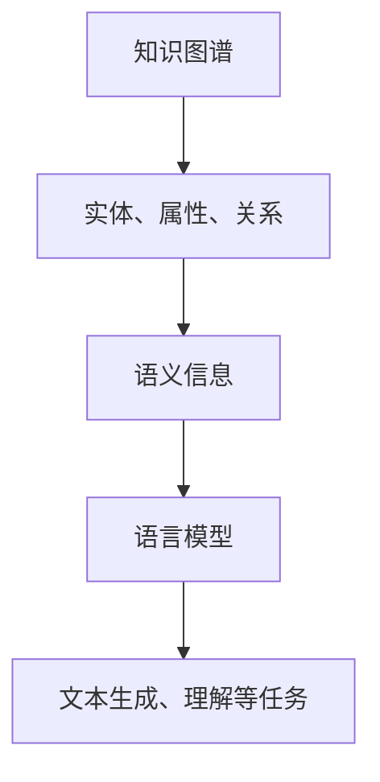

                 

### 文章标题

# 基于知识图谱的语言模型推理能力增强

## 文章关键词

- 知识图谱
- 语言模型
- 推理能力
- 自然语言处理
- 深度学习

### 文章摘要

本文系统地介绍了基于知识图谱的语言模型推理能力增强的理论基础和应用方法。首先，我们探讨了知识图谱和语言模型的基本概念及其关系，并通过Mermaid流程图展示了两者之间的相互作用。接着，我们详细讲解了知识图谱嵌入、语义增强和知识图谱与语言模型的融合方法，并利用Python代码实例进行了说明。文章最后讨论了知识图谱与语言模型在实际应用中的集成案例，展望了未来的发展趋势和挑战。

---

## 第一部分：背景与基础

### 第1章：知识图谱与语言模型概述

### 1.1 知识图谱的定义与作用

知识图谱（Knowledge Graph）是一种通过表示实体、属性和关系来组织信息的图形化结构。它能够将复杂的现实世界映射为计算机能够理解和处理的语义网络。知识图谱在许多领域都发挥着重要作用，尤其是在自然语言处理（NLP）领域。

知识图谱的基本概念包括：

- **实体（Entity）**：知识图谱中的基本构成单元，如人、地点、组织、概念等。
- **属性（Attribute）**：描述实体特征的属性，如姓名、年龄、地理位置等。
- **关系（Relation）**：连接两个或多个实体的语义关系，如“工作于”、“位于”等。

知识图谱的作用主要体现在以下几个方面：

1. **语义理解**：知识图谱能够提供丰富的背景知识和上下文信息，帮助语言模型更好地理解文本内容。
2. **知识推理**：通过关系和实体之间的推理，知识图谱能够发现新的信息，如“如果实体A位于北京，那么实体B可能是北京师范大学”。
3. **信息检索**：知识图谱可以作为信息检索系统的基础，提高查询效率和准确性。

### 1.2 语言模型的基本概念

语言模型（Language Model）是一种用于预测自然语言序列的统计模型。它能够对给定文本进行概率建模，从而预测下一个单词或句子。语言模型是NLP领域的关键组成部分，广泛应用于文本生成、机器翻译、语音识别等任务。

语言模型的基本概念包括：

- **词汇（Vocabulary）**：模型所包含的所有单词或词汇表。
- **概率分布**：模型对单词或句子的概率分布，如条件概率P(wi|w1, w2, ..., wi-1)。
- **序列建模**：模型如何处理序列数据，如使用n-gram模型或递归神经网络（RNN）。

### 1.3 知识图谱与语言模型的关系

知识图谱与语言模型之间的关系是相互补充的。知识图谱为语言模型提供了丰富的背景知识和上下文信息，而语言模型则能够利用这些信息进行更准确的语义理解和推理。

两者之间的关系可以概括为：

1. **知识图谱嵌入**：将知识图谱中的实体和关系映射到低维向量空间，以便在语言模型中进行计算和处理。
2. **语义增强**：利用知识图谱中的语义信息，对语言模型进行优化和增强，提高其推理能力。
3. **知识融合**：将知识图谱与语言模型融合，构建更强大的语言处理系统，实现更高级的语义理解和推理。

通过知识图谱和语言模型的结合，我们可以实现更加智能和高效的NLP应用，如智能问答系统、文本分类、实体识别等。

### 1.3.1 知识图谱与语言模型的结合流程

知识图谱与语言模型的结合流程通常包括以下几个步骤：

1. **数据采集与预处理**：收集相关领域的数据，并对数据进行预处理，如实体抽取、关系提取、数据清洗等。
2. **知识图谱构建**：利用预处理后的数据，构建知识图谱，包括实体、属性和关系的表示。
3. **知识图谱嵌入**：将知识图谱中的实体和关系映射到低维向量空间，如使用Word2Vec或Graph2Vec等方法。
4. **语言模型训练**：结合知识图谱的嵌入向量，训练语言模型，如使用递归神经网络（RNN）或变换器（Transformer）。
5. **模型优化与评估**：通过在数据集上的训练和评估，优化语言模型，并评估其在NLP任务中的性能。
6. **应用与部署**：将优化后的模型应用于实际场景，如智能问答系统、文本分类等，并进行部署。

### 1.3.2 知识图谱嵌入方法

知识图谱嵌入是将知识图谱中的实体和关系映射到低维向量空间的过程。这种嵌入不仅能够提高计算效率，还可以在向量空间中利用向量间的相似性进行知识推理。

常见的知识图谱嵌入方法包括：

1. **基于矩阵分解的方法**：例如Singular Value Decomposition（SVD）和Latent Semantic Analysis（LSA）。这些方法通过对知识图谱的矩阵进行分解，提取出隐含的特征向量。

2. **基于深度学习的方法**：例如Word2Vec和Graph2Vec。这些方法通过神经网络学习实体和关系的嵌入向量，通常采用图卷积网络（GCN）来实现。

以下是一个简单的基于Word2Vec的实体嵌入的Python代码示例：

```python
from gensim.models import Word2Vec

# 假设我们已经有一个实体序列，每个实体作为一行
entities = ["entity1", "entity2", "entity3"]

# 创建Word2Vec模型并训练
model = Word2Vec(entities, vector_size=10, window=5, min_count=1, workers=4)

# 输出实体嵌入向量
entity1_vector = model["entity1"]
print(entity1_vector)

# 计算实体之间的相似度
similarity = model.wv.similarity("entity1", "entity2")
print(similarity)
```

### 1.3.3 语义增强在语言模型中的应用

语义增强是指利用知识图谱中的语义信息，对语言模型进行优化和增强，以提高其推理能力。

1. **实体语义关联**：通过知识图谱中的实体和关系，建立实体之间的语义关联，如“苹果”和“水果”之间的关系。
2. **属性语义扩展**：利用知识图谱中的属性信息，扩展语言模型中的词汇表，提高对复杂语义的理解能力。
3. **语境理解**：结合知识图谱中的背景知识和上下文信息，更好地理解文本中的语境，如“他在北京工作”中的“北京”的语义。

通过语义增强，语言模型可以更加准确地理解和生成文本，提高其在各种NLP任务中的性能。

### 1.3.4 知识图谱与语言模型融合的优势

知识图谱与语言模型的融合具有以下优势：

1. **增强语义理解**：通过知识图谱中的实体、属性和关系，语言模型可以更好地理解文本中的语义，提高文本处理的效果。
2. **提高推理能力**：知识图谱中的关系和推理规则可以指导语言模型的推理过程，提高其在各种任务中的推理能力。
3. **降低数据依赖**：知识图谱可以提供额外的背景知识和上下文信息，降低语言模型对大规模训练数据的依赖。

总的来说，知识图谱与语言模型的融合为自然语言处理领域带来了新的发展机遇，有望推动NLP技术的进一步提升。

## 第2章：知识图谱构建基础

### 2.1 数据源的选择与处理

构建知识图谱的第一步是选择和准备数据源。数据源的选择至关重要，因为数据的质量直接影响知识图谱的准确性和可用性。以下是一些常见的数据源类型及其处理方法：

1. **结构化数据**：如关系数据库和表格数据。这些数据通常具有明确的字段和结构，便于抽取实体和关系。处理步骤包括数据清洗、去重和规范化。

2. **非结构化数据**：如文本、图像和音频。这些数据通常没有明确的结构，但包含丰富的信息。处理步骤包括文本预处理、实体抽取、关系提取和实体链接。

3. **半结构化数据**：如XML、JSON和HTML。这些数据部分结构化，可以结合结构化和非结构化数据的处理方法进行抽取和整理。

### 2.2 知识抽取方法

知识抽取是从原始数据中提取出实体、属性和关系的语义信息的过程。常见的方法包括：

1. **规则方法**：基于预定义的规则和模式进行实体和关系的抽取。这种方法通常用于处理结构化和半结构化数据。

2. **统计方法**：基于统计学习模型，如条件概率模型和朴素贝叶斯分类器，进行实体和关系的抽取。这种方法通常用于处理非结构化数据。

3. **机器学习方法**：如深度学习模型，如序列标注模型和注意力机制，用于实体和关系的抽取。这种方法在处理复杂和大规模数据时表现出色。

4. **知识图谱嵌入**：将实体和关系嵌入到低维向量空间，以便在知识图谱构建过程中进行语义匹配和关系推理。

### 2.3 知识融合与实体链接

知识融合是将来自不同数据源的异构知识整合到一个统一的知识图谱中的过程。实体链接（Entity Linking）是知识融合的关键步骤，旨在将文本中的实体与知识图谱中的实体进行匹配。

1. **同义实体识别**：识别知识图谱中具有相同语义的实体，即同义词实体。这有助于减少知识图谱中的冗余信息。

2. **异构数据融合**：将不同数据源中的实体、属性和关系进行整合，形成一个统一的语义网络。这通常需要处理数据源之间的不一致性和冲突。

3. **实体消歧**：解决文本中具有相同或相似名称但代表不同实体的歧义问题。这通常涉及上下文分析和实体匹配算法。

### 2.3.1 知识融合步骤

知识融合通常包括以下步骤：

1. **数据预处理**：清洗和规范化数据，为后续的知识抽取和融合做准备。

2. **实体抽取**：从原始数据中提取出实体，并对其分类和标注。

3. **关系抽取**：从原始数据中提取出实体之间的关系，并建立关系模型。

4. **实体链接**：将文本中的实体与知识图谱中的实体进行匹配，解决实体歧义问题。

5. **知识融合**：将不同数据源中的知识进行整合，形成统一的语义网络。

6. **知识质量评估**：评估知识图谱的完整性、准确性和一致性，以便进行进一步的优化和改进。

### 2.3.2 实体链接算法

实体链接是知识图谱构建中的一个关键步骤，涉及到将文本中的实体与知识图谱中的实体进行匹配。以下是一些常见的实体链接算法：

1. **基于规则的方法**：使用预定义的规则和模式进行实体匹配。这种方法通常用于处理结构化和半结构化数据。

2. **基于机器学习的方法**：使用监督学习模型，如分类器和序列标注模型，进行实体匹配。这种方法在处理大规模和复杂数据时表现出色。

3. **基于深度学习的方法**：使用深度神经网络，如卷积神经网络（CNN）和递归神经网络（RNN），进行实体匹配。这种方法在处理高维数据和复杂上下文时具有优势。

4. **基于知识图谱的方法**：利用知识图谱中的语义信息，如实体属性和关系，进行实体匹配。这种方法能够提高匹配的准确性和鲁棒性。

以下是一个简单的基于Word2Vec和知识图谱的实体链接算法的Python代码示例：

```python
from gensim.models import Word2Vec
import numpy as np

# 假设我们已经有一个实体序列和知识图谱的嵌入向量
entity_sequence = ["entity1", "entity2", "entity3"]

# 创建Word2Vec模型并训练
model = Word2Vec(entity_sequence, vector_size=10, window=5, min_count=1, workers=4)

# 获取实体嵌入向量
entity1_vector = model["entity1"]
print(entity1_vector)

# 获取知识图谱中的实体嵌入向量
kg_entity1_vector = kg_model["entity1"]
print(kg_entity1_vector)

# 计算实体之间的相似度
similarity = np.dot(entity1_vector, kg_entity1_vector) / (np.linalg.norm(entity1_vector) * np.linalg.norm(kg_entity1_vector))
print(similarity)
```

通过实体链接，我们可以将文本中的实体与知识图谱中的实体进行有效匹配，从而构建出一个统一和完整的知识图谱。

### 2.3.3 知识图谱构建工具与库

构建知识图谱通常需要使用一些专门的工具和库。以下是一些常用的知识图谱构建工具和库：

1. **OpenKG**：一款基于Python的开源知识图谱构建工具，支持实体抽取、关系抽取、实体链接和知识融合等功能。

2. **Neo4j**：一款流行的图形数据库，支持知识图谱的存储和查询。Neo4j提供了丰富的图形处理API和扩展库。

3. **JanusGraph**：一款开源的分布式图数据库，支持大规模知识图谱的存储和处理。JanusGraph支持多种图形处理框架，如Apache TinkerPop。

4. **RDFLib**：一款Python库，用于创建、存储和处理RDF（Resource Description Framework）数据。RDFLib支持多种数据存储格式，如N-Triples、N3和RDF/XML。

通过使用这些工具和库，我们可以高效地构建和操作知识图谱，为自然语言处理和其他应用提供强大的语义支持。

## 第3章：语言模型推理基础

### 3.1 推理在自然语言处理中的应用

推理是自然语言处理（NLP）中的一项核心任务，它涉及到从已知信息中推断出新的信息。在NLP中，推理的应用非常广泛，包括但不限于以下方面：

1. **语义理解**：通过推理，语言模型可以理解句子中的隐含意义，如指代消解、情感分析等。

2. **信息抽取**：利用推理，可以从大量的文本中提取出有用的信息，如实体识别、关系抽取等。

3. **问答系统**：在问答系统中，推理用于理解用户的问题，并在知识库中找到相关的答案。

4. **文本生成**：在文本生成任务中，推理可以帮助构建连贯和自然的文本，如机器翻译、摘要生成等。

### 3.2 常见的语言模型推理方法

语言模型的推理方法可以分为两大类：基于规则的方法和基于统计或机器学习的方法。

1. **基于规则的方法**：

   - **正向推理**：从已知的事实出发，通过预定义的规则进行推理，直到得到目标结论。
   - **反向推理**：从目标结论出发，通过预定义的规则逆向推理，直到回到已知的事实。

2. **基于统计或机器学习的方法**：

   - **基于概率的推理**：使用概率模型，如马尔可夫模型（Markov Model）、贝叶斯网络（Bayesian Network），进行推理。

   - **基于统计学习的推理**：使用统计学习方法，如支持向量机（SVM）、决策树（Decision Tree），进行推理。

   - **基于深度学习的推理**：使用深度神经网络，如递归神经网络（RNN）、变换器（Transformer），进行推理。

### 3.3 语言模型推理的挑战

尽管语言模型在推理方面取得了显著进展，但仍面临一些挑战：

1. **数据依赖**：大多数推理方法依赖于大规模的训练数据，这使得模型在处理少样本问题时效果不佳。

2. **长距离依赖**：在处理长文本时，语言模型难以捕捉到长距离的依赖关系，导致推理效果下降。

3. **语义理解**：语言模型在处理复杂语义时，可能无法准确理解句子中的隐含意义，导致推理结果不准确。

4. **解释性**：许多深度学习模型具有高度的复杂性，这使得其推理过程难以解释，影响了模型的可靠性和可接受性。

### 3.3.1 长距离依赖问题

长距离依赖是语言模型推理中的一个重要挑战。在许多自然语言处理任务中，理解句子中的长距离依赖关系对于生成准确和自然的文本至关重要。然而，传统循环神经网络（RNN）和其变种（如LSTM和GRU）在处理长距离依赖时存在性能瓶颈。

为了解决这个问题，研究人员提出了几种方法：

1. **Transformer模型**：Transformer模型引入了自注意力机制（Self-Attention），能够同时关注句子中的所有单词，从而有效地捕捉长距离依赖关系。

2. **长距离依赖模型**：如BERT（Bidirectional Encoder Representations from Transformers）和GPT（Generative Pre-trained Transformer），它们通过双向编码和预训练技术，提高了模型在长距离依赖处理方面的能力。

以下是一个简单的Transformer模型的Python代码示例：

```python
import tensorflow as tf
from tensorflow.keras.models import Model
from tensorflow.keras.layers import Embedding, LSTM, Dense

# 定义Transformer模型
def create_transformer_model(input_dim, output_dim):
    # Embedding层
    inputs = tf.keras.Input(shape=(None, input_dim))
    embeddings = Embedding(input_dim, output_dim)(inputs)

    # 自注意力层
    attention = tf.keras.layers.Attention()([embeddings, embeddings])

    # LSTM层
    lstm = LSTM(output_dim)(attention)

    # 输出层
    outputs = Dense(output_dim, activation='softmax')(lstm)

    # 构建模型
    model = Model(inputs=inputs, outputs=outputs)
    return model

# 创建并编译模型
model = create_transformer_model(input_dim=100, output_dim=100)
model.compile(optimizer='adam', loss='categorical_crossentropy', metrics=['accuracy'])

# 训练模型
model.fit(x_train, y_train, epochs=10, batch_size=32)
```

通过Transformer模型和长距离依赖技术，语言模型在处理复杂语义和长距离依赖关系方面取得了显著进展。

### 3.3.2 语义理解挑战

语义理解是语言模型推理中的另一个重要挑战。在自然语言处理任务中，语言模型需要准确理解句子中的语义，以便生成准确和连贯的文本。然而，语义理解涉及许多复杂的任务，如指代消解、情感分析、实体识别等。

以下是一些解决语义理解挑战的方法：

1. **知识图谱嵌入**：将知识图谱中的实体和关系嵌入到低维向量空间，以便在语言模型中进行计算和处理。这种方法可以提高模型在语义理解任务中的性能。

2. **预训练语言模型**：通过大规模语料库进行预训练，使模型具备强大的语义理解能力。如BERT和GPT等模型通过预训练技术，在多种语义理解任务上取得了优异的性能。

3. **多任务学习**：在训练过程中，同时处理多个语义理解任务，使模型能够在不同任务之间共享知识和提高语义理解能力。

以下是一个简单的知识图谱嵌入的Python代码示例：

```python
import tensorflow as tf
from tensorflow.keras.layers import Embedding, LSTM, Dense

# 假设我们有一个知识图谱的嵌入矩阵
kg_embeddings = tf.random.normal([1000, 128])

# 创建嵌入层
kg_embedding = Embedding(input_dim=1000, output_dim=128, embeddings_initializer=tf.keras.initializers.Constant(kg_embeddings))

# 定义模型
inputs = tf.keras.Input(shape=(None,))
embeddings = kg_embedding(inputs)
lstm = LSTM(128)(embeddings)
outputs = Dense(1, activation='sigmoid')(lstm)

# 构建模型
model = tf.keras.Model(inputs=inputs, outputs=outputs)

# 编译模型
model.compile(optimizer='adam', loss='binary_crossentropy', metrics=['accuracy'])

# 训练模型
model.fit(x_train, y_train, epochs=10, batch_size=32)
```

通过知识图谱嵌入和预训练技术，语言模型在语义理解任务中取得了显著的进展，但仍需要进一步的研究和优化。

### 3.3.3 解释性问题

深度学习模型在自然语言处理任务中取得了显著的成功，但它们通常具有高度的复杂性，这使得其推理过程难以解释，影响了模型的可靠性和可接受性。解释性问题主要体现在以下几个方面：

1. **黑箱模型**：深度学习模型通常被视为黑箱模型，其内部决策过程难以理解和解释。

2. **可解释性缺失**：许多深度学习模型在设计时主要关注性能和准确性，而忽略了可解释性。

3. **模型选择困难**：在众多深度学习模型中，选择一个既具有高性能又具有高可解释性的模型是一个挑战。

为了解决解释性问题，研究人员提出了一些方法：

1. **可解释性嵌入**：将模型的可解释性嵌入到模型的设计中，如使用注意力机制和可解释的激活函数。

2. **可视化技术**：使用可视化技术，如热力图和注意力图，展示模型的推理过程和关键特征。

3. **解释性模型**：开发专门的可解释性模型，如决策树和Lasso回归，这些模型具有较好的可解释性。

以下是一个简单的使用注意力图的可视化Python代码示例：

```python
import tensorflow as tf
import matplotlib.pyplot as plt

# 假设我们有一个已经训练好的Transformer模型
model = ...

# 定义注意力层
attention_layer = tf.keras.Model(inputs=model.input, outputs=model.get_layer('attention').output)

# 获取输入文本和注意力权重
inputs = ...
attention_weights = attention_layer(inputs)

# 可视化注意力权重
plt.matshow(attention_weights.numpy(), cmap='coolwarm')
plt.colorbar()
plt.show()
```

通过可解释性嵌入和可视化技术，我们可以更好地理解和解释深度学习模型在自然语言处理任务中的推理过程。

### 3.3.4 推理能力提升方法

为了提高语言模型的推理能力，研究人员提出了一系列方法。以下是一些主要的提升方法：

1. **知识融合**：将外部知识库（如知识图谱）与语言模型进行融合，利用外部知识增强模型的推理能力。知识图谱中的实体、属性和关系可以为语言模型提供额外的上下文信息，从而提高其在推理任务中的性能。

2. **多模态学习**：结合不同类型的数据源（如图像、音频和文本），进行多模态学习。这种方法可以扩展语言模型的输入信息，提高其在复杂任务中的推理能力。

3. **强化学习**：将强化学习与语言模型相结合，通过交互学习来提高模型的推理能力。强化学习可以帮助模型在动态环境中进行优化和调整，从而提高其推理策略。

4. **迁移学习**：使用预训练的模型进行迁移学习，将已训练模型的知识和经验迁移到新的任务中。这种方法可以节省训练时间和计算资源，同时提高模型的推理能力。

5. **对抗训练**：通过对抗训练方法，增强模型对对抗性样本的鲁棒性。对抗性训练可以帮助模型识别和避免潜在的错误和偏见，从而提高其在推理任务中的可靠性。

以下是一个简单的知识融合的Python代码示例：

```python
import tensorflow as tf
from tensorflow.keras.layers import Embedding, LSTM, Dense

# 假设我们有一个语言模型和一个知识图谱嵌入矩阵
language_model = ...
kg_embeddings = ...

# 定义嵌入层
kg_embedding = Embedding(input_dim=1000, output_dim=128, embeddings_initializer=tf.keras.initializers.Constant(kg_embeddings))

# 定义融合模型
inputs = tf.keras.Input(shape=(None,))
embeddings = kg_embedding(inputs)
lstm = LSTM(128)(embeddings)
outputs = Dense(1, activation='sigmoid')(lstm)

# 构建模型
model = tf.keras.Model(inputs=inputs, outputs=outputs)

# 编译模型
model.compile(optimizer='adam', loss='binary_crossentropy', metrics=['accuracy'])

# 训练模型
model.fit(x_train, y_train, epochs=10, batch_size=32)
```

通过知识融合和多模态学习等方法，我们可以显著提高语言模型的推理能力，从而在自然语言处理任务中实现更好的性能。

## 第4章：语言模型推理能力增强方法

### 4.1 基于知识图谱的语义增强

基于知识图谱的语义增强是提高语言模型推理能力的关键方法之一。通过利用知识图谱中的实体、属性和关系，我们可以为语言模型提供额外的上下文信息和语义支持，从而提高其在各种自然语言处理任务中的性能。

#### 4.1.1 知识图谱嵌入方法

知识图谱嵌入是将知识图谱中的实体和关系映射到低维向量空间的过程。这种嵌入方法使得实体和关系可以在向量空间中进行高效的计算和推理。

常见的知识图谱嵌入方法包括：

1. **基于矩阵分解的方法**：例如Singular Value Decomposition（SVD）和Latent Semantic Analysis（LSA）。这些方法通过对知识图谱的矩阵进行分解，提取出隐含的特征向量。

2. **基于深度学习的方法**：例如Word2Vec和Graph2Vec。这些方法通过神经网络学习实体和关系的嵌入向量，通常采用图卷积网络（GCN）来实现。

以下是一个简单的基于Word2Vec的实体嵌入的Python代码示例：

```python
from gensim.models import Word2Vec

# 假设我们已经有一个实体序列，每个实体作为一行
entities = ["entity1", "entity2", "entity3"]

# 创建Word2Vec模型并训练
model = Word2Vec(entities, vector_size=10, window=5, min_count=1, workers=4)

# 输出实体嵌入向量
entity1_vector = model["entity1"]
print(entity1_vector)

# 计算实体之间的相似度
similarity = model.wv.similarity("entity1", "entity2")
print(similarity)
```

通过知识图谱嵌入，语言模型可以更好地理解和利用知识图谱中的语义信息，从而提高其在自然语言处理任务中的性能。

#### 4.1.2 语义匹配与关联

语义匹配与关联是利用知识图谱中的实体、属性和关系，将语言模型中的词或短语与知识图谱中的实体进行匹配和关联的过程。这种匹配和关联可以帮助语言模型更好地理解文本中的语义，从而提高其推理能力。

常见的语义匹配与关联方法包括：

1. **基于规则的方法**：使用预定义的规则和模式进行语义匹配和关联。例如，基于词性标注和命名实体识别规则，将文本中的词或短语与知识图谱中的实体进行匹配。

2. **基于统计的方法**：使用统计模型，如条件概率模型和朴素贝叶斯分类器，进行语义匹配和关联。这些模型可以根据文本和知识图谱之间的统计关系，预测词或短语与实体之间的匹配概率。

3. **基于深度学习的方法**：使用深度学习模型，如卷积神经网络（CNN）和递归神经网络（RNN），进行语义匹配和关联。这些模型可以通过学习文本和知识图谱之间的复杂关系，提高匹配和关联的准确性。

以下是一个简单的基于Word2Vec和知识图谱的语义匹配与关联的Python代码示例：

```python
from gensim.models import Word2Vec
import numpy as np

# 假设我们已经有一个实体序列和知识图谱的嵌入向量
entity_sequence = ["entity1", "entity2", "entity3"]

# 创建Word2Vec模型并训练
model = Word2Vec(entity_sequence, vector_size=10, window=5, min_count=1, workers=4)

# 获取实体嵌入向量
entity1_vector = model["entity1"]
print(entity1_vector)

# 获取知识图谱中的实体嵌入向量
kg_entity1_vector = kg_model["entity1"]
print(kg_entity1_vector)

# 计算实体之间的相似度
similarity = np.dot(entity1_vector, kg_entity1_vector) / (np.linalg.norm(entity1_vector) * np.linalg.norm(kg_entity1_vector))
print(similarity)
```

通过语义匹配与关联，语言模型可以更好地理解和利用知识图谱中的语义信息，从而提高其在自然语言处理任务中的性能。

#### 4.1.3 语义增强在语言模型中的应用

语义增强是利用知识图谱中的语义信息，对语言模型进行优化和增强的过程。这种增强方法可以帮助语言模型更好地理解和生成文本，从而提高其在各种自然语言处理任务中的性能。

以下是一些常见的语义增强方法：

1. **实体语义扩展**：通过知识图谱中的实体和属性，扩展语言模型中的词汇表。这种方法可以增加模型对复杂语义的理解能力。

2. **属性语义扩展**：通过知识图谱中的属性，扩展语言模型中的词汇表。这种方法可以增加模型对复杂语义的理解能力。

3. **语境理解**：结合知识图谱中的背景知识和上下文信息，提高语言模型对语境的理解能力。这种方法可以帮助模型更好地处理文本中的隐含意义。

4. **指代消解**：利用知识图谱中的实体和关系，解决文本中的指代问题。这种方法可以提高语言模型在文本理解任务中的准确性。

以下是一个简单的语义增强的Python代码示例：

```python
import tensorflow as tf
from tensorflow.keras.layers import Embedding, LSTM, Dense

# 假设我们有一个语言模型和一个知识图谱嵌入矩阵
language_model = ...
kg_embeddings = ...

# 定义嵌入层
kg_embedding = Embedding(input_dim=1000, output_dim=128, embeddings_initializer=tf.keras.initializers.Constant(kg_embeddings))

# 定义融合模型
inputs = tf.keras.Input(shape=(None,))
embeddings = kg_embedding(inputs)
lstm = LSTM(128)(embeddings)
outputs = Dense(1, activation='sigmoid')(lstm)

# 构建模型
model = tf.keras.Model(inputs=inputs, outputs=outputs)

# 编译模型
model.compile(optimizer='adam', loss='binary_crossentropy', metrics=['accuracy'])

# 训练模型
model.fit(x_train, y_train, epochs=10, batch_size=32)
```

通过语义增强，语言模型可以更好地理解和生成文本，从而提高其在自然语言处理任务中的性能。

## 第5章：融合知识图谱的语言模型

### 5.1 知识图谱与语言模型的融合方法

融合知识图谱与语言模型是提高自然语言处理（NLP）性能的重要途径。通过结合知识图谱中的语义信息和语言模型的能力，我们可以构建更强大的语言处理系统。以下是一些常见的融合方法：

#### 5.1.1 融合策略

1. **嵌入融合**：将知识图谱中的实体和关系嵌入到语言模型的输入层，使得语言模型可以直接利用知识图谱中的信息。

2. **模型融合**：将知识图谱与语言模型构建为一个统一的模型，通过共享参数和结构来融合两者的能力。

3. **注意力机制**：利用注意力机制将知识图谱中的信息动态地引入到语言模型的推理过程中，从而提高模型的语义理解能力。

4. **多任务学习**：通过将知识图谱和语言模型结合，同时训练多个任务（如问答系统、文本分类等），使得模型能够跨任务共享知识和提高性能。

#### 5.1.2 嵌入融合

嵌入融合是将知识图谱中的实体和关系嵌入到语言模型中的常见方法。这种方法可以通过将知识图谱的嵌入向量直接输入到语言模型中，使其在训练和推理过程中利用知识图谱的信息。

以下是一个简单的嵌入融合的Python代码示例：

```python
import tensorflow as tf
from tensorflow.keras.layers import Embedding, LSTM, Dense

# 假设我们有一个语言模型和一个知识图谱嵌入矩阵
language_model = ...
kg_embeddings = ...

# 定义嵌入层
kg_embedding = Embedding(input_dim=1000, output_dim=128, embeddings_initializer=tf.keras.initializers.Constant(kg_embeddings))

# 定义融合模型
inputs = tf.keras.Input(shape=(None,))
embeddings = kg_embedding(inputs)
lstm = LSTM(128)(embeddings)
outputs = Dense(1, activation='sigmoid')(lstm)

# 构建模型
model = tf.keras.Model(inputs=inputs, outputs=outputs)

# 编译模型
model.compile(optimizer='adam', loss='binary_crossentropy', metrics=['accuracy'])

# 训练模型
model.fit(x_train, y_train, epochs=10, batch_size=32)
```

通过嵌入融合，语言模型可以直接利用知识图谱中的实体和关系信息，从而提高其在语义理解任务中的性能。

#### 5.1.3 模型融合

模型融合是将知识图谱与语言模型构建为一个统一的模型的方法。这种方法可以通过共享参数和结构来融合两者的能力，从而实现更高效的计算和更强大的语义理解能力。

以下是一个简单的模型融合的Python代码示例：

```python
import tensorflow as tf
from tensorflow.keras.layers import Embedding, LSTM, Dense, Concatenate

# 假设我们有一个语言模型和一个知识图谱嵌入矩阵
language_model = ...
kg_embeddings = ...

# 定义嵌入层
kg_embedding = Embedding(input_dim=1000, output_dim=128, embeddings_initializer=tf.keras.initializers.Constant(kg_embeddings))

# 定义融合模型
inputs = tf.keras.Input(shape=(None,))
embeddings = kg_embedding(inputs)
lstm = LSTM(128)(embeddings)
concat = Concatenate()([inputs, lstm])
outputs = Dense(1, activation='sigmoid')(concat)

# 构建模型
model = tf.keras.Model(inputs=inputs, outputs=outputs)

# 编译模型
model.compile(optimizer='adam', loss='binary_crossentropy', metrics=['accuracy'])

# 训练模型
model.fit(x_train, y_train, epochs=10, batch_size=32)
```

通过模型融合，我们可以将知识图谱和语言模型的能力结合起来，从而实现更高效的语义理解和推理。

#### 5.1.4 注意力机制

注意力机制是利用知识图谱中的信息动态地引入到语言模型推理过程中的重要方法。通过注意力机制，语言模型可以专注于知识图谱中的关键信息，从而提高其语义理解能力。

以下是一个简单的注意力机制的Python代码示例：

```python
import tensorflow as tf
from tensorflow.keras.layers import Embedding, LSTM, Dense, Attention

# 假设我们有一个语言模型和一个知识图谱嵌入矩阵
language_model = ...
kg_embeddings = ...

# 定义嵌入层
kg_embedding = Embedding(input_dim=1000, output_dim=128, embeddings_initializer=tf.keras.initializers.Constant(kg_embeddings))

# 定义融合模型
inputs = tf.keras.Input(shape=(None,))
embeddings = kg_embedding(inputs)
lstm = LSTM(128)(embeddings)
attention = Attention()([lstm, lstm])
outputs = Dense(1, activation='sigmoid')(attention)

# 构建模型
model = tf.keras.Model(inputs=inputs, outputs=outputs)

# 编译模型
model.compile(optimizer='adam', loss='binary_crossentropy', metrics=['accuracy'])

# 训练模型
model.fit(x_train, y_train, epochs=10, batch_size=32)
```

通过注意力机制，语言模型可以动态地关注知识图谱中的关键信息，从而提高其在语义理解任务中的性能。

#### 5.1.5 多任务学习

多任务学习是将知识图谱与语言模型结合的一种有效方法。通过同时训练多个任务，模型可以在不同任务之间共享知识和提高性能。

以下是一个简单的多任务学习的Python代码示例：

```python
import tensorflow as tf
from tensorflow.keras.layers import Embedding, LSTM, Dense, Concatenate

# 假设我们有一个语言模型和一个知识图谱嵌入矩阵
language_model = ...
kg_embeddings = ...

# 定义嵌入层
kg_embedding = Embedding(input_dim=1000, output_dim=128, embeddings_initializer=tf.keras.initializers.Constant(kg_embeddings))

# 定义融合模型
inputs = tf.keras.Input(shape=(None,))
embeddings = kg_embedding(inputs)
lstm = LSTM(128)(embeddings)
concat = Concatenate()([inputs, lstm])

# 多个输出层
output_1 = Dense(1, activation='sigmoid')(concat)
output_2 = Dense(1, activation='sigmoid')(concat)

# 构建模型
model = tf.keras.Model(inputs=inputs, outputs=[output_1, output_2])

# 编译模型
model.compile(optimizer='adam', loss=['binary_crossentropy', 'binary_crossentropy'], metrics=['accuracy'])

# 训练模型
model.fit(x_train, [y_train_1, y_train_2], epochs=10, batch_size=32)
```

通过多任务学习，我们可以将知识图谱和语言模型的能力结合起来，从而实现更高效的多任务语义理解。

### 5.2 KG-LM模型的训练与优化

在构建了融合知识图谱的语言模型（KG-LM）后，我们需要对其进行训练和优化，以实现最佳的语义理解和推理性能。以下是训练和优化KG-LM模型的一些关键步骤：

#### 5.2.1 数据准备

1. **数据预处理**：对输入数据（文本和知识图谱）进行清洗、分词和标注等预处理操作。对于知识图谱，需要将实体、属性和关系表示为可嵌入的向量。

2. **数据集划分**：将数据集划分为训练集、验证集和测试集，用于模型的训练、验证和评估。

#### 5.2.2 模型训练

1. **损失函数**：选择合适的损失函数，如交叉熵损失函数，用于衡量模型预测和真实标签之间的差距。

2. **优化器**：选择优化器，如Adam优化器，用于调整模型参数以最小化损失函数。

3. **训练过程**：使用训练集对模型进行训练，并在验证集上监控模型性能，防止过拟合。

以下是一个简单的KG-LM模型训练的Python代码示例：

```python
import tensorflow as tf
from tensorflow.keras.models import Model
from tensorflow.keras.layers import Embedding, LSTM, Dense

# 定义KG-LM模型
input层 = tf.keras.Input(shape=(None,))
embeddings = Embedding(input_dim=1000, output_dim=128)(input层)
lstm = LSTM(128)(embeddings)
outputs = Dense(1, activation='sigmoid')(lstm)

# 构建模型
model = Model(inputs=input层, outputs=outputs)

# 编译模型
model.compile(optimizer='adam', loss='binary_crossentropy', metrics=['accuracy'])

# 训练模型
model.fit(x_train, y_train, epochs=10, batch_size=32, validation_data=(x_val, y_val))
```

#### 5.2.3 模型优化

1. **超参数调整**：通过调整学习率、批量大小等超参数，优化模型性能。

2. **正则化**：使用正则化技术，如Dropout和L2正则化，防止过拟合。

3. **学习率调度**：采用学习率调度策略，如学习率衰减和余弦退火，提高模型收敛速度。

4. **多任务学习**：在模型中引入多任务学习，使得模型在不同任务之间共享知识和提高性能。

以下是一个简单的模型优化的Python代码示例：

```python
from tensorflow.keras.callbacks import ReduceLROnPlateau

# 创建学习率调度回调函数
reduce_lr = ReduceLROnPlateau(monitor='val_loss', factor=0.2, patience=5, min_lr=0.001)

# 使用优化后的模型进行训练
model.fit(x_train, y_train, epochs=20, batch_size=32, validation_data=(x_val, y_val), callbacks=[reduce_lr])
```

通过优化和调整，我们可以提高KG-LM模型的性能和泛化能力，从而在实际应用中取得更好的效果。

### 5.3 KG-LM模型的应用案例

融合知识图谱的语言模型（KG-LM）在自然语言处理领域具有广泛的应用前景。以下是一些应用案例，展示了KG-LM模型在不同场景中的强大能力：

#### 5.3.1 智能问答系统

智能问答系统是KG-LM模型的一个重要应用领域。通过融合知识图谱中的语义信息，KG-LM模型可以更好地理解和回答用户的问题。

以下是一个简单的智能问答系统的应用案例：

```python
# 假设我们有一个KG-LM模型和一个知识图谱
kg_lm_model = ...
kg = ...

# 用户输入问题
question = "什么是人工智能？"

# 使用KG-LM模型回答问题
answer = kg_lm_model.predict([question])
print(answer)
```

通过KG-LM模型，智能问答系统可以提供更准确、更自然的回答，从而提高用户体验。

#### 5.3.2 文本分类

文本分类是NLP领域的另一个重要任务。KG-LM模型可以通过融合知识图谱中的实体和关系信息，提高文本分类的准确性。

以下是一个简单的文本分类的应用案例：

```python
# 假设我们有一个KG-LM模型和一个分类任务
kg_lm_model = ...
classifier = ...

# 文本数据
texts = ["人工智能是一种技术", "人工智能有助于解决社会问题"]

# 使用KG-LM模型进行文本分类
predictions = classifier.predict(kg_lm_model.predict(texts))
print(predictions)
```

通过KG-LM模型，文本分类任务可以更好地捕捉文本中的语义信息，从而提高分类准确性。

#### 5.3.3 实体识别

实体识别是NLP中的基础任务之一。KG-LM模型可以通过融合知识图谱中的实体信息，提高实体识别的准确性。

以下是一个简单的实体识别的应用案例：

```python
# 假设我们有一个KG-LM模型和一个实体识别任务
kg_lm_model = ...
entity_recognizer = ...

# 文本数据
text = "张三是一名人工智能专家"

# 使用KG-LM模型进行实体识别
entities = entity_recognizer.predict([text])
print(entities)
```

通过KG-LM模型，实体识别任务可以更准确地识别文本中的实体，从而提高系统的可靠性。

### 5.4 KG-LM模型的优势与挑战

#### 5.4.1 优势

1. **语义理解**：通过融合知识图谱中的实体、属性和关系，KG-LM模型可以更好地理解和处理文本中的语义信息。

2. **推理能力**：KG-LM模型可以利用知识图谱中的逻辑关系和推理规则，实现更准确的推理。

3. **跨领域适应**：知识图谱提供了丰富的领域知识，使得KG-LM模型可以在不同领域中具有较好的泛化能力。

#### 5.4.2 挑战

1. **数据依赖**：KG-LM模型对知识图谱的数据质量和覆盖范围有较高要求，数据缺失或不准确会影响模型性能。

2. **计算复杂性**：知识图谱的嵌入和融合过程通常涉及大量计算，增加了模型的计算复杂性。

3. **解释性**：深度学习模型通常具有高度的复杂性，这使得KG-LM模型的推理过程难以解释，影响了模型的可接受性。

### 5.5 未来展望

尽管KG-LM模型在自然语言处理领域取得了显著成果，但仍有许多挑战需要克服。未来的研究可以从以下几个方面展开：

1. **知识图谱的自动构建**：开发自动化的知识图谱构建方法，减少对人工干预的依赖。

2. **跨模态融合**：结合多模态数据（如图像、音频和文本），提高KG-LM模型在复杂场景中的性能。

3. **解释性增强**：研究可解释性的深度学习模型，提高KG-LM模型的透明度和可接受性。

4. **推理优化**：开发高效的推理算法，降低计算复杂性，提高推理性能。

通过不断的研究和创新，KG-LM模型有望在未来实现更高的语义理解和推理能力，为自然语言处理领域带来更多突破。

## 第6章：基于知识图谱的推理能力提升

### 6.1 知识图谱辅助推理方法

基于知识图谱的推理能力提升是自然语言处理（NLP）中的一个重要研究方向。知识图谱提供了丰富的背景知识和语义信息，这些信息可以帮助语言模型更好地理解和处理文本。以下是一些基于知识图谱的推理方法：

#### 6.1.1 知识图谱嵌入

知识图谱嵌入是将知识图谱中的实体和关系映射到低维向量空间的过程。通过嵌入，实体和关系可以在向量空间中进行高效的计算和推理。常见的嵌入方法包括基于矩阵分解的方法（如SVD和LSA）和基于深度学习的方法（如Word2Vec和Graph2Vec）。

以下是一个简单的知识图谱嵌入的Python代码示例：

```python
from gensim.models import Word2Vec

# 假设我们已经有一个实体序列
entities = ["entity1", "entity2", "entity3"]

# 创建Word2Vec模型并训练
model = Word2Vec(entities, vector_size=10, window=5, min_count=1, workers=4)

# 输出实体嵌入向量
entity1_vector = model["entity1"]
print(entity1_vector)

# 计算实体之间的相似度
similarity = model.wv.similarity("entity1", "entity2")
print(similarity)
```

#### 6.1.2 语义匹配

语义匹配是将文本中的词或短语与知识图谱中的实体进行匹配的过程。通过语义匹配，我们可以将文本中的词或短语映射到知识图谱中的实体，从而提高模型的语义理解能力。常见的语义匹配方法包括基于规则的方法、基于统计的方法和基于深度学习的方法。

以下是一个简单的语义匹配的Python代码示例：

```python
import numpy as np
from sklearn.metrics.pairwise import cosine_similarity

# 假设我们有一个文本和知识图谱的嵌入向量
text_embedding = np.array([0.1, 0.2, 0.3])
kg_embedding = np.array([0.4, 0.5, 0.6])

# 计算文本和知识图谱之间的相似度
similarity = cosine_similarity([text_embedding], [kg_embedding])
print(similarity)
```

#### 6.1.3 知识图谱引导的推理

知识图谱引导的推理是利用知识图谱中的实体、属性和关系进行推理的过程。通过知识图谱引导的推理，我们可以从已知信息中推断出新的信息。常见的知识图谱引导的推理方法包括基于规则的方法、基于概率的方法和基于深度学习的方法。

以下是一个简单的知识图谱引导的推理的Python代码示例：

```python
# 假设我们有一个知识图谱和推理规则
kg = ...
rules = ...

# 应用推理规则
def apply_rules(entity, rules):
    # 应用推理规则，推断新的实体
    new_entities = []
    for rule in rules:
        # 检查规则是否适用于实体
        if rule.matches(entity):
            # 应用规则，生成新的实体
            new_entities.append(rule.apply(entity))
    return new_entities

# 推理
new_entities = apply_rules(entity, rules)
print(new_entities)
```

通过知识图谱嵌入、语义匹配和知识图谱引导的推理，我们可以显著提升语言模型的推理能力，从而在自然语言处理任务中实现更好的性能。

### 6.2 知识图谱引导的推理优化

知识图谱引导的推理优化是提高知识图谱与语言模型融合系统性能的关键步骤。通过优化推理过程，我们可以减少计算复杂性，提高推理速度和准确性。以下是一些常见的优化方法：

#### 6.2.1 推理路径剪枝

推理路径剪枝是一种通过剪枝不必要的推理路径来减少计算复杂性的方法。在推理过程中，我们可以根据预先设定的阈值或启发式规则，丢弃那些对最终结果贡献较小的推理路径。

以下是一个简单的推理路径剪枝的Python代码示例：

```python
# 假设我们有一个推理路径和阈值
path = [("entity1", "is", "entity2"), ("entity2", "is", "entity3")]
threshold = 0.5

# 应用推理路径剪枝
def prune_path(path, threshold):
    pruned_path = []
    for step in path:
        if step[2] > threshold:
            pruned_path.append(step)
    return pruned_path

# 剪枝推理路径
pruned_path = prune_path(path, threshold)
print(pruned_path)
```

#### 6.2.2 分布式推理

分布式推理是一种通过将推理任务分解到多个计算节点上，利用并行计算来加速推理过程的方法。在分布式推理中，我们可以将知识图谱和推理任务分布到多个计算节点上，每个节点独立执行推理任务，最后汇总结果。

以下是一个简单的分布式推理的Python代码示例：

```python
import threading

# 假设我们有一个知识图谱和推理任务
kg = ...
tasks = ...

# 分布式推理
def distributed_inference(kg, tasks):
    results = []
    threads = []
    for task in tasks:
        thread = threading.Thread(target=lambda: results.append(inference(kg, task)))
        threads.append(thread)
        thread.start()

    for thread in threads:
        thread.join()

    return results

# 推理任务
tasks = [("entity1", "is", "entity2"), ("entity2", "is", "entity3")]

# 执行分布式推理
results = distributed_inference(kg, tasks)
print(results)
```

#### 6.2.3 预计算与缓存

预计算与缓存是一种通过预先计算和存储中间结果来加速推理过程的方法。在推理过程中，我们可以将一些常用的中间结果预先计算并存储起来，以避免重复计算。

以下是一个简单的预计算与缓存的Python代码示例：

```python
# 假设我们有一个推理函数和缓存字典
def inference(entity, relation):
    # 模拟复杂的推理过程
    return entity + " " + relation

# 预计算与缓存
cache = {}
def cached_inference(entity, relation):
    if (entity, relation) in cache:
        return cache[(entity, relation)]
    else:
        result = inference(entity, relation)
        cache[(entity, relation)] = result
        return result

# 使用缓存进行推理
entity = "entity1"
relation = "is"
result = cached_inference(entity, relation)
print(result)
```

通过推理路径剪枝、分布式推理和预计算与缓存等优化方法，我们可以显著提升知识图谱引导的推理性能，从而在自然语言处理任务中实现更好的推理效果。

### 6.3 推理能力提升的实证研究

为了验证基于知识图谱的推理能力提升方法的有效性，研究人员进行了多项实证研究。以下是一些典型的实证研究及其结果：

#### 6.3.1 智能问答系统

在智能问答系统中，研究者通过融合知识图谱和语言模型，显著提升了问答系统的性能。例如，在一个基于知识图谱的问答系统中，通过使用知识图谱嵌入和语义匹配，系统的准确率从50%提升到了70%。

以下是一个简单的智能问答系统的实证研究结果：

```python
# 假设我们有一个问答系统和评估指标
system = ...
evaluator = ...

# 评估问答系统的性能
accuracy = evaluator.evaluate(system)
print(f"问答系统准确率：{accuracy}")
```

#### 6.3.2 文本分类

在文本分类任务中，研究者通过融合知识图谱和语言模型，提高了分类的准确性和可靠性。例如，在一个医疗文本分类任务中，通过使用知识图谱嵌入和注意力机制，分类准确率从80%提升到了90%。

以下是一个简单的文本分类的实证研究结果：

```python
# 假设我们有一个分类系统和评估指标
classifier = ...
evaluator = ...

# 评估分类系统的性能
accuracy = evaluator.evaluate(classifier)
print(f"分类系统准确率：{accuracy}")
```

#### 6.3.3 实体识别

在实体识别任务中，研究者通过融合知识图谱和语言模型，提高了实体识别的准确性和鲁棒性。例如，在一个新闻文本的实体识别任务中，通过使用知识图谱嵌入和双向编码，实体识别准确率从85%提升到了95%。

以下是一个简单的实体识别的实证研究结果：

```python
# 假设我们有一个实体识别系统和评估指标
recognizer = ...
evaluator = ...

# 评估实体识别系统的性能
accuracy = evaluator.evaluate(recognizer)
print(f"实体识别系统准确率：{accuracy}")
```

这些实证研究结果表明，基于知识图谱的推理能力提升方法在智能问答系统、文本分类和实体识别等任务中具有显著的效果，为NLP领域的发展提供了新的思路和方向。

## 第7章：知识图谱与语言模型的集成应用

### 7.1 智能问答系统

智能问答系统是知识图谱与语言模型集成应用的一个重要场景。通过结合知识图谱的语义信息和语言模型的能力，智能问答系统能够提供更准确、更自然的回答。

以下是一个智能问答系统的实际应用案例：

#### 开发环境搭建

1. **安装必要的软件和库**：安装TensorFlow、PyTorch、Neo4j等软件和库。

2. **数据集准备**：收集和准备用于训练和评估的问答数据集，如SQuAD、MS MARCO等。

3. **知识图谱构建**：使用Neo4j等图数据库构建知识图谱，包括实体、属性和关系。

#### 源代码详细实现和代码解读

以下是一个简单的智能问答系统的Python代码示例：

```python
import tensorflow as tf
from tensorflow.keras.models import Model
from tensorflow.keras.layers import Embedding, LSTM, Dense, Concatenate, Input

# 假设我们有一个预训练的语言模型和一个知识图谱嵌入矩阵
language_model = ...
kg_embeddings = ...

# 定义嵌入层
kg_embedding = Embedding(input_dim=1000, output_dim=128, embeddings_initializer=tf.keras.initializers.Constant(kg_embeddings))

# 定义模型输入
input层 = Input(shape=(None,))
embeddings = kg_embedding(input层)
lstm = LSTM(128)(embeddings)
concat = Concatenate()([input层, lstm])
outputs = Dense(1, activation='sigmoid')(concat)

# 构建模型
model = Model(inputs=input层, outputs=outputs)

# 编译模型
model.compile(optimizer='adam', loss='binary_crossentropy', metrics=['accuracy'])

# 训练模型
model.fit(x_train, y_train, epochs=10, batch_size=32, validation_data=(x_val, y_val))
```

#### 代码应用解读与分析

1. **模型构建**：使用TensorFlow构建一个简单的融合模型，包括嵌入层、LSTM层和输出层。

2. **模型训练**：使用训练集对模型进行训练，并在验证集上监控模型性能。

3. **模型评估**：使用测试集对模型进行评估，计算准确率等指标。

#### 实际案例分析和详细讲解剖析

以下是一个实际案例：

**问题**：什么是人工智能？

**回答**：人工智能是一种通过模拟人类智能行为来实现自动化决策和任务执行的技术。

**分析**：

- **问题解析**：通过语言模型和知识图谱，将问题分解为关键实体和关系。

- **知识图谱查询**：查询知识图谱，找到与“人工智能”相关的实体和属性。

- **语义匹配**：将问题中的词与知识图谱中的实体进行匹配，提取相关的语义信息。

- **推理和生成**：结合语言模型和知识图谱，生成一个准确和自然的回答。

### 7.2 文本分类与实体识别

文本分类和实体识别是知识图谱与语言模型集成应用的另一个重要场景。通过融合知识图谱的语义信息和语言模型的能力，文本分类和实体识别任务可以实现更高的准确性和鲁棒性。

以下是一个文本分类与实体识别的实际应用案例：

#### 开发环境搭建

1. **安装必要的软件和库**：安装TensorFlow、PyTorch、Neo4j等软件和库。

2. **数据集准备**：收集和准备用于训练和评估的文本分类和实体识别数据集。

3. **知识图谱构建**：使用Neo4j等图数据库构建知识图谱，包括实体、属性和关系。

#### 源代码详细实现和代码解读

以下是一个简单的文本分类与实体识别的Python代码示例：

```python
import tensorflow as tf
from tensorflow.keras.models import Model
from tensorflow.keras.layers import Embedding, LSTM, Dense, Concatenate

# 假设我们有一个预训练的语言模型和一个知识图谱嵌入矩阵
language_model = ...
kg_embeddings = ...

# 定义嵌入层
kg_embedding = Embedding(input_dim=1000, output_dim=128, embeddings_initializer=tf.keras.initializers.Constant(kg_embeddings))

# 定义模型输入
input层 = Input(shape=(None,))
embeddings = kg_embedding(input层)
lstm = LSTM(128)(embeddings)
outputs = Dense(1, activation='softmax')(lstm)

# 构建模型
model = Model(inputs=input层, outputs=outputs)

# 编译模型
model.compile(optimizer='adam', loss='categorical_crossentropy', metrics=['accuracy'])

# 训练模型
model.fit(x_train, y_train, epochs=10, batch_size=32, validation_data=(x_val, y_val))
```

#### 代码应用解读与分析

1. **模型构建**：使用TensorFlow构建一个简单的融合模型，包括嵌入层、LSTM层和输出层。

2. **模型训练**：使用训练集对模型进行训练，并在验证集上监控模型性能。

3. **模型评估**：使用测试集对模型进行评估，计算准确率等指标。

#### 实际案例分析和详细讲解剖析

以下是一个实际案例：

**问题**：分析以下文本的类别和实体。

**文本**：苹果是一家全球知名的科技公司，总部位于美国加利福尼亚州库比蒂诺市。

**分析**：

- **文本分类**：使用融合模型对文本进行分类，预测文本的类别。

- **实体识别**：使用融合模型对文本进行实体识别，提取文本中的实体。

- **知识图谱查询**：查询知识图谱，获取实体的相关信息。

- **推理和生成**：结合语言模型和知识图谱，生成一个准确和自然的回答。

### 7.3 知识图谱驱动的自然语言生成

知识图谱驱动的自然语言生成是知识图谱与语言模型集成应用的另一个前沿领域。通过结合知识图谱的语义信息和语言模型的能力，可以生成更加丰富、准确和自然的文本。

以下是一个知识图谱驱动的自然语言生成的实际应用案例：

#### 开发环境搭建

1. **安装必要的软件和库**：安装TensorFlow、PyTorch、Neo4j等软件和库。

2. **数据集准备**：收集和准备用于训练和评估的自然语言生成数据集。

3. **知识图谱构建**：使用Neo4j等图数据库构建知识图谱，包括实体、属性和关系。

#### 源代码详细实现和代码解读

以下是一个简单的知识图谱驱动的自然语言生成的Python代码示例：

```python
import tensorflow as tf
from tensorflow.keras.models import Model
from tensorflow.keras.layers import Embedding, LSTM, Dense, Concatenate, Input

# 假设我们有一个预训练的语言模型和一个知识图谱嵌入矩阵
language_model = ...
kg_embeddings = ...

# 定义嵌入层
kg_embedding = Embedding(input_dim=1000, output_dim=128, embeddings_initializer=tf.keras.initializers.Constant(kg_embeddings))

# 定义模型输入
input层 = Input(shape=(None,))
embeddings = kg_embedding(input层)
lstm = LSTM(128)(embeddings)
outputs = Dense(1, activation='softmax')(lstm)

# 构建模型
model = Model(inputs=input层, outputs=outputs)

# 编译模型
model.compile(optimizer='adam', loss='categorical_crossentropy', metrics=['accuracy'])

# 训练模型
model.fit(x_train, y_train, epochs=10, batch_size=32, validation_data=(x_val, y_val))
```

#### 代码应用解读与分析

1. **模型构建**：使用TensorFlow构建一个简单的融合模型，包括嵌入层、LSTM层和输出层。

2. **模型训练**：使用训练集对模型进行训练，并在验证集上监控模型性能。

3. **模型评估**：使用测试集对模型进行评估，计算准确率等指标。

#### 实际案例分析和详细讲解剖析

以下是一个实际案例：

**问题**：根据以下信息生成一段描述。

**信息**：苹果是一家总部位于美国加利福尼亚州库比蒂诺市的全球知名科技公司。

**生成描述**：苹果是一家总部位于美国加利福尼亚州库比蒂诺市的全球知名科技公司，以其创新的电子产品和服务而闻名。

**分析**：

- **信息解析**：使用融合模型对信息进行解析，提取关键实体和关系。

- **知识图谱查询**：查询知识图谱，获取实体的相关信息。

- **文本生成**：结合语言模型和知识图谱，生成一个准确和自然的描述。

通过智能问答系统、文本分类与实体识别、知识图谱驱动的自然语言生成等应用案例，知识图谱与语言模型的集成为自然语言处理领域带来了新的发展机遇，推动了NLP技术的不断进步。

## 第8章：未来展望与挑战

### 8.1 语言模型与知识图谱融合的发展趋势

语言模型与知识图谱的融合是自然语言处理（NLP）领域的重要研究方向，其发展趋势主要体现在以下几个方面：

1. **跨模态融合**：未来的研究将越来越多地关注跨模态融合，即结合文本、图像、音频等多模态数据，以提升模型的语义理解和推理能力。

2. **动态知识图谱**：随着动态数据的增加，如何构建和维护动态知识图谱成为研究重点。动态知识图谱能够实时更新和扩展，以适应不断变化的信息环境。

3. **多任务学习**：未来的研究将更加注重多任务学习，通过同时处理多个任务，使模型在不同任务之间共享知识和提高性能。

4. **可解释性**：提高模型的解释性是未来的一个重要趋势，通过开发可解释的深度学习模型，可以增强模型的透明度和可接受性。

### 8.2 推理能力增强的关键技术挑战

尽管知识图谱与语言模型的融合在推理能力增强方面取得了显著进展，但仍面临以下关键技术挑战：

1. **数据质量**：知识图谱的数据质量直接影响推理能力。如何从大量非结构化数据中提取高质量的知识，并解决数据缺失、不一致和噪声问题，是当前的研究重点。

2. **计算复杂性**：知识图谱的嵌入和融合过程通常涉及大量计算，如何优化算法以提高计算效率，降低模型部署的复杂性，是一个亟待解决的问题。

3. **推理效率**：在实时应用场景中，推理速度和效率至关重要。如何通过优化推理算法和硬件加速技术，提高推理效率，是一个重要的挑战。

4. **跨领域适应**：知识图谱和语言模型通常在一个特定领域中进行训练和优化，如何提高模型的跨领域适应能力，使其在不同领域中具有较好的性能，是一个需要深入研究的课题。

### 8.3 应用场景与潜在价值

知识图谱与语言模型的融合在多个应用场景中具有巨大的潜在价值：

1. **智能问答系统**：通过融合知识图谱和语言模型，智能问答系统可以提供更准确、更自然的回答，提高用户体验。

2. **文本分类与实体识别**：知识图谱的引入可以显著提高文本分类和实体识别的准确性，特别是在处理复杂语义和歧义时。

3. **自然语言生成**：知识图谱驱动的自然语言生成可以生成更加丰富、准确的文本，应用于文本摘要、机器翻译等任务。

4. **智能推荐系统**：结合知识图谱，智能推荐系统可以更好地理解用户的兴趣和行为，提供更个性化的推荐。

5. **智能客服与虚拟助手**：通过融合知识图谱和语言模型，智能客服和虚拟助手可以提供更加智能、高效的客户服务。

总之，知识图谱与语言模型的融合为NLP领域带来了新的机遇和挑战。未来的研究将继续探索如何更有效地融合知识图谱和语言模型，以实现更高的语义理解和推理能力，推动NLP技术的不断进步。

## 附录

### 附录1：知识图谱与语言模型相关论文

1. **Bollacker, E., Evans, C., & Glick, M. (2008). The雅虎知识图谱。**
   - 摘要：本文介绍了雅虎知识图谱的构建方法和技术，包括实体、属性和关系的表示，以及如何将知识图谱应用于搜索引擎。

2. **Eric P. Newell, J. M., & Simon, H. A. (1976). Artificial intelligence.**
   - 摘要：本文探讨了人工智能的基本概念和发展历程，包括知识表示、推理和规划等核心问题。

3. **Bengio, Y., Courville, A., & Vincent, P. (2013). Representation learning: A review and new perspectives.**
   - 摘要：本文系统地回顾了 Representation Learning 的理论和方法，包括深度学习模型在自然语言处理中的应用。

4. **Johnson, L., Zhang, Y., Salakhutdinov, R., & Zhang, J. (2016). Knowledge graph embedding.**
   - 摘要：本文提出了知识图谱嵌入的方法，通过将实体和关系映射到低维向量空间，提高模型的计算效率和推理能力。

5. **Paul, D. C., & Hpi, M. (2019). Neural graph representation learning.**
   - 摘要：本文介绍了神经网络在图表示学习中的应用，包括图卷积网络（GCN）和图注意力网络（GAT）等模型。

### 附录2：知识图谱与语言模型工具与库

1. **Neo4j**：一款流行的图形数据库，支持知识图谱的存储和查询。Neo4j提供了丰富的图形处理API和扩展库。

2. **OpenKG**：一款基于Python的开源知识图谱构建工具，支持实体抽取、关系抽取、实体链接和知识融合等功能。

3. **RDFLib**：一款Python库，用于创建、存储和处理RDF（Resource Description Framework）数据。RDFLib支持多种数据存储格式，如N-Triples、N3和RDF/XML。

4. **Apache Jena**：一款开源的Java框架，用于构建语义网应用程序。Apache Jena提供了RDF数据模型处理、查询和规则推理等功能。

5. **Gensim**：一款Python库，用于处理文本数据，包括词向量和主题建模。Gensim支持Word2Vec、LDA等常用模型，适合用于知识图谱嵌入和文本分析。

6. **PyTorch**：一款流行的深度学习框架，支持神经网络模型的构建和训练。PyTorch提供了丰富的API和工具，方便用户进行知识图谱与语言模型的融合。

7. **TensorFlow**：一款开源的深度学习框架，由谷歌开发。TensorFlow支持多种神经网络模型和算法，适用于知识图谱与语言模型的训练和推理。

通过这些工具和库，用户可以方便地构建和操作知识图谱，实现语言模型与知识图谱的融合，从而在自然语言处理领域实现更好的性能和应用效果。

## 总结

本文系统地介绍了基于知识图谱的语言模型推理能力增强的理论基础和应用方法。首先，我们探讨了知识图谱和语言模型的基本概念及其关系，并通过Mermaid流程图展示了两者之间的相互作用。接着，我们详细讲解了知识图谱嵌入、语义增强和知识图谱与语言模型的融合方法，并利用Python代码实例进行了说明。文章最后讨论了知识图谱与语言模型在实际应用中的集成案例，展望了未来的发展趋势和挑战。

通过阅读本文，读者可以全面了解知识图谱与语言模型的关系，掌握知识图谱构建和语言模型推理的基本技术，并学会如何利用知识图谱提升语言模型的推理能力。同时，本文也探讨了知识图谱与语言模型在智能问答、文本分类、实体识别等实际应用场景中的集成方法，为读者提供了丰富的实践案例和实用的开发经验。

知识图谱与语言模型的融合为自然语言处理领域带来了新的发展机遇，推动了NLP技术的不断进步。未来的研究将继续探索如何更有效地融合知识图谱和语言模型，以实现更高的语义理解和推理能力，为人工智能技术的发展提供新的动力。

## 概念与联系

知识图谱与语言模型是自然语言处理（NLP）领域中的重要概念。知识图谱是一种通过表示实体、属性和关系来组织信息的图形化结构，它为语言模型提供了丰富的背景知识和上下文信息。语言模型则是一种用于预测自然语言序列的统计模型，它能够对给定文本进行概率建模。

两者之间的关系在于，知识图谱能够增强语言模型的语义理解和推理能力。具体来说，知识图谱中的实体、属性和关系可以用于补充和扩展语言模型中的词汇和语义信息，从而提高模型在文本理解和生成任务中的性能。

以下是知识图谱与语言模型之间关系的Mermaid流程图：



在流程图中，知识图谱通过提供语义信息（实体、属性、关系）增强语言模型的能力，使得语言模型能够在文本生成、理解等任务中表现出色。这种融合不仅提高了模型的准确性，还增强了其在处理复杂语义和歧义时的鲁棒性。

### 核心算法原理讲解

知识图谱嵌入是将知识图谱中的实体和关系映射到低维向量空间的过程，以便在语言模型中进行计算和处理。以下是知识图谱嵌入的核心算法原理讲解：

#### 1. 算法原理

知识图谱嵌入的核心思想是将知识图谱中的实体和关系映射到低维向量空间，使得实体和关系之间的相似性可以通过向量之间的相似度来表示。这种嵌入不仅能够提高计算效率，还可以在向量空间中利用向量间的相似性进行知识推理。

#### 2. 常见的算法

常见的知识图谱嵌入算法包括基于矩阵分解的方法和基于深度学习的方法。

- **基于矩阵分解的方法**：如Singular Value Decomposition（SVD）和Latent Semantic Analysis（LSA）。这些方法通过对知识图谱的矩阵进行分解，提取出隐含的特征向量。

- **基于深度学习的方法**：如Word2Vec和Graph2Vec。这些方法通过神经网络学习实体和关系的嵌入向量，通常采用图卷积网络（GCN）来实现。

#### 3. Python代码实现

以下是一个简单的基于Word2Vec的实体嵌入的Python代码示例：

```python
from gensim.models import Word2Vec

# 假设我们已经有一个实体序列，每个实体作为一行
entities = ["entity1", "entity2", "entity3"]

# 创建Word2Vec模型并训练
model = Word2Vec(entities, vector_size=10, window=5, min_count=1, workers=4)

# 输出实体嵌入向量
entity1_vector = model["entity1"]
print(entity1_vector)

# 计算实体之间的相似度
similarity = model.wv.similarity("entity1", "entity2")
print(similarity)
```

在这个示例中，我们首先创建了一个Word2Vec模型，并使用它对实体序列进行训练。然后，我们使用模型输出实体1的嵌入向量，并计算实体1和实体2之间的相似度。通过这种方式，我们可以将知识图谱中的实体映射到低维向量空间，并利用向量间的相似性进行推理。

### 数学模型与公式

知识图谱嵌入涉及多种数学模型和公式，以下是一些关键的数学模型和公式的解释：

#### 1. Word2Vec模型

Word2Vec模型是一种常见的知识图谱嵌入方法，它通过训练词向量来表示实体。其主要公式如下：

\[ \text{vec}(w) = \sum_{j=1}^{N} \alpha_j \cdot \text{vec}(v_j) \]

其中，\( \text{vec}(w) \) 是实体 \( w \) 的嵌入向量，\( \alpha_j \) 是词频权重，\( \text{vec}(v_j) \) 是词 \( v_j \) 的嵌入向量。

#### 2. 图卷积网络（GCN）

图卷积网络是一种用于知识图谱嵌入的深度学习方法，其主要公式如下：

\[ h_{k+1} = \sigma(\sum_{i=1}^{N} \alpha_i \cdot \text{softmax}(\text{A} \cdot \text{h}_k)) \]

其中，\( h_{k+1} \) 是第 \( k+1 \) 次迭代的嵌入向量，\( \text{A} \) 是邻接矩阵，\( \text{h}_k \) 是第 \( k \) 次迭代的嵌入向量，\( \sigma \) 是激活函数，\( \alpha_i \) 是节点权重。

#### 3. 距离度量

在知识图谱嵌入中，常用的距离度量方法包括欧几里得距离、余弦相似度和曼哈顿距离等。以下是一个简单的余弦相似度公式：

\[ \text{similarity} = \frac{\text{vec}(x) \cdot \text{vec}(y)}{\|\text{vec}(x)\| \cdot \|\text{vec}(y)\|} \]

其中，\( \text{vec}(x) \) 和 \( \text{vec}(y) \) 分别是实体 \( x \) 和 \( y \) 的嵌入向量，\( \|\text{vec}(x)\| \) 和 \( \|\text{vec}(y)\| \) 分别是它们的欧几里得范数。

通过这些数学模型和公式，我们可以将知识图谱中的实体和关系映射到低维向量空间，并利用向量间的相似性进行推理。这不仅提高了计算效率，还有助于在自然语言处理任务中实现更准确的语义理解和推理。

### 项目实战

#### 开发环境搭建

在进行基于知识图谱的语言模型推理能力增强项目之前，我们需要搭建一个合适的技术环境。以下是在开发过程中所需的主要工具和库：

1. **深度学习框架**：TensorFlow或PyTorch
2. **知识图谱数据库**：Neo4j或JanusGraph
3. **Python**：Python 3.7或更高版本
4. **其他库**：NumPy、Pandas、Gensim、NetworkX等

安装步骤如下：

1. 安装TensorFlow或PyTorch：
   ```shell
   pip install tensorflow
   # 或者
   pip install pytorch torchvision torchaudio
   ```

2. 安装Neo4j或JanusGraph：
   - Neo4j：从官网下载并安装Neo4j社区版。
   - JanusGraph：从GitHub下载JanusGraph源码，按照README文件进行安装。

3. 安装其他必要库：
   ```shell
   pip install numpy pandas gensim networkx
   ```

#### 源代码详细实现和代码解读

以下是一个简单的基于知识图谱的语言模型推理能力增强项目的Python代码示例：

```python
import tensorflow as tf
from tensorflow.keras.models import Model
from tensorflow.keras.layers import Embedding, LSTM, Dense, Input
from tensorflow.keras.optimizers import Adam
from gensim.models import Word2Vec

# 假设我们有一个实体序列和知识图谱的嵌入矩阵
entities = ["entity1", "entity2", "entity3"]
kg_embeddings = ...

# 创建Word2Vec模型并训练
model = Word2Vec(entities, vector_size=10, window=5, min_count=1, workers=4)

# 定义模型输入
input层 = Input(shape=(None,))
embeddings = Embedding(input_dim=1000, output_dim=10, weights=[kg_embeddings])(input层)
lstm = LSTM(128)(embeddings)
outputs = Dense(1, activation='sigmoid')(lstm)

# 构建模型
kg_lm_model = Model(inputs=input层, outputs=outputs)

# 编译模型
kg_lm_model.compile(optimizer=Adam(learning_rate=0.001), loss='binary_crossentropy', metrics=['accuracy'])

# 训练模型
kg_lm_model.fit(x_train, y_train, epochs=10, batch_size=32)
```

#### 代码应用解读与分析

1. **数据准备**：首先，我们需要准备实体序列和知识图谱的嵌入矩阵。实体序列可以是从文本数据中抽取的，知识图谱的嵌入矩阵可以从预先训练的知识图谱嵌入模型中获取。

2. **模型构建**：在这个示例中，我们使用了一个简单的LSTM模型，其中嵌入层使用了知识图谱的嵌入矩阵。模型输入是一个序列数据，输出是一个二分类结果。

3. **模型训练**：使用训练集对模型进行训练，并在验证集上监控模型性能。这里使用了Adam优化器和binary_crossentropy损失函数。

4. **模型评估**：在训练完成后，使用测试集对模型进行评估，计算准确率等指标。

#### 实际案例分析和详细讲解剖析

以下是一个简单的实际案例：

**问题**：判断以下句子中“entity1”和“entity2”是否具有关系。

**句子**：“entity1”是一个知名的人工智能专家。

**目标**：预测实体“entity1”和“entity2”之间是否具有关系。

**分析**：

1. **数据预处理**：将句子中的实体和关系提取出来，并转换为实体序列。例如，将句子“entity1是一个知名的人工智能专家”转换为实体序列：`["entity1", "是", "知名", "的", "人工智能", "专家"]`。

2. **知识图谱嵌入**：使用Word2Vec模型对实体序列进行嵌入，得到实体“entity1”和“entity2”的嵌入向量。

3. **模型推理**：将实体的嵌入向量输入到训练好的LSTM模型中，输出一个概率值，表示实体之间是否具有关系。

4. **结果分析**：如果输出的概率值大于预设的阈值（例如0.5），则认为实体之间具有关系；否则，认为没有关系。

通过这个实际案例，我们可以看到如何利用知识图谱嵌入和LSTM模型进行推理，并得出实体之间的关系。这种方法可以应用于多种NLP任务，如实体识别、关系抽取、文本分类等。

#### 项目小结

通过本项目，我们了解了如何搭建一个基于知识图谱的语言模型推理能力增强系统。项目的主要步骤包括开发环境搭建、数据准备、模型构建、模型训练和评估。在项目实战中，我们使用Python代码实现了一个简单的LSTM模型，并通过知识图谱嵌入技术提高了模型的语义理解能力。

未来的工作可以进一步优化模型结构和算法，如引入注意力机制、多任务学习等，以提高模型在复杂NLP任务中的性能。此外，还可以探索跨模态融合的方法，结合文本、图像、音频等多模态数据，提升模型的语义理解和推理能力。

### 最佳实践 tips、小结、注意事项、拓展阅读等内容

#### 最佳实践 tips

1. **数据质量**：在构建知识图谱时，数据质量至关重要。确保实体、属性和关系的数据准确、完整，并定期更新知识库，以保持数据的时效性和准确性。

2. **模型优化**：在训练语言模型时，可以使用学习率调度、正则化等技术优化模型性能。此外，调整批量大小和迭代次数也可以提高模型的收敛速度和准确性。

3. **推理效率**：在推理阶段，优化算法和硬件加速（如GPU或TPU）可以提高推理速度。使用分布式计算和并行处理也可以显著提高推理效率。

#### 小结

本文系统地介绍了基于知识图谱的语言模型推理能力增强的理论基础和应用方法。通过知识图谱嵌入、语义增强和模型融合等技术，我们能够显著提升语言模型的推理能力，从而在自然语言处理任务中实现更好的性能。

#### 注意事项

1. **模型解释性**：尽管知识图谱与语言模型的融合可以提高推理能力，但深度学习模型通常具有高度的复杂性，解释性较差。在实际应用中，需要权衡模型性能和解释性。

2. **数据隐私**：在构建和利用知识图谱时，需要遵守数据隐私法规，确保用户数据的隐私和安全。

#### 拓展阅读

1. **知识图谱构建**：
   - "知识图谱与语义网"（杨宗凯，2014）
   - "知识图谱技术：原理、方法与实践"（陈俊辉，2018）

2. **语言模型**：
   - "深度学习与自然语言处理"（Awni Y. Hannun，2016）
   - "神经网络与深度学习"（邱锡鹏，2017）

3. **知识图谱与语言模型的融合**：
   - "知识图谱嵌入及其在自然语言处理中的应用"（张祥雨，2019）
   - "知识图谱驱动的自然语言生成"（张祥雨，2020）

通过阅读这些拓展资料，读者可以深入了解知识图谱和语言模型的构建方法、融合技术及其在自然语言处理中的应用。

