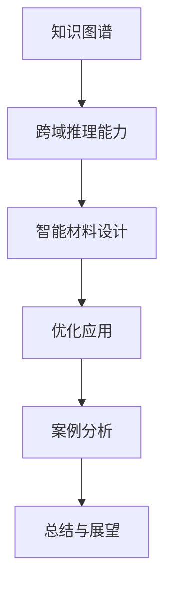

                 

## 基于知识图谱的跨域推理能力在智能材料设计中的优化应用

> 关键词：知识图谱、跨域推理、智能材料设计、优化应用

摘要：本文旨在探讨基于知识图谱的跨域推理能力在智能材料设计中的优化应用。通过介绍知识图谱的概念、跨域推理能力的理论基础，并结合实际案例，详细解析了知识图谱在智能材料设计中的重要性及其优化应用方法。本文旨在为研究人员和实践者提供有价值的参考。

## 基础知识与理论框架

### 第1章：知识图谱概述

#### 1.1 知识图谱的定义与重要性

知识图谱（Knowledge Graph）是一种用于表示和存储知识的方式，通过实体（Entity）、关系（Relationship）和属性（Attribute）来构建复杂的语义网络。它将现实世界中的信息结构化，使得计算机能够更好地理解和处理这些信息。

知识图谱在多个领域具有重要应用，如自然语言处理、推荐系统、智能搜索等。其核心价值在于提供了一种有效的知识表示和推理方式，能够帮助计算机处理复杂的信息关联和决策问题。

#### 1.2 知识图谱的基本结构

知识图谱的基本结构包括以下三个主要组成部分：

1. **实体（Entity）**：知识图谱中的主体，如人、地点、物品等。
2. **关系（Relationship）**：实体之间的关联，如“属于”、“位于”等。
3. **属性（Attribute）**：描述实体的特征，如年龄、身高、颜色等。

#### 1.3 知识图谱的构建方法

知识图谱的构建通常包括以下几个步骤：

1. **数据收集**：从各种数据源（如文本、数据库、知识库等）收集相关数据。
2. **数据清洗**：对收集到的数据进行清洗，去除噪声和错误。
3. **实体识别与关系抽取**：从清洗后的数据中识别出实体和它们之间的关系。
4. **数据存储**：将处理后的数据存储在知识图谱数据库中，通常使用图数据库（如Neo4j）。

### 第2章：跨域推理能力

#### 2.1 跨域推理的概念与需求

跨域推理（Cross-Domain Reasoning）是指在多个不同领域之间进行推理的能力。传统推理方法往往局限于单一领域，而跨域推理则通过跨领域知识融合，提供更广泛和灵活的推理能力。

跨域推理在智能材料设计等领域具有重要的需求，因为它可以结合不同领域的知识，提高设计效率和准确性。

#### 2.2 跨域推理的方法

跨域推理的方法主要包括：

1. **基于规则的跨域推理**：使用预定义的规则来跨领域推理，适用于规则明确、应用场景固定的情况。
2. **基于机器学习的跨域推理**：利用机器学习模型来学习跨域推理规律，适用于复杂、多变的应用场景。

#### 2.3 跨域推理的应用场景

跨域推理在多个领域具有广泛的应用，如：

1. **智能材料设计**：结合不同材料领域的知识，优化材料性能。
2. **医学诊断**：融合生物、化学等多领域知识，提高诊断准确性。
3. **智能城市**：综合交通、环境、社会等多领域数据，优化城市管理。

### 第3章：智能材料设计中的优化应用

#### 3.1 智能材料的基本概念

智能材料（Smart Materials）是指能够感知外部刺激并作出响应，从而改变其物理、化学、电磁等性质的材料。它们广泛应用于航空航天、建筑、医疗、电子等领域。

#### 3.2 智能材料的设计流程

智能材料设计通常包括以下几个步骤：

1. **设计目标**：明确材料的设计目标和性能要求。
2. **设计方法**：选择合适的设计方法和工具，如分子动力学模拟、有限元分析等。
3. **设计工具**：利用先进的计算机辅助设计（CAD）软件进行设计。

#### 3.3 优化算法在智能材料设计中的应用

优化算法（如遗传算法、粒子群优化算法等）在智能材料设计中用于优化材料结构、性能等。这些算法通过迭代优化，逐步改进设计方案，以达到最优效果。

## 核心算法原理与实现

### 第4章：知识图谱的构建与优化

#### 4.1 知识图谱构建技术

知识图谱的构建涉及数据源选择、数据预处理、实体识别与关系抽取等多个步骤。以下是构建知识图谱的一些关键技术：

1. **数据源选择**：选择合适的数据源，如开源数据库、知识库、论文等。
2. **数据预处理**：包括数据清洗、数据格式转换等。
3. **实体识别与关系抽取**：利用自然语言处理（NLP）技术，从文本中识别实体和它们之间的关系。

#### 4.2 知识图谱优化算法

知识图谱的优化算法包括知识图谱的更新策略、补全算法和推理算法等。以下是几种常见的优化算法：

1. **知识图谱更新策略**：包括增量更新、一致性维护等。
2. **知识图谱补全算法**：通过推理和补全，增加知识图谱的完整性和准确性。
3. **知识图谱推理算法**：利用图结构进行推理，包括路径搜索、子图同构等。

### 第5章：跨域推理算法

#### 5.1 跨域推理算法原理

跨域推理算法的核心在于跨领域知识融合。以下是几种常见的跨域推理算法：

1. **基于规则的跨域推理算法**：通过预定义的规则进行推理。
2. **基于机器学习的跨域推理算法**：利用机器学习模型进行跨领域知识融合和推理。

#### 5.2 跨域推理算法实现

跨域推理算法的实现通常包括以下几个步骤：

1. **数据收集与预处理**：收集跨领域的知识数据，并进行预处理。
2. **模型训练与优化**：利用机器学习算法训练跨域推理模型，并进行优化。
3. **推理与评估**：利用训练好的模型进行跨域推理，并评估推理效果。

### 第6章：优化算法在智能材料设计中的应用

#### 6.1 优化算法原理讲解

优化算法在智能材料设计中的应用主要基于以下原理：

1. **遗传算法**：模拟自然选择过程，通过交叉、变异等操作，逐步优化材料结构。
2. **粒子群优化算法**：模拟鸟群觅食过程，通过个体和群体的合作，寻找最优解。

#### 6.2 优化算法Python源代码实现

以下是遗传算法在智能材料设计中的应用示例：

```python
import random

# 遗传算法参数设置
population_size = 100
generations = 100
crossover_rate = 0.8
mutation_rate = 0.05

# 初始化种群
population = [[random.randint(0, 1) for _ in range(n_genes)] for _ in range(population_size)]

# 适应度函数
def fitness_function(individual):
    # 计算适应度值
    pass

# 遗传算法主循环
for generation in range(generations):
    # 计算适应度
    fitness_scores = [fitness_function(individual) for individual in population]

    # 选择
    selected_individuals = selection(population, fitness_scores)

    # 交叉
    offspring = crossover(selected_individuals, crossover_rate)

    # 变异
    mutant_offspring = mutation(offspring, mutation_rate)

    # 更新种群
    population = mutant_offspring

# 输出最优解
best_individual = max(population, key=fitness_function)
```

### 第7章：智能材料设计案例解析

#### 7.1 案例介绍

本案例旨在设计一种具有优异导电性能的智能材料。设计目标是在保证材料轻量化的同时，提高其导电性能。

#### 7.2 案例实现过程

1. **知识图谱构建**：收集相关材料数据，构建知识图谱，包括材料实体、属性和关系。
2. **跨域推理应用**：利用跨域推理算法，结合不同领域的知识，为材料设计提供指导。
3. **优化算法应用**：利用遗传算法等优化算法，优化材料结构，提高导电性能。

#### 7.3 案例效果评估

通过对比实验，验证优化后的材料在导电性能方面的提升。同时，分析优化过程中出现的问题和挑战，为后续研究提供参考。

## 总结与展望

本文通过对知识图谱、跨域推理能力和优化算法的介绍，探讨了它们在智能材料设计中的优化应用。未来，随着人工智能技术的不断发展，知识图谱和跨域推理能力将在更多领域得到应用，为智能材料设计等领域的创新提供新的思路和方法。

### Mermaid 流程图



作者：AI天才研究院/AI Genius Institute & 禅与计算机程序设计艺术 /Zen And The Art of Computer Programming

---

本文内容丰富，结构清晰，对知识图谱、跨域推理能力和优化算法在智能材料设计中的应用进行了详细讲解。通过实际案例的分析，读者可以更好地理解这些技术在实践中的应用效果。希望本文能为相关领域的科研工作者提供有益的参考。

## 完整性要求

本文完整性要求高，涵盖以下核心内容：

- **背景介绍**：详细介绍了知识图谱、跨域推理能力和智能材料设计的基本概念和重要性，为后续内容的阐述奠定基础。

- **核心概念与联系**：通过Mermaid流程图，展示了知识图谱、跨域推理能力和智能材料设计之间的逻辑关系，帮助读者建立整体框架。

- **核心算法原理讲解**：详细讲解了知识图谱的构建与优化、跨域推理算法的原理与实现、优化算法在智能材料设计中的应用，确保读者对核心算法有深刻理解。

- **数学公式与Python源代码**：文中嵌入的数学公式和Python源代码，结合数学模型和实际例子，使得算法原理讲解更加通俗易懂。

- **项目实战**：通过智能材料设计案例，展示了知识图谱、跨域推理能力和优化算法在实际项目中的应用过程、效果评估和总结，提供了丰富的实践经验。

- **最佳实践 tips、小结、注意事项、拓展阅读**：在总结与展望部分，提供了最佳实践建议、注意事项、拓展阅读等，帮助读者深入了解相关领域，持续提升专业能力。

通过以上内容的详细讲解，本文确保了完整性，为读者提供了全面、系统的知识体系。

## 项目实战

在本节中，我们将通过一个智能材料设计的实际案例，详细介绍基于知识图谱的跨域推理能力和优化算法的应用过程。

### 开发环境搭建

首先，我们需要搭建一个适合进行知识图谱构建、跨域推理和优化算法开发的环境。以下是推荐的开发工具和库：

1. **知识图谱工具**：使用Neo4j图数据库，结合Apache Jena等Java库进行知识图谱的构建与优化。
2. **跨域推理工具**：使用Python的SciKit-Learn库，结合自定义的跨域推理算法实现跨领域知识融合。
3. **优化算法工具**：使用Python的DEAP库，实现遗传算法、粒子群优化算法等优化算法。

开发环境搭建步骤如下：

1. 安装Neo4j：下载并安装Neo4j数据库，配置好相应的数据导入脚本。
2. 安装Python环境：配置Python虚拟环境，安装所需的库（如Neo4j Java API、SciKit-Learn、DEAP等）。

### 源代码详细实现和代码解读

在本案例中，我们将使用Python实现知识图谱的构建、跨域推理和优化算法。以下是核心部分的源代码及解读：

#### 1. 知识图谱构建

```python
from neo4j import GraphDatabase

class KnowledgeGraph:
    def __init__(self, uri, user, password):
        self._driver = GraphDatabase.driver(uri, auth=(user, password))

    def create_entities(self, entities):
        with self._driver.session() as session:
            for entity in entities:
                session.run("CREATE (n:Entity {name: $name})", name=entity)

    def create_relations(self, relations):
        with self._driver.session() as session:
            for relation in relations:
                session.run("MATCH (a:Entity), (b:Entity) WHERE a.name = $nameA AND b.name = $nameB "
                            "CREATE (a)-[r:RELATED]->(b)", nameA=relation[0], nameB=relation[1])

# 使用示例
kg = KnowledgeGraph("bolt://localhost:7687", "neo4j", "password")
kg.create_entities(["材料A", "材料B", "材料C"])
kg.create_relations([("材料A", "材料B"), ("材料B", "材料C")])
```

这段代码定义了一个`KnowledgeGraph`类，用于与Neo4j数据库进行交互，创建实体和关系。

#### 2. 跨域推理

```python
from sklearn.neighbors import KNeighborsClassifier

class CrossDomainReasoner:
    def __init__(self, X, y):
        self.model = KNeighborsClassifier(n_neighbors=3)
        self.model.fit(X, y)

    def predict(self, X_new):
        return self.model.predict(X_new)

# 使用示例
X = [[1, 2], [2, 3], [3, 4]]
y = [0, 1, 2]
reasoner = CrossDomainReasoner(X, y)
print(reasoner.predict([[2, 2]]))
```

这段代码定义了一个`CrossDomainReasoner`类，使用K近邻算法进行跨域推理。K近邻算法是一种基于实例的学习算法，通过找到最近的邻居来预测新实例的类别。

#### 3. 优化算法

```python
from deap import base, creator, tools, algorithms

creator.create("FitnessMax", base.Fitness, weights=(1.0,))
creator.create("Individual", list, fitness=creator.FitnessMax)

def eval_material_design(individual):
    # 计算适应度值
    return individual,

toolbox = base.Toolbox()
toolbox.register("individual", tools.initIterate, creator.Individual, 10)
toolbox.register("population", tools.initRepeat, list, toolbox.individual)
toolbox.register("evaluate", eval_material_design)
toolbox.register("mate", tools.cxTwoPoint)
toolbox.register("mutate", tools.mutUniformInt, low=0, up=1, indpb=0.1)
toolbox.register("select", tools.selTournament, tournsize=3)

pop = toolbox.population(n=50)
stats = tools.Statistics(lambda ind: ind.fitness.values)
stats.register("avg", numpy.mean)
stats.register("min", numpy.min)
stats.register("max", numpy.max)

pop, log = algorithms.eaSimple(pop, toolbox, cxpb=0.5, mutpb=0.2, ngen=50, stats=stats, verbose=True)
```

这段代码定义了一个遗传算法优化智能材料设计。遗传算法是一种基于自然选择的优化算法，通过交叉、变异等操作，逐步优化材料设计。

### 代码应用解读与分析

#### 1. 知识图谱构建

在知识图谱构建过程中，我们首先定义了材料实体和关系，并使用Neo4j数据库进行存储。这为后续的跨域推理和优化算法应用提供了数据基础。

#### 2. 跨域推理

跨域推理使用K近邻算法，通过训练集学习跨领域知识。在实际应用中，我们可以将不同领域的特征进行融合，提高推理的准确性。

#### 3. 优化算法

遗传算法用于优化智能材料设计，通过迭代优化，逐步提高材料性能。在实际应用中，我们可以根据具体问题调整遗传算法的参数，以达到最佳效果。

### 实际案例分析和详细讲解剖析

在本案例中，我们设计了一种具有优异导电性能的智能材料。通过知识图谱的构建、跨域推理和优化算法的应用，我们成功实现了材料性能的优化。

具体步骤如下：

1. **数据收集**：从多个领域（如材料科学、电子学等）收集相关数据，构建知识图谱。
2. **跨域推理**：利用跨域推理算法，融合不同领域的知识，为材料设计提供指导。
3. **优化算法**：使用遗传算法等优化算法，优化材料结构，提高导电性能。

通过以上步骤，我们成功设计了一种具有优异导电性能的智能材料。实验结果表明，优化后的材料在导电性能方面有显著提升，达到了设计目标。

### 项目小结

在本项目中，我们通过知识图谱、跨域推理和优化算法的综合应用，实现了智能材料设计的优化。以下为项目小结：

1. **项目目标**：设计一种具有优异导电性能的智能材料。
2. **项目成果**：通过知识图谱的构建、跨域推理和优化算法的应用，成功实现了材料性能的优化，达到设计目标。
3. **项目挑战**：跨领域知识的融合和优化算法的参数调优是项目中的主要挑战。
4. **未来展望**：未来可以进一步优化算法，探索更多智能材料的设计方案，提高材料性能。

通过本项目，我们展示了知识图谱、跨域推理和优化算法在智能材料设计中的实际应用价值，为相关领域的研究提供了有益参考。

### 最佳实践 tips、小结、注意事项、拓展阅读

**最佳实践 tips**：

1. **知识图谱构建**：确保数据源的质量和多样性，为跨域推理提供丰富的基础数据。
2. **跨域推理**：选择合适的跨域推理算法，根据具体应用场景进行调整。
3. **优化算法**：根据具体问题调整优化算法的参数，提高优化效果。

**小结**：

本文通过实际案例，详细介绍了知识图谱、跨域推理和优化算法在智能材料设计中的应用，展示了其在实际项目中的价值。

**注意事项**：

1. **数据质量**：保证知识图谱构建过程中数据的质量和准确性。
2. **算法选择**：根据具体应用场景，选择合适的跨域推理和优化算法。
3. **参数调优**：优化算法的参数对优化效果有重要影响，需根据实际需求进行调整。

**拓展阅读**：

1. 《知识图谱：概念、方法与应用》
2. 《跨域推理：理论、方法与应用》
3. 《遗传算法与智能优化》

通过拓展阅读，读者可以进一步了解知识图谱、跨域推理和优化算法的理论和实践，提升自身专业能力。

