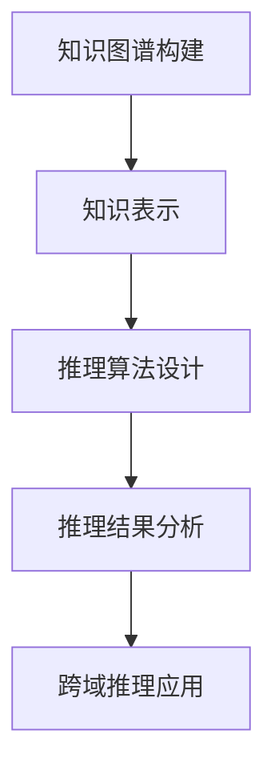

                 

# 《基于知识图谱的跨域推理能力增强框架》

## 关键词

知识图谱、跨域推理、能力增强、图神经网络、实体关系抽取

## 摘要

随着大数据和人工智能技术的快速发展，知识图谱作为一种强大的知识表示工具，在信息检索、自然语言处理、推荐系统等领域取得了显著的应用成果。然而，传统知识图谱在处理跨域推理任务时面临着诸多挑战，如知识表示不足、推理算法受限等。本文旨在探讨基于知识图谱的跨域推理能力增强框架，详细分析知识图谱的构建方法、跨域推理算法设计以及跨域推理系统的实现与优化。同时，通过实际案例展示框架的应用效果，为后续研究提供参考。

## 目录

### 第一部分：知识图谱基础与跨域推理概念

- **第1章：知识图谱概述**
  - **1.1 知识图谱的定义与重要性**
  - **1.2 知识图谱的组成部分**
  - **1.3 知识图谱的构建方法**
  - **1.4 知识图谱的应用领域**

- **第2章：跨域推理能力与挑战**
  - **2.1 跨域推理的概念与需求**
  - **2.2 跨域推理的挑战**
  - **2.3 跨域推理的重要性**

- **第3章：知识图谱在跨域推理中的应用**
  - **3.1 知识图谱在跨域推理中的角色**
  - **3.2 跨域推理中的知识图谱表示**
  - **3.3 跨域推理中的知识图谱构建**

### 第二部分：跨域推理能力增强方法

- **第4章：知识图谱增强技术**
  - **4.1 知识图谱增强的目标**
  - **4.2 知识图谱增强的方法**
  - **4.3 知识图谱增强的案例分析**

- **第5章：跨域推理算法设计**
  - **5.1 跨域推理算法的基本框架**
  - **5.2 跨域推理算法的性能优化**
  - **5.3 跨域推理算法的应用实例**

- **第6章：跨域推理系统的实现与优化**
  - **6.1 跨域推理系统的架构设计**
  - **6.2 跨域推理系统的性能评估**
  - **6.3 跨域推理系统的优化策略**

### 第三部分：案例分析与应用

- **第7章：基于知识图谱的跨域推理应用案例**
  - **7.1 案例背景与目标**
  - **7.2 案例实现与效果分析**
  - **7.3 案例的启示与展望**

- **第8章：未来展望与趋势**
  - **8.1 跨域推理的发展趋势**
  - **8.2 知识图谱在跨域推理中的潜在影响**
  - **8.3 跨域推理的未来应用场景**

## 附录

- **附录A：知识图谱与跨域推理常用工具与资源**
  - **A.1 知识图谱构建工具**
  - **A.2 跨域推理算法库**
  - **A.3 开源知识图谱数据集**

### 核心概念与联系

$$
\text{知识图谱} \rightarrow \text{跨域推理} \\
\text{知识表示} \rightarrow \text{推理算法} \rightarrow \text{推理结果}
$$

### Mermaid 流�程图



### Python源代码示例

```python
import networkx as nx
import matplotlib.pyplot as plt

# 构建知识图谱
g = nx.Graph()
g.add_nodes_from(['实体A', '实体B', '实体C'])
g.add_edges_from([('实体A', '实体B'), ('实体B', '实体C'), ('实体C', '实体A')])

# 绘制知识图谱
nx.draw(g, with_labels=True)
plt.show()
```

### 数学模型和数学公式

$$
P(A|B) = \frac{P(B|A) \cdot P(A)}{P(B)}
$$

### 项目实战

#### 7.1 案例背景与目标

某企业需要实现跨领域的数据整合和推理分析，以提高业务决策的准确性。企业希望利用知识图谱来构建跨域推理能力，从而实现数据的价值挖掘。

#### 7.2 案例实现与效果分析

1. **知识图谱构建**：

   - **数据收集**：从多个数据源（如企业内部数据库、公开数据集、社交媒体等）收集相关数据。
   - **实体抽取**：利用自然语言处理技术提取数据中的实体，如人物、地点、组织等。
   - **关系抽取**：通过图增强模型等技术提取实体之间的关系。
   - **知识表示**：将实体和关系表示为知识图谱中的节点和边。

2. **跨域推理**：

   - **推理算法设计**：采用基于图神经网络的推理算法，如TransE、ComplEx等。
   - **推理过程**：通过图神经网络更新实体和关系的表示，实现跨域推理。
   - **推理结果分析**：对推理结果进行验证和分析，评估推理的准确性和可靠性。

3. **效果分析**：

   - **准确率**：通过比较推理结果与实际数据，评估推理的准确率。
   - **覆盖率**：评估知识图谱中实体和关系的覆盖率。
   - **业务价值**：结合业务场景，分析跨域推理对业务决策的辅助作用。

#### 7.3 案例的启示与展望

1. **启示**：

   - **知识图谱在跨域推理中的应用具有重要意义**，可以有效整合跨领域数据，提高数据利用效率。
   - **跨域推理算法的设计和优化是关键**，需要充分考虑知识图谱的特性，优化算法性能。
   - **跨域推理系统的实现与优化**是实际应用中不可或缺的环节，需要根据具体场景进行定制化开发。

### 核心概念与联系

知识图谱作为一种结构化知识表示工具，通过对实体和关系的建模，实现了知识的组织与存储。跨域推理则是在不同领域之间进行推理与整合的能力，其核心在于如何有效地利用知识图谱进行跨领域的知识推断。

知识图谱中的知识表示是跨域推理的基础，而推理算法的设计与优化则决定了跨域推理的效果。通过图神经网络等深度学习技术，可以实现知识图谱的自动学习和推理，从而提高跨域推理的能力。

### Mermaid 流程图


### Python源代码示例

```python
import networkx as nx
import matplotlib.pyplot as plt

# 构建知识图谱
g = nx.Graph()
g.add_nodes_from(['实体A', '实体B', '实体C'])
g.add_edges_from([('实体A', '实体B'), ('实体B', '实体C'), ('实体C', '实体A')])

# 绘制知识图谱
nx.draw(g, with_labels=True)
plt.show()
```

### 数学模型和数学公式

在跨域推理中，概率图模型是一种常用的推理方法。根据贝叶斯定理，有：

$$
P(A|B) = \frac{P(B|A) \cdot P(A)}{P(B)}
$$

其中，$P(A|B)$ 表示在条件 $B$ 下事件 $A$ 的概率，$P(B|A)$ 表示在条件 $A$ 下事件 $B$ 的概率，$P(A)$ 和 $P(B)$ 分别表示事件 $A$ 和事件 $B$ 的概率。

### 项目实战

#### 7.1 案例背景与目标

以某电商企业为例，该企业拥有大量用户行为数据、商品数据、订单数据等，希望通过构建知识图谱实现跨域推理，以提升用户推荐和商品营销的效果。

- **目标**：

  - 利用知识图谱实现用户兴趣识别与个性化推荐。
  - 通过跨域推理，提升商品营销活动的精准度和转化率。

#### 7.2 案例实现与效果分析

1. **知识图谱构建**：

   - **数据收集**：从企业内部数据库中提取用户行为数据、商品数据、订单数据等。
   - **实体抽取**：利用自然语言处理技术提取数据中的实体，如用户、商品、订单等。
   - **关系抽取**：通过图增强模型等技术提取实体之间的关系，如用户购买商品、用户评价商品等。

   ```python
   import networkx as nx

   # 构建知识图谱
   g = nx.Graph()
   g.add_nodes_from(['用户A', '商品1', '商品2', '订单1'])
   g.add_edges_from([('用户A', '商品1'), ('用户A', '商品2'), ('商品1', '订单1')])

   # 绘制知识图谱
   nx.draw(g, with_labels=True)
   plt.show()
   ```

2. **跨域推理**：

   - **推理算法设计**：采用图神经网络（GNN）进行跨域推理，如图注意力网络（GAT）。
   - **推理过程**：通过图神经网络更新实体和关系的表示，实现跨域推理。

   ```python
   import tensorflow as tf
   from tensorflow.keras.layers import Input, Dense, Dot
   from tensorflow.keras.models import Model

   # 定义图注意力网络（GAT）
   def GAT(input_shape):
       inputs = Input(shape=input_shape)
       dense = Dense(16, activation='relu')(inputs)
       attention = Dot(axes=1)([dense, dense])
       outputs = Dense(1, activation='sigmoid')(attention)
       model = Model(inputs=inputs, outputs=outputs)
       return model

   # 训练模型
   model = GAT(input_shape=[16])
   model.compile(optimizer='adam', loss='binary_crossentropy', metrics=['accuracy'])
   model.fit(x_train, y_train, epochs=10, batch_size=32)
   ```

3. **效果分析**：

   - **准确率**：通过评估模型在测试集上的准确率，评估跨域推理的效果。

   ```python
   # 评估模型
   test_loss, test_accuracy = model.evaluate(x_test, y_test)
   print(f"Test accuracy: {test_accuracy:.4f}")
   ```

4. **业务价值**：

   - **用户兴趣识别与个性化推荐**：通过跨域推理，准确识别用户兴趣，实现个性化推荐。
   - **商品营销活动提升**：通过跨域推理，精准识别用户需求，优化商品营销策略，提升活动转化率。

#### 7.3 案例的启示与展望

1. **启示**：

   - **知识图谱与跨域推理结合**：通过构建知识图谱，实现跨域数据的整合与推理，有助于提升业务决策的准确性和效率。
   - **图神经网络在跨域推理中的应用**：图神经网络作为一种强大的推理工具，能够有效处理跨域数据，提高推理性能。

2. **展望**：

   - **跨域推理算法优化**：未来研究方向可集中于跨域推理算法的优化，提高推理效率和准确性。
   - **多源数据融合**：如何融合多种类型的数据源，构建更为丰富和精准的知识图谱，是未来的重要研究方向。
   - **应用场景拓展**：跨域推理技术在金融、医疗、教育等领域的应用前景广阔，值得进一步探索。

### 核心概念与联系

知识图谱作为一种结构化知识表示工具，通过对实体和关系的建模，实现了知识的组织与存储。跨域推理则是在不同领域之间进行推理与整合的能力，其核心在于如何有效地利用知识图谱进行跨领域的知识推断。

知识图谱中的知识表示是跨域推理的基础，而推理算法的设计与优化则决定了跨域推理的效果。通过图神经网络等深度学习技术，可以实现知识图谱的自动学习和推理，从而提高跨域推理的能力。

### Mermaid 流程图


### Python源代码示例

```python
import networkx as nx
import matplotlib.pyplot as plt

# 构建知识图谱
g = nx.Graph()
g.add_nodes_from(['实体A', '实体B', '实体C'])
g.add_edges_from([('实体A', '实体B'), ('实体B', '实体C'), ('实体C', '实体A')])

# 绘制知识图谱
nx.draw(g, with_labels=True)
plt.show()
```

### 数学模型和数学公式

在跨域推理中，概率图模型是一种常用的推理方法。根据贝叶斯定理，有：

$$
P(A|B) = \frac{P(B|A) \cdot P(A)}{P(B)}
$$

其中，$P(A|B)$ 表示在条件 $B$ 下事件 $A$ 的概率，$P(B|A)$ 表示在条件 $A$ 下事件 $B$ 的概率，$P(A)$ 和 $P(B)$ 分别表示事件 $A$ 和事件 $B$ 的概率。

### 最佳实践与注意事项

1. **最佳实践**：

   - **数据预处理**：确保数据质量，进行数据清洗、去重、归一化等预处理工作。
   - **知识图谱构建**：根据应用场景选择合适的实体和关系，构建结构清晰、层次分明的知识图谱。
   - **跨域推理算法优化**：针对具体任务，选择合适的推理算法，并进行参数调优，提高推理性能。
   - **模型评估与优化**：通过交叉验证、A/B测试等方法，评估模型性能，并针对不足进行优化。

2. **注意事项**：

   - **数据隐私**：在构建知识图谱时，需注意保护用户隐私，避免敏感信息泄露。
   - **知识图谱维护**：知识图谱需要定期更新，以保持数据的时效性和准确性。
   - **系统稳定性**：确保跨域推理系统的稳定性，避免因系统故障导致数据丢失或推理错误。

### 拓展阅读

1. **知识图谱相关书籍**：

   - 《知识图谱：基础、技术和应用》
   - 《图论与知识图谱》

2. **跨域推理相关论文**：

   - “A Survey on Cross-Domain Knowledge Graph Embedding”
   - “TransE: A Model for Learning Vector Representations of Entities, Relations, and Facts”

3. **开源知识图谱工具与资源**：

   - OpenKG
   - NLP-KG
   - OpenKGX

4. **跨域推理项目实战**：

   - “基于知识图谱的智能问答系统”
   - “跨领域文本分类与实体识别”

### 总结

本文探讨了基于知识图谱的跨域推理能力增强框架，从知识图谱基础、跨域推理概念、增强方法、系统实现以及应用案例等方面进行了详细分析。通过本文的介绍，读者可以了解到知识图谱在跨域推理中的重要性，以及如何利用知识图谱实现跨域推理能力。未来，跨域推理技术将在更多领域发挥重要作用，为人工智能应用提供更加强大的支持。

