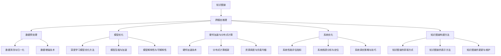

                 

### 背景介绍

随着大数据、云计算和人工智能技术的飞速发展，跨模态推理已成为自然语言处理、计算机视觉、语音识别等领域的研究热点。跨模态推理的目标是将来自不同模态（如文本、图像、音频等）的数据进行融合，以获取更全面、准确的信息，从而提高系统的性能和应用价值。知识图谱作为一种结构化、语义化的知识表示方法，在跨模态推理中发挥着重要作用。

知识图谱通过将现实世界中的实体、属性和关系进行抽象和表示，构建出一个大规模、多层次的语义网络。它能够将不同模态的数据进行关联，从而实现跨模态信息融合。例如，在基于知识图谱的新闻推荐系统中，可以通过将文本内容、图像特征和音频特征进行融合，提高推荐系统的准确性和多样性。在医疗诊断领域，知识图谱可以帮助医生更准确地理解患者的历史病历、检查报告和症状，从而提高诊断的准确性和效率。

然而，跨模态推理系统在实际应用中面临着诸多挑战。首先，不同模态的数据具有不同的特性和分布，如何有效地提取和融合这些特征成为一个关键问题。其次，知识图谱的构建和更新需要大量的时间和计算资源，如何高效地构建和维护知识图谱也是一个挑战。此外，跨模态推理系统在实际运行中可能存在数据质量差、模型过拟合等问题，需要进行有效的优化和调参。

本文将围绕基于知识图谱的跨模态推理系统性能优化展开讨论。首先，我们将介绍知识图谱的基本概念、组成部分及其在跨模态推理中的应用。接着，我们将探讨跨模态推理的基础知识，包括定义、挑战、特征提取方法和模型构建。随后，我们将深入探讨知识图谱的构建方法，包括获取方式、表示方法和更新与维护。然后，我们将详细阐述跨模态推理系统的设计，包括整体架构、模块划分与功能以及推理算法的选择与优化。在第二部分，我们将重点介绍性能优化策略，包括数据预处理、模型优化、硬件加速与分布式计算以及系统优化。最后，我们将通过案例研究和未来展望，对跨模态推理系统的性能优化进行实践应用和展望。

通过本文的详细探讨，我们将深入理解基于知识图谱的跨模态推理系统的性能优化方法，为相关领域的学术研究和工程实践提供有价值的参考。

### 核心概念与联系

在深入探讨基于知识图谱的跨模态推理系统之前，我们需要明确几个核心概念，并理解它们之间的相互关系。以下是本文中的关键概念及其关系架构的Mermaid流程图：



#### 1. 知识图谱

知识图谱（Knowledge Graph）是一种用于结构化知识表示的方法，它通过实体、属性和关系的三角连接来表示现实世界中的复杂信息。知识图谱的核心概念包括：

- **实体（Entity）**：现实世界中的对象，如人、地点、组织等。
- **属性（Attribute）**：描述实体的特征，如年龄、身高、地理位置等。
- **关系（Relationship）**：连接两个或多个实体的语义关系，如“居住于”、“属于”等。

#### 2. 跨模态推理

跨模态推理（Cross-Modal Reasoning）涉及将来自不同模态的数据（如文本、图像、音频）进行融合，以解决单一模态无法解决的问题。核心概念包括：

- **模态（Modal）**：数据的不同表现形式，如文本、图像、音频。
- **特征提取（Feature Extraction）**：从不同模态的数据中提取具有区分度的特征。
- **模型构建（Model Building）**：利用提取的特征训练模型，以实现跨模态信息融合。

#### 3. 数据预处理

数据预处理是跨模态推理系统性能优化的关键步骤，它包括数据清洗与归一化、数据增强技术等。核心概念包括：

- **数据清洗（Data Cleaning）**：去除噪声数据、缺失值填充等。
- **数据归一化（Data Normalization）**：将数据转换为统一的尺度，以消除数据量级差异。
- **数据增强（Data Augmentation）**：通过增加数据多样性来提高模型的泛化能力。

#### 4. 模型优化

模型优化涉及深度学习模型优化方法、模型压缩与加速、模型解释性与可解释性等方面。核心概念包括：

- **深度学习模型优化方法**：调整模型结构、参数优化等。
- **模型压缩与加速**：通过减少模型参数或使用特殊结构来加速模型训练和推理。
- **模型解释性与可解释性**：使模型决策过程易于理解和解释。

#### 5. 硬件加速与分布式计算

硬件加速与分布式计算是提升跨模态推理系统性能的重要手段。核心概念包括：

- **硬件加速技术**：利用GPU、FPGA等硬件加速跨模态推理。
- **分布式计算框架**：通过分布式计算来提高系统处理能力。
- **资源调度与负载均衡**：优化资源利用，实现系统负载均衡。

#### 6. 系统优化

系统优化涉及系统性能评估指标、系统瓶颈分析与定位、系统调优策略与技巧等方面。核心概念包括：

- **系统性能评估指标**：评估系统性能的指标，如准确率、召回率等。
- **系统瓶颈分析与定位**：识别系统中的性能瓶颈。
- **系统调优策略与技巧**：通过调优策略和技巧来提升系统性能。

通过上述核心概念及其关系的Mermaid流程图，我们可以清晰地理解基于知识图谱的跨模态推理系统的各个方面及其相互联系。接下来，我们将深入探讨这些核心概念在实际系统设计中的具体应用和实践。

### 跨模态推理的基本概念与挑战

跨模态推理是一种多模态数据处理技术，旨在将来自不同模态的数据（如文本、图像、音频等）进行融合，以实现更高层次的信息理解和任务完成。基本概念包括：

- **多模态数据**：指来自不同感官通道的数据，如视觉、听觉、触觉等。
- **数据融合**：将不同模态的数据进行结合，以提取更丰富、更全面的特征。
- **特征表示**：将不同模态的数据转换为统一的特征表示，以便于模型处理。
- **推理**：利用融合的特征进行推理，以实现跨模态任务，如图像识别、文本分类、语音识别等。

跨模态推理的核心目标是通过不同模态数据的融合，克服单一模态的局限性，提高任务性能。然而，这一目标在实际实现过程中面临诸多挑战：

1. **特征不一致性**：不同模态的数据在分布、维度和特征表达上存在显著差异，如何有效地融合这些特征成为一个关键问题。

   - **数据分布差异**：例如，文本数据通常具有高维稀疏性，而图像和音频数据则具有高维稠密性。
   - **特征维度差异**：不同模态数据的特征维度可能相差很大，需要设计合适的特征融合方法。

2. **模态关联性**：不同模态之间的关联性是跨模态推理的关键，如何准确地挖掘和利用这些关联性是一个挑战。

   - **语义关联**：需要理解不同模态数据之间的语义关系，如文本描述与图像内容的对应关系。
   - **上下文关联**：在不同上下文中，不同模态数据的关联性可能有所不同，需要动态调整关联模型。

3. **数据标注与质量**：高质量的标注数据是训练高性能跨模态模型的基础，但在实际应用中，获取大规模、高质量的标注数据非常困难。

   - **标注成本高**：标注过程通常需要大量的人工参与，成本高昂。
   - **数据噪声**：未标注或部分标注的数据可能引入噪声，影响模型性能。

4. **计算资源消耗**：跨模态推理通常涉及复杂的模型和算法，计算资源消耗巨大，如何在有限资源下实现高效推理是一个挑战。

   - **模型压缩**：通过模型压缩技术降低计算复杂度。
   - **分布式计算**：利用分布式计算框架提高系统处理能力。

5. **实时性与可扩展性**：在实时应用场景中，跨模态推理系统需要快速响应并处理大量数据，同时保持系统的可扩展性。

   - **实时推理**：设计高效的推理算法和优化策略，以实现快速响应。
   - **系统扩展**：通过分布式计算和负载均衡技术，实现系统的水平扩展。

面对上述挑战，跨模态推理系统需要采用多种优化策略，如特征融合方法、关联性挖掘技术、数据增强技术、模型压缩与加速等，以提高系统性能和应用价值。在接下来的章节中，我们将详细探讨这些策略和方法，并介绍相关的实现技术和算法。

#### 跨模态特征提取方法

跨模态特征提取是跨模态推理系统的核心步骤之一，其主要目标是从不同模态的数据中提取具有区分度和代表性的特征，以便于后续的融合与推理。以下是几种常见的跨模态特征提取方法：

1. **基于深度学习的特征提取方法**

   - **卷积神经网络（CNN）**：CNN在图像特征提取方面表现优异。通过堆叠多个卷积层，CNN可以自动学习图像中的低级特征（如边缘、纹理）到高级特征（如图像内容）。
     ```python
     import tensorflow as tf
     from tensorflow.keras.models import Sequential
     from tensorflow.keras.layers import Conv2D, MaxPooling2D, Flatten, Dense

     model = Sequential([
         Conv2D(32, (3, 3), activation='relu', input_shape=(224, 224, 3)),
         MaxPooling2D((2, 2)),
         Conv2D(64, (3, 3), activation='relu'),
         MaxPooling2D((2, 2)),
         Flatten(),
         Dense(128, activation='relu'),
         Dense(10, activation='softmax')
     ])
     ```
   - **循环神经网络（RNN）**：RNN在处理序列数据（如文本、音频）方面具有优势，通过LSTM或GRU单元，RNN可以捕捉序列中的长期依赖关系。
     ```python
     import tensorflow as tf
     from tensorflow.keras.models import Sequential
     from tensorflow.keras.layers import LSTM, Dense

     model = Sequential([
         LSTM(128, input_shape=(timesteps, features)),
         Dense(10, activation='softmax')
     ])
     ```

2. **基于传统的特征提取方法**

   - **文本特征提取**：常用的文本特征提取方法包括词袋模型（Bag of Words，BOW）和词嵌入（Word Embedding）。词袋模型将文本表示为词汇的频率分布，而词嵌入则通过将词汇映射为低维稠密向量，捕捉词汇的语义信息。
     ```python
     from sklearn.feature_extraction.text import CountVectorizer
     from gensim.models import Word2Vec

     # 使用CountVectorizer进行词袋模型
     vectorizer = CountVectorizer()
     X = vectorizer.fit_transform(corpus)

     # 使用Word2Vec进行词嵌入
     model = Word2Vec(corpus, size=100, window=5, min_count=1, workers=4)
     ```

   - **图像特征提取**：图像特征提取通常使用手工设计的特征（如HOG、SIFT、SURF）或深度学习的特征提取器（如VGG、ResNet）。以下是一个使用VGG16进行图像特征提取的示例：
     ```python
     from tensorflow.keras.applications import VGG16
     from tensorflow.keras.preprocessing import image
     import numpy as np

     model = VGG16(weights='imagenet', include_top=False)
     img = image.load_img('path_to_image', target_size=(224, 224))
     x = image.img_to_array(img)
     x = np.expand_dims(x, axis=0)
     x = preprocess_input(x)
     features = model.predict(x)
     ```

   - **音频特征提取**：音频特征提取方法包括梅尔频率倒谱系数（MFCC）、谱图（Spectrogram）等。以下是一个使用MFCC进行音频特征提取的示例：
     ```python
     import numpy as np
     from scipy.io import wavfile
     from python_speech_features import mfcc

     # 读取音频文件
     rate, data = wavfile.read('path_to_audio')

     # 使用mfcc函数提取特征
     features = mfcc(data, rate)
     ```

3. **多模态特征融合方法**

   - **特征拼接**：将不同模态的特征直接拼接在一起，形成高维特征向量。
     ```python
     text_features = np.array([vec for vec in text_feature_vectors])
     image_features = np.array([vec for vec in image_feature_vectors])
     audio_features = np.array([vec for vec in audio_feature_vectors])
     fused_features = np.hstack((text_features, image_features, audio_features))
     ```

   - **特征级联**：将不同模态的特征分别输入到独立的子网络中，然后通过级联的方式将特征进行融合。
     ```python
     # 示例：使用Keras实现特征级联
     from tensorflow.keras.models import Model

     input_text = Input(shape=(text_feature_size,))
     input_image = Input(shape=(image_feature_size,))
     input_audio = Input(shape=(audio_feature_size,))

     text_embedding = Dense(128, activation='relu')(input_text)
     image_embedding = Dense(128, activation='relu')(input_image)
     audio_embedding = Dense(128, activation='relu')(input_audio)

     fused_embedding = Concatenate()([text_embedding, image_embedding, audio_embedding])
     output = Dense(num_classes, activation='softmax')(fused_embedding)

     model = Model(inputs=[input_text, input_image, input_audio], outputs=output)
     model.compile(optimizer='adam', loss='categorical_crossentropy', metrics=['accuracy'])
     ```

通过上述方法，我们可以从不同模态的数据中提取特征，并融合这些特征以实现跨模态任务。在下一节中，我们将探讨如何构建跨模态模型，以及模型的设计和训练策略。

### 知识图谱构建方法

知识图谱的构建是跨模态推理系统的关键步骤，它涉及到如何有效地从数据中获取、表示和更新知识，从而为跨模态推理提供坚实的语义基础。以下是知识图谱构建的几个关键环节：

#### 1. 知识图谱的获取方式

知识图谱的获取方式主要包括自动获取和半自动/手动获取。

- **自动获取**：通过爬虫、公开数据集、API等方式自动获取。例如，使用开源工具（如Nutch、Scrapy等）从互联网上抓取大量文本数据，然后通过命名实体识别（NER）和关系抽取（RE）等方法提取实体和关系。
  ```python
  from spacy.lang.en import English
  import en_core_web_sm

  nlp = en_core_web_sm.load()
  doc = nlp("Apple is looking at buying U.K. startup for $1 billion")
  entities = [(ent.text, ent.label_) for ent in doc.ents]
  ```

- **半自动/手动获取**：通过人工标注和半自动工具相结合的方式。例如，将自动提取的实体和关系与人工审核相结合，确保知识图谱的准确性。
  ```python
  entities = [("Apple", "ORG"), ("U.K.", "GPE"), ("start

