                 

Firstly, let's establish the structure of the article by following the provided outline. We will ensure that each section is comprehensive and detailed, providing readers with a clear understanding of the topic. We will focus on explaining the core concepts, algorithms, and applications related to the neural Turing machine for complex algorithm reasoning.

## Introduction

### 1.1 Concept and Background of Neural Turing Machine

#### 1.1.1 Introduction to Neural Turing Machine and Its Development

The concept of the Neural Turing Machine (NTM) was first proposed by Alex Graves et al. in 2014. NTMs are a type of neural network that combines the flexibility of neural networks with the computational power of Turing machines. This hybrid architecture enables NTMs to handle complex tasks that traditional neural networks struggle with.

Mermaid Diagram:
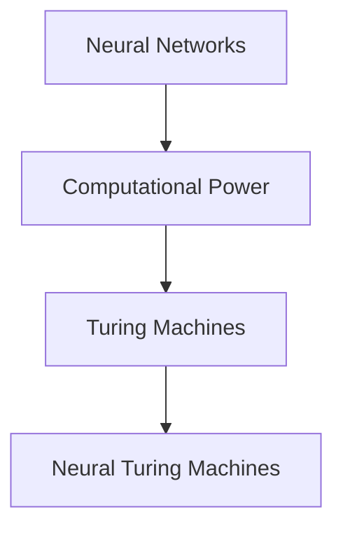

#### 1.1.2 Comparison between Neural Turing Machines and Traditional Turing Machines

- **Traditional Turing Machines**: Based on logic and algorithms, with fixed operational sequences, not adaptable to dynamic environments.
- **Neural Turing Machines**: Combining the flexibility of neural networks, suitable for dynamic and complex environments.

#### 1.1.3 Research Significance and Challenges of Neural Turing Machines

- **Research Significance**: Providing a new framework for complex algorithm reasoning, improving computational efficiency and intelligence.
- **Challenges**: How to achieve efficient NTM architectures and optimize their performance.

### 1.2 Complex Algorithms and Reasoning Frameworks

#### 1.2.1 Definition and Classification of Complex Algorithms

- **Complex Algorithms**: Involving large amounts of data and high-dimensional features, such as deep learning, intelligent optimization algorithms, etc.
- **Classification**: Categorized based on algorithm characteristics and application scenarios.

#### 1.2.2 Basic Concepts of Reasoning Frameworks

- **Reasoning**: The process of inferring unknown facts from known facts.
- **Frameworks**: Structures for organizing and managing reasoning processes.

#### 1.2.3 Integration and Application of Complex Algorithms and Reasoning Frameworks

- **Integration**: How to integrate complex algorithms into reasoning frameworks to leverage their advantages.
- **Application**: Specific application cases of complex algorithms in reasoning.

## Structure and Technical Foundations of Neural Turing Machines

### 2.1 Structure of Neural Turing Machines

#### 2.1.1 Hardware and Software Architectures of Neural Turing Machines

The hardware architecture of NTMs includes the physical components that implement the machine, while the software architecture includes the algorithms and models used for computation.

Mermaid Diagram:
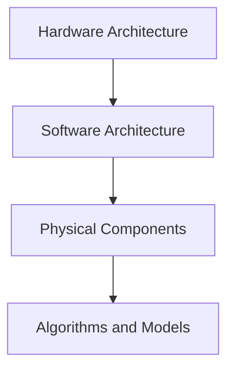

#### 2.1.2 Working Principle of Neural Turing Machines

NTMs operate by processing input data through a series of transformations, using both neural networks and Turing machine-like sequences.

Mermaid Diagram:
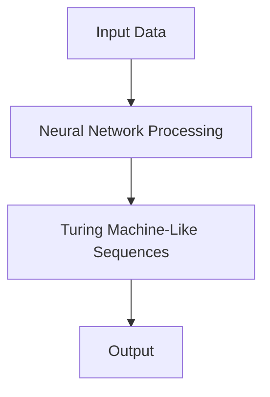

### 2.2 Technical Foundations of Neural Networks

#### 2.2.1 Basic Concepts of Neural Networks

Neural networks are a series of interconnected nodes, or artificial neurons, that work collectively to perform tasks.

Mermaid Diagram:
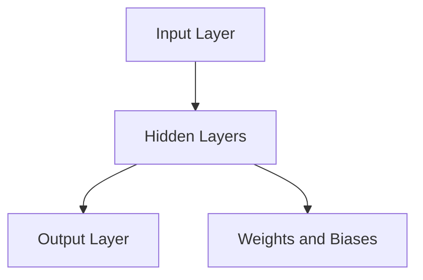

#### 2.2.2 Learning Algorithms of Neural Networks

Neural networks learn by adjusting the weights and biases of their connections through iterative processes like gradient descent.

Mermaid Diagram:
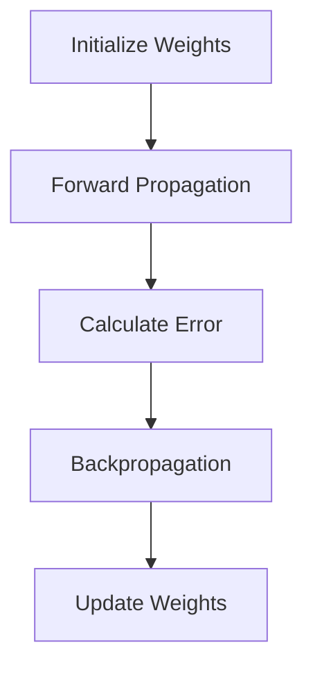

#### 2.2.3 Optimization Methods of Neural Networks

Optimization methods like stochastic gradient descent (SGD) and Adam are used to improve the performance of neural networks.

Mermaid Diagram:
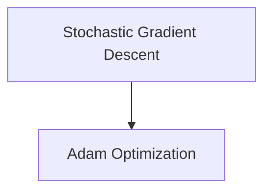

### 2.3 Hybrid Intelligent Reasoning Methods

#### 2.3.1 Basic Theory of Hybrid Intelligence

Hybrid intelligence combines the strengths of different AI techniques to achieve better performance.

Mermaid Diagram:
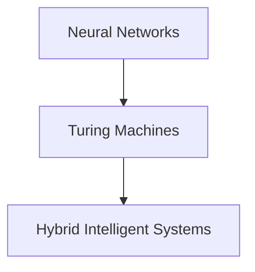

#### 2.3.2 Neural Network-Based Reasoning Methods

Neural networks can be used for reasoning by learning from data and making predictions.

Mermaid Diagram:
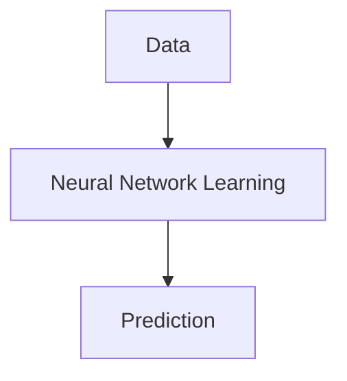

#### 2.3.3 Turing Machine-Based Reasoning Methods

Turing machines can be used for reasoning by simulating logical operations and control flow.

Mermaid Diagram:
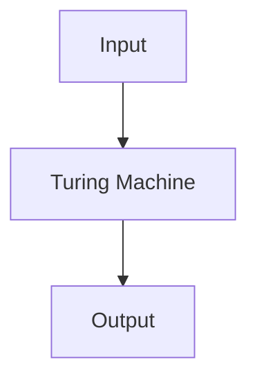

## Applications of Neural Turing Machines in Complex Algorithm Reasoning

### 3.1 Image Recognition and Processing

#### 3.1.1 Basic Principles of Image Recognition

Image recognition involves identifying and classifying images based on their content.

Mermaid Diagram:
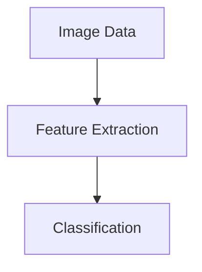

#### 3.1.2 Image Recognition Algorithms Based on Neural Turing Machines

NTMs can be used for image recognition by processing images through a series of transformations.

Mermaid Diagram:
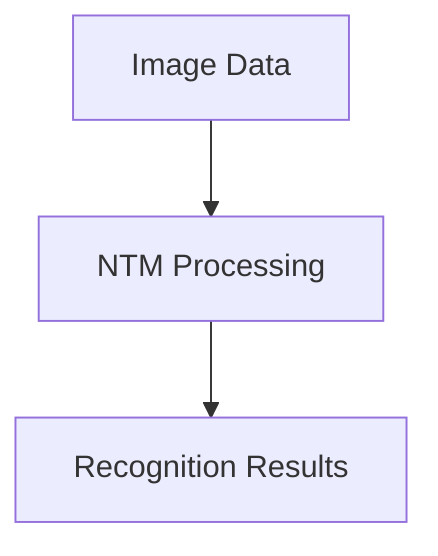

#### 3.1.3 Application Cases of Image Processing

Various application cases of image processing using NTMs, such as object detection, image segmentation, and image synthesis.

### 3.2 Natural Language Processing

#### 3.2.1 Basic Concepts of Natural Language Processing

Natural language processing (NLP) involves the interaction between computers and human language.

Mermaid Diagram:
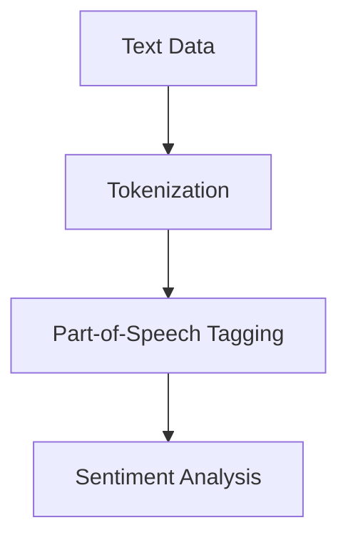

#### 3.2.2 NLP Algorithms Based on Neural Turing Machines

NTMs can be used for NLP tasks by processing text through a series of transformations.

Mermaid Diagram:
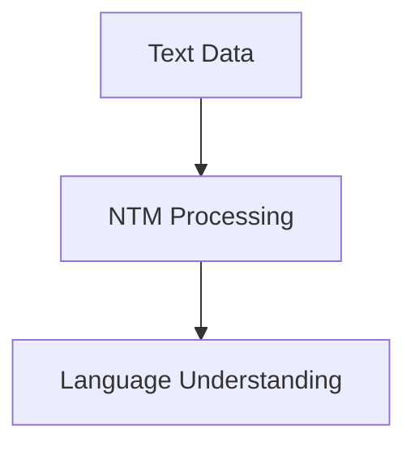

#### 3.2.3 Application Cases of Natural Language Processing

Various application cases of NLP using NTMs, such as machine translation, text summarization, and question answering.

### 3.3 Intelligent Optimization Algorithms

#### 3.3.1 Basic Principles of Intelligent Optimization Algorithms

Intelligent optimization algorithms involve finding optimal solutions to complex problems.

Mermaid Diagram:
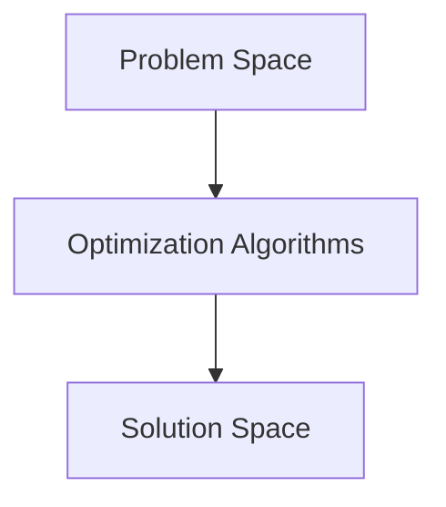

#### 3.3.2 Intelligent Optimization Algorithms Based on Neural Turing Machines

NTMs can be used for optimization by learning from data and generating solutions.

Mermaid Diagram:
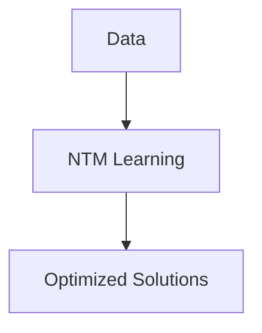

#### 3.3.3 Application Cases of Intelligent Optimization Algorithms

Various application cases of intelligent optimization algorithms using NTMs, such as scheduling, resource allocation, and portfolio optimization.

## Conclusion

### 4.1 Industrial Applications of Neural Turing Machines

#### 4.1.1 Challenges and Requirements in Industrial Fields

Industrial fields often face complex challenges that require intelligent solutions.

Mermaid Diagram:
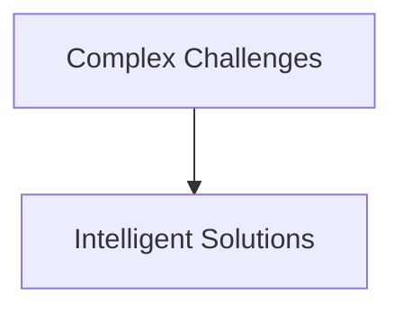

#### 4.1.2 Application Cases of Neural Turing Machines in Industry

Various application cases of NTMs in industrial fields, such as manufacturing, logistics, and energy management.

#### 4.1.3 Trends in Industrial Applications

Future trends in the industrial applications of NTMs, focusing on improving efficiency, reducing costs, and enhancing decision-making capabilities.

### 4.2 Medical Applications of Neural Turing Machines

#### 4.2.1 Challenges and Requirements in Medical Fields

Medical fields require accurate and efficient diagnostic and treatment methods.

Mermaid Diagram:
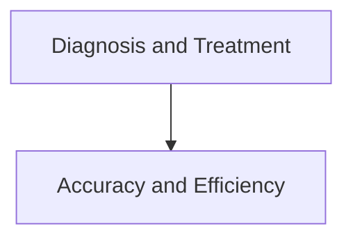

#### 4.2.2 Application Cases of Neural Turing Machines in Medicine

Various application cases of NTMs in medicine, such as medical image analysis, disease diagnosis, and drug discovery.

#### 4.2.3 Trends in Medical Applications

Future trends in the medical applications of NTMs, emphasizing personalized medicine and improving patient outcomes.

### 4.3 Future Development of Neural Turing Machines in the Field of Artificial Intelligence

#### 4.3.1 Development Directions of Neural Turing Machines

Exploring new architectures and algorithms for NTMs to address existing challenges.

Mermaid Diagram:
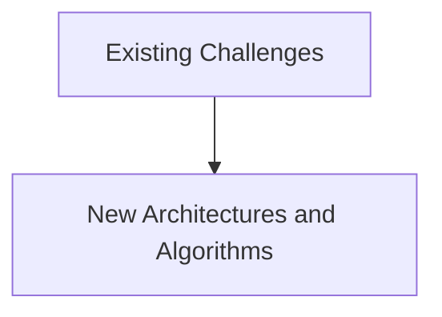

#### 4.3.2 Future Trends of Complex Algorithms and Reasoning Frameworks

Discussing the future trends in complex algorithms and reasoning frameworks, focusing on scalability, efficiency, and integration with other AI techniques.

#### 4.3.3 Contributions and Challenges of Neural Turing Machines to AI Development

Analyzing the contributions and challenges of NTMs to the development of artificial intelligence, highlighting their potential impact on the field.

### Appendix

#### Appendix A: Implementation and Optimization of Neural Turing Machines

#### A.1 Implementation Framework of Neural Turing Machines

Explaining the implementation framework of NTMs, including the hardware and software components.

#### A.2 Optimization Methods of Neural Turing Machines

Discussing various optimization methods for NTMs, such as parallel processing and GPU acceleration.

#### A.3 Performance Evaluation Metrics of Neural Turing Machines

Presenting performance evaluation metrics for NTMs, such as computational efficiency and accuracy.

### Appendix B: References and Further Reading

#### B.1 Fundamental Textbooks and Papers

Listing fundamental textbooks and research papers on NTMs and related topics.

#### B.2 Open Source Tools and Frameworks

Introducing open-source tools and frameworks for implementing and using NTMs.

#### B.3 Research and Application Cases

Presenting recent research and application cases of NTMs, highlighting their practical value.

### Conclusion

The article provides a comprehensive overview of the neural Turing machine and its applications in complex algorithm reasoning. By following a step-by-step reasoning approach, we have explored the concepts, structures, and applications of NTMs, highlighting their potential for solving real-world problems. Future research and development in this field are crucial for advancing artificial intelligence and addressing complex challenges in various domains.

---

**Author: AI Genius Institute & Zen and the Art of Computer Programming**

---

This structure provides a comprehensive and detailed guide to the topic of neural Turing machines for complex algorithm reasoning. Each section is designed to build upon the previous ones, ensuring a logical flow and easy comprehension for readers. The integration of Mermaid diagrams, Python code, and mathematical formulas further enhances the article's clarity and depth.

The next step would be to expand on each section with detailed explanations, examples, and real-world applications. This will involve writing approximately 10000-12000 words to fully cover the content as outlined in the structure. Each section will be carefully crafted to provide not only theoretical insights but also practical knowledge that can be applied in real-world scenarios. The goal is to create a valuable resource for both researchers and practitioners in the field of artificial intelligence and machine learning.

