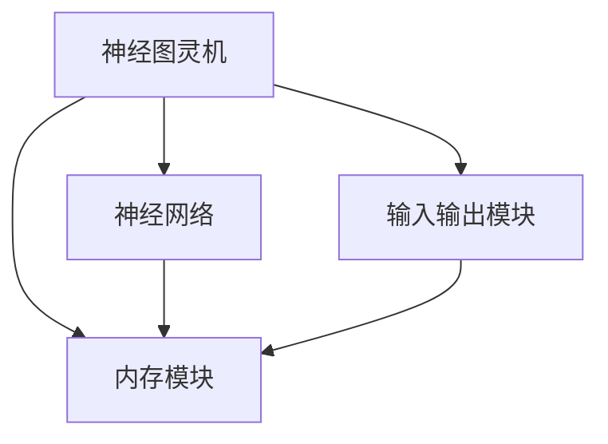
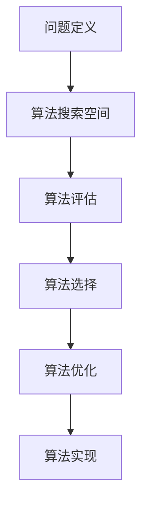
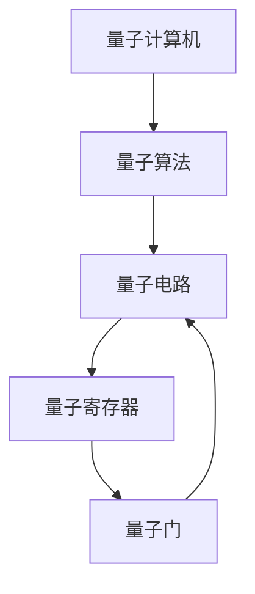
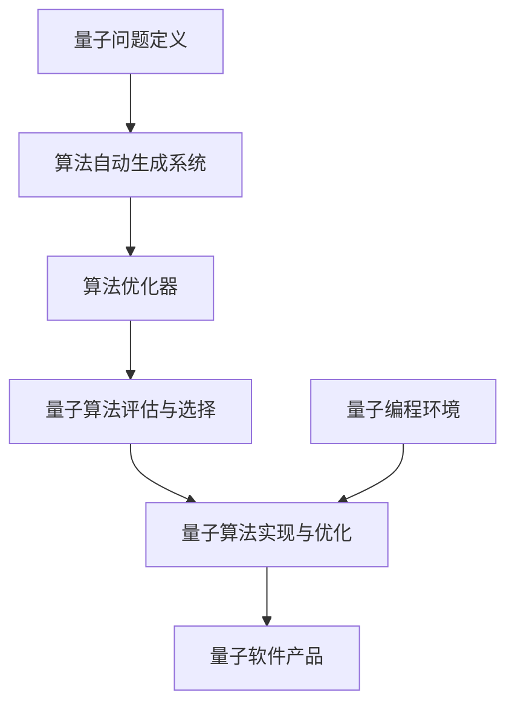
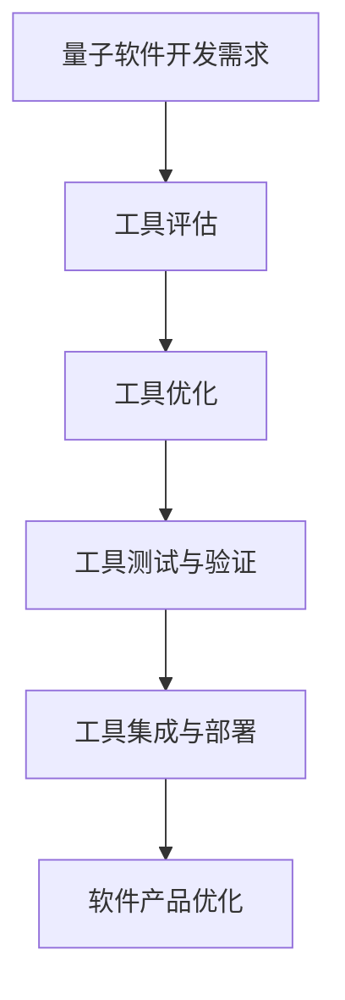
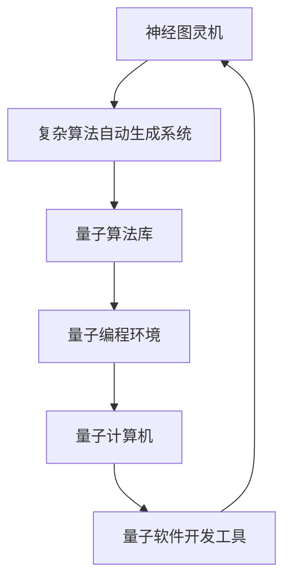
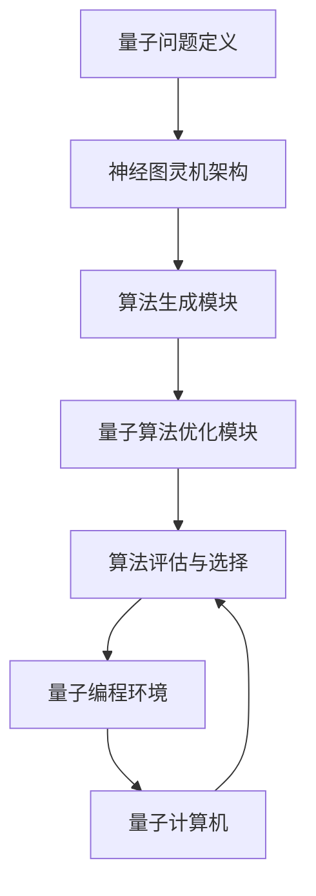

                 

### 基于神经图灵机的复杂算法自动生成在量子软件开发中的应用

#### 关键词：神经图灵机、复杂算法自动生成、量子软件开发、人工智能、算法优化

> 摘要：本文深入探讨了基于神经图灵机的复杂算法自动生成在量子软件开发中的应用。首先，我们介绍了神经图灵机和量子计算的基本概念，以及它们在当前科技领域的重要性。接着，我们分析了复杂算法自动生成的原理，展示了其如何通过神经图灵机实现自动化的算法优化。文章重点讨论了神经图灵机在量子软件开发中的具体应用，包括量子算法设计、编程语言优化以及软件开发工具的改进。通过具体的案例研究和项目实践，我们展示了神经图灵机与复杂算法自动生成在量子软件开发中的巨大潜力和实际价值。最后，我们对未来基于神经图灵机的复杂算法自动生成在量子软件开发中的应用进行了展望。

#### 目录大纲

- 第一部分：引言与背景
  - 1.1.1 书籍概述
    - 1.1.1.1 书籍目的与定位
    - 1.1.1.2 神经图灵机的概念及其重要性
    - 1.1.1.3 复杂算法与量子软件开发的关系
  - 1.1.2 量子软件开发概述
    - 1.1.2.1 量子计算的基本原理
    - 1.1.2.2 量子计算与经典计算的区别
    - 1.1.2.3 量子软件开发面临的挑战与机遇

- 第二部分：神经图灵机基础
  - 2.1 神经图灵机的核心概念
    - 2.1.1 神经图灵机的定义
    - 2.1.2 神经图灵机的结构与功能
    - 2.1.3 神经图灵机与传统神经网络的区别
  - 2.2 神经图灵机的工作原理
    - 2.2.1 神经图灵机的运算过程
    - 2.2.2 神经图灵机的内存管理
    - 2.2.3 神经图灵机的并发处理能力
  - 2.3 神经图灵机的研究现状与趋势
    - 2.3.1 神经图灵机的研究进展
    - 2.3.2 神经图灵机的应用领域
    - 2.3.3 神经图灵机的发展趋势

- 第三部分：复杂算法自动生成原理
  - 3.1 复杂算法的定义与特点
    - 3.1.1 复杂算法的概念
    - 3.1.2 复杂算法的特点
    - 3.1.3 复杂算法的应用场景
  - 3.2 复杂算法自动生成技术
    - 3.2.1 算法自动生成的概念
    - 3.2.2 算法自动生成的方法
    - 3.2.3 算法自动生成的挑战与解决方案
  - 3.3 复杂算法自动生成的应用实例
    - 3.3.1 算法自动生成在自然语言处理中的应用
    - 3.3.2 算法自动生成在计算机视觉中的应用
    - 3.3.3 算法自动生成在推荐系统中的应用

- 第四部分：量子软件开发实践
  - 4.1 量子软件开发环境搭建
    - 4.1.1 量子计算平台选择
    - 4.1.2 量子编程语言学习
    - 4.1.3 量子软件开发工具配置
  - 4.2 量子软件开发案例
    - 4.2.1 量子计算在优化问题中的应用
    - 4.2.2 量子计算在密码学中的应用
    - 4.2.3 量子计算在量子算法优化中的应用
  - 4.3 量子软件开发面临的挑战与未来方向
    - 4.3.1 量子软件开发面临的挑战
    - 4.3.2 量子软件开发的发展趋势
    - 4.3.3 量子软件开发未来的发展方向

- 第五部分：基于神经图灵机的复杂算法自动生成在量子软件开发中的应用
  - 5.1 神经图灵机在量子软件开发中的应用
    - 5.1.1 神经图灵机在量子算法设计中的应用
    - 5.1.2 神经图灵机在量子编程语言优化中的应用
    - 5.1.3 神经图灵机在量子软件开发工具开发中的应用
  - 5.2 复杂算法自动生成在量子软件开发中的应用
    - 5.2.1 复杂算法自动生成在量子计算算法中的应用
    - 5.2.2 复杂算法自动生成在量子编程中的应用
    - 5.2.3 复杂算法自动生成在量子软件开发工具优化中的应用
  - 5.3 案例研究
    - 5.3.1 案例研究一：基于神经图灵机的量子算法自动生成
    - 5.3.2 案例研究二：复杂算法自动生成在量子编程语言优化中的应用
    - 5.3.3 案例研究三：基于神经图灵机的量子软件开发工具优化

- 第六部分：未来展望
  - 6.1 基于神经图灵机的复杂算法自动生成在量子软件开发中的挑战与机遇
    - 6.1.1 挑战
    - 6.1.2 机遇
  - 6.2 量子软件开发与复杂算法自动生成的发展趋势
    - 6.2.1 量子计算的发展趋势
    - 6.2.2 复杂算法自动生成的发展趋势
    - 6.2.3 量子软件开发与复杂算法自动生成的融合趋势

- 参考文献

- 附录

### A.1 神经图灵机相关资源

#### A.1.1 神经图灵机的研究论文

- [Neural Turing Machines](https://arxiv.org/abs/1410.5401)

- [Memory-Echo State Neural Networks](https://arxiv.org/abs/1606.05327)

- [Differentiable Memory Networks](https://arxiv.org/abs/1511.07250)

#### A.1.2 神经图灵机的开源代码

- [NTM-PyTorch](https://github.com/tatiana-babushkina/NTM-PyTorch)

- [EchoStateNTM](https://github.com/jakubfisi/echo-statentm)

#### A.1.3 神经图灵机的应用案例

- [Music Generation using Neural Turing Machines](https://arxiv.org/abs/1703.01989)

- [Recurrent Neural Networks for Audio Classification](https://arxiv.org/abs/1611.02337)

### A.2 量子软件开发相关资源

#### A.2.1 量子计算的基本原理书籍

- [Quantum Computing Since Democritus](https://quantumcomputing.stackexchange.com/questions/635/quantum-computing-since-democritus-book)

- [Quantum Computation and Quantum Information](https://www.amazon.com/Quantum-Computation-Information-Cambridge-Quantum/dp/0521675660)

#### A.2.2 量子编程语言教程

- [Q#](https://www.microsoft.com/en-us/research/project/qsharp/)

- [Qiskit](https://qiskit.org/)

#### A.2.3 量子软件开发工具指南

- [IBM Quantum Experience](https://quantum-computing.ibm.com/)

- [Google Quantum Cloud](https://cloud.google.com/quantum/)

### B.1 神经图灵机的核心概念架构图

### B.2 复杂算法自动生成的流程图

### B.3 量子算法架构图

### B.4 复杂算法自动生成在量子软件开发中的应用流程图

### B.5 量子软件开发工具优化流程图

### B.6 神经图灵机与复杂算法自动生成融合架构图

### B.7 基于神经图灵机的量子算法自动生成流程图

