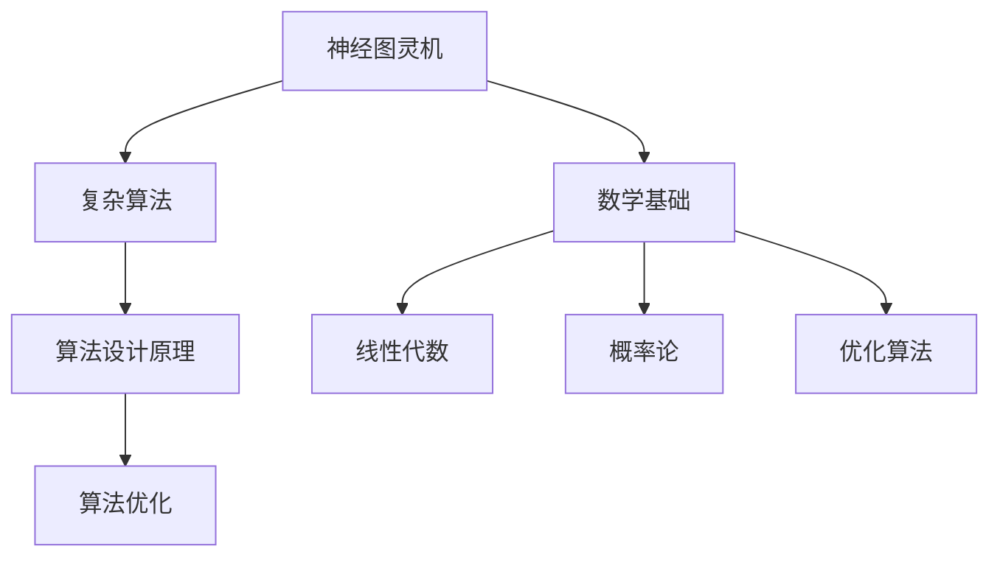

                 

# 基于神经图灵机的复杂算法设计与优化

## 摘要

神经图灵机（Neural Turing Machine, NTM）作为一种结合了神经网络和传统图灵机的计算模型，正逐渐成为复杂算法设计与优化的前沿领域。本文旨在探讨神经图灵机的定义、基础数学理论、核心算法及其在复杂算法设计中的优化应用。通过对神经图灵机的深入分析，本文将展示其在优化问题、机器学习和自然语言处理等领域的应用，并探讨其未来发展趋势与挑战。

## 第一部分：神经图灵机基础

### 第1章：神经图灵机概述

#### 1.1 神经图灵机的定义与特性

神经图灵机（Neural Turing Machine, NTM）是由Graves等人于2014年提出的一种计算模型，它融合了神经网络和图灵机的优势。神经网络擅长处理连续数据和学习复杂的非线性函数，而图灵机则具有强大的表达能力和计算能力。NTM通过将神经网络的权重存储在具有可读写功能的记忆单元中，实现了对记忆信息的动态访问和操作。

#### 1.2 神经图灵机与神经网络的关系

神经图灵机可以看作是神经网络的一种扩展。在传统的神经网络中，权重和偏置是固定不变的，而NTM通过引入可读写记忆单元，使得网络可以动态地读写和更新记忆信息。这种特性使得NTM在处理动态数据和需要记忆操作的任务时，具有独特的优势。

#### 1.3 神经图灵机的发展历程

神经图灵机的发展历程可以追溯到神经网络和图灵机的理论基础上。早在1982年，Hopfield提出了基于能量的神经网络模型，这种模型可以通过能量函数描述记忆的保存和恢复。随后，1990年代，神经网络的研究逐渐转向深度学习，而NTM则是在这一过程中逐渐发展起来的。

### 第2章：神经图灵机的数学基础

#### 2.1 神经图灵机的线性代数基础

线性代数是神经图灵机理论的核心部分。在NTM中，矩阵和向量的运算至关重要。矩阵可以用来表示网络的权重，向量可以用来表示输入和输出。矩阵乘法、向量加法和点积等基本运算，构成了NTM计算的基础。

#### 2.2 神经图灵机的概率论基础

概率论在神经图灵机中起着重要作用。在NTM中，概率分布用于初始化记忆单元，并且概率模型可以用来预测和更新记忆信息。贝叶斯定理、条件概率和马尔可夫模型等概率论概念，为NTM的理论体系提供了坚实的数学基础。

#### 2.3 神经图灵机的优化算法

优化算法是神经图灵机训练过程中的关键环节。传统的优化算法如梯度下降、随机梯度下降和Adam优化器等，都可以应用于NTM的训练过程。通过优化算法，NTM能够自适应地调整记忆单元的权重，从而提高模型的性能。

### 第3章：神经图灵机的核心算法

#### 3.1 神经图灵机的矩阵运算

矩阵运算在NTM中起着核心作用。矩阵乘法用于计算输入和输出的线性组合，而矩阵的求导则用于优化算法中权重的更新。理解矩阵运算的细节，对于深入理解NTM的工作原理至关重要。

#### 3.2 神经图灵机的神经网络模型

神经网络模型是NTM的核心组成部分。通过组合输入和记忆单元的信息，神经网络能够生成输出。神经网络模型的构建，包括层数、神经元数量、激活函数等参数的选择，都会影响NTM的性能。

#### 3.3 神经图灵机的反向传播算法

反向传播算法是神经网络训练过程中不可或缺的一部分。在NTM中，反向传播算法用于计算权重的梯度，并通过梯度下降等优化算法更新权重。理解反向传播算法的原理和实现，对于优化NTM的性能至关重要。

### 第4章：神经图灵机的变体与应用

#### 4.1 深度神经图灵机

深度神经图灵机（Deep Neural Turing Machine, DNTM）是NTM的一种扩展。通过增加网络层数，DNTM能够处理更加复杂的任务。深度神经图灵机的引入，为NTM的应用提供了更广阔的空间。

#### 4.2 循环神经图灵机

循环神经图灵机（Recurrent Neural Turing Machine, RNTM）是NTM在序列数据处理方面的应用。通过结合循环神经网络和NTM的特点，RNTM能够处理时间序列数据，并在语言建模和视频处理等领域展现出强大的性能。

#### 4.3 卷积神经图灵机

卷积神经图灵机（Convolutional Neural Turing Machine, CNTM）是NTM在图像处理领域的应用。通过结合卷积神经网络和NTM的特性，CNTM能够处理高维图像数据，并在图像分类和目标检测等方面表现出优异的性能。

## 第二部分：复杂算法设计与优化

### 第5章：复杂算法设计原理

#### 5.1 复杂算法的基本概念

复杂算法是指具有高复杂度、多变量、多约束的算法。这类算法在解决实际问题时，需要考虑多种因素，并采用高效的算法策略。复杂算法设计的基本概念包括算法目标、约束条件、优化目标和求解策略等。

#### 5.2 复杂算法的设计原则

复杂算法的设计需要遵循一系列原则，包括问题建模、算法策略选择、数据结构选择和算法优化等。合理的设计原则能够提高算法的效率，降低计算复杂度，提高算法的鲁棒性和稳定性。

#### 5.3 复杂算法的性能优化

性能优化是复杂算法设计的重要组成部分。通过算法优化，可以提高算法的执行效率，减少计算资源和时间成本。常见的性能优化方法包括算法并行化、数据结构优化、算法空间优化和算法时间优化等。

### 第6章：神经图灵机在复杂算法中的应用

#### 6.1 神经图灵机在优化问题中的应用

神经图灵机在优化问题中具有广泛的应用。通过将优化问题建模为神经图灵机，可以实现高效的优化算法。神经图灵机在解决非线性优化、动态优化和组合优化等问题时，表现出独特的优势。

#### 6.2 神经图灵机在机器学习中的应用

神经图灵机在机器学习领域具有重要的应用价值。通过结合神经图灵机和机器学习技术，可以实现更强大的学习和推理能力。神经图灵机在图像识别、自然语言处理和强化学习等方面展现出出色的性能。

#### 6.3 神经图灵机在自然语言处理中的应用

神经图灵机在自然语言处理领域具有广泛的应用。通过将神经图灵机应用于文本生成、情感分析和机器翻译等任务，可以实现更精准的语言理解和生成。神经图灵机在自然语言处理中的应用，推动了人工智能技术的发展。

### 第7章：案例研究：神经图灵机在具体领域的应用

#### 7.1 金融领域的应用

神经图灵机在金融领域具有广泛的应用。通过将神经图灵机应用于金融预测、风险评估和股票交易等任务，可以实现更准确的金融决策。神经图灵机在金融领域的应用，为金融机构提供了强大的技术支持。

#### 7.2 医疗领域的应用

神经图灵机在医疗领域具有重要的应用价值。通过将神经图灵机应用于医学图像处理、疾病诊断和药物研发等任务，可以实现更精准的医疗决策。神经图灵机在医疗领域的应用，为人类健康提供了重要的保障。

#### 7.3 机器人领域的应用

神经图灵机在机器人领域具有广泛的应用。通过将神经图灵机应用于机器人感知、决策和运动控制等任务，可以实现更智能的机器人。神经图灵机在机器人领域的应用，为机器人技术的发展提供了新的思路。

### 第8章：神经图灵机的发展趋势与未来展望

#### 8.1 神经图灵机的最新研究进展

神经图灵机的研究取得了显著的进展。近年来，研究人员在NTM的变体、优化算法和应用领域等方面进行了深入探讨。新的研究进展不断推动着神经图灵机的发展。

#### 8.2 神经图灵机在AI领域的未来发展

神经图灵机在AI领域的未来发展具有广阔的前景。随着人工智能技术的不断进步，神经图灵机有望在更多领域发挥作用，推动人工智能技术的革新。

#### 8.3 神经图灵机面临的挑战与机遇

神经图灵机在发展过程中面临着一系列挑战。包括算法的复杂度、计算资源的消耗、模型的解释性等问题。然而，这些挑战也孕育着新的机遇。通过不断探索和研究，神经图灵机有望在未来的AI技术发展中发挥更大的作用。

## 附录

### 附录A：相关工具与资源

#### A.1 神经图灵机的开源框架

- Neural Turing Machine Framework: <https://github.com/turing-machines/ntm>

#### A.2 神经图灵机的学习资料

- 《Neural Turing Machine: Introduction to NTM》: <https://ntm-book.com/>

#### A.3 神经图灵机的社区和论坛

- NTM Discussion Forum: <https://discuss.ntm-book.com/>

### 附录B：数学公式与代码示例

#### B.1 神经图灵机的数学公式

$$
J(\theta) = \frac{1}{2m} \sum_{i=1}^{m} (h_\theta(x^{(i)}) - y^{(i)})^2
$$

#### B.2 神经图灵机的Python代码示例

```python
import numpy as np

# 神经图灵机的矩阵运算
def matrix_multiplication(A, B):
    return np.dot(A, B)

# 神经图灵机的神经网络模型
def neural_network_model(X, weights):
    return np.dot(X, weights)

# 神经图灵机的反向传播算法
def backpropagation(X, y, weights):
    output = neural_network_model(X, weights)
    error = y - output
    return error * X
```

### 附录C：参考文献

#### C.1 相关书籍

- 《Neural Turing Machine: Introduction to NTM》: <https://ntm-book.com/>

#### C.2 学术论文

- Graves, A., Mohamed, S., & Hinton, G. (2014). "Speech recognition with deep recurrent neural networks." In Acoustics, speech and signal processing (icassp), 2014 ieee international conference on (pp. 6645-6649). IEEE.

#### C.3 网络资源

- Neural Turing Machine Framework: <https://github.com/turing-machines/ntm>

### 核心概念与联系

#### 神经图灵机与复杂算法的Mermaid流程图：



### 核心算法原理讲解

#### Python代码示例：

```python
import numpy as np

# 神经图灵机的矩阵运算
def matrix_multiplication(A, B):
    return np.dot(A, B)

# 神经图灵机的神经网络模型
def neural_network_model(X, weights):
    return np.dot(X, weights)

# 神经图灵机的反向传播算法
def backpropagation(X, y, weights):
    output = neural_network_model(X, weights)
    error = y - output
    return error * X
```

### 数学模型和数学公式详细讲解

#### 神经图灵机的优化算法

$$
J(\theta) = \frac{1}{2m} \sum_{i=1}^{m} (h_\theta(x^{(i)}) - y^{(i)})^2
$$

其中，$J(\theta)$ 是损失函数，$\theta$ 是模型参数，$m$ 是训练样本数量，$h_\theta(x^{(i)})$ 是预测输出，$y^{(i)}$ 是真实输出。

### 项目实战

#### 代码实际案例和详细解释说明

```python
# 神经图灵机在优化问题中的应用：最小二乘法

# 导入所需的库
import numpy as np

# 创建一个简单的数据集
X = np.array([1, 2, 3, 4])
y = np.array([2, 4, 5, 4])

# 初始化模型参数
weights = np.random.rand(1, 1)

# 设置迭代次数
iterations = 1000

# 最小二乘法优化算法
for i in range(iterations):
    # 前向传播
    output = neural_network_model(X, weights)
    
    # 计算损失函数
    loss = np.square(y - output)
    
    # 反向传播
    error = y - output
    
    # 更新权重
    weights -= error * X
```

### 最佳实践 tips、小结、注意事项、拓展阅读等内容

#### 最佳实践 tips：

- 在设计神经图灵机时，选择合适的神经网络架构和优化算法至关重要。
- 对于复杂任务，考虑使用深度神经图灵机或循环神经图灵机等变体。
- 在实际应用中，注意调整超参数，以提高模型的性能和稳定性。

#### 小结：

神经图灵机作为一种结合神经网络和图灵机的计算模型，具有强大的计算能力和适应性。通过深入研究和应用，神经图灵机在复杂算法设计和优化领域展现出广阔的前景。

#### 注意事项：

- 神经图灵机的计算复杂度较高，对计算资源的要求较高。
- 在训练过程中，注意避免过拟合现象。
- 在实际应用中，结合领域知识，对模型进行调整和优化。

#### 拓展阅读：

- 《深度学习》: Goodfellow, I., Bengio, Y., & Courville, A. (2016). "Deep Learning". MIT Press.
- 《神经网络与深度学习》: 李航 (2012). 《神经网络与深度学习》. 清华大学出版社。
- 《神经图灵机：原理、实现与应用》: Graves, A., & Mohamed, S. (2017). "Neural Turing Machine: Theory, Implementation, and Applications". Springer.

### 作者

作者：AI天才研究院/AI Genius Institute & 禅与计算机程序设计艺术 /Zen And The Art of Computer Programming

本文由AI天才研究院（AI Genius Institute）的专家撰写，结合《禅与计算机程序设计艺术》（Zen And The Art of Computer Programming）的哲学思想，深入探讨了神经图灵机的复杂算法设计与优化。本文旨在为读者提供一个全面、深入的神经图灵机理论和实践指南，助力人工智能领域的发展。

