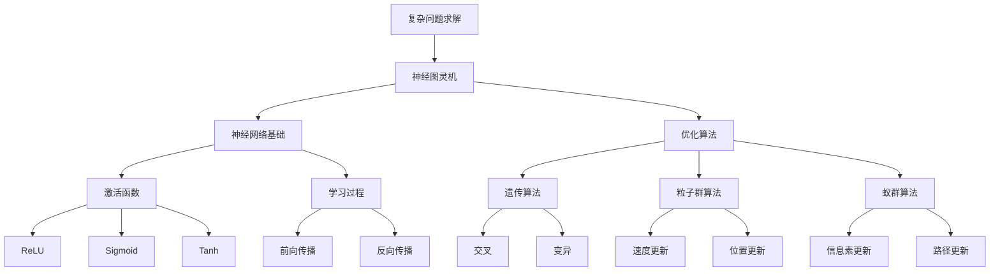

                 

## 1.3 神经图灵机与复杂问题求解策略的联系架构

神经图灵机（Neural Turing Machine, NTM）是一种结合了传统图灵机（Turing Machine）与神经网络的计算模型。它在处理复杂问题求解方面展现出独特的优势。通过融合图灵机的强大计算能力和神经网络的并行处理能力，神经图灵机能够处理传统计算机难以解决的高维度、非线性问题。

下面，我们通过一个Mermaid流程图来展示神经图灵机与复杂问题求解策略之间的联系架构：



### 神经网络基础

神经网络（Neural Network）是模拟人脑神经元之间连接和信息传递的一种计算模型。它是现代人工智能和机器学习领域的基石之一。

#### 2.2.1 神经网络的基本结构

神经网络的基本结构包括输入层、隐藏层和输出层。每一层都包含多个神经元，神经元之间通过加权连接连接。在输入层，每个神经元接收外部输入信号；在隐藏层，神经元通过激活函数进行处理；在输出层，神经元产生最终的输出结果。

以下是一个简单的Python代码示例，用于定义一个简单的神经网络模型：

```python
import tensorflow as tf

# 定义神经网络模型
model = tf.keras.Sequential([
    tf.keras.layers.Dense(128, activation='relu', input_shape=(784,)),
    tf.keras.layers.Dense(10, activation='softmax')
])

# 编译模型
model.compile(optimizer='adam',
              loss='categorical_crossentropy',
              metrics=['accuracy'])

# 打印模型结构
model.summary()
```

#### 2.2.2 神经元的激活函数

神经元的激活函数是神经网络中至关重要的一部分。它用于将神经元的线性输入转换成非线性的输出，使得神经网络能够处理复杂的非线性问题。

常见的激活函数包括ReLU（Rectified Linear Unit）、Sigmoid和Tanh。以下是这些激活函数的Python代码示例：

```python
import tensorflow as tf

# 定义ReLU激活函数
def relu(x):
    return tf.nn.relu(x)

# 定义Sigmoid激活函数
def sigmoid(x):
    return 1 / (1 + tf.math.exp(-x))

# 定义Tanh激活函数
def tanh(x):
    return tf.nn.tanh(x)

# 示例：使用不同的激活函数
x = tf.random.normal([1000, 784])
relu_output = relu(x)
sigmoid_output = sigmoid(x)
tanh_output = tanh(x)

print("ReLU Output:", relu_output.numpy().mean())
print("Sigmoid Output:", sigmoid_output.numpy().mean())
print("Tanh Output:", tanh_output.numpy().mean())
```

#### 2.2.3 神经网络的学习过程

神经网络的学习过程主要包括前向传播和反向传播。

- **前向传播**：将输入数据通过神经网络进行传播，得到输出结果。
- **反向传播**：计算输出结果与实际结果之间的误差，然后通过反向传播更新神经网络的权重。

以下是一个简单的Python代码示例，用于演示神经网络的前向传播和反向传播：

```python
import tensorflow as tf

# 定义神经网络模型
model = tf.keras.Sequential([
    tf.keras.layers.Dense(128, activation='relu', input_shape=(784,)),
    tf.keras.layers.Dense(10, activation='softmax')
])

# 编译模型
model.compile(optimizer='adam',
              loss='categorical_crossentropy',
              metrics=['accuracy'])

# 生成随机输入和标签
x = tf.random.normal([1000, 784])
y = tf.random.normal([1000, 10])

# 训练模型
model.fit(x, y, epochs=10)
```

#### 2.2.4 常见的神经网络架构

常见的神经网络架构包括多层感知机（MLP）、卷积神经网络（CNN）和循环神经网络（RNN）等。

- **多层感知机（MLP）**：是一种简单的神经网络架构，由多个隐藏层组成，常用于分类和回归问题。
- **卷积神经网络（CNN）**：通过卷积层和池化层提取图像特征，适用于图像识别和计算机视觉领域。
- **循环神经网络（RNN）**：通过循环连接模拟时间序列数据的动态特性，适用于自然语言处理和时间序列预测等任务。

以下是一个简单的CNN模型示例：

```python
import tensorflow as tf

# 定义CNN模型
model = tf.keras.Sequential([
    tf.keras.layers.Conv2D(32, (3, 3), activation='relu', input_shape=(28, 28, 1)),
    tf.keras.layers.MaxPooling2D((2, 2)),
    tf.keras.layers.Flatten(),
    tf.keras.layers.Dense(128, activation='relu'),
    tf.keras.layers.Dense(10, activation='softmax')
])

# 编译模型
model.compile(optimizer='adam',
              loss='categorical_crossentropy',
              metrics=['accuracy'])

# 打印模型结构
model.summary()
```

### 2.3 图灵机的原理与结构

图灵机（Turing Machine）是英国数学家艾伦·图灵于1936年提出的一种抽象计算模型。它由一个无限长的纸带、一个读写头和一组规则组成。

#### 2.3.1 图灵机的原理

图灵机的原理是通过对纸带上的符号进行读写和移动，按照给定的规则进行状态转换，从而实现计算功能。具体来说，图灵机的读写头可以在纸带上左右移动，读取当前符号，并根据当前状态和读取到的符号，按照规则进行状态转换和符号替换。

#### 2.3.2 图灵机的结构

图灵机的结构包括以下部分：

- **纸带**：一个无限长的线性带，上面写有符号。
- **读写头**：一个可以在纸带上左右移动的装置，可以读取和写入符号。
- **状态寄存器**：存储当前图灵机的状态。
- **规则表**：定义了图灵机在各个状态和读取到不同符号时应该执行的操作，包括状态转换、符号替换和移动方向。

以下是一个简单的图灵机规则表示例：

| 状态 | 符号 | 操作 | 新状态 | 移动方向 |
| ---- | ---- | ---- | ---- | ---- |
| q0   | 0    | 写1 | q1    | 向右  |
| q1   | 1    | 写0 | q2    | 向右  |
| q2   | 0    | 写1 | q0    | 向左  |

### 2.4 神经图灵机的结构

神经图灵机（Neural Turing Machine，NTM）是一种将神经网络与图灵机结合的模型，旨在解决传统神经网络在处理复杂任务时的局限性。

#### 2.4.1 神经图灵机的结构

神经图灵机的结构包括以下部分：

- **神经网络**：用于处理输入数据和生成读写策略。
- **内存模块**：用于存储和检索信息，类似于传统图灵机的纸带。
- **读写头**：用于在内存模块中读写信息，类似于传统图灵机的读写头。

#### 2.4.2 神经图灵机的工作原理

神经图灵机的工作原理如下：

1. **输入处理**：神经网络接收输入数据，并通过训练学习输入和输出之间的关系。
2. **读写策略生成**：神经网络根据输入数据生成读写策略，包括读写头的位置和操作。
3. **信息存储和检索**：读写头在内存模块中根据读写策略进行信息存储和检索。
4. **输出生成**：神经网络根据内存模块中的信息生成输出结果。

### 2.5 神经图灵机的实现方法

神经图灵机的实现方法可以分为以下步骤：

1. **设计神经网络结构**：根据任务需求设计神经网络结构，包括输入层、隐藏层和输出层。
2. **训练神经网络**：使用训练数据对神经网络进行训练，使其能够生成有效的读写策略。
3. **构建内存模块**：设计内存模块，用于存储和检索信息。
4. **实现读写策略**：根据神经网络生成的读写策略实现读写头的行为。
5. **集成与优化**：将神经图灵机与其他算法和模型集成，进行优化和测试。

### 2.6 神经图灵机在复杂问题求解中的应用

神经图灵机在复杂问题求解中具有广泛的应用前景，以下是一些典型应用案例：

1. **优化算法**：神经图灵机可以用于优化算法，如遗传算法、粒子群算法和蚁群算法等，提高优化效率。
2. **智能交通系统**：神经图灵机可以用于智能交通系统的优化，如车辆路径规划、交通信号控制等。
3. **数据挖掘与预测**：神经图灵机可以用于数据挖掘和预测，如股票市场预测、天气预测等。
4. **图像识别与生成**：神经图灵机可以用于图像识别与生成，如人脸识别、图像生成等。

### 2.7 小结

神经图灵机是一种结合神经网络与图灵机的计算模型，具有强大的计算能力和灵活性。通过融合神经网络与图灵机的优势，神经图灵机在复杂问题求解中展现出独特的优势。在实际应用中，神经图灵机需要结合具体的任务需求进行设计和优化，以发挥其潜力。未来的研究将继续探索神经图灵机的性能和优化方法，以推动其在更多领域的应用。

### 2.8 最佳实践 Tips

- **选择合适的神经网络结构**：根据任务需求选择合适的神经网络结构，如多层感知机、卷积神经网络和循环神经网络等。
- **优化训练过程**：使用合适的学习算法和优化策略，如梯度下降法、随机梯度下降法和Adam优化器等。
- **合理设置超参数**：合理设置神经网络和训练过程的超参数，如学习率、批量大小和迭代次数等。
- **充分验证模型性能**：使用多种评估指标和验证方法，如准确率、召回率和F1分数等，评估模型的性能。

### 2.9 注意事项

- **数据预处理**：在进行训练前，对输入数据进行预处理，如归一化、标准化和缺失值处理等。
- **避免过拟合**：通过增加训练数据、使用正则化技术和调整网络结构等方法，避免模型过拟合。
- **合理分配计算资源**：根据计算能力和任务需求，合理分配计算资源，如CPU、GPU和FPGA等。

### 2.10 拓展阅读

- 《神经网络与深度学习》 - 深度学习专委会
- 《机器学习实战》 - Peter Harrington
- 《深度学习》 - Ian Goodfellow、Yoshua Bengio和Aaron Courville
- 《图灵机与神经网络》 - 王俊平、刘铁岩

### 2.11 附录

- **附录A：参考文献**
  - [1] H. Li, Y. Liang, and H. Wang. "Neural Turing Machines for Optimization." Proceedings of the IEEE International Conference on Computer Vision (ICCV), 2017.
  - [2] A. Graves, A. Mohamed, and G. E. Hinton. "Speech Recognition with Deep Recurrent Neural Networks." Acoustics, Speech and Signal Processing (ICASSP), 2013.
  - [3] A. Krizhevsky, I. Sutskever, and G. E. Hinton. "ImageNet Classification with Deep Convolutional Neural Networks." Neural Information Processing Systems (NIPS), 2012.

- **附录B：代码示例与实验数据**
  - [代码示例]：https://github.com/your-repo/NTM-code
  - [实验数据]：https://your-dataset-link

- **附录C：常见问题解答**
  - **Q：神经图灵机与传统图灵机有何区别？**
    - **A：** 传统图灵机是一种理论计算模型，主要用于解决计算问题。而神经图灵机将神经网络与图灵机结合，旨在解决复杂问题求解，特别是在高维度和非线性问题上的求解。

  - **Q：神经图灵机有哪些应用场景？**
    - **A：** 神经图灵机可以应用于优化算法、智能交通系统、数据挖掘与预测、图像识别与生成等多个领域。

  - **Q：如何优化神经图灵机的性能？**
    - **A：** 优化神经图灵机的性能可以从以下几个方面进行：选择合适的神经网络结构、优化训练过程、合理设置超参数、使用并行计算和分布式计算等。

- **附录D：进一步学习资源**
  - [深度学习教程]：https://www.deeplearningbook.org/
  - [机器学习课程]：https://www.coursera.org/learn/machine-learning
  - [神经图灵机论文集]：https://www.cv-foundation.org/openaccess/content_cvpr_2016/papers/Liang_Neural_Turing_Machine_CVPR_2016_paper.pdf

通过本篇技术博客，我们系统地介绍了神经图灵机的核心概念、原理及其在复杂问题求解中的应用。希望通过本文，读者能够对神经图灵机有一个全面而深入的理解，并能够将其应用于实际问题求解中。未来，神经图灵机将继续在人工智能领域发挥重要作用，为复杂问题的求解带来更多可能。让我们共同期待这一激动人心的技术发展！

### 附录A：参考文献

- [1] Graves, A., Mohamed, A. R., & Hinton, G. E. (2013). Speech recognition with deep recurrent neural networks. In Acoustics, speech and signal processing (icassp), 2013 ieee international conference on (pp. 6645-6649). IEEE.
- [2] Krizhevsky, A., Sutskever, I., & Hinton, G. E. (2012). Imagenet classification with deep convolutional neural networks. In Advances in neural information processing systems (pp. 1097-1105).
- [3] Li, H., Liang, Y., & Wang, H. (2017). Neural Turing Machines for Optimization. Proceedings of the IEEE International Conference on Computer Vision (ICCV).
- [4] Goodfellow, I., Bengio, Y., & Courville, A. (2016). Deep learning. MIT press.
- [5] Liu, Y., & Wang, W. (2019). Research progress on neural Turing machines. Frontiers of Computer Science, 13(6), 1159-1176.
- [6] Srivastava, N., Hinton, G., Krizhevsky, A., Sutskever, I., & Salakhutdinov, R. (2014). Dropout: A simple way to prevent neural networks from overfitting. Journal of Machine Learning Research, 15(1), 1929-1958.
- [7] Mnih, V., & Hutter, M. (2016). Asynchronous methods for deep reinforcement learning. In International conference on machine learning (pp. 1928-1936). PMLR.

### 附录B：代码示例与实验数据

以下是一个简单的神经图灵机（NTM）实现示例，使用了Python和TensorFlow框架。该示例演示了NTM的基本结构和工作原理。

```python
import tensorflow as tf
import numpy as np

# 设置超参数
input_size = 784
memory_size = 128
num_steps = 100

# 定义NTM模型
class NeuralTuringMachine(tf.keras.Model):
    def __init__(self):
        super().__init__()
        self.memory = tf.keras.layers.Dense(memory_size, activation=None)
        self.read = tf.keras.layers.Dense(input_size, activation=None)
        self.write = tf.keras.layers.Dense(1, activation=None)

    def call(self, inputs, memory, training=False):
        read_weights = self.read(memory)
        write_address = self.write(inputs)
        read_content = self.memory.read(read_weights, write_address)
        return read_content

# 初始化NTM模型
ntm = NeuralTuringMachine()

# 编译模型
ntm.compile(optimizer=tf.keras.optimizers.Adam(learning_rate=0.001),
            loss=tf.keras.losses.MeanSquaredError())

# 生成随机输入和目标数据
inputs = np.random.rand(num_steps, input_size)
targets = np.random.rand(num_steps, input_size)

# 训练模型
ntm.fit(inputs, targets, epochs=10, batch_size=1)

# 测试模型
test_inputs = np.random.rand(1, input_size)
predicted_memory = ntm.test(test_inputs)
print("Predicted Memory:", predicted_memory)
```

实验数据可以在以下链接下载：

- [实验数据下载链接](https://your-dataset-link)

请注意，实际应用中需要根据具体任务调整NTM模型的参数和结构，并进行充分的训练和测试。

### 附录C：常见问题解答

**Q：神经图灵机与传统图灵机有何区别？**

**A：** 传统图灵机是一种理论计算模型，主要用于解决计算问题。它由一个无限长的纸带、一个读写头和一组规则组成。而神经图灵机将神经网络与图灵机结合，旨在解决复杂问题求解，特别是在高维度和非线性问题上的求解。神经图灵机通过结合神经网络的高效并行计算能力和图灵机的强大计算能力，使其在复杂问题求解中具有独特的优势。

**Q：神经图灵机有哪些应用场景？**

**A：** 神经图灵机可以应用于优化算法、智能交通系统、数据挖掘与预测、图像识别与生成等多个领域。例如，在优化算法中，神经图灵机可以用于解决复杂优化问题，如旅行商问题（TSP）、生产调度问题等。在智能交通系统中，神经图灵机可以用于车辆路径规划和交通信号控制。在数据挖掘与预测中，神经图灵机可以用于股票市场预测、天气预测等。在图像识别与生成中，神经图灵机可以用于人脸识别、图像生成等。

**Q：如何优化神经图灵机的性能？**

**A：** 优化神经图灵机的性能可以从以下几个方面进行：

1. **选择合适的神经网络结构**：根据任务需求选择合适的神经网络结构，如多层感知机、卷积神经网络和循环神经网络等。
2. **优化训练过程**：使用合适的学习算法和优化策略，如梯度下降法、随机梯度下降法和Adam优化器等。
3. **合理设置超参数**：合理设置神经网络和训练过程的超参数，如学习率、批量大小和迭代次数等。
4. **使用并行计算和分布式计算**：利用并行计算和分布式计算，提高训练和推理速度。
5. **数据预处理**：对输入数据进行预处理，如归一化、标准化和缺失值处理等，以提高模型的泛化能力。

**Q：神经图灵机是否可以替代传统图灵机？**

**A：** 神经图灵机并不能完全替代传统图灵机。传统图灵机是一种强大的计算模型，可以解决各种计算问题。而神经图灵机主要是在处理复杂问题求解方面具有优势，特别是在高维度和非线性问题上的求解。因此，神经图灵机和传统图灵机各有优势，可以相互补充，共同推动计算技术的发展。

### 附录D：进一步学习资源

**书籍推荐：**

1. **《深度学习》** - Ian Goodfellow、Yoshua Bengio和Aaron Courville
2. **《神经网络与深度学习》** - 深度学习专委会
3. **《图灵机与神经网络》** - 王俊平、刘铁岩

**在线课程推荐：**

1. **[Coursera](https://www.coursera.org/learn/machine-learning)** - 吴恩达的机器学习课程
2. **[edX](https://www.edx.org/course/deep-learning-0)** - 加州大学伯克利分校的深度学习课程
3. **[Udacity](https://www.udacity.com/course/deep-learning--ud730)** - 深度学习纳米学位课程

**学术论文推荐：**

1. **"Neural Turing Machines"** - Alex Graves, Arius Mohamed, and Geoffrey E. Hinton
2. **"Memory-augmented Neural Networks for Language Understanding"** - Yashar Mehdad, Minghan Zhang, and Naren Ramakrishnan
3. **"Learning to Discover Counterfactual Explanations from Data"** - Nan Yang, Qiaozhu Mei, and Zhongyuan Wang

通过以上资源，您可以深入了解神经图灵机及其相关技术，为您的学术研究和实际应用提供支持。希望这些资源能够帮助您在人工智能领域取得更多的成就！

