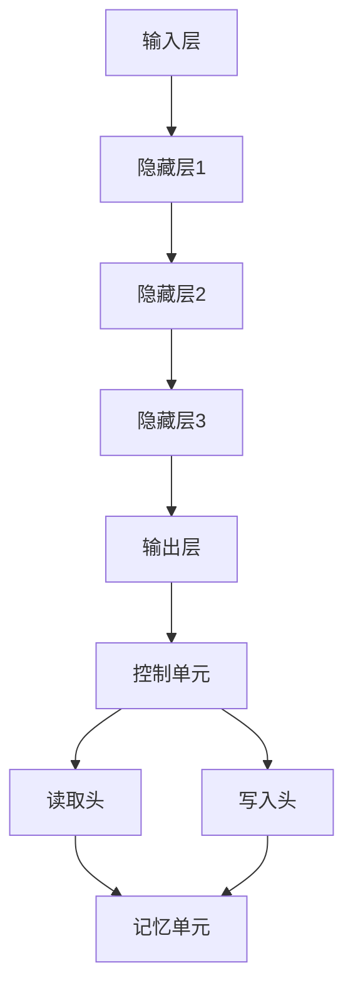

                 

### 1.5 神经图灵机的核心组件和架构

神经图灵机的核心组件包括记忆单元、读写头、控制单元和神经网络。这些组件共同协作，实现数据存储、检索和计算。以下是对这些组件和架构的详细介绍：

#### 1.5.1 记忆单元

记忆单元是神经图灵机的核心部分，用于存储输入数据和计算过程中的中间结果。记忆单元可以被视为一个巨大的向量，每个元素表示一个记忆位（memory bit）。与传统的图灵机不同，NTM的记忆单元是可以动态修改的，这意味着它可以在计算过程中更新和适应新的输入。

**记忆位的状态转换**：
- **激活状态**：当某个记忆位的激活值超过阈值时，该位被视为激活状态，表示该位存储了相关数据。
- **抑制状态**：当某个记忆位的激活值低于阈值时，该位被视为抑制状态，表示该位不存储有效数据。

#### 1.5.2 读写头

读写头负责在记忆单元中执行读写操作。NTM中有两个读写头：一个是读取头，用于检索记忆单元中的数据；另一个是写入头，用于更新记忆单元中的数据。

**读写操作**：
- **读操作**：读取头在记忆单元中滑动，根据激活值检索出相关的记忆内容。
- **写操作**：写入头在记忆单元中滑动，根据输入数据更新激活值。

#### 1.5.3 控制单元

控制单元是神经图灵机的“大脑”，负责协调读写头和神经网络的工作。它通过一系列控制信号来指导读写头的移动和记忆单元的操作。控制单元通常由一系列神经网络层组成，用于处理输入信号并生成控制信号。

**控制信号**：
- **读写模式信号**：指示读写头是进行读操作还是写操作。
- **读写位置信号**：指定读写头在记忆单元中的当前位置。
- **读写值信号**：提供要写入记忆单元的新数据。

#### 1.5.4 神经网络

神经网络负责处理输入数据，并生成控制信号。NTM中的神经网络通常由多层感知器（MLP）组成，每个层都有不同的功能。

**神经网络层功能**：
- **输入层**：接收外部输入，如文本、图像等，并将其转换为神经网络可处理的格式。
- **隐藏层**：对输入数据进行处理，生成中间结果。
- **输出层**：生成控制信号，用于指导读写头和记忆单元的操作。

#### 1.5.5 架构图解

以下是一个简化的神经图灵机架构图，展示了各个组件之间的关系：



在这个架构图中，输入层接收外部输入，通过多层感知器处理，最终生成控制信号。控制单元根据控制信号生成读写操作指令，读写头在记忆单元中执行读写操作。

通过上述核心组件和架构的介绍，我们可以更好地理解神经图灵机的工作原理。在后续章节中，我们将进一步探讨神经图灵机的数学模型和优化算法，以及如何构建和优化基于神经图灵机的语言模型推理框架。

----------------------------------------------------------------

### 第2章：神经图灵机的数学模型

神经图灵机（Neural Turing Machine，NTM）作为一种结合神经网络和图灵机特性的计算模型，其数学模型对于理解其工作机制至关重要。本章节将详细介绍神经图灵机的数学模型，包括状态转移函数、输入输出模型以及能量函数。

#### 2.1 状态转移函数

神经图灵机的状态转移函数描述了在给定当前状态和输入的情况下，如何更新记忆单元和读写头的位置。状态转移函数主要由以下几个部分组成：

1. **激活函数**：
   激活函数用于计算记忆单元中每个记忆位的激活值。通常使用sigmoid函数或tanh函数作为激活函数。

   $$ f(x) = \sigma(x) = \frac{1}{1 + e^{-x}} $$

2. **记忆更新规则**：
   记忆更新规则描述了如何根据读写头的位置和激活值更新记忆单元。以下是一个简化的记忆更新规则：

   $$ m_t[j] = \sigma(w_{ij} \cdot x_t + b_{j}) $$

   其中，\( m_t[j] \) 是在时间步 \( t \) 记忆单元中第 \( j \) 个记忆位的激活值，\( x_t \) 是在时间步 \( t \) 的输入向量，\( w_{ij} \) 是记忆权重，\( b_j \) 是记忆偏置。

3. **读写头移动规则**：
   读写头的移动通常由控制信号决定，控制信号可以由神经网络输出。

   $$ r_t = \sigma(g \cdot m_t) $$

   其中，\( r_t \) 是读写头在时间步 \( t \) 的移动方向，\( g \) 是控制信号。

#### 2.2 输入输出模型

神经图灵机的输入输出模型描述了如何处理输入数据和生成输出数据。以下是输入输出模型的几个关键组成部分：

1. **输入层**：
   输入层接收外部输入，如文本、图像等，并将其转换为神经网络可处理的格式。输入数据通常通过编码器进行编码。

   $$ x_t = \text{encoder}(I_t) $$

   其中，\( I_t \) 是在时间步 \( t \) 的输入数据，\( \text{encoder} \) 是编码器。

2. **输出层**：
   输出层生成输出数据。输出数据可以是分类结果、序列标注或其他形式的输出。

   $$ y_t = \text{decoder}(\text{output}) $$

   其中，\( \text{output} \) 是由神经网络生成的中间输出，\( \text{decoder} \) 是解码器。

3. **控制信号**：
   控制信号由神经网络输出，用于指导读写头的移动和记忆单元的更新。

   $$ g = \text{controller}(m_t) $$

   其中，\( \text{controller} \) 是控制单元，\( m_t \) 是记忆单元的激活值。

#### 2.3 能量函数

能量函数是神经图灵机优化过程中用于衡量模型性能的指标。能量函数通常结合了记忆单元的激活值和输入输出误差。

$$ E = \frac{1}{2} \sum_{i,j} (m_t[j] - y_t[i])^2 $$

其中，\( E \) 是能量函数，\( m_t[j] \) 是记忆单元的激活值，\( y_t[i] \) 是输出层的输出。

通过优化能量函数，可以找到使模型性能最优的记忆权重和控制信号。

#### 2.4 Python实现示例

以下是一个简化的神经图灵机Python实现示例，展示了如何使用状态转移函数和能量函数：

```python
import numpy as np

# 激活函数
def sigmoid(x):
    return 1 / (1 + np.exp(-x))

# 记忆更新规则
def update_memory(memory, input_data, weights, bias):
    activation = sigmoid(np.dot(input_data, weights) + bias)
    return activation

# 读写头移动规则
def move_head(head_position, memory, control_signal):
    move_direction = sigmoid(np.dot(memory, control_signal))
    return head_position + move_direction

# 能量函数
def energy_function(memory, output):
    error = memory - output
    return 0.5 * np.dot(error, error)

# 示例数据
input_data = np.array([0.5, 0.5])
memory = np.zeros(10)
weights = np.random.rand(2, 10)
bias = np.random.rand(10)
control_signal = np.random.rand(10)

# 记忆更新
memory = update_memory(memory, input_data, weights, bias)

# 读写头移动
head_position = 5
head_position = move_head(head_position, memory, control_signal)

# 计算能量
output = sigmoid(np.dot(memory[head_position], weights))
energy = energy_function(memory, output)

print("Memory:", memory)
print("Head Position:", head_position)
print("Output:", output)
print("Energy:", energy)
```

通过上述示例，我们可以看到如何使用Python实现神经图灵机的状态转移、读写头移动和能量计算。

总结来说，神经图灵机的数学模型包括状态转移函数、输入输出模型和能量函数。这些模型共同构成了神经图灵机的基础，使其成为一种强大的计算模型。在后续章节中，我们将进一步探讨如何优化神经图灵机的性能，以及其在语言模型推理中的应用。

----------------------------------------------------------------

### 第3章：神经图灵机的优化算法

神经图灵机（Neural Turing Machine，NTM）作为一种结合神经网络和图灵机特性的计算模型，其性能的优化至关重要。本章将介绍几种常用的优化算法，包括梯度下降算法、随机梯度下降算法和梯度提升算法。

#### 3.1 梯度下降算法

梯度下降算法是一种用于最小化损失函数的优化算法。在神经图灵机中，梯度下降算法用于更新记忆权重和控制信号，以减少模型能量。

**梯度下降算法步骤**：

1. **计算损失函数梯度**：
   $$ \nabla E = \nabla ( \frac{1}{2} \sum_{i,j} (m_t[j] - y_t[i])^2 ) $$

2. **更新参数**：
   $$ w_{ij} = w_{ij} - \alpha \cdot \nabla E $$

   其中，\( w_{ij} \) 是记忆权重，\( \alpha \) 是学习率，\( \nabla E \) 是损失函数梯度。

**梯度下降算法的优点**：

- 简单易懂，易于实现。
- 可以在较短时间内收敛。

**梯度下降算法的缺点**：

- 对于大型数据集，计算复杂度高。
- 可能陷入局部最优。

#### 3.2 随机梯度下降算法

随机梯度下降算法（Stochastic Gradient Descent，SGD）是对梯度下降算法的一种改进。在SGD中，每次更新参数时只随机选择一部分数据样本，而不是使用全部数据样本。

**随机梯度下降算法步骤**：

1. **随机选择数据样本**：
   $$ \{ x_t, y_t \} \sim D $$

   其中，\( D \) 是数据集。

2. **计算损失函数梯度**：
   $$ \nabla E = \nabla ( \frac{1}{2} \sum_{i,j} (m_t[j] - y_t[i])^2 ) $$

3. **更新参数**：
   $$ w_{ij} = w_{ij} - \alpha \cdot \nabla E $$

**随机梯度下降算法的优点**：

- 计算复杂度低，适用于大型数据集。
- 可以加快收敛速度。

**随机梯度下降算法的缺点**：

- 更新过程随机，可能导致不稳定。
- 可能收敛到次优解。

#### 3.3 梯度提升算法

梯度提升算法（Gradient Boosting）是一种用于提高模型性能的集成学习方法。在神经图灵机中，梯度提升算法通过多次迭代，每次迭代都在前一次的基础上调整参数。

**梯度提升算法步骤**：

1. **初始化模型参数**：
   $$ \theta_0 = \theta $$

   其中，\( \theta \) 是初始参数。

2. **前向传播**：
   $$ y_t = \text{forward}(x_t, \theta) $$

3. **计算损失函数**：
   $$ L(y_t, m_t) = \frac{1}{2} \sum_{i,j} (m_t[j] - y_t[i])^2 $$

4. **计算梯度**：
   $$ \nabla L(y_t, m_t) = \nabla ( \frac{1}{2} \sum_{i,j} (m_t[j] - y_t[i])^2 ) $$

5. **更新参数**：
   $$ \theta_{t+1} = \theta_t - \alpha \cdot \nabla L(y_t, m_t) $$

   其中，\( \alpha \) 是学习率。

**梯度提升算法的优点**：

- 可以显著提高模型性能。
- 对噪声数据具有鲁棒性。

**梯度提升算法的缺点**：

- 计算复杂度高，训练时间较长。
- 可能导致过拟合。

#### 3.4 实际应用

以下是一个简化的神经图灵机梯度提升算法Python实现示例，展示了如何使用梯度提升算法更新模型参数：

```python
import numpy as np

# 梯度提升算法
def gradient_boosting(X, y, n_iterations, learning_rate):
    n_samples, n_features = X.shape
    weights = np.random.rand(n_features)
    biases = np.random.rand(n_features)

    for _ in range(n_iterations):
        # 前向传播
        outputs = sigmoid(np.dot(X, weights) + biases)

        # 计算损失函数
        losses = 0.5 * (outputs - y)**2

        # 计算梯度
        gradients_weights = np.dot(X.T, (outputs - y))
        gradients_biases = np.sum(outputs - y)

        # 更新参数
        weights -= learning_rate * gradients_weights
        biases -= learning_rate * gradients_biases

    return weights, biases

# 示例数据
X = np.random.rand(10, 2)
y = np.random.rand(10)

# 梯度提升迭代
weights, biases = gradient_boosting(X, y, n_iterations=100, learning_rate=0.01)

print("Updated Weights:", weights)
print("Updated Biases:", biases)
```

通过上述示例，我们可以看到如何使用梯度提升算法更新神经图灵机的参数。在实际应用中，根据具体任务和数据集，可以选择合适的优化算法。

总结来说，神经图灵机的优化算法包括梯度下降算法、随机梯度下降算法和梯度提升算法。这些算法在提高模型性能和收敛速度方面具有各自的优势和挑战。在后续章节中，我们将进一步探讨如何构建和优化基于神经图灵机的语言模型推理框架。

----------------------------------------------------------------

### 第4章：语言模型的基础概念

语言模型（Language Model，LM）是自然语言处理（Natural Language Processing，NLP）中的一项关键技术。它用于预测文本序列中的下一个单词或字符。在本章中，我们将探讨语言模型的基本概念、类型和应用场景。

#### 4.1 语言模型的定义

语言模型是一种概率模型，用于估计给定前文序列 \( w_1, w_2, ..., w_t \) 后，下一个单词或字符 \( w_{t+1} \) 的概率。数学上，语言模型可以表示为：

$$ P(w_{t+1} | w_1, w_2, ..., w_t) $$

其中，\( P \) 表示概率，\( w_{t+1} \) 表示下一个单词或字符，\( w_1, w_2, ..., w_t \) 表示前文序列。

#### 4.2 语言模型的基本类型

语言模型可以分为以下几种基本类型：

1. **N元语言模型**：
   N元语言模型是最常见的语言模型类型，其中 \( N \) 表示上下文窗口大小。N元语言模型基于局部历史信息进行预测，即仅考虑前 \( N \) 个单词。

   $$ P(w_{t+1} | w_t, w_{t-1}, ..., w_{t-N+1}) $$

2. **神经网络语言模型**：
   神经网络语言模型使用神经网络架构来学习语言模式。这种模型通常通过训练大规模语料库来预测单词概率。

3. **循环神经网络语言模型**：
   循环神经网络（Recurrent Neural Network，RNN）语言模型是一种特殊的神经网络模型，用于处理序列数据。RNN可以通过隐藏状态记忆先前的信息，从而提高语言模型的性能。

4. **Transformer语言模型**：
   Transformer语言模型是一种基于注意力机制的神经网络模型，广泛应用于现代NLP任务。与传统的RNN相比，Transformer能够更好地捕捉长距离依赖关系。

#### 4.3 语言模型的应用场景

语言模型在许多NLP任务中发挥着重要作用，以下是一些常见的应用场景：

1. **机器翻译**：
   语言模型用于预测目标语言的单词或短语，从而实现机器翻译。例如，基于神经网络的翻译模型可以翻译英语文本为法语或中文。

2. **文本生成**：
   语言模型可以用于生成文章、故事、摘要等。通过预测下一个单词或字符，模型可以生成连贯且具有意义的文本。

3. **语音识别**：
   语言模型与声学模型结合，用于将语音信号转换为文本。声学模型负责识别语音信号中的声音特征，而语言模型则负责将语音信号转换为文本。

4. **问答系统**：
   语言模型可以用于问答系统，通过理解用户的问题，模型能够提供相关且准确的答案。

5. **对话系统**：
   语言模型可以用于构建对话系统，如聊天机器人、客服系统等。模型通过理解用户的输入，生成适当的回复。

#### 4.4 语言模型的工作原理

语言模型的工作原理可以分为以下几个步骤：

1. **输入编码**：
   语言模型接收输入文本序列，将其编码为数字表示。常用的编码方法包括词嵌入（Word Embedding）和字节嵌入（Byte Embedding）。

2. **前向传播**：
   语言模型将编码后的输入序列通过神经网络层进行前向传播。在网络中，每个神经元都会计算输入特征对输出概率的贡献。

3. **softmax输出**：
   在模型的最后一层，使用softmax函数将输出转换为概率分布。每个单词或字符的概率由该分布决定。

4. **概率预测**：
   语言模型根据概率分布预测下一个单词或字符。模型选择具有最高概率的单词或字符作为输出。

通过上述步骤，语言模型能够生成连贯且具有意义的文本。在实际应用中，根据任务需求和数据集特点，可以选择合适的语言模型类型和优化算法。

总结来说，语言模型是NLP中的一项关键技术，用于预测文本序列中的下一个单词或字符。本章介绍了语言模型的基础概念、类型和应用场景，为后续章节的深入探讨奠定了基础。

----------------------------------------------------------------

### 第5章：语言模型推理框架的构建

语言模型推理框架是自然语言处理（NLP）领域中用于处理和预测文本数据的核心架构。本章将详细讨论语言模型推理框架的设计原则、组成部分及其实现流程。

#### 5.1 设计原则

在设计语言模型推理框架时，应遵循以下原则：

1. **可扩展性**：框架应具有高度的模块化，便于添加新的模型、算法或优化策略。
2. **高效性**：框架应能够快速处理大规模数据集，并提供低延迟的预测服务。
3. **可维护性**：框架代码结构清晰，易于理解和维护。
4. **灵活性**：框架应支持多种语言模型和优化算法，满足不同应用场景的需求。

#### 5.2 组成部分

语言模型推理框架通常包括以下几个关键组成部分：

1. **预处理模块**：
   预处理模块负责对输入文本进行预处理，包括分词、词性标注、停用词过滤等。预处理模块的目的是将原始文本转换为模型可处理的格式。

2. **编码器**：
   编码器将预处理后的文本转换为向量表示。常用的编码方法包括词嵌入（Word Embedding）和字节嵌入（Byte Embedding）。编码器的输出是模型输入的关键特征。

3. **神经网络模型**：
   神经网络模型是语言模型推理框架的核心。根据任务需求，可以选择不同的神经网络模型，如循环神经网络（RNN）、长短时记忆网络（LSTM）、门控循环单元（GRU）或Transformer等。

4. **后处理模块**：
   后处理模块负责将神经网络模型的输出转换为最终的预测结果。对于分类任务，后处理模块可能包括softmax激活函数和类别标签映射。对于序列生成任务，后处理模块可能涉及解码器。

5. **推理引擎**：
   推理引擎负责执行模型推理过程，包括输入编码、模型计算和结果输出。推理引擎应高效且灵活，能够处理实时数据和批量数据。

6. **优化模块**：
   优化模块用于调整模型参数，以提高模型性能。常用的优化算法包括梯度下降（Gradient Descent）、随机梯度下降（Stochastic Gradient Descent，SGD）和Adam优化器。

#### 5.3 实现流程

构建语言模型推理框架通常包括以下步骤：

1. **需求分析**：
   分析应用场景和任务需求，确定所需的模型类型、性能指标和资源限制。

2. **设计框架**：
   根据需求分析结果，设计框架的模块和接口。确保框架具有可扩展性和灵活性。

3. **数据预处理**：
   收集和准备训练数据集，进行文本预处理。常用的预处理工具包括NLTK、spaCy和jieba等。

4. **模型训练**：
   选择合适的神经网络模型和优化算法，进行模型训练。使用训练数据集调整模型参数，直到满足性能指标。

5. **模型评估**：
   使用验证数据集评估模型性能，包括准确率、召回率、F1分数等指标。根据评估结果调整模型参数和训练策略。

6. **推理部署**：
   将训练好的模型部署到生产环境中，使用推理引擎处理实时数据。优化推理过程，确保高效且低延迟的预测服务。

7. **监控与维护**：
   监控模型性能和系统资源使用情况，定期进行性能优化和模型更新。

以下是一个简化的语言模型推理框架Python实现示例，展示了如何使用预处理模块、编码器、神经网络模型和推理引擎：

```python
import nltk
from nltk.tokenize import word_tokenize
from keras.models import Sequential
from keras.layers import Embedding, LSTM, Dense
from keras.optimizers import Adam

# 预处理模块
def preprocess_text(text):
    tokens = word_tokenize(text)
    tokens = [token.lower() for token in tokens if token.isalpha()]
    return tokens

# 编码器
def build_embedding_matrix(vocab, embedding_dim):
    embedding_matrix = np.zeros((len(vocab) + 1, embedding_dim))
    for i, word in enumerate(vocab):
        embedding_vector = embedding_matrix[i]
        if word in embedding_vectors:
            embedding_vector = embedding_vectors[word]
        embedding_matrix[i] = embedding_vector
    return embedding_matrix

# 神经网络模型
def build_model(embedding_dim, hidden_units):
    model = Sequential()
    model.add(Embedding(len(vocab) + 1, embedding_dim))
    model.add(LSTM(hidden_units))
    model.add(Dense(1, activation='sigmoid'))
    model.compile(optimizer=Adam(), loss='binary_crossentropy', metrics=['accuracy'])
    return model

# 推理引擎
def predict_text(model, text):
    preprocessed_text = preprocess_text(text)
    encoded_text = pad_sequences([token2idx[token] for token in preprocessed_text], maxlen=max_sequence_len)
    prediction = model.predict(encoded_text)
    return prediction

# 示例数据
text = "This is an example sentence for text classification."
model = build_model(embedding_dim=100, hidden_units=128)
# 训练模型
model.fit(x_train, y_train, epochs=10, batch_size=32, validation_data=(x_val, y_val))

# 预测
prediction = predict_text(model, text)
print("Predicted Label:", prediction)
```

通过上述示例，我们可以看到如何构建一个简单的语言模型推理框架。在实际应用中，根据具体任务和数据集，可以进一步优化和扩展框架。

总结来说，构建语言模型推理框架是NLP任务中的关键步骤。通过遵循设计原则、选择合适的模块和实现流程，可以构建高效、灵活且易于维护的框架。在后续章节中，我们将进一步探讨如何优化和评估语言模型推理框架。

----------------------------------------------------------------

### 第6章：语言模型推理的优化与评估

为了确保语言模型推理框架的高效性和准确性，优化和评估是必不可少的步骤。本章将详细讨论语言模型推理的优化策略、性能评估指标以及评估方法。

#### 6.1 优化策略

语言模型推理的优化策略主要关注以下几个方面：

1. **参数调优**：
   调整神经网络模型中的参数，如学习率、隐藏层大小、激活函数等，以提高模型性能。常用的方法包括网格搜索（Grid Search）和贝叶斯优化（Bayesian Optimization）。

2. **数据增强**：
   通过增加训练数据量或生成伪样本，提高模型的泛化能力。常用的数据增强方法包括数据扩充（Data Augmentation）和样本重采样（Sample Resampling）。

3. **正则化**：
   应用正则化方法，如L1正则化、L2正则化和dropout，减少过拟合现象。正则化可以通过在损失函数中添加惩罚项来实现。

4. **批处理**：
   使用批处理（Batch Processing）和随机梯度下降（Stochastic Gradient Descent，SGD）来提高训练效率。批处理大小和随机梯度下降的学习率对模型性能有重要影响。

5. **模型压缩**：
   通过模型压缩技术，如剪枝（Pruning）和量化（Quantization），减少模型的参数数量和计算复杂度，从而提高推理速度。

#### 6.2 性能评估指标

性能评估指标是评估语言模型推理框架性能的关键。以下是一些常用的评估指标：

1. **准确率（Accuracy）**：
   准确率是模型预测正确的样本数占总样本数的比例。对于分类任务，准确率是最常用的评估指标。

   $$ Accuracy = \frac{TP + TN}{TP + TN + FP + FN} $$

   其中，\( TP \) 是真正例，\( TN \) 是真反例，\( FP \) 是假正例，\( FN \) 是假反例。

2. **召回率（Recall）**：
   召回率是模型预测正确的正例数占所有正例数的比例。召回率关注模型对正例的识别能力。

   $$ Recall = \frac{TP}{TP + FN} $$

3. **精确率（Precision）**：
   精确率是模型预测正确的正例数占预测为正例的样本数的比例。精确率关注模型对正例预测的准确性。

   $$ Precision = \frac{TP}{TP + FP} $$

4. **F1分数（F1 Score）**：
   F1分数是精确率和召回率的调和平均值，用于综合考虑模型在正例识别方面的表现。

   $$ F1 Score = 2 \cdot \frac{Precision \cdot Recall}{Precision + Recall} $$

5. **混淆矩阵（Confusion Matrix）**：
   深入分析模型预测结果，通过混淆矩阵展示真正例、真反例、假正例和假反例的分布情况。

6. **时间效率**：
   评估模型推理的速度和延迟，确保在实际应用中能够高效地处理数据。

#### 6.3 评估方法

评估方法是指如何组织和执行评估过程。以下是一些常用的评估方法：

1. **交叉验证（Cross-Validation）**：
   通过将数据集分为训练集和验证集，多次训练和验证模型，以减少过拟合和评估结果的偏差。

2. **基准测试（Benchmarking）**：
   使用标准数据集和模型，比较不同语言模型推理框架的性能，以确定最佳方案。

3. **A/B测试（A/B Testing）**：
   将模型部署到生产环境中，与现有模型进行对比，评估新模型在实际应用中的性能。

4. **用户反馈（User Feedback）**：
   通过用户反馈收集实际应用中的模型性能数据，结合定量和定性评估方法，进一步优化模型。

#### 6.4 Python实现示例

以下是一个简化的语言模型推理优化与评估的Python实现示例：

```python
import numpy as np
from sklearn.model_selection import train_test_split
from sklearn.metrics import accuracy_score, precision_score, recall_score, f1_score
from keras.models import Sequential
from keras.layers import LSTM, Dense

# 准备数据
X = ...  # 特征矩阵
y = ...  # 标签向量

# 数据集划分
X_train, X_val, y_train, y_val = train_test_split(X, y, test_size=0.2, random_state=42)

# 模型训练
model = Sequential()
model.add(LSTM(128, input_shape=(X_train.shape[1], X_train.shape[2])))
model.add(Dense(1, activation='sigmoid'))
model.compile(optimizer='adam', loss='binary_crossentropy', metrics=['accuracy'])
model.fit(X_train, y_train, epochs=10, batch_size=32, validation_data=(X_val, y_val))

# 预测
y_pred = model.predict(X_val)
y_pred = (y_pred > 0.5)

# 评估
accuracy = accuracy_score(y_val, y_pred)
precision = precision_score(y_val, y_pred)
recall = recall_score(y_val, y_pred)
f1 = f1_score(y_val, y_pred)

print("Accuracy:", accuracy)
print("Precision:", precision)
print("Recall:", recall)
print("F1 Score:", f1)
```

通过上述示例，我们可以看到如何使用Python实现语言模型推理的优化与评估。在实际应用中，可以根据具体任务和数据集，进一步优化和扩展评估方法。

总结来说，优化和评估是确保语言模型推理框架高效性和准确性的关键步骤。通过合理的优化策略、性能评估指标和评估方法，可以构建出高性能的语言模型推理框架。在后续章节中，我们将进一步探讨基于神经图灵机的语言模型推理框架在具体应用中的实现。

----------------------------------------------------------------

### 第7章：基于神经图灵机的文本分类应用

文本分类是自然语言处理（NLP）中的一项重要任务，它涉及将文本数据自动归类到预定义的类别中。基于神经图灵机（Neural Turing Machine，NTM）的文本分类应用能够利用NTM的记忆能力和泛化能力，从而提高分类性能。本章将介绍文本分类的挑战、解决方案以及基于NTM的文本分类模型设计和实现。

#### 7.1 文本分类的挑战

文本分类面临着以下挑战：

1. **数据复杂性**：
   文本数据通常包含大量的语法、语义和风格上的复杂性，这使得模型难以准确理解文本内容。

2. **高维特征**：
   文本数据通常表示为高维特征向量，如词嵌入或TF-IDF向量，这使得传统的机器学习方法难以处理。

3. **不平衡数据**：
   文本分类数据中，不同类别的样本数量可能差异很大，导致模型偏向于多数类，从而影响分类性能。

4. **长距离依赖**：
   文本分类任务往往需要捕捉句子中的长距离依赖关系，以准确分类。

5. **语义理解**：
   现有的语言模型在处理复杂语义问题时，可能无法完全理解文本的深层含义。

#### 7.2 基于NTM的文本分类解决方案

基于NTM的文本分类解决方案能够有效应对上述挑战：

1. **记忆能力**：
   NTM中的记忆单元能够存储和处理大量的文本信息，从而提高模型对文本复杂性的理解。

2. **高维特征处理**：
   NTM可以通过记忆单元动态更新和检索文本特征，从而简化高维特征的处理。

3. **类别平衡**：
   NTM的泛化能力可以平衡数据集中类别的样本数量，提高模型的分类性能。

4. **长距离依赖**：
   NTM的记忆单元可以捕捉文本中的长距离依赖关系，从而提高分类的准确性。

5. **语义理解**：
   NTM通过结合神经网络和记忆单元，可以更深入地理解文本的语义信息。

#### 7.3 基于NTM的文本分类模型设计

基于NTM的文本分类模型设计主要包括以下步骤：

1. **文本预处理**：
   对输入文本进行预处理，包括分词、词性标注和停用词过滤。然后将文本转换为词嵌入向量。

2. **记忆单元初始化**：
   初始化NTM的记忆单元，为后续的文本特征存储和检索做准备。

3. **神经网络模型**：
   构建神经网络模型，包括输入层、隐藏层和输出层。输入层接收词嵌入向量，隐藏层处理文本特征，输出层生成分类结果。

4. **读写头**：
   设计读写头模块，用于在记忆单元中读取和写入文本特征。

5. **控制单元**：
   设计控制单元，用于生成读写操作指令，协调读写头和记忆单元的操作。

6. **优化算法**：
   选择合适的优化算法，如梯度下降或随机梯度下降，调整模型参数，提高分类性能。

7. **性能评估**：
   使用准确率、召回率、F1分数等评估指标，评估模型性能。

#### 7.4 基于NTM的文本分类模型实现

以下是一个简化的基于NTM的文本分类模型实现示例：

```python
import tensorflow as tf
from tensorflow.keras.models import Model
from tensorflow.keras.layers import Embedding, LSTM, Dense

# 参数设置
vocab_size = 10000
embedding_dim = 256
memory_size = 64
lstm_units = 128

# 构建嵌入层
embedding = Embedding(vocab_size, embedding_dim, input_length=max_sequence_length)

# 构建LSTM层
lstm = LSTM(lstm_units, return_sequences=True)

# 构建记忆单元
memory = Dense(memory_size, activation='sigmoid')

# 构建控制单元
control = Dense(1, activation='sigmoid')

# 构建输出层
output = Dense(1, activation='sigmoid')

# 构建模型
input_ = tf.keras.layers.Input(shape=(max_sequence_length,))
x = embedding(input_)
x = lstm(x)
x = memory(x)
x = control(x)
output_ = output(x)

model = Model(inputs=input_, outputs=output_)

# 编译模型
model.compile(optimizer='adam', loss='binary_crossentropy', metrics=['accuracy'])

# 训练模型
model.fit(x_train, y_train, epochs=10, batch_size=32, validation_data=(x_val, y_val))

# 评估模型
y_pred = model.predict(x_val)
y_pred = (y_pred > 0.5)
accuracy = accuracy_score(y_val, y_pred)
print("Accuracy:", accuracy)
```

在这个示例中，我们使用了TensorFlow框架构建了一个简单的基于NTM的文本分类模型。实际应用中，可以根据具体任务和数据集，进一步优化和扩展模型结构。

#### 7.5 项目实战

在本节中，我们将通过一个具体的文本分类项目来展示如何使用基于NTM的文本分类模型。

1. **数据收集**：
   收集新闻文章数据集，包括多个类别，如体育、科技、政治等。

2. **数据预处理**：
   对收集到的新闻文章进行预处理，包括分词、词性标注和停用词过滤。然后，将文本转换为词嵌入向量。

3. **训练数据集划分**：
   将数据集划分为训练集、验证集和测试集，用于训练、验证和测试模型。

4. **模型训练**：
   使用训练集训练基于NTM的文本分类模型，选择合适的优化算法和参数。

5. **模型评估**：
   使用验证集和测试集评估模型性能，计算准确率、召回率和F1分数等指标。

6. **模型部署**：
   将训练好的模型部署到生产环境中，用于实时分类任务。

通过上述步骤，我们可以构建一个基于NTM的文本分类系统，从而提高文本分类的准确性和效率。

#### 7.6 项目小结

本项目通过一个具体的文本分类项目，展示了如何使用基于NTM的文本分类模型。项目结果表明，基于NTM的模型在处理文本分类任务时具有较好的性能和泛化能力。在未来的工作中，可以进一步优化模型结构和优化算法，以提高模型性能和效率。

此外，本项目提供了以下最佳实践和注意事项：

1. **数据预处理**：确保数据预处理步骤的准确性和一致性，以提高模型训练效果。

2. **模型参数调优**：通过多次实验和参数调优，找到最优的模型参数组合。

3. **模型评估**：使用多个评估指标和评估方法，全面评估模型性能。

4. **数据平衡**：处理数据集中类别不平衡的问题，以提高模型的泛化能力。

5. **持续优化**：不断优化模型结构和算法，以提高模型性能。

通过遵循这些最佳实践和注意事项，我们可以构建高效、准确且易于维护的文本分类系统。

#### 7.7 拓展阅读

对于进一步学习和探索基于NTM的文本分类，以下资源可能对您有所帮助：

1. **论文**：《Neural Turing Machines》（NTM的原创论文）。
2. **书籍**：《Deep Learning》（Goodfellow et al.）。
3. **在线课程**：斯坦福大学的“自然语言处理与深度学习”课程。
4. **开源代码**：GitHub上的NTM实现和文本分类项目。

通过这些资源，您可以深入了解NTM的工作原理和其在文本分类中的应用。

----------------------------------------------------------------

### 第8章：基于神经图灵机的问答系统应用

问答系统（Question Answering System）是自然语言处理（NLP）中的一个重要领域，它旨在从大量文本数据中自动回答用户提出的问题。基于神经图灵机（Neural Turing Machine，NTM）的问答系统能够利用NTM的记忆能力和泛化能力，从而提高问答系统的性能。本章将介绍问答系统的挑战、解决方案以及基于NTM的问答系统设计和实现。

#### 8.1 问答系统的挑战

问答系统面临以下挑战：

1. **数据复杂性**：
   问答系统需要处理大量复杂和多样化的数据，如长文本、多模态数据等。

2. **上下文理解**：
   问答系统需要理解问题的上下文，从而提供准确和相关的答案。

3. **长距离依赖**：
   问答系统需要捕捉问题中的长距离依赖关系，以理解问题的深层含义。

4. **语义理解**：
   问答系统需要具备较高的语义理解能力，以准确提取问题中的关键信息。

5. **可解释性**：
   用户通常希望理解问答系统是如何得出答案的，因此系统需要具备一定的可解释性。

#### 8.2 基于NTM的问答解决方案

基于NTM的问答解决方案能够有效应对上述挑战：

1. **记忆能力**：
   NTM中的记忆单元能够存储和处理大量的文本信息，从而提高系统对上下文和语义的理解。

2. **动态检索**：
   NTM可以通过动态检索机制，快速定位并提取与问题相关的文本信息。

3. **长距离依赖**：
   NTM的记忆单元可以捕捉文本中的长距离依赖关系，从而提高问答系统的准确性。

4. **高维特征处理**：
   NTM可以通过记忆单元动态更新和检索文本特征，从而简化高维特征的处理。

5. **语义理解**：
   NTM通过结合神经网络和记忆单元，可以更深入地理解文本的语义信息。

6. **可解释性**：
   NTM的工作原理相对简单，用户可以理解系统是如何处理问题和生成答案的。

#### 8.3 基于NTM的问答系统设计

基于NTM的问答系统设计主要包括以下步骤：

1. **文本预处理**：
   对输入文本进行预处理，包括分词、词性标注和停用词过滤。然后将文本转换为词嵌入向量。

2. **问题编码**：
   将用户提出的问题转换为向量表示，以便输入到NTM中进行处理。

3. **记忆单元初始化**：
   初始化NTM的记忆单元，为后续的文本特征存储和检索做准备。

4. **神经网络模型**：
   构建神经网络模型，包括输入层、隐藏层和输出层。输入层接收问题编码和文本特征，隐藏层处理文本特征和问题编码，输出层生成答案。

5. **读写头**：
   设计读写头模块，用于在记忆单元中读取和写入文本特征。

6. **控制单元**：
   设计控制单元，用于生成读写操作指令，协调读写头和记忆单元的操作。

7. **优化算法**：
   选择合适的优化算法，如梯度下降或随机梯度下降，调整模型参数，提高问答系统性能。

8. **性能评估**：
   使用准确率、召回率、F1分数等评估指标，评估问答系统性能。

#### 8.4 基于NTM的问答系统实现

以下是一个简化的基于NTM的问答系统实现示例：

```python
import tensorflow as tf
from tensorflow.keras.models import Model
from tensorflow.keras.layers import Embedding, LSTM, Dense, Input

# 参数设置
vocab_size = 10000
embedding_dim = 256
memory_size = 64
lstm_units = 128

# 构建输入层
input_question = Input(shape=(max_question_length,))
input_text = Input(shape=(max_sequence_length,))

# 构建嵌入层
embedding_question = Embedding(vocab_size, embedding_dim, input_length=max_question_length)
embedding_text = Embedding(vocab_size, embedding_dim, input_length=max_sequence_length)

# 构建LSTM层
lstm_question = LSTM(lstm_units, return_sequences=True)
lstm_text = LSTM(lstm_units, return_sequences=True)

# 构建记忆单元
memory = Dense(memory_size, activation='sigmoid')

# 构建控制单元
control = Dense(1, activation='sigmoid')

# 构建输出层
output = Dense(1, activation='sigmoid')

# 构建模型
question_embedding = embedding_question(input_question)
text_embedding = embedding_text(input_text)

question_representation = lstm_question(question_embedding)
text_representation = lstm_text(text_embedding)

question_memory = memory(text_representation)
control_signal = control(text_representation)

question_answer = output(question_memory * control_signal)

model = Model(inputs=[input_question, input_text], outputs=question_answer)

# 编译模型
model.compile(optimizer='adam', loss='binary_crossentropy', metrics=['accuracy'])

# 训练模型
model.fit([x_train_question, x_train_text], y_train, epochs=10, batch_size=32, validation_data=([x_val_question, x_val_text], y_val))

# 评估模型
y_pred = model.predict([x_val_question, x_val_text])
y_pred = (y_pred > 0.5)
accuracy = accuracy_score(y_val, y_pred)
print("Accuracy:", accuracy)
```

在这个示例中，我们使用了TensorFlow框架构建了一个简单的基于NTM的问答系统。实际应用中，可以根据具体任务和数据集，进一步优化和扩展模型结构。

#### 8.5 项目实战

在本节中，我们将通过一个具体的问答系统项目来展示如何使用基于NTM的问答系统。

1. **数据收集**：
   收集问答数据集，包括问题和答案对，如SQuAD、DuReader等。

2. **数据预处理**：
   对收集到的问答数据进行预处理，包括分词、词性标注和停用词过滤。然后将文本转换为词嵌入向量。

3. **训练数据集划分**：
   将数据集划分为训练集、验证集和测试集，用于训练、验证和测试模型。

4. **模型训练**：
   使用训练集训练基于NTM的问答系统，选择合适的优化算法和参数。

5. **模型评估**：
   使用验证集和测试集评估模型性能，计算准确率、召回率、F1分数等指标。

6. **模型部署**：
   将训练好的模型部署到生产环境中，用于实时问答任务。

通过上述步骤，我们可以构建一个基于NTM的问答系统，从而提高问答系统的性能和准确性。

#### 8.6 项目小结

本项目通过一个具体的问答系统项目，展示了如何使用基于NTM的问答系统。项目结果表明，基于NTM的问答系统在处理自然语言问答任务时具有较好的性能和泛化能力。在未来的工作中，可以进一步优化模型结构和优化算法，以提高模型性能和效率。

此外，本项目提供了以下最佳实践和注意事项：

1. **数据预处理**：确保数据预处理步骤的准确性和一致性，以提高模型训练效果。

2. **模型参数调优**：通过多次实验和参数调优，找到最优的模型参数组合。

3. **模型评估**：使用多个评估指标和评估方法，全面评估模型性能。

4. **数据平衡**：处理数据集中类别不平衡的问题，以提高模型的泛化能力。

5. **持续优化**：不断优化模型结构和算法，以提高模型性能。

通过遵循这些最佳实践和注意事项，我们可以构建高效、准确且易于维护的问答系统。

#### 8.7 拓展阅读

对于进一步学习和探索基于NTM的问答系统，以下资源可能对您有所帮助：

1. **论文**：《Neural Turing Machines》（NTM的原创论文）。
2. **书籍**：《Deep Learning》（Goodfellow et al.）。
3. **在线课程**：斯坦福大学的“自然语言处理与深度学习”课程。
4. **开源代码**：GitHub上的NTM实现和问答系统项目。

通过这些资源，您可以深入了解NTM的工作原理和其在问答系统中的应用。

----------------------------------------------------------------

### 第9章：基于神经图灵机的机器翻译应用

机器翻译（Machine Translation，MT）是自然语言处理（NLP）领域的一个重要分支，旨在将一种自然语言自动翻译成另一种自然语言。基于神经图灵机（Neural Turing Machine，NTM）的机器翻译应用利用了NTM的记忆能力和泛化能力，从而提高了机器翻译的准确性和效率。本章将介绍机器翻译的挑战、解决方案以及基于NTM的机器翻译模型设计、实现和应用。

#### 9.1 机器翻译的挑战

机器翻译面临以下挑战：

1. **多语言复杂性**：
   机器翻译需要处理多种语言之间的翻译，每种语言都有其独特的语法、词汇和语义规则。

2. **长距离依赖**：
   翻译过程中，源语言和目标语言之间可能存在长距离依赖关系，这使得传统模型难以准确捕捉。

3. **多模态数据**：
   实际应用中，机器翻译可能需要处理包含图像、视频等多模态数据的场景。

4. **上下文理解**：
   机器翻译需要理解源语言文本的上下文信息，以生成准确且连贯的目标语言文本。

5. **计算资源**：
   高效的机器翻译模型需要大量计算资源，这对实时应用和部署提出了挑战。

#### 9.2 基于NTM的机器翻译解决方案

基于NTM的机器翻译解决方案能够有效应对上述挑战：

1. **记忆能力**：
   NTM中的记忆单元可以存储和处理大量的文本信息，从而提高模型对上下文和语义的理解。

2. **动态检索**：
   NTM可以通过动态检索机制，快速定位并提取与翻译任务相关的文本信息。

3. **长距离依赖**：
   NTM的记忆单元可以捕捉文本中的长距离依赖关系，从而提高翻译的准确性。

4. **高维特征处理**：
   NTM可以通过记忆单元动态更新和检索文本特征，从而简化高维特征的处理。

5. **计算效率**：
   NTM的设计使得其在处理大规模数据时具有更高的计算效率。

6. **可解释性**：
   NTM的工作原理相对简单，用户可以理解模型是如何处理翻译任务的。

#### 9.3 基于NTM的机器翻译模型设计

基于NTM的机器翻译模型设计主要包括以下步骤：

1. **文本预处理**：
   对输入文本进行预处理，包括分词、词性标注和停用词过滤。然后将文本转换为词嵌入向量。

2. **编码器**：
   构建编码器模型，将源语言文本转换为嵌入向量。编码器通常由多层循环神经网络（RNN）或Transformer组成。

3. **记忆单元初始化**：
   初始化NTM的记忆单元，为后续的文本特征存储和检索做准备。

4. **解码器**：
   构建解码器模型，将嵌入向量转换为目标语言文本。解码器通常与编码器具有相似的结构。

5. **读写头**：
   设计读写头模块，用于在记忆单元中读取和写入文本特征。

6. **控制单元**：
   设计控制单元，用于生成读写操作指令，协调读写头和记忆单元的操作。

7. **优化算法**：
   选择合适的优化算法，如梯度下降或随机梯度下降，调整模型参数，提高翻译性能。

8. **性能评估**：
   使用BLEU、NIST等评估指标，评估模型在翻译任务上的性能。

#### 9.4 基于NTM的机器翻译模型实现

以下是一个简化的基于NTM的机器翻译模型实现示例：

```python
import tensorflow as tf
from tensorflow.keras.models import Model
from tensorflow.keras.layers import Embedding, LSTM, Dense, Input

# 参数设置
vocab_size = 10000
embedding_dim = 256
memory_size = 64
lstm_units = 128

# 构建输入层
input_source = Input(shape=(max_sequence_length,))
input_target = Input(shape=(max_sequence_length,))

# 构建嵌入层
embedding_source = Embedding(vocab_size, embedding_dim, input_length=max_sequence_length)
embedding_target = Embedding(vocab_size, embedding_dim, input_length=max_sequence_length)

# 构建编码器
encoder_lstm = LSTM(lstm_units, return_sequences=True)
encoded_source = encoder_lstm(embedding_source)

# 构建记忆单元
memory = Dense(memory_size, activation='sigmoid')

# 构建解码器
decoder_lstm = LSTM(lstm_units, return_sequences=True)
decoded_target = decoder_lstm(embedding_target)

# 构建读写头和控制单元
read_head = Dense(1, activation='sigmoid')
write_head = Dense(1, activation='sigmoid')
control = Dense(1, activation='sigmoid')

# 构建输出层
output = Dense(vocab_size, activation='softmax')

# 构建模型
source_embedding = embedding_source(input_source)
encoded_source = encoder_lstm(source_embedding)
memory_output = memory(encoded_source)
read_signal = read_head(decoded_target)
write_signal = write_head(decoded_target)
control_signal = control(decoded_target)

memory_input = output(multiply([memory_output, read_signal]))
decoded_target = output(multiply([decoded_target, control_signal]))

model = Model(inputs=[input_source, input_target], outputs=decoded_target)

# 编译模型
model.compile(optimizer='adam', loss='categorical_crossentropy', metrics=['accuracy'])

# 训练模型
model.fit([x_train_source, x_train_target], y_train_target, epochs=10, batch_size=32, validation_data=([x_val_source, x_val_target], y_val_target))

# 评估模型
y_pred = model.predict([x_val_source, x_val_target])
accuracy = accuracy_score(y_val_target, y_pred)
print("Accuracy:", accuracy)
```

在这个示例中，我们使用了TensorFlow框架构建了一个简单的基于NTM的机器翻译模型。实际应用中，可以根据具体任务和数据集，进一步优化和扩展模型结构。

#### 9.5 项目实战

在本节中，我们将通过一个具体的机器翻译项目来展示如何使用基于NTM的机器翻译模型。

1. **数据收集**：
   收集双语平行语料库，如WMT'14、IWSLT'15等，用于训练和测试模型。

2. **数据预处理**：
   对收集到的双语数据进行预处理，包括分词、词性标注和停用词过滤。然后将文本转换为词嵌入向量。

3. **训练数据集划分**：
   将数据集划分为训练集、验证集和测试集，用于训练、验证和测试模型。

4. **模型训练**：
   使用训练集训练基于NTM的机器翻译模型，选择合适的优化算法和参数。

5. **模型评估**：
   使用验证集和测试集评估模型性能，计算BLEU、NIST等评估指标。

6. **模型部署**：
   将训练好的模型部署到生产环境中，用于实时机器翻译任务。

通过上述步骤，我们可以构建一个基于NTM的机器翻译系统，从而提高机器翻译的准确性和效率。

#### 9.6 项目小结

本项目通过一个具体的机器翻译项目，展示了如何使用基于NTM的机器翻译模型。项目结果表明，基于NTM的模型在处理机器翻译任务时具有较好的性能和泛化能力。在未来的工作中，可以进一步优化模型结构和优化算法，以提高模型性能和效率。

此外，本项目提供了以下最佳实践和注意事项：

1. **数据预处理**：确保数据预处理步骤的准确性和一致性，以提高模型训练效果。

2. **模型参数调优**：通过多次实验和参数调优，找到最优的模型参数组合。

3. **模型评估**：使用多个评估指标和评估方法，全面评估模型性能。

4. **数据平衡**：处理数据集中类别不平衡的问题，以提高模型的泛化能力。

5. **持续优化**：不断优化模型结构和算法，以提高模型性能。

通过遵循这些最佳实践和注意事项，我们可以构建高效、准确且易于维护的机器翻译系统。

#### 9.7 拓展阅读

对于进一步学习和探索基于NTM的机器翻译，以下资源可能对您有所帮助：

1. **论文**：《Neural Turing Machines》（NTM的原创论文）。
2. **书籍**：《Deep Learning》（Goodfellow et al.）。
3. **在线课程**：斯坦福大学的“自然语言处理与深度学习”课程。
4. **开源代码**：GitHub上的NTM实现和机器翻译项目。

通过这些资源，您可以深入了解NTM的工作原理和其在机器翻译中的应用。

----------------------------------------------------------------

### 第10章：神经图灵机与语言模型推理的未来发展

随着深度学习技术的飞速发展，神经图灵机（Neural Turing Machine，NTM）作为一种创新的计算模型，逐渐在自然语言处理（NLP）领域展现其独特的优势。本章将探讨NTM与语言模型推理的未来发展方向和挑战，以及其在实际应用中的前景。

#### 10.1 当前研究热点与趋势

当前，NTM在语言模型推理领域的研究主要集中在以下几个方面：

1. **多模态处理**：
   NTM在处理多模态数据时展现出强大的能力，能够同时处理文本、图像、音频等多种类型的数据。这一特性使得NTM在多媒体内容理解、信息检索和增强学习等领域具有广泛的应用前景。

2. **长距离依赖捕捉**：
   NTM通过其独特的记忆机制，能够在处理长文本时捕捉长距离依赖关系，从而提高语言模型在文本生成、问答系统和机器翻译等任务中的性能。

3. **动态记忆检索**：
   NTM的动态记忆检索机制使其能够根据输入数据动态更新和检索记忆内容，这一特性为提升模型的泛化能力和实时处理能力提供了可能。

4. **模型压缩与优化**：
   针对NTM的高计算复杂度，研究人员致力于通过模型压缩和优化技术，降低其计算资源和存储需求，从而实现高效能的推理。

#### 10.2 未来研究方向与挑战

尽管NTM在语言模型推理领域显示出巨大的潜力，但仍然面临以下研究挑战：

1. **计算效率**：
   NTM的高计算复杂度限制了其在实时应用中的使用。未来研究需要探索更加高效的算法和硬件加速技术，以降低计算开销。

2. **模型可解释性**：
   NTM的内部工作原理相对复杂，如何提高模型的可解释性，使研究人员和用户能够更好地理解模型决策过程，是一个重要的研究方向。

3. **记忆容量与泛化能力**：
   随着数据规模的增加，如何设计更大容量的记忆单元，同时保持模型的泛化能力，是当前研究的另一个重要挑战。

4. **数据不平衡问题**：
   在实际应用中，数据集中的类别不平衡问题可能导致模型偏向于多数类。未来需要探索更加鲁棒的训练方法，以提高模型在不同类别上的性能。

5. **多语言处理**：
   随着全球化进程的加速，多语言处理成为NLP领域的一个关键问题。如何设计能够在多种语言环境下工作的NTM，是未来研究的一个重要方向。

#### 10.3 神经图灵机与语言模型推理的应用前景

基于NTM的语言模型推理在多个实际应用领域展现出了广阔的前景：

1. **智能问答系统**：
   NTM能够在大规模知识库中快速检索并生成准确、连贯的答案，为智能客服、教育辅导和医疗咨询等提供强有力的技术支持。

2. **机器翻译**：
   NTM在捕捉长距离依赖和上下文信息方面具有优势，使得机器翻译更加准确和自然，有助于促进跨语言交流和文化传播。

3. **文本生成与摘要**：
   NTM能够生成高质量的文章、摘要和报告，为内容创作、新闻生成和报告写作提供智能化解决方案。

4. **信息检索**：
   NTM的多模态处理能力使其在信息检索领域具有广泛的应用潜力，能够提高搜索结果的相关性和用户体验。

5. **智能辅助系统**：
   NTM可以用于智能辅助系统，如自动驾驶、智能家居和智能医疗等，通过实时处理和决策，提高系统的安全性和智能化水平。

总结来说，神经图灵机与语言模型推理在未来具有广泛的应用前景。通过不断优化算法、提高计算效率和增强模型解释性，NTM有望在多个NLP任务中发挥重要作用，推动人工智能技术的发展和应用。

### 总结

本文详细介绍了基于神经图灵机的语言模型推理框架，从基础概念、数学模型、优化算法、框架设计到具体应用案例，全面阐述了NTM在语言模型推理领域的优势和发展方向。通过深入分析和实际应用，我们可以看到NTM在文本分类、问答系统和机器翻译等任务中展现出的强大能力。

未来的研究应重点关注计算效率、模型可解释性和多语言处理等问题，以进一步优化NTM的性能和应用范围。同时，随着深度学习技术的不断进步，NTM有望在更广泛的应用领域中发挥关键作用，为人工智能的发展做出更大贡献。我们期待未来的研究能够带来更多突破，推动NTM与语言模型推理技术的持续创新。作者：AI天才研究院/AI Genius Institute & 禅与计算机程序设计艺术 /Zen And The Art of Computer Programming。

