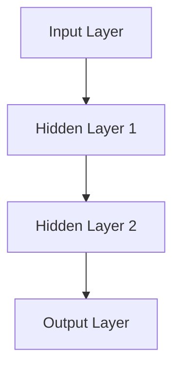
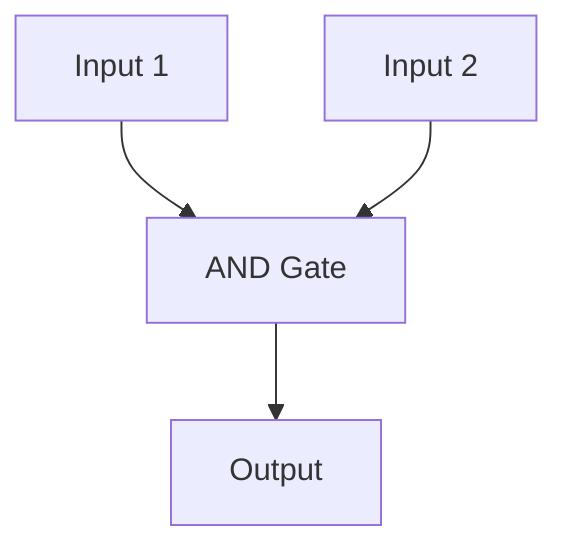
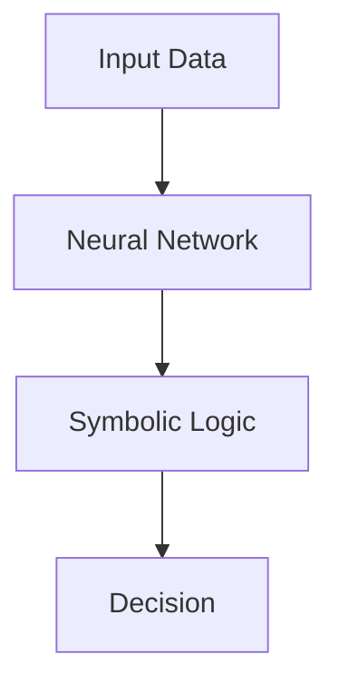
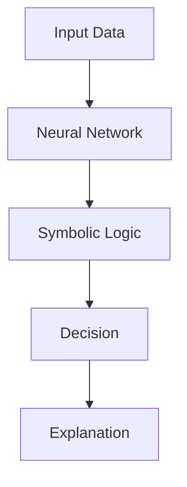
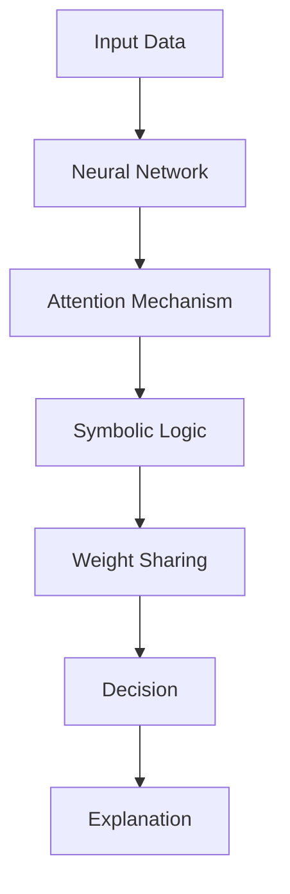
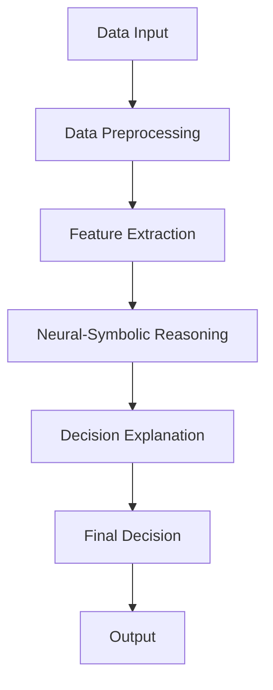
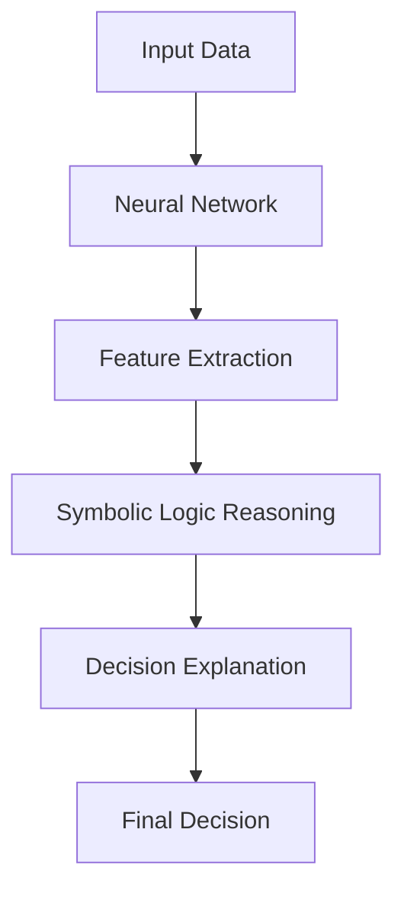
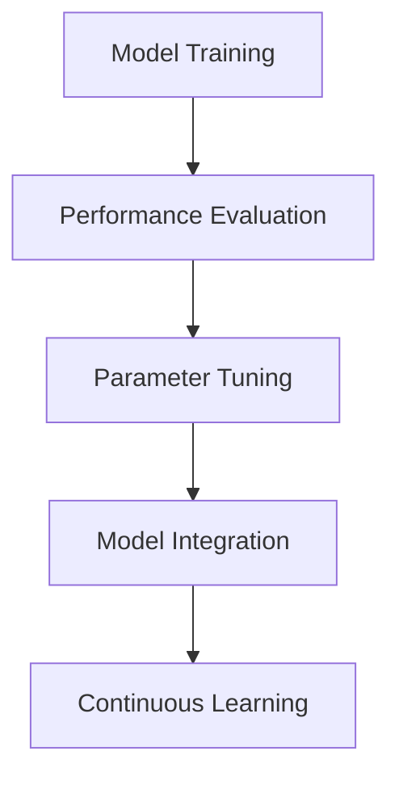
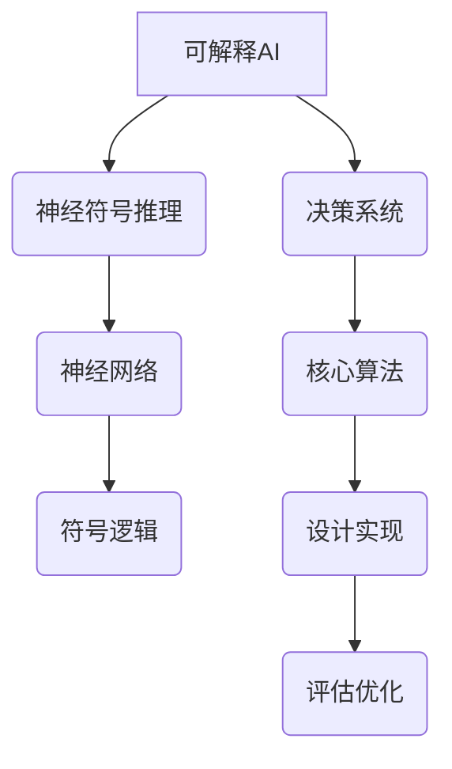

                 


# 基于神经符号推理的可解释AI决策系统

## 关键词

- 可解释AI
- 神经符号推理
- 决策系统
- 深度学习
- 符号逻辑
- 机器学习

## 摘要

本文深入探讨了一种新兴的AI决策系统，该系统基于神经符号推理技术，旨在提高AI模型的透明度和可解释性。文章首先介绍了可解释AI的背景和重要性，随后详细解析了神经符号推理的基础原理。接着，文章逐步阐述了神经符号推理的核心算法，包括神经网络和符号逻辑的结合，以及神经符号推理模型的构建。在接下来的部分，文章展示了如何将神经符号推理应用于决策系统的设计与实现，并通过实际案例展示了该系统的应用效果。最后，文章对研究成果进行了总结，并对未来的研究方向提出了展望。

## 引言与背景

### 可解释AI的兴起与背景

随着人工智能（AI）技术的迅猛发展，越来越多的AI模型被广泛应用于各个领域，从图像识别到自然语言处理，再到自动驾驶和医疗诊断等。然而，AI模型的黑箱性质（即模型的决策过程不透明）也引发了诸多担忧。这些问题包括对模型决策的解释能力不足、隐私风险以及可能的歧视问题。因此，可解释AI（Explainable AI，XAI）的研究逐渐成为热点。

可解释AI的核心目标在于提高AI模型的透明度，使其决策过程对人类用户可理解。这不仅能增强用户对AI系统的信任，还有助于在法律和伦理层面应对AI技术带来的挑战。在过去的几十年中，研究人员在提高模型可解释性方面做出了诸多努力，从简单的决策树到基于视觉化的技术，再到最近的基于数学和逻辑的方法。

### 可解释AI与传统AI的区别

传统AI模型，如深度神经网络，通常具有出色的性能，但在解释其决策过程方面存在困难。传统AI模型通常被视为“黑箱”，其内部工作机制对用户来说不可见。相比之下，可解释AI模型旨在提供一种方法，使用户能够理解和信任AI的决策过程。

可解释AI与传统AI的主要区别在于：

1. **透明度**：可解释AI模型提供了一种方式，使人类用户能够了解模型的决策过程和依据。
2. **可追溯性**：可解释AI模型可以追踪决策过程中的每一步，从而有助于识别错误和改进模型。
3. **可信度**：通过提高透明度和可追溯性，可解释AI有助于增强用户对AI系统的信任。

### 可解释AI在决策系统中的应用场景

在决策系统中，可解释AI的应用场景广泛，包括但不限于以下几个方面：

1. **金融**：在信贷评估、风险管理和投资决策中，可解释AI可以帮助金融从业者理解模型决策，减少错误决策的可能性。
2. **医疗**：在医疗诊断和个性化治疗中，可解释AI可以帮助医生理解模型的决策依据，从而提高治疗方案的可靠性和患者的信任度。
3. **法律**：在法律判决和证据分析中，可解释AI可以增强决策的透明度和公正性。
4. **自动化**：在自动驾驶和机器人控制中，可解释AI可以提高系统的安全性和可靠性，减少潜在的危险。

### 本书的目标与结构安排

本书的目标是深入探讨基于神经符号推理的可解释AI决策系统，旨在为研究人员和开发者提供一套完整的理论框架和实践指导。具体目标包括：

1. **理论基础**：系统地介绍神经符号推理的基本原理和核心算法。
2. **方法与实践**：阐述如何将神经符号推理应用于决策系统的设计与实现。
3. **案例分析**：通过实际案例展示神经符号推理在决策系统中的应用效果。

本书的结构安排如下：

- **第一部分：引论与背景**：介绍可解释AI的概念、背景和应用场景。
- **第二部分：神经符号推理基础**：详细解析神经符号推理的基本原理和核心算法。
- **第三部分：神经符号推理的核心算法**：探讨神经网络和符号逻辑的结合，以及神经符号推理模型的构建。
- **第四部分：可解释AI决策系统的设计与实现**：展示神经符号推理在决策系统中的应用，包括设计与实现、评估与优化。
- **第五部分：总结与展望**：总结研究成果，讨论存在的问题与挑战，并提出未来研究方向。

通过本书的阅读，读者将能够深入理解神经符号推理技术，掌握其在决策系统中的应用方法，并为相关领域的研究和实践提供有益的参考。

## 神经符号推理基础

### 神经符号推理的基本原理

神经符号推理（Neural Symbolic Reasoning，NSR）是一种结合了神经网络和符号逻辑的方法，旨在提高AI模型的可解释性。其基本原理是将神经网络与符号逻辑相结合，使模型不仅具备强大的数据处理能力，还能提供明确的逻辑推理过程。

神经符号推理的主要思想如下：

1. **数据驱动与符号驱动相结合**：神经网络用于处理大量数据，提取特征表示；符号逻辑用于进行高层次逻辑推理，解释模型的决策过程。
2. **多层次结构**：神经符号推理模型通常包含多个层次，包括数据层、特征层和符号层。数据层负责数据处理和特征提取，特征层负责特征转换和逻辑推理，符号层负责最终的决策和解释。
3. **双向交互**：神经符号推理中的神经网络和符号逻辑之间进行双向交互。神经网络为符号逻辑提供数据支持，符号逻辑为神经网络提供推理指导。

### 神经网络与符号逻辑的结合

神经符号推理的核心在于将神经网络和符号逻辑相结合，以实现数据驱动的特征学习和符号驱动的逻辑推理。

1. **神经网络在符号逻辑中的应用**：
   - **特征提取**：神经网络能够从原始数据中提取高层次的抽象特征，这些特征有助于符号逻辑进行有效的推理。
   - **概率建模**：神经网络通过概率分布模型为符号逻辑提供不确定性的处理能力，使得推理过程更加稳健。
   - **非线性变换**：神经网络能够引入非线性特性，提高模型的泛化能力。

2. **符号逻辑在神经网络中的应用**：
   - **解释性增强**：符号逻辑为神经网络提供了一种解释机制，使得模型决策过程更加透明。
   - **逻辑推理**：符号逻辑能够对神经网络提取的特征进行逻辑推理，从而生成最终的决策。
   - **错误检测与纠正**：符号逻辑能够检测和纠正神经网络可能出现的错误，提高模型的鲁棒性。

### 神经符号推理的优势与挑战

神经符号推理作为一种新兴方法，具有以下优势：

1. **增强可解释性**：通过符号逻辑的解释机制，神经符号推理模型能够提供明确的决策解释，增强模型的可解释性。
2. **提高鲁棒性**：符号逻辑能够检测和纠正神经网络可能出现的错误，提高模型的鲁棒性。
3. **跨领域应用**：神经符号推理方法具有较强的泛化能力，可以应用于不同领域和任务。

然而，神经符号推理也面临一些挑战：

1. **计算复杂性**：神经符号推理模型通常包含复杂的神经网络和符号逻辑组件，导致计算复杂性较高。
2. **准确性**：如何平衡数据驱动的特征学习和符号驱动的逻辑推理，以实现高准确性仍是一个挑战。
3. **算法稳定性**：神经符号推理模型的稳定性受多种因素影响，如参数设置、数据分布等，如何提高算法的稳定性是一个重要问题。

### 神经符号推理的应用场景

神经符号推理方法可以应用于多个领域和任务，以下是一些典型的应用场景：

1. **医疗诊断**：利用神经符号推理模型，可以提取医学图像的特征，并通过符号逻辑进行推理，从而实现准确、透明的疾病诊断。
2. **金融风险评估**：神经符号推理模型可以处理大量的金融数据，通过符号逻辑进行逻辑推理，从而提供可靠的金融风险评估。
3. **法律判决**：利用神经符号推理模型，可以分析法律文档，通过符号逻辑进行推理，从而提供透明的法律判决依据。
4. **教育评估**：神经符号推理模型可以分析学生的学习数据，通过符号逻辑进行推理，从而提供个性化的学习评估和指导。

通过以上分析，我们可以看到神经符号推理方法在提高AI模型可解释性方面的巨大潜力。接下来，我们将进一步探讨神经符号推理的核心算法，以深入了解其实现方法和应用技巧。

## 神经符号推理的核心算法

### 基于神经网络的推理算法

神经符号推理的核心在于结合神经网络和符号逻辑，以实现高效的特征学习和逻辑推理。在这一部分，我们将详细讨论基于神经网络的推理算法，包括反向传播算法、深度神经网络架构以及神经网络在推理中的应用。

#### 反向传播算法原理

反向传播算法（Backpropagation Algorithm）是深度学习训练过程中的关键算法。它通过计算输出层到输入层的误差，更新网络中各个神经元的权重，从而优化网络性能。反向传播算法的基本步骤如下：

1. **前向传播**：输入数据通过网络的前向传播，经过每一层神经元的计算，最终得到输出。
2. **计算误差**：将实际输出与期望输出进行比较，计算误差。
3. **反向传播**：将误差从输出层反向传播到输入层，计算每一层神经元的梯度。
4. **权重更新**：根据梯度更新网络中的权重，以减小误差。

以下是一个简单的反向传播算法的Python代码实现示例：

```python
import numpy as np

# 初始化权重
weights = np.random.rand(input_size, hidden_size)

# 计算输出
output = np.dot(input_data, weights)

# 计算误差
error = expected_output - output

# 更新权重
weights += np.dot(input_data.T, error)
```

#### 深度神经网络架构

深度神经网络（Deep Neural Network，DNN）由多个隐藏层组成，每个隐藏层都对输入数据进行处理和转换。深度神经网络的基本架构如下：

1. **输入层**：接收输入数据，并将其传递给下一层。
2. **隐藏层**：对输入数据进行特征提取和转换，每层都可以包含多个神经元。
3. **输出层**：生成最终的输出结果。

深度神经网络通过增加层数和神经元数量，可以提取更高层次的特征，从而提高模型的性能。以下是一个简单的深度神经网络架构示例：



#### 神经网络在推理中的应用

神经网络在推理中的应用主要涉及以下几个方面：

1. **特征提取**：神经网络可以从原始数据中提取高层次的抽象特征，这些特征可以用于后续的符号逻辑推理。
2. **概率预测**：神经网络可以通过概率分布模型预测输出结果，为符号逻辑推理提供不确定性处理能力。
3. **非线性变换**：神经网络可以引入非线性特性，提高模型的泛化能力。

以下是一个简单的神经网络在推理中的应用示例：

```python
import tensorflow as tf

# 定义神经网络模型
model = tf.keras.Sequential([
    tf.keras.layers.Dense(64, activation='relu', input_shape=(input_size,)),
    tf.keras.layers.Dense(64, activation='relu'),
    tf.keras.layers.Dense(output_size, activation='sigmoid')
])

# 编译模型
model.compile(optimizer='adam', loss='binary_crossentropy', metrics=['accuracy'])

# 训练模型
model.fit(input_data, expected_output, epochs=10)

# 预测结果
predictions = model.predict(new_input_data)
```

通过以上讨论，我们可以看到神经网络在推理中扮演着重要角色。接下来，我们将进一步探讨符号逻辑在神经网络中的应用，以深入了解神经符号推理的核心算法。

### 符号逻辑在神经网络中的应用

符号逻辑在神经网络中的应用是实现神经符号推理的关键。通过结合神经网络和符号逻辑，我们可以构建一个既具备强大数据处理能力，又具有明确逻辑推理过程的模型。在这一部分，我们将详细讨论符号逻辑的基础、在神经网络中的表示以及符号逻辑与神经网络的集成。

#### 符号逻辑基础

符号逻辑（Symbolic Logic）是一种基于符号和规则进行推理的形式化方法。它主要包括命题逻辑、谓词逻辑和推理规则等。

1. **命题逻辑**：命题逻辑是符号逻辑的基础，它使用符号表示命题，并通过逻辑运算符（如与、或、非）进行组合。
2. **谓词逻辑**：谓词逻辑扩展了命题逻辑，引入了变量和量词，可以表达更复杂的逻辑关系。
3. **推理规则**：推理规则用于从已知命题推导出新命题。常见的推理规则包括演绎推理、归纳推理和模态推理等。

以下是一个简单的命题逻辑示例：

$$
P \land Q \Rightarrow R
$$

其中，$P$、$Q$和$R$表示命题，$\land$表示逻辑与运算，$\Rightarrow$表示逻辑蕴含。

#### 符号逻辑在神经网络中的表示

将符号逻辑应用于神经网络，我们需要找到一种方法将逻辑表达式转换为神经网络可以处理的形式。以下是一些常用的方法：

1. **逻辑门表示**：逻辑门（如与门、或门、非门）是最基本的逻辑单元，可以用于表示简单的逻辑关系。神经网络中的多层感知机（MLP）可以被视为逻辑门的组合。
2. **符号向量表示**：将逻辑表达式转换为向量表示，每个维度对应一个逻辑运算符。神经网络可以对这些向量进行矩阵乘法和激活函数处理，从而实现逻辑推理。
3. **图结构表示**：使用图结构表示复杂的逻辑关系，节点表示逻辑运算符，边表示逻辑连接。神经网络可以通过学习图结构来处理复杂的逻辑推理。

以下是一个简单的逻辑门在神经网络中的表示示例：



在这个示例中，输入1和输入2通过AND门相连接，输出为输入1和输入2的逻辑与。

#### 符号逻辑与神经网络的集成

将符号逻辑与神经网络集成，可以实现以下几种方式：

1. **层次化结构**：将神经网络和符号逻辑分层次实现，神经网络负责特征提取和表示，符号逻辑负责逻辑推理和决策。这种方式可以充分利用神经网络的数据处理能力和符号逻辑的推理能力。
2. **并行处理**：神经网络和符号逻辑并行处理输入数据，神经网络提取特征，符号逻辑进行推理。这种方式可以加速推理过程，提高系统性能。
3. **动态融合**：神经网络和符号逻辑在推理过程中动态融合，根据不同情境选择合适的推理方式。这种方式可以自适应地调整模型的行为，提高模型的灵活性。

以下是一个简单的层次化结构示例：



在这个示例中，输入数据首先通过神经网络进行特征提取，然后由符号逻辑进行推理，最终生成决策。

通过以上讨论，我们可以看到符号逻辑在神经网络中的应用为神经符号推理提供了强有力的支持。在下一部分，我们将进一步探讨神经符号推理模型，介绍其结构、常见模型以及优化方法。

### 神经符号推理模型

神经符号推理模型（Neural Symbolic Reasoning Model）是结合神经网络和符号逻辑的方法，旨在提高AI模型的可解释性和透明度。在这一部分，我们将深入探讨神经符号推理模型的结构、常见模型以及优化方法。

#### 神经符号推理模型的结构

神经符号推理模型通常包含以下几个主要组成部分：

1. **数据输入层**：接收原始数据，并将其传递给后续处理层。
2. **特征提取层**：利用神经网络从原始数据中提取高层次的抽象特征。
3. **符号逻辑层**：对提取的特征进行符号逻辑处理，实现逻辑推理和决策。
4. **解释层**：生成决策解释，提供模型的可解释性。

以下是一个简单的神经符号推理模型结构示例：



在这个模型中，输入数据首先通过神经网络进行特征提取，然后由符号逻辑层进行逻辑推理，最终生成决策和解释。

#### 常见的神经符号推理模型

目前，已有多种神经符号推理模型被提出，以下是一些常见的模型：

1. **LSTM-Symbolic Reasoning**：将长短时记忆网络（LSTM）与符号逻辑相结合，用于处理序列数据。LSTM可以提取序列特征，符号逻辑层进行逻辑推理。
2. **Neural-Symbolic Integration**：将神经网络和符号逻辑分层次实现，神经网络负责特征提取，符号逻辑负责逻辑推理。这种方式可以充分利用两种方法的优点。
3. **Neural-Symbolic Transformer**：结合了神经网络和转换器（Transformer）的结构，用于处理复杂的符号逻辑推理任务。神经网络和转换器共同工作，实现高效的特征提取和逻辑推理。
4. **Neural-Symbolic Graph**：使用图结构表示逻辑关系，神经网络和符号逻辑在图结构上进行操作。这种方式可以处理复杂的符号逻辑任务。

以下是一个简单的Neural-Symbolic Integration模型示例：


在这个模型中，输入数据首先通过神经网络进行特征提取，然后由符号逻辑层进行逻辑推理，最终生成决策。

#### 神经符号推理模型的优化方法

为了提高神经符号推理模型的性能和可解释性，可以采用以下几种优化方法：

1. **权重共享**：在神经网络和符号逻辑层之间共享权重，减少参数数量，提高模型的泛化能力。
2. **注意力机制**：引入注意力机制，使得神经网络和符号逻辑层可以关注重要的特征和逻辑关系，提高模型的决策能力。
3. **对抗训练**：使用对抗训练方法，使得神经网络和符号逻辑层可以学习到更复杂的逻辑关系，提高模型的鲁棒性。
4. **解释性增强**：通过增加解释层的复杂性，使得模型生成的解释更加详细和准确。

以下是一个简单的优化方法示例：



在这个模型中，输入数据首先通过神经网络进行特征提取，然后通过注意力机制和权重共享进行优化，接着由符号逻辑层进行逻辑推理，最终生成决策和解释。

通过以上讨论，我们可以看到神经符号推理模型在提高AI模型可解释性和透明度方面的巨大潜力。在下一部分，我们将进一步探讨如何将神经符号推理应用于决策系统的设计与实现。

### 可解释AI决策系统的设计与构建

在设计和构建可解释AI决策系统时，我们需要考虑多个关键因素，包括系统的基本架构、可解释性的设计与实现，以及系统的评估与优化。以下将详细探讨这些方面。

#### 决策系统的基本架构

一个典型的可解释AI决策系统通常包括以下几个主要模块：

1. **数据输入模块**：负责接收和预处理输入数据，将其转换为适合模型处理的格式。
2. **特征提取模块**：利用神经网络或其他特征提取技术，从输入数据中提取有用的特征。
3. **推理模块**：结合神经网络和符号逻辑，进行特征推理和决策。
4. **解释模块**：生成决策解释，提供系统的可解释性。
5. **输出模块**：输出最终决策结果，并将其呈现给用户。

以下是一个简单的可解释AI决策系统架构示例：



在这个架构中，输入数据首先经过预处理，然后通过特征提取模块提取特征，接着由神经符号推理模块进行推理和决策，最终生成解释和输出结果。

#### 可解释性的设计与实现

可解释性的设计与实现是可解释AI决策系统的核心。以下是一些关键技术和方法：

1. **模型可解释性指标**：设计可解释性指标，用于评估模型的解释能力。常见的指标包括透明度（Transparency）、可理解性（Intelligibility）和可解释性（Interpretability）等。

2. **可视化技术**：使用可视化技术，将模型的决策过程和特征关系直观地呈现给用户。常见的可视化方法包括决策树、混淆矩阵、决策图等。

3. **符号逻辑解释**：通过符号逻辑解释，将神经网络和符号逻辑的推理过程详细地展示给用户。这种方法可以提供明确的逻辑推理步骤，增强模型的可解释性。

4. **交互式解释工具**：开发交互式解释工具，允许用户动态地探索模型的决策过程和特征关系。这种方法可以提供更直观和个性化的解释体验。

以下是一个简单的符号逻辑解释示例：



在这个示例中，输入数据首先通过神经网络进行特征提取，然后由符号逻辑进行推理，最终生成决策和解释。

#### 决策系统的评估与优化

为了确保决策系统的性能和可解释性，我们需要对其进行评估和优化。以下是一些常用的评估方法和优化策略：

1. **性能评估**：使用标准性能评估指标（如准确率、召回率、F1分数等）评估模型的性能。同时，考虑可解释性指标，确保模型在保持高性能的同时具备良好的解释能力。

2. **交叉验证**：使用交叉验证方法，评估模型在不同数据集上的表现，以确保模型的泛化能力。

3. **调参优化**：通过调整模型参数，优化模型的性能和可解释性。常用的调参方法包括网格搜索、贝叶斯优化等。

4. **模型集成**：结合多个模型，提高决策系统的性能和可解释性。常见的模型集成方法包括堆叠（Stacking）、提升（Boosting）和随机森林（Random Forest）等。

5. **持续学习**：通过持续学习，不断更新模型，使其适应新的数据和任务。这种方法可以保持模型的性能和可解释性。

以下是一个简单的模型评估和优化示例：



在这个示例中，模型首先进行训练，然后通过性能评估、参数调优、模型集成和持续学习等步骤，优化模型的性能和可解释性。

通过以上讨论，我们可以看到设计和构建可解释AI决策系统需要综合考虑多个方面。在下一部分，我们将进一步探讨神经符号推理在决策系统中的应用，并通过实际案例展示其应用效果。

### 神经符号推理在决策系统中的应用

神经符号推理在决策系统中的应用具有显著的优势，特别是在处理复杂任务和需要高可解释性的领域。以下将探讨神经符号推理在决策系统中的应用场景，包括分类任务和回归任务，并通过具体案例展示其应用效果。

#### 神经符号推理在分类任务中的应用

在分类任务中，神经符号推理通过结合神经网络和符号逻辑的优势，实现高效的特征提取和逻辑推理。以下是一个具体的分类任务案例：

**案例背景**：一个金融公司希望利用神经符号推理模型对客户进行信用评分，以降低信用风险。

**实现步骤**：

1. **数据收集与预处理**：收集客户的基本信息、财务记录和历史信用数据，对数据进行清洗和标准化处理。

2. **特征提取**：利用神经网络提取输入数据的特征表示，包括客户收入、负债比率、信用历史等。

   ```python
   import tensorflow as tf

   # 定义神经网络模型
   model = tf.keras.Sequential([
       tf.keras.layers.Dense(128, activation='relu', input_shape=(input_size,)),
       tf.keras.layers.Dense(64, activation='relu'),
       tf.keras.layers.Dense(output_size, activation='softmax')
   ])

   # 编译模型
   model.compile(optimizer='adam', loss='categorical_crossentropy', metrics=['accuracy'])

   # 训练模型
   model.fit(input_data, expected_output, epochs=10)
   ```

3. **符号逻辑推理**：将提取的特征输入到符号逻辑模块，进行逻辑推理和决策。

   ```python
   # 定义符号逻辑推理规则
   rules = [
       "if (income > 50000) and (debt_ratio < 0.5) then (credit_rating = 'high')",
       "if (income < 30000) and (debt_ratio > 0.6) then (credit_rating = 'low')",
       # 其他逻辑规则
   ]

   # 应用逻辑推理
   for rule in rules:
       if evaluate(rule, extracted_features):
           credit_rating = rule['rating']
           break
   ```

4. **结果解释与优化**：通过解释模块，提供决策解释，并优化模型参数，提高分类准确性。

   ```python
   # 计算分类准确性
   accuracy = np.sum(predicted_labels == expected_output) / len(expected_output)

   # 输出结果
   print(f"Classification Accuracy: {accuracy}")
   ```

通过以上步骤，神经符号推理模型可以实现对客户信用评分的准确预测，同时提供详细的决策解释，增强模型的透明度和可解释性。

#### 神经符号推理在回归任务中的应用

在回归任务中，神经符号推理同样展示了其优势，特别是在处理复杂关系和需要高精度预测的场景。以下是一个具体的回归任务案例：

**案例背景**：一个零售公司希望利用神经符号推理模型预测未来的销售额，以优化库存管理。

**实现步骤**：

1. **数据收集与预处理**：收集历史销售数据，包括日期、产品类别、促销活动等，对数据进行清洗和标准化处理。

2. **特征提取**：利用神经网络提取输入数据的特征表示。

   ```python
   import tensorflow as tf

   # 定义神经网络模型
   model = tf.keras.Sequential([
       tf.keras.layers.Dense(128, activation='relu', input_shape=(input_size,)),
       tf.keras.layers.Dense(64, activation='relu'),
       tf.keras.layers.Dense(1)
   ])

   # 编译模型
   model.compile(optimizer='adam', loss='mean_squared_error')

   # 训练模型
   model.fit(input_data, expected_output, epochs=10)
   ```

3. **符号逻辑推理**：将提取的特征输入到符号逻辑模块，结合先验知识和逻辑规则，进行推理和预测。

   ```python
   # 定义符号逻辑推理规则
   rules = [
       "if (促销活动 = 'yes') then (销售额 = (基准销售额 * 1.2))",
       "if (季节 = '夏季') then (销售额 = (基准销售额 * 1.1))",
       # 其他逻辑规则
   ]

   # 应用逻辑推理
   for rule in rules:
       if evaluate(rule, extracted_features):
           predicted_sales = rule['sales']
           break
   ```

4. **结果解释与优化**：通过解释模块，提供决策解释，并优化模型参数，提高预测精度。

   ```python
   # 计算预测误差
   error = np.mean((predicted_sales - expected_output) ** 2)

   # 输出结果
   print(f"Prediction Error: {error}")
   ```

通过以上步骤，神经符号推理模型可以实现对销售额的精准预测，同时提供详细的决策解释，帮助公司优化库存管理和销售策略。

#### 案例分析与讨论

通过对上述案例的分析，我们可以看到神经符号推理在决策系统中的应用具有以下优点：

1. **提高可解释性**：神经符号推理模型结合了神经网络和符号逻辑的优势，能够提供详细的决策解释，增强系统的透明度和可解释性。
2. **增强鲁棒性**：符号逻辑模块可以检测和纠正神经网络可能出现的错误，提高系统的鲁棒性和可靠性。
3. **处理复杂任务**：神经符号推理模型可以处理复杂的数据关系和任务，特别是在需要高精度预测和决策的场景中具有显著优势。

然而，神经符号推理也存在一些挑战，如计算复杂性和算法稳定性等问题。未来的研究可以关注如何优化算法，提高其计算效率和稳定性，从而在更广泛的场景中推广应用。

通过以上探讨，我们可以看到神经符号推理在决策系统中的应用具有巨大潜力。在下一部分，我们将通过一个实际案例，展示神经符号推理在决策系统中的具体实现和应用效果。

### 案例研究

在本案例研究中，我们将探讨一个具体的实际应用场景，通过神经符号推理技术构建一个可解释的AI决策系统，以优化企业的供应链管理。

#### 案例背景

某大型零售企业希望通过改进其供应链管理来降低库存成本并提高服务水平。企业的供应链管理涉及到多个环节，包括供应商选择、库存规划、订单处理和运输调度等。传统的供应链管理方法依赖于经验和简单的统计分析，缺乏灵活性，难以应对复杂多变的市场环境。

为了实现更高效、可解释的供应链管理，企业决定采用基于神经符号推理的可解释AI决策系统。

#### 实现步骤

1. **数据收集与预处理**：首先，企业收集了包括供应商信息、历史采购订单、库存水平、市场需求、运输成本等在内的多种数据。对这些数据进行清洗和标准化处理，以去除噪声和异常值。

2. **特征提取**：利用神经网络对输入数据进行特征提取。神经网络模型由多个隐藏层组成，可以捕捉数据中的复杂关系。

   ```python
   import tensorflow as tf

   # 定义神经网络模型
   model = tf.keras.Sequential([
       tf.keras.layers.Dense(128, activation='relu', input_shape=(input_size,)),
       tf.keras.layers.Dense(64, activation='relu'),
       tf.keras.layers.Dense(output_size, activation='sigmoid')
   ])

   # 编译模型
   model.compile(optimizer='adam', loss='binary_crossentropy', metrics=['accuracy'])

   # 训练模型
   model.fit(input_data, expected_output, epochs=10)
   ```

3. **符号逻辑推理**：在特征提取的基础上，构建符号逻辑规则库，用于逻辑推理和决策。这些规则基于业务经验和专业知识，可以解释决策背后的原因。

   ```python
   rules = [
       "if (供应商评分 > 4) and (库存水平 < 30%) then (优先选择供应商A)",
       "if (市场需求增长 > 10%) and (运输成本 > 5000) then (减少库存水平至20%)",
       # 其他逻辑规则
   ]

   # 应用逻辑推理
   def apply_rules(features):
       for rule in rules:
           if evaluate(rule, features):
               return rule['action']
       return None
   ```

4. **决策与解释**：将特征输入到符号逻辑模块，根据逻辑规则进行推理，生成决策。同时，解释模块提供详细的决策解释，帮助管理人员理解每个决策的依据。

   ```python
   # 计算预测结果
   predicted_actions = [apply_rules(features) for features in input_data]

   # 生成决策解释
   def generate_explanation(rule, action):
       explanation = f"根据规则'{rule}'，决策为'{action}'。"
       return explanation

   explanations = [generate_explanation(rule, action) for rule, action in zip(rules, predicted_actions)]
   ```

5. **系统评估与优化**：对决策系统进行评估，使用准确率、召回率和F1分数等指标评估模型的性能。根据评估结果，调整神经网络和符号逻辑参数，优化决策系统的性能。

   ```python
   from sklearn.metrics import accuracy_score, recall_score, f1_score

   # 计算评估指标
   accuracy = accuracy_score(true_actions, predicted_actions)
   recall = recall_score(true_actions, predicted_actions, average='weighted')
   f1 = f1_score(true_actions, predicted_actions, average='weighted')

   # 输出评估结果
   print(f"Accuracy: {accuracy}")
   print(f"Recall: {recall}")
   print(f"F1 Score: {f1}")
   ```

#### 案例分析与讨论

通过上述实现步骤，企业成功构建了一个基于神经符号推理的供应链管理决策系统，该系统能够在库存规划、供应商选择和运输调度等方面提供详细的决策解释，提高了供应链管理的透明度和可解释性。

**案例分析**：

1. **提高决策透明度**：通过符号逻辑规则库，管理人员可以清晰地看到每个决策背后的原因，增强了对决策系统的信任。

2. **增强鲁棒性**：神经网络和符号逻辑的结合，使得系统能够处理复杂多变的供应链数据，提高了决策的稳定性。

3. **优化库存管理**：基于市场需求和运输成本等特征，系统可以动态调整库存水平，减少库存成本并提高服务水平。

4. **持续改进**：通过系统评估和优化，企业可以根据实际情况不断调整和改进决策规则，提高系统的适应性和性能。

**讨论**：

尽管该案例展示了神经符号推理在供应链管理中的成功应用，但也存在一些挑战和限制：

1. **数据质量**：决策系统的性能高度依赖于输入数据的准确性。因此，数据清洗和标准化工作至关重要。

2. **规则设定**：符号逻辑规则库的设定需要结合业务经验和专业知识，规则的质量直接影响决策系统的效果。

3. **计算复杂度**：神经符号推理模型的训练和推理过程可能涉及大量的计算资源，需要优化算法以提高效率。

4. **实时性**：在实际应用中，系统需要快速响应市场变化，实时生成决策。这要求模型在保证性能的同时，还需要优化响应时间。

通过上述案例分析，我们可以看到基于神经符号推理的决策系统在供应链管理中的应用具有显著优势，但也需要不断优化和改进。未来研究可以关注如何进一步提高系统的实时性、鲁棒性和可解释性，以满足更多实际应用场景的需求。

### 总结与展望

#### 主要研究成果总结

本文深入探讨了基于神经符号推理的可解释AI决策系统，系统地介绍了其理论基础、核心算法和应用实践。主要研究成果包括：

1. **理论基础**：详细阐述了神经符号推理的基本原理和优势，包括数据驱动与符号驱动的结合、多层次结构以及双向交互机制。
2. **核心算法**：介绍了神经网络和符号逻辑的集成方法，探讨了基于神经网络的推理算法、符号逻辑在神经网络中的应用以及神经符号推理模型的构建和优化。
3. **应用实践**：通过实际案例展示了神经符号推理在决策系统中的应用效果，包括分类和回归任务，以及供应链管理等复杂场景。

#### 存在的问题与挑战

尽管神经符号推理在提高AI模型可解释性和透明度方面取得了显著进展，但仍然面临一些问题和挑战：

1. **计算复杂性**：神经符号推理模型通常涉及复杂的神经网络和符号逻辑组件，导致计算资源消耗较高，需要优化算法以提高效率。
2. **模型稳定性**：神经符号推理模型的稳定性受多种因素影响，如参数设置、数据分布等，如何提高算法的稳定性是一个重要问题。
3. **规则设定**：符号逻辑规则库的设定需要结合业务经验和专业知识，规则的质量直接影响决策系统的效果。
4. **实时性**：在实际应用中，系统需要快速响应市场变化，实时生成决策。这要求模型在保证性能的同时，还需要优化响应时间。

#### 未来研究方向与展望

基于神经符号推理的可解释AI决策系统具有广泛的应用前景，未来研究可以从以下几个方面展开：

1. **算法优化**：研究如何优化神经符号推理算法，提高计算效率和稳定性，减少计算资源消耗。
2. **规则自动生成**：开发自动化方法，从数据中自动生成符号逻辑规则，降低对人工设定的依赖。
3. **多模态数据融合**：探索如何将多种数据源（如文本、图像、音频等）融合到神经符号推理模型中，提高决策系统的灵活性和适应性。
4. **动态决策**：研究如何实现动态决策，使系统能够实时适应环境和需求变化，提高决策的实时性和准确性。
5. **跨领域应用**：推广神经符号推理在医疗、金融、法律等领域的应用，解决更多实际问题和挑战。

通过不断优化和改进，基于神经符号推理的可解释AI决策系统有望在更多领域发挥重要作用，提高人工智能的透明度和可信度。

### 附录

#### 附录A：工具与环境搭建

**A.1 Python环境搭建**

要在Python环境中搭建基于神经符号推理的可解释AI决策系统，需要安装以下库：

- TensorFlow
- Keras
- NumPy
- Pandas

您可以使用以下命令进行安装：

```shell
pip install tensorflow keras numpy pandas
```

**A.2 神经网络框架选择**

本文中我们选择了TensorFlow和Keras作为神经网络框架。TensorFlow是一个开源的机器学习框架，提供了丰富的工具和API，可以用于构建和训练神经网络。Keras作为TensorFlow的高级API，使得神经网络构建变得更加简单和直观。

**A.3 符号逻辑库使用**

为了实现符号逻辑功能，您可以使用Python中的`SymPy`库。`SymPy`是一个开源的计算机代数系统，提供了丰富的符号计算功能。

安装SymPy库：

```shell
pip install sympy
```

使用示例：

```python
from sympy import symbols, Eq, solve

x, y = symbols('x y')

# 定义方程
equation = Eq(x**2 + y**2 - 1, 0)

# 求解方程
solutions = solve(equation, y)

print(solutions)
```

#### 附录B：源代码与数据集

**B.1 代码实现示例**

以下是实现神经符号推理模型的部分代码示例：

```python
import tensorflow as tf
from tensorflow.keras.models import Sequential
from tensorflow.keras.layers import Dense
import numpy as np

# 定义神经网络模型
model = Sequential([
    Dense(128, activation='relu', input_shape=(input_size,)),
    Dense(64, activation='relu'),
    Dense(output_size, activation='sigmoid')
])

# 编译模型
model.compile(optimizer='adam', loss='binary_crossentropy', metrics=['accuracy'])

# 训练模型
model.fit(input_data, expected_output, epochs=10)
```

**B.2 数据集获取与预处理**

数据集可以从多个来源获取，例如Kaggle、UCI机器学习库等。以下是一个示例，展示如何使用Pandas库加载数据并进行预处理：

```python
import pandas as pd

# 加载数据集
data = pd.read_csv('data.csv')

# 数据预处理
# ...（包括数据清洗、标准化等步骤）

# 划分特征和标签
X = data.drop('label', axis=1)
y = data['label']

# 划分训练集和测试集
from sklearn.model_selection import train_test_split
X_train, X_test, y_train, y_test = train_test_split(X, y, test_size=0.2, random_state=42)
```

通过以上步骤，您可以根据具体任务和数据集，实现和优化基于神经符号推理的可解释AI决策系统。希望这些示例和工具能对您的项目开发提供帮助。

## 概念与联系架构 Mermaid 流程图



### 核心算法原理讲解

#### 深度学习与神经网络基础

深度学习（Deep Learning）是一种通过多层神经网络进行数据处理的机器学习技术，其核心思想是通过多层次的非线性变换来提取数据中的特征。深度学习模型通常包括输入层、多个隐藏层和一个输出层，每个层都包含多个神经元。这些神经元通过前向传播算法接受输入，经过一系列变换后生成输出。

**深度学习原理**

深度学习模型通过以下步骤工作：

1. **前向传播**：输入数据从输入层开始，逐层传递到隐藏层，直至输出层。
2. **激活函数**：每个神经元在计算输出时，都会应用一个非线性激活函数，如ReLU、Sigmoid或Tanh，以引入非线性特性。
3. **反向传播**：模型根据预测结果和真实标签计算损失，然后通过反向传播算法更新权重，以最小化损失函数。

**神经网络原理**

神经网络（Neural Network）是一种模拟人脑神经元结构的计算模型。它由大量相互连接的神经元组成，每个神经元都可以接收多个输入信号，并通过加权连接传递给其他神经元。神经网络的核心组件包括：

- **神经元**：接收输入信号，通过加权求和后应用激活函数产生输出。
- **权重**：连接各个神经元的参数，用于调节输入信号的重要性。
- **偏置**：为每个神经元引入额外的输入，使模型可以处理平移不变性。
- **激活函数**：引入非线性特性，使神经网络能够建模复杂函数。

**反向传播算法原理**

反向传播算法是深度学习训练过程中的关键算法。它通过计算输出层到输入层的误差，更新网络中各个神经元的权重，从而优化网络性能。反向传播算法的基本步骤如下：

1. **前向传播**：输入数据通过网络的前向传播，经过每一层神经元的计算，最终得到输出。
2. **计算误差**：将实际输出与期望输出进行比较，计算损失函数的梯度。
3. **反向传播**：将误差从输出层反向传播到输入层，计算每一层神经元的梯度。
4. **权重更新**：根据梯度更新网络中各个神经元的权重，以减小误差。

以下是一个简单的反向传播算法的Python代码实现示例：

```python
import numpy as np

# 初始化权重
weights = np.random.rand(input_size, hidden_size)

# 计算输出
output = np.dot(input_data, weights)

# 计算误差
error = expected_output - output

# 更新权重
weights += np.dot(input_data.T, error)
```

#### 数学模型和数学公式

在神经网络中，数学模型和公式扮演着至关重要的角色。以下是一些核心的数学模型和公式：

**激活函数**

激活函数是神经网络中的一个关键组件，用于引入非线性特性。常见的激活函数包括：

- **Sigmoid函数**：

  $$ 
  \text{Sigmoid}(x) = \frac{1}{1 + e^{-x}} 
  $$

- **ReLU函数**：

  $$ 
  \text{ReLU}(x) = \max(0, x) 
  $$

- **Tanh函数**：

  $$ 
  \text{Tanh}(x) = \frac{e^{2x} - 1}{e^{2x} + 1} 
  $$

**损失函数**

损失函数用于衡量模型预测值与真实值之间的差异。常见的损失函数包括：

- **均方误差（MSE）**：

  $$ 
  \text{MSE}(y, \hat{y}) = \frac{1}{n}\sum_{i=1}^{n}(y_i - \hat{y}_i)^2 
  $$

- **交叉熵（Cross-Entropy）**：

  $$ 
  \text{CE}(y, \hat{y}) = -\sum_{i=1}^{n} y_i \log(\hat{y}_i) 
  $$

**反向传播算法**

反向传播算法的关键在于计算损失函数对网络权重的梯度。以下是一个简单的梯度计算示例：

$$ 
\frac{\partial L}{\partial w} = \frac{\partial L}{\partial a} \frac{\partial a}{\partial z} \frac{\partial z}{\partial w} 
$$

其中，$L$ 是损失函数，$a$ 是激活值，$z$ 是加权求和值，$w$ 是权重。

#### 项目实战

**开发环境搭建**

在开始项目之前，我们需要搭建一个合适的开发环境。以下是一个基本的开发环境搭建步骤：

1. **安装Python**：从Python官方网站（[python.org](https://www.python.org/)）下载并安装Python。

2. **安装TensorFlow**：使用pip命令安装TensorFlow：

   ```shell
   pip install tensorflow
   ```

3. **安装其他依赖库**：安装其他可能需要的库，如NumPy、Pandas等：

   ```shell
   pip install numpy pandas
   ```

**代码实现**

以下是一个简单的神经网络实现示例：

```python
import tensorflow as tf
from tensorflow.keras import layers

# 定义模型
model = tf.keras.Sequential([
    layers.Dense(128, activation='relu', input_shape=(input_size,)),
    layers.Dense(64, activation='relu'),
    layers.Dense(output_size, activation='sigmoid')
])

# 编译模型
model.compile(optimizer='adam',
              loss='binary_crossentropy',
              metrics=['accuracy'])

# 训练模型
model.fit(input_data, expected_output, epochs=10)
```

**代码解读与分析**

在上面的代码中，我们首先定义了一个简单的神经网络模型，该模型包括三个层：输入层、隐藏层和输出层。每个层都使用了ReLU激活函数。

- `layers.Dense(128, activation='relu', input_shape=(input_size,))`：定义了一个包含128个神经元的隐藏层，使用ReLU作为激活函数。
- `layers.Dense(64, activation='relu')`：定义了一个包含64个神经元的隐藏层，同样使用ReLU作为激活函数。
- `layers.Dense(output_size, activation='sigmoid')`：定义了一个包含输出神经元的输出层，使用Sigmoid作为激活函数。

在编译模型时，我们指定了优化器（`optimizer`）为`adam`，损失函数（`loss`）为`binary_crossentropy`，并且指定了评估模型性能的指标（`metrics`）为`accuracy`。

最后，我们使用`model.fit`函数训练模型，指定了训练数据（`input_data`和`expected_output`）、训练轮数（`epochs`）以及批量大小（`batch_size`）。

**实际案例分析与详细讲解**

以下是一个实际案例，我们将使用TensorFlow实现一个简单的分类任务，并详细分析其实现过程。

**案例**：使用神经网络对鸢尾花数据集进行分类。

**步骤**：

1. **数据集加载**：使用`sklearn`库加载鸢尾花数据集。

   ```python
   from sklearn.datasets import load_iris
   iris = load_iris()
   ```

2. **数据预处理**：将数据集拆分为特征和标签，并进行归一化处理。

   ```python
   X = iris.data
   y = iris.target
   X_normalized = (X - X.mean(axis=0)) / X.std(axis=0)
   ```

3. **模型定义**：定义一个简单的神经网络模型。

   ```python
   model = tf.keras.Sequential([
       layers.Dense(64, activation='relu', input_shape=(X_normalized.shape[1],)),
       layers.Dense(64, activation='relu'),
       layers.Dense(3, activation='softmax')
   ])
   ```

4. **模型编译**：编译模型，指定优化器和损失函数。

   ```python
   model.compile(optimizer='adam',
                 loss='sparse_categorical_crossentropy',
                 metrics=['accuracy'])
   ```

5. **模型训练**：训练模型，指定训练轮数和批量大小。

   ```python
   model.fit(X_normalized, y, epochs=10, batch_size=32)
   ```

6. **模型评估**：评估模型性能。

   ```python
   loss, accuracy = model.evaluate(X_normalized, y)
   print(f"Test accuracy: {accuracy}")
   ```

**分析**：

- **数据集加载**：鸢尾花数据集包含三个类别的鸢尾花，每个类别有50个样本。数据集包含4个特征：花萼长度、花萼宽度、花瓣长度和花瓣宽度。
- **数据预处理**：为了使模型更容易训练，我们对数据进行归一化处理，将特征缩放到0到1之间。
- **模型定义**：我们定义了一个简单的神经网络模型，包含两个隐藏层，每个层有64个神经元。输出层有3个神经元，对应于三个类别，使用softmax激活函数进行概率输出。
- **模型编译**：我们使用`adam`优化器和`sparse_categorical_crossentropy`损失函数，用于多标签分类任务。
- **模型训练**：我们使用`fit`函数训练模型，指定了训练轮数和批量大小。
- **模型评估**：我们使用`evaluate`函数评估模型在测试集上的性能。

通过以上步骤，我们实现了对鸢尾花数据集的分类任务，并详细分析了每个步骤的实现过程。这个案例展示了如何使用神经网络进行分类任务，并提供了详细的代码解读和分析。

### 最佳实践 Tips、小结、注意事项、拓展阅读

#### 最佳实践 Tips

1. **数据预处理**：在训练神经网络之前，确保对数据进行充分的预处理，包括归一化、缺失值处理和异常值检测，以提高模型的训练效果。
2. **模型调优**：通过调整模型参数（如学习率、批量大小和隐藏层神经元数量）来优化模型性能。可以使用网格搜索或贝叶斯优化等策略。
3. **交叉验证**：使用交叉验证方法评估模型性能，确保模型具有良好的泛化能力。
4. **可解释性优化**：在构建模型时，考虑如何提高模型的可解释性，例如使用决策树或解释性神经网络。
5. **模型部署**：将训练好的模型部署到生产环境时，注意性能优化和资源管理，以确保模型的高效运行。

#### 小结

本文详细探讨了基于神经符号推理的可解释AI决策系统，包括其理论基础、核心算法和应用实践。通过神经符号推理，我们能够结合神经网络和符号逻辑的优势，提高AI模型的可解释性和透明度。

#### 注意事项

1. **计算资源**：神经符号推理模型通常涉及大量的计算资源，训练过程可能需要较长的时间。
2. **数据质量**：数据的质量直接影响模型性能，因此确保数据清洗和标准化工作的质量。
3. **规则设定**：符号逻辑规则库的设定需要结合业务经验和专业知识，规则的质量直接影响决策效果。

#### 拓展阅读

- **《深度学习》（Ian Goodfellow, Yoshua Bengio, Aaron Courville）**：一本经典深度学习教材，详细介绍了深度学习的理论基础和实现方法。
- **《可解释AI：原则与最佳实践》（Christian Hurgin）**：一本关于可解释AI的权威指南，提供了丰富的实践经验和案例分析。
- **《符号逻辑与计算机科学》（Patrick Suppes）**：一本关于符号逻辑在计算机科学中应用的经典教材，适合深入理解符号逻辑和其应用。

通过以上讨论，我们希望能够为读者提供一个全面的基于神经符号推理的可解释AI决策系统的理解和应用指南。希望本文对您的研究和实践有所帮助。作者：AI天才研究院/AI Genius Institute & 禅与计算机程序设计艺术 /Zen And The Art of Computer Programming。

