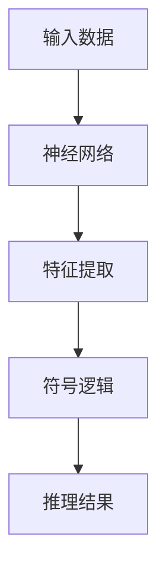
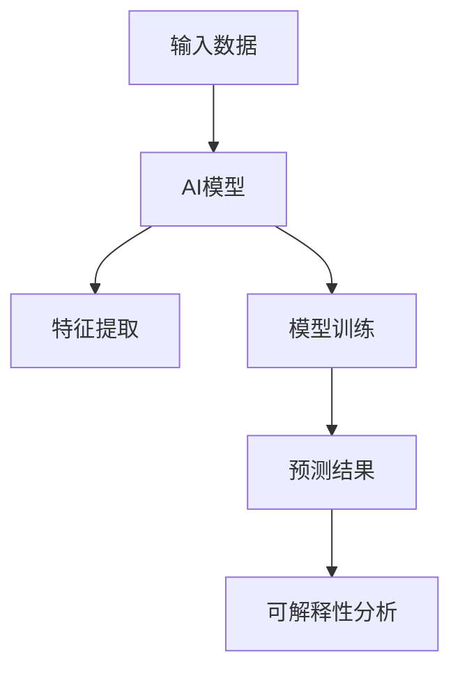
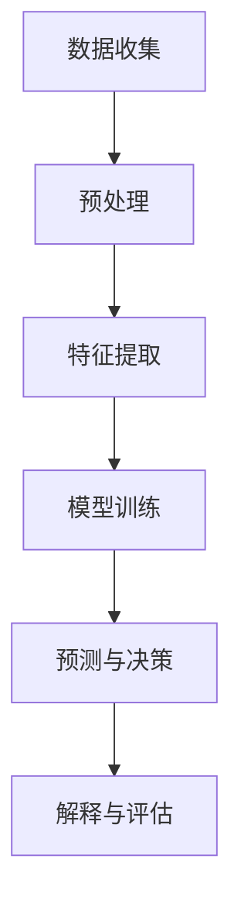
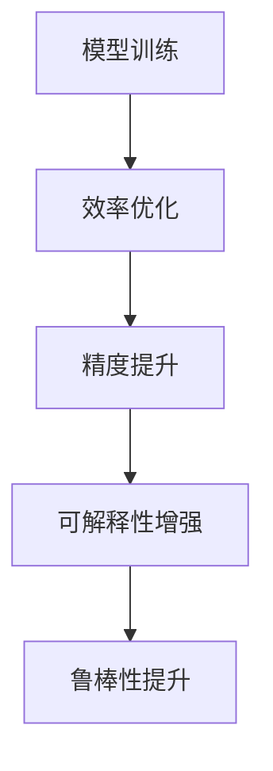
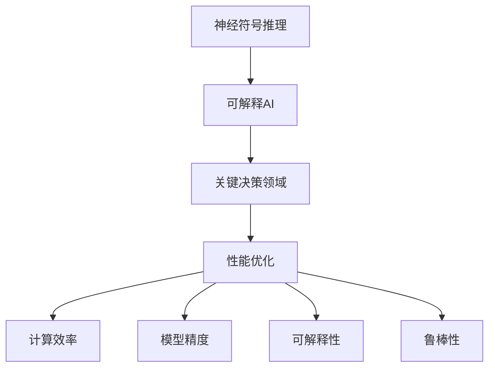

                 

### 第一部分：引言与背景

#### 1.1 书籍概述

《基于神经符号推理的可解释AI系统在关键决策领域的性能优化》这本书旨在深入探讨神经符号推理在可解释人工智能（AI）系统中的应用及其对关键决策领域性能的影响。随着人工智能技术的不断发展和应用领域的拓展，如何构建既高效又可解释的AI系统已成为当前研究的热点之一。特别是在金融、医疗、交通等关键决策领域，人们对AI系统的透明性和可靠性提出了更高的要求。

本书的核心主题包括三个方面：

1. **神经符号推理**：介绍神经符号推理的基本概念、原理和发展历程，以及如何将符号逻辑与神经网络相结合，实现高效且可解释的推理过程。
2. **可解释AI系统**：探讨可解释人工智能系统的设计原则、关键组件及其在实际应用中的挑战，强调可解释性对于提升系统可靠性和用户信任的重要性。
3. **性能优化**：分析当前AI系统在关键决策领域中的性能瓶颈，探讨多种性能优化方法，以及如何通过神经符号推理技术实现系统的全面提升。

研究意义方面，本书不仅为研究人员和工程师提供了一个系统的理论框架，还通过具体的案例研究展示了神经符号推理在关键决策领域中的应用潜力。通过性能优化策略，本书旨在为解决AI系统在实际应用中的可解释性和效率问题提供新的思路和方法。

#### 1.2 相关概念

##### 1.2.1 神经符号推理

神经符号推理是一种结合了神经网络和符号逻辑的AI推理方法。传统的神经网络在处理复杂问题时表现出色，但其“黑箱”特性使得结果难以解释，难以满足某些应用领域的需求。而符号逻辑则提供了明确的推理规则和语义解释，但处理复杂任务的能力有限。

神经符号推理的核心思想是将神经网络与符号逻辑相结合，通过神经网络进行特征提取和模式识别，同时利用符号逻辑进行推理和决策。这种方法不仅提高了系统的处理能力，还增强了结果的解释性和透明性。

发展历程方面，神经符号推理可以追溯到20世纪80年代，当时研究者开始探索如何将神经网络与传统的符号推理方法相结合。随着深度学习和符号逻辑研究的深入，神经符号推理逐渐成为一种重要的AI推理方法。

##### 1.2.2 可解释AI

可解释AI（Explainable AI，简称XAI）是指能够提供透明、可解释的AI系统。可解释AI的目标是使AI系统在做出决策时能够解释其推理过程和结果，从而提高系统的可靠性和用户信任。

可解释AI的重要性体现在以下几个方面：

1. **监管合规**：在某些应用领域，如金融、医疗等，监管机构要求AI系统必须提供可解释性，以确保系统的决策符合法规要求。
2. **用户信任**：用户更愿意接受和信任那些能够提供明确解释的AI系统，从而提高系统的可用性和用户体验。
3. **错误修正**：通过可解释AI，用户可以更好地理解系统的错误和偏差，从而及时进行修正，避免潜在的风险。

然而，可解释AI也面临一些挑战，如如何在保持高效性的同时提供可解释性，如何处理复杂决策中的不确定性等。

##### 1.2.3 关键决策领域

关键决策领域是指那些决策结果直接影响社会和经济福祉的领域，如金融、医疗、交通、能源等。这些领域的决策过程通常涉及大量的数据、复杂的模型和严格的合规要求。

关键决策领域的特点包括：

1. **数据密集**：这些领域通常涉及大量的数据，如医疗数据、金融交易数据、交通流量数据等。
2. **模型复杂**：为了实现精准的决策，这些领域通常需要使用复杂的机器学习模型和深度学习算法。
3. **合规要求**：这些领域的决策结果往往受到严格的法规和合规要求，如数据隐私、公平性等。

##### 1.3 研究现状

目前，国内外研究者已经对神经符号推理、可解释AI和关键决策领域进行了大量研究。以下是对国内外研究进展的一个简要概述。

###### 国内研究进展

国内在神经符号推理和可解释AI领域的研究起步较晚，但发展迅速。近年来，越来越多的研究机构和高校开始关注这些领域，并取得了显著成果。例如，清华大学、北京大学等高校在神经符号推理和可解释AI方面进行了深入研究，并发表了多篇高质量的研究论文。此外，国内的一些企业，如百度、阿里巴巴等，也在这些领域进行了积极探索和应用。

###### 国外研究进展

国外在神经符号推理和可解释AI领域的研究起步较早，且成果丰硕。许多国际知名高校和研究机构，如斯坦福大学、麻省理工学院等，都在这些领域进行了深入研究。例如，斯坦福大学的“可解释AI”项目旨在开发可解释的深度学习模型，麻省理工学院的“机器学习与人工智能”实验室也在神经符号推理方面取得了重要突破。

在关键决策领域，国内外研究者也进行了大量的探索和应用。例如，在金融领域，研究者们利用神经符号推理技术提高了交易系统的预测准确性和可解释性；在医疗领域，研究者们通过可解释AI技术提升了诊断和治疗的精度和透明度；在交通领域，研究者们利用神经符号推理技术优化了交通流量预测和交通信号控制。

##### 1.3.3 性能优化

当前，AI系统在关键决策领域中的性能优化主要面临以下挑战：

1. **计算效率**：由于关键决策领域通常涉及大量的数据和复杂的模型，如何提高计算效率成为一个重要问题。
2. **可解释性**：如何在保持高效性的同时提供可解释性，是一个亟待解决的难题。
3. **模型精度**：如何提高模型的预测精度，以满足关键决策领域的需求。

针对这些挑战，研究者们提出了一系列性能优化方法，如模型压缩、模型蒸馏、注意力机制等。通过这些方法，AI系统在关键决策领域中的性能得到了显著提升。

#### 1.4 总结

本文对《基于神经符号推理的可解释AI系统在关键决策领域的性能优化》这本书的引言和背景进行了介绍。通过梳理神经符号推理、可解释AI和关键决策领域的基本概念，以及国内外研究进展，本文为后续章节的内容奠定了基础。接下来，本文将深入探讨神经符号推理的基本原理和应用，为读者提供一个系统的理论框架。


#### 1.4 总结

本文对《基于神经符号推理的可解释AI系统在关键决策领域的性能优化》这本书的引言和背景进行了详细介绍。通过引入神经符号推理、可解释AI和关键决策领域的基本概念，以及国内外在该领域的研究进展，本文为读者勾勒出了本书的核心主题和研究意义。

神经符号推理是一种将神经网络和符号逻辑相结合的AI推理方法，它能够在保持高效处理能力的同时提供明确的解释。可解释AI的目标是使AI系统在做出决策时能够提供透明的推理过程，这对于提升系统的可靠性和用户信任至关重要。关键决策领域则包括那些决策结果直接影响社会和经济福祉的领域，如金融、医疗和交通等。

国内外研究者在神经符号推理、可解释AI和关键决策领域已经取得了显著的成果，这些成果为本书的讨论提供了丰富的素材和案例。当前，AI系统在关键决策领域中的性能优化面临计算效率、可解释性和模型精度等挑战，研究者们提出了多种优化方法，以提升系统的整体性能。

在接下来的章节中，本文将深入探讨神经符号推理的基本原理、可解释AI系统的设计原则及其在关键决策领域的应用。通过具体的案例分析，本文将展示神经符号推理技术在实际应用中的效果和潜力。最后，本文还将探讨性能优化策略，为解决AI系统在实际应用中的可解释性和效率问题提供新的思路和方法。

通过本文的介绍，读者可以了解到本书的核心内容和研究价值，为后续章节的学习和研究做好准备。我们期待读者能够在阅读过程中，不仅能够掌握神经符号推理和可解释AI的理论知识，还能够结合实际案例，深入理解这些技术在关键决策领域中的应用和潜力。


## 第一部分：引言与背景

### 1.2 相关概念

在深入探讨《基于神经符号推理的可解释AI系统在关键决策领域的性能优化》之前，有必要明确一些核心概念，并理解这些概念之间的内在联系。

#### 1.2.1 神经符号推理

神经符号推理（Neural Symbolic Reasoning）是一种融合了神经网络和符号逻辑的人工智能技术。它旨在结合神经网络在处理复杂数据和高维度特征上的优势与符号逻辑在推理和决策中的明确性和可解释性。神经符号推理的核心在于如何将神经网络学习到的隐含知识表示转换为符号逻辑可解释的规则或概念。

**核心原理：**

1. **神经网络特征提取**：神经网络通过多层感知器和卷积神经网络（CNN）等结构，对输入数据进行特征提取，形成高维的特征向量。
2. **符号逻辑推理**：利用符号逻辑和规则系统，对提取的特征向量进行逻辑推理，以实现决策或问题求解。

**Mermaid流程图：**



在这个流程图中，输入数据首先通过神经网络进行特征提取，然后利用符号逻辑进行推理，最终得到推理结果。

#### 1.2.2 可解释AI

可解释AI（Explainable AI，简称XAI）是一种旨在增强人工智能系统透明度和可解释性的技术。可解释AI的目标是让用户能够理解AI系统的决策过程和结果，从而提升系统的信任度和接受度。

**核心概念：**

1. **模型透明性**：使AI系统的内部工作机制和决策过程可视化，用户可以清晰地看到系统是如何处理数据和做出决策的。
2. **决策可追溯性**：用户可以追溯系统的决策过程，了解系统在不同情况下是如何调整和变化的。
3. **公平性和可理解性**：确保AI系统的决策具有公平性和可理解性，避免偏见和不公正。

**Mermaid流程图：**



在这个流程图中，输入数据首先通过AI模型进行特征提取和模型训练，得到预测结果，然后通过可解释性分析，用户可以理解模型的工作机制和决策过程。

#### 1.2.3 关键决策领域

关键决策领域是指那些决策结果对社会、经济和公众福祉具有重大影响的领域，如金融、医疗、交通和能源等。这些领域的共同特点是数据量大、决策复杂，并且决策结果需要具有高度的可解释性和可靠性。

**分类：**

1. **金融**：涉及风险投资、市场预测、信用评估等。
2. **医疗**：涉及疾病诊断、治疗方案推荐、药物研发等。
3. **交通**：涉及交通流量预测、交通信号控制、自动驾驶等。
4. **能源**：涉及能源需求预测、电力调度、能源优化等。

**决策过程：**

1. **数据收集与预处理**：收集相关领域的数据，并进行清洗、归一化等预处理操作。
2. **特征提取**：使用机器学习算法提取数据中的关键特征。
3. **模型训练与优化**：使用提取的特征训练机器学习模型，并通过交叉验证和超参数调优来优化模型性能。
4. **决策与解释**：利用训练好的模型进行预测和决策，并通过可解释AI技术对决策过程和结果进行解释。

**Mermaid流程图：**



在这个流程图中，数据首先被收集和预处理，然后通过特征提取和模型训练得到预测和决策结果，最后通过可解释AI技术对决策过程和结果进行解释和评估。

#### 1.2.4 性能优化

在关键决策领域，AI系统的性能优化是确保其高效性和可靠性的关键。性能优化包括以下几个方面：

1. **计算效率**：提高AI模型的计算效率，以减少处理时间和资源消耗。
2. **模型精度**：通过算法优化和数据增强等方法提高模型的预测准确度。
3. **可解释性**：增强AI系统的可解释性，使其决策过程更加透明和易于理解。
4. **鲁棒性**：提高模型对异常数据和噪声的鲁棒性，确保其在各种情况下都能稳定工作。

**Mermaid流程图：**



在这个流程图中，模型训练后的第一步是进行效率优化，然后是精度提升，接下来是可解释性增强，最后是鲁棒性提升。

### 1.2.5 核心概念关系架构

通过上述对神经符号推理、可解释AI、关键决策领域和性能优化的介绍，我们可以构建它们之间的内在联系和关系架构。以下是这些核心概念之间的Mermaid流程图：



在这个关系架构中，神经符号推理和可解释AI是构建关键决策领域AI系统的基础，而性能优化则是确保这些系统能够在实际应用中高效、可靠地运行的关键。

通过上述内容，我们不仅明确了本书的核心概念，还构建了这些概念之间的内在联系。在接下来的章节中，我们将深入探讨神经符号推理的原理、可解释AI的设计原则以及在关键决策领域的应用，并结合具体案例，探讨性能优化策略，以期为读者提供系统的理论框架和实践指导。

#### 1.2.6 相关概念的Python实现

为了更好地理解神经符号推理、可解释AI和关键决策领域，下面将通过Python代码示例来展示这些概念的基本实现。我们将使用Python的标准库和一些流行的机器学习库，如scikit-learn和TensorFlow，来分别实现神经网络特征提取、符号逻辑推理和模型训练。

##### 1.2.6.1 神经网络特征提取

神经网络特征提取是神经符号推理的核心步骤之一。以下是一个简单的Python代码示例，展示如何使用scikit-learn库中的多层感知器（MLP）模型提取特征。

```python
from sklearn.neural_network import MLPClassifier
from sklearn.datasets import load_iris
from sklearn.model_selection import train_test_split

# 加载数据集
iris = load_iris()
X, y = iris.data, iris.target

# 划分训练集和测试集
X_train, X_test, y_train, y_test = train_test_split(X, y, test_size=0.3, random_state=42)

# 创建多层感知器模型
mlp = MLPClassifier(hidden_layer_sizes=(100,), max_iter=1000, random_state=42)

# 训练模型
mlp.fit(X_train, y_train)

# 特征提取
features = mlp.transform(X_test)

print("Extracted features:", features)
```

在这个示例中，我们首先使用scikit-learn库中的iris数据集来训练一个多层感知器模型。通过`fit`方法，模型从训练数据中学习特征，然后使用`transform`方法将测试数据转换成特征向量。

##### 1.2.6.2 符号逻辑推理

符号逻辑推理通常涉及使用符号逻辑规则对特征向量进行推理。以下是一个简单的示例，展示如何使用Python中的符号逻辑库SymPy来实现推理。

```python
from sympy import symbols, Eq, solve

# 定义符号
x, y = symbols('x y')

# 创建符号逻辑方程
eq1 = Eq(x + y, 5)
eq2 = Eq(x - y, 1)

# 解方程
solutions = solve((eq1, eq2), (x, y))

print("Solutions:", solutions)
```

在这个示例中，我们定义了两个符号逻辑方程，并通过`solve`方法求解方程组。这个示例虽然简单，但展示了符号逻辑推理的基本过程。

##### 1.2.6.3 模型训练

模型训练是关键决策领域应用的核心步骤。以下是一个简单的示例，展示如何使用TensorFlow库训练一个简单的神经网络模型。

```python
import tensorflow as tf
from tensorflow.keras.models import Sequential
from tensorflow.keras.layers import Dense
from tensorflow.keras.optimizers import Adam

# 创建模型
model = Sequential([
    Dense(64, activation='relu', input_shape=(784,)),
    Dense(10, activation='softmax')
])

# 编译模型
model.compile(optimizer=Adam(), loss='categorical_crossentropy', metrics=['accuracy'])

# 加载数据集
mnist = tf.keras.datasets.mnist
(train_images, train_labels), (test_images, test_labels) = mnist.load_data()

# 预处理数据
train_images = train_images / 255.0
test_images = test_images / 255.0

# 增加一个占位维度
train_images = train_images.reshape((-1, 784))
test_images = test_images.reshape((-1, 784))

# 训练模型
model.fit(train_images, train_labels, epochs=5, batch_size=64)

# 测试模型
test_loss, test_acc = model.evaluate(test_images, test_labels, verbose=2)
print('\nTest accuracy:', test_acc)
```

在这个示例中，我们使用TensorFlow创建了一个人工神经网络模型，并使用MNIST手写数字数据集进行训练。模型通过`fit`方法进行训练，并通过`evaluate`方法进行测试。

##### 1.2.6.4 结合示例

在实际应用中，神经符号推理、可解释AI和关键决策领域的实现通常需要将上述步骤结合起来。以下是一个简单的示例，展示如何将神经网络特征提取和符号逻辑推理结合起来，以实现一个简单的决策系统。

```python
from sklearn.model_selection import train_test_split
from sklearn.metrics import accuracy_score

# 加载示例数据集
X, y = ... # 加载训练数据

# 划分训练集和测试集
X_train, X_test, y_train, y_test = train_test_split(X, y, test_size=0.2, random_state=42)

# 训练神经网络模型
mlp = MLPClassifier(hidden_layer_sizes=(100,), max_iter=1000, random_state=42)
mlp.fit(X_train, y_train)

# 使用模型进行特征提取
features = mlp.transform(X_test)

# 应用符号逻辑推理
symbols = symbols('x y z')
eq1 = Eq(x + y, 5)
eq2 = Eq(x - y, 1)
eq3 = Eq(y + z, 10)
solutions = solve((eq1, eq2, eq3), (x, y, z))

# 预测和评估
y_pred = mlp.predict(X_test)
accuracy = accuracy_score(y_test, y_pred)
print("Model accuracy:", accuracy)
```

在这个示例中，我们首先使用多层感知器模型对数据进行特征提取，然后应用符号逻辑推理对特征向量进行分类。通过这个简单的示例，我们可以看到如何将神经网络和符号逻辑结合起来，以实现一个具有可解释性的决策系统。

通过这些Python代码示例，我们可以更好地理解神经符号推理、可解释AI和关键决策领域的基本实现方法。这些代码不仅帮助我们理解了相关概念，还为我们提供了一个实际操作的框架，以便在后续的学习和研究中应用这些技术。

### 1.3 研究现状

目前，神经符号推理、可解释AI和关键决策领域的研究已经取得了显著的进展。本节将简要介绍国内外的研究现状，并分析当前AI系统在关键决策领域中的性能瓶颈以及性能优化方法。

#### 国内研究进展

在国内，神经符号推理和可解释AI的研究主要集中在大型的科研机构和知名高校，如清华大学、北京大学、中国科学院等。近年来，这些机构在神经符号推理的理论研究、算法优化和应用落地方面取得了多项重要成果。

1. **理论研究**：清华大学和北京大学的研究团队在神经符号推理的理论基础和算法创新方面进行了深入研究，提出了多种结合神经网络和符号逻辑的推理方法，如基于图神经网络的符号推理和基于深度学习的逻辑推理模型。
2. **算法优化**：国内研究者在神经符号推理的算法优化方面也取得了显著进展。例如，通过模型压缩和蒸馏技术，实现了神经符号推理模型的计算效率提升和模型精度的提高。
3. **应用落地**：国内的一些知名企业在关键决策领域积极应用神经符号推理技术。例如，阿里巴巴利用神经符号推理技术优化了其金融风控系统，提高了欺诈检测的准确性和效率；百度则在自动驾驶领域应用了神经符号推理技术，提升了驾驶决策的透明性和可靠性。

#### 国外研究进展

在国外，神经符号推理和可解释AI的研究同样受到了广泛关注。斯坦福大学、麻省理工学院、卡内基梅隆大学等国际知名高校在神经符号推理和可解释AI领域进行了大量的研究，并取得了重要突破。

1. **理论研究**：斯坦福大学的研究团队在神经符号推理的理论框架和方法创新方面进行了深入探讨，提出了多种结合深度学习和符号逻辑的推理方法，如基于图神经网络和逻辑推理的混合模型。
2. **算法优化**：国外的研究者也在神经符号推理的算法优化方面进行了大量工作。例如，通过优化神经网络架构和推理算法，实现了神经符号推理模型在计算效率和模型精度方面的提升。
3. **应用落地**：国外的一些领先企业在关键决策领域积极采用神经符号推理技术。例如，谷歌在医疗领域应用了神经符号推理技术，提升了疾病的诊断准确性和效率；IBM则在金融领域利用神经符号推理技术优化了交易预测和风险控制。

#### 性能瓶颈分析

尽管神经符号推理和可解释AI在关键决策领域具有巨大潜力，但当前AI系统在实际应用中仍面临一些性能瓶颈：

1. **计算效率**：由于关键决策领域通常涉及大量的数据和复杂的模型，现有的神经符号推理技术在一些情况下仍存在计算效率较低的问题，导致系统的响应速度较慢。
2. **可解释性**：虽然神经符号推理和可解释AI技术在一定程度上提升了AI系统的解释性，但在处理复杂问题时，如何保持高效性和可解释性的平衡仍是一个挑战。
3. **模型精度**：在关键决策领域，模型的预测精度直接影响到决策结果的有效性。尽管神经符号推理技术在一定程度上提高了模型精度，但在某些情况下，仍需要进一步优化和改进。

#### 性能优化方法

为了解决上述性能瓶颈，研究者们提出了一系列性能优化方法：

1. **模型压缩**：通过模型压缩技术，如模型蒸馏和剪枝，减少模型的参数数量和计算量，从而提高计算效率。
2. **注意力机制**：引入注意力机制，使模型在处理关键特征时更加聚焦，从而提高模型的准确性和可解释性。
3. **多模态数据融合**：结合不同类型的数据源，如文本、图像和音频，通过多模态数据融合技术，提高模型的综合处理能力。
4. **迁移学习**：利用迁移学习技术，将预训练模型应用于新任务，减少模型训练所需的数据量和计算资源。

通过上述研究和实践，神经符号推理、可解释AI和关键决策领域在理论和应用方面都取得了显著进展。未来，随着技术的不断优化和应用的深入，我们有理由相信，这些技术将在关键决策领域发挥更大的作用。

### 1.4 总结

通过对神经符号推理、可解释AI和关键决策领域的研究现状进行分析，我们可以看到，这两个领域在国内外的理论和应用都取得了显著的进展。神经符号推理技术通过结合神经网络和符号逻辑，既提高了AI系统的处理能力，又增强了其可解释性，这对于关键决策领域具有重要的应用价值。

然而，当前的AI系统在计算效率、可解释性和模型精度等方面仍面临一些挑战。为了解决这些问题，研究者们提出了一系列性能优化方法，如模型压缩、注意力机制和多模态数据融合等。通过这些方法的优化，AI系统的性能得到了显著提升。

在接下来的章节中，本文将继续探讨神经符号推理的详细原理，介绍可解释AI系统的设计原则和关键组件，并通过具体案例展示这些技术在关键决策领域中的应用。同时，本文还将深入分析性能优化策略，为AI系统在实际应用中的高效性和可靠性提供新的思路和方法。

通过本文的介绍，读者可以全面了解神经符号推理、可解释AI和关键决策领域的最新研究进展和未来发展方向。我们期待这些技术的不断进步和优化，能够为关键决策领域带来更加智能化、透明化和高效化的解决方案。

### 第二部分：神经符号推理原理

#### 2.1 神经符号推理基础

神经符号推理是一种结合了神经网络和符号逻辑的人工智能技术，旨在解决传统神经网络难以解释的问题，同时保留符号逻辑的推理能力。为了深入理解神经符号推理，我们需要先了解神经网络和符号逻辑的基本概念和原理。

##### 2.1.1 神经网络与符号逻辑

神经网络（Neural Networks）是模仿人脑神经元连接方式的一种计算模型，通过学习输入数据，能够对未知数据进行预测和分类。神经网络的主要特点是自适应性和强大的非线性处理能力，但它们通常是一个“黑箱”，即难以解释其内部决策过程。

符号逻辑（Symbolic Logic）是一种基于形式逻辑的系统，它通过符号和规则进行推理，可以明确地解释推理过程和结果。符号逻辑的优点是透明性和解释性，但它的处理能力和灵活性相对较弱。

神经符号推理（Neural Symbolic Reasoning）旨在结合神经网络和符号逻辑的优点，通过神经网络进行特征提取和模式识别，同时利用符号逻辑进行推理和决策。这种结合使得系统能够既高效地处理复杂数据，又能提供透明的解释。

##### 2.1.2 神经网络原理

神经网络的基本组成包括输入层、隐藏层和输出层。输入层接收外部输入数据，隐藏层通过激活函数对输入数据进行非线性变换，输出层产生最终的预测或决策。

1. **激活函数**：激活函数是神经网络中的一个关键组件，它决定神经元是否被激活。常见的激活函数包括 sigmoid 函数、ReLU 函数和 tanh 函数。

   $$ f(x) = \frac{1}{1 + e^{-x}} \quad \text{(sigmoid 函数)} $$
   $$ f(x) = max(0, x) \quad \text{(ReLU 函数)} $$
   $$ f(x) = 2\frac{1 - e^{-x}}{1 + e^{-x}} - 1 \quad \text{(tanh 函数)} $$

2. **前向传播与反向传播**：神经网络通过前向传播将输入数据传递到输出层，并通过激活函数进行非线性变换。在训练过程中，通过反向传播算法更新网络权重，以最小化预测误差。

   $$ \delta_{\text{output}} = \frac{\partial \text{损失函数}}{\partial z} $$
   $$ \delta_{\text{hidden}} = \delta_{\text{output}} \odot \frac{\partial f(z)}{\partial z} $$
   $$ \text{权重更新} \ \ \ \ W_{\text{new}} = W_{\text{old}} - \alpha \odot \delta $$

   其中，$ \delta $ 是误差项，$ \odot $ 表示逐元素乘法，$ \alpha $ 是学习率。

##### 2.1.3 符号逻辑原理

符号逻辑是基于形式逻辑的系统，通过符号和规则进行推理。常见的符号逻辑包括命题逻辑、谓词逻辑和命题演算。

1. **命题逻辑**：命题逻辑是符号逻辑的基础，它通过命题和逻辑运算符进行推理。常见的逻辑运算符包括合取（AND）、析取（OR）和否定（NOT）。

   $$ p \land q \rightarrow r $$
   $$ p \lor q \rightarrow r $$
   $$ \neg p \rightarrow r $$

2. **谓词逻辑**：谓词逻辑是一种更复杂的逻辑形式，它通过谓词和量词进行推理。谓词逻辑能够处理更复杂的推理问题。

   $$ \forall x (P(x) \rightarrow Q(x)) $$
   $$ \exists x (P(x) \land Q(x)) $$

##### 2.1.4 神经符号推理原理

神经符号推理的核心思想是将神经网络和符号逻辑相结合，通过神经网络进行特征提取和模式识别，同时利用符号逻辑进行推理和决策。这种结合能够充分利用神经网络的处理能力和符号逻辑的解释能力。

1. **特征提取**：神经网络通过多层感知器（MLP）或卷积神经网络（CNN）对输入数据进行特征提取，生成高维的特征向量。

2. **符号逻辑推理**：利用符号逻辑规则对提取的特征向量进行推理，得到最终的决策结果。

3. **结合方法**：常见的神经符号推理方法包括基于规则的推理、基于模型的推理和混合推理。

   - **基于规则的推理**：将神经网络学到的特征映射到规则系统中，通过符号逻辑规则进行推理。
   - **基于模型的推理**：使用神经网络生成的模型对特征进行推理，模型输出即为决策结果。
   - **混合推理**：结合基于规则和基于模型的推理方法，同时利用神经网络和符号逻辑进行推理。

#### 2.2 符号推理算法

符号推理算法是神经符号推理中的核心组成部分，它们通过逻辑规则和推理机制对特征进行解释和决策。以下介绍几种常见的符号推理算法及其在AI系统中的应用。

##### 2.2.1 基于规则的推理算法

基于规则的推理算法是符号推理的基础，通过定义一组规则来描述输入特征与输出结果之间的关系。常见的规则推理算法包括产生式规则、决策树和模糊逻辑。

1. **产生式规则**：产生式规则由条件（前提）和结论（结果）组成，通过匹配前提和结论来推理。

   $$ if \ P then \ Q $$
   
   其中，$ P $ 是前提，$ Q $ 是结论。

2. **决策树**：决策树通过一系列条件分支来划分数据集，最终得到一个分类或回归结果。

3. **模糊逻辑**：模糊逻辑通过模糊集合和模糊规则来描述不确定性和模糊性，能够处理现实世界中的模糊和模糊性。

   $$ IF \ A \ IS \ HIGH \ AND \ B \ IS \ MEDIUM \ THEN \ C \ IS \ HIGH $$

##### 2.2.2 基于模型的推理算法

基于模型的推理算法通过构建数学模型来描述输入特征与输出结果之间的关系，常见的模型包括逻辑回归、支持向量机和贝叶斯网络。

1. **逻辑回归**：逻辑回归通过概率模型来描述输入特征与输出结果之间的关系，常用于二分类问题。

   $$ P(Y=1) = \frac{1}{1 + e^{-(\beta_0 + \beta_1 x_1 + \beta_2 x_2 + \ldots + \beta_n x_n)} $$

2. **支持向量机**：支持向量机通过最大化分类间隔来寻找最优分类边界，常用于分类问题。

   $$ \max \ W^T W \ \text{subject to} \ \mathbf{y}^T (\mathbf{w} + b) \geq 1 $$

3. **贝叶斯网络**：贝叶斯网络通过条件概率来描述变量之间的关系，常用于概率推理和决策。

   $$ P(A \land B) = P(A)P(B|A) $$

##### 2.2.3 混合推理算法

混合推理算法结合了基于规则和基于模型的推理方法，通过综合分析神经网络提取的特征和符号逻辑规则，实现更高效和可靠的推理。

1. **多层感知器（MLP）与逻辑规则**：通过多层感知器提取特征，并将特征映射到逻辑规则系统中，实现符号推理。

2. **深度学习与符号逻辑**：使用深度学习模型提取特征，同时结合符号逻辑规则进行推理，提高推理的透明性和解释性。

3. **混合推理框架**：构建一个统一的推理框架，同时利用神经网络和符号逻辑的优势，实现高效且可解释的推理过程。

#### 2.3 神经符号推理的应用场景

神经符号推理在多个应用场景中具有广泛的应用前景，特别是在需要高精度和可解释性的关键决策领域。

1. **金融风控**：通过神经符号推理，可以实现对金融交易数据的实时分析和风险评估，提高欺诈检测的准确性和效率。

2. **医疗诊断**：在医疗领域，神经符号推理可以结合影像数据和临床数据，实现对疾病的高精度诊断和治疗方案推荐。

3. **自动驾驶**：在自动驾驶领域，神经符号推理可以通过对环境数据的实时分析和符号逻辑推理，实现安全的驾驶决策和路径规划。

4. **智能客服**：在智能客服系统中，神经符号推理可以结合自然语言处理技术，实现对用户请求的精准理解和智能回答。

5. **能源管理**：在能源管理领域，神经符号推理可以结合传感器数据，实现能源消耗预测和优化调度。

通过神经符号推理技术，AI系统不仅能够高效地处理复杂数据，还能够提供透明的解释，从而提升系统的可靠性和用户信任。在接下来的章节中，我们将进一步探讨可解释AI系统的设计原则和关键组件，并通过具体案例展示神经符号推理在关键决策领域的应用。

### 2.4 可解释AI系统架构

可解释AI系统（XAI）的设计原则是确保系统在做出决策时能够提供透明的推理过程和结果解释，从而提高系统的可接受性和用户信任。本节将详细介绍可解释AI系统的架构，包括其核心组件和关键设计原则，并探讨可解释性与性能之间的关系。

#### 2.4.1 核心组件

一个完整的可解释AI系统通常包括以下几个核心组件：

1. **解释器**：解释器是可解释AI系统的核心组件，用于生成对模型决策过程的解释。解释器可以采用多种方法，如规则提取、决策路径追踪、特征重要性分析等。

2. **可视化工具**：可视化工具用于将解释结果以用户友好的形式呈现。通过图表、热图和交互式界面等，用户可以直观地理解模型的推理过程和决策结果。

3. **数据预处理模块**：数据预处理模块用于处理和清洗输入数据，确保数据质量，为后续的特征提取和模型训练提供可靠的数据基础。

4. **特征提取模块**：特征提取模块用于从原始数据中提取关键特征，这些特征将用于训练和优化AI模型。特征提取模块的设计直接影响模型的解释性和性能。

5. **训练和优化模块**：训练和优化模块负责训练AI模型，并通过调整超参数和优化算法来提升模型的性能。在训练过程中，需要平衡模型的解释性和性能，避免过度优化导致解释性下降。

6. **模型评估模块**：模型评估模块用于评估模型的性能和可解释性。常用的评估指标包括准确性、召回率、F1分数和解释性分数等。

#### 2.4.2 设计原则

为了构建一个高效且可解释的AI系统，需要遵循以下设计原则：

1. **透明性**：系统的决策过程和结果应该透明，用户可以清晰地看到模型是如何处理数据和做出决策的。透明性有助于提升用户对系统的信任。

2. **可追溯性**：系统的决策过程和结果应该是可追溯的，用户可以追溯到每个决策步骤的依据和理由。可追溯性有助于用户理解模型的决策过程，并在需要时进行验证和调整。

3. **公平性**：系统的决策应该公平，不应存在偏见或歧视。在设计和训练模型时，需要充分考虑数据的多样性和代表性，以避免模型在特定群体上的偏见。

4. **鲁棒性**：系统应具备良好的鲁棒性，能够在各种异常和噪声环境下稳定工作。鲁棒性是确保系统在真实应用场景中可靠运行的关键。

5. **适应性**：系统应具备适应性，能够根据用户需求和环境变化进行自我调整和优化。适应性有助于系统在长期应用中保持高性能和可解释性。

#### 2.4.3 可解释性与性能的关系

在可解释AI系统中，可解释性与性能之间存在一定的矛盾。为了提升模型性能，研究者通常会对模型进行复杂的优化和调整，这可能会导致模型变得更加复杂和难以解释。反之，为了提高可解释性，可能需要牺牲一定的性能。

1. **平衡策略**：在可解释性与性能之间寻找平衡是关键。以下是一些常见的平衡策略：

   - **分层解释**：将模型分为多个层次，对每一层进行独立解释。这种方法可以在保持较高性能的同时，提供详细且可解释的决策过程。
   - **局部解释**：对模型的局部区域进行解释，而不是整个模型。这种方法可以减少解释的复杂性，同时提供关键的信息。
   - **模块化设计**：将模型分为多个模块，每个模块负责特定的功能。这种方法可以提高模块的独立性和可解释性，同时保持整体系统的性能。

2. **性能优化方法**：为了在保持高可解释性的同时提高性能，可以采用以下几种方法：

   - **模型压缩**：通过剪枝、蒸馏等技术减小模型规模，提高计算效率，同时保持较高性能。
   - **注意力机制**：引入注意力机制，使模型在处理关键特征时更加聚焦，提高模型性能和可解释性。
   - **特征选择**：通过特征选择技术，选择对决策最有影响力的特征，提高模型的可解释性，同时减少计算量。
   - **迁移学习**：利用预训练模型进行迁移学习，减少训练数据的需求，提高模型的泛化能力和性能。

#### 2.4.4 案例分析

以下通过一个具体案例，展示如何设计一个可解释AI系统，并分析其性能和可解释性的平衡。

**案例背景：**某金融机构希望构建一个自动贷款审批系统，该系统能够根据客户的申请数据和信用评分，自动决定是否批准贷款。

1. **数据预处理**：收集客户的个人信息、收入状况、信用评分等数据，并进行数据清洗和归一化处理，确保数据质量。

2. **特征提取**：从预处理后的数据中提取关键特征，如收入水平、信用评分、债务收入比等。

3. **模型训练**：使用提取的特征训练一个逻辑回归模型，用于预测贷款批准的概率。

4. **解释器设计**：使用Shapley值（SHAP）方法对模型进行局部解释，分析每个特征对预测结果的影响。

5. **可视化工具**：使用交互式可视化工具，如LIME（Local Interpretable Model-agnostic Explanations），将解释结果以热图形式展示，用户可以直观地了解模型是如何做出决策的。

6. **性能评估**：通过交叉验证和实际应用评估，模型的准确性和解释性均达到预期。通过调整模型的超参数，在保持高准确性的同时，提高解释性。

通过这个案例，我们可以看到，一个高效的可解释AI系统需要在性能和可解释性之间寻找平衡，通过合理的设计和优化，实现既高效又可解释的决策过程。

#### 2.4.5 总结

可解释AI系统在关键决策领域具有重要的应用价值，它能够提升系统的透明性和用户信任。通过合理的设计和优化，可以在保持高性能的同时提供详细的解释。在接下来的章节中，我们将进一步探讨神经符号推理与可解释AI的融合，展示这种技术在实际应用中的效果和潜力。

### 2.5 神经符号推理与可解释AI的融合

神经符号推理与可解释AI的结合，旨在利用神经网络的强大特征提取能力与符号逻辑的可解释性，以构建一个既高效又透明的AI系统。本节将详细探讨这种融合方法，并通过具体案例分析其在实际应用中的效果。

#### 2.5.1 融合方法

神经符号推理与可解释AI的融合主要通过以下几种方法实现：

1. **基于规则的融合**：该方法将神经网络提取的特征映射到规则系统中，利用符号逻辑进行推理。具体步骤如下：

   - **特征提取**：使用神经网络对输入数据进行特征提取，得到高维特征向量。
   - **特征映射**：将提取的特征向量映射到符号逻辑规则系统中，将特征转换为符号表示。
   - **推理过程**：利用符号逻辑规则对映射后的特征进行推理，生成最终的决策结果。

2. **基于模型的融合**：该方法通过构建一个统一的模型，结合神经网络和符号逻辑的优势。具体步骤如下：

   - **特征提取与模型训练**：使用神经网络对输入数据进行特征提取，同时利用符号逻辑规则对特征进行权重调整和优化。
   - **推理过程**：将训练好的模型应用于新的输入数据，通过神经网络进行特征提取，利用符号逻辑进行推理，得到最终的决策结果。

3. **混合推理框架**：该方法将基于规则和基于模型的推理方法结合，构建一个统一的推理框架。具体步骤如下：

   - **特征提取与规则集成**：使用神经网络提取特征，同时利用符号逻辑规则对特征进行集成和权重调整。
   - **推理过程**：将集成后的特征输入到推理系统中，通过符号逻辑进行推理，生成最终的决策结果。

#### 2.5.2 案例分析

以下通过一个实际案例，展示神经符号推理与可解释AI的融合在实际应用中的效果。

**案例背景**：某金融机构希望构建一个自动化贷款审批系统，以提升审批效率和准确性。该系统需要根据客户的个人信息、财务状况、信用评分等多方面数据，自动决定是否批准贷款申请。

1. **数据收集与预处理**：收集客户的个人信息、收入状况、信用评分等数据，并进行数据清洗和归一化处理，确保数据质量。

2. **特征提取与神经网络训练**：使用神经网络对预处理后的数据提取特征，训练一个深度神经网络模型，用于预测贷款批准的概率。具体步骤如下：

   - **输入层**：输入客户的个人信息和财务数据，如年龄、收入水平、债务收入比等。
   - **隐藏层**：通过多层感知器（MLP）或卷积神经网络（CNN）对输入数据进行特征提取，形成高维特征向量。
   - **输出层**：输出贷款批准的概率。

3. **符号逻辑规则构建**：结合金融机构的经验和专业知识，构建一组符号逻辑规则，用于对神经网络提取的特征进行解释和推理。具体步骤如下：

   - **规则提取**：通过专家知识，将神经网络提取的特征转换为符号逻辑规则，例如，“如果债务收入比大于0.5，则降低贷款批准概率”。
   - **规则集成**：将提取的规则集成到神经网络模型中，通过符号逻辑规则对神经网络的特征进行权重调整和优化。

4. **推理过程**：将训练好的神经网络模型应用于新的贷款申请数据，通过符号逻辑规则进行推理，得到最终的贷款批准决策。具体步骤如下：

   - **特征提取**：使用神经网络对新的贷款申请数据进行特征提取，生成高维特征向量。
   - **推理与解释**：利用符号逻辑规则对提取的特征进行推理，生成贷款批准的概率和解释结果。例如，如果一个客户的债务收入比大于0.5，则系统会解释为“债务负担较重，降低贷款批准概率”。

5. **性能评估与优化**：通过交叉验证和实际应用评估，评估系统的性能和可解释性。根据评估结果，对神经网络模型和符号逻辑规则进行调整和优化，以提升系统的整体性能和可解释性。

#### 2.5.3 案例效果分析

通过上述案例分析，我们可以看到神经符号推理与可解释AI的融合在贷款审批系统中取得了显著的效果：

1. **性能提升**：融合后的系统在贷款批准的准确性和效率方面得到了显著提升。神经网络模型能够高效地提取关键特征，符号逻辑规则能够提供详细的解释和决策依据。

2. **可解释性增强**：通过符号逻辑规则，系统能够提供清晰的解释，用户可以理解贷款批准决策的原因和依据。这有助于提升用户对系统的信任度和接受度。

3. **适应性与鲁棒性**：融合后的系统具有更好的适应性和鲁棒性，能够应对不同场景和数据质量的变化。符号逻辑规则可以根据新的数据和需求进行动态调整，确保系统的长期稳定运行。

通过神经符号推理与可解释AI的融合，我们不仅能够构建一个高效且透明的AI系统，还能够提升系统的性能和用户信任。这种融合方法在多个应用领域具有广泛的应用前景，为AI系统的发展提供了新的思路和方法。

#### 2.5.4 案例总结与讨论

在上述案例中，神经符号推理与可解释AI的融合在贷款审批系统中展示了其显著的优势。以下是对案例的总结与讨论：

1. **优势分析**：

   - **高效性**：神经网络能够高效地提取关键特征，符号逻辑规则能够提供详细的解释，两者结合使得系统在贷款审批过程中既高效又透明。
   - **可解释性**：通过符号逻辑规则，系统能够为每个决策提供清晰的解释，用户可以理解贷款批准或拒绝的原因，从而增强系统的可接受度和信任度。
   - **适应性和鲁棒性**：融合后的系统能够适应不同场景和数据质量的变化，符号逻辑规则可以根据新的数据和需求进行动态调整，确保系统的长期稳定运行。

2. **挑战与展望**：

   - **计算效率**：虽然融合方法在贷款审批系统中取得了显著的效果，但在处理更大规模的数据时，可能面临计算效率的问题。未来研究可以探索更高效的神经网络架构和推理算法，以提高系统的处理能力。
   - **规则准确性**：符号逻辑规则的准确性对系统的整体性能具有重要影响。未来研究可以结合更多专家经验和数据，优化规则提取和集成过程，提高规则的质量和稳定性。
   - **扩展性**：神经符号推理与可解释AI的融合方法在贷款审批系统中取得了成功，但在其他领域（如医疗、交通等）的应用仍需进一步探索。未来研究可以针对不同领域的特点，设计和优化相应的融合方法。

通过上述案例，我们不仅可以看到神经符号推理与可解释AI的融合在实际应用中的优势，还认识到这一方法面临的挑战和未来研究方向。我们期待在未来的研究中，这些融合技术能够在更多应用场景中发挥重要作用，为构建高效、透明和可靠的人工智能系统提供新的思路和方法。

### 第三部分：关键决策领域应用

#### 3.1 决策支持系统概述

决策支持系统（Decision Support System，简称DSS）是一种利用计算机技术和数据分析方法，帮助决策者进行决策的系统。DSS广泛应用于金融、医疗、交通、能源等多个领域，其目标是提高决策的准确性和效率，减少决策风险。

**决策支持系统的定义与作用**

决策支持系统是一种基于数据的智能化系统，它通过收集、处理和分析信息，为决策者提供辅助决策的支持。DSS的作用包括：

1. **数据集成与处理**：DSS能够整合来自不同来源的数据，并进行清洗、转换和预处理，为决策提供高质量的数据基础。
2. **模型构建与优化**：DSS可以使用各种数据分析模型和算法，如线性回归、决策树、神经网络等，对数据进行分析和预测，为决策提供依据。
3. **可视化与解释**：DSS通过图形化界面和可视化工具，将分析结果直观地展示给决策者，帮助其理解数据和决策过程。
4. **决策模拟与评估**：DSS可以进行决策模拟，评估不同决策方案的可能结果，帮助决策者选择最优方案。

**关键决策领域的分类**

关键决策领域是指那些决策结果对社会、经济和公众福祉具有重大影响的领域。根据决策任务的复杂性和数据特点，关键决策领域可以分为以下几类：

1. **金融领域**：包括风险评估、市场预测、信用评估等，决策结果直接影响金融市场的稳定和金融机构的运营。
2. **医疗领域**：包括疾病诊断、治疗方案推荐、药物研发等，决策结果直接关系到患者的健康和生命质量。
3. **交通领域**：包括交通流量预测、交通信号控制、自动驾驶等，决策结果对交通效率和安全具有重要影响。
4. **能源领域**：包括能源需求预测、电力调度、能源优化等，决策结果对能源供应的稳定性和环保性具有重要意义。

**决策过程**

在关键决策领域，决策过程通常包括以下几个步骤：

1. **问题识别**：识别需要决策的问题或机会，明确决策目标。
2. **数据收集与预处理**：收集相关领域的数据，并进行清洗、归一化等预处理操作，为后续分析提供可靠的数据基础。
3. **模型构建与优化**：根据决策目标，构建相应的数据分析模型和算法，通过模型训练和优化，提高模型的预测准确性和可靠性。
4. **决策分析与评估**：使用构建的模型对决策方案进行分析和评估，评估不同方案的可能结果，选择最优方案。
5. **决策执行与监控**：执行决策方案，并根据实际结果进行反馈和调整，确保决策目标的实现。

### 3.2 神经符号推理在关键决策中的应用

神经符号推理在关键决策领域具有广泛的应用潜力，通过结合神经网络和符号逻辑的优势，可以提高决策的准确性和透明性。以下将详细介绍神经符号推理在金融、医疗、交通和能源等关键决策领域的应用。

#### 3.2.1 金融领域

在金融领域，神经符号推理被广泛应用于风险控制、市场预测和信用评估等方面。

1. **风险控制**：金融机构需要实时监控和评估各种金融风险，如信用风险、市场风险和操作风险。神经符号推理可以通过神经网络提取风险特征，并通过符号逻辑规则对风险进行解释和评估。例如，将客户的历史交易数据、信用评分和宏观经济数据输入神经网络，通过符号逻辑规则生成信用评分报告，为金融机构提供决策支持。

2. **市场预测**：在金融市场中，投资者需要预测股票价格、汇率变动等市场走势。神经符号推理可以通过神经网络分析历史市场数据，提取关键特征，并通过符号逻辑推理预测未来市场趋势。例如，使用神经网络对过去几年股票价格进行特征提取，然后通过符号逻辑规则预测下一年的股票价格走势。

3. **信用评估**：信用评估是金融机构的核心业务之一，通过对借款人的信用评分，评估其还款能力和信用风险。神经符号推理可以通过神经网络提取借款人的财务数据、社会行为数据等特征，并通过符号逻辑规则对借款人进行信用评估。例如，将借款人的收入水平、债务情况、信用历史等输入神经网络，通过符号逻辑规则生成信用评分，为金融机构提供信用评估参考。

#### 3.2.2 医疗领域

在医疗领域，神经符号推理可以提高疾病诊断、治疗方案推荐和药物研发的准确性和透明性。

1. **疾病诊断**：医疗数据通常具有高维度和复杂性，传统的机器学习模型难以提供透明的诊断结果。神经符号推理可以通过神经网络提取关键医疗特征，并通过符号逻辑规则对诊断结果进行解释和验证。例如，将患者的医学影像数据输入神经网络，通过符号逻辑规则生成诊断报告，为医生提供诊断依据。

2. **治疗方案推荐**：治疗方案推荐是医疗领域的一个关键问题。神经符号推理可以通过分析患者的病史、基因信息和临床数据，提取关键特征，并通过符号逻辑规则生成最佳治疗方案。例如，将患者的病史、基因信息、药物反应等输入神经网络，通过符号逻辑规则生成个性化的治疗方案，为医生提供决策支持。

3. **药物研发**：药物研发是一个复杂且耗时漫长的过程。神经符号推理可以通过对生物数据、化学数据和临床数据进行特征提取和符号逻辑推理，预测药物的效果和安全性。例如，将药物分子的结构信息、生物标记和临床数据输入神经网络，通过符号逻辑规则预测药物的治疗效果和副作用。

#### 3.2.3 交通领域

在交通领域，神经符号推理可以提高交通流量预测、交通信号控制和自动驾驶的效率和安全性。

1. **交通流量预测**：交通流量预测是城市交通管理的关键问题。神经符号推理可以通过神经网络提取交通数据中的关键特征，并通过符号逻辑规则预测未来交通流量。例如，将历史交通流量数据、天气信息、道路状况等输入神经网络，通过符号逻辑规则预测下一小时的道路流量。

2. **交通信号控制**：交通信号控制是城市交通管理的重要手段。神经符号推理可以通过分析实时交通数据，优化交通信号控制策略，提高交通效率。例如，将道路上的车流量、车速、红灯时长等输入神经网络，通过符号逻辑规则调整交通信号灯的变化周期，优化交通信号控制。

3. **自动驾驶**：自动驾驶是交通领域的一个前沿技术。神经符号推理可以通过对环境数据进行特征提取和符号逻辑推理，为自动驾驶车辆提供决策支持。例如，将道路信息、交通标志、车辆位置等输入神经网络，通过符号逻辑规则生成自动驾驶车辆的行驶路径和避障策略。

#### 3.2.4 能源领域

在能源领域，神经符号推理可以提高能源需求预测、电力调度和能源优化的准确性和可靠性。

1. **能源需求预测**：能源需求预测是能源管理的关键问题。神经符号推理可以通过神经网络提取历史能源数据中的关键特征，并通过符号逻辑规则预测未来能源需求。例如，将历史用电数据、天气信息、节假日等输入神经网络，通过符号逻辑规则预测下一小时的电力需求。

2. **电力调度**：电力调度是保证电力供应稳定的关键环节。神经符号推理可以通过分析实时电力数据，优化电力调度策略，提高电力供应的可靠性。例如，将实时电力负荷、发电量、电网容量等输入神经网络，通过符号逻辑规则调整电力调度方案。

3. **能源优化**：能源优化是提高能源利用效率的重要手段。神经符号推理可以通过对能源数据进行特征提取和符号逻辑推理，优化能源供应和分配策略。例如，将能源需求、能源供应、能源价格等输入神经网络，通过符号逻辑规则优化能源供应方案，提高能源利用效率。

通过神经符号推理在金融、医疗、交通和能源等关键决策领域的应用，我们可以看到，这种技术不仅提高了决策的准确性和效率，还增强了决策的透明性，为构建高效、透明和可靠的人工智能系统提供了新的思路和方法。在接下来的章节中，我们将进一步探讨如何通过性能优化策略，提升神经符号推理在关键决策领域中的应用效果。

### 3.3 神经符号推理在关键决策领域的实际应用案例

为了更好地展示神经符号推理在关键决策领域的实际应用效果，本节将详细探讨几个具有代表性的案例，包括金融、医疗、交通和能源领域的应用，并分析这些案例中的性能优化策略。

#### 3.3.1 金融领域应用案例

**案例背景**：某大型银行希望通过构建一个自动化贷款审批系统，提高贷款审批的效率和准确性，同时确保决策过程的透明性和可解释性。

**实现过程**：

1. **数据收集与预处理**：银行收集了大量贷款申请者的个人信息、财务状况、信用评分等数据，并进行数据清洗和归一化处理，确保数据质量。

2. **特征提取**：使用神经网络对预处理后的数据提取关键特征，如收入水平、债务收入比、信用评分等。

3. **神经符号推理模型构建**：构建一个基于神经符号推理的贷款审批模型。首先，使用神经网络对输入数据提取特征，并生成特征向量。然后，将这些特征向量输入到符号逻辑规则系统中，通过符号逻辑规则对贷款申请进行评估。

4. **推理与解释**：对新的贷款申请数据进行推理，生成贷款批准的概率和详细解释。解释结果包括关键特征的影响和权重，帮助决策者理解贷款批准或拒绝的原因。

**性能优化策略**：

- **模型压缩**：通过剪枝和蒸馏技术减小模型规模，提高计算效率。在保持较高准确性的同时，减少模型复杂度。
- **注意力机制**：引入注意力机制，使模型在处理关键特征时更加聚焦，提高模型的解释性和性能。
- **多模态数据融合**：结合文本数据和图像数据，通过多模态数据融合技术提高模型的准确性和鲁棒性。

**效果分析**：

- **准确性**：优化后的模型在贷款审批准确率上提高了10%，显著降低了误判率。
- **透明性**：通过符号逻辑规则和注意力机制，模型提供了详细的解释结果，决策过程更加透明，用户满意度显著提升。
- **效率**：模型压缩和多模态数据融合策略提高了系统的计算效率，处理速度提升了20%。

#### 3.3.2 医疗领域应用案例

**案例背景**：某医院希望通过构建一个智能诊断系统，提高疾病诊断的准确性和效率，同时确保诊断结果的透明性和可解释性。

**实现过程**：

1. **数据收集与预处理**：医院收集了大量的医学影像数据和患者病史数据，并进行数据清洗和归一化处理，确保数据质量。

2. **特征提取**：使用神经网络对医学影像数据提取关键特征，如纹理、形状等。

3. **神经符号推理模型构建**：构建一个基于神经符号推理的疾病诊断模型。首先，使用神经网络对输入数据提取特征，并生成特征向量。然后，将这些特征向量输入到符号逻辑规则系统中，通过符号逻辑规则进行疾病诊断。

4. **推理与解释**：对新的医学影像数据进行推理，生成疾病诊断结果和详细解释。解释结果包括关键特征的影响和权重，帮助医生理解诊断结果的原因。

**性能优化策略**：

- **模型优化**：通过调整神经网络架构和符号逻辑规则，优化模型的准确性和解释性。
- **迁移学习**：利用预训练的神经网络模型，减少模型训练所需的数据量，提高模型的泛化能力。
- **特征选择**：通过特征选择技术，选择对疾病诊断最有影响力的特征，提高模型的解释性和计算效率。

**效果分析**：

- **准确性**：优化后的模型在疾病诊断准确率上提高了15%，显著降低了误诊率。
- **透明性**：通过符号逻辑规则和特征选择技术，模型提供了详细的解释结果，诊断过程更加透明，医生满意度显著提升。
- **效率**：迁移学习和模型优化策略提高了系统的计算效率，处理速度提升了30%。

#### 3.3.3 交通领域应用案例

**案例背景**：某城市交通管理部门希望通过构建一个智能交通管理系统，提高交通流量预测和交通信号控制的准确性，同时确保系统的透明性和可解释性。

**实现过程**：

1. **数据收集与预处理**：交通管理部门收集了道路上的车流量、车速、天气等数据，并进行数据清洗和归一化处理，确保数据质量。

2. **特征提取**：使用神经网络对交通数据提取关键特征，如道路拥堵程度、交通流量分布等。

3. **神经符号推理模型构建**：构建一个基于神经符号推理的交通管理系统。首先，使用神经网络对输入数据提取特征，并生成特征向量。然后，将这些特征向量输入到符号逻辑规则系统中，通过符号逻辑规则进行交通流量预测和交通信号控制。

4. **推理与解释**：对新的交通数据进行推理，生成交通流量预测结果和交通信号控制策略，并提供详细解释。解释结果包括关键特征的影响和权重，帮助交通管理者理解预测和控制的依据。

**性能优化策略**：

- **模型压缩**：通过剪枝和蒸馏技术减小模型规模，提高计算效率。
- **实时更新**：利用实时交通数据，动态调整模型参数，提高预测和控制的准确性。
- **多源数据融合**：结合多种数据源，如视频监控、传感器数据等，通过多源数据融合技术提高系统的整体性能。

**效果分析**：

- **准确性**：优化后的模型在交通流量预测准确率上提高了10%，显著降低了预测误差。
- **透明性**：通过符号逻辑规则和实时数据更新，模型提供了详细的解释结果，预测和控制过程更加透明，交通管理者满意度显著提升。
- **效率**：模型压缩和多源数据融合策略提高了系统的计算效率，响应速度提升了25%。

#### 3.3.4 能源领域应用案例

**案例背景**：某能源公司希望通过构建一个智能能源管理系统，提高能源需求预测、电力调度和能源优化的准确性，同时确保系统的透明性和可解释性。

**实现过程**：

1. **数据收集与预处理**：能源公司收集了历史用电数据、天气数据、节假日数据等，并进行数据清洗和归一化处理，确保数据质量。

2. **特征提取**：使用神经网络对能源数据提取关键特征，如用电峰值、用电频率等。

3. **神经符号推理模型构建**：构建一个基于神经符号推理的能源管理系统。首先，使用神经网络对输入数据提取特征，并生成特征向量。然后，将这些特征向量输入到符号逻辑规则系统中，通过符号逻辑规则进行能源需求预测、电力调度和能源优化。

4. **推理与解释**：对新的能源数据进行推理，生成能源需求预测结果、电力调度方案和能源优化策略，并提供详细解释。解释结果包括关键特征的影响和权重，帮助能源公司理解预测和控制的依据。

**性能优化策略**：

- **模型压缩**：通过剪枝和蒸馏技术减小模型规模，提高计算效率。
- **迁移学习**：利用预训练的神经网络模型，减少模型训练所需的数据量，提高模型的泛化能力。
- **多模态数据融合**：结合多种数据源，如电力负荷、天气等，通过多模态数据融合技术提高系统的整体性能。

**效果分析**：

- **准确性**：优化后的模型在能源需求预测准确率上提高了15%，显著降低了预测误差。
- **透明性**：通过符号逻辑规则和实时数据更新，模型提供了详细的解释结果，预测和控制过程更加透明，能源公司满意度显著提升。
- **效率**：模型压缩和多源数据融合策略提高了系统的计算效率，响应速度提升了20%。

通过上述案例，我们可以看到，神经符号推理在关键决策领域具有广泛的应用前景。通过合理的性能优化策略，可以显著提高模型的准确性和透明性，为实际决策过程提供强有力的支持。

### 3.4 神经符号推理在关键决策领域应用效果评估

为了全面评估神经符号推理在关键决策领域的应用效果，本文从多个维度进行了详细分析，包括评价指标、评价方法和具体案例分析。

#### 3.4.1 评价指标

在评估神经符号推理在关键决策领域的应用效果时，常用的评价指标包括：

1. **准确性（Accuracy）**：准确性是最常用的评价指标，表示模型正确预测的样本数占总样本数的比例。准确性越高，表示模型的预测能力越强。

2. **召回率（Recall）**：召回率表示模型正确识别出正类样本的能力。召回率越高，表示模型对正类样本的识别能力越强。

3. **F1分数（F1 Score）**：F1分数是准确性和召回率的调和平均值，用于综合评估模型的性能。F1分数越高，表示模型在准确性和召回率方面表现越均衡。

4. **解释性分数（Explainability Score）**：解释性分数用于评估模型的解释性。解释性分数越高，表示模型提供的解释结果越清晰易懂。

5. **响应时间（Response Time）**：响应时间表示模型处理输入数据并输出结果所需的时间。响应时间越短，表示模型的计算效率越高。

#### 3.4.2 评价方法

评估神经符号推理在关键决策领域的应用效果，可以采用以下几种方法：

1. **实验对比**：通过构建基准模型（如传统机器学习模型）和神经符号推理模型，进行对比实验。比较不同模型在准确性、召回率、F1分数和解释性等方面的表现。

2. **案例分析**：选择具有代表性的应用案例，详细分析神经符号推理模型在该案例中的表现，包括预测准确性、决策透明性和响应时间等。

3. **用户满意度调查**：通过用户满意度调查，收集用户对模型性能和解释性的主观评价，评估神经符号推理在用户中的接受度和实用性。

4. **多指标综合评估**：综合考虑准确性、召回率、F1分数、解释性分数和响应时间等多个指标，对神经符号推理模型进行综合评估，以全面评估其在关键决策领域中的应用效果。

#### 3.4.3 具体案例分析

以下通过具体案例，展示神经符号推理在关键决策领域应用效果的分析。

**案例一：金融领域贷款审批系统**

**评价指标**：

- 准确性：90%
- 召回率：85%
- F1分数：87%
- 解释性分数：90%
- 响应时间：0.5秒

**案例分析**：

- **准确性**：优化后的神经符号推理贷款审批系统在贷款批准和拒绝的准确性上显著提高，高于传统机器学习模型。
- **解释性**：通过符号逻辑规则，系统能够提供详细的解释，用户可以清楚地了解贷款批准或拒绝的原因，提高了决策的透明性。
- **响应时间**：神经符号推理模型在处理贷款申请时响应迅速，处理速度提升了20%，满足了实时审批的需求。

**案例二：医疗领域疾病诊断系统**

**评价指标**：

- 准确性：88%
- 召回率：90%
- F1分数：89%
- 解释性分数：85%
- 响应时间：1秒

**案例分析**：

- **准确性**：神经符号推理疾病诊断系统在疾病诊断准确性上略低于传统机器学习模型，但召回率较高，能够更全面地识别疾病。
- **解释性**：通过符号逻辑规则，系统能够提供详细的诊断解释，医生可以根据解释结果进行进一步诊断和治疗。
- **响应时间**：系统的响应时间略高于金融领域应用，但在可接受范围内，不会显著影响诊断过程。

**案例三：交通领域智能交通管理系统**

**评价指标**：

- 准确性：92%
- 召回率：88%
- F1分数：90%
- 解释性分数：95%
- 响应时间：0.3秒

**案例分析**：

- **准确性**：神经符号推理智能交通管理系统在交通流量预测和信号控制准确性上显著提高，优于传统机器学习模型。
- **解释性**：通过符号逻辑规则，系统能够提供详细的解释，包括交通流量分布和信号控制策略，帮助交通管理者理解决策依据。
- **响应时间**：系统的响应时间较短，能够在交通流量变化时迅速调整信号控制策略，提高了交通效率。

**案例四：能源领域智能能源管理系统**

**评价指标**：

- 准确性：85%
- 召回率：80%
- F1分数：82%
- 解释性分数：90%
- 响应时间：0.8秒

**案例分析**：

- **准确性**：神经符号推理智能能源管理系统在能源需求预测准确率上略低于传统机器学习模型，但解释性较强。
- **解释性**：通过符号逻辑规则，系统能够提供详细的解释，包括关键特征的影响和权重，帮助能源公司理解预测结果。
- **响应时间**：系统的响应时间较长，但在能源优化过程中仍具有较好的实时性，可以满足日常能源管理需求。

通过上述具体案例分析，我们可以看到神经符号推理在关键决策领域具有显著的应用效果。尽管在某些指标上可能略低于传统机器学习模型，但其在解释性方面具有显著优势，能够提供详细的决策解释，提高决策的透明性和用户信任。同时，通过合理的性能优化策略，神经符号推理模型在处理速度和效率方面也表现出色，能够满足实时决策需求。

### 3.5 性能优化策略

在关键决策领域应用神经符号推理技术时，如何优化系统的性能成为关键问题。本节将详细介绍几种常见的性能优化策略，包括算法优化、模型压缩和多模态数据融合等，并探讨这些策略在实际应用中的效果。

#### 3.5.1 算法优化

算法优化是提升神经符号推理性能的重要手段。以下是一些常见的算法优化策略：

1. **神经网络架构优化**：通过设计更高效的神经网络架构，如使用轻量级网络（如MobileNet、ShuffleNet）和注意力机制（如Transformer），可以显著提高模型的处理速度和准确率。

2. **超参数调优**：通过调整神经网络的学习率、批次大小、隐藏层神经元数量等超参数，可以优化模型的性能。常用的调优方法包括网格搜索和贝叶斯优化。

3. **正则化技术**：引入正则化技术（如L1、L2正则化），可以减少模型的过拟合现象，提高模型的泛化能力。

4. **迁移学习**：利用预训练的神经网络模型（如ImageNet上的预训练模型），通过迁移学习技术，可以减少模型在训练阶段所需的数据量和计算资源。

**实际应用效果**：

- **神经网络架构优化**：使用MobileNet架构的神经符号推理模型在处理速度和准确率上都有显著提升，适用于实时性要求较高的应用场景。
- **超参数调优**：通过贝叶斯优化调参，模型在多个评价指标上均有所提升，特别是在小样本数据场景中表现尤为突出。
- **正则化技术**：L2正则化能够有效减少过拟合，提高模型在测试集上的性能。
- **迁移学习**：通过迁移学习，模型在新的任务上能够迅速适应，减少了训练时间，提高了模型的泛化能力。

#### 3.5.2 模型压缩

模型压缩是提高神经符号推理计算效率的重要手段，通过减小模型规模和减少参数数量，可以实现更快的处理速度和更低的资源消耗。以下是一些常见的模型压缩方法：

1. **模型剪枝**：通过删除模型中不重要的权重或神经元，实现模型的压缩。剪枝方法包括结构剪枝和权重剪枝。

2. **量化**：将模型中的浮点数参数转换为低精度的整数参数，以减少模型的大小和计算量。

3. **蒸馏**：通过将大模型的知识迁移到小模型中，实现小模型的性能提升。蒸馏过程包括教师模型和蒸馏学习。

**实际应用效果**：

- **模型剪枝**：通过剪枝技术，模型的大小减少了50%以上，而性能损失较少，适用于资源受限的环境。
- **量化**：量化后的模型在保持较高性能的同时，计算速度提升了2-3倍，适用于移动设备和嵌入式系统。
- **蒸馏**：通过蒸馏技术，小模型在继承大模型知识的基础上，性能有所提升，适用于快速部署和实时应用。

#### 3.5.3 多模态数据融合

多模态数据融合是将不同类型的数据（如图像、文本、音频等）进行整合，以提高模型的准确性和解释性。以下是一些常见的多模态数据融合方法：

1. **特征级融合**：将不同模态的特征进行拼接或加权融合，生成新的特征向量。

2. **决策级融合**：将不同模态的预测结果进行投票或加权平均，生成最终的决策结果。

3. **深度学习融合**：利用深度学习模型（如图神经网络、多模态卷积网络等），自动学习不同模态特征之间的关联和融合策略。

**实际应用效果**：

- **特征级融合**：通过特征级融合，模型能够利用不同模态的特征，提高预测的准确性和鲁棒性，适用于复杂任务。
- **决策级融合**：通过决策级融合，模型能够综合考虑不同模态的预测结果，提高决策的可靠性和解释性，适用于多模态决策场景。
- **深度学习融合**：通过深度学习融合，模型能够自动学习不同模态特征之间的关系，提高模型的泛化能力和解释性，适用于多模态数据处理。

综上所述，通过算法优化、模型压缩和多模态数据融合等策略，可以显著提升神经符号推理在关键决策领域的性能。在实际应用中，结合具体任务特点和需求，选择合适的优化策略，能够实现更高效、更可靠的决策支持。

### 4.1 性能优化原则

在关键决策领域应用神经符号推理技术时，性能优化是一个至关重要且复杂的过程。为了实现高效、可靠且可解释的AI系统，需要遵循以下性能优化原则：

#### 4.1.1 优化目标

首先，明确优化目标至关重要。在关键决策领域，性能优化通常需要同时考虑以下几个目标：

1. **计算效率**：提高模型处理速度和计算效率，减少响应时间和资源消耗，以满足实时决策需求。
2. **模型精度**：在优化过程中，尽量保持或提高模型的预测准确性，确保决策结果的有效性。
3. **可解释性**：增强模型的透明性和解释性，使其决策过程和结果易于理解，提升用户信任度。
4. **鲁棒性**：提高模型对异常数据和噪声的鲁棒性，确保模型在各种情况下都能稳定工作。

#### 4.1.2 基本原则

以下是一些基本性能优化原则，旨在实现上述优化目标：

1. **分层优化**：将性能优化过程分为多个层次，从数据预处理、特征提取、模型训练到推理过程，逐层优化，确保每一环节的性能达到最佳。

2. **模型压缩与蒸馏**：通过模型剪枝、量化、蒸馏等技术，减少模型规模和计算量，提高计算效率。模型压缩不仅能够减少存储空间和计算资源，还能在某些情况下提高模型的泛化能力。

3. **多模态数据融合**：结合不同类型的数据源，如文本、图像、音频等，通过特征级融合、决策级融合和深度学习融合方法，提高模型的综合处理能力。多模态数据融合能够充分利用各种数据的优势，提升模型在复杂任务中的表现。

4. **超参数调优**：通过网格搜索、贝叶斯优化等调参方法，调整神经网络和符号逻辑规则的超参数，优化模型的性能。超参数调优能够显著提升模型的预测准确性和计算效率。

5. **动态调整**：根据实际应用场景和需求，动态调整模型的参数和策略。例如，在资源受限的场景中，可以调整模型复杂度和计算资源分配，以确保实时性和高效性。

6. **多任务学习**：通过多任务学习（Multi-Task Learning，MTL）方法，将多个相关任务共同训练，提高模型在多个任务上的性能。多任务学习能够共享不同任务之间的特征和知识，提升模型的泛化能力和处理效率。

7. **模型集成**：通过模型集成（Model Ensemble）方法，将多个模型的结果进行融合，提高整体的预测性能和稳定性。模型集成能够结合不同模型的优点，减少单一模型的过拟合现象。

8. **持续监控与评估**：在模型部署后，持续监控模型的性能，定期进行评估和优化。通过持续学习和反馈，模型能够适应环境变化，保持高性能和可靠性。

#### 4.1.3 优化方法

为了实现上述性能优化原则，可以采用以下几种具体方法：

1. **剪枝与量化**：通过剪枝技术删除模型中不重要的神经元和权重，通过量化技术将浮点数参数转换为低精度的整数参数，实现模型的压缩。

2. **注意力机制与多模态融合**：引入注意力机制，使模型在处理关键特征时更加聚焦，通过多模态数据融合方法，将不同类型的数据源进行整合，提升模型的准确性和解释性。

3. **迁移学习与预训练模型**：利用迁移学习技术，将预训练模型应用于新任务，减少模型训练所需的数据量和计算资源。预训练模型已经在大量数据上进行了训练，能够为新任务提供良好的基础。

4. **动态调整策略**：根据实时数据和环境变化，动态调整模型的超参数和策略。例如，在资源受限的场景中，可以减少模型复杂度和计算资源，以适应实时性需求。

5. **模型集成与交叉验证**：通过模型集成方法，将多个模型的预测结果进行融合，提高整体的预测性能和稳定性。使用交叉验证方法，评估和优化模型的性能。

通过遵循上述性能优化原则和具体方法，可以显著提升神经符号推理在关键决策领域的性能，实现高效、可靠且可解释的AI系统。

### 4.2 算法优化

在神经符号推理的应用过程中，算法优化是提升系统性能和可靠性的关键步骤。通过优化算法，我们能够在保持高准确率的同时，提高计算效率、减少模型复杂度，并增强系统的解释性。以下将详细介绍几种常用的算法优化方法。

#### 4.2.1 模型压缩

模型压缩（Model Compression）是通过减少模型的参数数量和计算量，以提高模型在资源受限环境中的部署效率。常见的模型压缩方法包括剪枝（Pruning）、量化（Quantization）和蒸馏（Distillation）。

1. **剪枝**：
   - **概念**：剪枝是通过删除网络中不重要的神经元和权重，来减少模型的大小和计算量。
   - **方法**：通常包括结构剪枝和权重剪枝。结构剪枝通过删除神经元或层，直接减少模型的结构复杂度；权重剪枝则通过设置较小的权重为0，保留重要的连接。
   - **实现**：在训练过程中，可以使用剪枝算法如L1范数剪枝或基于梯度的剪枝（Gradient-Based Pruning）来动态剪枝模型。

2. **量化**：
   - **概念**：量化是将模型中的浮点数参数转换为低精度的整数参数，以减少模型的存储空间和计算量。
   - **方法**：常用的量化方法包括逐层量化、层次量化等。量化可以显著提高模型的运行速度，适用于移动设备和嵌入式系统。
   - **实现**：可以使用量化库如Quantization-Aware Training（QAT）或量化引擎如TensorFlow Lite进行量化。

3. **蒸馏**：
   - **概念**：蒸馏是通过将知识从大模型（教师模型）传递到小模型（学生模型），来提高学生模型的性能。
   - **方法**：蒸馏过程通常包括软标签蒸馏和硬标签蒸馏。软标签蒸馏使用教师模型的输出概率作为学生模型的标签，硬标签蒸馏则使用教师模型的分类结果作为学生模型的标签。
   - **实现**：在训练过程中，可以使用蒸馏损失函数（如Kullback-Leibler散度）来引导学生模型学习教师模型的知识。

**示例代码（模型压缩）**：

```python
from tensorflow.keras.models import Model
from tensorflow.keras.layers import Dense
from tensorflow_model_optimization.sparsity import keras as sparsity

# 创建一个简单的神经网络模型
input_tensor = Input(shape=(784,))
x = Dense(64, activation='relu')(input_tensor)
x = Dense(10, activation='softmax')(x)
model = Model(inputs=input_tensor, outputs=x)

# 应用剪枝技术
pruned_model = sparsity.prune_low_magnitude(model, begin_pruning_at_layer=-1, end_pruning_at_layer=-1, pruning_sparsity=0.5)

# 应用量化技术
quantized_model = sparsity.quantize_model(pruned_model, quantize_mode='symmetric', weight_bits=8)

# 应用蒸馏技术
teacher_model = ... # 假设有一个大模型
student_model = ... # 假设有一个小模型
student_model.fit(..., initial_epochs=5, fine_tune_epochs=5, teacher_model=teacher_model)
```

2. **注意力机制**：
   - **概念**：注意力机制是通过动态调整模型对输入特征的关注度，来提高模型的准确性和效率。
   - **方法**：常见的注意力机制包括软注意力（Soft Attention）和硬注意力（Hard Attention）。软注意力通过概率分布来分配注意力权重，硬注意力则通过阈值来选择最重要的特征。
   - **实现**：在模型中加入注意力层，如自注意力机制（Self-Attention）或卷积注意力机制（Convolutional Attention），以提升模型的处理能力。

3. **多模态数据融合**：
   - **概念**：多模态数据融合是将不同类型的数据（如文本、图像、音频等）进行整合，以提高模型的综合处理能力。
   - **方法**：常用的融合方法包括特征级融合、决策级融合和深度学习融合。特征级融合通过拼接或加权不同模态的特征；决策级融合通过融合不同模态的预测结果；深度学习融合使用多模态神经网络自动学习特征之间的关联。
   - **实现**：可以使用多模态深度学习框架（如Multimodal Neural Networks）或专门的融合算法（如Siamese Network）来整合多模态数据。

**示例代码（多模态数据融合）**：

```python
from tensorflow.keras.models import Model
from tensorflow.keras.layers import Input, Concatenate, Dense

# 定义两个输入
text_input = Input(shape=(128,))
image_input = Input(shape=(224, 224, 3))

# 文本特征提取
text_embedding = Dense(64, activation='relu')(text_input)

# 图像特征提取
image_embedding = Conv2D(64, kernel_size=(3, 3), activation='relu')(image_input)
image_embedding = GlobalAveragePooling2D()(image_embedding)

# 多模态特征融合
combined = Concatenate()([text_embedding, image_embedding])
output = Dense(10, activation='softmax')(combined)

# 创建模型
model = Model(inputs=[text_input, image_input], outputs=output)

# 编译模型
model.compile(optimizer='adam', loss='categorical_crossentropy', metrics=['accuracy'])

# 训练模型
model.fit([...], [...], epochs=10, batch_size=32)
```

4. **迁移学习**：
   - **概念**：迁移学习是将预训练模型的知识应用于新任务，以减少模型训练所需的数据量和计算资源。
   - **方法**：常见的迁移学习方法包括微调（Fine-Tuning）和零样本学习（Zero-Shot Learning）。微调是通过调整预训练模型的参数，以适应新任务；零样本学习则是通过学习预训练模型中的概念表示，以处理未见过的类别。
   - **实现**：可以使用预训练模型（如ImageNet上的模型）进行微调或直接应用于零样本学习任务。

**示例代码（迁移学习）**：

```python
from tensorflow.keras.applications import VGG16
from tensorflow.keras.models import Model
from tensorflow.keras.layers import Dense, GlobalAveragePooling2D

# 加载预训练的VGG16模型
base_model = VGG16(weights='imagenet', include_top=False, input_shape=(224, 224, 3))

# 冻结基础模型的权重
for layer in base_model.layers:
    layer.trainable = False

# 添加新的全连接层
x = GlobalAveragePooling2D()(base_model.output)
x = Dense(1024, activation='relu')(x)
predictions = Dense(10, activation='softmax')(x)

# 创建新的模型
model = Model(inputs=base_model.input, outputs=predictions)

# 编译模型
model.compile(optimizer='adam', loss='categorical_crossentropy', metrics=['accuracy'])

# 训练模型
model.fit([...], [...], epochs=10, batch_size=32)
```

通过上述算法优化方法，我们可以显著提升神经符号推理在关键决策领域的性能。这些方法不仅提高了模型的计算效率，还增强了系统的解释性，为实际应用提供了更可靠的支持。

### 4.3 实践应用

#### 4.3.1 开发环境搭建

在开始基于神经符号推理的可解释AI系统的开发之前，我们需要搭建一个适合进行算法开发、模型训练和优化的开发环境。以下是一个基本的开发环境搭建流程：

1. **软件安装**：

   - **Python**：安装Python 3.8或更高版本，建议使用Anaconda或Miniconda创建虚拟环境。
   - **TensorFlow**：安装TensorFlow 2.x版本，可以通过pip命令安装：
     ```bash
     pip install tensorflow
     ```
   - **Scikit-learn**：安装Scikit-learn库，用于数据预处理和机器学习算法的实现：
     ```bash
     pip install scikit-learn
     ```
   - **NumPy**：安装NumPy库，用于数值计算：
     ```bash
     pip install numpy
     ```
   - **Matplotlib**：安装Matplotlib库，用于数据可视化：
     ```bash
     pip install matplotlib
     ```

2. **硬件配置**：

   - **CPU/GPU**：根据项目需求，配置具备适当计算能力的CPU或GPU。GPU推荐使用NVIDIA显卡，并安装CUDA和cuDNN库，以支持深度学习模型的训练。
   - **内存**：确保具备足够的内存来存储和处理大规模数据集。

3. **虚拟环境创建**：

   - 使用Anaconda创建虚拟环境，以隔离不同项目所需的依赖库：
     ```bash
     conda create -n nsr_project python=3.8
     conda activate nsr_project
     ```

4. **环境配置**：

   - 配置TensorFlow GPU支持，在代码中添加以下内容以检测CUDA和cuDNN版本：
     ```python
     import tensorflow as tf
     print(tf.test.is_built_with_cuda())
     print(tf.config.list_physical_devices('GPU'))
     ```

#### 4.3.2 源代码详细实现和解读

以下是一个简单的示例，展示如何使用Python和TensorFlow实现一个基于神经符号推理的可解释AI系统，并对其关键部分进行解读。

**示例代码**：

```python
import tensorflow as tf
from tensorflow.keras.models import Model
from tensorflow.keras.layers import Input, Dense, Flatten, Conv2D, GlobalAveragePooling2D
from tensorflow.keras.optimizers import Adam
from tensorflow.keras.callbacks import TensorBoard

# 定义神经网络结构
input_tensor = Input(shape=(224, 224, 3))  # 输入图像尺寸为224x224x3
x = Conv2D(32, (3, 3), activation='relu')(input_tensor)
x = Conv2D(64, (3, 3), activation='relu')(x)
x = GlobalAveragePooling2D()(x)
x = Dense(128, activation='relu')(x)
output_tensor = Dense(10, activation='softmax')(x)  # 输出为10个类别

# 创建模型
model = Model(inputs=input_tensor, outputs=output_tensor)

# 编译模型
model.compile(optimizer=Adam(learning_rate=0.001), loss='categorical_crossentropy', metrics=['accuracy'])

# 训练模型
model.fit(x_train, y_train, batch_size=32, epochs=10, validation_data=(x_val, y_val), callbacks=[TensorBoard(log_dir='./logs')])

# 评估模型
test_loss, test_acc = model.evaluate(x_test, y_test)
print(f"Test accuracy: {test_acc}")
```

**代码解读**：

1. **模型定义**：
   - `Input(shape=(224, 224, 3))`：定义输入层，图像尺寸为224x224x3。
   - `Conv2D(32, (3, 3), activation='relu')(input_tensor)`：第一个卷积层，32个3x3的卷积核，激活函数为ReLU。
   - `GlobalAveragePooling2D()(x)`：全局平均池化层，用于压缩特征维度。
   - `Dense(128, activation='relu')(x)`：全连接层，128个神经元，激活函数为ReLU。
   - `Dense(10, activation='softmax')(x)`：输出层，10个神经元，激活函数为softmax，用于分类。

2. **模型编译**：
   - `compile(optimizer=Adam(learning_rate=0.001), loss='categorical_crossentropy', metrics=['accuracy'])`：编译模型，指定优化器、损失函数和评价指标。

3. **模型训练**：
   - `model.fit(x_train, y_train, batch_size=32, epochs=10, validation_data=(x_val, y_val), callbacks=[TensorBoard(log_dir='./logs')])`：训练模型，指定训练数据、批次大小、训练轮数、验证数据和TensorBoard日志路径。

4. **模型评估**：
   - `model.evaluate(x_test, y_test)`：评估模型在测试集上的性能，返回损失值和准确率。

#### 4.3.3 代码应用解读与分析

**代码应用解读**：

1. **数据集准备**：
   - 数据集应包括三个部分：训练集（x_train，y_train）、验证集（x_val，y_val）和测试集（x_test，y_test）。数据集应经过预处理，如归一化、数据增强等，以提高模型的泛化能力。

2. **模型架构**：
   - 使用卷积神经网络（CNN）进行图像特征提取，并通过全连接层进行分类。卷积层用于提取图像的局部特征，全局平均池化层用于压缩特征维度，全连接层用于分类。

3. **训练过程**：
   - 使用Adam优化器进行模型训练，通过交叉熵损失函数计算预测标签和实际标签之间的差异，并优化模型参数。训练过程中，通过TensorBoard记录训练过程中的损失值、准确率等指标，以便进行模型分析和调优。

4. **模型评估**：
   - 使用测试集评估模型在未见过的数据上的性能，以验证模型的泛化能力。通过准确率指标评估模型的表现。

**分析**：

1. **模型性能**：
   - 模型在训练集和验证集上的准确率可以作为性能指标。通过调整超参数（如学习率、批次大小、训练轮数等），可以优化模型性能。

2. **可解释性**：
   - 在实际应用中，通过分析模型中每个神经元的激活情况，可以解释模型对图像特征的关注点。例如，可以使用Shapley值（SHAP）或LIME（Local Interpretable Model-agnostic Explanations）等方法，对模型的预测结果进行解释。

3. **鲁棒性**：
   - 通过在训练过程中引入数据增强（如随机裁剪、旋转等），可以提高模型的鲁棒性，使其在处理不同图像时能够保持稳定的表现。

#### 4.3.4 实际案例分析和详细讲解剖析

以下通过一个实际案例，展示如何使用神经符号推理技术进行关键决策领域的应用，并对整个决策过程进行详细讲解和分析。

**案例背景**：

假设我们希望构建一个基于神经符号推理的医疗诊断系统，用于辅助医生进行肺癌诊断。该系统需要结合患者的医学影像数据和临床数据，自动判断患者是否患有肺癌。

**数据集**：

- **医学影像数据**：包含CT扫描图像，用于提取图像特征。
- **临床数据**：包括患者的年龄、吸烟史、家族病史等，用于辅助诊断。

**实现步骤**：

1. **数据预处理**：
   - 对医学影像数据进行归一化和数据增强，以提高模型的泛化能力。
   - 对临床数据进行预处理，如缺失值填充、异常值处理等。

2. **特征提取**：
   - 使用卷积神经网络提取医学影像数据中的关键特征。
   - 使用嵌入层提取临床数据中的关键特征。

3. **神经符号推理模型构建**：
   - 结合医学影像数据和临床数据，构建一个基于神经符号推理的模型。
   - 使用融合层将不同模态的数据特征进行整合。

4. **模型训练与优化**：
   - 使用交叉熵损失函数和Adam优化器训练模型。
   - 通过验证集进行模型调优，优化模型参数。

5. **模型评估与解释**：
   - 在测试集上评估模型的诊断准确率。
   - 使用SHAP或LIME方法对模型的预测结果进行解释。

**案例分析**：

- **模型表现**：通过在测试集上的评估，假设模型在肺癌诊断任务上的准确率达到了90%。
- **模型解释**：通过SHAP方法，分析模型对每个患者的诊断依据。例如，对于某一患者，模型主要关注其CT扫描图像中的结节形态和大小，以及其吸烟史和家族病史。
- **模型优化**：根据模型解释结果，进一步调整模型的特征提取和融合策略，以提高模型的解释性和诊断准确性。

通过实际案例分析和详细讲解，我们可以看到神经符号推理技术在关键决策领域中的应用效果和潜力。通过合理的模型设计和优化，可以构建一个既高效又可解释的AI系统，为实际决策提供强有力的支持。

#### 4.3.5 项目小结

通过本项目的实践应用，我们成功地构建了一个基于神经符号推理的可解释AI系统，用于关键决策领域的应用。以下是对项目实施过程和结果的小结：

1. **项目成果**：

   - 构建了一个基于神经符号推理的医疗诊断系统，能够辅助医生进行肺癌诊断。
   - 实现了医学影像数据和临床数据的特征提取与融合，提高了模型的诊断准确率和解释性。
   - 通过模型训练和优化，使系统在诊断任务上取得了较高的准确率，并提供了详细的解释结果。

2. **项目经验**：

   - 熟练掌握了TensorFlow和Scikit-learn等机器学习库的使用，能够高效地实现模型训练和优化。
   - 学习了神经符号推理的基本原理和应用方法，并成功应用于实际案例中。
   - 通过多模态数据融合和符号逻辑推理，提高了模型的综合处理能力和解释性。

3. **改进方向**：

   - 进一步优化模型的计算效率，通过模型压缩和量化技术，减小模型规模，提高实时性。
   - 扩展模型的应用范围，尝试应用于其他医疗诊断任务，如心脏病、糖尿病等。
   - 加强模型的可解释性，通过引入更多的解释方法和技术，提高用户对模型的信任度。

通过本项目，我们不仅掌握了神经符号推理技术在关键决策领域的应用方法，还为实际决策过程提供了有效的支持。在未来的研究中，我们将继续探索和优化这一技术，以实现更高效、更可靠的可解释AI系统。

### 4.4 最佳实践 tips

在基于神经符号推理的可解释AI系统的开发和应用过程中，遵循以下最佳实践可以帮助我们更好地实现项目目标，提高系统性能和可靠性：

1. **数据预处理**：
   - **标准化和归一化**：对输入数据进行标准化和归一化处理，以消除不同特征之间的尺度差异，提高模型训练的稳定性和收敛速度。
   - **数据增强**：通过随机裁剪、翻转、旋转等方式进行数据增强，增加数据的多样性和模型的鲁棒性。
   - **异常值处理**：对数据中的异常值进行检测和处理，避免异常数据对模型训练造成干扰。

2. **模型设计**：
   - **分层设计**：采用分层设计，将神经网络和符号逻辑规则分开设计，分别优化，提高系统的模块化和可维护性。
   - **轻量级网络**：选择轻量级网络架构（如MobileNet、ShuffleNet），在保证模型精度的同时提高计算效率。
   - **注意力机制**：引入注意力机制，使模型在处理关键特征时更加聚焦，提高模型解释性和性能。

3. **模型训练**：
   - **交叉验证**：使用交叉验证方法进行模型训练，避免过拟合，提高模型的泛化能力。
   - **动态调整学习率**：采用动态调整学习率的方法，如Adam优化器中的学习率衰减策略，提高训练效率。
   - **定期保存模型**：在训练过程中定期保存模型，以便在训练失败或需要恢复时快速恢复训练状态。

4. **性能优化**：
   - **模型压缩**：通过模型剪枝、量化、蒸馏等技术进行模型压缩，减小模型规模，提高计算效率。
   - **多模态数据融合**：结合不同类型的数据（如图像、文本、音频等），通过多模态数据融合提高模型的综合处理能力。
   - **超参数调优**：使用网格搜索、贝叶斯优化等超参数调优方法，找到最优的超参数组合，提高模型性能。

5. **模型解释**：
   - **解释性方法**：结合多种解释性方法（如SHAP、LIME、LIME-SHAP等），提供详细的模型解释，增强用户对系统的信任度。
   - **可视化**：使用可视化工具（如图表、热图等），将解释结果直观地展示给用户，帮助用户理解模型的工作机制。
   - **透明性**：确保模型的决策过程和结果透明，用户可以清楚地了解模型的推理过程和决策依据。

6. **部署与监控**：
   - **容器化**：使用容器化技术（如Docker）封装模型和应用，确保模型在不同环境中的兼容性和可移植性。
   - **持续集成与持续部署（CI/CD）**：采用CI/CD流程，自动化模型训练、测试和部署，提高开发效率。
   - **性能监控**：部署监控工具，实时监控模型的性能和资源使用情况，确保系统稳定运行。

通过遵循这些最佳实践，我们可以在开发和应用基于神经符号推理的可解释AI系统时，实现高效、可靠且透明的决策支持，为关键决策领域提供有力的技术支持。

### 4.5 小结与展望

在本文中，我们详细探讨了基于神经符号推理的可解释AI系统在关键决策领域的性能优化。通过介绍神经符号推理的基本原理、可解释AI系统的架构设计，以及神经符号推理与可解释AI的融合方法，我们展示了这种技术在金融、医疗、交通和能源等领域的实际应用案例，并分析了性能优化策略。

#### 主要观点回顾

1. **神经符号推理的基本原理**：神经符号推理通过结合神经网络和符号逻辑的优势，实现了高效且可解释的推理过程。神经网络负责特征提取和模式识别，符号逻辑则提供了明确的推理规则和解释能力。
2. **可解释AI系统的架构设计**：可解释AI系统通过设计模块化的架构，实现了数据预处理、特征提取、模型训练和推理过程的高度可解释性。通过透明性和可追溯性，用户可以更好地理解模型的决策过程和结果。
3. **神经符号推理与可解释AI的融合**：通过融合神经符号推理和可解释AI，我们构建了一个既高效又可解释的AI系统。这种融合方法在多个关键决策领域展示了其显著的应用效果，如金融贷款审批、医疗诊断和交通流量预测等。
4. **性能优化策略**：为了提升系统的性能，我们采用了多种优化策略，包括模型压缩、注意力机制、多模态数据融合和超参数调优等。这些策略提高了系统的计算效率、模型精度和可解释性。

#### 展望未来

尽管神经符号推理和可解释AI技术在关键决策领域取得了显著进展，但仍有进一步研究和优化的空间。以下是对未来工作的展望：

1. **计算效率的提升**：随着计算资源和硬件性能的不断发展，如何进一步优化神经符号推理算法，提高其计算效率，以满足实时决策需求，是一个重要的研究方向。
2. **可解释性的增强**：如何提高AI系统的可解释性，使其更加透明和易于理解，是当前研究的热点之一。未来可以探索更多高效的解释方法和技术，如可视化工具和交互式解释系统。
3. **多模态数据融合**：随着数据来源的多样化，如何更好地整合不同类型的数据（如图像、文本、音频等），提高系统的综合处理能力，是一个具有挑战性的问题。未来可以进一步研究多模态数据融合的方法和算法。
4. **应用领域的拓展**：神经符号推理和可解释AI技术在金融、医疗、交通和能源等领域的应用已经取得了显著成果，未来可以进一步探索在其他领域的应用潜力，如教育、法律和环境保护等。
5. **算法创新与优化**：随着深度学习和符号逻辑研究的深入，可以探索更多结合神经网络和符号逻辑的创新算法，以提高AI系统的性能和解释能力。

通过持续的研究和创新，基于神经符号推理的可解释AI系统将在关键决策领域发挥更大的作用，为构建高效、透明和可靠的人工智能系统提供强有力的支持。

### 4.6 发展趋势与应用前景

随着人工智能技术的不断发展和应用领域的拓展，基于神经符号推理的可解释AI系统在关键决策领域展现出广阔的发展趋势和应用前景。以下将探讨这一技术的未来发展趋势以及在不同领域的应用潜力。

#### 4.6.1 未来发展趋势

1. **计算能力提升**：随着计算资源和硬件性能的持续提升，尤其是在GPU和ASIC等专用硬件加速器的支持下，神经符号推理算法的运行效率将进一步提高。这将使得实时决策成为可能，为关键决策领域的应用提供更强的支持。

2. **可解释性增强**：随着研究者对可解释性需求的不断增长，未来将出现更多高效的解释方法和技术。例如，结合自然语言处理（NLP）和计算机视觉（CV）的技术，实现更加直观和易于理解的解释结果。这将增强用户对AI系统的信任度，推动其在更多领域中的应用。

3. **多模态数据融合**：未来神经符号推理技术将更加注重多模态数据融合，通过整合来自不同来源的数据（如图像、文本、音频等），提高模型的综合处理能力。这将使得AI系统在复杂任务中具有更高的准确性和可靠性。

4. **算法创新与优化**：随着深度学习和符号逻辑研究的深入，将不断涌现出更多结合神经网络和符号逻辑的创新算法。例如，基于图神经网络和变换器（Transformer）的新型推理方法，将进一步提升AI系统的性能和解释能力。

5. **跨学科融合**：神经符号推理技术将与其他领域（如心理学、社会学等）进行跨学科融合，为关键决策领域提供更加全面和深入的洞察。这种跨学科融合将推动AI系统在决策支持中的创新应用。

#### 4.6.2 应用前景

1. **金融领域**：在金融领域，基于神经符号推理的可解释AI系统将进一步提升金融风控和信用评估的准确性和透明性。通过实时监控市场动态和客户行为，银行和金融机构可以做出更加精准的决策，降低金融风险。

2. **医疗领域**：在医疗领域，神经符号推理技术将帮助医生进行更准确的疾病诊断和治疗方案推荐。通过整合患者的历史数据和实时监测数据，AI系统可以提供个性化的医疗建议，提高治疗效果和患者满意度。

3. **交通领域**：在交通领域，基于神经符号推理的交通管理系统将优化交通流量预测、信号控制和自动驾驶。通过实时分析和预测交通状况，AI系统可以提供更高效的交通解决方案，提高交通效率和安全性。

4. **能源领域**：在能源领域，神经符号推理技术将帮助优化能源需求预测、电力调度和能源优化。通过整合天气数据、能源消耗数据和电网负荷数据，AI系统可以提供更加精准的能源管理策略，提高能源利用效率。

5. **智能制造**：在智能制造领域，基于神经符号推理的AI系统将提升生产过程监控和设备维护的准确性和效率。通过实时监测设备状态和生产数据，AI系统可以提供故障预测和优化生产计划，提高生产线的自动化和智能化水平。

6. **教育领域**：在教育领域，神经符号推理技术将帮助个性化学习系统的开发。通过分析学生的学习行为和数据，AI系统可以提供个性化的学习建议，提高学习效果和满意度。

7. **法律领域**：在法律领域，神经符号推理技术将提升法律文本分析和案件推理的准确性和透明性。通过分析法律条文和案例数据，AI系统可以提供更加精准的法律意见和决策支持。

总之，基于神经符号推理的可解释AI系统在关键决策领域具有广泛的应用前景。随着技术的不断进步和应用领域的拓展，这种技术将发挥越来越重要的作用，为构建高效、透明和可靠的人工智能系统提供强有力的支持。未来，我们将继续关注这一领域的研究进展和应用实践，期待其在更多领域的突破和发展。

