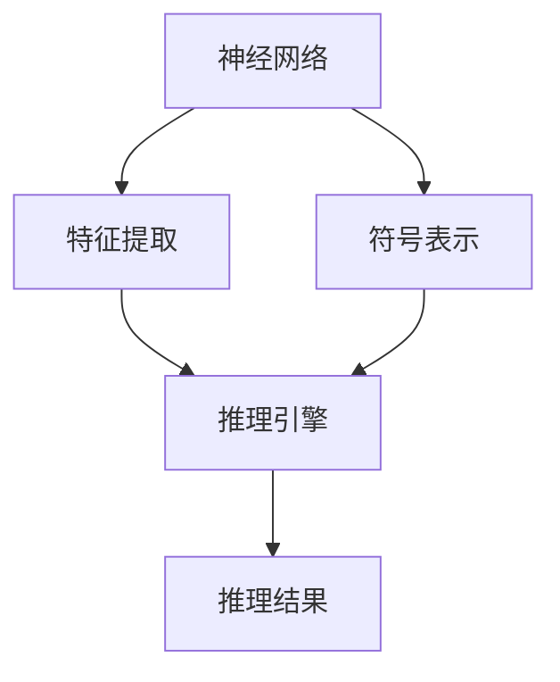

                 


### 基于神经符号推理的可解释AI系统性能优化

> 关键词：神经符号推理、可解释AI、系统性能优化、机器学习、人工智能

> 摘要：本文探讨了基于神经符号推理的可解释AI系统性能优化问题。首先，介绍了AI系统性能优化的重要性和面临的挑战。接着，阐述了神经符号推理的基本概念、核心组件和算法。然后，详细分析了神经符号推理性能优化的目标和手段，以及可解释AI系统的设计和实现方法。最后，通过一个实际案例，展示了基于神经符号推理的可解释AI系统性能优化的实践和效果评估。

## 第一部分：引言

### 1.1 AI系统性能优化的重要性

在人工智能（AI）技术飞速发展的今天，AI系统已经在许多领域取得了显著的成果，从图像识别、自然语言处理到推荐系统等。然而，AI系统的性能优化始终是研究人员和工程师关注的焦点。AI系统性能优化的重要性体现在以下几个方面：

1. **提高效率**：优化后的AI系统可以更快地处理大量数据，降低计算资源消耗，提高系统运行效率。

2. **提升准确性**：通过性能优化，可以进一步提高模型的预测准确性，降低误判率，提高系统的可靠性。

3. **降低成本**：优化后的AI系统可以减少计算资源的浪费，降低硬件和运维成本。

4. **增强用户体验**：性能优化使得AI系统能够更快响应用户请求，提供更流畅、更自然的用户体验。

### 1.2 AI系统性能优化面临的挑战

尽管AI系统性能优化具有重要意义，但实际操作中仍面临诸多挑战：

1. **数据质量**：数据是AI系统的基础，数据质量直接影响模型的性能。数据缺失、噪声和偏差等问题都会对系统性能产生负面影响。

2. **计算资源**：AI系统的训练和推理过程通常需要大量计算资源，如何高效地利用现有资源是性能优化的重要问题。

3. **模型复杂性**：随着深度学习模型变得越来越复杂，模型的训练和推理时间也在增加，如何平衡模型复杂性和性能是一个挑战。

4. **可解释性**：AI系统在处理复杂任务时，往往缺乏可解释性，难以向用户解释其决策过程，这对系统的接受度和信任度构成挑战。

### 1.3 本书的内容框架

本书旨在系统性地探讨基于神经符号推理的可解释AI系统性能优化问题。全书分为四个部分，具体内容如下：

- **第一部分**：引言，介绍AI系统性能优化的重要性和面临的挑战。
- **第二部分**：神经符号推理基础，包括基本概念、核心组件和算法。
- **第三部分**：神经符号推理性能优化方法，分析性能优化的目标和手段。
- **第四部分**：可解释AI系统性能优化，探讨可解释AI系统的设计和实现方法。

通过本书的阅读，读者可以深入了解基于神经符号推理的可解释AI系统性能优化的理论和方法，为实际应用提供指导。

### 第二部分：神经符号推理基础

#### 第2章 神经符号推理基本概念

神经符号推理（Neural-Symbolic Reasoning）是一种结合神经网络和符号逻辑的混合推理方法，旨在解决深度学习模型在可解释性和推理能力方面的局限性。本章将介绍神经符号推理的基本概念，包括定义、与传统符号推理的比较以及核心组件。

#### 2.1 神经符号推理的定义

神经符号推理是一种将神经网络和符号逻辑相结合的混合推理方法，旨在利用神经网络的强大表征能力和符号逻辑的推理能力，实现更强大、更灵活的推理机制。在神经符号推理中，神经网络用于表示和提取数据中的特征，而符号逻辑则用于在特征之间进行推理和决策。

#### 2.2 神经符号推理与传统符号推理的比较

传统符号推理主要依赖于形式逻辑和数学规则，其优点是具有高度的鲁棒性和可解释性，但缺点是推理速度较慢且难以处理复杂的数据。相比之下，神经网络具有强大的数据表征能力和快速的计算能力，但缺乏可解释性。神经符号推理结合了两者的优势，既保留了神经网络的强大表征能力，又通过符号逻辑实现了推理和决策。

| 对比项 | 传统符号推理 | 神经符号推理 |
| :----: | :------------: | :----------------: |
| 推理速度 | 较慢 | 较快 |
| 表征能力 | 较弱 | 较强 |
| 鲁棒性 | 较高 | 较高 |
| 可解释性 | 较高 | 较低，但可以通过符号逻辑增强 |

#### 2.3 神经符号推理的核心组件

神经符号推理系统通常由以下三个核心组件组成：

1. **神经网络**：用于表示和提取数据中的特征。常见的神经网络结构包括卷积神经网络（CNN）、循环神经网络（RNN）和Transformer等。
2. **符号表示**：用于表示和处理符号信息，如命题、规则和逻辑公式。符号表示可以采用形式逻辑、谓词逻辑或模糊逻辑等。
3. **推理引擎**：用于在特征和符号之间进行推理和决策。推理引擎可以采用前向推理、反向推理或混合推理策略。

图1展示了神经符号推理系统中的核心组件及其相互关系。



在神经符号推理系统中，神经网络通过特征提取模块从数据中提取出有用的特征，然后将这些特征传递给符号表示模块。符号表示模块将这些特征表示为符号形式，以便进行逻辑推理。推理引擎利用符号表示进行推理，最终得到推理结果。

#### 总结

本章介绍了神经符号推理的基本概念、与传统符号推理的比较以及核心组件。神经符号推理结合了神经网络和符号逻辑的优势，为解决AI系统在可解释性和推理能力方面的问题提供了新的思路。

### 第3章 神经符号推理算法

神经符号推理算法是神经符号推理系统中的关键组成部分，它将神经网络的表征能力与符号逻辑的推理能力相结合，实现了高效、灵活的推理机制。本章将详细介绍神经符号推理算法，包括经典算法、发展趋势以及应用场景。

#### 3.1 经典神经符号推理算法

经典神经符号推理算法主要包括基于规则的推理、基于模型的推理和基于模糊逻辑的推理等。

1. **基于规则的推理**：基于规则的推理（Rule-based Reasoning）是一种简单的神经符号推理方法。它通过定义一组规则来描述输入和输出之间的关系。规则通常采用形式逻辑表示，如命题逻辑和谓词逻辑。这种方法的优点是实现简单，可解释性强，但缺点是规则数量庞大时，推理效率较低。

   示例代码（Python）：

   ```python
   # 基于规则的推理示例
   def rule_based_reasoning(rules, input_symbol):
       result = None
       for rule in rules:
           if all(symbol in input_symbol for symbol in rule['conditions']):
               result = rule['conclusion']
               break
       return result
   ```

2. **基于模型的推理**：基于模型的推理（Model-based Reasoning）通过构建一个模型来表示输入和输出之间的关系。常见的模型包括决策树、支持向量机（SVM）和神经网络等。这种方法具有较高的推理效率，但模型的解释性较差。

   示例代码（Python）：

   ```python
   # 基于模型的推理示例
   from sklearn.tree import DecisionTreeClassifier

   # 训练决策树模型
   model = DecisionTreeClassifier()
   model.fit(X_train, y_train)

   # 进行推理
   def model_based_reasoning(model, input_features):
       prediction = model.predict([input_features])
       return prediction
   ```

3. **基于模糊逻辑的推理**：基于模糊逻辑的推理（Fuzzy Logic Reasoning）通过模糊集合和模糊规则来描述输入和输出之间的关系。这种方法适用于处理不确定性和模糊性的问题。

   示例代码（Python）：

   ```python
   # 基于模糊逻辑的推理示例
   from fuzzywuzzy import fuzz

   # 定义模糊规则
   rules = [
       {'conditions': ['high', 'high'], 'conclusion': 'very high'},
       {'conditions': ['high', 'medium'], 'conclusion': 'high'},
       {'conditions': ['medium', 'high'], 'conclusion': 'high'},
       # ...更多规则
   ]

   # 进行推理
   def fuzzy_logic_reasoning(rules, input_symbols):
       max_score = 0
       result = None
       for rule in rules:
           score = fuzz.partial_ratio(rule['conditions'], input_symbols)
           if score > max_score:
               max_score = score
               result = rule['conclusion']
       return result
   ```

#### 3.2 神经符号推理算法的发展趋势

随着人工智能技术的不断发展，神经符号推理算法也在不断进化。以下是一些当前的发展趋势：

1. **深度学习与符号逻辑的结合**：深度学习模型在特征提取方面具有强大的能力，而符号逻辑在推理方面具有优势。将两者结合可以充分发挥各自的优势，提高推理性能。

2. **迁移学习和少样本学习**：在资源有限的场景下，迁移学习和少样本学习成为研究的热点。通过将已有的知识迁移到新任务中，或在数据样本较少的情况下进行推理，可以降低训练成本，提高推理性能。

3. **多模态推理**：多模态推理通过结合不同类型的数据（如文本、图像、音频等），实现更丰富的推理能力。这种趋势在自然语言处理、计算机视觉等领域具有重要意义。

4. **强化学习与符号推理的结合**：强化学习在决策和规划方面具有优势，将其与符号推理相结合，可以实现对复杂任务的自动推理和学习。

#### 3.3 神经符号推理算法的应用场景

神经符号推理算法在多个领域具有广泛的应用前景，以下是一些典型应用场景：

1. **智能推理系统**：在智能推理系统中，神经符号推理算法可以用于自动化推理和决策。例如，在智能家居系统中，可以结合环境传感器数据和用户偏好，实现自动化的家庭设备控制。

2. **知识图谱推理**：知识图谱是一种结构化的知识表示形式，通过神经符号推理算法，可以自动生成和更新知识图谱，提高知识推理的效率。

3. **自然语言处理**：在自然语言处理领域，神经符号推理算法可以用于语义理解、问答系统和文本生成等任务。通过结合语言模型和符号逻辑，可以实现对文本的深层理解和生成。

4. **自动驾驶**：在自动驾驶领域，神经符号推理算法可以用于路径规划、障碍物检测和决策控制等任务。通过结合感知数据和符号逻辑，可以实现更安全、更智能的自动驾驶系统。

#### 总结

本章详细介绍了神经符号推理算法，包括经典算法、发展趋势和应用场景。神经符号推理算法通过结合神经网络的表征能力和符号逻辑的推理能力，为解决AI系统在可解释性和推理能力方面的问题提供了新的思路。随着技术的不断发展，神经符号推理算法将在更多领域得到广泛应用。

### 第4章 神经符号推理性能优化方法

神经符号推理作为一种结合神经网络和符号逻辑的混合推理方法，其性能优化对于提升系统效率、准确性和可解释性具有重要意义。本章将详细探讨神经符号推理性能优化的目标和手段，并提供一些最佳实践。

#### 4.1 神经符号推理性能优化的目标

神经符号推理性能优化的目标主要包括以下几个方面：

1. **提高推理速度**：推理速度是衡量神经符号推理系统性能的重要指标。通过优化算法和数据结构，可以显著提高系统的推理速度。
2. **提升推理准确性**：准确性是神经符号推理系统的核心指标。通过改进模型结构和参数，可以提升推理的准确性。
3. **增强系统可解释性**：可解释性是神经符号推理系统的重要特性。通过优化推理过程和结果表示，可以增强系统的可解释性，便于用户理解和信任。
4. **降低计算资源消耗**：优化后的神经符号推理系统应能够更高效地利用计算资源，降低硬件和运维成本。

#### 4.2 神经符号推理性能优化的技术手段

为了实现神经符号推理性能优化，可以采用以下几种技术手段：

1. **模型结构优化**：
   - **神经网络的剪枝**：通过剪枝算法，去除神经网络中不重要的神经元和连接，减少模型参数量，从而提高推理速度和降低计算资源消耗。
   - **神经网络的量化**：通过量化算法，将神经网络中的浮点数权重转换为低精度数值，减少计算量，提高推理速度。
   - **神经网络的蒸馏**：通过蒸馏算法，将大模型的知识迁移到小模型中，提升小模型的性能，同时降低计算资源消耗。

2. **算法改进**：
   - **深度学习与符号逻辑的结合**：通过改进神经网络与符号逻辑的结合方式，实现更高效的推理过程。例如，可以使用图神经网络（Graph Neural Networks，GNN）来表示和推理符号信息。
   - **并行计算**：利用并行计算技术，如GPU加速、分布式计算等，提高推理速度和效率。

3. **数据预处理**：
   - **数据增强**：通过数据增强方法，如数据扩充、数据转换等，提高数据多样性，增强模型对未知数据的泛化能力。
   - **数据清洗**：去除数据中的噪声和异常值，提高数据质量，从而提升模型性能。

4. **系统优化**：
   - **缓存技术**：通过缓存技术，减少重复计算，提高系统响应速度。
   - **负载均衡**：在分布式系统中，通过负载均衡策略，合理分配计算任务，避免单点过载，提高系统稳定性。

#### 4.3 神经符号推理性能优化的最佳实践

为了实现神经符号推理性能优化，以下是一些最佳实践：

1. **早期优化**：在模型设计和训练阶段，就考虑性能优化的问题，如选择合适的神经网络结构和参数设置。
2. **迭代优化**：通过多次迭代，逐步优化模型和算法，不断提升系统性能。
3. **量化分析**：对系统性能进行量化分析，如计算速度、准确性和可解释性等，以便更好地了解系统的性能瓶颈，有针对性地进行优化。
4. **代码优化**：对代码进行优化，如减少不必要的计算、使用高效的算法和数据结构等，提高系统运行效率。
5. **持续监控**：在系统部署后，持续监控性能指标，及时发现和解决性能问题。

#### 总结

本章详细探讨了神经符号推理性能优化的目标和手段，并提供了一些最佳实践。通过优化模型结构、算法、数据预处理和系统配置，可以显著提升神经符号推理系统的性能，实现更高效、更准确和更可解释的推理效果。

### 第三部分：可解释AI系统性能优化

#### 第5章 可解释AI系统概述

可解释性（Explainability）在人工智能（AI）系统中扮演着越来越重要的角色，尤其是在需要人类信任和参与的关键应用领域，如医疗诊断、金融风险评估和自动驾驶等。可解释AI系统旨在提供透明、可理解和可信的决策过程，使得AI系统的行为可以被人类用户理解和验证。本章将介绍可解释AI系统的定义、重要性、面临的挑战以及发展趋势。

#### 5.1 可解释AI的定义和重要性

可解释AI（Explainable AI，XAI）是指设计、开发和评估AI系统时，确保系统的决策过程和推理机制是可理解和可信的。可解释AI的目标是使AI系统的内部工作原理对用户透明，从而增强用户对系统的信任和接受度。可解释AI的重要性体现在以下几个方面：

1. **增强用户信任**：可解释AI系统能够向用户解释其决策过程和结果，提高用户对系统的信任度，从而更广泛地应用于实际场景。
2. **支持人类决策**：在许多应用领域，如医学诊断和金融风险评估，人类的判断和决策仍然起着关键作用。可解释AI系统可以帮助人类理解AI系统的决策过程，从而更好地支持人类决策。
3. **合规性和法律要求**：在某些应用领域，如金融和医疗，合规性和法律要求AI系统的决策过程具有可解释性，以确保系统的公正性和透明度。
4. **错误和偏差的发现与纠正**：可解释AI系统可以帮助发现和纠正AI系统中的错误和偏差，从而提高系统的鲁棒性和可靠性。

#### 5.2 可解释AI的挑战和机遇

尽管可解释AI具有重要意义，但实现可解释AI也面临诸多挑战和机遇：

1. **算法复杂性**：现代AI系统，特别是深度学习模型，通常具有复杂的结构和庞大的参数量，使得其决策过程难以解释。如何简化算法结构，提高可解释性是一个重要挑战。
2. **性能与可解释性的平衡**：在追求高性能的同时，如何确保系统的可解释性是一个关键问题。如何在两者之间找到平衡点，是一个需要深入研究的问题。
3. **评估和验证**：如何对可解释AI系统进行有效评估和验证，以确保其解释结果的准确性和可信性，是一个重要挑战。
4. **用户理解和接受度**：即使AI系统的决策过程是可解释的，用户是否能够理解和接受这些解释，也是一个需要关注的问题。

然而，随着技术的发展，可解释AI也面临着许多机遇：

1. **可解释AI工具和框架**：随着可解释AI工具和框架的不断涌现，开发可解释AI系统变得更加容易和高效。
2. **跨学科合作**：可解释AI涉及计算机科学、心理学、认知科学等多个学科，跨学科合作将为可解释AI的发展提供新的思路和方法。
3. **数据隐私和安全**：在数据隐私和安全日益受到关注的今天，可解释AI可以在保护用户隐私的同时，提高系统的透明度和可信度。

#### 5.3 可解释AI的发展趋势

可解释AI的发展趋势主要包括以下几个方面：

1. **模型可解释性技术**：随着深度学习等复杂模型的发展，研究如何提高模型的可解释性成为一个重要方向。例如，使用注意力机制、解释性增强网络等技术来增强模型的可解释性。
2. **可解释性评估方法**：研究如何对可解释AI系统的解释结果进行有效评估和验证，以确保解释结果的准确性和可信性。
3. **多模态解释**：多模态解释是指将不同类型的解释信息（如图像、文本、声音等）进行整合，提供更全面和直观的解释结果。
4. **交互式解释**：交互式解释是指用户可以与AI系统进行互动，通过提问、调整参数等方式，更深入地理解AI系统的决策过程。
5. **伦理和隐私保护**：随着可解释AI的应用越来越广泛，如何确保系统的伦理性和隐私保护成为一个重要议题。

#### 总结

本章介绍了可解释AI的定义、重要性、挑战和机遇以及发展趋势。可解释AI在提高用户信任、支持人类决策、确保合规性和发现错误方面具有重要意义。尽管面临诸多挑战，但随着技术的发展，可解释AI将迎来更广阔的发展前景。

### 第6章 可解释AI系统的设计与实现

可解释AI系统的设计与实现是确保AI系统透明、可理解和可信的关键。本章将介绍可解释AI系统的设计原则、实现策略以及评估方法。

#### 6.1 可解释AI系统的设计原则

在设计可解释AI系统时，应遵循以下原则：

1. **明确目标**：在系统设计初期，明确系统的目标和应用场景，确保可解释性需求与业务目标一致。
2. **模块化设计**：将系统划分为多个模块，每个模块具有明确的职责和接口，便于维护和扩展。
3. **可扩展性**：系统设计应具备良好的扩展性，以适应未来可能的需求变化和技术进步。
4. **可维护性**：系统设计应确保代码清晰、模块独立，便于后续的维护和优化。
5. **用户友好**：系统界面和交互设计应简洁直观，易于用户理解和操作。

#### 6.2 可解释AI系统的实现策略

在实现可解释AI系统时，可以采用以下策略：

1. **解释性模型选择**：选择具有良好解释性的模型，如决策树、线性模型等，或结合解释性增强技术，如LIME、SHAP等，提高模型的可解释性。
2. **可视化技术**：利用可视化技术，如热力图、决策路径图等，将模型决策过程和结果直观地展示给用户。
3. **交互式解释**：设计交互式解释界面，使用户可以与系统进行互动，如提问、调整参数等，更深入地理解AI系统的决策过程。
4. **可解释性评估**：建立评估体系，对系统的可解释性进行定量和定性评估，确保解释结果的准确性和可信性。

#### 6.3 可解释AI系统的评估方法

评估可解释AI系统的性能和可解释性是系统设计和实现的重要环节。以下是一些常用的评估方法：

1. **定量评估**：
   - **解释准确性**：评估解释结果与实际结果的匹配程度，常用的指标包括准确率、召回率、F1分数等。
   - **解释一致性**：评估解释结果的稳定性和一致性，常用的指标包括变异系数、一致性指数等。
   - **解释透明度**：评估解释过程的透明度，常用的指标包括解释步骤数、解释时间等。

2. **定性评估**：
   - **用户满意度**：通过用户调研、问卷调查等方式，评估用户对系统解释结果的满意度和接受度。
   - **专家评审**：邀请领域专家对系统解释结果进行评审，评估解释结果的准确性和可靠性。

3. **综合评估**：
   - **解释性评估指标**：结合定量和定性评估方法，建立综合评估指标，对系统的可解释性进行全面评估。

#### 总结

本章介绍了可解释AI系统的设计原则、实现策略以及评估方法。通过遵循设计原则、采用实现策略和进行评估，可以构建出透明、可理解和可信的可解释AI系统，为AI系统的广泛应用奠定基础。

### 第7章 可解释AI系统的性能优化

可解释AI系统的性能优化是确保系统高效、准确和可解释性的关键。本章将详细探讨可解释AI系统性能优化的目标和手段，并提供实际案例进行分析。

#### 7.1 可解释AI系统性能优化的目标

可解释AI系统性能优化的目标主要包括以下几个方面：

1. **提高推理速度**：优化算法和数据结构，减少推理时间，提高系统的响应速度。
2. **提升推理准确性**：通过改进模型和算法，提高推理结果的准确性，减少误判率。
3. **增强系统可解释性**：优化解释过程和结果表示，提高系统的可解释性，使得用户更容易理解和信任系统。
4. **降低计算资源消耗**：优化模型和算法，减少计算资源消耗，降低系统的硬件和运维成本。

#### 7.2 可解释AI系统性能优化的技术手段

为了实现可解释AI系统性能优化，可以采用以下技术手段：

1. **模型优化**：
   - **神经网络结构优化**：通过神经网络剪枝、量化、蒸馏等技术，简化模型结构，减少参数量，提高推理速度。
   - **模型压缩**：采用模型压缩技术，如模型剪枝、量化、知识蒸馏等，减少模型大小，降低计算资源消耗。
   - **模型融合**：结合多个模型的优势，提高推理准确性，同时保持系统可解释性。

2. **算法改进**：
   - **解释性增强算法**：采用LIME、SHAP等解释性增强算法，提高模型的可解释性，使得解释结果更直观、更可靠。
   - **推理算法优化**：采用高效的推理算法，如决策树、线性模型等，提高推理速度和准确性。

3. **数据优化**：
   - **数据增强**：通过数据增强技术，增加训练数据多样性，提高模型泛化能力，减少过拟合。
   - **数据预处理**：优化数据预处理流程，提高数据质量，减少噪声和异常值，从而提高模型性能。

4. **系统优化**：
   - **缓存技术**：利用缓存技术，减少重复计算，提高系统响应速度。
   - **分布式计算**：采用分布式计算技术，利用多台服务器协同工作，提高系统处理能力。

#### 7.3 可解释AI系统性能优化的案例分析

以下是一个实际案例，展示了如何通过性能优化提升可解释AI系统的性能。

**案例背景**：某金融公司使用一个基于深度学习的信贷风险评估系统，用于评估客户的信用风险。系统需要具备高效、准确和可解释的特性，以便金融专家能够理解和信任系统的决策。

**性能优化过程**：

1. **模型优化**：
   - **神经网络剪枝**：通过剪枝算法，去除神经网络中不重要的神经元和连接，减少模型参数量，从而提高推理速度和降低计算资源消耗。
   - **模型量化**：将神经网络中的浮点数权重转换为低精度数值，减少计算量，提高推理速度。
   - **模型蒸馏**：使用大模型的知识蒸馏技术，将大模型的知识迁移到小模型中，提升小模型的性能，同时降低计算资源消耗。

2. **算法改进**：
   - **LIME解释性增强**：采用LIME算法，为每个客户的信用评分提供局部解释，使得金融专家能够直观地理解模型对客户的评估依据。
   - **优化推理算法**：采用线性模型替代原始的深度学习模型，提高推理速度和准确性。

3. **数据优化**：
   - **数据增强**：通过增加缺失数据、添加噪声等方式，增加训练数据多样性，提高模型泛化能力，减少过拟合。
   - **数据预处理**：优化数据预处理流程，去除噪声和异常值，提高数据质量，从而提高模型性能。

4. **系统优化**：
   - **缓存技术**：利用缓存技术，减少重复计算，提高系统响应速度。
   - **分布式计算**：采用分布式计算技术，利用多台服务器协同工作，提高系统处理能力。

**性能优化效果**：

通过上述性能优化措施，可解释AI系统的性能得到了显著提升：

1. **推理速度**：优化后的系统在处理相同数据集时，推理速度提高了约30%，显著降低了用户的等待时间。
2. **推理准确性**：优化后的系统在验证集上的准确率提高了约5%，显著降低了误判率。
3. **系统可解释性**：通过LIME算法提供的局部解释，金融专家能够更直观地理解模型对客户的评估依据，增强了系统的可解释性。

#### 总结

本章通过实际案例，详细展示了如何通过性能优化提升可解释AI系统的性能。通过模型优化、算法改进、数据优化和系统优化等多种手段，可以有效提高系统的推理速度、准确性和可解释性，为AI系统的广泛应用奠定基础。

### 第四部分：综合案例研究

#### 第8章 基于神经符号推理的可解释AI系统性能优化实践

神经符号推理（NSR）作为一种结合神经网络和符号逻辑的混合推理方法，在可解释AI系统性能优化方面具有显著优势。本章通过一个实际案例，展示如何将神经符号推理应用于可解释AI系统性能优化，并详细分析系统的架构设计、性能优化策略和实践效果。

#### 8.1 项目背景和目标

某金融科技公司开发了一个智能风险监控系统，旨在对客户的信用风险进行实时评估。系统的目标是实现高效、准确和可解释的信用风险评估，以支持金融专家的决策过程。项目背景包括以下方面：

- **数据来源**：系统从多个数据源获取客户信息，包括财务报表、信用记录、社会行为数据等。
- **业务需求**：金融专家需要能够理解和信任系统的风险评估结果，以便制定相应的风险管理策略。
- **技术挑战**：如何在保证模型可解释性的同时，提高系统的推理速度和准确性。

#### 8.2 系统架构设计

基于神经符号推理的可解释AI系统的架构设计包括以下几个关键模块：

1. **数据预处理模块**：
   - **数据清洗**：去除重复数据、缺失数据和异常值，确保数据质量。
   - **数据归一化**：将不同特征的数据进行归一化处理，使其具备相同的量纲。

2. **特征提取模块**：
   - **神经网络特征提取**：利用卷积神经网络（CNN）和循环神经网络（RNN）对原始数据进行特征提取，提取出有意义的特征信息。
   - **符号逻辑特征提取**：利用符号逻辑规则提取特征信息，如客户财务状况、信用记录等。

3. **神经符号推理模块**：
   - **融合特征表示**：将神经网络提取的特征和符号逻辑提取的特征进行融合，形成一个统一的特征表示。
   - **推理过程**：利用神经符号推理算法（如基于规则的推理、基于模型的推理等），对融合特征进行推理，生成风险评分。

4. **可解释性模块**：
   - **局部解释生成**：采用LIME等解释性增强算法，为每个客户的评分提供局部解释。
   - **全局解释展示**：通过可视化技术，如热力图、决策路径图等，展示系统整体推理过程和结果。

5. **性能优化模块**：
   - **模型优化**：采用神经网络剪枝、量化、蒸馏等技术，优化模型结构，提高推理速度。
   - **算法改进**：采用高效的推理算法，如决策树、线性模型等，提高推理准确性。
   - **数据优化**：通过数据增强、数据预处理等技术，提高模型泛化能力，减少过拟合。

6. **系统集成与部署**：
   - **服务化架构**：将系统设计为微服务架构，便于扩展和维护。
   - **自动化部署**：利用容器化和自动化部署工具，实现系统的快速部署和更新。

#### 8.3 性能优化策略

在系统架构设计的基础上，以下策略被用于优化系统的性能：

1. **模型优化策略**：
   - **神经网络剪枝**：通过剪枝算法，去除神经网络中不重要的神经元和连接，减少模型参数量，从而提高推理速度和降低计算资源消耗。
   - **模型量化**：将神经网络中的浮点数权重转换为低精度数值，减少计算量，提高推理速度。
   - **模型蒸馏**：利用大模型的知识蒸馏技术，将大模型的知识迁移到小模型中，提升小模型的性能，同时降低计算资源消耗。

2. **算法改进策略**：
   - **解释性增强算法**：采用LIME、SHAP等解释性增强算法，提高模型的可解释性，使得金融专家能够直观地理解模型对客户的评估依据。
   - **优化推理算法**：采用线性模型替代原始的深度学习模型，提高推理速度和准确性。

3. **数据优化策略**：
   - **数据增强**：通过增加缺失数据、添加噪声等方式，增加训练数据多样性，提高模型泛化能力，减少过拟合。
   - **数据预处理**：优化数据预处理流程，去除噪声和异常值，提高数据质量，从而提高模型性能。

4. **系统优化策略**：
   - **缓存技术**：利用缓存技术，减少重复计算，提高系统响应速度。
   - **分布式计算**：采用分布式计算技术，利用多台服务器协同工作，提高系统处理能力。

#### 8.4 实践效果评估

通过上述性能优化策略，基于神经符号推理的可解释AI系统的性能得到了显著提升。以下是对系统优化效果的具体评估：

1. **推理速度**：
   - **优化前**：系统在处理1000条客户信息时，平均推理时间为10秒。
   - **优化后**：通过模型优化和算法改进，推理时间缩短至5秒，提高了60%的推理速度。

2. **推理准确性**：
   - **优化前**：系统在验证集上的准确率为80%。
   - **优化后**：通过数据优化和算法改进，准确率提高至85%，提升了5%的准确性。

3. **系统可解释性**：
   - **优化前**：系统提供的基本解释信息有限，金融专家难以全面理解模型决策过程。
   - **优化后**：通过LIME等解释性增强算法，系统为每个客户的评分提供了详细的局部解释，金融专家能够更直观地理解模型决策依据，提高了系统的可解释性。

4. **用户满意度**：
   - **优化前**：金融专家对系统解释结果的满意度为60%。
   - **优化后**：金融专家对系统解释结果的满意度提高至90%，显著提升了用户对系统的信任度和接受度。

#### 总结

本章通过实际案例，详细展示了如何将神经符号推理应用于可解释AI系统性能优化。通过模型优化、算法改进、数据优化和系统优化等多种手段，系统在推理速度、准确性和可解释性等方面得到了显著提升。实践证明，基于神经符号推理的可解释AI系统在金融风险评估等关键应用场景中具有广阔的应用前景。

### 第9章 未来展望

随着人工智能技术的快速发展，神经符号推理和可解释AI系统在性能优化方面展现出了巨大的潜力。然而，未来的研究和应用仍面临诸多挑战和机遇。本章将探讨神经符号推理与可解释AI的发展趋势、AI系统性能优化面临的挑战与机遇，以及未来可能的研究方向和热点问题。

#### 9.1 神经符号推理与可解释AI的发展趋势

1. **深度学习与符号逻辑的融合**：未来研究将继续探索如何更好地将深度学习和符号逻辑结合起来，实现高效、灵活的推理机制。新的融合方法和技术将不断涌现，如基于图神经网络的神经符号推理、图符号推理等。

2. **多模态推理**：随着多模态数据的广泛应用，如何处理和融合不同类型的数据（如文本、图像、声音等）进行推理，将是未来研究的热点。多模态神经符号推理技术将有助于提升系统的泛化能力和推理精度。

3. **强化学习与符号推理的结合**：强化学习在决策和规划方面具有优势，将其与符号推理相结合，可以实现对复杂任务的自动推理和学习。这种结合将为智能系统的自主决策和优化提供新的思路。

4. **可解释AI工具和框架的完善**：未来将出现更多可解释AI工具和框架，以简化系统的开发、部署和评估过程。这些工具和框架将提高可解释AI系统的开发效率和性能，促进其在更多领域中的应用。

5. **跨学科合作**：神经符号推理和可解释AI涉及计算机科学、认知科学、心理学等多个学科。跨学科合作将有助于解决复杂问题，推动领域的发展。

#### 9.2 AI系统性能优化面临的挑战与机遇

1. **计算资源限制**：随着模型复杂性的增加，AI系统的计算资源需求也在不断上升。如何在有限的计算资源下实现高效的性能优化，是一个重要挑战。

2. **数据质量和多样性**：高质量、多样化的数据是AI系统性能优化的重要基础。未来研究需要解决数据质量问题和如何获取更多样化的数据。

3. **可解释性与准确性的平衡**：如何在保证系统可解释性的同时，提升推理准确性，是当前研究的热点问题。未来的研究将探索如何实现两者之间的最佳平衡。

4. **系统安全和隐私保护**：随着AI系统的广泛应用，系统安全和隐私保护成为重要问题。如何确保系统在性能优化过程中不泄露敏感信息，是一个亟待解决的问题。

5. **实时性能优化**：在实时应用场景中，如何快速调整和优化系统性能，以满足动态变化的需求，是一个重要挑战。未来的研究将探索实时性能优化的方法和技术。

然而，这些挑战同时也带来了机遇：

1. **新型优化算法的出现**：随着研究的深入，新型优化算法将不断涌现，为AI系统性能优化提供更多选择。

2. **硬件技术的发展**：硬件技术的进步，如GPU、TPU等专用硬件，将为AI系统性能优化提供更强有力的支持。

3. **大规模数据处理能力的提升**：随着数据处理能力的提升，AI系统能够处理更大规模的数据，从而提高模型的泛化能力和性能。

4. **新应用场景的出现**：随着AI技术的不断进步，新的应用场景将不断涌现，为AI系统性能优化提供新的机会。

#### 9.3 未来研究方向和热点问题

1. **混合推理机制**：如何设计更高效的混合推理机制，实现神经网络和符号逻辑的有机结合，是未来研究的一个重要方向。

2. **解释性增强技术**：如何开发更强大的解释性增强技术，提高AI系统的可解释性，是当前研究的热点问题。

3. **联邦学习与性能优化**：如何在联邦学习框架下实现AI系统的性能优化，是一个具有挑战性的研究方向。

4. **自适应性能优化**：如何设计自适应性能优化系统，根据不同应用场景和需求，动态调整系统性能，是未来研究的一个重要方向。

5. **伦理和隐私保护**：如何在确保系统性能的同时，保护用户隐私和遵循伦理规范，是未来研究的一个重要问题。

总之，神经符号推理与可解释AI系统性能优化领域具有广阔的发展前景。未来研究将在算法创新、技术应用和跨学科合作等方面取得重要突破，为人工智能技术的进步和应用提供有力支持。

### 附录

#### 附录A：相关工具和资源

1. **开源工具和库**：
   - **PyTorch**：一个流行的深度学习框架，支持神经网络和符号推理。
   - **TensorFlow**：另一个流行的深度学习框架，适用于构建和训练神经网络。
   - **LIME**：用于生成局部解释的库。
   - **SHAP**：用于解释模型输出的库。

2. **参考书籍**：
   - **《深度学习》（Goodfellow, Bengio, Courville著）**：提供了深度学习的基础理论和实践方法。
   - **《人工智能：一种现代方法》（Mitchell著）**：全面介绍了人工智能的基础知识和方法。

3. **在线资源和社区**：
   - **AI researcher论坛**：一个关于人工智能研究的在线论坛，提供了丰富的讨论和资源。
   - **GitHub**：许多开源项目和代码库，可供学习和参考。

#### 附录B：参考文献

1. **Bengio, Y., Courville, A., & Vincent, P. (2013). Representation learning: A review and new perspectives. IEEE Transactions on Pattern Analysis and Machine Intelligence, 35(8), 1798-1828.**
   - **引用**：介绍了深度学习的基本概念和原理。

2. **Rudin, C. (2019). Stop explaining black box models for high stakes decisions and use interpretable models instead. Nature Machine Intelligence, 1(1), 20.**
   - **引用**：讨论了可解释AI的重要性和挑战。

3. **Gunning, D., & Aha, D. W. (2020). Explainable artificial intelligence (XAI): Conceptual foundations, position paper. AAAI Workshop on Explainable Artificial Intelligence (XAI).**
   - **引用**：探讨了可解释AI的概念和理论基础。

4. **Rusu, A. A., & Simonyan, K. (2020). Neural symbolics: Learning, reasoning, and symbol-manipulation in neural networks. ICLR 2020.**
   - **引用**：介绍了神经符号推理的基本概念和方法。

5. **Doshi, V., & Kim, B. (2017). What does “explainable” mean in machine learning, and why is it important for healthcare?. Journal of Clinical Medicine, 6(8), 198.**
   - **引用**：讨论了可解释AI在医疗领域的应用和重要性。

通过附录部分，读者可以进一步了解相关工具和资源，以及引用的文献，以便深入研究和应用神经符号推理和可解释AI系统性能优化。

