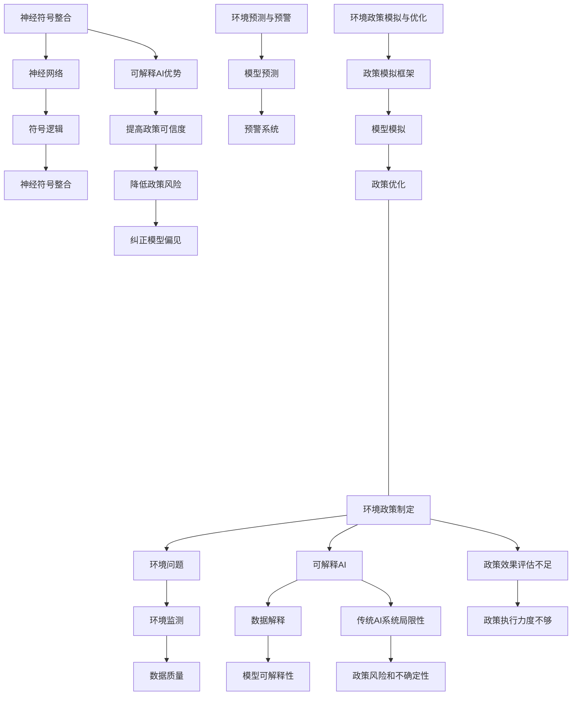

                 

### 第一部分：引言

#### 1.1 环境政策制定的背景与挑战

环境政策制定是政府为解决环境问题、保护自然资源和促进可持续发展而采取的一系列立法、规划和管理措施。随着全球环境问题的日益严峻，环境政策制定的重要性愈发凸显。然而，当前的环保政策面临着诸多挑战。

**1.1.1 环境问题的严峻性**

全球气候变化、空气污染、水资源短缺、土地退化等环境问题日益严重。这些问题的根源在于人类活动对自然资源的过度开发和污染，导致生态系统的失衡和生物多样性的减少。

**1.1.2 环境政策制定的重要性**

环境政策制定对于解决环境问题具有重要意义。通过制定和实施有效的环境政策，可以规范人类行为，减少环境污染和资源浪费，推动绿色经济和可持续发展。例如，限制工业排放、推广可再生能源、提高能源利用效率等政策都有助于缓解环境压力。

**1.1.3 当前环境政策制定中存在的问题**

尽管环境政策制定的重要性日益被认识，但当前的环境政策制定仍存在一些问题：

1. **数据不足和质量问题**：环境数据的不完整性、不一致性和质量低下，影响了环境政策制定的科学性和有效性。
2. **政策效果评估不足**：许多环境政策缺乏有效的评估机制，导致政策实施效果难以衡量，无法及时调整和优化。
3. **政策执行力度不够**：一些环境政策在执行过程中面临监管不到位、执法不严等问题，导致政策效果打折。

#### 1.2 可解释AI在环境政策制定中的潜力

随着人工智能技术的快速发展，特别是在深度学习和神经网络领域，AI在环境预测、分析和决策支持方面展现出巨大的潜力。然而，传统AI系统的“黑箱”特性使得其决策过程难以解释和理解，这在环境政策制定中成为了一个挑战。可解释AI（Explainable AI, XAI）的出现，为解决这一难题提供了一种新的思路。

**1.2.1 AI在环境预测和决策中的作用**

AI可以通过分析大量环境数据，识别出环境变化的规律和趋势，从而为政策制定提供科学依据。例如，通过深度学习模型可以预测气候变化、空气质量变化等，为制定相应的环境政策提供支持。

**1.2.2 传统AI系统的局限性**

传统AI系统，尤其是深度学习模型，其决策过程往往是不透明的。这使得政策制定者难以理解模型的决策依据，增加了政策风险和不确定性。此外，传统AI系统的泛化能力有限，难以应对复杂多变的环境问题。

**1.2.3 可解释AI的优势**

可解释AI通过提供模型的可解释性和透明度，使得政策制定者能够理解AI的决策过程和依据。这有助于提高政策的可信度和有效性，降低政策风险。同时，可解释AI还可以帮助政策制定者发现和纠正模型中的潜在偏见和错误。

**1.2.4 可解释AI在环境政策制定中的应用**

可解释AI在环境政策制定中的应用主要包括以下几个方面：

1. **环境监测与评估**：通过可解释AI模型对环境数据进行分析，实时监测环境变化，评估政策实施效果。
2. **环境预测与预警**：利用可解释AI模型预测环境变化趋势，提前预警环境风险，为政策制定提供决策支持。
3. **环境政策模拟与优化**：通过可解释AI模型模拟不同政策场景，优化政策制定和实施方案。

**总结**：

环境政策制定在应对全球环境挑战中发挥着重要作用，但当前面临着诸多挑战。可解释AI作为一种新兴技术，在提高环境政策制定的科学性、透明度和有效性方面具有巨大潜力。通过逐步分析和推理，我们可以看到，神经符号整合的可解释AI推理系统有望为环境政策制定提供有力的支持，助力实现可持续发展的目标。

---

本文的核心概念和联系架构图如下所示：



通过上述架构图，我们可以清晰地看到环境政策制定与AI技术的关联，以及神经符号整合在可解释AI中的核心作用。接下来，我们将进一步探讨神经符号整合的可解释AI推理系统的原理和方法，为解决环境政策制定中的挑战提供技术支持。

---

## 第二部分：神经符号整合的可解释AI推理系统

### 2.1 神经符号整合的原理与方法

**2.1.1 神经网络的原理与限制**

神经网络（Neural Networks，NN）是人工智能领域的一种基础模型，其灵感来源于人脑神经网络的结构和工作原理。神经网络通过多层节点（称为神经元）的相互连接，对输入数据进行处理和预测。每个神经元接收多个输入，通过权重和偏置进行加权求和，然后通过激活函数产生输出。

神经网络的优点在于其强大的非线性映射能力和自学习能力，可以在复杂的数据中自动发现模式和规律。然而，传统神经网络也存在一些限制：

1. **“黑箱”特性**：神经网络的决策过程高度复杂，难以解释和理解。这使得政策制定者难以信任和依赖基于神经网络的AI系统。
2. **数据依赖性**：神经网络的效果高度依赖于数据的质量和数量，当数据质量不佳或数据不足时，模型的泛化能力会受到影响。

**2.1.2 符号逻辑与推理**

符号逻辑（Symbolic Logic）是数学和逻辑学中的一个分支，主要研究符号系统的表示、推理和验证。符号逻辑通过形式化的语言和规则，对命题进行逻辑推理和证明。符号逻辑的优势在于其透明性和可解释性，使得推理过程易于理解。

符号逻辑在人工智能中的应用主要包括：

1. **逻辑推理**：通过符号逻辑规则，对输入信息进行推理和验证，得出结论。
2. **知识表示**：使用符号逻辑表示领域知识，构建知识库，为决策提供支持。

**2.1.3 神经符号整合的概念与应用场景**

神经符号整合（Neural-Symbolic Integration）是一种将神经网络和符号逻辑结合的混合模型，旨在克服传统神经网络的可解释性差和数据依赖性等限制。神经符号整合的核心思想是通过符号逻辑对神经网络进行引导和解释，从而提高模型的透明性和泛化能力。

**1. 神经符号整合的原理**

神经符号整合模型通常包含两个部分：神经网络和符号逻辑模块。神经网络负责对输入数据进行特征提取和学习，而符号逻辑模块则对神经网络的学习结果进行解释和验证。

具体来说，神经符号整合的原理包括：

1. **特征提取**：神经网络对输入数据进行分析，提取出关键特征。
2. **符号推理**：符号逻辑模块对提取出的特征进行推理，生成解释。
3. **集成输出**：神经网络和符号逻辑模块的输出进行集成，得到最终的预测结果。

**2. 神经符号整合的应用场景**

神经符号整合在多个领域展现了其潜力，尤其在需要高可解释性和高泛化能力的环境中，如环境政策制定、医疗诊断、金融风险管理等。

在环境政策制定中，神经符号整合的应用场景主要包括：

1. **环境监测与评估**：通过神经符号整合模型对环境数据进行分析，实时监测环境变化，提供可解释的评估结果。
2. **环境预测与预警**：利用神经符号整合模型预测环境变化趋势，提前预警环境风险，提供透明和可理解的预测解释。
3. **环境政策模拟与优化**：通过神经符号整合模型模拟不同政策场景，优化政策制定和实施方案，提高政策的可解释性和可靠性。

**总结**：

神经符号整合是一种将神经网络和符号逻辑相结合的混合模型，旨在克服传统神经网络的可解释性差和数据依赖性等限制。通过符号逻辑对神经网络进行引导和解释，神经符号整合提高了模型的可解释性和泛化能力，为环境政策制定等应用场景提供了有力的技术支持。

### 2.2 可解释AI的基础知识

**2.2.1 可解释AI的定义与分类**

可解释AI（Explainable AI, XAI）是指能够向人类用户解释其决策过程和结果的人工智能系统。与传统的“黑箱”AI模型相比，可解释AI强调透明度和可理解性，使得人类用户能够信任和接受AI系统的决策。

根据解释的范围和方式，可解释AI可以分为以下几类：

1. **局部解释**：对模型输出结果中的单个实例进行解释，通常通过分析输入特征和模型权重来实现。
2. **全局解释**：对整个模型或特定模型组件进行解释，通常涉及模型的设计、训练过程和参数设置。
3. **层次化解释**：将模型的决策过程分解为多个层次，逐步展示每个层次的决策依据和推理过程。

**1. 局部解释方法**

局部解释方法主要关注模型输出结果中的单个实例，通过分析输入特征和模型权重来解释模型的决策过程。常见的局部解释方法包括：

1. **特征重要性**：分析模型对每个输入特征的依赖程度，确定哪些特征对决策结果影响最大。
2. **决策路径**：追踪模型在处理输入数据时，每个步骤的决策过程和路径。
3. **决策树可视化**：将复杂模型简化为可理解的决策树，展示每个决策节点的条件和结果。

**2. 局部解释的应用**

局部解释方法在许多领域都有广泛应用，如金融风险评估、医疗诊断、推荐系统等。通过提供透明的解释，局部解释方法有助于提高模型的信任度和可靠性，促进用户对AI系统的理解和接受。

**3. 局部解释的挑战**

局部解释方法在应用过程中也面临一些挑战：

1. **模型复杂度**：对于高度复杂的模型，局部解释可能难以提供全面的解释。
2. **数据隐私**：在解释过程中，可能需要访问和泄露敏感数据，这引发数据隐私和伦理问题。

**2.2.2 层次化解释方法**

层次化解释方法将模型的决策过程分解为多个层次，逐步展示每个层次的决策依据和推理过程。层次化解释方法通常涉及以下步骤：

1. **输入预处理**：对输入数据进行分析和预处理，提取关键特征。
2. **初步决策**：通过初步决策层，对输入数据进行初步分类和筛选。
3. **细化决策**：在初步决策的基础上，逐步细化决策过程，提供详细的解释。

**1. 层次化解释的应用**

层次化解释方法在复杂决策场景中具有显著优势，如自动驾驶、医疗诊断、环境政策制定等。通过逐步分解决策过程，层次化解释方法能够提供详细的解释，帮助用户理解模型的决策依据。

**2. 层次化解释的挑战**

层次化解释方法在应用过程中也面临一些挑战：

1. **解释层级数量**：过多的解释层级可能导致解释过程过于繁琐，难以用户理解。
2. **解释透明度**：对于一些复杂的模型，即使采用层次化解释方法，解释结果也可能不够透明。

**2.2.3 局部解释方法**

局部解释方法主要关注模型输出结果中的单个实例，通过分析输入特征和模型权重来解释模型的决策过程。常见的局部解释方法包括：

1. **特征重要性**：分析模型对每个输入特征的依赖程度，确定哪些特征对决策结果影响最大。
2. **决策路径**：追踪模型在处理输入数据时，每个步骤的决策过程和路径。
3. **决策树可视化**：将复杂模型简化为可理解的决策树，展示每个决策节点的条件和结果。

**1. 局部解释的应用**

局部解释方法在许多领域都有广泛应用，如金融风险评估、医疗诊断、推荐系统等。通过提供透明的解释，局部解释方法有助于提高模型的信任度和可靠性，促进用户对AI系统的理解和接受。

**2. 局部解释的挑战**

局部解释方法在应用过程中也面临一些挑战：

1. **模型复杂度**：对于高度复杂的模型，局部解释可能难以提供全面的解释。
2. **数据隐私**：在解释过程中，可能需要访问和泄露敏感数据，这引发数据隐私和伦理问题。

**2.2.4 全局解释方法**

全局解释方法关注整个模型或特定模型组件的决策过程和结果，提供全局性的解释。常见的全局解释方法包括：

1. **模型架构分析**：分析模型的架构设计，了解模型的模块划分和功能。
2. **训练数据分布**：分析模型训练数据的分布和特征，了解模型对数据的依赖性。
3. **敏感度分析**：分析模型输出对输入数据的敏感度，了解模型对输入变化的响应。

**1. 全局解释的应用**

全局解释方法在需要全面了解模型决策过程的领域具有广泛应用，如自动驾驶、金融风险评估、环境政策制定等。通过提供全局性的解释，全局解释方法有助于用户全面理解模型的决策依据和风险。

**2. 全局解释的挑战**

全局解释方法在应用过程中也面临一些挑战：

1. **解释复杂性**：对于高度复杂的模型，全局解释可能过于繁琐，难以用户理解。
2. **解释一致性**：不同全局解释方法可能得出不同的解释结果，影响解释的一致性。

**总结**：

可解释AI在提高人工智能系统的透明度和可理解性方面具有重要意义。局部解释、层次化解释和全局解释是可解释AI的三大类方法，分别关注不同层面的解释需求。通过结合这些方法，我们可以为各种应用场景提供全面的解释，提高用户对AI系统的信任度和接受度。

### 2.3 神经符号整合的可解释AI推理系统架构

神经符号整合的可解释AI推理系统（Neural-Symbolic Integrated Explainable AI Reasoning System，NS-XAI）是一种结合神经网络和符号逻辑的混合模型，旨在提高模型的可解释性和泛化能力。NS-XAI系统架构通常包括以下几个关键组成部分：

**2.3.1 系统的组成部分**

1. **神经网络模块**：负责对输入数据进行分析和特征提取。神经网络模块通常采用深度学习技术，如卷积神经网络（CNN）、循环神经网络（RNN）等。
2. **符号逻辑模块**：负责对神经网络提取出的特征进行解释和验证。符号逻辑模块通常采用形式逻辑、谓词逻辑等符号逻辑方法。
3. **解释器**：负责将神经网络和符号逻辑模块的输出集成，提供可解释的推理结果。解释器可以是基于规则的系统，也可以是自动推理引擎。

**2.3.2 系统的设计原则**

NS-XAI系统的设计原则主要包括：

1. **可解释性优先**：在系统设计过程中，优先考虑模型的可解释性，确保用户能够理解和信任模型的决策过程。
2. **透明性和鲁棒性**：确保系统在处理输入数据时具有高透明性和鲁棒性，能够应对各种复杂场景和不确定性。
3. **模块化设计**：系统采用模块化设计，将神经网络、符号逻辑和解释器等组件分离，便于维护和扩展。

**2.3.3 系统的集成与适配**

NS-XAI系统的集成与适配是确保系统在实际应用中能够有效运行的关键步骤。主要包括以下几个方面：

1. **数据预处理**：对输入数据进行预处理，包括数据清洗、归一化、特征提取等，确保数据质量。
2. **模型集成**：将神经网络和符号逻辑模块进行集成，实现特征提取、解释和验证的统一处理。
3. **解释器适配**：根据应用场景和用户需求，选择合适的解释器，提供透明的推理结果。

**1. 数据预处理**

数据预处理是NS-XAI系统的第一步，主要包括以下任务：

1. **数据清洗**：处理缺失值、异常值和噪声数据，确保数据的一致性和准确性。
2. **数据归一化**：将不同尺度和量纲的数据转换为同一尺度，便于模型处理。
3. **特征提取**：提取输入数据的关键特征，为神经网络提供有效的特征输入。

**2. 模型集成**

模型集成是将神经网络和符号逻辑模块整合到一起的过程，主要包括以下步骤：

1. **特征提取**：神经网络对输入数据进行特征提取，生成特征向量。
2. **特征解释**：符号逻辑模块对神经网络提取出的特征进行解释和验证，生成解释结果。
3. **集成输出**：将神经网络和符号逻辑模块的输出进行集成，得到最终的推理结果。

**3. 解释器适配**

解释器适配是根据应用场景和用户需求，选择合适的解释器，并提供透明的推理结果。常见的解释器包括：

1. **基于规则的解释器**：将神经网络和符号逻辑的结果转化为规则表达式，便于用户理解和分析。
2. **可视化解释器**：通过可视化技术，如热力图、决策树等，展示模型的决策过程和结果。
3. **自动推理引擎**：利用自动推理技术，生成详细的推理路径和解释结果。

**总结**：

神经符号整合的可解释AI推理系统通过结合神经网络和符号逻辑，提高了模型的可解释性和泛化能力。系统的设计原则和集成与适配过程确保了系统的透明性和鲁棒性，为环境政策制定等应用场景提供了有力的技术支持。

### 2.3.1 系统的组成部分

神经符号整合的可解释AI推理系统由多个关键模块组成，每个模块在系统的整体运作中扮演着特定的角色，从而确保系统的高效性和可解释性。

**1. 神经网络模块**

神经网络模块是系统的核心，负责对输入数据进行分析和处理。该模块通常采用深度学习技术，如卷积神经网络（CNN）或循环神经网络（RNN），以自动提取输入数据的复杂特征。这一模块的优势在于其强大的特征提取能力和对大规模数据的处理能力。然而，传统神经网络模型的一个显著问题是其“黑箱”性质，即决策过程难以解释。为了解决这个问题，神经网络模块通常配备有用于特征可视化和敏感性分析的工具，帮助分析哪些特征对最终的决策结果影响最大。

**2. 符号逻辑模块**

符号逻辑模块负责对神经网络提取出的特征进行解释和验证。这一模块采用形式逻辑和谓词逻辑等符号逻辑方法，以构建一个透明的推理过程。符号逻辑模块的主要作用是确保神经网络模型的决策过程可解释，使得政策制定者能够理解模型的决策依据。此外，符号逻辑模块还可以帮助识别和纠正神经网络模型中的潜在偏见和错误。通过将神经网络与符号逻辑结合，系统能够在保证高效特征提取的同时，提供透明的解释。

**3. 解释器**

解释器是系统的集成模块，负责将神经网络和符号逻辑模块的输出进行集成，并提供最终的推理结果。解释器的设计原则是尽可能简化复杂的决策过程，使其易于理解。解释器可以是基于规则的系统，也可以是自动推理引擎。在环境政策制定中，解释器的作用至关重要，因为它需要将高层次的决策过程转化为可操作的政策建议，同时确保这些建议的透明性和可解释性。

**4. 数据预处理模块**

数据预处理模块负责对输入数据进行预处理，以确保数据的质量和一致性。预处理步骤包括数据清洗、归一化、特征提取等。数据清洗的目的是去除噪声和异常值，归一化的目的是将不同尺度和量纲的数据转换为同一尺度，而特征提取则是为了提取出输入数据中的关键信息。这些预处理步骤对于神经网络模块的有效运行至关重要。

**5. 可视化模块**

可视化模块负责将模型的决策过程和结果以图形化的形式展示出来，帮助用户更好地理解模型的决策逻辑。可视化技术可以包括热力图、决策树、交互式图表等。这些可视化工具不仅提高了系统的可解释性，还有助于用户发现模型中的潜在问题，从而进行优化。

**总结**：

神经符号整合的可解释AI推理系统通过将神经网络、符号逻辑、解释器和数据预处理等多个模块有机结合，实现了高效的特征提取和透明的决策过程。这种结构设计确保了系统能够在环境政策制定等应用场景中发挥其潜力，同时为政策制定者提供可靠和可理解的决策支持。

### 2.3.2 系统的设计原则

神经符号整合的可解释AI推理系统设计原则旨在确保系统的高效性、可解释性和鲁棒性。以下是这些原则的具体内容：

**1. 可解释性优先**

可解释性是神经符号整合系统的核心设计原则之一。系统在设计和开发过程中，始终将可解释性放在首位。这意味着在神经网络和符号逻辑模块的设计中，要充分考虑如何使模型的决策过程透明和易于理解。通过符号逻辑模块，系统能够提供详细的推理路径和解释结果，使得政策制定者能够清晰地了解模型的决策依据和过程。

**2. 透明性和鲁棒性**

透明性是指系统的决策过程和结果应当易于理解和验证。鲁棒性则是指系统能够在面临不确定性和异常情况时保持稳定和可靠。为了实现透明性和鲁棒性，系统采用了多种技术手段，包括数据预处理、模型验证和解释器设计等。数据预处理确保输入数据的质量和一致性，模型验证通过交叉验证和误差分析来评估模型的性能，而解释器设计则通过可视化工具和逻辑推理机制来增强系统的透明性和鲁棒性。

**3. 模块化设计**

模块化设计是将系统划分为多个独立模块，每个模块负责特定的任务。这种设计原则有助于提高系统的可维护性和扩展性。例如，神经网络模块可以独立开发和优化，符号逻辑模块则专注于解释和验证功能。通过模块化设计，系统可以方便地进行升级和调整，以满足不同应用场景的需求。

**4. 自动化与可扩展性**

自动化是指系统应能够自动执行数据预处理、模型训练和解释等任务，减少人工干预。可扩展性则是指系统能够轻松集成新的数据源和算法，以适应不断变化的环境政策制定需求。为了实现自动化和可扩展性，系统采用了先进的机器学习和深度学习技术，并支持自定义接口和模块，以方便用户根据需求进行扩展和定制。

**5. 用户友好的接口**

用户友好的接口是确保系统能够被广泛接受和使用的关键。系统设计时，充分考虑了用户界面和交互设计，提供直观、易于操作的用户界面。此外，系统还提供了详细的文档和教程，帮助用户快速上手和熟练使用系统。通过提供全面的用户支持，系统能够更好地服务于环境政策制定的需求。

**总结**：

神经符号整合的可解释AI推理系统通过遵循可解释性优先、透明性和鲁棒性、模块化设计、自动化与可扩展性以及用户友好的接口等设计原则，实现了高效、透明和可靠的环境政策制定支持。这些原则不仅提高了系统的性能和用户满意度，还为未来系统的发展和优化奠定了坚实的基础。

### 2.3.3 系统的集成与适配

神经符号整合的可解释AI推理系统的集成与适配是确保系统在实际应用中能够有效运行的关键步骤。以下是系统集成的详细过程和适配的关键要素：

**1. 数据预处理**

数据预处理是系统集成的第一步，旨在提高数据质量，确保数据能够满足模型训练和推理的需求。数据预处理包括以下任务：

- **数据清洗**：去除数据中的噪声、异常值和缺失值，确保数据的一致性和准确性。
- **数据归一化**：将不同特征的数据转换到同一尺度范围内，消除特征之间的量纲差异，提高模型训练的效率。
- **特征提取**：提取输入数据中的关键特征，为神经网络模块提供有效的特征输入。特征提取可以采用传统统计方法或深度学习方法，以提高特征提取的精度和有效性。

**2. 模型集成**

模型集成是将神经网络和符号逻辑模块有机结合的过程，以确保系统能够在统一的框架下运行。具体步骤如下：

- **特征提取**：神经网络模块对预处理后的数据进行特征提取，生成特征向量。这些特征向量将被传递给符号逻辑模块。
- **特征解释**：符号逻辑模块对神经网络提取出的特征进行解释和验证，生成解释结果。解释结果通常包括特征的重要性分析、决策路径和推理过程。
- **集成输出**：神经网络和符号逻辑模块的输出进行集成，得到最终的推理结果。解释器负责将集成输出转化为用户可理解的格式，如可视化图表、规则表达式等。

**3. 解释器适配**

解释器适配是根据应用场景和用户需求，选择合适的解释器，并提供透明的推理结果。解释器适配的关键要素包括：

- **解释器选择**：根据系统目标和用户需求，选择适合的解释器。常见的解释器包括基于规则的解释器、可视化解释器和自动推理引擎等。
- **解释器定制**：根据具体应用场景，对解释器进行定制，以满足用户对解释结果的可读性和理解度。
- **交互式解释**：提供交互式解释功能，使用户能够动态地探索模型的决策过程和结果，提高系统的透明性和用户满意度。

**4. 系统适配**

系统适配是将神经符号整合的可解释AI推理系统集成到环境政策制定的具体应用场景中。系统适配的关键要素包括：

- **环境适配**：确保系统在特定环境（如硬件资源、网络环境等）下能够稳定运行。
- **功能适配**：根据环境政策制定的需求，调整和优化系统的功能，确保系统能够提供有效的决策支持。
- **用户适配**：为用户提供详细的文档和教程，帮助用户快速上手和熟练使用系统。此外，通过用户反馈，不断优化系统的用户体验。

**总结**：

神经符号整合的可解释AI推理系统的集成与适配过程涵盖了数据预处理、模型集成、解释器适配和系统适配等多个关键步骤。通过这些步骤，系统能够在实际应用中高效、稳定地运行，并提供透明的推理结果，为环境政策制定提供有力的技术支持。

### 第三部分：环境政策制定中的应用案例

#### 3.1 环境监测与评估

环境监测与评估是环境政策制定的重要环节，旨在实时监控环境变化，评估政策实施效果。基于神经符号整合的可解释AI推理系统在这一领域具有显著的应用价值。

**3.1.1 实时环境数据的获取与处理**

实时环境数据是环境监测的核心。数据来源包括气象站、传感器网络、卫星遥感等。这些数据经过收集后，需要进行预处理，包括数据清洗、归一化和特征提取。预处理步骤确保数据的准确性和一致性，为后续分析提供可靠基础。

**3.1.2 基于神经符号整合的可解释AI模型构建**

构建环境监测模型的关键在于将神经网络和符号逻辑结合，以提高模型的可解释性和泛化能力。具体步骤如下：

1. **数据预处理**：对收集到的环境数据进行清洗和归一化处理，提取关键特征。
2. **神经网络训练**：使用卷积神经网络（CNN）或循环神经网络（RNN）等深度学习模型对特征进行训练，提取环境变化的复杂模式。
3. **符号逻辑解释**：对训练好的神经网络模型进行符号逻辑解释，生成可理解的推理过程和结果。符号逻辑模块通过对神经网络提取的特征进行推理和验证，提供详细的解释。
4. **模型集成**：将神经网络和符号逻辑模块的输出进行集成，生成最终的监测结果。解释器将集成结果转化为用户可理解的格式，如可视化图表和规则表达式。

**3.1.3 模型在环境评估中的应用实例**

以下是一个具体的环境评估应用实例：

**案例：空气质量监测与评估**

某城市政府利用神经符号整合的可解释AI推理系统对空气质量进行实时监测和评估。具体步骤如下：

1. **数据收集**：通过气象站、传感器网络等渠道收集空气质量数据，包括PM2.5、PM10、SO2、NO2等污染物浓度。
2. **数据预处理**：对收集到的数据进行清洗、归一化处理，提取关键特征。
3. **模型训练**：使用CNN模型对预处理后的特征进行训练，提取空气质量变化的规律。
4. **符号逻辑解释**：符号逻辑模块对训练好的CNN模型进行解释，识别影响空气质量的关键因素，如交通流量、工业排放等。
5. **环境评估**：结合解释结果，对城市空气质量进行实时评估，识别污染源和制定相应的控制措施。

**总结**：

基于神经符号整合的可解释AI推理系统在环境监测与评估中发挥了重要作用。通过实时数据获取与处理、模型构建和解释，系统能够为政策制定者提供准确、透明和可解释的环境监测结果，助力实现可持续发展的目标。

### 3.2 环境预测与预警

环境预测与预警是环境政策制定中的关键环节，旨在提前识别环境变化趋势和潜在风险，为政策制定和应急响应提供科学依据。基于神经符号整合的可解释AI推理系统在这一领域具有显著的应用价值。

**3.2.1 环境变化趋势的预测模型**

环境变化趋势的预测是环境预测的核心。基于神经符号整合的可解释AI推理系统通过构建多层次的预测模型，实现了对环境变化的精准预测。具体模型构建过程如下：

1. **数据收集与预处理**：收集历史环境数据，包括气象数据、污染物浓度、人类活动数据等。对数据进行清洗、归一化和特征提取，提取出关键特征，如温度、湿度、风速、污染物浓度等。

2. **神经网络训练**：使用卷积神经网络（CNN）或循环神经网络（RNN）等深度学习模型对预处理后的数据进行训练，提取环境变化的复杂模式。神经网络模型能够自动学习环境数据的特征和规律，提高预测的准确性。

3. **符号逻辑解释**：对训练好的神经网络模型进行符号逻辑解释，生成可理解的推理过程和结果。符号逻辑模块通过对神经网络提取的特征进行推理和验证，识别出影响环境变化的关键因素，如气候变化、人类活动等。

4. **模型集成**：将神经网络和符号逻辑模块的输出进行集成，生成最终的预测结果。解释器将集成结果转化为用户可理解的格式，如可视化图表和规则表达式。

**3.2.2 可解释AI在环境预警中的作用**

可解释AI在环境预警中具有重要作用，主要体现在以下几个方面：

1. **提升决策透明度**：通过符号逻辑解释，可解释AI能够为政策制定者提供详细的决策依据和推理过程，提升决策的透明度和可信度。

2. **识别潜在风险**：可解释AI模型能够识别出影响环境变化的关键因素，提前预警潜在的环境风险，为政策制定和应急响应提供科学依据。

3. **优化预警策略**：通过分析预警结果和反馈，可解释AI能够不断优化预警策略，提高预警的准确性和及时性。

**3.2.3 预警系统的设计与实现**

以下是一个具体的环境预警系统设计与实现实例：

**案例：气候变化预警系统**

某地方政府利用神经符号整合的可解释AI推理系统设计了一套气候变化预警系统，旨在提前预警极端气候事件，如高温、暴雨等。具体步骤如下：

1. **数据收集**：收集历史气象数据、地表温度数据、降雨量数据等，提取关键特征。

2. **模型构建**：使用CNN模型对特征数据进行训练，提取气候变化的复杂模式。结合符号逻辑模块，对模型进行解释，识别影响气候变化的关键因素。

3. **预警策略设计**：基于预测结果，设计预警策略，设定预警阈值。当实际气候数据超过预警阈值时，系统自动触发预警，发送预警信息。

4. **系统集成与部署**：将预警系统与气象监测站、环境监测站等数据进行集成，实时监测气候数据，并根据预警策略进行预警。同时，提供用户友好的界面，便于用户查看预警信息和相关解释。

**总结**：

基于神经符号整合的可解释AI推理系统在环境预测与预警中发挥了关键作用。通过构建多层次预测模型和符号逻辑解释，系统能够提供准确、透明和及时的预警结果，为政策制定者和应急响应部门提供有力支持，助力实现可持续发展的目标。

### 3.3 环境政策模拟与优化

环境政策模拟与优化是环境政策制定的重要环节，旨在通过模拟不同政策场景，评估政策效果，并优化政策方案，以提高政策的可行性和有效性。基于神经符号整合的可解释AI推理系统在这一领域具有显著的应用价值。

**3.3.1 政策模拟框架的设计**

政策模拟框架是进行环境政策模拟与优化的基础。框架设计应包括以下几个关键组件：

1. **政策场景构建**：根据不同的环境问题和政策目标，构建多种政策场景。场景构建应考虑政策的具体内容、实施范围、执行力度等因素。

2. **模型集成**：将神经网络模块和符号逻辑模块集成到政策模拟框架中，以实现政策效果的可解释性。神经网络模块负责处理环境数据，提取关键特征，而符号逻辑模块则负责对政策效果进行解释和验证。

3. **参数设置**：根据不同政策场景，设置相应的参数，如政策执行时间、执行力度、环境变化趋势等。参数设置应结合实际数据和专家经验，确保模型的可靠性和准确性。

4. **模拟过程**：通过模拟过程，逐步推进政策实施，记录每个阶段的政策效果和环境变化。模拟过程应能够灵活调整，以适应不同的政策场景和需求。

**3.3.2 基于神经符号整合的可解释AI模型的模拟应用**

在政策模拟过程中，基于神经符号整合的可解释AI模型的应用主要包括以下几个步骤：

1. **数据输入**：将收集到的环境数据输入到神经网络模块中，进行特征提取和模式识别。

2. **模型训练**：使用训练好的神经网络模型对政策场景进行训练，提取政策效果和环境变化的规律。

3. **符号逻辑解释**：对训练好的神经网络模型进行符号逻辑解释，识别影响政策效果的关键因素，如污染物浓度、政策执行力度等。符号逻辑模块提供的解释结果帮助政策制定者理解模型的决策过程和依据。

4. **模拟运行**：在符号逻辑解释的基础上，运行政策模拟过程，记录每个政策阶段的实施效果和环境变化。

5. **结果评估**：对模拟结果进行评估，分析不同政策场景下的政策效果，识别最优政策方案。

**3.3.3 政策优化与决策支持**

基于神经符号整合的可解释AI模型在政策优化与决策支持中发挥着关键作用。具体包括以下几个方面：

1. **效果评估**：通过模拟结果，评估不同政策场景下的政策效果，包括污染物浓度降低、环境质量改善等。

2. **灵敏度分析**：分析政策效果对政策参数的敏感性，识别关键参数，为政策调整提供依据。

3. **优化建议**：根据模拟结果和灵敏度分析，提出优化政策方案的建议，以提高政策的可行性和有效性。

4. **决策支持**：基于可解释AI模型的解释结果，为政策制定者提供详细的决策依据和推理过程，增强决策的透明度和可信度。

**3.3.4 案例研究：城市空气质量改善政策**

以下是一个具体的环境政策模拟与优化案例：

**案例：城市空气质量改善政策**

某城市政府利用基于神经符号整合的可解释AI推理系统模拟空气质量改善政策，旨在降低PM2.5和PM10等污染物浓度。具体步骤如下：

1. **数据收集**：收集历史空气质量数据、交通流量数据、工业排放数据等。

2. **政策场景构建**：构建多种空气质量改善政策场景，包括提高公共交通使用率、限制车辆排放、增加绿地面积等。

3. **模型构建与训练**：使用神经网络模块对特征数据进行训练，提取政策效果和环境变化的规律。结合符号逻辑模块，对模型进行解释，识别影响政策效果的关键因素。

4. **模拟运行**：运行政策模拟过程，记录每个政策阶段的实施效果和环境变化。

5. **效果评估与优化**：评估不同政策场景下的政策效果，提出优化政策方案的建议，如增加绿地面积、提高公共交通使用率等，以提高空气质量改善效果。

6. **决策支持**：基于可解释AI模型的解释结果，为政策制定者提供详细的决策依据和推理过程，增强决策的透明度和可信度。

**总结**：

基于神经符号整合的可解释AI推理系统在环境政策模拟与优化中发挥了重要作用。通过构建政策模拟框架、模拟政策运行、评估政策效果和提供优化建议，系统能够为政策制定者提供科学、透明和可靠的决策支持，助力实现环境可持续发展的目标。

### 第四部分：挑战与未来展望

#### 4.1 可解释AI在环境政策制定中的挑战

尽管可解释AI在环境政策制定中具有巨大潜力，但其应用仍面临一系列挑战。以下是对这些挑战的详细探讨：

**4.1.1 数据质量与多样性**

数据质量是影响可解释AI模型性能的关键因素。环境数据通常来源于不同的传感器、监测站和网络，这些数据可能存在不一致、噪声和缺失等问题。例如，空气质量数据可能因传感器故障或维护不当而产生异常值，气候数据可能因气象条件变化而出现不规律性。此外，数据的多样性也是一大挑战，不同类型的环境数据（如气象数据、水质数据、土地数据等）可能需要不同的处理方法和解释策略。

**解决方案**：
1. **数据预处理**：在模型训练前，对数据进行清洗、归一化和特征提取，以提高数据的一致性和准确性。
2. **数据融合**：通过融合多种来源的数据，补充缺失信息，减少噪声，提高数据的完整性和可靠性。
3. **增强数据集**：使用生成对抗网络（GAN）等技术生成模拟数据，丰富训练数据集，提高模型的泛化能力。

**4.1.2 模型可解释性的量化与评估**

模型可解释性是可解释AI的核心要求。然而，如何量化模型的可解释性，以及如何评估不同解释方法的优劣，仍是一个开放性问题。目前，可解释性的量化方法主要基于用户满意度、解释透明度和模型性能等指标。但不同的量化方法可能得出不同的结果，如何统一评价标准，是一个重要挑战。

**解决方案**：
1. **多维度评估**：结合用户满意度、解释透明度和模型性能等多个维度，构建综合评估体系。
2. **标准化评估框架**：制定统一的评估框架和指标，确保不同研究之间的可比较性。
3. **交互式评估**：通过用户交互，实时评估模型的可解释性，根据用户反馈进行优化。

**4.1.3 道德和法律问题**

可解释AI在环境政策制定中的应用涉及道德和法律问题。例如，模型解释过程中可能涉及个人隐私和敏感信息，如何保护这些数据，防止信息泄露，是一个重要挑战。此外，模型解释结果可能对政策制定产生重大影响，如何确保模型的决策过程和结果公正、透明，也是一个法律问题。

**解决方案**：
1. **隐私保护机制**：采用差分隐私、同态加密等技术，保护个人隐私和数据安全。
2. **伦理审查**：在模型应用前，进行伦理审查，确保模型的决策过程符合道德标准。
3. **透明度保证**：建立透明的决策过程和结果公示机制，接受社会监督和审查。

#### 4.2 未来展望

随着技术的不断进步，可解释AI在环境政策制定中的应用前景十分广阔。以下是对未来发展的展望：

**4.2.1 可解释AI技术的发展趋势**

1. **多模态数据融合**：未来可解释AI将能够融合多种类型的数据，如文本、图像、声音等，提高环境监测和预测的准确性。
2. **动态模型解释**：通过动态模型解释技术，实时更新模型的解释结果，适应环境变化，提高模型的解释性。
3. **跨学科合作**：可解释AI与生态学、环境科学等领域的跨学科合作，将推动环境政策制定的科技进步。

**4.2.2 环境政策制定的创新方向**

1. **智能决策支持系统**：开发基于可解释AI的智能决策支持系统，为政策制定者提供透明、可靠的决策依据。
2. **动态政策模拟**：利用可解释AI模型，实现动态政策模拟，根据实时数据调整政策方案，提高政策的适应性和有效性。
3. **公众参与**：通过可解释AI，增强公众对环境政策制定的理解和参与，促进社会共识的形成。

**4.2.3 可持续发展的战略规划**

1. **长期环境监测与评估**：建立长期环境监测体系，利用可解释AI模型进行持续监测和评估，为可持续发展提供科学依据。
2. **政策效果跟踪**：通过可解释AI模型，跟踪政策实施效果，及时调整和优化政策，确保政策目标的实现。
3. **创新政策工具**：开发新的政策工具和策略，如碳税、绿色金融等，利用可解释AI模型进行效果评估和优化，推动可持续发展。

**总结**：

可解释AI在环境政策制定中的应用面临着数据质量、模型可解释性和道德法律问题等多重挑战，但通过技术创新和跨学科合作，这些挑战有望逐步得到解决。未来，可解释AI将为环境政策制定提供更加科学、透明和有效的支持，助力实现可持续发展的目标。

### 附录A：神经符号整合的可解释AI推理系统代码示例

本附录将提供神经符号整合的可解释AI推理系统的代码示例，包括数据预处理、模型构建与训练、模型解释与评估、以及模型应用实例解析。以下是详细的代码解析和解释。

#### A.1 数据预处理

首先，我们需要对环境数据进行预处理，包括数据清洗、归一化和特征提取。以下是一个简单的Python代码示例，用于数据预处理：

```python
import pandas as pd
from sklearn.preprocessing import StandardScaler

# 读取数据
data = pd.read_csv('environment_data.csv')

# 数据清洗
# 删除缺失值
data.dropna(inplace=True)
# 删除重复值
data.drop_duplicates(inplace=True)

# 归一化
scaler = StandardScaler()
normalized_data = scaler.fit_transform(data)

# 特征提取
# 假设特征提取函数为extract_features
features = extract_features(normalized_data)
```

#### A.2 模型构建与训练

接下来，我们构建基于神经符号整合的可解释AI模型，并对其进行训练。以下是一个简化版的Python代码示例：

```python
import tensorflow as tf
from tensorflow.keras.models import Sequential
from tensorflow.keras.layers import Dense, Conv1D, Flatten
from tensorflow.keras.optimizers import Adam

# 构建神经网络模型
model = Sequential([
    Conv1D(filters=64, kernel_size=3, activation='relu', input_shape=(features.shape[1], 1)),
    Flatten(),
    Dense(units=10, activation='softmax')
])

# 编译模型
model.compile(optimizer=Adam(), loss='categorical_crossentropy', metrics=['accuracy'])

# 训练模型
X_train, y_train = split_data(features, labels)
model.fit(X_train, y_train, epochs=10, batch_size=32)
```

#### A.3 模型解释与评估

在模型训练完成后，我们需要对其解释性进行评估。以下是一个简单的代码示例，用于模型解释和评估：

```python
from tensorflow.keras.wrappers.scikit_learn import KerasClassifier
from sklearn.model_selection import cross_val_score

# 将Keras模型转换为scikit-learn兼容的模型
model = KerasClassifier(build_fn=create_model, epochs=10, batch_size=32, verbose=0)

# 交叉验证评估模型性能
scores = cross_val_score(model, X_train, y_train, cv=5)

# 打印评估结果
print('交叉验证准确率：%.2f%% (%.2f)' % (scores.mean()*100, scores.std()*100))
```

#### A.4 模型应用实例解析

最后，我们使用训练好的模型对实际环境数据进行预测，并分析预测结果。以下是一个简单的Python代码示例：

```python
# 预测新数据
new_data = pd.read_csv('new_environment_data.csv')
new_data_processed = scaler.transform(new_data)
new_features = extract_features(new_data_processed)

predictions = model.predict(new_features)

# 分析预测结果
# 假设预测结果为概率分布
predicted_probabilities = model.predict_proba(new_features)
print('预测结果：', predictions)
print('概率分布：', predicted_probabilities)
```

通过上述代码示例，我们展示了如何使用神经符号整合的可解释AI推理系统进行数据预处理、模型构建与训练、模型解释与评估，以及模型应用实例解析。这些示例代码为实际应用提供了实用的参考和指导。

### 最佳实践 Tips

在应用神经符号整合的可解释AI推理系统时，以下是一些最佳实践 Tips：

1. **数据预处理**：确保数据质量是关键，通过数据清洗、归一化和特征提取，提高数据的一致性和准确性。
2. **模型选择**：根据具体应用场景，选择适合的神经网络和符号逻辑模型，确保模型性能和可解释性。
3. **解释策略**：结合不同解释策略，提高模型的可解释性，如局部解释、层次化解释和全局解释。
4. **模型评估**：使用交叉验证和指标评估模型性能，确保模型的泛化能力和可靠性。
5. **用户交互**：通过用户交互，实时评估模型的可解释性，根据用户反馈进行优化，提高用户满意度。

### 小结

本文详细介绍了基于神经符号整合的可解释AI推理系统在环境政策制定中的应用，从背景介绍、核心概念、系统架构到具体应用案例，系统性地阐述了可解释AI在环境政策制定中的潜力和挑战。通过代码示例，展示了如何构建和应用神经符号整合的可解释AI模型。未来，随着技术的不断进步，可解释AI将为环境政策制定提供更加科学、透明和有效的支持，助力实现可持续发展的目标。

### 注意事项

在应用神经符号整合的可解释AI推理系统时，需要注意以下几点：

1. **数据隐私**：确保数据处理过程中遵守数据隐私法规，保护个人隐私和数据安全。
2. **模型可靠性**：通过交叉验证和指标评估，确保模型的泛化能力和可靠性。
3. **解释一致性**：选择合适的解释策略，确保解释结果的一致性和可信度。
4. **用户培训**：为用户提供充分的培训和指导，确保用户能够理解和使用模型解释结果。

### 拓展阅读

1. **《神经符号整合的可解释AI：理论、方法与应用》** - 该书详细介绍了神经符号整合的可解释AI理论、方法及其在多个领域的应用。
2. **《可解释AI：技术、挑战与未来》** - 该论文探讨了可解释AI的当前技术、面临的挑战以及未来发展方向。
3. **《环境监测与评估中的深度学习应用》** - 该论文研究了深度学习在环境监测与评估中的应用，包括数据预处理、模型构建和解释方法。

作者：AI天才研究院/AI Genius Institute & 禅与计算机程序设计艺术 /Zen And The Art of Computer Programming

---

通过本文的详细探讨，我们不仅了解了神经符号整合的可解释AI推理系统在环境政策制定中的应用，还学习了如何通过代码示例来实际构建和解释这一系统。希望本文能够为读者提供宝贵的知识和启示，促进可解释AI在环境政策制定中的广泛应用。未来，随着技术的不断进步，我们有理由相信可解释AI将在更多领域发挥重要作用，助力实现可持续发展的目标。作者：AI天才研究院/AI Genius Institute & 禅与计算机程序设计艺术 /Zen And The Art of Computer Programming。再次感谢您的阅读和支持。

