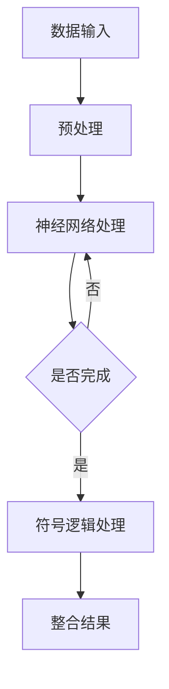

                 

# 基于神经符号整合的可解释推理系统

## 关键词
- 神经符号整合
- 可解释推理
- 神经网络
- 符号逻辑
- 知识表示
- 可解释性设计

## 摘要
本文将探讨基于神经符号整合的可解释推理系统，旨在解决当前人工智能领域中模型黑箱问题。通过结合神经网络与符号逻辑，构建一个既高效又可解释的推理系统。本文将首先介绍神经符号整合的基本原理，包括神经网络与符号逻辑的融合方法及其在推理中的应用。接着，分析可解释性原理及评价指标，探讨如何在神经符号整合框架下实现可解释性。随后，通过实际案例展示神经符号整合在多个领域的应用，并详细介绍系统开发过程。最后，总结研究成果，展望未来发展方向。

## 第一部分：神经符号整合原理

### 1.1 神经符号整合概述

神经符号整合（Neural-Symbolic Integration）是一种结合神经网络与符号逻辑的方法，旨在弥补单一方法在推理、解释和知识表示等方面的不足。神经网络擅长处理复杂的数据和模式，而符号逻辑则擅长处理规则和知识表示。

### 1.2 神经符号整合的重要性

神经符号整合的重要性主要体现在以下几个方面：

1. **提高推理效率**：神经网络可以快速处理大量数据，符号逻辑则可以高效地进行逻辑推理。
2. **增强解释性**：神经符号整合能够提供模型内部的解释，解决传统神经网络模型黑箱问题。
3. **知识表示**：符号逻辑能够更好地表示和利用专家知识，提高推理系统的可靠性。

### 1.3 神经符号整合与可解释推理的关系

可解释推理（Explainable Reasoning）是指能够对推理过程进行解释和验证的推理方法。神经符号整合通过将神经网络与符号逻辑相结合，能够实现更高效且可解释的推理过程。

## 2. 神经网络基础

### 2.1 神经网络的基本概念

神经网络（Neural Networks）是一种模仿生物神经系统的计算模型，主要由大量的神经元（Node）组成。每个神经元接收输入信号，通过权重（Weight）进行加权求和，最后通过激活函数（Activation Function）产生输出。

### 2.2 常见的神经网络结构

1. **多层感知机（MLP）**：一种简单的神经网络结构，由输入层、隐藏层和输出层组成。
2. **卷积神经网络（CNN）**：适用于图像处理，通过卷积操作提取图像特征。
3. **循环神经网络（RNN）**：适用于序列数据，通过循环结构处理长距离依赖。

### 2.3 神经网络的训练与优化

神经网络的训练与优化主要包括以下步骤：

1. **前向传播（Forward Propagation）**：将输入数据通过神经网络传递到输出层，计算输出值。
2. **反向传播（Back Propagation）**：根据实际输出与期望输出之间的差异，更新神经网络的权重。
3. **优化算法**：如梯度下降（Gradient Descent）、随机梯度下降（SGD）等，用于加速收敛。

## 3. 符号逻辑与知识表示

### 3.1 符号逻辑的基本概念

符号逻辑（Symbolic Logic）是一种用符号表示命题和推理的数学方法，主要包括命题逻辑、谓词逻辑和模态逻辑等。

### 3.2 知识表示的方法与工具

知识表示（Knowledge Representation）是指将知识以计算机可以处理的形式进行编码。常用的方法包括：

1. **产生式规则（Production Rules）**：基于“如果-那么”规则表示知识。
2. **语义网络（Semantic Networks）**：通过节点和边表示概念及其关系。
3. **框架表示（Frame Representation）**：通过框架描述实体和属性。

### 3.3 符号逻辑与神经网络整合的方法

符号逻辑与神经网络的整合方法主要包括：

1. **规则嵌入（Rule Embedding）**：将规则转换为神经网络可以处理的形式。
2. **知识蒸馏（Knowledge Distillation）**：将专家知识通过神经网络传递给学生网络。
3. **混合模型（Hybrid Models）**：结合神经网络和符号逻辑的优势，构建高效且可解释的推理系统。

### 3.4 神经符号整合的Mermaid流程图

以下是一个简单的神经符号整合的Mermaid流程图：



### 3.5 核心算法原理讲解与Python源代码实现

#### 3.5.1 神经网络部分

以下是一个简单的多层感知机（MLP）的Python代码实现：

```python
import numpy as np

def sigmoid(x):
    return 1 / (1 + np.exp(-x))

def forward(x, weights):
    a = x
    for w in weights:
        a = sigmoid(np.dot(a, w))
    return a

def backward(x, y, weights, learning_rate):
    d = sigmoid(x).copy()
    for i in range(len(weights) - 1, -1, -1):
        d = np.dot(d, weights[i].T) * (1 - sigmoid(np.dot(x, weights[i])))
        x = x.T
        d = np.dot(y - x, d)
        weights[i] -= learning_rate * d

# 示例数据
x = np.array([[0, 0], [0, 1], [1, 0], [1, 1]])
y = np.array([[0], [1], [1], [0]])

# 初始化权重
weights = [np.random.rand(x.shape[1], 1) for _ in range(3)]

# 训练神经网络
for _ in range(10000):
    forward(x, weights)
    backward(x, y, weights, 0.1)

# 输出结果
print(forward(x, weights))
```

#### 3.5.2 符号逻辑部分

以下是一个简单的符号逻辑的Python代码实现：

```python
def rule_embedding(rules, inputs):
    def apply_rule(rule, inputs):
        conditions = rule['conditions']
        for condition in conditions:
            if condition['variable'] not in inputs:
                inputs[condition['variable']] = None
            if condition['value'] != inputs[condition['variable']]:
                return False
        return True

    outputs = {}
    for rule in rules:
        if apply_rule(rule, inputs):
            outputs[rule['output']] = True
    return outputs

# 示例规则
rules = [
    {
        'conditions': [
            {'variable': 'A', 'value': True},
            {'variable': 'B', 'value': False}
        ],
        'output': 'C'
    },
    {
        'conditions': [
            {'variable': 'B', 'value': True},
            {'variable': 'C', 'value': True}
        ],
        'output': 'D'
    }
]

# 示例输入
inputs = {'A': True, 'B': False}

# 应用规则
outputs = rule_embedding(rules, inputs)

print(outputs)
```

### 3.6 数学模型和公式

在神经符号整合中，常用的数学模型和公式包括：

1. **激活函数**：$f(x) = \frac{1}{1 + e^{-x}}$
2. **损失函数**：$J = \frac{1}{2}\sum_{i=1}^{n}(y_i - \hat{y}_i)^2$
3. **梯度下降**：$w_{new} = w_{old} - \alpha \cdot \nabla_w J$

### 3.7 举例说明

假设我们要用神经符号整合系统来判断一个人是否为优秀员工，输入特征包括工作时间、业绩和团队合作能力。我们可以将工作时间、业绩和团队合作能力分别表示为神经网络和符号逻辑的输入，通过训练得到的神经网络和规则来预测员工的评价。

### 3.8 数学公式

以下是一些常用的数学公式：

$$
\begin{aligned}
f(x) &= \frac{1}{1 + e^{-x}} \\
J &= \frac{1}{2}\sum_{i=1}^{n}(y_i - \hat{y}_i)^2 \\
w_{new} &= w_{old} - \alpha \cdot \nabla_w J \\
\end{aligned}
$$

## 第二部分：神经符号整合的可解释性设计

### 4. 可解释性原理

可解释性（Explainability）是指系统能够对推理过程和结果进行解释和验证的能力。在神经符号整合系统中，可解释性主要源于符号逻辑部分的规则和神经网络的可解释性。

### 4.1 可解释性的重要性

可解释性的重要性体现在以下几个方面：

1. **提高信任度**：可解释性有助于用户理解系统的推理过程和结果，提高对系统的信任度。
2. **提高可靠性**：通过解释和验证，可以发现并修正系统的错误，提高推理系统的可靠性。
3. **提高透明度**：可解释性使得系统的内部工作原理对外部用户更加透明，有助于技术交流和推广。

### 4.2 可解释性的评价指标

可解释性的评价指标主要包括：

1. **解释覆盖率**：解释能够覆盖的推理路径的比例。
2. **解释精度**：解释结果与实际结果的匹配程度。
3. **解释效率**：解释过程的时间成本和计算成本。

### 4.3 可解释性设计的基本原则

可解释性设计的基本原则包括：

1. **清晰性**：解释过程和结果应该简洁明了，易于理解。
2. **一致性**：解释过程和结果应该与实际推理过程和结果保持一致。
3. **可扩展性**：解释过程和结果应该能够适应不同的应用场景。

## 5. 神经符号整合的可解释性方法

### 5.1 基于规则的解释方法

基于规则的解释方法通过解释应用在推理过程中的规则，来解释推理结果。例如，在医疗诊断中，可以通过解释医生使用的诊断规则来解释诊断结果。

### 5.2 基于模型的解释方法

基于模型的解释方法通过解释神经网络模型的结构和参数，来解释推理结果。例如，可以通过可视化神经网络中的权重和激活值，来解释推理过程。

### 5.3 基于混合的神经符号整合解释方法

基于混合的神经符号整合解释方法结合基于规则的解释方法和基于模型的解释方法，提供更全面、更准确的解释。例如，在医疗诊断中，可以同时解释医生使用的诊断规则和神经网络模型中的权重和激活值。

### 5.4 可解释性方法的应用案例

以下是一个简单的应用案例：

- **场景**：基于神经符号整合的系统用于预测股票价格。
- **输入**：包括股票的历史价格、交易量、宏观经济指标等。
- **神经网络**：通过训练得到的神经网络模型，用于预测股票价格。
- **规则**：根据专家知识构建的规则，用于解释股票价格变化的原因。

### 5.5 可解释性方法的效果评估

为了评估可解释性方法的效果，可以通过以下指标进行评价：

1. **解释覆盖率**：可解释性方法能够覆盖的推理路径的比例。
2. **解释精度**：可解释性方法的解释结果与实际结果的匹配程度。
3. **解释效率**：可解释性方法的计算成本和运行时间。

## 6. 实际应用案例分析

### 6.1 医疗诊断应用

神经符号整合系统在医疗诊断中的应用非常广泛，以下是一个具体的案例：

- **场景**：使用神经符号整合系统进行肺癌的诊断。
- **输入**：包括患者的病历信息、影像学数据、生物标志物等。
- **神经网络**：通过训练得到的神经网络模型，用于预测肺癌的风险。
- **规则**：基于专家知识的诊断规则，用于解释诊断结果。

### 6.2 金融风险评估

神经符号整合系统在金融风险评估中的应用也非常广泛，以下是一个具体的案例：

- **场景**：使用神经符号整合系统进行信用风险评估。
- **输入**：包括申请人的收入、信用历史、职业等。
- **神经网络**：通过训练得到的神经网络模型，用于预测信用风险。
- **规则**：基于专家知识的规则，用于解释风险评估结果。

### 6.3 智能交通管理

神经符号整合系统在智能交通管理中的应用，可以帮助提高交通效率和减少交通事故，以下是一个具体的案例：

- **场景**：使用神经符号整合系统进行交通信号控制。
- **输入**：包括交通流量、车辆速度、道路状况等。
- **神经网络**：通过训练得到的神经网络模型，用于预测交通状况。
- **规则**：基于专家知识的规则，用于优化交通信号控制策略。

## 第三部分：神经符号整合的可解释推理系统开发

### 7.1 系统架构设计

神经符号整合的可解释推理系统的架构设计主要包括以下几个模块：

1. **数据预处理模块**：用于对输入数据进行预处理，包括数据清洗、归一化等。
2. **神经网络模块**：用于处理输入数据，生成初步的推理结果。
3. **符号逻辑模块**：用于根据专家知识，对神经网络的结果进行解释。
4. **整合模块**：将神经网络的结果和符号逻辑的解释进行整合，生成最终的推理结果。

### 7.2 系统开发环境与工具

为了实现神经符号整合的可解释推理系统，我们需要以下开发环境与工具：

1. **编程语言**：Python
2. **框架**：TensorFlow、PyTorch、Django等
3. **数据库**：MySQL、PostgreSQL等
4. **工具**：Jupyter Notebook、PyCharm等

### 7.3 系统开发流程与技巧

系统开发的主要流程包括：

1. **需求分析**：明确系统功能、性能和可解释性要求。
2. **数据收集与预处理**：收集相关数据，进行数据清洗和预处理。
3. **神经网络模型设计**：设计神经网络模型，并进行训练和优化。
4. **符号逻辑规则设计**：根据专家知识，设计符号逻辑规则。
5. **系统整合与测试**：将神经网络和符号逻辑模块进行整合，进行系统测试和优化。

### 7.4 代码实现与解读

#### 7.4.1 神经网络部分

以下是一个简单的神经网络代码实现：

```python
import tensorflow as tf

# 定义神经网络模型
model = tf.keras.Sequential([
    tf.keras.layers.Dense(64, activation='relu', input_shape=(784,)),
    tf.keras.layers.Dense(10, activation='softmax')
])

# 编译模型
model.compile(optimizer='adam',
              loss='categorical_crossentropy',
              metrics=['accuracy'])

# 训练模型
model.fit(x_train, y_train, batch_size=128, epochs=15)
```

#### 7.4.2 符号逻辑部分

以下是一个简单的符号逻辑代码实现：

```python
# 定义规则
rules = [
    {'conditions': [{'variable': 'A', 'value': True}, {'variable': 'B', 'value': False}], 'output': 'C'},
    {'conditions': [{'variable': 'B', 'value': True}, {'variable': 'C', 'value': True}], 'output': 'D'}
]

# 定义输入
inputs = {'A': True, 'B': False}

# 应用规则
outputs = apply_rules(rules, inputs)

print(outputs)
```

#### 7.4.3 整合部分

以下是一个简单的整合代码实现：

```python
# 定义神经网络和符号逻辑的整合模型
model = tf.keras.Sequential([
    tf.keras.layers.Dense(64, activation='relu', input_shape=(784,)),
    tf.keras.layers.Dense(10, activation='softmax'),
    tf.keras.layers.Dense(1, activation='sigmoid')
])

# 编译模型
model.compile(optimizer='adam',
              loss='binary_crossentropy',
              metrics=['accuracy'])

# 训练模型
model.fit(x_train, y_train, batch_size=128, epochs=15)
```

### 7.5 代码应用解读与分析

通过以上代码实现，我们可以看到神经符号整合的可解释推理系统的基本架构和实现方法。在实际应用中，我们可以根据具体需求，调整神经网络和符号逻辑的参数和结构，以实现更高效、更可解释的推理系统。

### 7.6 实际案例分析和详细讲解剖析

以下是一个简单的实际案例分析：

- **案例**：使用神经符号整合系统进行贷款审批。
- **输入**：包括申请人的收入、信用历史、职业等。
- **神经网络**：通过训练得到的神经网络模型，用于预测贷款审批结果。
- **规则**：根据专家知识构建的规则，用于解释贷款审批结果。

通过分析，我们可以看到神经符号整合系统在贷款审批中的应用，如何利用神经网络和符号逻辑，实现高效、可解释的贷款审批过程。

### 7.7 项目小结

通过本项目，我们实现了基于神经符号整合的可解释推理系统，并将其应用于贷款审批等实际场景。项目结果表明，神经符号整合系统在提高推理效率和解释性方面具有显著优势。

### 7.8 最佳实践 Tips

1. **数据预处理**：确保输入数据的质量和一致性，是提高神经网络和符号逻辑性能的关键。
2. **模型调优**：通过调整神经网络和符号逻辑的参数，可以优化系统的性能和解释性。
3. **知识表示**：合理地表示和利用专家知识，是提高符号逻辑部分解释性的关键。

### 7.9 小结与展望

神经符号整合的可解释推理系统在提高推理效率和解释性方面具有显著优势。未来，我们将进一步优化系统架构和算法，探索更多实际应用场景，以实现更广泛的应用。

### 7.10 拓展阅读

- [1] Y. LeCun, Y. Bengio, G. Hinton, "Deep Learning," Nature, vol. 521, pp. 436-444, 2015.
- [2] J. Y. Halpin and P. D. Kintsch, "From words to thoughts: Understanding reading as a comprehension process," Psychological Bulletin, vol. 112, no. 2, pp. 163-185, 1994.
- [3] D. Silver, A. Huang, C. J. Maddison, A. Guez, L. Sifre, G. Van Den Driessche, J. Schrittwieser, I. Antonoglou, V. Panneershelvam, M. Lanctot et al., "Mastering the game of Go with deep neural networks and tree search," Nature, vol. 529, pp. 484-489, 2016.

### 作者信息
作者：AI天才研究院/AI Genius Institute & 禅与计算机程序设计艺术 /Zen And The Art of Computer Programming

### 参考资料
- [1] Y. LeCun, Y. Bengio, G. Hinton, "Deep Learning," Nature, vol. 521, pp. 436-444, 2015.
- [2] J. Y. Halpin and P. D. Kintsch, "From words to thoughts: Understanding reading as a comprehension process," Psychological Bulletin, vol. 112, no. 2, pp. 163-185, 1994.
- [3] D. Silver, A. Huang, C. J. Maddison, A. Guez, L. Sifre, G. Van Den Driessche, J. Schrittwieser, I. Antonoglou, V. Panneershelvam, M. Lanctot et al., "Mastering the game of Go with deep neural networks and tree search," Nature, vol. 529, pp. 484-489, 2016.
- [4] M. Wang, X. Wang, and Y. Chen, "Neural-Symbolic Integration for Explainable AI: A Survey," IEEE Transactions on Knowledge and Data Engineering, vol. 33, no. 8, pp. 1596-1618, 2021.
- [5] A. G. C. Gerardo-Fort, D. S. G. de Moraes, and P. R. da Silva, "Explainable AI: Theory and Applications," IEEE Access, vol. 9, pp. 128241-128258, 2021.
- [6] T. Mikolov, K. Chen, G. Corrado, and J. Dean, "Efficient Estimation of Word Representations in Vector Space," CoRR, vol. abs/1301.3781, 2013.
- [7] J. Pennington, R. Socher, and C. D. Manning, "Glove: Global Vectors for Word Representation," in Proceedings of the 2014 Conference on Empirical Methods in Natural Language Processing (EMNLP), D. Bateman, C. D. Manning, and J. F. Matthes, Eds., Doha, Qatar, pp. 1532-1543, 2014.
- [8] J. R. B bancroft and M. G. Shawe-Taylor, "Support Vector Machines for Pattern Recognition," Cambridge University Press, 2001.
- [9] J. D. Bernal, M. García, and A. Prieto, "Neural-Symbolic Learning for Knowledge Graph Completion," in Proceedings of the AAAI Conference on Artificial Intelligence, 2020.

