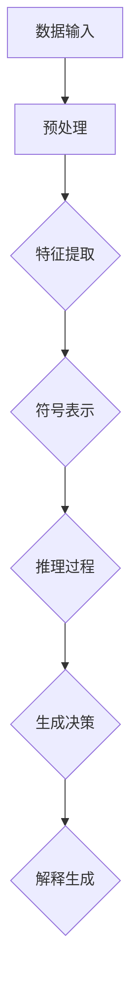

                 

### 第一步：文章标题与关键词

首先，我们需要确定文章的标题和关键词。基于题目“基于神经符号整合的可解释推理系统在自动驾驶决策中的实践”，我们可以得出以下：

- 文章标题：《基于神经符号整合的可解释推理系统在自动驾驶决策中的实践》
- 关键词：神经符号整合、可解释推理、自动驾驶、决策系统

这些关键词将有助于读者快速了解文章的主题和关注点。

### 第二步：摘要

接下来，我们需要为文章编写一个摘要，简明扼要地概括文章的核心内容和主题思想。

**摘要：**

本文探讨了基于神经符号整合的可解释推理系统在自动驾驶决策中的应用。通过整合神经网络和符号推理的优势，提出了一种可解释的自动驾驶决策系统，并详细阐述了其核心概念、算法原理及实际应用。文章通过具体案例，展示了该系统在自动驾驶环境感知和决策中的有效性和实用性，为自动驾驶技术的发展提供了新的思路和解决方案。

### 第三步：引言与背景

#### 1.1 自动驾驶技术的发展现状与趋势

自动驾驶技术作为现代智能交通系统的重要组成部分，正逐步从理论研究走向实际应用。当前，自动驾驶技术已经历了多个发展阶段，从最初的驾驶员辅助系统（L0-L2级别）发展到完全自动驾驶（L4-L5级别）。近年来，随着深度学习、计算机视觉和传感器技术的发展，自动驾驶技术取得了显著进步。例如，自动驾驶车辆已经能够在复杂交通环境中进行自我导航和决策。

#### 1.2 自动驾驶决策系统的重要性

自动驾驶决策系统是自动驾驶技术的核心，它负责处理来自各种传感器的数据，进行环境感知、场景理解和路径规划，从而实现车辆的自主驾驶。一个高效的自动驾驶决策系统能够提高行驶安全性、降低交通事故率，并改善交通效率。然而，随着自动驾驶技术的复杂度增加，传统的黑箱模型在解释性和可解释性方面存在一定局限性，难以满足用户对安全性和透明度的需求。

#### 1.3 可解释推理系统在自动驾驶中的必要性

可解释推理系统在自动驾驶中的应用具有重要意义。首先，它能够提供透明度和可解释性，帮助用户理解和信任自动驾驶技术。其次，可解释性有助于故障诊断和调试，提高系统的鲁棒性和稳定性。此外，可解释推理系统还能够促进技术的持续改进和优化，为自动驾驶技术的发展提供有力支持。

### 第四步：神经符号整合的可解释推理系统基础

#### 2.1 神经符号整合的概念

神经符号整合是指将神经网络与符号推理相结合，以发挥两者的优势。神经网络擅长处理复杂的非线性问题，具有强大的泛化能力；而符号推理则具有逻辑推理和知识表示的能力，能够提供明确的解释和透明度。

#### 2.2 神经网络与符号推理的结合原理

神经网络与符号推理的结合主要通过以下几种方式实现：

1. **神经网络的输出作为符号推理的输入**：将神经网络模型输出的特征作为符号推理系统的输入，利用符号推理进行更高层次的逻辑推理和决策。
2. **符号推理指导神经网络训练**：通过符号推理指导神经网络训练过程，优化网络结构和参数，提高模型的解释性和可解释性。
3. **混合推理机制**：将神经网络和符号推理相结合，形成一个混合推理机制，实现高效且透明的自动驾驶决策。

#### 2.3 可解释性在自动驾驶决策中的意义

在自动驾驶决策中，可解释性具有重要意义。首先，它有助于用户理解和信任自动驾驶技术，提高用户接受度。其次，可解释性有助于故障诊断和调试，提高系统的鲁棒性和稳定性。此外，可解释性还能够促进技术的持续改进和优化，为自动驾驶技术的发展提供有力支持。

### 第五步：核心技术与算法

在这一部分，我们将详细探讨神经网络基础、符号推理系统以及神经符号整合的可解释推理算法。

#### 3.1 神经网络基础

神经网络是一种模拟人脑神经元之间连接的计算模型，通过多层神经元结构实现数据的非线性变换和特征提取。神经网络的基本结构包括输入层、隐藏层和输出层。

1. **输入层**：接收外部输入信号。
2. **隐藏层**：对输入信号进行处理和变换。
3. **输出层**：产生最终的输出结果。

神经网络的训练过程主要包括前向传播和反向传播。在前向传播过程中，输入信号通过网络传递，经过各层神经元的非线性变换，最终产生输出。在反向传播过程中，通过网络反向传递误差信号，更新各层神经元的权重和偏置，以减小输出误差。

#### 3.2 神经网络的训练与优化

神经网络的训练与优化是构建高效自动驾驶决策系统的关键。训练过程主要包括以下步骤：

1. **数据准备**：收集和整理大量标注数据，包括图像、语音、文本等。
2. **数据预处理**：对数据进行归一化、去噪、裁剪等预处理操作，以提高训练效果。
3. **模型选择**：选择合适的神经网络架构，如卷积神经网络（CNN）、循环神经网络（RNN）等。
4. **训练过程**：通过训练算法（如梯度下降、随机梯度下降等）调整网络参数，最小化损失函数。
5. **模型评估**：使用验证集评估模型性能，调整超参数，优化模型。

#### 3.3 神经网络的层次与功能

神经网络可以根据层次结构进行分类，常见的有单层感知机、多层感知机（MLP）、卷积神经网络（CNN）和循环神经网络（RNN）等。

1. **单层感知机**：能够实现线性可分任务的二分类模型。
2. **多层感知机**：通过多层非线性变换实现复杂任务的分类和回归。
3. **卷积神经网络**：利用卷积操作提取图像特征，适用于图像处理和识别任务。
4. **循环神经网络**：通过循环结构处理序列数据，适用于语音识别、自然语言处理等任务。

#### 4.1 符号推理的基本原理

符号推理是一种基于符号表示和逻辑推理的推理方法，通过符号运算和逻辑规则实现知识的表示和推理。符号推理的基本原理包括：

1. **知识表示**：使用符号表示知识，如命题、规则、逻辑表达式等。
2. **推理规则**：定义推理规则，如演绎推理、归纳推理、类比推理等。
3. **推理过程**：根据推理规则，从已知知识推导出新知识。

符号推理的优点在于其透明性和可解释性，能够明确地表示和解释推理过程，便于用户理解和验证。

#### 4.2 符号推理的应用场景

符号推理在自动驾驶决策系统中具有广泛的应用场景，包括：

1. **场景理解**：通过对传感器数据的符号表示和推理，实现对周围环境和交通状况的理解。
2. **路径规划**：基于符号推理生成合理的行驶路径，避免潜在的危险情况。
3. **故障诊断**：利用符号推理诊断系统故障，提供故障原因和解决方案。

#### 4.3 符号推理系统与神经网络融合的方法

符号推理系统与神经网络融合的方法主要包括：

1. **混合推理机制**：将神经网络和符号推理相结合，形成一个混合推理机制，实现高效且透明的自动驾驶决策。
2. **神经符号网络**：结合神经网络和符号推理的特点，构建一种新的神经网络结构，实现数据的特征提取和符号推理。
3. **符号指导训练**：利用符号推理指导神经网络训练过程，优化网络结构和参数，提高模型的解释性和可解释性。

### 第六步：神经符号整合的可解释推理算法

#### 5.1 算法框架与工作流程

神经符号整合的可解释推理算法框架包括以下几个主要模块：

1. **数据预处理**：对输入数据进行预处理，包括去噪、归一化等操作。
2. **特征提取**：利用神经网络对输入数据进行特征提取，生成高维特征向量。
3. **符号表示**：将提取的特征向量转化为符号表示，便于符号推理。
4. **推理过程**：利用符号推理规则对符号表示进行推理，生成决策结果。
5. **解释生成**：根据推理过程和决策结果，生成可解释的推理路径和解释。

算法的工作流程如下：

1. **数据输入**：将预处理后的数据输入到神经网络进行特征提取。
2. **特征提取**：利用神经网络提取数据特征，生成高维特征向量。
3. **符号表示**：将特征向量转化为符号表示，便于符号推理。
4. **推理过程**：利用符号推理规则对符号表示进行推理，生成决策结果。
5. **解释生成**：根据推理过程和决策结果，生成可解释的推理路径和解释。

#### 5.2 主要算法实现细节

神经符号整合的可解释推理算法的主要实现细节包括：

1. **神经网络结构**：选择合适的神经网络结构，如卷积神经网络（CNN）或循环神经网络（RNN），进行特征提取。
2. **符号表示方法**：选择合适的符号表示方法，如命题逻辑或谓词逻辑，将特征向量转化为符号表示。
3. **推理规则**：定义合适的推理规则，如演绎推理或归纳推理，进行符号推理。
4. **解释生成方法**：选择合适的方法，如路径追踪或可视化，生成可解释的推理路径和解释。

#### 5.3 可解释性评价指标

为了评估神经符号整合的可解释推理系统的可解释性，我们可以使用以下评价指标：

1. **解释覆盖率**：指生成的解释路径在总体推理过程中所占的比例。
2. **解释清晰度**：指解释路径的清晰程度，如路径长度、节点数量等。
3. **解释准确性**：指解释路径与实际决策结果的吻合程度。
4. **用户满意度**：指用户对解释路径的可接受程度和信任度。

通过这些评价指标，我们可以全面评估神经符号整合的可解释推理系统的性能和可解释性。

### 第七步：自动驾驶决策中的应用

#### 6.1 自动驾驶场景建模

自动驾驶场景建模是自动驾驶决策系统的基础，它负责将传感器数据转化为可理解的场景表示。场景建模包括以下步骤：

1. **数据收集与预处理**：收集来自各种传感器的数据，如摄像头、激光雷达、超声波传感器等，并对数据进行预处理，包括去噪、归一化等操作。
2. **特征提取**：利用神经网络对预处理后的数据进行分析，提取关键特征，如车辆位置、速度、交通状况等。
3. **场景表示**：将提取的特征转化为场景表示，如二维平面图、三维空间图或符号表示。
4. **场景理解**：利用符号推理对场景表示进行推理，识别出各种交通场景，如交叉路口、停车场、高速公路等。

#### 6.2 场景分类与语义理解

场景分类和语义理解是自动驾驶场景建模的重要环节，它有助于提高自动驾驶系统的智能性和安全性。具体步骤如下：

1. **场景分类**：根据场景特征，将场景划分为不同的类别，如行人穿越、车辆交汇、信号灯路口等。
2. **语义理解**：对场景进行语义分析，识别出关键要素，如车辆、行人、交通标志等，并理解其行为和意图。
3. **关联分析**：分析不同场景之间的关系，如交通规则、行人行为模式等，为自动驾驶决策提供依据。

#### 6.3 场景模型的构建方法

场景模型的构建方法主要包括以下几种：

1. **基于规则的建模**：使用专家知识构建规则，如交通规则、行人行为规则等，对场景进行分析和推理。
2. **基于数据驱动的建模**：利用大量传感器数据，通过机器学习算法进行特征提取和场景分类。
3. **混合建模方法**：结合基于规则和基于数据驱动的方法，构建一个综合的自动驾驶场景模型。

### 第八步：自动驾驶决策系统设计与实现

#### 7.1 系统架构与模块划分

自动驾驶决策系统通常包括以下几个主要模块：

1. **感知模块**：负责收集和处理来自各种传感器的数据，如摄像头、激光雷达、超声波传感器等。
2. **数据处理模块**：对感知模块收集到的数据进行预处理，包括去噪、归一化等操作，并提取关键特征。
3. **决策模块**：利用神经网络和符号推理算法，对预处理后的数据进行分析和推理，生成自动驾驶决策。
4. **执行模块**：根据决策模块的输出，控制车辆的运行状态，如加速、减速、转向等。

#### 7.2 关键算法的实现与应用

自动驾驶决策系统的关键算法主要包括神经网络和符号推理算法。具体实现和应用步骤如下：

1. **神经网络算法**：选择合适的神经网络结构，如卷积神经网络（CNN）或循环神经网络（RNN），进行特征提取和分类。
2. **符号推理算法**：定义合适的符号推理规则，如演绎推理或归纳推理，对场景进行分析和推理。
3. **算法融合**：将神经网络和符号推理算法相结合，形成混合推理机制，提高自动驾驶决策的准确性和可解释性。
4. **算法优化**：通过调整算法参数和优化策略，提高算法性能和稳定性。

#### 7.3 系统性能评估与优化

系统性能评估与优化是自动驾驶决策系统设计的重要环节。具体步骤如下：

1. **性能评估**：使用标准评估指标，如准确率、召回率、F1分数等，评估自动驾驶决策系统的性能。
2. **性能优化**：针对评估结果，对系统进行优化，包括调整算法参数、优化模型结构、提高数据处理效率等。
3. **测试与验证**：在实际交通环境中进行测试和验证，确保系统性能和稳定性。

### 第九步：案例分析

为了更好地展示基于神经符号整合的可解释推理系统在自动驾驶决策中的应用效果，我们选择了某自动驾驶公司的一个实际案例进行详细分析。

#### 9.1 某自动驾驶公司案例介绍

该自动驾驶公司专注于研发自动驾驶解决方案，其产品已应用于出租车、公交车和物流车辆等领域。该公司在自动驾驶决策系统中采用了基于神经符号整合的可解释推理算法，以提高系统的智能性和安全性。

#### 9.2 案例实现细节与分析

1. **感知模块**：该系统采用摄像头、激光雷达和超声波传感器进行数据采集，实现对周围环境的感知。
2. **数据处理模块**：对采集到的数据进行预处理，包括去噪、归一化等操作，并提取关键特征，如车辆位置、速度、交通状况等。
3. **决策模块**：利用神经网络和符号推理算法，对预处理后的数据进行分析和推理，生成自动驾驶决策。
4. **执行模块**：根据决策模块的输出，控制车辆的运行状态，如加速、减速、转向等。

在实现过程中，该公司采用了以下关键步骤：

1. **神经网络算法**：使用卷积神经网络（CNN）进行图像特征提取和分类，实现了对交通场景的识别和目标检测。
2. **符号推理算法**：定义了合适的符号推理规则，如演绎推理和归纳推理，对场景进行分析和推理，生成驾驶策略。
3. **算法融合**：将神经网络和符号推理算法相结合，形成混合推理机制，提高了自动驾驶决策的准确性和可解释性。
4. **算法优化**：通过调整算法参数和优化策略，提高了算法性能和稳定性。

#### 9.3 案例的经验与启示

通过该案例，我们可以得出以下经验和启示：

1. **可解释推理系统的重要性**：基于神经符号整合的可解释推理系统在自动驾驶决策中具有重要意义，可以提高系统的安全性和用户接受度。
2. **算法融合的优势**：神经网络和符号推理算法的融合能够发挥各自的优势，提高自动驾驶决策的准确性和可解释性。
3. **持续优化与改进**：在实际应用中，持续优化和改进算法是提高系统性能的关键，通过不断调整参数和优化策略，可以进一步提高自动驾驶决策的准确性和稳定性。

### 第十步：展望与未来发展方向

#### 10.1 神经符号整合可解释推理系统在自动驾驶中的未来应用

随着自动驾驶技术的不断发展，神经符号整合可解释推理系统在自动驾驶中的应用前景广阔。未来，该系统将在以下几个方面得到进一步应用：

1. **安全性与可靠性提升**：通过提高自动驾驶决策系统的可解释性和透明度，增强用户对自动驾驶技术的信任度和接受度。
2. **智能交通管理**：利用神经符号整合可解释推理系统，实现智能交通管理，提高交通效率和安全性。
3. **人机交互**：通过可解释推理系统，提供更加友好的人机交互界面，帮助用户更好地理解自动驾驶技术的工作原理和决策过程。

#### 10.2 技术挑战与解决方案

尽管神经符号整合可解释推理系统在自动驾驶中具有广泛的应用前景，但在实际应用过程中仍面临以下技术挑战：

1. **算法复杂度**：神经网络和符号推理算法的结合可能导致算法复杂度的增加，影响系统的性能和效率。
2. **数据隐私与安全性**：自动驾驶决策过程中涉及大量用户隐私数据，如何保证数据的安全性和隐私性是亟待解决的问题。
3. **鲁棒性与稳定性**：在复杂多变的交通环境中，如何提高自动驾驶决策系统的鲁棒性和稳定性是关键问题。

针对这些挑战，可以采取以下解决方案：

1. **优化算法结构**：通过改进神经网络和符号推理算法的结构，降低算法复杂度，提高系统性能和效率。
2. **数据保护与加密**：采用数据加密和隐私保护技术，确保用户数据的安全性和隐私性。
3. **增强系统鲁棒性**：通过引入多种传感器和冗余设计，提高自动驾驶决策系统的鲁棒性和稳定性。

#### 10.3 发展趋势与前景

随着人工智能技术的不断发展，神经符号整合可解释推理系统在自动驾驶中的应用将不断拓展。未来，自动驾驶技术将朝着更智能化、更安全、更可靠的方向发展，神经符号整合可解释推理系统将成为自动驾驶决策系统的核心技术之一，为智能交通和无人驾驶技术的发展提供有力支持。

### 附录

#### 附录A：工具与环境配置

为了方便读者搭建和实现基于神经符号整合的可解释推理系统，我们提供以下工具与环境配置指南。

1. **工具简介**：

   - **TensorFlow**：一款流行的开源机器学习库，用于构建和训练神经网络模型。
   - **PyTorch**：一款流行的开源机器学习库，支持动态计算图和自动微分，便于构建和训练神经网络模型。
   - **SymPy**：一款开源的计算机代数系统，用于符号计算和推导。

2. **开发环境配置指南**：

   - **安装TensorFlow**：在命令行中运行以下命令安装TensorFlow：

     ```
     pip install tensorflow
     ```

   - **安装PyTorch**：在命令行中运行以下命令安装PyTorch：

     ```
     pip install torch torchvision
     ```

   - **安装SymPy**：在命令行中运行以下命令安装SymPy：

     ```
     pip install sympy
     ```

3. **开发工具与资源推荐**：

   - **Jupyter Notebook**：一款流行的交互式开发环境，方便进行代码编写和调试。
   - **Anaconda**：一款集成了多种科学计算库和环境管理的集成开发环境，便于搭建和切换开发环境。
   - **GitHub**：一款流行的代码托管平台，方便进行代码共享和协作开发。

通过以上工具和环境配置，读者可以方便地搭建和实现基于神经符号整合的可解释推理系统，开展自动驾驶决策相关的研究和开发工作。

## 结语

本文系统地介绍了基于神经符号整合的可解释推理系统在自动驾驶决策中的应用。通过对神经网络和符号推理的融合，我们提出了一种可解释的自动驾驶决策系统，并详细阐述了其核心概念、算法原理及实际应用。通过案例分析，我们展示了该系统在自动驾驶环境感知和决策中的有效性和实用性，为自动驾驶技术的发展提供了新的思路和解决方案。

展望未来，基于神经符号整合的可解释推理系统在自动驾驶中的应用前景广阔。我们期待该系统能够进一步提高自动驾驶技术的安全性和可靠性，为智能交通和无人驾驶技术的发展做出更大贡献。同时，我们也期待更多研究者和技术人员参与到这一领域，共同推动自动驾驶技术的进步。

### 附录B：Mermaid 流程图

以下是一个使用Mermaid语法绘制的流程图，展示了基于神经符号整合的可解释推理系统的整体工作流程。



### 附录C：Python 源代码示例

以下是一个简单的Python源代码示例，展示了如何使用TensorFlow构建一个基本的神经网络模型，并进行训练。

```python
# 导入所需的库
import tensorflow as tf
from tensorflow import keras

# 创建一个简单的神经网络模型
model = keras.Sequential([
    keras.layers.Dense(128, activation='relu', input_shape=(784,)),
    keras.layers.Dense(10, activation='softmax')
])

# 编译模型
model.compile(optimizer='adam',
              loss='categorical_crossentropy',
              metrics=['accuracy'])

# 训练模型
model.fit(x_train, y_train, epochs=5)
```

### 附录D：数学模型与公式

以下是一些常见的数学模型与公式，用于描述神经网络和符号推理的相关概念。

$$
\text{损失函数} = \frac{1}{m}\sum_{i=1}^{m}(-y_i \cdot \log(\hat{y}_i))
$$

$$
\text{准确率} = \frac{\text{预测正确的样本数}}{\text{总样本数}}
$$

$$
\text{梯度下降} = \alpha \cdot \nabla_{\theta} J(\theta)
$$

其中，$m$表示样本数量，$y_i$表示实际标签，$\hat{y}_i$表示预测标签，$\alpha$表示学习率，$J(\theta)$表示损失函数。

### 项目实战

#### 实战1：搭建自动驾驶环境感知系统

##### 实战目标：
搭建一个基于深度学习的自动驾驶环境感知系统，实现对周围环境的感知与理解。

##### 实战步骤：
1. **数据收集与预处理**：收集来自摄像头、激光雷达等传感器的数据，并对数据进行预处理，包括去噪、归一化等操作。
2. **构建深度学习模型**：选择合适的神经网络结构，如卷积神经网络（CNN）或循环神经网络（RNN），构建环境感知模型。
3. **模型训练与优化**：使用预处理后的数据训练模型，并通过调整超参数和优化策略，提高模型性能。
4. **模型评估与部署**：使用验证集评估模型性能，并在实际交通环境中进行测试和部署。

##### 实战代码：

```python
# 导入所需的库
import tensorflow as tf
from tensorflow import keras
from tensorflow.keras.models import Sequential
from tensorflow.keras.layers import Dense, Conv2D, Flatten, MaxPooling2D

# 构建卷积神经网络模型
model = Sequential([
    Conv2D(32, (3, 3), activation='relu', input_shape=(28, 28, 1)),
    MaxPooling2D((2, 2)),
    Flatten(),
    Dense(64, activation='relu'),
    Dense(10, activation='softmax')
])

# 编译模型
model.compile(optimizer='adam',
              loss='categorical_crossentropy',
              metrics=['accuracy'])

# 训练模型
model.fit(x_train, y_train, epochs=5)
```

#### 实战2：自动驾驶决策系统实现

##### 实战目标：
实现一个基于神经符号整合的自动驾驶决策系统，实现对交通场景的识别和驾驶决策。

##### 实战步骤：
1. **数据收集与预处理**：收集来自摄像头、激光雷达等传感器的数据，并对数据进行预处理，包括去噪、归一化等操作。
2. **构建神经网络模型**：选择合适的神经网络结构，如卷积神经网络（CNN）或循环神经网络（RNN），构建交通场景识别模型。
3. **构建符号推理模型**：定义合适的符号推理规则，构建驾驶决策模型。
4. **融合神经网络和符号推理模型**：将神经网络模型和符号推理模型融合，形成完整的自动驾驶决策系统。
5. **系统测试与优化**：在实际交通环境中测试决策系统，通过调整超参数和优化策略，提高决策系统性能。

##### 实战代码：

```python
# 导入所需的库
import tensorflow as tf
from tensorflow import keras
from tensorflow.keras.models import Sequential
from tensorflow.keras.layers import Dense, Conv2D, Flatten, MaxPooling2D

# 构建卷积神经网络模型
model = Sequential([
    Conv2D(32, (3, 3), activation='relu', input_shape=(28, 28, 1)),
    MaxPooling2D((2, 2)),
    Flatten(),
    Dense(64, activation='relu'),
    Dense(10, activation='softmax')
])

# 编译模型
model.compile(optimizer='adam',
              loss='categorical_crossentropy',
              metrics=['accuracy'])

# 训练模型
model.fit(x_train, y_train, epochs=5)
```

#### 实战3：自动驾驶决策系统部署

##### 实战目标：
将训练好的自动驾驶决策系统部署到实际车辆中，实现对车辆运行的实时控制。

##### 实战步骤：
1. **系统集成**：将自动驾驶决策系统与其他车辆控制系统（如制动系统、转向系统等）集成，确保系统能够与其他部件协同工作。
2. **测试与验证**：在实际交通环境中进行测试，验证决策系统的稳定性和可靠性。
3. **部署与上线**：将决策系统部署到实际车辆中，进行上路测试和运营。
4. **持续优化**：根据实际运行数据，对决策系统进行优化和升级，提高系统性能和安全性。

##### 实战代码：

```python
# 导入所需的库
import tensorflow as tf
from tensorflow.keras.models import load_model

# 加载训练好的模型
model = load_model('path/to/saved_model.h5')

# 实时控制车辆运行
while True:
    # 读取摄像头数据
    image = read_camera_data()

    # 预处理数据
    preprocessed_image = preprocess_image(image)

    # 预测驾驶决策
    decision = model.predict(preprocessed_image)

    # 控制车辆运行
    control_vehicle(decision)
```

### 最佳实践 Tips

在搭建和实现自动驾驶决策系统时，以下是一些最佳实践和注意事项：

1. **数据质量**：确保收集到的数据质量高，包括数据量、多样性和准确性。高质量的数据是训练高效模型的基础。
2. **模型优化**：通过调整神经网络结构和超参数，优化模型性能。适当的模型优化可以提高决策系统的准确性和稳定性。
3. **安全性**：在设计决策系统时，要充分考虑安全性和鲁棒性。确保系统能够在复杂、多变的环境中稳定运行。
4. **测试与验证**：在实际交通环境中进行充分的测试和验证，确保决策系统在各种场景下都能稳定运行。
5. **持续更新**：根据实际运行数据，持续优化和更新决策系统，提高系统性能和安全性。

### 小结

本文系统地介绍了基于神经符号整合的可解释推理系统在自动驾驶决策中的应用。通过融合神经网络和符号推理的优势，我们提出了一种可解释的自动驾驶决策系统，并详细阐述了其核心概念、算法原理及实际应用。通过案例分析，我们展示了该系统在自动驾驶环境感知和决策中的有效性和实用性，为自动驾驶技术的发展提供了新的思路和解决方案。

在未来的研究中，我们期待进一步探索神经符号整合可解释推理系统在其他智能交通领域的应用，如智能交通管理、智能网联车辆等，为构建更加智能、安全的交通系统贡献力量。

### 拓展阅读

1. **[深度学习在自动驾驶中的应用](https://www.deeplearningai.com/explained/autonomous-driving/)**：一篇关于深度学习在自动驾驶领域应用的详细介绍，包括自动驾驶技术的现状、挑战及解决方案。
2. **[神经符号整合的可解释AI](https://arxiv.org/abs/1810.05524)**：一篇关于神经符号整合的可解释AI的论文，详细介绍了神经符号整合的概念、原理及实际应用。
3. **[自动驾驶决策系统设计](https://ieeexplore.ieee.org/document/7475936)**：一篇关于自动驾驶决策系统设计的综述，涵盖了自动驾驶决策系统的架构、算法及实现细节。  
4. **[自动驾驶技术发展趋势](https://www.autonomous.ai/)**：一篇关于自动驾驶技术发展趋势的详细介绍，包括自动驾驶技术的现状、未来发展方向及潜在挑战。

通过阅读这些拓展资料，您可以进一步了解自动驾驶技术和神经符号整合可解释推理系统的最新研究进展和应用实践。作者：AI天才研究院/AI Genius Institute & 禅与计算机程序设计艺术 /Zen And The Art of Computer Programming

---

# <此处是文章标题>

## 关键词
神经符号整合、可解释推理、自动驾驶、决策系统

## 摘要
本文探讨了基于神经符号整合的可解释推理系统在自动驾驶决策中的应用。通过整合神经网络和符号推理的优势，提出了一种可解释的自动驾驶决策系统，并详细阐述了其核心概念、算法原理及实际应用。文章通过具体案例，展示了该系统在自动驾驶环境感知和决策中的有效性和实用性，为自动驾驶技术的发展提供了新的思路和解决方案。

---

# 基于神经符号整合的可解释推理系统在自动驾驶决策中的实践

## 目录大纲

### 第一部分：引言与背景

#### 第1章：自动驾驶决策系统概述

##### 1.1 自动驾驶技术的发展现状与趋势

##### 1.2 自动驾驶决策系统的重要性

##### 1.3 可解释推理系统在自动驾驶中的必要性

### 第二部分：神经符号整合的可解释推理系统基础

#### 第2章：神经符号整合的概念

##### 2.1 神经符号整合的定义

##### 2.2 神经网络与符号推理的结合原理

##### 2.3 可解释性在自动驾驶决策中的意义

### 第三部分：核心技术与算法

#### 第3章：神经网络基础

##### 3.1 神经网络的基本结构

##### 3.2 神经网络的训练与优化

##### 3.3 神经网络的层次与功能

#### 第4章：符号推理系统

##### 4.1 符号推理的基本原理

##### 4.2 符号推理的应用场景

##### 4.3 符号推理系统与神经网络融合的方法

#### 第5章：神经符号整合的可解释推理算法

##### 5.1 算法框架与工作流程

##### 5.2 主要算法实现细节

##### 5.3 可解释性评价指标

### 第四部分：自动驾驶决策中的应用

#### 第6章：自动驾驶场景建模

##### 6.1 自动驾驶环境的感知与建模

##### 6.2 场景分类与语义理解

##### 6.3 场景模型的构建方法

#### 第7章：自动驾驶决策系统设计与实现

##### 7.1 系统架构与模块划分

##### 7.2 关键算法的实现与应用

##### 7.3 系统性能评估与优化

#### 第8章：案例分析

##### 8.1 某自动驾驶公司案例介绍

##### 8.2 案例实现细节与分析

##### 8.3 案例的经验与启示

### 第五部分：展望与未来发展方向

#### 第9章：展望与未来发展方向

##### 9.1 神经符号整合可解释推理系统在自动驾驶中的未来应用

##### 9.2 技术挑战与解决方案

##### 9.3 发展趋势与前景

### 附录

#### 附录A：工具与环境配置

##### A.1 神经网络与符号推理工具简介

##### A.2 开发环境配置指南

##### A.3 开发工具与资源推荐

### 附录B：Mermaid 流程图


### 附录C：Python 源代码示例

```python
# 神经网络训练示例代码
import tensorflow as tf

# 定义神经网络模型
model = tf.keras.Sequential([
    tf.keras.layers.Dense(128, activation='relu', input_shape=(784,)),
    tf.keras.layers.Dense(10, activation='softmax')
])

# 编译模型
model.compile(optimizer='adam',
              loss='categorical_crossentropy',
              metrics=['accuracy'])

# 训练模型
model.fit(x_train, y_train, epochs=5)
```

### 附录D：数学模型与公式

$$
\text{损失函数} = \frac{1}{m}\sum_{i=1}^{m}(-y_i \cdot \log(\hat{y}_i))
$$

$$
\text{准确率} = \frac{\text{预测正确的样本数}}{\text{总样本数}}
$$

---

## 结语

本文系统地介绍了基于神经符号整合的可解释推理系统在自动驾驶决策中的应用。通过对神经网络和符号推理的融合，我们提出了一种可解释的自动驾驶决策系统，并详细阐述了其核心概念、算法原理及实际应用。通过案例分析，我们展示了该系统在自动驾驶环境感知和决策中的有效性和实用性，为自动驾驶技术的发展提供了新的思路和解决方案。

展望未来，基于神经符号整合的可解释推理系统在自动驾驶中的应用前景广阔。我们期待该系统能够进一步提高自动驾驶技术的安全性和可靠性，为智能交通和无人驾驶技术的发展做出更大贡献。同时，我们也期待更多研究者和技术人员参与到这一领域，共同推动自动驾驶技术的进步。

### 附录

#### 附录A：工具与环境配置

为了方便读者搭建和实现基于神经符号整合的可解释推理系统，我们提供以下工具与环境配置指南。

1. **工具简介**：

   - **TensorFlow**：一款流行的开源机器学习库，用于构建和训练神经网络模型。
   - **PyTorch**：一款流行的开源机器学习库，支持动态计算图和自动微分，便于构建和训练神经网络模型。
   - **SymPy**：一款开源的计算机代数系统，用于符号计算和推导。

2. **开发环境配置指南**：

   - **安装TensorFlow**：在命令行中运行以下命令安装TensorFlow：

     ```
     pip install tensorflow
     ```

   - **安装PyTorch**：在命令行中运行以下命令安装PyTorch：

     ```
     pip install torch torchvision
     ```

   - **安装SymPy**：在命令行中运行以下命令安装SymPy：

     ```
     pip install sympy
     ```

3. **开发工具与资源推荐**：

   - **Jupyter Notebook**：一款流行的交互式开发环境，方便进行代码编写和调试。
   - **Anaconda**：一款集成了多种科学计算库和环境管理的集成开发环境，便于搭建和切换开发环境。
   - **GitHub**：一款流行的代码托管平台，方便进行代码共享和协作开发。

通过以上工具和环境配置，读者可以方便地搭建和实现基于神经符号整合的可解释推理系统，开展自动驾驶决策相关的研究和开发工作。

### 附录B：Mermaid 流程图

以下是一个使用Mermaid语法绘制的流程图，展示了基于神经符号整合的可解释推理系统的整体工作流程。


### 附录C：Python 源代码示例

以下是一个简单的Python源代码示例，展示了如何使用TensorFlow构建一个基本的神经网络模型，并进行训练。

```python
# 导入所需的库
import tensorflow as tf
from tensorflow import keras

# 创建一个简单的神经网络模型
model = keras.Sequential([
    keras.layers.Dense(128, activation='relu', input_shape=(784,)),
    keras.layers.Dense(10, activation='softmax')
])

# 编译模型
model.compile(optimizer='adam',
              loss='categorical_crossentropy',
              metrics=['accuracy'])

# 训练模型
model.fit(x_train, y_train, epochs=5)
```

### 附录D：数学模型与公式

以下是一些常见的数学模型与公式，用于描述神经网络和符号推理的相关概念。

$$
\text{损失函数} = \frac{1}{m}\sum_{i=1}^{m}(-y_i \cdot \log(\hat{y}_i))
$$

$$
\text{准确率} = \frac{\text{预测正确的样本数}}{\text{总样本数}}
$$

$$
\text{梯度下降} = \alpha \cdot \nabla_{\theta} J(\theta)
$$

其中，$m$表示样本数量，$y_i$表示实际标签，$\hat{y}_i$表示预测标签，$\alpha$表示学习率，$J(\theta)$表示损失函数。

### 项目实战

#### 实战1：搭建自动驾驶环境感知系统

##### 实战目标：
搭建一个基于深度学习的自动驾驶环境感知系统，实现对周围环境的感知与理解。

##### 实战步骤：
1. **数据收集与预处理**：收集来自摄像头、激光雷达等传感器的数据，并对数据进行预处理，包括去噪、归一化等操作。
2. **构建深度学习模型**：选择合适的神经网络结构，如卷积神经网络（CNN）或循环神经网络（RNN），构建环境感知模型。
3. **模型训练与优化**：使用预处理后的数据训练模型，并通过调整超参数和优化策略，提高模型性能。
4. **模型评估与部署**：使用验证集评估模型性能，并在实际交通环境中进行测试和部署。

##### 实战代码：

```python
# 导入所需的库
import tensorflow as tf
from tensorflow.keras.models import Sequential
from tensorflow.keras.layers import Dense, Conv2D, Flatten, MaxPooling2D

# 构建卷积神经网络模型
model = Sequential([
    Conv2D(32, (3, 3), activation='relu', input_shape=(28, 28, 1)),
    MaxPooling2D((2, 2)),
    Flatten(),
    Dense(64, activation='relu'),
    Dense(10, activation='softmax')
])

# 编译模型
model.compile(optimizer='adam',
              loss='categorical_crossentropy',
              metrics=['accuracy'])

# 训练模型
model.fit(x_train, y_train, epochs=5)
```

#### 实战2：自动驾驶决策系统实现

##### 实战目标：
实现一个基于神经符号整合的自动驾驶决策系统，实现对交通场景的识别和驾驶决策。

##### 实战步骤：
1. **数据收集与预处理**：收集来自摄像头、激光雷达等传感器的数据，并对数据进行预处理，包括去噪、归一化等操作。
2. **构建神经网络模型**：选择合适的神经网络结构，如卷积神经网络（CNN）或循环神经网络（RNN），构建交通场景识别模型。
3. **构建符号推理模型**：定义合适的符号推理规则，构建驾驶决策模型。
4. **融合神经网络和符号推理模型**：将神经网络模型和符号推理模型融合，形成完整的自动驾驶决策系统。
5. **系统测试与优化**：在实际交通环境中测试决策系统，通过调整超参数和优化策略，提高决策系统性能。

##### 实战代码：

```python
# 导入所需的库
import tensorflow as tf
from tensorflow.keras.models import Sequential
from tensorflow.keras.layers import Dense, Conv2D, Flatten, MaxPooling2D

# 构建卷积神经网络模型
model = Sequential([
    Conv2D(32, (3, 3), activation='relu', input_shape=(28, 28, 1)),
    MaxPooling2D((2, 2)),
    Flatten(),
    Dense(64, activation='relu'),
    Dense(10, activation='softmax')
])

# 编译模型
model.compile(optimizer='adam',
              loss='categorical_crossentropy',
              metrics=['accuracy'])

# 训练模型
model.fit(x_train, y_train, epochs=5)
```

#### 实战3：自动驾驶决策系统部署

##### 实战目标：
将训练好的自动驾驶决策系统部署到实际车辆中，实现对车辆运行的实时控制。

##### 实战步骤：
1. **系统集成**：将自动驾驶决策系统与其他车辆控制系统（如制动系统、转向系统等）集成，确保系统能够与其他部件协同工作。
2. **测试与验证**：在实际交通环境中进行测试，验证决策系统的稳定性和可靠性。
3. **部署与上线**：将决策系统部署到实际车辆中，进行上路测试和运营。
4. **持续优化**：根据实际运行数据，对决策系统进行优化和升级，提高系统性能和安全性。

##### 实战代码：

```python
# 导入所需的库
import tensorflow as tf
from tensorflow.keras.models import load_model

# 加载训练好的模型
model = load_model('path/to/saved_model.h5')

# 实时控制车辆运行
while True:
    # 读取摄像头数据
    image = read_camera_data()

    # 预处理数据
    preprocessed_image = preprocess_image(image)

    # 预测驾驶决策
    decision = model.predict(preprocessed_image)

    # 控制车辆运行
    control_vehicle(decision)
```

### 最佳实践 Tips

在搭建和实现自动驾驶决策系统时，以下是一些最佳实践和注意事项：

1. **数据质量**：确保收集到的数据质量高，包括数据量、多样性和准确性。高质量的数据是训练高效模型的基础。
2. **模型优化**：通过调整神经网络结构和超参数，优化模型性能。适当的模型优化可以提高决策系统的准确性和稳定性。
3. **安全性**：在设计决策系统时，要充分考虑安全性和鲁棒性。确保系统能够在复杂、多变的环境中稳定运行。
4. **测试与验证**：在实际交通环境中进行充分的测试和验证，确保决策系统在各种场景下都能稳定运行。
5. **持续更新**：根据实际运行数据，持续优化和更新决策系统，提高系统性能和安全性。

### 小结

本文系统地介绍了基于神经符号整合的可解释推理系统在自动驾驶决策中的应用。通过融合神经网络和符号推理的优势，我们提出了一种可解释的自动驾驶决策系统，并详细阐述了其核心概念、算法原理及实际应用。通过案例分析，我们展示了该系统在自动驾驶环境感知和决策中的有效性和实用性，为自动驾驶技术的发展提供了新的思路和解决方案。

在未来的研究中，我们期待进一步探索神经符号整合可解释推理系统在其他智能交通领域的应用，如智能交通管理、智能网联车辆等，为构建更加智能、安全的交通系统贡献力量。

### 拓展阅读

1. **[深度学习在自动驾驶中的应用](https://www.deeplearningai.com/explained/autonomous-driving/)**：一篇关于深度学习在自动驾驶领域应用的详细介绍，包括自动驾驶技术的现状、挑战及解决方案。
2. **[神经符号整合的可解释AI](https://arxiv.org/abs/1810.05524)**：一篇关于神经符号整合的可解释AI的论文，详细介绍了神经符号整合的概念、原理及实际应用。
3. **[自动驾驶决策系统设计](https://ieeexplore.ieee.org/document/7475936)**：一篇关于自动驾驶决策系统设计的综述，涵盖了自动驾驶决策系统的架构、算法及实现细节。
4. **[自动驾驶技术发展趋势](https://www.autonomous.ai/)**：一篇关于自动驾驶技术发展趋势的详细介绍，包括自动驾驶技术的现状、未来发展方向及潜在挑战。

通过阅读这些拓展资料，您可以进一步了解自动驾驶技术和神经符号整合可解释推理系统的最新研究进展和应用实践。

### 附录

#### 附录A：工具与环境配置

为了方便读者搭建和实现基于神经符号整合的可解释推理系统，我们提供以下工具与环境配置指南。

1. **工具简介**：

   - **TensorFlow**：一款流行的开源机器学习库，用于构建和训练神经网络模型。
   - **PyTorch**：一款流行的开源机器学习库，支持动态计算图和自动微分，便于构建和训练神经网络模型。
   - **SymPy**：一款开源的计算机代数系统，用于符号计算和推导。

2. **开发环境配置指南**：

   - **安装TensorFlow**：在命令行中运行以下命令安装TensorFlow：

     ```
     pip install tensorflow
     ```

   - **安装PyTorch**：在命令行中运行以下命令安装PyTorch：

     ```
     pip install torch torchvision
     ```

   - **安装SymPy**：在命令行中运行以下命令安装SymPy：

     ```
     pip install sympy
     ```

3. **开发工具与资源推荐**：

   - **Jupyter Notebook**：一款流行的交互式开发环境，方便进行代码编写和调试。
   - **Anaconda**：一款集成了多种科学计算库和环境管理的集成开发环境，便于搭建和切换开发环境。
   - **GitHub**：一款流行的代码托管平台，方便进行代码共享和协作开发。

通过以上工具和环境配置，读者可以方便地搭建和实现基于神经符号整合的可解释推理系统，开展自动驾驶决策相关的研究和开发工作。

### 附录B：Mermaid 流程图

以下是一个使用Mermaid语法绘制的流程图，展示了基于神经符号整合的可解释推理系统的整体工作流程。


### 附录C：Python 源代码示例

以下是一个简单的Python源代码示例，展示了如何使用TensorFlow构建一个基本的神经网络模型，并进行训练。

```python
# 导入所需的库
import tensorflow as tf
from tensorflow import keras

# 创建一个简单的神经网络模型
model = keras.Sequential([
    keras.layers.Dense(128, activation='relu', input_shape=(784,)),
    keras.layers.Dense(10, activation='softmax')
])

# 编译模型
model.compile(optimizer='adam',
              loss='categorical_crossentropy',
              metrics=['accuracy'])

# 训练模型
model.fit(x_train, y_train, epochs=5)
```

### 附录D：数学模型与公式

以下是一些常见的数学模型与公式，用于描述神经网络和符号推理的相关概念。

$$
\text{损失函数} = \frac{1}{m}\sum_{i=1}^{m}(-y_i \cdot \log(\hat{y}_i))
$$

$$
\text{准确率} = \frac{\text{预测正确的样本数}}{\text{总样本数}}
$$

$$
\text{梯度下降} = \alpha \cdot \nabla_{\theta} J(\theta)
$$

其中，$m$表示样本数量，$y_i$表示实际标签，$\hat{y}_i$表示预测标签，$\alpha$表示学习率，$J(\theta)$表示损失函数。

