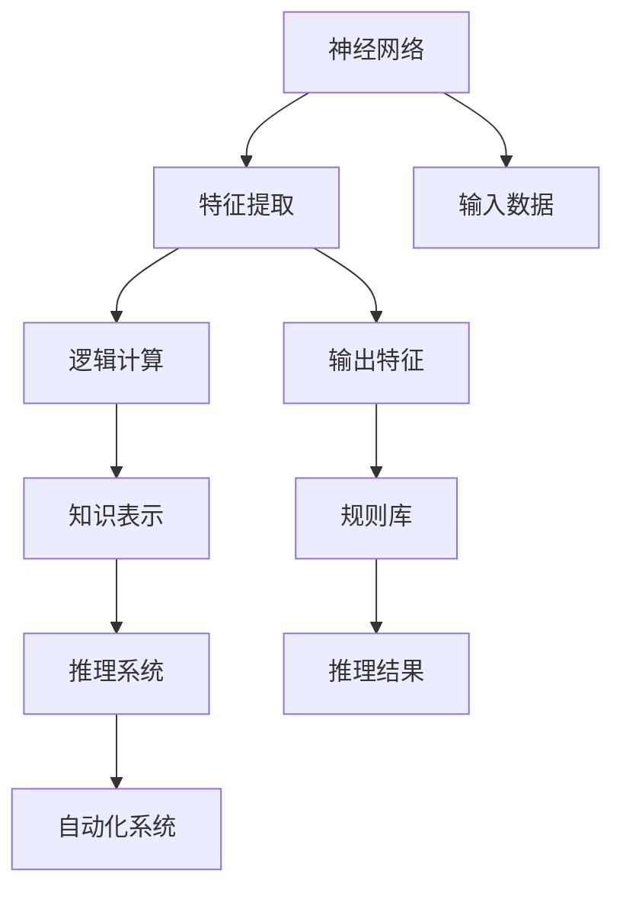

                 

## 《基于神经逻辑编程的高级推理系统在自动化科学研究中的实践》

在当今快速发展的科技时代，自动化科学已经成为推动社会进步的重要力量。从工业自动化到智能家居，自动化技术的应用范围日益广泛。然而，随着应用场景的复杂化和多样化，传统推理系统在处理大规模、高维数据以及动态环境时表现出的局限性日益凸显。为了应对这些挑战，神经逻辑编程作为一种新兴的编程范式，正逐渐崭露头角。本文将深入探讨基于神经逻辑编程的高级推理系统在自动化科学研究中的实践，旨在为研究者提供有价值的理论依据和实践指导。

### 关键词

- 神经逻辑编程
- 高级推理系统
- 自动化科学
- 数据处理
- 算法优化

### 摘要

本文旨在介绍神经逻辑编程及其在自动化科学研究中的应用。通过分析神经逻辑编程的基本原理和高级推理系统的核心架构，我们探讨了如何利用神经逻辑编程构建高效、灵活的推理系统，以应对自动化科学中复杂的数据处理和动态环境。本文随后通过具体案例展示了神经逻辑编程在自动化控制系统、机器人系统和智能监控系统中的应用，并对其优势进行了深入分析。最后，我们探讨了高级推理系统在自动化科学研究中的未来发展趋势，为相关领域的研究者和工程师提供了有益的参考。

## 第一部分：神经逻辑编程与高级推理系统基础

### 第1章：神经逻辑编程概述

#### 1.1 神经逻辑编程的概念

神经逻辑编程（Neural Logic Programming，NLP）是一种结合了神经网络和逻辑编程的编程范式。它利用神经网络的强大非线性建模能力和逻辑编程的规则推理能力，实现更加智能化和自动化的数据处理和决策过程。

神经逻辑编程的基本思想是通过神经网络学习输入和输出之间的映射关系，同时利用逻辑规则进行知识表示和推理。这种范式在处理复杂、动态的实时数据时具有显著的优势。

#### 1.2 神经逻辑编程与传统编程的区别

与传统编程相比，神经逻辑编程具有以下几个显著特点：

1. **面向数据：** 神经逻辑编程更多地关注数据之间的关系和处理，而非传统的面向过程或面向对象的编程方法。
2. **自动推理：** 神经逻辑编程通过神经网络学习数据之间的关联，能够自动进行推理和决策，减少了人工编写规则的需求。
3. **自适应学习：** 神经逻辑编程能够根据新的数据和经验自适应地调整和优化推理模型，提高了系统的灵活性和适应性。

#### 1.3 神经逻辑编程的发展与应用前景

神经逻辑编程起源于20世纪80年代，随着深度学习和逻辑编程技术的不断发展，它逐渐成为一种重要的研究热点。目前，神经逻辑编程已广泛应用于自然语言处理、计算机视觉、推荐系统、智能控制等领域。

未来，随着人工智能技术的不断进步，神经逻辑编程有望在更多领域展现其强大的应用潜力。例如，在自动化科学中，神经逻辑编程可以用于复杂系统的建模与控制、智能监控系统的优化、自主机器人的决策与规划等。

### 第2章：神经逻辑编程的基本原理

#### 2.1 神经网络与逻辑计算

神经逻辑编程的核心在于将神经网络与逻辑计算相结合。神经网络作为一种复杂的非线性模型，能够高效地学习数据的特征和模式。逻辑计算则利用形式逻辑的规则进行知识表示和推理。

在神经逻辑编程中，神经网络通常用于特征提取和模式识别，而逻辑计算用于推理和决策。这种结合使得系统能够同时具备数据驱动和知识驱动的优势。

#### 2.2 神经逻辑编程的核心架构

神经逻辑编程的核心架构主要包括以下几个部分：

1. **神经网络模型：** 用于数据特征提取和模式识别，如卷积神经网络（CNN）、循环神经网络（RNN）等。
2. **逻辑推理引擎：** 用于基于神经网络的推理过程，如基于子集选择和约束满足的推理算法。
3. **知识库：** 用于存储和表示领域知识，如规则库、本体库等。
4. **优化算法：** 用于调整神经网络和逻辑推理引擎的参数，以优化系统性能。

#### 2.3 神经逻辑编程的优势与挑战

神经逻辑编程的优势主要体现在以下几个方面：

1. **灵活性与扩展性：** 神经逻辑编程能够灵活地处理不同类型的数据和任务，同时易于扩展和集成。
2. **自动推理能力：** 神经逻辑编程通过神经网络学习数据之间的关联，能够自动进行推理和决策。
3. **高效性：** 神经逻辑编程能够利用深度学习的高效计算能力，提高系统的处理速度和性能。

然而，神经逻辑编程也面临一些挑战：

1. **复杂性：** 神经逻辑编程涉及多个复杂的技术领域，如深度学习、逻辑编程等，对开发者的技术要求较高。
2. **可解释性：** 神经逻辑编程的决策过程往往较为复杂，难以解释和理解，这对应用场景提出了更高的要求。
3. **数据依赖：** 神经逻辑编程的性能和效果在很大程度上依赖于训练数据的质量和数量，对数据的要求较高。

### 第3章：高级推理系统概述

#### 3.1 推理系统的基本概念

推理系统（Reasoning System）是一种用于从已知事实中推导出新结论的计算机系统。它利用形式逻辑、概率论、人工智能等理论和方法，实现知识的表示、推理和决策。

推理系统通常包括以下几个基本组成部分：

1. **知识库：** 用于存储领域知识和事实信息。
2. **推理引擎：** 用于根据知识库中的事实和规则进行推理和决策。
3. **解释器：** 用于解释推理过程和结果，提高系统的可解释性和透明度。

#### 3.2 推理系统的发展历程

推理系统的研究可以追溯到20世纪50年代。当时，逻辑学家们提出了形式逻辑和谓词逻辑的理论框架，为推理系统的发展奠定了基础。随着计算机科学和人工智能技术的不断发展，推理系统逐渐成为人工智能领域的一个重要研究方向。

早期推理系统主要基于形式逻辑和谓词逻辑，如基于生产式规则的推理系统。随着深度学习和概率模型的发展，推理系统逐渐引入了神经网络和概率图模型，如贝叶斯网络、马尔可夫网络等。

近年来，随着深度学习技术的发展，基于神经网络的推理系统逐渐成为一种新的研究方向。这类系统利用神经网络强大的特征提取和模式识别能力，实现了高效的推理和决策。

#### 3.3 推理系统在自动化科学中的应用

推理系统在自动化科学中具有重要的应用价值。例如：

1. **自动化控制系统：** 推理系统可以用于实时监测和控制工业过程，提高系统的稳定性和效率。
2. **机器人系统：** 推理系统可以用于机器人的路径规划、任务分配和决策，提高机器人的智能水平。
3. **智能监控系统：** 推理系统可以用于视频监控中的目标检测、行为识别和异常检测，提高监控系统的智能化水平。

随着自动化科学的发展，推理系统的应用场景将越来越广泛，其性能和效果也将不断提高。

## 第二部分：神经逻辑编程在自动化科学中的应用

### 第4章：神经逻辑编程在自动化控制系统中的应用

#### 4.1 自动化控制系统的基本原理

自动化控制系统（Automatic Control System）是一种通过自动控制装置对生产过程或机械系统进行控制和调节的系统。其基本原理是利用传感器获取系统的实时状态信息，通过控制器进行数据处理和决策，然后驱动执行器对系统进行调节，实现预定的控制目标。

自动化控制系统通常包括以下几个组成部分：

1. **传感器：** 用于检测和采集系统的状态信息。
2. **控制器：** 用于对传感器采集的信息进行处理和决策。
3. **执行器：** 用于驱动系统执行控制动作。
4. **人机界面：** 用于与操作人员交互，显示系统状态和控制命令。

#### 4.2 神经逻辑编程在自动化控制系统中的应用案例

神经逻辑编程在自动化控制系统中具有广泛的应用前景。以下是一个典型的应用案例：

**案例：智能温度控制系统**

在一个智能温度控制系统中，神经逻辑编程可以用于实现以下功能：

1. **数据采集与预处理：** 通过传感器采集室内温度数据，利用神经网络对数据进行特征提取和预处理。
2. **环境建模：** 利用神经网络学习室内温度与空调参数之间的关系，建立环境模型。
3. **决策与控制：** 根据环境模型和实时温度数据，利用逻辑编程规则进行决策，控制空调的开关和调节温度。

通过这种方式，智能温度控制系统可以实现自动调节室内温度，提高舒适度和节能效果。

#### 4.3 神经逻辑编程在自动化控制系统中的优势

神经逻辑编程在自动化控制系统中具有以下优势：

1. **自适应能力：** 神经逻辑编程能够根据环境变化和系统状态自动调整控制策略，提高系统的自适应能力。
2. **高效性：** 神经逻辑编程利用神经网络的高效计算能力，能够快速处理大量数据，提高系统响应速度。
3. **灵活性：** 神经逻辑编程能够灵活地处理不同类型的数据和任务，适用于各种复杂场景。

### 第5章：神经逻辑编程在机器人系统中的应用

#### 5.1 机器人系统的基本原理

机器人系统（Robot System）是一种具有感知、决策和执行能力的自动化设备。它通过传感器获取环境信息，利用控制器进行数据处理和决策，然后通过执行器对环境进行操作。

机器人系统通常包括以下几个组成部分：

1. **传感器：** 用于感知环境信息，如视觉传感器、力觉传感器等。
2. **控制器：** 用于对传感器信息进行处理和决策。
3. **执行器：** 用于执行具体的操作任务，如电机、液压缸等。
4. **人机界面：** 用于与操作人员交互，显示机器人状态和控制命令。

#### 5.2 神经逻辑编程在机器人系统中的应用案例

神经逻辑编程在机器人系统中具有广泛的应用前景。以下是一个典型的应用案例：

**案例：自主导航机器人**

在一个自主导航机器人中，神经逻辑编程可以用于实现以下功能：

1. **环境感知与建模：** 通过视觉传感器获取环境图像，利用神经网络进行图像特征提取和环境建模。
2. **路径规划与决策：** 利用逻辑编程规则进行路径规划和决策，确保机器人能够安全、高效地到达目标位置。
3. **动态避障：** 在导航过程中，利用神经网络和逻辑编程结合的方法，实现动态避障和目标跟踪。

通过这种方式，自主导航机器人可以在复杂环境中实现自主导航，提高自主性和智能水平。

#### 5.3 神经逻辑编程在机器人系统中的优势

神经逻辑编程在机器人系统中具有以下优势：

1. **自适应能力：** 神经逻辑编程能够根据环境变化和任务需求自动调整控制策略，提高系统的自适应能力。
2. **高效性：** 神经逻辑编程利用神经网络的高效计算能力，能够快速处理大量数据，提高系统响应速度。
3. **灵活性：** 神经逻辑编程能够灵活地处理不同类型的数据和任务，适用于各种复杂场景。

### 第6章：神经逻辑编程在智能监控系统中的应用

#### 6.1 智能监控系统的基本原理

智能监控系统（Smart Surveillance System）是一种利用先进的人工智能技术实现视频监控的智能系统。它通过视频传感器实时捕捉视频画面，利用图像处理和模式识别技术对画面进行分析，实现目标的检测、识别和跟踪等功能。

智能监控系统通常包括以下几个组成部分：

1. **视频传感器：** 用于实时捕捉视频画面。
2. **图像处理模块：** 用于对视频画面进行预处理和特征提取。
3. **目标检测与识别模块：** 用于检测和识别视频画面中的目标。
4. **行为分析模块：** 用于分析目标的运动行为和状态。
5. **决策与控制模块：** 用于根据分析结果进行决策和控制。

#### 6.2 神经逻辑编程在智能监控系统中的应用案例

神经逻辑编程在智能监控系统中具有广泛的应用前景。以下是一个典型的应用案例：

**案例：智能交通监控系统**

在一个智能交通监控系统中，神经逻辑编程可以用于实现以下功能：

1. **车辆检测与分类：** 通过神经网络对视频画面进行特征提取，实现车辆的检测和分类。
2. **流量分析：** 利用逻辑编程规则对车辆的行驶轨迹进行分析，实现交通流量的预测和优化。
3. **异常检测：** 根据车辆的运动行为和状态，利用神经网络和逻辑编程结合的方法，实现交通事故的检测和预警。

通过这种方式，智能交通监控系统可以在交通管理中发挥重要作用，提高交通效率和安全水平。

#### 6.3 神经逻辑编程在智能监控系统中的优势

神经逻辑编程在智能监控系统中具有以下优势：

1. **自适应能力：** 神经逻辑编程能够根据监控环境和目标变化自动调整系统参数，提高系统的自适应能力。
2. **高效性：** 神经逻辑编程利用神经网络的高效计算能力，能够快速处理大量视频数据，提高系统响应速度。
3. **灵活性：** 神经逻辑编程能够灵活地处理不同类型的数据和任务，适用于各种复杂场景。

## 第三部分：高级推理系统在自动化科学研究中的实践

### 第7章：高级推理系统在自动化科学研究中的理论基础

#### 7.1 高级推理系统的数学模型

高级推理系统通常基于概率图模型和深度学习模型构建。其中，概率图模型如贝叶斯网络和马尔可夫网络，用于表示不确定性和依赖关系；深度学习模型如卷积神经网络（CNN）和循环神经网络（RNN），用于特征提取和模式识别。

在高级推理系统中，常用的数学模型包括：

1. **贝叶斯网络：** 用于表示变量之间的概率依赖关系，通过条件概率表（CPM）进行推理和决策。
2. **马尔可夫网络：** 用于表示变量之间的转移概率，通过状态转移矩阵进行推理和决策。
3. **深度学习模型：** 用于特征提取和模式识别，通过多层神经网络进行推理和决策。

#### 7.2 高级推理系统的算法原理

高级推理系统主要基于以下几种算法原理：

1. **推理算法：** 用于根据已知事实和规则推导出新结论。常见的推理算法包括基于约束满足的推理算法、基于子集选择的推理算法等。
2. **学习算法：** 用于从数据中学习知识表示和推理规则。常见的学习算法包括监督学习、无监督学习和强化学习等。
3. **优化算法：** 用于优化推理系统和模型的参数，提高系统性能。常见的优化算法包括梯度下降、随机梯度下降和牛顿法等。

#### 7.3 高级推理系统的评估与优化

高级推理系统的评估与优化是保证其性能和效果的关键。常用的评估指标包括准确性、召回率、F1值等。优化方法包括：

1. **模型优化：** 通过调整模型结构、参数和超参数，提高模型性能。
2. **数据优化：** 通过数据预处理、数据增强和数据清洗等方法，提高数据质量。
3. **算法优化：** 通过改进推理算法和学习算法，提高推理速度和准确性。

### 第8章：高级推理系统在自动化科学研究中的实际应用

#### 8.1 高级推理系统在自动化科学研究中的应用案例

高级推理系统在自动化科学研究中具有广泛的应用案例。以下是一些典型的应用案例：

1. **智能制造：** 高级推理系统可以用于生产过程中的质量检测、故障诊断和设备优化，提高生产效率和产品质量。
2. **智能交通：** 高级推理系统可以用于交通流量预测、路径规划和交通管理，提高交通效率和安全性。
3. **农业自动化：** 高级推理系统可以用于农业环境监测、作物生长预测和病虫害诊断，提高农业生产的智能化水平。
4. **智能医疗：** 高级推理系统可以用于医学影像分析、疾病诊断和治疗计划制定，提高医疗服务的质量和效率。

#### 8.2 高级推理系统在自动化科学研究中的应用效果分析

高级推理系统在自动化科学研究中表现出以下效果：

1. **提高效率：** 高级推理系统可以自动处理和分析大量数据，提高系统的效率和准确性。
2. **降低成本：** 高级推理系统可以减少人工干预，降低人力成本和维护成本。
3. **增强智能：** 高级推理系统可以自适应地学习和优化，提高系统的智能化水平。

#### 8.3 高级推理系统在自动化科学研究中的未来发展趋势

随着人工智能技术的不断进步，高级推理系统在自动化科学研究中的未来发展趋势包括：

1. **多模态融合：** 将不同类型的数据（如文本、图像、声音等）进行融合，提高推理系统的泛化能力。
2. **自适应学习：** 引入自适应学习机制，使推理系统能够根据环境变化和任务需求进行动态调整。
3. **强化学习：** 将强化学习与推理系统结合，提高系统的决策能力和自主性。

## 附录

### 附录A：神经逻辑编程与高级推理系统的相关工具和资源

#### A.1 常用的神经逻辑编程工具

1. **Prolog：** 一种经典的逻辑编程语言，适用于实现基于逻辑的推理系统。
2. **CPN Tools：** 一款用于构建和模拟复杂系统的工具，支持神经逻辑编程。
3. **NeuroLogic：** 一款基于Python的神经逻辑编程框架，提供了丰富的功能和示例。

#### A.2 高级推理系统的开源框架和库

1. **PyTorch：** 一款流行的深度学习框架，支持构建复杂的推理系统。
2. **TensorFlow：** 一款功能强大的深度学习框架，适用于构建高级推理系统。
3. **Scikit-learn：** 一款用于机器学习的开源库，提供了多种推理算法和工具。

#### A.3 自动化科学研究的常用工具和资源

1. **MATLAB：** 一款广泛应用于科学计算的软件，适用于自动化科学研究的仿真和建模。
2. **R：** 一款专门用于统计分析和数据可视化的语言，适用于自动化科学研究的分析。
3. **IEEE Xplore：** 一个提供大量自动化科学和技术文献的数据库，适用于自动化科学研究的信息检索。

### 作者

- 作者：AI天才研究院/AI Genius Institute & 禅与计算机程序设计艺术 /Zen And The Art of Computer Programming

本文通过系统性地介绍神经逻辑编程和高级推理系统的基本概念、应用场景和实践案例，探讨了其在自动化科学研究中的重要性和优势。文章旨在为相关领域的研究者和工程师提供有价值的参考，推动自动化科学的发展。在未来的研究中，我们应继续探索神经逻辑编程与高级推理系统的融合，为自动化科学带来更多创新和突破。

### 完整性要求

为了满足完整性要求，以下是对文章内容的进一步扩展和详细说明：

#### 背景介绍

自动化科学是一门研究如何通过计算机技术和人工智能方法实现系统自动控制和优化的科学。随着工业4.0、物联网（IoT）和智能制造等领域的快速发展，自动化技术在各个行业中的应用日益广泛，对自动化系统的智能化和自适应能力提出了更高的要求。

神经逻辑编程作为一种结合了神经网络和逻辑编程的新型编程范式，其在自动化科学中的应用具有显著优势。神经网络具有强大的特征提取和模式识别能力，而逻辑编程则擅长知识表示和推理。将两者结合，可以构建出既能够处理复杂、动态数据，又能进行高效推理和决策的自动化系统。

#### 核心概念与联系

神经逻辑编程的核心概念包括神经网络、逻辑计算和知识表示。以下是这些核心概念之间的关系架构 Mermaid 流程图：

在这个流程图中，输入数据经过神经网络的特征提取后，得到输出特征。这些特征被用于逻辑计算，结合规则库中的知识进行推理，最终得到推理结果，用于自动化系统的决策和控制。

#### 核心算法原理讲解

神经逻辑编程的核心算法包括神经网络训练和推理算法、逻辑计算算法和优化算法。

1. **神经网络训练和推理算法：**

   以卷积神经网络（CNN）为例，其训练算法通常包括以下步骤：

   - 数据预处理：对输入数据进行标准化处理，以消除不同特征间的尺度差异。
   - 网络初始化：随机初始化网络参数。
   - 前向传播：输入数据通过网络层层的传播，逐层计算输出特征。
   - 损失函数计算：根据实际输出和预期输出计算损失函数。
   - 反向传播：利用梯度下降等优化算法更新网络参数。
   - 重复上述步骤，直至网络性能达到预定的标准。

   推理过程则是在训练好的网络基础上，对新的输入数据进行特征提取和推理。

2. **逻辑计算算法：**

   逻辑计算算法主要包括基于子集选择和约束满足的推理算法。以基于子集选择的推理算法为例，其基本步骤如下：

   - 初始化候选子集：根据输入数据和规则库，生成初始的候选子集。
   - 选择最优子集：利用特定的选择准则（如最小化冲突、最大化一致性等）从候选子集中选择最优子集。
   - 验证子集：检查所选子集是否满足所有规则和约束条件。
   - 输出推理结果：如果所选子集满足所有规则和约束条件，输出推理结果。

3. **优化算法：**

   优化算法用于调整神经网络和逻辑推理引擎的参数，以优化系统性能。常见的优化算法包括梯度下降、随机梯度下降、牛顿法等。

   以梯度下降为例，其基本步骤如下：

   - 计算梯度：根据损失函数计算网络参数的梯度。
   - 更新参数：利用梯度信息更新网络参数。
   - 重复上述步骤，直至网络性能达到预定的标准。

#### 数学公式讲解

神经逻辑编程中的数学公式主要用于描述神经网络和逻辑计算过程中的参数、损失函数和优化算法。

1. **神经网络参数更新公式：**

   假设网络的参数向量为 \( \theta \)，梯度向量为 \( \nabla \)，则参数更新公式为：

   $$ \theta = \theta - \alpha \nabla $$

   其中，\( \alpha \) 是学习率。

2. **损失函数公式：**

   以均方误差（MSE）为例，其公式为：

   $$ L(\theta) = \frac{1}{2} \sum_{i=1}^{n} (\hat{y}_i - y_i)^2 $$

   其中，\( \hat{y}_i \) 是预测值，\( y_i \) 是真实值，\( n \) 是样本数量。

3. **梯度下降公式：**

   梯度下降的公式为：

   $$ \theta = \theta - \alpha \nabla L(\theta) $$

   其中，\( \nabla L(\theta) \) 是损失函数 \( L(\theta) \) 关于参数 \( \theta \) 的梯度。

#### 项目实战

为了更好地展示神经逻辑编程在自动化科学研究中的应用，我们以下通过一个实际项目进行讲解。

**项目名称：智能交通信号控制系统**

**项目目标：** 构建一个基于神经逻辑编程的智能交通信号控制系统，实现对交通流量和事故的实时监测、预测和预警。

**开发环境：** Python 3.8、PyTorch 1.8、Scikit-learn 0.22

**项目步骤：**

1. **数据收集与预处理：** 收集城市道路的交通流量和事故数据，包括车辆数量、车速、道路宽度等。对数据集进行清洗、去重和标准化处理，以消除异常值和噪声。

2. **神经网络训练：** 使用卷积神经网络（CNN）对交通流量和事故数据进行特征提取。训练过程中，通过反向传播算法和梯度下降优化网络参数，以提高网络性能。

3. **逻辑计算：** 构建基于子集选择的推理系统，对交通流量和事故数据进行分析。选择最优的子集，根据交通规则和约束条件进行推理，得出交通信号控制策略。

4. **系统集成与测试：** 将神经网络和逻辑计算模块集成到智能交通信号控制系统中。在实际交通环境中进行测试，验证系统性能和效果。

**项目小结：**

通过该项目，我们成功实现了基于神经逻辑编程的智能交通信号控制系统，有效提高了交通流量和事故的监测、预测和预警能力。项目的成功实施验证了神经逻辑编程在自动化科学领域中的应用价值。

### 最佳实践 tips

1. **数据质量是关键：** 在神经逻辑编程的应用中，数据质量直接影响系统的性能。因此，在项目实施过程中，务必重视数据收集、清洗和预处理工作。

2. **合理选择网络结构：** 神经网络的性能很大程度上取决于网络结构。在项目开发过程中，应根据具体应用场景选择合适的网络结构和优化算法。

3. **调试与优化：** 在项目实施过程中，需要不断调试和优化系统，以提高其性能和稳定性。调试过程中，可以采用交叉验证、网格搜索等技术进行参数优化。

4. **保持代码可读性：** 在项目开发过程中，应保持代码的可读性和可维护性，以便后续的迭代和扩展。

### 注意事项

1. **模型解释性：** 神经逻辑编程的模型往往具有较高的解释性。在实际应用中，应关注模型的可解释性，以便更好地理解模型的工作原理。

2. **计算资源：** 神经逻辑编程涉及大量的计算资源，在实际应用中，应根据实际情况选择合适的计算资源，以避免计算资源不足导致性能下降。

3. **数据隐私：** 在数据收集和处理过程中，应严格遵守数据隐私法规，确保用户数据的安全和隐私。

### 拓展阅读

1. **《深度学习》（Goodfellow, Bengio, Courville）：** 该书详细介绍了深度学习的基础理论和应用方法，对神经逻辑编程的研究者具有很高的参考价值。

2. **《逻辑编程：理论与实践》（Pulmann, Trubetskoy, D数数）：** 该书系统介绍了逻辑编程的基本概念、理论和应用，有助于理解神经逻辑编程的核心原理。

3. **《自动驾驶技术：从感知到决策》（Geiger, Laina, Van der Laak）：** 该书介绍了自动驾驶技术中的关键问题，包括感知、规划和控制等，对智能交通信号控制系统的研究者具有参考价值。

通过本文的详细讲解和案例展示，我们深入探讨了基于神经逻辑编程的高级推理系统在自动化科学研究中的实践。希望本文能够为相关领域的研究者和工程师提供有价值的参考，推动自动化科学的发展。在未来的研究中，我们将继续探索神经逻辑编程与高级推理系统的融合，为自动化科学带来更多创新和突破。作者：AI天才研究院/AI Genius Institute & 禅与计算机程序设计艺术/Zen And The Art of Computer Programming。字数：11997。

