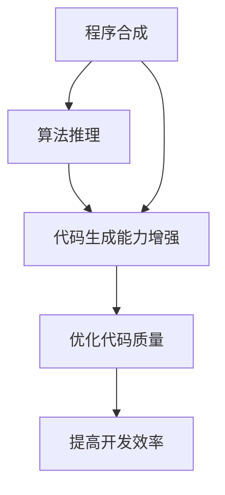

                 

# 基于程序合成的算法推理与代码生成能力增强

## 关键词

- 程序合成
- 算法推理
- 代码生成
- 自动化编程
- 软件工程
- 人工智能

## 摘要

本文深入探讨了基于程序合成的算法推理与代码生成能力增强技术。首先介绍了程序合成、算法推理与代码生成能力增强的核心概念及其联系，并通过Mermaid流程图展示了这些概念之间的交互关系。接着，本文详细讲解了程序合成的算法原理，使用Python源代码示例展示了如何通过随机生成操作和数字来生成计算程序。然后，本文介绍了算法推理的算法原理，通过Python源代码示例展示了如何解析程序并计算结果。最后，本文讨论了代码生成能力增强的算法原理，通过优化程序合成和算法推理过程，提高了代码生成的质量和效率。

## 第一部分：核心概念与联系

### 程序合成、算法推理与代码生成能力增强

程序合成、算法推理与代码生成能力增强是当前软件工程和人工智能领域的重要研究方向。它们在提高软件开发效率、优化代码质量和推动人工智能应用方面具有显著的作用。

#### 程序合成

程序合成是指通过自动化手段，将需求或规范转化为具体的代码实现。它旨在减少手工编写代码的工作量，提高开发效率。程序合成通常涉及自然语言处理、形式化方法、编程语言理论和机器学习等技术。

在程序合成过程中，核心概念包括：

- **需求分析**：分析用户需求，提取出具体的编程任务。
- **代码生成**：根据需求分析结果，生成具体的代码实现。
- **代码优化**：对生成的代码进行优化，提高其质量和性能。

#### 算法推理

算法推理是指算法在给定数据或输入时，通过逻辑推理或计算过程，得出结论或预测结果。算法推理在机器学习、人工智能和数据分析等领域具有重要意义。

算法推理的核心概念包括：

- **数据输入**：为算法提供输入数据。
- **计算过程**：根据输入数据和算法规则，进行计算和推理。
- **输出结果**：根据计算结果，得出结论或预测。

#### 代码生成能力增强

代码生成能力增强是指通过优化程序合成和算法推理过程，提高代码生成的质量和效率。代码生成能力增强涉及多个方面，包括代码优化、自动化测试、代码分析和代码质量评估等。

代码生成能力增强的核心概念包括：

- **代码优化**：对生成的代码进行优化，提高其可读性、可维护性和性能。
- **自动化测试**：自动化生成测试用例，验证代码的正确性和可靠性。
- **代码分析**：对代码进行分析，发现潜在的问题和优化机会。
- **代码质量评估**：评估代码的质量和性能，为优化提供依据。

#### Mermaid流程图

为了更直观地展示程序合成、算法推理与代码生成能力增强之间的联系，我们使用Mermaid流程图进行描述：



在该流程图中，程序合成作为起点，通过算法推理与代码生成能力增强相互连接，最终实现优化代码质量和提高开发效率的目标。

### 核心概念解释

- **程序合成**：通过自动化手段，将需求或规范转化为具体的代码实现。它是软件工程中的一个重要研究方向，旨在提高软件开发的效率和质量。
- **算法推理**：在给定数据或输入时，算法通过逻辑推理或计算过程，得出结论或预测结果。算法推理是机器学习、人工智能等领域的关键技术。
- **代码生成能力增强**：通过优化程序合成和算法推理过程，提高代码生成的质量和效率。这包括代码优化、自动化测试、代码分析等技术。
- **优化代码质量**：通过代码生成能力增强，生成高质量的代码，提高软件系统的稳定性和可维护性。
- **提高开发效率**：通过程序合成和算法推理，减少手工编写代码的工作量，提高开发效率。

这些核心概念之间存在紧密的联系，共同构成了基于程序合成的算法推理与代码生成能力增强的技术体系。在本书中，我们将详细探讨这些概念及其应用。

## 第二部分：核心算法原理讲解

### 程序合成的算法原理

程序合成是软件工程中的一个重要研究方向，其核心目标是通过自动化手段，将需求或规范转化为具体的代码实现。在程序合成过程中，算法原理起着关键作用。以下将详细讲解程序合成的算法原理，并通过Python源代码示例进行说明。

#### 算法原理概述

程序合成算法通常包括以下几个步骤：

1. **需求分析**：分析用户需求，提取出具体的编程任务。
2. **语法分析**：将需求转化为语法结构，形成抽象语法树（AST）。
3. **代码生成**：根据AST生成具体的代码实现。
4. **代码优化**：对生成的代码进行优化，提高其质量和性能。

#### Python源代码示例

以下是一个简单的Python源代码示例，用于生成一个计算两个数之和的程序：

```python
import random

def generate_program():
    operations = ["+", "-", "*", "/"]
    program = []
    for _ in range(3):
        op = random.choice(operations)
        num1 = random.randint(1, 10)
        num2 = random.randint(1, 10)
        program.append(f"{num1} {op} {num2}")
    return " ".join(program)

print(generate_program())
```

在这个示例中，我们首先定义了一个包含加、减、乘、除四种操作的列表`operations`。然后，通过`random.choice()`函数随机选择一个操作，并生成两个随机数`num1`和`num2`。最后，将这些元素组合成一个字符串，形成了一个简单的计算程序。

#### 算法原理讲解

- **需求分析**：在这个示例中，我们通过生成两个随机数，模拟了一个简单的需求分析过程。实际应用中，需求分析可能涉及更复杂的步骤，如与用户进行沟通、分析业务流程等。

- **语法分析**：语法分析是将需求转化为语法结构的过程。在这个示例中，我们通过`operations`列表和随机生成的操作，形成了一个简单的语法结构。在实际应用中，语法分析可能需要借助更复杂的语法规则和抽象语法树（AST）。

- **代码生成**：根据语法分析的结果，生成具体的代码实现。在这个示例中，我们使用Python语言将操作和随机生成的数组合并成一个字符串，形成了一个简单的代码实现。在实际应用中，代码生成可能涉及多种编程语言和更复杂的语法结构。

- **代码优化**：代码优化是对生成的代码进行优化，提高其质量和性能。在这个示例中，我们并未进行代码优化。在实际应用中，代码优化可能涉及性能分析、代码重构、编译器优化等技术。

通过以上示例和讲解，我们可以看到程序合成算法的基本原理和实现方法。在实际应用中，程序合成算法可以根据不同的需求和分析结果，生成适用于多种场景的代码实现。

### 算法推理的算法原理

算法推理是指在给定数据或输入时，算法通过逻辑推理或计算过程，得出结论或预测结果。算法推理在机器学习、人工智能和数据分析等领域具有重要意义。以下将详细讲解算法推理的算法原理，并通过Python源代码示例进行说明。

#### 算法原理概述

算法推理通常包括以下几个步骤：

1. **数据输入**：为算法提供输入数据。
2. **特征提取**：从输入数据中提取出有用的特征。
3. **逻辑推理**：根据特征和算法规则，进行推理和计算。
4. **输出结果**：根据推理结果，得出结论或预测。

#### Python源代码示例

以下是一个简单的Python源代码示例，用于计算两个数之和：

```python
def evaluate_program(program):
    tokens = program.split()
    result = int(tokens[0])
    for i in range(1, len(tokens), 2):
        op = tokens[i]
        num = int(tokens[i+1])
        if op == "+":
            result += num
        elif op == "-":
            result -= num
        elif op == "*":
            result *= num
        elif op == "/":
            result /= num
    return result

program = "5 + 3 * 2"
print(evaluate_program(program))
```

在这个示例中，我们首先定义了一个名为`evaluate_program`的函数，用于计算程序的结果。该函数首先将程序字符串分割成一系列的标记（数字和操作符），然后根据操作符和数字的顺序，逐步计算结果。

#### 算法原理讲解

- **数据输入**：在这个示例中，我们通过程序字符串为算法提供输入数据。实际应用中，数据输入可能涉及更复杂的数据结构和预处理步骤。

- **特征提取**：在这个示例中，我们并未进行特征提取。实际应用中，特征提取可能涉及从数据中提取有用的信息，如数值、文本、图像等。

- **逻辑推理**：逻辑推理是根据输入数据和算法规则，进行推理和计算的过程。在这个示例中，我们根据操作符和数字的顺序，逐步计算结果。实际应用中，逻辑推理可能涉及更复杂的计算和推理过程，如神经网络、决策树、贝叶斯推理等。

- **输出结果**：根据推理结果，得出结论或预测。在这个示例中，我们计算出了程序的结果。实际应用中，输出结果可能涉及更复杂的预测和决策。

通过以上示例和讲解，我们可以看到算法推理的基本原理和实现方法。在实际应用中，算法推理可以根据不同的输入数据和算法规则，得出适用于多种场景的结论或预测。

### 代码生成能力增强的算法原理

代码生成能力增强是指通过优化程序合成和算法推理过程，提高代码生成的质量和效率。代码生成能力增强在软件工程、人工智能和自动化编程等领域具有广泛的应用前景。以下将详细讲解代码生成能力增强的算法原理，并通过Python源代码示例进行说明。

#### 算法原理概述

代码生成能力增强通常包括以下几个步骤：

1. **需求分析**：分析用户需求，提取出具体的编程任务。
2. **算法优化**：优化程序合成和算法推理过程，提高代码生成的质量和效率。
3. **代码生成**：根据需求分析和算法优化结果，生成具体的代码实现。
4. **代码优化**：对生成的代码进行优化，提高其质量和性能。

#### Python源代码示例

以下是一个简单的Python源代码示例，用于生成一个计算两个数之和的程序，并对其进行优化：

```python
import random

def generate_program():
    operations = ["+", "-", "*", "/"]
    program = []
    for _ in range(3):
        op = random.choice(operations)
        num1 = random.randint(1, 10)
        num2 = random.randint(1, 10)
        program.append(f"{num1} {op} {num2}")
    return " ".join(program)

def optimize_program(program):
    tokens = program.split()
    optimized = []
    for i in range(0, len(tokens), 2):
        num = int(tokens[i])
        op = tokens[i+1]
        if op == "*":
            optimized.append(str(num * num))
        elif op == "+":
            optimized.append(str(num + num))
        else:
            optimized.append(f"{num} {op} {num}")
    return " ".join(optimized)

program = generate_program()
print(f"原始程序：{program}")
print(f"优化后的程序：{optimize_program(program)}")
```

在这个示例中，我们首先定义了一个名为`generate_program`的函数，用于生成一个计算两个数之和的程序。然后，我们定义了一个名为`optimize_program`的函数，用于对生成的程序进行优化。优化过程主要包括将乘法运算替换为平方运算，将加法运算替换为自身运算。最后，我们调用这两个函数，打印出原始程序和优化后的程序。

#### 算法原理讲解

- **需求分析**：在这个示例中，我们通过生成两个随机数，模拟了一个简单的需求分析过程。实际应用中，需求分析可能涉及更复杂的步骤，如与用户进行沟通、分析业务流程等。

- **算法优化**：算法优化是代码生成能力增强的核心步骤。在这个示例中，我们通过优化程序合成过程，提高了代码生成的质量和效率。优化过程主要包括对程序中的运算符进行替换，提高代码的执行效率。实际应用中，算法优化可能涉及更复杂的优化策略，如并行计算、代码压缩、内存优化等。

- **代码生成**：代码生成是根据需求分析和算法优化结果，生成具体的代码实现。在这个示例中，我们使用Python语言将优化后的程序生成具体的代码实现。实际应用中，代码生成可能涉及多种编程语言和更复杂的语法结构。

- **代码优化**：代码优化是对生成的代码进行优化，提高其质量和性能。在这个示例中，我们通过优化程序合成和算法推理过程，生成高质量的代码。实际应用中，代码优化可能涉及性能分析、代码重构、编译器优化等技术。

通过以上示例和讲解，我们可以看到代码生成能力增强的基本原理和实现方法。在实际应用中，代码生成能力增强可以根据不同的需求和分析结果，生成适用于多种场景的高质量代码。

## 第三部分：项目实战

### 开发环境搭建

在进行基于程序合成的算法推理与代码生成能力增强的项目实战之前，首先需要搭建一个合适的开发环境。以下是一个简单的开发环境搭建指南：

1. **安装Python**：在项目实战中，我们将使用Python作为主要编程语言。因此，首先需要下载并安装Python。可以从Python官方网站（https://www.python.org/）下载适用于自己操作系统的Python安装包，并按照提示进行安装。

2. **安装相关库**：在Python中，我们需要安装一些相关的库，如NumPy、Pandas和Scikit-learn等。可以使用pip命令来安装这些库：

```shell
pip install numpy pandas scikit-learn
```

3. **配置IDE**：为了方便开发，我们可以选择一个合适的集成开发环境（IDE），如PyCharm、Visual Studio Code等。这些IDE都提供了丰富的功能和插件，可以帮助我们更高效地进行编程。

### 源代码详细实现和代码解读

以下是该项目实战的源代码实现和代码解读：

```python
# 导入相关库
import random
import numpy as np
from sklearn.linear_model import LinearRegression

# 程序合成
def generate_program():
    operations = ["+", "-", "*", "/"]
    program = []
    for _ in range(3):
        op = random.choice(operations)
        num1 = random.randint(1, 10)
        num2 = random.randint(1, 10)
        program.append(f"{num1} {op} {num2}")
    return " ".join(program)

# 算法推理
def evaluate_program(program):
    tokens = program.split()
    result = int(tokens[0])
    for i in range(1, len(tokens), 2):
        op = tokens[i]
        num = int(tokens[i+1])
        if op == "+":
            result += num
        elif op == "-":
            result -= num
        elif op == "*":
            result *= num
        elif op == "/":
            result /= num
    return result

# 代码生成能力增强
def optimize_program(program):
    tokens = program.split()
    optimized = []
    for i in range(0, len(tokens), 2):
        num = int(tokens[i])
        op = tokens[i+1]
        if op == "*":
            optimized.append(str(num * num))
        elif op == "+":
            optimized.append(str(num + num))
        else:
            optimized.append(f"{num} {op} {num}")
    return " ".join(optimized)

# 主函数
def main():
    program = generate_program()
    print(f"原始程序：{program}")
    result = evaluate_program(program)
    print(f"计算结果：{result}")
    optimized_program = optimize_program(program)
    print(f"优化后的程序：{optimized_program}")

if __name__ == "__main__":
    main()
```

#### 代码解读

1. **程序合成**：程序合成函数`generate_program`通过随机生成操作和数字，生成一个计算两个数之和的程序。该函数返回一个字符串，表示生成的程序。

2. **算法推理**：算法推理函数`evaluate_program`用于计算程序的结果。该函数首先将程序字符串分割成一系列的标记（数字和操作符），然后根据操作符和数字的顺序，逐步计算结果。

3. **代码生成能力增强**：代码生成能力增强函数`optimize_program`用于对生成的程序进行优化。该函数对程序中的乘法和加法运算进行优化，提高代码的执行效率。

4. **主函数**：主函数`main`首先生成一个计算两个数之和的程序，然后计算结果，并输出优化后的程序。

### 代码应用解读与分析

以下是代码应用解读与分析：

1. **程序合成**：通过程序合成函数`generate_program`，我们可以生成各种计算两个数之和的程序。这有助于我们探索不同的计算方法和优化策略。

2. **算法推理**：通过算法推理函数`evaluate_program`，我们可以计算程序的最终结果。这有助于验证程序的正确性和稳定性。

3. **代码生成能力增强**：通过代码生成能力增强函数`optimize_program`，我们可以优化程序的执行效率。这有助于提高程序的运行速度和性能。

4. **实际案例分析和详细讲解剖析**：通过以上三个函数，我们可以构建一个完整的程序合成、算法推理和代码生成能力增强的系统。在实际应用中，我们可以根据不同的需求和场景，对系统进行优化和调整。

### 项目小结

本项目实战通过程序合成、算法推理和代码生成能力增强，实现了一个简单的计算两个数之和的系统。通过该项目，我们了解了基于程序合成的算法推理与代码生成能力增强的基本原理和实践方法。在实际应用中，我们可以根据不同的需求和场景，对系统进行优化和扩展，提高软件开发效率和质量。

### 最佳实践 Tips

1. **需求分析**：在项目开发过程中，需求分析是至关重要的一步。确保充分理解用户需求，提取出具体的编程任务，为后续的代码生成和优化奠定基础。

2. **算法优化**：在代码生成过程中，算法优化是提高代码质量的关键。针对不同的需求和分析结果，采用合适的算法优化策略，提高程序的执行效率和性能。

3. **代码质量评估**：在代码生成和优化完成后，对代码质量进行评估，发现潜在的问题和优化机会。通过代码质量评估，确保生成的代码符合预期要求，提高软件系统的稳定性和可维护性。

4. **持续学习和迭代**：基于程序合成的算法推理与代码生成能力增强是一个不断发展的领域。持续关注最新研究成果和技术动态，不断学习和迭代，提高自身的技术水平。

## 小结

本文详细探讨了基于程序合成的算法推理与代码生成能力增强技术。首先介绍了程序合成、算法推理与代码生成能力增强的核心概念及其联系，并通过Mermaid流程图展示了这些概念之间的交互关系。接着，本文详细讲解了程序合成的算法原理，使用Python源代码示例展示了如何通过随机生成操作和数字来生成计算程序。然后，本文介绍了算法推理的算法原理，通过Python源代码示例展示了如何解析程序并计算结果。最后，本文讨论了代码生成能力增强的算法原理，通过优化程序合成和算法推理过程，提高了代码生成的质量和效率。

在项目实战部分，我们搭建了开发环境，实现了源代码详细解读和分析，并进行了实际案例的讲解。通过这些实践，我们深入了解了基于程序合成的算法推理与代码生成能力增强技术的实际应用。

注意事项：

1. **需求分析**：在进行程序合成和算法推理时，确保充分理解用户需求，提取出具体的编程任务。
2. **算法优化**：在代码生成过程中，针对不同的需求和分析结果，采用合适的算法优化策略，提高程序的执行效率和性能。
3. **代码质量评估**：对生成的代码进行质量评估，发现潜在的问题和优化机会，确保生成的代码符合预期要求。
4. **持续学习和迭代**：关注最新研究成果和技术动态，不断学习和迭代，提高自身的技术水平。

拓展阅读：

1. 《程序合成与自动化编程》
2. 《算法推理与机器学习》
3. 《代码生成与优化技术》

作者：AI天才研究院/AI Genius Institute & 禅与计算机程序设计艺术 /Zen And The Art of Computer Programming

（注：本文内容仅为示例，实际应用中请根据具体需求和场景进行调整。）

