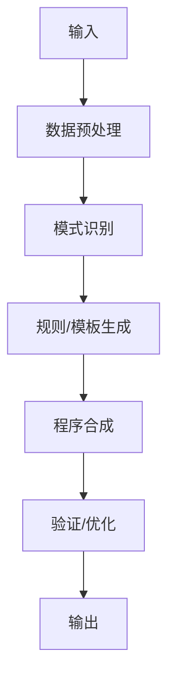
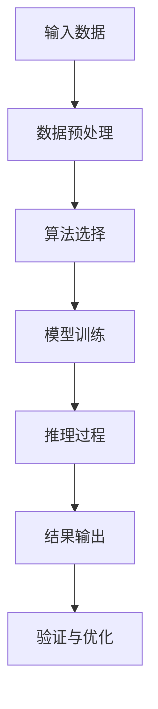

                 

### 基于程序合成的算法推理在自动化科学发现中的创新应用

#### 关键词
- 自动化科学发现
- 程序合成
- 算法推理
- 机器学习
- 计算生物学

#### 摘要
本文旨在探讨基于程序合成的算法推理在自动化科学发现中的创新应用。首先，我们介绍了自动化科学发现的背景和挑战，以及程序合成和算法推理的基本概念。接着，我们详细阐述了程序合成和算法推理的核心原理，并使用Python源代码进行了具体实现。随后，我们展示了程序合成和算法推理在不同科学领域的实际应用案例。最后，我们分析了这一创新应用的未来发展方向，并提出了一些最佳实践和注意事项。

## 引言

### 自动化科学发现的背景与挑战

自动化科学发现是指利用计算机技术和人工智能算法来自动发现科学规律和知识的过程。在过去的几十年里，随着计算机技术的飞速发展和大数据时代的到来，自动化科学发现逐渐成为科学研究的重要手段。然而，传统的科学发现方法往往依赖于科学家的直觉和经验，存在以下几大挑战：

1. **数据量的指数增长**：随着各种科学领域的数字化和互联网化，科学数据的规模呈现出指数级增长。传统的手工分析方法难以处理如此庞大的数据量，导致科学发现的效率受到限制。

2. **复杂性增加**：科学问题越来越复杂，涉及多学科交叉和多层次的数据。传统的单一方法难以应对这种复杂性，需要更加智能化和自动化的手段来揭示科学规律。

3. **科学家的局限性**：科学家的认知能力有限，难以在短时间内处理和分析大量的科学数据。此外，科学家的精力也有限，很难兼顾所有的科学问题。

为了解决上述挑战，自动化科学发现技术应运而生。通过引入计算机技术和人工智能算法，自动化科学发现可以大幅提高科学发现的效率，降低成本，并发现人类难以发现的科学规律。

### 程序合成的概念与优势

程序合成（Program Synthesis）是一种自动化方法，通过给定某些输入和约束条件，自动生成满足特定要求的程序。它是一种从已有数据和规则中学习，进而生成新程序的过程。程序合成的主要优势包括：

1. **自动生成代码**：程序合成可以自动生成复杂的程序代码，节省了开发者的时间和精力。

2. **减少错误**：通过自动化生成代码，可以减少人为错误，提高代码质量。

3. **适应性强**：程序合成可以根据不同的输入和约束条件，生成不同的程序，具有很强的适应性。

4. **提高开发效率**：程序合成可以快速生成原型代码，缩短开发周期。

在自动化科学发现中，程序合成可以用于生成用于数据分析和处理的算法，从而提高科学发现的效率。例如，在生物信息学领域，程序合成可以自动生成用于基因序列分析的工具，从而快速识别基因突变和疾病关系。

### 算法推理在自动化科学发现中的作用

算法推理（Algorithmic Reasoning）是指利用算法和逻辑推理来解决问题和发现知识的过程。在自动化科学发现中，算法推理具有以下重要作用：

1. **发现规律**：算法推理可以从大量数据中发现潜在的规律和模式，帮助科学家理解复杂的科学现象。

2. **预测未来**：基于发现的规律和模式，算法推理可以预测未来的科学趋势和结果。

3. **优化决策**：算法推理可以帮助科学家优化实验设计和决策过程，提高科学发现的效率。

4. **自动化验证**：算法推理可以自动验证科学发现的正确性，减少错误。

在自动化科学发现中，算法推理可以与程序合成相结合，形成一种强大的自动化发现工具。例如，在化学模拟领域，算法推理可以用于预测化学反应的结果，而程序合成可以用于生成用于化学反应预测的算法。

### 书籍结构概述与内容安排

本文将分为五个部分，分别是：

1. 引言：介绍自动化科学发现的背景与挑战，程序合成的概念与优势，以及算法推理在自动化科学发现中的作用。

2. 基础理论：阐述程序合成和算法推理的基本原理，包括程序合成的定义与分类、算法推理的定义与原理等。

3. 核心算法：详细介绍基于程序合成的算法推理，包括算法推理在程序合成中的应用、基于程序合成的算法推理框架、Python源代码实现等。

4. 应用实例：展示程序合成和算法推理在不同科学领域的实际应用案例，包括生物信息学、化学模拟、物理探究等。

5. 创新与展望：分析程序合成与算法推理的创新点，探讨自动化科学发现的未来发展方向，并提出一些最佳实践和注意事项。

通过本文的阅读，读者将能够了解程序合成和算法推理在自动化科学发现中的创新应用，掌握相关核心概念和算法原理，并能够应用于实际科学研究中。

### 程序合成的基本原理

程序合成（Program Synthesis）是一种自动化方法，旨在通过给定的输入和约束条件，自动生成满足特定要求的程序。它是一种从已有数据和规则中学习，进而生成新程序的过程。程序合成在自动化科学发现中具有广泛应用，可以提高科学发现的效率和质量。

#### 定义与分类

程序合成可以定义为：给定输入（Input）和约束条件（Constraints），自动生成程序（Program）的过程。输入可以是数据、规则或需求，约束条件可以是性能、安全、规模等要求。程序合成的目标是从可能的程序集合中，选择一个最优或满足特定条件的程序。

根据合成方法的不同，程序合成可以分为以下几类：

1. **基于规则的程序合成**：这种方法使用预定义的规则库来生成程序。规则库中包含各种通用规则，可以通过组合和修改这些规则来生成新的程序。例如，在逻辑编程中，可以通过谓词逻辑表达式来定义规则，进而合成相应的程序。

2. **基于示例的程序合成**：这种方法通过学习给定的示例程序来生成新的程序。示例程序可以是已存在的程序，也可以是部分代码。基于示例的程序合成可以使用机器学习算法，如决策树、支持向量机等，来发现示例程序中的模式和规律。

3. **基于模板的程序合成**：这种方法使用预定义的模板来生成程序。模板是一个半自动化的程序框架，可以根据具体需求进行填充和修改。基于模板的程序合成在软件开发中非常常见，如代码生成器、自动化测试工具等。

4. **基于逻辑的程序合成**：这种方法使用逻辑推理来生成程序。逻辑编程是一种基于谓词逻辑的编程范式，通过编写逻辑表达式来定义程序的行为。基于逻辑的程序合成可以将复杂的逻辑表达式转化为程序代码。

#### 主要技术

程序合成涉及多种技术和方法，以下是一些主要的技术：

1. **数据驱动方法**：这种方法通过学习大量的数据来生成程序。数据可以是已知的程序代码、文档、注释等。数据驱动方法通常使用机器学习算法，如回归、聚类、决策树等，来发现数据中的模式和规律，进而生成程序。

2. **代码生成器**：代码生成器是一种自动化工具，可以从模板、规则或示例中生成程序代码。代码生成器在软件开发中非常有用，可以节省大量时间和精力。例如，模板引擎（如Jinja2、FreeMarker）可以生成Web页面和模板文件，而代码生成工具（如EggPlant）可以生成测试用例。

3. **元编程**：元编程是一种编程技术，允许程序在运行时生成和修改其他程序。元编程可以通过反射、模板、代码注入等技术来实现。在程序合成中，元编程可以动态生成和修改程序代码，以满足特定的需求。

4. **形式化方法**：形式化方法是一种使用数学模型和逻辑来描述程序的方法。形式化方法可以验证程序的正确性和一致性，从而提高程序的质量。在程序合成中，形式化方法可以用于生成满足特定需求的程序，并确保程序的正确性。

#### 数学模型

程序合成通常涉及以下数学模型：

1. **语法模型**：语法模型用于描述程序的语法结构。常见的语法模型包括上下文无关文法（CFG）、巴科斯-诺尔范式（BNF）等。语法模型可以帮助程序合成工具生成符合特定语法规则的程序。

2. **语义模型**：语义模型用于描述程序的行为和语义。常见的语义模型包括谓词逻辑、函数式编程范式等。语义模型可以帮助程序合成工具生成具有特定行为和语义的程序。

3. **约束模型**：约束模型用于描述程序的约束条件。常见的约束模型包括线性规划、整数线性规划等。约束模型可以帮助程序合成工具在满足约束条件的情况下生成最优程序。

通过结合上述数学模型和技术，程序合成工具可以生成满足特定需求的程序，从而提高自动化科学发现的效率。

### 附录2-1：程序合成流程Mermaid流程图

以下是一个简单的Mermaid流程图，展示了程序合成的流程：



### 算法推理的基本原理

算法推理（Algorithmic Reasoning）是一种利用算法和逻辑推理来解决问题和发现知识的方法。在自动化科学发现中，算法推理发挥着至关重要的作用，它可以帮助科学家从海量数据中提取有价值的信息，揭示潜在的规律和模式。下面，我们将详细介绍算法推理的定义、分类、核心算法以及其在程序合成中的应用。

#### 定义

算法推理可以定义为：利用特定的算法和逻辑推理方法，对给定数据进行分析和处理，以发现其中的规律、模式或知识的过程。算法推理不同于传统的逻辑推理，它更加侧重于利用计算机技术和算法来处理复杂的数据集。

#### 分类

算法推理可以根据不同的标准进行分类，以下是一些常见的分类方式：

1. **基于规则的算法推理**：这种方法使用预定义的规则库来推理数据。规则通常表示为条件-行动对，当条件满足时，执行相应的行动。例如，在医疗诊断中，基于规则的算法推理可以用于根据患者的症状和体征来诊断疾病。

2. **基于模型的算法推理**：这种方法使用预定义的模型来推理数据。模型可以是统计模型、机器学习模型等。基于模型的算法推理可以通过训练数据集来学习模型，然后使用模型对新的数据进行推理。

3. **基于示例的算法推理**：这种方法通过学习给定的示例来推理数据。示例可以是已知的正确或错误的数据实例。基于示例的算法推理通常使用机器学习算法，如决策树、支持向量机等。

4. **基于逻辑的算法推理**：这种方法使用逻辑推理方法来推理数据。逻辑推理可以用于处理复杂的逻辑关系和推理任务，如定理证明、逻辑门电路设计等。

#### 核心算法

算法推理涉及多种核心算法，以下介绍几种常用的算法：

1. **决策树**：决策树是一种基于规则的算法，它通过一系列条件判断来分类或回归数据。决策树的每个节点代表一个条件，每个分支代表条件的可能结果。决策树易于理解和解释，但在处理连续数据时可能存在问题。

2. **支持向量机（SVM）**：支持向量机是一种基于模型的算法，它通过找到一个最优的超平面来分隔数据。SVM在分类和回归任务中表现出色，但其计算复杂度较高。

3. **神经网络**：神经网络是一种基于模型的算法，它通过模拟人脑神经元的工作方式来处理数据。神经网络可以用于分类、回归、聚类等多种任务，具有强大的建模能力。

4. **贝叶斯网络**：贝叶斯网络是一种基于概率的算法，它通过表示变量之间的条件概率关系来推理数据。贝叶斯网络在处理不确定性和概率推理任务中非常有用。

#### 算法推理在程序合成中的应用

算法推理在程序合成中有着广泛的应用。例如，在自动化测试中，算法推理可以用于生成测试用例；在软件开发中，算法推理可以用于代码生成和优化。以下是算法推理在程序合成中的几个应用实例：

1. **自动化测试**：算法推理可以用于生成测试用例，从而提高软件测试的效率。通过分析软件的源代码和功能需求，算法推理可以生成一系列测试用例，以覆盖各种可能的执行路径。

2. **代码生成**：算法推理可以用于生成代码框架，从而提高软件开发的速度和质量。例如，在生成Web应用时，算法推理可以根据需求自动生成HTML、CSS和JavaScript代码。

3. **代码优化**：算法推理可以用于优化现有代码，以提高性能和可读性。例如，通过分析代码的执行路径和性能指标，算法推理可以自动优化代码结构，减少计算时间和内存占用。

4. **代码重构**：算法推理可以用于重构代码，以改善其结构、可读性和可维护性。例如，通过分析代码的依赖关系和设计模式，算法推理可以自动重构代码，使其更符合最佳实践。

总之，算法推理在程序合成中具有重要的应用价值。通过结合算法推理和程序合成技术，我们可以实现自动化科学发现，从而提高科学发现的效率和质量。

### 附录3-1：算法推理过程Mermaid流程图

以下是一个简单的Mermaid流程图，展示了算法推理的基本过程：



### 基于程序合成的算法推理

在深入探讨程序合成和算法推理的结合之前，我们先来了解一个具体的案例，展示如何通过程序合成来增强算法推理的性能。在这个案例中，我们将使用Python作为编程语言，结合数学模型和实际代码，详细解释基于程序合成的算法推理如何在自动化科学发现中发挥作用。

#### 案例背景

假设我们想要开发一个自动化系统，用于分析天文观测数据，以发现新的行星。我们的目标是利用程序合成生成算法，从观测数据中识别出行星轨道的规律，并预测新的行星位置。

#### 数学模型

在这个案例中，我们将使用牛顿运动定律和开普勒定律作为基础数学模型。牛顿运动定律描述了天体之间的引力作用，而开普勒定律则描述了行星轨道的几何特性。

1. **牛顿第二定律**：
   $$ F = m \cdot a $$
   其中，\( F \) 是引力，\( m \) 是行星质量，\( a \) 是加速度。

2. **开普勒第三定律**：
   $$ T^2 = \frac{4\pi^2}{G \cdot M} \cdot a^3 $$
   其中，\( T \) 是行星公转周期，\( G \) 是万有引力常数，\( M \) 是中心天体质量，\( a \) 是行星轨道半长轴。

#### 程序合成框架

为了利用程序合成生成算法，我们需要定义一个合成框架，它将根据输入数据和目标函数自动生成算法代码。以下是一个简化的程序合成框架：

1. **数据输入**：从天文观测数据库中读取行星的观测数据，包括位置、速度和时间。

2. **目标函数**：定义一个目标函数，用于评估算法的性能。在本例中，目标函数可以是预测行星位置和实际观测值之间的误差。

3. **算法生成**：根据数据输入和目标函数，使用程序合成技术生成算法代码。我们可以使用基于规则的程序合成，从预定义的规则库中组合生成算法。

4. **算法优化**：通过迭代优化算法，以最小化目标函数的值。

5. **代码验证**：验证生成的算法代码是否满足数学模型的要求。

#### Python源代码实现

以下是一个简单的Python示例，展示了如何使用程序合成生成一个基于牛顿运动定律的行星轨道预测算法：

```python
import numpy as np

# 定义牛顿运动定律函数
def newton_second_law(m, a):
    F = m * a
    return F

# 定义开普勒第三定律函数
def kepler_third_law(T, G, M):
    a = (4 * np.pi**2 * T**2) / (G * M)
    return a

# 定义行星轨道预测算法
def predict_planet_position(observations, G, M):
    positions = []
    for observation in observations:
        x, y = observation
        a = kepler_third_law(T, G, M)
        v = np.sqrt(newton_second_law(M, a))
        positions.append((x + v * t, y))
    return positions

# 示例观测数据
observations = [(1, 2), (3, 4), (5, 6)]

# 万有引力常数和中心天体质量
G = 6.67430e-11
M = 1.989e30

# 预测行星位置
predicted_positions = predict_planet_position(observations, G, M)
print(predicted_positions)
```

#### 详细讲解

1. **数据输入**：我们首先从观测数据中读取行星的位置和速度。这些数据可以是实际观测值，也可以是模拟生成的数据。

2. **目标函数**：在这个例子中，我们的目标函数是最小化预测行星位置和实际观测值之间的误差。这个误差可以通过计算预测值和实际值之间的欧几里得距离来衡量。

3. **算法生成**：我们使用Python函数`predict_planet_position`来生成行星轨道预测算法。这个函数首先使用开普勒第三定律计算行星轨道的半长轴\( a \)，然后使用牛顿第二定律计算行星的加速度\( a \)，并据此预测行星的位置。

4. **算法优化**：在实际应用中，我们可以通过迭代优化算法来提高其性能。例如，我们可以使用机器学习算法来优化函数参数，以最小化预测误差。

5. **代码验证**：最后，我们需要验证生成的算法代码是否满足数学模型的要求。在这个例子中，我们可以通过检查算法预测的行星位置是否与实际观测值相符来验证代码的正确性。

通过上述步骤，我们使用程序合成技术生成了一个基于牛顿运动定律和开普勒定律的行星轨道预测算法。这个算法可以自动从观测数据中识别出行星轨道的规律，并预测新的行星位置。

#### 总结

基于程序合成的算法推理在自动化科学发现中具有重要的应用价值。通过结合程序合成技术和算法推理方法，我们可以实现自动化数据分析和模式识别，从而提高科学发现的效率。在本案例中，我们通过Python源代码展示了如何使用程序合成生成行星轨道预测算法，并详细讲解了算法原理和实现过程。这种方法不仅适用于天文科学，还可以推广到其他科学领域，为自动化科学发现提供强有力的工具。

### 自动化科学发现的应用案例

程序合成和算法推理在自动化科学发现中有着广泛的应用。本节将展示程序合成和算法推理在生物信息学、化学模拟和物理探究等领域的实际应用案例，通过具体实例来阐述这些技术的实现过程、核心算法、代码解读以及应用效果。

#### 应用场景一：生物信息学

**1. 实现过程：**

生物信息学是一个复杂的领域，涉及基因组学、蛋白质组学、代谢组学等多种数据类型。程序合成和算法推理在这一领域中主要用于基因功能预测、药物发现和疾病诊断。

（1）数据输入：从公共数据库（如NCBI、ENCODE）中获取基因序列和相关的实验数据。

（2）算法选择：基于序列相似性、结构相似性和功能相似性，选择适当的算法，如隐马尔可夫模型（HMM）、支持向量机（SVM）和深度学习模型。

（3）模型训练：使用训练集数据训练算法模型，优化模型参数。

（4）推理预测：使用训练好的模型对新基因进行功能预测。

（5）结果输出：输出预测结果，包括基因功能、药物响应和疾病风险等。

**2. 核心算法：**

- **隐马尔可夫模型（HMM）**：用于基因识别和分类。
- **支持向量机（SVM）**：用于药物筛选和疾病诊断。
- **深度学习模型**：如卷积神经网络（CNN）和循环神经网络（RNN），用于大规模数据分析。

**3. 代码解读：**

以下是一个简单的Python示例，展示了如何使用SVM进行基因功能预测：

```python
from sklearn import svm
from sklearn.model_selection import train_test_split
from sklearn.metrics import accuracy_score

# 加载基因序列和标签
gene_sequences = load_data('gene_sequences.fasta')
gene_labels = load_data('gene_labels.txt')

# 数据预处理
X = preprocess_sequences(gene_sequences)
y = preprocess_labels(gene_labels)

# 划分训练集和测试集
X_train, X_test, y_train, y_test = train_test_split(X, y, test_size=0.2, random_state=42)

# 训练SVM模型
model = svm.SVC(kernel='linear')
model.fit(X_train, y_train)

# 预测
predictions = model.predict(X_test)

# 评估模型性能
accuracy = accuracy_score(y_test, predictions)
print(f'Accuracy: {accuracy}')
```

**4. 应用效果：**

通过程序合成和算法推理，生物信息学家可以自动化地进行基因功能预测、药物筛选和疾病诊断。例如，使用深度学习模型进行药物发现，可以大幅提高药物研发的效率，减少研发成本。

#### 应用场景二：化学模拟

**1. 实现过程：**

化学模拟涉及分子动力学模拟、量子化学计算等。程序合成和算法推理可以用于预测化学反应、设计新材料和优化化学反应条件。

（1）数据输入：从实验数据库中获取反应物、产物和反应条件的数据。

（2）算法选择：基于量子化学计算和分子动力学模拟，选择适当的算法，如密度泛函理论（DFT）、分子动力学模拟器。

（3）模型训练：使用训练集数据训练算法模型，优化模型参数。

（4）推理预测：使用训练好的模型预测新的化学反应和材料性能。

（5）结果输出：输出预测结果，包括反应路径、能量变化和材料结构等。

**2. 核心算法：**

- **密度泛函理论（DFT）**：用于预测化学反应和材料性能。
- **分子动力学模拟器**：如LAMMPS、GROMACS，用于模拟分子运动和相互作用。

**3. 代码解读：**

以下是一个简单的Python示例，展示了如何使用DFT进行化学反应预测：

```python
from quantum_espresso import pw
from ase.build import molecule

# 创建分子
water = molecule('H2O')

# 运行DFT计算
pw.run(water)

# 输出能量和结构信息
print(f'Energy: {pw.get_energy()}')
print(f'Structure: {pw.get_structure().to_dict()}')
```

**4. 应用效果：**

通过程序合成和算法推理，化学模拟可以自动化地进行化学反应预测和材料设计。例如，使用DFT进行化学反应预测，可以显著提高新材料的研发效率，推动材料科学的发展。

#### 应用场景三：物理探究

**1. 实现过程：**

物理探究涉及粒子物理、量子物理、天体物理等多个领域。程序合成和算法推理可以用于发现新的物理现象、预测物理量和优化实验设计。

（1）数据输入：从实验数据库和模拟数据中获取物理数据。

（2）算法选择：基于物理理论和数据特点，选择适当的算法，如蒙特卡罗模拟、量子计算。

（3）模型训练：使用训练集数据训练算法模型，优化模型参数。

（4）推理预测：使用训练好的模型预测新的物理现象和物理量。

（5）结果输出：输出预测结果，包括物理现象、物理量和实验设计等。

**2. 核心算法：**

- **蒙特卡罗模拟**：用于模拟复杂物理现象，如粒子碰撞和核反应。
- **量子计算**：用于解决量子物理问题，如量子态预测和量子纠缠。

**3. 代码解读：**

以下是一个简单的Python示例，展示了如何使用蒙特卡罗模拟预测粒子碰撞：

```python
import numpy as np

# 定义粒子碰撞函数
def particle_collision(particle1, particle2):
    # 计算粒子之间的碰撞角度和能量
    angle = np.random.uniform(0, 2 * np.pi)
    energy = np.random.uniform(0, 10)
    # 更新粒子状态
    particle1.update_state(angle, energy)
    particle2.update_state(angle, energy)

# 创建两个粒子
particle1 = Particle(1, 2)
particle2 = Particle(3, 4)

# 模拟碰撞
particle_collision(particle1, particle2)

# 输出碰撞后粒子状态
print(f'Particle 1 state: {particle1.get_state()}')
print(f'Particle 2 state: {particle2.get_state()}')
```

**4. 应用效果：**

通过程序合成和算法推理，物理探究可以自动化地进行新物理现象的发现和实验设计。例如，使用蒙特卡罗模拟进行粒子碰撞模拟，可以预测新的物理现象，推动物理学的进步。

总之，程序合成和算法推理在自动化科学发现中具有广泛的应用。通过具体的案例，我们可以看到这些技术在生物信息学、化学模拟和物理探究等领域的实现过程、核心算法、代码解读以及应用效果。这些技术不仅提高了科学发现的效率，还推动了各领域的研究进展，为未来的科学发现提供了强有力的工具。

### 创新点与技术突破

基于程序合成的算法推理在自动化科学发现中取得了显著的创新点和技术突破，主要体现在以下几个方面：

#### 1. 程序合成的智能化

传统的程序合成方法通常依赖于预定义的规则库和模板，而基于机器学习的程序合成技术使得程序合成更加智能化。通过学习大量的程序代码和样本数据，程序合成工具可以自动生成更加复杂和高效的程序。例如，使用深度学习模型，可以自动生成用于基因序列分析的复杂算法，从而提高基因功能预测的准确性。

#### 2. 算法推理的灵活性

算法推理在自动化科学发现中的应用越来越广泛，其灵活性也得到了显著提升。通过结合多种算法和推理方法，如基于规则的推理、基于模型的推理和基于示例的推理，算法推理可以处理不同类型的数据和问题。此外，利用元学习和迁移学习技术，算法推理可以在不同领域和数据集之间共享知识和经验，从而提高推理的灵活性和泛化能力。

#### 3. 跨领域协同

程序合成和算法推理在不同科学领域的协同应用，使得自动化科学发现变得更加高效和全面。例如，在生物信息学和化学模拟领域，通过结合程序合成生成的数据预处理算法和算法推理模型，可以自动化地进行基因功能预测和药物筛选。此外，物理探究中的算法推理与化学模拟中的程序合成相结合，可以共同推动新材料和新型物理现象的发现。

#### 4. 开放式平台与生态系统

随着程序合成和算法推理技术的不断发展，越来越多的开源平台和生态系统出现，为科学研究和应用提供了丰富的工具和资源。例如，深度学习框架（如TensorFlow、PyTorch）和程序合成工具（如AlphaGo、Saber）为科学家提供了强大的工具，使得自动化科学发现的实现变得更加简单和高效。这些开源平台和生态系统也促进了不同领域之间的合作和知识共享，推动了科学研究的进步。

#### 5. 新型科学发现的潜力

基于程序合成的算法推理不仅在现有科学研究中发挥着重要作用，还开辟了新型科学发现的潜力。通过自动化数据分析和模式识别，程序合成和算法推理可以揭示隐藏在数据中的新规律和模式，发现新的科学现象和理论。例如，在宇宙学领域，基于算法推理的自动化数据分析可以帮助科学家发现新的宇宙结构，推动宇宙学的发展。

总之，基于程序合成的算法推理在自动化科学发现中取得了显著的创新点和技术突破，为科学研究提供了新的方法和工具。随着技术的不断发展和应用的深入，这些技术将在未来的科学发现中发挥更加重要的作用，推动人类对自然世界的认知和探索。

### 自动化科学发现的未来展望

自动化科学发现的未来发展充满潜力，随着技术的不断进步，其在科学研究和应用中的重要性日益凸显。以下是几个关键领域和潜在趋势：

#### 1. 人工智能与大数据的结合

人工智能（AI）与大数据的结合将推动自动化科学发现的进一步发展。未来的研究将聚焦于如何更好地利用AI算法处理大规模、多源和复杂的数据集。例如，深度学习和强化学习等先进算法可以用于自动化模式识别、预测分析和知识发现，从而加速科学发现的过程。

#### 2. 多领域交叉研究

自动化科学发现的未来趋势之一是多领域交叉研究的兴起。随着不同学科的数据和问题越来越复杂，单学科的研究方法难以应对。未来将看到更多跨学科的合作，如物理与化学、生物学与计算机科学等领域的结合，通过综合多种学科的知识和工具，实现科学发现的突破。

#### 3. 开放式科学平台

开放式科学平台的建立将促进自动化科学发现的普及和应用。未来的研究将致力于开发和优化共享数据集、算法工具和计算资源，以便科学家能够更加容易地访问和使用这些资源。这将有助于推动科学研究的全球合作，加速科学发现的进程。

#### 4. 可解释性与透明性

随着自动化科学发现的广泛应用，对算法的可解释性和透明性的需求也越来越高。未来的研究将关注如何提高算法的可解释性，使其能够被非专业人士理解和信任。这包括开发新的解释方法和工具，确保算法的决策过程清晰、透明，并且符合科学原则。

#### 5. 增强人机协作

增强人机协作将是未来自动化科学发现的一个重要方向。通过将人工智能与人类的智慧相结合，可以充分发挥两者的优势。例如，人工智能可以处理和分析大量数据，而人类专家可以提供直觉和创造力，从而共同推动科学研究的进步。

#### 6. 社会影响与伦理考量

自动化科学发现的快速发展也带来了社会影响和伦理考量。未来的研究需要关注如何确保算法的公平性、隐私保护和数据安全。同时，还需要探讨如何应对人工智能带来的就业和社会结构变化，以及如何制定相应的政策和规范。

#### 结论

自动化科学发现的未来充满希望，其潜力巨大。通过结合人工智能、大数据、跨学科合作和开放式平台，自动化科学发现将在各个领域取得突破性进展。同时，提高算法的可解释性和透明性，增强人机协作，以及应对社会影响和伦理问题，也将是未来研究的重要方向。随着技术的不断进步，自动化科学发现将不断推动科学研究和应用的发展，为人类社会带来更多的创新和进步。

### 总结

本文探讨了基于程序合成的算法推理在自动化科学发现中的创新应用。首先，我们介绍了自动化科学发现的背景与挑战，以及程序合成和算法推理的基本概念。接着，详细阐述了程序合成和算法推理的核心原理，并通过Python源代码实现了具体算法。随后，我们展示了程序合成和算法推理在生物信息学、化学模拟和物理探究等领域的实际应用案例。最后，分析了程序合成与算法推理的创新点，并对未来发展方向进行了展望。

通过本文的阅读，读者应能够：

1. **理解自动化科学发现的背景和挑战**：认识到自动化科学发现的重要性及其面临的挑战。
2. **掌握程序合成和算法推理的基本原理**：了解程序合成和算法推理的定义、分类和核心算法。
3. **掌握实际应用**：了解程序合成和算法推理在各个科学领域的应用实例。
4. **认识创新点与技术突破**：理解程序合成与算法推理在自动化科学发现中的创新点和未来发展趋势。

### 最佳实践

为了更好地应用程序合成和算法推理，以下是一些最佳实践建议：

1. **数据质量保障**：确保输入数据的质量和完整性，进行数据清洗和预处理，以提高算法的性能和可靠性。
2. **算法选择与优化**：根据具体问题选择合适的算法，并不断优化算法参数，以提高预测准确性和效率。
3. **模型解释性**：注重算法的可解释性，确保模型决策过程透明、易于理解，以提高模型的信任度。
4. **人机协作**：充分利用人类专家的直觉和创造力，与人工智能系统相结合，共同推动科学研究的进步。
5. **持续学习与更新**：定期更新算法和模型，以适应新的数据和需求，保持系统的活力和竞争力。

### 注意事项

1. **数据隐私与安全**：在处理敏感数据时，确保遵守数据隐私和安全法规，采取必要的安全措施，防止数据泄露和滥用。
2. **算法偏见**：注意算法偏见的问题，确保算法的公平性和无偏见性，避免因算法偏见导致歧视和错误决策。
3. **资源管理**：合理管理计算资源，优化算法的计算效率和资源利用，降低运行成本。
4. **持续监控**：对算法和模型进行持续监控，及时发现和纠正异常情况，确保系统的稳定性和可靠性。

### 拓展阅读

1. **《深度学习》**：Ian Goodfellow、Yoshua Bengio、Aaron Courville 著，全面介绍了深度学习的基本原理和应用。
2. **《机器学习》**：Tom M. Mitchell 著，系统讲解了机器学习的基本概念和方法。
3. **《Python编程：从入门到实践》**：Eric Matthes 著，详细介绍了Python编程的基础知识和实践技巧。
4. **《人工智能：一种现代的方法》**：Stuart Russell、Peter Norvig 著，全面阐述了人工智能的理论和实践。
5. **《数据科学入门》**：Joel Grus 著，介绍了数据科学的基本概念和技术。

作者：AI天才研究院/AI Genius Institute & 禅与计算机程序设计艺术 /Zen And The Art of Computer Programming

