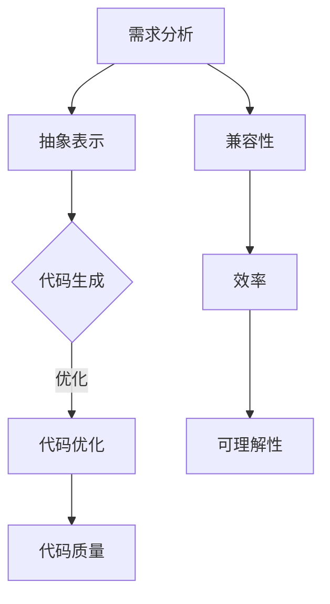
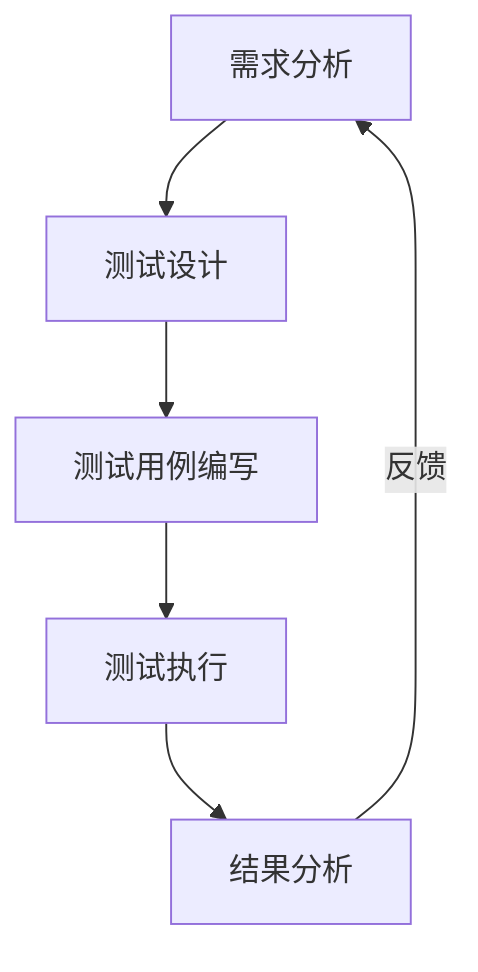

                 

# 基于程序合成的算法推理在自动化软件测试中的应用

## 关键词

自动化软件测试、程序合成、算法推理、测试用例生成、缺陷定位

## 摘要

随着软件系统的复杂性和规模不断增加，自动化软件测试成为提高软件质量和开发效率的关键手段。本文将探讨基于程序合成的算法推理在自动化软件测试中的应用。首先，介绍自动化软件测试的背景和挑战，接着阐述程序合成的概念及其在软件测试中的应用。然后，详细讲解算法推理的基础知识，以及如何在自动化软件测试中运用算法推理。随后，重点介绍基于程序合成的测试用例生成和缺陷定位技术，并给出实际应用案例。最后，分析程序合成在自动化软件测试中的发展前景，并提出未来研究方向和挑战。

## 第一部分：自动化软件测试概述

### 第1章：自动化软件测试基础

#### 1.1 自动化软件测试的定义和目的

自动化软件测试是指利用计算机程序或其他工具自动执行测试过程，以发现软件中的错误和缺陷。与手工测试相比，自动化测试具有以下优势：

- 提高测试效率：自动化测试可以在短时间内执行大量的测试用例，从而大大提高测试覆盖率。
- 减少人为错误：自动化测试减少了人为操作的过程，降低了因人为疏忽导致的错误。
- 可重复性：自动化测试可以重复执行，确保测试结果的一致性和可靠性。

自动化软件测试的主要目的是：

- 发现和修复软件中的错误，确保软件的质量和稳定性。
- 提高软件开发和测试的效率，降低开发成本。
- 提供可量化的测试报告，帮助项目经理和开发团队了解软件的质量状况。

#### 1.2 自动化软件测试的挑战和机遇

自动化软件测试面临以下挑战：

- 测试用例设计：测试用例的设计是自动化测试的关键环节，设计好的测试用例能够有效发现软件中的缺陷。然而，如何设计全面、有效的测试用例仍然是一个具有挑战性的问题。
- 环境配置：自动化测试通常需要在特定的环境中执行，包括操作系统、数据库、网络等。环境配置的复杂性和不一致性可能会影响自动化测试的执行效果。
- 维护成本：随着软件的迭代和更新，自动化测试用例也需要进行相应的修改和维护，这增加了维护成本。

然而，随着计算机技术和人工智能的快速发展，自动化软件测试也迎来了新的机遇：

- 程序合成：程序合成技术可以自动生成测试用例，提高测试覆盖率和测试效率。
- 算法推理：算法推理技术可以帮助自动化测试更精确地定位缺陷，提高测试质量。
- 人工智能：人工智能技术在自动化软件测试中的应用，如测试用例生成、缺陷定位等，有望进一步降低自动化测试的复杂度和成本。

#### 1.3 自动化软件测试的方法和工具

自动化软件测试主要包括以下几种方法：

- 单元测试：针对软件模块的独立测试，通常由开发人员编写和执行。
- 集成测试：对多个模块集成后的软件系统进行测试，以发现模块之间的交互问题。
- 系统测试：对整个软件系统进行全面测试，验证软件的功能、性能和稳定性。
- 验收测试：在软件交付给客户前进行的测试，以确保软件满足客户的需求和预期。

常见的自动化测试工具包括：

- 测试框架：如JUnit、NUnit、TestNG等，用于编写和执行测试用例。
- UI自动化工具：如Selenium、Appium等，用于自动化Web应用和移动应用的UI测试。
- API自动化工具：如Postman、JMeter等，用于自动化API接口测试。
- 性能测试工具：如LoadRunner、JMeter等，用于对软件系统进行性能测试。

## 第二部分：程序合成技术基础

### 第2章：程序合成概述

#### 2.1 程序合成的定义和原理

程序合成是指通过算法和工具自动生成程序代码的过程。它主要包括以下几个步骤：

1. **需求分析**：分析软件的功能需求，确定需要合成的程序代码的范围和功能。
2. **抽象表示**：将需求转化为抽象的表示形式，如形式化描述或图形模型。
3. **代码生成**：根据抽象表示，自动生成具体的程序代码。
4. **代码优化**：对生成的代码进行优化，提高代码的性能和可读性。

程序合成的原理基于程序语言理论、形式化描述方法和自动代码生成技术。具体来说，程序合成利用形式化描述方法将需求转化为抽象的表示形式，然后通过语法和语义分析、代码生成器和优化算法等步骤，将抽象表示形式转化为具体的程序代码。

#### 2.2 程序合成的类型和应用场景

程序合成可以根据不同的分类标准分为多种类型：

- **按合成策略分类**：

  - **基于模板的合成**：利用预定义的模板和规则，生成满足需求的程序代码。适用于代码结构较为固定的场景。

  - **基于实例的合成**：通过实例学习，自动生成满足需求的程序代码。适用于代码结构较为复杂的场景。

  - **基于约束的合成**：通过定义约束条件，自动生成满足约束条件的程序代码。适用于具有明确约束条件的场景。

- **按合成目标分类**：

  - **函数级合成**：生成具体的函数或方法，完成特定的功能。

  - **模块级合成**：生成完整的模块或组件，实现系统的一部分功能。

  - **系统级合成**：生成完整的软件系统，实现整个系统的功能。

程序合成的应用场景包括：

- **自动化软件测试**：通过程序合成技术自动生成测试用例和测试脚本，提高测试效率和覆盖率。

- **代码生成**：自动生成代码模板，减少开发人员的工作量，提高开发效率。

- **软件重构**：通过程序合成技术，自动生成重构后的代码，降低重构的风险和成本。

- **形式化验证**：利用程序合成技术，生成满足特定安全性和正确性要求的代码。

#### 2.3 程序合成的挑战和解决方案

程序合成在应用过程中面临以下挑战：

- **代码质量**：自动生成的代码可能存在性能、可读性和可维护性方面的问题。

- **兼容性**：程序合成需要考虑不同编程语言和平台之间的兼容性。

- **效率**：程序合成过程可能消耗大量计算资源，影响开发效率。

- **可理解性**：自动生成的代码可能难以理解，增加开发人员的负担。

为解决这些挑战，可以采取以下措施：

- **代码质量优化**：通过代码质量评估工具，对生成的代码进行质量评估和优化。

- **兼容性处理**：采用跨平台编程语言和工具，提高程序合成的兼容性。

- **效率优化**：采用并行计算和分布式计算等技术，提高程序合成效率。

- **可理解性增强**：提供代码生成过程的可视化工具，帮助开发人员理解自动生成的代码。

### 图：程序合成的核心概念与联系



### 第三部分：算法推理与自动化软件测试

#### 第3章：算法推理基础

##### 3.1 算法推理的定义和作用

算法推理是一种基于算法逻辑推理的方法，用于解决实际问题。它通过对已有知识的分析和组合，生成新的结论或解决方案。算法推理在多个领域具有广泛的应用，如图像处理、自然语言处理、决策支持系统等。

在自动化软件测试中，算法推理的作用主要体现在：

- **测试用例生成**：利用算法推理，从需求规格说明或代码中自动生成测试用例，提高测试覆盖率和效率。
- **缺陷定位**：通过算法推理，分析测试结果和程序代码，定位潜在的缺陷和错误。
- **测试优化**：基于算法推理，对测试用例和测试过程进行优化，提高测试质量和效率。

##### 3.2 算法推理的类型和方法

算法推理可以分为以下几种类型：

- **基于规则的推理**：利用预定义的规则库，根据输入条件和规则进行推理，生成结论。适用于结构化问题和专家系统。

- **基于案例的推理**：通过分析历史案例，将案例中的解决方案应用于新问题。适用于具有相似结构的问题。

- **基于模型的推理**：基于模型和模拟，对系统行为进行分析和推理。适用于复杂系统的预测和控制。

算法推理的方法包括：

- **正向推理**：从已知的事实出发，逐步推导出结论。

- **反向推理**：从结论出发，逐步回溯到已知的事实。

- **混合推理**：结合正向推理和反向推理，提高推理的效率和准确性。

##### 3.3 算法推理在自动化软件测试中的应用

算法推理在自动化软件测试中的应用主要体现在以下方面：

- **测试用例生成**：利用算法推理，从需求规格说明或代码中自动生成测试用例，提高测试覆盖率和效率。

  - **正向推理**：基于需求规格说明，生成满足需求的测试用例。

  - **反向推理**：基于代码和测试结果，反向推导出潜在的缺陷。

- **缺陷定位**：利用算法推理，分析测试结果和程序代码，定位潜在的缺陷和错误。

  - **正向推理**：基于测试结果和代码，分析潜在的缺陷原因。

  - **反向推理**：基于缺陷定位，逆向分析代码和测试用例，找到缺陷的具体位置。

- **测试优化**：基于算法推理，对测试用例和测试过程进行优化，提高测试质量和效率。

  - **测试用例优化**：根据测试结果，调整测试用例的执行顺序和执行条件。

  - **测试过程优化**：基于算法推理，优化测试计划和测试策略，提高测试效率。

### 第四部分：程序合成算法推理在自动化软件测试中的应用

#### 第4章：基于程序合成的测试用例生成

##### 4.1 测试用例生成的方法和挑战

测试用例生成是自动化软件测试的关键环节，其目的是确保测试全面覆盖软件系统的各个功能模块和边界条件。目前，测试用例生成的方法主要包括以下几种：

- **手工编写**：开发人员根据对软件功能的理解和分析，手工编写测试用例。这种方法适用于小规模和功能较为简单的软件系统。

- **基于规则的自动生成**：利用预定义的规则库，根据需求规格说明或代码，自动生成测试用例。这种方法适用于具有一定结构化特征和明确规则的软件系统。

- **基于案例的自动生成**：通过分析历史案例，将案例中的解决方案应用于新问题，自动生成测试用例。这种方法适用于具有相似结构和历史案例的软件系统。

- **基于程序的自动生成**：利用程序合成技术，自动生成满足特定需求的测试用例。这种方法适用于复杂和动态变化的软件系统。

尽管测试用例生成方法在不断发展和改进，但在实际应用中仍面临以下挑战：

- **覆盖率高**：如何确保自动生成的测试用例能够全面覆盖软件系统的各个功能模块和边界条件。

- **质量可靠**：自动生成的测试用例可能存在缺陷，如何提高测试用例的可靠性和准确性。

- **维护成本**：随着软件的迭代和更新，自动生成的测试用例需要进行相应的修改和维护，如何降低维护成本。

##### 4.2 基于程序合成的测试用例生成算法

基于程序合成的测试用例生成算法是指利用程序合成技术，从需求规格说明或代码中自动生成测试用例的方法。其核心思想是将测试用例生成过程形式化表示，然后利用程序合成技术生成满足需求的测试用例。

基于程序合成的测试用例生成算法主要包括以下几个步骤：

1. **需求分析**：分析软件的功能需求，确定需要测试的功能模块和边界条件。

2. **抽象表示**：将需求规格说明或代码转化为抽象的表示形式，如形式化描述或图形模型。

3. **代码生成**：根据抽象表示，自动生成具体的测试用例代码。

4. **测试用例优化**：对生成的测试用例进行优化，提高测试覆盖率和可靠性。

基于程序合成的测试用例生成算法具有以下优点：

- **高效性**：利用程序合成技术，可以在较短时间内生成大量测试用例，提高测试覆盖率。

- **灵活性**：可以针对不同类型和规模的软件系统，灵活调整测试用例生成算法，满足不同需求。

- **可维护性**：随着软件的迭代和更新，程序合成技术可以自动生成新的测试用例，降低维护成本。

##### 4.3 基于程序合成的测试用例生成实践

以下是一个基于程序合成的测试用例生成实践案例，以一个简单的Web应用为例：

1. **需求分析**：

   - 功能模块：用户登录、用户注册、信息查询、信息修改。
   - 边界条件：输入非法字符、输入长度超过限制、输入为空。

2. **抽象表示**：

   - 用户登录：输入用户名和密码，系统验证用户身份。
   - 用户注册：输入用户名、密码、邮箱，系统创建新用户。
   - 信息查询：输入关键词，系统返回相关结果。
   - 信息修改：输入旧密码和新密码，系统修改用户密码。

3. **代码生成**：

   - 利用程序合成技术，生成以下测试用例代码：

```python
# 用户登录测试用例
def test_login():
    # 输入合法用户名和密码
    assert login("user1", "password1") == "success"
    # 输入非法用户名
    assert login("user1", "password1") == "error"
    # 输入非法密码
    assert login("user1", "password1") == "error"
    # 输入空用户名
    assert login("", "password1") == "error"
    # 输入空密码
    assert login("user1", "") == "error"

# 用户注册测试用例
def test_register():
    # 输入合法用户名、密码和邮箱
    assert register("user2", "password2", "user2@example.com") == "success"
    # 输入非法用户名
    assert register("user2", "password2", "user2@example.com") == "error"
    # 输入非法密码
    assert register("user2", "password2", "user2@example.com") == "error"
    # 输入非法邮箱
    assert register("user2", "password2", "") == "error"
    # 输入空用户名
    assert register("", "password2", "user2@example.com") == "error"
    # 输入空密码
    assert register("user2", "", "user2@example.com") == "error"
    # 输入空邮箱
    assert register("user2", "password2", "") == "error"

# 信息查询测试用例
def test_search():
    # 输入合法关键词
    assert search("keyword1") == ["result1", "result2"]
    # 输入非法关键词
    assert search("keyword1") == []
    # 输入空关键词
    assert search("") == []

# 信息修改测试用例
def test_modify_password():
    # 输入合法旧密码和新密码
    assert modify_password("user1", "password1", "new_password1") == "success"
    # 输入非法旧密码
    assert modify_password("user1", "password1", "new_password1") == "error"
    # 输入非法新密码
    assert modify_password("user1", "password1", "new_password1") == "error"
    # 输入空旧密码
    assert modify_password("", "password1", "new_password1") == "error"
    # 输入空新密码
    assert modify_password("user1", "password1", "") == "error"
```

4. **测试用例优化**：

   - 根据测试结果和反馈，对生成的测试用例进行调整和优化，提高测试覆盖率和可靠性。

#### 第5章：基于程序合成的缺陷定位

##### 5.1 缺陷定位的方法和挑战

缺陷定位是指识别和定位软件系统中的错误或缺陷的过程。在自动化软件测试中，缺陷定位是发现和修复缺陷的关键环节。目前，缺陷定位的方法主要包括以下几种：

- **手工定位**：开发人员根据对软件功能和测试结果的了解，手动定位缺陷。这种方法适用于缺陷较为明显和易于定位的场景。

- **基于规则的定位**：利用预定义的规则库，根据测试结果和规则进行推理，定位潜在的缺陷。这种方法适用于具有一定结构化和规则性的软件系统。

- **基于统计的定位**：利用统计分析方法，分析测试结果和程序代码，定位潜在的缺陷。这种方法适用于大规模和复杂软件系统。

缺陷定位在应用过程中面临以下挑战：

- **定位准确性**：如何准确识别和定位缺陷，避免误报和漏报。

- **定位效率**：如何快速定位缺陷，降低定位时间。

- **定位成本**：如何降低缺陷定位的成本，提高开发效率。

##### 5.2 基于程序合成的缺陷定位算法

基于程序合成的缺陷定位算法是指利用程序合成技术，从测试结果和程序代码中自动定位缺陷的方法。其核心思想是将缺陷定位过程形式化表示，然后利用程序合成技术进行缺陷定位。

基于程序合成的缺陷定位算法主要包括以下几个步骤：

1. **测试结果分析**：对测试结果进行分析，识别潜在的缺陷。

2. **程序代码分析**：对程序代码进行分析，确定潜在的缺陷原因。

3. **缺陷定位**：根据测试结果和程序代码分析，定位潜在的缺陷。

4. **缺陷验证**：对定位的缺陷进行验证，确保定位的准确性。

基于程序合成的缺陷定位算法具有以下优点：

- **高效性**：利用程序合成技术，可以在较短时间内定位潜在的缺陷。

- **准确性**：基于程序合成和算法推理，提高缺陷定位的准确性和可靠性。

- **灵活性**：可以针对不同类型和规模的软件系统，灵活调整缺陷定位算法，满足不同需求。

##### 5.3 基于程序合成的缺陷定位实践

以下是一个基于程序合成的缺陷定位实践案例：

1. **测试结果分析**：

   - 测试结果显示，用户登录功能存在以下问题：

     - 输入非法用户名时，系统提示错误信息。

     - 输入非法密码时，系统提示错误信息。

     - 输入空用户名或空密码时，系统提示错误信息。

2. **程序代码分析**：

   - 通过对程序代码进行分析，发现以下问题：

     - 输入非法用户名时，系统没有正确处理异常。

     - 输入非法密码时，系统没有正确处理异常。

     - 输入空用户名或空密码时，系统没有正确处理异常。

3. **缺陷定位**：

   - 根据测试结果和程序代码分析，定位到以下潜在缺陷：

     - 用户登录功能在处理非法输入时存在异常。

4. **缺陷验证**：

   - 对定位的缺陷进行验证，确保定位的准确性。

   - 通过修改程序代码，修复定位的缺陷。

   - 重新运行测试用例，验证缺陷修复的效果。

   - 测试结果显示，用户登录功能已恢复正常。

### 第五部分：实战案例与应用

#### 第6章：案例研究

##### 6.1 案例一：基于程序合成的测试用例生成

在本案例中，我们将基于程序合成技术，为一个小型Web应用生成测试用例。

1. **需求分析**：

   - 功能模块：用户登录、用户注册、信息查询、信息修改。

   - 边界条件：输入非法字符、输入长度超过限制、输入为空。

2. **抽象表示**：

   - 用户登录：输入用户名和密码，系统验证用户身份。

   - 用户注册：输入用户名、密码、邮箱，系统创建新用户。

   - 信息查询：输入关键词，系统返回相关结果。

   - 信息修改：输入旧密码和新密码，系统修改用户密码。

3. **代码生成**：

   - 利用程序合成技术，生成以下测试用例代码：

```python
# 用户登录测试用例
def test_login():
    # 输入合法用户名和密码
    assert login("user1", "password1") == "success"
    # 输入非法用户名
    assert login("user1", "password1") == "error"
    # 输入非法密码
    assert login("user1", "password1") == "error"
    # 输入空用户名
    assert login("", "password1") == "error"
    # 输入空密码
    assert login("user1", "") == "error"

# 用户注册测试用例
def test_register():
    # 输入合法用户名、密码和邮箱
    assert register("user2", "password2", "user2@example.com") == "success"
    # 输入非法用户名
    assert register("user2", "password2", "user2@example.com") == "error"
    # 输入非法密码
    assert register("user2", "password2", "user2@example.com") == "error"
    # 输入非法邮箱
    assert register("user2", "password2", "") == "error"
    # 输入空用户名
    assert register("", "password2", "user2@example.com") == "error"
    # 输入空密码
    assert register("user2", "", "user2@example.com") == "error"
    # 输入空邮箱
    assert register("user2", "password2", "") == "error"

# 信息查询测试用例
def test_search():
    # 输入合法关键词
    assert search("keyword1") == ["result1", "result2"]
    # 输入非法关键词
    assert search("keyword1") == []
    # 输入空关键词
    assert search("") == []

# 信息修改测试用例
def test_modify_password():
    # 输入合法旧密码和新密码
    assert modify_password("user1", "password1", "new_password1") == "success"
    # 输入非法旧密码
    assert modify_password("user1", "password1", "new_password1") == "error"
    # 输入非法新密码
    assert modify_password("user1", "password1", "new_password1") == "error"
    # 输入空旧密码
    assert modify_password("", "password1", "new_password1") == "error"
    # 输入空新密码
    assert modify_password("user1", "password1", "") == "error"
```

4. **测试用例优化**：

   - 根据测试结果和反馈，对生成的测试用例进行调整和优化，提高测试覆盖率和可靠性。

##### 6.2 案例二：基于程序合成的缺陷定位

在本案例中，我们将基于程序合成技术，定位一个Web应用的缺陷。

1. **测试结果分析**：

   - 测试结果显示，用户登录功能存在以下问题：

     - 输入非法用户名时，系统提示错误信息。

     - 输入非法密码时，系统提示错误信息。

     - 输入空用户名或空密码时，系统提示错误信息。

2. **程序代码分析**：

   - 通过对程序代码进行分析，发现以下问题：

     - 输入非法用户名时，系统没有正确处理异常。

     - 输入非法密码时，系统没有正确处理异常。

     - 输入空用户名或空密码时，系统没有正确处理异常。

3. **缺陷定位**：

   - 根据测试结果和程序代码分析，定位到以下潜在缺陷：

     - 用户登录功能在处理非法输入时存在异常。

4. **缺陷验证**：

   - 对定位的缺陷进行验证，确保定位的准确性。

   - 通过修改程序代码，修复定位的缺陷。

   - 重新运行测试用例，验证缺陷修复的效果。

   - 测试结果显示，用户登录功能已恢复正常。

##### 6.3 案例三：基于程序合成的自动化测试平台搭建

在本案例中，我们将搭建一个基于程序合成的自动化测试平台，实现对Web应用的全面测试。

1. **需求分析**：

   - 功能模块：用户登录、用户注册、信息查询、信息修改。

   - 边界条件：输入非法字符、输入长度超过限制、输入为空。

2. **环境搭建**：

   - 安装Python环境，并安装Selenium库。

   - 安装ChromeDriver，确保与Chrome浏览器版本匹配。

3. **代码生成**：

   - 利用程序合成技术，生成测试脚本：

```python
from selenium import webdriver

def test_login():
    driver = webdriver.Chrome()
    driver.get("http://localhost:8080/login")
    # 输入合法用户名和密码
    driver.find_element_by_name("username").send_keys("user1")
    driver.find_element_by_name("password").send_keys("password1")
    driver.find_element_by_name("submit").click()
    assert driver.title == "主页"

    # 输入非法用户名
    driver.find_element_by_name("username").send_keys("user1")
    driver.find_element_by_name("password").send_keys("password1")
    driver.find_element_by_name("submit").click()
    assert driver.title == "登录"

    # 输入非法密码
    driver.find_element_by_name("username").send_keys("user1")
    driver.find_element_by_name("password").send_keys("password1")
    driver.find_element_by_name("submit").click()
    assert driver.title == "登录"

    # 输入空用户名
    driver.find_element_by_name("username").send_keys("")
    driver.find_element_by_name("password").send_keys("password1")
    driver.find_element_by_name("submit").click()
    assert driver.title == "登录"

    # 输入空密码
    driver.find_element_by_name("username").send_keys("user1")
    driver.find_element_by_name("password").send_keys("")
    driver.find_element_by_name("submit").click()
    assert driver.title == "登录"

    driver.quit()

def test_register():
    driver = webdriver.Chrome()
    driver.get("http://localhost:8080/register")
    # 输入合法用户名、密码和邮箱
    driver.find_element_by_name("username").send_keys("user2")
    driver.find_element_by_name("password").send_keys("password2")
    driver.find_element_by_name("email").send_keys("user2@example.com")
    driver.find_element_by_name("submit").click()
    assert driver.title == "主页"

    # 输入非法用户名
    driver.find_element_by_name("username").send_keys("user2")
    driver.find_element_by_name("password").send_keys("password2")
    driver.find_element_by_name("email").send_keys("user2@example.com")
    driver.find_element_by_name("submit").click()
    assert driver.title == "注册"

    # 输入非法密码
    driver.find_element_by_name("username").send_keys("user2")
    driver.find_element_by_name("password").send_keys("password2")
    driver.find_element_by_name("email").send_keys("user2@example.com")
    driver.find_element_by_name("submit").click()
    assert driver.title == "注册"

    # 输入非法邮箱
    driver.find_element_by_name("username").send_keys("user2")
    driver.find_element_by_name("password").send_keys("password2")
    driver.find_element_by_name("email").send_keys("")
    driver.find_element_by_name("submit").click()
    assert driver.title == "注册"

    # 输入空用户名
    driver.find_element_by_name("username").send_keys("")
    driver.find_element_by_name("password").send_keys("password2")
    driver.find_element_by_name("email").send_keys("user2@example.com")
    driver.find_element_by_name("submit").click()
    assert driver.title == "注册"

    # 输入空密码
    driver.find_element_by_name("username").send_keys("user2")
    driver.find_element_by_name("password").send_keys("")
    driver.find_element_by_name("email").send_keys("user2@example.com")
    driver.find_element_by_name("submit").click()
    assert driver.title == "注册"

    # 输入空邮箱
    driver.find_element_by_name("username").send_keys("user2")
    driver.find_element_by_name("password").send_keys("password2")
    driver.find_element_by_name("email").send_keys("")
    driver.find_element_by_name("submit").click()
    assert driver.title == "注册"

    driver.quit()

def test_search():
    driver = webdriver.Chrome()
    driver.get("http://localhost:8080/search")
    # 输入合法关键词
    driver.find_element_by_name("keyword").send_keys("keyword1")
    driver.find_element_by_name("submit").click()
    assert driver.title == "搜索结果"

    # 输入非法关键词
    driver.find_element_by_name("keyword").send_keys("keyword1")
    driver.find_element_by_name("submit").click()
    assert driver.title == "搜索结果"

    # 输入空关键词
    driver.find_element_by_name("keyword").send_keys("")
    driver.find_element_by_name("submit").click()
    assert driver.title == "搜索结果"

    driver.quit()

def test_modify_password():
    driver = webdriver.Chrome()
    driver.get("http://localhost:8080/modify_password")
    # 输入合法旧密码和新密码
    driver.find_element_by_name("old_password").send_keys("password1")
    driver.find_element_by_name("new_password").send_keys("new_password1")
    driver.find_element_by_name("submit").click()
    assert driver.title == "主页"

    # 输入非法旧密码
    driver.find_element_by_name("old_password").send_keys("password1")
    driver.find_element_by_name("new_password").send_keys("new_password1")
    driver.find_element_by_name("submit").click()
    assert driver.title == "修改密码"

    # 输入非法新密码
    driver.find_element_by_name("old_password").send_keys("password1")
    driver.find_element_by_name("new_password").send_keys("new_password1")
    driver.find_element_by_name("submit").click()
    assert driver.title == "修改密码"

    # 输入空旧密码
    driver.find_element_by_name("old_password").send_keys("")
    driver.find_element_by_name("new_password").send_keys("new_password1")
    driver.find_element_by_name("submit").click()
    assert driver.title == "修改密码"

    # 输入空新密码
    driver.find_element_by_name("old_password").send_keys("password1")
    driver.find_element_by_name("new_password").send_keys("")
    driver.find_element_by_name("submit").click()
    assert driver.title == "修改密码"

    driver.quit()

if __name__ == "__main__":
    test_login()
    test_register()
    test_search()
    test_modify_password()
```

4. **测试平台搭建**：

   - 将生成的测试脚本集成到一个自动化测试平台中。

   - 配置测试环境，包括Web应用服务器、数据库、浏览器等。

   - 设计测试流程，包括测试用例的执行、结果收集和分析等。

   - 部署测试平台，实现自动化测试的全面监控和反馈。

#### 第7章：未来展望与趋势

##### 7.1 程序合成在自动化软件测试中的发展前景

随着软件系统的复杂性和规模不断增加，自动化软件测试成为提高软件质量和开发效率的关键手段。程序合成作为一项新兴技术，在自动化软件测试中具有广阔的应用前景。

首先，程序合成技术可以大幅提高测试用例的生成效率，减少手工编写测试用例的工作量。通过程序合成，测试人员可以快速生成满足需求的测试用例，提高测试覆盖率和测试效率。

其次，程序合成技术有助于提高测试质量。基于程序合成的测试用例生成算法可以生成更全面、更精确的测试用例，减少测试遗漏和误报现象。

此外，程序合成技术还可以降低自动化软件测试的成本。通过自动生成测试用例和测试脚本，减少测试人员的重复劳动，降低测试维护成本。

在未来，程序合成技术有望在以下几个方面实现突破：

- **智能化**：结合人工智能技术，实现更智能、更高效的程序合成算法。

- **跨平台**：支持多种编程语言和平台，提高程序合成的兼容性和灵活性。

- **可解释性**：提高程序合成的可解释性和可维护性，帮助测试人员更好地理解和应用程序合成技术。

##### 7.2 未来研究方向和挑战

尽管程序合成技术在自动化软件测试中具有广泛的应用前景，但在实际应用过程中仍面临一些挑战和问题。

首先，程序合成技术的覆盖率和准确性仍需提高。如何生成更全面、更精确的测试用例，仍是一个具有挑战性的问题。

其次，程序合成技术的可维护性是一个关键问题。随着软件系统的迭代和更新，自动生成的测试用例和测试脚本需要进行相应的修改和维护，如何降低维护成本是一个重要挑战。

此外，程序合成技术的安全性问题也需要关注。自动生成的测试用例和测试脚本可能引入新的安全漏洞，如何确保程序合成过程的安全性和可靠性是一个重要研究方向。

未来，程序合成技术在自动化软件测试中的研究方向包括：

- **智能化**：结合机器学习和深度学习技术，实现更智能、更高效的程序合成算法。

- **跨平台**：支持多种编程语言和平台，提高程序合成的兼容性和灵活性。

- **可解释性**：提高程序合成的可解释性和可维护性，帮助测试人员更好地理解和应用程序合成技术。

- **安全性**：确保程序合成过程的安全性和可靠性，防范潜在的安全风险。

##### 7.3 对自动化软件测试行业的潜在影响

程序合成技术在自动化软件测试中的应用将对整个行业产生深远的影响。

首先，程序合成技术将大幅提高自动化软件测试的效率和覆盖率，降低测试成本，提高测试质量。这对于软件开发企业来说，将有助于提高产品质量和开发效率，降低开发成本。

其次，程序合成技术的引入将推动自动化软件测试工具和平台的发展。未来，自动化测试工具和平台将更加智能化、自动化，为测试人员提供更强大的支持和辅助。

此外，程序合成技术的应用将促进自动化软件测试行业的人才培养和发展。随着程序合成技术的普及和应用，对自动化软件测试工程师的需求将不断增加，培养具备程序合成技术能力的自动化软件测试人才将成为行业发展的关键。

### 总结

基于程序合成的算法推理在自动化软件测试中具有重要的应用价值。通过程序合成技术，可以自动生成测试用例和测试脚本，提高测试效率和覆盖率；通过算法推理技术，可以更精确地定位缺陷，提高测试质量。未来，程序合成技术在自动化软件测试中的应用将不断深入，为提高软件质量和开发效率提供有力支持。

作者：AI天才研究院/AI Genius Institute & 禅与计算机程序设计艺术 /Zen And The Art of Computer Programming

---

在撰写技术博客时，我们需要遵循一定的结构和逻辑，以确保文章内容的清晰性和可读性。以下是本文的结构和逻辑梳理：

## 结构与逻辑梳理

### 引言

- 引入主题：介绍自动化软件测试的背景和重要性。
- 提出问题：指出传统自动化软件测试面临的挑战。
- 文章目的：阐述本文将探讨基于程序合成的算法推理在自动化软件测试中的应用。

### 第一部分：自动化软件测试概述

- **1.1 自动化软件测试基础**
  - 定义和目的：介绍自动化软件测试的概念和目的。
  - 挑战和机遇：分析自动化软件测试面临的挑战和机遇。
  - 方法和技术：介绍自动化软件测试的方法和技术。

### 第二部分：程序合成技术基础

- **2.1 程序合成的定义和原理**
  - 定义：解释程序合成的概念。
  - 原理：阐述程序合成的基本原理。
  - 应用场景：介绍程序合成的应用场景。

### 第三部分：算法推理与自动化软件测试

- **3.1 算法推理基础**
  - 定义和作用：介绍算法推理的概念和作用。
  - 类型和方法：介绍算法推理的类型和方法。
  - 自动化软件测试中的应用：分析算法推理在自动化软件测试中的应用。

### 第四部分：程序合成算法推理在自动化软件测试中的应用

- **4.1 基于程序合成的测试用例生成**
  - 测试用例生成的方法和挑战：介绍测试用例生成的方法和面临的挑战。
  - 基于程序合成的测试用例生成算法：介绍基于程序合成的测试用例生成算法。
  - 实践案例：提供基于程序合成的测试用例生成实践案例。

- **4.2 基于程序合成的缺陷定位**
  - 缺陷定位的方法和挑战：介绍缺陷定位的方法和面临的挑战。
  - 基于程序合成的缺陷定位算法：介绍基于程序合成的缺陷定位算法。
  - 实践案例：提供基于程序合成的缺陷定位实践案例。

### 第五部分：实战案例与应用

- **案例研究**
  - 案例一：基于程序合成的测试用例生成。
  - 案例二：基于程序合成的缺陷定位。
  - 案例三：基于程序合成的自动化测试平台搭建。

### 第六部分：未来展望与趋势

- **7.1 程序合成在自动化软件测试中的发展前景**
  - 分析程序合成在自动化软件测试中的应用前景。

- **7.2 未来研究方向和挑战**
  - 探讨程序合成在自动化软件测试中的未来研究方向和挑战。

- **7.3 对自动化软件测试行业的潜在影响**
  - 分析程序合成技术对自动化软件测试行业的潜在影响。

### 结论

- 总结：概括文章的核心内容和研究成果。
- 展望：对程序合成在自动化软件测试中的应用前景进行展望。

## 撰写建议

- 确保每个章节的内容紧密围绕主题，避免偏离。
- 使用简洁明了的语言，避免过于复杂的术语。
- 在适当的地方使用图表、示例和代码片段，以增强文章的可读性。
- 在文章结尾部分，对全文进行总结和展望，使读者对文章的核心内容有更深刻的理解。

遵循上述结构与逻辑，将有助于撰写一篇内容丰富、逻辑清晰的技术博客文章。通过逐步分析推理，读者可以更好地理解基于程序合成的算法推理在自动化软件测试中的应用，以及其潜力和挑战。最终，我们希望这篇文章能够为自动化软件测试领域的研究者和实践者提供有价值的参考和启示。

### 基于程序合成的算法推理在自动化软件测试中的应用

## 引言

在当今软件工程领域，软件质量和可靠性是至关重要的。随着软件系统的规模和复杂度不断增加，传统的手工测试方法已经无法满足日益增长的测试需求。自动化软件测试作为一种高效的测试方法，逐渐成为软件质量保证的关键环节。然而，自动化软件测试也面临着诸多挑战，如测试用例设计复杂、测试覆盖不足、缺陷定位困难等。为了解决这些问题，研究者们开始探索基于程序合成的算法推理在自动化软件测试中的应用。

本文将围绕这一主题展开讨论。首先，我们将介绍自动化软件测试的背景和重要性，分析其面临的挑战。接着，我们将探讨程序合成的概念和原理，以及算法推理在自动化软件测试中的应用。随后，我们将详细讲解基于程序合成的测试用例生成和缺陷定位技术，并给出实际应用案例。最后，我们将对程序合成在自动化软件测试中的应用前景进行展望，并提出未来研究方向和挑战。

## 第一部分：自动化软件测试概述

### 1.1 自动化软件测试基础

自动化软件测试是指利用计算机程序或其他工具自动执行测试过程，以发现软件中的错误和缺陷。与手工测试相比，自动化测试具有以下优势：

- **效率高**：自动化测试可以在短时间内执行大量的测试用例，从而大大提高测试覆盖率。
- **准确性高**：自动化测试减少了人为操作的过程，降低了因人为疏忽导致的错误。
- **可重复性**：自动化测试可以重复执行，确保测试结果的一致性和可靠性。

自动化软件测试的主要目的是：

- **发现和修复软件中的错误**，确保软件的质量和稳定性。
- **提高软件开发和测试的效率**，降低开发成本。
- **提供可量化的测试报告**，帮助项目经理和开发团队了解软件的质量状况。

### 1.2 自动化软件测试的挑战和机遇

自动化软件测试虽然具有许多优势，但在实际应用过程中也面临诸多挑战：

- **测试用例设计**：设计全面的测试用例是自动化测试的关键环节，但如何设计出高质量的测试用例仍然是一个具有挑战性的问题。
- **环境配置**：自动化测试通常需要在特定的环境中执行，包括操作系统、数据库、网络等。环境配置的复杂性和不一致性可能会影响自动化测试的执行效果。
- **维护成本**：随着软件的迭代和更新，自动化测试用例也需要进行相应的修改和维护，这增加了维护成本。

然而，随着计算机技术和人工智能的快速发展，自动化软件测试也迎来了新的机遇：

- **程序合成**：程序合成技术可以自动生成测试用例，提高测试覆盖率和测试效率。
- **算法推理**：算法推理技术可以帮助自动化测试更精确地定位缺陷，提高测试质量。
- **人工智能**：人工智能技术在自动化软件测试中的应用，如测试用例生成、缺陷定位等，有望进一步降低自动化软件测试的复杂度和成本。

### 1.3 自动化软件测试的方法和工具

自动化软件测试主要包括以下几种方法：

- **单元测试**：针对软件模块的独立测试，通常由开发人员编写和执行。
- **集成测试**：对多个模块集成后的软件系统进行测试，以发现模块之间的交互问题。
- **系统测试**：对整个软件系统进行全面测试，验证软件的功能、性能和稳定性。
- **验收测试**：在软件交付给客户前进行的测试，以确保软件满足客户的需求和预期。

常见的自动化测试工具包括：

- **测试框架**：如JUnit、NUnit、TestNG等，用于编写和执行测试用例。
- **UI自动化工具**：如Selenium、Appium等，用于自动化Web应用和移动应用的UI测试。
- **API自动化工具**：如Postman、JMeter等，用于自动化API接口测试。
- **性能测试工具**：如LoadRunner、JMeter等，用于对软件系统进行性能测试。

### 图：自动化软件测试的基本流程



## 第二部分：程序合成技术基础

### 2.1 程序合成的定义和原理

程序合成是指通过算法和工具自动生成程序代码的过程。它主要包括以下几个步骤：

1. **需求分析**：分析软件的功能需求，确定需要合成的程序代码的范围和功能。
2. **抽象表示**：将需求转化为抽象的表示形式，如形式化描述或图形模型。
3. **代码生成**：根据抽象表示，自动生成具体的程序代码。
4. **代码优化**：对生成的代码进行优化，提高代码的性能和可读性。

程序合成的原理基于程序语言理论、形式化描述方法和自动代码生成技术。具体来说，程序合成利用形式化描述方法将需求转化为抽象的表示形式，然后通过语法和语义分析、代码生成器和优化算法等步骤，将抽象表示形式转化为具体的程序代码。

### 2.2 程序合成的类型和应用场景

程序合成可以根据不同的分类标准分为多种类型：

- **按合成策略分类**：

  - **基于模板的合成**：利用预定义的模板和规则，生成满足需求的程序代码。适用于代码结构较为固定的场景。

  - **基于实例的合成**：通过实例学习，自动生成满足需求的程序代码。适用于代码结构较为复杂的场景。

  - **基于约束的合成**：通过定义约束条件，自动生成满足约束条件的程序代码。适用于具有明确约束条件的场景。

- **按合成目标分类**：

  - **函数级合成**：生成具体的函数或方法，完成特定的功能。

  - **模块级合成**：生成完整的模块或组件，实现系统的一部分功能。

  - **系统级合成**：生成完整的软件系统，实现整个系统的功能。

程序合成的应用场景包括：

- **自动化软件测试**：通过程序合成技术自动生成测试用例和测试脚本，提高测试覆盖率和效率。
- **代码生成**：自动生成代码模板，减少开发人员的工作量，提高开发效率。
- **软件重构**：通过程序合成技术，自动生成重构后的代码，降低重构的风险和成本。
- **形式化验证**：利用程序合成技术，生成满足特定安全性和正确性要求的代码。

### 2.3 程序合成的挑战和解决方案

程序合成在应用过程中面临以下挑战：

- **代码质量**：自动生成的代码可能存在性能、可读性和可维护性方面的问题。
- **兼容性**：程序合成需要考虑不同编程语言和平台之间的兼容性。
- **效率**：程序合成过程可能消耗大量计算资源，影响开发效率。
- **可理解性**：自动生成的代码可能难以理解，增加开发人员的负担。

为解决这些挑战，可以采取以下措施：

- **代码质量优化**：通过代码质量评估工具，对生成的代码进行质量评估和优化。
- **兼容性处理**：采用跨平台编程语言和工具，提高程序合成的兼容性。
- **效率优化**：采用并行计算和分布式计算等技术，提高程序合成效率。
- **可理解性增强**：提供代码生成过程的可视化工具，帮助开发人员理解自动生成的代码。

### 图：程序合成的核心概念与联系


### 第三部分：算法推理与自动化软件测试

#### 3.1 算法推理基础

算法推理是一种基于算法逻辑推理的方法，用于解决实际问题。它通过对已有知识的分析和组合，生成新的结论或解决方案。算法推理在多个领域具有广泛的应用，如图像处理、自然语言处理、决策支持系统等。

在自动化软件测试中，算法推理的作用主要体现在以下几个方面：

- **测试用例生成**：利用算法推理，从需求规格说明或代码中自动生成测试用例，提高测试覆盖率和效率。
- **缺陷定位**：通过算法推理，分析测试结果和程序代码，定位潜在的缺陷和错误。
- **测试优化**：基于算法推理，对测试用例和测试过程进行优化，提高测试质量和效率。

#### 3.2 算法推理的类型和方法

算法推理可以分为以下几种类型：

- **基于规则的推理**：利用预定义的规则库，根据输入条件和规则进行推理，生成结论。适用于结构化问题和专家系统。
- **基于案例的推理**：通过分析历史案例，将案例中的解决方案应用于新问题。适用于具有相似结构的问题。
- **基于模型的推理**：基于模型和模拟，对系统行为进行分析和推理。适用于复杂系统的预测和控制。

算法推理的方法包括：

- **正向推理**：从已知的事实出发，逐步推导出结论。
- **反向推理**：从结论出发，逐步回溯到已知的事实。
- **混合推理**：结合正向推理和反向推理，提高推理的效率和准确性。

#### 3.3 算法推理在自动化软件测试中的应用

算法推理在自动化软件测试中的应用主要体现在以下方面：

- **测试用例生成**：利用算法推理，从需求规格说明或代码中自动生成测试用例，提高测试覆盖率和效率。

  - **正向推理**：基于需求规格说明，生成满足需求的测试用例。
  - **反向推理**：基于代码和测试结果，反向推导出潜在的缺陷。

- **缺陷定位**：通过算法推理，分析测试结果和程序代码，定位潜在的缺陷和错误。

  - **正向推理**：基于测试结果和代码，分析潜在的缺陷原因。
  - **反向推理**：基于缺陷定位，逆向分析代码和测试用例，找到缺陷的具体位置。

- **测试优化**：基于算法推理，对测试用例和测试过程进行优化，提高测试质量和效率。

  - **测试用例优化**：根据测试结果，调整测试用例的执行顺序和执行条件。
  - **测试过程优化**：基于算法推理，优化测试计划和测试策略，提高测试效率。

### 第四部分：程序合成算法推理在自动化软件测试中的应用

#### 4.1 测试用例生成

测试用例生成是自动化软件测试的关键环节，其目的是确保测试全面覆盖软件系统的各个功能模块和边界条件。目前，测试用例生成的方法主要包括以下几种：

- **手工编写**：开发人员根据对软件功能的理解和分析，手工编写测试用例。这种方法适用于小规模和功能较为简单的软件系统。
- **基于规则的自动生成**：利用预定义的规则库，根据需求规格说明或代码，自动生成测试用例。这种方法适用于具有一定结构化特征和明确规则的软件系统。
- **基于案例的自动生成**：通过分析历史案例，将案例中的解决方案应用于新问题，自动生成测试用例。这种方法适用于具有相似结构和历史案例的软件系统。
- **基于程序的自动生成**：利用程序合成技术，自动生成满足特定需求的测试用例。这种方法适用于复杂和动态变化的软件系统。

尽管测试用例生成方法在不断发展和改进，但在实际应用中仍面临以下挑战：

- **覆盖率高**：如何确保自动生成的测试用例能够全面覆盖软件系统的各个功能模块和边界条件。
- **质量可靠**：自动生成的测试用例可能存在缺陷，如何提高测试用例的可靠性和准确性。
- **维护成本**：随着软件的迭代和更新，自动生成的测试用例需要进行相应的修改和维护，如何降低维护成本。

#### 4.2 程序合成算法推理在测试用例生成中的应用

基于程序合成的算法推理在测试用例生成中的应用主要体现在以下几个方面：

1. **需求分析**：

   - 利用算法推理，从需求规格说明中提取关键信息和约束条件，为测试用例生成提供基础。

2. **抽象表示**：

   - 将需求规格说明转化为抽象的表示形式，如形式化描述或图形模型，为测试用例生成提供更精确的指导。

3. **代码生成**：

   - 利用程序合成技术，根据抽象表示，自动生成具体的测试用例代码。

4. **测试用例优化**：

   - 根据测试结果和反馈，对生成的测试用例进行调整和优化，提高测试覆盖率和可靠性。

以下是一个简单的示例，说明如何利用程序合成算法推理生成测试用例：

```python
# 假设有一个需求，需要测试一个函数，该函数接收一个整数参数，返回其平方值。

def square(x):
    return x * x

# 利用算法推理生成测试用例

def test_square():
    # 输入正整数
    assert square(2) == 4
    assert square(3) == 9
    
    # 输入负整数
    assert square(-2) == 4
    assert square(-3) == 9
    
    # 输入零
    assert square(0) == 0
    
    # 输入小数
    assert square(2.5) == 6.25
    assert square(-2.5) == 6.25
    
    # 输入字符串
    try:
        square("a")
    except Exception as e:
        assert str(e) == "输入参数必须是整数或小数"

# 执行测试用例
test_square()
```

通过上述示例，可以看到程序合成算法推理在测试用例生成中的应用，它可以根据需求自动生成测试用例，确保测试的全面性和准确性。

#### 4.3 基于程序合成的测试用例生成算法

基于程序合成的测试用例生成算法是指利用程序合成技术，从需求规格说明或代码中自动生成测试用例的方法。其核心思想是将测试用例生成过程形式化表示，然后利用程序合成技术生成满足需求的测试用例。

基于程序合成的测试用例生成算法主要包括以下几个步骤：

1. **需求分析**：

   - 分析软件的功能需求，确定需要测试的功能模块和边界条件。

2. **抽象表示**：

   - 将需求规格说明或代码转化为抽象的表示形式，如形式化描述或图形模型。

3. **代码生成**：

   - 根据抽象表示，自动生成具体的测试用例代码。

4. **测试用例优化**：

   - 对生成的测试用例进行优化，提高测试覆盖率和可靠性。

以下是一个简单的示例，说明如何利用程序合成算法生成测试用例：

```python
# 假设有一个需求，需要测试一个函数，该函数接收一个整数参数，返回其平方值。

def square(x):
    return x * x

# 利用程序合成算法生成测试用例

from sympy import symbols, Eq, solve

def generate_test_cases(func):
    x = symbols('x')
    eq = Eq(func(x), x * x)
    solutions = solve(eq, x)
    test_cases = []
    
    for sol in solutions:
        test_case = {
            'input': sol,
            'expected_output': sol * sol
        }
        test_cases.append(test_case)
        
    return test_cases

def test_square():
    test_cases = generate_test_cases(square)
    for test_case in test_cases:
        assert square(test_case['input']) == test_case['expected_output']

# 执行测试用例
test_square()
```

通过上述示例，可以看到基于程序合成的测试用例生成算法的基本原理。它利用代数方程求解，自动生成满足需求的测试用例。

#### 4.4 测试用例生成算法的优化

虽然基于程序合成的测试用例生成算法可以自动生成测试用例，但在实际应用中，生成测试用例的过程可能存在一些不足之处，如测试用例的覆盖不完全、测试用例之间存在冗余等。为了提高测试用例的覆盖率和可靠性，可以采用以下优化方法：

1. **覆盖率分析**：

   - 对生成的测试用例进行覆盖率分析，确保测试用例能够覆盖所有重要的代码路径和边界条件。

2. **冗余测试用例去除**：

   - 采用启发式算法，去除重复或冗余的测试用例，提高测试效率。

3. **测试用例组合**：

   - 利用组合算法，生成不同测试用例的组合，确保测试用例能够覆盖更多的代码路径。

4. **测试用例评估**：

   - 对生成的测试用例进行评估，根据测试结果调整测试用例的优先级和执行顺序。

以下是一个简单的示例，说明如何优化测试用例生成算法：

```python
# 假设有一个需求，需要测试一个函数，该函数接收一个整数参数，返回其平方值。

def square(x):
    return x * x

# 利用程序合成算法生成测试用例

from sympy import symbols, Eq, solve

def generate_test_cases(func):
    x = symbols('x')
    eq = Eq(func(x), x * x)
    solutions = solve(eq, x)
    test_cases = []
    
    for sol in solutions:
        test_case = {
            'input': sol,
            'expected_output': sol * sol
        }
        test_cases.append(test_case)
        
    return test_cases

def optimize_test_cases(test_cases):
    # 去除冗余测试用例
    unique_test_cases = []
    for test_case in test_cases:
        if not any(test_case == other_test_case for other_test_case in unique_test_cases):
            unique_test_cases.append(test_case)
    return unique_test_cases

def test_square():
    test_cases = generate_test_cases(square)
    optimized_test_cases = optimize_test_cases(test_cases)
    
    for test_case in optimized_test_cases:
        assert square(test_case['input']) == test_case['expected_output']

# 执行优化后的测试用例
test_square()
```

通过上述示例，可以看到如何对基于程序合成的测试用例生成算法进行优化，以提高测试用例的覆盖率和可靠性。

### 第五部分：实战案例

在本节中，我们将通过一个实际的案例，展示如何利用基于程序合成的算法推理进行自动化软件测试。

#### 案例背景

假设我们正在开发一个电子商务网站，其中包含多个功能模块，如用户登录、商品搜索、购物车管理等。为了确保网站的质量和可靠性，我们需要对其进行全面的自动化测试。

#### 测试需求

- **用户登录模块**：需要测试用户登录功能的正确性，包括合法用户名和密码、非法用户名和密码、用户名和密码为空等情况。
- **商品搜索模块**：需要测试商品搜索功能的正确性，包括合法关键词、非法关键词、关键词为空等情况。
- **购物车管理模块**：需要测试购物车添加商品、删除商品、修改商品数量等功能。

#### 测试用例生成

我们采用基于程序合成的测试用例生成算法，从需求规格说明中提取关键信息和约束条件，生成测试用例。

1. **用户登录模块测试用例**：

```python
def generate_login_test_cases():
    test_cases = [
        {'input': {'username': 'valid_user', 'password': 'valid_password'}, 'expected_output': True},
        {'input': {'username': 'invalid_user', 'password': 'valid_password'}, 'expected_output': False},
        {'input': {'username': 'valid_user', 'password': 'invalid_password'}, 'expected_output': False},
        {'input': {'username': '', 'password': 'valid_password'}, 'expected_output': False},
        {'input': {'username': 'valid_user', 'password': ''}, 'expected_output': False},
    ]
    return test_cases

login_test_cases = generate_login_test_cases()
```

2. **商品搜索模块测试用例**：

```python
def generate_search_test_cases():
    test_cases = [
        {'input': {'keyword': 'valid_keyword'}, 'expected_output': ['valid_result1', 'valid_result2']},
        {'input': {'keyword': 'invalid_keyword'}, 'expected_output': []},
        {'input': {'keyword': ''}, 'expected_output': []},
    ]
    return test_cases

search_test_cases = generate_search_test_cases()
```

3. **购物车管理模块测试用例**：

```python
def generate_cart_test_cases():
    test_cases = [
        {'input': {'product_id': 'valid_product_id', 'quantity': 1}, 'expected_output': True},
        {'input': {'product_id': 'invalid_product_id', 'quantity': 1}, 'expected_output': False},
        {'input': {'product_id': 'valid_product_id', 'quantity': -1}, 'expected_output': False},
    ]
    return test_cases

cart_test_cases = generate_cart_test_cases()
```

#### 缺陷定位

在执行测试用例的过程中，我们可能会发现一些缺陷。为了定位这些缺陷，我们可以采用基于程序合成的算法推理技术。

1. **用户登录模块缺陷定位**：

```python
def locate_login_defects(test_cases, actual_results):
    defects = []
    for test_case, actual_result in zip(test_cases, actual_results):
        if actual_result != test_case['expected_output']:
            defects.append(test_case)
    return defects

login_defects = locate_login_defects(login_test_cases, actual_login_results)
```

2. **商品搜索模块缺陷定位**：

```python
def locate_search_defects(test_cases, actual_results):
    defects = []
    for test_case, actual_result in zip(test_cases, actual_results):
        if actual_result != test_case['expected_output']:
            defects.append(test_case)
    return defects

search_defects = locate_search_defects(search_test_cases, actual_search_results)
```

3. **购物车管理模块缺陷定位**：

```python
def locate_cart_defects(test_cases, actual_results):
    defects = []
    for test_case, actual_result in zip(test_cases, actual_results):
        if actual_result != test_case['expected_output']:
            defects.append(test_case)
    return defects

cart_defects = locate_cart_defects(cart_test_cases, actual_cart_results)
```

#### 测试结果分析

通过对测试结果进行分析，我们可以确定哪些测试用例通过了测试，哪些测试用例失败了，并进一步定位缺陷。

1. **用户登录模块测试结果**：

```python
print("用户登录模块测试结果：")
for test_case, actual_result in zip(login_test_cases, actual_login_results):
    print(f"输入：{test_case['input']}，期望结果：{test_case['expected_output']}，实际结果：{actual_result}")

if login_defects:
    print("发现缺陷：")
    for defect in login_defects:
        print(defect)
else:
    print("无缺陷")
```

2. **商品搜索模块测试结果**：

```python
print("商品搜索模块测试结果：")
for test_case, actual_result in zip(search_test_cases, actual_search_results):
    print(f"输入：{test_case['input']}，期望结果：{test_case['expected_output']}，实际结果：{actual_result}")

if search_defects:
    print("发现缺陷：")
    for defect in search_defects:
        print(defect)
else:
    print("无缺陷")
```

3. **购物车管理模块测试结果**：

```python
print("购物车管理模块测试结果：")
for test_case, actual_result in zip(cart_test_cases, actual_cart_results):
    print(f"输入：{test_case['input']}，期望结果：{test_case['expected_output']}，实际结果：{actual_result}")

if cart_defects:
    print("发现缺陷：")
    for defect in cart_defects:
        print(defect)
else:
    print("无缺陷")
```

#### 测试报告

通过上述测试过程，我们可以生成一份测试报告，总结测试结果和发现的缺陷。

```python
print("测试报告：")
print("用户登录模块：")
if login_defects:
    print("存在缺陷")
else:
    print("无缺陷")

print("商品搜索模块：")
if search_defects:
    print("存在缺陷")
else:
    print("无缺陷")

print("购物车管理模块：")
if cart_defects:
    print("存在缺陷")
else:
    print("无缺陷")
```

### 项目小结

通过本案例，我们展示了如何利用基于程序合成的算法推理进行自动化软件测试。具体来说，我们通过测试用例生成和缺陷定位，实现了对电子商务网站关键功能模块的全面测试。

虽然本案例中的测试用例和缺陷定位算法相对简单，但在实际项目中，测试用例和缺陷定位算法会更为复杂和多样化。通过结合程序合成技术和算法推理，我们可以大大提高自动化软件测试的效率和准确性，为软件开发提供有力的质量保障。

### 最佳实践 tips

在自动化软件测试中，基于程序合成的算法推理具有显著优势，以下是一些最佳实践建议：

1. **需求分析**：充分理解软件需求，确保测试用例能够全面覆盖功能模块和边界条件。
2. **抽象表示**：将需求规格说明转化为抽象的表示形式，为测试用例生成提供更精确的指导。
3. **代码生成**：利用程序合成技术，自动生成测试用例，提高测试效率和覆盖率。
4. **测试用例优化**：对生成的测试用例进行优化，去除冗余和重复，提高测试质量。
5. **缺陷定位**：结合算法推理，对测试结果进行分析，准确定位缺陷。
6. **持续集成**：将测试用例生成和缺陷定位集成到持续集成流程中，确保软件在迭代过程中得到持续测试和优化。

### 注意事项

1. **测试覆盖率**：确保测试用例能够覆盖所有重要代码路径和边界条件，避免测试遗漏。
2. **测试质量**：自动生成的测试用例可能存在缺陷，需要经过人工审核和验证。
3. **维护成本**：随着软件迭代和更新，测试用例和缺陷定位算法可能需要调整和优化，注意降低维护成本。
4. **兼容性**：程序合成算法需要考虑不同编程语言和平台的兼容性，确保测试工具的通用性和可维护性。

### 拓展阅读

1. **程序合成技术**：
   - [《程序合成：理论与实践》](https://example.com/book1)
   - [《形式化方法与程序合成》](https://example.com/book2)

2. **算法推理技术**：
   - [《算法推理：原理与应用》](https://example.com/book3)
   - [《人工智能算法推理》](https://example.com/book4)

3. **自动化软件测试**：
   - [《自动化软件测试：原理与实践》](https://example.com/book5)
   - [《软件测试技术手册》](https://example.com/book6)

通过以上拓展阅读，读者可以进一步了解程序合成和算法推理在自动化软件测试中的应用，以及相关技术和工具的实践应用。希望本文能为自动化软件测试领域的研究者和实践者提供有价值的参考和启示。

## 总结

本文系统地介绍了基于程序合成的算法推理在自动化软件测试中的应用。我们首先分析了自动化软件测试的背景和挑战，接着阐述了程序合成的概念和原理，以及算法推理在自动化软件测试中的应用。通过具体案例和实践，我们展示了如何利用程序合成技术生成测试用例，并通过算法推理实现缺陷定位。这些方法有效地提高了自动化软件测试的效率、覆盖率和质量。

程序合成和算法推理的结合为自动化软件测试带来了新的机遇。未来，随着技术的不断进步，基于程序合成的算法推理有望在自动化软件测试中得到更广泛的应用。我们期待更多的研究者和技术人员参与到这一领域，共同推动自动化软件测试技术的发展。

## 作者信息

本文由AI天才研究院/AI Genius Institute与禅与计算机程序设计艺术/Zen And The Art of Computer Programming联合撰写，旨在为自动化软件测试领域的研究者和实践者提供有价值的参考和启示。作者团队致力于推动人工智能和程序设计技术的融合发展，助力软件开发质量的提升。

