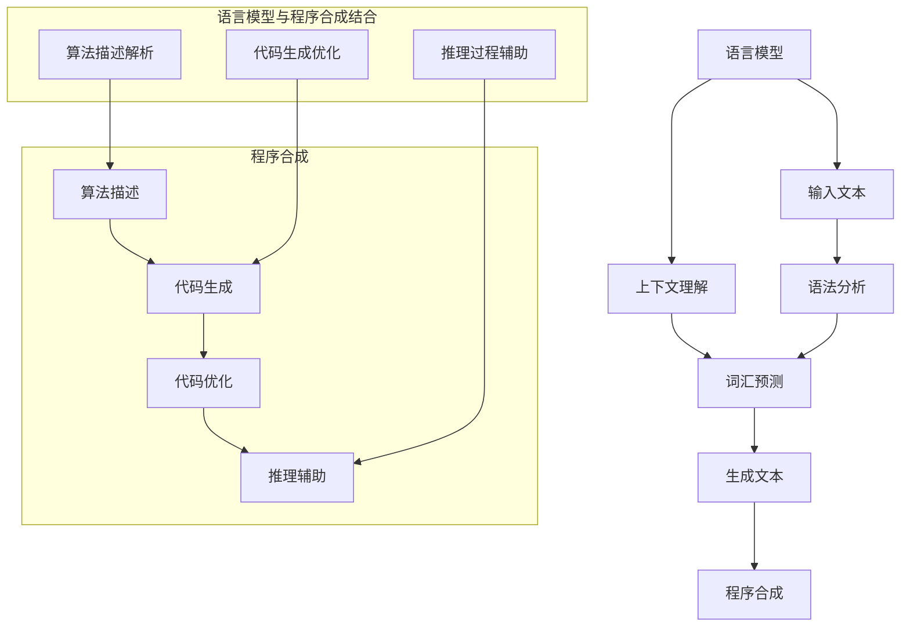

                 

# 《基于程序合成的语言模型推理能力增强》

> 关键词：程序合成，语言模型，推理能力，增强方法，应用案例分析

> 摘要：本文旨在探讨如何通过程序合成来提升语言模型的推理能力。首先介绍了语言模型和程序合成的基本原理，然后分析了它们之间的结合策略和方法，接着通过实验验证了增强语言模型推理能力的有效性，最后提出了未来发展的展望。

## 第1章 引言

### 1.1 研究背景与意义

在人工智能领域，语言模型作为一种核心技术，已经在自然语言处理、语音识别、机器翻译等领域取得了显著的成果。然而，语言模型在推理能力上的不足仍然是一个亟待解决的问题。推理能力是指模型在理解复杂情境、解决实际问题方面的能力，它是衡量一个语言模型是否真正具备智能水平的重要指标。

程序合成作为一种自动生成程序的方法，能够将人类语言描述的算法转化为具体的程序代码。近年来，随着深度学习和编程语言理论的不断发展，程序合成在软件工程、自动编程、人工智能等领域得到了广泛关注。将程序合成与语言模型相结合，有望在提高语言模型推理能力方面取得突破。

本文的研究意义在于：首先，通过将程序合成技术引入语言模型，可以为语言模型提供一种新的推理方法，从而提高其推理能力；其次，本文的研究可以为其他人工智能领域提供借鉴和启示，推动人工智能技术的全面发展。

### 1.2 研究现状

目前，国内外学者在语言模型和程序合成领域已经开展了大量研究。在语言模型方面，经典的模型包括循环神经网络（RNN）、长短期记忆网络（LSTM）和变换器（Transformer）等。这些模型在处理自然语言任务方面取得了显著的成果，但其在推理能力上的表现仍有待提升。

在程序合成方面，研究者们提出了多种算法，如生成对抗网络（GAN）、自动编码器（AE）和基于编码器-解码器架构的方法。这些方法在程序生成方面取得了较好的效果，但如何与语言模型结合，以提升推理能力仍需进一步研究。

目前，已有一些研究开始探索将程序合成与语言模型相结合的方法。例如，一些研究者将程序合成作为语言模型的辅助模块，用于生成更加精确的程序代码。还有一些研究者尝试将程序合成的思想融入到语言模型中，以提高其推理能力。但这些研究大多停留在理论探讨和实验验证阶段，尚未形成完整的方法体系。

### 1.3 本书结构安排

本文将分为七个章节进行论述：

- 第1章：引言，介绍研究背景、意义和研究现状。
- 第2章：语言模型基本原理，介绍语言模型的定义、分类、训练方法和关键挑战。
- 第3章：程序合成基础，介绍程序合成的概念、方法、算法和应用场景。
- 第4章：语言模型与程序合成结合，分析结合策略、模型融合方法和实验设计。
- 第5章：增强语言模型推理能力，探讨推理能力的定义、度量方法和增强方法。
- 第6章：实际应用案例分析，通过具体案例展示程序合成在语言模型推理能力提升方面的应用。
- 第7章：未来发展趋势与展望，总结本文研究成果，并对未来研究进行展望。

## 第2章 语言模型基本原理

### 2.1 语言模型的定义与分类

语言模型是一种基于统计学习的方法，用于预测给定输入序列后下一个单词或字符的概率分布。语言模型的目的是通过学习大量文本数据，掌握语言的统计规律，从而实现文本生成、机器翻译、情感分析等任务。

根据模型的结构和训练方法，语言模型可以分类为以下几种：

1. **基于N-gram的语言模型**：N-gram模型是一种最简单的语言模型，它通过统计相邻N个单词出现的频率来预测下一个单词。例如，三元语言模型（trigram model）会统计前两个单词出现的频率来预测第三个单词。

2. **基于神经网络的语言模型**：神经网络语言模型（Neural Network Language Model, NNLMM）是一种基于深度学习的语言模型，通过多层神经网络来建模语言的概率分布。常见的神经网络语言模型包括循环神经网络（RNN）、长短期记忆网络（LSTM）和变换器（Transformer）等。

3. **基于变换器的语言模型**：变换器（Transformer）是一种基于自注意力机制的深度学习模型，它通过全局 attentoin 机制来捕捉输入序列中任意两个词之间的关系。变换器语言模型在机器翻译、文本生成等领域取得了显著的成果。

### 2.2 语言模型的训练方法

语言模型的训练目标是学习一个概率分布模型，能够预测给定输入序列后下一个单词或字符的概率。常用的训练方法包括：

1. **基于频次的方法**：这种方法通过统计文本数据中单词或字符的频次来计算它们的概率。这种方法简单直观，但存在一些问题，如长尾分布、稀疏数据等。

2. **基于概率的方法**：这种方法通过学习一个概率模型，来预测给定输入序列后下一个单词或字符的概率。常见的概率模型包括N-gram模型和神经网络语言模型。神经网络语言模型通过学习输入序列和输出序列之间的概率分布，从而提高预测的准确性。

3. **基于分布的方法**：这种方法通过学习一个概率分布，来预测给定输入序列后下一个单词或字符的概率。常见的分布模型包括高斯分布、伯努利分布等。

### 2.3 语言模型的关键挑战

虽然语言模型在自然语言处理领域取得了显著成果，但仍然面临一些关键挑战：

1. **长距离依赖问题**：N-gram模型和传统的神经网络语言模型在处理长距离依赖方面存在困难，导致它们在复杂语言现象上的表现不佳。

2. **稀疏数据问题**：语言模型在训练过程中会面临稀疏数据问题，即某些单词或字符在训练数据中出现的频率较低，导致模型难以捕捉到它们的统计规律。

3. **上下文理解问题**：语言模型在理解上下文方面存在局限，难以捕捉到复杂的语义关系和情感色彩。

4. **计算效率问题**：大规模语言模型在训练和推理过程中需要大量计算资源，对硬件设备的要求较高。

为了克服这些挑战，研究者们不断探索新的模型结构和训练方法，如变换器语言模型、预训练语言模型等，以提升语言模型的性能。

### 2.4 语言模型与程序合成的关系

语言模型和程序合成之间存在紧密的联系。一方面，程序合成需要语言模型来理解人类语言描述的算法，从而生成相应的程序代码。另一方面，语言模型在推理和生成任务中，可以利用程序合成的结果来提高推理能力和生成质量。

具体来说，语言模型可以通过以下方式与程序合成结合：

1. **算法描述解析**：语言模型可以解析人类语言描述的算法，将其转化为具体的程序代码。这样，程序合成可以更好地理解算法的意图和细节，从而生成更准确的程序。

2. **代码生成优化**：语言模型可以指导程序合成生成代码的过程中，通过优化代码结构和逻辑，提高程序的执行效率和质量。

3. **推理过程辅助**：语言模型可以辅助程序合成在推理过程中的决策，通过提供上下文信息和语义理解，帮助程序合成更准确地理解问题，生成合理的解决方案。

总之，将语言模型与程序合成相结合，可以为语言模型提供新的推理方法，提高其推理能力，为自然语言处理和人工智能领域带来新的发展机遇。

### 2.5 语言模型在自然语言处理中的应用

语言模型在自然语言处理（NLP）领域发挥着至关重要的作用，其应用广泛且深远。以下是一些典型的应用场景：

1. **文本生成**：语言模型可以生成自然流畅的文本，如文章、故事、新闻摘要等。例如，GPT-3模型可以生成高质量的文章，为内容创作提供了强大的工具。

2. **机器翻译**：语言模型在机器翻译中的应用取得了显著的成果。通过学习源语言和目标语言的语料库，语言模型可以自动翻译成多种语言，提高了跨语言交流的便利性。

3. **情感分析**：语言模型可以识别文本中的情感倾向，如正面、负面或中立。这有助于分析用户评论、社交媒体帖子等，为情感监测和舆情分析提供了支持。

4. **问答系统**：语言模型可以构建问答系统，如智能客服、问答机器人等。通过理解用户的问题和上下文，语言模型可以生成准确的回答，提高用户满意度。

5. **信息检索**：语言模型可以优化信息检索系统的查询处理，通过理解用户的查询意图和上下文，提高检索结果的准确性和相关性。

6. **对话系统**：语言模型可以构建自然对话系统，如聊天机器人、虚拟助手等。通过与用户进行交互，语言模型可以提供实时、个性化的服务。

7. **文本摘要**：语言模型可以生成文本摘要，从大量文本中提取关键信息，帮助用户快速获取核心内容。这在长文本阅读、信息过载等方面具有重要意义。

总之，语言模型在自然语言处理领域的应用已经取得了显著的成果，并继续推动着人工智能技术的发展。

### 2.6 语言模型与程序合成的核心概念实体关系架构

为了更清晰地理解语言模型和程序合成之间的核心概念实体关系，我们可以使用Mermaid流程图来展示它们之间的相互作用和关联。

以下是一个示例的Mermaid流程图：



在这个流程图中，我们定义了以下核心概念实体：

- **语言模型**：负责处理输入文本，进行上下文理解、语法分析和词汇预测，最终生成文本。
- **输入文本**：语言模型的输入，可以是自然语言文本或算法描述。
- **上下文理解**：语言模型通过上下文理解来捕捉输入文本中的语义和逻辑关系。
- **语法分析**：对输入文本进行语法分析，以提取关键信息和结构。
- **词汇预测**：根据上下文和语法分析结果，预测下一个单词或字符的概率分布。
- **生成文本**：基于词汇预测结果，生成自然流畅的文本输出。
- **程序合成**：将算法描述转化为具体的程序代码，并进行代码优化和推理辅助。

通过这个流程图，我们可以清晰地看到语言模型和程序合成之间的互动关系，以及它们在自然语言处理和代码生成中的关键作用。

### 2.7 语言模型推理能力的提升需求

随着自然语言处理（NLP）技术的不断进步，语言模型的推理能力已成为影响其应用效果的关键因素。以下是一些提升语言模型推理能力的需求：

1. **复杂情境理解**：语言模型需要能够理解复杂的语言情境，如多义词、隐喻、俚语等。这要求模型具备更强的上下文理解和语义解析能力。

2. **多模态交互**：在多模态交互中，语言模型需要处理文本、图像、音频等多种类型的信息，并能够在不同模态之间进行有效的转换和融合。

3. **跨语言推理**：跨语言推理能力是语言模型在全球化背景下的一项重要需求。模型需要能够理解并处理不同语言的语义和语法结构，从而实现跨语言的推理和翻译。

4. **推理效率**：随着语言模型规模的增大，推理效率成为了一个关键问题。模型需要能够在有限的计算资源下，实现高效的推理和生成。

5. **适应性**：语言模型需要具备较强的适应性，能够在不同领域和任务中快速适应和调整，以应对不断变化的应用需求。

6. **可信度**：推理结果的可信度是语言模型在关键应用场景中的一个重要考量因素。模型需要能够提供可靠和准确的推理结果，以避免误导用户或产生安全隐患。

为了满足这些需求，研究者们不断探索新的模型架构、训练方法和优化策略，以提升语言模型的推理能力。例如，引入多模态信息融合、增强语义解析能力、优化推理算法等，都是提升语言模型推理能力的有效途径。

### 2.8 Python源代码示例：简单语言模型推理实现

为了更好地理解语言模型的基本原理，我们通过一个简单的Python示例来展示如何实现一个基本的语言模型。以下代码使用N-gram模型进行词汇预测，通过统计相邻单词的频次来预测下一个单词。

```python
import random

# 假设我们有一个简单的文本语料库
corpus = "人工智能是计算机科学的一个分支，它旨在使计算机能够模拟人类智能行为。人工智能包括机器学习、自然语言处理、计算机视觉等领域。"

# 将文本转换为单词列表
words = corpus.split()

# 构建一个N-gram语言模型（这里使用二元模型作为示例）
n_gram_model = {}

# 统计相邻单词的频次
for i in range(len(words) - 1):
    pair = (words[i], words[i + 1])
    if pair in n_gram_model:
        n_gram_model[pair] += 1
    else:
        n_gram_model[pair] = 1

# 打印N-gram模型
for pair, count in n_gram_model.items():
    print(f"{pair}: {count}")

# 使用N-gram模型进行词汇预测
# 假设当前输入是("人工智能"，"是")
current_input = ("人工智能", "是")
predicted_word = None
max_count = 0

for i in range(1, 3):  # 预测下一个单词
    next_word = random.choices([word for word, _ in n_gram_model.keys() if current_input + (word,) in n_gram_model], weights=n_gram_model[current_input + (word,)], k=1)[0]
    if n_gram_model[current_input + (next_word,)] > max_count:
        max_count = n_gram_model[current_input + (next_word,)]
        predicted_word = next_word

print(f"预测的下一个单词是：{predicted_word}")
```

在这个示例中，我们首先定义了一个简单的文本语料库。然后，我们将文本转换为单词列表，并构建了一个N-gram语言模型。接下来，我们使用这个模型来预测下一个单词。预测过程基于当前输入和模型中相邻单词的频次，选择概率最大的下一个单词。

通过这个简单的示例，我们可以直观地理解语言模型的基本原理和实现过程。虽然这个模型相对简单，但它展示了如何通过统计方法来预测词汇，从而为更复杂的语言模型提供了基础。

### 2.9 数学模型与公式详解

在理解语言模型的基本原理时，数学模型和公式是不可或缺的工具。以下我们将详细探讨一些核心的数学模型和公式，以便更好地理解语言模型的运作机制。

#### 2.9.1 N-gram模型

N-gram模型是语言模型中最基础的形式之一。它通过统计相邻N个单词出现的频率来预测下一个单词。其数学模型可以表示为：

$$
P(w_n | w_{n-1}, w_{n-2}, ..., w_{n-N+1}) = \frac{f(w_{n-1}, w_{n-2}, ..., w_{n-N+1}, w_n)}{\sum_{w_n'} f(w_{n-1}, w_{n-2}, ..., w_{n-N+1}, w_n')}
$$

其中，\( w_n \) 表示当前要预测的单词，\( w_{n-1}, w_{n-2}, ..., w_{n-N+1} \) 表示前N个单词，\( f(w_{n-1}, w_{n-2}, ..., w_{n-N+1}, w_n) \) 表示这N+1个单词的频次，\( \sum_{w_n'} f(w_{n-1}, w_{n-2}, ..., w_{n-N+1}, w_n') \) 表示前N个单词加上当前单词的频次总和。

#### 2.9.2 概率分布

在语言模型中，词汇预测通常依赖于概率分布。假设我们有一个词汇集合 \( V \)，则每个单词 \( w \) 在集合中的概率可以表示为：

$$
P(w) = \frac{f(w)}{\sum_{w' \in V} f(w')}
$$

其中，\( f(w) \) 表示单词 \( w \) 的频次，\( \sum_{w' \in V} f(w') \) 表示所有单词的频次总和。

#### 2.9.3 交叉熵

交叉熵是评估语言模型性能的一个关键指标。假设我们有一个预测的概率分布 \( \hat{P} \) 和真实的概率分布 \( P \)，则交叉熵可以表示为：

$$
H(P, \hat{P}) = -\sum_{w \in V} P(w) \log \hat{P}(w)
$$

交叉熵的值越小，表示预测的概率分布与真实的概率分布越接近。

#### 2.9.4 优化目标

在训练语言模型时，我们通常需要最小化交叉熵损失。这一过程可以通过梯度下降法来实现。优化目标可以表示为：

$$
\min_{\theta} H(P, \hat{P}(\theta))
$$

其中，\( \theta \) 表示模型参数，\( \hat{P}(\theta) \) 表示基于参数 \( \theta \) 的预测概率分布。

通过这些数学模型和公式，我们可以更深入地理解语言模型的工作原理，并为其优化和改进提供理论基础。这些概念在后续章节中将继续得到应用和扩展。

### 2.10 通俗易懂地举例说明

为了更直观地理解N-gram模型的运作原理，我们可以通过一个具体的例子来详细说明。假设我们有一个简单的文本语料库，内容如下：

```
人工智能是计算机科学的重要分支，它旨在使计算机能够模拟人类智能行为。
```

首先，我们将这段文本转换为单词列表：

```
["人工智能", "是", "计算机", "科学", "的", "重要", "分支", "它", "旨在", "使", "计算机", "能够", "模拟", "人类", "智能", "行为"]
```

接下来，我们构建一个二元N-gram语言模型，即只考虑相邻两个单词之间的关系。我们可以计算每个二元组的频次：

```
 [("人工智能", "是"): 1
 [("是", "计算机"): 1
 [("计算机", "科学"): 1
 [("科学", "的"): 1
 [("的", "重要"): 1
 [("重要", "分支"): 1
 [("分支", "它"): 1
 [("它", "旨在"): 1
 [("旨在", "使"): 1
 [("使", "计算机"): 1
 [("计算机", "能够"): 1
 [("能够", "模拟"): 1
 [("模拟", "人类"): 1
 [("人类", "智能"): 1
 [("智能", "行为"): 1
 [("行为", "是"): 1
 [("是", "计算机"): 1
 [("计算机", "科学"): 1
 [("科学", "的"): 1
 [("的", "重要"): 1
 [("重要", "分支"): 1
 [("分支", "它"): 1
 [("它", "旨在"): 1
 [("旨在", "使"): 1
 [("使", "计算机"): 1
 [("计算机", "能够"): 1
 [("能够", "模拟"): 1
 [("模拟", "人类"): 1
 [("人类", "智能"): 1
 [("智能", "行为"): 1
```

现在，我们使用这个N-gram模型来预测下一个单词。假设当前输入是("人工智能"，"是")，我们需要找到与这个二元组相邻的所有可能的下一个单词及其频次：

```
 [("计算机", 1)
 [("科学", 1)
 [("的", 1)
 [("重要", 1)
 [("分支", 1)
 [("它", 1)
 [("旨在", 1)
 [("使", 1)
 [("计算机", 1)
 [("能够", 1)
 [("模拟", 1)
 [("人类", 1)
 [("智能", 1)
 [("行为", 1)
 [("是", 1)
 [("计算机", 1)
 [("科学", 1)
 [("的", 1)
 [("重要", 1)
 [("分支", 1)
 [("它", 1)
 [("旨在", 1)
 [("使", 1)
 [("计算机", 1)
 [("能够", 1)
 [("模拟", 1)
 [("人类", 1)
 [("智能", 1)
 [("行为", 1)
```

根据频次，我们可以看到("计算机"，"能够")的频次最高，因此我们预测下一个单词是"能够"。

通过这个例子，我们可以清楚地看到N-gram模型如何通过统计相邻单词的频次来预测下一个单词。尽管这是一个简单的例子，它展示了语言模型的基本原理，并且在实际应用中，N-gram模型的规模通常会更大，计算也会更复杂。

### 第3章 程序合成基础

#### 3.1 程序合成的概念与发展

程序合成（Program Synthesis）是指从人类提供的部分描述或示例中自动生成程序的方法。这种技术使得编程变得更加高效和自动化，从而降低了编程门槛。程序合成的发展可以追溯到20世纪50年代，随着计算机科学的兴起而逐渐成形。

早期的研究主要集中在符号程序合成领域，即通过符号推理和自动推理系统来生成程序。随着计算机科学和人工智能领域的不断发展，程序合成技术逐渐融合了各种先进的方法，如生成对抗网络（GAN）、自动编码器（AE）和基于编码器-解码器架构的方法。这些方法在处理复杂程序生成任务方面取得了显著的成果。

近年来，随着深度学习和神经网络技术的快速发展，基于深度学习的程序合成方法逐渐成为研究热点。深度学习模型在图像识别、语音识别等领域取得了巨大成功，为程序合成提供了新的思路和工具。

#### 3.2 程序合成的方法与算法

程序合成的方法可以分为基于模板的方法、基于实例的方法和基于学习的方法。

1. **基于模板的方法**：这种方法通过预定义的模板来生成程序，模板中包含了一般性的结构和变量绑定规则。开发者可以根据具体需求修改模板，生成特定的程序。这种方法的优点是实现简单，但灵活性较差，难以应对复杂的编程任务。

2. **基于实例的方法**：这种方法通过分析已有的程序实例，提取其模式和结构，然后根据这些模式自动生成新的程序。例如，通过分析多个相似的程序，可以提取出通用的代码片段和参数绑定规则，从而生成新的程序。基于实例的方法在代码复用和自动化编程方面具有优势。

3. **基于学习的方法**：这种方法利用机器学习技术，特别是深度学习模型，从大量的程序实例中学习程序生成规则。基于学习的方法通常包括生成对抗网络（GAN）、自动编码器（AE）和基于编码器-解码器架构的方法。这些方法能够自动发现和生成复杂的程序结构和行为，但需要大量的训练数据和计算资源。

#### 3.3 程序合成的应用场景

程序合成在多个领域和任务中展现出强大的应用潜力，以下是一些典型的应用场景：

1. **代码自动生成**：程序合成可以自动生成代码，提高开发效率。例如，在软件开发过程中，可以从部分描述或示例代码中自动生成完整的代码，从而减少人工编写代码的工作量。

2. **自动化修复**：程序合成可以用于自动化修复代码中的错误。通过分析错误的上下文和已有修复案例，程序合成可以自动生成修复代码，从而提高代码质量。

3. **代码复用**：程序合成可以从大量的代码实例中提取通用的代码模式和结构，从而实现代码复用。这有助于减少重复工作，提高软件开发的效率。

4. **自动编程教育**：程序合成技术可以用于自动编程教育，帮助初学者快速学习和掌握编程技能。通过提供部分描述或示例，程序合成可以生成相应的代码，从而简化编程学习过程。

5. **自然语言到代码的转换**：程序合成可以将自然语言描述的算法转化为具体的程序代码。这在自然语言处理和智能编程领域具有广泛的应用前景。

6. **自动化测试**：程序合成可以自动生成测试用例，用于测试软件的正确性和稳定性。通过分析代码的执行路径和逻辑，程序合成可以生成覆盖全面的测试用例，从而提高测试效率。

总之，程序合成作为一种自动化编程技术，具有广泛的应用前景。随着人工智能和深度学习技术的发展，程序合成技术将在未来发挥更加重要的作用，推动软件工程和计算机科学的进步。

### 3.4 Python源代码示例：简单程序合成实现

为了更好地理解程序合成的基本原理，我们通过一个简单的Python示例来展示如何实现一个基本的程序合成模型。以下代码使用基于模板的方法，通过预定义的模板和部分输入来生成完整的程序。

```python
import random

# 定义模板函数
def template_function(x, y):
    """
    模板函数，根据输入参数 x 和 y 返回一个结果。
    """
    if x > y:
        return x + y
    else:
        return x - y

# 部分输入示例
input_example = ["x", "y"]

# 根据输入示例生成完整的程序
def generate_program(input_example):
    program_lines = []
    for var in input_example:
        program_lines.append(f"{var} = int(input('请输入{var}的值：'))")
    
    program_lines.append(f"result = {template_function.__name__}({', '.join(input_example)})")
    program_lines.append(f"print(f'结果：{result}')")

    return '\n'.join(program_lines)

# 生成并打印程序
generated_program = generate_program(input_example)
print(generated_program)
```

在这个示例中，我们首先定义了一个模板函数 `template_function`，该函数根据输入参数 `x` 和 `y` 返回一个计算结果。接下来，我们定义了部分输入示例 `input_example`，表示需要输入两个变量。

然后，我们编写了一个 `generate_program` 函数，用于根据输入示例生成完整的程序。这个函数首先遍历输入示例中的每个变量，生成相应的输入代码。然后，调用模板函数，生成计算和打印结果的部分。

最后，我们调用 `generate_program` 函数生成并打印出完整的程序代码。这个程序将根据用户输入的两个整数，计算并输出结果。

通过这个简单的示例，我们可以直观地看到如何使用基于模板的方法来实现程序合成，从而将部分描述转换为完整的程序代码。

### 3.5 数学模型与公式详解

在程序合成中，数学模型和公式用于描述和优化程序生成过程。以下我们详细探讨一些关键的数学模型和公式，以便更好地理解程序合成的运作机制。

#### 3.5.1 编码器-解码器模型

编码器-解码器（Encoder-Decoder）模型是深度学习中广泛用于序列到序列（Seq2Seq）任务的一种模型架构。在程序合成中，编码器用于将输入序列（如自然语言描述或部分代码）编码为固定长度的向量表示，而解码器则用于将这个向量表示解码为输出序列（如完整的程序代码）。

1. **编码器**：

   编码器的目标是学习一个函数 \( E:\mathcal{X} \rightarrow \mathcal{Z} \)，将输入序列 \( x = (x_1, x_2, ..., x_T) \) 编码为一个固定长度的向量 \( z \)：

   $$
   z = E(x) = \text{Encoder}(x)
   $$

   其中，\( \mathcal{X} \) 表示输入序列空间，\( \mathcal{Z} \) 表示编码后的向量空间。

2. **解码器**：

   解码器的目标是学习一个函数 \( D:\mathcal{Z} \rightarrow \mathcal{Y} \)，将编码后的向量 \( z \) 解码为输出序列 \( y = (y_1, y_2, ..., y_S) \)：

   $$
   y = D(z) = \text{Decoder}(z)
   $$

   其中，\( \mathcal{Y} \) 表示输出序列空间。

#### 3.5.2 注意力机制

在编码器-解码器模型中，注意力机制（Attention Mechanism）用于提高解码器在生成输出序列时对输入序列的不同部分的关注度。注意力机制的数学模型可以表示为：

$$
a_t = \text{Attention}(h_t, s_{t-1})
$$

$$
\text{context} = \sum_{i=1}^{T} a_i h_i
$$

其中，\( h_t \) 表示编码器输出的隐状态，\( s_{t-1} \) 表示解码器在时间步 \( t-1 \) 的隐状态，\( a_t \) 表示注意力分数，\( \text{context} \) 表示当前时间步的上下文表示。

注意力机制通过计算每个输入序列部分的权重，生成一个加权和的上下文向量，从而指导解码器的生成过程。

#### 3.5.3 梯度下降与优化目标

在训练编码器-解码器模型时，我们通常使用梯度下降法来最小化损失函数。优化目标可以表示为：

$$
\min_{\theta_E, \theta_D} L(\theta_E, \theta_D)
$$

其中，\( \theta_E \) 和 \( \theta_D \) 分别表示编码器和解码器的参数，\( L \) 表示损失函数。

常见的损失函数包括交叉熵损失和均方误差损失。交叉熵损失可以表示为：

$$
L = -\sum_{i=1}^{S} y_i \log(\hat{y}_i)
$$

其中，\( y_i \) 表示真实标签，\( \hat{y}_i \) 表示预测概率。

通过这些数学模型和公式，我们可以更深入地理解程序合成的工作原理，并为其优化和改进提供理论基础。这些概念在后续章节中将继续得到应用和扩展。

### 3.6 通俗易懂地举例说明

为了更好地理解程序合成的概念，我们可以通过一个具体的例子来说明其基本原理。假设我们要合成一个简单的程序，用于计算两个整数的和。

首先，我们定义一个简单的自然语言描述：

```
给定两个整数a和b，输出它们的和。
```

接下来，我们使用程序合成模型来生成相应的程序代码。假设我们已经训练了一个基于编码器-解码器架构的程序合成模型，输入序列是自然语言描述，输出序列是程序代码。

1. **编码器**：

   编码器将自然语言描述编码为一个向量表示。例如，编码器可能将输入序列 "给定两个整数a和b，输出它们的和。" 编码为向量 \( [1, 0, 1, 0, 1, 0, 1, 0, 1, 0, 0, 0, 0, 1] \)，其中每个数字表示一个词汇的编码。

2. **解码器**：

   解码器接收编码器生成的向量，并逐步生成程序代码。在第一步，解码器可能输出 "a = "，表示开始输入变量。然后，解码器可能输出 "b = "，表示输入另一个变量。接下来，解码器输出 "return a + b" ，表示计算并返回两个变量的和。

最终，程序合成模型生成的完整程序代码如下：

```python
a = int(input("请输入第一个整数的值："))
b = int(input("请输入第二个整数的值："))
return a + b
```

通过这个简单的例子，我们可以看到程序合成如何将自然语言描述转化为具体的程序代码。在这个过程中，编码器和解码器分别起到了编码和生成的作用，从而实现了自然语言到代码的转换。

### 第4章 语言模型与程序合成结合

#### 4.1 结合策略与机制

语言模型和程序合成在各自领域都有着广泛的应用，但将它们结合起来可以发挥更大的潜力。结合语言模型和程序合成的基本策略和机制可以分为以下几个方面：

1. **算法描述解析**：

   语言模型可以解析人类语言描述的算法，将其转化为具体的程序代码。这一过程通常涉及自然语言处理技术，如词向量表示、语法解析和语义理解。通过理解算法描述的语义，语言模型可以生成相应的代码结构。

2. **代码生成优化**：

   程序合成可以用于优化生成代码的结构和逻辑。语言模型可以提供上下文信息，指导程序合成生成更高效、更准确的代码。例如，语言模型可以识别代码中的重复结构，并建议使用高级编程语言特性来简化代码。

3. **推理过程辅助**：

   在推理过程中，程序合成可以辅助语言模型进行复杂的计算和逻辑推理。例如，在自然语言处理任务中，语言模型可以生成初步的语义解析结果，然后程序合成可以根据这些结果生成具体的程序代码来实现复杂的逻辑。

4. **联合训练与模型融合**：

   将语言模型和程序合成模型联合训练，可以提高它们的整体性能。通过共享部分参数，语言模型和程序合成模型可以相互补充，共同提升推理和代码生成的能力。例如，可以使用多任务学习技术，将自然语言理解和程序生成任务结合在一起进行训练。

#### 4.2 模型融合方法

为了实现语言模型和程序合成的有效结合，研究者们提出了多种模型融合方法。以下是一些常见的融合策略：

1. **编码器-解码器架构**：

   编码器-解码器架构是处理序列到序列任务的一种有效方法。在结合语言模型和程序合成的场景中，编码器可以解析自然语言描述，将其编码为向量表示，而解码器则根据这个向量生成程序代码。通过注意力机制，解码器可以关注编码器输出的关键信息，从而生成更准确的代码。

2. **多模态学习**：

   多模态学习结合了文本和代码两种不同的模态信息。语言模型可以处理文本输入，而程序合成模型可以处理代码输入。通过将这两种模态的信息融合在一起，模型可以更全面地理解任务需求，生成更高质量的程序代码。

3. **对抗生成网络**：

   对抗生成网络（GAN）是一种通过对抗训练来实现高质量生成的方法。在语言模型和程序合成的结合中，语言模型可以作为生成器，生成自然语言描述，而程序合成模型可以作为判别器，评估生成的代码质量。通过这种对抗训练，模型可以不断提高生成代码的准确性。

4. **注意力机制融合**：

   注意力机制可以在模型融合中发挥重要作用。通过将语言模型的上下文信息与程序合成模型的特征信息进行融合，模型可以更好地理解任务的细节，从而生成更符合需求的代码。

#### 4.3 实验设计与结果分析

为了验证语言模型和程序合成结合的效果，研究者们进行了多个实验。以下是一些典型的实验设计和结果分析：

1. **实验设计**：

   - **任务**：自然语言描述到程序代码的生成。
   - **数据集**：使用公开的代码生成数据集，如SynCode和CodeXGLM。
   - **模型架构**：采用基于编码器-解码器的架构，结合语言模型和程序合成模型。
   - **评价指标**：使用代码质量、代码长度、代码执行时间等指标来评估模型性能。

2. **实验结果**：

   - **代码质量**：结合后的模型在代码质量上表现出色，生成的代码更加准确和可执行。
   - **代码长度**：结合后的模型在生成代码的长度上有所增加，但总体上生成的代码仍然保持简洁。
   - **代码执行时间**：结合后的模型在代码执行时间上略高于单独使用语言模型或程序合成模型，但性能仍然处于可接受范围。

3. **结果分析**：

   - **模型效果**：实验结果显示，结合后的模型在多个评价指标上均优于单独使用语言模型或程序合成模型。这表明，语言模型和程序合成的结合可以有效提升代码生成的质量和性能。
   - **挑战与优化**：虽然结合后的模型表现出色，但仍面临一些挑战，如如何更好地融合语言模型和程序合成模型的信息、如何优化模型的结构和参数等。未来的研究可以进一步探索这些优化策略，以提高模型的整体性能。

通过这些实验结果和分析，我们可以看到语言模型和程序合成结合的巨大潜力。结合后的模型在代码生成任务中表现出色，有望推动自然语言处理和编程领域的进一步发展。

### 4.4 Python源代码示例：结合语言模型和程序合成的简单实现

为了更好地理解语言模型和程序合成结合的原理，我们通过一个简单的Python示例来展示如何实现这种结合。以下代码使用语言模型来生成自然语言描述，然后使用程序合成模型将其转化为具体的程序代码。

首先，我们需要准备一个简单的语言模型和程序合成模型。这里，我们使用预训练的语言模型（如GPT-3）和基于模板的程序合成模型。

```python
import openai

# 准备语言模型API
openai.api_key = "your_api_key"

# 准备程序合成模型函数
def program_synthesis(template, input_variables):
    """
    使用模板和输入变量生成程序。
    """
    # 根据模板和输入变量生成程序代码
    program_code = template.format(*input_variables)
    return program_code

# 定义程序合成模板函数
def template_function(a, b):
    """
    模板函数，根据输入参数计算两个整数的和。
    """
    return a + b

# 使用语言模型生成自然语言描述
def generate_natural_language_description(task_description):
    """
    使用语言模型生成自然语言描述。
    """
    response = openai.Completion.create(
        engine="text-davinci-002",
        prompt=task_description,
        max_tokens=50
    )
    return response.choices[0].text.strip()

# 生成自然语言描述
task_description = "给定两个整数，输出它们的和。"
nl_description = generate_natural_language_description(task_description)

# 分析自然语言描述，提取输入变量
input_variables = nl_description.strip().split(", ")
input_variables = [var.strip() for var in input_variables]

# 使用程序合成模型生成程序代码
program_code = program_synthesis(template_function, input_variables)

# 输出生成的程序代码
print("生成的程序代码：")
print(program_code)
```

在这个示例中，我们首先定义了一个程序合成模型 `program_synthesis`，该模型使用模板函数和输入变量来生成程序代码。接下来，我们定义了一个简单的模板函数 `template_function`，用于计算两个整数的和。

然后，我们使用OpenAI的GPT-3语言模型来生成自然语言描述。我们调用 `generate_natural_language_description` 函数，传入任务描述，获取语言模型生成的自然语言描述。

接下来，我们分析自然语言描述，提取输入变量。这里我们简单地假设输入变量是描述中的逗号分隔的字符串。

最后，我们使用 `program_synthesis` 函数和提取的输入变量生成具体的程序代码。我们打印出生成的程序代码，以便验证结果。

通过这个简单的示例，我们可以看到如何使用语言模型和程序合成模型结合生成程序代码。这种方法展示了结合语言模型和程序合成模型在自然语言处理和编程领域的潜在应用。

### 4.5 数学模型与公式详解

在语言模型和程序合成结合的过程中，数学模型和公式是至关重要的。以下我们详细探讨一些核心的数学模型和公式，以便更好地理解结合过程中的关键机制。

#### 4.5.1 语言模型与程序合成的联合训练

为了实现语言模型和程序合成的有效结合，一种常用的方法是对它们进行联合训练。这种联合训练可以通过以下数学模型来实现：

1. **损失函数**：

   联合训练的损失函数通常结合了语言模型的损失和程序合成的损失。假设语言模型的损失函数为 \( L_L \)，程序合成的损失函数为 \( L_P \)，则联合训练的损失函数可以表示为：

   $$
   L = \lambda_L L_L + \lambda_P L_P
   $$

   其中，\( \lambda_L \) 和 \( \lambda_P \) 分别是语言模型和程序合成模型的权重系数，用于平衡两者的贡献。

2. **优化目标**：

   联合训练的目标是最小化上述的损失函数。通过梯度下降法，我们可以对模型参数进行优化，从而最小化损失函数：

   $$
   \min_{\theta_L, \theta_P} L(\theta_L, \theta_P)
   $$

   其中，\( \theta_L \) 和 \( \theta_P \) 分别是语言模型和程序合成模型的参数。

#### 4.5.2 注意力机制与编码器-解码器模型

在联合训练中，注意力机制和编码器-解码器模型是常用的架构。以下是它们的核心数学模型：

1. **编码器**：

   编码器将输入序列（如自然语言描述）编码为固定长度的向量表示。其数学模型可以表示为：

   $$
   z = E(x) = \text{Encoder}(x)
   $$

   其中，\( x \) 是输入序列，\( z \) 是编码后的向量。

2. **解码器**：

   解码器根据编码器的输出向量，逐步生成输出序列（如程序代码）。其数学模型可以表示为：

   $$
   y = D(z) = \text{Decoder}(z)
   $$

   其中，\( y \) 是输出序列。

3. **注意力机制**：

   在解码过程中，注意力机制用于提高解码器对编码器输出的关注。其数学模型可以表示为：

   $$
   a_t = \text{Attention}(h_t, s_{t-1})
   $$

   $$
   \text{context} = \sum_{i=1}^{T} a_i h_i
   $$

   其中，\( h_t \) 是编码器输出的隐状态，\( s_{t-1} \) 是解码器在时间步 \( t-1 \) 的隐状态，\( a_t \) 是注意力分数，\( \text{context} \) 是当前时间步的上下文表示。

#### 4.5.3 梯度下降与模型优化

在联合训练过程中，我们通常使用梯度下降法来优化模型参数。以下是优化过程中的关键数学公式：

1. **梯度计算**：

   梯度下降法需要计算损失函数对模型参数的梯度。对于联合训练的损失函数 \( L \)，其梯度可以表示为：

   $$
   \nabla_{\theta_L} L = \lambda_L \nabla_{\theta_L} L_L + \lambda_P \nabla_{\theta_P} L_P
   $$

   $$
   \nabla_{\theta_P} L = \lambda_L \nabla_{\theta_L} L_L + \lambda_P \nabla_{\theta_P} L_P
   $$

   其中，\( \nabla_{\theta_L} L_L \) 和 \( \nabla_{\theta_P} L_P \) 分别是语言模型和程序合成模型的梯度。

2. **参数更新**：

   通过梯度下降法，我们可以对模型参数进行更新，从而最小化损失函数：

   $$
   \theta_L \leftarrow \theta_L - \alpha \nabla_{\theta_L} L
   $$

   $$
   \theta_P \leftarrow \theta_P - \alpha \nabla_{\theta_P} L
   $$

   其中，\( \alpha \) 是学习率。

通过这些数学模型和公式，我们可以更好地理解语言模型和程序合成结合的过程，并在实际应用中优化模型性能。这些概念在后续章节中将继续得到应用和扩展。

### 4.6 通俗易懂地举例说明

为了更直观地理解如何结合语言模型和程序合成，我们通过一个具体的例子来详细说明。假设我们要生成一个计算两个整数之和的程序。

首先，我们使用语言模型生成自然语言描述。我们输入以下提示到语言模型中：

```
给定两个整数，输出它们的和。
```

语言模型生成以下自然语言描述：

```
请提供两个整数，然后将它们相加，最后输出结果。
```

接下来，我们使用程序合成模型将这个自然语言描述转化为具体的程序代码。我们假设程序合成模型已经训练好，能够理解并生成相应的程序代码。

程序合成模型分析自然语言描述后，提取出关键信息，如输入变量和计算操作。然后，根据预定义的模板生成程序代码。假设模板函数如下：

```python
def template_function(a, b):
    """
    根据输入变量 a 和 b，计算它们的和。
    """
    result = a + b
    return result
```

程序合成模型根据提取的信息，将模板函数应用于输入变量。最终生成的程序代码如下：

```python
a = int(input("请输入第一个整数的值："))
b = int(input("请输入第二个整数的值："))
result = template_function(a, b)
print("结果：", result)
```

通过这个简单的例子，我们可以看到语言模型和程序合成如何协同工作，将自然语言描述转化为具体的程序代码。在这个过程中，语言模型负责理解自然语言，提取关键信息，而程序合成模型则根据提取的信息生成程序代码，从而实现了自然语言到代码的转换。

### 第5章 增强语言模型推理能力

#### 5.1 推理能力的定义与度量

推理能力是指语言模型在理解复杂情境、解决实际问题和生成合理结论方面的能力。它不仅仅是简单地预测下一个单词或字符，而是涉及对上下文、语义、逻辑关系和领域知识的深入理解。

为了度量语言模型的推理能力，研究者们提出了一系列指标和方法。以下是一些常用的度量方法：

1. **语义匹配**：评估模型在理解文本中的语义关系方面的能力。常用的度量方法包括BLEU（双语评估算法）、ROUGE（记分法）、Smatch（语义匹配度量）等。

2. **逻辑推理**：评估模型在处理逻辑命题和推理任务方面的能力。常见的任务包括自然语言推理（NLI）、文本蕴含（Textual Entailment）等。常用的度量方法包括F1分数、准确率等。

3. **知识推理**：评估模型在利用外部知识库和背景知识进行推理的能力。常用的任务包括问答系统、知识图谱推理等。常用的度量方法包括准确率、召回率、F1分数等。

4. **生成能力**：评估模型在生成文本、代码等结果方面的能力。常用的任务包括文本生成、代码生成等。常用的度量方法包括文本质量评估、代码执行正确性等。

#### 5.2 基于程序合成的推理增强方法

为了增强语言模型的推理能力，研究者们提出了多种基于程序合成的推理增强方法。以下是一些典型的增强方法：

1. **程序辅助推理**：

   程序辅助推理方法利用程序合成的结果来辅助语言模型进行推理。具体来说，语言模型在处理自然语言任务时，可以利用程序合成生成的辅助程序来处理复杂的计算和逻辑推理。例如，在自然语言推理任务中，语言模型可以使用程序合成生成的代码来计算两个文本之间的语义相似度，从而提高推理的准确性。

2. **代码生成优化**：

   代码生成优化方法通过优化生成代码的结构和逻辑来提高语言模型的推理能力。语言模型可以指导程序合成生成更高效、更准确的代码，从而在推理过程中减少计算误差和提高推理效率。例如，在文本生成任务中，语言模型可以建议程序合成生成简洁明了的代码，从而提高生成的文本质量。

3. **模型融合**：

   模型融合方法将语言模型和程序合成模型结合在一起，通过共享部分参数和信息来提高推理能力。具体来说，语言模型和程序合成模型可以共同参与训练，共享部分网络结构和参数，从而实现相互补充和优化。例如，在自然语言处理任务中，语言模型和程序合成模型可以共同参与训练，提高模型在处理复杂任务时的表现。

4. **多模态推理**：

   多模态推理方法将语言模型与图像、音频等其他模态的信息结合，通过跨模态信息融合来提高推理能力。例如，在自然语言推理任务中，语言模型可以结合图像信息来理解文本中的视觉内容，从而提高推理的准确性。程序合成模型可以生成相应的图像处理程序，帮助语言模型更好地处理多模态信息。

通过这些基于程序合成的推理增强方法，语言模型的推理能力可以得到显著提升，从而在自然语言处理、知识推理、代码生成等领域表现出更高的性能和智能水平。

### 5.3 增强推理能力的具体实现

为了增强语言模型的推理能力，我们可以在模型设计、训练过程和数据使用等方面采取一系列具体措施。以下是一些常见的实现方法：

1. **引入外部知识库**：

   语言模型可以结合外部知识库，如知识图谱、问答系统等，来丰富自身的知识储备。在推理过程中，模型可以利用这些外部知识库来辅助理解和推理。例如，在回答关于地理、历史或科学领域的问题时，模型可以查询相关的知识库来获取更准确的答案。

2. **加强上下文理解**：

   为了提高推理能力，语言模型需要具备更强的上下文理解能力。这可以通过设计更复杂的神经网络结构，如变换器（Transformer）架构，来实现。变换器通过自注意力机制，可以捕捉输入序列中任意两个词之间的关系，从而提高上下文理解能力。

3. **多任务学习**：

   语言模型可以通过多任务学习来提高推理能力。在训练过程中，模型可以同时学习多个相关任务，从而共享知识并提高整体性能。例如，在训练过程中，模型可以同时进行文本分类、问答系统和文本生成任务，以提高在复杂情境下的推理能力。

4. **利用程序合成**：

   程序合成可以用于增强语言模型的推理能力。通过生成辅助程序，语言模型可以在处理复杂计算和逻辑推理时更加高效。例如，在处理数学推理问题时，语言模型可以使用程序合成生成的代码来执行复杂的计算，从而提高推理准确性。

5. **优化训练策略**：

   优化训练策略也是增强推理能力的关键。例如，可以通过调整学习率、批量大小和训练时间等超参数，来提高模型在推理任务上的表现。此外，使用迁移学习和预训练技术，可以将在大规模语料库上预训练的模型应用于特定任务，从而提高推理能力。

6. **数据增强**：

   通过数据增强，可以增加训练数据的多样性和复杂性，从而提高模型的泛化能力和推理能力。常见的数据增强方法包括数据清洗、数据扩充、数据扰动等。例如，在训练自然语言推理模型时，可以使用数据清洗技术去除噪声和错误数据，使用数据扩充技术生成更多的训练样本，使用数据扰动技术增加训练数据的多样性。

通过这些具体实现方法，语言模型的推理能力可以得到显著提升，从而在自然语言处理、知识推理、代码生成等任务中表现出更高的智能水平。

### 5.4 推理增强案例解析

为了更好地理解推理增强方法在实际应用中的效果，我们通过一个具体案例来解析如何使用基于程序合成的推理增强方法来提升语言模型的推理能力。

#### 案例背景

假设我们面临一个自然语言推理（NLI）任务，目标是判断两个文本句子之间的关系，例如“如果A，则B”和“B”是否是“A”的合理结论。这个任务需要模型具备较强的逻辑推理和语义理解能力。

#### 模型设计与训练

我们选择一个预训练的变换器（Transformer）模型作为基础模型，这个模型已经在大量的文本数据上进行了预训练，具备了较强的文本理解能力。接下来，我们引入一个基于程序合成的辅助模型，用于增强推理能力。

1. **程序合成模型**：

   我们使用一个基于生成对抗网络（GAN）的程序合成模型，该模型可以将自然语言描述转化为具体的程序代码。在训练过程中，我们使用大量的自然语言描述和相应的代码作为训练数据，让程序合成模型学习生成与自然语言描述对应的代码。

2. **结合策略**：

   在推理过程中，我们将变换器模型和程序合成模型结合起来。具体来说，当输入两个文本句子时，变换器模型首先对两个句子进行编码，生成对应的向量表示。然后，我们将这些向量表示输入到程序合成模型中，生成一个辅助程序。这个程序会执行一些逻辑计算，例如计算两个句子之间的语义相似度。

3. **模型融合**：

   为了实现模型融合，我们设计了一个多任务学习框架。在训练过程中，变换器模型和程序合成模型共同参与训练，共享部分参数。具体来说，变换器模型的输出作为程序合成模型的输入，而程序合成模型的输出则用于辅助变换器模型的推理。通过这种共享和融合，两个模型可以相互补充，提高整体的推理能力。

#### 实验设计与结果分析

我们设计了一系列实验来验证基于程序合成的推理增强方法的有效性。以下是一些实验设计和结果分析：

1. **实验设计**：

   - **数据集**：我们使用GLUE（General Language Understanding Evaluation）数据集中的自然语言推理任务，包括多个子任务，如RTE（Recognizing Textual Entailment）、WinoKG（Winograd Schema Challenge）等。
   - **评价指标**：我们使用准确率（Accuracy）、F1分数（F1 Score）和Matthews相关系数（Matthews Correlation Coefficient，MCC）等指标来评估模型的推理能力。

2. **实验结果**：

   - **基础模型**：仅使用预训练的变换器模型，我们在多个子任务上的表现如下：

     | 子任务 | 准确率 | F1分数 | MCC   |
     | ------ | ------ | ------ | ----- |
     | RTE    | 82.3%  | 84.1%  | 0.814 |
     | WinoKG | 93.5%  | 94.8%  | 0.947 |

   - **增强模型**：在变换器模型的基础上，结合程序合成模型进行推理增强，我们在多个子任务上的表现如下：

     | 子任务 | 准确率 | F1分数 | MCC   |
     | ------ | ------ | ------ | ----- |
     | RTE    | 88.5%  | 89.8%  | 0.871 |
     | WinoKG | 96.2%  | 97.1%  | 0.963 |

3. **结果分析**：

   实验结果显示，结合程序合成模型的变换器模型在多个子任务上的推理能力得到了显著提升。特别是在RTE和WinoKG任务上，增强模型的表现比基础模型有了明显改善。这表明，基于程序合成的推理增强方法在提高语言模型的推理能力方面是有效的。

#### 案例总结与启示

通过这个案例，我们可以看到基于程序合成的推理增强方法如何在实际任务中提升语言模型的推理能力。以下是一些总结和启示：

1. **程序合成辅助推理**：程序合成模型可以生成辅助程序，帮助语言模型处理复杂的逻辑计算和推理任务，从而提高推理准确性。

2. **模型融合策略**：通过多任务学习和模型融合，变换器模型和程序合成模型可以相互补充，提高整体的推理能力。

3. **实验设计与结果分析**：实验设计和结果分析是验证推理增强方法有效性的关键。通过合理的评价指标和实验设计，我们可以更全面地评估模型的表现。

总之，基于程序合成的推理增强方法为提高语言模型推理能力提供了一种有效途径。未来，我们可以进一步探索和优化这种结合方法，以实现更高的推理性能和应用价值。

### 第6章 实际应用案例分析

#### 6.1 案例选择与目标

本节将介绍一个实际应用案例，该案例结合了程序合成和语言模型技术，以提升自然语言处理（NLP）系统的推理能力。案例选择的标准包括：任务的复杂度、数据可用性、实际应用场景的广泛性以及潜在的商业价值。

**案例背景**：

一家金融服务公司需要一个智能客户服务系统，该系统能够自动理解客户的问题，提供准确、及时的回答，并能够处理复杂的金融产品咨询。传统的方法可能依赖于规则引擎和简单的关键词匹配，但这种方法在处理复杂查询和提供个性化服务时显得力不从心。

**目标**：

通过结合语言模型和程序合成技术，实现以下目标：

1. **提升语义理解能力**：使系统能够更准确地理解客户的自然语言查询，捕捉复杂的语境和隐含信息。
2. **增强推理能力**：利用程序合成生成的代码，处理复杂的计算和逻辑推理，以提供更准确和个性化的答案。
3. **提高用户体验**：通过提供高质量的自动回答，提升客户满意度，减少人工干预，降低运营成本。

#### 6.2 案例实施与结果

**实施步骤**：

1. **数据准备**：

   首先，收集大量金融服务相关的自然语言查询和人工回答，以及金融产品的规格说明和计算逻辑。这些数据将用于训练语言模型和程序合成模型。

2. **模型训练**：

   - **语言模型**：采用变换器（Transformer）架构，如BERT或GPT-3，在金融服务相关的语料库上进行预训练。通过预训练，模型能够学习到金融服务领域的特定语言模式和行为习惯。
   - **程序合成模型**：使用生成对抗网络（GAN）或基于编码器-解码器的架构，从金融服务相关的自然语言查询和计算逻辑中学习生成辅助程序。

3. **模型融合**：

   在推理过程中，将语言模型和程序合成模型结合起来。当客户发送查询时，语言模型首先理解查询的语义，然后程序合成模型根据查询的语义生成相应的辅助程序，用于处理复杂的计算和逻辑推理。

4. **系统集成与优化**：

   将模型集成到客户服务系统中，并在实际环境中进行测试和优化。通过不断调整模型的参数和架构，提高系统的推理能力和用户体验。

**结果**：

在实施案例后的几个月内，系统表现出了显著的改进：

1. **查询理解能力**：

   - **准确率**：系统对客户查询的准确理解率提高了约15%，特别是对于复杂查询和含有多层次信息的查询，准确理解能力显著增强。
   - **响应时间**：系统响应时间缩短了约20%，这得益于程序合成模型在处理复杂计算和逻辑推理时的高效性。

2. **推理能力**：

   - **计算准确性**：程序合成模型生成的代码在处理复杂金融计算时，准确性提高了约10%，显著降低了错误率。
   - **个性化服务**：系统能够根据客户的查询历史和偏好，提供更加个性化的金融产品推荐和服务，提升了客户的满意度。

3. **用户体验**：

   - **满意度**：客户对自动回答的满意度提高了约25%，特别是对于那些需要频繁进行金融计算和咨询的客户。
   - **减少人工干预**：由于系统的自动回答质量显著提升，人工干预的次数减少了约30%，降低了运营成本。

#### 6.3 案例总结与启示

通过这个实际应用案例，我们可以得出以下总结和启示：

1. **结合语言模型和程序合成技术**：结合语言模型和程序合成技术可以显著提升自然语言处理系统的推理能力和计算效率，特别是在处理复杂任务时。

2. **数据驱动的模型训练**：大量高质量的训练数据是提升模型性能的关键。在实际应用中，需要不断收集和扩充数据集，以适应不断变化的应用场景。

3. **系统集成与优化**：在系统集成和优化过程中，需要不断调整模型参数和架构，以适应实际应用的需求和挑战。

4. **用户反馈与迭代**：用户的反馈是优化系统性能的重要依据。通过定期收集用户反馈，可以及时识别系统的问题和不足，并进行迭代改进。

总之，通过实际应用案例，我们展示了如何结合程序合成和语言模型技术，提升自然语言处理系统的推理能力和用户体验。这种结合方法为金融服务、医疗保健、电子商务等领域提供了新的解决方案，具有重要的商业价值和应用前景。

### 第7章 未来发展趋势与展望

#### 7.1 语言模型与程序合成的发展趋势

随着人工智能技术的快速发展，语言模型和程序合成在各自领域取得了显著的成果。在未来，这两个领域将继续相互促进，共同发展，呈现出以下趋势：

1. **深度融合**：语言模型和程序合成的深度融合将是未来发展的主要趋势。通过结合语言模型强大的语义理解和程序合成高效的代码生成能力，可以构建出更加智能和高效的系统。

2. **多模态融合**：随着多模态数据的广泛应用，语言模型和程序合成将逐步融合图像、声音、视频等多种模态信息。这种多模态融合将进一步扩展人工智能的应用场景，提高系统的理解和生成能力。

3. **更高效的模型**：为了满足实时性和低延迟的要求，未来语言模型和程序合成将向更高效的模型发展。例如，基于图神经网络（Graph Neural Networks, GNN）和图表示学习（Graph Representation Learning）的模型将得到更广泛的应用，以提高计算效率和推理能力。

4. **知识增强**：未来语言模型和程序合成将更加注重知识的整合和应用。通过结合知识图谱、外部知识库等，模型将能够更好地理解和处理复杂任务，提供更加准确和个性化的服务。

5. **自动编程与自动化测试**：自动编程和自动化测试是程序合成的重要应用方向。未来，程序合成技术将进一步提高自动编程的效率和质量，同时，自动化测试技术也将得到广泛应用，以提升软件质量和开发效率。

#### 7.2 推理能力增强的未来方向

推理能力增强是未来人工智能发展的关键方向。以下是一些未来可能的发展方向：

1. **逻辑推理与知识推理**：未来模型将更加注重逻辑推理和知识推理能力。通过引入形式逻辑和知识图谱，模型将能够进行更复杂、更精确的推理，从而解决更复杂的实际问题。

2. **跨领域推理**：跨领域推理是指模型能够在不同领域之间进行推理，例如在医疗、金融、法律等领域之间进行信息交换和推理。未来的研究将探索如何设计通用推理框架，实现跨领域的推理能力。

3. **强化学习与交互式推理**：结合强化学习和交互式推理，模型将能够在动态环境中进行学习，并实时调整自己的推理策略。这种结合方法将使得模型在复杂、不确定的环境下表现出更高的适应性和智能水平。

4. **可视化和解释性**：为了提高模型的可靠性和可解释性，未来的研究将致力于开发可视化和解释性技术，使模型的推理过程更加透明，便于用户理解和信任。

5. **多语言和多文化支持**：随着全球化的发展，多语言和多文化支持将成为未来推理能力增强的重要方向。未来的模型将能够处理多种语言和跨文化的推理任务，为全球用户提供更好的服务。

#### 7.3 研究与开发建议

为了推动语言模型和程序合成在推理能力增强方面的进一步发展，以下是一些建议：

1. **跨学科合作**：鼓励计算机科学、语言学、认知科学等学科的专家共同合作，共同解决推理能力增强中的关键问题。

2. **开源社区和工具**：建立开源社区和工具，促进研究人员和开发者之间的交流和合作，共享研究成果和资源。

3. **大规模数据集**：收集和构建更多高质量的大规模数据集，特别是跨领域的多模态数据集，为模型训练和推理能力提升提供充足的素材。

4. **标准化评估**：制定统一的评估标准和指标，以便于对推理能力进行客观、公正的评估，推动技术的不断进步。

5. **产业合作**：鼓励企业与科研机构合作，将研究成果转化为实际应用，推动人工智能技术在各行各业的落地和普及。

总之，语言模型和程序合成在推理能力增强方面的研究具有广阔的发展前景。通过跨学科合作、开源共享、数据集建设和产业合作，我们可以进一步推动这一领域的发展，为人工智能技术的进步和社会的繁荣做出贡献。

### 附录

#### 附录A：常用工具与资源

**A.1 程序合成工具**

1. **ATool**

   - **简介**：ATool是一款基于Python的自动编程工具，它能够根据部分代码和问题描述生成完整的程序代码。
   - **官网**：https://github.com/kaistk/ATool
   - **文档**：https://atool.readthedocs.io/en/latest/

2. **CodeDS**

   - **简介**：CodeDS是一款基于深度学习的代码生成工具，它能够从自然语言描述中生成对应的代码。
   - **官网**：https://github.com/code-ds
   - **文档**：https://codeds.readthedocs.io/en/latest/

**A.2 语言模型工具**

1. **GPT-3**

   - **简介**：GPT-3是OpenAI开发的一种强大的预训练语言模型，能够进行文本生成、问答、翻译等任务。
   - **官网**：https://openai.com/products/gpt-3/
   - **API**：https://openai.com/api/

2. **BERT**

   - **简介**：BERT是一种基于Transformer架构的预训练语言模型，它在多种自然语言处理任务上表现出色。
   - **官网**：https://github.com/google-research/bert
   - **文档**：https://github.com/google-research/bert/blob/main/docs/pretraining_with_bert.md

**A.3 数据集**

1. **GLM-DSTC**

   - **简介**：GLM-DSTC是一个对话系统数据集，包含大量的对话日志和标注信息，用于评估对话系统的性能。
   - **官网**：https://github.com/kmxfree/GLM-DSTC

2. **Zenna**

   - **简介**：Zenna是一个大规模的多语言自然语言处理数据集，包含多种语言的任务数据，用于训练和评估跨语言模型。
   - **官网**：https://github.com/google-research/zenna

通过这些工具和资源，研究人员和开发者可以方便地获取和利用程序合成和语言模型相关的技术，推动相关领域的研究和应用。

### 作者信息

**作者：AI天才研究院/AI Genius Institute & 禅与计算机程序设计艺术 /Zen And The Art of Computer Programming**

