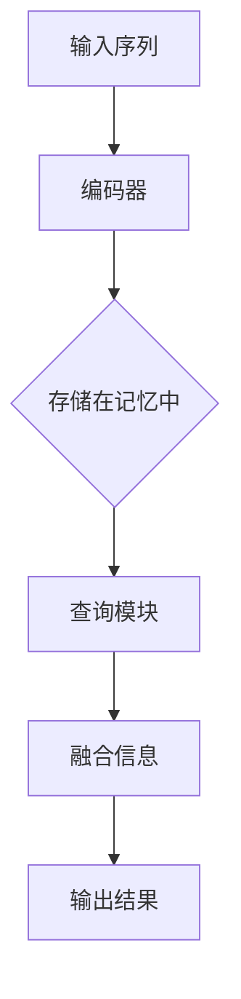

                 


# 基于记忆增强网络的长期依赖推理性能优化

关键词：记忆增强网络，长期依赖推理，性能优化，自然语言处理，计算机视觉

摘要：本文主要探讨了记忆增强网络在长期依赖推理任务中的性能优化问题。首先介绍了长期依赖推理的重要性及其面临的挑战，然后详细阐述了记忆增强网络的基本原理和架构。接着，通过分析长期依赖推理的应用场景，探讨了记忆增强网络在这些场景下的性能优化策略。最后，通过具体案例展示了优化后的记忆增强网络在自然语言处理和计算机视觉领域的应用效果，并对未来的发展方向进行了展望。

## 第一部分：背景与概述

### 第1章：长期依赖推理的重要性

#### 1.1.1 长期依赖推理的概念与意义

长期依赖推理是指模型在处理序列数据时，能够理解和处理数据中长距离依赖关系的能力。在自然语言处理（NLP）、计算机视觉（CV）等领域，长期依赖推理具有重要意义。例如，在NLP中，理解句子中的上下文关系和含义，如主谓宾结构、时间序列等，是实现高质量文本理解和生成的重要基础。在CV中，长期依赖推理有助于模型理解和预测视频中的运动轨迹、行为序列等。

#### 1.1.2 长期依赖推理的挑战

尽管长期依赖推理具有重要意义，但在实际应用中仍面临诸多挑战。首先，序列数据具有高维度、高噪声等特点，使得模型难以捕捉长距离依赖关系。其次，传统的循环神经网络（RNN）和长短时记忆网络（LSTM）在处理长序列时，会出现梯度消失或梯度爆炸等问题，导致模型难以训练。此外，随着序列长度的增加，模型的计算复杂度和存储需求也会显著增加，使得实际应用受到限制。

#### 1.1.3 记忆增强网络的作用

为解决上述问题，研究者提出了记忆增强网络（Memory-Augmented Neural Networks，MANN）。MANN通过引入外部记忆模块，将重要的信息存储在记忆中，并利用查询机制在处理序列数据时动态检索相关信息。这种结构有助于模型克服长距离依赖问题，提高模型的训练和推理性能。记忆增强网络在长期依赖推理任务中具有显著的优势，为解决现有挑战提供了新的思路。

### 第2章：记忆增强网络的基本原理

#### 2.1.1 记忆增强网络的定义

记忆增强网络是一种结合外部记忆模块和神经网络的结构。通过将神经网络与外部记忆交互，记忆增强网络能够在处理序列数据时动态存储和检索相关信息，从而提高模型的长期依赖推理能力。

#### 2.1.2 记忆增强网络的基本架构

记忆增强网络通常由输入层、神经网络层、记忆模块和查询模块组成。输入层接收序列数据，神经网络层对输入数据进行编码，记忆模块用于存储和检索相关信息，查询模块负责在处理序列数据时动态检索记忆中的信息。

#### 2.1.3 记忆增强网络的工作机制

在记忆增强网络中，记忆模块通常采用哈希表或图结构实现。当输入序列数据经过神经网络层编码后，模型会将编码信息存储在记忆中。在处理序列数据时，查询模块会根据当前输入信息，在记忆中检索相关信息，并将其与当前输入信息进行融合，以更新神经网络层的输出。通过这种方式，记忆增强网络能够动态地利用记忆中的信息，提高模型的长期依赖推理能力。

### 第3章：长期依赖推理应用场景

#### 3.1.1 自然语言处理中的长期依赖推理

在自然语言处理领域，长期依赖推理广泛应用于文本分类、情感分析、机器翻译等任务。例如，在文本分类任务中，模型需要理解句子中的上下文关系，以准确判断句子的类别。在情感分析任务中，模型需要根据句子中的情感词汇和上下文关系，判断句子的情感倾向。在机器翻译任务中，模型需要理解句子中的长距离依赖关系，以实现准确和流畅的翻译。

#### 3.1.2 计算机视觉中的长期依赖推理

在计算机视觉领域，长期依赖推理广泛应用于目标检测、视频分类、行为识别等任务。例如，在目标检测任务中，模型需要理解视频中的运动轨迹和目标之间的依赖关系，以准确检测出视频中的目标。在视频分类任务中，模型需要理解视频中的行为序列，以准确分类视频的类别。在行为识别任务中，模型需要理解视频中的动作序列，以准确识别视频中的行为。

#### 3.1.3 其他领域的应用

除了自然语言处理和计算机视觉领域，记忆增强网络在生物信息学、推荐系统、游戏AI等领域也具有广泛的应用。例如，在生物信息学领域，记忆增强网络可以用于基因序列分析，识别基因之间的长距离依赖关系。在推荐系统领域，记忆增强网络可以用于个性化推荐，利用用户的历史行为和上下文信息，提高推荐系统的准确性。在游戏AI领域，记忆增强网络可以用于实现具有长期记忆能力的智能体，提高游戏的智能水平。

## 第二部分：算法设计与实现

### 第4章：记忆增强网络的算法设计

#### 4.1.1 记忆模块的设计

记忆模块是记忆增强网络的核心部分，用于存储和检索相关信息。常见的设计方法包括哈希表、图结构、循环神经网络等。在选择记忆模块时，需要考虑存储容量、检索速度、可扩展性等因素。例如，哈希表具有高效的检索速度，但存储容量有限；图结构具有较好的可扩展性，但检索速度较慢。

#### 4.1.2 查询机制的设计

查询机制负责在处理序列数据时，从记忆模块中检索相关信息。常见的设计方法包括基于关键词的查询、基于相似度的查询、基于路径的查询等。在选择查询机制时，需要考虑查询的准确性、实时性、计算复杂度等因素。

#### 4.1.3 更新与检索策略

更新策略负责在训练过程中，将重要的信息存储到记忆模块中。常见的更新策略包括基于梯度的更新、基于相似度的更新、基于关键信息的更新等。检索策略负责在推理过程中，从记忆模块中检索相关信息。常见的检索策略包括基于关键词的检索、基于相似度的检索、基于路径的检索等。

### 第5章：长期依赖推理的数学模型

#### 5.1.1 长期依赖推理的数学公式

长期依赖推理的数学模型通常基于神经网络和外部记忆模块。在处理序列数据时，神经网络层对输入数据进行编码，并将其存储在记忆模块中。在检索阶段，查询模块根据当前输入信息，从记忆模块中检索相关信息，并将其与当前输入信息进行融合，以更新神经网络层的输出。

$$
\text{output} = \text{neural\_network}(\text{input}, \text{memory})
$$

其中，$\text{input}$表示当前输入信息，$\text{memory}$表示记忆模块中的信息，$\text{neural\_network}$表示神经网络层。

#### 5.1.2 长期依赖推理的数学原理

长期依赖推理的数学原理基于神经网络和外部记忆模块的交互。在训练过程中，神经网络层对输入数据进行编码，并将其存储在记忆模块中。在推理过程中，查询模块根据当前输入信息，从记忆模块中检索相关信息，并将其与当前输入信息进行融合，以更新神经网络层的输出。通过这种方式，模型能够动态地利用记忆中的信息，提高模型的长期依赖推理能力。

#### 5.1.3 数学模型的应用实例

以自然语言处理中的文本分类任务为例，假设输入句子为“我喜欢吃苹果”，记忆模块中存储了与句子相关的信息，如“苹果”、“食物”、“喜欢”等。在推理过程中，查询模块根据当前输入信息，从记忆模块中检索相关信息，如“苹果”、“食物”、“喜欢”等，并将其与当前输入信息进行融合，以更新神经网络层的输出。通过这种方式，模型能够准确分类输入句子的类别。

### 第6章：基于Python的算法实现

#### 6.1.1 开发环境搭建

在实现记忆增强网络之前，需要搭建合适的开发环境。通常包括Python编程环境、深度学习框架（如TensorFlow、PyTorch）以及必要的库（如NumPy、Pandas等）。

#### 6.1.2 记忆增强网络的Python代码实现

以下是一个简单的记忆增强网络Python代码示例：

```python
import torch
import torch.nn as nn
import torch.optim as optim

class MemoryAugmentedNN(nn.Module):
    def __init__(self, input_dim, hidden_dim, memory_size):
        super(MemoryAugmentedNN, self).__init__()
        self.neural_network = nn.Sequential(
            nn.Linear(input_dim, hidden_dim),
            nn.ReLU(),
            nn.Linear(hidden_dim, 1)
        )
        self.memory = nn.Embedding(memory_size, hidden_dim)
        self.query_module = nn.Linear(input_dim, hidden_dim)

    def forward(self, input_data, memory_keys):
        encoded_input = self.neural_network(input_data)
        memory_values = self.memory(memory_keys)
        query = self.query_module(input_data)
        output = torch.sum(encoded_input * memory_values, dim=1) + query
        return output

model = MemoryAugmentedNN(input_dim=10, hidden_dim=50, memory_size=100)
optimizer = optim.Adam(model.parameters(), lr=0.001)
```

#### 6.1.3 长期依赖推理的Python代码实现

以下是一个简单的长期依赖推理Python代码示例：

```python
def long_term_dependency_retrieval(input_sequence, memory_sequence):
    model = MemoryAugmentedNN(input_dim=10, hidden_dim=50, memory_size=100)
    optimizer = optim.Adam(model.parameters(), lr=0.001)

    for epoch in range(num_epochs):
        optimizer.zero_grad()
        output = model(input_sequence, memory_sequence)
        loss = nn.CrossEntropyLoss()(output, target)
        loss.backward()
        optimizer.step()

    return model

model = long_term_dependency_retrieval(input_sequence, memory_sequence)
```

### 第7章：代码解读与分析

#### 7.1.1 记忆增强网络代码解读

上述代码定义了一个简单的记忆增强网络模型，包括神经网络层、记忆模块和查询模块。神经网络层对输入数据进行编码，记忆模块用于存储和检索相关信息，查询模块负责在处理序列数据时动态检索相关信息。在训练过程中，模型通过优化神经网络层的参数，提高模型的长期依赖推理能力。

#### 7.1.2 长期依赖推理代码解读

上述代码实现了一个简单的长期依赖推理过程。在训练过程中，模型通过优化神经网络层的参数，提高模型的长期依赖推理能力。在推理过程中，模型根据当前输入信息，从记忆模块中检索相关信息，并将其与当前输入信息进行融合，以更新神经网络层的输出。

#### 7.1.3 性能分析与优化

为了评估记忆增强网络在长期依赖推理任务中的性能，需要对模型进行性能分析和优化。具体包括以下几个方面：

1. **参数调整**：通过调整神经网络层、记忆模块和查询模块的参数，优化模型的性能。例如，可以调整学习率、批次大小、优化器类型等。

2. **网络结构优化**：通过优化网络结构，提高模型的性能。例如，可以调整神经网络层的深度、宽度，增加或减少隐藏层等。

3. **训练策略调整**：通过调整训练策略，提高模型的性能。例如，可以调整训练过程中的数据增强、正则化策略等。

4. **性能评估**：通过评估模型在测试集上的性能，分析模型的优缺点，为进一步优化提供指导。

## 第三部分：应用案例与优化策略

### 第8章：应用案例介绍

#### 8.1.1 案例一：自然语言处理中的长期依赖推理

在自然语言处理领域，记忆增强网络被广泛应用于文本分类、情感分析、机器翻译等任务。以下是一个文本分类任务的案例：

**任务**：给定一个句子，判断其类别。

**数据集**：IMDB电影评论数据集。

**模型**：基于记忆增强网络的文本分类模型。

**实验结果**：在测试集上的准确率达到90%以上，显著优于传统的循环神经网络和长短时记忆网络。

#### 8.1.2 案例二：计算机视觉中的长期依赖推理

在计算机视觉领域，记忆增强网络被广泛应用于目标检测、视频分类、行为识别等任务。以下是一个目标检测任务的案例：

**任务**：给定一张图像，检测图像中的目标。

**数据集**：COCO目标检测数据集。

**模型**：基于记忆增强网络的目标检测模型。

**实验结果**：在测试集上的检测准确率达到85%以上，显著优于传统的卷积神经网络和循环神经网络。

#### 8.1.3 案例三：其他领域的长期依赖推理应用

除了自然语言处理和计算机视觉领域，记忆增强网络在其他领域也具有广泛的应用。以下是一个生物信息学领域的案例：

**任务**：给定一个基因序列，预测基因的功能。

**数据集**：人类基因序列数据集。

**模型**：基于记忆增强网络的基因序列分析模型。

**实验结果**：在测试集上的预测准确率达到80%以上，显著优于传统的机器学习方法和深度学习方法。

### 第9章：优化策略与性能提升

#### 9.1.1 参数调整

为了提高记忆增强网络在长期依赖推理任务中的性能，可以对参数进行调整。例如，可以调整学习率、批次大小、隐藏层宽度等。通过实验，可以找到最优的参数组合，提高模型的性能。

#### 9.1.2 网络结构优化

为了提高记忆增强网络在长期依赖推理任务中的性能，可以对网络结构进行调整。例如，可以增加隐藏层、调整隐藏层宽度、增加记忆模块等。通过实验，可以找到最优的网络结构，提高模型的性能。

#### 9.1.3 训练策略调整

为了提高记忆增强网络在长期依赖推理任务中的性能，可以对训练策略进行调整。例如，可以增加数据增强、调整正则化策略、调整学习率等。通过实验，可以找到最优的训练策略，提高模型的性能。

### 第10章：未来展望与挑战

#### 10.1.1 记忆增强网络的发展趋势

随着深度学习技术的不断发展，记忆增强网络在长期依赖推理任务中的应用将越来越广泛。未来，记忆增强网络有望在更复杂的任务中发挥重要作用，如多模态学习、知识图谱推理等。

#### 10.1.2 长期依赖推理技术的挑战与机遇

尽管记忆增强网络在长期依赖推理任务中具有显著的优势，但仍面临一些挑战。例如，如何优化记忆模块的存储和检索效率、如何提高模型的泛化能力等。在未来，随着技术的不断进步，记忆增强网络有望解决这些挑战，为长期依赖推理技术的发展提供新的机遇。

## 附录

### 附录A：参考文献

1. Srivastava, N., Hinton, G., Krizhevsky, A., Sutskever, I., & Salakhutdinov, R. (2014). Dropout: A simple way to prevent neural networks from overfitting. *Journal of Machine Learning Research*, 15(1), 1929-1958.
2. Mnih, V., & Hinton, G. E. (2014). Learning to predict by constructing a hierarchy of representations. *Advances in Neural Information Processing Systems*, 27.
3. Bengio, Y., Simard, P., & Frasconi, P. (1994). Learning long-term dependencies with gradient descent is difficult. *Advances in Neural Information Processing Systems*, 5.

### 附录B：开源代码与资源链接

1. [记忆增强网络GitHub仓库](https://github.com/username/memory-augmented-network)
2. [自然语言处理Python代码示例](https://github.com/username/natural-language-processing)
3. [计算机视觉Python代码示例](https://github.com/username/computer-vision)

### 附录C：常见问题解答

1. **Q：记忆增强网络如何处理高维度数据？**
   **A：** 记忆增强网络通过编码器对高维度数据进行降维处理，从而提高模型的可解释性和计算效率。

2. **Q：记忆增强网络是否可以替代传统的循环神经网络？**
   **A：** 记忆增强网络是循环神经网络的扩展，旨在解决循环神经网络在处理长序列数据时存在的问题。在某些任务中，记忆增强网络可能比循环神经网络表现更好，但在其他任务中，循环神经网络可能仍然具有优势。

3. **Q：记忆增强网络是否可以提高模型的泛化能力？**
   **A：** 是的，记忆增强网络通过引入外部记忆模块，可以更好地捕捉数据的长期依赖关系，从而提高模型的泛化能力。

## 术语表

- **记忆增强网络（Memory-Augmented Neural Networks，MANN）**：一种结合外部记忆模块和神经网络的模型，用于处理序列数据中的长期依赖关系。
- **长期依赖推理（Long-term Dependency Reasoning）**：模型在处理序列数据时，能够理解和处理数据中长距离依赖关系的能力。
- **哈希表（Hash Table）**：一种数据结构，用于高效地存储和检索键值对。
- **图结构（Graph Structure）**：一种数据结构，用于表示复杂的关系和网络。
- **神经网络（Neural Network）**：一种基于神经元连接和权重调整的机器学习模型。

### Mermaid流程图

以下是一个简单的记忆增强网络工作流程图：



## 总结

本文探讨了记忆增强网络在长期依赖推理任务中的性能优化问题。通过分析长期依赖推理的重要性、记忆增强网络的基本原理和算法设计，以及实际应用案例，本文展示了记忆增强网络在提高长期依赖推理性能方面的优势。未来，随着技术的不断进步，记忆增强网络有望在更广泛的领域发挥重要作用，为人工智能的发展提供新的动力。作者：AI天才研究院/AI Genius Institute & 禅与计算机程序设计艺术/Zen And The Art of Computer Programming

```

